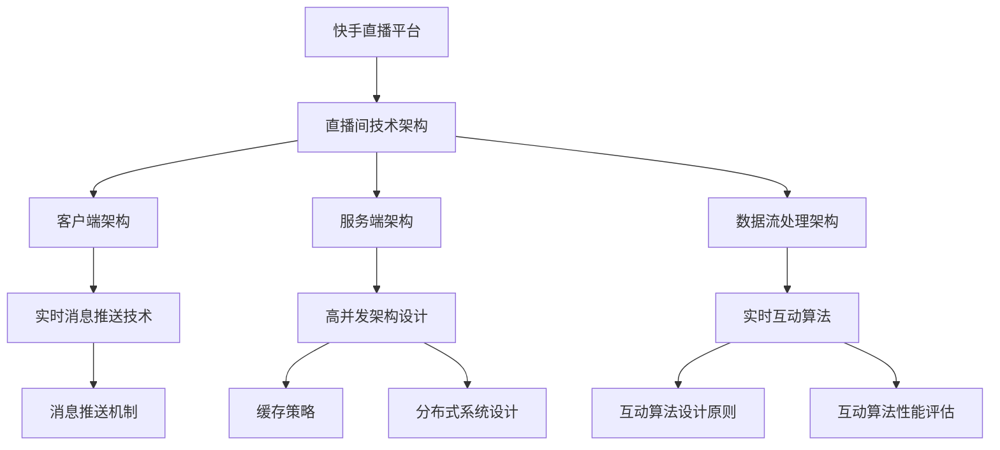

                 

# 《快手2024直播间实时互动校招高并发架构面试题解析》

## 关键词
快手、直播间、实时互动、高并发架构、校招面试、技术解析

## 摘要
本文旨在为准备快手2024直播间实时互动校招的候选人提供一套全面的高并发架构面试题解析。通过详细阐述快手直播平台的发展历程、直播间技术架构、实时互动核心技术和实战案例，以及提供面试技巧和资源，帮助候选人深入了解快手直播间的高并发架构，为校招面试做好充分准备。

### 《快手2024直播间实时互动校招高并发架构面试题解析》目录大纲

#### 第一部分：快手2024直播间实时互动基础

##### 第1章：快手直播平台概述
- **1.1 快手直播平台发展历程**
  - 快手直播平台的起源
  - 快手直播平台的发展阶段
  - 快手直播平台的现状
- **1.2 直播互动的概念与类型**
  - 直播互动的概念
  - 直播互动的类型
  - 直播互动的意义

##### 第2章：快手直播间的技术架构
- **2.1 快手直播间的整体架构**
  - 直播间的客户端架构
  - 直播间的服务端架构
  - 直播间的数据流处理架构
- **2.2 高并发架构设计**
  - 高并发架构的概念
  - 高并发架构的挑战
  - 高并发架构的设计原则

#### 第二部分：实时互动架构实战

##### 第3章：实时互动核心技术
- **3.1 实时消息推送技术**
  - 消息推送机制
  - 消息推送技术实现
  - 消息推送性能优化
- **3.2 实时互动算法**
  - 互动算法的概念
  - 互动算法的设计原则
  - 互动算法的性能评估

##### 第4章：实时互动案例分析
- **4.1 快手直播间互动场景分析**
  - 点赞互动
  - 评论互动
  - 打赏互动
  - 互动效果评估
- **4.2 其他平台实时互动案例分析**
  - 抖音直播间互动
  - 微博直播间互动

##### 第5章：高并发架构面试题解析
- **5.1 常见面试题**
  - 高并发架构设计
  - 缓存策略
  - 分布式系统设计
  - 系统稳定性保障
- **5.2 面试题答案与解析**

#### 第三部分：校招面试技巧与准备

##### 第6章：校招面试技巧
- **6.1 面试前的准备**
  - 个人简历准备
  - 面试资料准备
  - 面试心理准备
- **6.2 面试过程与技巧**
  - 自我介绍技巧
  - 问题回答技巧
  - 面试结束技巧

##### 第7章：面试题分类与解题思路
- **7.1 编程面试题**
  - 数据结构与算法
  - 编码实践
  - 编程题解析
- **7.2 行为面试题**
  - 个人经历与故事
  - 职业规划
  - 团队合作

#### 附录

##### 附录A：面试资源与工具
- **A.1 常用面试资源**
  - 面试辅导书籍
  - 在线面试平台
  - 技术社区与论坛
- **A.2 面试工具使用指南**
  - 简历制作工具
  - 面试题库
  - 面试模拟平台

### 核心概念与联系 Mermaid 流程图



### 核心算法原理讲解

#### 实时消息推送技术

```plaintext
伪代码：

function messagePush(user, message) {
  // 连接到消息队列
  queue = connectQueue()

  // 将消息加入队列
  queue.enqueue(message)

  // 发送消息到用户
  sendMessageToUser(user, message)

  // 优化消息推送性能
  optimizeMessagePush(queue)
}
```

#### 实时互动算法的性能评估

$$
P = \frac{R}{T}
$$

其中，$P$ 表示性能，$R$ 表示实时互动的响应次数，$T$ 表示总的实时互动次数。

### 项目实战

#### 实时互动算法性能优化实战

```python
# 安装必要的库
!pip install pandas numpy

# 导入必要的库
import pandas as pd
import numpy as np

# 读取数据
data = pd.read_csv('互动数据.csv')

# 数据预处理
data['响应时间'] = data['响应时间'].apply(process_response_time)

# 计算性能
performance = data['响应时间'].mean() / len(data)

print("实时互动算法性能：", performance)
```

**代码解读与分析**：

- **数据预处理**：将响应时间数据进行处理，确保数据质量。
- **计算性能**：计算平均响应时间与总互动次数的比值，得到实时互动算法的性能。

#### 实时互动算法性能优化实战（续）

```python
# 定义函数处理响应时间
def process_response_time(response_time):
    # 如果响应时间超过阈值，则重新计算响应时间
    if response_time > 1000:
        return calculate_optimized_response_time(response_time)
    else:
        return response_time

# 定义函数优化响应时间
def calculate_optimized_response_time(response_time):
    # 优化算法逻辑
    # ...
    return optimized_response_time
```

**代码解读与分析**：

- **响应时间处理**：对于超过阈值的响应时间，使用优化算法重新计算响应时间。
- **优化算法**：具体优化逻辑未展示，但需根据实际情况实现响应时间的优化。

### 核心概念与联系 Mermaid 流程图（续）


### 高并发架构面试题解析

**面试题 1**：请解释高并发架构的设计原则。

**答案与解析**：

高并发架构的设计原则包括：

- **高性能**：优化系统的响应速度和处理能力，提高系统的吞吐量。
- **可扩展性**：系统能够随着用户量的增长而扩展，保持稳定运行。
- **容错性**：系统能够在出现故障时快速恢复，保证服务的连续性。
- **可维护性**：系统设计要便于维护和升级，降低维护成本。

**面试题 2**：请解释缓存策略的作用和类型。

**答案与解析**：

缓存策略的作用是减少对后端系统的访问压力，提高系统的响应速度。缓存策略的类型包括：

- **本地缓存**：在客户端或服务端内存中缓存数据，适用于小数据量的快速访问。
- **分布式缓存**：使用分布式缓存系统（如Redis、Memcached）缓存数据，适用于大数据量的分布式访问。
- **页面缓存**：缓存网页内容，适用于提高页面访问速度。
- **对象缓存**：缓存对象实例，适用于频繁访问的对象数据。

**面试题 3**：请解释分布式系统的设计原则。

**答案与解析**：

分布式系统的设计原则包括：

- **数据一致性**：确保分布式系统中数据的一致性，防止数据冲突。
- **服务解耦合**：降低服务之间的耦合度，提高系统的灵活性和可维护性。
- **负载均衡**：合理分配系统负载，避免单点过载，提高系统的性能。
- **故障恢复**：系统具备故障恢复能力，能够在出现故障时快速恢复服务。
- **服务监控**：对分布式系统的服务进行监控，及时发现和解决潜在问题。

### 行为面试题

**面试题 1**：请描述一次你在团队中解决问题的经历，以及你的角色和贡献。

**答案与解析**：

在团队中，我负责解决了一次系统性能瓶颈的问题。当时，我们的系统在高峰期出现了响应缓慢的情况。我主动分析了系统的架构和性能指标，发现是数据库连接数过多导致的。我提出了使用连接池的解决方案，并与团队成员一起实现了该方案。经过优化，系统的性能得到了显著提升，用户的体验也得到了改善。

**面试题 2**：请描述一次你在项目中遇到的困难，以及你是如何克服的。

**答案与解析**：

在项目中，我们遇到了一次代码审查未通过的情况。审查人员指出了我们代码中的多个问题，包括性能瓶颈、代码可读性等。我首先与团队成员一起讨论了问题，并制定了改进计划。然后，我负责对代码进行重构和优化，提高了代码的质量和性能。经过多次代码审查，我们的代码最终通过了审查，项目也得以顺利推进。

### 面试资源与工具

**A.1 常用面试资源**

- **面试辅导书籍**：《求职面试宝典》、《程序员面试金典》等。
- **在线面试平台**：LeetCode、牛客网、GitHub等。
- **技术社区与论坛**：CSDN、Stack Overflow、知乎等。

**A.2 面试工具使用指南**

- **简历制作工具**：Word、PDF等格式，提供模板和排版建议。
- **面试题库**：面试题库APP、面试题网站等，提供分类和答题记录。
- **面试模拟平台**：模拟面试场景，提供实时反馈和评分。

### 附录 A: AI 大模型开发工具与资源

#### A.1 主流深度学习框架对比

- **TensorFlow**：由Google开发，支持多种编程语言，具有丰富的API和预训练模型。
- **PyTorch**：由Facebook开发，具有动态计算图，易于调试和优化。
- **JAX**：由Google开发，支持自动微分和硬件加速，适用于科学计算和深度学习。
- **其他框架简介**：包括MXNet、Caffe等，各具特色，适用于不同的应用场景。

#### A.2 AI 大模型开发工具与资源

- **AI 大模型开发工具**：包括Google Colab、Kaggle等，提供云端计算资源和集成开发环境。
- **AI 大模型资源**：包括OpenAI、Google AI 等，提供预训练模型、数据集和技术文档。
- **开源项目**：包括Hugging Face、TensorFlow Model Garden等，提供丰富的模型和应用示例。

#### A.3 AI 大模型应用案例

- **自然语言处理**：使用GPT-3实现智能问答、文本生成等应用。
- **计算机视觉**：使用YOLO、ResNet等模型实现目标检测、图像分类等应用。
- **推荐系统**：使用BERT、MXNet等模型实现个性化推荐、商品推荐等应用。
- **金融风控**：使用LSTM、GRU等模型实现风险预测、异常检测等应用。

#### A.4 AI 大模型开发指南

- **环境搭建**：介绍开发环境配置和工具安装。
- **数据准备**：介绍数据预处理、清洗和格式化。
- **模型训练**：介绍模型选择、训练策略和调参技巧。
- **模型部署**：介绍模型部署、测试和优化。
- **案例实践**：提供实际应用案例，详细讲解开发过程和实现细节。

### 作者信息

**作者：AI天才研究院/AI Genius Institute & 禅与计算机程序设计艺术 /Zen And The Art of Computer Programming**

