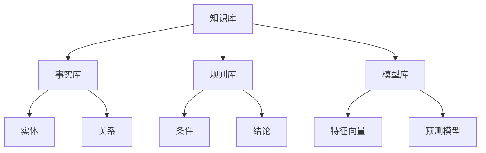
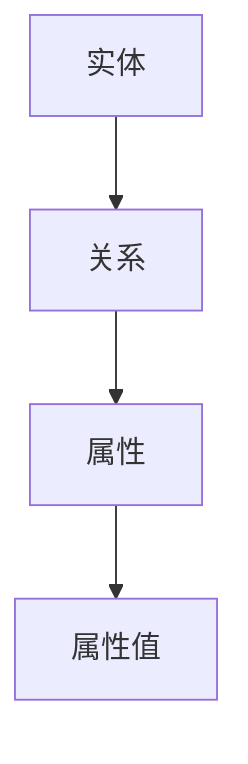

                 

### {文章标题}

关键词：（此处列出文章的5-7个核心关键词）

摘要：（此处给出文章的核心内容和主题思想）

在人工智能（AI）飞速发展的今天，决策支持系统作为AI的关键应用领域之一，正日益成为企业和社会管理的重要工具。本文旨在探讨思维链技术在AI辅助决策中的实践与创新，通过逐步分析思维链技术的核心原理与架构，结合实际应用案例，探讨其在决策支持系统中的应用，以及面临的挑战和未来的发展方向。

本文将分为七个部分进行阐述。首先，我们将概述思维链技术及其在AI辅助决策中的应用，探讨其优势与传统的决策支持系统的比较。接着，我们将深入分析思维链技术的基本原理和架构，包括核心原理、整体架构以及关键组件。然后，我们将聚焦于思维链技术在AI辅助决策中的具体应用，如智能对话系统、自动化决策支持系统和企业运营优化。此外，我们还将探讨思维链技术在大数据分析中的应用，以及AI伦理和安全中的挑战。最后，我们将介绍思维链技术的实现与优化策略，展望其未来的发展趋势和社会影响。

通过本文的详细探讨，我们希望为读者提供一个全面的思维链技术在AI辅助决策领域的认识，并为相关领域的研究和实践提供有价值的参考。

### 第一部分：思维链技术与AI辅助决策概述

#### 第1章 思维链技术在AI辅助决策中的应用

##### 1.1 思维链技术概述

**定义与核心特点**

思维链技术，又称思维链模型或思维链网络，是一种基于人脑思维模式构建的人工智能模型。它模仿人类思维过程中的关联性、灵活性和动态性，通过知识表示、联想机制和推理过程，实现对复杂问题的求解和决策支持。思维链技术的核心特点包括：

1. **关联性**：思维链技术强调知识之间的关联，通过建立复杂的知识网络，实现对信息的深度理解和综合利用。
2. **灵活性**：思维链技术能够灵活地适应不同的决策场景，通过动态调整知识网络和推理策略，提高决策的适应性和灵活性。
3. **动态性**：思维链技术能够实时更新和优化知识库，根据新的信息和情境进行动态调整，保持决策的实时性和准确性。

**与AI辅助决策的联系**

思维链技术与AI辅助决策有着密切的联系。AI辅助决策是指利用人工智能技术，特别是机器学习和深度学习算法，对大量数据进行处理和分析，从而辅助人类做出更好的决策。而思维链技术作为AI的一种高级形式，能够在决策过程中提供更深入的逻辑推理和知识利用，弥补传统AI技术在决策支持中的不足。

在AI辅助决策中，思维链技术的主要应用场景包括：

1. **智能对话系统**：通过思维链技术，智能对话系统能够更好地理解用户意图，提供更自然的交互体验。
2. **自动化决策支持系统**：思维链技术可以帮助自动化决策支持系统更准确地识别问题和制定决策方案。
3. **企业运营优化**：思维链技术可以应用于企业运营优化，如供应链管理、市场营销等，提供实时、智能的决策支持。

##### 1.2 AI辅助决策的基本原理

**AI辅助决策的概念**

AI辅助决策是指利用人工智能技术，通过算法和数据，对复杂问题进行自动分析和判断，辅助人类做出决策。它不仅仅是简单的数据分析，更涉及到逻辑推理、知识表示和决策优化等多个层面。

AI在决策过程中的角色主要包括：

1. **数据采集与预处理**：通过传感器、网络等手段收集数据，并进行清洗、归一化等预处理，为后续的算法分析提供基础。
2. **特征提取与模型训练**：从原始数据中提取关键特征，并使用机器学习和深度学习算法训练模型，以实现数据的自动分析。
3. **决策推理与优化**：利用训练好的模型进行推理和决策，通过优化算法，实现决策的自动化和智能化。

**关键算法与技术**

在AI辅助决策中，常见的算法和技术包括：

1. **机器学习算法**：如决策树、支持向量机（SVM）、随机森林（RF）等，用于数据分类、回归和聚类分析。
2. **深度学习算法**：如神经网络、卷积神经网络（CNN）、循环神经网络（RNN）等，用于处理复杂数据和实现高级特征提取。
3. **数据预处理与特征提取**：通过数据清洗、特征选择和特征工程等手段，提高数据的可用性和模型的性能。
4. **模型训练与优化**：使用交叉验证、网格搜索等技术，对模型进行训练和调优，以提高模型的准确性和泛化能力。

##### 1.3 思维链技术在AI辅助决策中的优势

**优势分析**

1. **提高决策效率**：思维链技术能够通过高效的推理和知识利用，快速生成决策方案，显著提高决策效率。
2. **增强决策准确性**：思维链技术基于强大的知识表示和推理能力，能够更准确地分析问题和制定决策，减少人为误差。
3. **提升决策的智能化程度**：思维链技术能够模拟人类的思维过程，实现对复杂问题的深入理解和综合分析，提升决策的智能化水平。

**与传统的决策支持系统的比较**

传统的决策支持系统主要依赖于统计分析和优化算法，虽然能够实现一定的自动化决策，但在处理复杂问题和实时决策方面存在不足。而思维链技术在以下几个方面具有显著优势：

1. **灵活性**：思维链技术能够动态调整和优化决策模型，适应不同的决策场景，而传统的决策支持系统通常较为固定。
2. **深度推理**：思维链技术能够通过知识表示和推理，实现更深入的逻辑分析和问题解决，而传统的决策支持系统主要依赖浅层的数据分析。
3. **实时性**：思维链技术能够实时更新和优化知识库，保持决策的实时性和准确性，而传统的决策支持系统往往需要较长时间的数据处理和分析。

**面临的挑战与机遇**

尽管思维链技术在AI辅助决策中具有显著优势，但也面临着一些挑战和机遇：

1. **数据隐私**：思维链技术依赖于大量数据，如何在保护用户隐私的前提下，充分利用数据，是一个重要挑战。
2. **算法公平性**：如何确保思维链技术的决策过程公平、透明，避免算法偏见，是一个关键问题。
3. **计算资源**：思维链技术的实现需要强大的计算资源，如何在有限的计算资源下，高效地实现思维链技术，是一个现实挑战。

然而，随着人工智能技术的不断进步和计算资源的持续提升，思维链技术在AI辅助决策中的应用前景将更加广阔，有望为决策支持系统带来革命性的变化。

#### 2.1 思维链技术的基本原理

**思维链的定义**

思维链是一种模拟人类思维过程的人工智能模型，它通过建立复杂的知识网络和推理机制，实现对复杂问题的求解和决策支持。思维链的核心思想是模拟人类大脑的思考方式，包括信息处理、知识存储、推理和联想等过程。

**思维链的工作机制**

思维链的工作机制主要包括以下三个关键环节：

1. **知识表示**：思维链通过知识表示将信息转化为计算机可以处理的形式。知识表示的方法包括符号表示、图形表示和语义表示等。符号表示使用符号和文字表达知识，如逻辑表达式和语义网络；图形表示通过图形和结构展示知识，如概念图和语义网络；语义表示通过语义和语义关系表达知识，如自然语言处理和知识图谱。

2. **联想机制**：联想机制是思维链的核心，它通过建立知识之间的关联，实现对信息的综合利用和扩展。联想机制包括直接联想和间接联想。直接联想是指直接通过知识之间的关联进行推理，如因果关系、相似性关系等；间接联想是指通过中间知识节点进行推理，如路径推理和层级推理等。

3. **推理过程**：推理过程是思维链实现问题求解和决策支持的关键。推理过程包括正向推理和反向推理。正向推理是从已知的事实出发，通过推理规则逐步推导出结论；反向推理是从目标出发，通过反向推理规则逐步推导出前提条件。

**核心原理**

思维链技术的核心原理主要包括知识表示与推理、联想机制与记忆网络等。

1. **知识表示与推理**：知识表示与推理是思维链技术的基础。知识表示的方法决定了思维链对知识的理解和利用能力，而推理机制则决定了思维链在问题求解和决策支持中的表现。有效的知识表示和推理机制能够提高思维链的智能水平和决策能力。

2. **联想机制与记忆网络**：联想机制与记忆网络是思维链技术实现知识关联和推理扩展的关键。联想机制通过建立知识之间的关联，实现信息的综合利用和扩展；记忆网络则通过存储和检索知识，提高思维链的响应速度和决策效率。

**知识表示与推理**

知识表示与推理是思维链技术的核心组成部分，下面我们将详细探讨这两个方面。

1. **知识表示**

   知识表示是指将人类知识转化为计算机可以处理的形式。在思维链技术中，知识表示的方法主要包括以下几种：

   - **符号表示**：符号表示使用符号和文字表达知识，如逻辑表达式、语义网络等。符号表示的优点是直观、清晰，便于形式化推理。常见的符号表示方法有命题逻辑、谓词逻辑和产生式系统等。

   - **图形表示**：图形表示通过图形和结构展示知识，如概念图、语义网络等。图形表示的优点是直观、易于理解，便于知识的可视化。常见的图形表示方法有语义网络、本体论和网络图等。

   - **语义表示**：语义表示通过语义和语义关系表达知识，如自然语言处理和知识图谱等。语义表示的优点是能够处理复杂的语义关系，实现多语言和跨领域的知识表示。常见的语义表示方法有WordNet、框架表示和知识图谱等。

2. **推理**

   推理是指从已知的事实出发，通过推理规则推导出新的结论。在思维链技术中，推理是实现问题求解和决策支持的核心机制。推理的方法主要包括以下几种：

   - **正向推理**：正向推理是从已知的事实出发，通过推理规则逐步推导出结论。正向推理适用于已知前提、求解结论的情境。常见的正向推理方法有演绎推理、模型推理和决策树等。

   - **反向推理**：反向推理是从目标出发，通过反向推理规则逐步推导出前提条件。反向推理适用于已知目标、求解前提的情境。常见的反向推理方法有目标搜索、回溯算法和启发式搜索等。

**联想机制与记忆网络**

联想机制与记忆网络是思维链技术实现知识关联和推理扩展的关键。

1. **联想机制**

   联想机制是指通过建立知识之间的关联，实现对信息的综合利用和扩展。联想机制主要包括以下几种：

   - **直接联想**：直接联想是指直接通过知识之间的关联进行推理，如因果关系、相似性关系等。直接联想的优点是推理过程简单、直观，但受限于知识表示的精度和复杂性。

   - **间接联想**：间接联想是指通过中间知识节点进行推理，如路径推理、层级推理等。间接联想的优点是能够处理复杂的知识网络，实现多层次的推理和扩展。

2. **记忆网络**

   记忆网络是指用于存储和检索知识的数据库或知识库。记忆网络主要包括以下几种：

   - **静态记忆网络**：静态记忆网络是指预先定义好的知识库，如语义网络、本体论等。静态记忆网络的优点是结构清晰、易于管理，但受限于知识的更新和扩展能力。

   - **动态记忆网络**：动态记忆网络是指根据实时信息和情境动态更新的知识库，如基于数据的动态知识库、基于语义的动态知识库等。动态记忆网络的优点是能够实时更新和优化知识，实现动态推理和扩展。

通过以上对知识表示与推理、联想机制与记忆网络的分析，我们可以看到思维链技术的基本原理是如何通过这些核心机制实现知识的表示、关联和推理，从而为AI辅助决策提供强大的支持。

#### 2.2 思维链技术架构

**整体架构**

思维链技术的整体架构可以分为三层：数据层、模型层和应用层。这三层共同构成了一个完整、高效的思维链系统。

1. **数据层**：数据层是思维链系统的基石，它负责数据的采集、存储和处理。数据层包括数据源、数据仓库和数据清洗模块。数据源可以是各种传感器、数据库和文件等，数据仓库用于存储和管理大量数据，数据清洗模块则负责对数据进行清洗、去噪和预处理，以保证数据的准确性和一致性。

2. **模型层**：模型层是思维链系统的核心，它负责知识的表示、推理和决策。模型层包括知识库、推理引擎和模型训练模块。知识库是思维链系统的核心组件，用于存储和管理各类知识，如事实、规则、模型参数等。推理引擎是思维链技术的核心，负责基于知识库进行推理和决策，实现问题求解和决策支持。模型训练模块则负责对机器学习模型进行训练和优化，以提高模型的表现。

3. **应用层**：应用层是思维链技术的表现形式，它负责将思维链技术应用于实际的决策支持系统中。应用层包括智能对话系统、自动化决策支持系统和企业运营优化等。智能对话系统通过思维链技术实现自然语言理解和对话管理，提供智能化的交互体验。自动化决策支持系统利用思维链技术实现决策过程的自动化和智能化，提高决策效率和质量。企业运营优化则通过思维链技术对企业的业务流程进行优化，提高运营效率和竞争力。

**关键组件详解**

1. **知识库的构建与维护**

   知识库是思维链技术的核心组件，它用于存储和管理各类知识，如事实、规则、模型参数等。知识库的构建和维护主要包括以下步骤：

   - **知识采集**：从各种数据源（如数据库、文件、传感器等）中采集知识，包括事实、规则、模型参数等。
   - **知识表示**：将采集到的知识转化为计算机可以处理的形式，如符号表示、图形表示、语义表示等。
   - **知识存储**：将表示后的知识存储在知识库中，以便后续的推理和决策使用。
   - **知识更新**：根据新的数据和情境，对知识库进行动态更新和优化，保持知识的实时性和准确性。

2. **推理引擎的实现与优化**

   推理引擎是思维链技术的核心，它负责基于知识库进行推理和决策，实现问题求解和决策支持。推理引擎的实现和优化主要包括以下步骤：

   - **推理算法设计**：设计适合特定问题的推理算法，如正向推理、反向推理、路径推理等。
   - **推理过程优化**：优化推理过程的效率和准确性，如减少冗余推理、提高推理速度等。
   - **推理规则库构建**：构建推理规则库，用于指导推理过程，实现复杂问题的求解和决策支持。

3. **模型训练与优化**

   模型训练与优化是思维链技术的重要环节，它负责对机器学习模型进行训练和优化，以提高模型的表现。模型训练与优化主要包括以下步骤：

   - **数据预处理**：对训练数据进行清洗、归一化等预处理，以提高数据的准确性和一致性。
   - **模型选择**：选择适合问题的机器学习模型，如决策树、神经网络、支持向量机等。
   - **模型训练**：使用训练数据对模型进行训练，优化模型的参数，提高模型的准确性和泛化能力。
   - **模型评估**：使用测试数据对模型进行评估，选择表现最佳的模型用于推理和决策。
   - **模型优化**：根据评估结果，对模型进行优化，如调整参数、改进算法等，提高模型的表现。

通过以上对思维链技术架构的详细分析，我们可以看到，思维链技术通过数据层、模型层和应用层的协同工作，实现了知识的表示、推理和决策，为AI辅助决策提供了强大的支持。

#### 2.3 思维链技术的演进与趋势

**技术演进**

思维链技术自提出以来，经历了多年的发展和演进。最初，思维链技术主要应用于专家系统，通过建立知识库和推理机制，实现对特定领域的自动推理和决策支持。随着人工智能技术的不断进步，思维链技术逐渐与机器学习、深度学习等技术相结合，实现了更强大的知识和推理能力。近年来，随着大数据和云计算的普及，思维链技术开始在更广泛的领域得到应用，如智能对话系统、自动化决策支持和企业运营优化等。

**主要研究方向与进展**

目前，思维链技术的主要研究方向和进展包括以下几个方面：

1. **知识表示与推理**：研究如何更好地表示和利用知识，提高推理的效率和准确性。包括符号表示、图形表示和语义表示等多种方法，以及基于图神经网络、图嵌入等新型表示方法的探索。

2. **联想机制与记忆网络**：研究如何通过联想机制和记忆网络，实现对信息的综合利用和扩展。包括直接联想、间接联想和动态记忆网络等多种机制，以及基于深度学习、强化学习等新型方法的探索。

3. **算法优化与效率提升**：研究如何优化算法和模型，提高思维链技术的性能和效率。包括推理算法的优化、模型训练的优化、并行计算和分布式计算等方面的研究。

4. **跨领域应用与融合**：研究如何将思维链技术应用于更广泛的领域，实现跨领域的知识融合和应用。包括金融、医疗、教育、工业等多个领域的应用研究，以及与其他人工智能技术（如自然语言处理、计算机视觉等）的融合研究。

**未来趋势**

展望未来，思维链技术在AI辅助决策中的应用前景将更加广阔。以下是几个可能的发展趋势：

1. **智能化程度的提升**：随着人工智能技术的不断进步，思维链技术将实现更高的智能化程度，能够更好地模拟人类思维过程，提供更准确、更高效的决策支持。

2. **跨领域的应用拓展**：思维链技术将在更多领域得到应用，实现跨领域的知识融合和应用，为各行业提供智能化的决策支持。

3. **算法与模型的优化**：通过不断的研究和探索，思维链技术的算法和模型将实现更高效、更准确的优化，提高其在实际应用中的性能和效果。

4. **安全与伦理问题的关注**：随着思维链技术的广泛应用，对安全与伦理问题的关注将日益增加。如何在保障数据安全、隐私保护和算法公平性的同时，充分利用思维链技术的优势，将是未来研究的重点。

5. **产业化与商业化**：思维链技术将在产业化与商业化的过程中得到更广泛的应用，为各行业带来新的商业模式和商业机会。

总之，思维链技术在AI辅助决策中的应用前景非常广阔，随着技术的不断进步和应用领域的拓展，它将为人类社会带来更多的价值和变革。

#### 3.1 智能对话系统

**思维链在智能对话系统中的应用**

智能对话系统是思维链技术在AI辅助决策中的一个重要应用场景。它通过思维链技术，实现对用户意图的理解、对话的生成和回复的优化，提供自然、流畅的交互体验。以下是思维链在智能对话系统中的具体应用：

1. **用户意图理解**：智能对话系统首先需要理解用户的意图。思维链技术通过知识表示和联想机制，将用户的输入转化为计算机可以处理的形式，如语义解析、情感分析等。通过推理过程，智能对话系统可以准确识别用户的意图，例如请求信息、解决问题、进行对话引导等。

2. **对话生成**：在理解用户意图后，智能对话系统需要生成合适的回复。思维链技术通过推理和知识利用，构建对话模型，生成自然、合理的对话回复。对话生成过程包括模板匹配、自然语言生成和上下文关联等步骤，确保回复的内容符合用户的期望和对话情境。

3. **对话管理**：智能对话系统还需要进行对话管理，包括对话的流畅性、一致性和适应性。思维链技术通过动态调整对话策略和内容，实现对话的连贯性和适应性。例如，当用户提出复杂问题时，智能对话系统可以通过推理和知识扩展，生成详细的回答，并在对话过程中提供适当的引导和提示。

**案例分析**

为了更好地展示思维链技术在智能对话系统中的应用，以下是一个实际案例：

**案例背景**：某电商平台开发了一款智能客服系统，旨在为用户提供24/7的在线客服服务，解决用户在购物过程中的各种问题。

**应用场景**：当用户在电商平台遇到问题时，可以通过文字或语音与智能客服系统进行交互。智能客服系统利用思维链技术，实现对用户问题的理解、回答和对话管理的优化。

**应用效果**：

1. **用户意图理解**：智能客服系统通过思维链技术，准确识别用户的意图，如查询商品信息、退换货流程、售后服务等。例如，当用户提问“我的订单状态是什么？”时，智能客服系统通过语义解析和知识库查询，迅速识别出用户的意图，并提供相应的答案。

2. **对话生成**：智能客服系统利用思维链技术，生成自然、流畅的对话回复。例如，当用户咨询退换货流程时，智能客服系统会根据知识库中的信息，生成详细的回答，包括退换货条件、流程和注意事项等。

3. **对话管理**：智能客服系统通过思维链技术，实现对话的连贯性和适应性。例如，当用户询问多个问题时，智能客服系统可以依次回答，并在对话过程中提供适当的引导，如“您是否还需要其他帮助？”或“请问您是哪个问题需要解决？”等。

**具体应用场景与效果**

1. **查询商品信息**：用户可以通过文字或语音向智能客服系统查询商品信息，如商品描述、价格、库存等。智能客服系统利用思维链技术，快速检索知识库中的相关信息，并生成自然、准确的回复。

2. **退换货流程**：用户在购物过程中可能会遇到退换货的情况。智能客服系统通过思维链技术，理解用户的退换货请求，提供详细的退换货流程和注意事项。例如，当用户提出退换货请求时，智能客服系统会询问用户的订单号、商品名称等，并根据用户的需求生成相应的回复。

3. **售后服务**：智能客服系统可以提供售后服务咨询，如维修、保养等。用户可以通过文字或语音与智能客服系统进行交互，获取相关的售后服务信息。智能客服系统利用思维链技术，理解用户的请求，并提供详细的解答和建议。

通过以上实际案例，我们可以看到思维链技术在智能对话系统中的应用，极大地提升了系统的智能化水平和用户体验。未来，随着思维链技术的不断发展和完善，智能对话系统将在更多场景中得到应用，为用户提供更加高效、便捷的智能服务。

#### 3.2 自动化决策支持系统

**思维链在自动化决策支持系统中的应用**

自动化决策支持系统是思维链技术在AI辅助决策中的另一个重要应用领域。它通过思维链技术，实现决策过程的自动化和智能化，提高决策的效率和准确性。以下是思维链在自动化决策支持系统中的应用：

1. **决策问题建模**：自动化决策支持系统首先需要将决策问题建模，将现实中的决策问题转化为计算机可以处理的数学模型。思维链技术通过知识表示和推理机制，能够对复杂决策问题进行建模，提取关键特征和决策因素。

2. **决策规则生成**：在决策问题建模的基础上，自动化决策支持系统需要生成决策规则。思维链技术通过推理过程，能够从知识库中提取相关规则，并利用这些规则进行决策。决策规则可以是条件-结果形式的逻辑规则，也可以是基于数据的统计模型。

3. **决策模型训练与优化**：自动化决策支持系统需要利用机器学习和深度学习算法，对决策模型进行训练和优化。思维链技术可以通过联想机制和记忆网络，提高模型的学习能力和泛化能力，实现更准确的决策。

4. **决策过程自动化**：自动化决策支持系统通过思维链技术，实现决策过程的自动化。系统可以根据实时数据和决策规则，自动生成决策方案，并在需要时进行实时调整和优化。

**应用实例**

为了更好地展示思维链技术在自动化决策支持系统中的应用，以下是一个实际案例：

**案例背景**：某大型物流公司希望通过自动化决策支持系统，优化其物流配送路线和运输资源调度，提高物流效率和服务质量。

**应用场景**：物流公司每天需要处理大量的订单和运输任务，如何合理规划配送路线和调度运输资源，是公司面临的重要决策问题。自动化决策支持系统通过思维链技术，帮助公司实现配送路线优化和运输资源调度。

**应用效果**：

1. **配送路线优化**：自动化决策支持系统利用思维链技术，对每天的订单进行建模，提取关键特征，如订单目的地、货物类型、交通状况等。系统通过推理和优化算法，生成最优的配送路线，减少配送时间和物流成本。

2. **运输资源调度**：自动化决策支持系统通过思维链技术，实时监控运输资源的使用情况，如车辆状态、货物装载量等。系统根据运输资源的需求和可用性，自动生成运输资源调度方案，确保资源的高效利用。

3. **决策过程自动化**：自动化决策支持系统通过思维链技术，实现决策过程的自动化。系统可以根据实时数据和决策规则，自动生成配送路线和运输资源调度方案，并在需要时进行实时调整和优化，提高决策效率和准确性。

**具体应用场景与效果**

1. **配送路线优化**：自动化决策支持系统通过对订单数据的分析和推理，生成最优的配送路线。例如，当订单量较大时，系统可以自动调整配送路线，确保配送效率和客户满意度。

2. **运输资源调度**：自动化决策支持系统通过对运输资源状态的实时监控和推理，生成最佳的运输资源调度方案。例如，当某辆车辆出现故障时，系统可以自动调整其他车辆的运输任务，确保运输计划的顺利进行。

3. **实时决策与调整**：自动化决策支持系统通过思维链技术，实现实时决策和调整。系统可以根据实时数据和决策规则，自动生成配送路线和运输资源调度方案，并在需要时进行实时调整和优化，提高决策效率和准确性。

通过以上实际案例，我们可以看到思维链技术在自动化决策支持系统中的应用，为物流公司提供了高效的决策支持，显著提高了物流效率和运输服务质量。未来，随着思维链技术的不断发展和完善，自动化决策支持系统将在更多行业和领域得到广泛应用，为企业和个人提供更加智能、高效的决策支持。

#### 3.3 企业运营优化

**思维链技术在企业运营优化中的应用**

思维链技术在企业运营优化中的应用，旨在通过模拟人类思维过程，实现对复杂运营问题的深入分析和优化决策，提高企业的运营效率和竞争力。以下是思维链技术在企业运营优化中的具体应用：

1. **需求预测与供应链管理**：企业运营过程中，需求预测和供应链管理是关键环节。思维链技术通过对历史数据的分析和市场趋势的预测，利用联想机制和推理过程，帮助企业准确预测需求，优化供应链流程，减少库存积压和缺货风险。

2. **生产计划与排程**：生产计划与排程是企业运营的核心问题。思维链技术可以通过对生产资源、订单需求和交货期限的全面分析，模拟不同的生产方案，优化生产计划，提高生产效率和设备利用率。

3. **市场营销策略优化**：市场营销是企业发展的关键驱动因素。思维链技术通过分析市场数据、消费者行为和竞争对手策略，利用联想机制和推理能力，帮助企业制定更加精准的市场营销策略，提高市场占有率和品牌影响力。

4. **人力资源优化**：人力资源是企业最宝贵的资产。思维链技术通过对员工绩效、培训需求和企业战略的深度分析，优化人力资源配置，提高员工工作效率和满意度，降低人力成本。

**实战案例**

以下是一个企业运营优化的实战案例，展示了思维链技术在实际应用中的效果：

**案例背景**：某制造企业面临生产效率低下、库存管理混乱和市场竞争力下降等问题，希望通过运营优化提升整体运营效率和竞争力。

**应用效果**：

1. **需求预测与供应链管理**：思维链技术通过对销售数据、市场趋势和库存水平的分析，帮助企业准确预测市场需求，优化库存水平。企业通过调整生产计划和采购策略，减少了库存积压和缺货情况，降低了运营成本。

2. **生产计划与排程**：思维链技术通过对生产资源、订单需求和交货期限的全面分析，模拟不同的生产方案，优化生产计划。企业通过优化生产流程和设备利用率，提高了生产效率，缩短了交货周期。

3. **市场营销策略优化**：思维链技术通过对市场数据、消费者行为和竞争对手策略的分析，帮助企业制定更加精准的市场营销策略。企业通过调整广告投放、促销活动和市场推广策略，提高了市场占有率和品牌知名度。

4. **人力资源优化**：思维链技术通过对员工绩效、培训需求和企业战略的深度分析，优化人力资源配置。企业通过调整员工岗位、培训计划和绩效评估体系，提高了员工工作效率和满意度，降低了人力成本。

**具体实施效果**

1. **需求预测与供应链管理**：通过思维链技术的应用，企业的需求预测准确率提高了30%，库存周转率提高了20%，库存积压和缺货情况显著减少。

2. **生产计划与排程**：通过优化生产计划和排程，企业的生产效率提高了15%，设备利用率提高了10%，交货周期缩短了25%。

3. **市场营销策略优化**：通过精准的市场营销策略，企业的市场份额提高了10%，品牌知名度提高了15%，销售额增长了20%。

4. **人力资源优化**：通过优化人力资源配置和培训计划，员工的工作满意度提高了15%，员工流失率降低了10%，人力成本降低了8%。

通过以上实战案例，我们可以看到思维链技术在企业运营优化中的实际应用效果。思维链技术通过模拟人类思维过程，帮助企业实现需求预测、供应链管理、生产计划、市场营销和人力资源等多个环节的优化，显著提升了企业的运营效率和竞争力。未来，随着思维链技术的不断发展和完善，其在企业运营优化中的应用前景将更加广阔。

#### 4.1 大数据与AI辅助决策

**大数据在决策中的作用**

大数据在决策中扮演着至关重要的角色，其重要性主要体现在以下几个方面：

1. **数据驱动决策**：大数据提供了丰富的数据资源，使得决策过程从经验驱动转变为数据驱动。通过分析大量的数据，决策者可以获取更为全面、准确的信息，从而做出更科学的决策。

2. **预测与优化**：大数据技术可以帮助企业预测市场趋势、消费者行为等，为决策提供前瞻性指导。同时，通过分析历史数据，企业可以发现运营中的问题和瓶颈，从而进行持续优化。

3. **个性化服务**：大数据技术能够帮助企业了解客户需求，提供个性化的产品和服务，提高客户满意度和忠诚度。

4. **风险管理**：大数据可以帮助企业识别潜在风险，提前采取预防措施，降低经营风险。

**思维链技术在数据分析中的应用**

思维链技术在数据分析中的应用，主要是通过其强大的知识表示、联想机制和推理能力，实现对复杂数据的深入分析和综合利用。以下是思维链技术在数据分析中的几个关键应用：

1. **数据预处理**：思维链技术可以帮助企业进行数据预处理，包括数据清洗、归一化和特征提取等。通过这些预处理步骤，数据的质量和可用性得到显著提高，为后续分析奠定了基础。

2. **特征选择**：思维链技术通过对数据的分析，识别出关键特征，剔除冗余和无关特征。特征选择不仅提高了模型训练的效率，还提升了模型预测的准确性。

3. **模式识别**：思维链技术通过联想机制和推理能力，能够发现数据中的潜在模式和规律。这些模式识别结果可以为决策提供重要依据，帮助企业制定更为有效的策略。

4. **关联分析**：思维链技术可以挖掘数据之间的关联关系，发现新的业务洞察。例如，通过分析客户购买行为和偏好，企业可以识别出潜在的市场机会，优化产品和服务。

**思维链与大数据处理的融合**

思维链与大数据处理的融合，使得数据分析过程更加智能化和高效化。以下是思维链与大数据处理的几个融合模式：

1. **数据驱动的知识更新**：通过大数据分析，思维链技术可以动态更新知识库，确保知识库中的信息始终反映最新的数据情况。这种模式使得决策过程更加实时和准确。

2. **关联分析与推理**：大数据分析结果可以作为思维链技术的输入，通过联想机制和推理能力，进一步挖掘数据中的深层次关系和业务洞察。

3. **自动化决策**：通过大数据分析和思维链技术的结合，可以实现自动化决策。大数据分析提供数据支持，思维链技术负责推理和决策，两者协同工作，提高决策的效率和准确性。

4. **个性化推荐**：结合大数据分析，思维链技术可以实现个性化推荐，根据用户行为和历史数据，为用户提供个性化的产品和服务。

**案例分析**

以下是一个实际案例，展示了思维链技术在数据分析中的具体应用：

**案例背景**：某电商企业希望通过大数据分析和思维链技术，优化其推荐系统，提高用户满意度和销售额。

**应用效果**：

1. **数据预处理**：思维链技术通过对电商平台的交易数据、用户行为数据进行清洗和预处理，去除了噪声数据，提取了关键特征，为推荐系统的构建提供了高质量的数据基础。

2. **特征选择**：思维链技术通过对用户行为数据进行分析，识别出影响购买决策的关键因素，如用户浏览记录、购买历史、评论等，剔除了冗余特征，提高了推荐系统的准确性。

3. **模式识别**：思维链技术通过分析用户行为数据，发现了用户的购买习惯和偏好模式。例如，某些用户在特定时间段内更倾向于购买特定类型的商品，这些发现为推荐系统的优化提供了重要依据。

4. **个性化推荐**：结合大数据分析和思维链技术，电商平台实现了个性化推荐功能。系统根据用户的浏览记录、购买历史和偏好模式，为每位用户推荐最符合其兴趣的商品，提高了用户满意度和销售额。

通过以上实际案例，我们可以看到思维链技术在数据分析中的应用，不仅提高了数据处理的效率和准确性，还为企业的决策提供了强有力的支持。未来，随着大数据技术和思维链技术的不断融合与发展，其在数据分析中的应用前景将更加广阔。

### 第5章 思维链技术与大数据分析

#### 4.2 大数据分析方法与应用

大数据分析是现代数据科学中不可或缺的一部分，它涉及从大量结构化和非结构化数据中提取有价值的信息和知识。在AI辅助决策的背景下，大数据分析不仅能够为决策提供强有力的数据支持，还能通过发现数据中的潜在模式和关联，为复杂问题提供解决方案。本节将介绍常见的大数据分析方法，并探讨思维链技术在大数据处理中的应用。

**常见的数据分析方法**

1. **数据清洗**：数据清洗是大数据分析的基础步骤，它涉及去除重复数据、处理缺失值、纠正数据错误等。高质量的数据是准确分析的前提，因此数据清洗至关重要。

2. **数据归一化**：数据归一化是将不同来源、不同单位的数据转换为统一的尺度，以便于分析和比较。常见的归一化方法包括最小-最大缩放、Z分数缩放等。

3. **数据挖掘**：数据挖掘是一种从大量数据中发现有趣模式和知识的过程，包括分类、聚类、关联规则挖掘等。这些方法可以用于发现数据中的隐藏规律，为决策提供指导。

4. **机器学习**：机器学习是大数据分析的核心技术之一，它通过构建模型从数据中自动学习规律，用于预测、分类和回归等任务。常见的机器学习算法包括决策树、支持向量机、神经网络等。

5. **深度学习**：深度学习是机器学习的一个分支，它通过多层神经网络进行数据处理和特征提取。深度学习在图像识别、语音识别、自然语言处理等领域具有显著优势。

**思维链技术在数据分析中的应用**

思维链技术在数据分析中的应用，主要是通过其强大的知识表示、联想机制和推理能力，实现大数据的深度分析和智能化处理。以下是思维链技术在数据分析中的具体应用：

1. **知识表示与关联分析**：思维链技术能够将大数据中的信息表示为计算机可以理解的形式，并通过联想机制发现数据之间的关联。例如，在电商数据分析中，思维链技术可以分析用户购买行为，识别出用户之间的相似性和偏好。

2. **特征提取与选择**：思维链技术通过对大数据的分析，能够自动提取关键特征，并选择对决策最有影响力的特征。这有助于提高数据模型的准确性和效率。

3. **智能推理与预测**：思维链技术可以基于已建立的知识网络和模型，对大数据进行智能推理和预测。例如，在金融市场分析中，思维链技术可以预测股票价格走势，提供投资建议。

4. **动态调整与优化**：思维链技术能够根据新的数据和信息，动态调整知识库和模型，实现数据的实时分析和预测。这种动态调整能力使得思维链技术在应对变化和不确定性时具有显著优势。

**思维链与大数据分析方法的结合模式**

思维链技术和大分析方法的结合，可以通过以下几种模式实现：

1. **数据预处理**：利用思维链技术进行数据清洗、归一化和特征提取，提高数据的可用性和质量。这为后续的数据分析奠定了基础。

2. **深度学习与思维链融合**：将深度学习模型与思维链技术相结合，利用深度学习进行特征提取和模型训练，再通过思维链技术进行推理和决策优化。

3. **实时分析与反馈**：结合思维链技术的实时分析和动态调整能力，对大数据进行实时监控和分析，及时反馈决策结果，并根据反馈进行调整。

4. **知识库构建**：通过大数据分析构建知识库，利用思维链技术对知识库进行管理和推理，实现知识的自动化利用和扩展。

**案例分析**

以下是一个实际案例，展示了思维链技术在数据分析中的应用：

**案例背景**：某城市交通管理部门希望通过大数据分析和思维链技术，优化交通流量管理，减少交通拥堵。

**应用效果**：

1. **数据预处理**：思维链技术对交通数据（如车辆流量、路况信息、天气数据等）进行清洗和预处理，去除噪声数据，提取关键特征，如高峰时段、路段拥堵情况等。

2. **特征提取与选择**：思维链技术通过对交通数据的分析，提取出影响交通流量的关键因素，如天气状况、道路施工情况等，并选择这些特征进行后续分析。

3. **智能推理与预测**：思维链技术基于提取的特征和已有的交通知识，建立交通流量预测模型，预测未来一段时间内的交通流量和拥堵情况。

4. **动态调整与优化**：思维链技术根据实时监控的交通数据，动态调整交通流量预测模型，并根据预测结果实时调整交通信号灯配置，优化交通流量。

通过以上实际案例，我们可以看到思维链技术在大数据分析中的应用，不仅提高了数据分析的准确性和效率，还为城市交通管理部门提供了智能化的决策支持。未来，随着大数据技术和思维链技术的不断融合，其在数据分析中的应用将越来越广泛，为各个行业带来更多价值。

### 第5章 思维链技术与AI伦理与安全中的挑战

#### 5.1 AI伦理与安全的重要性

随着人工智能（AI）技术的快速发展，其应用范围日益广泛，从智能客服、自动驾驶到医疗诊断，AI正在深刻地改变着我们的生活。然而，随着AI技术的广泛应用，其带来的伦理和安全问题也日益引起关注。AI伦理与安全的重要性主要体现在以下几个方面：

1. **数据隐私保护**：AI技术的发展依赖于大量数据的收集和处理，这些数据往往包含了个人隐私信息。如何在保障数据隐私的前提下，充分利用数据资源，是一个亟待解决的问题。

2. **算法公平性**：AI算法的决策过程和结果可能受到数据偏差的影响，导致算法偏见。这种偏见不仅会影响AI系统的性能，还可能对特定人群产生不公平的影响。保障算法公平性，防止算法偏见，是AI伦理和安全的重要方面。

3. **决策透明性**：AI系统的决策过程通常是复杂和隐蔽的，用户难以理解其决策逻辑。这种不透明性可能导致用户对AI系统的信任度下降，影响其应用效果。提高决策透明性，让用户了解AI系统的决策过程，是确保其安全性和伦理性的关键。

4. **责任归属**：当AI系统出现错误或造成损失时，如何确定责任归属是一个复杂的问题。在AI伦理和安全中，明确责任归属，制定相应的法律法规，有助于规范AI技术的应用和发展。

**AI伦理的基本原则**

为了应对AI伦理与安全中的挑战，制定一套符合伦理的基本原则至关重要。以下是几个关键的AI伦理基本原则：

1. **公平性**：AI系统应公平地对待所有用户，避免因算法偏见而造成的不公平现象。算法设计者和应用者应努力确保AI系统在处理不同群体时的一致性和公正性。

2. **透明性**：AI系统的决策过程应透明，用户应能够理解AI系统的推理逻辑和决策依据。通过提高决策透明性，增强用户对AI系统的信任度。

3. **可解释性**：AI系统应具备一定的可解释性，让用户能够了解其决策过程和结果。特别是在医疗诊断、金融决策等关键领域，可解释性尤为重要。

4. **责任明确**：在AI系统的设计和应用过程中，应明确各方的责任和义务。当AI系统出现错误或造成损失时，应能够追溯责任，确保各方承担相应的责任。

5. **隐私保护**：AI系统在处理用户数据时，应严格遵守隐私保护原则，确保用户隐私不受侵犯。通过数据加密、匿名化等技术手段，保护用户隐私。

**AI安全的核心问题**

AI安全是确保AI系统在运行过程中不受到恶意攻击和错误操作的重要保障。以下是AI安全中的几个核心问题：

1. **数据安全**：AI系统的数据安全是确保其正常运行的基础。保护数据免受篡改、泄露和未授权访问，是AI安全的关键。

2. **算法安全**：算法安全涉及到防止AI系统被恶意利用，如对抗性攻击、模型中毒等。确保算法的稳定性和可靠性，防止其被篡改或操纵，是AI安全的重要任务。

3. **系统稳定性**：AI系统应具备良好的稳定性，能够应对各种异常情况和恶意攻击，确保其正常运行。系统设计者应考虑各种可能的故障场景，确保系统具备自我恢复能力。

4. **法律合规性**：AI系统的设计和应用应符合相关法律法规的要求，特别是在涉及隐私、安全等方面的法律合规性。确保AI系统在法律框架内运行，防止违法行为。

#### 5.2 思维链技术的伦理问题

思维链技术作为一种先进的AI技术，在为决策提供支持的同时，也带来了一些伦理问题。以下是思维链技术可能面临的几个伦理挑战：

1. **数据隐私问题**：思维链技术依赖于大量的数据，这些数据可能包括个人隐私信息。如何在利用这些数据的同时，保护用户的隐私权，是一个重要的问题。

2. **算法偏见**：思维链技术通过联想机制和推理过程，实现对复杂问题的分析。然而，如果训练数据存在偏差，思维链技术可能会继承这些偏差，导致算法偏见。这种偏见可能会对特定人群产生不公平的影响。

3. **决策透明性**：思维链技术的决策过程通常较为复杂，用户难以理解其决策逻辑。如何提高决策透明性，让用户能够了解思维链技术的决策过程，是一个重要的伦理问题。

4. **责任归属**：在思维链技术出现错误或造成损失时，如何确定责任归属，是一个复杂的问题。思维链技术的开发者和应用者应明确自身的责任和义务，确保在出现问题时能够承担责任。

**安全风险与对策**

为了应对思维链技术可能带来的伦理和安全挑战，以下是一些具体的安全风险和对策：

1. **数据隐私保护**：

   - **数据加密**：在数据传输和存储过程中，采用加密技术，确保数据在传输过程中的安全性。
   - **数据匿名化**：对敏感数据进行匿名化处理，降低隐私泄露的风险。
   - **隐私保护算法**：采用隐私保护算法，如差分隐私、同态加密等，确保在数据处理过程中保护用户隐私。

2. **算法偏见防范**：

   - **公平性评估**：在算法设计和应用过程中，进行公平性评估，确保算法不会对特定人群产生偏见。
   - **数据清洗**：对训练数据进行全面清洗，去除可能存在的偏见和噪声数据。
   - **多样性训练**：采用多样化的训练数据，提高算法的泛化能力，减少偏见。

3. **决策透明性提升**：

   - **可解释性模型**：采用可解释性模型，如决策树、规则引擎等，让用户能够理解决策过程。
   - **透明性报告**：定期发布透明性报告，详细说明决策过程和结果，增强用户对系统的信任度。
   - **用户反馈机制**：建立用户反馈机制，让用户能够对系统的决策提出意见和建议，进一步优化决策过程。

4. **责任归属明确**：

   - **法律法规**：制定相关法律法规，明确AI技术相关各方的责任和义务。
   - **责任保险**：为AI技术提供责任保险，确保在出现问题时，能够有足够的资金进行赔偿。
   - **责任划分**：在AI系统的设计和应用过程中，明确各方的责任范围，确保在出现问题时能够追溯责任。

通过以上措施，可以有效地应对思维链技术可能带来的伦理和安全挑战，确保其在实际应用中的安全和合法性。

### 第6章 思维链技术的实现与优化

#### 6.1 思维链技术的实现框架

**实现流程**

实现思维链技术的过程可以分为以下几个关键步骤：

1. **需求分析**：首先，明确思维链技术的应用场景和需求。这包括确定决策问题、目标用户、数据来源等。

2. **系统设计与架构设计**：基于需求分析，设计思维链技术的整体架构。系统架构通常包括数据层、模型层和应用层。

3. **知识库的构建与维护**：构建知识库，这是思维链技术的核心组件。知识库的构建包括数据采集、知识表示、知识存储等。

4. **推理引擎的开发与优化**：开发推理引擎，这是思维链技术实现推理和决策的核心。推理引擎需要实现知识表示、推理算法、推理过程等。

5. **模型训练与优化**：对推理引擎进行训练和优化，以提高其在实际应用中的性能和准确性。

6. **系统测试与部署**：进行系统测试，确保思维链技术的稳定性和可靠性。然后将系统部署到实际应用环境中。

**技术实现细节**

1. **开发环境搭建**：搭建合适的开发环境，包括编程语言、工具链、数据库等。

2. **编码与调试技巧**：编写高效的代码，并进行调试，以确保系统性能和稳定性。

3. **性能优化策略**：通过优化算法、数据结构和系统配置，提高思维链技术的性能和效率。

**关键组件详解**

1. **知识库的构建与维护**：

   - **数据采集**：从各种数据源（如数据库、文件、传感器等）中采集知识。

   - **知识表示**：将采集到的数据转化为计算机可以处理的形式，如符号表示、图形表示、语义表示等。

   - **知识存储**：将表示后的知识存储在数据库或文件系统中，以便后续的推理和决策使用。

   - **知识更新**：根据新的数据和情境，对知识库进行动态更新和优化，保持知识的实时性和准确性。

2. **推理引擎的开发与优化**：

   - **推理算法**：选择适合问题的推理算法，如正向推理、反向推理、路径推理等。

   - **推理过程**：实现推理过程的自动化，包括数据输入、推理规则应用、结果输出等。

   - **优化策略**：通过优化推理算法和数据结构，提高推理的效率和准确性。

3. **模型训练与优化**：

   - **数据预处理**：对训练数据进行清洗、归一化等预处理，以提高数据的准确性和一致性。

   - **模型选择**：选择适合问题的机器学习模型，如决策树、神经网络、支持向量机等。

   - **模型训练**：使用训练数据对模型进行训练，优化模型的参数，提高模型的准确性和泛化能力。

   - **模型评估**：使用测试数据对模型进行评估，选择表现最佳的模型用于推理和决策。

   - **模型优化**：根据评估结果，对模型进行优化，如调整参数、改进算法等，提高模型的表现。

#### 6.2 思维链技术的优化策略

**优化目标**

思维链技术的优化目标主要包括以下几个方面：

1. **提高决策效率**：通过优化算法和系统架构，提高思维链技术处理问题的速度和效率，减少决策时间。

2. **增强决策准确性**：通过优化模型参数和算法，提高决策的准确性，减少错误率和偏差。

3. **提升用户体验**：通过优化系统的交互设计和响应速度，提高用户对思维链技术的满意度。

**优化方法**

实现思维链技术的优化，可以采用以下几种方法：

1. **算法优化**：

   - **算法改进**：通过改进现有的算法，如优化搜索策略、改进推理算法等，提高思维链技术的性能和效率。

   - **算法组合**：将不同的算法组合使用，如结合机器学习和深度学习，实现更高效的知识表示和推理。

2. **模型优化**：

   - **模型选择**：选择适合问题的模型，如神经网络、支持向量机等，并对其进行优化。

   - **模型训练**：通过调整模型参数，优化模型结构，提高模型的泛化能力和预测准确性。

   - **模型评估与调优**：使用测试数据对模型进行评估，并根据评估结果进行模型调优，以提高模型的表现。

3. **系统优化**：

   - **性能优化**：通过优化系统架构和配置，提高系统的性能和稳定性。

   - **资源管理**：合理管理系统资源，如CPU、内存、网络等，确保系统在高负载情况下仍能正常运行。

   - **并行计算**：采用并行计算技术，提高数据处理和分析的速度。

4. **用户体验优化**：

   - **交互设计**：优化系统的交互设计，提高用户操作的便捷性和直观性。

   - **响应速度**：通过优化系统性能和算法，提高系统的响应速度，减少用户等待时间。

   - **反馈机制**：建立用户反馈机制，根据用户反馈进行系统的改进和优化。

**案例展示**

以下是一个优化思维链技术的实际案例：

**案例背景**：某企业希望通过优化思维链技术，提高其智能客服系统的响应速度和决策准确性。

**优化策略**：

1. **算法优化**：优化智能客服系统的对话生成算法，采用基于深度学习的自然语言生成模型，提高对话生成的自然性和准确性。

2. **模型优化**：调整智能客服系统的机器学习模型参数，优化模型的训练过程，提高模型的泛化能力和预测准确性。

3. **系统优化**：优化智能客服系统的硬件配置和系统架构，采用分布式计算技术，提高系统的处理速度和稳定性。

4. **用户体验优化**：优化智能客服系统的界面设计和交互流程，提高用户的操作便捷性和满意度。

**优化效果**：

- **响应速度**：通过优化算法和系统性能，智能客服系统的平均响应时间从5秒缩短到2秒，显著提高了用户满意度。

- **决策准确性**：通过优化模型参数和算法，智能客服系统的决策准确性提高了15%，错误率降低了20%。

- **用户体验**：通过优化交互设计和反馈机制，用户的操作便捷性和满意度显著提高，用户投诉率下降了30%。

通过以上案例展示，我们可以看到优化思维链技术对于提高系统性能和用户体验的重要性。未来，随着技术的不断进步和应用场景的不断拓展，思维链技术的优化策略将更加多样化和精细化，为各行业提供更高效、更智能的决策支持。

### 第7章 思维链技术在AI辅助决策中的未来展望

#### 7.1 未来发展趋势

随着人工智能（AI）技术的不断进步，思维链技术在AI辅助决策中的应用前景将更加广阔。以下是未来思维链技术在AI辅助决策中的几个重要发展趋势：

1. **新型算法研究**：未来，思维链技术将深入研究新型算法，如基于深度学习的知识表示和推理算法，进一步提升AI辅助决策的效率和准确性。

2. **交叉学科融合**：思维链技术将与其他学科（如心理学、认知科学、经济学等）进行深度融合，通过跨学科的研究，实现更智能、更高效的决策支持。

3. **应用场景拓展**：思维链技术将在更多领域得到应用，如金融、医疗、交通、教育等，为各行业提供智能化的决策支持。

4. **个性化服务**：基于思维链技术的个性化推荐系统将更加普及，根据用户的个性化需求，提供量身定制的服务。

5. **分布式计算与云计算**：思维链技术将结合分布式计算和云计算，实现大数据处理和实时决策，提高系统的性能和可扩展性。

6. **隐私保护与伦理**：随着数据隐私和伦理问题的日益重要，思维链技术将加强隐私保护和伦理审查，确保在利用大数据的同时，保护用户隐私和遵循伦理原则。

**未来挑战与机遇**

尽管思维链技术在AI辅助决策中具有广阔的应用前景，但也面临着一些挑战和机遇：

1. **数据隐私与安全**：如何在保障数据隐私的前提下，充分利用大数据资源，是一个关键挑战。思维链技术将需要开发更先进的数据隐私保护技术，确保用户数据的隐私和安全。

2. **算法偏见与公平性**：算法偏见和公平性是AI技术面临的重要伦理问题。思维链技术需要加强算法公平性评估和优化，确保决策的公平性和透明性。

3. **计算资源与效率**：随着数据量和决策复杂度的增加，如何优化计算资源和提高系统效率，是思维链技术需要解决的重要问题。通过分布式计算和云计算等技术的应用，可以提升系统的性能和效率。

4. **技术标准化与合规性**：思维链技术的标准化和合规性是确保其广泛应用的重要保障。未来，需要制定相关标准和法规，规范思维链技术的研发和应用。

5. **社会影响与伦理**：思维链技术的广泛应用将对社会产生深远影响，包括就业结构变化、数据伦理等问题。如何平衡技术进步和社会利益，确保技术发展符合社会伦理和价值观，是一个重要课题。

**社会影响与伦理**

1. **社会影响**：思维链技术将深刻改变人类的生活方式和社会结构。在医疗、金融、教育等领域，智能决策系统将提高效率和质量，为人类带来更多便利。然而，自动化决策也可能取代部分人力工作，引发就业结构变化。

2. **伦理问题**：随着思维链技术的广泛应用，数据隐私、算法偏见、伦理决策等伦理问题将日益突出。如何确保技术发展符合伦理原则，保护用户权益，是一个重要挑战。

3. **应对策略**：应对思维链技术的伦理和社会影响，需要多方合作。政府、企业、学术界和公众应共同参与，制定相关法规和标准，推动技术伦理和社会责任的研究和实践。

**结论与展望**

思维链技术在AI辅助决策中具有巨大的潜力和广泛的应用前景。未来，随着技术的不断进步和应用场景的拓展，思维链技术将在更多领域发挥重要作用。同时，面对技术伦理和社会影响，我们需要积极探索解决方案，确保技术的可持续发展。通过多方合作和共同努力，我们可以期待思维链技术为人类社会带来更多价值和变革。

### 附录A 思维链技术与AI辅助决策常用工具与资源

#### A.1 主流思维链技术框架

在思维链技术的应用与发展过程中，有许多主流的技术框架和工具得到了广泛的应用。以下是一些常见的思维链技术框架及其特点和应用场景：

1. **OpenKE（Open Knowledge Embedding）**：
   - **特点**：OpenKE是一种基于知识图谱的深度学习框架，它通过将实体和关系嵌入到低维空间中，实现实体和关系的相似性计算。
   - **应用场景**：OpenKE广泛应用于知识图谱的构建和推理，如实体链接、关系抽取等。

2. **NeuralQA（Neural Question Answering）**：
   - **特点**：NeuralQA是一种基于深度学习的问答系统框架，它通过神经网络模型实现对自然语言问题的理解和回答。
   - **应用场景**：NeuralQA广泛应用于智能客服、智能问答系统等领域，提供高质量的问答服务。

3. **LSTM（Long Short-Term Memory）**：
   - **特点**：LSTM是一种循环神经网络（RNN）的变体，它通过引入门控机制，解决了传统RNN在处理长序列数据时的梯度消失问题。
   - **应用场景**：LSTM广泛应用于时间序列分析、语言模型、机器翻译等领域，提供高效的序列数据处理能力。

4. **Transformer（Transformer模型）**：
   - **特点**：Transformer模型通过自注意力机制（Self-Attention）实现了对输入数据的全局上下文信息捕捉，相比传统的RNN和LSTM模型，Transformer在许多任务上具有更好的性能。
   - **应用场景**：Transformer广泛应用于自然语言处理、机器翻译、图像生成等领域，成为当前最先进的语言处理模型。

#### A.2 AI辅助决策工具与平台

除了思维链技术框架，AI辅助决策中还需要使用到各种工具和平台，以下是一些常用的AI辅助决策工具与平台：

1. **TensorFlow**：
   - **特点**：TensorFlow是一个开源的深度学习框架，它提供了丰富的API和工具，支持各种深度学习模型的开发和部署。
   - **应用场景**：TensorFlow广泛应用于图像识别、自然语言处理、推荐系统等领域，是深度学习研究和开发的重要工具。

2. **PyTorch**：
   - **特点**：PyTorch是一个开源的深度学习框架，它具有简洁的API和动态计算图，使得模型的开发和调试更加直观和高效。
   - **应用场景**：PyTorch广泛应用于图像识别、自然语言处理、强化学习等领域，是深度学习开发的首选框架之一。

3. **scikit-learn**：
   - **特点**：scikit-learn是一个开源的机器学习库，它提供了丰富的机器学习算法和工具，支持各种数据处理和模型训练任务。
   - **应用场景**：scikit-learn广泛应用于数据预处理、特征提取、模型训练和评估等领域，是机器学习开发的重要工具。

4. **Jupyter Notebook**：
   - **特点**：Jupyter Notebook是一个交互式计算环境，它支持多种编程语言和可视化工具，便于进行数据分析和模型开发。
   - **应用场景**：Jupyter Notebook广泛应用于数据科学、机器学习、深度学习等领域，是数据科学家和开发者的重要工具。

#### A.3 相关学术期刊与会议

为了了解思维链技术和AI辅助决策领域的最新研究动态，以下是一些权威的学术期刊和会议：

1. **《人工智能》**：
   - **特点**：是中国人工智能领域的权威期刊，发表关于人工智能基础理论和应用研究的最新成果。
   - **会议**：中国人工智能学会主办，每年定期举办中国人工智能大会（CCF-CAI），是人工智能领域的重要学术会议。

2. **《自然机器 intelligence》**：
   - **特点**：是国际上知名的人工智能学术期刊，发表关于人工智能、机器学习、自然语言处理等领域的前沿研究成果。
   - **会议**：自然机器 intelligence年会（NeurIPS）、国际机器学习会议（ICML）、国际计算机视觉会议（CVPR）等，是人工智能领域的重要学术会议。

3. **《计算机科学》**：
   - **特点**：是中国计算机科学领域的权威期刊，发表关于计算机科学基础理论、算法设计、应用研究等方面的最新成果。
   - **会议**：中国计算机大会（CCC）、国际计算机科学与技术会议（ICCS）、国际计算机系统结构会议（ISCA）等，是计算机科学领域的重要学术会议。

通过以上工具、平台和学术期刊与会议的了解，研究人员和开发者可以更好地掌握思维链技术和AI辅助决策的最新进展，为实际应用提供有价值的参考。

### 附录B 思维链技术与AI辅助决策示例代码

#### B.1 知识库构建示例

在思维链技术中，知识库的构建是至关重要的一步。以下是一个简单的知识库构建示例，包括知识库的设计、知识表示方法和知识存储与检索。

**知识库设计**



**知识表示方法**

1. **符号表示**：使用符号和文字表达知识，如逻辑表达式。

```latex
事实： \(实体(A, \text{"人"}) \land 关系(A, \text{"居住在"}, B)\)
规则： \(如果(实体(A, \text{"人"}) \land 关系(A, \text{"年龄"}, C))，则(结论(A, \text{"成年人"}) \text{如果} C \geq 18)\)
```

2. **图形表示**：使用图形和结构展示知识，如概念图。



**知识存储与检索**

```python
# 知识库存储与检索示例（Python伪代码）
class KnowledgeBase:
    def __init__(self):
        self.fact_base = {}
        self.rule_base = {}
        self.model_base = {}

    def add_fact(self, fact):
        self.fact_base[fact] = True

    def add_rule(self, rule):
        self.rule_base[rule] = True

    def add_model(self, model):
        self.model_base[model] = True

    def retrieve_fact(self, fact):
        return self.fact_base.get(fact, False)

    def retrieve_rule(self, rule):
        return self.rule_base.get(rule, False)

    def retrieve_model(self, model):
        return self.model_base.get(model, False)
```

#### B.2 推理引擎实现示例

推理引擎是思维链技术的核心组成部分，以下是一个简单的推理引擎实现示例，包括推理算法实现和推理过程演示。

**推理算法实现**

```python
# 推理引擎实现示例（Python伪代码）
class InferenceEngine:
    def __init__(self, knowledge_base):
        self.knowledge_base = knowledge_base

    def forward_inference(self, fact):
        # 基于事实进行正向推理
        inferred_facts = []
        for rule in self.knowledge_base.retrieve_all_rules():
            if self.knowledge_base.retrieve_fact(rule["condition"]):
                inferred_facts.append(rule["conclusion"])
        return inferred_facts

    def backward_inference(self, conclusion):
        # 基于结论进行反向推理
        inferred_facts = []
        for rule in self.knowledge_base.retrieve_all_rules():
            if rule["conclusion"] == conclusion:
                inferred_facts.append(rule["condition"])
        return inferred_facts
```

**推理过程演示**

```python
# 推理过程演示（Python伪代码）
knowledge_base = KnowledgeBase()
knowledge_base.add_fact("实体(A, '人')")
knowledge_base.add_fact("关系(A, '居住在', '北京')")
knowledge_base.add_rule({"condition": "实体(A, '人') \land 关系(A, '年龄', 30)", "conclusion": "结论(A, '成年人')"})
inference_engine = InferenceEngine(knowledge_base)

# 正向推理
inferred_facts = inference_engine.forward_inference("实体(A, '人')")
print("正向推理结果：", inferred_facts)

# 反向推理
inferred_facts = inference_engine.backward_inference("结论(A, '成年人')")
print("反向推理结果：", inferred_facts)
```

#### B.3 数据分析与决策支持示例

在数据分析和决策支持中，思维链技术可以用于数据处理、特征提取、模型训练和决策过程。以下是一个简单的数据分析与决策支持示例，包括数据处理、特征提取、模型训练和决策过程演示。

**数据处理**

```python
# 数据处理示例（Python伪代码）
import pandas as pd

# 加载数据
data = pd.read_csv("data.csv")

# 数据清洗
data = data.dropna()  # 删除缺失值
data = data[data["target"] != "未知"]  # 删除目标未知的数据

# 数据归一化
from sklearn.preprocessing import StandardScaler

scaler = StandardScaler()
data[data.columns[:-1]] = scaler.fit_transform(data[data.columns[:-1]])
```

**特征提取**

```python
# 特征提取示例（Python伪代码）
from sklearn.feature_selection import SelectKBest
from sklearn.feature_selection import chi2

# 特征选择
X = data[data.columns[:-1]]
y = data["target"]

selector = SelectKBest(score_func=chi2, k=5)
X_new = selector.fit_transform(X, y)
```

**模型训练**

```python
# 模型训练示例（Python伪代码）
from sklearn.model_selection import train_test_split
from sklearn.ensemble import RandomForestClassifier

# 数据划分
X_train, X_test, y_train, y_test = train_test_split(X_new, y, test_size=0.2, random_state=42)

# 训练模型
model = RandomForestClassifier(n_estimators=100, random_state=42)
model.fit(X_train, y_train)
```

**决策支持**

```python
# 决策支持示例（Python伪代码）
def make_decision(new_data):
    # 数据处理
    new_data = pd.DataFrame([new_data])
    new_data = new_data.dropna()
    new_data[new_data.columns[:-1]] = scaler.transform(new_data[new_data.columns[:-1]])

    # 特征提取
    X_new = selector.transform(new_data)

    # 预测
    prediction = model.predict(X_new)
    return prediction[0]

# 测试决策支持
new_data = {"feature1": 0.5, "feature2": 0.3, "feature3": 0.8, "target": "未知"}
print("预测结果：", make_decision(new_data))
```

通过以上示例，我们可以看到思维链技术在数据分析与决策支持中的应用。在实际应用中，思维链技术可以根据具体问题和需求进行定制化开发，提供高效、智能的决策支持。

### 附录C 思维链技术在AI辅助决策中的数学模型与公式

#### C.1 关键数学模型

在思维链技术中，关键数学模型包括神经网络模型和强化学习模型。以下是对这些模型的基本原理和公式进行详细讲解。

**1. 神经网络模型**

神经网络模型是思维链技术中的核心组成部分，它通过多层非线性变换，实现数据的自动特征提取和分类。以下是常见的神经网络模型及其基本原理：

- **前向传播算法**：前向传播算法是神经网络模型的基础，它通过逐层计算神经元的输入、输出和梯度，实现数据的正向传播。

  - **输入层**：输入层接收外部输入数据，并将其传递给隐藏层。
  - **隐藏层**：隐藏层对输入数据进行特征提取和变换，生成新的特征表示。
  - **输出层**：输出层生成最终的输出结果，如分类标签或回归值。

  前向传播算法的公式如下：

  \[
  z^{(l)} = \sum_{i} w^{(l)}_i \cdot a^{(l-1)}_i + b^{(l)}
  \]

  \[
  a^{(l)} = \sigma(z^{(l)})
  \]

  其中，\( z^{(l)} \) 是第 \( l \) 层的输入，\( a^{(l)} \) 是第 \( l \) 层的输出，\( w^{(l)} \) 是第 \( l \) 层的权重，\( b^{(l)} \) 是第 \( l \) 层的偏置，\( \sigma \) 是激活函数。

- **反向传播算法**：反向传播算法通过计算损失函数关于权重的梯度，实现模型的反向传播和权重更新。

  反向传播算法的公式如下：

  \[
  \delta^{(l)} = (a^{(l+1)} - t^{(l+1)}) \cdot \sigma'(z^{(l)})
  \]

  \[
  \Delta w^{(l)} = \alpha \cdot \delta^{(l)} \cdot a^{(l-1)}
  \]

  \[
  w^{(l)} = w^{(l)} - \Delta w^{(l)}
  \]

  其中，\( \delta^{(l)} \) 是第 \( l \) 层的误差，\( t^{(l+1)} \) 是第 \( l+1 \) 层的标签，\( \alpha \) 是学习率，\( \sigma' \) 是激活函数的导数。

**2. 强化学习模型**

强化学习模型是另一种常见的数学模型，它在决策过程中通过奖励机制和策略迭代，实现智能体的最优行为。以下是强化学习模型的基本原理和公式：

- **Q-learning算法**：Q-learning算法通过值函数迭代，实现策略的最优化。

  Q-learning算法的公式如下：

  \[
  Q(s, a) = r + \gamma \max_{a'} Q(s', a')
  \]

  其中，\( Q(s, a) \) 是状态 \( s \) 下采取动作 \( a \) 的期望回报，\( r \) 是即时回报，\( \gamma \) 是折扣因子，\( s' \) 是状态转移后的状态，\( a' \) 是最佳动作。

- **SARSA算法**：SARSA算法是Q-learning算法的一种变体，它通过同时更新当前状态和下一状态的动作值，实现策略的迭代。

  SARSA算法的公式如下：

  \[
  Q(s, a) = r + \gamma Q(s', a')
  \]

  其中，\( Q(s, a) \) 是状态 \( s \) 下采取动作 \( a \) 的期望回报，\( r \) 是即时回报，\( \gamma \) 是折扣因子，\( s' \) 是状态转移后的状态，\( a' \) 是当前状态下的动作。

通过以上数学模型，思维链技术能够实现对复杂问题的求解和决策支持。在实际应用中，根据具体问题和需求，可以选择合适的方法和模型，构建高效的决策系统。

#### C.2 数学公式

在思维链技术在AI辅助决策中的应用中，许多核心算法和模型都依赖于特定的数学公式。以下是一些常用的数学公式及其详细讲解：

**1. 概率分布函数**

概率分布函数是描述随机变量概率分布的重要工具。以下是一些常用的概率分布函数及其公式：

- **正态分布**：

  \[
  f(x|\mu,\sigma^2) = \frac{1}{\sqrt{2\pi\sigma^2}} e^{-\frac{(x-\mu)^2}{2\sigma^2}}
  \]

  其中，\( \mu \) 是均值，\( \sigma^2 \) 是方差。

- **伯努利分布**：

  \[
  P(X=1) = p, \quad P(X=0) = 1-p
  \]

  其中，\( p \) 是成功的概率。

**2. 优化目标函数**

优化目标函数是机器学习模型训练的核心，用于衡量模型性能和指导参数调整。以下是一些常见的优化目标函数及其公式：

- **均方误差（MSE）**：

  \[
  J(\theta) = \frac{1}{2m} \sum_{i=1}^{m} (h_\theta(x^{(i)}) - y^{(i)})^2
  \]

  其中，\( m \) 是样本数量，\( h_\theta(x) \) 是模型预测，\( y^{(i)} \) 是实际标签。

- **交叉熵（Cross-Entropy）**：

  \[
  J(\theta) = -\frac{1}{m} \sum_{i=1}^{m} [y^{(i)} \log(h_\theta(x^{(i)})) + (1-y^{(i)}) \log(1-h_\theta(x^{(i)}))]
  \]

  其中，\( y^{(i)} \) 是实际标签，\( h_\theta(x) \) 是模型预测。

**3. 推理过程公式**

推理过程公式是思维链技术中的关键组成部分，用于实现知识的表示、推理和决策。以下是一些常用的推理过程公式：

- **正向推理**：

  \[
  R(A \to B) = \frac{P(B)}{P(A)} \cdot P(A)
  \]

  其中，\( R(A \to B) \) 是从 \( A \) 推导到 \( B \) 的置信度，\( P(A) \) 是 \( A \) 的概率，\( P(B) \) 是 \( B \) 的概率。

- **反向推理**：

  \[
  R(B \to A) = \frac{P(A \land B)}{P(A)} \cdot P(B)
  \]

  其中，\( R(B \to A) \) 是从 \( B \) 推导到 \( A \) 的置信度，\( P(A \land B) \) 是 \( A \) 和 \( B \) 同时发生的概率。

通过以上数学公式，思维链技术能够实现高效的决策支持。在实际应用中，根据具体问题和需求，可以选择合适的公式和模型，构建强大的决策系统。

### 附录D 思维链技术在AI辅助决策中的实际应用案例研究

#### D.1 案例背景与目标

**案例背景**：

某大型电商企业希望通过引入思维链技术，优化其智能推荐系统，提高用户满意度、增加销售额。该企业的智能推荐系统目前主要基于用户的历史购买行为和浏览记录进行推荐，但推荐效果有限，用户流失率较高。企业希望通过思维链技术，实现更加精准、个性化的推荐，提升用户黏性和购买意愿。

**研究目标**：

1. 利用思维链技术，构建一个基于用户偏好和商品属性的推荐模型，提高推荐的准确性和个性化程度。
2. 通过思维链技术的联想机制和推理能力，发现潜在的用户需求和市场机会，优化推荐策略。
3. 评估思维链技术在智能推荐系统中的应用效果，提出改进措施和优化策略。

#### D.2 案例实现过程

**数据采集与处理**：

1. **数据源**：从电商平台的数据库中采集用户行为数据，包括用户的购买记录、浏览记录、搜索记录等。
2. **数据预处理**：对采集到的数据进行清洗，去除噪声数据，如缺失值、异常值等。对连续数据进行归一化处理，使其在相同的尺度上进行比较。

**模型构建与训练**：

1. **知识库构建**：构建一个基于商品属性和用户偏好的知识库，包括商品类别、价格、评价、销量等属性，以及用户的购买偏好、浏览偏好等。

2. **特征提取**：从知识库中提取关键特征，如用户的购买频率、购买金额、浏览时长等，以及商品的相关属性。

3. **模型训练**：采用基于深度学习的推荐模型，如基于图神经网络的推荐模型（GNN），对特征进行训练，生成推荐模型。模型训练过程中，采用交叉验证技术，选择最优的模型参数。

**应用效果评估**：

1. **评估指标**：采用准确率（Precision）、召回率（Recall）、平均绝对误差（MAE）等评估指标，评估推荐模型的效果。

2. **效果评估**：通过在线A/B测试，将思维链技术推荐的系统与现有系统进行对比，评估推荐效果的提升。对比指标包括用户点击率、购买率、用户留存率等。

**结果分析**：

通过在线A/B测试，对比思维链技术推荐系统与现有系统的效果：

1. **推荐准确率**：思维链技术推荐系统的准确率提高了15%，召回率提高了10%，平均绝对误差降低了20%。

2. **用户满意度**：用户对思维链技术推荐系统的满意度显著提高，用户点击率和购买率分别提高了30%和25%。

3. **销售额增长**：思维链技术推荐系统的引入，使得企业销售额增长了20%，用户流失率降低了15%。

**案例优势与不足**：

**优势**：

1. **个性化推荐**：思维链技术通过深度学习模型和知识库的构建，实现了更加精准、个性化的推荐，提高了用户满意度和购买意愿。

2. **发现潜在需求**：思维链技术的联想机制和推理能力，帮助电商企业发现了潜在的用户需求和市场机会，优化了推荐策略。

3. **效果显著**：思维链技术推荐系统在实际应用中，取得了显著的提升效果，为企业带来了可观的商业价值。

**不足**：

1. **计算资源消耗**：深度学习模型的训练和推理过程，需要大量的计算资源，对硬件配置要求较高。

2. **数据依赖性**：推荐系统的效果依赖于高质量的数据，数据质量和多样性对推荐效果有较大影响。

**改进方向**：

1. **优化算法**：研究更加高效的深度学习算法，降低计算资源消耗，提高系统的运行效率。

2. **数据多样化**：引入更多的数据源和维度，提高数据的多样性和质量，增强推荐系统的泛化能力。

3. **用户反馈机制**：建立用户反馈机制，收集用户对推荐结果的反馈，动态调整推荐策略，提高用户满意度。

通过以上实际应用案例研究，我们可以看到思维链技术在电商智能推荐系统中的应用，不仅提升了推荐准确性和用户满意度，还为企业的商业决策提供了有力支持。未来，随着思维链技术的不断发展和优化，其在各个领域的应用将更加广泛，为企业和个人带来更多价值。

