                 

# 成为技术顾问：利用开源影响力获得咨询机会

## 关键词
- 技术顾问
- 开源项目
- 个人品牌
- 咨询机会
- 技术沟通
- 项目管理
- 持续学习

## 摘要
本文旨在探讨如何成为一位有影响力的技术顾问，并利用开源项目的影响力获得更多的咨询机会。文章从成为技术顾问的重要性、开源项目的影响力、从开源到咨询机会的转化等方面进行详细分析，并提供了一系列实用的建议和方法，帮助读者在技术领域实现职业发展。

## 引言
在快速发展的技术领域，成为技术顾问已经成为许多开发者的职业目标。技术顾问不仅需要具备深厚的专业知识和丰富的实践经验，还需要具备出色的沟通能力和项目管理的技能。而开源项目成为了开发者展示技能、积累经验和建立个人品牌的重要平台。本文将详细探讨如何利用开源项目的影响力，提升自身的技术顾问能力，并最终获得更多的咨询机会。

### 第一部分：成为技术顾问的概述与基础

#### 第1章：成为技术顾问的重要性

#### 核心概念与联系

技术顾问是一种提供专业技术服务的人员，他们帮助企业解决技术问题、优化现有系统、提供创新解决方案等。技术顾问的职业角色包括但不限于以下方面：

- **需求分析**：了解客户需求，制定技术解决方案。
- **系统设计**：设计系统的架构和模块，确保系统的稳定性和可扩展性。
- **开发与实施**：参与实际开发工作，确保项目按时交付。
- **技术支持**：提供技术指导和支持，解决客户在实施过程中遇到的问题。

开源项目的价值在于它能够促进知识的共享和技术的创新。参与开源项目不仅能够提升个人的技术水平，还可以帮助开发者建立个人品牌，扩大职业网络。

以下是一个简单的 Mermaid 流程图，展示了成为技术顾问的核心概念与联系：

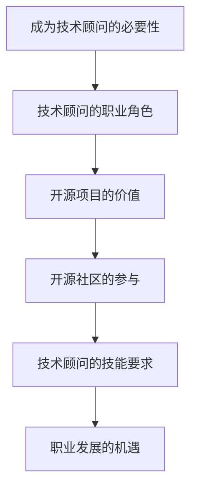

#### 核心算法原理讲解

以下是一个简单的伪代码，用于解释技术顾问的价值评估：

```plaintext
Function 评估技术顾问价值()
    技能水平 = 技能评分
    经验 = 工作年限
    解决问题的能力 = 成功案例数
    技术顾问的价值评估 = 技能水平 * 经验 * 解决问题的能力
    输出 技术顾问的价值评估
End Function
```

#### 数学模型和数学公式

技术顾问的价值评估可以通过以下数学模型来计算：

$$
技术顾问的价值评估 = f(技能水平, 经验, 解决问题的能力)
$$

其中，技能水平、经验和解决问题的能力分别代表技术顾问在相关领域的专业程度、工作时间和解决实际问题的能力。这些因素共同决定了技术顾问的价值。

#### 详细讲解与举例说明

技术顾问的价值评估是一个多维度的评估体系，涉及技能水平、经验和解决问题的能力。以下是一个具体的例子：

- **技能水平**：一个具有5年开发经验的技术顾问，精通Java、Python和JavaScript等多种编程语言，其技能水平评分可能为90分。
- **经验**：该顾问在过去的5年中参与了多个大型项目，经验丰富，评分可能为85分。
- **解决问题的能力**：该顾问在过去的项目中成功解决了多个复杂问题，评分可能为95分。

根据上述评分，该技术顾问的价值评估为：

$$
技术顾问的价值评估 = 90 \times 85 \times 95 = 73,525
$$

这个数字表明了该技术顾问在市场中的潜在价值。当然，这个评估结果是一个简化的例子，实际评估可能涉及更多的因素。

#### 第2章：开源项目的影响力

开源项目是指那些公开发布，允许任何人查看、修改和分发的软件项目。参与开源项目对于技术顾问的职业发展有着重要的影响。

#### 核心概念与联系

以下是一个简单的 Mermaid 流程图，展示了开源项目的影响力及其相关的核心概念和联系：

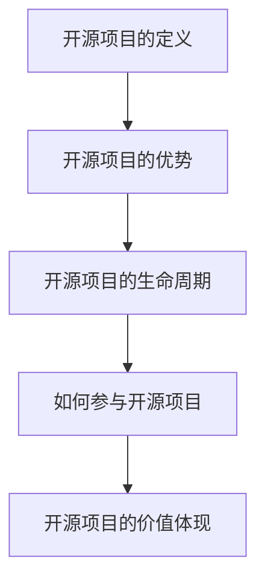

#### 核心算法原理讲解

参与开源项目的影响力可以通过以下伪代码来计算：

```plaintext
Function 参与开源项目的影响力()
    项目质量 = 贡献代码的质量
    社区贡献 = 回答问题的数量和贡献的改进建议
    合作伙伴 = 与其他贡献者的合作紧密程度
    影响力 = 项目质量 * 社区贡献 * 合作伙伴
    输出 影响力
End Function
```

#### 数学模型和数学公式

开源项目的影响力可以用以下数学模型来计算：

$$
影响力 = f(项目质量, 社区贡献, 合作伙伴)
$$

其中，项目质量、社区贡献和合作伙伴是影响开源项目影响力的关键因素。

#### 详细讲解与举例说明

项目质量是衡量开源项目影响力的基础。一个高质量的开源项目通常具有以下特点：

- **代码质量**：代码清晰、结构合理、易于维护。
- **文档完整**：项目文档详尽，包括使用说明、安装指南和开发者文档。
- **功能完善**：项目功能齐全，能够满足用户的需要。

社区贡献是开源项目发展的重要动力。以下是一个具体的例子：

- **回答问题**：在开源社区中积极参与，及时回答用户的问题，解决他们的困惑。
- **改进建议**：提出有价值的改进建议，推动项目的改进和发展。

合作伙伴关系也是开源项目影响力的重要因素。以下是一个具体的例子：

- **协作紧密**：与其他贡献者紧密合作，共同推动项目的发展。
- **互惠互利**：与其他贡献者共享资源和知识，实现双赢。

#### 第3章：从开源到咨询机会

开源项目不仅能够提升开发者的技术水平，还可以帮助他们建立个人品牌，从而获得更多的咨询机会。

#### 核心概念与联系

以下是一个简单的 Mermaid 流程图，展示了从开源到咨询机会的核心概念和联系：

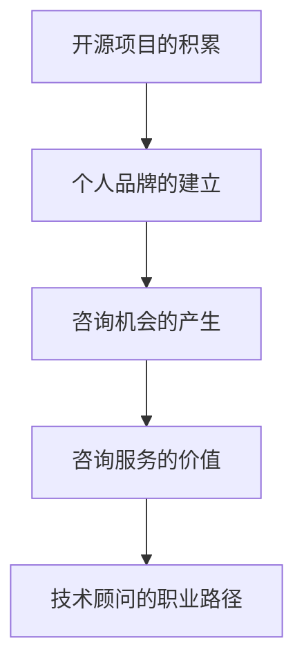

#### 核心算法原理讲解

从开源到咨询机会的转化可以通过以下伪代码来解释：

```plaintext
Function 从开源到咨询机会的转化()
    个人品牌知名度 = 开源项目的贡献度和社区评价
    技术能力 = 开源项目的参与度和解决实际问题的能力
    解决问题的案例 = 成功解决的实际问题案例
    咨询机会 = 个人品牌知名度 * 技术能力 * 解决问题的案例
    输出 咨询机会
End Function
```

#### 数学模型和数学公式

咨询机会的产生可以用以下数学模型来计算：

$$
咨询机会 = f(个人品牌知名度, 技术能力, 解决问题的案例)
$$

其中，个人品牌知名度、技术能力和解决问题的案例是影响咨询机会的关键因素。

#### 详细讲解与举例说明

个人品牌知名度的建立是一个长期的过程，需要开发者持续地在开源项目中做出贡献，并在社区中积极参与讨论和交流。以下是一个具体的例子：

- **个人品牌知名度**：通过在开源项目中做出有价值的贡献，如编写高质量的代码、撰写详细的文档和积极参与社区讨论，可以提升个人在开源社区中的知名度。
- **技术能力**：通过参与开源项目，开发者可以不断提升自己的技术能力，解决各种复杂问题，从而增强自己在市场中的竞争力。
- **解决问题的案例**：通过在开源项目中解决实际问题，开发者可以积累丰富的案例，为未来的咨询服务提供有力支持。

一个在开源社区中拥有高知名度、技术能力出众并有过成功解决方案案例的技术顾问，将更容易获得咨询机会。例如，一个在开源项目中解决了多个重要问题、拥有详细解决方案文档并得到社区广泛认可的顾问，将能够在市场上获得更高的咨询报价。

### 第二部分：提升技术顾问的咨询能力

#### 第4章：技术沟通与交流技巧

技术顾问的工作往往涉及与客户、团队成员和其他利益相关者的沟通。因此，掌握有效的技术沟通与交流技巧是成为一名优秀技术顾问的关键。

#### 核心概念与联系

技术沟通与交流技巧包括多个方面，如有效表达、倾听、提问和回应等。以下是一个简单的 Mermaid 流程图，展示了技术沟通与交流技巧的核心概念和联系：

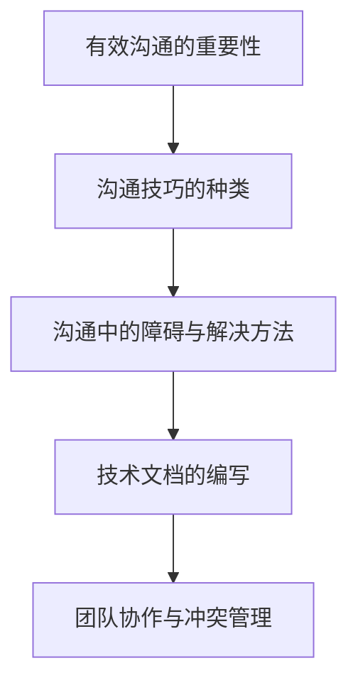

#### 核心算法原理讲解

以下是一个简单的伪代码，用于解释如何提升技术沟通与交流技巧：

```plaintext
Function 提升技术沟通与交流技巧()
    技能提升 = 沟通技巧训练 + 倾听技巧训练 + 提问技巧训练 + 回应技巧训练
    沟通效果 = 技能提升 * 沟通频率
    输出 沟通效果
End Function
```

#### 数学模型和数学公式

沟通效果可以用以下数学模型来计算：

$$
沟通效果 = f(沟通技巧, 沟通频率)
$$

其中，沟通技巧和沟通频率是影响沟通效果的关键因素。

#### 详细讲解与举例说明

有效沟通是技术顾问成功的关键。以下是一个具体的例子：

- **沟通技巧**：包括清晰表达、倾听、提问和回应等。例如，在向客户解释技术问题时，需要用简洁明了的语言表达，确保客户能够理解。
- **沟通频率**：定期与团队成员和其他利益相关者沟通，确保项目进展的透明度和信息的及时传递。

#### 第5章：项目管理和时间管理

项目管理是技术顾问的核心职责之一。掌握有效的项目管理和时间管理技巧，能够帮助技术顾问更好地应对复杂的项目挑战。

#### 核心概念与联系

以下是一个简单的 Mermaid 流程图，展示了项目管理和时间管理技巧的核心概念和联系：

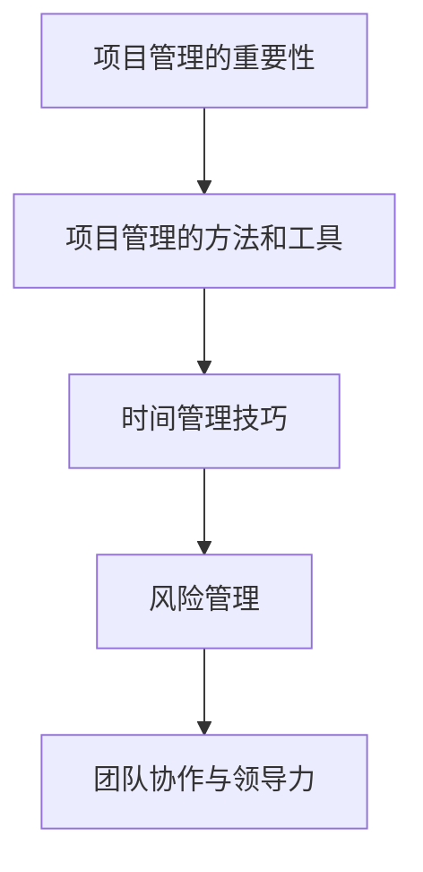

#### 核心算法原理讲解

以下是一个简单的伪代码，用于解释如何提升项目管理和时间管理能力：

```plaintext
Function 提升项目管理和时间管理能力()
    项目管理能力提升 = 项目计划训练 + 进度跟踪训练 + 风险评估训练 + 变更管理训练
    时间管理能力提升 = 时间规划训练 + 工作效率训练 + 团队协作训练
    项目成功 = 项目管理能力提升 * 时间管理能力提升
    输出 项目成功
End Function
```

#### 数学模型和数学公式

项目成功可以用以下数学模型来计算：

$$
项目成功 = f(项目管理能力提升, 时间管理能力提升)
$$

其中，项目管理能力提升和时间管理能力提升是影响项目成功的关键因素。

#### 详细讲解与举例说明

项目管理和时间管理能力是技术顾问成功的关键。以下是一个具体的例子：

- **项目管理能力**：包括项目计划、进度跟踪、风险评估和变更管理。例如，在项目启动阶段，需要制定详细的项目计划，确保项目按照预期的时间表进行。
- **时间管理能力**：包括时间规划、工作效率和团队协作。例如，合理规划工作时间，确保高效完成任务，并与团队成员保持良好的沟通和协作。

#### 第6章：案例分析：成功的咨询实践

通过分析成功的咨询案例，可以了解如何有效地利用开源项目积累经验，获得咨询机会，并提供高质量的技术服务。

#### 核心概念与联系

以下是一个简单的 Mermaid 流程图，展示了案例分析的核心概念和联系：

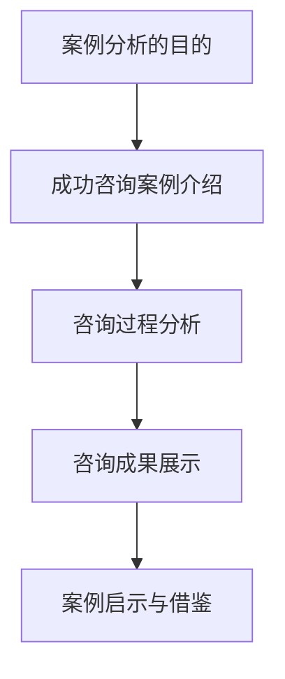

#### 核心算法原理讲解

以下是一个简单的伪代码，用于解释如何通过案例分析提升咨询能力：

```plaintext
Function 案例分析成功咨询实践()
    学习经验 = 成功案例的经验分享
    提升策略 = 学习经验 * 实践经验
    咨询能力提升 = 提升策略 * 解决问题能力
    输出 咨询能力提升
End Function
```

#### 数学模型和数学公式

咨询能力提升可以用以下数学模型来计算：

$$
咨询能力提升 = f(学习经验, 实践经验, 解决问题能力)
$$

其中，学习经验、实践经验和解决问题能力是影响咨询能力提升的关键因素。

#### 详细讲解与举例说明

通过分析成功的咨询案例，可以学习到许多宝贵的经验和方法。以下是一个具体的例子：

- **学习经验**：通过学习成功的咨询案例，了解他们是如何处理复杂问题的，以及他们采用了哪些策略和方法。
- **实践经验**：将学习到的经验应用到实际工作中，通过实践不断提升自己的咨询能力。
- **解决问题能力**：通过解决实际项目中的问题，增强自己的技术能力和实践经验。

#### 第7章：持续学习与职业发展

持续学习是技术顾问保持竞争力的重要途径。通过不断学习和职业规划，技术顾问可以不断提升自己的技术水平，实现职业发展。

#### 核心概念与联系

以下是一个简单的 Mermaid 流程图，展示了持续学习与职业发展的核心概念和联系：

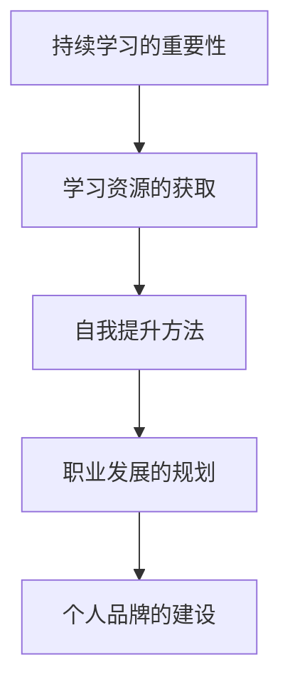

#### 核心算法原理讲解

以下是一个简单的伪代码，用于解释如何通过持续学习和职业规划提升自身能力：

```plaintext
Function 持续学习与职业发展()
    学习进度 = 学习资源利用率 * 自我提升能力
    职业发展 = 学习进度 * 职业规划
    个人品牌知名度 = 职业发展 * 个人品牌建设
    输出 个人品牌知名度
End Function
```

#### 数学模型和数学公式

个人品牌知名度可以用以下数学模型来计算：

$$
个人品牌知名度 = f(职业发展, 个人品牌建设)
$$

其中，职业发展和个人品牌建设是影响个人品牌知名度的关键因素。

#### 详细讲解与举例说明

持续学习和职业规划是技术顾问长期发展的关键。以下是一个具体的例子：

- **学习资源获取**：利用在线课程、技术论坛和开源项目等学习资源，不断提升自己的技术能力。
- **自我提升方法**：通过实践、反思和总结，不断提升自己的解决实际问题的能力。
- **职业发展规划**：明确自己的职业目标，制定实现目标的计划，并持续跟踪自己的进度。

### 第三部分：利用开源影响力获得咨询机会

#### 第8章：建立个人品牌

建立个人品牌是技术顾问获得咨询机会的关键步骤。通过在开源社区中的积极参与和高质量的内容分享，技术顾问可以提升自己的知名度和影响力。

#### 核心概念与联系

以下是一个简单的 Mermaid 流程图，展示了建立个人品牌的核心概念和联系：

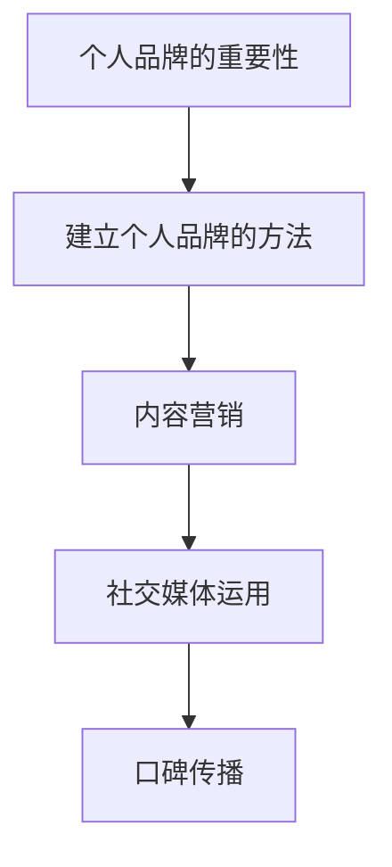

#### 核心算法原理讲解

以下是一个简单的伪代码，用于解释如何建立个人品牌：

```plaintext
Function 建立个人品牌影响力()
    内容质量 = 高质量内容创作
    社交媒体活跃度 = 社交媒体活跃度
    口碑评价 = 良好口碑传播
    个人品牌影响力 = 内容质量 * 社交媒体活跃度 * 口碑评价
    输出 个人品牌影响力
End Function
```

#### 数学模型和数学公式

个人品牌影响力可以用以下数学模型来计算：

$$
个人品牌影响力 = f(内容质量, 社交媒体活跃度, 口碑评价)
$$

其中，内容质量、社交媒体活跃度和口碑评价是影响个人品牌影响力的关键因素。

#### 详细讲解与举例说明

建立个人品牌需要长期的努力和积累。以下是一个具体的例子：

- **内容质量**：撰写高质量的技术博客文章，分享开源项目经验，提供有价值的技术见解。
- **社交媒体活跃度**：积极参与社交媒体平台的技术讨论，回复评论，建立互动关系。
- **口碑评价**：通过良好的服务质量和解决问题的能力，赢得客户的信任和好评。

#### 第9章：利用开源项目拓展人脉

开源项目提供了一个与全球开发者互动的平台，通过这个平台，技术顾问可以拓展自己的人脉，建立强大的职业网络。

#### 核心概念与联系

以下是一个简单的 Mermaid 流程图，展示了利用开源项目拓展人脉的核心概念和联系：

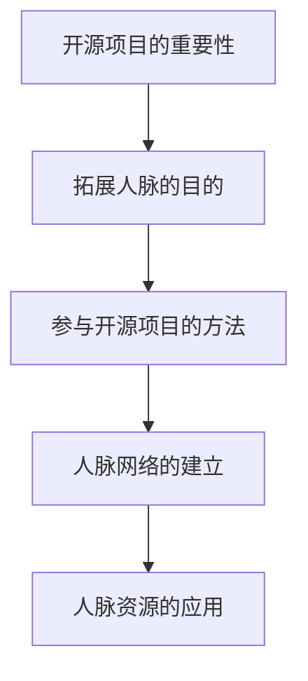

#### 核心算法原理讲解

以下是一个简单的伪代码，用于解释如何利用开源项目拓展人脉：

```plaintext
Function 利用开源项目拓展人脉()
    项目参与度 = 开源项目参与次数
    社区贡献度 = 开源社区贡献次数
    人际关系维护 = 定期与贡献者交流
    人脉资源 = 项目参与度 * 社区贡献度 * 人际关系维护
    输出 人脉资源
End Function
```

#### 数学模型和数学公式

人脉资源可以用以下数学模型来计算：

$$
人脉资源 = f(项目参与度, 社区贡献度, 人际关系维护)
$$

其中，项目参与度、社区贡献度和人际关系维护是影响人脉资源的关键因素。

#### 详细讲解与举例说明

利用开源项目拓展人脉是一个系统的过程。以下是一个具体的例子：

- **项目参与度**：积极参与多个开源项目，扩大自己的技术视野和人脉圈。
- **社区贡献度**：在开源社区中做出有价值的贡献，如编写文档、解决问题和提出改进建议。
- **人际关系维护**：定期与开源社区中的贡献者保持联系，分享技术见解和经验。

#### 第10章：从开源到咨询机会的转化

通过建立个人品牌和拓展人脉，技术顾问可以将开源项目的影响力转化为实际的咨询机会。这一过程需要技术顾问具备一定的策略和技巧。

#### 核心概念与联系

以下是一个简单的 Mermaid 流程图，展示了从开源到咨询机会的转化过程：

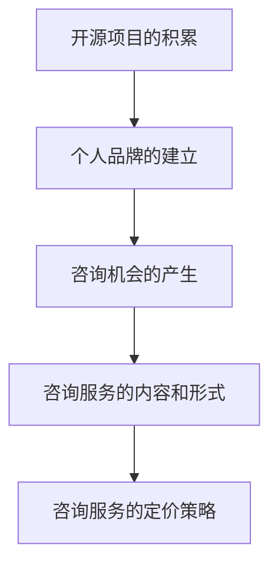

#### 核心算法原理讲解

以下是一个简单的伪代码，用于解释从开源到咨询机会的转化过程：

```plaintext
Function 从开源到咨询机会的转化()
    咨询机会 = 个人品牌知名度 * 技术能力 * 开源项目经验
    咨询服务内容 = 技术诊断 + 系统优化 + 解决方案提供
    咨询服务形式 = 线上咨询 + 线下辅导 + 项目合作
    定价策略 = 成本计算 + 市场调研 + 竞争分析
    输出 咨询机会 + 咨询服务内容 + 咨询服务形式 + 定价策略
End Function
```

#### 数学模型和数学公式

咨询机会可以用以下数学模型来计算：

$$
咨询机会 = f(个人品牌知名度, 技术能力, 开源项目经验)
$$

其中，个人品牌知名度、技术能力和开源项目经验是影响咨询机会的关键因素。

#### 详细讲解与举例说明

从开源到咨询机会的转化需要技术顾问具备以下能力：

- **个人品牌知名度**：通过在开源社区中的积极参与和高质量的内容分享，提升个人品牌知名度。
- **技术能力**：通过参与开源项目，不断提升自己的技术能力，确保能够提供高质量的技术服务。
- **开源项目经验**：通过在开源项目中的实际参与，积累丰富的项目经验，为咨询工作提供有力支持。

例如，一个在开源社区中拥有高知名度、技术能力出众且具备丰富开源项目经验的技术顾问，将更容易获得咨询机会。他们可以提供以下咨询服务：

- **技术诊断**：帮助客户诊断现有系统的技术问题，提供改进建议。
- **系统优化**：优化现有系统的性能和可扩展性，提升用户体验。
- **解决方案提供**：根据客户需求，提供定制化的技术解决方案。

在制定咨询服务定价策略时，需要考虑以下因素：

- **成本计算**：包括人力成本、硬件成本和软件成本等。
- **市场调研**：了解市场需求和竞争对手的定价策略。
- **竞争分析**：分析竞争对手的定价策略，制定有竞争力的定价策略。

#### 附录

##### 附录 A：开源项目与咨询实践资源

在本章中，我们将介绍一些开源项目与咨询实践的资源，帮助读者更好地理解和应用相关概念。

#### 核心概念与联系

以下是一个简单的 Mermaid 流程图，展示了开源项目与咨询实践资源的核心概念和联系：

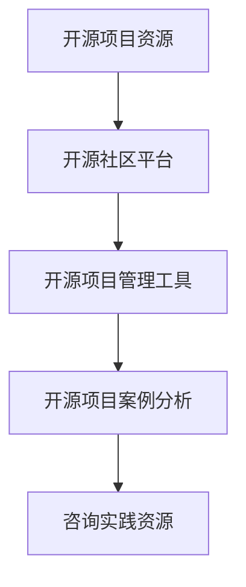

#### 核心算法原理讲解

以下是一个简单的伪代码，用于解释如何获取和使用开源项目与咨询实践资源：

```plaintext
Function 获取开源项目与咨询实践资源()
    开源项目资源 = 开源社区平台 + 开源项目管理工具 + 开源项目案例分析
    咨询实践资源 = 咨询实践案例 + 咨询技巧分享 + 行业报告
    资源价值 = 开源项目资源质量 * 咨询实践经验
    输出 资源价值
End Function
```

#### 数学模型和数学公式

资源价值可以用以下数学模型来计算：

$$
资源价值 = f(开源项目资源质量, 咨询实践经验)
$$

其中，开源项目资源质量和咨询实践经验是影响资源价值的两个关键因素。

#### 详细讲解与举例说明

获取和使用开源项目与咨询实践资源可以帮助技术顾问提升自己的能力。以下是一个具体的例子：

- **开源项目资源**：通过参与开源项目，可以学习到最新的技术趋势和最佳实践。例如，GitHub、GitLab 和 Bitbucket 等开源社区平台提供了丰富的项目资源，技术顾问可以从中学习和借鉴。
- **咨询实践资源**：通过阅读咨询实践案例和技巧分享，可以学习到其他技术顾问的成功经验和实用技巧。行业报告和技术文献也提供了丰富的信息，帮助技术顾问了解市场需求和行业动态。

例如，一个技术顾问可以通过以下方式提升自己的能力：

- **开源项目资源**：参与 GitHub 上的开源项目，学习最新的技术趋势，了解项目的开发流程和最佳实践。
- **咨询实践资源**：阅读行业报告，了解市场趋势，学习其他技术顾问的咨询技巧和实践经验。

这些资源的获取和应用将显著提升技术顾问的能力，为他们提供更多的咨询机会。

##### 附录 B：开源项目开发指南

在本章中，我们将提供一份开源项目开发指南，帮助读者了解如何参与开源项目，从项目规划到代码发布和项目维护。

#### 核心概念与联系

以下是一个简单的 Mermaid 流程图，展示了开源项目开发的核心概念和联系：

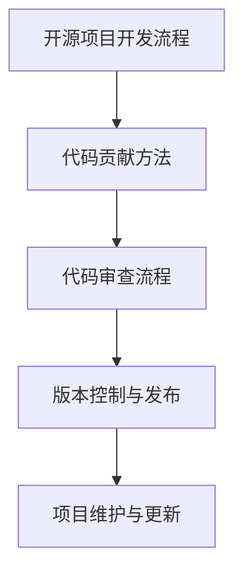

#### 核心算法原理讲解

以下是一个简单的伪代码，用于解释开源项目开发流程：

```plaintext
Function 开源项目开发流程()
    需求分析 = 确定项目需求和目标
    代码编写 = 编写高质量代码
    代码审查 = 审查代码质量
    版本发布 = 定期发布版本
    项目维护 = 更新和维护项目
    输出 项目质量
End Function
```

#### 数学模型和数学公式

项目质量可以用以下数学模型来计算：

$$
项目质量 = f(需求分析，代码编写，代码审查，版本发布)
$$

其中，需求分析、代码编写、代码审查和版本发布是影响项目质量的关键因素。

#### 详细讲解与举例说明

开源项目开发是一个系统性的过程，需要遵循一定的流程和规范。以下是一个具体的例子：

- **需求分析**：在项目启动阶段，需要明确项目需求和目标。这包括了解用户需求、技术需求和商业需求等。
- **代码编写**：在需求分析的基础上，开始编写代码。编写代码时，需要遵循良好的编程规范，确保代码的清晰性和可维护性。
- **代码审查**：在代码编写完成后，进行代码审查。代码审查的目的是确保代码质量，发现潜在的问题和缺陷。
- **版本发布**：定期发布版本，确保项目的持续更新和维护。版本发布时，需要提供详细的版本说明和更新日志。

例如，一个开源项目的开发过程可以如下：

1. **需求分析**：确定项目需求，包括用户需求和技术需求。
2. **代码编写**：根据需求分析，编写代码，确保代码清晰、结构合理、易于维护。
3. **代码审查**：邀请其他开发者参与代码审查，确保代码质量。
4. **版本发布**：定期发布版本，提供详细的版本说明和更新日志。
5. **项目维护**：持续更新和维护项目，修复潜在的问题和缺陷。

通过遵循这些步骤，可以确保开源项目的质量，提高项目的稳定性和可用性。

##### 附录 C：技术顾问常用工具与资源

在本章中，我们将介绍一些技术顾问常用的工具和资源，帮助读者了解如何更高效地完成工作。

#### 核心概念与联系

以下是一个简单的 Mermaid 流程图，展示了技术顾问常用工具的核心概念和联系：

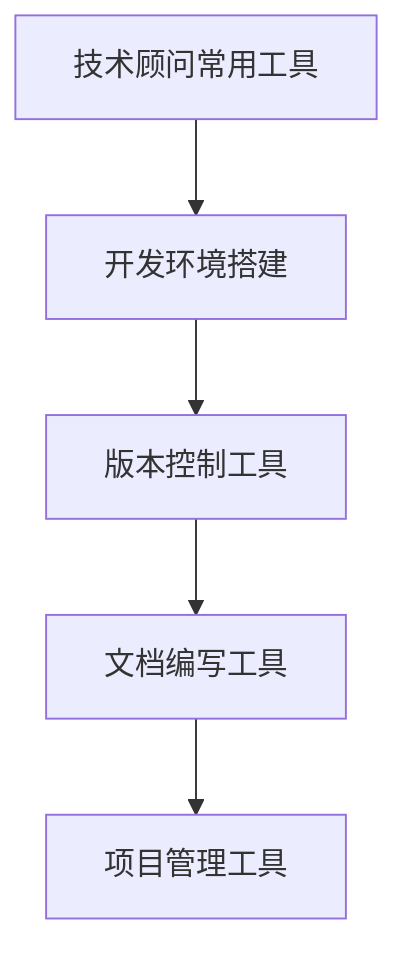

#### 核心算法原理讲解

以下是一个简单的伪代码，用于解释如何使用技术顾问常用工具：

```plaintext
Function 使用技术顾问常用工具()
    开发环境搭建 = 安装必要软件和配置
    版本控制 = 使用版本控制工具管理代码
    文档编写 = 使用文档编写工具编写文档
    项目管理 = 使用项目管理工具管理项目
    工作效率 = 开发环境搭建 * 版本控制 * 文档编写 * 项目管理
    输出 工作效率
End Function
```

#### 数学模型和数学公式

工作效率可以用以下数学模型来计算：

$$
工作效率 = f(开发环境搭建，版本控制，文档编写，项目管理)
$$

其中，开发环境搭建、版本控制、文档编写和项目管理是影响工作效率的关键因素。

#### 详细讲解与举例说明

技术顾问常用的工具和资源包括以下几个方面：

- **开发环境搭建**：包括安装开发所需的软件和配置开发环境。例如，使用 Docker 搭建统一的开发环境，确保开发环境的稳定性和一致性。
- **版本控制工具**：如 Git，用于管理代码的版本和控制代码的变更。通过 Git，可以方便地进行代码的分支、合并和发布。
- **文档编写工具**：如 Markdown，用于编写文档和编写技术博客。Markdown 提供了简洁的语法，可以快速生成格式化的文档。
- **项目管理工具**：如 JIRA、Trello 等，用于管理项目任务和跟踪项目进度。这些工具可以帮助技术顾问高效地管理项目，确保项目按时交付。

例如，一个技术顾问可以使用以下工具和资源来提高工作效率：

- **开发环境搭建**：使用 Docker 搭建统一的开发生态系统。
- **版本控制**：使用 Git 管理代码，确保代码的版本控制和协作开发。
- **文档编写**：使用 Markdown 编写技术文档和博客文章。
- **项目管理**：使用 JIRA 管理项目任务，确保项目进度和团队协作。

通过使用这些工具和资源，技术顾问可以显著提高工作效率，确保项目的顺利进行。

### 结束语

成为技术顾问并利用开源项目的影响力获得咨询机会，不仅需要深厚的专业知识和丰富的实践经验，还需要出色的沟通能力和项目管理的技能。本文从多个角度探讨了如何实现这一目标，包括技术沟通与交流技巧、项目管理和时间管理、案例分析以及持续学习与职业发展等。通过积极参与开源项目、建立个人品牌、拓展人脉资源以及从开源到咨询机会的转化，技术顾问可以不断提升自己的能力，实现职业发展。希望本文对广大开发者有所启发和帮助。如果您有任何疑问或建议，欢迎在评论区留言，让我们一起交流和学习。作者：AI天才研究院/AI Genius Institute & 禅与计算机程序设计艺术 /Zen And The Art of Computer Programming。

