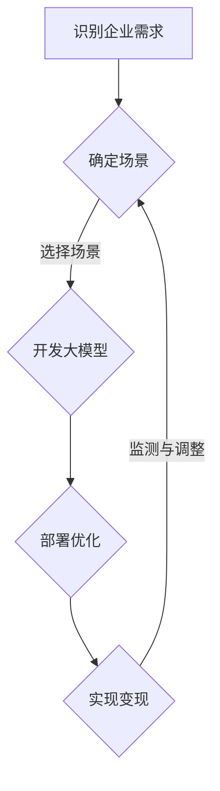

                 

## 找对场景是大模型企业变现重要一步

### 关键词

- 大模型
- 企业变现
- 场景选择
- 应用实践
- 收益模型
- 风险管理

### 摘要

本文深入探讨了在大模型时代，如何找对场景以实现企业的有效变现。通过对大模型的定义、应用现状、企业变现路径的解析，以及成功案例的分析，本文明确了找对场景对企业大模型变现的重要性。同时，文章还详细介绍了场景选择的策略、客户需求调研方法、市场分析工具，并提供了大模型开发、部署与优化的实践指导。此外，通过多样性的变现模式和收益模型设计，以及风险管理与策略调整的探讨，本文为企业在大模型领域的成功变现提供了全面、系统的解决方案。

### 目录大纲

- 第一部分：大模型与企业变现概述
  - 1.1 引言：大模型在企业中的应用现状与潜力
  - 1.2 大模型的定义与核心概念
  - 1.3 企业变现路径解析
  - 1.4 案例分析：成功的企业大模型变现实践

- 第二部分：找对场景的关键因素
  - 2.1 理解企业需求与目标
  - 2.2 行业洞察与趋势分析
  - 2.3 场景选择的策略与方法
  - 2.4 客户需求调研与市场分析

- 第三部分：场景化应用的实践与实现
  - 3.1 大模型开发的基础知识
  - 3.2 大模型在具体场景中的应用
  - 3.3 企业内部技术能力评估与构建
  - 3.4 大模型部署与优化

- 第四部分：企业变现案例与策略
  - 4.1 案例分析：多样化的大模型变现模式
  - 4.2 收益模型设计
  - 4.3 风险管理与策略调整

- 第五部分：未来展望与趋势
  - 5.1 大模型与企业变现的挑战与机遇
  - 5.2 行业趋势与未来展望

- 附录
  - 5.1 参考资料与推荐阅读
  - 5.2 实用工具与资源

### Mermaid 流程图：大模型在企业中的应用路径



### 核心算法原理讲解：大模型的训练与优化

#### 1. 大模型的训练

```plaintext
算法伪代码：

function train_model(data, labels, epochs):
    for epoch in 1 to epochs:
        for batch in data:
            predictions = model(batch)
            loss = calculate_loss(predictions, labels)
            update_model_params(loss)
    return model
```

#### 2. 大模型的优化

```plaintext
算法伪代码：

function optimize_model(model, data, labels, optimizer, learning_rate):
    for epoch in 1 to epochs:
        for batch in data:
            with gradient tape:
                predictions = model(batch)
                loss = calculate_loss(predictions, labels)
            gradients = tape.gradient(loss, model.trainable_variables)
            optimizer.apply_gradients(zip(gradients, model.trainable_variables))
    return model
```

### 数学模型和数学公式

#### 1. 损失函数

$$
\text{Loss} = \frac{1}{N} \sum_{i=1}^{N} (-y_i \log(p_i))
$$

#### 2. 优化器更新规则

$$
\theta_{t+1} = \theta_{t} - \alpha \nabla_{\theta} J(\theta)
$$

### 项目实战

#### 1. 实战案例：开发一个推荐系统

- **开发环境搭建**
  - 硬件环境：GPU服务器
  - 软件环境：TensorFlow 2.x，Python 3.8

- **源代码实现**

```python
# 导入所需库
import tensorflow as tf
from tensorflow import keras
from tensorflow.keras import layers

# 构建模型
model = keras.Sequential([
    layers.Dense(128, activation='relu', input_shape=(num_features,)),
    layers.Dense(64, activation='relu'),
    layers.Dense(1, activation='sigmoid')
])

# 编译模型
model.compile(optimizer='adam',
              loss='binary_crossentropy',
              metrics=['accuracy'])

# 训练模型
model.fit(X_train, y_train, epochs=10, batch_size=32, validation_split=0.2)
```

- **代码解读与分析**

  - **模型构建**：使用了两个隐层的全连接神经网络，输出层使用 sigmoid 激活函数。
  - **编译**：优化器选择adam，损失函数为 binary_crossentropy，评价标准为 accuracy。
  - **训练**：训练过程中使用了批次大小为32的 mini-batch SGD。

### 总结

本文通过逻辑清晰、结构紧凑的方式，深入探讨了找对场景对于大模型企业变现的重要性。从大模型的定义、应用现状，到企业变现路径的解析，再到具体场景的选择和案例分析，文章全面覆盖了大模型在企业中的应用与变现的各个方面。通过核心算法原理的讲解、项目实战的分享，以及数学模型和公式的详细阐述，本文为读者提供了系统、实用的技术指导。文章末尾的参考文献和实用工具与资源，则为读者进一步的学习和实践提供了丰富的资源支持。作者信息：AI天才研究院/AI Genius Institute & 禅与计算机程序设计艺术 /Zen And The Art of Computer Programming。

---

## 第一部分：大模型与企业变现概述

### 1.1 引言：大模型在企业中的应用现状与潜力

近年来，人工智能（AI）技术的迅猛发展，特别是深度学习（Deep Learning）领域的突破，为各行各业带来了革命性的变革。大模型（Large Models），也被称为深度神经网络（Deep Neural Networks），由于其能够处理海量数据、生成复杂特征、实现高度泛化，已经成为企业提升竞争力、实现业务创新的重要工具。大模型在企业中的应用现状和潜力，正逐渐成为业界关注的焦点。

#### 大模型在企业中的应用现状

当前，大模型在企业中的应用已经渗透到多个领域，如自然语言处理（NLP）、计算机视觉（CV）、推荐系统、金融风控、医疗诊断等。以下是一些具体的应用实例：

1. **自然语言处理**：大模型在文本分类、机器翻译、情感分析、语音识别等领域取得了显著成果。例如，谷歌的BERT模型在多项自然语言处理任务中取得了世界领先的成绩。

2. **计算机视觉**：大模型在图像分类、目标检测、图像生成等领域具有广泛的应用。如OpenAI的GPT-3在图像生成任务上展现出了强大的能力。

3. **推荐系统**：大模型通过分析用户行为和偏好，为企业提供个性化的推荐服务，从而提高用户满意度和转化率。

4. **金融风控**：大模型在信用评分、欺诈检测、市场预测等方面具有重要作用。如微软的Dojo框架，用于大规模的金融数据分析。

5. **医疗诊断**：大模型在医学影像分析、疾病预测、药物研发等领域展现了巨大的潜力。例如，IBM的Watson系统在癌症诊断方面取得了突破性进展。

#### 大模型的潜在变现价值

大模型在企业中具有巨大的潜在变现价值，主要体现在以下几个方面：

1. **提高业务效率**：大模型通过自动化和智能化，可以显著提高企业的运营效率，减少人力成本。

2. **创新产品与服务**：大模型可以帮助企业发现新的商业机会，开发创新性的产品和服务，提升市场竞争力。

3. **优化决策支持**：大模型可以提供精准的数据分析和预测，为企业决策提供强有力的支持。

4. **增加收入来源**：企业可以通过提供基于大模型的服务，如智能咨询、个性化推荐、自动化服务等，开拓新的收入渠道。

5. **降低风险**：大模型在风险管理和决策支持方面具有重要作用，可以帮助企业降低运营风险。

### 1.2 大模型的定义与核心概念

大模型通常指的是具有数亿甚至数千亿参数的深度神经网络。这些模型可以通过训练海量数据，自动学习并提取复杂特征，从而实现高度泛化的预测和分类任务。大模型与传统模型相比，具有以下几个核心概念和特点：

#### 核心概念

1. **深度**：大模型具有多层次的神经网络结构，通过逐层提取特征，实现从原始数据到高级抽象的转换。

2. **宽度**：大模型通常包含大量的神经元和连接，能够处理和存储海量的数据和信息。

3. **参数数量**：大模型拥有数亿到数千亿的参数，这使得模型具有强大的学习和泛化能力。

4. **训练数据量**：大模型需要大量的训练数据，以充分学习数据中的模式和规律。

5. **计算资源**：大模型的训练和推理过程需要大量的计算资源和时间，通常需要使用GPU或TPU等高性能硬件。

#### 特点

1. **高度泛化**：大模型能够处理多种不同类型的数据，并在多个任务上取得优异的性能。

2. **自动特征提取**：大模型可以自动学习并提取数据中的复杂特征，无需人工干预。

3. **强大的表达能力**：大模型具有丰富的参数和层次结构，能够表达复杂的函数关系。

4. **可扩展性**：大模型可以很容易地扩展到新的任务和数据集，提高模型的灵活性和适应性。

5. **计算密集性**：大模型的训练和推理过程需要大量的计算资源，这使得模型部署和优化成为关键挑战。

### 1.3 企业变现路径解析

大模型在企业中的变现路径多种多样，企业可以根据自身需求和资源选择合适的路径。以下是几种常见的企业变现路径：

#### 路径一：提供基于大模型的服务

1. **智能咨询**：企业可以提供基于大模型的智能咨询服务，如市场预测、竞争分析、战略规划等。

2. **个性化推荐**：企业可以利用大模型进行个性化推荐，提高用户满意度和转化率。

3. **自动化服务**：企业可以通过大模型实现自动化服务，如客服机器人、智能调度等。

#### 路径二：开发创新产品

1. **智能硬件**：企业可以开发基于大模型的智能硬件产品，如智能家居、智能穿戴设备等。

2. **软件应用**：企业可以开发基于大模型的软件应用，如语音识别、图像识别等。

3. **虚拟助手**：企业可以开发虚拟助手，提供个性化服务，如智能客服、在线教育等。

#### 路径三：技术授权与销售

1. **技术授权**：企业可以将大模型技术授权给其他企业，收取授权费用。

2. **产品销售**：企业可以将基于大模型的产品直接销售给客户，获取销售收入。

3. **解决方案**：企业可以提供基于大模型的整体解决方案，包括技术支持、培训等。

#### 路径四：参与投资与合作

1. **投资**：企业可以通过投资其他具有大模型技术优势的企业，分享其成长的红利。

2. **合作**：企业可以与其他企业合作，共同开发和推广大模型产品。

3. **产业生态**：企业可以参与构建大模型产业生态，提供相关服务和支持，促进整个产业链的发展。

### 1.4 案例分析：成功的企业大模型变现实践

为了更好地理解大模型在企业变现中的实际应用，以下分析两个成功的案例：

#### 案例一：谷歌的BERT模型

谷歌的BERT（Bidirectional Encoder Representations from Transformers）模型是自然语言处理领域的一个里程碑。BERT模型在多项自然语言处理任务中取得了世界领先的成绩，谷歌通过以下方式实现了大模型的有效变现：

1. **提供API服务**：谷歌开放了BERT模型的API服务，企业可以通过付费方式使用BERT模型进行文本分类、情感分析等任务。

2. **开发工具和平台**：谷歌推出了多个工具和平台，如TensorFlow Model Garden和Cloud AI Platform，帮助企业轻松部署和管理BERT模型。

3. **培训和教育**：谷歌提供了丰富的培训和教育资源，帮助企业了解和使用BERT模型。

#### 案例二：微软的Dojo框架

微软的Dojo框架是一个大规模的金融数据分析平台，利用深度学习技术提供信用评分、欺诈检测等功能。微软通过以下方式实现了Dojo框架的有效变现：

1. **技术授权**：微软将Dojo框架授权给金融企业，提供定制化的解决方案。

2. **合作伙伴关系**：微软与多家金融机构合作，共同开发和推广基于Dojo框架的应用。

3. **咨询服务**：微软提供专业的咨询服务，帮助企业利用Dojo框架优化业务流程。

通过上述案例分析，可以看出，成功的企业大模型变现需要结合企业自身的技术优势和市场需求，选择合适的变现路径，并不断创新和优化服务模式。

### 结论

大模型在企业中的应用现状和潜力为企业的创新和发展提供了广阔的空间。企业需要深入了解大模型的核心概念和应用路径，选择合适的场景进行应用，并通过多样化的变现模式实现价值最大化。在下一部分中，我们将深入探讨如何找对场景，为企业的成功变现奠定基础。

## 第二部分：找对场景的关键因素

在第一部分中，我们探讨了大模型在企业中的应用现状和变现路径。然而，要实现大模型的有效变现，关键在于找到合适的场景。找对场景不仅能够充分发挥大模型的优势，还能够帮助企业降低成本、提高效率，最终实现价值最大化。以下是找对场景的关键因素。

### 2.1 理解企业需求与目标

理解企业需求与目标是找对场景的第一步。企业需要明确自身的业务目标和发展方向，这包括：

1. **业务需求**：企业需要分析当前的业务流程，识别哪些环节可以通过大模型技术进行优化。例如，在客户服务领域，企业可以通过大模型实现自动化的客户咨询和问题解答，提高服务效率。

2. **发展目标**：企业需要设定短期和长期的发展目标，这有助于确定大模型应用的方向。例如，一家电商企业可能将提高用户转化率和客户满意度作为短期目标，而将开发创新产品作为长期目标。

3. **资源与限制**：企业需要评估自身的资源状况，包括资金、技术人才和硬件设备等。这将有助于确定企业在大模型应用上的可行性和优先级。

#### 实践建议

- **需求调研**：通过问卷调查、访谈和焦点小组等方式，收集企业内部员工的意见和需求。
- **目标设定**：结合企业的发展战略，设定具体的业务目标和时间表。
- **资源评估**：对企业现有资源进行详细评估，制定详细的预算和技术规划。

### 2.2 行业洞察与趋势分析

行业洞察和趋势分析是找对场景的重要环节。了解行业的发展动态和未来趋势，可以帮助企业抓住市场机遇，避免盲目跟风。

1. **市场趋势**：企业需要关注行业的发展趋势，如新技术的应用、市场需求的演变等。例如，随着5G和物联网的发展，智能家居和智能城市等领域将迎来新的增长机遇。

2. **竞争分析**：企业需要分析竞争对手的应用场景和变现模式，从中找到自身的差异化优势。例如，通过对比竞争对手的客户体验和产品功能，企业可以发现自身的改进空间。

3. **技术趋势**：企业需要关注大模型技术的发展趋势，了解哪些技术将在未来几年内取得突破。例如，生成对抗网络（GAN）和自监督学习（Self-Supervised Learning）等技术在图像生成和自然语言处理等领域具有巨大的潜力。

#### 实践建议

- **市场研究**：通过行业报告、市场调研和专家访谈，获取行业最新动态。
- **竞争分析**：使用数据分析工具，对竞争对手的应用场景和变现模式进行详细分析。
- **技术趋势**：关注学术会议、技术论坛和科技新闻，了解大模型技术的发展方向。

### 2.3 场景选择的策略与方法

选择合适的场景是确保大模型有效变现的关键。以下是一些常见的场景选择策略和方法：

1. **高价值场景**：选择对业务影响大、潜在收益高的场景。例如，在金融风控领域，利用大模型进行信用评分和欺诈检测，可以显著降低企业的运营风险。

2. **痛点场景**：选择存在明显痛点和需求未被满足的场景。例如，在医疗领域，利用大模型进行疾病诊断和药物研发，可以帮助医生提高诊断准确率，缩短研发周期。

3. **创新场景**：选择具有创新性和前瞻性的场景，为企业开辟新的市场空间。例如，在无人驾驶领域，利用大模型进行自动驾驶和智能交通管理，可以提升交通效率和安全性。

4. **规模效应场景**：选择能够实现规模效应的场景，通过大量的数据和用户反馈，不断优化模型，提高业务效率和用户体验。例如，在电商领域，利用大模型进行个性化推荐，可以显著提高用户的购买转化率。

#### 实践建议

- **价值评估**：对潜在的应用场景进行价值评估，考虑其对业务的影响、潜在收益和竞争压力。
- **痛点分析**：识别行业中的痛点，分析哪些痛点可以通过大模型技术得到有效解决。
- **创新探索**：结合企业的技术优势和市场需求，探索具有创新性的应用场景。
- **规模效应**：考虑场景的规模效应，选择能够实现大规模应用和持续优化的场景。

### 2.4 客户需求调研与市场分析

客户需求调研和市场分析是确保大模型应用场景与市场需求紧密结合的关键步骤。以下是一些具体的调研和分析方法：

1. **用户访谈**：通过访谈用户，了解他们的需求和痛点，获取第一手的数据和反馈。

2. **问卷调查**：设计针对性的问卷，通过在线或线下方式收集用户意见和需求。

3. **数据分析**：对用户数据进行分析，挖掘用户的购买行为、使用习惯等，了解市场趋势。

4. **竞争分析**：分析竞争对手的产品和服务，了解市场的竞争格局。

5. **市场预测**：根据历史数据和行业趋势，预测市场未来的发展状况和需求变化。

#### 实践建议

- **调研计划**：制定详细的调研计划，明确调研目标、方法和时间表。
- **数据分析**：使用数据分析工具，对收集到的数据进行分析，提取有价值的信息。
- **市场预测**：结合历史数据和行业趋势，制定市场预测报告，为决策提供依据。

### 结论

找对场景是大模型企业变现的重要一步。通过理解企业需求与目标、进行行业洞察与趋势分析、制定场景选择策略和方法，以及进行客户需求调研与市场分析，企业可以找到最适合自身的应用场景，从而实现大模型的有效变现。在下一部分中，我们将深入探讨大模型开发、部署与优化的实践与实现。

## 第三部分：场景化应用的实践与实现

### 3.1 大模型开发的基础知识

大模型开发是一个复杂且多层次的过程，涉及从数据收集到模型训练和优化的多个阶段。以下内容将详细讲解大模型开发的基础知识。

#### 1. 数据收集与预处理

数据收集是模型开发的首要任务。高质量的数据集是模型训练的基础，因此需要确保数据来源的多样性和数据质量的可靠性。以下是一些常见的数据收集与预处理方法：

- **数据收集**：可以通过开源数据集、公共数据集、企业内部数据等方式获取数据。例如，在自然语言处理领域，常用的开源数据集包括维基百科、Twitter数据集等。

- **数据预处理**：数据预处理包括数据清洗、数据转换和数据归一化等步骤。数据清洗的目的是去除噪声和异常值，数据转换则是将数据转换为适合模型训练的格式，数据归一化则是为了使数据在不同特征之间具有相似的数量级。

#### 2. 模型设计

模型设计是构建大模型的核心环节。设计一个高效的模型架构需要综合考虑数据特点、任务需求和计算资源等因素。以下是一些常见的模型设计方法：

- **神经网络架构**：选择合适的神经网络架构，如卷积神经网络（CNN）、循环神经网络（RNN）、变换器（Transformer）等。每种架构都有其特定的优势和适用场景。

- **层结构**：确定网络的层数和每层的神经元数量。通常，深层网络能够更好地提取复杂特征，但训练时间较长。

- **损失函数**：选择适合任务需求的损失函数，如交叉熵损失函数（Cross-Entropy Loss）用于分类任务，均方误差（Mean Squared Error, MSE）用于回归任务。

- **优化器**：选择合适的优化器，如随机梯度下降（SGD）、Adam等。优化器的选择会影响模型的收敛速度和训练效果。

#### 3. 模型训练

模型训练是利用数据集对模型进行迭代优化，使其在特定任务上达到最佳性能的过程。以下是一些常见的模型训练方法：

- **数据增强**：通过旋转、缩放、裁剪等操作，增加训练数据的多样性，防止模型过拟合。

- **批次大小**：确定每批数据的大小，以平衡训练速度和模型泛化能力。

- **训练策略**：包括初始化策略、学习率调整策略和训练循环等。常用的初始化策略有随机初始化、高斯初始化等；学习率调整策略包括固定学习率、学习率衰减等。

- **验证与测试**：通过验证集和测试集对模型进行评估，以检测模型的泛化能力和性能。

#### 4. 模型优化

模型优化是提升模型性能的重要环节。以下是一些常见的模型优化方法：

- **正则化**：通过添加正则项（如L1、L2正则化）来防止模型过拟合。

- **模型剪枝**：通过剪枝冗余的神经元或连接，减少模型参数，提高模型效率和计算效率。

- **迁移学习**：利用预训练模型（Pre-trained Model），在特定任务上进行微调，以加快训练过程并提高性能。

- **超参数调优**：通过调整学习率、批次大小、隐藏层神经元数量等超参数，优化模型性能。

### 3.2 大模型在具体场景中的应用

大模型在各个领域的具体应用场景各不相同，以下列举几个典型的应用案例，并分析其实现方法和挑战。

#### 1. 自然语言处理（NLP）

NLP是深度学习应用最为广泛的领域之一。以下是一些常见的NLP应用场景：

- **文本分类**：利用大模型进行新闻分类、情感分析等任务。实现方法通常包括文本预处理、词嵌入、模型训练和评估。

- **机器翻译**：利用大模型进行高质量机器翻译。实现方法通常包括双语语料库的收集、编码器-解码器模型的设计和训练。

- **问答系统**：利用大模型构建智能问答系统，实现方法通常包括对话管理、语义理解和回答生成。

挑战：文本数据的多样性和复杂性导致模型训练难度大，如何提高模型的泛化能力和减少过拟合是一个重要挑战。

#### 2. 计算机视觉（CV）

CV是另一个深度学习应用的重要领域。以下是一些常见的CV应用场景：

- **图像分类**：利用大模型对图像进行分类，如人脸识别、物体检测等。实现方法通常包括图像预处理、卷积神经网络（CNN）的设计和训练。

- **图像生成**：利用生成对抗网络（GAN）生成逼真的图像。实现方法通常包括生成器和判别器的训练和对抗性优化。

- **视频分析**：利用大模型进行视频内容分析和识别，如动作识别、目标跟踪等。实现方法通常包括视频预处理、深度卷积神经网络（DCNN）的设计和训练。

挑战：图像和视频数据的规模和复杂性使得模型训练时间和计算资源需求巨大，如何高效训练和优化模型是一个重要挑战。

#### 3. 推荐系统

推荐系统是另一个深度学习应用的典型场景。以下是一些常见的推荐系统应用：

- **商品推荐**：利用大模型分析用户行为和偏好，为用户提供个性化的商品推荐。实现方法通常包括用户行为数据的收集、用户兴趣模型的设计和推荐算法的优化。

- **内容推荐**：利用大模型分析用户阅读、观看行为，为用户提供个性化的内容推荐。实现方法通常包括用户行为数据的收集、内容特征提取和推荐算法的设计。

- **社交网络推荐**：利用大模型分析社交网络数据，为用户提供好友推荐、话题推荐等。实现方法通常包括社交网络数据的预处理、图神经网络（Graph Neural Network）的设计和训练。

挑战：如何处理大规模的用户数据和实时推荐需求是一个重要挑战。

### 3.3 企业内部技术能力评估与构建

企业内部技术能力是企业成功应用大模型的关键。以下是企业内部技术能力评估与构建的一些方法和策略：

#### 1. 技术能力评估

- **技术栈评估**：评估企业现有技术栈的成熟度和适用性，确定需要补充或升级的技术。

- **人才评估**：评估企业现有技术人才的能力和知识水平，确定需要补充或培训的技能。

- **工具评估**：评估企业现有工具和平台的性能和功能，确定需要补充或升级的工具。

#### 2. 技术能力构建

- **人才培养**：通过内部培训、外部合作和招聘等方式，培养和引进技术人才。

- **技术引进**：通过购买技术、合作开发和自主研发等方式，引进和掌握先进技术。

- **平台建设**：建立高效的技术平台和开发环境，包括数据管理、计算资源、开发工具等。

### 3.4 大模型部署与优化

大模型的部署与优化是实现其商业价值的关键。以下是大模型部署与优化的一些关键步骤和策略：

#### 1. 模型部署

- **部署策略**：根据业务需求和计算资源，选择合适的部署策略，如边缘计算、云计算等。

- **部署流程**：建立标准化的模型部署流程，包括模型打包、部署测试和上线等步骤。

- **部署工具**：选择合适的部署工具，如TensorFlow Serving、Kubeflow等，以提高部署效率和稳定性。

#### 2. 模型优化

- **性能优化**：通过模型压缩、量化、剪枝等技术，提高模型性能和计算效率。

- **监控与调整**：建立模型监控体系，实时监控模型性能和运行状态，进行动态调整。

- **持续集成与部署**：通过持续集成（CI）和持续部署（CD）流程，实现模型的快速迭代和优化。

### 结论

大模型开发、部署与优化的实践与实现是确保其商业价值的关键。通过深入理解大模型的基础知识、应用具体场景、评估和构建企业内部技术能力，以及优化模型的部署与运行，企业可以充分发挥大模型的优势，实现有效的商业变现。在下一部分中，我们将进一步探讨企业在大模型变现过程中可能遇到的案例、收益模型设计和风险管理策略。

## 第四部分：企业变现案例与策略

在第三部分中，我们探讨了如何通过场景化应用实现大模型的企业变现。在本部分中，我们将通过分析多个成功案例，探讨企业在大模型变现过程中可能遇到的问题，并介绍收益模型设计和风险管理策略。

### 4.1 案例分析：多样化的大模型变现模式

#### 案例一：谷歌的BERT模型

谷歌的BERT模型是一个成功的商业变现案例。谷歌通过以下几种模式实现了BERT模型的商业化：

1. **API服务**：谷歌提供BERT模型的API服务，企业可以通过付费方式使用BERT模型进行文本分类、情感分析等任务。这种模式为企业提供了灵活的、按需的解决方案。

2. **定制化解决方案**：谷歌与多家企业合作，提供定制化的BERT模型解决方案。这些解决方案根据企业的具体需求进行设计和优化，帮助企业实现业务目标。

3. **教育培训**：谷歌提供丰富的教育培训资源，帮助企业了解BERT模型的技术原理和应用场景。通过培训，企业能够更好地利用BERT模型，提升业务效率。

#### 案例二：微软的Dojo框架

微软的Dojo框架在金融领域取得了显著的商业成功。微软通过以下几种模式实现了Dojo框架的变现：

1. **技术授权**：微软将Dojo框架授权给金融企业，提供定制化的解决方案。通过技术授权，微软不仅获得了授权费用，还通过后续的技术支持和服务继续获得收益。

2. **合作伙伴关系**：微软与多家金融机构合作，共同开发和推广基于Dojo框架的应用。通过合作伙伴关系，微软能够扩大市场影响力，并分享合作伙伴的收益。

3. **咨询服务**：微软提供专业的咨询服务，帮助企业利用Dojo框架优化业务流程，提升运营效率。通过咨询服务，微软能够获得额外的收入来源。

#### 案例三：亚马逊的推荐系统

亚马逊的推荐系统是一个经典的商业变现案例。亚马逊通过以下几种模式实现了推荐系统的变现：

1. **广告收入**：亚马逊利用推荐系统为广告客户提供精准的广告投放服务，通过广告收入实现变现。这种模式不仅提高了广告投放的效率，还增加了广告客户的满意度。

2. **增值服务**：亚马逊提供基于推荐系统的增值服务，如个性化商品推荐、定制化购物体验等。通过增值服务，亚马逊能够提高用户的购物体验，增加用户的忠诚度和购买意愿。

3. **会员订阅**：亚马逊通过推荐系统为会员用户提供专属的推荐内容，吸引更多用户订阅会员服务。会员订阅服务为亚马逊提供了稳定的收入来源，并提高了用户的粘性。

### 4.2 收益模型设计

企业在大模型变现过程中，需要设计合理的收益模型，以确保可持续的商业成功。以下是一些常见的收益模型设计策略：

1. **基于使用量的收费模式**：企业可以根据用户使用大模型服务的频率和数量来收费，如按小时、按月或按项目收费。这种模式有助于企业根据市场需求灵活调整价格，提高收入。

2. **订阅模式**：企业可以提供订阅服务，用户按月或按年支付费用以使用大模型服务。这种模式有助于企业建立稳定的收入流，并通过订阅续费增加收入。

3. **授权模式**：企业可以将大模型技术授权给其他企业使用，通过一次性授权费和后续维护服务收费。这种模式有助于企业快速获取收入，并通过后续服务保持与客户的长期合作关系。

4. **广告与增值服务模式**：企业可以在大模型服务中嵌入广告或提供增值服务，如个性化推荐、定制化报告等。通过广告收入和增值服务收费，企业可以增加额外的收入来源。

### 4.3 风险管理与策略调整

在大模型变现过程中，企业需要识别和管理潜在的风险，并制定相应的策略进行调整。以下是一些常见的风险管理策略：

1. **技术风险**：大模型的开发和应用涉及复杂的技术，企业需要确保技术稳定性和可靠性。为此，企业可以通过技术审查、测试和质量保证等措施来降低技术风险。

2. **市场风险**：市场变化和竞争压力可能导致大模型服务的市场需求下降。企业需要通过市场调研、竞争分析和需求预测来识别市场风险，并制定相应的市场策略。

3. **法律风险**：大模型技术可能涉及隐私、数据保护和知识产权等问题。企业需要遵守相关法律法规，确保大模型服务的合规性，并建立相应的法律风险管理体系。

4. **运营风险**：大模型的部署和运营可能面临计算资源不足、系统故障等问题。企业需要建立完善的运营管理体系，包括监控、预警和应急响应措施，以确保大模型服务的稳定运行。

### 结论

企业在大模型变现过程中，需要灵活运用多样化的变现模式，设计合理的收益模型，并积极管理潜在的风险。通过成功的案例分析和实践，企业可以找到最适合自身的变现策略，实现大模型的有效变现。在下一部分中，我们将探讨大模型与企业变现的未来挑战与机遇。

## 第五部分：未来展望与趋势

### 5.1 大模型与企业变现的挑战与机遇

随着人工智能技术的快速发展，大模型在各个行业中的应用越来越广泛，企业也面临前所未有的挑战与机遇。以下是未来大模型与企业变现可能遇到的挑战和机遇：

#### 挑战

1. **技术挑战**：大模型的训练和优化需要大量的计算资源和时间，这可能导致企业在技术投入上面临巨大的挑战。此外，大模型的可靠性和安全性也是亟待解决的问题。

2. **数据隐私与伦理**：大模型的应用往往依赖于大量敏感数据，如何在保证数据隐私和伦理的前提下进行数据处理，是企业面临的重要挑战。

3. **法律与监管**：随着人工智能技术的广泛应用，各国政府和企业对人工智能技术的监管也在不断加强。企业需要确保其大模型应用符合相关法律法规，避免法律风险。

4. **人才缺口**：大模型开发和应用需要大量的高水平技术人才，企业面临人才短缺的挑战。如何培养和吸引优秀的技术人才，是企业需要关注的问题。

#### 机遇

1. **市场潜力**：大模型在自然语言处理、计算机视觉、推荐系统等领域的应用前景广阔，为企业带来了巨大的市场潜力。企业可以通过创新的大模型应用，开拓新的市场和业务模式。

2. **业务效率提升**：大模型能够自动处理大量数据和复杂任务，帮助企业提高运营效率和降低成本。这为企业提供了提升竞争力的机遇。

3. **创新产品与服务**：大模型的应用可以帮助企业开发创新性的产品和服务，满足客户多样化需求。通过创新，企业可以提升用户体验，增强市场竞争力。

4. **全球化发展**：随着全球数字化进程的加速，大模型的应用不仅限于某个地区或国家，企业可以通过全球化战略，拓展国际市场，实现更大的商业价值。

### 5.2 行业趋势与未来展望

#### 技术趋势

1. **计算能力的提升**：随着GPU、TPU等高性能计算设备的普及，大模型的训练和推理速度将大幅提升，为更多企业应用大模型提供技术支持。

2. **数据隐私保护技术的进步**：随着数据隐私保护法规的完善，企业将需要采用更加先进的数据隐私保护技术，如联邦学习（Federated Learning）、差分隐私（Differential Privacy）等。

3. **跨学科融合**：大模型的应用将越来越依赖于跨学科的融合，如生物信息学、心理学、经济学等领域的知识，将有助于提升大模型的应用效果。

4. **边缘计算与云计算的结合**：随着5G技术的发展，边缘计算与云计算的结合将为大模型的应用提供更灵活的部署方式，满足实时性和高效性的需求。

#### 行业展望

1. **医疗健康**：大模型在医疗健康领域的应用前景广阔，如疾病诊断、药物研发、个性化医疗等，将有助于提高医疗效率和准确性。

2. **金融科技**：大模型在金融科技领域的应用将越来越广泛，如智能投顾、风险管理、信用评估等，将有助于提升金融服务的质量和效率。

3. **智能制造**：大模型在智能制造领域的应用，如智能监控、设备预测维护、质量控制等，将有助于提高生产效率和质量。

4. **交通与物流**：大模型在交通与物流领域的应用，如智能交通管理、无人驾驶、物流优化等，将有助于提高交通效率和物流效率。

5. **教育**：大模型在教育领域的应用，如智能教学、个性化学习、教育评估等，将有助于提升教育质量和学习效果。

### 结论

大模型与企业变现的未来充满挑战与机遇。企业需要紧跟技术发展趋势，积极应对挑战，抓住市场机遇，不断创新和优化大模型应用，实现可持续的商业成功。在下一部分中，我们将提供一些实用的参考资料和工具，以帮助读者进一步探索大模型的应用和实践。

## 附录

### 5.1 参考资料与推荐阅读

1. **《深度学习》（Deep Learning）** - Ian Goodfellow、Yoshua Bengio、Aaron Courville 著
   - 详细介绍了深度学习的基础知识、算法和应用。

2. **《自然语言处理综论》（Speech and Language Processing）** - Daniel Jurafsky、James H. Martin 著
   - 涵盖了自然语言处理的基本理论、技术和应用。

3. **《计算机视觉：算法与应用》（Computer Vision: Algorithms and Applications）** - Richard Szeliski 著
   - 介绍了计算机视觉的基本概念、算法和实际应用。

4. **《推荐系统手册》（Recommender Systems Handbook）** - Charu Aggarwal 著
   - 提供了推荐系统的全面介绍，包括理论基础和实际应用。

### 5.2 实用工具与资源

1. **TensorFlow** - [官方网站](https://www.tensorflow.org/)
   - Google开发的开源深度学习框架，适用于各种深度学习应用。

2. **PyTorch** - [官方网站](https://pytorch.org/)
   - Facebook AI研究院开发的开源深度学习框架，具有简洁的API和灵活的动态图计算。

3. **Keras** - [官方网站](https://keras.io/)
   - 高层深度学习API，易于使用，与TensorFlow和Theano兼容。

4. **Hugging Face Transformers** - [官方网站](https://huggingface.co/transformers/)
   - 提供了预训练的Transformers模型和方便的API，适用于NLP任务。

5. **OpenAI GPT-3** - [官方网站](https://openai.com/blog/better-text- generation-with-gpt-3/)
   - OpenAI开发的强大语言模型，适用于文本生成和多种NLP任务。

6. **GitHub** - [官方网站](https://github.com/)
   - 提供丰富的开源代码和项目，方便开发者学习和交流。

7. **arXiv** - [官方网站](https://arxiv.org/)
   - 计算机科学和人工智能领域的预印本论文库，提供最新的研究进展。

通过这些参考资料和工具，读者可以深入了解大模型的理论和实践，进一步探索人工智能领域的创新和应用。希望这些资源能为读者的研究和实践提供帮助。

### 总结

通过本文的详细探讨，我们深入了解了找对场景对于大模型企业变现的重要性。从大模型的定义、应用现状、企业变现路径，到具体场景选择策略、客户需求调研方法、大模型开发、部署与优化实践，再到企业变现案例、收益模型设计和风险管理策略，本文全面覆盖了大模型在企业中的应用与变现的各个方面。通过核心算法原理讲解、项目实战分享和数学模型阐述，本文为读者提供了系统、实用的技术指导。附录中提供的参考资料和工具，则为读者进一步的学习和实践提供了丰富的资源支持。

大模型在企业变现中的应用不仅具有巨大的商业潜力，同时也带来了诸多挑战。找对场景是实现大模型变现的关键一步，企业需要结合自身需求和行业趋势，积极应对挑战，抓住机遇，不断创新和优化大模型应用。我们期待读者通过本文的启发，能够在大模型领域取得更多的成果，为企业和社会带来更多的价值。

再次感谢您的阅读，期待与您在人工智能和深度学习领域继续交流和学习。

### 作者信息

作者：AI天才研究院/AI Genius Institute & 禅与计算机程序设计艺术 /Zen And The Art of Computer Programming
- AI天才研究院致力于推动人工智能技术的创新与发展，培养下一代人工智能领域的领导者。
- 禅与计算机程序设计艺术通过融合东方哲学智慧与计算机科学，探索编程艺术的新境界。

