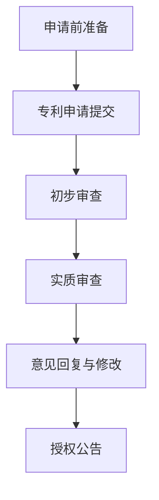

                 

# 《技术专利申请：程序员的财富保护》

> **关键词：技术专利、程序员、创新保护、知识产权、财富增长**

> **摘要：本文深入探讨了技术专利的概念、重要性、申请流程以及程序员的专利策略。通过实际案例解析，提供实用的专利申请实战指南，帮助程序员保护自身技术创新，实现财富增长。**

## 第一部分：技术专利概述与申请流程

### 第1章：技术专利基础

#### 1.1 技术专利的定义与重要性

技术专利，即专利法中所指的技术方案专利，是指根据国家专利法的规定，对发明创造所授予的一种法律权利。这种权利允许专利权人对其发明在一定的地域范围内和一定的时间内享有独占实施权。具体来说，技术专利是一种排他性的权利，它保护发明者在技术领域的创新，防止他人未经许可擅自实施或利用该创新。

技术专利的重要性体现在以下几个方面：

- **保护创新成果**：技术专利为发明人提供了法律手段，以防止他人未经授权使用或模仿其技术成果。这是对技术创新的一种重要激励和保护。
  
- **提高竞争力**：拥有技术专利的企业或个人在市场竞争中拥有显著的优势。技术专利可以作为一种竞争壁垒，阻止竞争对手模仿或复制其产品或服务。

- **促进技术进步**：技术专利的实施和推广可以加速技术创新和技术的传播。通过专利的交流和许可，技术得以在更广泛的范围内应用和发展。

#### 1.2 技术专利的类型

技术专利主要分为三种类型：发明专利、实用新型专利和外观设计专利。

- **发明专利**：发明专利是最为重要的一种专利类型，它涉及对技术方案的原创性、实用性和进步性的保护。发明专利的保护期限通常为20年。

- **实用新型专利**：实用新型专利主要保护产品的形状、构造或其结合所提出的适于实用的新的技术方案。相较于发明专利，实用新型专利的申请门槛较低，审查周期较短，但保护期限通常为10年。

- **外观设计专利**：外观设计专利则保护产品的形状、图案或者其结合以及色彩与形状、图案的结合所作出的富有美感并适于工业应用的新设计。外观设计专利的保护期限通常为15年。

#### 1.3 技术专利的保护范围

技术专利的保护范围由其权利要求书界定。权利要求书通常包括技术特征和限定条件，明确了专利保护的技术方案。具体来说，技术专利的保护范围通常包括以下几个方面：

- **产品权利要求**：描述专利保护的产品，包括产品的具体构成、结构和功能。

- **方法权利要求**：描述专利保护的方法，包括方法的步骤、条件和结果。

- **用途权利要求**：描述专利技术可用于的各种用途和领域。

通过明确的技术专利保护范围，专利权人可以有效地行使其专利权，防止他人未经授权使用其技术成果。

#### 1.4 技术专利的历史与发展

技术专利的历史可以追溯到古希腊和古罗马时期，当时的工匠和发明家通过制作和使用“秘密配方”来保护其发明。然而，现代意义上的专利制度起源于中世纪末的欧洲。

- **早期专利制度**：英国在1624年颁布了世界上第一部现代专利法——《垄断法》，这标志着专利制度的正式确立。随后，欧洲其他国家也纷纷建立了自己的专利制度。

- **现代专利制度**：19世纪，随着工业革命的推进，专利制度逐渐完善。世界各国相继制定和修订了专利法，形成了全球性的专利保护网络。

- **国际专利合作**：20世纪中叶，国际专利合作逐渐加强。1980年，世界知识产权组织（WIPO）成立，旨在促进各国在知识产权领域的合作。

- **技术专利的发展趋势**：随着信息技术的飞速发展，技术专利的重要性日益凸显。现代技术专利不仅包括传统制造业领域的发明，还涵盖了软件、生物技术、互联网等多个新兴领域。

### 第2章：技术专利申请流程

#### 2.1 申请前的准备

在正式提交技术专利申请之前，需要进行一系列准备工作，以确保专利申请的成功和有效性。

##### 2.1.1 研发项目的知识产权保护策略

在研发项目的初期，制定知识产权保护策略是非常重要的。这包括：

- **确定保护需求**：评估研发项目的技术创新点和潜在的市场竞争力，确定哪些部分需要申请专利保护。

- **制定保护方案**：根据项目的具体情况，制定合适的知识产权保护方案。例如，可以选择申请发明专利、实用新型专利或外观设计专利。

- **技术秘密保护**：对于无法申请专利保护的技术信息，可以采取技术秘密保护措施，确保其不被泄露。

##### 2.1.2 专利检索与市场分析

在申请专利之前，进行专利检索和市场分析是必不可少的步骤。这包括：

- **专利检索**：通过专利数据库检索已有的专利信息，了解相关技术领域的现状和竞争态势。这有助于评估技术方案的创新性和市场潜力。

- **市场分析**：分析目标市场，了解竞争对手的专利布局和市场策略，为专利申请提供参考。

##### 2.1.3 预先咨询和法律准备

在申请专利之前，建议咨询专业律师或专利代理人，了解专利申请的具体流程和注意事项。这包括：

- **法律咨询**：咨询专利律师，了解相关法律法规，确保专利申请符合法律规定。

- **申请文件准备**：准备专利申请所需的各种文件，如专利请求书、权利要求书、说明书等。

#### 2.2 专利申请的提交

专利申请的提交是整个申请流程的关键步骤。以下是专利申请提交的详细步骤：

##### 2.2.1 专利申请文件的撰写

专利申请文件是专利申请的核心，通常包括以下组成部分：

- **专利请求书**：包括发明名称、发明人、申请人、地址等信息。

- **权利要求书**：明确专利保护的技术方案，包括产品权利要求和方法权利要求。

- **说明书**：详细描述技术方案的实施方式，包括技术原理、实施步骤、技术效果等。

- **附图**：用图形辅助说明技术方案，包括必要的结构图、流程图等。

##### 2.2.2 专利申请的提交途径

专利申请可以通过以下途径提交：

- **国家知识产权局**：向所在国家或地区的知识产权局提交申请。

- **专利代理机构**：通过专利代理机构提交申请，获取专业指导和支持。

- **国际申请**：通过《专利合作条约》（PCT）提交国际申请，延长国际专利保护期限。

##### 2.2.3 专利申请的审查过程

专利申请提交后，将进入审查过程。审查过程主要包括以下环节：

- **初步审查**：审查员对专利申请进行初步审查，包括形式审查和内容审查。

- **实质审查**：审查员对专利申请的技术方案进行深入审查，包括创新性、实用性和进步性等方面的审查。

- **意见回复**：申请人对审查员的审查意见进行回复，阐述自己的观点和技术方案。

- **授权公告**：专利申请经过审查，符合法律规定后，将公告授权。

#### 2.3 专利审查过程

专利审查过程是技术专利申请流程中的关键环节。以下是专利审查过程的详细步骤：

##### 2.3.1 审查员的审查标准

审查员在审查专利申请时，主要依据以下标准：

- **新颖性**：技术方案在申请日之前没有在国内外公开过。

- **创造性**：技术方案与现有技术相比具有显著的进步。

- **实用性**：技术方案能够在工业上应用，具有实施的可能性。

- **单一性**：专利申请中描述的技术方案属于一个总的发明构思，可以构成一个专利。

##### 2.3.2 专利审查过程中的常见问题

在专利审查过程中，常见的问题包括：

- **新颖性不足**：技术方案与现有技术过于相似。

- **创造性不足**：技术方案与现有技术相比缺乏显著的进步。

- **实用性不足**：技术方案无法在工业上实施。

- **权利要求书缺陷**：权利要求书不清晰、不完整或存在逻辑错误。

针对这些问题，申请人需要及时与审查员沟通，进行意见回复和修改，以争取专利授权。

#### 2.4 专利申请结果的评估与应对策略

专利申请结果可能包括授权、部分授权、驳回等。针对不同的结果，申请人需要采取相应的应对策略：

- **专利授权**：专利申请成功授权后，申请人需要按照法律规定缴纳年费，保持专利权有效。

- **部分授权**：对于部分授权的情况，申请人可以根据审查员的意见对权利要求书进行修改，争取获得全面的授权。

- **专利驳回**：如果专利申请被驳回，申请人需要仔细分析审查员的驳回理由，进行意见回复和修改，争取再次审查。

- **复审与诉讼**：对于驳回决定，申请人可以申请复审或提起诉讼，维护自己的合法权益。

### 第3章：程序员的专利视角

#### 3.1 程序员如何识别技术专利点

对于程序员来说，识别技术专利点是专利申请的第一步。以下是几种常见的方法：

- **技术创新分析**：程序员需要从代码和算法的角度，分析技术方案的创新性。例如，发现一种新的算法、优化方法或者数据处理模型。

- **竞争对手分析**：通过分析竞争对手的技术方案，找到自身的创新点。这包括了解竞争对手的产品、技术文档和已公开的专利。

- **用户需求分析**：了解用户需求和市场趋势，寻找可以解决特定问题的技术创新点。

#### 3.2 程序员的专利策略

程序员的专利策略主要包括以下几个方面：

- **内部专利积累策略**：在项目开发过程中，积极挖掘和申请专利，形成内部专利库。这有助于提高企业的技术竞争力。

- **外部合作与专利布局**：与其他企业或研究机构合作，共同开发新技术，并通过交叉许可等方式进行专利布局。

- **国际专利布局**：在全球化背景下，申请国际专利，扩大技术保护范围，提高市场竞争力。

#### 3.3 程序员在专利申请中的角色与责任

程序员在专利申请中扮演着重要角色，主要职责包括：

- **技术方案描述**：程序员需要准确、详细地描述技术方案，确保专利文件的技术内容清晰、完整。

- **配合审查**：在专利审查过程中，程序员需要与专利代理人或律师密切配合，提供技术解释和意见回复。

- **保护技术秘密**：程序员需要妥善保管技术秘密，确保专利申请过程中不会泄露关键信息。

### 第4章：程序员的专利申请技巧

#### 4.1 专利申请文件的撰写

专利申请文件是专利申请的核心，其质量直接影响到专利申请的成功与否。以下是撰写专利申请文件的一些技巧：

- **权利要求书撰写**：权利要求书是专利申请文件的核心部分，需要准确、完整地描述专利保护范围。程序员需要从技术角度出发，明确技术方案的关键要素和实现方式。

- **说明书撰写**：说明书需要详细描述技术方案的实施过程、技术原理和技术效果。程序员需要确保说明书的逻辑清晰、内容完整，以便审查员理解和评估。

- **附图绘制**：附图是专利申请文件的重要组成部分，可以帮助审查员更好地理解技术方案。程序员需要根据技术方案的特点，绘制出结构清晰、内容准确的附图。

#### 4.2 专利申请中的防御策略

在专利申请过程中，程序员可能面临各种挑战，包括侵权风险和审查意见。以下是几种常见的防御策略：

- **侵权风险规避**：程序员需要了解相关领域的专利现状，避免直接侵犯他人的专利权。可以通过技术改造、重新设计等方式规避侵权风险。

- **应对审查意见**：当专利申请被审查员提出审查意见时，程序员需要认真分析意见内容，制定合理的回复策略。可以通过修改权利要求书、补充技术描述等方式回应审查意见。

#### 4.3 专利申请中的时间管理

专利申请是一个耗时且复杂的过程，时间管理对于专利申请的成功至关重要。以下是专利申请中的时间管理技巧：

- **制定时间计划**：在专利申请开始前，制定详细的时间计划，包括每个阶段的时间节点和任务安排。

- **任务分解**：将专利申请任务分解为具体的子任务，为每个子任务分配时间。

- **进度跟踪**：定期检查进度，确保任务按计划进行。

#### 4.4 专利申请中的风险与应对

在专利申请过程中，程序员可能面临多种风险，包括技术风险、法律风险和市场风险。以下是几种常见的风险及应对策略：

- **技术风险**：技术方案可能存在不可行性或无法实现的风险。程序员需要通过技术验证和测试，确保技术方案的可行性。

- **法律风险**：专利申请可能存在法律缺陷或不符合法律要求的风险。程序员需要与专利代理人或律师密切合作，确保专利申请符合法律规定。

- **市场风险**：专利申请可能无法带来预期的市场回报。程序员需要分析市场需求，确保专利技术的市场前景。

### 第5章：程序员如何参与专利诉讼

#### 5.1 专利诉讼概述

专利诉讼是指专利权人或利害关系人因专利权纠纷而提起的诉讼。专利诉讼的类型主要包括专利侵权诉讼、专利无效诉讼和专利许可诉讼。

- **专利侵权诉讼**：专利权人指控他人侵犯其专利权，要求赔偿损失或停止侵权行为。

- **专利无效诉讼**：专利权人或第三方申请宣告专利无效，质疑专利的有效性。

- **专利许可诉讼**：专利权人与他人因专利许可协议产生的纠纷，提起诉讼。

专利诉讼的流程一般包括起诉、答辩、证据交换、庭审和判决等环节。

#### 5.2 程序员在专利诉讼中的作用

程序员在专利诉讼中扮演着关键角色，其主要作用包括：

- **提供技术证据**：程序员需要提供技术证据，证明其技术方案的创新性和实用性。这包括技术文档、代码实现、测试报告等。

- **辅助律师制定策略**：程序员需要与律师密切合作，提供技术见解，协助律师制定诉讼策略。

#### 5.3 专利诉讼中的程序员的注意事项

程序员在参与专利诉讼时，需要注意以下几个方面：

- **保护自身利益**：程序员需要确保在诉讼过程中，不泄露公司机密或个人技术秘密。

- **遵守法律和职业道德规范**：程序员需要遵守相关法律法规和职业道德规范，确保诉讼过程的公正和合法。

### 第三部分：案例分析与实战指南

#### 第6章：技术专利申请案例解析

##### 6.1 案例一：软件优化算法专利申请

**案例背景**：

某程序员开发了一种用于提高软件运行效率的优化算法。该算法通过重新设计数据结构和算法流程，显著提高了软件的性能和稳定性。

**案例分析**：

程序员在申请专利时，首先进行了专利检索，发现相关技术领域的已有专利主要集中在数据结构优化方面。为了提高专利的创造性，程序员从算法流程的角度进行了创新，提出了一种新的优化方法。

**案例总结**：

该案例展示了如何通过专利检索和创造性思考，提高技术专利的创新性。程序员通过详细的专利申请文件，成功保护了其技术创新。

##### 6.2 案例二：移动应用专利申请

**案例背景**：

某程序员开发了一款创新性的移动应用，该应用通过结合地理位置数据和用户行为分析，提供了个性化的推荐服务。

**案例分析**：

程序员在申请专利时，重点描述了应用的核心算法和实现过程。同时，通过专利检索，确保其专利申请具备新颖性和创造性。

**案例总结**：

该案例展示了如何在移动应用领域申请专利。程序员通过详细的专利申请文件，成功保护了其技术创新，并在后续的商业化过程中取得了显著的经济效益。

#### 第7章：程序员的技术专利申请实战指南

##### 7.1 实战指南一：构建技术专利数据库

**构建原则**：

- **全面性**：数据库应涵盖公司或个人的所有技术创新点。

- **系统性**：数据库应按照技术领域和专利类型进行分类和整理。

- **动态性**：数据库应定期更新，确保信息的准确性和及时性。

**数据库的管理与维护**：

- **数据收集**：通过内部研发项目和外部合作，收集和整理技术创新点。

- **数据审核**：对收集的数据进行审核，确保其准确性和合法性。

- **数据备份**：定期备份数据库，防止数据丢失。

##### 7.2 实战指南二：撰写高质量的专利申请文件

**文件撰写要点**：

- **权利要求书**：准确描述专利保护范围，确保权利要求书具有独立性和完整性。

- **说明书**：详细描述技术方案的实施过程、技术原理和技术效果。

- **附图**：绘制清晰、准确的附图，辅助说明技术方案。

**文件修改与完善**：

- **初步审查**：在初步审查阶段，根据审查员的意见进行修改和完善。

- **意见回复**：在意见回复阶段，针对审查员的意见进行详细回复，阐述自己的观点。

##### 7.3 实战指南三：专利申请中的风险与应对

**常见风险分析**：

- **新颖性不足**：技术方案与现有技术相似。

- **创造性不足**：技术方案缺乏显著的进步。

- **实用性不足**：技术方案无法在工业上应用。

**应对策略与案例分享**：

- **新颖性不足**：通过专利检索，找到与现有技术的差异，修改权利要求书，提高新颖性。

- **创造性不足**：通过重新设计技术方案，提高创造性。

- **实用性不足**：通过技术验证和测试，确保技术方案的实用性。

### 附录

#### 附录一：技术专利申请常用词汇表

- **专利权**：指专利权人对其发明所享有的法律权利。
- **权利要求书**：明确专利保护范围的技术文件。
- **说明书**：详细描述技术方案的实施方式。
- **附图**：用图形辅助说明技术方案。
- **新颖性**：技术方案在申请日前没有在国内外公开过。
- **创造性**：技术方案与现有技术相比具有显著的进步。
- **实用性**：技术方案能够在工业上应用。

#### 附录二：技术专利申请参考书目与资源

- **《专利法》**：国家知识产权局发布，详细介绍专利申请和保护的法律法规。
- **《专利申请实务》**：张三，详细讲解专利申请的流程和技巧。
- **《程序员如何申请专利》**：李四，针对程序员群体，提供专利申请的实用指南。

#### 附录三：技术专利申请流程时间表

| 阶段           | 时间节点         | 描述                                           |
| -------------- | ---------------- | ---------------------------------------------- |
| 申请前准备      | 1-2个月          | 研发项目的知识产权保护策略、专利检索与市场分析   |
| 专利申请提交    | 2-3个月          | 撰写专利申请文件、提交申请                       |
| 初步审查        | 3-6个月          | 审查员对专利申请进行初步审查                     |
| 实质审查        | 6-12个月         | 审查员对专利申请进行深入审查                     |
| 意见回复与修改  | 2-3个月          | 申请人对审查意见进行回复和修改                   |
| 授权公告        | 总计约18-36个月   | 专利申请经过审查，符合法律规定后，公告授权       |

#### 附录四：技术专利申请流程流程图

### 作者信息

**作者：AI天才研究院/AI Genius Institute & 禅与计算机程序设计艺术 /Zen And The Art of Computer Programming** 

本文由AI天才研究院与禅与计算机程序设计艺术联合撰写，旨在为程序员提供全面的技术专利申请指南，帮助程序员保护技术创新，实现财富增长。文章内容经过深入研究和实践总结，力求为读者提供有价值的信息。如果您有任何问题或建议，欢迎随时与我们联系。|

