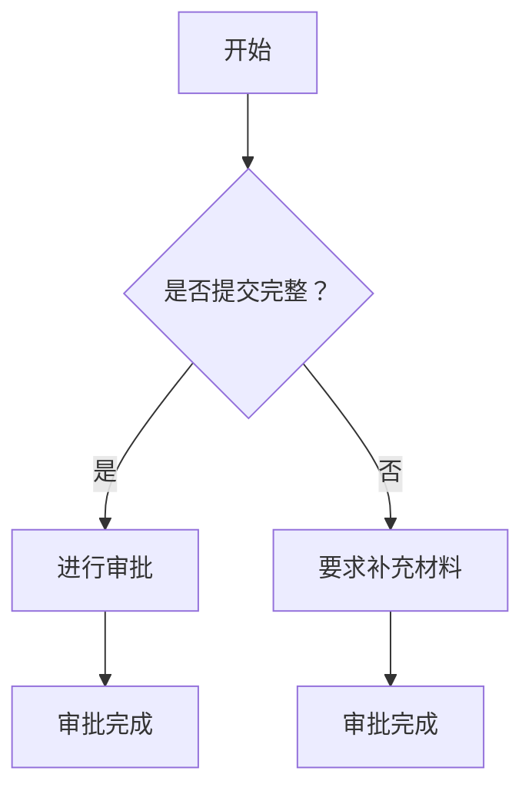

                 

### 第一部分: 技术写作概述

#### 第1章: 技术写作入门

技术写作是一种专业化的写作形式，它主要面向科技和工程领域的专业人士，通过文字、图表、代码等形式传达技术信息、方法和解决方案。在当今信息化社会，技术写作的应用领域越来越广泛，从软件开发、硬件设计到科学研究、技术文档编写，技术写作都扮演着重要的角色。

##### 1.1 技术写作的概念与重要性

**技术写作的定义**

技术写作是一种专业化的写作形式，它通过文字、图表、代码等形式传达技术信息、方法和解决方案。技术写作的核心在于“技术”和“写作”的结合，既要保证内容的准确性、专业性，又要注重表达的清晰性、易懂性。

**技术写作的应用领域**

技术写作广泛应用于软件开发、硬件设计、科学研究、技术文档编写、技术支持等多个领域。在软件开发领域，技术写作体现在代码注释、API文档、用户手册等方面；在硬件设计领域，技术写作体现在技术规格书、操作手册等方面；在科学研究领域，技术写作体现在学术论文、研究报告等方面。

**技术写作的重要性**

技术写作不仅是沟通的桥梁，也是知识管理和传播的重要手段。它能够提高工作效率，降低沟通成本，促进技术创新和知识共享。高质量的技术写作能够使技术信息得到有效传递，使团队成员更容易理解和协作，从而提高整个项目的效率和质量。

##### 1.2 技术写作的基本原则

**清晰性**

清晰性是技术写作的首要原则。技术写作应确保内容清晰易懂，避免使用复杂、模糊的语言。使用简单、直接的语句，使读者更容易理解技术概念和操作步骤。

**简洁性**

简洁性是技术写作的重要原则之一。技术写作应避免冗长和复杂的句子，尽可能用简单的语言表达复杂的概念。通过简化语言，提高文档的可读性和实用性。

**可读性**

可读性是技术写作的核心目标之一。技术写作应注重文风和结构，使内容易于阅读和理解。合理的段落划分、清晰的标题和摘要、逻辑严密的结构，都是提高可读性的关键。

**结构性**

结构性是技术写作的重要原则。技术写作应有良好的逻辑结构，便于读者快速定位所需信息。通过使用列表、标题、摘要等结构化元素，提高文档的易读性和效率。

##### 1.3 技术文档的种类

**用户手册**

用户手册是帮助用户了解和使用产品的详细指南。它通常包括产品的功能介绍、操作流程、故障排除等内容，旨在帮助用户快速上手并解决问题。

**API文档**

API文档详细描述了软件接口的功能、参数和返回值。它为开发者提供了调用API的详细说明，包括如何使用API、API的输入输出参数、可能的错误和解决方案等。

**技术博客**

技术博客是程序员分享技术心得、讨论问题的平台。技术博客通常包括对技术问题的深入分析、解决方案、代码示例等，有助于提升读者的技术水平和知识储备。

**报告**

报告是对项目进展、研究成果或事件进行记录和分析的文档。报告通常包括项目背景、目标、方法、结果和结论等内容，旨在为读者提供详细的信息和见解。

**演示文稿**

演示文稿是展示技术方案、演讲思路和成果的视觉化工具。它通常包括文字、图表、图片和动画等形式，通过直观的方式向读者展示技术内容。

##### 1.4 技术写作的技巧

**提高写作效率的方法**

提高写作效率是技术写作的重要目标之一。以下是一些提高写作效率的方法：

- 使用模板和模板库，减少重复劳动。
- 使用Markdown等标记语言，提高编写速度。
- 使用版本控制工具，方便文档的修改和追踪。
- 使用自动化工具，如自动化文档生成器等。

**使用技术术语的正确方式**

技术术语是技术写作的重要组成部分。正确使用技术术语，可以使文档更专业、更准确。以下是一些使用技术术语的建议：

- 熟悉并掌握常用的技术术语，避免使用生僻词汇。
- 在文档中使用术语时，应提供清晰的解释或定义。
- 保持术语的一致性，避免使用多种不同的表达方式。

**故事化写作**

故事化写作是一种有效的技术写作方法，它通过引入人物、情节和冲突，使技术内容更具吸引力和可读性。以下是一些故事化写作的技巧：

- 创建一个引人入胜的故事背景，使读者产生共鸣。
- 引入主人公和反派角色，增加故事的戏剧性。
- 通过情节的发展，逐步揭示技术概念和解决方案。

**代码注释与文档化**

代码注释是技术写作的重要组成部分，它有助于他人理解和维护代码。以下是一些有效的代码注释实践：

- 为每个函数和类提供简洁、清晰的注释，描述其功能和目的。
- 注释应与代码内容保持一致，避免冗余。
- 定期更新和维护注释，确保其准确性。

##### 1.5 技术写作的工具与资源

**文本编辑器**

文本编辑器是技术写作的重要工具。以下是一些常用的文本编辑器：

- Sublime Text
- Visual Studio Code
- Atom

**版本控制工具**

版本控制工具用于管理文档的版本和历史，确保文档的稳定性和可追溯性。以下是一些常用的版本控制工具：

- Git
- SVN
- Mercurial

**写作辅助工具**

写作辅助工具可以帮助提高写作质量和效率。以下是一些常用的写作辅助工具：

- Grammarly
- Hemingway Editor
- Zotero

**学习资源与社区**

学习资源与社区是技术写作的重要支持。以下是一些学习资源与社区：

- Stack Overflow
- GitHub
- Medium
- Reddit

### 第一部分: 技术写作概述

#### 第1章: 技术写作入门

##### 1.1 技术写作的概念与重要性

**技术写作的定义**

技术写作是一种专业化的写作形式，主要面向科技和工程领域的专业人士，旨在通过文字、图表、代码等形式传达技术信息、方法和解决方案。它不同于普通写作，其核心在于对技术概念、原理、应用等方面进行深入、精确的描述和解释。

技术写作不仅包括传统的文本形式，还涵盖了图表、图像、代码等多种表现形式。这些不同的表达方式使得技术写作能够更直观、更具体地传达复杂的技术概念，帮助读者更好地理解和掌握相关技术。

**技术写作的应用领域**

技术写作的应用领域非常广泛，涵盖了多个科技和工程领域。以下是一些主要的应用场景：

1. **软件开发**：技术写作在软件开发中扮演着至关重要的角色。开发者在编写代码的同时，需要为代码编写注释，描述代码的功能、目的和使用方法。此外，API文档、用户手册、开发指南等技术文档也是软件开发的重要组成部分。

2. **硬件设计**：在硬件设计中，技术写作用于编写技术规格书、操作手册、维护手册等文档，帮助工程师了解硬件的原理、操作方法和维护方法。

3. **科学研究**：在科学研究领域，技术写作体现在学术论文、研究报告、实验记录等方面。这些文档需要详细描述研究过程、实验方法、数据分析结果和结论，以便其他研究者参考和验证。

4. **技术支持**：技术支持人员需要编写故障排除手册、技术指南、操作流程等文档，帮助用户解决技术问题。

5. **在线教育**：随着在线教育的普及，技术写作被广泛应用于教材编写、课程讲义、教学视频脚本等方面。

**技术写作的重要性**

技术写作在科技和工程领域的重要性不言而喻。以下是几个关键点：

1. **知识传播**：技术写作是知识传播的重要手段。通过技术文档、技术博客、学术论文等形式，技术知识得以广泛传播，为行业的发展和技术进步提供了坚实的基础。

2. **工作效率**：高质量的技术文档能够提高团队的工作效率。清晰的代码注释、详尽的API文档和用户手册等文档，使得团队成员能够更快地理解和使用相关技术，减少沟通成本和错误率。

3. **知识管理**：技术写作有助于知识的管理和积累。通过编写文档，技术人员可以将自己的经验和知识系统地整理和保存，为后续的工作提供参考和指导。

4. **项目管理**：技术文档是项目管理的重要工具。项目经理可以通过技术文档了解项目的进展、风险和问题，及时调整项目计划和资源分配。

5. **团队协作**：技术写作能够促进团队协作。通过共享文档，团队成员可以更有效地沟通和协作，共同完成项目任务。

##### 1.2 技术写作的基本原则

**清晰性**

清晰性是技术写作的首要原则。技术文档的目标是传达技术信息，因此内容必须清晰、准确，避免使用模糊、含糊不清的表述。以下是一些提高清晰性的建议：

1. **简洁明了**：避免使用复杂、冗长的句子，尽量使用简单、直接的语言。例如，用“实现功能A”而不是“执行操作以实现功能A”。

2. **避免专业术语**：在适当的情况下，避免使用专业术语，或者在使用时提供清晰的解释。对于不可避免的专业术语，应在文档中提供定义或背景信息。

3. **统一术语**：在整个文档中保持术语的一致性。避免在不同的部分使用不同的术语描述同一个概念。

**简洁性**

简洁性是技术写作的重要原则之一。技术文档应避免冗长和复杂的句子，尽可能用简单的语言表达复杂的概念。以下是一些提高简洁性的建议：

1. **去除冗余**：删除不必要的重复信息和冗余表述，确保每个段落和句子都有明确的目的。

2. **使用列表**：使用列表和项目符号来组织信息，使文档结构更清晰，更容易阅读。

3. **简短段落**：将长段落分割成更短、更具体的段落，每个段落专注于一个主题。

**可读性**

可读性是技术写作的核心目标之一。技术文档应该易于阅读和理解，以便读者能够快速找到所需信息。以下是一些提高可读性的建议：

1. **清晰的标题和摘要**：在每个章节和段落之前添加清晰的标题和摘要，帮助读者快速了解内容。

2. **逻辑结构**：确保文档内容有良好的逻辑结构，按照自然的思维流程组织信息。

3. **适当的图表和代码**：使用图表和代码来展示技术细节，提高文档的可读性和实用性。

**结构性**

结构性是技术写作的重要原则。技术文档应有良好的逻辑结构，便于读者快速定位所需信息。以下是一些提高结构性的建议：

1. **使用标题和子标题**：使用标题和子标题来组织内容，使文档结构清晰、易于导航。

2. **合理的段落划分**：将内容划分为合理的段落，每个段落专注于一个主题。

3. **索引和目录**：为文档添加索引和目录，帮助读者快速查找所需信息。

##### 1.3 技术文档的种类

**用户手册**

用户手册是帮助用户了解和使用产品的详细指南。它通常包括产品的功能介绍、操作流程、故障排除等内容，旨在帮助用户快速上手并解决问题。

**API文档**

API文档详细描述了软件接口的功能、参数和返回值。它为开发者提供了调用API的详细说明，包括如何使用API、API的输入输出参数、可能的错误和解决方案等。

**技术博客**

技术博客是程序员分享技术心得、讨论问题的平台。技术博客通常包括对技术问题的深入分析、解决方案、代码示例等，有助于提升读者的技术水平和知识储备。

**报告**

报告是对项目进展、研究成果或事件进行记录和分析的文档。报告通常包括项目背景、目标、方法、结果和结论等内容，旨在为读者提供详细的信息和见解。

**演示文稿**

演示文稿是展示技术方案、演讲思路和成果的视觉化工具。它通常包括文字、图表、图片和动画等形式，通过直观的方式向读者展示技术内容。

##### 1.4 技术写作的技巧

**提高写作效率的方法**

提高写作效率是技术写作的重要目标之一。以下是一些提高写作效率的方法：

1. **使用模板和模板库**：使用模板和模板库可以减少重复劳动，提高文档编写的速度和质量。模板库可以存储常用的文档结构、段落和语句，方便随时调用。

2. **使用Markdown等标记语言**：Markdown等标记语言能够快速生成格式化文档，提高写作效率。Markdown具有简单易学、支持多种格式（如标题、列表、代码块等）的特点，使得文档编写更加便捷。

3. **使用版本控制工具**：版本控制工具（如Git）可以方便地管理文档的版本和历史，确保文档的修改和追踪。使用版本控制工具，可以方便地回滚到之前的版本，避免文档丢失或错误。

4. **使用自动化工具**：自动化工具（如自动化文档生成器）可以自动生成文档，减少人工编写的工作量。自动化工具通常支持模板、代码注入等功能，可以根据需求快速生成高质量的文档。

**使用技术术语的正确方式**

技术术语是技术写作的重要组成部分，正确使用技术术语可以使文档更专业、更准确。以下是一些使用技术术语的建议：

1. **熟悉并掌握常用的技术术语**：在技术写作过程中，应熟悉并掌握常用的技术术语，避免使用生僻词汇。对于不熟悉的技术术语，可以查阅相关资料或咨询专业人士。

2. **在文档中提供清晰的解释或定义**：对于文档中使用的专业术语，应在文档中提供清晰的解释或定义。这样可以帮助读者更好地理解术语的含义，提高文档的可读性。

3. **保持术语的一致性**：在整个文档中保持术语的一致性，避免在不同的部分使用不同的术语描述同一个概念。一致性可以提高文档的专业性和可信度。

4. **避免过度使用专业术语**：在适当的情况下，避免过度使用专业术语。对于非专业人士，过度使用专业术语可能会使他们难以理解文档内容。在必要的情况下，可以使用通俗的语言解释专业术语。

**故事化写作**

故事化写作是一种有效的技术写作方法，它通过引入人物、情节和冲突，使技术内容更具吸引力和可读性。以下是一些故事化写作的技巧：

1. **创建引人入胜的故事背景**：在技术写作中，可以为技术内容创建一个引人入胜的故事背景。这样的背景可以帮助读者更好地理解技术概念和解决方案。

2. **引入主人公和反派角色**：通过引入主人公和反派角色，可以增加故事的戏剧性。主人公通常代表技术解决方案，反派角色则代表技术挑战或问题。

3. **通过情节的发展逐步揭示技术内容**：在故事中，通过情节的发展逐步揭示技术内容，可以帮助读者更好地理解技术原理和应用。例如，可以讲述主人公如何解决某个技术问题，以及解决问题的过程中遇到的困难和挑战。

4. **使用对话和描述**：在故事中，使用对话和描述来展示技术内容。对话可以更好地展示人物之间的互动和技术交流，描述可以更生动地描绘技术场景。

**代码注释与文档化**

代码注释是技术写作的重要组成部分，它有助于他人理解和维护代码。以下是一些有效的代码注释实践：

1. **为每个函数和类提供注释**：为每个函数和类提供简洁、清晰的注释，描述其功能和目的。注释应包括函数或类的输入参数、输出结果以及可能的错误处理。

2. **保持注释与代码内容一致**：注释应与代码内容保持一致，避免出现注释与实际代码不一致的情况。这样可以确保代码的可维护性和一致性。

3. **定期更新和维护注释**：代码会不断更新和改进，因此注释也需要定期更新和维护。定期检查和更新注释，确保其准确性和完整性。

4. **使用文档化工具**：使用文档化工具（如Doxygen、JSDoc等）可以自动生成文档，提高代码注释的效率和质量。这些工具可以根据代码注释生成详细的文档，包括函数和类的说明、参数和返回值等。

##### 1.5 技术写作的工具与资源

**文本编辑器**

文本编辑器是技术写作的重要工具。以下是一些常用的文本编辑器：

- **Sublime Text**：Sublime Text是一款功能强大、轻量级的文本编辑器，支持多种编程语言，提供丰富的插件和扩展功能。
- **Visual Studio Code**：Visual Studio Code是一款免费、开源的代码编辑器，支持多种编程语言，具有强大的代码补全、调试和版本控制功能。
- **Atom**：Atom是一款由GitHub开发的文本编辑器，支持多种编程语言，具有丰富的插件和市场，适合程序员进行技术写作。

**版本控制工具**

版本控制工具用于管理文档的版本和历史，确保文档的稳定性和可追溯性。以下是一些常用的版本控制工具：

- **Git**：Git是一款分布式版本控制工具，具有高效、灵活的特点，广泛用于软件开发和文档管理。
- **SVN**：SVN是一款集中式版本控制工具，支持大型的项目管理和多用户协作，但在分布式协作方面相对较弱。
- **Mercurial**：Mercurial是一款分布式版本控制工具，与Git类似，具有高效、灵活的特点，适用于小型和大型项目。

**写作辅助工具**

写作辅助工具可以帮助提高写作质量和效率。以下是一些常用的写作辅助工具：

- **Grammarly**：Grammarly是一款语法检查工具，可以帮助检测拼写、语法错误，并提供修改建议。
- **Hemingway Editor**：Hemingway Editor是一款在线写作辅助工具，可以帮助简化句子、减少使用复杂词汇，提高文档的可读性。
- **Zotero**：Zotero是一款文献管理工具，可以帮助收集、整理和引用文献，提高写作效率。

**学习资源与社区**

学习资源与社区是技术写作的重要支持。以下是一些学习资源与社区：

- **Stack Overflow**：Stack Overflow是全球最大的开发者问答社区，提供了丰富的编程问题和解决方案，是技术写作的重要参考资料。
- **GitHub**：GitHub是全球最大的代码托管平台，提供了丰富的开源项目和文档，是学习技术写作的重要资源。
- **Medium**：Medium是一个在线出版平台，提供了大量的技术文章和博客，是学习技术写作的良师益友。
- **Reddit**：Reddit是一个社交新闻网站，有许多技术社区和论坛，提供了广泛的技术讨论和交流。

### 第一部分: 技术写作概述

#### 第2章: 技术文档编写实践

##### 2.1 编写高质量文档的方法

编写高质量的技术文档是一个系统化的过程，它要求文档编写者不仅要有扎实的技术基础，还需要具备良好的写作技巧和项目管理能力。以下是一些编写高质量文档的方法：

**用户需求分析**

在开始编写文档之前，首先要进行用户需求分析。这包括了解目标用户的背景、技术水平、使用场景和需求。通过用户需求分析，文档编写者可以明确文档的目的和受众，从而有针对性地撰写内容。

1. **确定目标用户**：明确文档的目标用户，如初级用户、中级用户还是高级用户。
2. **了解用户背景**：收集目标用户的背景信息，包括他们的工作经验、技术水平和兴趣爱好。
3. **分析用户需求**：通过调查问卷、用户访谈等方式，了解用户的需求和痛点，确保文档能够满足他们的需求。

**内容规划与组织**

内容规划与组织是编写高质量文档的关键步骤。一个良好的文档结构应该清晰、逻辑性强，便于用户查找和理解。

1. **制定文档大纲**：根据用户需求，制定文档的大纲，明确每个章节的主题和内容。
2. **合理安排内容**：将内容按照逻辑顺序组织，确保每个章节的内容前后连贯、层次分明。
3. **使用标题和子标题**：使用清晰、简洁的标题和子标题，帮助用户快速找到所需信息。

**修订与反馈**

修订与反馈是确保文档质量的重要环节。在文档编写过程中，文档编写者应该不断收集用户反馈，并根据反馈进行修订。

1. **内部审查**：在文档编写完成后，进行内部审查，检查文档的逻辑性、连贯性和准确性。
2. **用户测试**：邀请目标用户进行测试，收集他们的反馈和建议。
3. **修订与完善**：根据用户反馈，对文档进行修订和完善，确保文档的实用性。

##### 2.2 编写用户手册的技巧

用户手册是帮助用户了解和使用产品的详细指南，它是技术文档中最常见的一种。以下是一些编写用户手册的技巧：

**目标读者分析**

在编写用户手册之前，首先要明确目标读者。了解目标读者的背景和技术水平，可以帮助文档编写者有针对性地撰写内容。

1. **确定目标读者**：明确用户手册的目标读者，如初级用户、中级用户还是高级用户。
2. **分析读者需求**：了解目标读者的需求和痛点，确保手册能够满足他们的需求。

**功能介绍与操作流程**

用户手册的核心内容是产品的功能介绍和操作流程。这部分需要详细、清晰地描述产品的功能和使用方法。

1. **功能介绍**：详细列出产品的功能，并解释每个功能的作用和使用方法。
2. **操作流程**：提供清晰的操作步骤，确保用户能够按照步骤顺利完成操作。
3. **使用案例**：提供实际使用案例，帮助用户更好地理解功能的使用方法。

**故障排除与FAQ**

故障排除和FAQ（常见问题解答）是用户手册中的重要部分，它可以帮助用户解决在使用过程中遇到的问题。

1. **故障排除**：列出常见的故障现象和解决方法，帮助用户快速解决故障。
2. **FAQ**：收集用户常见的问题，并提供详细的解答，减少用户咨询的频率。

**示例与图表**

使用示例和图表可以增强用户手册的可读性和实用性。

1. **示例**：提供具体的操作示例，帮助用户更好地理解功能的使用方法。
2. **图表**：使用图表展示操作步骤、数据结构等，使内容更直观、易懂。

**用户反馈与修订**

在用户手册编写完成后，收集用户的反馈并进行修订是提高文档质量的重要环节。

1. **用户测试**：邀请目标用户进行测试，收集他们的反馈和建议。
2. **修订与完善**：根据用户反馈，对文档进行修订和完善，确保文档的实用性。

##### 2.3 编写API文档的细节

API文档是描述软件接口的详细指南，它为开发者提供了调用API的详细说明。以下是一些编写API文档的细节：

**接口描述**

接口描述是API文档的核心部分，它详细描述了API的功能、输入和输出。

1. **功能描述**：简要说明API的功能，帮助开发者了解API的作用。
2. **输入描述**：详细列出API的输入参数，包括参数名称、类型、默认值和说明。
3. **输出描述**：详细列出API的输出结果，包括返回值、类型和可能的错误信息。

**参数说明**

参数说明是对接口输入参数的详细解释，它帮助开发者正确使用API。

1. **参数名称**：明确每个参数的名称，避免使用模糊的术语。
2. **参数类型**：指定每个参数的数据类型，如整数、字符串、布尔值等。
3. **默认值**：提供每个参数的默认值，如果有的话。
4. **说明**：为每个参数提供详细的说明，包括参数的作用、限制和注意事项。

**代码示例**

代码示例是API文档的重要组成部分，它通过具体的代码示例，帮助开发者理解API的使用方法。

1. **示例代码**：提供具体的代码示例，演示如何调用API。
2. **说明**：为每个示例代码提供详细的说明，解释代码的作用和执行结果。
3. **可复制性**：确保示例代码可以直接复制粘贴到开发环境中运行。

**错误处理**

错误处理是API文档中不可或缺的一部分，它详细描述了API调用可能遇到的错误及其处理方法。

1. **错误码**：列出可能出现的错误码，并提供详细的说明。
2. **错误信息**：为每个错误提供详细的错误信息，帮助开发者快速定位和解决问题。
3. **解决方案**：提供解决问题的方法和建议，包括可能的代码修改和配置调整。

##### 2.4 撰写技术博客的要点

技术博客是程序员分享技术心得、讨论问题的平台，它有助于提升读者的技术水平和知识储备。以下是一些撰写技术博客的要点：

**文章结构**

良好的文章结构是技术博客成功的关键，它使文章内容清晰、易于阅读。

1. **引言**：简要介绍文章的主题，吸引读者的注意力。
2. **背景**：提供相关的背景信息，帮助读者理解文章的内容。
3. **正文**：详细阐述文章的主题，包括技术原理、实现方法和应用场景。
4. **结论**：总结文章的主要观点，为读者提供有价值的建议。

**内容深度**

技术博客的内容深度是吸引读者的重要因素，它要求作者对技术问题有深入的理解和见解。

1. **深入分析**：对技术问题进行深入的分析，提供详细的解释和实例。
2. **实例演示**：通过实际案例或代码示例，展示技术原理和应用。
3. **扩展阅读**：提供相关的参考文献和扩展阅读，帮助读者深入了解技术问题。

**图表与代码**

使用图表和代码可以增强技术博客的可读性和实用性。

1. **图表**：使用图表展示技术原理、数据结构和算法等，使内容更直观、易懂。
2. **代码**：提供具体的代码示例，帮助读者理解技术实现过程。

**可读性**

良好的可读性是技术博客成功的关键，它要求作者注重文风和语言表达。

1. **简洁明了**：使用简洁、直接的语言，避免冗长、复杂的句子。
2. **统一术语**：在整个博客中使用统一的术语，避免混淆读者。
3. **段落清晰**：将内容划分为清晰的段落，每个段落专注于一个主题。

##### 2.5 技术写作中的常见问题与解决

在技术写作过程中，常见的一些问题可能会影响文档的质量和读者的体验。以下是一些常见问题及其解决方法：

**语言风格不一致**

语言风格不一致会导致文档内容显得杂乱，降低可读性。解决方法包括：

1. **制定统一的写作风格指南**：为文档编写者提供统一的写作风格指南，明确语言风格的要求。
2. **定期审查**：在文档编写过程中，定期审查语言风格的一致性，确保整个文档保持一致的风格。

**信息冗余**

信息冗余会增加文档的篇幅，降低文档的可读性。解决方法包括：

1. **删除重复信息**：在编写文档时，注意删除重复的信息，确保每个部分的内容都是独特的。
2. **精简内容**：对文档内容进行精简，去除不必要的细节，确保文档的核心内容清晰、简洁。

**缺乏针对性**

缺乏针对性会导致文档内容无法满足读者的需求，降低文档的实用性。解决方法包括：

1. **明确目标读者**：在编写文档之前，明确目标读者，确保文档内容针对目标读者的需求和水平。
2. **用户测试**：在文档编写完成后，邀请目标用户进行测试，收集他们的反馈，并根据反馈进行修订。

**过度专业术语**

过度使用专业术语可能会使文档内容难以理解，降低文档的可读性。解决方法包括：

1. **使用通俗语言解释专业术语**：在文档中使用专业术语时，应提供通俗的解释或定义，帮助读者理解。
2. **限制专业术语的使用**：在适当的情况下，避免过度使用专业术语，使用简单的语言表达复杂的概念。

### 第一部分: 技术写作概述

#### 第3章: 技术写作的进阶技巧

技术写作的进阶技巧包括故事化写作、跨平台写作与协作、技术写作中的代码注释以及构建技术写作社区。通过掌握这些技巧，技术人员不仅可以提升自己的写作能力，还能更好地在技术领域发挥影响力。

##### 3.1 故事化写作的应用

故事化写作是一种将技术内容以故事的形式呈现的方法，它通过引入人物、情节和冲突，使技术内容更加生动、有趣，从而提高读者的阅读兴趣和理解能力。

**故事化写作的概念**

故事化写作的核心在于将技术内容转化为故事，使其具备故事的三个基本要素：人物、情节和冲突。通过这些要素，技术内容不再只是枯燥的描述，而成为一个引人入胜的故事。

**如何将技术内容转化为故事**

1. **确定主人公**：选择一个技术主题，并为这个主题确定一个主人公。主人公可以是技术人员、产品、系统等。
2. **设定情节**：设计一个引人入胜的情节，使主人公面临一个技术挑战或问题。这个情节应该具有戏剧性，能够激发读者的兴趣。
3. **引入冲突**：在情节中引入冲突，使主人公需要通过解决技术问题来克服挑战。冲突可以是技术难题、资源限制、时间压力等。

**故事化写作的优势**

1. **提高可读性**：故事化写作使技术内容更具吸引力，提高读者的阅读兴趣和理解能力。
2. **增强记忆**：通过故事的形式，技术概念和解决方案更容易被读者记住。
3. **促进理解**：故事中的情节和冲突可以帮助读者更好地理解技术概念和应用。

##### 3.2 跨平台写作与协作

跨平台写作与协作是指在不同设备和平台之间进行文档编写和协作的方法。随着技术的发展，越来越多的技术人员需要在不同设备和平台之间进行工作，因此掌握跨平台写作与协作技巧变得越来越重要。

**多平台文档写作**

1. **使用Markdown**：Markdown是一种轻量级的标记语言，支持多种平台，如GitHub、Stack Overflow、Medium等。使用Markdown可以方便地在不同平台之间进行文档编写和分享。
2. **使用云文档**：云文档服务（如Google Docs、OnlyOffice等）允许用户在不同设备和平台之间实时协作，方便团队成员共同编辑文档。

**文档协作工具**

1. **版本控制工具**：Git是一个分布式版本控制工具，可以帮助团队管理文档的版本和历史。通过Git，团队成员可以方便地协同工作，避免文档冲突。
2. **协作平台**：Jira、Trello等协作平台可以帮助团队管理项目进度、任务分配和文档协作。这些平台通常支持实时编辑、评论和通知功能，提高团队的协作效率。

**版本管理与发布**

1. **版本控制**：通过版本控制工具，团队可以方便地管理文档的版本，确保文档的稳定性和可追溯性。团队成员可以在各自的分支上进行修改，然后合并到主分支。
2. **持续集成与部署**：使用持续集成和部署（CI/CD）工具，团队可以自动化文档的构建、测试和发布过程。这有助于提高文档的质量和发布效率。

##### 3.3 技术写作中的代码注释

代码注释是技术文档的重要组成部分，它通过为代码添加注释，帮助其他开发者理解代码的功能、结构和逻辑。有效的代码注释可以提高代码的可读性和可维护性。

**代码注释的重要性**

1. **提高代码可读性**：注释可以帮助其他开发者快速理解代码的功能和意图，减少阅读代码的时间。
2. **提高代码可维护性**：随着代码的演进，注释可以帮助开发者了解代码的历史和变更原因，方便代码的维护和改进。
3. **促进代码共享**：注释可以促进团队成员之间的代码共享和协作，提高整体开发效率。

**有效的代码注释实践**

1. **为每个函数和类编写注释**：注释应该描述函数或类的功能、参数、返回值和注意事项。
2. **保持注释与代码的一致性**：注释应与代码同步更新，避免出现注释与代码不一致的情况。
3. **使用统一的注释格式**：在团队内部制定统一的注释格式，确保注释的一致性和可读性。

**代码与文档的同步更新**

1. **自动化工具**：使用自动化工具（如Doxygen、JSDoc等）可以自动生成代码注释文档，确保代码注释与文档的同步更新。
2. **定期检查**：定期检查代码注释和文档，确保它们保持一致，及时更新错误的注释和过时的文档。

##### 3.4 构建技术写作社区

构建技术写作社区可以帮助技术人员分享知识、交流经验，提高个人和团队的技术水平。一个活跃的社区可以吸引更多的读者，扩大技术影响力。

**社区建设的目的**

1. **知识共享**：通过社区，技术人员可以分享自己的技术经验和知识，帮助他人解决技术问题。
2. **技能提升**：参与社区讨论和写作，可以促进技术人员不断学习和提升自己的技能。
3. **人脉拓展**：通过社区，技术人员可以结识更多同行，建立合作关系，拓展职业网络。

**社区管理策略**

1. **明确社区规则**：制定社区规则，确保社区秩序和氛围良好。规则应包括发言准则、行为规范、版权声明等。
2. **维护社区活跃度**：定期举办活动，如技术分享会、研讨会等，提高社区的活跃度。
3. **激励贡献者**：对社区贡献者给予奖励和认可，鼓励他们继续贡献知识和经验。

**社区互动与反馈**

1. **鼓励参与**：鼓励成员积极参与社区讨论和写作，提供有价值的观点和见解。
2. **及时反馈**：对成员的贡献给予及时的反馈和评价，鼓励他们继续努力。
3. **改进与优化**：根据社区反馈，不断改进和优化社区功能和服务，提高用户体验。

### 第一部分: 技术写作概述

#### 第4章: 程序员副业的类型与选择

程序员副业，即程序员在保持全职工作之余，利用自己的技术能力和时间进行额外工作的行为。这不仅可以帮助程序员提升个人技能、扩展职业网络，还可以为他们的财务状况带来一定程度的改善。选择合适的副业类型对于程序员来说至关重要。下面我们将详细探讨程序员可以从事的几种常见副业类型，以及选择副业的几个关键标准。

##### 4.1 程序员副业的种类

**自由职业**

自由职业是程序员最常见的一种副业形式。作为自由职业者，程序员可以通过个人网站、社交媒体平台、在线工作市场（如Upwork、Freelancer等）等渠道接取项目。这种副业形式具有灵活性高、收入稳定的特点。

**开源项目参与**

开源项目参与是程序员通过贡献代码、文档或测试等，为开源社区做出贡献的一种方式。参与开源项目不仅能够提升编程技能，还可以增加个人在技术社区的影响力。此外，一些开源项目还会提供赞助或捐赠，作为对贡献者的奖励。

**技术顾问**

技术顾问是程序员为企业和个人提供技术咨询服务的一种副业形式。技术顾问可以为企业解决技术难题，提供软件开发、系统优化等咨询服务。这种副业形式要求程序员具备扎实的专业技能和丰富的实践经验。

**在线教育**

在线教育是程序员通过在线平台（如Coursera、Udemy等）开设课程，教授编程和技术知识的一种方式。在线教育不仅可以帮助程序员实现知识变现，还可以帮助他们提升教学能力和表达能力。

**软件开发**

自主开发软件产品是程序员将自己的创意变为现实，并通过销售或授权获得收益的一种副业形式。这种副业形式风险较高，但一旦成功，回报也可能非常可观。

##### 4.2 选择副业的标准

**个人兴趣与优势**

选择副业时，首先需要考虑个人兴趣和优势。选择自己感兴趣且擅长的领域，可以增加工作的热情和投入，提高工作效率和质量。同时，个人兴趣和优势也是副业成功的关键因素之一。

**时间投入与回报**

在考虑副业时，需要评估所需的时间投入和预期的回报。虽然自由职业和技术顾问等副业形式可能带来较高的收入，但也需要投入大量的时间和精力。因此，合理评估时间和回报，确保能够在保证主职工作质量的同时，有效地进行副业工作。

**职业发展**

选择副业时，还应考虑其对职业发展的影响。一些副业形式，如开源项目参与和在线教育，不仅可以帮助提升专业技能，还可以为职业发展提供更多的机会。因此，选择有助于个人职业发展的副业类型，是一种明智的选择。

**市场需求**

市场需求是选择副业时不可忽视的因素。选择市场需求大、竞争相对较小的领域，可以降低进入门槛，提高成功的可能性。同时，市场需求的变化也会影响副业的可持续性，因此需要定期进行市场分析，确保副业的适应性。

**资源准备**

资源准备包括时间、资金、技能等。在开始副业之前，需要评估自己是否具备所需的资源和能力。例如，自由职业者需要具备良好的沟通能力和项目交付能力；技术顾问需要具备丰富的行业经验和专业素养。在资源准备充分的情况下，才能更好地开展副业。

##### 4.3 评估副业的可行性

**市场需求分析**

在开始副业之前，进行市场需求分析是至关重要的一步。通过分析市场需求，可以了解目标市场的规模、增长趋势、竞争情况等。以下是一些进行市场需求分析的方法：

1. **市场调研**：通过在线调研、问卷调查、访谈等方式，收集目标市场的相关信息。
2. **竞争对手分析**：分析竞争对手的产品、服务、市场份额等，了解自身的竞争地位。
3. **行业报告**：查阅行业报告，获取关于市场趋势、市场规模、增长预测等数据。

**竞争情况**

在评估副业的可行性时，竞争情况是一个重要的考量因素。竞争激烈的市场可能意味着较低的进入门槛，但也可能导致利润空间有限。以下是一些分析竞争情况的方法：

1. **市场占有率**：分析市场上主要竞争对手的市场占有率，了解自身的竞争地位。
2. **产品差异化**：分析自身产品的差异化优势，确定如何在与竞争对手的竞争中脱颖而出。
3. **定价策略**：根据市场需求和竞争情况，制定合理的定价策略。

**资源准备**

资源准备包括时间、资金、技能等。以下是一些评估资源准备的方法：

1. **时间评估**：评估个人可投入副业的时间，确保不会影响主职工作的质量。
2. **资金评估**：评估所需的启动资金，确定资金来源和融资渠道。
3. **技能评估**：评估个人在相关领域的技能水平，确定是否需要进一步学习和培训。

**风险评估**

在开展副业之前，进行风险评估是必要的。以下是一些常见的风险评估方法：

1. **财务风险评估**：评估副业可能带来的财务风险，如收入不稳定、成本超支等。
2. **市场风险**：评估市场变化对副业的影响，如市场需求下降、竞争加剧等。
3. **法律风险**：评估可能面临的法律风险，如合同纠纷、知识产权侵权等。

通过全面的市场需求分析、竞争情况评估、资源准备和风险评估，程序员可以更好地评估副业的可行性，并制定相应的策略和计划，以确保副业的成功和可持续发展。

##### 4.4 平衡主职与副业

对于程序员来说，平衡主职工作和副业是一个挑战，但也是一个重要的任务。以下是一些平衡主职与副业的策略：

**时间管理技巧**

合理的时间管理是平衡主职与副业的关键。以下是一些时间管理技巧：

1. **优先级设定**：根据任务的紧急程度和重要性，设定优先级，确保关键任务优先完成。
2. **番茄工作法**：使用番茄工作法，将工作时间划分为25分钟的工作周期，每个周期后休息5分钟，提高工作效率。
3. **避免拖延**：设定明确的目标和截止日期，避免拖延，确保任务按时完成。

**优先级设定**

在平衡主职与副业时，优先级设定至关重要。以下是一些建议：

1. **主职工作优先**：确保主职工作的质量和进度，避免因副业而影响主职工作的表现。
2. **紧急任务优先**：对于紧急的任务，无论主职还是副业，都应优先处理。
3. **长期目标与短期目标**：设定短期和长期目标，确保在追求长期目标的同时，不忽视短期任务的完成。

**风险控制**

在平衡主职与副业时，风险控制也是不可忽视的一环。以下是一些风险控制策略：

1. **明确职责**：与雇主和副业客户明确职责分工，避免职责重叠和冲突。
2. **风险管理计划**：制定风险管理计划，提前识别和应对潜在的风险。
3. **备份方案**：为可能出现的意外情况制定备份方案，确保主职工作和副业不会因此受到影响。

### 第一部分: 技术写作概述

#### 第5章: 副业实践：自由职业与项目开发

自由职业与项目开发是程序员常见且受欢迎的副业形式。这两种形式不仅可以帮助程序员提高收入，还可以提升他们的项目管理能力和技术实现能力。在本章中，我们将详细探讨自由职业的准备工作、项目开发与团队协作、技术栈与工具选择以及项目上线与维护。

##### 5.1 自由职业的准备工作

**个人品牌建设**

个人品牌是自由职业者成功的关键因素之一。以下是一些个人品牌建设的建议：

1. **创建个人网站**：个人网站是展示个人技能和作品的重要平台。网站应包括个人简介、技术栈、项目经历、联系方式等。
2. **社交媒体推广**：利用LinkedIn、Twitter、GitHub等社交媒体平台，分享技术文章、项目进展和个人见解，吸引潜在客户的关注。
3. **参与社区活动**：参与技术社区、论坛、Meetup等活动，扩大人脉，提高个人知名度。

**能力展示与营销**

展示能力和进行营销是自由职业成功的关键。以下是一些具体的做法：

1. **案例作品集**：准备一份详细的案例作品集，包括项目描述、技术实现、成果展示等。这可以帮助潜在客户了解你的专业能力和工作质量。
2. **提供免费服务**：通过提供免费咨询服务或试作品，吸引潜在客户，建立信任关系。
3. **价格策略**：根据市场需求和个人能力，制定合理的价格策略，确保既有竞争力又能保证收入。

**合同管理与法律风险**

自由职业者应重视合同管理和法律风险。以下是一些建议：

1. **合同模板**：使用标准的合同模板，确保合同条款清晰、明确。
2. **审查合同**：在签订合同前，仔细审查合同条款，确保自身权益不受损害。
3. **法律咨询**：对于复杂的合同或法律问题，寻求专业律师的建议。

##### 5.2 项目开发与团队协作

**项目管理工具**

项目管理工具可以帮助自由职业者或小型团队高效地管理项目进度和质量。以下是一些常用的项目管理工具：

1. **Trello**：Trello是一个基于看板的项目管理工具，适合小型项目和团队协作。
2. **Jira**：Jira是一个功能强大的项目管理工具，适合大型项目和复杂的任务管理。
3. **Asana**：Asana是一个灵活的任务管理工具，适用于各种规模的项目。

**团队沟通与协作**

有效的团队沟通与协作对于项目的成功至关重要。以下是一些团队协作的建议：

1. **使用Slack或Microsoft Teams**：这些沟通工具可以实时沟通、分享文件和协作，提高团队的协作效率。
2. **定期会议**：定期召开团队会议，讨论项目进展、问题和解决方案。
3. **清晰的沟通渠道**：确保团队成员之间有清晰的沟通渠道，避免信息传递的误解和滞后。

**项目风险管理**

项目风险管理是项目开发过程中不可忽视的一环。以下是一些项目风险管理的方法：

1. **风险评估**：在项目启动前，对项目风险进行全面的评估，识别潜在的风险和可能的影响。
2. **风险应对策略**：为每个风险制定相应的应对策略，确保在风险发生时能够迅速应对。
3. **定期监控**：在项目进行过程中，定期监控项目风险，及时调整风险应对策略。

##### 5.3 技术栈与工具选择

**常用开发框架与库**

选择合适的开发框架和库对于项目的成功至关重要。以下是一些常用的开发框架和库：

1. **Web开发框架**：如React、Vue.js、Angular等。
2. **后端框架**：如Node.js、Django、Flask等。
3. **数据库**：如MySQL、PostgreSQL、MongoDB等。

**版本控制与代码管理**

版本控制和代码管理是确保项目稳定性和可维护性的重要手段。以下是一些常用的版本控制和代码管理工具：

1. **Git**：Git是一个分布式版本控制工具，广泛用于项目开发和协作。
2. **GitHub**：GitHub是一个基于Git的代码托管平台，提供代码管理、协作和文档等功能。
3. **GitLab**：GitLab是一个自建版本控制平台，与GitHub类似，但提供更多的自定义和集成功能。

**质量保证与测试**

质量保证和测试是确保项目质量和用户体验的重要环节。以下是一些质量保证和测试工具：

1. **单元测试**：如Jest、Mocha、JUnit等，用于测试代码的单元功能。
2. **集成测试**：如Selenium、Cypress等，用于测试应用程序的集成和交互功能。
3. **性能测试**：如JMeter、LoadRunner等，用于测试应用程序的性能和负载能力。

##### 5.4 项目上线与维护

**部署与上线流程**

项目上线是项目开发过程中的重要环节。以下是一些项目上线与部署的建议：

1. **自动化部署**：使用持续集成和持续部署（CI/CD）工具，如Jenkins、Travis CI等，实现自动化部署，提高上线效率。
2. **环境配置**：确保项目在不同环境（如开发环境、测试环境、生产环境）下的配置一致，避免上线后出现环境不一致的问题。
3. **上线计划**：制定详细的上线计划，包括上线时间、任务分配、备份和恢复方案等，确保项目顺利上线。

**持续集成与持续部署**

持续集成和持续部署（CI/CD）是现代软件开发中不可或缺的一部分。以下是一些CI/CD工具和最佳实践：

1. **CI/CD工具**：如Jenkins、GitLab CI、Circle CI等，用于自动化构建、测试和部署。
2. **代码质量检查**：在CI过程中集成代码质量检查工具，如SonarQube、Checkstyle等，确保代码质量。
3. **自动化测试**：在CI过程中集成自动化测试，确保每次代码更改都能通过测试。

**用户反馈与改进**

用户反馈是项目改进的重要来源。以下是一些收集和处理用户反馈的方法：

1. **用户反馈渠道**：建立多个用户反馈渠道，如在线问卷、用户论坛、社交媒体等，方便用户反馈问题的提交。
2. **反馈处理流程**：制定明确的反馈处理流程，确保用户反馈能够及时响应和解决。
3. **持续改进**：根据用户反馈，持续改进项目功能和用户体验，提高用户满意度。

### 第一部分: 技术写作概述

#### 第6章: 副业案例分析与经验分享

在技术领域，程序员选择副业不仅能够增加收入，还能拓宽职业发展路径。在本章中，我们将通过成功案例介绍、失败案例分析以及经验与技巧分享，帮助程序员更好地理解如何开展副业，并从成功与失败中汲取教训。

##### 6.1 成功案例介绍

**自由职业者的成功故事**

张三是一名资深前端开发者，他在工作之余选择了自由职业。通过个人网站和社交媒体平台展示自己的专业技能和作品集，张三吸引了许多客户的关注。他的成功故事主要包括以下几点：

1. **专业展示**：张三通过个人网站详细展示了他的项目经验、技术栈以及参与的开源项目，让客户对他有了更深入的了解。
2. **诚信经营**：张三在提供服务时始终坚持诚信，合同条款明确，服务质量和交付时间有保障，赢得了客户的信任。
3. **持续学习**：张三不断学习新的前端技术，如Vue.js和React，保持了技术领先地位，为项目增添了更多亮点。

**开源项目的成长经历**

李四是一名热衷于开源技术的程序员，他在GitHub上参与了一个开源项目。该项目从最初的简单功能逐渐发展成为了一个功能丰富的平台。李四的成功经历主要包括以下几点：

1. **积极参与**：李四不仅积极参与代码开发，还编写了详细的文档和测试案例，提升了项目的质量。
2. **社区贡献**：李四通过在GitHub上提交Pull Request和参与社区讨论，逐渐增加了项目的影响力。
3. **合作共赢**：李四与其他贡献者建立了良好的合作关系，通过共同的努力，项目得到了更多的关注和支持。

**技术顾问的案例解析**

王五是一名拥有多年软件开发经验的技术顾问，他为企业提供技术咨询服务，帮助他们解决复杂的技术问题。王五的成功案例主要包括以下几点：

1. **专业咨询**：王五凭借丰富的技术背景和实际经验，为企业提供了高质量的技术解决方案。
2. **客户沟通**：王五注重与客户的沟通，了解他们的需求和痛点，从而提供更有针对性的服务。
3. **持续学习**：王五不断学习最新的技术趋势和行业动态，确保自己的咨询服务始终保持领先地位。

##### 6.2 失败案例分析

**副业失败的常见原因**

虽然副业可以带来额外的收入和职业发展机会，但并非每个人都能够成功。以下是副业失败的几个常见原因：

1. **时间管理不当**：许多程序员在开展副业时，没有合理安排时间，导致主职工作受到影响，最终导致副业失败。
2. **缺乏专业知识**：副业需要一定的专业技能，如果程序员缺乏相关领域的知识，很难取得成功。
3. **市场定位不准确**：没有明确的目标市场和准确的定位，副业很难吸引客户，导致业务发展缓慢。

**如何从失败中吸取教训**

从失败中吸取教训是成功的关键。以下是一些从失败中学习的方法：

1. **分析原因**：在失败后，首先要分析失败的原因，是时间管理不当、专业知识不足还是市场定位不准确。
2. **反思总结**：反思自己的行为和决策，找出失败的根本原因，避免重复同样的错误。
3. **改进策略**：根据分析结果，调整自己的策略和方法，为下一次尝试做好准备。

**避免失败的建议**

为了避免失败，程序员可以采取以下措施：

1. **明确目标**：在开展副业前，明确自己的目标和定位，确保副业与职业发展相符合。
2. **合理安排时间**：合理分配时间，确保主职工作和副业都能得到充分的时间投入。
3. **持续学习**：不断学习新知识和技能，提升自己的专业能力，为副业打下坚实的基础。

##### 6.3 经验与技巧分享

**资源整合与利用**

成功开展副业的关键在于资源的整合与利用。以下是一些资源整合与利用的方法：

1. **网络资源**：利用互联网资源，如GitHub、Stack Overflow、技术博客等，学习新知识和技能，拓展人脉。
2. **社群资源**：加入专业社群和论坛，参与讨论和交流，获取行业信息和机会。
3. **工具资源**：使用专业的工具和软件，提高工作效率和项目质量。

**学习与成长路径**

为了在副业中取得成功，程序员需要制定一个明确的学习与成长路径。以下是一些学习与成长的方法：

1. **制定学习计划**：根据个人目标和需求，制定详细的学习计划，确保有计划地学习新知识和技能。
2. **参与项目**：通过参与实际项目，提升实战经验和技能水平。
3. **持续学习**：技术领域不断变化，程序员需要持续学习，跟上技术发展的步伐。

**成功的副业心态**

成功的副业心态是成功的关键因素。以下是一些成功的副业心态：

1. **积极乐观**：保持积极乐观的心态，面对困难和挑战时，相信自己能够克服。
2. **持续努力**：成功往往不是一蹴而就的，需要持续的努力和坚持。
3. **自我激励**：为自己设定目标，并不断激励自己，保持对副业的热情和动力。

通过成功案例的介绍、失败案例的分析以及经验的分享，程序员可以更好地理解如何开展副业，并从中汲取教训。成功的副业不仅可以为程序员带来额外的收入，还能提升他们的专业技能和职业素养，为他们的职业发展奠定坚实的基础。

### 第一部分: 技术写作概述

#### 第7章: 技术写作与副业发展的综合策略

技术写作在程序员副业发展中具有不可忽视的价值。通过技术写作，程序员可以提升个人品牌、展示项目成果，并扩大社区影响力。同时，副业与职业发展的融合也为程序员提供了多元化的职业发展路径。本章将探讨技术写作在副业中的价值、副业与职业发展的融合策略以及综合策略的制定与执行。

##### 7.1 技术写作在副业中的价值

**个人品牌塑造**

技术写作是塑造个人品牌的重要途径。通过撰写高质量的技术文章、博客和教程，程序员可以在技术社区中建立自己的专业形象。以下是一些具体方法：

1. **定期发布内容**：定期在技术博客或社交媒体上发布技术文章，展示自己的专业知识和见解。
2. **参与开源项目**：在开源项目中贡献代码和文档，增加自己的曝光度。
3. **撰写技术书籍**：编写技术书籍，分享自己的经验和知识，提升个人影响力。

**项目展示与推广**

技术写作可以帮助程序员展示自己的项目成果，吸引潜在客户和合作伙伴。以下是一些具体方法：

1. **编写项目文档**：为项目编写详细的文档，包括设计思路、实现方法、使用说明等，提高项目的透明度和可信度。
2. **撰写项目博客**：在项目开发过程中，撰写博客记录项目进展，展示项目亮点和成果。
3. **利用社交媒体**：通过社交媒体平台分享项目信息，扩大项目的知名度和影响力。

**社区影响力**

技术写作是参与技术社区、扩大影响力的有效方式。以下是一些具体方法：

1. **参与社区讨论**：在技术论坛、博客和社交媒体上参与讨论，分享见解和经验。
2. **组织技术活动**：组织或参与技术研讨会、工作坊等活动，提升自己在社区中的地位。
3. **贡献开源项目**：积极参与开源项目，为社区贡献代码和文档，增强社区归属感。

##### 7.2 副业与职业发展的融合

**技能提升与知识积累**

副业是程序员提升技能和积累知识的重要途径。通过副业，程序员可以实践新技能、探索新技术，并在实际项目中验证和巩固这些技能。以下是一些具体方法：

1. **参与开源项目**：通过参与开源项目，程序员可以学习最新的技术和工具，提升自己的技术水平。
2. **开展技术培训**：开设在线课程或研讨会，教授编程和技术知识，同时提升自己的教学能力。
3. **进行技术调研**：定期进行技术调研，了解最新的技术趋势和行业动态，为自己的职业发展做好准备。

**职业规划与调整**

副业可以帮助程序员调整职业规划，为职业发展提供更多的选择。以下是一些具体方法：

1. **探索新的职业方向**：通过副业，程序员可以尝试不同的职业方向，如技术顾问、自由职业者、在线教育等。
2. **积累工作经验**：通过副业，程序员可以获得丰富的实践经验，为自己的职业发展打下坚实的基础。
3. **建立职业网络**：通过副业，程序员可以结识更多的同行和专业人士，扩大职业网络，提高职业机会。

**跨界合作与拓展**

副业还可以帮助程序员跨界合作和拓展职业边界。以下是一些具体方法：

1. **参与跨领域项目**：通过参与跨领域的项目，程序员可以了解其他行业的应用场景和需求，为未来的职业发展提供新的思路。
2. **建立合作伙伴关系**：与不同领域的专业人士建立合作关系，共同开发项目，实现资源共享和优势互补。
3. **探索新兴技术**：关注新兴技术领域，如人工智能、大数据等，通过副业实践这些技术，提升自己的竞争力。

##### 7.3 综合策略的制定与执行

**短期与长期目标**

制定明确的短期和长期目标是成功的关键。以下是一些制定目标的方法：

1. **短期目标**：设定具体、可衡量、可实现的目标，如每月发布多少篇文章、完成多少个项目等。
2. **长期目标**：设定具有挑战性的长期目标，如成为某个技术领域的专家、出版一本技术书籍等。
3. **目标分解**：将长期目标分解为短期目标，确保每个短期目标都为长期目标做出贡献。

**资源配置与优先级**

合理配置资源，明确优先级是成功的重要保障。以下是一些资源配置和优先级管理的方法：

1. **时间管理**：合理安排工作时间，确保主职工作和副业都能得到充分的时间和精力投入。
2. **财务预算**：制定详细的财务预算，确保副业项目的成本控制和资金流转。
3. **技能提升**：根据副业需求和自身发展计划，合理分配学习和培训资源，提升专业技能。

**风险评估与应对**

进行风险评估和应对策略的制定是确保副业成功的关键。以下是一些风险评估和应对的方法：

1. **识别风险**：在项目启动前，识别可能的风险，如技术风险、市场风险、法律风险等。
2. **评估风险**：对识别的风险进行评估，确定其可能的影响和发生的概率。
3. **制定应对策略**：为每个风险制定相应的应对策略，确保在风险发生时能够迅速应对。

通过综合策略的制定与执行，程序员可以更好地利用技术写作和副业发展的优势，实现个人职业发展和收入增长的双重目标。

### 附录

#### 附录A: 技术写作工具与资源

技术写作的效率和质量依赖于合适的工具和资源。以下是一些推荐的工具和资源，帮助程序员和技术文档编写者提高写作效率，确保文档的质量。

**文本编辑器推荐**

1. **Sublime Text**：Sublime Text是一款功能强大、轻量级的文本编辑器，支持多种编程语言，提供丰富的插件和扩展功能。
2. **Visual Studio Code**：Visual Studio Code是一款免费、开源的代码编辑器，支持多种编程语言，具有强大的代码补全、调试和版本控制功能。
3. **Atom**：Atom是一款由GitHub开发的文本编辑器，支持多种编程语言，具有丰富的插件和市场，适合程序员进行技术写作。

**版本控制工具介绍**

1. **Git**：Git是一款分布式版本控制工具，具有高效、灵活的特点，广泛用于软件开发和文档管理。
2. **SVN**：SVN是一款集中式版本控制工具，支持大型的项目管理和多用户协作，但在分布式协作方面相对较弱。
3. **Mercurial**：Mercurial是一款分布式版本控制工具，与Git类似，具有高效、灵活的特点，适用于小型和大型项目。

**写作辅助工具**

1. **Grammarly**：Grammarly是一款语法检查工具，可以帮助检测拼写、语法错误，并提供修改建议。
2. **Hemingway Editor**：Hemingway Editor是一款在线写作辅助工具，可以帮助简化句子、减少使用复杂词汇，提高文档的可读性。
3. **Zotero**：Zotero是一款文献管理工具，可以帮助收集、整理和引用文献，提高写作效率。

**学习资源与社区**

1. **Stack Overflow**：Stack Overflow是全球最大的开发者问答社区，提供了丰富的编程问题和解决方案，是技术写作的重要参考资料。
2. **GitHub**：GitHub是全球最大的代码托管平台，提供了丰富的开源项目和文档，是学习技术写作的重要资源。
3. **Medium**：Medium是一个在线出版平台，提供了大量的技术文章和博客，是学习技术写作的良师益友。
4. **Reddit**：Reddit是一个社交新闻网站，有许多技术社区和论坛，提供了广泛的技术讨论和交流。

#### 附录B: Mermaid 流程图与伪代码示例

Mermaid是一种用于绘制流程图、UML图和其他图表的轻量级标记语言。以下是一些Mermaid流程图的示例，以及伪代码示例，用于展示算法和数据结构的实现。

**Mermaid 流程图**

以下是一个简单的Mermaid流程图示例，用于描述一个简单的审批流程：



**伪代码示例**

以下是一个简单的伪代码示例，用于描述一个求最大值的算法：

```
function findMaxValue(array):
    if length of array is 0:
        return "空数组"
    max_value = array[0]
    for each element in array:
        if element > max_value:
            max_value = element
    return max_value
```

#### 附录C: 数学模型与公式解释

在技术写作中，数学模型和公式解释是必不可少的。以下是一些常见的数学模型和公式的解释，以及具体的示例。

**数学模型基础**

1. **函数与方程**：函数是数学中最基本的概念之一，表示一个变量与另一个变量之间的关系。方程则是函数的特定形式，用于求解变量的值。
2. **向量与矩阵**：向量是具有大小和方向的量，可以用于表示力、速度等。矩阵是一种由数构成的二维数组，用于线性代数中的运算。
3. **概率与统计**：概率是描述随机事件发生可能性的数学概念，统计则是通过对数据进行分析，来推断总体特征。

**公式解释与示例**

1. **微积分基本公式**：
   - 导数：\( f'(x) = \lim_{{h \to 0}} \frac{{f(x+h) - f(x)}}{h} \)
   - 积分：\( \int f(x) \, dx = F(x) + C \)
2. **线性代数重要公式**：
   - 矩阵乘法：\( (AB)_{ij} = \sum_{{k=1}}^{{n}} A_{ik}B_{kj} \)
   - 矩阵求逆：\( A^{-1} = (1/|A|) \text{adj}(A) \)
3. **机器学习常用公式**：
   - 决策树分类：\( y = \arg\max_{{t \in \Theta}} \sum_{{i=1}^{n}} l(y_i, t) \)
   - 神经网络损失函数：\( J(\theta) = \frac{1}{2m} \sum_{i=1}^{m} (\hat{y}_i - y_i)^2 \)

**数学公式示例**

以下是一个微积分公式的示例，用于描述函数的导数：

$$ f'(x) = \lim_{{h \to 0}} \frac{{f(x+h) - f(x)}}{h} $$

通过这些数学模型和公式的解释，技术文档编写者可以更清晰地传达技术概念，帮助读者更好地理解复杂的算法和理论。

#### 附录D: 项目实战案例与代码解析

**项目实战概述**

在本节中，我们将通过一个实际项目案例，详细讲解项目的背景、目标、开发流程以及技术实现。该案例将展示如何从零开始，搭建一个简单的Web应用程序。

**项目背景与目标**

项目名称：图书管理系统

项目背景：随着数字化时代的到来，越来越多的图书馆开始采用在线系统来管理图书。本项目的目标是开发一个简单的图书管理系统，实现图书的增删改查功能，并提供用户界面供用户操作。

项目目标：
1. 实现图书的增删改查功能。
2. 提供用户友好的前端界面。
3. 确保系统的稳定性和安全性。

**项目开发流程**

项目开发流程可以分为以下几个阶段：

1. **需求分析**：与图书馆管理员沟通，了解需求，确定系统功能。
2. **系统设计**：设计系统的整体架构，包括数据库设计、前端界面设计等。
3. **编码实现**：根据设计文档，编写代码实现系统功能。
4. **测试与调试**：进行系统测试，修复发现的bug，确保系统稳定。
5. **部署上线**：将系统部署到服务器，进行实际运行。
6. **维护与优化**：根据用户反馈，不断优化系统性能和用户体验。

**环境搭建与工具使用**

为了搭建项目环境，我们需要准备以下工具和软件：

1. **开发工具**：Visual Studio Code
2. **数据库**：MySQL
3. **前端框架**：Vue.js
4. **后端框架**：Flask

**源代码实现与解读**

以下是一个简单的图书管理系统示例，包括数据库模型、后端API实现和前端界面。

**数据库模型**

```python
# 使用SQLAlchemy进行数据库建模

from sqlalchemy import create_engine, Column, Integer, String, DateTime
from sqlalchemy.ext.declarative import declarative_base
from sqlalchemy.orm import sessionmaker

Base = declarative_base()

class Book(Base):
    __tablename__ = 'books'
    
    id = Column(Integer, primary_key=True)
    title = Column(String(255), nullable=False)
    author = Column(String(255), nullable=False)
    publish_date = Column(DateTime, nullable=False)
    isbn = Column(String(13), nullable=False)
    summary = Column(String(500), nullable=True)
```

**后端API实现**

```python
# 使用Flask框架实现后端API

from flask import Flask, jsonify, request
from models import Book
from database import engine, SessionLocal

app = Flask(__name__)

# 创建数据库引擎和会话
engine = create_engine('sqlite:///books.db')
SessionLocal = sessionmaker(bind=engine)

@app.route('/books', methods=['GET'])
def get_books():
    books = Book.query.all()
    return jsonify([book.to_dict() for book in books])

@app.route('/books', methods=['POST'])
def create_book():
    data = request.get_json()
    new_book = Book(
        title=data['title'],
        author=data['author'],
        publish_date=data['publish_date'],
        isbn=data['isbn'],
        summary=data['summary']
    )
    session = SessionLocal()
    session.add(new_book)
    session.commit()
    return jsonify(new_book.to_dict()), 201

if __name__ == '__main__':
    app.run(debug=True)
```

**前端界面**

```html
<!-- 使用Vue.js框架实现前端界面 -->

<!DOCTYPE html>
<html>
<head>
    <title>图书管理系统</title>
    <script src="https://cdn.jsdelivr.net/npm/vue@2.6.14/dist/vue.js"></script>
</head>
<body>
    <div id="app">
        <h1>图书管理系统</h1>
        <h2>图书列表</h2>
        <ul>
            <li v-for="book in books">
                <h3>{{ book.title }}</h3>
                <p>作者：{{ book.author }}</p>
                <p>出版日期：{{ book.publish_date }}</p>
                <p>ISBN：{{ book.isbn }}</p>
                <p>摘要：{{ book.summary }}</p>
            </li>
        </ul>
    </div>
    <script>
        new Vue({
            el: '#app',
            data: {
                books: []
            },
            created() {
                fetch('/books')
                    .then(response => response.json())
                    .then(data => this.books = data);
            }
        });
    </script>
</body>
</html>
```

**代码解读与分析**

以上代码示例展示了如何使用Python的Flask框架和Vue.js前端框架实现一个简单的图书管理系统。以下是代码的关键组成部分：

1. **数据库模型**：使用SQLAlchemy框架定义了图书的数据库模型，包括书名、作者、出版日期、ISBN和摘要等字段。
2. **后端API实现**：使用Flask框架实现了图书的增删改查功能，包括获取所有图书、创建新图书等接口。
3. **前端界面**：使用Vue.js框架实现了图书列表的前端界面，通过数据绑定和Vue实例，动态显示图书信息。

通过这个项目实战案例，我们可以看到如何从零开始，使用不同的技术和工具实现一个完整的Web应用程序。这个案例不仅展示了技术的实际应用，还提供了详细的代码解析，帮助读者更好地理解和学习。

### 总结

《技术写作：程序员的副业选择》旨在为程序员提供一套全面、系统的指导，帮助他们掌握技术写作的技巧，同时为他们的副业选择和发展提供实用的策略。通过本文的详细探讨，我们不仅了解了技术写作的基本概念、原则和实践技巧，还深入分析了程序员副业的多种类型、选择标准以及评估方法。

#### 核心内容回顾

- **技术写作概述**：介绍了技术写作的概念、重要性、基本原则、种类和技巧。
- **技术文档编写实践**：详细讲解了编写高质量文档的方法、用户手册、API文档、技术博客的要点，以及常见问题与解决。
- **技术写作的进阶技巧**：探讨了故事化写作、跨平台写作与协作、代码注释和构建技术写作社区。
- **程序员副业的类型与选择**：介绍了自由职业、开源项目参与、技术顾问、在线教育和软件开发等副业类型，以及选择标准、评估方法和平衡主职与副业的策略。
- **副业实践**：详细阐述了自由职业和项目开发的准备工作、项目管理、技术栈与工具选择，以及项目上线与维护。
- **副业案例分析与经验分享**：通过成功案例和失败案例分析，分享了经验与技巧。
- **技术写作与副业发展的综合策略**：探讨了技术写作在副业中的价值、副业与职业发展的融合策略，以及综合策略的制定与执行。

#### 实用性

本文的实用性体现在：

1. **系统化的指导**：从基础到进阶，全面覆盖技术写作和副业发展的各个方面，为读者提供完整的指导。
2. **实际案例**：通过具体的实战案例和代码解析，使读者能够将理论知识应用到实践中。
3. **策略建议**：提供了详细的策略和建议，帮助读者在技术写作和副业选择中做出明智的决策。

#### 未来展望

未来，技术写作和副业选择将继续发展，趋势包括：

1. **人工智能辅助**：利用人工智能技术，提高技术写作的效率和准确性。
2. **在线教育**：随着在线教育的普及，程序员可以通过在线教育平台，将自己的知识和经验传授给更多人。
3. **多元化发展**：程序员可以探索更多副业类型，如内容创作、咨询顾问、软件开发等，实现职业发展的多元化。
4. **技术社区**：积极参与技术社区，拓展人脉，提升个人影响力。

希望《技术写作：程序员的副业选择》能够成为你技术写作和职业发展的得力助手，带领你在计算机技术领域取得更大的成就。让我们共同努力，不断进步，迎接未来的挑战。作者：AI天才研究院/AI Genius Institute，禅与计算机程序设计艺术 /Zen And The Art of Computer Programming。

