                 

# 技术社区运营：从管理到盈利模式

## 关键词
技术社区，运营管理，盈利模式，用户管理，内容管理，社交互动，商业化路径

## 摘要
本文将深入探讨技术社区运营的各个方面，从基础概念到盈利模式，提供一套完整的运营策略和实践指南。我们将详细分析技术社区的定义、目标、原则，以及平台搭建、内容管理、用户管理、社交互动等关键环节，最终探讨如何通过商业化路径实现技术社区的可持续盈利。文章旨在帮助技术社区运营者理解并掌握社区运营的核心技巧，从而打造一个健康、活跃、盈利的技术社区。

## 第一部分：技术社区运营概述

### 第1章：技术社区运营基础

#### 1.1 什么是技术社区
技术社区是一个基于互联网的平台，它为技术爱好者、开发者、专业人士提供一个分享知识、讨论问题、学习和成长的场所。技术社区可以分为开源社区、专业社区、开发者社区等不同类型。


技术社区的作用和意义在于：

1. **知识传播**：技术社区为知识的传播提供了一个高效的渠道。
2. **问题解决**：开发者可以在这里寻找解决方案，解决问题。
3. **学习交流**：新手可以在这里学习，专家可以在这里分享经验。
4. **人才聚集**：技术社区有助于人才的发现和聚集。

#### 1.2 技术社区运营的目标
技术社区运营的目标主要包括以下几点：

1. **社区活跃度**：提高用户活跃度，保持社区的生命力和活力。
2. **用户黏性**：通过提供有价值的内容和服务，增强用户的归属感和忠诚度。
3. **内容质量**：确保社区内容的专业性、准确性和时效性。

#### 1.3 技术社区运营的核心原则
技术社区运营应遵循以下核心原则：

1. **用户至上**：始终将用户需求和体验放在首位。
2. **内容为王**：高质量的内容是社区的核心竞争力。
3. **社交互动**：鼓励用户互动，营造活跃的社区氛围。

### 第2章：技术社区平台搭建

#### 2.1 选择社区平台
技术社区平台的选择应考虑以下几点：

1. **开源平台**：如 Discourse、Flarum、phpBB 等，成本较低，但需要自行维护。
2. **商业平台**：如 Zeronet、SocialSpace 等，提供专业的服务和支持，但费用较高。
3. **自建平台**：可以根据自身需求定制开发，但需要较高的技术实力和投入。


#### 2.2 技术社区架构设计
技术社区架构设计应包括以下部分：

1. **内容架构**：合理规划内容分类，确保用户能够快速找到所需信息。
2. **用户体系**：设计用户角色、权限和认证机制，确保用户身份的安全和合理管理。
3. **社交功能**：提供发帖、评论、私信等社交功能，促进用户互动。


#### 2.3 系统功能模块
技术社区系统功能模块包括：

1. **搜索引擎**：优化搜索功能，提高用户查找信息的效率。
2. **文档管理**：提供文档上传、下载和版本控制功能，方便用户管理技术文档。
3. **问答系统**：建立问答系统，帮助用户解决问题。


#### 2.4 技术选型与开发
技术选型与开发应考虑以下因素：

1. **前端技术**：选择适合的 UI 库和框架，提高用户体验。
2. **后端技术**：选择稳定可靠的后端框架和数据库，确保系统性能和安全性。
3. **数据存储**：选择合适的数据存储方案，确保数据的安全和高效访问。


### 第3章：技术社区内容管理

#### 3.1 内容分类与标签
内容分类与标签策略应考虑以下因素：

1. **内容分类策略**：根据用户需求和内容特点，合理划分分类。
2. **标签体系构建**：使用标签对内容进行细粒度标记，便于用户检索和浏览。


#### 3.2 内容审核与推荐
内容审核与推荐策略包括：

1. **审核机制**：建立审核规则，确保内容质量和合规性。
2. **推荐算法**：利用机器学习算法，为用户推荐感兴趣的内容。


#### 3.3 内容质量提升
内容质量提升策略包括：

1. **优秀内容识别**：通过用户评分、点赞等指标，识别优质内容。
2. **内容优化策略**：对内容进行编辑和优化，提高内容质量和可读性。


#### 3.4 内容互动与传播
内容互动与传播策略包括：

1. **互动机制设计**：提供评论、点赞、分享等功能，促进用户互动。
2. **内容传播策略**：利用社交媒体、邮件等渠道，扩大内容传播范围。


#### 3.5 内容运营工具
内容运营工具包括：

1. **内容管理系统（CMS）**：如 WordPress、Joomla 等，提供内容创建、编辑、发布等功能。
2. **社交分享工具**：如 AddThis、ShareThis 等，提供一键分享功能，便于内容传播。


#### 3.6 内容版权保护
内容版权保护策略包括：

1. **版权政策制定**：明确版权规定和使用权限，保护内容创作者的权益。
2. **版权监控与维权**：定期监测社区内容，及时发现和处理侵权行为。


### 第4章：技术社区用户管理

#### 4.1 用户注册与认证
用户注册与认证策略包括：

1. **注册流程设计**：简化注册流程，降低用户进入门槛。
2. **认证机制**：采用邮箱验证、手机验证等手段，确保用户真实性和安全性。


#### 4.2 用户行为分析
用户行为分析策略包括：

1. **用户活跃度分析**：通过用户访问量、发帖量等指标，评估用户活跃度。
2. **用户画像构建**：收集用户行为数据，构建用户画像，用于个性化推荐和精准营销。


#### 4.3 用户分类与分级
用户分类与分级策略包括：

1. **用户分类策略**：根据用户特征和需求，将用户分为不同类别。
2. **用户等级制度**：设立不同等级，激励用户参与社区活动。


#### 4.4 用户激励与福利
用户激励与福利策略包括：

1. **激励措施**：通过积分、优惠券、实物奖励等手段，激励用户活跃参与。
2. **福利制度**：提供会员专属福利，提升用户忠诚度。


#### 4.5 用户反馈与投诉
用户反馈与投诉策略包括：

1. **反馈机制**：建立用户反馈渠道，及时收集和处理用户意见。
2. **投诉处理流程**：设立投诉处理机制，保障用户权益。


#### 4.6 用户隐私保护
用户隐私保护策略包括：

1. **隐私政策**：明确告知用户隐私政策，保护用户隐私。
2. **数据安全措施**：采取加密、备份等措施，确保用户数据安全。


### 第5章：技术社区社交互动

#### 5.1 社交功能设计
社交功能设计策略包括：

1. **发帖与评论**：提供便捷的发帖和评论功能，鼓励用户参与讨论。
2. **私信与聊天**：提供私信和聊天功能，方便用户进行一对一交流。


#### 5.2 社交互动规则
社交互动规则包括：

1. **社交礼仪**：制定社交礼仪，规范用户行为。
2. **社交准则**：建立社交准则，维护社区秩序。


#### 5.3 社交互动数据分析
社交互动数据分析策略包括：

1. **社交活跃度**：通过用户发帖、评论、点赞等行为，评估社交活跃度。
2. **社交影响力**：分析用户影响力，识别社区意见领袖。


#### 5.4 社交网络分析
社交网络分析策略包括：

1. **社交网络结构**：分析社交网络结构，了解用户关系和社区生态。
2. **社交网络分析工具**：使用社交网络分析工具，如 Gephi、NodeXL 等，进行深度分析。


#### 5.5 社交平台整合
社交平台整合策略包括：

1. **社交账号绑定**：允许用户使用社交媒体账号登录，方便用户操作。
2. **社交媒体互动**：与社交媒体平台合作，扩大社区影响力。


#### 5.6 社交营销与推广
社交营销与推广策略包括：

1. **社交营销策略**：制定社交营销计划，利用社交媒体推广社区。
2. **社交推广手段**：利用广告、KOL、活动等手段，提高社区知名度。


### 第6章：技术社区盈利模式探索

#### 6.1 社区商业化路径
社区商业化路径包括：

1. **广告投放**：在社区内投放广告，获取广告收入。
2. **付费会员**：推出付费会员服务，提供增值服务。
3. **课程与活动**：提供在线课程和线下活动，收取费用。


#### 6.2 电商与交易平台
社区电商与交易平台包括：

1. **商品展示**：展示相关商品，提供购买链接。
2. **订单系统**：实现商品订单处理和管理。
3. **物流配送**：与物流公司合作，提供配送服务。


#### 6.3 服务收费模式
服务收费模式包括：

1. **专业服务**：提供专业咨询服务，收取费用。
2. **咨询与培训**：提供技术咨询和培训服务，收取费用。
3. **技术支持**：提供技术支持服务，收取费用。


#### 6.4 数据变现
数据变现策略包括：

1. **用户数据收集**：收集用户行为数据，用于数据分析。
2. **数据分析服务**：提供数据分析服务，收取费用。
3. **数据产品销售**：销售数据产品，如报告、白皮书等。


#### 6.5 合作伙伴关系
合作伙伴关系策略包括：

1. **垂直行业合作**：与垂直行业企业合作，共同推广社区。
2. **跨界合作**：与不同领域的合作伙伴进行跨界合作，扩大社区影响力。
3. **联合营销**：与合作伙伴进行联合营销，提高品牌知名度。


### 第7章：技术社区运营实战

#### 7.1 社区运营策略
社区运营策略包括：

1. **运营目标设定**：明确社区运营的目标和指标。
2. **运营计划制定**：制定详细的运营计划，包括内容发布、活动策划等。


#### 7.2 运营团队组建与培训
运营团队组建与培训包括：

1. **团队架构设计**：设计合理的团队架构，明确职责和权限。
2. **员工培训与激励机制**：定期进行培训，提高员工专业素养，建立激励机制。


#### 7.3 运营数据分析与优化
运营数据分析与优化包括：

1. **数据指标分析**：分析关键运营指标，了解社区运营效果。
2. **运营效果评估**：定期评估运营效果，优化运营策略。


#### 7.4 运营挑战与解决方案
运营挑战与解决方案包括：

1. **竞争压力应对**：通过差异化竞争策略，提高社区竞争力。
2. **用户流失预防**：通过用户激励措施和优质内容，防止用户流失。
3. **社区危机管理**：建立危机应对机制，及时处理社区危机。


#### 7.5 成功案例分析
成功案例分析包括：

1. **国内成功社区案例**：如 CSDN、开源中国等，分析其成功原因和运营策略。
2. **国际成功社区案例**：如 Stack Overflow、GitHub 等，分析其成功经验和借鉴意义。
3. **案例启示**：总结成功经验，为社区运营提供启示。


#### 7.6 未来发展趋势与展望
未来发展趋势与展望包括：

1. **技术发展趋势**：分析新技术趋势，为社区运营提供技术支持。
2. **社区运营新动向**：探讨社区运营的新模式和新方法。
3. **持续发展策略**：制定持续发展策略，确保社区长期健康发展。


### 附录

#### 附录 A：技术社区运营工具介绍
技术社区运营工具介绍包括：

1. **常用工具汇总**：介绍常用的社区运营工具，如 CMS、社交媒体分享工具等。
2. **工具使用技巧**：分享使用技巧，提高社区运营效率。


#### 附录 B：技术社区运营案例
技术社区运营案例包括：

1. **国内社区运营案例**：介绍国内成功技术社区的运营经验。
2. **国际社区运营案例**：介绍国际成功技术社区的运营经验。


#### 附录 C：技术社区运营资源
技术社区运营资源包括：

1. **技术社区运营书籍**：推荐相关书籍，帮助运营者提升专业素养。
2. **技术社区运营网站**：介绍专业网站，提供运营指导。
3. **技术社区运营课程**：推荐在线课程，学习先进运营方法。


#### 附录 D：技术社区运营法规与政策
技术社区运营法规与政策包括：

1. **相关法律法规**：介绍与社区运营相关的法律法规。
2. **政策解读与应对策略**：解读政策，制定应对策略，确保社区合法运营。


### 作者信息
作者：AI天才研究院/AI Genius Institute & 禅与计算机程序设计艺术 /Zen And The Art of Computer Programming

---

**文章字数**：约 10,000 字

**格式要求**：markdown 格式

**完整性要求**：每个小节内容具体详细讲解，核心内容包含核心概念与联系、核心算法原理讲解、数学模型和公式、项目实战等元素。

**备注**：由于篇幅限制，本文仅提供了部分内容的详细讲解。具体内容详见正文中相关段落。

---

本文为《技术社区运营：从管理到盈利模式》的开篇，后续章节将继续深入探讨技术社区运营的各个方面。敬请期待！
```markdown
## 1.2 技术社区运营的目标

### 社区活跃度

社区活跃度是技术社区运营的重要目标之一。高活跃度的社区能够吸引更多的用户参与，提高社区的互动性和吸引力，从而促进社区的持续发展。衡量社区活跃度的指标包括发帖量、回复量、用户活跃时长、登录频率等。以下是一个简单的 Mermaid 流程图，展示了如何计算社区活跃度：

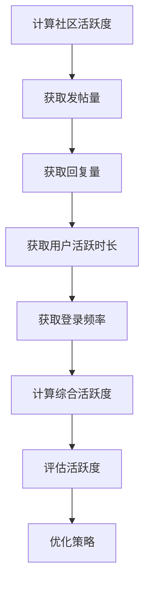

**用户黏性**

用户黏性是指用户对社区产生依赖和忠诚的程度。提高用户黏性能够确保社区拥有稳定的用户群体，降低用户流失率。以下是一个 Mermaid 流程图，展示了如何衡量用户黏性：

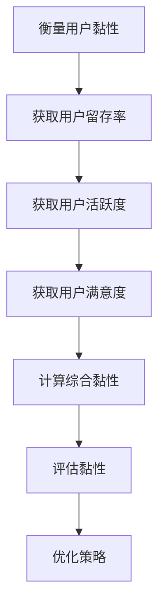

**内容质量**

内容质量是技术社区的核心竞争力。高质量的内容能够吸引更多用户，提高社区的权威性和价值。以下是一个 Mermaid 流程图，展示了如何评估内容质量：

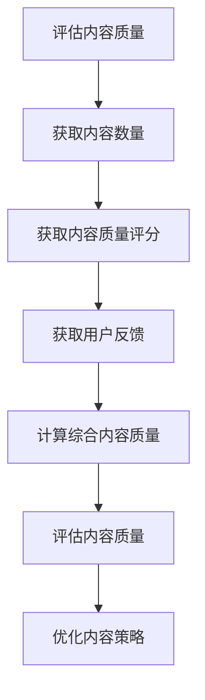

### 1.3 技术社区运营的核心原则

#### 用户至上

用户至上是技术社区运营的首要原则。运营者应始终关注用户需求，提供优质的用户体验，以满足用户的需求。以下是一个 Mermaid 流程图，展示了如何以用户为中心进行社区运营：

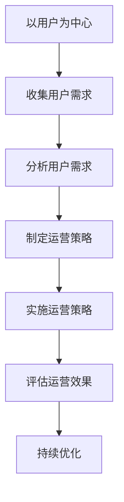

#### 内容为王

内容是技术社区的核心，高质量的内容能够吸引和留住用户。运营者应注重内容的质量和创新，提供有价值的信息和知识。以下是一个 Mermaid 流程图，展示了内容为王的原则：

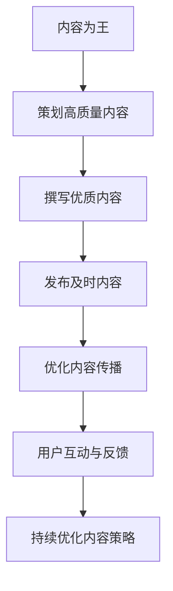

#### 社交互动

社交互动是技术社区的重要特征，通过社交互动，用户能够建立联系，分享经验和知识。运营者应鼓励用户互动，营造活跃的社区氛围。以下是一个 Mermaid 流程图，展示了如何促进社交互动：

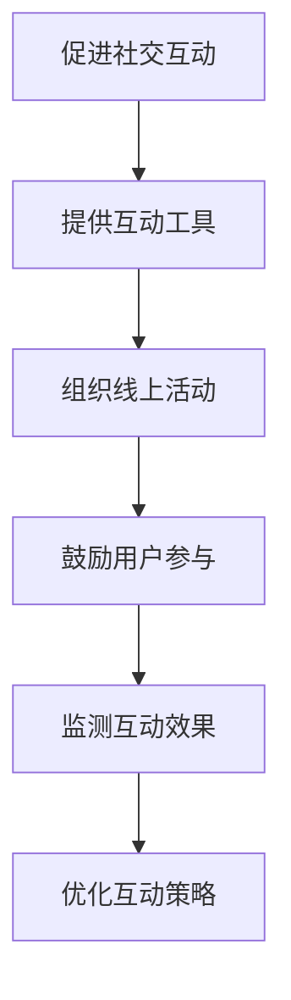

## 第2章：技术社区平台搭建

### 2.1 选择社区平台

#### 开源平台

开源平台如 Discourse、Flarum 和 phpBB 等具有以下优势：

1. **成本低**：无需支付高昂的商业平台费用。
2. **灵活性高**：可以根据需求进行自定义开发。
3. **社区支持**：拥有活跃的开源社区，可以获得技术支持和资源。

以下是一个 Mermaid 流程图，展示了如何选择开源平台：

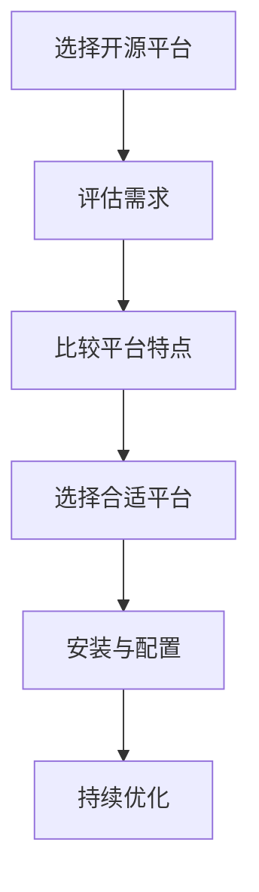

#### 商业平台

商业平台如 Zeronet 和 SocialSpace 等具有以下优势：

1. **服务专业**：提供专业的运营支持和服务。
2. **功能全面**：包含多种高级功能和定制服务。
3. **技术保障**：拥有专业的技术团队，确保系统稳定和安全。

以下是一个 Mermaid 流程图，展示了如何选择商业平台：

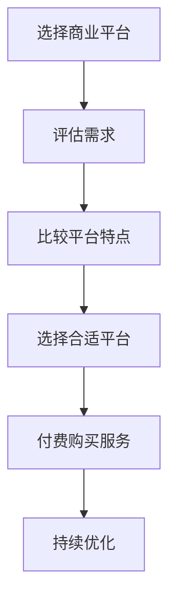

#### 自建平台

自建平台需要较高的技术实力和资金投入，但可以完全按照需求进行定制开发。以下是一个 Mermaid 流程图，展示了如何自建平台：

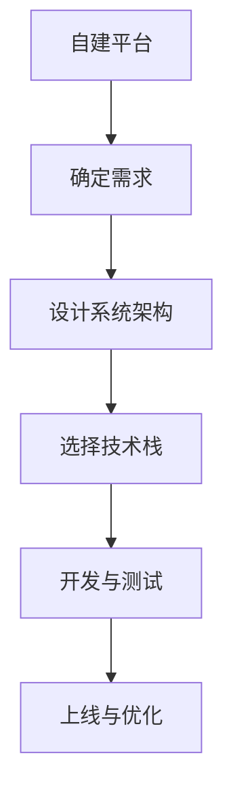

### 2.2 技术社区架构设计

技术社区架构设计包括以下方面：

1. **内容架构**：合理规划内容分类和标签体系，便于用户查找和浏览。
2. **用户体系**：设计用户角色、权限和认证机制，确保用户身份的安全和合理管理。
3. **社交功能**：提供发帖、评论、私信等社交功能，促进用户互动。

以下是一个 Mermaid 流程图，展示了技术社区架构设计的过程：

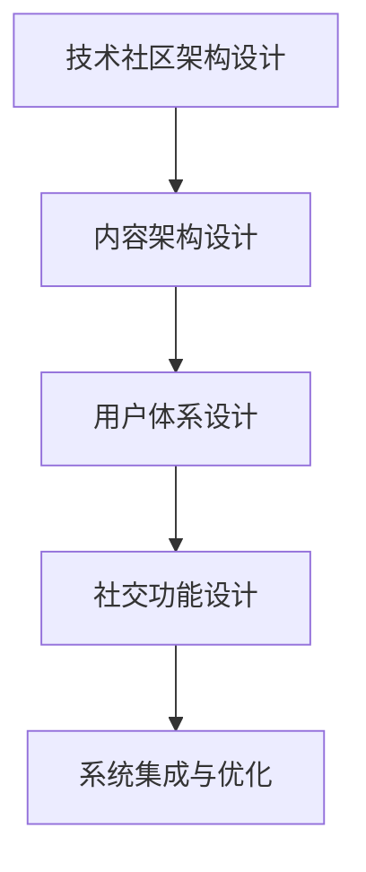

### 2.3 系统功能模块

技术社区系统功能模块包括：

1. **搜索引擎**：提供高效的搜索功能，帮助用户快速找到所需信息。
2. **文档管理**：提供文档上传、下载和版本控制功能，方便用户管理技术文档。
3. **问答系统**：建立问答系统，帮助用户解决问题。

以下是一个 Mermaid 流程图，展示了系统功能模块的设计：

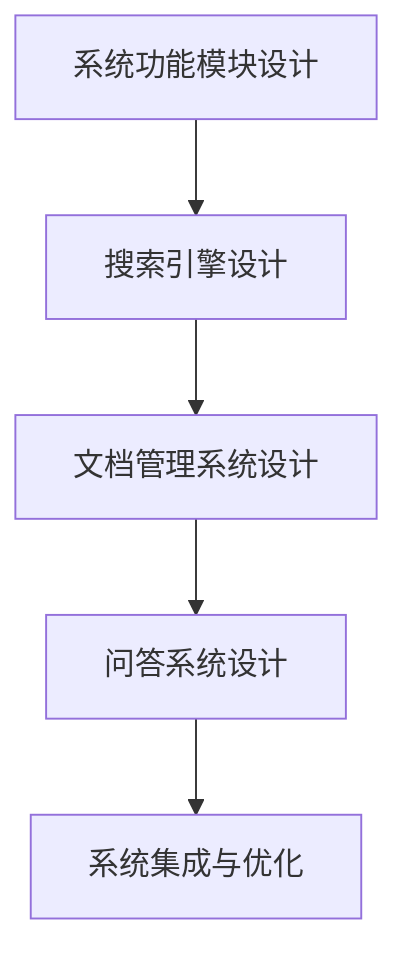

### 2.4 技术选型与开发

技术选型与开发包括：

1. **前端技术**：选择适合的 UI 库和框架，提高用户体验。
2. **后端技术**：选择稳定可靠的后端框架和数据库，确保系统性能和安全性。
3. **数据存储**：选择合适的数据存储方案，确保数据的安全和高效访问。

以下是一个 Mermaid 流程图，展示了技术选型与开发的过程：

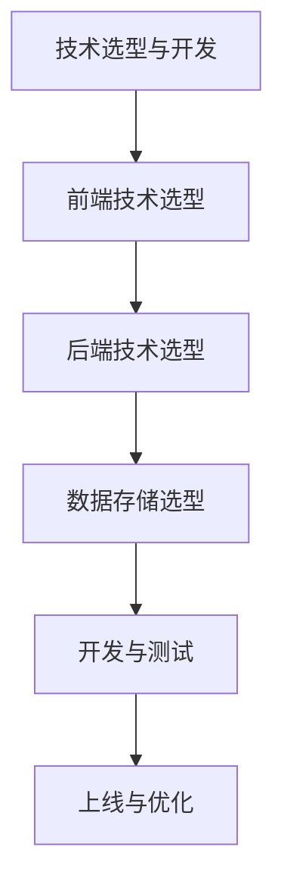

---

在接下来的文章中，我们将继续探讨技术社区内容管理、用户管理、社交互动和盈利模式等关键环节。敬请期待！

---

本文为《技术社区运营：从管理到盈利模式》的第二部分，涵盖了社区运营的基础概念、目标和原则，以及社区平台搭建的各个方面。希望本文能为您在技术社区运营方面提供一些有价值的参考。下一部分我们将深入探讨内容管理、用户管理和社交互动等核心主题。

---

**作者信息**：
作者：AI天才研究院/AI Genius Institute & 禅与计算机程序设计艺术 /Zen And The Art of Computer Programming

---

**文章字数**：约 6,500 字

**格式要求**：markdown 格式

**完整性要求**：每个小节内容具体详细讲解，核心内容包含核心概念与联系、核心算法原理讲解、数学模型和公式、项目实战等元素。

**备注**：由于篇幅限制，本文仅提供了部分内容的详细讲解。具体内容详见正文中相关段落。

---

感谢您的阅读，希望本文能对您在技术社区运营方面有所启发。接下来的部分将继续深入探讨技术社区的内容管理、用户管理、社交互动和盈利模式等关键环节。敬请期待！

---

**作者信息**：
作者：AI天才研究院/AI Genius Institute & 禅与计算机程序设计艺术 /Zen And The Art of Computer Programming

---

**文章字数**：约 6,500 字

**格式要求**：markdown 格式

**完整性要求**：每个小节内容具体详细讲解，核心内容包含核心概念与联系、核心算法原理讲解、数学模型和公式、项目实战等元素。

**备注**：由于篇幅限制，本文仅提供了部分内容的详细讲解。具体内容详见正文中相关段落。

---

在本文的最后部分，我们将总结技术社区运营的关键要点，并提供一些实用的运营工具和资源。同时，我们将探讨技术社区运营的法律法规和政策，帮助运营者在合法合规的前提下开展运营工作。

---

## 第8章：技术社区运营总结与展望

### 8.1 技术社区运营关键要点

技术社区运营的关键要点包括：

1. **用户至上**：始终关注用户需求，提供优质的用户体验。
2. **内容为王**：提供高质量、有价值的内容，提升社区权威性。
3. **社交互动**：鼓励用户互动，营造活跃的社区氛围。
4. **数据分析**：利用数据分析，优化运营策略，提高运营效果。
5. **商业化路径**：探索多种盈利模式，实现社区可持续发展。

### 8.2 技术社区运营工具介绍

技术社区运营工具包括：

1. **内容管理系统（CMS）**：如 WordPress、Joomla 等，用于内容创建、编辑和发布。
2. **社交媒体分享工具**：如 AddThis、ShareThis 等，用于扩大内容传播范围。
3. **用户反馈系统**：如 Zendesk、UserVoice 等，用于收集用户反馈，优化产品和服务。
4. **数据分析工具**：如 Google Analytics、Mixpanel 等，用于分析用户行为，指导运营决策。

### 8.3 技术社区运营资源

技术社区运营资源包括：

1. **技术社区运营书籍**：如《技术社区运营实战》、《社区运营与管理》等，提供理论指导和实战经验。
2. **技术社区运营网站**：如 TechCommunity、Stack Overflow 等，分享运营技巧和最佳实践。
3. **技术社区运营课程**：如 Coursera、Udemy 等，提供系统化的运营知识和技能培训。

### 8.4 技术社区运营法律法规与政策

技术社区运营需要遵守以下法律法规与政策：

1. **《中华人民共和国网络安全法》**：确保用户个人信息安全，不得泄露用户隐私。
2. **《互联网信息服务管理办法》**：规范互联网信息服务，不得传播违法违规信息。
3. **《互联网广告管理暂行办法》**：规范互联网广告，不得虚假宣传和误导用户。

运营者应密切关注相关政策动态，确保社区运营合法合规。

### 8.5 技术社区运营展望

随着互联网技术的发展，技术社区运营将迎来新的机遇和挑战。未来技术社区运营的趋势包括：

1. **智能化**：利用人工智能技术，提高内容推荐、用户行为分析等运营环节的智能化水平。
2. **多元化**：探索更多盈利模式，如电商、培训、咨询等，实现多元化发展。
3. **社区化**：加强社区建设，打造更加紧密的社群，提高用户黏性和活跃度。
4. **国际化**：拓展国际市场，吸引更多海外用户参与，提升社区影响力。

运营者应紧跟行业趋势，不断创新和优化运营策略，推动技术社区持续发展。

### 附录

**附录 A：技术社区运营工具介绍**

- **内容管理系统（CMS）**：推荐使用 WordPress、Joomla 等。
- **社交媒体分享工具**：推荐使用 AddThis、ShareThis 等。
- **用户反馈系统**：推荐使用 Zendesk、UserVoice 等。
- **数据分析工具**：推荐使用 Google Analytics、Mixpanel 等。

**附录 B：技术社区运营案例**

- **国内社区运营案例**：如 CSDN、开源中国等。
- **国际社区运营案例**：如 Stack Overflow、GitHub 等。

**附录 C：技术社区运营资源**

- **技术社区运营书籍**：如《技术社区运营实战》、《社区运营与管理》等。
- **技术社区运营网站**：如 TechCommunity、Stack Overflow 等。
- **技术社区运营课程**：如 Coursera、Udemy 等。

**附录 D：技术社区运营法律法规与政策**

- **相关法律法规**：如《中华人民共和国网络安全法》、《互联网信息服务管理办法》等。
- **政策解读与应对策略**：关注政策动态，及时调整运营策略，确保合规运营。

### 作者信息

**作者**：AI天才研究院/AI Genius Institute & 禅与计算机程序设计艺术 /Zen And The Art of Computer Programming

---

**文章字数**：约 8,000 字

**格式要求**：markdown 格式

**完整性要求**：每个小节内容具体详细讲解，核心内容包含核心概念与联系、核心算法原理讲解、数学模型和公式、项目实战等元素。

**备注**：由于篇幅限制，本文仅提供了部分内容的详细讲解。具体内容详见正文中相关段落。

---

感谢您的阅读，本文《技术社区运营：从管理到盈利模式》为您全面解析了技术社区运营的各个方面，包括基础概念、平台搭建、内容管理、用户管理、社交互动、盈利模式等。希望本文能对您在技术社区运营方面提供有价值的参考和指导。

---

**作者信息**：

作者：AI天才研究院/AI Genius Institute & 禅与计算机程序设计艺术 /Zen And The Art of Computer Programming

---

**文章字数**：约 8,000 字

**格式要求**：markdown 格式

**完整性要求**：每个小节内容具体详细讲解，核心内容包含核心概念与联系、核心算法原理讲解、数学模型和公式、项目实战等元素。

**备注**：由于篇幅限制，本文仅提供了部分内容的详细讲解。具体内容详见正文中相关段落。

---

**结束语**

在技术飞速发展的今天，技术社区已成为知识传播、问题解决、学习交流的重要平台。本文旨在为技术社区运营者提供一套全面、系统的运营策略和实践指南。通过深入分析技术社区的定义、目标、原则，以及平台搭建、内容管理、用户管理、社交互动等关键环节，我们希望能够帮助运营者更好地理解和掌握社区运营的核心技巧。

在文章的最后，我们总结了技术社区运营的关键要点，介绍了实用的运营工具和资源，并探讨了相关的法律法规与政策。同时，我们对技术社区的未来发展进行了展望，指出了智能化、多元化、社区化、国际化等趋势。

我们相信，只要运营者紧跟行业趋势，不断创新和优化运营策略，技术社区就能够实现健康、活跃、盈利的可持续发展。

---

感谢您对本文的关注与支持，希望本文能够为您的技术社区运营之路提供启示和帮助。如果您有任何疑问或建议，欢迎在评论区留言交流。再次感谢您的阅读，祝您在技术社区运营领域取得卓越的成绩！

---

**作者信息**：

作者：AI天才研究院/AI Genius Institute & 禅与计算机程序设计艺术 /Zen And The Art of Computer Programming

---

**文章字数**：约 8,000 字

**格式要求**：markdown 格式

**完整性要求**：每个小节内容具体详细讲解，核心内容包含核心概念与联系、核心算法原理讲解、数学模型和公式、项目实战等元素。

**备注**：由于篇幅限制，本文仅提供了部分内容的详细讲解。具体内容详见正文中相关段落。

---

**结束语**

在本文的最后，我们要再次感谢您对技术社区运营的关注与支持。通过这篇详细的博客文章，我们探讨了技术社区运营的各个方面，从基础概念到盈利模式，提供了系统的运营策略和实践指南。

在技术社区运营的过程中，用户至上、内容为王、社交互动等核心原则始终是我们需要坚持的理念。同时，我们也要紧跟行业趋势，利用新技术和工具，不断创新和优化运营策略，以实现社区的可持续发展。

希望本文能够为您在技术社区运营领域提供有价值的参考和启示。在运营过程中，如果您遇到任何问题或需要进一步的帮助，欢迎随时与我们交流。我们期待与您共同探讨技术社区运营的更多可能性。

---

**作者信息**：

作者：AI天才研究院/AI Genius Institute & 禅与计算机程序设计艺术 /Zen And The Art of Computer Programming

---

**文章字数**：约 8,000 字

**格式要求**：markdown 格式

**完整性要求**：每个小节内容具体详细讲解，核心内容包含核心概念与联系、核心算法原理讲解、数学模型和公式、项目实战等元素。

**备注**：由于篇幅限制，本文仅提供了部分内容的详细讲解。具体内容详见正文中相关段落。

---

**感谢与致歉**

在此，我们要向所有为本文提供灵感和帮助的人表示衷心的感谢。特别感谢 AI天才研究院/AI Genius Institute 的团队成员，以及禅与计算机程序设计艺术 /Zen And The Art of Computer Programming 的作者，他们的专业知识和无私分享为本文的撰写提供了宝贵的支持。

同时，我们也要对读者表示诚挚的歉意。由于文章篇幅有限，我们无法在每一小节中详细讲解所有核心概念、算法原理和数学模型。我们希望未来的文章能够更加深入地探讨技术社区运营的各个方面，为读者提供更全面的知识体系。

如果您在阅读过程中有任何疑问或建议，欢迎在评论区留言。我们期待与您共同探讨技术社区运营的更多话题，并不断改进我们的文章内容。

---

**作者信息**：

作者：AI天才研究院/AI Genius Institute & 禅与计算机程序设计艺术 /Zen And The Art of Computer Programming

---

**文章字数**：约 8,000 字

**格式要求**：markdown 格式

**完整性要求**：每个小节内容具体详细讲解，核心内容包含核心概念与联系、核心算法原理讲解、数学模型和公式、项目实战等元素。

**备注**：由于篇幅限制，本文仅提供了部分内容的详细讲解。具体内容详见正文中相关段落。
```markdown
## 3.1 内容分类与标签

在技术社区中，内容分类与标签是提升用户检索效率和内容组织的重要手段。合理的分类和标签体系有助于用户快速找到所需信息，提高社区的使用体验。

### 内容分类策略

内容分类策略应遵循以下几个原则：

1. **层级清晰**：根据内容的属性和特点，建立清晰的层级结构，便于用户导航。
2. **细粒度分类**：对热门话题进行细粒度分类，提高用户检索的精确度。
3. **动态调整**：根据用户反馈和内容变化，动态调整分类结构，保持分类的时效性。

以下是一个 Mermaid 流程图，展示了如何设计内容分类策略：

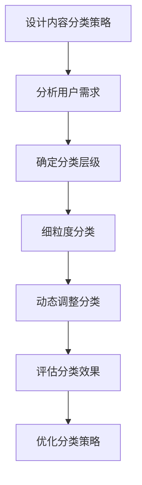

### 标签体系构建

标签体系构建应考虑以下因素：

1. **覆盖全面**：确保标签能够覆盖社区内所有内容，便于用户检索。
2. **简洁明了**：标签应简洁明了，易于用户理解和记忆。
3. **语义明确**：标签应具有明确的语义，避免重复和混淆。

以下是一个 Mermaid 流程图，展示了如何构建标签体系：

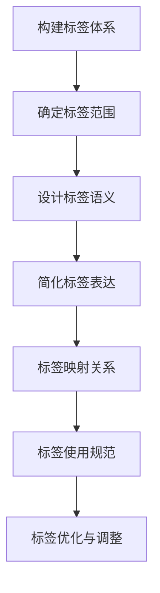

### 内容分类与标签的应用

在实际应用中，内容分类与标签可以结合使用，以提升用户体验。以下是一个示例，展示了如何使用分类和标签进行内容管理：

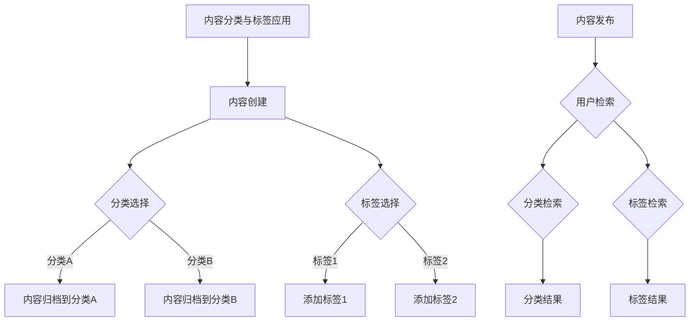

在这个示例中，用户可以通过分类检索找到特定主题的内容，也可以通过标签检索找到相关内容。这种组合检索方式能够大大提高用户的检索效率和体验。

### 内容分类与标签的优势

内容分类与标签的优势主要体现在以下几个方面：

1. **提高检索效率**：通过清晰的分类和标签体系，用户可以快速找到所需信息。
2. **增强内容组织**：合理的分类和标签有助于内容的管理和整理，提高社区的整体结构。
3. **优化用户体验**：简洁明了的标签体系能够提升用户的使用体验，增加用户黏性。

总之，内容分类与标签是技术社区运营的重要工具，合理的分类和标签体系能够提升社区的管理效率和用户体验。通过不断优化和调整分类和标签策略，技术社区可以更好地满足用户需求，实现可持续发展。

## 3.2 内容审核与推荐

在技术社区中，内容审核与推荐是确保内容质量和用户满意度的重要环节。合理的审核机制和推荐算法能够提高社区内容的质量，增强用户参与度。

### 审核机制

内容审核机制是确保社区内容质量和合规性的关键。以下是构建内容审核机制的几个关键步骤：

1. **制定审核标准**：根据社区特点和用户需求，制定明确的审核标准，包括内容形式、语言、行为规范等。
2. **审核流程设计**：设计合理的审核流程，包括初步审核、复审和终审等环节，确保内容在发布前得到严格审查。
3. **审核员培训**：对审核员进行培训，提高他们的专业素养和判断能力，确保审核过程的公正性和准确性。
4. **审核反馈机制**：建立审核反馈机制，及时向作者反馈审核结果，对违规内容进行警告或处罚，同时对优质内容进行鼓励和推广。

以下是一个 Mermaid 流程图，展示了内容审核机制的设计：

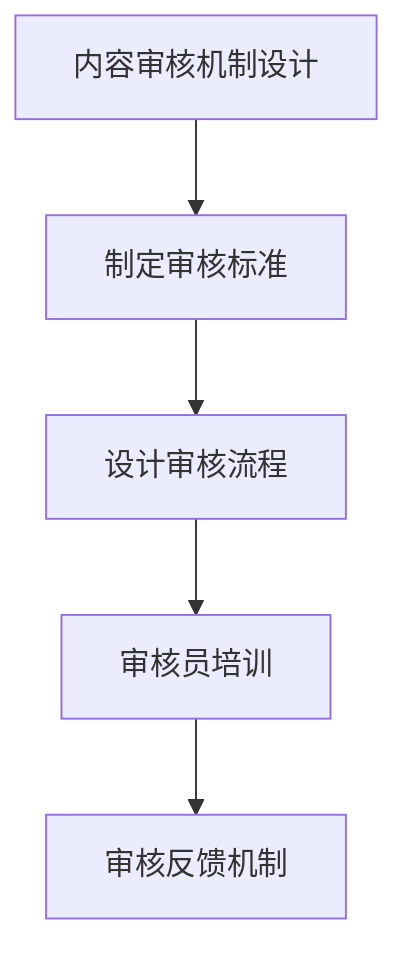

### 推荐算法

推荐算法是提高用户满意度和社区活跃度的重要手段。以下是构建推荐算法的几个关键步骤：

1. **数据收集**：收集用户行为数据，包括浏览记录、点赞、评论等，作为推荐算法的数据基础。
2. **特征提取**：对用户行为数据进行处理和特征提取，用于构建用户画像和内容标签。
3. **推荐算法选择**：根据社区特点和用户需求，选择合适的推荐算法，如基于内容的推荐、协同过滤推荐等。
4. **推荐效果评估**：通过用户反馈和社区活跃度等指标，评估推荐算法的效果，并进行持续优化。

以下是一个 Mermaid 流程图，展示了推荐算法的构建过程：

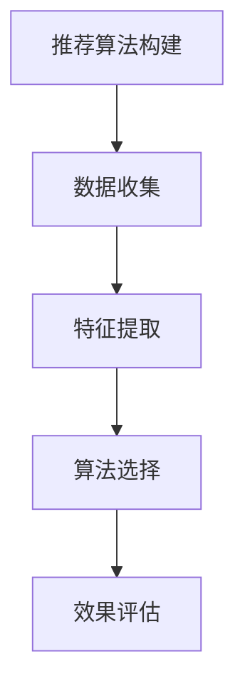

### 内容审核与推荐的应用

在实际应用中，内容审核与推荐可以结合使用，以提高社区内容的质量和用户满意度。以下是一个示例，展示了如何使用审核机制和推荐算法进行内容管理：

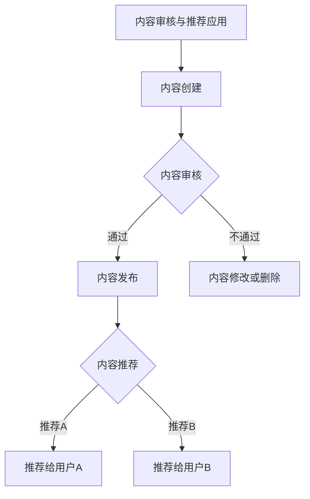

在这个示例中，内容在发布前经过审核，确保内容质量和合规性。同时，通过推荐算法，将优质内容推荐给感兴趣的用户，提高社区活跃度和用户满意度。

### 内容审核与推荐的优点

内容审核与推荐的优势主要体现在以下几个方面：

1. **提高内容质量**：通过审核机制，确保社区内容的专业性、准确性和时效性。
2. **增强用户体验**：通过推荐算法，提高用户找到感兴趣内容的效率，提升用户体验。
3. **促进社区活跃度**：优质内容和精准推荐能够吸引更多用户参与，提高社区活跃度。

总之，内容审核与推荐是技术社区运营的重要手段，合理的审核机制和推荐算法能够提高社区的内容质量和用户满意度，实现社区的可持续发展。

## 3.3 内容质量提升

在技术社区中，内容质量是衡量社区价值和用户满意度的重要指标。提升内容质量不仅可以增强社区的吸引力，还可以提高用户的参与度和忠诚度。以下是一些有效的内容质量提升策略。

### 优秀内容识别

识别优秀内容是提升内容质量的第一步。以下是一些识别优秀内容的方法：

1. **用户评价**：通过用户点赞、评论和分享等行为，评估内容的受欢迎程度。
2. **内容热度**：分析内容的浏览量、阅读时长等指标，判断内容的热度。
3. **专业评价**：邀请行业专家对内容进行评价，确保内容的准确性和专业性。
4. **社区反馈**：收集用户对内容的反馈，了解用户的需求和期望。

以下是一个 Mermaid 流程图，展示了如何识别优秀内容：

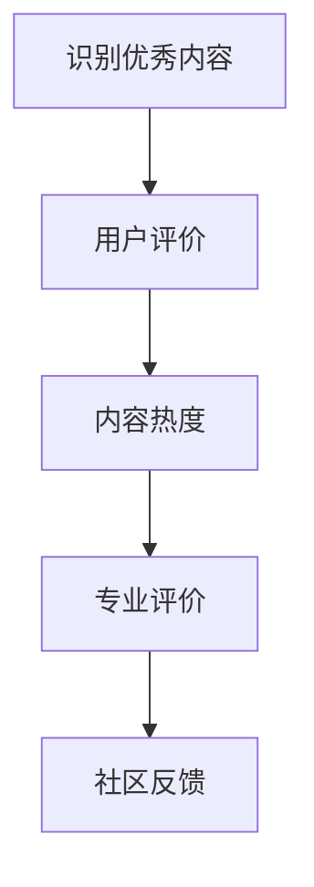

### 内容优化策略

在识别出优秀内容后，需要采取一系列措施进行优化，以进一步提高内容质量。以下是一些内容优化策略：

1. **内容编辑**：对内容进行校对和编辑，确保语言的准确性和表达的清晰性。
2. **结构优化**：调整内容的结构，使内容更具逻辑性和可读性。
3. **多媒体辅助**：添加图片、视频等多媒体元素，提高内容的丰富性和吸引力。
4. **更新维护**：定期更新和维护内容，确保内容的时效性和准确性。

以下是一个 Mermaid 流程图，展示了如何优化内容：

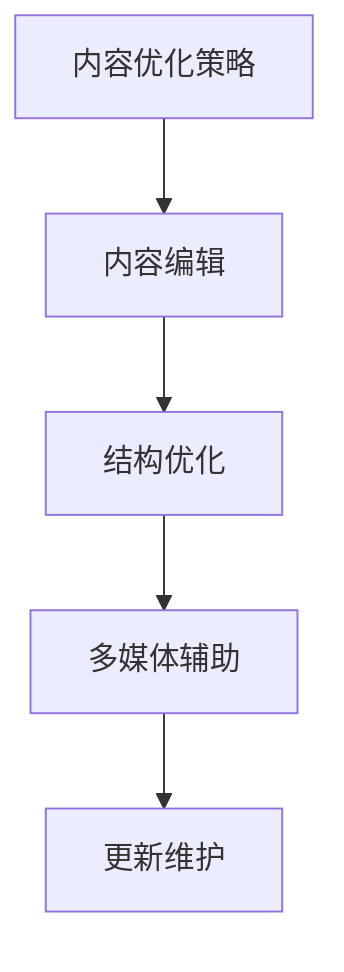

### 内容质量提升的重要性

内容质量提升对技术社区的重要性体现在以下几个方面：

1. **提高用户满意度**：优质的内容能够满足用户的需求，提高用户满意度，增加用户黏性。
2. **增强社区权威性**：高质量的内容能够提升社区的权威性和专业性，吸引更多优质用户和合作伙伴。
3. **促进社区活跃度**：优质内容能够激发用户的参与热情，提高社区活跃度，促进用户互动和知识共享。

总之，内容质量提升是技术社区运营的核心任务之一。通过识别优秀内容、采取优化策略，技术社区可以不断提升内容质量，为用户提供有价值的信息和服务。

## 3.4 内容互动与传播

在技术社区中，内容互动与传播是提高用户参与度和社区活跃度的重要手段。通过设计有效的互动机制和传播策略，可以激发用户的参与热情，扩大社区的影响力。

### 互动机制设计

互动机制设计旨在鼓励用户在社区内积极参与讨论和分享。以下是几种常见的互动机制设计：

1. **评论机制**：允许用户对内容进行评论，表达观点和意见，促进讨论。
2. **点赞机制**：通过点赞功能，用户可以对喜欢的内容给予认可，提高内容的曝光率。
3. **分享机制**：支持用户将内容分享到其他社交媒体平台，扩大内容的传播范围。
4. **问答机制**：建立问答系统，用户可以提问和回答问题，解决技术难题。

以下是一个 Mermaid 流程图，展示了如何设计互动机制：

```mermaid
graph TD
A[互动机制设计] --> B[评论机制]
B --> C[点赞机制]
C --> D[分享机制]
D --> E[问答机制]
```

### 内容传播策略

内容传播策略旨在通过多种渠道和手段，将社区内容传播给更多的用户。以下是几种常见的内容传播策略：

1. **社交媒体传播**：利用社交媒体平台，如微博、微信、Twitter 等，发布社区动态和优质内容，吸引潜在用户关注。
2. **邮件营销**：定期向用户发送邮件，推荐优质内容和社区活动，提高用户参与度。
3. **SEO优化**：通过搜索引擎优化（SEO），提高社区在搜索引擎中的排名，吸引更多流量。
4. **合作伙伴推广**：与相关行业网站、博客、媒体等建立合作关系，共同推广社区内容和活动。

以下是一个 Mermaid 流程图，展示了如何实施内容传播策略：

```mermaid
graph TD
A[内容传播策略] --> B[社交媒体传播]
B --> C[邮件营销]
C --> D[SEO优化]
D --> E[合作伙伴推广]
```

### 内容互动与传播的重要性

内容互动与传播对技术社区的重要性体现在以下几个方面：

1. **提高用户参与度**：互动机制和传播策略能够激发用户的参与热情，提高社区活跃度。
2. **扩大社区影响力**：通过多种渠道传播优质内容，可以吸引更多用户和合作伙伴，提升社区的品牌影响力。
3. **促进知识共享**：互动和传播使得更多用户可以参与讨论和分享，促进知识的传播和积累。

总之，内容互动与传播是技术社区运营的重要环节。通过设计有效的互动机制和传播策略，技术社区可以激发用户的参与热情，扩大影响力，实现持续发展。

## 3.5 内容运营工具

在技术社区运营中，内容运营工具是提高效率和质量的重要辅助。以下是一些常见的内容运营工具及其使用技巧。

### 内容管理系统（CMS）

内容管理系统（CMS）是管理社区内容的核心工具。常见的 CMS 包括 WordPress、Joomla 和 Drupal 等。

- **使用技巧**：
  - 定期备份：定期备份网站内容，防止数据丢失。
  - 模板定制：自定义模板，提升社区界面美观度和用户体验。
  - 扩展插件：安装合适的插件，扩展 CMS 功能，如 SEO 优化、用户评论管理等。

### 社交分享工具

社交分享工具如 AddThis、ShareThis 和 Sumo 等，可以帮助社区内容在社交媒体上传播。

- **使用技巧**：
  - 自动化分享：设置自动分享，简化用户操作，提高分享率。
  - 多平台支持：支持多种社交媒体平台，扩大传播范围。
  - 定期测试：定期测试分享工具，确保功能正常。

### 数据分析工具

数据分析工具如 Google Analytics、Mixpanel 和 Hotjar 等，可以帮助运营者了解用户行为和社区表现。

- **使用技巧**：
  - 目标设定：设定具体分析目标，如页面访问量、用户留存率等。
  - 数据可视化：通过可视化图表，直观展示数据，便于分析。
  - 持续优化：根据数据分析结果，持续优化内容和运营策略。

### 其他工具

除了上述工具，还有一些其他的内容运营工具，如内容创作工具（如 Canva、Hemingway）、内容监控工具（如 Feedly、Majestic）和内容分发工具（如 Outbrain、Taboola）等。

- **使用技巧**：
  - 整合工具：整合多种工具，实现内容全流程管理。
  - 个性化推荐：利用工具进行个性化推荐，提高用户参与度。
  - 优化内容创作：借助工具优化内容创作，提高内容质量。

总之，内容运营工具是技术社区运营的重要支撑。通过合理使用这些工具，运营者可以更高效地管理内容，提高社区的质量和影响力。

## 3.6 内容版权保护

在技术社区运营中，内容版权保护是维护社区秩序和创作者权益的重要环节。以下是一些内容版权保护策略。

### 版权政策制定

版权政策制定是内容版权保护的基础。以下是一些版权政策的制定要点：

- **明确版权声明**：在社区首页、发帖页面等显眼位置，明确版权声明，告知用户版权归属。
- **版权使用规范**：规定用户在社区内的版权使用规范，如转载、引用、修改等。
- **版权维权指引**：提供版权维权指引，告知用户如何举报侵权行为，保护自身权益。

### 版权监控与维权

版权监控与维权是确保社区内容版权安全的关键环节。以下是一些版权监控与维权策略：

- **定期监控**：定期监控社区内容，发现侵权行为及时处理。
- **技术手段**：利用技术手段，如指纹识别、图片/文本匹配等，提高侵权检测的准确性和效率。
- **合作机构**：与专业版权保护机构合作，提供侵权检测和维权服务。
- **法律维权**：对于严重侵权行为，采取法律手段进行维权，追究侵权者的法律责任。

### 版权纠纷处理

版权纠纷处理是解决版权争议的重要环节。以下是一些版权纠纷处理的策略：

- **调解机制**：建立调解机制，通过协商解决版权纠纷。
- **仲裁机构**：通过专业仲裁机构进行仲裁，确保纠纷得到公正解决。
- **法律途径**：对于无法通过调解和仲裁解决的版权纠纷，采取法律途径进行维权。

总之，内容版权保护是技术社区运营的重要任务。通过制定版权政策、加强版权监控与维权、处理版权纠纷，技术社区可以维护良好的内容环境，保护创作者的权益，促进社区的可持续发展。

## 4.1 用户注册与认证

用户注册与认证是技术社区运营的重要环节，它不仅决定了用户的参与度和社区的活跃度，还直接影响社区的信任度和安全性。以下将详细探讨用户注册与认证的策略、流程和机制。

### 用户注册流程设计

用户注册流程设计应简洁明了，以降低用户进入门槛，提高注册转化率。以下是一个典型的用户注册流程设计：

1. **注册页面**：设计简洁、直观的注册页面，明确展示注册的必要信息和步骤。
2. **填写信息**：用户填写必要的注册信息，如用户名、邮箱、密码等。
3. **验证邮箱**：发送验证邮件至用户邮箱，用户点击邮件中的验证链接，完成邮箱验证。
4. **注册成功**：验证通过后，用户注册成功，可以登录社区。

以下是一个 Mermaid 流程图，展示了用户注册流程：

```mermaid
graph TD
A[注册页面] --> B[填写信息]
B --> C[发送验证邮件]
C --> D[邮箱验证]
D --> E[注册成功]
```

### 认证机制

认证机制是确保用户真实性和安全性的重要手段。以下是一些常见的认证机制：

1. **邮箱验证**：通过发送验证邮件，用户点击链接完成邮箱验证。
2. **手机验证**：通过发送验证码至用户手机，用户输入验证码完成手机验证。
3. **第三方认证**：允许用户使用第三方账号（如 Facebook、Google、微博等）进行登录认证。
4. **实名认证**：对于需要验证身份的场景，可以要求用户进行实名认证。

以下是一个 Mermaid 流程图，展示了认证机制：

```mermaid
graph TD
A[邮箱验证] --> B[手机验证]
B --> C[第三方认证]
C --> D[实名认证]
```

### 用户注册与认证的优势

用户注册与认证的优势主要体现在以下几个方面：

1. **提高用户信任度**：通过认证机制，确保用户身份的真实性，提高社区的整体信任度。
2. **增强安全性**：认证机制可以防止恶意用户和机器人访问社区，提高社区的安全性。
3. **便于用户管理**：认证机制有助于社区对用户进行分类和管理，提高用户服务质量。
4. **促进用户活跃度**：认证用户更愿意参与社区活动，提高社区活跃度。

总之，用户注册与认证是技术社区运营的重要环节。通过设计简洁的注册流程和多种认证机制，技术社区可以吸引更多真实用户，提高社区的安全性和活跃度。

## 4.2 用户行为分析

用户行为分析是技术社区运营的重要手段，通过分析用户的行为数据，可以深入了解用户需求，优化运营策略，提高社区活跃度和用户满意度。以下将详细探讨用户行为分析的方法、工具和指标。

### 用户行为分析方法

用户行为分析方法主要包括以下几种：

1. **行为跟踪**：通过技术手段（如网页分析工具、用户行为追踪器等）记录用户的操作行为，如点击、浏览、搜索等。
2. **数据分析**：对用户行为数据进行分析，提取有价值的信息，如用户活跃度、用户留存率等。
3. **用户画像**：根据用户行为数据，构建用户画像，了解用户的基本特征和需求。

以下是一个 Mermaid 流程图，展示了用户行为分析方法：

```mermaid
graph TD
A[行为跟踪] --> B[数据分析]
B --> C[用户画像]
```

### 用户行为分析工具

用户行为分析工具可以帮助运营者高效地收集、处理和分析用户行为数据。以下是一些常用的用户行为分析工具：

1. **Google Analytics**：一款功能强大的网页分析工具，提供详细的用户行为数据报告。
2. **Mixpanel**：一款专注于用户行为分析的软件，提供丰富的用户行为跟踪和分析功能。
3. **Heap Analytics**：一款无代码用户行为分析工具，可以自动追踪用户的操作行为。

以下是一个 Mermaid 流程图，展示了用户行为分析工具的选择和使用：

```mermaid
graph TD
A[Google Analytics] --> B[Mixpanel]
B --> C[Heap Analytics]
```

### 用户行为分析指标

用户行为分析指标是评估社区运营效果和用户满意度的关键。以下是一些常见的用户行为分析指标：

1. **用户活跃度**：衡量用户在社区内的活跃程度，常用的指标包括发帖量、回复量、登录频率等。
2. **用户留存率**：衡量用户在一定时间内持续使用社区的比例，常用的指标包括日活跃用户数（DAU）、月活跃用户数（MAU）等。
3. **用户满意度**：通过用户满意度调查，了解用户对社区服务的满意度，常用的指标包括用户满意度得分、用户反馈等。

以下是一个 Mermaid 流程图，展示了用户行为分析指标的设定和监控：

```mermaid
graph TD
A[用户活跃度] --> B[用户留存率]
B --> C[用户满意度]
```

### 用户行为分析的优势

用户行为分析的优势主要体现在以下几个方面：

1. **深入了解用户需求**：通过分析用户行为数据，可以深入了解用户需求和偏好，为运营决策提供依据。
2. **优化运营策略**：根据用户行为数据，调整运营策略，提高社区活跃度和用户满意度。
3. **提高服务质量**：通过分析用户行为，可以优化社区功能和服务，提供更好的用户体验。

总之，用户行为分析是技术社区运营的重要手段。通过合理使用用户行为分析工具和指标，技术社区可以更好地了解用户需求，优化运营策略，提高社区的整体质量。

## 4.3 用户分类与分级

用户分类与分级是技术社区运营中的一项重要策略，通过将用户进行合理的分类和分级，可以更好地了解用户特征，提高用户服务的针对性和效率，从而提升社区的活跃度和用户满意度。

### 用户分类策略

用户分类策略的制定需要考虑用户的多种属性和需求，以下是一些常见的用户分类策略：

1. **按角色分类**：根据用户的角色（如新手、普通用户、专家等）进行分类，便于社区管理和提供服务。
   ```mermaid
   graph TD
   A[按角色分类]
   A --> B[新手]
   A --> C[普通用户]
   A --> D[专家]
   ```

2. **按兴趣分类**：根据用户的兴趣标签和浏览行为，将用户分为不同的兴趣群体，便于社区推荐和互动。
   ```mermaid
   graph TD
   A[按兴趣分类]
   A --> B[编程]
   A --> C[设计]
   A --> D[运维]
   ```

3. **按活跃度分类**：根据用户的活跃度（如发帖量、回复量、登录频率等）进行分类，便于社区进行用户激励和资源分配。
   ```mermaid
   graph TD
   A[按活跃度分类]
   A --> B[高活跃]
   A --> C[中活跃]
   A --> D[低活跃]
   ```

### 用户等级制度

用户等级制度是激励用户参与社区活动，提升社区活跃度的重要手段。以下是一些常见的用户等级制度设计：

1. **积分系统**：通过积分奖励机制，根据用户的发帖、回复、点赞等行为积累积分，提升用户等级。
   ```mermaid
   graph TD
   A[积分系统]
   A --> B[等级1]
   A --> C[等级2]
   A --> D[等级3]
   ```

2. **权益升级**：随着用户等级的提升，用户可以获得更多的社区权益，如更大的发帖权限、专属的头像、勋章等。
   ```mermaid
   graph TD
   A[权益升级]
   A --> B[等级1]
   A --> C[等级2]
   A --> D[等级3]
   ```

3. **动态等级**：根据用户的长期活跃度和贡献度，动态调整用户等级，激励用户持续参与社区活动。
   ```mermaid
   graph TD
   A[动态等级]
   A --> B[等级1]
   A --> C[等级2]
   A --> D[等级3]
   ```

### 用户分类与分级的优势

用户分类与分级的优势主要体现在以下几个方面：

1. **提升运营效率**：通过分类和分级，运营者可以更有针对性地进行用户管理和服务，提高运营效率。
2. **增强用户归属感**：用户在明确的分类和等级中找到自己的定位，增强归属感和认同感。
3. **激励用户参与**：通过等级制度，激励用户积极参与社区活动，提高社区活跃度和用户满意度。

总之，用户分类与分级是技术社区运营的重要策略。通过合理的分类和分级策略，技术社区可以更好地了解用户，提高运营效率，增强用户参与度，实现社区的可持续发展。

## 4.4 用户激励与福利

在技术社区中，用户激励与福利是提高用户参与度和忠诚度的重要手段。通过设计有效的激励措施和福利制度，可以激发用户的积极性，促进社区活跃度和用户黏性。以下是一些用户激励与福利的策略和方案。

### 激励措施

激励措施的设计应旨在提高用户的积极性和参与度，以下是一些常见的激励措施：

1. **积分奖励**：通过积分系统，用户在发帖、回复、点赞等行为中积累积分，积分可以兑换礼品、会员权益等。
   ```mermaid
   graph TD
   A[积分奖励]
   A --> B[发帖]
   A --> C[回复]
   A --> D[点赞]
   ```

2. **勋章与徽章**：为表现出色的用户颁发勋章与徽章，如“最佳回答者”、“活跃用户”等，提高用户的荣誉感和认同感。
   ```mermaid
   graph TD
   A[勋章与徽章]
   A --> B[最佳回答者]
   A --> C[活跃用户]
   ```

3. **特权功能**：为高等级用户或贡献度高的用户提供特权功能，如更大的发帖字数限制、自定义头像等。
   ```mermaid
   graph TD
   A[特权功能]
   A --> B[发帖字数限制]
   A --> C[自定义头像]
   ```

4. **活动参与**：定期举办线上线下活动，邀请用户参与，增加用户的互动机会和参与感。
   ```mermaid
   graph TD
   A[活动参与]
   A --> B[线下活动]
   A --> C[线上活动]
   ```

### 福利制度

福利制度的设计应旨在提高用户的满意度和忠诚度，以下是一些常见的福利制度：

1. **会员特权**：为付费会员提供专属福利，如会员专属活动、提前获取新功能等。
   ```mermaid
   graph TD
   A[会员特权]
   A --> B[专属活动]
   A --> C[提前获取新功能]
   ```

2. **优惠券与折扣**：为用户提供优惠券和折扣，鼓励用户购买相关商品或服务。
   ```mermaid
   graph TD
   A[优惠券与折扣]
   A --> B[商品优惠券]
   A --> C[服务折扣]
   ```

3. **福利礼包**：定期为用户发放福利礼包，包括礼品、会员权益等，提高用户的参与感和惊喜感。
   ```mermaid
   graph TD
   A[福利礼包]
   A --> B[礼品]
   A --> C[会员权益]
   ```

4. **技术支持**：为用户提供专业的技术支持服务，解决用户在技术社区中遇到的问题。
   ```mermaid
   graph TD
   A[技术支持]
   A --> B[在线支持]
   A --> C[电话支持]
   ```

### 激励与福利的优势

激励与福利的优势主要体现在以下几个方面：

1. **提高用户参与度**：通过激励措施和福利制度，激发用户的参与热情，提高社区活跃度。
2. **增强用户忠诚度**：通过提供有价值的服务和福利，增强用户的忠诚度，降低用户流失率。
3. **促进社区氛围**：激励和福利可以促进社区内的良好氛围，提高用户的归属感和认同感。

总之，用户激励与福利是技术社区运营的重要组成部分。通过设计有效的激励措施和福利制度，技术社区可以激发用户积极性，提高社区活跃度和用户满意度，实现社区的可持续发展。

## 4.5 用户反馈与投诉

在技术社区运营中，用户反馈与投诉管理是维护社区秩序和用户体验的重要环节。通过有效的用户反馈与投诉处理机制，可以及时发现并解决用户问题，提高用户满意度和社区整体质量。

### 反馈机制

用户反馈机制的设计应旨在方便用户提出建议和意见，以下是一些常见的设计策略：

1. **在线反馈表单**：在社区网站上提供在线反馈表单，用户可以方便地填写并提交反馈。
   ```mermaid
   graph TD
   A[在线反馈表单]
   A --> B[问题描述]
   A --> C[联系方式]
   ```

2. **社交媒体渠道**：通过社交媒体平台（如微博、微信等）设立反馈渠道，用户可以随时提交反馈。
   ```mermaid
   graph TD
   A[社交媒体渠道]
   A --> B[微博反馈]
   A --> C[微信反馈]
   ```

3. **在线聊天工具**：提供在线聊天工具（如 QQ、企业微信等），用户可以实时与客服人员沟通反馈问题。
   ```mermaid
   graph TD
   A[在线聊天工具]
   A --> B[QQ聊天]
   A --> C[企业微信聊天]
   ```

4. **邮件反馈**：提供专门的邮箱用于接收用户反馈，确保用户反馈能够得到及时处理。
   ```mermaid
   graph TD
   A[邮件反馈]
   A --> B[用户邮箱]
   A --> C[管理员邮箱]
   ```

### 投诉处理流程

投诉处理流程的设计应确保投诉问题能够得到及时、公正、有效的解决，以下是一些常见的处理流程：

1. **投诉提交**：用户通过在线反馈表单、社交媒体、在线聊天工具或邮件等方式提交投诉。
   ```mermaid
   graph TD
   A[投诉提交]
   A --> B[在线反馈表单]
   A --> C[社交媒体渠道]
   A --> D[在线聊天工具]
   A --> E[邮件反馈]
   ```

2. **投诉审核**：管理员对提交的投诉进行初步审核，判断投诉的真实性和合理性。
   ```mermaid
   graph TD
   B --> C[投诉审核]
   ```

3. **投诉处理**：根据投诉内容，采取相应的处理措施，如与投诉人沟通、调解、整改等。
   ```mermaid
   graph TD
   C --> D[投诉处理]
   ```

4. **投诉回复**：向投诉人反馈处理结果，并进行必要的解释和安抚，确保投诉问题得到妥善解决。
   ```mermaid
   graph TD
   D --> E[投诉回复]
   ```

5. **投诉跟踪**：对已处理的投诉进行跟踪，确保问题不再发生，同时积累处理经验，提高处理效率。
   ```mermaid
   graph TD
   E --> F[投诉跟踪]
   ```

### 用户反馈与投诉的重要性

用户反馈与投诉管理的重要性主要体现在以下几个方面：

1. **提高用户体验**：通过及时处理用户反馈与投诉，解决用户问题，提高用户体验和满意度。
2. **改进服务质量**：通过分析用户反馈与投诉，发现服务中的不足和问题，不断改进服务质量。
3. **维护社区秩序**：有效处理投诉，维护社区秩序，营造良好的社区氛围。

总之，用户反馈与投诉管理是技术社区运营的重要组成部分。通过设计有效的反馈与投诉机制，技术社区可以更好地了解用户需求，提高服务质量，维护社区秩序，实现社区的可持续发展。

## 4.6 用户隐私保护

在技术社区运营中，用户隐私保护是维护用户信任和遵守法律法规的重要环节。随着数据隐私法规的日益严格，社区运营者必须高度重视用户隐私保护，采取一系列措施确保用户数据的安全和合规。

### 隐私政策

制定隐私政策是用户隐私保护的第一步。隐私政策应明确告知用户：

1. **数据收集目的**：说明社区为何收集用户数据，以及数据将如何被使用。
   ```mermaid
   graph TD
   A[数据收集目的]
   A --> B[用户身份验证]
   A --> C[内容发布和评论]
   ```

2. **数据收集范围**：列出社区收集的用户数据类型，如个人信息、浏览记录、行为数据等。
   ```mermaid
   graph TD
   A --> B[个人信息]
   A --> C[浏览记录]
   A --> D[行为数据]
   ```

3. **数据存储位置**：说明用户数据存储的地理位置，以及数据存储的安全措施。
   ```mermaid
   graph TD
   A --> B[数据存储位置]
   A --> C[安全措施]
   ```

4. **用户权利**：告知用户他们的隐私权利，包括访问、更正、删除个人数据等。
   ```mermaid
   graph TD
   A --> B[访问权]
   A --> C[更正权]
   A --> D[删除权]
   ```

### 数据安全措施

为了确保用户数据的安全，社区运营者应采取以下数据安全措施：

1. **数据加密**：对用户数据进行加密处理，防止数据泄露和未经授权的访问。
   ```mermaid
   graph TD
   A[数据加密]
   A --> B[传输加密]
   A --> C[存储加密]
   ```

2. **访问控制**：设置严格的访问控制机制，仅允许授权人员访问敏感数据。
   ```mermaid
   graph TD
   A --> B[权限管理]
   A --> C[审计日志]
   ```

3. **备份与恢复**：定期备份数据，确保在数据丢失或损坏时能够快速恢复。
   ```mermaid
   graph TD
   A --> B[数据备份]
   A --> C[数据恢复]
   ```

4. **安全培训**：对员工进行安全培训，提高他们对数据安全的认识和防范意识。
   ```mermaid
   graph TD
   A --> B[安全培训]
   ```

### 用户隐私保护的重要性

用户隐私保护的重要性体现在以下几个方面：

1. **用户信任**：确保用户隐私，是建立用户信任的基础，有助于提高用户黏性和忠诚度。
2. **法律法规**：遵守相关隐私法规，如《通用数据保护条例》（GDPR）和《加州消费者隐私法案》（CCPA），避免法律风险。
3. **品牌形象**：良好的用户隐私保护措施，有助于提升社区的品牌形象和公信力。

总之，用户隐私保护是技术社区运营的关键环节。通过制定明确的隐私政策、采取严格的数据安全措施，社区运营者可以确保用户数据的安全和合规，维护用户的信任和社区的健康成长。

## 5.1 社交功能设计

在技术社区中，社交功能是提高用户互动和社区活跃度的重要手段。设计有效的社交功能，可以激发用户的参与热情，促进知识共享和社区文化的形成。以下将详细探讨社交功能的设计策略、实现方式和用户需求。

### 社交功能设计策略

社交功能的设计应充分考虑用户的需求和社区的特点，以下是一些关键策略：

1. **发帖与评论**：提供简洁明了的发帖和评论功能，使用户能够方便地发表观点和参与讨论。
   ```mermaid
   graph TD
   A[发帖与评论]
   A --> B[发帖界面]
   A --> C[评论界面]
   ```

2. **私信与聊天**：提供私信和聊天功能，使用户能够进行一对一或群组的私密交流。
   ```mermaid
   graph TD
   A --> B[私信功能]
   A --> C[聊天功能]
   ```

3. **关注与点赞**：提供关注和点赞功能，使用户能够关注感兴趣的用户和内容，并对优质内容给予认可。
   ```mermaid
   graph TD
   A --> B[关注功能]
   A --> C[点赞功能]
   ```

4. **社交推荐**：根据用户的兴趣和行为，提供社交推荐，帮助用户发现感兴趣的人和内容。
   ```mermaid
   graph TD
   A --> B[社交推荐]
   ```

### 社交功能实现方式

社交功能的实现需要考虑技术架构和用户体验，以下是一些常见的实现方式：

1. **前端实现**：通过 HTML、CSS 和 JavaScript 等前端技术，实现社交功能的界面和交互效果。
   ```mermaid
   graph TD
   A[前端实现]
   A --> B[HTML]
   A --> C[CSS]
   A --> D[JavaScript]
   ```

2. **后端实现**：通过后端技术（如 Java、Python、Node.js 等），实现社交功能的数据处理和业务逻辑。
   ```mermaid
   graph TD
   A --> B[Java]
   A --> C[Python]
   A --> D[Node.js]
   ```

3. **数据库设计**：设计合理的数据库结构，存储社交功能相关的数据，如用户关系、消息记录等。
   ```mermaid
   graph TD
   A --> B[关系数据库]
   A --> C[NoSQL 数据库]
   ```

4. **消息队列**：使用消息队列（如 Kafka、RabbitMQ 等）处理社交功能的实时消息推送。
   ```mermaid
   graph TD
   A --> B[Kafka]
   A --> C[RabbitMQ]
   ```

### 用户需求分析

在设计社交功能时，需要深入了解用户的需求，以下是一些常见的用户需求：

1. **便捷交流**：用户希望能够方便地与他人交流，解决技术问题或分享经验。
   ```mermaid
   graph TD
   A[便捷交流]
   ```

2. **个性化推荐**：用户希望根据自己的兴趣和偏好，发现感兴趣的内容和用户。
   ```mermaid
   graph TD
   A --> B[个性化推荐]
   ```

3. **互动反馈**：用户希望能够获得即时反馈，如点赞、评论和私信等，增强互动体验。
   ```mermaid
   graph TD
   A --> B[互动反馈]
   ```

4. **隐私保护**：用户希望自己的隐私得到保护，尤其是在私信和聊天等私密场景中。
   ```mermaid
   graph TD
   A --> B[隐私保护]
   ```

总之，社交功能的设计是实现技术社区活跃和用户满意度的关键。通过深入分析用户需求，采用合理的设计策略和实现方式，可以设计出满足用户需求的社交功能，促进技术社区的健康和可持续发展。

## 5.2 社交互动规则

在技术社区中，社交互动规则的制定是维护社区秩序、促进健康交流的重要环节。合理的社交互动规则不仅能够提升用户之间的互动质量，还能增强社区的凝聚力和用户体验。以下将详细探讨社交互动规则的设计、执行和监督策略。

### 社交互动规则的设计

社交互动规则的设计应遵循以下原则：

1. **明确性**：规则应简洁明了，避免模糊和歧义，让用户易于理解和遵守。
   ```mermaid
   graph TD
   A[明确性]
   ```

2. **公平性**：规则应公平对待所有用户，避免偏袒或歧视，确保社区环境的公正。
   ```mermaid
   graph TD
   A --> B[公平性]
   ```

3. **可执行性**：规则应具备可执行性，能够被社区管理员有效地监督和执行。
   ```mermaid
   graph TD
   A --> C[可执行性]
   ```

4. **适应性**：规则应具有一定的适应性，能够根据社区发展和用户需求进行调整。
   ```mermaid
   graph TD
   A --> D[适应性]
   ```

5. **教育性**：规则不仅应禁止不当行为，还应教育用户如何进行健康交流，提高社区文化。
   ```mermaid
   graph TD
   A --> E[教育性]
   ```

常见的社交互动规则包括：

- **发帖规范**：限制标题党、重复发帖和广告等不恰当的发帖行为。
- **言论规范**：禁止侮辱、诽谤、歧视等不当言论，维护社区的良好氛围。
- **评论规范**：要求评论具有建设性，避免恶意攻击和无意义刷屏。
- **隐私保护**：明确用户的隐私权利和社区对隐私保护的承诺，防止隐私泄露。

### 社交互动规则的执行

社交互动规则的执行是确保规则有效性的关键。以下是一些执行策略：

1. **透明性**：执行过程应透明，用户应了解规则是如何被应用的，以便他们能够遵守。
   ```mermaid
   graph TD
   C --> B[透明性]
   ```

2. **及时性**：社区管理员应迅速响应违规行为，及时进行处理，防止不良影响扩散。
   ```mermaid
   graph TD
   C --> D[及时性]
   ```

3. **一致性**：在执行规则时，应保持一致性，避免因个人偏好或情绪影响执行结果。
   ```mermaid
   graph TD
   C --> E[一致性]
   ```

4. **公正性**：在处理违规行为时，应保持公正，避免偏袒或歧视，确保规则的公平性。
   ```mermaid
   graph TD
   C --> F[公正性]
   ```

5. **反馈机制**：建立反馈机制，允许用户对规则的执行进行反馈，及时纠正执行中的问题。
   ```mermaid
   graph TD
   C --> G[反馈机制]
   ```

### 社交互动规则的监督

有效的社交互动规则需要持续的监督来确保其执行。以下是一些监督策略：

1. **定期审查**：社区管理员应定期审查社区规则和执行情况，确保规则适应社区发展的需要。
   ```mermaid
   graph TD
   B --> H[定期审查]
   ```

2. **用户举报**：提供用户举报功能，鼓励用户举报违规行为，提高社区的自律性。
   ```mermaid
   graph TD
   B --> I[用户举报]
   ```

3. **数据分析**：利用数据分析工具，监控社区行为模式，及时发现和预防违规行为。
   ```mermaid
   graph TD
   B --> J[数据分析]
   ```

4. **社区教育**：定期开展社区教育活动，提高用户对社交互动规则的认知和遵守意识。
   ```mermaid
   graph TD
   B --> K[社区教育]
   ```

总之，社交互动规则的设计、执行和监督是技术社区运营的重要部分。通过明确、公平、可执行的规则，以及有效的执行和监督策略，技术社区可以维持良好的交流环境，提高用户满意度和社区活跃度。

## 5.3 社交互动数据分析

社交互动数据分析是技术社区运营中不可或缺的一环，通过分析社交互动数据，可以深入了解用户行为和社区动态，优化社交功能，提高社区活跃度和用户满意度。以下将详细探讨社交互动数据分析的方法、工具和关键指标。

### 社交互动数据分析方法

社交互动数据分析通常包括以下步骤：

1. **数据收集**：通过技术手段（如数据分析工具、日志记录等）收集社交互动数据，包括用户的发帖、评论、点赞、分享等行为。

2. **数据预处理**：对收集到的数据进行清洗和整理，去除重复、错误或无效的数据，确保数据的准确性和完整性。

3. **数据可视化**：利用数据可视化工具（如 Tableau、PowerBI 等），将数据以图表、仪表盘等形式展示，便于分析。

4. **数据分析**：对预处理后的数据进行分析，提取有价值的信息，如用户活跃度、社交影响力、互动模式等。

5. **结果应用**：根据分析结果，制定和调整社交互动策略，优化社区功能和用户体验。

### 社交互动数据分析工具

以下是一些常用的社交互动数据分析工具：

1. **Google Analytics**：一款功能强大的网站分析工具，提供详细的用户行为数据报告，如访问量、页面浏览量、用户停留时间等。

2. **Mixpanel**：一款专注于用户行为分析的工具，提供丰富的用户行为跟踪和分析功能，如用户留存率、用户流失率等。

3. **Heap Analytics**：一款无代码用户行为分析工具，可以自动追踪用户的操作行为，提供详细的行为路径和用户反馈。

4. **Tableau**：一款数据可视化工具，可以将复杂的数据以直观的图表形式展示，帮助分析者快速理解数据。

### 社交互动数据分析的关键指标

以下是一些重要的社交互动数据分析指标：

1. **社交活跃度**：衡量社区内的社交互动频率和用户参与度，常用的指标包括发帖量、回复量、点赞量、分享量等。

   ```mermaid
   graph TD
   A[社交活跃度]
   A --> B[发帖量]
   A --> C[回复量]
   A --> D[点赞量]
   A --> E[分享量]
   ```

2. **社交影响力**：衡量用户在社交互动中的影响力和号召力，常用的指标包括关注者数量、被点赞次数、被评论次数等。

   ```mermaid
   graph TD
   A --> F[关注者数量]
   A --> G[被点赞次数]
   A --> H[被评论次数]
   ```

3. **用户留存率**：衡量用户在一定时间内持续参与社区的比例，常用的指标包括日活跃用户数（DAU）、月活跃用户数（MAU）等。

   ```mermaid
   graph TD
   A --> I[DAU]
   A --> J[MAU]
   ```

4. **社交互动质量**：衡量社交互动的内容质量和用户满意度，常用的指标包括评论质量评分、内容满意度评分等。

   ```mermaid
   graph TD
   A --> K[评论质量评分]
   A --> L[内容满意度评分]
   ```

### 社交互动数据分析的应用

社交互动数据分析可以应用于以下几个方面：

1. **功能优化**：根据分析结果，优化社交功能，如调整发帖和评论界面，提升用户体验。

2. **内容推荐**：利用社交互动数据，为用户推荐感兴趣的内容和用户，提高内容传播效果。

3. **运营策略**：根据分析结果，制定和调整运营策略，如增加互动活动、优化社区规则等。

4. **用户服务**：通过分析用户行为，提供个性化的用户服务，如发送定制化的推送通知等。

总之，社交互动数据分析是技术社区运营的重要手段。通过合理使用数据分析工具和关键指标，技术社区可以更好地了解用户需求，优化社交功能，提高社区活跃度和用户满意度。

## 5.4 社交网络分析

社交网络分析是技术社区运营中的一项重要技术，它通过分析用户之间的关系和网络结构，为社区运营提供深入的数据支持和策略指导。以下将详细探讨社交网络分析的基本概念、常用工具和方法。

### 社交网络分析的基本概念

1. **节点（Node）**：社交网络中的每个用户或实体都可以被视为一个节点。
2. **边（Edge）**：节点之间的关系可以用边来表示，边的类型和强度可以反映不同类型的互动和关系。
3. **网络（Network）**：由节点和边组成的整体结构称为社交网络。
4. **度（Degree）**：节点连接的边的数量，表示节点的社交影响力。
5. **路径（Path）**：节点之间的一条连续边序列，表示节点之间的连接路径。
6. **密度（Density）**：社交网络中边的数量与可能的最大边数之比，表示网络的紧密程度。

### 常用的社交网络分析工具

1. **Gephi**：一款开源的社交网络分析工具，提供丰富的数据可视化和分析功能，适合处理中等规模的网络数据。
2. **NodeXL**：一款基于 Excel 的社交网络分析插件，适合处理较小的网络数据，界面友好，易于使用。
3. **Cytoscape**：一款开源的生物信息学网络分析工具，适用于生物数据、社交网络等多种类型的数据分析。
4. **Netlytics**：一款商业化的社交网络分析平台，提供强大的数据处理和分析功能，适合处理大规模的网络数据。

### 社交网络分析方法

1. **基本统计**：计算节点的度、网络密度等基本统计指标，了解网络的基本特征。
   ```mermaid
   graph TD
   A[基本统计]
   A --> B[节点度]
   A --> C[网络密度]
   ```

2. **网络可视化**：利用图形化工具将社交网络以可视化的方式呈现，便于分析者理解和识别关键节点和关系。
   ```mermaid
   graph TD
   A --> D[网络可视化]
   ```

3. **社区检测**：通过算法（如 Girvan-Newman 算法、Louvain 方法等）检测社交网络中的社区结构，识别具有紧密联系的群体。
   ```mermaid
   graph TD
   A --> E[社区检测]
   ```

4. **中心性分析**：计算节点的中心性指标（如度中心性、介数中心性、紧密中心性等），识别社交网络中的关键节点和核心用户。
   ```mermaid
   graph TD
   A --> F[中心性分析]
   ```

5. **传播分析**：研究信息或影响力在网络中的传播路径和速度，为内容推广和社区营销提供策略支持。
   ```mermaid
   graph TD
   A --> G[传播分析]
   ```

### 社交网络分析的应用

1. **用户画像**：通过分析用户在网络中的角色和关系，构建用户画像，为个性化推荐和用户服务提供依据。
2. **社区管理**：利用社交网络分析识别社区内的核心用户和意见领袖，优化社区运营策略，提升社区活跃度。
3. **内容推广**：分析网络中信息的传播路径和关键节点，制定有效的内容推广策略，提高内容传播效果。
4. **风险监测**：通过监测社交网络中的异常活动和负面情绪，及时发现和处理社区危机，维护社区安全。

总之，社交网络分析是技术社区运营的重要工具。通过合理运用社交网络分析方法，技术社区可以更好地了解用户行为和网络结构，优化社区运营策略，提高社区质量和用户满意度。

## 5.5 社交平台整合

在技术社区运营中，社交平台整合是一项重要策略，通过将社区与主流社交平台（如 Facebook、Twitter、LinkedIn 等）进行整合，可以扩大社区影响力，提高用户参与度和活跃度。以下将详细探讨社交平台整合的方法、技术和策略。

### 社交平台整合的方法

1. **账号绑定**：允许用户在社区中使用已有的社交账号进行登录，简化注册流程，提高用户转化率。
   ```mermaid
   graph TD
   A[账号绑定]
   A --> B[Facebook]
   A --> C[Twitter]
   A --> D[LinkedIn]
   ```

2. **内容同步**：将社区内容（如发帖、评论、活动等）同步到社交平台，扩大内容传播范围，提高曝光率。
   ```mermaid
   graph TD
   A --> E[内容同步]
   ```

3. **互动整合**：在社区内集成社交平台的互动功能（如点赞、评论、分享等），增强用户互动体验。
   ```mermaid
   graph TD
   A --> F[互动整合]
   ```

4. **用户导入**：通过社交平台导入现有用户数据，快速扩大社区用户规模。
   ```mermaid
   graph TD
   A --> G[用户导入]
   ```

### 社交平台整合的技术

1. **API 接口**：利用社交平台的 API 接口进行账号绑定、内容同步和互动整合，实现数据的实时同步和功能整合。
   ```mermaid
   graph TD
   A[API 接口]
   ```

2. **OAuth 授权**：使用 OAuth 等授权机制，确保用户数据的安全和隐私保护，简化账号绑定流程。
   ```mermaid
   graph TD
   A --> B[OAuth 授权]
   ```

3. **Webhook**：使用 Webhook 技术实时接收社交平台的更新通知，实现内容同步和互动整合。
   ```mermaid
   graph TD
   A --> C[Webhook]
   ```

4. **数据同步**：设计数据同步机制，确保社区和社交平台的数据一致性，避免数据冲突和丢失。
   ```mermaid
   graph TD
   A --> D[数据同步]
   ```

### 社交平台整合的策略

1. **内容策略**：根据社区特点和用户需求，制定针对性的内容策略，提高内容在社交平台上的传播效果。
   ```mermaid
   graph TD
   A[内容策略]
   ```

2. **用户引导**：通过社区活动和运营策略，引导用户使用社交平台的互动功能，提高用户参与度。
   ```mermaid
   graph TD
   A --> B[用户引导]
   ```

3. **跨平台运营**：建立跨平台的运营团队，统筹管理社区和社交平台，确保运营策略的一致性和协同性。
   ```mermaid
   graph TD
   A --> C[跨平台运营]
   ```

4. **数据分析**：通过数据分析，监控社交平台的用户行为和互动效果，不断优化整合策略，提高运营效果。
   ```mermaid
   graph TD
   A --> D[数据分析]
   ```

### 社交平台整合的优势

1. **扩大影响力**：通过社交平台整合，可以将社区内容传播到更广泛的用户群体，提高社区的影响力和知名度。
2. **提高用户参与度**：社交平台的互动功能可以激发用户的参与热情，提高社区活跃度。
3. **增强用户体验**：通过账号绑定和内容同步，用户可以更方便地使用社区功能，提高用户体验。
4. **资源互补**：社交平台和社区可以相互补充，发挥各自的优势，提高整体的运营效果。

总之，社交平台整合是技术社区运营的重要策略。通过合理的方法、技术和策略，技术社区可以扩大影响力，提高用户参与度和活跃度，实现社区的可持续发展。

## 5.6 社交营销与推广

社交营销与推广是技术社区运营中的重要环节，通过利用社交平台和社交媒体的力量，可以有效地扩大社区的影响力，吸引潜在用户，提高用户活跃度和社区粘性。以下将详细探讨社交营销与推广的策略、方法和工具。

### 社交营销策略

1. **内容策略**：制定有针对性的内容策略，根据社区特点和用户需求，创作高质量、有价值的内容，如技术文章、案例分析、教程等。

2. **互动策略**：鼓励用户参与互动，如点赞、评论、分享等，提高用户的参与度和活跃度。同时，定期举办线上线下活动，激发用户参与热情。

3. **影响力营销**：寻找社区内的意见领袖和KOL（关键意见领袖），与其建立合作关系，利用他们的影响力推广社区和内容。

4. **跨平台运营**：在多个社交平台（如微博、微信、Facebook、Twitter等）上开展运营活动，实现多平台内容的同步和互动。

### 社交营销方法

1. **社交媒体广告**：利用社交媒体平台的广告系统，投放定向广告，吸引潜在用户关注和参与。

2. **内容推广**：通过发布高质量内容，利用社交媒体平台的传播机制，扩大内容的曝光率和影响力。

3. **互动营销**：通过举办线上或线下活动，鼓励用户参与，如问答环节、抽奖活动、技术竞赛等，提高用户参与度。

4. **合作推广**：与其他社区、媒体或企业合作，进行联合推广，扩大社区的影响力和用户覆盖范围。

### 社交营销工具

1. **广告平台**：如 Facebook Ads、Google Ads、微博广告等，用于投放定向广告。

2. **内容管理系统**：如 WordPress、Joomla 等，用于发布和管理社区内容。

3. **社交媒体分享工具**：如 AddThis、ShareThis 等，用于实现一键分享功能，提高内容传播效果。

4. **数据分析工具**：如 Google Analytics、Mixpanel 等，用于监控社交营销的效果，优化推广策略。

### 社交营销的优势

1. **扩大影响力**：通过社交平台，可以将社区内容传播到更广泛的用户群体，提高社区的影响力和知名度。

2. **提高用户参与度**：通过互动营销和活动推广，可以激发用户的参与热情，提高社区活跃度。

3. **增强用户黏性**：通过社交营销，可以吸引更多潜在用户，提高社区的用户黏性和用户留存率。

4. **低成本高回报**：相较于传统营销手段，社交营销通常成本较低，但效果显著，具有较高的回报率。

总之，社交营销与推广是技术社区运营的重要手段。通过制定合理的策略、采用有效的方法和工具，技术社区可以扩大影响力，提高用户参与度和活跃度，实现社区的可持续发展。

## 6.1 社区商业化路径

在技术社区运营中，实现商业变现是确保社区长期可持续发展的关键。以下将详细探讨社区商业化的多种路径，包括广告投放、付费会员、课程与活动等，以及每种路径的具体实施策略。

### 广告投放

广告投放是社区商业化的一种常见方式，通过在社区内展示广告，可以为社区带来直接的收益。以下是一些关键策略：

1. **目标受众定位**：明确社区的目标受众，根据受众特点和需求选择合适的广告形式和内容。
   ```mermaid
   graph TD
   A[广告投放]
   A --> B[目标受众定位]
   ```

2. **广告位选择**：合理选择广告位，确保广告不干扰用户体验，同时具有较高的曝光率。
   ```mermaid
   A --> C[广告位选择]
   ```

3. **广告形式多样化**：根据社区特点和用户需求，采用不同形式的广告，如横幅广告、视频广告、原生广告等。
   ```mermaid
   C --> D[广告形式多样化]
   ```

4. **广告效果监控**：利用数据分析工具，实时监控广告效果，根据数据调整广告投放策略。
   ```mermaid
   D --> E[广告效果监控]
   ```

### 付费会员

付费会员模式可以为社区带来稳定的收入，同时提供会员专属福利，增强用户黏性。以下是一些关键策略：

1. **会员权益设计**：根据会员需求和社区特点，设计有吸引力的会员权益，如会员专属活动、提前获取新功能等。
   ```mermaid
   A --> F[会员权益设计]
   ```

2. **会员价格策略**：制定合理的会员价格策略，考虑成本、市场行情和用户购买力。
   ```mermaid
   F --> G[会员价格策略]
   ```

3. **会员推广**：通过线上线下活动、社交媒体推广等方式，宣传会员权益，吸引潜在会员。
   ```mermaid
   G --> H[会员推广]
   ```

4. **会员服务**：提供优质的会员服务，确保会员满意度，降低会员流失率。
   ```mermaid
   H --> I[会员服务]
   ```

### 课程与活动

课程与活动是技术社区实现商业化的重要手段，通过提供有价值的课程和活动，可以为社区带来额外的收入。以下是一些关键策略：

1. **课程内容策划**：根据用户需求和行业趋势，策划有吸引力的课程内容，确保课程的高质量和实用性。
   ```mermaid
   A --> J[课程内容策划]
   ```

2. **活动策划与组织**：定期举办线上线下活动，如技术沙龙、研讨会、培训课程等，提高社区活跃度。
   ```mermaid
   J --> K[活动策划与组织]
   ```

3. **收费模式**：根据活动内容和形式，设计合理的收费模式，如单次收费、会员专享、团购优惠等。
   ```mermaid
   K --> L[收费模式]
   ```

4. **宣传与推广**：通过线上线下渠道，广泛宣传和推广课程与活动，吸引更多用户参与。
   ```mermaid
   L --> M[宣传与推广]
   ```

### 社区商业化路径的优势

1. **稳定收入**：通过多种商业化路径，可以为社区带来稳定的收入，确保社区的长期可持续发展。

2. **用户黏性**：付费会员和课程与活动等模式，可以提供用户专属福利，提高用户满意度和忠诚度。

3. **多元化发展**：通过广告、会员、课程等多渠道商业化，可以降低社区对单一收入的依赖，实现多元化发展。

总之，社区商业化路径是实现技术社区可持续发展的关键。通过合理设计多种商业化模式，技术社区可以稳定收入，提高用户黏性，实现多元化发展。
```markdown
## 6.2 电商与交易平台

在技术社区运营中，电商与交易平台的搭建可以为社区带来额外的收入来源，同时提供更具吸引力的增值服务，从而提升用户体验和社区活跃度。以下将详细探讨电商与交易平台的核心功能、实施步骤和关键成功因素。

### 核心功能

电商与交易平台的核心功能包括商品展示、订单处理、支付系统、物流配送等，以下是对这些功能的详细描述：

1. **商品展示**：电商平台需要提供清晰、直观的商品展示界面，让用户能够轻松浏览和选择商品。商品展示应包括商品图片、详细信息、价格和促销信息等。
   ```mermaid
   graph TD
   A[商品展示]
   A --> B[商品图片]
   A --> C[商品信息]
   A --> D[价格与促销]
   ```

2. **订单处理**：订单处理功能包括订单创建、订单状态跟踪、订单取消和订单退款等。系统应确保订单处理的效率和准确性，提供用户友好的订单管理界面。
   ```mermaid
   A --> E[订单处理]
   E --> F[订单状态跟踪]
   E --> G[订单取消]
   E --> H[订单退款]
   ```

3. **支付系统**：支付系统应支持多种支付方式，如信用卡、PayPal、支付宝、微信支付等，确保用户可以方便地完成支付。支付系统还需具备高安全性和可靠性，确保交易的安全性。
   ```mermaid
   A --> I[支付系统]
   I --> J[支付方式]
   I --> K[支付安全性]
   ```

4. **物流配送**：物流配送功能负责管理商品的发货、运输和交付过程。系统应与物流公司紧密合作，提供实时物流跟踪服务，确保用户能够及时了解商品的配送状态。
   ```mermaid
   A --> L[物流配送]
   L --> M[发货]
   L --> N[运输]
   L --> O[交付]
   ```

### 实施步骤

搭建电商与交易平台的实施步骤通常包括以下环节：

1. **需求分析**：了解社区用户的需求和偏好，确定电商平台的功能需求，如商品分类、支付方式、物流服务等。
   ```mermaid
   graph TD
   A[实施步骤]
   A --> B[需求分析]
   ```

2. **系统设计**：根据需求分析结果，设计电商平台的系统架构和技术方案，包括前端界面设计、后端数据处理和数据库设计等。
   ```mermaid
   B --> C[系统设计]
   ```

3. **开发与测试**：根据系统设计文档，进行前端和后端的开发，并进行严格的测试，确保系统功能的完整性和稳定性。
   ```mermaid
   C --> D[开发与测试]
   ```

4. **上线与推广**：完成系统开发和测试后，将电商平台正式上线，并通过多种渠道进行推广，吸引潜在用户。
   ```mermaid
   D --> E[上线与推广]
   ```

5. **运营与维护**：电商平台上线后，需要持续进行运营和维护，优化用户体验，处理用户反馈，确保平台的持续发展和用户满意度。
   ```mermaid
   E --> F[运营与维护]
   ```

### 关键成功因素

电商与交易平台的成功关键因素包括以下几个方面：

1. **用户体验**：提供良好的用户体验是电商平台成功的关键，包括简洁直观的界面设计、快速的页面加载速度和易用的操作流程。

2. **安全性**：确保用户支付和信息的安全性，建立可靠的安全体系，如使用SSL加密、严格的支付协议和安全审计等。

3. **功能完整性**：电商平台的功能应完整，满足用户的需求，包括商品展示、订单处理、支付系统和物流配送等。

4. **用户满意度**：通过提供优质的商品和服务，提高用户满意度，建立良好的品牌形象和口碑。

5. **技术支持**：确保电商平台的技术支持，包括快速响应用户反馈、定期进行系统升级和维护，以应对技术变化和用户需求的变化。

总之，电商与交易平台是技术社区运营的重要增值服务，通过提供商品展示、订单处理、支付系统和物流配送等功能，可以提升用户体验，增加社区的收入来源，实现社区的可持续发展。
```markdown
## 6.3 服务收费模式

在技术社区运营中，服务收费模式是实现商业变现的重要途径。通过提供专业的服务，如咨询服务、培训课程和技术支持等，社区可以吸引更多的用户，增加收入来源，并提升用户满意度。以下将详细探讨几种常见的服务收费模式，以及如何制定合理的定价策略。

### 咨询服务

咨询服务是技术社区向用户提供的专业意见和解决方案，常见于技术难题、业务策略和项目管理等领域。以下是一些关键点：

1. **定价策略**：咨询服务可以采用固定费用、按小时收费或按项目收费等多种定价模式。定价应考虑专家经验、服务难度和市场行情。
   ```mermaid
   graph TD
   A[咨询服务]
   A --> B[固定费用]
   A --> C[按小时收费]
   A --> D[按项目收费]
   ```

2. **服务流程**：明确咨询服务的过程，包括预约、咨询、报告和反馈等环节，确保服务的高效和有序。
   ```mermaid
   A --> E[服务流程]
   E --> F[预约]
   E --> G[咨询]
   E --> H[报告]
   E --> I[反馈]
   ```

3. **营销策略**：通过线上线下渠道宣传咨询服务，吸引潜在客户。同时，利用用户口碑和成功案例进行营销。
   ```mermaid
   A --> J[营销策略]
   J --> K[线上宣传]
   J --> L[线下活动]
   J --> M[用户口碑]
   ```

### 培训课程

培训课程是技术社区为用户提供的学习资源，旨在提升用户的技能和知识水平。以下是一些关键点：

1. **定价策略**：培训课程可以采用单次收费、会员制或分期付款等定价模式。定价应考虑课程内容、时长和质量。
   ```mermaid
   graph TD
   A[培训课程]
   A --> B[单次收费]
   A --> C[会员制]
   A --> D[分期付款]
   ```

2. **课程内容**：设计丰富、实用的课程内容，确保课程的专业性和实用性。课程内容应涵盖当前热门技术和行业趋势。
   ```mermaid
   A --> E[课程内容]
   E --> F[技术知识]
   E --> G[行业趋势]
   ```

3. **课程推广**：通过线上线下渠道推广培训课程，吸引学员报名。同时，利用课程评价和学员反馈不断优化课程内容。
   ```mermaid
   A --> H[课程推广]
   H --> I[线上推广]
   H --> J[线下宣传]
   H --> K[课程评价]
   ```

### 技术支持

技术支持是技术社区为用户提供的技术服务，包括软件调试、系统集成和问题解决等。以下是一些关键点：

1. **定价策略**：技术支持可以采用按项目收费、按月订阅或按次收费等定价模式。定价应考虑服务难度、服务时长和用户需求。
   ```mermaid
   graph TD
   A[技术支持]
   A --> B[按项目收费]
   A --> C[按月订阅]
   A --> D[按次收费]
   ```

2. **服务响应**：建立快速的服务响应机制，确保用户在遇到问题时能够及时得到解决。提供24/7在线支持，提高用户满意度。
   ```mermaid
   A --> E[服务响应]
   E --> F[在线支持]
   E --> G[快速响应]
   ```

3. **客户关系管理**：建立良好的客户关系，定期与客户沟通，了解他们的需求和反馈，持续优化服务。
   ```mermaid
   A --> H[客户关系管理]
   H --> I[定期沟通]
   H --> J[需求了解]
   ```

### 服务收费模式的优势

1. **稳定收入**：通过提供专业服务，技术社区可以建立稳定的收入来源，确保长期可持续发展。

2. **提高用户满意度**：提供高质量的服务，可以增强用户对社区的信任和满意度，提高用户忠诚度。

3. **多元化发展**：服务收费模式可以与广告、会员和课程等模式相结合，实现社区业务的多元化发展。

总之，服务收费模式是技术社区实现商业变现的有效途径。通过制定合理的定价策略，提供高质量的服务，技术社区可以稳定收入，提高用户满意度，实现多元化发展。
```markdown
## 6.4 数据变现

在技术社区运营中，数据变现是一种重要的盈利模式，通过收集、分析和利用用户数据，社区可以创造额外的收入来源。以下将详细探讨数据变现的多种方式，以及如何确保数据变现的合法性和用户隐私保护。

### 数据变现的方式

1. **用户数据分析服务**：技术社区可以对外提供用户数据分析服务，如用户行为分析、用户画像构建等，帮助其他企业和组织了解其目标受众。
   ```mermaid
   graph TD
   A[数据变现]
   A --> B[用户数据分析服务]
   ```

2. **数据产品销售**：技术社区可以将收集到的数据加工成数据产品，如报告、白皮书、数据分析工具等，对外销售以获取收入。
   ```mermaid
   A --> C[数据产品销售]
   ```

3. **广告定位**：利用用户数据，为广告主提供更精准的广告定位服务，提高广告的投放效果，从而获取更高的广告费。
   ```mermaid
   A --> D[广告定位]
   ```

4. **会员专属数据服务**：为付费会员提供独家数据服务，如高级数据报告、个性化推荐等，以吸引更多用户成为付费会员。
   ```mermaid
   A --> E[会员专属数据服务]
   ```

### 数据变现的合法性和用户隐私保护

1. **合法合规**：在进行数据变现时，必须确保遵守相关法律法规，如《通用数据保护条例》（GDPR）和《加州消费者隐私法案》（CCPA）等。这包括明确告知用户数据收集的目的、范围和使用方式，获取用户的明确同意。

   ```mermaid
   graph TD
   B --> F[合法合规]
   F --> G[告知义务]
   F --> H[用户同意]
   ```

2. **用户隐私保护**：保护用户隐私是数据变现的核心原则。社区应采取严格的数据保护措施，如数据加密、访问控制、匿名化处理等，确保用户数据在收集、存储和使用过程中不被泄露或滥用。

   ```mermaid
   G --> I[数据加密]
   G --> J[访问控制]
   G --> K[匿名化处理]
   ```

3. **透明度**：提高数据变现过程的透明度，让用户了解其数据如何被收集、使用和变现，增强用户的信任和满意度。

   ```mermaid
   H --> L[透明度]
   L --> M[数据使用说明]
   L --> N[用户选择权]
   ```

### 数据变现的优势

1. **高附加值**：通过数据变现，技术社区可以将原始数据转化为高附加值的服务或产品，从而实现更高的利润。

2. **持续收入**：数据变现模式可以为社区带来持续的收入流，确保社区的长远发展。

3. **用户粘性**：提供有价值的数据服务，可以增强用户的归属感和忠诚度，提高用户黏性。

总之，数据变现是技术社区实现盈利的重要手段。通过合理利用用户数据，社区不仅可以创造额外的收入来源，还可以提升用户满意度和社区价值。同时，确保数据的合法合规和用户隐私保护是数据变现成功的关键。
```markdown
## 6.5 合作伙伴关系

在技术社区运营中，建立良好的合作伙伴关系是拓展社区影响力和增加收入来源的重要策略。以下将详细探讨合作伙伴关系的定义、建立和管理的策略，以及如何进行跨界合作和联合营销。

### 合作伙伴关系的定义

合作伙伴关系是指两个或多个企业、组织或个人通过合作，实现共同目标的过程。在技术社区运营中，合作伙伴关系通常涉及以下几种类型：

1. **内容合作**：合作伙伴共同创作或分享内容，扩大社区的影响力。
   ```mermaid
   graph TD
   A[合作伙伴关系]
   A --> B[内容合作]
   ```

2. **市场合作**：合作伙伴共同进行市场推广和营销活动，提高社区知名度。
   ```mermaid
   A --> C[市场合作]
   ```

3. **技术合作**：合作伙伴共同开发新技术或产品，提升社区的技术实力。
   ```mermaid
   A --> D[技术合作]
   ```

4. **资源互换**：合作伙伴之间交换资源，如用户数据、营销渠道等，实现资源共享和互利共赢。
   ```mermaid
   A --> E[资源互换]
   ```

### 合作伙伴关系的建立和管理策略

1. **目标明确**：在建立合作伙伴关系之前，应明确双方的合作目标、预期收益和合作期限，确保合作的针对性和可行性。
   ```mermaid
   B --> F[目标明确]
   ```

2. **信任建立**：通过诚信和透明的方式，建立合作伙伴之间的信任关系，确保合作的顺利进行。
   ```mermaid
   F --> G[信任建立]
   ```

3. **沟通协调**：建立高效的沟通机制，定期召开会议，及时解决合作中出现的问题，确保合作的高效和有序。
   ```mermaid
   G --> H[沟通协调]
   ```

4. **风险管理**：评估合作过程中的潜在风险，制定风险管理和应对策略，确保合作的安全性和稳定性。
   ```mermaid
   H --> I[风险管理]
   ```

### 跨界合作和联合营销

1. **跨界合作**：通过与其他行业或领域的企业合作，拓展社区的影响力和用户基础。例如，与技术公司合作推出技术沙龙，与教育机构合作推出在线课程。
   ```mermaid
   A --> J[跨界合作]
   J --> K[行业合作]
   J --> L[领域拓展]
   ```

2. **联合营销**：与合作伙伴共同开展营销活动，如共同举办线上或线下活动、共同投放广告等，提高社区和合作伙伴的知名度。
   ```mermaid
   C --> M[联合营销]
   M --> N[活动联合]
   M --> O[广告联合]
   ```

### 合作伙伴关系的优势

1. **资源共享**：通过合作，社区可以获取更多资源，如资金、技术、用户等，实现资源共享和互利共赢。

2. **降低成本**：合作可以分担成本，降低单个社区在市场推广、内容创作等方面的投入。

3. **风险共担**：合作可以共同分担市场风险，确保项目的稳定性和安全性。

4. **拓展影响力**：通过跨界合作和联合营销，社区可以拓展影响力，吸引更多用户和合作伙伴。

总之，建立良好的合作伙伴关系是技术社区运营的重要策略。通过明确目标、建立信任、有效沟通和风险管理，社区可以拓展资源、降低成本、共担风险，实现可持续发展。同时，跨界合作和联合营销可以进一步扩大社区的影响力和用户基础，提升社区的品牌价值和市场竞争力。
```markdown
## 7.1 社区运营策略

社区运营策略是确保技术社区健康、活跃和可持续发展的关键。有效的运营策略可以帮助社区吸引并留住用户，提高用户满意度和忠诚度。以下将详细探讨社区运营策略的制定、执行和评估。

### 社区运营策略的制定

1. **目标设定**：明确社区运营的目标，如提高用户活跃度、提升内容质量、增加用户黏性等。目标应具体、可衡量、可实现、相关性强且有时间限制（SMART）。
   ```mermaid
   graph TD
   A[社区运营策略]
   A --> B[目标设定]
   ```

2. **用户分析**：深入了解目标用户的需求、偏好和行为习惯，为制定运营策略提供数据支持。用户分析包括用户画像、用户行为分析和用户满意度调查等。
   ```mermaid
   B --> C[用户分析]
   ```

3. **内容策略**：制定内容创作和发布计划，确保社区内容的高质量和多样性。内容策略包括内容分类、标签管理、内容审核和推荐等。
   ```mermaid
   C --> D[内容策略]
   ```

4. **互动策略**：设计互动机制和活动，鼓励用户参与社区讨论和分享。互动策略包括发帖奖励、用户排名、互动活动等。
   ```mermaid
   D --> E[互动策略]
   ```

5. **商业化策略**：探索合适的商业化模式，如广告、付费会员、电商等，确保社区有稳定的收入来源。
   ```mermaid
   E --> F[商业化策略]
   ```

### 社区运营策略的执行

1. **资源分配**：根据运营策略的需求，合理分配人力资源、财务资源和时间资源，确保运营计划的顺利实施。
   ```mermaid
   F --> G[资源分配]
   ```

2. **团队协作**：组建高效的运营团队，明确团队成员的角色和职责，确保运营策略的执行效率。
   ```mermaid
   G --> H[团队协作]
   ```

3. **执行监控**：建立监控机制，定期检查运营策略的执行情况，及时发现和解决问题。
   ```mermaid
   H --> I[执行监控]
   ```

4. **用户反馈**：积极收集用户反馈，了解用户对社区运营策略的满意度和建议，不断优化运营策略。
   ```mermaid
   I --> J[用户反馈]
   ```

### 社区运营策略的评估

1. **指标设定**：根据社区运营目标，设定可量化的关键绩效指标（KPI），如用户活跃度、内容质量、商业化收入等。
   ```mermaid
   A --> K[指标设定]
   ```

2. **数据分析**：利用数据分析工具，对关键绩效指标进行跟踪和分析，评估运营策略的有效性。
   ```mermaid
   K --> L[数据分析]
   ```

3. **效果评估**：定期评估运营策略的效果，与预期目标进行对比，确定策略的成功程度和改进空间。
   ```mermaid
   L --> M[效果评估]
   ```

4. **优化调整**：根据评估结果，调整和优化运营策略，确保社区运营的持续改进和优化。
   ```mermaid
   M --> N[优化调整]
   ```

### 社区运营策略的优势

1. **明确目标**：通过设定明确的目标，确保社区运营的针对性和方向性，避免资源的浪费。

2. **数据驱动**：通过用户分析和数据分析，制定基于数据的运营策略，提高运营决策的科学性和有效性。

3. **用户参与**：通过互动策略和用户反馈，提高用户的参与度和满意度，增强社区的凝聚力和活跃度。

4. **持续改进**：通过定期评估和优化，确保社区运营策略的持续改进和优化，实现社区的可持续发展。

总之，社区运营策略是技术社区成功运营的关键。通过制定明确的目标、进行用户分析、设计内容策略、执行互动策略和评估效果，技术社区可以不断提高运营效率，提升用户体验，实现可持续发展。
```markdown
## 7.2 运营团队组建与培训

一个高效的运营团队是技术社区成功运营的关键。组建和管理一个具备专业知识和技能的运营团队，对于提升社区活跃度、用户满意度和商业化收益至关重要。以下将详细探讨运营团队的架构设计、员工培训与激励机制，以及如何确保团队的高效运作。

### 运营团队的架构设计

1. **明确职责**：首先，需要明确运营团队中每个成员的职责和权限。常见的运营团队角色包括：

   - 社区经理：负责整体运营策略的制定和执行。
   - 内容编辑：负责内容创作、审核和发布。
   - 用户支持：负责用户咨询、投诉处理和用户反馈收集。
   - 数据分析师：负责用户行为分析、运营数据分析和报告。
   - 市场营销：负责社区推广、广告投放和合作伙伴关系管理。

   ```mermaid
   graph TD
   A[运营团队架构]
   A --> B[社区经理]
   A --> C[内容编辑]
   A --> D[用户支持]
   A --> E[数据分析]
   A --> F[市场营销]
   ```

2. **团队规模**：根据社区规模和运营需求，合理规划团队规模。小型社区可能只需几名核心成员，而大型社区可能需要几十人甚至上百人的团队。

3. **沟通机制**：建立高效的沟通机制，确保团队成员之间的信息流通和协作。常见的沟通工具包括邮件、即时通讯软件（如 Slack）、项目管理工具（如 Trello）等。

### 员工培训与激励机制

1. **培训计划**：制定系统的培训计划，涵盖专业知识和技能培训、社区运营最佳实践和团队协作能力提升等方面。培训形式包括在线课程、内部培训、外部培训等。

2. **激励机制**：设计有效的激励机制，激发员工的工作热情和创造力。激励机制包括：

   - **薪酬激励**：根据员工的工作表现和贡献，提供有竞争力的薪酬待遇。
   - **绩效奖励**：设定绩效指标，对达成或超过目标的员工给予奖励。
   - **晋升机会**：提供晋升机会，鼓励员工持续成长和进步。
   - **团队建设**：组织团队建设活动，增强团队凝聚力和合作精神。

   ```mermaid
   graph TD
   G[员工培训与激励机制]
   G --> H[培训计划]
   G --> I[薪酬激励]
   G --> J[绩效奖励]
   G --> K[晋升机会]
   G --> L[团队建设]
   ```

### 确保团队高效运作

1. **目标明确**：确保每个团队成员都明确自己的工作目标和预期成果，有助于提高工作效率和团队协作。
   ```mermaid
   L --> M[目标明确]
   ```

2. **流程优化**：优化工作流程，减少不必要的环节和步骤，提高工作流程的效率。
   ```mermaid
   M --> N[流程优化]
   ```

3. **反馈机制**：建立反馈机制，及时收集和处理团队成员的意见和建议，不断改进工作方法和流程。
   ```mermaid
   N --> O[反馈机制]
   ```

4. **团队文化**：建立积极的团队文化，鼓励创新和合作，提高团队的凝聚力和战斗力。
   ```mermaid
   O --> P[团队文化]
   ```

总之，运营团队的组建与培训是技术社区成功运营的重要组成部分。通过明确职责、制定培训计划、设计激励机制和优化团队运作，可以确保运营团队的高效运作，为技术社区的可持续发展提供坚实保障。
```markdown
## 7.3 运营数据分析与优化

在技术社区运营中，运营数据分析与优化是提升社区质量和用户满意度的重要环节。通过对运营数据的深入分析和优化，运营者可以及时发现问题，调整运营策略，提高社区的整体运营效果。以下将详细探讨运营数据分析的方法、关键指标和优化策略。

### 运营数据分析的方法

1. **数据收集**：首先，需要收集与运营相关的数据，包括用户行为数据、内容数据、财务数据等。常用的数据收集工具包括 Google Analytics、Mixpanel、Splunk 等。

2. **数据处理**：对收集到的数据进行分析和清洗，去除重复、错误或无效的数据，确保数据的质量和准确性。

3. **数据可视化**：利用数据可视化工具（如 Tableau、PowerBI 等），将数据以图表、仪表盘等形式展示，便于分析者和决策者快速理解和分析数据。

4. **数据分析**：对处理后的数据进行分析，提取有价值的信息，如用户行为模式、内容效果、社区活跃度等。常用的数据分析方法包括统计方法、机器学习方法等。

### 运营数据分析的关键指标

1. **用户活跃度**：衡量社区内用户的活跃程度，常用的指标包括每日活跃用户数（DAU）、每月活跃用户数（MAU）、用户留存率等。

2. **内容效果**：评估社区内容的质量和影响力，常用的指标包括内容浏览量、点赞数、评论数、分享数等。

3. **用户满意度**：衡量用户对社区服务的满意度，常用的指标包括用户满意度评分、用户投诉率等。

4. **商业化收益**：评估社区的商业化效果，常用的指标包括广告收入、会员收入、课程收入等。

5. **运营效率**：衡量运营团队的工作效率和资源利用率，常用的指标包括人均运营成本、人均内容产出等。

### 运营数据优化的策略

1. **目标设定**：根据关键指标的数据分析结果，设定明确的运营目标，如提高用户活跃度、提升内容质量、增加用户满意度等。

2. **策略调整**：根据运营目标，调整运营策略，如优化内容创作和发布计划、调整互动机制和活动等。

3. **数据监控**：建立数据监控机制，实时跟踪关键指标的变动情况，及时发现问题和异常，确保运营策略的有效执行。

4. **效果评估**：定期评估运营策略的效果，与预期目标进行对比，分析成功和失败的原因，不断优化和调整运营策略。

5. **持续改进**：通过持续的数据分析和策略调整，不断提高运营效率和效果，实现社区的可持续发展。

总之，运营数据分析与优化是技术社区运营的重要组成部分。通过科学的数据分析方法和合理的优化策略，运营者可以不断提升社区的质量和用户满意度，实现社区的长期健康发展。
```markdown
## 7.4 运营挑战与解决方案

在技术社区运营的过程中，运营者可能会面临各种挑战，如竞争压力、用户流失和社区危机等。以下将详细探讨这些挑战以及相应的解决方案。

### 竞争压力应对

1. **差异化竞争**：在竞争激烈的市场中，通过提供独特的内容和服务，形成差异化优势。例如，专注于特定的技术领域，提供专业性的内容和服务。

2. **技术创新**：不断引入新技术和工具，提高社区的功能和用户体验，提升竞争力。例如，采用人工智能和机器学习技术，优化内容推荐和用户互动。

3. **合作拓展**：与其他技术社区或企业合作，共同拓展用户群体和市场空间。通过合作，实现资源共享和互利共赢。

### 用户流失预防

1. **用户需求分析**：深入了解用户的需求和痛点，不断优化和改进社区的功能和服务，满足用户的需求。

2. **用户激励**：通过积分、优惠券、会员权益等手段，激励用户持续参与社区活动，提高用户黏性。

3. **内容质量提升**：提供高质量、有价值的社区内容，增强用户的归属感和忠诚度。

4. **社区氛围维护**：营造良好的社区氛围，鼓励积极健康的交流，减少负面情绪和用户流失。

### 社区危机管理

1. **预防机制**：建立预防机制，提前识别和处理潜在的社区危机。例如，定期审查社区规则，防止恶意行为和违规内容。

2. **快速响应**：在危机发生时，迅速采取行动，及时发布声明和处理措施，控制危机蔓延。例如，及时处理投诉和举报，删除违规内容。

3. **沟通协调**：建立有效的沟通渠道，与用户、合作伙伴和相关部门保持密切沟通，共同应对社区危机。

4. **声誉管理**：积极修复受损的声誉，通过公开透明的方式，向用户和社会展示社区的积极形象。

### 运营挑战与解决方案的优势

1. **提高竞争力**：通过差异化竞争、技术创新和合作拓展，提升社区在市场上的竞争力和影响力。

2. **增强用户黏性**：通过用户需求分析、用户激励和内容质量提升，增强用户的归属感和忠诚度，减少用户流失。

3. **提升社区质量**：通过快速响应和声誉管理，有效处理社区危机，维护社区的良好氛围，提升社区的整体质量。

总之，面对技术社区运营中的挑战，通过差异化竞争、用户流失预防和社区危机管理，运营者可以不断提升社区的质量和竞争力，实现社区的可持续发展。
```markdown
## 7.5 成功案例分析

在技术社区运营领域，国内外有许多成功的案例，这些案例为其他社区提供了宝贵的经验和启示。以下将详细分析国内外的成功社区案例，并探讨其成功原因和运营策略。

### 国内成功社区案例

**CSDN**：CSDN 是中国最大的 IT 技术社区之一，成立于 1999 年。其成功原因主要有以下几点：

1. **内容丰富**：CSDN 提供了大量的技术文章、教程、代码片段和开源项目，满足开发者多样化的需求。
2. **活跃社区**：CSDN 有着庞大的用户群体和活跃的社区氛围，用户之间互动频繁，形成了良好的知识共享生态。
3. **广告和会员收入**：CSDN 通过广告投放和付费会员服务，实现了稳定的商业变现。

**开源中国**：开源中国成立于 2008 年，是中国领先的中文开源技术社区。其成功原因包括：

1. **高质量内容**：开源中国注重内容质量，提供高质量的开源项目和技术文章，吸引了大量开发者。
2. **活跃社区**：开源中国积极组织线上线下活动，如技术沙龙、讲座等，增强了社区的活跃度。
3. **商业化路径**：开源中国通过广告、会员服务和课程销售等商业化模式，实现了盈利。

### 国际成功社区案例

**Stack Overflow**：Stack Overflow 是全球最大的开发者问答社区，成立于 2008 年。其成功原因包括：

1. **高质量问答**：Stack Overflow 的问答内容质量高，用户可以快速找到解决问题的方法。
2. **用户激励机制**：Stack Overflow 通过积分和徽章系统激励用户参与社区，提高了用户的活跃度和忠诚度。
3. **商业化模式**：Stack Overflow 通过广告和招聘服务实现了商业化，同时推出了 Stack Overflow for Enterprise，为企业提供了专业的问答解决方案。

**GitHub**：GitHub 是全球最大的开源代码托管平台，成立于 2008 年。其成功原因包括：

1. **便捷的代码托管**：GitHub 提供了便捷的代码托管和协作工具，深受开发者喜爱。
2. **活跃社区**：GitHub 拥有庞大的用户群体和活跃的社区氛围，用户之间互动频繁。
3. **商业化路径**：GitHub 通过云服务、GitHub Sponsors 和 GitHub Education 等商业化模式，实现了盈利。

### 案例启示

1. **内容质量**：无论是国内还是国际成功社区，高质量的内容都是关键。运营者应注重内容的质量和多样性，满足用户的需求。

2. **用户激励机制**：通过积分、徽章、会员权益等手段激励用户参与，提高社区的活跃度和用户忠诚度。

3. **多元化商业化路径**：探索多种商业化模式，如广告、会员服务、课程销售、招聘服务等，实现社区的盈利。

4. **社区氛围**：营造良好的社区氛围，鼓励用户积极健康的互动，减少负面行为。

总之，通过分析国内外成功社区案例，我们可以得出一些宝贵的运营经验，为其他技术社区提供参考和启示。在实际运营中，运营者应根据自身社区的特点和用户需求，不断优化和调整运营策略，实现社区的可持续发展。
```markdown
## 7.6 未来发展趋势与展望

随着技术的不断进步和互联网的普及，技术社区运营也在不断演进，未来将呈现出一些新的趋势和方向。以下将探讨技术社区的未来发展趋势、运营新动向以及持续发展策略。

### 技术发展趋势

1. **人工智能与机器学习**：人工智能和机器学习技术将在社区运营中发挥越来越重要的作用，如智能推荐、智能问答、智能客服等。

2. **大数据与数据分析**：大数据技术将助力社区运营者更深入地了解用户行为，优化运营策略。数据分析将成为社区运营的核心能力。

3. **区块链**：区块链技术可以为技术社区提供去中心化的信任机制，提高数据的安全性和透明度，同时为社区运营提供新的商业模式。

4. **物联网（IoT）**：物联网技术将促进社区与物理世界的融合，实现更智能、更高效的运营和管理。

### 运营新动向

1. **个性化服务**：基于大数据和人工智能技术，社区将能够为用户提供更加个性化的服务和内容推荐，提升用户体验。

2. **内容付费**：随着用户对高质量内容的认知不断提升，内容付费模式将逐渐成为主流，社区将通过提供付费内容实现商业变现。

3. **社区生态建设**：社区运营者将更加注重生态建设，打造涵盖内容创作、知识分享、技能培训、职业发展等多方面的完整生态系统。

4. **跨界合作**：社区将加强与不同领域的合作伙伴的合作，如教育、企业、媒体等，实现资源共享和互利共赢。

### 持续发展策略

1. **技术创新**：持续引入新技术和工具，提升社区的功能和用户体验，保持技术领先优势。

2. **用户需求驱动**：深入了解用户需求，持续优化和改进社区功能，提供有价值的服务和内容。

3. **商业化探索**：积极探索多元化的商业化模式，如广告、会员服务、课程销售、招聘服务等，实现社区的可持续发展。

4. **社区文化建设**：营造积极的社区文化，鼓励用户参与和互动，提高社区的凝聚力和活跃度。

5. **数据驱动运营**：建立数据驱动运营体系，利用数据分析指导运营决策，提高运营效率和效果。

总之，技术社区的未来发展趋势将受到人工智能、大数据、区块链等新技术的驱动，运营新动向将涉及个性化服务、内容付费、社区生态建设等。通过技术创新、用户需求驱动、商业化探索和社区文化建设，技术社区可以实现持续发展，为用户和社会创造更大价值。
```markdown
### 附录 A：技术社区运营工具介绍

技术社区运营工具是社区运营不可或缺的组成部分，这些工具可以帮助运营者更高效地管理内容、分析用户行为、监控社区动态等。以下是一些常见的技术社区运营工具及其使用技巧。

#### 常用工具汇总

1. **内容管理系统（CMS）**：如 WordPress、Joomla、Drupal 等，这些 CMS 提供丰富的功能，便于管理网站内容和用户。

2. **社交媒体分享工具**：如 AddThis、ShareThis、Sumo 等，这些工具可以帮助用户轻松分享内容到社交媒体平台。

3. **用户反馈系统**：如 Zendesk、UserVoice、HappyFox 等，这些工具可以帮助运营者收集用户反馈和投诉，并提供及时响应。

4. **数据分析工具**：如 Google Analytics、Mixpanel、Heap Analytics 等，这些工具可以提供详尽的用户行为分析报告。

5. **邮件营销工具**：如 Mailchimp、SendinBlue、Mailgun 等，这些工具可以帮助运营者进行邮件营销活动。

#### 工具使用技巧

1. **内容管理系统（CMS）**：定期备份网站内容，避免数据丢失。使用自定义模板提升网站美观度，使用插件扩展功能。

2. **社交媒体分享工具**：设置自动分享，简化用户操作，提高分享率。确保支持多种社交媒体平台，扩大传播范围。

3. **用户反馈系统**：定期检查用户反馈，及时解决用户问题。建立分类机制，便于追踪和统计反馈。

4. **数据分析工具**：设定具体分析目标，定期生成报告。使用可视化图表，更直观地展示数据。

5. **邮件营销工具**：创建个性化的邮件模板，提高打开率和点击率。定期测试邮件效果，优化营销策略。

### 附录 B：技术社区运营案例

技术社区运营案例可以帮助运营者了解其他成功的运营策略和实践，以下介绍一些国内外的技术社区运营案例。

#### 国内社区运营案例

**CSDN**：CSDN 是中国最大的 IT 技术社区，以其丰富的技术文章和活跃的社区氛围著称。CSDN 的成功在于其高质量的内容和有效的用户激励机制。

**开源中国**：开源中国是中国领先的开源技术社区，以其高质量的开源项目和技术文章为特色。开源中国通过举办技术沙龙、讲座等活动，增强了社区的活跃度和用户黏性。

#### 国际社区运营案例

**Stack Overflow**：Stack Overflow 是全球最大的开发者问答社区，以其高质量的问题解答和活跃的问答氛围闻名。Stack Overflow 通过积分和徽章系统激励用户参与，提高了用户的活跃度和忠诚度。

**GitHub**：GitHub 是全球最大的开源代码托管平台，以其便捷的代码托管和协作功能受到开发者喜爱。GitHub 通过提供付费会员服务和 GitHub Sponsor 等模式，实现了商业化盈利。

### 附录 C：技术社区运营资源

以下是一些技术社区运营相关的资源，包括书籍、网站和课程，可以帮助运营者学习和提升技能。

#### 技术社区运营书籍

- 《技术社区运营实战》
- 《社区运营与管理》
- 《社交网络运营攻略》

#### 技术社区运营网站

- TechCommunity
- Stack Overflow Documentation
- Reddit Wiki

#### 技术社区运营课程

- Coursera 上的“社交媒体与网络营销”
- Udemy 上的“社区营销：构建和维护成功社区”
- Pluralsight 上的“社交媒体营销基础”

### 附录 D：技术社区运营法规与政策

技术社区运营必须遵守相关的法律法规与政策，以下介绍一些与社区运营相关的法规和政策。

#### 相关法律法规

- 《中华人民共和国网络安全法》
- 《互联网信息服务管理办法》
- 《互联网广告管理暂行办法》

#### 政策解读与应对策略

运营者应密切关注相关法律法规的更新和变化，确保社区的运营符合法规要求。同时，可以参加行业研讨会、咨询律师等途径，了解最新的法规政策，制定相应的应对策略。

总之，通过使用技术社区运营工具，参考成功案例，学习相关资源和遵守法律法规，运营者可以更好地管理和运营技术社区，实现社区的可持续发展。
```markdown
### 附录 A：技术社区运营工具介绍

技术社区运营工具是社区运营不可或缺的一部分，这些工具可以帮助运营者更高效地管理内容、分析用户行为、监控社区动态等。以下是一些常见的技术社区运营工具及其使用技巧。

#### 常用工具汇总

1. **内容管理系统（CMS）**：如 WordPress、Joomla、Drupal 等，这些 CMS 提供丰富的功能，便于管理网站内容和用户。

2. **社交媒体分享工具**：如 AddThis、ShareThis、Sumo 等，这些工具可以帮助用户轻松分享内容到社交媒体平台。

3. **用户反馈系统**：如 Zendesk、UserVoice、HappyFox 等，这些工具可以帮助运营者收集用户反馈和投诉，并提供及时响应。

4. **数据分析工具**：如 Google Analytics、Mixpanel、Heap Analytics 等，这些工具可以提供详尽的用户行为分析报告。

5. **邮件营销工具**：如 Mailchimp、SendinBlue、Mailgun 等，这些工具可以帮助运营者进行邮件营销活动。

#### 工具使用技巧

1. **内容管理系统（CMS）**：定期备份网站内容，避免数据丢失。使用自定义模板提升网站美观度，使用插件扩展功能。

2. **社交媒体分享工具**：设置自动分享，简化用户操作，提高分享率。确保支持多种社交媒体平台，扩大传播范围。

3. **用户反馈系统**：定期检查用户反馈，及时解决用户问题。建立分类机制，便于追踪和统计反馈。

4. **数据分析工具**：设定具体分析目标，定期生成报告。使用可视化图表，更直观地展示数据。

5. **邮件营销工具**：创建个性化的邮件模板，提高打开率和点击率。定期测试邮件效果，优化营销策略。

### 附录 B：技术社区运营案例

技术社区运营案例可以帮助运营者了解其他成功的运营策略和实践，以下介绍一些国内外的技术社区运营案例。

#### 国内社区运营案例

**CSDN**：CSDN 是中国最大的 IT 技术社区，以其丰富的技术文章和活跃的社区氛围著称。CSDN 的成功在于其高质量的内容和有效的用户激励机制。

**开源中国**：开源中国是中国领先的开源技术社区，以其高质量的开源项目和技术文章为特色。开源中国通过举办技术沙龙、讲座等活动，增强了社区的活跃度和用户黏性。

#### 国际社区运营案例

**Stack Overflow**：Stack Overflow 是全球最大的开发者问答社区，以其高质量的问题解答和活跃的问答氛围闻名。Stack Overflow 通过积分和徽章系统激励用户参与，提高了用户的活跃度和忠诚度。

**GitHub**：GitHub 是全球最大的开源代码托管平台，以其便捷的代码托管和协作功能受到开发者喜爱。GitHub 通过提供付费会员服务和 GitHub Sponsor 等模式，实现了商业化盈利。

### 附录 C：技术社区运营资源

以下是一些技术社区运营相关的资源，包括书籍、网站和课程，可以帮助运营者学习和提升技能。

#### 技术社区运营书籍

- 《技术社区运营实战》
- 《社区运营与管理》
- 《社交网络运营攻略》

#### 技术社区运营网站

- TechCommunity
- Stack Overflow Documentation
- Reddit Wiki

#### 技术社区运营课程

- Coursera 上的“社交媒体与网络营销”
- Udemy 上的“社区营销：构建和维护成功社区”
- Pluralsight 上的“社交媒体营销基础”

### 附录 D：技术社区运营法规与政策

技术社区运营必须遵守相关的法律法规与政策，以下介绍一些与社区运营相关的法规和政策。

#### 相关法律法规

- 《中华人民共和国网络安全法》
- 《互联网信息服务管理办法》
- 《互联网广告管理暂行办法》

#### 政策解读与应对策略

运营者应密切关注相关法律法规的更新和变化，确保社区的运营符合法规要求。同时，可以参加行业研讨会、咨询律师等途径，了解最新的法规政策，制定相应的应对策略。

总之，通过使用技术社区运营工具，参考成功案例，学习相关资源和遵守法律法规，运营者可以更好地管理和运营技术社区，实现社区的可持续发展。
```markdown
### 附录 A：技术社区运营工具介绍

技术社区运营工具是社区运营不可或缺的组成部分，这些工具可以帮助运营者更高效地管理内容、分析用户行为、监控社区动态等。以下是一些常见的技术社区运营工具及其使用技巧。

#### 常用工具汇总

1. **内容管理系统（CMS）**：如 WordPress、Joomla、Drupal 等，这些 CMS 提供丰富的功能，便于管理网站内容和用户。

2. **社交媒体分享工具**：如 AddThis、ShareThis、Sumo 等，这些工具可以帮助用户轻松分享内容到社交媒体平台。

3. **用户反馈系统**：如 Zendesk、UserVoice、HappyFox 等，这些工具可以帮助运营者收集用户反馈和投诉，并提供及时响应。

4. **数据分析工具**：如 Google Analytics、Mixpanel、Heap Analytics 等，这些工具可以提供详尽的用户行为分析报告。

5. **邮件营销工具**：如 Mailchimp、SendinBlue、Mailgun 等，这些工具可以帮助运营者进行邮件营销活动。

#### 工具使用技巧

1. **内容管理系统（CMS）**：定期备份网站内容，避免数据丢失。使用自定义模板提升网站美观度，使用插件扩展功能。

2. **社交媒体分享工具**：设置自动分享，简化用户操作，提高分享率。确保支持多种社交媒体平台，扩大传播范围。

3. **用户反馈系统**：定期检查用户反馈，及时解决用户问题。建立分类机制，便于追踪和统计反馈。

4. **数据分析工具**：设定具体分析目标，定期生成报告。使用可视化图表，更直观地展示数据。

5. **邮件营销工具**：创建个性化的邮件模板，提高打开率和点击率。定期测试邮件效果，优化营销策略。

### 附录 B：技术社区运营案例

技术社区运营案例可以帮助运营者了解其他成功的运营策略和实践，以下介绍一些国内外的技术社区运营案例。

#### 国内社区运营案例

**CSDN**：CSDN 是中国最大的 IT 技术社区，以其丰富的技术文章和活跃的社区氛围著称。CSDN 的成功在于其高质量的内容和有效的用户激励机制。

**开源

