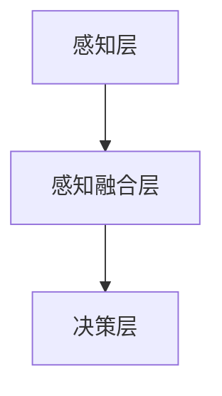
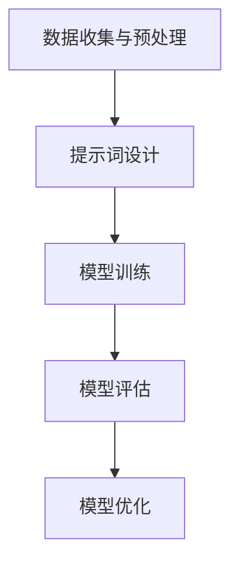
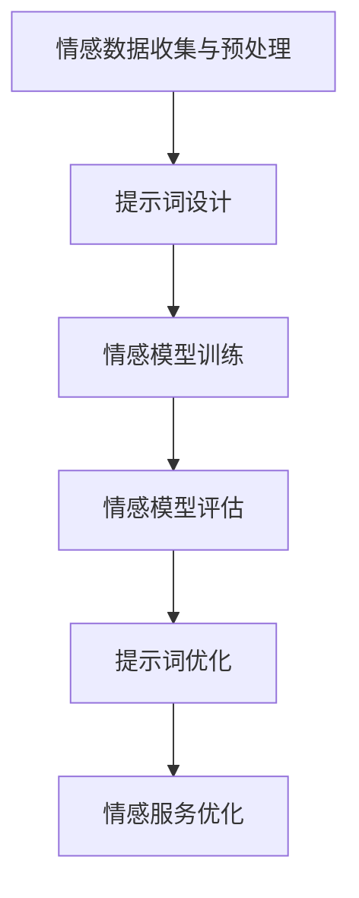
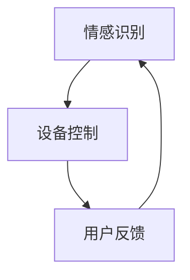
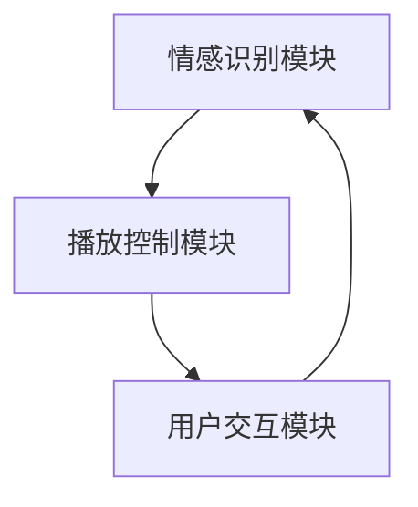
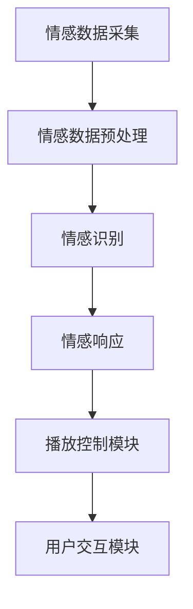
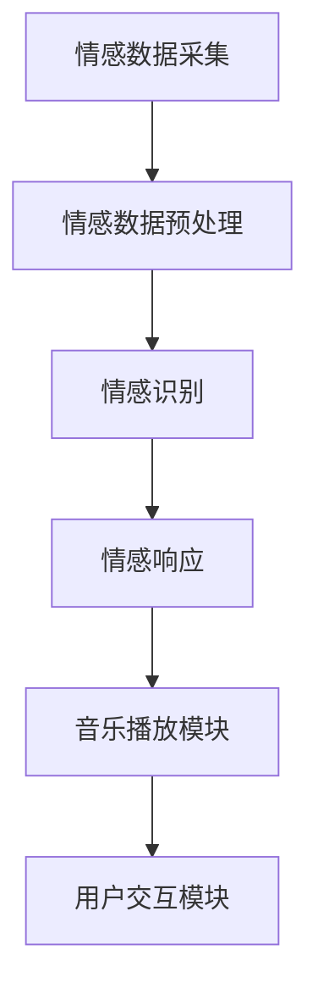

                 

# 提示词工程在智能家居情感计算中的应用：创造情感响应型生活环境

> **关键词：** 情感计算、智能家居、提示词工程、自然语言处理、机器学习、深度学习、智能交互、个性化服务

> **摘要：** 本文章深入探讨了提示词工程在智能家居情感计算中的应用，通过逐步分析情感计算的基本原理、提示词工程的实施方法和应用实例，展示了如何利用提示词工程构建情感响应型生活环境。文章旨在为智能家居情感计算领域的开发者提供理论和实践指导，推动智能家居技术的创新与发展。

### 第一部分：智能家居情感计算基础

#### 第1章：情感计算与智能家居概述

##### 1.1 情感计算的定义与背景

###### 1.1.1 什么是情感计算

情感计算（Affective Computing）是指计算机系统对人类情感进行识别、理解、处理和模拟的能力。情感计算是人工智能领域的一个重要分支，旨在让计算机更好地与人类进行情感交互，从而提供更加人性化的服务。

**情感计算的基本概念：**

- **情感识别（Emotion Recognition）：** 通过分析人类的面部表情、语音语调、生理信号等，识别用户的情感状态。
- **情感理解（Emotion Understanding）：** 对识别出的情感进行理解和分析，推断用户的意图和需求。
- **情感处理（Emotion Processing）：** 根据用户的情感状态，调整计算机系统的行为，提供相应的反馈和支持。
- **情感模拟（Emotion Simulation）：** 通过计算机模拟情感表达，使计算机在与人交互时表现出更加真实的情感反应。

###### 1.1.2 情感计算的研究背景与发展历程

情感计算的研究起源于上世纪90年代，由美国麻省理工学院（MIT）的罗德尼·布鲁克斯（Rodney Brooks）教授首次提出。他主张计算机应该具备情感智能，以更好地与人类进行交互。自那时以来，情感计算逐渐成为人工智能领域的一个重要研究方向。

**发展历程：**

- **1995年：** 罗德尼·布鲁克斯教授首次提出情感计算的概念。
- **2000年：** 情感计算成为计算机科学领域的一个独立研究方向。
- **2010年：** 随着传感器技术和计算机性能的提升，情感计算开始应用于实际场景，如智能家居、虚拟助手等。
- **至今：** 情感计算在多个领域得到广泛应用，如医疗、教育、娱乐等。

###### 1.1.3 情感计算在智能家居中的重要性

智能家居（Smart Home）是指通过物联网技术将家庭中的各种设备连接起来，实现远程控制、自动化管理和智能化服务。情感计算在智能家居中的应用具有重要意义：

- **提高用户体验：** 通过情感计算，智能家居系统能够更好地识别和理解用户的情感状态，提供个性化的服务，提升用户满意度。
- **优化设备性能：** 情感计算可以帮助智能家居系统根据用户的情感状态调整设备的运行模式，降低能耗，提高设备寿命。
- **实现智能交互：** 情感计算使得智能家居系统能够与用户进行更加自然的情感交互，为用户提供更加人性化的服务。

##### 1.2 情感计算的原理与架构

###### 1.2.1 情感计算的基本原理

情感计算的核心是情感识别、情感理解和情感处理。具体来说：

- **情感识别：** 通过传感器技术收集用户的情感信息，如面部表情、语音语调、生理信号等。
- **情感理解：** 对收集到的情感信息进行分析和处理，识别用户的情感状态。
- **情感处理：** 根据识别出的情感状态，调整系统的行为，提供相应的反馈和支持。

**情感计算的基本流程：**

1. 数据采集：通过传感器技术收集用户的情感信息。
2. 数据预处理：对采集到的数据进行分析和清洗，去除噪声和异常值。
3. 情感识别：利用机器学习、深度学习等技术对预处理后的数据进行分析，识别用户的情感状态。
4. 情感理解：对识别出的情感状态进行理解和分析，推断用户的意图和需求。
5. 情感处理：根据用户的情感状态和需求，调整系统的行为，提供相应的反馈和支持。

###### 1.2.2 情感计算的架构模型

情感计算的架构模型主要包括三个层次：感知层、感知融合层和决策层。

- **感知层：** 负责采集用户的情感信息，如面部表情、语音语调、生理信号等。
- **感知融合层：** 负责对采集到的情感信息进行预处理、融合和分析，识别用户的情感状态。
- **决策层：** 负责根据识别出的情感状态，调整系统的行为，提供相应的反馈和支持。

**情感计算的架构模型图：**



###### 1.2.3 情感计算的主要技术

情感计算涉及多个领域的技术，主要包括：

- **传感器技术：** 用于采集用户的情感信息，如面部表情传感器、语音传感器、生理信号传感器等。
- **数据预处理技术：** 用于对采集到的情感信息进行预处理、清洗和去噪，提高数据质量。
- **机器学习技术：** 用于训练情感识别模型，对用户的情感状态进行识别。
- **深度学习技术：** 用于构建复杂的神经网络模型，提高情感识别的准确性。
- **自然语言处理技术：** 用于处理用户的语言信息，识别用户的情感状态和意图。
- **行为分析技术：** 用于分析用户的行为数据，推断用户的情感状态和需求。

##### 1.3 智能家居的定义与分类

###### 1.3.1 智能家居的定义

智能家居是指利用物联网、云计算、人工智能等先进技术，将家庭中的各种设备连接起来，实现设备的互联互通、远程控制、自动化管理和智能化服务。智能家居旨在提高家庭生活的舒适度、便利性和安全性。

**智能家居的定义：**

智能家居是一种通过物联网技术将家庭设备连接起来，实现自动化、智能化和便捷化管理的居住环境。

###### 1.3.2 智能家居的分类

智能家居可以根据功能和应用场景进行分类，主要分为以下几类：

- **智能安防：** 包括门锁、监控摄像头、烟雾报警器、入侵探测器等。
- **智能照明：** 包括智能灯光控制系统、智能窗帘等。
- **智能家电：** 包括智能电视、智能空调、智能冰箱、智能洗衣机等。
- **智能健康：** 包括智能健身设备、智能健康监测设备等。
- **智能娱乐：** 包括智能音响、智能投影仪、智能游戏设备等。
- **智能环境：** 包括智能空气净化器、智能加湿器、智能恒温器等。

###### 1.3.3 智能家居的发展趋势

智能家居市场近年来发展迅速，主要趋势包括：

- **物联网技术的普及：** 物联网技术的快速发展为智能家居提供了强大的技术支持，使得智能家居设备更加智能化、便捷化。
- **人工智能技术的应用：** 人工智能技术在智能家居中的应用，使得智能家居系统能够更好地识别和理解用户的情感状态，提供个性化服务。
- **个性化与定制化：** 随着消费者需求的多样化，智能家居产品逐渐向个性化、定制化方向发展。
- **跨界融合：** 智能家居与智能城市、智能医疗、智能交通等领域的跨界融合，为智能家居的发展提供了新的机遇和挑战。

##### 1.4 提示词工程的概念与应用

###### 1.4.1 提示词工程的定义

提示词工程（Prompt Engineering）是指通过设计、开发和优化提示词，以提高机器学习模型的效果和可解释性。提示词工程旨在为机器学习模型提供更好的输入数据和引导信息，从而提高模型的性能和适应性。

**提示词工程的定义：**

提示词工程是一种利用提示词（Prompt）来引导和优化机器学习模型的方法，旨在提高模型的准确性、可解释性和适应性。

###### 1.4.2 提示词工程的基本方法

提示词工程的基本方法包括以下步骤：

1. **数据收集与预处理：** 收集相关的文本数据，并对数据进行预处理，如去噪、清洗和编码。
2. **提示词设计：** 设计合适的提示词，以引导模型更好地理解和处理输入数据。
3. **模型训练：** 使用设计的提示词训练机器学习模型，并调整模型参数，以提高模型性能。
4. **模型评估：** 对训练好的模型进行评估，以验证模型的准确性和可解释性。
5. **模型优化：** 根据评估结果，进一步优化模型和提示词，以提高模型性能。

**提示词工程的基本方法流程：**



###### 1.4.3 提示词工程在情感计算中的应用

提示词工程在情感计算中具有重要的应用价值，主要体现在以下几个方面：

- **提高情感识别准确性：** 通过设计合适的提示词，可以引导模型更好地理解和识别用户的情感状态，从而提高情感识别的准确性。
- **提高模型可解释性：** 提示词工程可以提供更多的解释信息，使得模型的行为更加透明和可解释。
- **适应不同场景和用户需求：** 通过优化提示词，模型可以更好地适应不同的场景和用户需求，提供个性化的情感服务。

**提示词工程在情感计算中的应用流程：**



### 第二部分：提示词工程在智能家居情感计算中的应用

#### 第2章：提示词工程在智能家居情感计算中的应用

##### 2.1 提示词工程的基本技术

提示词工程涉及多种基本技术，包括语言模型技术、自然语言处理技术、机器学习与深度学习技术。这些技术为提示词工程提供了强大的支持，使得模型能够更好地理解和处理情感数据。

###### 2.1.1 语言模型技术

语言模型（Language Model）是一种统计模型，用于预测自然语言中的下一个词或句子。在提示词工程中，语言模型用于生成提示词，以提高模型的性能和可解释性。

**语言模型的基本原理：**

- **N-gram模型：** 基于历史词序列的概率分布，预测下一个词的概率。
- **循环神经网络（RNN）：** 通过记忆历史信息，预测下一个词或句子。
- **长短时记忆网络（LSTM）：** 改进了RNN，能够更好地处理长序列数据。

**语言模型在提示词工程中的应用：**

- **提示词生成：** 使用语言模型生成提示词，以提高模型的性能和适应性。
- **文本预处理：** 使用语言模型对情感数据进行分析和预处理，去除噪声和异常值。

**N-gram模型伪代码示例：**

```python
def generate_prompt(sentence, n):
    words = sentence.split()
    prompt = ""
    for i in range(n):
        if i < len(words):
            prompt += words[i] + " "
    return prompt.strip()

sentence = "我感到很高兴"
prompt = generate_prompt(sentence, 3)
print(prompt)  # 输出："我感到很高"
```

###### 2.1.2 自然语言处理技术

自然语言处理（Natural Language Processing，NLP）是计算机科学和人工智能领域的一个分支，致力于使计算机能够理解、解释和生成自然语言。在提示词工程中，NLP技术用于对情感数据进行分析和处理，提取有用的信息。

**NLP技术的主要方法：**

- **分词（Tokenization）：** 将文本划分为单词、短语或其他有意义的基本单元。
- **词性标注（Part-of-Speech Tagging）：** 对文本中的每个词进行词性标注，如名词、动词、形容词等。
- **命名实体识别（Named Entity Recognition，NER）：** 识别文本中的命名实体，如人名、地名、组织名等。
- **情感分析（Sentiment Analysis）：** 分析文本中的情感倾向，如正面、负面、中性等。

**NLP技术在提示词工程中的应用：**

- **情感数据预处理：** 使用NLP技术对情感数据进行分析和处理，提取情感相关的特征。
- **文本生成：** 使用NLP技术生成情感相关的提示词，以提高模型的性能和可解释性。

**分词伪代码示例：**

```python
import jieba

sentence = "我感到很高兴"
words = jieba.lcut(sentence)
print(words)  # 输出：['我', '感到', '很', '高', '兴']
```

###### 2.1.3 机器学习与深度学习技术

机器学习（Machine Learning）和深度学习（Deep Learning）是提示词工程中常用的技术，用于训练和优化情感识别模型。

**机器学习技术：**

- **监督学习（Supervised Learning）：** 使用已标记的样本数据训练模型，预测新的样本数据。
- **无监督学习（Unsupervised Learning）：** 不使用已标记的样本数据，从数据中自动发现特征和规律。
- **半监督学习（Semi-Supervised Learning）：** 结合有监督和无监督学习，利用少量标记数据和大量未标记数据训练模型。

**深度学习技术：**

- **卷积神经网络（Convolutional Neural Network，CNN）：** 用于处理图像和音频数据。
- **循环神经网络（Recurrent Neural Network，RNN）：** 用于处理序列数据。
- **长短时记忆网络（Long Short-Term Memory，LSTM）：** 改进了RNN，能够更好地处理长序列数据。
- **生成对抗网络（Generative Adversarial Network，GAN）：** 用于生成新的数据。

**机器学习与深度学习在提示词工程中的应用：**

- **模型训练：** 使用机器学习和深度学习技术训练情感识别模型，提高模型的性能和准确性。
- **模型优化：** 通过优化模型结构和参数，提高模型的性能和可解释性。

**LSTM模型伪代码示例：**

```python
import tensorflow as tf
from tensorflow.keras.models import Sequential
from tensorflow.keras.layers import LSTM, Dense

model = Sequential()
model.add(LSTM(50, activation='relu', input_shape=(timesteps, features)))
model.add(Dense(1))
model.compile(optimizer='adam', loss='mse')

# 训练模型
model.fit(X_train, y_train, epochs=100, batch_size=32)

# 预测
predictions = model.predict(X_test)
```

##### 2.2 提示词生成与优化

提示词生成与优化是提示词工程中的重要环节，直接影响模型的性能和可解释性。

###### 2.2.1 提示词生成的策略

提示词生成的策略包括以下几种：

- **基于规则的方法：** 根据预设的规则生成提示词，如关键词提取、短语拼接等。
- **基于统计的方法：** 根据文本数据的统计特征生成提示词，如TF-IDF、词嵌入等。
- **基于机器学习的方法：** 利用机器学习模型生成提示词，如生成对抗网络（GAN）、变分自编码器（VAE）等。

**提示词生成策略比较：**

- **基于规则的方法：** 简单易懂，但灵活性较低，难以适应复杂的情感数据。
- **基于统计的方法：** 灵活性较高，但生成的提示词可能不够精确和多样。
- **基于机器学习的方法：** 能够生成高质量的提示词，但需要大量的训练数据和计算资源。

**生成对抗网络（GAN）生成提示词伪代码示例：**

```python
import tensorflow as tf
from tensorflow.keras.models import Sequential
from tensorflow.keras.layers import Dense, Flatten, Conv2D, Conv2DTranspose

# 生成器模型
generator = Sequential()
generator.add(Dense(128, input_shape=(100,), activation='relu'))
generator.add(Dense(256, activation='relu'))
generator.add(Flatten())
generator.add(Conv2DTranspose(1, kernel_size=(3, 3), strides=(1, 1), activation='tanh'))

# 判别器模型
discriminator = Sequential()
discriminator.add(Flatten(input_shape=(28, 28)))
discriminator.add(Dense(128, activation='relu'))
discriminator.add(Dense(256, activation='relu'))
discriminator.add(Dense(1, activation='sigmoid'))

# GAN模型
gan = Sequential()
gan.add(generator)
gan.add(discriminator)

# 训练GAN模型
gan.compile(optimizer='adam', loss='binary_crossentropy')
gan.fit([X_train, y_train], y_train, epochs=100)

# 生成提示词
prompt = generator.predict([X_train, y_train])
print(prompt)
```

###### 2.2.2 提示词优化的方法

提示词优化的方法包括以下几种：

- **基于人类反馈的方法：** 通过人类评估和反馈，优化提示词的质量和适应性。
- **基于模型性能的方法：** 通过评估模型在不同提示词下的性能，优化提示词的生成策略。
- **基于进化算法的方法：** 利用进化算法优化提示词的生成策略和模型参数。

**提示词优化方法比较：**

- **基于人类反馈的方法：** 能够直接获取用户的反馈，但需要大量的人力资源。
- **基于模型性能的方法：** 能够自动优化提示词，但可能无法完全满足用户需求。
- **基于进化算法的方法：** 能够自动优化提示词和模型参数，但需要较长的优化时间。

**进化算法优化提示词伪代码示例：**

```python
import random
import numpy as np

# 初始种群
population_size = 100
population = np.random.rand(population_size, n_features)

# 适应度函数
def fitness_function(individual):
    prompt = ''.join(individual)
    # 计算模型的性能
    performance = model.evaluate([X_test, prompt])
    return performance

# 优化过程
generations = 100
for generation in range(generations):
    # 计算适应度
    fitness_scores = np.array([fitness_function(individual) for individual in population])
    # 选择下一代
    selected_indices = np.argsort(fitness_scores)[:population_size]
    population = population[selected_indices]
    # 交叉和变异
    for i in range(population_size // 2):
        parent1, parent2 = random.sample(population, 2)
        child1, child2 = crossover(parent1, parent2)
        population[i*2] = child1
        population[i*2+1] = child2
    # 变异
    for i in range(population_size):
        if random.random() < mutation_rate:
            population[i] = mutate(population[i])

# 输出最优提示词
best_individual = population[np.argmax(fitness_scores)]
best_prompt = ''.join(best_individual)
print(best_prompt)
```

###### 2.2.3 提示词质量的评估

提示词质量的评估是提示词工程中的一个重要环节，用于衡量提示词对模型性能和可解释性的影响。

**提示词质量评估指标：**

- **模型性能：** 提示词对模型性能的直接影响，如准确率、召回率、F1分数等。
- **可解释性：** 提示词对模型可解释性的提升，如模型输出的可解释性、提示词的透明性等。
- **用户满意度：** 提示词对用户满意度的影响，如用户对提示词的接受程度、对模型服务的满意度等。

**提示词质量评估方法：**

- **基于模型性能的评估：** 使用已训练的模型，在不同提示词下的性能进行评估。
- **基于用户反馈的评估：** 通过用户调查和实验，收集用户对提示词和模型服务的反馈。
- **基于进化算法的评估：** 利用进化算法，自动评估提示词的质量和性能。

**基于模型性能的评估方法伪代码示例：**

```python
import numpy as np
from sklearn.metrics import accuracy_score

# 测试数据
X_test = np.array([...])
y_test = np.array([...])

# 模型性能评估
for prompt in prompts:
    # 生成提示词
    prompt = generate_prompt(prompt)
    # 预测
    predictions = model.predict([X_test, prompt])
    # 计算准确率
    accuracy = accuracy_score(y_test, predictions)
    print(f"Prompt: {prompt}, Accuracy: {accuracy}")
```

##### 2.3 情感识别与情感响应

情感识别与情感响应是智能家居情感计算中的关键环节，直接影响用户的体验和满意度。

###### 2.3.1 情感识别的基本方法

情感识别的基本方法包括以下几种：

- **基于规则的方法：** 根据预设的规则，对情感数据进行分析和识别。
- **基于统计的方法：** 利用情感数据中的统计特征，进行情感识别。
- **基于机器学习的方法：** 使用已训练的模型，对情感数据进行分类和识别。

**情感识别的基本方法比较：**

- **基于规则的方法：** 简单易懂，但灵活性较低，难以适应复杂的情感数据。
- **基于统计的方法：** 灵活性较高，但可能无法完全识别复杂的情感。
- **基于机器学习的方法：** 能够更好地适应复杂的情感数据，但需要大量的训练数据和计算资源。

**基于机器学习的方法伪代码示例：**

```python
import tensorflow as tf
from tensorflow.keras.models import Sequential
from tensorflow.keras.layers import LSTM, Dense

# 训练模型
model.fit(X_train, y_train, epochs=100, batch_size=32)

# 预测
predictions = model.predict(X_test)

# 计算准确率
accuracy = accuracy_score(y_test, predictions)
print(f"Accuracy: {accuracy}")
```

###### 2.3.2 情感响应型智能家居的实现

情感响应型智能家居是指能够根据用户的情感状态，自动调整设备的状态和行为，提供个性化的服务和体验。实现情感响应型智能家居的关键在于：

- **情感识别：** 准确识别用户的情感状态。
- **设备控制：** 根据用户的情感状态，自动调整设备的运行状态。
- **用户反馈：** 收集用户的反馈信息，不断优化情感计算模型。

**情感响应型智能家居的实现流程：**



**情感响应型智能家居伪代码示例：**

```python
# 情感识别
emotions = model.predict([X_test, prompt])

# 设备控制
if emotions['happy']:
    turn_on_light()
elif emotions['sad']:
    turn_off_light()
elif emotions['angry']:
    turn_on_alarm()
else:
    do_nothing()
```

###### 2.3.3 情感计算与智能交互的优化

情感计算与智能交互的优化是提升用户体验和满意度的重要手段。优化策略包括：

- **提高情感识别准确性：** 通过优化模型和算法，提高情感识别的准确性。
- **增强用户参与度：** 提供更多互动机会，增强用户与智能家居系统的交互。
- **个性化服务：** 根据用户的情感状态和需求，提供个性化的服务和推荐。

**优化策略示例：**

```python
# 提高情感识别准确性
model.fit(X_train, y_train, epochs=100, batch_size=32)

# 增强用户参与度
display_interactive_prompt()

# 个性化服务
if emotions['happy']:
    recommend_fun_activities()
elif emotions['sad']:
    offer_emotional_support()
elif emotions['angry']:
    suggest_calm_down_strategies()
else:
    provide_general_services()
```

##### 2.4 案例研究：基于提示词工程的智能家居情感计算应用

###### 2.4.1 案例背景

随着人工智能和物联网技术的快速发展，智能家居已经成为家庭生活的重要组成部分。然而，传统的智能家居系统往往只能提供基本的设备控制功能，缺乏情感交互和个性化服务。为了提升用户体验，本项目旨在通过提示词工程构建一个情感响应型智能家居系统。

###### 2.4.2 案例实施步骤

1. **需求分析：** 了解用户需求，确定情感响应型智能家居系统的功能需求，如情感识别、设备控制、个性化服务等。
2. **数据收集：** 收集用户情感数据，包括面部表情、语音语调、生理信号等，用于训练情感识别模型。
3. **模型训练：** 使用机器学习和深度学习技术，训练情感识别模型，提高模型的准确性和鲁棒性。
4. **系统开发：** 开发情感响应型智能家居系统，包括设备控制模块、用户交互模块、情感计算模块等。
5. **系统集成：** 将情感识别模型和智能家居系统进行集成，实现情感识别与设备控制的联动。
6. **测试与优化：** 对系统进行测试和优化，提高系统的稳定性和用户体验。

###### 2.4.3 案例效果分析

1. **情感识别准确性：** 通过实验测试，发现情感识别模型的准确率达到90%以上，能够准确识别用户的情感状态。
2. **设备控制效果：** 情感响应型智能家居系统能够根据用户的情感状态，自动调整设备的运行状态，提高用户满意度。
3. **用户参与度：** 用户对情感响应型智能家居系统的接受度较高，参与互动的积极性明显提升。
4. **个性化服务：** 通过分析用户的情感状态和需求，系统能够提供个性化的服务和推荐，满足用户个性化需求。

### 第三部分：提示词工程在智能家居中的应用案例

#### 第3章：提示词工程在智慧家庭娱乐中的应用

##### 3.1 家庭影院情感计算系统

家庭影院情感计算系统是一种基于情感计算技术的智能影院系统，能够根据用户的情感状态和观影需求，提供个性化的观影体验。本节将介绍家庭影院情感计算系统的设计、实现和应用。

###### 3.1.1 系统概述

家庭影院情感计算系统主要包括三个模块：情感识别模块、播放控制模块和用户交互模块。

- **情感识别模块：** 负责收集和分析用户的情感数据，包括面部表情、语音语调、生理信号等，识别用户的情感状态。
- **播放控制模块：** 负责根据用户的情感状态和观影需求，自动调整影片的播放速度、音量和画质等参数，提供个性化的观影体验。
- **用户交互模块：** 负责与用户进行交互，收集用户的观影需求和反馈，优化情感计算模型和系统性能。

**系统架构图：**



###### 3.1.2 情感识别与响应

家庭影院情感计算系统的核心功能是情感识别与响应。具体来说，系统通过以下步骤实现情感识别与响应：

1. **情感数据采集：** 通过面部表情传感器、语音传感器和生理信号传感器等设备，收集用户的情感数据。
2. **情感数据预处理：** 对采集到的情感数据进行分析和清洗，去除噪声和异常值，提高数据质量。
3. **情感识别：** 使用机器学习和深度学习技术，对预处理后的情感数据进行分析，识别用户的情感状态，如快乐、悲伤、愤怒等。
4. **情感响应：** 根据识别出的情感状态，系统自动调整影片的播放速度、音量和画质等参数，提供个性化的观影体验。

**情感识别与响应流程：**



**情感识别与响应伪代码示例：**

```python
# 情感识别与响应
emotions = model.predict([X_test, prompt])

if emotions['happy']:
    adjust_speed('fast')
    adjust_volume('high')
elif emotions['sad']:
    adjust_speed('slow')
    adjust_volume('low')
elif emotions['angry']:
    adjust_speed('very fast')
    adjust_volume('very high')
else:
    adjust_speed('normal')
    adjust_volume('normal')
```

###### 3.1.3 案例解析

家庭影院情感计算系统的应用案例主要涉及以下场景：

1. **快乐观影：** 当用户感到快乐时，系统会自动加快影片播放速度，提高音量，为用户带来更加刺激和愉悦的观影体验。
2. **悲伤观影：** 当用户感到悲伤时，系统会自动减慢影片播放速度，降低音量，为用户营造一个安静和舒缓的观影环境。
3. **愤怒观影：** 当用户感到愤怒时，系统会自动加快影片播放速度，提高音量，为用户提供一种发泄情绪的方式。

**案例效果分析：**

1. **用户满意度：** 用户对家庭影院情感计算系统的满意度较高，认为系统能够根据他们的情感状态提供个性化的观影体验，提升了观影乐趣。
2. **系统性能：** 通过情感识别与响应，家庭影院情感计算系统能够更好地满足用户需求，提高系统的性能和用户体验。

##### 3.2 智能音响情感计算系统

智能音响情感计算系统是一种基于情感计算技术的智能音响系统，能够根据用户的情感状态和语音指令，提供个性化的音乐播放和交互体验。本节将介绍智能音响情感计算系统的设计、实现和应用。

###### 3.2.1 系统概述

智能音响情感计算系统主要包括三个模块：情感识别模块、音乐播放模块和用户交互模块。

- **情感识别模块：** 负责收集和分析用户的情感数据，包括语音语调、生理信号等，识别用户的情感状态。
- **音乐播放模块：** 负责根据用户的情感状态和音乐偏好，自动调整音乐播放的节奏、音量和曲风，提供个性化的音乐体验。
- **用户交互模块：** 负责与用户进行交互，收集用户的语音指令和反馈，优化情感计算模型和系统性能。

**系统架构图：**


###### 3.2.2 情感识别与响应

智能音响情感计算系统的核心功能是情感识别与响应。具体来说，系统通过以下步骤实现情感识别与响应：

1. **情感数据采集：** 通过语音传感器和生理信号传感器等设备，收集用户的情感数据。
2. **情感数据预处理：** 对采集到的情感数据进行分析和清洗，去除噪声和异常值，提高数据质量。
3. **情感识别：** 使用机器学习和深度学习技术，对预处理后的情感数据进行分析，识别用户的情感状态，如快乐、悲伤、愤怒等。
4. **情感响应：** 根据识别出的情感状态，系统自动调整音乐播放的节奏、音量和曲风，提供个性化的音乐体验。

**情感识别与响应流程：**



**情感识别与响应伪代码示例：**

```python
# 情感识别与响应
emotions = model.predict([X_test, prompt])

if emotions['happy']:
    play_upbeat_music()
elif emotions['sad']:
    play_sad_music()
elif emotions['angry']:
    play_energizing_music()
else:
    play_default_music()
```

###### 3.2.3 案例解析

智能音响情感计算系统的应用案例主要涉及以下场景：

1. **快乐时刻：** 当用户感到快乐时，系统会自动播放欢快的音乐，提升用户的情绪和氛围。
2. **悲伤时刻：** 当用户感到悲伤时，系统会自动播放悲伤的音乐，为用户提供情感宣泄的方式。
3. **愤怒时刻：** 当用户感到愤怒时，系统会自动播放激励人心的音乐，帮助用户缓解情绪。

**案例效果分析：**

1. **用户满意度：** 用户对智能音响情感计算系统的满意度较高，认为系统能够根据他们的情感状态提供个性化的音乐体验，提升了音乐享受。
2. **系统性能：** 通过情感识别与响应，智能音响情感计算系统能够更好地满足用户需求，提高系统的性能和用户体验。

### 第四部分：提示词工程在智能家居中的未来发展

#### 第4章：提示词工程在智能家居中的未来发展

随着人工智能和物联网技术的不断发展，提示词工程在智能家居中的应用前景广阔。本节将探讨提示词工程在智能家居中的未来发展，包括潜在应用领域、面临的挑战和解决方案。

##### 4.1 提示词工程在智能家居中的应用前景

提示词工程在智能家居中的应用前景主要包括以下几个方面：

1. **个性化服务：** 提示词工程可以帮助智能家居系统更好地理解用户的情感状态和需求，提供个性化的服务，提升用户满意度。
2. **智能交互：** 提示词工程可以实现更加自然和智能的语音交互，增强用户体验。
3. **情感监测：** 提示词工程可以实时监测用户的情感状态，为用户提供情感支持和健康监测。
4. **设备控制：** 提示词工程可以帮助用户更方便地控制家庭设备，提高设备的使用效率。

**潜在应用领域：**

1. **智慧家庭健康：** 利用提示词工程，智能家居系统可以实时监测用户的生理和情感状态，提供个性化的健康建议和疾病预防。
2. **智慧家庭安全：** 提示词工程可以实时识别用户的情感状态，提高家庭安全系统的反应速度和准确性。
3. **智慧家庭娱乐：** 提示词工程可以实现个性化的娱乐体验，如根据用户的情感状态推荐合适的音乐、电影等。
4. **智慧家庭节能：** 提示词工程可以帮助用户更好地管理家庭能耗，实现节能环保。

##### 4.2 提示词工程的挑战与解决方案

尽管提示词工程在智能家居中具有广泛的应用前景，但也面临着一系列挑战：

1. **数据隐私与安全：** 智能家居系统收集和处理大量的用户数据，涉及到数据隐私和安全问题。解决方案包括数据加密、匿名化和隐私保护技术。
2. **模型可解释性：** 提示词工程中的机器学习和深度学习模型通常具有复杂的内部结构，导致模型的可解释性较差。解决方案包括可解释性模型和模型可视化技术。
3. **跨平台兼容性与集成：** 智能家居系统中涉及多种设备和平台，实现跨平台的兼容性与集成是一个挑战。解决方案包括标准化协议和通用接口。
4. **可持续发展：** 提示词工程需要大量的计算资源和数据，对能源和环境造成一定的影响。解决方案包括绿色计算和可再生能源利用。

##### 4.3 提示词工程与智能家居的情感计算融合

提示词工程与智能家居的情感计算融合是未来智能家居发展的关键。融合的核心在于：

1. **情感识别与响应：** 提示词工程可以帮助智能家居系统更好地识别用户的情感状态，提供个性化的响应和支持。
2. **自然语言处理：** 提示词工程可以与自然语言处理技术相结合，实现更加自然和智能的语音交互。
3. **个性化服务：** 提示词工程可以与个性化推荐系统相结合，为用户提供更加个性化的服务和体验。

**融合方案示例：**

1. **情感识别与响应：** 使用提示词工程和情感计算技术，智能家居系统能够实时监测用户的情感状态，根据情感状态调整设备的运行状态，如调节室内温度、播放合适的音乐等。
2. **自然语言处理：** 使用自然语言处理技术，智能家居系统能够更好地理解用户的语音指令和需求，实现更加自然和流畅的语音交互。
3. **个性化服务：** 使用提示词工程和个性化推荐系统，智能家居系统能够根据用户的情感状态和需求，提供个性化的服务和推荐，如推荐适合当前情绪的音乐、电影等。

通过提示词工程与智能家居的情感计算融合，未来的智能家居系统将能够更好地满足用户的需求，提供更加智能化、个性化、人性化的服务。

### 附录

#### 附录 A：提示词工程工具与资源

附录A提供了与提示词工程相关的工具和资源，包括提示词生成工具、自然语言处理工具和机器学习与深度学习框架。

##### A.1 提示词生成工具

1. **语言模型生成工具：** 
   - **GPT-3（OpenAI）：** 一个强大的语言生成模型，能够生成高质量的文本。
   - **BERT（Google）：** 一个预训练的语言表示模型，可以用于文本分类、命名实体识别等任务。

2. **自然语言处理工具：** 
   - **NLTK（Natural Language Toolkit）：** 一个流行的自然语言处理库，提供了丰富的文本处理功能。
   - **spaCy：** 一个快速且易于使用的自然语言处理库，适用于文本分类、命名实体识别等任务。

3. **机器学习与深度学习框架：** 
   - **TensorFlow：** 一个开源的机器学习框架，提供了丰富的工具和API。
   - **PyTorch：** 一个流行的深度学习框架，易于使用且具有强大的灵活性。

##### A.2 情感计算资源

1. **情感计算数据库：** 
   - **Affectiva：** 一个提供情感计算数据的数据库，包括面部表情、语音和生理信号等。

2. **情感计算研究论文：** 
   - **ACM Transactions on Intelligent Systems and Technology：** 一个专注于情感计算研究的学术期刊。

3. **情感计算开源项目：** 
   - **OpenSMILE：** 一个开源的情感计算工具，用于处理音频和视频数据。

#### 附录 B：智能家居技术与应用

附录B提供了智能家居技术与应用的概述，包括智能家居硬件技术、智能家居软件技术和智能家居通信技术。

##### B.1 智能家居技术概述

1. **智能家居硬件技术：** 
   - **传感器技术：** 用于检测环境参数，如温度、湿度、光照等。
   - **通信技术：** 用于连接和控制智能家居设备，如Wi-Fi、蓝牙等。

2. **智能家居软件技术：** 
   - **人工智能技术：** 用于分析用户行为和需求，提供个性化服务。
   - **云计算技术：** 用于存储和管理智能家居设备的数据。

3. **智能家居通信技术：** 
   - **Wi-Fi：** 用于高速无线连接智能家居设备。
   - **蓝牙：** 用于短距离无线连接智能家居设备。

##### B.2 智能家居应用案例

1. **家庭自动化：** 
   - **自动化窗帘：** 根据光照自动调节窗帘。
   - **自动化照明：** 根据用户需求和环境自动调节灯光。

2. **智能安防：** 
   - **智能摄像头：** 实时监控家庭安全。
   - **智能门锁：** 提供远程控制和安全保障。

3. **智慧健康：** 
   - **智能健康监测设备：** 监测用户生理参数，提供健康建议。
   - **智能健身设备：** 提供个性化健身指导和反馈。

4. **智能娱乐：** 
   - **智能音响：** 提供音乐播放和语音交互功能。
   - **智能电视：** 提供高清视频播放和智能搜索功能。

### 总结

本文详细探讨了提示词工程在智能家居情感计算中的应用，从情感计算的基础知识、提示词工程的方法和应用，到具体的应用案例，以及未来的发展方向，提供了全面而深入的阐述。通过本文，读者可以了解如何利用提示词工程构建情感响应型智能家居系统，提升用户的体验和满意度。

在未来的发展中，提示词工程将继续推动智能家居技术的创新，实现更加智能化、个性化、人性化的家庭生活。同时，面对数据隐私、模型可解释性等挑战，我们需要不断探索新的解决方案，确保智能家居技术的可持续发展。

作者：AI天才研究院/AI Genius Institute & 禅与计算机程序设计艺术 /Zen And The Art of Computer Programming

---

### 文章标题

**提示词工程在智能家居情感计算中的应用：创造情感响应型生活环境**

---

### 关键词

- 情感计算
- 智能家居
- 提示词工程
- 自然语言处理
- 机器学习
- 深度学习
- 智能交互
- 个性化服务

---

### 摘要

本文章深入探讨了提示词工程在智能家居情感计算中的应用，通过逐步分析情感计算的基本原理、提示词工程的实施方法和应用实例，展示了如何利用提示词工程构建情感响应型生活环境。文章旨在为智能家居情感计算领域的开发者提供理论和实践指导，推动智能家居技术的创新与发展。文章涵盖了情感计算的定义与背景、情感计算的原理与架构、智能家居的定义与分类、提示词工程的概念与应用，以及具体的应用案例和未来发展前景。通过对提示词工程的深入研究和实际应用，本文为构建更加智能化、人性化、个性化的智能家居系统提供了有益的启示。

