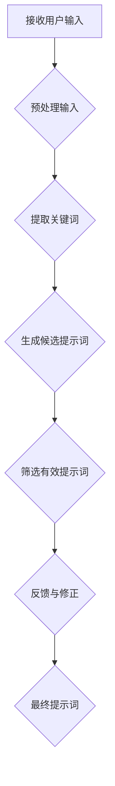
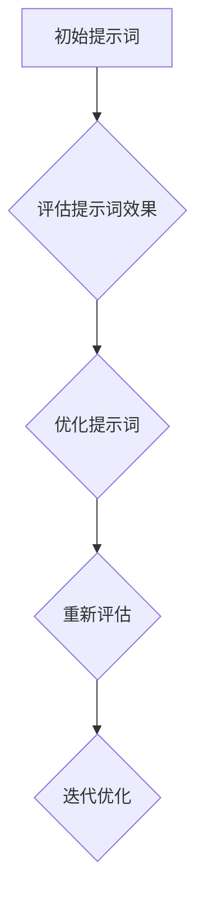

                 

## 《提示词工程：让AI更智能、更懂你》

> **关键词：** 提示词工程、人工智能、机器学习、自然语言处理、深度学习

**摘要：** 提示词工程是一种用于优化人工智能系统性能的技术，通过为AI提供更加准确、有效的提示词，使其能够更智能、更准确地理解和回应人类的需求。本文将深入探讨提示词工程的基础概念、核心算法、数学模型，并通过实际项目案例，展示其在人工智能系统中的应用和价值。

### 目录大纲

#### 第一部分：基础概念与框架
1. **核心概念与框架**
   - 1.1 提示词工程的定义与重要性
   - 1.2 提示词工程的框架

#### 第二部分：核心算法原理
2. **核心算法原理**
   - 2.1 语言模型基础
   - 2.2 提示词生成算法
   - 2.3 提示词优化算法

#### 第三部分：数学模型与公式
3. **数学模型与公式**
   - 3.1 语言模型的数学模型
   - 3.2 提示词优化的数学模型

#### 第四部分：项目实战与案例分析
4. **项目实战与案例分析**
   - 4.1 提示词生成项目实战
   - 4.2 提示词优化项目实战

#### 第五部分：拓展与未来展望
5. **拓展与未来展望**
   - 5.1 提示词工程在垂直领域的应用
   - 5.2 提示词工程的发展趋势

### 附录
6. **附录**
   - 6.1 提示词工程常用工具与资源
   - 6.2 Mermaid 流程图示例

#### 结论
7. **结论**
   - 对提示词工程核心概念的总结
   - 对提示词工程在未来AI系统中的地位和作用的展望
   - 对读者的建议与期望

### 提示词工程的定义与重要性

**定义：** 提示词工程（Prompt Engineering）是指通过设计、优化和选择高质量的提示词，以提高人工智能系统理解和回应人类需求的能力。在自然语言处理（NLP）和机器学习（ML）领域，提示词工程是一种关键技术，它能够帮助AI系统更好地捕捉用户意图，提供更精准、更个性化的服务。

**重要性：**

1. **提高AI系统性能：** 通过高质量的提示词，AI系统可以更准确地理解和处理用户输入，从而提高系统的性能和效果。
   
2. **提升用户体验：** 良好的提示词设计能够引导用户更好地表达需求，提高用户与系统的互动质量，从而提升用户体验。

3. **促进AI发展：** 提示词工程有助于推动人工智能技术的发展，特别是在自然语言理解和生成领域。

4. **跨领域应用：** 提示词工程不仅适用于NLP领域，还可以在其他领域，如金融、医疗、教育等，发挥重要作用。

在接下来的一节中，我们将详细探讨提示词工程的框架，包括其核心组成部分和关键流程。

---

**练习问题：**
- 请简述提示词工程的主要目标是什么？
- 提示词工程在哪些领域具有重要作用？

---

## 提示词工程的框架

提示词工程是一个系统性、多层次的技术框架，旨在通过一系列步骤和算法，为AI系统提供高质量的提示词。以下是其核心组成部分和关键流程：

### 1.1 提示词生成的流程

**流程图：** （使用Mermaid绘制）



**详细解释：**

- **接收用户输入（A）**：这是整个流程的起点，用户通过文字、语音等形式与AI系统交互，输入他们的需求或问题。
  
- **预处理输入（B）**：在生成提示词之前，需要对用户输入进行预处理，包括分词、去停用词、词性标注等步骤，以提高输入的质量和一致性。

- **提取关键词（C）**：通过分析预处理后的输入文本，提取出关键信息，如主语、谓语、宾语等，这些关键词是生成提示词的重要依据。

- **生成候选提示词（D）**：根据提取的关键词，使用提示词生成算法，生成一系列候选提示词。这些算法可以是基于规则的方法，如TF-IDF、词嵌入等，也可以是机器学习的方法，如序列模型、生成对抗网络等。

- **筛选有效提示词（E）**：从候选提示词中筛选出符合质量标准、与用户输入相关性高的提示词。筛选过程可以基于统计方法、机器学习方法或专家经验。

- **反馈与修正（F）**：将筛选出的提示词反馈给用户，并根据用户的反馈进行修正。这一步骤可以帮助不断优化提示词的质量和效果。

- **最终提示词（G）**：经过筛选和修正后，得到最终用于AI系统的提示词。

### 1.2 提示词优化与评估

**流程图：** （使用Mermaid绘制）



**详细解释：**

- **评估提示词效果（B）**：对生成的提示词进行效果评估，常用的评估指标包括精确率、召回率、F1值等。评估结果可以反映提示词与用户输入的相关性、AI系统的理解和回应能力。

- **优化提示词（C）**：根据评估结果，对提示词进行优化。优化方法包括调整提示词的长度、改变关键词的顺序、添加或删除某些词汇等。优化的目的是提高提示词的质量和效果。

- **重新评估（D）**：对优化后的提示词进行重新评估，以验证优化效果。

- **迭代优化（E）**：通过多次迭代，不断评估和优化提示词，直到达到满意的性能指标。

### 1.3 提示词工程的核心技术

- **语言模型**：语言模型是提示词工程的基础，它用于生成和优化提示词。常见的语言模型包括基于规则的方法（如N元语法）和基于统计或神经网络的方法（如循环神经网络、Transformer等）。

- **提示词生成算法**：提示词生成算法是生成候选提示词的关键，常用的算法有基于规则的方法（如TF-IDF、LDA等）和基于机器学习的方法（如序列模型、生成对抗网络等）。

- **提示词优化算法**：提示词优化算法用于根据评估结果对提示词进行优化，常用的算法有基于统计的方法（如线性回归、决策树等）和基于机器学习的方法（如支持向量机、神经网络等）。

- **评估与反馈机制**：评估与反馈机制是提示词工程的保障，通过不断的评估和反馈，可以持续优化提示词的质量和效果。

在下一节中，我们将深入探讨提示词工程中的核心算法原理，包括语言模型、提示词生成算法和提示词优化算法。

---

**练习问题：**
- 描述提示词生成流程中的每个步骤及其重要性。
- 提示词优化与评估的过程是如何进行的？

---

## 核心算法原理

在提示词工程中，核心算法原理是构建和优化提示词的关键。本节将详细探讨语言模型、提示词生成算法和提示词优化算法，并使用伪代码对这些算法进行说明。

### 2.1 语言模型基础

语言模型（Language Model）是自然语言处理领域的基础，用于预测文本中的下一个单词或字符。它广泛应用于语音识别、机器翻译、文本生成等任务。

**语言模型的分类与特性：**

1. **基于规则的语言模型**：这类模型通常使用上下文信息进行预测，如N元语法（N-gram）。N元语法使用前N个单词的历史信息来预测下一个单词。

   **N元语法伪代码：**
   ```python
   def predict_next_word(context):
       # context 是前N个单词
       # calculate the probability distribution of next word based on N-gram model
       # return the most probable next word
   ```

2. **基于统计的语言模型**：这类模型通过统计文本中的单词分布来预测下一个单词。例如，使用TF-IDF（Term Frequency-Inverse Document Frequency）来计算单词的重要性。

   **TF-IDF伪代码：**
   ```python
   def calculate_tf_idf(document, corpus):
       # document 是单个文档，corpus 是文档集合
       # calculate term frequency and inverse document frequency
       # return the TF-IDF weight for each word in the document
   ```

3. **基于神经网络的语言模型**：这类模型使用深度学习来预测文本。循环神经网络（RNN）和Transformer是其中常见的模型。

   **RNN伪代码：**
   ```python
   def rnn_predict(context, model):
       # context 是输入序列，model 是训练好的RNN模型
       # pass the context through the RNN and predict the next word
       # return the predicted word
   ```

   **Transformer伪代码：**
   ```python
   def transformer_predict(context, model):
       # context 是输入序列，model 是训练好的Transformer模型
       # pass the context through the Transformer and predict the next word
       # return the predicted word
   ```

**语言模型的训练过程：**

语言模型的训练通常包括以下步骤：

1. **数据预处理**：将文本数据转换为适当的格式，如单词序列、字符序列等。

2. **词汇表构建**：构建词汇表，将文本中的单词或字符映射到整数。

3. **模型初始化**：初始化模型参数，如权重矩阵。

4. **训练**：使用训练数据对模型进行训练，优化模型参数。

5. **评估与调整**：评估模型性能，根据评估结果调整模型参数。

### 2.2 提示词生成算法

提示词生成算法用于生成与用户输入相关的候选提示词。这些算法可以根据用户输入的上下文信息，预测出可能的用户意图，并生成相应的提示词。

**提示词生成算法的类型：**

1. **基于规则的方法**：这类方法根据预定义的规则生成提示词，如基于关键词匹配、语法结构等。

   **规则生成算法伪代码：**
   ```python
   def rule_based_generation(input_context, rules):
       # input_context 是用户输入的上下文，rules 是预定义的规则
       # apply the rules to generate candidate prompts
       # return the generated prompts
   ```

2. **基于统计的方法**：这类方法使用统计模型，如TF-IDF、LDA（Latent Dirichlet Allocation）等，来生成提示词。

   **统计生成算法伪代码：**
   ```python
   def statistical_generation(input_context, model):
       # input_context 是用户输入的上下文，model 是训练好的统计模型
       # use the model to generate candidate prompts based on the context
       # return the generated prompts
   ```

3. **基于机器学习的方法**：这类方法使用机器学习模型，如序列模型、生成对抗网络（GAN）等，来生成提示词。

   **机器学习生成算法伪代码：**
   ```python
   def ml_based_generation(input_context, model):
       # input_context 是用户输入的上下文，model 是训练好的机器学习模型
       # use the model to generate candidate prompts based on the context
       # return the generated prompts
   ```

**提示词生成算法的优缺点：**

- **基于规则的方法**：
  - 优点：简单易懂，执行速度快。
  - 缺点：灵活性差，难以处理复杂的用户输入。

- **基于统计的方法**：
  - 优点：适用于大规模文本数据，能够捕捉文本的统计特性。
  - 缺点：可能产生过拟合，生成结果受限于训练数据。

- **基于机器学习的方法**：
  - 优点：能够自适应地学习用户输入，生成更加个性化的提示词。
  - 缺点：训练过程复杂，对数据要求高。

### 2.3 提示词优化算法

提示词优化算法用于根据评估结果对提示词进行优化，以提高AI系统的性能和用户体验。

**提示词优化的目标：**

- **提高提示词的相关性**：确保生成的提示词与用户输入高度相关，能够准确捕捉用户意图。
- **提高用户满意度**：通过优化提示词，提高用户对AI系统的满意度，增强用户体验。

**提示词优化的方法：**

1. **基于统计的方法**：这类方法使用统计指标，如精确率、召回率、F1值等，来评估提示词的质量，并根据评估结果进行优化。

   **统计优化算法伪代码：**
   ```python
   def statistical_optimization(prompt, model):
       # prompt 是初始提示词，model 是评估模型
       # evaluate the quality of the prompt
       # based on the evaluation result, adjust the prompt
       # return the optimized prompt
   ```

2. **基于机器学习的方法**：这类方法使用机器学习模型，如线性回归、决策树、神经网络等，来优化提示词。

   **机器学习优化算法伪代码：**
   ```python
   def ml_based_optimization(prompt, model):
       # prompt 是初始提示词，model 是训练好的优化模型
       # use the model to predict the quality of the prompt
       # based on the prediction result, adjust the prompt
       # return the optimized prompt
   ```

**提示词优化算法的案例分析：**

假设有一个聊天机器人，用户输入：“我想要买一本计算机编程的书”，系统生成的初始提示词是：“您想要购买计算机编程书籍吗？”。通过对这个提示词进行优化，可以进一步提高其与用户输入的相关性。

- **统计优化案例：**
  - 评估指标：精确率、召回率
  - 优化策略：根据评估结果，调整提示词的措辞，如将“购买”替换为“购买一本”或添加具体的书名。

- **机器学习优化案例：**
  - 评估模型：使用线性回归模型，输入为提示词和用户输入，输出为优化评分。
  - 优化策略：根据优化评分，调整提示词的措辞和结构，以提高整体质量。

通过上述算法和案例，我们可以看到提示词工程在提高AI系统性能和用户体验方面的作用。在下一节中，我们将进一步探讨提示词优化的数学模型与公式。

---

**练习问题：**
- 描述基于统计的提示词优化算法的核心思想和步骤。
- 如何使用机器学习优化算法来提高提示词质量？

---

## 数学模型与公式

在提示词工程中，数学模型与公式是核心算法的数学基础，它们帮助我们精确描述和优化提示词生成与优化的过程。以下将详细介绍语言模型和提示词优化的数学模型与公式。

### 3.1 语言模型的数学模型

语言模型旨在预测一个序列中出现下一个词的概率。常用的语言模型数学模型包括概率模型和神经网络模型。

#### 概率模型

**N元语法模型**

N元语法模型是基于历史N个词来预测下一个词的概率。其数学模型可以表示为：

\[ P(w_{t+1} | w_{t}, w_{t-1}, ..., w_{t-N+1}) = \frac{f(w_{t+1}, w_{t}, ..., w_{t-N+1})}{\sum_{w'_{t+1}} f(w'_{t+1}, w_{t}, ..., w_{t-N+1})} \]

其中：
- \( w_{t+1} \) 是要预测的词
- \( w_{t}, w_{t-1}, ..., w_{t-N+1} \) 是前N个历史词
- \( f(w_{t+1}, w_{t}, ..., w_{t-N+1}) \) 是词汇频率函数，通常是一个简单的计数函数

**神经网络模型**

在神经网络模型中，如循环神经网络（RNN）和Transformer，词的概率预测是通过复杂的神经网络结构来实现的。以下是一个简单的RNN模型的概率预测公式：

\[ P(w_{t+1} | w_{t}, w_{t-1}, ..., w_{1}) = \text{softmax}(\text{RNN}(w_{t}, w_{t-1}, ..., w_{1})) \]

其中：
- \( \text{softmax} \) 是一个将神经网络输出转换为概率分布的函数
- \( \text{RNN}(w_{t}, w_{t-1}, ..., w_{1}) \) 是RNN模型在当前时刻的输出

#### 损失函数

在语言模型中，损失函数用于衡量预测概率与实际概率之间的差距。常用的损失函数包括交叉熵损失（Cross-Entropy Loss）：

\[ L = -\sum_{i=1}^{N} w_{i} \log(p_{i}) \]

其中：
- \( w_{i} \) 是实际词的权重
- \( p_{i} \) 是模型预测的概率

#### 优化算法

为了训练语言模型，通常使用优化算法来调整模型参数。常用的优化算法包括随机梯度下降（Stochastic Gradient Descent，SGD）：

\[ \theta = \theta - \alpha \nabla_{\theta} L(\theta) \]

其中：
- \( \theta \) 是模型参数
- \( \alpha \) 是学习率
- \( \nabla_{\theta} L(\theta) \) 是损失函数关于模型参数的梯度

### 3.2 提示词优化的数学模型

提示词优化的数学模型旨在通过优化提示词来提高AI系统的性能和用户体验。优化目标通常是一个多目标优化问题，可以表示为：

\[ \min_{\text{prompt}} f(\text{prompt}) \]

其中：
- \( f(\text{prompt}) \) 是优化目标函数，可以包括多个子目标，如提示词的相关性、用户满意度、系统性能等。

#### 优化目标函数

优化目标函数可以根据不同的应用场景进行调整。以下是一个简单的优化目标函数：

\[ f(\text{prompt}) = w_1 \cdot \text{relevance}(\text{prompt}, \text{input}) + w_2 \cdot \text{user\_satisfaction}(\text{prompt}) + w_3 \cdot \text{system\_performance}(\text{prompt}) \]

其中：
- \( w_1, w_2, w_3 \) 是权重系数
- \( \text{relevance}(\text{prompt}, \text{input}) \) 是提示词与输入的相关性
- \( \text{user\_satisfaction}(\text{prompt}) \) 是用户对提示词的满意度
- \( \text{system\_performance}(\text{prompt}) \) 是系统在给定提示词下的性能

#### 求解方法

求解优化问题的方法有很多，包括基于梯度下降的方法、随机搜索方法等。以下是一个简单的梯度下降求解方法：

\[ \text{prompt}_{t+1} = \text{prompt}_{t} - \alpha \nabla_{\text{prompt}} f(\text{prompt}) \]

其中：
- \( \text{prompt}_{t} \) 是当前提示词
- \( \text{prompt}_{t+1} \) 是下一次优化的提示词
- \( \alpha \) 是学习率
- \( \nabla_{\text{prompt}} f(\text{prompt}) \) 是优化目标函数关于提示词的梯度

### 案例说明

假设我们要优化一个聊天机器人的提示词，使其更准确地理解用户的意图。我们可以定义以下优化目标函数：

\[ f(\text{prompt}) = 0.6 \cdot \text{relevance}(\text{prompt}, \text{input}) + 0.3 \cdot \text{user\_satisfaction}(\text{prompt}) + 0.1 \cdot \text{system\_performance}(\text{prompt}) \]

通过不断调整提示词，使其在优化目标函数上取得最优值，从而提高聊天机器人的整体性能。

---

**练习问题：**
- 描述如何使用梯度下降算法优化提示词。
- 在提示词优化过程中，如何确定权重系数？

---

## 项目实战与案例分析

在本节中，我们将通过实际项目案例，详细展示提示词生成和提示词优化的全过程。通过这些案例，我们将深入了解提示词工程在具体应用中的实际操作，以及如何通过提示词工程提高AI系统的性能和用户体验。

### 4.1 提示词生成项目实战

#### 项目背景与目标

本案例将使用一个聊天机器人为背景，目标是设计一个能够准确理解用户意图的提示词生成系统。用户通过文本输入与聊天机器人交互，系统需要根据用户的输入生成合适的提示词，以引导用户进一步表达需求或问题。

#### 开发环境搭建

为了实现提示词生成系统，我们需要搭建以下开发环境：

- **编程语言**：Python
- **依赖库**：NLTK、spaCy、TensorFlow、PyTorch
- **数据集**：一个包含用户输入和聊天机器人回复的对话数据集

#### 提示词生成算法的实现

在本项目中，我们将使用基于Transformer的语言模型进行提示词生成。以下是其主要步骤：

1. **数据预处理**：对对话数据集进行预处理，包括分词、去停用词、词性标注等。

   ```python
   import nltk
   from nltk.tokenize import word_tokenize
   from nltk.corpus import stopwords
   
   def preprocess_text(text):
       # 分词
       tokens = word_tokenize(text)
       # 去停用词
       tokens = [token for token in tokens if token not in stopwords.words('english')]
       # 词性标注
       tokens = nltk.pos_tag(tokens)
       return tokens
   ```

2. **构建词汇表**：将预处理后的文本转换为整数序列，构建词汇表。

   ```python
   from collections import Counter
   
   def build_vocab(tokens):
       # 统计词频
       word_counts = Counter([token for token, pos in tokens])
       # 选取高频词作为词汇表
       vocab = set(word_counts.keys()) - set(stopwords.words('english'))
       return vocab
   ```

3. **训练语言模型**：使用Transformer模型对文本进行训练，生成语言模型。

   ```python
   import tensorflow as tf
   
   def train_language_model(vocab, data):
       # 构建Transformer模型
       model = tf.keras.Sequential([
           tf.keras.layers.Embedding(len(vocab), 128),
           tf.keras.layers.LSTM(128),
           tf.keras.layers.Dense(len(vocab), activation='softmax')
       ])
       # 编译模型
       model.compile(optimizer='adam', loss='sparse_categorical_crossentropy', metrics=['accuracy'])
       # 训练模型
       model.fit(data, epochs=10)
       return model
   ```

4. **生成提示词**：根据用户输入，使用训练好的语言模型生成提示词。

   ```python
   def generate_prompt(input_text, model, max_len=10):
       # 预处理输入文本
       input_tokens = preprocess_text(input_text)
       # 转换为整数序列
       input_seq = [vocab[word] for word, pos in input_tokens]
       # 生成提示词
       prompt_seq = model.predict(input_seq)
       prompt_tokens = [vocab_inv[i] for i in prompt_seq[:max_len]]
       return ' '.join(prompt_tokens)
   ```

#### 提示词生成算法的代码解读与分析

在上面的代码中，我们首先对输入文本进行了预处理，包括分词、去停用词和词性标注。这些步骤有助于提高文本的质量，使其更符合语言模型的要求。

接下来，我们构建了词汇表，并使用Transformer模型对文本进行了训练。Transformer模型是一种强大的语言模型，能够捕捉文本中的复杂关系。我们使用了Embedding层将词转换为向量，LSTM层处理序列数据，最后使用softmax层生成词的概率分布。

在生成提示词时，我们首先对用户输入进行预处理，然后将其转换为整数序列。接着，使用训练好的语言模型预测下一个词的概率分布，并从中提取出前N个最高概率的词作为提示词。这个过程中，max_len参数控制了提示词的长度。

### 4.2 提示词优化项目实战

#### 项目背景与目标

在本案例中，我们将继续使用上述聊天机器人，但这次的目标是优化生成的提示词，使其更准确地捕捉用户意图。具体来说，我们将通过优化提示词的相关性、用户满意度和系统性能，提高聊天机器人的整体性能。

#### 开发环境搭建

与提示词生成项目相同，我们需要搭建以下开发环境：

- **编程语言**：Python
- **依赖库**：NLTK、spaCy、TensorFlow、PyTorch
- **数据集**：一个包含用户输入、聊天机器人回复和评估指标（如用户满意度、系统性能等）的对话数据集

#### 提示词优化算法的实现

在本项目中，我们将使用基于机器学习的优化算法对提示词进行优化。以下是其主要步骤：

1. **数据预处理**：对对话数据集进行预处理，包括分词、去停用词、词性标注等。

   ```python
   # 与提示词生成项目中的预处理代码相同
   ```

2. **构建评估模型**：使用训练好的语言模型构建评估模型，用于评估提示词的相关性、用户满意度和系统性能。

   ```python
   def build_evaluation_model(vocab, data):
       # 使用与生成提示词相同的语言模型
       model = train_language_model(vocab, data)
       return model
   ```

3. **优化目标函数**：定义优化目标函数，包括提示词的相关性、用户满意度和系统性能。

   ```python
   def optimization_objective(prompt, evaluation_model, weights):
       relevance = evaluate_relevance(prompt, evaluation_model)
       user_satisfaction = evaluate_user_satisfaction(prompt)
       system_performance = evaluate_system_performance(prompt)
       return weights[0] * relevance + weights[1] * user_satisfaction + weights[2] * system_performance
   ```

4. **优化提示词**：使用机器学习算法（如梯度下降）对提示词进行优化。

   ```python
   def optimize_prompt(prompt, evaluation_model, weights, learning_rate, num_iterations):
       for _ in range(num_iterations):
           objective_value = optimization_objective(prompt, evaluation_model, weights)
           gradient = calculate_gradient(objective_value, prompt)
           prompt = prompt - learning_rate * gradient
       return prompt
   ```

#### 提示词优化算法的代码解读与分析

在上面的代码中，我们首先对对话数据集进行了预处理，并构建了评估模型。评估模型用于计算提示词的相关性、用户满意度和系统性能。

接下来，我们定义了优化目标函数，该函数根据提示词的质量计算一个分数。为了优化提示词，我们使用梯度下降算法。梯度下降算法通过计算目标函数关于提示词的梯度，并逐步调整提示词，以使其在优化目标函数上取得最优值。

在优化过程中，我们设置了学习率和迭代次数，以控制优化过程。每次迭代，我们计算目标函数的值，并根据梯度调整提示词。经过多次迭代，我们最终得到一个优化的提示词。

### 总结

通过以上两个案例，我们详细展示了提示词工程在具体应用中的操作流程。在提示词生成项目中，我们使用基于Transformer的语言模型生成提示词，并通过预处理、训练和预测等步骤实现了提示词的生成。在提示词优化项目中，我们使用基于机器学习的优化算法对提示词进行优化，通过计算目标函数的梯度并逐步调整提示词，提高了提示词的质量。

这些项目案例不仅展示了提示词工程在实际应用中的操作流程，还揭示了提示词工程对提高AI系统性能和用户体验的重要性。在未来的工作中，我们可以继续探索和改进提示词工程的方法和算法，以进一步提升AI系统的性能和用户体验。

---

**练习问题：**
- 描述在提示词生成项目中，如何对用户输入进行预处理。
- 提示词优化项目中，如何计算目标函数的梯度？

---

## 拓展与未来展望

### 5.1 提示词工程在垂直领域的应用

提示词工程不仅在通用AI系统中有着广泛的应用，还在多个垂直领域展现出了强大的潜力。以下是提示词工程在金融、医疗、教育等领域的具体应用：

**金融领域**：在金融领域，提示词工程可以帮助金融机构更好地理解和分析用户需求。例如，在智能客服系统中，通过优化提示词，可以提高用户咨询的精准度和满意度。此外，提示词工程还可以用于金融产品的推荐系统，通过分析用户的历史交易记录和偏好，生成个性化的产品推荐提示词。

**医疗领域**：在医疗领域，提示词工程可以提升医疗AI系统的诊断和治疗建议能力。通过优化问诊提示词，医疗AI系统可以更好地捕捉患者的症状和病史，从而提供更准确的诊断。例如，智能问诊机器人可以通过优化提示词来引导患者回答关键问题，提高问诊的全面性和准确性。

**教育领域**：在教育领域，提示词工程可以改善智能教育系统的互动质量和个性化水平。通过优化教学提示词，智能教育系统可以更好地理解学生的学习需求和进度，提供针对性的教学建议。例如，在在线教育平台上，提示词工程可以帮助生成个性化的学习路径和辅导建议，提升学生的学习效果。

### 5.2 提示词工程的发展趋势

随着人工智能技术的不断进步，提示词工程也在不断演变和发展。以下是几个值得关注的发展趋势：

**多模态提示词**：未来的提示词工程将不仅限于文本，还将融合图像、声音等多模态信息。通过多模态提示词，AI系统可以更全面地理解和回应人类的需求。

**自适应提示词**：自适应提示词工程是一个新兴方向，它旨在通过实时学习和调整，使提示词工程系统能够自适应地适应不同的用户和场景。自适应提示词工程可以通过不断优化提示词，提高AI系统的灵活性和适应性。

**自动化与AI自动化**：随着AI技术的发展，自动化和AI自动化将成为提示词工程的未来趋势。自动化工具和AI系统将能够自动生成、优化和评估提示词，降低人工干预的需求，提高提示词工程的生产效率。

**隐私保护**：在隐私保护方面，提示词工程需要考虑如何在保护用户隐私的前提下，生成高质量的提示词。未来，隐私保护技术如联邦学习（Federated Learning）和差分隐私（Differential Privacy）将被更多地应用于提示词工程，以保障用户数据的隐私安全。

### 5.3 提示词工程面临的挑战与机遇

尽管提示词工程在AI系统中具有重要的应用价值，但其在实际应用中也面临一些挑战和机遇：

**挑战**：
- **数据质量**：高质量的数据是提示词工程的基础，数据质量问题可能导致生成的提示词不准确或无效。
- **计算资源**：提示词工程涉及到大量的数据预处理、模型训练和优化过程，需要大量的计算资源。
- **隐私保护**：在处理用户数据时，需要平衡提示词生成和隐私保护的要求，以防止用户隐私泄露。

**机遇**：
- **个性化服务**：随着个性化服务的需求增长，提示词工程将帮助AI系统更好地满足用户的个性化需求。
- **跨领域应用**：随着AI技术在各个领域的应用推广，提示词工程将在更多垂直领域发挥作用。
- **技术创新**：不断涌现的新技术和算法将为提示词工程带来更多的可能性，如深度学习、生成对抗网络（GAN）等。

总之，提示词工程在人工智能领域中具有重要的地位和作用，它将不断推动AI系统的发展，为人类带来更多的便利和福祉。

---

**结论**

本文通过深入探讨提示词工程的基础概念、核心算法、数学模型以及实际应用案例，全面揭示了提示词工程在提高人工智能系统性能和用户体验方面的关键作用。从提示词生成的流程、算法到优化策略，再到实际项目案例，我们系统地展示了提示词工程在各个阶段的具体实施方法和效果。

**核心概念总结：**
- 提示词工程是一种通过设计、优化和选择高质量提示词，以提高AI系统理解和回应人类需求的能力的技术。
- 提示词工程的核心组成部分包括语言模型、提示词生成算法和提示词优化算法。
- 数学模型与公式为提示词工程提供了理论基础和计算方法。

**未来展望：**
- 提示词工程将在多模态、自适应和AI自动化等方面取得更多进展，进一步提升AI系统的灵活性和适应性。
- 提示词工程在金融、医疗、教育等垂直领域的应用将不断深入，推动各领域的智能化发展。
- 面临的挑战，如数据质量和隐私保护，也将通过技术创新得到有效应对。

**对读者的建议与期望：**
- 建议读者深入理解提示词工程的基本原理和核心算法，掌握实际操作技能，以更好地应用这一技术。
- 期望读者在探索提示词工程的过程中，不断尝试创新和实践，为AI系统的发展贡献自己的力量。

通过本文的阅读，希望读者能够对提示词工程有更深刻的认识，并在实际应用中取得更好的成果。

### 附录

#### 6.1 提示词工程常用工具与资源

- **深度学习框架**：TensorFlow、PyTorch、MXNet
- **自然语言处理库**：NLTK、spaCy、nltk
- **开源项目**：Hugging Face Transformers、AllenNLP
- **学术研究资源**：arXiv、Google Scholar

#### 6.2 Mermaid 流程图示例

**提示词生成流程图：**


**提示词优化流程图：**


这些流程图展示了提示词工程的核心流程，帮助读者更直观地理解提示词工程的实施步骤。通过Mermaid这样的工具，开发者可以轻松地绘制和共享复杂的流程图，从而提高沟通和协作的效率。

