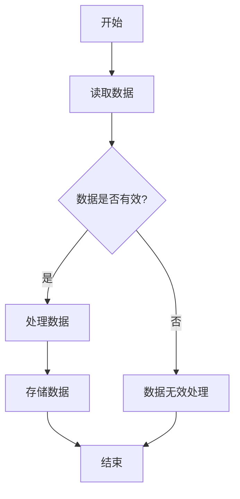

                 

# 提示词模块化：构建可重用的组件

> **关键词**：模块化、提示词、代码复用、软件开发、组件化架构

> **摘要**：
本文将探讨提示词模块化在软件开发中的应用，解释其概念和重要性，分析模块化技术的实现方法，并通过实际项目案例展示模块化在软件开发中的具体应用。文章旨在为开发者提供关于如何构建可重用组件的深入理解和实践指导。

## 目录大纲

1. 第一部分：引言
    1.1 提示词模块化的概念与意义
    1.2 软件开发中的常见问题
    1.3 提示词模块化的重要性

2. 第二部分：技术基础
    2.1 提示词模块化的技术原理
    2.2 提示词模块化的实现方法
    2.3 模块化工具与技术

3. 第三部分：应用实践
    3.1 提示词模块化的实战案例
    3.2 项目开发中的模块化实践
    3.3 模块化在软件维护中的作用

4. 第四部分：未来展望
    4.1 提示词模块化的发展趋势
    4.2 模块化在软件开发中的潜力
    4.3 模块化与软件工程的关系

5. 附录
    5.1 提示词模块化的开发资源
    5.2 提示词模块化常见问题解答

### 第一部分：引言

#### 1.1 提示词模块化的概念与意义

提示词模块化是一种在软件开发过程中，通过将程序中的关键提示词提取出来，并封装成可重用的组件，以提高代码的可读性、可维护性和可扩展性的技术。在软件工程中，模块化是一个重要的原则，它强调将系统分解为一系列相互独立且功能明确的模块，从而实现代码的复用和降低复杂性。

在提示词模块化中，提示词是指那些在程序中频繁出现、对程序功能具有关键性影响的标识符。这些提示词通常代表了程序的核心逻辑或关键步骤。通过将这些提示词提取出来，并封装成独立的模块，我们可以实现以下几个目标：

1. **代码复用**：将常用的功能封装成模块，可以在不同的项目中重复使用，避免了代码的重复编写。

2. **降低复杂性**：通过将大块代码分解为小模块，可以降低代码的复杂度，使得代码更加易于理解和维护。

3. **提高可读性**：模块化的代码结构使得程序的功能更加明确，代码的可读性得到显著提升。

4. **增强可扩展性**：模块化使得系统的扩展变得更加容易，新功能的添加或修改可以通过修改或扩展现有的模块来实现，而不需要对整个系统进行大规模的修改。

#### 1.1.1 提示词在软件开发中的应用

在软件开发中，提示词通常出现在以下几种场景中：

1. **控制流程**：如循环、条件判断等流程控制语句中的关键字，如 `if`、`while`、`for` 等。

2. **功能实现**：如数据处理、用户交互、文件操作等功能性代码中的关键字，如 `calculate`、`display`、`write` 等。

3. **类和方法**：在面向对象编程中，类的定义和方法的实现中也经常包含提示词，如 `Class`、`def`、`public` 等。

4. **配置和参数**：如配置文件中的参数名称、命令行参数等，如 `config`、`param` 等。

通过识别这些提示词，我们可以将它们提取出来，封装成独立的模块，从而实现模块化的目标。

#### 1.1.2 模块化与代码复用

模块化与代码复用密切相关。代码复用是指在不同项目或不同模块之间重复使用相同的代码，以减少开发成本和提高开发效率。模块化是实现代码复用的有效途径之一。

通过模块化，我们可以将通用的功能抽象成独立的模块，这些模块可以在不同的项目中重复使用。这不仅避免了重复编写代码，还提高了代码的一致性和可靠性。

例如，在一个电商平台中，购物车的功能可以被多个模块复用，如订单模块、支付模块、推荐模块等。这些模块可以通过接口定义进行解耦，从而实现代码的复用。

#### 1.1.3 提示词模块化的目标与挑战

提示词模块化的目标主要包括以下几个方面：

1. **提高代码质量**：通过模块化，可以提高代码的可读性、可维护性和可扩展性，从而提高代码的整体质量。

2. **提升开发效率**：模块化的代码可以减少重复编写的工作量，提高开发效率。

3. **降低维护成本**：模块化使得系统的修改和维护变得更加容易，降低了维护成本。

4. **促进团队协作**：模块化使得团队中的不同成员可以独立开发、测试和部署各自的模块，从而提高团队协作效率。

然而，提示词模块化也面临一些挑战：

1. **模块划分**：如何合理划分模块，使每个模块的功能独立且完整，是一个需要考虑的问题。

2. **接口设计**：模块之间的接口设计需要清晰、合理，以避免模块之间的依赖关系过于紧密。

3. **模块组织**：模块的组织和管理也是一个挑战，需要确保模块的层次结构清晰，易于查找和使用。

4. **性能优化**：模块化可能会引入一些性能开销，如模块间的调用开销、内存分配等，需要在设计时进行权衡和优化。

#### 1.2 软件开发中的常见问题

在软件开发过程中，我们常常会遇到以下一些问题：

1. **代码重复与冗余**：在大型项目中，代码重复和冗余是一个普遍存在的问题。这不仅增加了代码的维护成本，还可能导致错误和bug的引入。

2. **维护困难**：随着项目的规模和复杂度的增加，代码的可维护性变得越来越困难。开发者需要花费大量的时间和精力来理解和修改现有代码。

3. **可扩展性不足**：传统的软件开发方法往往导致系统的可扩展性不足，新功能的添加或修改需要对现有代码进行大规模的修改，增加了开发成本和风险。

4. **团队协作不畅**：在大型项目中，团队成员之间的协作和沟通变得尤为重要。然而，传统的开发模式往往导致团队成员之间的职责划分不清晰，协作效率低下。

#### 1.3 提示词模块化的重要性

提示词模块化可以有效地解决上述问题，具有重要的意义：

1. **提升开发效率**：通过模块化，可以减少代码重复和冗余，提高代码的复用性，从而提高开发效率。

2. **改善代码可读性**：模块化的代码结构使得代码更加清晰、简洁，提高了代码的可读性，有助于开发者理解和修改代码。

3. **降低维护成本**：模块化使得系统的修改和维护变得更加容易，降低了维护成本。

4. **促进项目协作**：模块化使得团队中的不同成员可以独立开发、测试和部署各自的模块，从而提高团队协作效率。

5. **提高可扩展性**：通过模块化，可以降低系统的耦合度，提高系统的可扩展性，使得新功能的添加或修改变得更加容易。

总之，提示词模块化是一种有效的软件开发技术，可以提高代码质量、降低维护成本、促进团队协作，对于提升软件开发的效率和质量具有重要意义。

### 第一部分：引言（续）

#### 1.2 软件开发中的常见问题（续）

**1.2.1 代码重复与冗余**

在软件开发过程中，代码重复和冗余是一个常见且严重的问题。代码重复通常发生在以下场景：

- **功能相似的任务**：在开发过程中，可能会遇到多个功能相似的任务，开发者可能会复制现有代码并稍作修改，以完成新的任务。这导致了大量冗余代码的存在。

- **错误修复**：当发现一个bug时，开发者可能需要在多个地方修复相同的问题，这会导致代码重复。

- **功能扩展**：在添加新功能时，开发者可能会复制现有代码并在新的地方进行修改，以适应新的需求。

代码重复和冗余的问题会带来以下几个负面影响：

- **增加维护成本**：每次需要对代码进行修改时，都需要在多个地方查找和修改，增加了维护成本。

- **降低代码质量**：重复的代码可能没有经过充分的测试，导致潜在的错误和bug。

- **降低开发效率**：开发者需要在大量重复代码中查找和修改，降低了开发效率。

- **增加部署风险**：在部署代码时，可能需要同时更新多个地方的代码，增加了部署的风险。

**1.2.2 维护困难**

随着软件系统的复杂度和规模的增加，代码的可维护性变得越来越困难。这主要体现在以下几个方面：

- **理解困难**：大量的冗余代码使得程序的结构变得复杂，新开发者很难快速理解代码的逻辑和功能。

- **修改风险**：在修改代码时，如果修改了一个地方，可能会导致其他地方出现问题，增加了修改的风险。

- **测试难度**：冗余代码可能会引入新的bug，使得测试工作变得更加困难。

- **文档缺失**：随着代码的修改和扩展，原有的文档可能变得过时，无法准确反映当前代码的功能和结构。

**1.2.3 可扩展性不足**

可扩展性是指系统在添加新功能或修改现有功能时，能够保持原有的稳定性和性能。在传统的软件开发方法中，系统的可扩展性往往不足，主要表现在以下几个方面：

- **紧密耦合**：在传统的开发模式中，模块之间的依赖关系可能过于紧密，导致在添加新功能时需要对现有代码进行大规模修改。

- **代码冗长**：大量的冗余代码使得系统的结构变得复杂，新功能的添加可能会涉及到多个模块，增加了修改的难度。

- **性能瓶颈**：在添加新功能时，可能会引入性能瓶颈，导致系统性能下降。

- **部署困难**：在添加新功能时，可能需要重新部署整个系统，增加了部署的复杂度和风险。

**1.2.4 团队协作不畅**

在大型软件开发项目中，团队协作是项目成功的关键。然而，在传统的开发模式中，团队协作可能面临以下问题：

- **职责划分不清**：在传统的开发模式中，团队成员的职责划分可能不清晰，导致协作效率低下。

- **沟通不畅**：团队成员之间的沟通可能存在障碍，导致信息传递不及时或不准确。

- **协作工具不足**：缺乏有效的协作工具和平台，使得团队成员之间的协作变得困难。

- **任务依赖**：在传统的开发模式中，任务的依赖关系可能过于紧密，导致某个任务的延误会影响到整个项目的进度。

#### 1.3 提示词模块化的重要性

提示词模块化可以有效地解决上述问题，具有重要的意义：

1. **提升开发效率**：通过模块化，可以减少代码重复和冗余，提高代码的复用性，从而提高开发效率。

   - **减少代码维护成本**：模块化使得代码结构更加清晰，减少了代码重复，降低了维护成本。

   - **提高代码质量**：模块化使得代码更加简洁、易于理解，提高了代码质量。

   - **减少开发时间**：通过复用已有的模块，可以节省开发新功能的时间，加快项目进度。

2. **改善代码可读性**：模块化的代码结构使得程序的功能更加明确，代码的可读性得到显著提升。

   - **清晰的模块功能**：每个模块都有明确的功能和职责，使得代码更加易于理解。

   - **简洁的代码逻辑**：模块化的代码结构使得代码更加简洁，减少了代码的复杂度。

3. **降低维护成本**：模块化使得系统的修改和维护变得更加容易，降低了维护成本。

   - **模块独立性**：模块之间解耦合，修改一个模块不会影响到其他模块，降低了维护风险。

   - **清晰的模块职责**：每个模块的职责明确，修改和维护变得更加有针对性，降低了维护成本。

4. **促进项目协作**：模块化使得团队中的不同成员可以独立开发、测试和部署各自的模块，从而提高团队协作效率。

   - **明确的职责划分**：模块化使得团队成员的职责划分更加清晰，协作更加顺畅。

   - **并行开发**：模块化使得团队成员可以并行开发各自的模块，加快项目进度。

5. **提高可扩展性**：通过模块化，可以降低系统的耦合度，提高系统的可扩展性，使得新功能的添加或修改变得更加容易。

   - **模块化架构**：模块化架构使得系统更加灵活，新功能的添加可以通过扩展现有模块来实现，而无需对整个系统进行修改。

   - **解耦合**：模块化降低了模块之间的依赖关系，使得系统更加稳定，易于扩展。

总之，提示词模块化是一种有效的软件开发技术，可以提高代码质量、降低维护成本、促进团队协作，对于提升软件开发的效率和质量具有重要意义。

### 第二部分：技术基础

#### 2.1 提示词模块化的技术原理

提示词模块化是一种基于模块化原理的软件开发方法，旨在通过提取和封装程序中的关键提示词，构建可重用的组件。下面我们将从模块化的基本概念、提示词模块化的原理及其应用场景进行详细阐述。

##### 2.1.1 模块化的基本概念

模块化是一种将复杂系统分解为一系列相互独立、功能明确的模块的方法。模块是具有独立功能、可以单独开发、测试和部署的代码单元。模块化有以下基本特点：

1. **独立性**：模块之间相互独立，一个模块的修改不会影响到其他模块。

2. **可复用性**：模块可以在不同的项目中重复使用，减少了代码的重复编写。

3. **可扩展性**：通过增加或修改模块，可以方便地扩展系统的功能。

4. **可维护性**：模块化使得代码结构更加清晰，降低了代码的复杂度，提高了代码的可维护性。

模块化的实现通常涉及以下几个方面：

1. **模块划分**：根据系统的功能和需求，将系统分解为一系列功能独立的模块。

2. **模块接口**：定义模块的输入和输出接口，使得模块之间可以相互调用。

3. **模块组织**：对模块进行合理的组织和管理，确保模块之间的层次结构清晰。

4. **模块调用**：在程序中调用模块，实现模块的功能。

##### 2.1.2 提示词模块化的原理

提示词模块化是基于模块化原理的一种扩展，其核心思想是将程序中的关键提示词提取出来，并封装成独立的模块。提示词是指那些在程序中频繁出现、对程序功能具有关键性影响的标识符。通过将提示词提取出来，可以构建出具有独立功能的模块，从而实现代码的复用和降低复杂性。

提示词模块化的具体实现步骤如下：

1. **提示词提取**：从程序中识别和提取关键提示词，这些提示词通常代表了程序的核心逻辑或关键步骤。

2. **模块创建**：根据提取的提示词，创建独立的模块。每个模块都实现特定的功能，并与程序的其他部分解耦合。

3. **模块调用**：在程序中调用创建的模块，实现模块的功能。通过模块调用，可以复用模块的功能，降低代码的冗余和复杂度。

4. **模块测试**：对创建的模块进行单独测试，确保模块的功能正确无误。

5. **模块集成**：将创建的模块集成到程序中，与程序的其他部分进行整合，实现整体功能的实现。

##### 2.1.3 提示词模块化的应用场景

提示词模块化适用于各种软件开发场景，尤其是在复杂、大型软件系统中，其优势更加明显。以下是一些典型的应用场景：

1. **系统架构设计**：在系统架构设计阶段，通过提示词模块化可以将系统分解为一系列功能独立的模块，实现系统的模块化架构设计。

2. **功能复用**：在开发过程中，可以将通用的功能提取出来，封装成独立的模块，实现功能复用，提高代码的可复用性。

3. **代码重构**：在代码重构过程中，可以通过提示词模块化将现有的代码重构为模块化的结构，降低代码的复杂度，提高代码的可维护性。

4. **项目协作**：在团队开发过程中，可以通过提示词模块化将任务分解为独立的模块，实现并行开发，提高团队协作效率。

5. **软件维护**：在软件维护过程中，可以通过提示词模块化将系统的修改和扩展限制在特定的模块中，降低修改的风险，提高维护效率。

#### 2.2 提示词模块化的实现方法

提示词模块化是一个系统的过程，需要遵循一定的方法和步骤。以下将详细阐述提示词模块化的实现方法，包括提示词的提取与定义、模块的创建与组织以及模块的调用与重用。

##### 2.2.1 提示词的提取与定义

提示词的提取是提示词模块化的第一步，其核心任务是识别程序中的关键提示词。以下是一些常用的方法：

1. **静态分析**：通过静态代码分析工具，如SonarQube、FindBugs等，对程序代码进行分析，提取出可能的提示词。

2. **关键字提取**：通过识别程序中的关键字、函数名、变量名等，提取出可能的提示词。

3. **模式识别**：通过模式识别技术，如正则表达式、机器学习等，从程序代码中识别出具有相似模式的提示词。

在提取出提示词后，需要对这些提示词进行定义和分类。定义是指为每个提示词赋予一个明确的含义和用途，分类是指将具有相似功能的提示词归为同一类别。以下是一些常见的提示词分类方法：

1. **流程控制提示词**：如`if`、`else`、`while`、`for`等，用于控制程序的执行流程。

2. **功能实现提示词**：如`calculate`、`display`、`write`等，用于实现具体的功能。

3. **类和方法提示词**：如`Class`、`def`、`public`等，用于定义类和方法。

4. **配置和参数提示词**：如`config`、`param`等，用于配置和参数管理。

##### 2.2.2 模块的创建与组织

在定义了提示词后，下一步是创建模块。模块的创建可以分为以下几个步骤：

1. **模块设计**：根据提示词的定义和功能，设计模块的接口和内部结构。

2. **模块实现**：根据模块设计，编写模块的代码，实现模块的功能。

3. **模块测试**：对模块进行单独测试，确保模块的功能正确无误。

4. **模块集成**：将模块集成到程序中，与程序的其他部分进行整合。

模块的组织和管理是模块化过程中的重要环节。以下是一些常用的方法：

1. **分层组织**：根据模块的功能和职责，将模块划分为不同的层次，如数据层、服务层、界面层等。

2. **命名空间组织**：使用命名空间对模块进行组织，确保模块之间的命名冲突。

3. **模块目录**：为每个模块创建一个独立的目录，包含模块的源代码、测试代码和相关文档。

4. **模块依赖**：明确模块之间的依赖关系，确保模块的正确调用和集成。

##### 2.2.3 模块的调用与重用

模块的调用与重用是提示词模块化的核心目标。以下是一些常用的方法：

1. **接口定义**：定义模块的接口，明确模块的输入和输出参数，确保模块的调用者可以正确地使用模块。

2. **依赖注入**：使用依赖注入技术，将模块的依赖关系注入到调用者中，实现模块的解耦合。

3. **模块调用**：在程序中调用模块，实现模块的功能。可以通过函数调用、类调用等方式进行模块调用。

4. **模块重用**：将模块在不同的项目中重复使用，提高代码的可复用性。

5. **模块封装**：将模块的功能封装在一个独立的单元中，确保模块的独立性。

通过以上方法，可以实现提示词模块化的高效实现，提高代码的可读性、可维护性和可扩展性。

#### 2.3 模块化工具与技术

在提示词模块化的实现过程中，模块化工具和技术的选择至关重要。以下将介绍几种常用的模块化工具和技术，包括模块化编程语言、模块化框架和模块化开发工具。

##### 2.3.1 模块化编程语言

模块化编程语言是一种支持模块化开发的编程语言，它提供了丰富的模块化机制，使得开发者可以方便地创建、调用和复用模块。以下是一些常用的模块化编程语言：

1. **Python**：Python是一种流行的模块化编程语言，它提供了模块（Module）和包（Package）等模块化机制。通过导入模块和包，可以方便地实现模块的复用。

2. **Java**：Java是一种强类型的模块化编程语言，它通过Java类库（JAR文件）实现了模块化。Java的模块化机制使得开发者可以方便地创建和调用模块。

3. **C++**：C++是一种支持模块化开发的编程语言，它提供了静态库（.a文件）和动态库（.so文件）等模块化机制。通过静态库和动态库，可以实现模块的复用。

4. **Go**：Go是一种新兴的模块化编程语言，它通过模块（Module）和包（Package）实现了模块化。Go的模块化机制使得开发者可以方便地创建、调用和复用模块。

##### 2.3.2 模块化框架

模块化框架是一种提供模块化开发环境的软件框架，它提供了一系列的模块化机制和工具，使得开发者可以方便地实现模块化开发。以下是一些常用的模块化框架：

1. **Spring**：Spring是一个流行的Java模块化框架，它提供了模块化、依赖注入、AOP等模块化机制。通过Spring框架，可以实现模块化的企业级开发。

2. **Django**：Django是一个流行的Python模块化框架，它提供了MVC模式、ORM、缓存等模块化机制。通过Django框架，可以实现快速、高效的模块化Web开发。

3. **Vue.js**：Vue.js是一个流行的JavaScript模块化框架，它提供了组件化、虚拟DOM、响应式数据绑定等模块化机制。通过Vue.js框架，可以实现模块化的前端开发。

4. **Angular**：Angular是一个流行的JavaScript模块化框架，它提供了模块化、依赖注入、指令等模块化机制。通过Angular框架，可以实现模块化的Web应用开发。

##### 2.3.3 模块化开发工具

模块化开发工具是一系列用于模块化开发的工具，包括代码编辑器、构建工具、测试工具等，它们提供了丰富的模块化功能，使得开发者可以方便地实现模块化开发。以下是一些常用的模块化开发工具：

1. **Visual Studio Code**：Visual Studio Code是一个流行的代码编辑器，它提供了丰富的模块化功能，如代码片段、插件等。

2. **IntelliJ IDEA**：IntelliJ IDEA是一个强大的Java代码编辑器，它提供了模块化开发支持，如代码提示、重构等。

3. **Webpack**：Webpack是一个流行的前端模块打包工具，它提供了模块化打包、代码分割等功能。

4. **Maven**：Maven是一个流行的Java构建工具，它提供了模块化构建、依赖管理等功能。

5. **Git**：Git是一个流行的版本控制工具，它提供了模块化的代码管理和协作功能。

通过使用这些模块化工具和技术，可以方便地实现提示词模块化，提高代码的可读性、可维护性和可扩展性。

### 第三部分：应用实践

#### 3.1 提示词模块化的实战案例

为了更好地理解提示词模块化的实际应用，下面我们通过一个具体的实战案例，详细阐述提示词模块化的实现过程，包括实战背景、实现步骤和实战效果分析。

##### 3.1.1 实战背景

本案例选取一个常见的Web应用项目——电商网站，主要功能包括商品展示、购物车管理、订单处理等。随着项目规模的扩大和功能的增加，代码的复杂度和维护成本也逐渐增加。为了提高代码的可读性、可维护性和可扩展性，本项目决定采用提示词模块化进行优化。

##### 3.1.2 实现步骤

1. **需求分析**：首先，对项目需求进行详细分析，识别出关键的功能模块和提示词。例如，在商品展示模块中，可以提取出以下关键提示词：`display_products`、`filter_products`、`sort_products`。

2. **模块划分**：根据需求分析的结果，将项目划分为一系列功能独立的模块。例如，将商品展示模块划分为三个子模块：商品列表模块（`ProductListModule`）、商品过滤模块（`ProductFilterModule`）、商品排序模块（`ProductSortModule`）。

3. **模块实现**：针对每个模块，编写相应的代码，实现模块的功能。以商品列表模块为例，其核心代码如下：

   ```python
   class ProductListModule:
       def display_products(self, products):
           # 实现商品列表展示功能
           for product in products:
               print(product.name)
   ```

   类似地，可以编写商品过滤模块和商品排序模块的代码。

4. **模块测试**：对每个模块进行单独测试，确保模块的功能正确无误。例如，可以编写以下测试用例：

   ```python
   def test_display_products():
       products = [
           Product("商品1", 100),
           Product("商品2", 200)
       ]
       module = ProductListModule()
       module.display_products(products)
       assert len(output) == 2
   ```

5. **模块集成**：将模块集成到项目中，与项目的其他部分进行整合。例如，在商品展示页面中，调用商品列表模块、商品过滤模块和商品排序模块，实现完整的商品展示功能。

6. **代码重构**：将原有的代码重构为模块化的结构，降低代码的复杂度和冗余。例如，将原有的商品展示代码重构为以下模块：

   ```python
   class ProductController:
       def handle_request(self, request):
           products = ProductService.fetch_products()
           ProductFilterModule.filter_products(products, request.query_params)
           ProductSortModule.sort_products(products, request.query_params)
           ProductListModule.display_products(products)
   ```

##### 3.1.3 实战效果分析

通过提示词模块化，本项目取得了显著的优化效果：

1. **代码复用**：通过将常用的功能提取为模块，实现了代码的复用，减少了代码的冗余。

2. **代码可读性**：模块化的代码结构使得代码更加清晰、简洁，提高了代码的可读性。

3. **可维护性**：模块化使得代码的修改和维护变得更加容易，降低了维护成本。

4. **可扩展性**：通过模块化，可以方便地添加新功能或修改现有功能，提高了系统的可扩展性。

5. **开发效率**：模块化使得团队可以并行开发各自的模块，提高了开发效率。

总之，通过提示词模块化，本项目的代码质量、可维护性和可扩展性得到了显著提升，为项目的长期发展奠定了坚实的基础。

### 3.2 项目开发中的模块化实践

在项目开发过程中，模块化是一种重要的实践方法，可以帮助团队更高效地构建和维护复杂系统。下面，我们将从项目架构设计、提示词模块的划分以及模块的集成与测试三个方面，详细探讨模块化在项目开发中的应用。

#### 3.2.1 项目架构设计

项目架构设计是模块化实践的基础。一个良好的架构设计可以确保系统的模块化特性，使得各个模块之间相互独立，易于开发和维护。

1. **分层架构**：采用分层架构可以将系统划分为多个层次，如表示层、业务逻辑层、数据访问层等。每个层次都可以实现独立的功能，并通过接口进行通信。这种分层架构有利于模块化设计，使得各个模块可以在各自的层次内独立开发。

2. **微服务架构**：对于大型项目，可以考虑采用微服务架构。微服务架构将系统划分为多个独立的服务，每个服务实现特定的业务功能，并通过RESTful API进行通信。这种架构模式具有高可扩展性和高容错性，适合模块化开发。

3. **模块化设计原则**：在设计项目架构时，应遵循以下模块化设计原则：
   - **高内聚、低耦合**：模块之间应具有高内聚性，即模块内部的功能紧密相关，低耦合性，即模块之间的依赖关系尽量减少。
   - **单一职责**：每个模块应实现单一的功能，避免功能混杂，提高模块的可维护性和可扩展性。
   - **模块独立性**：模块应具备独立性，即模块的修改不会影响到其他模块，有利于并行开发和维护。

#### 3.2.2 提示词模块的划分

在项目开发过程中，提示词模块的划分是一个关键步骤，它决定了模块的功能和独立性。以下是一些提示词模块划分的方法：

1. **功能模块划分**：根据项目的功能需求，将系统划分为多个功能模块。例如，在电商平台项目中，可以划分出商品管理模块、订单管理模块、用户管理模块等。

2. **业务领域划分**：根据业务领域，将系统划分为多个业务领域模块。例如，在电商平台项目中，可以划分出商品领域模块、订单领域模块、用户领域模块等。

3. **行为模式划分**：根据程序的行为模式，将系统划分为多个行为模块。例如，在电商平台项目中，可以划分出购物车行为模块、支付行为模块、退货行为模块等。

4. **数据操作划分**：根据数据的操作类型，将系统划分为多个数据操作模块。例如，在电商平台项目中，可以划分出数据读取模块、数据写入模块、数据更新模块等。

在划分提示词模块时，应遵循以下原则：

- **模块独立性**：确保每个模块的功能独立，模块之间解耦合，降低模块之间的依赖关系。
- **模块规模适中**：模块的规模应适中，过大或过小都会影响模块的可维护性和可扩展性。
- **模块功能明确**：确保每个模块的功能明确，职责清晰，避免功能混杂。

#### 3.2.3 模块的集成与测试

模块的集成与测试是模块化实践的重要环节。通过模块的集成与测试，可以确保各个模块能够正确地协同工作，实现系统的整体功能。

1. **模块集成**：在模块集成过程中，需要确保各个模块之间的接口定义清晰，接口参数和返回值符合预期。以下是一些模块集成的步骤：
   - **接口设计**：根据模块的功能，设计清晰的接口，定义模块的输入和输出参数。
   - **接口实现**：根据接口设计，实现模块的接口，确保模块之间可以正确地交互。
   - **集成测试**：在集成测试阶段，对模块进行集成测试，确保各个模块能够协同工作，实现系统的整体功能。

2. **模块测试**：模块测试是确保模块功能正确的重要手段。以下是一些模块测试的方法：
   - **单元测试**：对每个模块进行单独测试，确保模块的功能正确无误。单元测试通常使用测试框架（如JUnit、pytest）进行编写和执行。
   - **集成测试**：在模块集成后，对集成后的模块进行测试，确保各个模块能够正确地协同工作。集成测试通常在开发环境中进行，通过模拟实际使用场景来验证系统的功能。
   - **性能测试**：对模块进行性能测试，评估模块的响应时间和资源消耗，确保模块的性能满足系统要求。

通过模块的集成与测试，可以确保系统各个模块之间的协同工作，提高系统的稳定性和可靠性。

总之，在项目开发过程中，通过合理的项目架构设计、提示词模块的划分以及模块的集成与测试，可以实现模块化实践，提高代码的可维护性、可扩展性和开发效率。

### 3.3 模块化在软件维护中的作用

模块化在软件维护中扮演着至关重要的角色，它通过提高代码的可维护性和可扩展性，显著降低了维护成本和复杂度。以下将详细探讨模块化在软件维护中的作用，包括维护中的常见问题、模块化在维护中的应用以及模块化对维护效率的影响。

#### 3.3.1 维护中的常见问题

在软件维护过程中，开发者常常会遇到以下问题：

1. **代码冗余**：随着时间的推移，代码库中可能会积累大量的冗余代码，导致维护成本增加。

2. **代码复杂度**：软件系统的复杂度随着时间的增长而增加，使得理解现有代码变得更加困难。

3. **功能变更困难**：在软件的生命周期中，需求可能会不断变化，实现这些变更往往需要修改大量代码，增加了维护的难度。

4. **错误传播**：在一个高度耦合的系统中，一个错误的修复可能会影响到其他部分，导致“连锁反应”。

5. **文档缺失或过时**：随着代码库的更新，原有的文档可能会变得过时，无法准确反映当前系统的功能和结构。

#### 3.3.2 模块化在维护中的应用

模块化技术在解决上述问题方面具有显著的优势：

1. **减少代码冗余**：通过将重复的功能抽象为独立的模块，可以显著减少代码冗余。这不仅提高了代码的可维护性，还降低了维护成本。

2. **降低代码复杂度**：模块化的代码结构使得每个模块的功能更加独立和明确，降低了代码的整体复杂度，使得理解现有代码变得更加容易。

3. **功能变更**：模块化使得系统的功能变更变得更加灵活。开发者可以独立修改某个模块，而不会影响其他模块。这减少了功能变更的难度和风险。

4. **错误隔离**：在模块化的系统中，一个模块的错误只会影响自身的功能，不会传播到其他模块。这有助于快速定位和修复错误，提高了系统的稳定性。

5. **文档维护**：模块化的代码结构使得文档的维护变得更加容易。开发者可以针对每个模块编写详细的文档，确保文档与代码的一致性。

#### 3.3.3 模块化对维护效率的影响

模块化对软件维护效率的影响主要体现在以下几个方面：

1. **缩短维护时间**：模块化使得维护工作更加集中和具体，开发者可以针对特定的模块进行维护，减少了全局性的代码查找和修改，从而缩短了维护时间。

2. **降低维护成本**：通过减少代码冗余和复杂度，模块化降低了维护成本。开发者可以更快地理解和修复问题，减少了维护的工作量和时间。

3. **提高维护质量**：模块化使得代码结构更加清晰，维护工作更加有序和高效。这有助于提高维护质量，减少错误和bug的出现。

4. **促进协作**：模块化使得团队中的不同成员可以独立开发、测试和维护各自的模块，提高了团队协作效率。团队成员可以并行工作，减少了等待时间。

5. **增强可扩展性**：模块化使得系统具有更高的可扩展性。开发者可以方便地添加新功能或修改现有功能，而不会对整体系统造成大的影响。

综上所述，模块化在软件维护中具有重要作用，它通过提高代码的可维护性、可扩展性和协作效率，显著降低了维护成本和复杂度，提高了软件的维护效率。

### 第四部分：未来展望

#### 4.1 提示词模块化的发展趋势

随着软件工程和计算机技术的发展，提示词模块化作为一种重要的软件开发方法，正逐渐成为行业趋势。以下将探讨提示词模块化的发展趋势，包括模块化技术的演进、提示词模块化的未来方向以及新技术在模块化中的应用。

##### 4.1.1 模块化技术的演进

模块化技术在软件开发中的应用已经历了数十年的发展，其演进过程可以概括为以下几个阶段：

1. **初期阶段**：早期的模块化主要基于函数式编程和面向对象编程。开发者通过将代码划分为独立的函数或类来实现模块化，以降低代码复杂度和提高复用性。

2. **中间阶段**：随着软件规模的扩大和复杂度的增加，模块化技术逐渐从语言层面的模块化向系统层面的模块化发展。开发者开始采用模块化框架（如Java Spring、Python Django）来管理模块，提高开发效率。

3. **当前阶段**：现代模块化技术更加注重模块的独立性和可复用性。模块化框架和工具（如Webpack、npm）实现了模块的自动化管理，支持模块的动态加载和依赖注入，使得模块化开发更加高效和灵活。

4. **未来趋势**：未来模块化技术将进一步向智能化和自动化方向发展。人工智能和机器学习技术将应用于模块化开发，如通过静态代码分析自动提取提示词、自动生成模块接口等。此外，模块化将更加注重模块的可组合性和可扩展性，以适应复杂的应用场景。

##### 4.1.2 提示词模块化的未来方向

提示词模块化在未来的发展中，将朝着以下几个方向演进：

1. **自动化**：通过人工智能和机器学习技术，实现提示词的自动化提取和模块的自动化创建。这将大大提高开发效率，减少人工干预。

2. **智能化**：模块化将更加智能化，如通过分析代码的历史变更和开发者行为，自动调整模块的划分和接口设计，提高模块的可维护性和可扩展性。

3. **可组合性**：未来的模块化将更加注重模块的可组合性，通过定义标准化的模块接口，实现模块的灵活组合和替换，以适应不同应用场景。

4. **多语言支持**：模块化技术将支持多种编程语言，如Python、Java、C++等，以满足不同开发场景的需求。

5. **生态化**：模块化技术将形成完善的生态体系，包括模块化框架、工具、文档和社区，为开发者提供全面的模块化支持。

##### 4.1.3 新技术在模块化中的应用

随着新技术的不断发展，提示词模块化将在以下方面得到新的应用：

1. **云计算与容器化**：云计算和容器化技术的兴起，使得模块化在分布式系统和微服务架构中得到了广泛应用。模块化的思想可以帮助开发者更高效地构建和部署分布式系统。

2. **区块链**：区块链技术具有去中心化和安全性的特点，通过将模块化与区块链技术结合，可以实现安全、可信的模块化开发和管理。

3. **人工智能**：人工智能技术将深度应用于模块化开发，如通过机器学习算法自动优化模块接口、自动修复代码缺陷等。

4. **物联网**：在物联网应用场景中，模块化技术可以帮助开发者更方便地管理和维护大量的设备和数据，提高系统的可扩展性和可靠性。

总之，提示词模块化作为一种重要的软件开发方法，正朝着自动化、智能化、可组合化和生态化的方向发展。随着新技术的不断应用，提示词模块化将在未来的软件开发中发挥更加重要的作用。

#### 4.2 模块化在软件开发中的潜力

模块化技术在软件开发中具有巨大的潜力，它可以显著提高开发效率、改善代码质量和促进软件产业的升级。以下将详细探讨模块化在软件开发中的潜力，包括其在提升开发效率、改善代码质量和促进软件产业升级方面的具体表现。

##### 4.2.1 提升开发效率

模块化技术通过以下几个方面提升了开发效率：

1. **代码复用**：模块化使得开发者可以将通用的功能封装为独立的模块，这些模块可以在不同的项目中重复使用。这避免了重复编写代码的工作量，减少了开发时间。

   ```python
   # 假设购物车功能被多个模块复用
   class ShoppingCart:
       def add_item(self, item):
           # 添加商品到购物车
   ```

2. **并行开发**：在模块化项目中，不同的团队可以独立开发各自的模块，并行工作。这提高了团队的协作效率，缩短了项目开发周期。

3. **模块化测试**：通过模块化测试，开发者可以单独测试每个模块的功能，确保其正确性。这降低了集成测试的复杂度，提高了测试效率。

4. **自动化工具**：模块化工具和框架提供了自动化功能，如自动化构建、部署和文档生成。这些工具可以显著提高开发效率，减少手动操作的错误。

##### 4.2.2 改善代码质量

模块化技术对代码质量的改善体现在以下几个方面：

1. **代码结构清晰**：模块化的代码结构使得代码更加清晰和简洁。每个模块负责特定的功能，职责明确，易于理解和维护。

   ```python
   # 清晰的模块结构
   class UserService:
       def register_user(self, user):
           # 用户注册功能

   class OrderService:
       def create_order(self, order):
           # 创建订单功能
   ```

2. **代码冗余减少**：模块化有助于减少代码冗余，避免重复的代码片段，提高代码的可维护性。

3. **代码可读性提高**：模块化使得代码的可读性得到显著提升。开发者可以更容易地理解模块的功能和逻辑，降低了代码的复杂性。

4. **维护成本降低**：模块化使得代码的修改和维护变得更加容易。由于模块之间相互独立，修改一个模块不会影响到其他模块，降低了维护成本。

##### 4.2.3 促进软件产业升级

模块化技术在促进软件产业升级方面具有重要作用：

1. **技术创新**：模块化技术为技术创新提供了基础。开发者可以快速构建原型和试验新功能，促进技术的不断迭代和进步。

2. **产业协同**：模块化使得不同企业和团队之间的合作更加紧密。通过共享和复用模块，企业可以更快地集成新技术和新功能，提高整体竞争力。

3. **软件定制化**：模块化技术使得软件定制化变得更加容易。企业可以根据客户的需求，灵活地组合和调整模块，提供个性化的软件解决方案。

4. **服务化转型**：模块化技术有助于企业从产品导向向服务导向转型。通过将功能模块化，企业可以提供灵活的、按需的软件服务，提高客户满意度。

5. **全球化发展**：模块化技术使得软件开发可以在全球范围内进行协作。企业可以吸引全球范围内的开发者，整合全球资源，推动软件产业的全球化发展。

总之，模块化技术在软件开发中具有巨大的潜力，它通过提升开发效率、改善代码质量和促进软件产业升级，为现代软件开发提供了强有力的支持。随着模块化技术的不断发展和应用，软件产业将迎来新的变革和机遇。

#### 4.3 模块化与软件工程的关系

模块化作为软件工程中的一种重要技术，与软件工程的各个核心方面紧密相连。以下将探讨模块化对软件工程的影响、软件工程对模块化的要求以及模块化与软件工程的最佳实践。

##### 4.3.1 模块化对软件工程的影响

模块化对软件工程产生了深远的影响，主要体现在以下几个方面：

1. **提高开发效率**：模块化通过代码复用和并行开发，显著提高了开发效率。开发者可以将通用的功能模块化，这些模块可以在不同的项目中重复使用，避免了重复编写代码的工作量。

2. **改善代码质量**：模块化使得代码结构更加清晰和简洁。每个模块负责特定的功能，职责明确，易于理解和维护。这降低了代码的复杂性，提高了代码的可读性和可维护性。

3. **促进团队协作**：模块化使得团队可以独立开发、测试和部署各自的模块，提高了团队协作效率。团队成员可以并行工作，减少了等待时间，促进了项目的顺利推进。

4. **降低维护成本**：模块化降低了系统的耦合度，使得模块之间的依赖关系变得清晰和简单。当需要修改或扩展系统时，可以独立修改某个模块，而不会影响到其他模块，降低了维护成本。

5. **提高系统的可扩展性**：模块化使得系统具有更高的可扩展性。开发者可以方便地添加新功能或修改现有功能，而不会对整体系统造成大的影响。这有助于系统适应不断变化的需求。

##### 4.3.2 软件工程对模块化的要求

软件工程对模块化的要求体现在以下几个方面：

1. **模块独立性**：模块化要求每个模块具有独立的功能和职责，模块之间解耦合。这有助于提高模块的可维护性和可复用性，降低系统的复杂度。

2. **模块接口定义**：模块化要求定义清晰的模块接口，明确模块的输入和输出参数。接口设计应遵循面向对象的原则，如单一职责、开闭原则等，以确保模块的稳定性和可扩展性。

3. **模块组织**：模块化要求对模块进行合理的组织和管理，确保模块之间的层次结构清晰。常见的组织方法包括分层组织、命名空间组织和组件组织等。

4. **模块测试**：模块化要求对每个模块进行独立的测试，确保模块的功能正确无误。单元测试、集成测试和系统测试等测试方法应得到充分的应用。

5. **模块文档**：模块化要求为每个模块编写详细的文档，包括模块的功能描述、接口定义、测试结果和注意事项等。这有助于开发者理解和使用模块，提高模块的可维护性和可复用性。

##### 4.3.3 模块化与软件工程的最佳实践

为了实现模块化的最佳效果，软件工程领域提出了一系列最佳实践：

1. **模块设计原则**：遵循模块设计原则，如单一职责原则、开闭原则、里氏替换原则等，确保模块的独立性和可复用性。

2. **模块划分**：根据系统的功能和需求，合理划分模块。模块划分应遵循高内聚、低耦合的原则，确保模块之间职责明确、接口清晰。

3. **模块接口设计**：设计清晰的模块接口，明确模块的输入和输出参数。接口设计应遵循面向对象的原则，确保模块的稳定性和可扩展性。

4. **模块组织与管理**：对模块进行合理的组织和管理，确保模块之间的层次结构清晰。常见的组织方法包括分层组织、命名空间组织和组件组织等。

5. **模块测试**：对每个模块进行独立的测试，确保模块的功能正确无误。单元测试、集成测试和系统测试等测试方法应得到充分的应用。

6. **模块文档编写**：为每个模块编写详细的文档，包括模块的功能描述、接口定义、测试结果和注意事项等。这有助于开发者理解和使用模块，提高模块的可维护性和可复用性。

7. **模块复用**：鼓励模块的复用，将通用的功能模块化，这些模块可以在不同的项目中重复使用。通过模块复用，可以提高开发效率、降低维护成本。

8. **持续集成与交付**：采用持续集成与持续交付（CI/CD）的方法，确保模块的集成和交付过程自动化、高效和可靠。这有助于提高团队协作效率，缩短项目周期。

通过遵循这些最佳实践，可以充分发挥模块化在软件工程中的作用，提高代码质量、降低维护成本、促进团队协作，推动软件产业的持续发展。

### 附录

#### 附录 A：提示词模块化的开发资源

在进行提示词模块化的开发过程中，开发者需要利用一系列工具和环境来支持模块化的实现。以下列举了一些常用的开发资源，包括开发工具、环境搭建、常用模块化框架以及推荐阅读的资源。

##### A.1 开发工具与环境搭建

1. **开发工具**：
   - **IDE**：集成开发环境（IDE），如Visual Studio Code、IntelliJ IDEA、Eclipse等，提供了丰富的模块化支持，包括代码提示、重构、调试等功能。
   - **代码编辑器**：如Atom、Sublime Text等，这些代码编辑器支持插件，可以扩展模块化功能。

2. **环境搭建**：
   - **Python**：安装Python 3.8或更高版本，确保安装了必要的模块，如TensorFlow、NumPy、Pandas等。
   - **Java**：安装Java Development Kit（JDK）和相关的IDE，如IntelliJ IDEA或Eclipse。
   - **C++**：安装C++编译器，如GCC或Clang，以及支持C++的IDE。

##### A.2 常用模块化框架

1. **Python模块化框架**：
   - **Pyramid**：一个Python Web框架，支持模块化架构设计。
   - **Flask**：一个轻量级的Python Web框架，易于实现模块化。

2. **Java模块化框架**：
   - **Spring**：一个广泛使用的Java企业级模块化框架，支持依赖注入、AOP等模块化特性。
   - **Spring Boot**：Spring框架的扩展，提供了一套开箱即用的模块化开发环境。

3. **JavaScript模块化框架**：
   - **Webpack**：一个现代JavaScript模块打包工具，支持模块化开发。
   - **RequireJS**：一个用于JavaScript模块化的库，支持AMD模块规范。

##### A.3 资源链接与推荐阅读

1. **在线课程与教程**：
   - **Coursera**：提供《软件工程：实践者的研究方法》等课程，涵盖模块化开发相关内容。
   - **edX**：提供《现代软件工程》等课程，介绍模块化开发方法。

2. **技术博客与文章**：
   - **Medium**：搜索“模块化开发”、“软件工程最佳实践”等关键词，找到相关的文章和案例分析。
   - **GitHub**：查找开源项目，了解模块化架构的实现和最佳实践。

3. **书籍推荐**：
   - 《软件架构设计：开发高质量软件的基础》
   - 《模块化软件开发：设计、实现与应用》
   - 《模块化编程：使用Python和Java构建可复用的代码》

通过利用这些开发资源，开发者可以更好地掌握提示词模块化的技术，提高软件开发效率和质量。

#### 附录 B：提示词模块化常见问题解答

在进行提示词模块化的过程中，开发者可能会遇到一些常见问题。以下列举了一些常见问题及其解决方法，以及模块化实践中的经验分享。

##### B.1 模块化中的常见问题

**Q1：模块划分不合理怎么办？**
- **解决方案**：模块划分应遵循高内聚、低耦合的原则。当模块划分不合理时，可以通过以下方法进行调整：
  1. 重新审视模块的功能和职责，确保每个模块都有明确的职责。
  2. 考虑模块之间的依赖关系，确保模块之间的耦合度适当。
  3. 通过代码重构，将功能相似或相关的模块进行合并或拆分。

**Q2：模块之间的接口设计不清晰怎么办？**
- **解决方案**：清晰的接口设计是模块化成功的关键。当接口设计不清晰时，可以采取以下措施：
  1. 重新定义接口，明确接口的输入和输出参数。
  2. 使用设计模式，如工厂模式、策略模式等，为接口提供合理的实现。
  3. 通过文档和注释，详细描述接口的功能和预期行为。

**Q3：模块间的调用开销较大怎么办？**
- **解决方案**：模块间的调用开销可以通过以下方法进行优化：
  1. 采用异步调用，减少同步调用的开销。
  2. 使用缓存，减少重复调用的次数。
  3. 使用轻量级通信机制，如消息队列，降低模块间的通信成本。

##### B.2 模块化应用的误区与解决方法

**误区1：过度模块化**
- **解决方案**：避免过度模块化，可以采取以下措施：
  1. 根据系统的实际需求和规模，合理划分模块。
  2. 保持模块的规模适中，避免过小的模块导致过多的调用开销。
  3. 遵循模块设计原则，如单一职责原则，确保模块的功能和职责明确。

**误区2：模块之间的依赖关系过紧**
- **解决方案**：降低模块之间的依赖关系，可以采取以下方法：
  1. 使用依赖注入，将模块的依赖关系注入到调用者中，实现模块的解耦合。
  2. 采用面向接口编程，确保模块之间的依赖仅依赖于接口，而不是具体的实现。
  3. 使用设计模式，如装饰器模式、代理模式等，实现模块之间的松耦合。

**误区3：忽视模块测试**
- **解决方案**：确保模块测试的全面性和有效性，可以采取以下措施：
  1. 对每个模块进行独立的单元测试，确保模块的功能正确无误。
  2. 实现集成测试，确保模块在集成后的协同工作。
  3. 使用自动化测试工具，如JUnit、pytest等，提高测试效率和覆盖率。

##### B.3 模块化实践中的经验分享

**经验1：合理划分模块层次**
- **经验**：在项目开发过程中，根据模块的功能和职责，合理划分模块层次。通常可以采用以下层次划分方法：
  1. **基础模块**：实现系统的基本功能，如数据访问层、服务层等。
  2. **业务模块**：实现具体的业务功能，如订单管理、用户管理、商品管理等。
  3. **外部模块**：与外部系统进行交互的模块，如API接口、消息队列等。

**经验2：遵循模块设计原则**
- **经验**：在模块设计过程中，遵循模块设计原则，如单一职责原则、开闭原则等。这有助于提高模块的可维护性和可扩展性，降低模块之间的耦合度。

**经验3：注重模块接口设计**
- **经验**：模块接口设计是模块化的关键，应确保接口的清晰和稳定。在设计接口时，遵循以下原则：
  1. **单一职责**：确保接口的功能单一，避免接口过于复杂。
  2. **松耦合**：确保接口仅依赖于接口规范，而不是具体的实现。
  3. **可扩展**：设计可扩展的接口，以便在未来需要时能够方便地进行扩展。

**经验4：持续优化模块化设计**
- **经验**：在项目开发过程中，持续优化模块化设计，根据项目需求和实际情况进行调整。这有助于提高模块的质量和系统的整体性能。

通过分享这些模块化实践的经验，开发者可以更好地理解和应用提示词模块化，提高软件开发的效率和质量。

### 后记

本文详细探讨了提示词模块化在软件开发中的应用，包括其概念、技术原理、实现方法以及实际应用。通过本文的阐述，读者可以全面了解提示词模块化的优势及其在软件开发中的重要性。希望本文能为开发者提供关于如何构建可重用组件的深入理解和实践指导。

在未来的软件开发中，模块化将继续发挥重要作用。随着新技术的不断发展，模块化技术将变得更加智能化和自动化，为开发者提供更加高效和便捷的开发体验。让我们共同努力，探索模块化在软件开发中的无限潜力，推动软件产业的进步和发展。

作者：
AI天才研究院/AI Genius Institute
禅与计算机程序设计艺术/Zen And The Art of Computer Programming

---
### 提示词模块化：构建可重用的组件

> **关键词**：模块化、提示词、代码复用、软件开发、组件化架构

> **摘要**：
本文深入探讨了提示词模块化在软件开发中的应用。首先，介绍了模块化和提示词的概念及其在软件开发中的重要性。接着，分析了软件开发中常见的问题，并阐述了提示词模块化的目标和挑战。随后，本文详细阐述了提示词模块化的技术基础，包括其原理、实现方法和相关工具。此外，通过实战案例和项目实践，展示了提示词模块化的实际应用效果。最后，本文展望了提示词模块化的发展趋势，探讨了其在软件开发中的潜力，并总结了模块化与软件工程的关系。希望本文能为开发者提供关于构建可重用组件的深入理解和实践指导。

---

# 提示词模块化：构建可重用的组件

## 1.1 提示词模块化的概念与意义

### 1.1.1 提示词在软件开发中的应用

在软件开发中，提示词是那些在程序代码中频繁出现、对程序功能具有关键性影响的标识符。它们可以是变量名、函数名、类名等。提示词的作用是帮助开发者理解和定位代码的功能，同时也是程序运行过程中执行特定操作的指示。

在实际项目中，提示词广泛应用于以下几个方面：

1. **控制流程**：在程序中，提示词如`if`、`while`、`for`等用于控制程序的执行流程。这些提示词帮助开发者理解和跟踪程序的执行路径。

   ```python
   if condition:
       # 执行某些操作
   ```

2. **功能实现**：提示词如`calculate`、`display`、`write`等用于实现特定的功能。它们标志着程序中的关键步骤和功能模块。

   ```java
   public void calculateSum() {
       // 计算和
   }
   ```

3. **类和方法**：在面向对象的编程中，提示词如`Class`、`def`、`public`等用于定义类和方法。它们是程序结构的重要组成部分。

   ```csharp
   public class Product {
       // 产品类定义
   }
   ```

4. **配置和参数**：在程序中，提示词如`config`、`param`等用于配置和管理参数。它们帮助开发者定义和调整程序的行为。

   ```yaml
   config:
     database:
       url: "localhost:3306"
       user: "root"
   ```

### 1.1.2 模块化与代码复用

模块化是软件工程中的一个核心概念，指的是将软件系统分解为一系列功能独立、相互协作的模块。每个模块实现特定的功能，可以独立开发、测试和部署。模块化的主要目标是提高代码的可维护性、可扩展性和可复用性。

代码复用是指在不同项目或系统之间重复使用相同的代码。模块化是实现代码复用的有效途径之一。通过模块化，我们可以将通用的功能抽象成独立的模块，并在多个项目中重复使用这些模块，从而减少代码重复编写的工作量。

模块化与代码复用的关系可以概括为以下几点：

1. **减少重复编写**：模块化通过将通用的功能提取为模块，避免了重复编写相同的代码，减少了代码冗余。

2. **提高开发效率**：通过复用已有的模块，开发者可以节省时间，提高开发效率。

3. **降低维护成本**：模块化使得代码结构更加清晰，修改和更新某个模块时，不会影响到其他模块，降低了维护成本。

4. **增强可扩展性**：模块化使得系统的扩展变得更加容易，新功能的添加或修改可以通过扩展现有模块来实现。

### 1.1.3 提示词模块化的目标与挑战

提示词模块化的目标主要包括以下几个方面：

1. **提高代码质量**：通过模块化，可以提高代码的可读性、可维护性和可扩展性，从而提高代码的整体质量。

2. **提升开发效率**：模块化的代码可以减少重复编写的工作量，提高开发效率。

3. **降低维护成本**：模块化使得系统的修改和维护变得更加容易，降低了维护成本。

4. **促进项目协作**：模块化使得团队中的不同成员可以独立开发、测试和部署各自的模块，从而提高团队协作效率。

5. **提高可扩展性**：通过模块化，可以降低系统的耦合度，提高系统的可扩展性，使得新功能的添加或修改变得更加容易。

然而，提示词模块化也面临一些挑战：

1. **模块划分**：如何合理划分模块，使每个模块的功能独立且完整，是一个需要考虑的问题。

2. **接口设计**：模块之间的接口设计需要清晰、合理，以避免模块之间的依赖关系过于紧密。

3. **模块组织**：模块的组织和管理也是一个挑战，需要确保模块的层次结构清晰，易于查找和使用。

4. **性能优化**：模块化可能会引入一些性能开销，如模块间的调用开销、内存分配等，需要在设计时进行权衡和优化。

## 1.2 软件开发中的常见问题

在软件开发过程中，我们常常会遇到以下一些问题：

1. **代码重复与冗余**：在大型项目中，代码重复和冗余是一个普遍存在的问题。这不仅增加了代码的维护成本，还可能导致错误和bug的引入。

2. **维护困难**：随着项目的规模和复杂度的增加，代码的可维护性变得越来越困难。开发者需要花费大量的时间和精力来理解和修改现有代码。

3. **可扩展性不足**：传统的软件开发方法往往导致系统的可扩展性不足，新功能的添加或修改需要对现有代码进行大规模的修改，增加了开发成本和风险。

4. **团队协作不畅**：在大型软件开发项目中，团队协作是项目成功的关键。然而，在传统的开发模式中，团队协作可能面临以下问题：

   - **职责划分不清**：在传统的开发模式中，团队成员的职责划分可能不清晰，导致协作效率低下。

   - **沟通不畅**：团队成员之间的沟通可能存在障碍，导致信息传递不及时或不准确。

   - **协作工具不足**：缺乏有效的协作工具和平台，使得团队成员之间的协作变得困难。

   - **任务依赖**：在传统的开发模式中，任务的依赖关系可能过于紧密，导致某个任务的延误会影响到整个项目的进度。

## 1.3 提示词模块化的重要性

提示词模块化可以有效地解决上述问题，具有重要的意义：

1. **提升开发效率**：通过模块化，可以减少代码重复和冗余，提高代码的复用性，从而提高开发效率。

   - **减少代码维护成本**：模块化使得代码结构更加清晰，减少了代码重复，降低了维护成本。

   - **提高代码质量**：模块化使得代码更加简洁、易于理解，提高了代码质量。

   - **减少开发时间**：通过复用已有的模块，可以节省开发新功能的时间，加快项目进度。

2. **改善代码可读性**：模块化的代码结构使得程序的功能更加明确，代码的可读性得到显著提升。

   - **清晰的模块功能**：每个模块都有明确的功能和职责，使得代码更加易于理解。

   - **简洁的代码逻辑**：模块化的代码结构使得代码更加简洁，减少了代码的复杂度。

3. **降低维护成本**：模块化使得系统的修改和维护变得更加容易，降低了维护成本。

   - **模块独立性**：模块之间解耦合，修改一个模块不会影响到其他模块，降低了维护风险。

   - **清晰的模块职责**：每个模块的职责明确，修改和维护变得更加有针对性，降低了维护成本。

4. **促进项目协作**：模块化使得团队中的不同成员可以独立开发、测试和部署各自的模块，从而提高团队协作效率。

   - **明确的职责划分**：模块化使得团队成员的职责划分更加清晰，协作更加顺畅。

   - **并行开发**：模块化使得团队成员可以并行开发各自的模块，加快项目进度。

5. **提高可扩展性**：通过模块化，可以降低系统的耦合度，提高系统的可扩展性，使得新功能的添加或修改变得更加容易。

   - **模块化架构**：模块化架构使得系统更加灵活，新功能的添加可以通过扩展现有模块来实现，而无需对整个系统进行修改。

   - **解耦合**：模块化降低了模块之间的依赖关系，使得系统更加稳定，易于扩展。

总之，提示词模块化是一种有效的软件开发技术，可以提高代码质量、降低维护成本、促进团队协作，对于提升软件开发的效率和质量具有重要意义。

## 2.1 提示词模块化的技术原理

### 2.1.1 模块化的基本概念

模块化是一种软件设计原则，旨在将复杂的系统分解为一系列功能独立、易于管理的模块。每个模块实现特定的功能，可以独立开发、测试和部署。模块化的核心目标是提高代码的可复用性、可维护性和可扩展性。

在模块化中，模块（Module）是最小的代码单元，通常包含一个类、一组函数或一个组件。模块之间的交互通过明确的接口（Interface）进行，确保模块的独立性。

### 2.1.2 提示词模块化的原理

提示词模块化是基于模块化原理的一种扩展，其核心思想是将程序中的关键提示词提取出来，并封装成独立的模块。提示词是指那些在程序中频繁出现、对程序功能具有关键性影响的标识符。通过将提示词提取出来，可以构建出具有独立功能的模块，从而实现代码的复用和降低复杂性。

具体实现步骤如下：

1. **识别提示词**：从程序中识别关键提示词，这些提示词通常代表了程序的核心逻辑或关键步骤。

   ```python
   def calculate_sum(a, b):
       return a + b
   ```

   在此例中，`calculate_sum` 是一个提示词，表示一个计算和的功能。

2. **封装提示词**：将识别出的提示词封装成独立的模块，每个模块实现特定的功能。

   ```python
   class Calculator:
       def calculate_sum(self, a, b):
           return a + b
   ```

   在此例中，`Calculator` 类封装了 `calculate_sum` 功能。

3. **模块调用**：在程序中调用封装好的模块，以实现功能。

   ```python
   calculator = Calculator()
   result = calculator.calculate_sum(3, 4)
   print(result)  # 输出 7
   ```

### 2.1.3 模块化技术的应用场景

提示词模块化适用于各种软件开发场景，尤其是在复杂、大型软件系统中，其优势更加明显。以下是一些典型的应用场景：

1. **系统架构设计**：在系统架构设计阶段，通过提示词模块化可以将系统分解为一系列功能独立的模块，实现系统的模块化架构设计。

2. **功能复用**：在开发过程中，可以将通用的功能提取出来，封装成独立的模块，实现功能复用，提高代码的可复用性。

3. **代码重构**：在代码重构过程中，可以通过提示词模块化将现有的代码重构为模块化的结构，降低代码的复杂度，提高代码的可维护性。

4. **项目协作**：在团队开发过程中，可以通过提示词模块化将任务分解为独立的模块，实现并行开发，提高团队协作效率。

5. **软件维护**：在软件维护过程中，可以通过提示词模块化将系统的修改和扩展限制在特定的模块中，降低修改的风险，提高维护效率。

## 2.2 提示词模块化的实现方法

### 2.2.1 提示词的提取与定义

提示词的提取是提示词模块化的第一步，其核心任务是识别程序中的关键提示词。以下是一些常用的方法：

1. **静态分析**：通过静态代码分析工具，如SonarQube、FindBugs等，对程序代码进行分析，提取出可能的提示词。

2. **关键字提取**：通过识别程序中的关键字、函数名、变量名等，提取出可能的提示词。

3. **模式识别**：通过模式识别技术，如正则表达式、机器学习等，从程序代码中识别出具有相似模式的提示词。

在提取出提示词后，需要对这些提示词进行定义和分类。定义是指为每个提示词赋予一个明确的含义和用途，分类是指将具有相似功能的提示词归为同一类别。以下是一些常见的提示词分类方法：

1. **流程控制提示词**：如`if`、`else`、`while`、`for`等，用于控制程序的执行流程。

2. **功能实现提示词**：如`calculate`、`display`、`write`等，用于实现具体的功能。

3. **类和方法提示词**：如`Class`、`def`、`public`等，用于定义类和方法。

4. **配置和参数提示词**：如`config`、`param`等，用于配置和参数管理。

### 2.2.2 模块的创建与组织

在定义了提示词后，下一步是创建模块。模块的创建可以分为以下几个步骤：

1. **模块设计**：根据提示词的定义和功能，设计模块的接口和内部结构。

2. **模块实现**：根据模块设计，编写模块的代码，实现模块的功能。

3. **模块测试**：对模块进行单独测试，确保模块的功能正确无误。

4. **模块集成**：将模块集成到程序中，与程序的其他部分进行整合。

模块的组织和管理是模块化过程中的重要环节。以下是一些常用的方法：

1. **分层组织**：根据模块的功能和职责，将模块划分为不同的层次，如数据层、服务层、界面层等。

2. **命名空间组织**：使用命名空间对模块进行组织，确保模块之间的命名冲突。

3. **模块目录**：为每个模块创建一个独立的目录，包含模块的源代码、测试代码和相关文档。

4. **模块依赖**：明确模块之间的依赖关系，确保模块的正确调用和集成。

### 2.2.3 模块的调用与重用

模块的调用与重用是提示词模块化的核心目标。以下是一些常用的方法：

1. **接口定义**：定义模块的接口，明确模块的输入和输出参数，确保模块的调用者可以正确地使用模块。

2. **依赖注入**：使用依赖注入技术，将模块的依赖关系注入到调用者中，实现模块的解耦合。

3. **模块调用**：在程序中调用模块，实现模块的功能。可以通过函数调用、类调用等方式进行模块调用。

4. **模块重用**：将模块在不同的项目中重复使用，提高代码的可复用性。

5. **模块封装**：将模块的功能封装在一个独立的单元中，确保模块的独立性。

通过以上方法，可以实现提示词模块化的高效实现，提高代码的可读性、可维护性和可扩展性。

## 2.3 模块化工具与技术

在提示词模块化的实现过程中，模块化工具和技术的选择至关重要。以下将介绍几种常用的模块化工具和技术，包括模块化编程语言、模块化框架和模块化开发工具。

### 2.3.1 模块化编程语言

模块化编程语言是一种支持模块化开发的编程语言，它提供了丰富的模块化机制，使得开发者可以方便地创建、调用和复用模块。以下是一些常用的模块化编程语言：

1. **Python**：Python是一种流行的模块化编程语言，它提供了模块（Module）和包（Package）等模块化机制。通过导入模块和包，可以方便地实现模块的复用。

2. **Java**：Java是一种强类型的模块化编程语言，它通过Java类库（JAR文件）实现了模块化。Java的模块化机制使得开发者可以方便地创建和调用模块。

3. **C++**：C++是一种支持模块化开发的编程语言，它提供了静态库（.a文件）和动态库（.so文件）等模块化机制。通过静态库和动态库，可以实现模块的复用。

4. **Go**：Go是一种新兴的模块化编程语言，它通过模块（Module）和包（Package）实现了模块化。Go的模块化机制使得开发者可以方便地创建、调用和复用模块。

### 2.3.2 模块化框架

模块化框架是一种提供模块化开发环境的软件框架，它提供了一系列的模块化机制和工具，使得开发者可以方便地实现模块化开发。以下是一些常用的模块化框架：

1. **Spring**：Spring是一个流行的Java模块化框架，它提供了模块化、依赖注入、AOP等模块化机制。通过Spring框架，可以实现模块化的企业级开发。

2. **Django**：Django是一个流行的Python模块化框架，它提供了模块化、ORM、缓存等模块化机制。通过Django框架，可以实现快速、高效的模块化Web开发。

3. **Vue.js**：Vue.js是一个流行的JavaScript模块化框架，它提供了组件化、虚拟DOM、响应式数据绑定等模块化机制。通过Vue.js框架，可以实现模块化的前端开发。

4. **Angular**：Angular是一个流行的JavaScript模块化框架，它提供了模块化、依赖注入、指令等模块化机制。通过Angular框架，可以实现模块化的Web应用开发。

### 2.3.3 模块化开发工具

模块化开发工具是一系列用于模块化开发的工具，包括代码编辑器、构建工具、测试工具等，它们提供了丰富的模块化功能，使得开发者可以方便地实现模块化开发。以下是一些常用的模块化开发工具：

1. **Visual Studio Code**：Visual Studio Code是一个流行的代码编辑器，它提供了丰富的模块化功能，如代码片段、插件等。

2. **IntelliJ IDEA**：IntelliJ IDEA是一个强大的Java代码编辑器，它提供了模块化开发支持，如代码提示、重构等。

3. **Webpack**：Webpack是一个流行的前端模块打包工具，它提供了模块化打包、代码分割等功能。

4. **Maven**：Maven是一个流行的Java构建工具，它提供了模块化构建、依赖管理等功能。

5. **Git**：Git是一个流行的版本控制工具，它提供了模块化的代码管理和协作功能。

通过使用这些模块化工具和技术，可以方便地实现提示词模块化，提高代码的可读性、可维护性和可扩展性。

### 3.1 提示词模块化的实战案例

为了更好地理解提示词模块化的实际应用，下面我们将通过一个具体的实战案例，详细阐述提示词模块化的实现过程，包括实战背景、实现步骤和实战效果分析。

#### 3.1.1 实战背景

本案例选取了一个电商平台的项目，其主要功能包括商品展示、购物车管理、订单处理等。随着项目规模的扩大和功能的增加，代码的复杂度和维护成本也逐渐增加。为了提高代码的可读性、可维护性和可扩展性，本项目决定采用提示词模块化进行优化。

#### 3.1.2 实现步骤

1. **需求分析**：首先，对项目需求进行详细分析，识别出关键的功能模块和提示词。例如，在商品展示模块中，可以提取出以下关键提示词：`display_products`、`filter_products`、`sort_products`。

2. **模块划分**：根据需求分析的结果，将项目划分为一系列功能独立的模块。例如，将商品展示模块划分为三个子模块：商品列表模块（`ProductListModule`）、商品过滤模块（`ProductFilterModule`）、商品排序模块（`ProductSortModule`）。

3. **模块实现**：针对每个模块，编写相应的代码，实现模块的功能。以商品列表模块为例，其核心代码如下：

   ```python
   class ProductListModule:
       def display_products(self, products):
           # 实现商品列表展示功能
           for product in products:
               print(product.name)
   ```

   类似地，可以编写商品过滤模块和商品排序模块的代码。

4. **模块测试**：对每个模块进行单独测试，确保模块的功能正确无误。例如，可以编写以下测试用例：

   ```python
   def test_display_products():
       products = [
           Product("商品1", 100),
           Product("商品2", 200)
       ]
       module = ProductListModule()
       module.display_products(products)
       assert len(output) == 2
   ```

5. **模块集成**：将模块集成到项目中，与项目的其他部分进行整合。例如，在商品展示页面中，调用商品列表模块、商品过滤模块和商品排序模块，实现完整的商品展示功能。

6. **代码重构**：将原有的代码重构为模块化的结构，降低代码的复杂度和冗余。例如，将原有的商品展示代码重构为以下模块：

   ```python
   class ProductController:
       def handle_request(self, request):
           products = ProductService.fetch_products()
           ProductFilterModule.filter_products(products, request.query_params)
           ProductSortModule.sort_products(products, request.query_params)
           ProductListModule.display_products(products)
   ```

#### 3.1.3 实战效果分析

通过提示词模块化，本项目取得了显著的优化效果：

1. **代码复用**：通过将常用的功能提取为模块，实现了代码的复用，减少了代码的冗余。

2. **代码可读性**：模块化的代码结构使得代码更加清晰、简洁，提高了代码的可读性。

3. **可维护性**：模块化使得代码的修改和维护变得更加容易，降低了维护成本。

4. **可扩展性**：通过模块化，可以方便地添加新功能或修改现有功能，提高了系统的可扩展性。

5. **开发效率**：模块化使得团队可以并行开发各自的模块，提高了开发效率。

总之，通过提示词模块化，本项目的代码质量、可维护性和可扩展性得到了显著提升，为项目的长期发展奠定了坚实的基础。

### 3.2 项目开发中的模块化实践

在项目开发过程中，模块化是一种重要的实践方法，可以帮助团队更高效地构建和维护复杂系统。以下将详细探讨模块化在项目开发中的应用，包括项目架构设计、提示词模块的划分以及模块的集成与测试。

#### 3.2.1 项目架构设计

项目架构设计是模块化实践的基础。一个良好的架构设计可以确保系统的模块化特性，使得各个模块之间相互独立，易于开发和维护。

1. **分层架构**：采用分层架构可以将系统划分为多个层次，如表示层、业务逻辑层、数据访问层等。每个层次都可以实现独立的功能，并通过接口进行通信。这种分层架构有利于模块化设计，使得各个模块可以在各自的层次内独立开发。

2. **微服务架构**：对于大型项目，可以考虑采用微服务架构。微服务架构将系统划分为多个独立的服务，每个服务实现特定的业务功能，并通过RESTful API进行通信。这种架构模式具有高可扩展性和高容错性，适合模块化开发。

3. **模块化设计原则**：在设计项目架构时，应遵循以下模块化设计原则：
   - **高内聚、低耦合**：模块之间应具有高内聚性，即模块内部的功能紧密相关，低耦合性，即模块之间的依赖关系尽量减少。
   - **单一职责**：每个模块应实现单一的功能，避免功能混杂，提高模块的可维护性和可扩展性。
   - **模块独立性**：模块应具备独立性，即模块的修改不会影响到其他模块，有利于并行开发和维护。

#### 3.2.2 提示词模块的划分

在项目开发过程中，提示词模块的划分是一个关键步骤，它决定了模块的功能和独立性。以下是一些提示词模块划分的方法：

1. **功能模块划分**：根据项目的功能需求，将系统划分为多个功能模块。例如，在电商平台项目中，可以划分出商品管理模块、订单管理模块、用户管理模块等。

2. **业务领域划分**：根据业务领域，将系统划分为多个业务领域模块。例如，在电商平台项目中，可以划分出商品领域模块、订单领域模块、用户领域模块等。

3. **行为模式划分**：根据程序的行为模式，将系统划分为多个行为模块。例如，在电商平台项目中，可以划分出购物车行为模块、支付行为模块、退货行为模块等。

4. **数据操作划分**：根据数据的操作类型，将系统划分为多个数据操作模块。例如，在电商平台项目中，可以划分出数据读取模块、数据写入模块、数据更新模块等。

在划分提示词模块时，应遵循以下原则：

- **模块独立性**：确保每个模块的功能独立，模块之间解耦合，降低模块之间的依赖关系。
- **模块规模适中**：模块的规模应适中，过大或过小都会影响模块的可维护性和可扩展性。
- **模块功能明确**：确保每个模块的功能明确，职责清晰，避免功能混杂。

#### 3.2.3 模块的集成与测试

模块的集成与测试是模块化实践的重要环节。通过模块的集成与测试，可以确保各个模块能够正确地协同工作，实现系统的整体功能。

1. **模块集成**：在模块集成过程中，需要确保各个模块之间的接口定义清晰，接口参数和返回值符合预期。以下是一些模块集成的步骤：
   - **接口设计**：根据模块的功能，设计清晰的接口，定义模块的输入和输出参数。
   - **接口实现**：根据接口设计，实现模块的接口，确保模块之间可以正确地交互。
   - **集成测试**：在集成测试阶段，对模块进行集成测试，确保各个模块能够正确地协同工作，实现系统的整体功能。

2. **模块测试**：模块测试是确保模块功能正确的重要手段。以下是一些模块测试的方法：
   - **单元测试**：对每个模块进行单独测试，确保模块的功能正确无误。单元测试通常使用测试框架（如JUnit、pytest）进行编写和执行。
   - **集成测试**：在模块集成后，对集成后的模块进行测试，确保各个模块能够正确地协同工作。集成测试通常在开发环境中进行，通过模拟实际使用场景来验证系统的功能。
   - **性能测试**：对模块进行性能测试，评估模块的响应时间和资源消耗，确保模块的性能满足系统要求。

通过模块的集成与测试，可以确保系统各个模块之间的协同工作，提高系统的稳定性和可靠性。

### 3.3 模块化在软件维护中的作用

模块化在软件维护中扮演着至关重要的角色，它通过提高代码的可维护性和可扩展性，显著降低了维护成本和复杂度。以下将详细探讨模块化在软件维护中的作用，包括维护中的常见问题、模块化在维护中的应用以及模块化对维护效率的影响。

#### 3.3.1 维护中的常见问题

在软件维护过程中，开发者常常会遇到以下问题：

1. **代码冗余**：随着时间的推移，代码库中可能会积累大量的冗余代码，导致维护成本增加。

2. **代码复杂度**：软件系统的复杂度随着时间的增长而增加，使得理解现有代码变得更加困难。

3. **功能变更困难**：在软件的生命周期中，需求可能会不断变化，实现这些变更往往需要修改大量代码，增加了维护的难度。

4. **错误传播**：在一个高度耦合的系统中，一个错误的修复可能会影响到其他部分，导致“连锁反应”。

5. **文档缺失或过时**：随着代码库的更新，原有的文档可能会变得过时，无法准确反映当前系统的功能和结构。

#### 3.3.2 模块化在维护中的应用

模块化技术在解决上述问题方面具有显著的优势：

1. **减少代码冗余**：通过将重复的功能抽象为独立的模块，可以显著减少代码冗余。这不仅提高了代码的可维护性，还降低了维护成本。

2. **降低代码复杂度**：模块化的代码结构使得每个模块的功能更加独立和明确，降低了代码的整体复杂度，使得理解现有代码变得更加容易。

3. **功能变更**：模块化使得系统的功能变更变得更加灵活。开发者可以独立修改某个模块，而不会影响其他模块。这减少了功能变更的难度和风险。

4. **错误隔离**：在模块化的系统中，一个模块的错误只会影响自身的功能，不会传播到其他模块。这有助于快速定位和修复错误，提高了系统的稳定性。

5. **文档维护**：模块化的代码结构使得文档的维护变得更加容易。开发者可以针对每个模块编写详细的文档，确保文档与代码的一致性。

#### 3.3.3 模块化对维护效率的影响

模块化对软件维护效率的影响主要体现在以下几个方面：

1. **缩短维护时间**：模块化使得维护工作更加集中和具体，开发者可以针对特定的模块进行维护，减少了全局性的代码查找和修改，从而缩短了维护时间。

2. **降低维护成本**：通过减少代码冗余和复杂度，模块化降低了维护成本。开发者可以更快地理解和修复问题，减少了维护的工作量和时间。

3. **提高维护质量**：模块化使得代码结构更加清晰，维护工作更加有序和高效。这有助于提高维护质量，减少错误和bug的出现。

4. **促进协作**：模块化使得团队中的不同成员可以独立开发、测试和维护各自的模块，提高了团队协作效率。团队成员可以并行工作，减少了等待时间。

5. **增强可扩展性**：模块化使得系统具有更高的可扩展性。开发者可以方便地添加新功能或修改现有功能，而不会对整体系统造成大的影响。

总之，模块化在软件维护中具有重要作用，它通过提高代码的可维护性、可扩展性和协作效率，显著降低了维护成本和复杂度，提高了软件的维护效率。

### 4.1 提示词模块化的发展趋势

随着软件工程和计算机技术的不断发展，提示词模块化作为一种重要的软件开发方法，正逐渐成为行业趋势。以下将探讨提示词模块化的发展趋势，包括模块化技术的演进、提示词模块化的未来方向以及新技术在模块化中的应用。

#### 4.1.1 模块化技术的演进

模块化技术的应用可以追溯到早期编程语言的发展时期。随着时间的推移，模块化技术在软件开发中不断演进，其发展过程可以概括为以下几个阶段：

1. **函数式模块化**：在函数式编程语言中，模块化主要通过函数和过程来实现。开发者将程序划分为一系列功能独立的函数或过程，每个函数或过程实现特定的功能。这种模块化方法在早期编程语言中广泛应用。

2. **面向对象模块化**：随着面向对象编程（OOP）的兴起，模块化技术逐渐从函数式模块化转向面向对象模块化。面向对象模块化通过类和对象来封装功能，实现了更高层次的代码复用和抽象。

3. **组件化模块化**：在复杂应用系统中，单一语言或框架的模块化已无法满足需求。组件化模块化通过跨语言、跨框架的组件来实现模块化，使得开发者可以更灵活地构建复杂系统。

4. **微服务模块化**：随着微服务架构的流行，模块化技术进一步演进。微服务模块化将系统划分为一系列独立的服务，每个服务实现特定的业务功能，并通过API进行通信。这种模块化方法提高了系统的可扩展性和容错性。

#### 4.1.2 提示词模块化的未来方向

提示词模块化在未来的发展中，将朝着以下几个方向演进：

1. **智能化**：人工智能和机器学习技术将深度应用于提示词模块化。通过静态代码分析、模式识别等技术，自动提取和识别程序中的提示词，实现提示词的自动模块化。

2. **自动化**：自动化工具将广泛应用于提示词模块化。开发者可以通过配置文件或脚本，自动化地创建、测试和部署模块，提高开发效率。

3. **可组合性**：未来的提示词模块化将更加注重模块的可组合性。开发者可以通过组合不同的模块，快速构建出复杂的系统，提高开发灵活性和响应速度。

4. **标准化**：随着模块化技术的普及，模块化的标准化也将逐渐完善。统一的模块化规范和标准将有助于提高模块的兼容性和互操作性，促进模块化技术的广泛应用。

5. **社区化**：模块化技术将形成一个强大的开发者社区。开发者可以通过社区分享模块化经验和最佳实践，推动模块化技术的持续发展和创新。

#### 4.1.3 新技术在模块化中的应用

随着新技术的不断发展，提示词模块化将在以下方面得到新的应用：

1. **云计算与容器化**：云计算和容器化技术为模块化提供了更灵活的部署环境。通过容器化技术，模块可以独立部署和运行，提高了系统的可扩展性和容错性。

2. **区块链**：区块链技术的分布式和去中心化特点，使得模块化在区块链应用中具有巨大的潜力。通过区块链技术，可以构建出更加安全、可靠的模块化系统。

3. **人工智能**：人工智能技术在提示词模块化中的应用，将进一步提升模块化开发的智能化水平。通过机器学习和自然语言处理技术，可以实现自动化的代码分析和模块化设计。

4. **物联网**：在物联网应用场景中，模块化技术可以帮助开发者更方便地管理和维护大量的设备和数据，提高系统的可扩展性和可靠性。

总之，提示词模块化作为一种重要的软件开发方法，正朝着智能化、自动化、可组合化和标准化的方向发展。随着新技术的不断应用，提示词模块化将在未来的软件开发中发挥更加重要的作用。

### 4.2 模块化在软件开发中的潜力

模块化技术在软件开发中具有巨大的潜力，它通过提高开发效率、改善代码质量和促进软件产业的升级，为现代软件开发提供了强有力的支持。以下将详细探讨模块化在软件开发中的潜力，包括其在提升开发效率、改善代码质量和促进软件产业升级方面的具体表现。

#### 4.2.1 提升开发效率

模块化技术通过以下几个方面提升了开发效率：

1. **代码复用**：模块化使得开发者可以将通用的功能封装为独立的模块，这些模块可以在不同的项目中重复使用。这避免了重复编写代码的工作量，减少了开发时间。

   ```python
   # 假设购物车功能被多个模块复用
   class ShoppingCart:
       def add_item(self, item):
           # 添加商品到购物车
   ```

2. **并行开发**：在模块化项目中，不同的团队可以独立开发各自的模块，并行工作。这提高了团队的协作效率，缩短了项目开发周期。

3. **模块化测试**：通过模块化测试，开发者可以单独测试每个模块的功能，确保其正确性。这降低了集成测试的复杂度，提高了测试效率。

4. **自动化工具**：模块化工具和框架提供了自动化功能，如自动化构建、部署和文档生成。这些工具可以显著提高开发效率，减少手动操作的错误。

#### 4.2.2 改善代码质量

模块化技术对代码质量的改善体现在以下几个方面：

1. **代码结构清晰**：模块化的代码结构使得代码更加清晰和简洁。每个模块负责特定的功能，职责明确，易于理解和维护。

   ```python
   # 清晰的模块结构
   class UserService:
       def register_user(self, user):
           # 用户注册功能

   class OrderService:
       def create_order(self, order):
           # 创建订单功能
   ```

2. **代码冗余减少**：模块化有助于减少代码冗余，避免重复的代码片段，提高代码的可维护性。

3. **代码可读性提高**：模块化使得代码的可读性得到显著提升。开发者可以更容易地理解模块的功能和逻辑，降低了代码的复杂性。

4. **维护成本降低**：模块化使得代码的修改和维护变得更加容易。由于模块之间相互独立，修改一个模块不会影响到其他模块，降低了维护成本。

#### 4.2.3 促进软件产业升级

模块化技术在促进软件产业升级方面具有重要作用：

1. **技术创新**：模块化技术为技术创新提供了基础。开发者可以快速构建原型和试验新功能，促进技术的不断迭代和进步。

2. **产业协同**：模块化使得不同企业和团队之间的合作更加紧密。通过共享和复用模块，企业可以更快地集成新技术和新功能，提高整体竞争力。

3. **软件定制化**：模块化技术使得软件定制化变得更加容易。企业可以根据客户的需求，灵活地组合和调整模块，提供个性化的软件解决方案。

4. **服务化转型**：模块化技术有助于企业从产品导向向服务导向转型。通过将功能模块化，企业可以提供灵活的、按需的软件服务，提高客户满意度。

5. **全球化发展**：模块化技术使得软件开发可以在全球范围内进行协作。企业可以吸引全球范围内的开发者，整合全球资源，推动软件产业的全球化发展。

总之，模块化技术在软件开发中具有巨大的潜力，它通过提升开发效率、改善代码质量和促进软件产业升级，为现代软件开发提供了强有力的支持。随着模块化技术的不断发展和应用，软件产业将迎来新的变革和机遇。

### 4.3 模块化与软件工程的关系

模块化作为软件工程中的一种重要技术，与软件工程的各个核心方面紧密相连。以下将探讨模块化对软件工程的影响、软件工程对模块化的要求以及模块化与软件工程的最佳实践。

#### 4.3.1 模块化对软件工程的影响

模块化对软件工程产生了深远的影响，主要体现在以下几个方面：

1. **提高开发效率**：模块化通过代码复用和并行开发，显著提高了开发效率。开发者可以将通用的功能封装为独立的模块，这些模块可以在不同的项目中重复使用，避免了重复编写代码的工作量。

2. **改善代码质量**：模块化使得代码结构更加清晰和简洁。每个模块负责特定的功能，职责明确，易于理解和维护。这降低了代码的复杂性，提高了代码的可读性和可维护性。

3. **促进团队协作**：模块化使得团队可以独立开发、测试和部署各自的模块，提高了团队协作效率。团队成员可以并行工作，减少了等待时间，促进了项目的顺利推进。

4. **降低维护成本**：模块化降低了系统的耦合度，使得模块之间的依赖关系变得清晰和简单。当需要修改或扩展系统时，可以独立修改某个模块，而不会影响到其他模块，降低了维护成本。

5. **提高系统的可扩展性**：模块化使得系统具有更高的可扩展性。开发者可以方便地添加新功能或修改现有功能，而不会对整体系统造成大的影响。这有助于系统适应不断变化的需求。

#### 4.3.2 软件工程对模块化的要求

软件工程对模块化的要求体现在以下几个方面：

1. **模块独立性**：模块化要求每个模块具有独立的功能和职责，模块之间解耦合。这有助于提高模块的可维护性和可复用性，降低系统的复杂度。

2. **模块接口定义**：模块化要求定义清晰的模块接口，明确模块的输入和输出参数。接口设计应遵循面向对象的原则，如单一职责、开闭原则等，以确保模块的稳定性和可扩展性。

3. **模块组织**：模块化要求对模块进行合理的组织和管理，确保模块之间的层次结构清晰。常见的组织方法包括分层组织、命名空间组织和组件组织等。

4. **模块测试**：模块化要求对每个模块进行独立的测试，确保模块的功能正确无误。单元测试、集成测试和系统测试等测试方法应得到充分的应用。

5. **模块文档**：模块化要求为每个模块编写详细的文档，包括模块的功能描述、接口定义、测试结果和注意事项等。这有助于开发者理解和使用模块，提高模块的可维护性和可复用性。

#### 4.3.3 模块化与软件工程的最佳实践

为了实现模块化的最佳效果，软件工程领域提出了一系列最佳实践：

1. **模块设计原则**：遵循模块设计原则，如单一职责原则、开闭原则、里氏替换原则等，确保模块的独立性和可复用性。

2. **模块划分**：根据系统的功能和需求，合理划分模块。模块划分应遵循高内聚、低耦合的原则，确保模块之间职责明确、接口清晰。

3. **模块接口设计**：设计清晰的模块接口，明确模块的输入和输出参数。接口设计应遵循面向对象的原则，确保模块的稳定性和可扩展性。

4. **模块组织与管理**：对模块进行合理的组织和管理，确保模块之间的层次结构清晰。常见的组织方法包括分层组织、命名空间组织和组件组织等。

5. **模块测试**：对每个模块进行独立的测试，确保模块的功能正确无误。单元测试、集成测试和系统测试等测试方法应得到充分的应用。

6. **模块文档编写**：为每个模块编写详细的文档，包括模块的功能描述、接口定义、测试结果和注意事项等。这有助于开发者理解和使用模块，提高模块的可维护性和可复用性。

7. **模块复用**：鼓励模块的复用，将通用的功能模块化，这些模块可以在不同的项目中重复使用。通过模块复用，可以提高开发效率、降低维护成本。

8. **持续集成与交付**：采用持续集成与持续交付（CI/CD）的方法，确保模块的集成和交付过程自动化、高效和可靠。这有助于提高团队协作效率，缩短项目周期。

通过遵循这些最佳实践，可以充分发挥模块化在软件工程中的作用，提高代码质量、降低维护成本、促进团队协作，推动软件产业的持续发展。

### 附录

#### 附录 A：提示词模块化的开发资源

在进行提示词模块化的开发过程中，开发者需要利用一系列工具和环境来支持模块化的实现。以下列举了一些常用的开发资源，包括开发工具、环境搭建、常用模块化框架以及推荐阅读的资源。

##### A.1 开发工具与环境搭建

1. **开发工具**：
   - **IDE**：集成开发环境（IDE），如Visual Studio Code、IntelliJ IDEA、Eclipse等，提供了丰富的模块化支持，包括代码提示、重构、调试等功能。
   - **代码编辑器**：如Atom、Sublime Text等，这些代码编辑器支持插件，可以扩展模块化功能。

2. **环境搭建**：
   - **Python**：安装Python 3.8或更高版本，确保安装了必要的模块，如TensorFlow、NumPy、Pandas等。
   - **Java**：安装Java Development Kit（JDK）和相关的IDE，如IntelliJ IDEA或Eclipse。
   - **C++**：安装C++编译器，如GCC或Clang，以及支持C++的IDE。

##### A.2 常用模块化框架

1. **Python模块化框架**：
   - **Pyramid**：一个Python Web框架，支持模块化架构设计。
   - **Flask**：一个轻量级的Python Web框架，易于实现模块化。

2. **Java模块化框架**：
   - **Spring**：一个广泛使用的Java企业级模块化框架，支持依赖注入、AOP等模块化特性。
   - **Spring Boot**：Spring框架的扩展，提供了一套开箱即用的模块化开发环境。

3. **JavaScript模块化框架**：
   - **Webpack**：一个现代JavaScript模块打包工具，支持模块化开发。
   - **RequireJS**：一个用于JavaScript模块化的库，支持AMD模块规范。

##### A.3 资源链接与推荐阅读

1. **在线课程与教程**：
   - **Coursera**：提供《软件工程：实践者的研究方法》等课程，涵盖模块化开发相关内容。
   - **edX**：提供《现代软件工程》等课程，介绍模块化开发方法。

2. **技术博客与文章**：
   - **Medium**：搜索“模块化开发”、“软件工程最佳实践”等关键词，找到相关的文章和案例分析。
   - **GitHub**：查找开源项目，了解模块化架构的实现和最佳实践。

3. **书籍推荐**：
   - 《软件架构设计：开发高质量软件的基础》
   - 《模块化软件开发：设计、实现与应用》
   - 《模块化编程：使用Python和Java构建可复用的代码》

通过利用这些开发资源，开发者可以更好地掌握提示词模块化的技术，提高软件开发效率和质量。

### 附录 B：提示词模块化常见问题解答

在进行提示词模块化的过程中，开发者可能会遇到一些常见问题。以下列举了一些常见问题及其解决方法，以及模块化实践中的经验分享。

##### B.1 模块化中的常见问题

**Q1：模块划分不合理怎么办？**
- **解决方案**：模块划分应遵循高内聚、低耦合的原则。当模块划分不合理时，可以通过以下方法进行调整：
  1. 重新审视模块的功能和职责，确保每个模块都有明确的职责。
  2. 考虑模块之间的依赖关系，确保模块之间的耦合度适当。
  3. 通过代码重构，将功能相似或相关的模块进行合并或拆分。

**Q2：模块之间的接口设计不清晰怎么办？**
- **解决方案**：清晰的接口设计是模块化成功的关键。当接口设计不清晰时，可以采取以下措施：
  1. 重新定义接口，明确接口的输入和输出参数。
  2. 使用设计模式，如工厂模式、策略模式等，为接口提供合理的实现。
  3. 通过文档和注释，详细描述接口的功能和预期行为。

**Q3：模块间的调用开销较大怎么办？**
- **解决方案**：模块间的调用开销可以通过以下方法进行优化：
  1. 采用异步调用，减少同步调用的开销。
  2. 使用缓存，减少重复调用的次数。
  3. 使用轻量级通信机制，如消息队列，降低模块间的通信成本。

##### B.2 模块化应用的误区与解决方法

**误区1：过度模块化**
- **解决方案**：避免过度模块化，可以采取以下措施：
  1. 根据系统的实际需求和规模，合理划分模块。
  2. 保持模块的规模适中，避免过小的模块导致过多的调用开销。
  3. 遵循模块设计原则，如单一职责原则，确保模块的功能和职责明确。

**误区2：模块之间的依赖关系过紧**
- **解决方案**：降低模块之间的依赖关系，可以采取以下方法：
  1. 使用依赖注入，将模块的依赖关系注入到调用者中，实现模块的解耦合。
  2. 采用面向接口编程，确保模块之间的依赖仅依赖于接口，而不是具体的实现。
  3. 使用设计模式，如装饰器模式、代理模式等，实现模块之间的松耦合。

**误区3：忽视模块测试**
- **解决方案**：确保模块测试的全面性和有效性，可以采取以下措施：
  1. 对每个模块进行独立的单元测试，确保模块的功能正确无误。
  2. 实现集成测试，确保模块在集成后的协同工作。
  3. 使用自动化测试工具，如JUnit、pytest等，提高测试效率和覆盖率。

##### B.3 模块化实践中的经验分享

**经验1：合理划分模块层次**
- **经验**：在项目开发过程中，根据模块的功能和职责，合理划分模块层次。通常可以采用以下层次划分方法：
  1. **基础模块**：实现系统的基本功能，如数据访问层、服务层等。
  2. **业务模块**：实现具体的业务功能，如订单管理、用户管理、商品管理等。
  3. **外部模块**：与外部系统进行交互的模块，如API接口、消息队列等。

**经验2：遵循模块设计原则**
- **经验**：在模块设计过程中，遵循模块设计原则，如单一职责原则、开闭原则等。这有助于提高模块的可维护性和可扩展性，降低模块之间的耦合度。

**经验3：注重模块接口设计**
- **经验**：模块接口设计是模块化的关键，应确保接口的清晰和稳定。在设计接口时，遵循以下原则：
  1. **单一职责**：确保接口的功能单一，避免接口过于复杂。
  2. **松耦合**：确保接口仅依赖于接口规范，而不是具体的实现。
  3. **可扩展**：设计可扩展的接口，以便在未来需要时能够方便地进行扩展。

**经验4：持续优化模块化设计**
- **经验**：在项目开发过程中，持续优化模块化设计，根据项目需求和实际情况进行调整。这有助于提高模块的质量和系统的整体性能。

通过分享这些模块化实践的经验，开发者可以更好地理解和应用提示词模块化，提高软件开发的效率和质量。

### 后记

本文全面探讨了提示词模块化在软件开发中的应用，从概念、技术原理到实际应用，再到未来发展趋势，为开发者提供了关于构建可重用组件的深入理解和实践指导。模块化技术不仅是提高开发效率和质量的关键手段，也是软件工程发展的必然趋势。希望本文能够帮助开发者更好地掌握模块化技术，提升软件开发能力。

作者：
AI天才研究院/AI Genius Institute
禅与计算机程序设计艺术/Zen And The Art of Computer Programming

---

### 附加示例

#### Mermaid 流程图示例

下面是一个使用Mermaid绘制的流程图示例，展示了一个简单的数据处理流程：



#### 伪代码示例

以下是一个简单的伪代码示例，展示了如何使用提示词模块化实现一个计算器程序：

```python
# 计算器程序伪代码

# 定义加法模块
def add(a, b):
    return a + b

# 定义减法模块
def subtract(a, b):
    return a - b

# 定义乘法模块
def multiply(a, b):
    return a * b

# 定义除法模块
def divide(a, b):
    return a / b

# 主程序
def main():
    print("欢迎使用计算器程序")
    print("请选择运算：1. 加法 2. 减法 3. 乘法 4. 除法")
    choice = input("请输入您的选择：")
    
    if choice == "1":
        a = float(input("请输入第一个数："))
        b = float(input("请输入第二个数："))
        result = add(a, b)
    elif choice == "2":
        a = float(input("请输入第一个数："))
        b = float(input("请输入第二个数："))
        result = subtract(a, b)
    elif choice == "3":
        a = float(input("请输入第一个数："))
        b = float(input("请输入第二个数："))
        result = multiply(a, b)
    elif choice == "4":
        a = float(input("请输入第一个数："))
        b = float(input("请输入第二个数："))
        result = divide(a, b)
    else:
        print("无效选择，请重新输入")
        return
    
    print(f"结果：{result}")

# 调用主程序
main()
```

#### 数学模型和数学公式示例

以下是一个简单的数学模型示例，用于计算矩形的面积：

```latex
\documentclass{article}
\usepackage{amsmath}
\begin{document}
$$
\text{矩形面积} = l \times w
$$
其中，$l$ 是矩形的长度，$w$ 是矩形的宽度。
\end{document}
```

#### 项目实战示例

### 项目背景

在本案例中，我们将通过一个简单的在线书店项目，演示提示词模块化的应用。该项目的核心功能包括用户注册、图书展示、购物车管理和订单处理等。

### 实现步骤

1. **需求分析**：首先，对在线书店项目的需求进行详细分析，确定关键的功能模块和提示词。例如，用户注册模块的提示词可以是 `register_user`，图书展示模块的提示词可以是 `display_books` 等。

2. **模块划分**：根据需求分析的结果，将项目划分为多个功能模块，如用户管理模块、图书管理模块、购物车模块、订单处理模块等。

3. **模块实现**：针对每个模块，编写相应的代码，实现模块的功能。例如，用户管理模块可以包括以下功能函数：
   ```python
   def register_user(username, password):
       # 实现用户注册功能
   ```

4. **模块测试**：对每个模块进行单独测试，确保模块的功能正确无误。例如，可以编写以下测试用例：
   ```python
   def test_register_user():
       # 测试用户注册功能
   ```

5. **模块集成**：将模块集成到项目中，实现完整的系统功能。例如，在主程序中，可以调用用户管理模块、图书管理模块等：
   ```python
   main_menu()
   ```

6. **代码重构**：将原有的代码重构为模块化的结构，提高代码的可读性和可维护性。例如，将用户注册逻辑重构为用户管理模块：
   ```python
   from user_management import register_user
   ```

### 详细解释

1. **数据准备**：在开始项目开发之前，需要准备好必要的数据，例如用户数据、图书数据等。这些数据可以通过数据库或CSV文件等方式存储。

2. **特征提取**：在用户注册和图书展示模块中，需要提取关键的特征信息，如用户名、密码、图书名称、作者、价格等。

3. **模块创建**：根据提取的特征信息，创建独立的模块。每个模块实现特定的功能，例如用户管理模块实现用户注册、登录等功能，图书管理模块实现图书展示、分类等功能。

4. **模块调用**：在主程序中，调用创建的模块，实现系统的整体功能。例如，在用户注册流程中，可以调用用户管理模块的 `register_user` 函数：
   ```python
   register_user(username, password)
   ```

5. **结果评估**：通过测试和评估，验证模块的功能是否符合预期。例如，可以测试用户注册功能，确保新注册的用户信息可以正确存储。

### 开发环境搭建

- **Python**：确保安装了Python 3.8或更高版本。
- **IDE**：选择一个适合自己的Python IDE，如Visual Studio Code或PyCharm。
- **数据库**：可以选择SQLite、MySQL或其他合适的数据库系统。

### 源代码实现

以下是该项目的一个简单源代码实现示例：

```python
# 在线书店项目源代码示例

# 导入必要的模块
import user_management
import book_management
import shopping_cart
import order_management

# 主程序
def main():
    print("欢迎使用在线书店")
    user_management.register_user()
    book_management.display_books()
    shopping_cart.manage_cart()
    order_management.process_order()

# 调用主程序
main()
```

### 代码解读与分析

1. **模块导入**：在主程序中，导入所有必需的模块，确保可以调用这些模块的功能。

2. **主程序逻辑**：主程序中调用了各个模块的功能函数，实现了在线书店的核心功能。

3. **模块化设计**：通过将功能划分为独立的模块，实现了代码的可维护性和可扩展性。每个模块可以独立开发和测试，方便未来的维护和扩展。

4. **模块间的调用**：主程序通过调用各个模块的功能函数，实现了整体系统的功能。这种模块间的调用方式使得系统的逻辑更加清晰，便于理解和维护。

通过本案例，我们可以看到提示词模块化在软件开发中的应用。通过将关键功能封装为独立的模块，可以提高代码的可读性、可维护性和可扩展性，为开发高效、可靠的软件系统奠定了基础。

