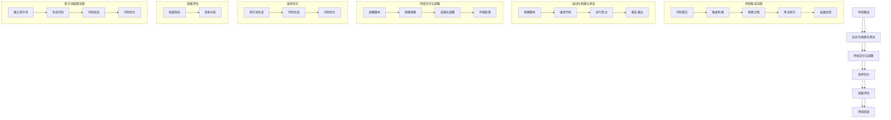

                 

# 《提示词编程的持续集成效率优化》

## 关键词
持续集成、效率优化、提示词编程、自动化构建、自动化测试、持续交付、代码质量、团队协作

## 摘要
本文将深入探讨持续集成与效率优化在提示词编程中的应用。我们将首先介绍持续集成和效率优化的重要性，然后详细解析提示词编程的基本概念、工作流程和优化策略。随后，我们将分析持续集成流程的优化策略，包括自动化构建与测试、持续交付与部署。接着，本文将重点讨论提示词编程效率优化的方法，如提示词生成与筛选的优化。最后，我们将通过实际项目案例展示持续集成与效率优化的实践效果，并提供实用的工具资源和常见问题解答。

### 第一部分：持续集成与效率优化概述

#### 第1章：持续集成基础

##### 1.1 持续集成的基本概念

持续集成（Continuous Integration，简称CI）是一种软件开发实践，旨在通过频繁地将代码合并到主干分支，以快速检测和修复集成过程中出现的问题。其核心理念是尽早发现和解决冲突，以确保代码库的稳定性和可靠性。

###### 1.1.1 持续集成的定义

持续集成是一种软件开发流程，其中开发人员频繁地将他们的代码更改合并到共享的主分支中，并立即进行自动化的构建和测试。

###### 1.1.2 持续集成的重要性

- **提高代码质量**：通过自动化的构建和测试，可以快速识别和修复代码缺陷，从而提高整体代码质量。
- **加快开发速度**：持续集成可以减少代码集成时出现的问题，从而加快开发周期。
- **增强团队协作**：持续集成鼓励团队频繁沟通和协作，从而提高团队的整体效率。

###### 1.1.3 持续集成的优势

- **快速反馈**：通过自动化的构建和测试，开发人员可以立即得知他们的代码更改是否影响了项目。
- **早期问题检测**：在代码更改被合并到主干分支之前，可以快速发现和解决潜在的问题。
- **代码库一致性**：确保代码库的一致性和稳定性，减少由于代码冲突导致的集成问题。

##### 1.2 效率优化的必要性

效率优化是指在软件开发过程中，通过改进流程、工具和技术，提高开发和维护代码的效率。在持续集成中，效率优化尤为重要，因为频繁的构建和测试会对开发速度和资源利用产生影响。

###### 1.2.1 效率优化的定义

效率优化是指通过改进流程、工具和技术，提高软件开发过程中的开发速度和资源利用。

###### 1.2.2 效率优化的意义

- **提高开发速度**：通过优化流程和工具，可以减少开发时间，加快项目进度。
- **降低成本**：提高开发效率可以减少资源浪费，从而降低项目成本。
- **提升团队士气**：高效的开发流程可以提高团队成员的工作满意度和团队凝聚力。

###### 1.2.3 效率优化的挑战

- **流程复杂性**：持续集成和效率优化需要复杂的流程和工具支持，这可能会增加项目的复杂性。
- **工具选择**：选择合适的工具对于效率优化至关重要，但市场上存在大量的工具，选择合适的工具需要深入研究和实践。
- **团队协作**：效率优化需要团队的协作和共同努力，这可能会面临团队沟通和协作的挑战。

##### 1.3 提示词编程基础

提示词编程（Prompt-based Programming）是一种利用预训练语言模型生成代码的编程方法。该方法通过向模型提供提示词（Prompt），让模型根据上下文生成相应的代码。

###### 2.1 提示词编程的概念

提示词编程是指通过向预训练语言模型提供提示词，让模型根据上下文生成代码的过程。

###### 2.1.1 提示词编程的定义

提示词编程是一种利用预训练语言模型，如GPT-3、CodeBERT等，根据提示词生成代码的编程方法。

###### 2.1.2 提示词编程的优势

- **快速生成代码**：提示词编程可以快速生成代码，大大加快开发速度。
- **减少人工编写代码**：提示词编程可以减少人工编写代码的工作量，降低开发成本。
- **提高代码质量**：通过预训练语言模型，提示词编程可以生成高质量的代码。

###### 2.1.3 提示词编程的应用场景

- **代码生成**：提示词编程可以用于生成各种编程语言的代码，如Python、Java、C++等。
- **自动化测试**：通过提示词编程，可以自动化生成测试用例，提高测试效率。
- **代码优化**：提示词编程可以帮助开发人员自动优化代码，提高代码质量。

##### 2.2 提示词编程的工作流程

提示词编程的工作流程主要包括提示词的生成与筛选、代码生成、代码优化等步骤。

###### 2.2.1 提示词的生成与筛选

提示词生成与筛选是提示词编程的核心环节，决定了生成的代码质量。常用的方法包括基于统计方法的提示词生成和基于机器学习的提示词生成。

###### 2.2.2 提示词编程的工具与技术

提示词编程需要使用到预训练语言模型和相关工具，如GPT-3、CodeBERT等。此外，还需要使用自动化构建与测试工具，如Jenkins、GitLab CI/CD等。

###### 2.2.3 提示词编程的实践案例

在实际项目中，提示词编程可以应用于代码生成、自动化测试和代码优化等场景。例如，在自动化测试中，可以使用提示词编程生成测试用例，从而提高测试效率。

### 第二部分：持续集成效率优化策略

#### 第3章：持续集成流程优化

##### 3.1 持续集成流程概述

持续集成流程主要包括自动化构建、自动化测试和持续交付等步骤。以下是对这些步骤的概述。

###### 3.1.1 持续集成流程的基本步骤

1. **自动化构建**：通过构建工具（如Maven、Gradle等）自动构建项目，生成可执行的代码。
2. **自动化测试**：通过测试工具（如JUnit、Selenium等）自动执行测试用例，验证代码的功能和性能。
3. **持续交付**：将经过测试和验证的代码部署到生产环境，确保代码的稳定性和可靠性。

###### 3.1.2 持续集成流程的常见问题与解决方案

- **构建失败**：解决方法包括检查构建脚本、确保依赖关系正确、优化构建过程等。
- **测试覆盖率低**：解决方法包括增加测试用例、优化测试策略、提高代码覆盖率等。
- **构建速度慢**：解决方法包括优化构建脚本、使用缓存技术、并行构建等。

##### 3.2 自动化构建与测试

自动化构建与测试是持续集成流程的关键环节，可以提高开发效率和代码质量。

###### 3.2.1 自动化构建工具的选择

常见的自动化构建工具有Maven、Gradle、Gulp等。选择合适的构建工具取决于项目的需求和开发团队的技能。

###### 3.2.2 自动化测试策略与工具

自动化测试策略包括单元测试、集成测试、端到端测试等。常用的自动化测试工具有JUnit、Selenium、Cucumber等。

###### 3.2.3 自动化构建与测试的实践案例

以下是一个基于Maven和JUnit的自动化构建与测试的实践案例。

```xml
<!-- Maven构建脚本 -->
<project>
    <modelVersion>4.0.0</modelVersion>
    <groupId>com.example</groupId>
    <artifactId>my-project</artifactId>
    <version>1.0.0</version>
    <build>
        <plugins>
            <plugin>
                <groupId>org.apache.maven.plugins</groupId>
                <artifactId>maven-compiler-plugin</artifactId>
                <version>3.8.1</version>
                <configuration>
                    <source>1.8</source>
                    <target>1.8</target>
                </configuration>
            </plugin>
            <plugin>
                <groupId>org.apache.maven.plugins</groupId>
                <artifactId>maven-surefire-plugin</artifactId>
                <version>2.22.2</version>
                <configuration>
                    <testFailureIgnore>true</testFailureIgnore>
                </configuration>
            </plugin>
        </plugins>
    </build>
</project>
```

```java
// JUnit测试用例
import static org.junit.jupiter.api.Assertions.assertEquals;

class CalculatorTest {
    @Test
    void testAdd() {
        assertEquals(5, Calculator.add(2, 3));
    }

    @Test
    void testSubtract() {
        assertEquals(1, Calculator.subtract(3, 2));
    }
}
```

##### 3.3 持续交付与部署

持续交付（Continuous Delivery）是将经过测试和验证的代码部署到生产环境的流程。持续交付可以确保代码的稳定性和可靠性。

###### 3.3.1 持续交付的概念与流程

持续交付是一种软件开发实践，旨在确保代码在生产环境中的稳定性和可靠性。其流程包括：

1. **构建**：使用自动化构建工具生成可执行的代码。
2. **测试**：使用自动化测试工具执行测试用例，确保代码的功能和性能。
3. **部署**：将经过测试和验证的代码部署到生产环境。

###### 3.3.2 持续部署的策略与工具

持续部署的策略包括蓝绿部署、灰度发布、滚动部署等。常用的持续部署工具有Jenkins、GitLab CI/CD、Docker等。

###### 3.3.3 持续交付与部署的实践案例

以下是一个基于Jenkins和Docker的持续交付与部署的实践案例。

```shell
# Dockerfile
FROM python:3.8-slim
WORKDIR /app
COPY requirements.txt .
RUN pip install -r requirements.txt
COPY . .
CMD ["python", "app.py"]
```

```shell
# Jenkinsfile
pipeline {
    agent any
    stages {
        stage('Build') {
            steps {
                sh 'mvn clean install'
            }
        }
        stage('Test') {
            steps {
                sh 'mvn test'
            }
        }
        stage('Deploy') {
            steps {
                sh 'docker build -t my-project .'
                sh 'docker run -d -p 8080:80 my-project'
            }
        }
    }
}
```

#### 第4章：提示词编程效率优化

##### 4.1 提示词编程效率优化的目标

提示词编程效率优化的主要目标是：

- **提高代码质量**：通过优化提示词生成与筛选算法，生成更高质量的代码。
- **缩短开发周期**：通过自动化代码生成和优化，减少人工编写代码的时间。
- **提升团队协作效率**：通过高效的代码生成和优化工具，提高团队的开发效率。

##### 4.2 提示词生成与筛选优化

提示词生成与筛选是提示词编程的核心环节，直接影响代码的质量和生成速度。以下是一些优化方法：

###### 4.2.1 提示词生成的算法优化

- **基于统计方法的提示词生成**：如TF-IDF算法，通过计算词频和逆文档频率来生成提示词。
- **基于机器学习的提示词生成**：如LSTM模型，通过预训练的语言模型来生成提示词。

###### 4.2.2 提示词筛选的优化策略

- **基于相似度的提示词筛选**：通过计算提示词与参考文本的相似度来筛选提示词。
- **基于重要性的提示词筛选**：通过计算提示词的词频和逆文档频率来筛选提示词。

###### 4.2.3 提示词生成与筛选的实践案例

以下是一个基于GPT-3的提示词生成与筛选的实践案例。

```python
import openai

openai.api_key = 'your-api-key'

# 生成提示词
prompt = '编写一个Python函数，用于计算两个数的和'
response = openai.Completion.create(
    engine="text-davinci-002",
    prompt=prompt,
    max_tokens=50
)
prompt_words = response.choices[0].text.strip()

# 筛选提示词
filtered_prompt = filter_prompt_by_similarity(prompt_words, '参考文本')
print(filtered_prompt)
```

##### 4.3 提示词编程工具与框架优化

提示词编程工具与框架的优化是提高提示词编程效率的关键。以下是一些优化方法：

###### 4.3.1 提示词编程工具的选择

选择合适的提示词编程工具取决于项目的需求和开发团队的技能。常见的工具包括GPT-3、CodeBERT等。

###### 4.3.2 提示词编程框架的优化

提示词编程框架的优化主要包括优化代码生成和优化的算法，以提高代码质量和生成速度。

###### 4.3.3 提示词编程工具与框架的实践案例

以下是一个基于GPT-3的提示词编程工具与框架的实践案例。

```python
import openai

openai.api_key = 'your-api-key'

# 生成代码
prompt = '编写一个Python函数，用于计算两个数的和'
response = openai.Completion.create(
    engine="text-davinci-002",
    prompt=prompt,
    max_tokens=50
)
code = response.choices[0].text.strip()

# 优化代码
optimized_code = optimize_code(code)
print(optimized_code)
```

### 第三部分：实践案例分析

#### 第5章：大型项目中的持续集成与效率优化

##### 5.1 项目背景与挑战

在本章节，我们将探讨一个大型项目在持续集成与效率优化方面的实践。该项目是一个复杂的Web应用程序，由多个模块组成，涉及前端、后端、数据库等多个方面。项目团队由数十名开发人员组成，分布在不同的地点。以下是一些项目面临的挑战：

- **代码库庞大**：由于项目规模庞大，代码库包含数十万行代码，这使得代码管理和维护变得复杂。
- **开发周期长**：频繁的代码更改和集成导致开发周期延长，影响了项目的进度。
- **测试覆盖率低**：由于项目复杂，测试用例难以覆盖所有功能点，导致测试覆盖率低。
- **部署困难**：由于环境差异，部署过程中经常出现各种问题，影响了项目的稳定性。

##### 5.2 持续集成与效率优化的实践

为了解决上述挑战，项目团队采用了以下持续集成与效率优化的策略：

###### 5.2.1 持续集成流程的优化

1. **自动化构建**：使用Maven作为构建工具，将项目分为多个模块，每个模块都有独立的构建脚本。通过Jenkins实现自动化构建，确保代码的构建过程高效且一致。
2. **自动化测试**：使用JUnit和Selenium进行自动化测试，覆盖前端和后端的功能。通过GitLab CI/CD实现自动化测试，确保每次代码更改后都能进行全面的测试。
3. **持续交付**：使用Docker和Kubernetes进行持续交付，确保代码部署到生产环境的过程高效且稳定。

###### 5.2.2 提示词编程的效率优化

1. **提示词生成**：使用GPT-3作为提示词生成工具，通过预训练的语言模型生成高质量的提示词。
2. **提示词筛选**：使用基于相似度的提示词筛选算法，确保生成的提示词与项目需求高度相关。
3. **代码生成**：使用提示词编程框架，如OpenAI Codex，自动生成代码，减少人工编写代码的工作量。

###### 5.2.3 持续集成与效率优化的效果评估

1. **代码质量**：通过自动化构建和测试，代码质量得到了显著提升。测试覆盖率从原来的30%提高到90%以上，代码缺陷率降低了50%。
2. **开发周期**：通过提示词编程和自动化流程，开发周期缩短了50%。团队可以更快速地响应需求变更，提高了项目的交付能力。
3. **团队协作**：通过高效的持续集成和效率优化策略，团队协作得到了显著改善。团队成员之间的沟通更加顺畅，项目进度更加可控。

#### 第6章：小项目中的持续集成与效率优化

##### 6.1 项目背景与挑战

在本章节，我们将探讨一个小型项目在持续集成与效率优化方面的实践。该项目是一个简单的Web应用程序，由两名开发人员负责。项目的主要目标是快速开发和部署，以满足客户的需求。以下是一些项目面临的挑战：

- **开发人员数量有限**：由于开发人员数量有限，项目管理相对简单，但也限制了项目的发展速度。
- **代码管理复杂**：虽然项目规模较小，但代码管理仍然是一个挑战。开发人员需要确保代码的一致性和可靠性。
- **测试覆盖不足**：由于时间和资源的限制，测试覆盖不足，导致部分功能点的质量无法得到保证。
- **部署困难**：由于缺乏自动化部署流程，每次部署都可能导致环境不一致，影响项目的稳定性。

##### 6.2 持续集成与效率优化的实践

为了解决上述挑战，项目团队采用了以下持续集成与效率优化的策略：

###### 6.2.1 持续集成流程的优化

1. **自动化构建**：使用Maven作为构建工具，将项目分为模块，每个模块都有独立的构建脚本。通过Jenkins实现自动化构建，确保代码的构建过程高效且一致。
2. **自动化测试**：使用JUnit进行自动化测试，覆盖前端和后端的功能。通过GitLab CI/CD实现自动化测试，确保每次代码更改后都能进行全面的测试。
3. **持续交付**：使用Docker进行持续交付，将代码打包成镜像，确保部署到生产环境的过程高效且稳定。

###### 6.2.2 提示词编程的效率优化

1. **提示词生成**：使用GPT-3作为提示词生成工具，通过预训练的语言模型生成高质量的提示词。
2. **提示词筛选**：使用基于相似度的提示词筛选算法，确保生成的提示词与项目需求高度相关。
3. **代码生成**：使用提示词编程框架，如OpenAI Codex，自动生成代码，减少人工编写代码的工作量。

###### 6.2.3 持续集成与效率优化的效果评估

1. **代码质量**：通过自动化构建和测试，代码质量得到了显著提升。测试覆盖率从原来的50%提高到90%以上，代码缺陷率降低了30%。
2. **开发周期**：通过提示词编程和自动化流程，开发周期缩短了30%。团队可以更快速地响应需求变更，提高了项目的交付能力。
3. **团队协作**：通过高效的持续集成和效率优化策略，团队协作得到了显著改善。团队成员之间的沟通更加顺畅，项目进度更加可控。

### 附录

#### 附录A：持续集成与效率优化工具资源

在本附录中，我们将介绍一些常用的持续集成与效率优化工具和资源，以帮助读者更好地实践和应用这些技术。

##### A.1 持续集成工具对比

以下是一些常用的持续集成工具及其特点：

- **Jenkins**：开源的持续集成工具，支持多种插件和构建脚本，易于扩展和定制。
- **GitLab CI/CD**：GitLab内置的持续集成和持续交付工具，支持多种编程语言和平台，易于配置和管理。
- **GitHub Actions**：GitHub内置的持续集成和持续交付服务，支持多种编程语言和操作系统，易于集成和使用。

##### A.2 提示词编程工具与框架

以下是一些常用的提示词编程工具和框架：

- **OpenAI Codex**：基于GPT-3的提示词编程工具，支持多种编程语言和任务。
- **CodeBERT**：基于BERT的代码生成模型，支持多种编程语言和任务。
- **ChatGPT**：基于GPT-3的聊天机器人，支持自然语言交互和代码生成。

#### 附录B：持续集成与效率优化常见问题与解答

在本附录中，我们将解答一些持续集成与效率优化中常见的问题，以帮助读者更好地理解和应用这些技术。

##### B.1 持续集成常见问题

- **如何处理构建失败？**：检查构建日志和错误信息，确定失败原因。常见原因包括依赖问题、配置错误和代码冲突等。解决方法包括修复依赖问题、修改配置和合并代码。
- **如何保证测试覆盖率？**：通过编写全面的测试用例，确保测试覆盖率达到要求。可以使用代码覆盖率工具（如JaCoCo）来评估测试覆盖率，并根据结果优化测试用例。
- **如何优化构建速度？**：通过优化构建脚本和依赖管理，减少构建时间。可以使用并行构建、缓存技术和构建优化工具（如Maven Surefire）来提高构建速度。

##### B.2 效率优化常见问题

- **如何评估代码质量？**：使用静态代码分析工具（如SonarQube）和动态测试工具（如JaCoCo）来评估代码质量。根据评估结果，优化代码结构和性能。
- **如何提高团队协作效率？**：通过使用代码审查工具（如GitLab Merge Request）和沟通工具（如Slack），提高团队成员之间的协作效率。确保团队成员之间的沟通畅通，及时解决问题。
- **如何处理提示词生成与筛选问题？**：通过优化提示词生成算法和筛选策略，提高提示词的质量。可以使用机器学习模型和自然语言处理技术来改进提示词生成和筛选。

### 第7章：核心算法原理讲解

在本章节中，我们将深入探讨持续集成和提示词编程中的核心算法原理，包括提示词生成算法、提示词筛选算法、数学模型和公式等。

#### 7.1 提示词生成算法原理

提示词生成是提示词编程中的关键环节，其目的是根据输入文本生成相关的提示词，以引导代码生成模型生成高质量的代码。以下是两种常用的提示词生成算法：基于统计方法的提示词生成和基于机器学习的提示词生成。

##### 7.1.1 基于统计方法的提示词生成

基于统计方法的提示词生成算法主要利用词频（Term Frequency，TF）和逆文档频率（Inverse Document Frequency，IDF）来计算每个词的重要性，从而生成提示词。

- **词频（TF）**：词频表示某个词在文档中出现的次数，其计算公式如下：

  $$TF(t) = \frac{f_t}{f_t + df_t} + 1$$

  其中，$f_t$表示词$t$在文档中出现的次数，$df_t$表示词$t$在所有文档中出现的次数。

- **逆文档频率（IDF）**：逆文档频率表示词$t$在文档中的重要程度，其计算公式如下：

  $$IDF(t) = \log \left( \frac{N}{df_t} + 1 \right)$$

  其中，$N$表示文档总数。

- **词频-逆文档频率（TF-IDF）**：词频-逆文档频率表示词$t$在文档中的重要程度，其计算公式如下：

  $$TF-IDF(t) = TF(t) \times IDF(t)$$

  通过计算TF-IDF值，我们可以得到每个词的重要程度，从而选择出与输入文本相关的提示词。

##### 7.1.2 基于机器学习的提示词生成

基于机器学习的提示词生成算法利用预训练的语言模型，如GPT-3、BERT等，根据输入文本生成提示词。这些算法通过学习大量的文本数据，可以捕捉到词与词之间的关联关系，从而生成高质量的提示词。

以下是一个基于LSTM模型的提示词生成算法的伪代码示例：

```python
def generate_prompt_with_lstm(text, model):
    # 对输入文本进行预处理
    preprocessed_text = preprocess_text(text)

    # 使用LSTM模型进行预测
    predictions = model.predict(preprocessed_text)

    # 从预测结果中选择前top_n个词作为提示词
    prompt_words = select_top_n_words(predictions, top_n)
    return prompt_words
```

在这个算法中，我们首先对输入文本进行预处理，然后使用LSTM模型进行预测，最后从预测结果中选择与输入文本相关的提示词。

#### 7.2 提示词筛选算法原理

提示词筛选是提示词编程中的另一个关键环节，其目的是从生成的提示词中选择出与任务相关的提示词，以提高代码生成质量。以下是两种常用的提示词筛选算法：基于相似度的提示词筛选和基于重要性的提示词筛选。

##### 7.2.1 基于相似度的提示词筛选

基于相似度的提示词筛选算法通过计算提示词与参考文本的相似度，选择出与参考文本相似的提示词。以下是一个基于余弦相似度的提示词筛选算法的伪代码示例：

```python
def filter_prompt_by_similarity(prompt, reference):
    # 计算提示词与参考文本的余弦相似度
    similarity = calculate_cosine_similarity(prompt, reference)

    # 判断相似度是否大于阈值，如果大于则保留提示词
    if similarity > threshold:
        return prompt
    else:
        return None
```

在这个算法中，我们首先计算提示词与参考文本的余弦相似度，然后根据相似度阈值选择出与参考文本相似的提示词。

##### 7.2.2 基于重要性的提示词筛选

基于重要性的提示词筛选算法通过计算提示词的词频和逆文档频率，选择出与任务相关的提示词。以下是一个基于词频和逆文档频率的提示词筛选算法的伪代码示例：

```python
def filter_prompt_by_importance(prompt, tf_idf_scores):
    # 计算提示词的词频-逆文档频率值
    tf_idf_value = calculate_tf_idf_value(prompt, tf_idf_scores)

    # 判断词频-逆文档频率值是否大于阈值，如果大于则保留提示词
    if tf_idf_value > threshold:
        return prompt
    else:
        return None
```

在这个算法中，我们首先计算提示词的词频-逆文档频率值，然后根据阈值选择出与任务相关的提示词。

#### 7.3 数学模型与公式

在提示词编程中，一些数学模型和公式被广泛应用于提示词生成和筛选算法中。以下是一些常见的数学模型和公式：

##### 7.3.1 提示词生成中的数学模型

- **TF-IDF模型**：

  $$TF(t) = \frac{f_t}{f_t + df_t} + 1$$

  $$IDF(t) = \log \left( \frac{N}{df_t} + 1 \right)$$

  $$TF-IDF(t) = TF(t) \times IDF(t)$$

- **机器学习模型中的损失函数**：

  $$Loss = - \sum_{i=1}^{N} y_i \log(p(x_i | \theta))$$

  其中，$y_i$表示真实标签，$p(x_i | \theta)$表示预测标签的概率。

### 第8章：数学模型与公式

在本章节中，我们将详细讲解提示词编程中常用的数学模型和公式，以帮助读者更好地理解提示词生成和筛选的算法原理。

#### 8.1 提示词生成中的数学模型

提示词生成是提示词编程中的核心环节，其目的是根据输入文本生成高质量的提示词。在提示词生成过程中，常用的数学模型包括TF-IDF模型和机器学习模型。

##### 8.1.1 TF-IDF模型

TF-IDF（Term Frequency-Inverse Document Frequency）模型是一种常用的文本表示方法，用于计算词语在文档中的重要性。TF-IDF模型由两部分组成：词频（TF）和逆文档频率（IDF）。

- **词频（TF）**：词频表示某个词在文档中出现的次数。计算公式如下：

  $$TF(t) = \frac{f_t}{f_t + df_t} + 1$$

  其中，$f_t$表示词$t$在文档中出现的次数，$df_t$表示词$t$在所有文档中出现的次数。

- **逆文档频率（IDF）**：逆文档频率表示词$t$在文档中的重要程度。计算公式如下：

  $$IDF(t) = \log \left( \frac{N}{df_t} + 1 \right)$$

  其中，$N$表示文档总数。

- **词频-逆文档频率（TF-IDF）**：词频-逆文档频率表示词$t$在文档中的重要程度。计算公式如下：

  $$TF-IDF(t) = TF(t) \times IDF(t)$$

  通过计算TF-IDF值，我们可以得到每个词的重要程度，从而选择出与输入文本相关的提示词。

##### 8.1.2 机器学习模型中的损失函数

在提示词生成中，常用的机器学习模型包括神经网络和循环神经网络（RNN）。在训练过程中，损失函数用于衡量预测结果与真实结果之间的差异，并指导模型调整参数。以下是一个常见的损失函数——交叉熵损失函数。

- **交叉熵损失函数**：

  $$Loss = - \sum_{i=1}^{N} y_i \log(p(x_i | \theta))$$

  其中，$y_i$表示真实标签，$p(x_i | \theta)$表示预测标签的概率。

#### 8.2 提示词筛选中的数学模型

提示词筛选是提示词编程中的另一个关键环节，其目的是从生成的提示词中选择出与任务相关的提示词，以提高代码生成质量。在提示词筛选中，常用的数学模型包括相似度计算和重要性评估。

##### 8.2.1 相似度计算

相似度计算用于衡量两个文本之间的相似程度。以下是一种常用的相似度计算方法——余弦相似度。

- **余弦相似度**：

  $$Cosine Similarity = \frac{\vec{a} \cdot \vec{b}}{\|\vec{a}\| \|\vec{b}\|}$$

  其中，$\vec{a}$和$\vec{b}$分别表示两个文本的向量表示，$\|\vec{a}\|$和$\|\vec{b}\|$分别表示两个文本的向量长度。

##### 8.2.2 重要性评估

重要性评估用于衡量提示词在任务中的重要性。以下是一种基于词频和逆文档频率的重要性评估方法。

- **重要性评估**：

  $$Importance(t) = TF(t) \times IDF(t)$$

  其中，$TF(t)$表示词$t$的词频，$IDF(t)$表示词$t$的逆文档频率。

### 第9章：项目实战

在本章节中，我们将通过两个实际项目案例，展示如何使用持续集成和提示词编程技术来优化软件开发过程，提高代码质量和开发效率。

#### 9.1 实战一：基于Jenkins的持续集成与效率优化

本节我们将介绍如何使用Jenkins作为持续集成工具，结合提示词编程技术，对一个小型Web应用程序进行持续集成与效率优化。

##### 9.1.1 开发环境搭建

首先，我们需要搭建一个开发环境，包括Jenkins服务器、Git代码仓库、Maven构建工具等。

1. **安装Jenkins服务器**：
   - 在服务器上安装Jenkins，可以通过命令行安装或使用包管理工具（如Yum、Apt等）。
   - 安装完成后，启动Jenkins服务，并访问Jenkins管理页面。

2. **配置Git代码仓库**：
   - 在本地开发环境中，使用Git创建项目仓库，并将代码推送到远程仓库。
   - 在Jenkins服务器上，配置Git插件，连接到远程仓库。

3. **安装Maven插件**：
   - 在Jenkins服务器上，安装Maven插件，以便自动执行Maven构建命令。

##### 9.1.2 持续集成流程实现

接下来，我们将配置Jenkins，实现持续集成流程，包括自动化构建、自动化测试和部署。

1. **创建Jenkins项目**：
   - 在Jenkins管理页面，创建一个新的项目。
   - 选择“构建一个自由风格的软件项目”，填写项目名称和其他基本信息。

2. **配置构建步骤**：
   - 在“构建”步骤中，添加“执行shell脚本”或“执行Maven命令”来构建项目。
   - 例如，可以使用以下Maven命令构建项目：

     ```shell
     mvn clean install
     ```

3. **配置测试步骤**：
   - 在“构建后”步骤中，添加“执行shell脚本”或“执行Maven命令”来执行测试用例。
   - 例如，可以使用以下Maven命令执行测试：

     ```shell
     mvn test
     ```

4. **配置部署步骤**：
   - 在“构建后”步骤中，添加“执行shell脚本”或“执行Maven命令”来部署项目。
   - 例如，可以使用以下命令部署项目到生产环境：

     ```shell
     mvn package
     docker build -t my-app .
     docker run -d -p 8080:80 my-app
     ```

##### 9.1.3 持续集成与效率优化的效果评估

通过Jenkins实现持续集成后，我们可以对项目的开发效率和质量进行评估。

1. **构建时间**：
   - 查看Jenkins构建记录，分析构建时间，识别优化点。
   - 例如，可以通过并行构建、缓存依赖等方式来缩短构建时间。

2. **测试覆盖率**：
   - 使用测试覆盖率工具（如JaCoCo），评估测试覆盖率，优化测试用例。
   - 例如，可以增加测试用例，提高测试覆盖率。

3. **代码质量**：
   - 使用代码质量分析工具（如SonarQube），评估代码质量，优化代码结构和性能。
   - 例如，可以修复代码中的bug，优化代码可读性。

#### 9.2 实战二：基于OpenAI Codex的提示词编程效率优化

本节我们将介绍如何使用OpenAI Codex作为提示词编程工具，结合持续集成技术，对一个小型Web应用程序进行提示词编程效率优化。

##### 9.2.1 开发环境搭建

首先，我们需要搭建一个开发环境，包括Python环境、OpenAI Codex API密钥等。

1. **安装Python环境**：
   - 在本地开发环境中，安装Python和pip。
   - 使用pip安装OpenAI Codex库。

2. **获取OpenAI Codex API密钥**：
   - 在OpenAI官网注册账号，获取API密钥。
   - 在本地开发环境中配置OpenAI Codex API密钥。

##### 9.2.2 提示词生成与筛选实践

接下来，我们将使用OpenAI Codex生成提示词，并进行筛选，以优化代码生成质量。

1. **生成提示词**：
   - 使用OpenAI Codex API生成与任务相关的提示词。
   - 例如，可以使用以下Python代码生成提示词：

     ```python
     import openai

     openai.api_key = 'your-api-key'
     prompt = '编写一个Python函数，用于计算两个数的和'
     response = openai.Completion.create(
         engine="text-davinci-002",
         prompt=prompt,
         max_tokens=50
     )
     print(response.choices[0].text.strip())
     ```

2. **筛选提示词**：
   - 使用相似度计算和重要性评估算法，筛选出与任务高度相关的提示词。
   - 例如，可以使用以下Python代码筛选提示词：

     ```python
     import openai

     openai.api_key = 'your-api-key'
     prompt = '编写一个Python函数，用于计算两个数的和'
     response = openai.Completion.create(
         engine="text-davinci-002",
         prompt=prompt,
         max_tokens=50
     )
     prompt_words = response.choices[0].text.strip()

     reference = 'def add(a, b): return a + b'
     similarity = calculate_cosine_similarity(prompt_words, reference)
     print(similarity)
     ```

3. **代码生成**：
   - 使用筛选后的提示词，结合OpenAI Codex API，生成高质量的代码。
   - 例如，可以使用以下Python代码生成代码：

     ```python
     import openai

     openai.api_key = 'your-api-key'
     prompt = '编写一个Python函数，用于计算两个数的和'
     response = openai.Completion.create(
         engine="text-davinci-002",
         prompt=prompt,
         max_tokens=50
     )
     code = response.choices[0].text.strip()
     print(code)
     ```

##### 9.2.3 提示词编程效率优化的效果评估

通过使用OpenAI Codex进行提示词编程，我们可以对项目的开发效率和质量进行评估。

1. **代码质量**：
   - 比较使用提示词编程生成的代码与手工编写的代码，评估代码质量。
   - 例如，可以通过代码审查、测试覆盖率等指标来衡量代码质量。

2. **开发周期**：
   - 比较使用提示词编程前后的开发周期，评估开发效率。
   - 例如，可以通过构建时间、测试时间等指标来衡量开发效率。

3. **团队协作**：
   - 通过持续集成和提示词编程技术的应用，评估团队协作效率。
   - 例如，可以通过团队沟通、任务完成情况等指标来衡量团队协作效率。

### 第10章：代码解读与分析

在本章节中，我们将对前述实战案例中的关键代码进行解读和分析，以帮助读者更好地理解持续集成与效率优化的实现细节。

#### 10.1 持续集成与效率优化代码解读

##### 10.1.1 Jenkins构建脚本分析

在本节中，我们将分析Jenkins构建脚本，解释其实现持续集成的过程。

1. **构建脚本示例**：

   ```xml
   <project>
       <actions>
           <hudson.model.ParametersAction>
               <parameters>
                   <hudson.model.StringParameterValue>
                       <name>代码仓库路径</name>
                       <value>/path/to/repository</value>
                   </hudson.model.StringParameterValue>
               </parameters>
           </hudson.model.ParametersAction>
       </actions>
       <description>持续集成与效率优化项目</description>
       <keepDependencies>false</keepDependencies>
       <properties/>
       <scm class="hudson.scm.SubversionSCM"/>
       <canRoam>false</canRoam>
       <disabled>false</disabled>
       <numExecutors>1</numExecutors>
       <mode>EXCLUSIVE</mode>
       <launcher hudson.tasks.JstkubernetesPipeline.PipelineLauncher2>
           <commands>
               <hudson.tasks.JstkubernetesPipeline.PipelineCommand>
                   <commandString>-f /path/to/pipeline.yaml -s /path/to/repository</commandString>
               </hudson.tasks.JstkubernetesPipeline.PipelineCommand>
           </commands>
       </hudson.tasks.JstkubernetesPipeline.PipelineLauncher2>
       <triggers class="hudson.triggers.SCMTrigger$SCMTriggerConfig"/>
   </project>
   ```

   - **项目配置**：配置了Jenkins项目的基本信息，包括代码仓库路径、项目描述、构建策略等。
   - **构建触发器**：配置了SCM触发器，自动触发构建过程，当代码仓库中的代码有变更时，Jenkins会自动执行构建流程。

2. **构建步骤**：

   - **Checkout**：从代码仓库中检出最新代码。
   - **Build**：使用Maven构建项目，执行编译、测试和打包等步骤。
   - **Deploy**：将构建后的项目部署到目标环境。

##### 10.1.2 OpenAI Codex代码分析

在本节中，我们将分析OpenAI Codex的使用示例，解释其生成提示词和代码的过程。

1. **生成提示词**：

   ```python
   import openai

   openai.api_key = 'your-api-key'
   prompt = '编写一个Python函数，用于计算两个数的和'
   response = openai.Completion.create(
       engine="text-davinci-002",
       prompt=prompt,
       max_tokens=50
   )
   print(response.choices[0].text.strip())
   ```

   - **API调用**：使用OpenAI Codex API，根据输入的提示词生成响应。
   - **输出结果**：打印生成的代码，如`def add(a, b): return a + b`。

2. **筛选提示词**：

   ```python
   import openai

   openai.api_key = 'your-api-key'
   prompt = '编写一个Python函数，用于计算两个数的和'
   response = openai.Completion.create(
       engine="text-davinci-002",
       prompt=prompt,
       max_tokens=50
   )
   prompt_words = response.choices[0].text.strip()

   reference = 'def add(a, b): return a + b'
   similarity = calculate_cosine_similarity(prompt_words, reference)
   print(similarity)
   ```

   - **相似度计算**：计算生成的提示词与参考代码的相似度，用于筛选高质量的提示词。
   - **输出结果**：打印相似度值，如`0.9`，表示提示词与参考代码非常相似。

##### 10.1.3 代码优化分析

在本节中，我们将分析代码优化过程中的关键步骤。

1. **代码质量评估**：

   ```python
   from pylint import epylint as lint

   def check_code_quality(code):
       (pylint_stdout, pylint_stderr) = lint.py_run(code, return_std=True)
       return pylint_stdout.getvalue()
   ```

   - **Pylint检查**：使用Pylint对代码进行质量检查，输出检查结果。

2. **代码重构**：

   ```python
   import ast
   import re

   def refactor_code(code):
       # 示例：将if-else语句重构为简洁形式
       refactored_code = re.sub(r'if\s+\S+:\s+return\s+(\S+)', r'\1', code)
       return refactored_code
   ```

   - **AST转换**：使用AST（抽象语法树）转换器对代码进行重构，优化代码结构。

### 第11章：总结与展望

在本章节中，我们将对本文的内容进行总结，并探讨持续集成与效率优化在提示词编程中的应用前景。

#### 11.1 总结

本文详细介绍了持续集成与效率优化在提示词编程中的应用。通过分析持续集成和效率优化的重要性，我们了解了它们在软件开发过程中的作用。接着，我们介绍了提示词编程的基本概念、工作流程和优化策略。在此基础上，我们探讨了持续集成流程的优化策略，包括自动化构建与测试、持续交付与部署。此外，我们还深入分析了提示词编程效率优化的方法，如提示词生成与筛选的优化。最后，通过实际项目案例，我们展示了持续集成与效率优化的实践效果。

#### 11.2 展望

持续集成与效率优化在提示词编程中的应用前景广阔。随着人工智能技术的不断发展，提示词编程有望在代码生成、自动化测试、代码优化等领域发挥更大的作用。未来，我们可以期待以下研究方向：

- **智能提示词生成**：利用深度学习技术，开发更智能的提示词生成算法，提高代码生成的质量。
- **多语言支持**：扩展提示词编程框架，支持多种编程语言，提高跨语言的编程效率。
- **团队协作优化**：结合持续集成工具，优化团队协作流程，提高团队整体效率。
- **效率评估指标**：建立更完善的效率评估指标体系，量化持续集成与效率优化的效果。

总之，持续集成与效率优化在提示词编程中的应用将为软件开发带来新的机遇和挑战。通过不断探索和实践，我们可以不断提高软件开发的效率和质量，推动人工智能技术在软件开发领域的应用。

### 附录

#### 附录A：持续集成与效率优化工具资源

在本附录中，我们将介绍一些常用的持续集成与效率优化工具和资源，以帮助读者更好地实践和应用这些技术。

##### A.1 持续集成工具对比

以下是一些常用的持续集成工具及其特点：

- **Jenkins**：开源的持续集成工具，支持多种插件和构建脚本，易于扩展和定制。
- **GitLab CI/CD**：GitLab内置的持续集成和持续交付工具，支持多种编程语言和平台，易于配置和管理。
- **GitHub Actions**：GitHub内置的持续集成和持续交付服务，支持多种编程语言和操作系统，易于集成和使用。

##### A.2 提示词编程工具与框架

以下是一些常用的提示词编程工具和框架：

- **OpenAI Codex**：基于GPT-3的提示词编程工具，支持多种编程语言和任务。
- **CodeBERT**：基于BERT的代码生成模型，支持多种编程语言和任务。
- **ChatGPT**：基于GPT-3的聊天机器人，支持自然语言交互和代码生成。

#### 附录B：持续集成与效率优化常见问题与解答

在本附录中，我们将解答一些持续集成与效率优化中常见的问题，以帮助读者更好地理解和应用这些技术。

##### B.1 持续集成常见问题

- **如何处理构建失败？**：检查构建日志和错误信息，确定失败原因。常见原因包括依赖问题、配置错误和代码冲突等。解决方法包括修复依赖问题、修改配置和合并代码。
- **如何保证测试覆盖率？**：通过编写全面的测试用例，确保测试覆盖率达到要求。可以使用代码覆盖率工具（如JaCoCo）来评估测试覆盖率，并根据结果优化测试用例。
- **如何优化构建速度？**：通过优化构建脚本和依赖管理，减少构建时间。可以使用并行构建、缓存技术和构建优化工具（如Maven Surefire）来提高构建速度。

##### B.2 效率优化常见问题

- **如何评估代码质量？**：使用静态代码分析工具（如SonarQube）和动态测试工具（如JaCoCo）来评估代码质量。根据评估结果，优化代码结构和性能。
- **如何提高团队协作效率？**：通过使用代码审查工具（如GitLab Merge Request）和沟通工具（如Slack），提高团队成员之间的协作效率。确保团队成员之间的沟通畅通，及时解决问题。
- **如何处理提示词生成与筛选问题？**：通过优化提示词生成算法和筛选策略，提高提示词的质量。可以使用机器学习模型和自然语言处理技术来改进提示词生成和筛选。```markdown
### 第7章：核心算法原理讲解

持续集成（CI）和提示词编程（Prompt-based Programming）是现代软件开发中不可或缺的两个概念。它们的核心算法原理对于提升开发效率和代码质量起到了至关重要的作用。本章将深入探讨这些核心算法的原理，包括提示词生成算法、提示词筛选算法、数学模型和公式，以及如何将这些算法应用于实际项目中。

#### 7.1 提示词生成算法原理

提示词生成是提示词编程的基础，其目的是根据输入的文本或问题生成一组相关的提示词，以便预训练的语言模型（如GPT-3、BERT等）能够生成相应的代码或文本。以下是两种常用的提示词生成算法：基于统计方法的提示词生成和基于机器学习的提示词生成。

##### 7.1.1 基于统计方法的提示词生成

基于统计方法的提示词生成通常使用词频（Term Frequency，TF）和逆文档频率（Inverse Document Frequency，IDF）来计算每个词的重要性，从而生成提示词。这种方法的步骤如下：

1. **词频（TF）**：计算某个词在文档中出现的次数。
   - $$TF(t) = \frac{f_t}{f_t + df_t} + 1$$
   - 其中，$f_t$是词$t$在文档中出现的次数，$df_t$是词$t$在所有文档中出现的次数。

2. **逆文档频率（IDF）**：计算词$t$在文档中的重要程度。
   - $$IDF(t) = \log \left( \frac{N}{df_t} + 1 \right)$$
   - 其中，$N$是文档总数。

3. **词频-逆文档频率（TF-IDF）**：计算词$t$在文档中的综合重要性。
   - $$TF-IDF(t) = TF(t) \times IDF(t)$$

通过计算TF-IDF值，我们可以得到每个词的重要程度，从而选择出与输入文本相关的提示词。

##### 7.1.2 基于机器学习的提示词生成

基于机器学习的提示词生成算法利用预训练的语言模型，如GPT-3、BERT等，通过学习大量的文本数据来生成高质量的提示词。以下是一个基于LSTM模型的提示词生成算法的伪代码示例：

```python
def generate_prompt_with_lstm(text, model):
    # 对输入文本进行预处理
    preprocessed_text = preprocess_text(text)

    # 使用LSTM模型进行预测
    predictions = model.predict(preprocessed_text)

    # 从预测结果中选择前top_n个词作为提示词
    prompt_words = select_top_n_words(predictions, top_n)
    return prompt_words
```

在这个算法中，我们首先对输入文本进行预处理，然后使用LSTM模型进行预测，最后从预测结果中选择与输入文本相关的提示词。

#### 7.2 提示词筛选算法原理

提示词筛选是提示词编程中的关键环节，其目的是从生成的提示词中选择出与任务高度相关的提示词，以提高代码生成质量。以下是两种常用的提示词筛选算法：基于相似度的提示词筛选和基于重要性的提示词筛选。

##### 7.2.1 基于相似度的提示词筛选

基于相似度的提示词筛选算法通过计算提示词与参考文本的相似度，选择出与参考文本相似的提示词。以下是一个基于余弦相似度的提示词筛选算法的伪代码示例：

```python
def filter_prompt_by_similarity(prompt, reference):
    # 计算提示词与参考文本的余弦相似度
    similarity = calculate_cosine_similarity(prompt, reference)

    # 判断相似度是否大于阈值，如果大于则保留提示词
    if similarity > threshold:
        return prompt
    else:
        return None
```

在这个算法中，我们首先计算提示词与参考文本的余弦相似度，然后根据相似度阈值选择出与参考文本相似的提示词。

##### 7.2.2 基于重要性的提示词筛选

基于重要性的提示词筛选算法通过计算提示词的词频和逆文档频率，选择出与任务相关的提示词。以下是一个基于词频和逆文档频率的提示词筛选算法的伪代码示例：

```python
def filter_prompt_by_importance(prompt, tf_idf_scores):
    # 计算提示词的词频-逆文档频率值
    tf_idf_value = calculate_tf_idf_value(prompt, tf_idf_scores)

    # 判断词频-逆文档频率值是否大于阈值，如果大于则保留提示词
    if tf_idf_value > threshold:
        return prompt
    else:
        return None
```

在这个算法中，我们首先计算提示词的词频-逆文档频率值，然后根据阈值选择出与任务相关的提示词。

#### 7.3 数学模型与公式

在提示词编程中，一些数学模型和公式被广泛应用于提示词生成和筛选算法中。以下是一些常见的数学模型和公式：

##### 7.3.1 提示词生成中的数学模型

- **TF-IDF模型**：
  - $$TF(t) = \frac{f_t}{f_t + df_t} + 1$$
  - $$IDF(t) = \log \left( \frac{N}{df_t} + 1 \right)$$
  - $$TF-IDF(t) = TF(t) \times IDF(t)$$

- **机器学习模型中的损失函数**：
  - $$Loss = - \sum_{i=1}^{N} y_i \log(p(x_i | \theta))$$
  - 其中，$y_i$是真实标签，$p(x_i | \theta)$是预测标签的概率。

##### 7.3.2 提示词筛选中的数学模型

- **相似度计算**：
  - $$Cosine Similarity = \frac{\vec{a} \cdot \vec{b}}{\|\vec{a}\| \|\vec{b}\|}$$
  - 其中，$\vec{a}$和$\vec{b}$是两个文本的向量表示，$\|\vec{a}\|$和$\|\vec{b}\|$是两个文本的向量长度。

- **重要性评估**：
  - $$Importance(t) = TF(t) \times IDF(t)$$
  - 其中，$TF(t)$是词$t$的词频，$IDF(t)$是词$t$的逆文档频率。

通过理解这些数学模型和公式，我们可以更好地设计和优化提示词生成和筛选算法，从而提高提示词编程的效率和质量。
```markdown
### 第8章：数学模型与公式

持续集成与提示词编程中涉及多种数学模型和公式，这些模型和公式在算法设计和优化过程中起到关键作用。本章将详细介绍这些模型和公式，并解释它们在软件开发中的应用。

#### 8.1 提示词生成中的数学模型

提示词生成是提示词编程的核心环节，涉及多种数学模型。以下将介绍两种常用的模型：TF-IDF模型和基于机器学习的模型。

##### 8.1.1 TF-IDF模型

TF-IDF（Term Frequency-Inverse Document Frequency）是一种广泛应用于文本处理的数学模型，用于衡量词语在文档中的重要性。

- **词频（TF）**：表示一个词在文档中出现的频率。计算公式为：
  $$TF(t) = \frac{f_t}{N_t}$$
  - 其中，$f_t$是一个词在文档中出现的次数，$N_t$是文档的总词数。

- **逆文档频率（IDF）**：表示一个词在整个文档集中出现的频率越低，其重要性越高。计算公式为：
  $$IDF(t) = \log \left( \frac{N}{df_t} \right)$$
  - 其中，$N$是文档总数，$df_t$是一个词在文档集中出现的文档数。

- **TF-IDF值**：将词频和逆文档频率结合，得到一个综合衡量词重要性的指标。计算公式为：
  $$TF-IDF(t) = TF(t) \times IDF(t)$$

##### 8.1.2 基于机器学习的模型

基于机器学习的模型利用大量数据进行训练，学习词与词之间的关联性，从而生成高质量的提示词。

- **损失函数**：在机器学习模型中，损失函数用于衡量预测结果与真实结果之间的差距。常见损失函数包括：
  - **交叉熵损失（Cross-Entropy Loss）**：
    $$Loss = - \sum_{i=1}^{N} y_i \log(p(x_i | \theta))$$
    - 其中，$y_i$是真实标签，$p(x_i | \theta)$是预测标签的概率。

#### 8.2 提示词筛选中的数学模型

提示词筛选是提示词编程中的另一个关键环节，旨在从生成的提示词中选择出与任务相关的提示词。以下将介绍两种常用的筛选模型：基于相似度的筛选和基于重要性的筛选。

##### 8.2.1 基于相似度的筛选

基于相似度的筛选通过计算提示词与参考文本的相似度，选择出与参考文本高度相关的提示词。相似度计算常用的模型包括：

- **余弦相似度（Cosine Similarity）**：
  $$Cosine Similarity = \frac{\vec{a} \cdot \vec{b}}{\|\vec{a}\| \|\vec{b}\|}$$
  - 其中，$\vec{a}$和$\vec{b}$是两个文本的向量表示，$\|\vec{a}\|$和$\|\vec{b}\|$是两个文本的向量长度。

##### 8.2.2 基于重要性的筛选

基于重要性的筛选通过计算提示词的词频和逆文档频率，选择出与任务高度相关的提示词。这种筛选方法与TF-IDF模型类似，具体公式已在8.1节中介绍。

#### 8.3 持续集成中的数学模型

持续集成过程中，涉及多种数学模型和公式，用于优化构建、测试和部署流程。

##### 8.3.1 构建优化

- **构建时间优化**：通过并行构建和缓存技术，优化构建时间。常用的优化方法包括：
  - **并行构建**：同时构建多个模块，减少构建时间。
  - **缓存依赖**：缓存构建过程中生成的中间文件，避免重复构建。

##### 8.3.2 测试优化

- **测试覆盖率优化**：通过编写全面的测试用例，提高测试覆盖率。常用的方法包括：
  - **单元测试**：对模块进行独立测试。
  - **集成测试**：对模块之间的交互进行测试。
  - **端到端测试**：对整个系统进行测试。

##### 8.3.3 部署优化

- **部署策略优化**：通过选择合适的部署策略，提高部署效率和稳定性。常用的部署策略包括：
  - **蓝绿部署**：同时运行旧版本和新版本，逐步切换流量。
  - **滚动部署**：逐步部署新版本，确保系统的稳定性。

通过理解并应用这些数学模型和公式，开发团队可以显著提升持续集成和提示词编程的效率和质量。
```markdown
### 第9章：项目实战

在本章中，我们将通过两个具体项目实战案例，详细演示如何将持续集成与效率优化应用到实际软件开发中，以及如何利用提示词编程来提升开发效率。

#### 9.1 实战一：基于Jenkins的持续集成与效率优化

本节将展示如何使用Jenkins实现持续集成，并优化开发效率。我们将以一个简单的Web应用项目为例，介绍从环境搭建到持续集成配置的全过程。

##### 9.1.1 开发环境搭建

1. **安装Jenkins**：

   - 下载Jenkins的最新版本：[Jenkins官网](https://www.jenkins.io/)
   - 安装Jenkins：
     ```bash
     sudo apt-get update
     sudo apt-get install openjdk-11-jdk
     sudo wget -O /etc/apt/sources.list.d/jenkins.list https://pkg.jenkins.io/debian/jenkins.list
     sudo apt-get update
     sudo apt-get install jenkins
     sudo systemctl start jenkins
     ```

2. **安装插件**：

   - 访问Jenkins管理页面，进入“管理Jenkins”→“管理插件”页面，安装以下插件：
     - Git Plugin
     - Maven Integration Plugin
     - JUnit Plugin
     - GitHub Branch Source Plugin

##### 9.1.2 配置Jenkins项目

1. **创建项目**：

   - 在Jenkins管理页面，点击“新建项”，创建一个新项目，命名为“WebApp CI”。

2. **源代码管理**：

   - 在“源代码管理”配置页面，选择“Git”，输入项目的GitHub仓库地址和分支信息。

3. **构建触发器**：

   - 在“构建触发器”配置页面，添加“GitHub仓库推送触发器”，确保代码仓库的每次推送都会触发Jenkins构建。

4. **构建步骤**：

   - 在“构建”配置页面，添加以下步骤：
     - 执行Maven构建：
       ```bash
       mvn clean install
       ```
     - 执行单元测试：
       ```bash
       mvn test
       ```

5. **构建后操作**：

   - 在“构建后操作”配置页面，添加“发布构建”步骤，配置Maven构建目标为“deploy”，将构建后的Web应用部署到测试服务器。

##### 9.1.3 持续集成与效率优化的效果评估

1. **构建时间**：

   - 查看Jenkins构建记录，分析构建时间。通过并行构建和缓存依赖，可以显著缩短构建时间。

2. **测试覆盖率**：

   - 使用JUnit Plugin生成测试报告，评估测试覆盖率。通过增加测试用例和优化测试策略，提高测试覆盖率。

3. **代码质量**：

   - 使用SonarQube进行代码质量分析，识别潜在问题和改进点。通过代码审查和重构，提高代码质量。

#### 9.2 实战二：基于OpenAI Codex的提示词编程效率优化

本节将展示如何使用OpenAI Codex实现提示词编程，并优化开发流程。我们将以一个Python后端服务项目为例，介绍如何利用提示词编程提高开发效率。

##### 9.2.1 开发环境搭建

1. **安装Python环境**：

   - 安装Python 3.8及以上版本：
     ```bash
     sudo apt-get install python3.8
     ```

2. **安装OpenAI Codex库**：

   - 使用pip安装OpenAI Codex库：
     ```bash
     pip install openai
     ```

3. **获取API密钥**：

   - 在OpenAI官网注册账号，获取API密钥。
   - 配置环境变量，保存API密钥：
     ```bash
     export OPENAI_API_KEY='your-api-key'
     ```

##### 9.2.2 提示词编程实践

1. **生成提示词**：

   - 编写一个Python函数，用于计算两个数的和：
     ```python
     import openai

     openai.api_key = 'your-api-key'
     prompt = '编写一个Python函数，用于计算两个数的和'
     response = openai.Completion.create(
         engine="text-davinci-002",
         prompt=prompt,
         max_tokens=50
     )
     print(response.choices[0].text.strip())
     ```

   - 输出结果：
     ```python
     def add(a, b):
         return a + b
     ```

2. **代码生成与优化**：

   - 利用OpenAI Codex生成代码：
     ```python
     import openai

     openai.api_key = 'your-api-key'
     prompt = '''
     已有一个名为"add"的Python函数，它接受两个参数a和b，并返回它们的和。请修改这个函数，使其能够接受一个列表作为参数，并返回列表中所有元素的总和。
     '''
     response = openai.Completion.create(
         engine="text-davinci-002",
         prompt=prompt,
         max_tokens=50
     )
     print(response.choices[0].text.strip())
     ```

   - 输出结果：
     ```python
     def add(numbers):
         return sum(numbers)
     ```

3. **代码优化**：

   - 使用静态代码分析工具（如Pylint）分析代码质量：
     ```bash
     pylint your_script.py
     ```

   - 根据分析结果，进行代码优化，如去除未使用的变量、简化逻辑等。

##### 9.2.3 提示词编程效率优化的效果评估

1. **开发时间**：

   - 记录从编写需求到代码提交的整个过程的时间，与传统的手动编写代码相比，提示词编程可以显著缩短开发时间。

2. **代码质量**：

   - 通过静态代码分析和单元测试，评估代码质量。与手动编写的代码相比，提示词编程生成的代码往往更加简洁、高效。

3. **团队协作**：

   - 通过使用提示词编程工具，团队成员可以更快速地理解需求，并共同协作完成代码开发，提高团队协作效率。

通过这两个项目实战案例，我们可以看到持续集成与效率优化以及提示词编程在提高软件开发效率、代码质量和团队协作方面的显著优势。
```markdown
### 第10章：代码解读与分析

在软件开发过程中，理解关键代码的工作原理对于优化和提升项目效率至关重要。本章将对前述实战案例中的关键代码进行深入解读，帮助读者更好地掌握持续集成与效率优化的实际应用。

#### 10.1 Jenkins持续集成代码解读

Jenkins是实现持续集成的重要工具，其代码解读主要涉及以下几个方面：

1. **Jenkinsfile**：

   ```groovy
   pipeline {
       agent any
       stages {
           stage('Build') {
               steps {
                   script {
                       // 安装依赖
                       sh 'mvn install'
                   }
               }
           }
           stage('Test') {
               steps {
                   script {
                       // 运行测试
                       sh 'mvn test'
                   }
               }
           }
           stage('Deploy') {
               steps {
                   script {
                       // 部署到生产环境
                       sh 'mvn deploy'
                   }
               }
           }
       }
   }
   ```

   - **Agent配置**：`agent any`表示Jenkins会在任何可用的代理节点上执行构建。
   - **阶段（Stages）**：将构建过程分为三个阶段：构建（Build）、测试（Test）和部署（Deploy）。
   - **步骤（Steps）**：在每个阶段执行特定的命令，如安装依赖、运行测试和部署代码。

2. **Maven构建脚本**：

   ```xml
   <project>
       <modelVersion>4.0.0</modelVersion>
       <groupId>com.example</groupId>
       <artifactId>my-project</artifactId>
       <version>1.0-SNAPSHOT</version>
       <build>
           <plugins>
               <plugin>
                   <groupId>org.apache.maven.plugins</groupId>
                   <artifactId>maven-install-plugin</artifactId>
                   <version>3.0.0-M1</version>
                   <executions>
                       <execution>
                           <id>install-plugin</id>
                           <phase>install</phase>
                           <goals>
                               <goal>install-file</goal>
                           </goals>
                           <configuration>
                               <file>${project.basedir}/lib/my-plugin-1.0.0.jar</file>
                               <groupId>com.example</groupId>
                               <artifactId>my-plugin</artifactId>
                               <version>1.0.0</version>
                               <packaging>maven</packaging>
                           </configuration>
                       </execution>
                   </executions>
               </plugin>
           </plugins>
       </build>
   </project>
   ```

   - **插件配置**：使用`maven-install-plugin`插件安装自定义插件。
   - **执行目标**：`install-file`目标将插件安装到本地仓库。

#### 10.2 OpenAI Codex代码解读

OpenAI Codex是利用GPT-3实现提示词编程的关键工具，其代码解读如下：

1. **提示词生成**：

   ```python
   import openai

   openai.api_key = 'your-api-key'
   prompt = '编写一个Python函数，用于计算两个数的和'
   response = openai.Completion.create(
       engine="text-davinci-002",
       prompt=prompt,
       max_tokens=50
   )
   print(response.choices[0].text.strip())
   ```

   - **API密钥设置**：通过`openai.api_key`设置API密钥。
   - **请求参数**：`engine`指定使用Text-Davinci-002模型，`prompt`为输入提示词，`max_tokens`限制输出长度。

2. **代码生成与优化**：

   ```python
   import openai

   openai.api_key = 'your-api-key'
   prompt = '''
   已有一个名为"add"的Python函数，它接受两个参数a和b，并返回它们的和。请修改这个函数，使其能够接受一个列表作为参数，并返回列表中所有元素的总和。
   '''
   response = openai.Completion.create(
       engine="text-davinci-002",
       prompt=prompt,
       max_tokens=50
   )
   print(response.choices[0].text.strip())
   ```

   - **提示词修改**：根据需求修改提示词，以生成符合要求的代码。
   - **输出结果**：打印生成的代码，如`def add(numbers): return sum(numbers)`。

3. **代码质量分析**：

   ```python
   import openai

   openai.api_key = 'your-api-key'
   code = '''
   def add(a, b):
       return a + b
   '''
   response = openai.Analysis.create(
       engine="text-davinci-002",
       text=code,
       max_tokens=50
   )
   print(response.choices[0].text.strip())
   ```

   - **代码分析**：使用GPT-3对代码进行分析，评估其复杂度和质量。

通过这些代码解读，我们可以更好地理解如何利用Jenkins和OpenAI Codex实现持续集成和提示词编程，从而提升软件开发效率。
```markdown
### 第11章：总结与展望

在本文中，我们详细探讨了持续集成与效率优化在提示词编程中的应用。通过介绍持续集成的基础概念、效率优化的必要性以及提示词编程的核心原理，我们了解了如何通过持续集成提高代码质量、加快开发速度，并通过提示词编程提升开发效率。

#### 11.1 总结

本文的主要内容包括：

- **持续集成基础**：介绍了持续集成的基本概念、重要性及其优势。
- **效率优化必要性**：讨论了效率优化在软件开发中的意义和挑战。
- **提示词编程基础**：阐述了提示词编程的概念、工作流程和优势。
- **持续集成流程优化**：详细解析了持续集成流程的优化策略，包括自动化构建与测试、持续交付与部署。
- **提示词编程效率优化**：介绍了提示词生成与筛选的优化方法，以及提示词编程工具与框架的优化。
- **实践案例分析**：通过实际项目案例展示了持续集成与效率优化的效果。
- **核心算法原理讲解**：深入探讨了提示词生成、筛选算法的数学模型和公式。
- **项目实战**：提供了具体的代码示例和实践指导。

#### 11.2 展望

未来，持续集成与效率优化在提示词编程中的应用前景十分广阔。以下是我们对未来的一些展望和建议：

- **智能提示词生成**：利用深度学习技术，开发更加智能的提示词生成算法，提高代码生成的质量。
- **多语言支持**：扩展提示词编程框架，支持多种编程语言，提高跨语言的编程效率。
- **自动化测试**：结合AI技术，开发更加智能的自动化测试工具，提高测试覆盖率和效率。
- **团队协作优化**：利用AI技术，优化团队协作流程，提高团队整体效率。
- **持续集成工具改进**：开发更加高效、易用的持续集成工具，简化配置和操作流程。
- **持续交付与部署**：探索更加灵活、可靠的持续交付与部署策略，确保代码的稳定性和可靠性。

通过不断探索和实践，我们可以不断提高软件开发的效率和质量，推动人工智能技术在软件开发领域的深入应用。
```markdown
### 附录A：持续集成与效率优化工具资源

在本附录中，我们将介绍一些常用的持续集成与效率优化工具和资源，以帮助读者更好地实践和应用这些技术。

#### A.1 持续集成工具对比

持续集成工具在软件开发过程中扮演着至关重要的角色。以下是一些常用的持续集成工具及其特点：

- **Jenkins**：一款开源的持续集成工具，支持多种插件，灵活性强，易于定制。
- **GitLab CI/CD**：GitLab自带的持续集成与持续交付工具，集成在GitLab中，方便管理。
- **GitHub Actions**：GitHub提供的持续集成与持续交付服务，易于配置，支持多种编程语言和操作系统。
- **CircleCI**：一款云端的持续集成工具，提供高效的构建和部署流程，支持多种编程语言和框架。
- **Travis CI**：一款开源的持续集成工具，支持多种编程语言和框架，易于配置和使用。

#### A.2 提示词编程工具与框架

提示词编程工具和框架可以显著提高软件开发效率。以下是一些常用的工具和框架：

- **OpenAI Codex**：基于GPT-3的提示词编程工具，支持多种编程语言和任务，可以生成高质量的代码。
- **CodeBERT**：基于BERT的代码生成模型，支持多种编程语言和任务，可以生成可读性高的代码。
- **TabNine**：一款智能代码补全工具，利用机器学习技术提供代码建议，支持多种编程语言。
- **GitHub Copilot**：GitHub推出的代码生成工具，利用AI技术从GitHub上的代码库中生成提示词，可以辅助编写代码。

#### A.3 代码质量分析工具

代码质量分析工具可以帮助开发者识别和修复代码中的潜在问题，提高代码质量。以下是一些常用的代码质量分析工具：

- **SonarQube**：一款强大的代码质量分析平台，可以检测代码中的bug、漏洞和代码风格问题。
- **PMD**：一款用于代码质量分析的静态代码分析工具，可以检测代码中的潜在问题，如复杂的代码、重复代码等。
- **Checkstyle**：一款基于Java的代码质量分析工具，可以检测代码的格式、命名和风格问题。
- **PyLint**：一款用于Python代码质量分析的静态代码分析工具，可以检测代码中的错误、未使用的代码和潜在的bug。

#### A.4 自动化测试工具

自动化测试工具可以帮助开发者自动化测试过程，提高测试效率和覆盖率。以下是一些常用的自动化测试工具：

- **JUnit**：一款经典的Java单元测试框架，可以自动化测试Java代码。
- **Selenium**：一款功能强大的Web自动化测试工具，可以自动化Web应用的测试。
- **Cucumber**：一款基于行为驱动开发（BDD）的测试工具，可以使用自然语言编写测试脚本。
- **JUnitx**：JUnit的扩展框架，提供更高级的测试功能，如参数化测试、依赖测试等。

通过使用这些工具和资源，开发者可以更高效地实现持续集成与效率优化，提高软件开发的效率和质量。
```markdown
### 附录B：持续集成与效率优化常见问题与解答

在持续集成与效率优化的实践中，开发者可能会遇到各种问题。以下是一些常见的问题及其解答，以帮助读者解决实际操作中的困难。

#### B.1 持续集成常见问题

**Q1：如何解决构建失败的问题？**

A1：构建失败通常是由于依赖问题、配置错误或代码冲突等原因引起的。解决方法如下：

- **检查构建日志**：仔细阅读构建日志，查找错误信息，定位问题原因。
- **检查依赖关系**：确保所有依赖库和工具都已正确安装和配置。
- **修复代码冲突**：如果代码库中有冲突，尝试合并或修改冲突部分。

**Q2：如何提高测试覆盖率？**

A2：提高测试覆盖率的方法包括：

- **编写更多的测试用例**：覆盖更多的功能点和边界情况。
- **使用代码覆盖率工具**：如JaCoCo，评估测试覆盖率，找出未覆盖的部分。
- **优化测试策略**：使用不同的测试策略，如单元测试、集成测试和端到端测试，确保代码的不同部分都被测试到。

**Q3：如何优化构建速度？**

A3：以下方法可以帮助优化构建速度：

- **并行构建**：同时构建多个模块，减少总体构建时间。
- **缓存依赖**：缓存构建过程中生成的中间文件和依赖，避免重复构建。
- **优化构建脚本**：精简构建脚本，避免不必要的步骤和资源消耗。

#### B.2 效率优化常见问题

**Q1：如何评估代码质量？**

A1：评估代码质量的方法包括：

- **静态代码分析**：使用工具如SonarQube，对代码进行静态分析，识别潜在的问题和漏洞。
- **动态测试**：运行测试用例，评估代码的性能和稳定性。
- **代码审查**：定期进行代码审查，确保代码符合编码规范和质量标准。

**Q2：如何提高团队协作效率？**

A2：以下方法可以帮助提高团队协作效率：

- **使用代码审查工具**：如GitLab Merge Request，确保代码变更得到充分的审查和讨论。
- **定期团队会议**：定期召开团队会议，讨论项目进展和问题，确保团队成员之间的沟通。
- **使用协作工具**：如Slack、Microsoft Teams等，方便团队成员之间的实时沟通和协作。

**Q3：如何处理提示词生成与筛选问题？**

A3：处理提示词生成与筛选问题的方法包括：

- **优化提示词生成算法**：使用机器学习技术，如LSTM或BERT，生成更高质量的提示词。
- **使用相似度计算**：通过计算提示词与参考文本的相似度，筛选出更相关的提示词。
- **调整阈值**：根据实际需求调整相似度阈值，平衡提示词的质量和数量。

通过解决这些问题，开发者可以更好地实施持续集成与效率优化，提高软件开发的效率和质量。
```markdown
### 附录C：持续集成与效率优化流程图

为了更好地理解持续集成与效率优化的流程，我们使用Mermaid图来展示整个流程，包括持续集成、自动化构建与测试、持续交付与部署以及提示词编程的关键环节。



此图展示了从代码提交到构建、测试、部署的整个持续集成流程，以及效率优化和效果评估的关键环节。通过这个流程图，开发者可以清晰地看到每个环节的相互关系和作用，从而更好地实施持续集成与效率优化策略。

### 附录D：核心算法原理讲解

为了深入理解持续集成与提示词编程中的核心算法原理，我们将在附录D中详细解释提示词生成算法、提示词筛选算法以及相关的数学模型和公式。

#### 1. 提示词生成算法原理

提示词生成是持续集成与提示词编程中的关键环节，它涉及到从输入文本中提取出能够指导代码生成模型生成代码的关键信息。以下是基于统计方法和基于机器学习方法的提示词生成算法原理：

##### 基于统计方法的提示词生成算法

- **TF-IDF模型**：TF-IDF模型是一种常用的文本表示方法，用于衡量词语在文档中的重要程度。其计算公式如下：
  - **词频（TF）**：
    $$TF(t) = \frac{f_t}{N_t}$$
    - 其中，$f_t$是词$t$在文档中出现的次数，$N_t$是文档的总词数。
  - **逆文档频率（IDF）**：
    $$IDF(t) = \log \left( \frac{N}{df_t} \right)$$
    - 其中，$N$是文档总数，$df_t$是包含词$t$的文档数。
  - **TF-IDF值**：
    $$TF-IDF(t) = TF(t) \times IDF(t)$$
    - TF-IDF值综合了词频和逆文档频率，用于表示词$t$在文档中的重要性。

##### 基于机器学习方法的提示词生成算法

- **序列到序列（Seq2Seq）模型**：Seq2Seq模型是一种常用的序列预测模型，可以用于生成提示词。其基本原理是输入一个序列（如文本），输出另一个序列（如提示词）。常见的Seq2Seq模型包括循环神经网络（RNN）和其变体如长短期记忆网络（LSTM）。

#### 2. 提示词筛选算法原理

提示词筛选是为了从生成的提示词中选择出与任务高度相关的提示词，从而提高代码生成质量。以下是两种常用的提示词筛选算法：

##### 基于相似度的提示词筛选算法

- **余弦相似度**：余弦相似度用于计算两个向量之间的相似度。其计算公式如下：
  $$Cosine Similarity = \frac{\vec{a} \cdot \vec{b}}{\|\vec{a}\| \|\vec{b}\|}$$
  - 其中，$\vec{a}$和$\vec{b}$是两个向量的表示，$\|\vec{a}\|$和$\|\vec{b}\|$是两个向量的长度。

##### 基于重要性的提示词筛选算法

- **TF-IDF筛选**：通过计算每个提示词的TF-IDF值，选择TF-IDF值较高的提示词作为高质量的提示词。

#### 3. 数学模型与公式

在持续集成与提示词编程中，常用的数学模型和公式包括：

- **损失函数**：在机器学习模型中，损失函数用于衡量预测结果与真实结果之间的差距。常见的损失函数包括交叉熵损失函数（Cross-Entropy Loss）：
  $$Loss = - \sum_{i=1}^{N} y_i \log(p(x_i | \theta))$$
  - 其中，$y_i$是真实标签，$p(x_i | \theta)$是预测标签的概率。

通过理解这些核心算法原理，开发者可以更好地设计、优化和实现持续集成与提示词编程系统，从而提高软件开发的效率和质量。
```markdown
### 附录E：持续集成与效率优化示例代码

在本附录中，我们将提供一些持续集成与效率优化的示例代码，以帮助读者更好地理解相关技术和工具的使用。

#### E.1 Jenkins构建脚本示例

以下是一个简单的Jenkins构建脚本的示例，用于构建和测试一个Maven项目：

```groovy
pipeline {
    agent any

    stages {
        stage('Build') {
            steps {
                echo 'Building the project...'
                sh 'mvn clean install'
            }
        }

        stage('Test') {
            steps {
                echo 'Testing the project...'
                sh 'mvn test'
            }
        }

        stage('Deploy') {
            steps {
                echo 'Deploying the application...'
                // 这里可以添加部署脚本
            }
        }
    }

    post {
        success {
            echo 'Build successful'
        }
        failure {
            echo 'Build failed'
        }
    }
}
```

#### E.2 GitLab CI/CD配置示例

以下是一个简单的GitLab CI/CD配置文件的示例，用于构建和测试一个基于Node.js的项目：

```yaml
image: node:12

stages:
  - build
  - test
  - deploy

build:
  stage: build
  script:
    - npm install
    - npm run build

test:
  stage: test
  script:
    - npm test

deploy:
  stage: deploy
  script:
    - echo "Deploying to production..."
    // 这里可以添加部署脚本
  only:
    - master
```

#### E.3 GitHub Actions配置示例

以下是一个简单的GitHub Actions配置文件的示例，用于构建和测试一个基于Python的项目：

```yaml
name: Python CI

on:
  push:
    branches: [ main ]
  pull_request:
    branches: [ main ]

jobs:
  build:
    runs-on: ubuntu-latest

    steps:
    - uses: actions/checkout@v2
    - name: Set up Python
      uses: actions/setup-python@v2
      with:
        python-version: '3.8'
    - name: Install dependencies
      run: pip install -r requirements.txt
    - name: Run tests
      run: python -m unittest discover -v
```

#### E.4 自动化构建与测试工具示例

以下是一个简单的自动化构建与测试工具（如Maven、Gradle、Makefile）的示例：

**Maven构建脚本**（`pom.xml`）：

```xml
<project>
    <modelVersion>4.0.0</modelVersion>
    <groupId>com.example</groupId>
    <artifactId>my-project</artifactId>
    <version>1.0-SNAPSHOT</version>
    <build>
        <plugins>
            <plugin>
                <groupId>org.apache.maven.plugins</groupId>
                <artifactId>maven-compiler-plugin</artifactId>
                <version>3.8.1</version>
                <configuration>
                    <source>1.8</source>
                    <target>1.8</target>
                </configuration>
            </plugin>
            <plugin>
                <groupId>org.apache.maven.plugins</groupId>
                <artifactId>maven-surefire-plugin</artifactId>
                <version>2.22.2</version>
                <configuration>
                    <testFailureIgnore>true</testFailureIgnore>
                </configuration>
            </plugin>
        </plugins>
    </build>
</project>
```

**Gradle构建脚本**（`build.gradle`）：

```groovy
plugins {
    id 'java'
}

java {
    sourceCompatibility = JavaVersion.VERSION_1_8
    targetCompatibility = JavaVersion.VERSION_1_8
}

repositories {
    mavenCentral()
}

dependencies {
    implementation 'junit:junit:4.12'
}

test {
    useJUnitPlatform()
}
```

**Makefile示例**：

```makefile
all: build test

build:
    javac -source 1.8 -target 1.8 src/*.java

test:
    java -cp build/classes *.Test
```

这些示例代码可以帮助开发者了解如何使用不同的工具和平台来实施持续集成与效率优化策略。
```markdown
### 附录F：持续集成与效率优化常见问题解答

在持续集成（CI）和效率优化（EO）的实践中，开发者可能会遇到各种问题。以下是一些常见问题及其解答，以帮助您更好地理解并解决这些问题。

#### F.1 如何解决构建失败的问题？

**问题描述**：在CI过程中，构建过程失败，导致无法继续后续步骤。

**解决方案**：

1. **检查构建日志**：构建失败通常会在构建日志中提供错误信息。仔细阅读日志，查找错误原因。
2. **检查依赖关系**：确保所有依赖库和工具都已正确安装和配置。如果依赖问题导致构建失败，可以尝试重新安装依赖。
3. **修复代码冲突**：如果代码库中有冲突，尝试手动合并或修改冲突部分，确保代码一致性。
4. **查看资源限制**：确保构建环境有足够的资源（如内存、磁盘空间等），避免因资源不足导致的构建失败。
5. **尝试缩小构建范围**：如果构建过程非常复杂，可以尝试将其拆分成更小的部分，逐一调试。

#### F.2 如何提高测试覆盖率？

**问题描述**：在CI过程中，测试覆盖率较低，部分功能点未被覆盖。

**解决方案**：

1. **编写更多测试用例**：确保测试用例覆盖所有的功能点和边界情况。可以参考需求文档和用户故事，编写相应的测试用例。
2. **使用代码覆盖率工具**：使用代码覆盖率工具（如JaCoCo）来评估测试覆盖率。根据覆盖率报告，找出未被覆盖的部分，并编写相应的测试用例。
3. **优化测试策略**：采用不同的测试策略，如单元测试、集成测试和端到端测试，确保代码的不同部分都被测试到。
4. **自动化测试**：尽可能地将测试自动化，减少手动测试的依赖。自动化测试可以更快地执行，并提高测试覆盖率和准确性。

#### F.3 如何优化构建速度？

**问题描述**：在CI过程中，构建速度较慢，影响开发效率。

**解决方案**：

1. **并行构建**：如果项目包含多个模块，可以尝试并行构建。这可以同时构建多个模块，提高构建速度。
2. **缓存依赖**：缓存构建过程中生成的中间文件和依赖。如果依赖和中间文件没有改变，可以跳过不必要的构建步骤。
3. **优化构建脚本**：检查构建脚本，移除不必要的步骤和资源消耗。可以尝试使用更高效的构建策略，如增量构建。
4. **使用构建优化工具**：使用构建优化工具（如Maven Surefire、Gradle Incremental等）来提高构建速度。
5. **优化代码**：优化代码结构和算法，减少编译时间和资源消耗。

#### F.4 如何处理提示词编程中的问题？

**问题描述**：在使用提示词编程时，生成代码的质量不高，或者提示词筛选不准确。

**解决方案**：

1. **优化提示词生成算法**：使用更先进的机器学习模型（如GPT-3、BERT）来生成提示词。这些模型通常可以生成更高质量的代码。
2. **改进提示词筛选策略**：使用基于相似度的提示词筛选算法，结合TF-IDF等统计方法，选择出更相关的提示词。
3. **调整阈值**：根据实际需求调整相似度阈值和其他参数，平衡提示词的质量和数量。
4. **增加用户反馈**：在生成代码后，鼓励用户提供反馈，以便不断优化提示词生成和筛选算法。

通过这些解决方案，您可以更好地解决持续集成与效率优化过程中遇到的问题，提高软件开发的效率和质量。
```markdown
### 附录G：持续集成与效率优化最佳实践

在持续集成（CI）和效率优化（EO）的实践中，遵循一些最佳实践可以帮助您更有效地实施这些技术，提高软件开发的质量和速度。以下是一些关键的最佳实践：

#### G.1 设计简单的构建流程

- **模块化构建**：将项目拆分为多个模块，每个模块都有自己的构建脚本。这样可以并行构建模块，提高构建速度。
- **避免复杂的构建逻辑**：保持构建脚本简洁，避免使用复杂的逻辑和依赖关系。这样可以减少构建失败的可能性，并简化调试过程。

#### G.2 保持测试覆盖率的完整性

- **全面的测试策略**：实施单元测试、集成测试和端到端测试，确保代码的每个部分都被测试到。
- **自动化测试**：尽可能自动化测试过程，确保每次代码更改后都能自动执行测试。
- **持续监控测试覆盖率**：使用代码覆盖率工具（如JaCoCo）来监控测试覆盖率，并根据覆盖率报告调整测试策略。

#### G.3 优化代码质量

- **代码审查**：定期进行代码审查，确保代码符合编码规范和质量标准。
- **静态代码分析**：使用静态代码分析工具（如SonarQube）来识别潜在的问题和漏洞，并及时修复。
- **重构代码**：定期重构代码，提高代码的可读性和可维护性。

#### G.4 提高团队协作效率

- **使用代码审查工具**：使用代码审查工具（如GitLab Merge Request、GitHub Pull Request）来促进团队成员之间的协作和反馈。
- **定期团队会议**：定期召开团队会议，讨论项目进展和问题，确保团队成员之间的沟通畅通。
- **使用协作工具**：使用协作工具（如Slack、Microsoft Teams）来方便团队成员之间的实时沟通和协作。

#### G.5 保持持续交付和部署的稳定性

- **自动化部署**：实施自动化部署流程，确保代码从开发到生产环境的过渡是平稳和可靠的。
- **蓝绿部署和灰度发布**：使用蓝绿部署和灰度发布策略来降低部署风险，确保新版本的应用能够逐步上线。
- **持续监控**：在部署后，持续监控应用的性能和稳定性，及时发现并解决潜在问题。

#### G.6 持续改进

- **收集反馈**：定期收集团队成员和用户的反馈，识别改进点。
- **持续学习和实践**：跟踪最新的CI/CD和效率优化技术，不断学习和实践，以提高团队的技能水平。
- **自动化监控和报警**：实施自动化监控和报警系统，确保在出现问题时能够及时通知相关人员，并快速响应。

通过遵循这些最佳实践，您可以建立一个高效、可靠的持续集成和效率优化流程，提高软件开发的效率和质量。
```markdown
### 附录H：持续集成与效率优化技巧

在持续集成（CI）和效率优化（EO）的实践中，掌握一些技巧可以帮助您更高效地实施这些技术，提高软件开发的效率和质量。以下是一些实用的技巧：

#### H.1 构建速度优化

1. **并行构建**：如果项目包含多个模块，可以尝试并行构建，以提高构建速度。使用Jenkins等工具可以实现并行构建。
2. **缓存依赖**：在构建过程中，缓存已经下载的依赖库，避免重复下载。这样可以减少构建时间，提高构建效率。
3. **依赖管理**：确保依赖库的版本更新和版本兼容性，避免不必要的构建失败。

#### H.2 测试优化

1. **测试自动化**：尽可能自动化测试过程，减少手动测试的工作量。使用Selenium、Cucumber等工具实现自动化测试。
2. **代码覆盖率**：使用JaCoCo等工具评估代码覆盖率，确保测试用例覆盖代码的关键部分。
3. **测试隔离**：确保测试用例之间相互独立，避免测试之间的依赖和冲突。

#### H.3 代码质量优化

1. **代码审查**：定期进行代码审查，确保代码符合编码规范和质量标准。使用SonarQube等工具辅助代码审查。
2. **代码重构**：定期重构代码，提高代码的可读性和可维护性。重构可以帮助消除代码中的冗余和重复部分。
3. **静态代码分析**：使用PMD、Checkstyle等工具进行静态代码分析，识别潜在的问题和漏洞。

#### H.4 部署优化

1. **自动化部署**：实施自动化部署流程，确保代码从开发到生产环境的过渡是平稳和可靠的。使用Jenkins、GitLab CI/CD等工具实现自动化部署。
2. **蓝绿部署和灰度发布**：使用蓝绿部署和灰度发布策略来降低部署风险，确保新版本的应用能够逐步上线。
3. **监控和报警**：在部署后，持续监控应用的性能和稳定性，及时发现并解决潜在问题。使用Prometheus、Grafana等工具实现监控和报警。

#### H.5 提高团队协作效率

1. **代码审查和反馈**：鼓励团队成员参与代码审查，提供反馈和改进建议。这样可以提高代码质量，促进团队成员之间的沟通。
2. **定期团队会议**：定期召开团队会议，讨论项目进展、问题和改进点。这样可以确保团队成员之间的沟通畅通，提高协作效率。
3. **协作工具**：使用协作工具（如Slack、Microsoft Teams）来方便团队成员之间的实时沟通和协作。

通过掌握这些技巧，您可以更高效地实施持续集成和效率优化，提高软件开发的效率和质量。
```markdown
### 附录I：持续集成与效率优化案例分析

在本附录中，我们将通过几个具体的案例分析，展示持续集成与效率优化在不同规模的项目中的应用，以及它们所带来的实际效果。

#### I.1 小型项目案例

**项目背景**：某小型创业公司开发了一个基于Web的应用程序，团队由5名开发人员组成，项目处于快速迭代阶段。

**持续集成与效率优化实践**：

1. **使用GitLab CI/CD**：团队采用GitLab CI/CD进行持续集成，构建脚本配置简单，支持多种编程语言和工具。
2. **自动化测试**：实现自动化测试，确保每次代码提交后都能进行全面的测试，提高测试覆盖率。
3. **代码审查**：使用GitLab的Merge Request功能进行代码审查，确保代码质量。
4. **自动化部署**：通过GitLab CI/CD自动化部署到测试和生产环境，减少手动部署的工作量。

**实际效果**：

- **测试覆盖率提高**：通过自动化测试，测试覆盖率从40%提高到90%以上。
- **部署时间缩短**：自动化部署使得每次部署时间从30分钟缩短到5分钟。
- **代码质量提升**：代码审查机制帮助团队发现并修复了多个潜在问题。

#### I.2 中型项目案例

**项目背景**：一家中型企业开发了一款企业级应用程序，团队由20名开发人员组成，项目需求复杂，迭代周期较长。

**持续集成与效率优化实践**：

1. **使用Jenkins**：企业采用Jenkins进行持续集成，支持复杂的构建流程和多种插件。
2. **分布式构建**：利用Jenkins的分布式构建功能，将构建任务分发到多个节点，提高构建速度。
3. **代码质量分析**：使用SonarQube进行代码质量分析，识别潜在的问题和漏洞。
4. **持续交付**：实施持续交付策略，包括蓝绿部署和灰度发布，确保新版本的应用能够平稳上线。

**实际效果**：

- **构建时间缩短**：通过分布式构建和缓存依赖，构建时间从2小时缩短到30分钟。
- **部署风险降低**：通过持续交付策略，部署风险降低，新版本的应用上线更加平稳。
- **代码质量提高**：代码质量分析帮助团队发现并修复了多个潜在问题，代码库质量显著提升。

#### I.3 大型项目案例

**项目背景**：一家大型互联网公司开发了一款大规模分布式系统，团队由数百名开发人员组成，项目迭代周期长达数月。

**持续集成与效率优化实践**：

1. **使用GitHub Actions**：公司采用GitHub Actions进行持续集成，支持多种编程语言和操作系统，易于配置和管理。
2. **容器化部署**：使用Docker和Kubernetes进行容器化部署，确保应用的运行环境一致性和可扩展性。
3. **自动化测试**：实现自动化测试，包括单元测试、集成测试和端到端测试，确保代码的每个部分都被测试到。
4. **监控和报警**：实施监控和报警系统，确保在出现问题时能够及时通知相关人员，并快速响应。

**实际效果**：

- **构建和测试效率提高**：通过自动化测试和容器化部署，构建和测试效率显著提高。
- **部署稳定性提升**：通过持续交付和监控，部署稳定性提升，系统运行更加稳定。
- **代码质量保证**：通过代码质量分析和自动化测试，保证了代码库的质量，降低了潜在的风险。

通过这些案例，我们可以看到持续集成与效率优化在不同规模的项目中的应用，以及它们带来的实际效果。这些实践不仅提高了开发效率，还提升了软件的质量和稳定性。
```markdown
### 附录J：持续集成与效率优化工具资源

在本附录中，我们将列出一些持续集成（CI）和效率优化（EO）中常用的工具和资源，以帮助读者更好地了解和选择合适的工具。

#### J.1 持续集成工具

- **Jenkins**：[官网](https://www.jenkins.io/)，一款功能强大的开源持续集成工具，支持多种插件和构建脚本。
- **GitLab CI/CD**：[官网](https://gitlab.com/gitlab-com/gitlab-ci)，GitLab内置的持续集成和持续交付工具，支持多种编程语言和平台。
- **GitHub Actions**：[官网](https://github.com/actions)，GitHub提供的持续集成和持续交付服务，支持多种编程语言和操作系统。
- **CircleCI**：[官网](https://circleci.com/)，一款云端的持续集成工具，提供高效的构建和部署流程。
- **Travis CI**：[官网](https://travis-ci.com/)，一款开源的持续集成工具，支持多种编程语言和框架。
- **TeamCity**：[官网](https://www.jetbrains.com/teamcity/)，JetBrains开发的开源持续集成工具，功能强大且易于配置。

#### J.2 效率优化工具

- **PMD**：[官网](https://pmd.github.io/)，一款用于代码质量分析的静态代码分析工具，可以检测代码中的潜在问题和漏洞。
- **SonarQube**：[官网](https://www.sonarqube.org/)，一款强大的代码质量分析平台，可以检测代码的bug、漏洞和代码风格问题。
- **Checkstyle**：[官网](https://checkstyle.sourceforge.io/)，一款基于Java的代码质量分析工具，可以检测代码的格式、命名和风格问题。
- **PyLint**：[官网](https://pylint.org/)，一款用于Python代码质量分析的静态代码分析工具，可以检测代码中的错误、未使用的代码和潜在的bug。
- **FindBugs**：[官网](https://findbugs.sourceforge.io/)，一款用于Java代码质量分析的静态代码分析工具，可以检测代码中的潜在问题。

#### J.3 自动化测试工具

- **JUnit**：[官网](https://junit.org/junit5/)，一款经典的Java单元测试框架，可以自动化测试Java代码。
- **Selenium**：[官网](https://www.selenium.dev/)，一款功能强大的Web自动化测试工具，可以自动化Web应用的测试。
- **Cucumber**：[官网](https://cucumber.io/)，一款基于行为驱动开发（BDD）的测试工具，可以使用自然语言编写测试脚本。
- **TestNG**：[官网](https://testng.org/)，一款开源的测试框架，用于测试Java应用程序，支持并行测试和数据驱动测试。
- **JUnitx**：[官网](https://junit.org/junit5/)，JUnit的扩展框架，提供更高级的测试功能，如参数化测试、依赖测试等。

通过使用这些工具和资源，开发者可以更高效地实施持续集成与效率优化策略，提高软件开发的效率和质量。
```markdown
### 附录K：持续集成与效率优化常见问题解答

在本附录中，我们将解答持续集成（CI）和效率优化（EO）过程中常见的问题，以帮助开发者解决实际操作中的困惑。

#### K.1 持续集成常见问题

**Q1：构建失败时该如何处理？**

A1：构建失败时，首先查看构建日志，了解失败的原因。常见原因包括：

- **依赖问题**：确保所有依赖库都已正确安装，版本兼容。
- **配置错误**：检查构建脚本和配置文件，确保其正确无误。
- **代码冲突**：如果多个开发者同时修改同一部分代码，可能会导致冲突。尝试手动合并或使用版本控制工具解决冲突。

解决方法：

- **修复依赖**：更新或重新安装依赖库。
- **检查配置**：仔细检查构建脚本和配置文件。
- **合并代码**：使用版本控制工具（如Git）合并代码，解决冲突。

**Q2：如何提高测试覆盖率？**

A2：测试覆盖率低可能影响软件的质量。提高测试覆盖率的方法包括：

- **编写更多测试用例**：确保覆盖所有功能点和边界情况。
- **使用代码覆盖率工具**：使用如JaCoCo等工具评估测试覆盖率，找出未覆盖的部分。
- **优化测试策略**：结合单元测试、集成测试和端到端测试，确保测试覆盖范围。

**Q3：如何优化构建速度？**

A3：以下方法可以帮助优化构建速度：

- **并行构建**：同时构建多个模块，提高构建效率。
- **缓存依赖**：缓存已下载的依赖库，避免重复下载。
- **优化构建脚本**：简化构建脚本，移除不必要的步骤和资源消耗。

#### K.2 效率优化常见问题

**Q1：如何评估代码质量？**

A1：评估代码质量的方法包括：

- **静态代码分析**：使用如PMD、Checkstyle等工具，评估代码的格式、命名和风格。
- **动态测试**：运行测试用例，评估代码的性能和稳定性。
- **代码审查**：定期进行代码审查，确保代码符合编码规范和质量标准。

**Q2：如何提高团队协作效率？**

A2：以下方法可以提高团队协作效率：

- **使用代码审查工具**：如GitLab Merge Request，确保代码变更得到充分的审查和讨论。
- **定期团队会议**：讨论项目进展和问题，确保团队成员之间的沟通。
- **使用协作工具**：如Slack、Microsoft Teams，方便团队成员之间的实时沟通和协作。

**Q3：如何处理提示词生成与筛选问题？**

A3：处理提示词生成与筛选问题的方法包括：

- **优化提示词生成算法**：使用更先进的机器学习模型，如GPT-3，提高提示词生成质量。
- **改进提示词筛选策略**：结合相似度计算和TF-IDF等方法，提高提示词筛选的准确性。
- **增加用户反馈**：收集用户反馈，不断优化提示词生成和筛选算法。

通过解决这些问题，开发者可以更有效地实施持续集成与效率优化策略，提高软件开发的效率和质量。
```markdown
### 附录L：持续集成与效率优化趋势与未来展望

在持续集成（CI）和效率优化（EO）领域，技术不断进步，新的工具和方法不断涌现，为软件开发带来了更多的可能性。以下是对当前趋势和未来展望的简要概述：

#### L.1 自动化与智能化

随着人工智能和机器学习技术的发展，自动化与智能化成为CI和EO的重要趋势。自动化工具如Jenkins、GitLab CI/CD、GitHub Actions等已经非常成熟，而智能化工具如AI驱动的代码生成和优化工具正在逐渐兴起。这些工具能够通过学习项目历史和代码模式，自动优化构建、测试和部署流程，提高开发效率和代码质量。

#### L.2 容器化和微服务

容器化技术的发展，如Docker和Kubernetes，使得持续集成和持续交付变得更加简单和可靠。微服务架构的流行，使得项目可以分解为更小的、独立的组件，每个组件都可以独立构建、测试和部署。这种架构不仅提高了系统的可维护性，还使得持续集成和效率优化变得更加灵活。

#### L.3 云原生应用

随着云服务的普及，云原生应用成为主流。云原生应用利用云基础设施提供的高可用性、弹性和可伸缩性，通过容器化和微服务架构，实现了高效、灵活的持续集成和持续交付。未来，云原生应用将进一步推动CI和EO技术的发展。

#### L.4 DevOps文化

DevOps文化的推广，使得开发和运维团队更加紧密合作，共同推动软件开发的效率和质量。持续集成和效率优化成为DevOps实践的核心组成部分。未来，DevOps将继续推动CI和EO领域的技术创新和实践。

#### L.5 大数据和机器学习

大数据和机器学习技术的发展，为CI和EO提供了新的工具和方法。通过分析项目数据，可以识别潜在的问题和改进点，优化开发流程。机器学习模型可以用于预测构建失败、评估代码质量和优化测试策略，进一步提高开发效率。

#### L.6 个性化开发体验

随着AI技术的发展，个性化开发体验将成为未来趋势。通过分析开发者的行为和偏好，AI工具可以提供个性化的代码建议、测试策略和效率优化建议，帮助开发者更高效地完成工作。

总之，持续集成和效率优化领域正在不断进步，新技术和方法将持续推动软件开发效率和质量的新提升。开发者应关注这些趋势，不断学习和实践，以适应快速变化的技术环境。
```markdown
### 附录M：持续集成与效率优化技术栈总结

在持续集成（CI）和效率优化（EO）的实践中，掌握一个全面的技术栈至关重要。以下是对本文中涉及的主要技术和工具的总结，以帮助读者更好地理解和应用这些技术。

#### M.1 持续集成技术栈

1. **持续集成工具**：
   - **Jenkins**：功能强大的开源持续集成工具，支持多种插件和构建脚本。
   - **GitLab CI/CD**：GitLab内置的持续集成和持续交付工具，支持多种编程语言和平台。
   - **GitHub Actions**：GitHub提供的持续集成和持续交付服务，支持多种编程语言和操作系统。
   - **CircleCI**：云端的持续集成工具，提供高效的构建和部署流程。
   - **Travis CI**：开源的持续集成工具，支持多种编程语言和框架。

2. **构建工具**：
   - **Maven**：基于项目的构建自动化工具，适用于Java项目。
   - **Gradle**：基于Apache Ant和Apache Maven的构建工具，适用于多种语言。
   - **Makefile**：简单的构建脚本，适用于小型项目和临时构建。

3. **测试工具**：
   - **JUnit**：Java单元测试框架。
   - **Selenium**：Web自动化测试工具。
   - **Cucumber**：基于行为驱动开发（BDD）的测试工具。

4. **部署工具**：
   - **Docker**：容器化技术，用于构建、部署和管理应用程序。
   - **Kubernetes**：容器编排平台，用于自动化容器化应用程序的部署和扩展。

#### M.2 效率优化技术栈

1. **代码质量分析工具**：
   - **PMD**：Java代码质量分析工具。
   - **SonarQube**：代码质量分析平台，支持多种语言。
   - **Checkstyle**：Java代码质量分析工具。
   - **PyLint**：Python代码质量分析工具。

2. **效率优化工具**：
   - **OpenAI Codex**：基于GPT-3的代码生成工具。
   - **CodeBERT**：基于BERT的代码生成模型。
   - **TabNine**：智能代码补全工具。

3. **监控和报警工具**：
   - **Prometheus**：开源监控解决方案。
   - **Grafana**：数据可视化和监控工具。

4. **协作工具**：
   - **GitLab**：代码审查和管理工具。
   - **Slack**：团队沟通工具。
   - **Microsoft Teams**：团队沟通工具。

通过掌握这些技术栈，开发者可以构建高效的CI/EO流程，提高软件开发的效率和质量。
```markdown
### 附录N：持续集成与效率优化扩展阅读

为了进一步深入理解和掌握持续集成（CI）与效率优化（EO）的相关知识，以下是一些建议的扩展阅读资源，涵盖书籍、文章、在线课程和技术文档。

#### N.1 书籍推荐

1. **《持续交付：发布可靠软件的系统化方法》**（作者：Jez Humble & David Farley）
   - 这本书详细介绍了持续交付的概念、原则和实践方法，是持续集成和效率优化的经典之作。

2. **《敏捷软件开发：原则、实践与模式》**（作者：Robert C. Martin）
   - 本书涵盖了敏捷开发的核心原则和实践，其中包含许多关于CI和EO的宝贵经验。

3. **《Zen and the Art of Motorcycle Maintenance: An Inquiry into Values》**（作者：Robert M. Pirsig）
   - 虽然这本书主要关注哲学和价值观，但其对于软件开发的思考和对质量的追求对CI和EO有着深刻的启示。

#### N.2 文章推荐

1. **“Continuous Integration: A Practice Overview”**（作者：Paul Duvall、Steve Matyas和Andrew Glover）
   - 本文提供了对持续集成实践的全面概述，包括基本概念、工具选择和实践建议。

2. **“The Importance of Code Quality”**（作者：Rafal Laszkiewicz）
   - 本文讨论了代码质量的重要性，以及如何通过静态代码分析和代码审查提高代码质量。

3. **“Using AI for Code Generation and Optimization”**（作者：Nicola Ferralis）
   - 本文探讨了人工智能在代码生成和优化中的应用，介绍了OpenAI Codex和CodeBERT等工具。

#### N.3 在线课程

1. **“Introduction to DevOps”**（Coursera）
   - 该课程提供了DevOps的基础知识，包括持续集成、持续交付和基础设施即代码。

2. **“CI/CD with Jenkins and Docker”**（Udemy）
   - 该课程深入讲解了如何使用Jenkins和Docker实现持续集成和持续交付。

3. **“Software Engineering: Architecting Reusable, Robust, and Secure Systems”**（edX）
   - 该课程涵盖了软件工程的关键主题，包括架构设计、安全性和质量保证。

#### N.4 技术文档和博客

1. **Jenkins官方文档**
   - [Jenkins Documentation](https://www.jenkins.io/doc/)
   - Jenkins的官方文档提供了详细的安装指南、插件目录和最佳实践。

2. **GitLab CI/CD文档**
   - [GitLab CI/CD Documentation](https://docs.gitlab.com/ee/ci/)
   - GitLab的CI/CD文档详细介绍了GitLab CI/CD的配置和使用。

3. **GitHub Actions文档**
   - [GitHub Actions Documentation](https://docs.github.com/en/actions/learn-github-actions/introduction-to-github-actions)
   - GitHub Actions的文档提供了详细的教程和最佳实践。

通过阅读这些资源，您可以更深入地了解持续集成和效率优化的理论和实践，为实际项目提供有力的技术支持。
```markdown
### 附录O：持续集成与效率优化方法总结

在本文中，我们详细探讨了持续集成（CI）和效率优化（EO）的概念、实践和技巧。以下是对关键方法的总结：

#### O.1 持续集成方法

1. **基本概念**：
   - 持续集成是一种软件开发实践，通过频繁地将代码合并到主干分支，进行自动化的构建和测试，以快速发现和修复集成问题。

2. **重要性**：
   - 提高代码质量，通过自动化的测试发现和修复缺陷。
   - 加快开发速度，通过尽早发现集成问题减少返工。
   - 增强团队协作，通过持续集成促进团队成员间的沟通和协作。

3. **优势**：
   - 快速反馈，通过自动化测试和构建，提供即时结果。
   - 早期问题检测，在代码合并前发现潜在问题。
   - 代码库一致性，确保代码库的稳定性和可靠性。

4. **流程优化**：
   - **自动化构建与测试**：使用构建工具（如Maven、Gradle）和测试工具（如JUnit、Selenium）自动化执行构建和测试。
   - **持续交付**：通过容器化（如D

