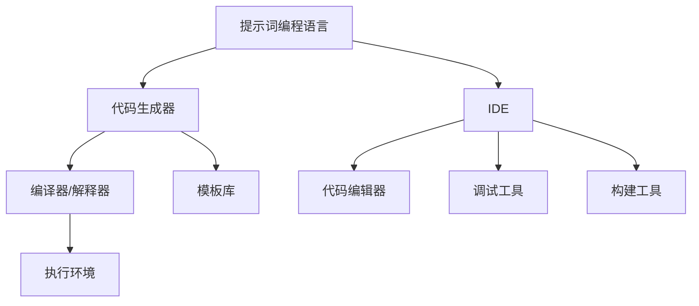

                 

### 第一部分: 《提示词编程语言的IDE设计构想》核心概念与联系

> **关键词**：提示词编程语言，IDE设计，代码生成，自然语言处理，生成对抗网络

> **摘要**：
提示词编程语言是一种创新的编程方式，它通过提示词来引导开发者编写代码，大幅度提高了开发效率。集成开发环境（IDE）作为软件开发的核心工具，对于提示词编程语言的应用有着重要影响。本文将详细探讨提示词编程语言的核心概念、IDE设计的关键要素，以及两者之间的联系，旨在为未来的IDE设计提供有价值的构想。

---

在当今快速发展的技术时代，编程语言的创新与应用已经成为推动软件工程进步的重要驱动力。提示词编程语言作为一种新兴的编程范式，通过提供简明的提示词来生成复杂的代码，正逐渐改变传统的编程模式。这种编程方式不仅简化了代码编写过程，还提高了开发效率，使得开发者能够更加专注于解决业务问题，而非陷入繁琐的语法细节之中。

集成开发环境（IDE）是现代软件开发不可或缺的工具，它为开发者提供了代码编辑、编译、调试和构建等一系列功能。随着编程范式的演变，IDE也需要不断进化，以适应新的编程需求。对于提示词编程语言而言，IDE的设计至关重要，它不仅需要支持传统的编程功能，还要能够有效利用提示词编程的特性，提供更加智能化和自动化的编程支持。

#### 核心概念

**1. 提示词编程语言（Prompt-based Programming Languages）**

提示词编程语言是一种通过提示词来引导开发者编写代码的编程语言。提示词通常是一个简短的描述性句子，它为开发者提供了编写代码的指导。这种编程方式的核心思想是将代码生成的过程从手动编写转变为自动生成，从而提高开发效率。

- **定义**：提示词编程语言是一种通过提示词（prompts）引导开发者编写代码的语言，提示词可被视为一种代码生成器。
- **关联**：与自然语言处理（NLP）和生成对抗网络（GAN）等技术紧密相关。

在提示词编程语言中，开发者不需要了解底层代码细节，只需提供简单的提示词，即可生成对应的代码。这种编程方式不仅降低了编程的门槛，还使得编程变得更加直观和高效。

**2. IDE（集成开发环境）**

IDE是软件开发过程中不可或缺的工具，它为开发者提供了一个集成化的开发平台，通常包含代码编辑器、编译器、调试器和构建工具等。IDE的设计对于提升开发效率、减少错误和提高代码质量有着至关重要的作用。

- **定义**：IDE（Integrated Development Environment）是一种软件开发环境，通常包含代码编辑器、编译器、调试器和构建工具等。
- **关联**：IDE的设计对于提示词编程语言的应用至关重要。一个优秀的IDE需要能够充分支持提示词编程的特点，提供智能提示、代码自动生成和优化等功能。

**3. 代码生成（Code Generation）**

代码生成是提示词编程语言的核心功能之一。通过提示词，开发者可以快速生成复杂的代码片段，而无需手动编写每一行代码。这种自动化的代码生成过程不仅提高了开发效率，还减少了开发错误。

- **定义**：代码生成是指自动生成代码的过程，通过输入特定的提示或模板来生成代码。
- **关联**：代码生成是提示词编程语言的核心功能，它依赖于自然语言处理（NLP）和生成对抗网络（GAN）等技术来实现。

#### 架构

提示词编程语言的IDE设计需要考虑多个关键组件的协同工作。以下是一个简化的架构图，展示了这些组件之间的关系。

- **代码生成器**：负责根据提示词生成代码。
- **编译器/解释器**：将生成的代码转换为可执行的形式。
- **代码编辑器**：提供代码编写和编辑的界面。
- **调试工具**：帮助开发者调试代码中的错误。
- **构建工具**：自动化构建和打包代码。
- **模板库**：存储预定义的代码模板，便于快速生成代码。
- **执行环境**：运行生成的代码并提供反馈。

#### 提示词编程语言与IDE的紧密联系

提示词编程语言和IDE之间的紧密联系在于它们共同的目标——提升开发效率和代码质量。提示词编程语言通过自动化代码生成，减少了手动编写代码的工作量，而IDE则提供了智能化的工具和环境，使得开发者能够更加高效地使用提示词编程语言。

- **智能提示**：IDE可以为开发者提供基于提示词的智能提示，帮助开发者快速选择合适的代码片段。
- **代码自动生成**：IDE可以利用代码生成器，根据提示词自动生成代码，减少手动编写的工作量。
- **代码优化**：IDE可以对生成的代码进行优化，提高代码的运行效率和可维护性。
- **反馈和调试**：IDE提供调试工具，帮助开发者快速定位和修复代码中的错误。

总的来说，提示词编程语言和IDE的结合，为开发者提供了一个更加智能和高效的编程环境，不仅提高了开发效率，还提升了代码质量。

---

这一部分详细介绍了提示词编程语言和IDE的核心概念、关键组件及其之间的联系。在下一部分，我们将深入探讨提示词编程语言的核心算法原理，包括自动编码器和生成对抗网络的工作机制和实现方式。通过这些核心算法的讲解，我们将为后续的IDE设计提供理论基础。

---

> **作者**：AI天才研究院/AI Genius Institute & 禅与计算机程序设计艺术 /Zen And The Art of Computer Programming

---

[下一篇：《提示词编程语言的IDE设计构想》第二部分: 提示词编程语言的核心算法原理讲解](#第二部分-%e6%8f%90%e7%a4%ba%e8%af%8d%e7%bc%96%e7%a8%8b%e8%af%ad%e8%a8%80%e7%9a%84%e6%a0%b8%e5%bf%83%e7%ae%97%e6%b3%95%e5%8e%9f%e7%90%86%e8%ae%b2%e8%ae%ba)

