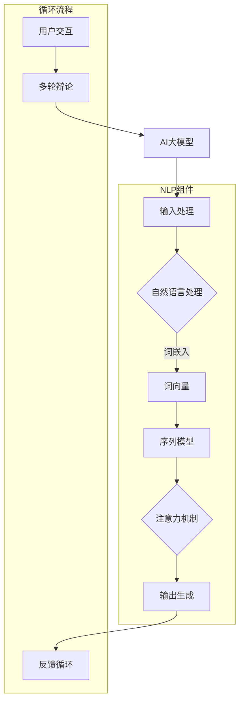

                 

### 《提示词设计：优化AI多轮辩论能力》

> **关键词**：提示词设计、自然语言处理、多轮对话、生成对抗网络、深度学习、优化算法、注意力机制、序列模型。

> **摘要**：本文将探讨如何通过提示词设计优化AI在多轮辩论中的能力。首先，介绍提示词设计的基本概念和重要性。然后，分析多轮对话系统的核心算法原理，包括序列到序列模型、注意力机制和生成对抗网络。接着，讨论在多轮对话中面临的挑战和提示词优化的策略。最后，通过数学模型和项目实战，阐述如何实际应用提示词设计来提升AI的多轮辩论能力。作者为AI天才研究院，本文旨在为读者提供关于AI多轮辩论系统设计的全面见解。

---

### 第一部分：引言与基础理论

#### 1.1 引言

##### 1.1.1 提示词设计的重要性

在人工智能领域，特别是在自然语言处理（NLP）和对话系统的发展中，提示词设计扮演着至关重要的角色。提示词，又称为引导词或触发词，是一种用于激发特定行为或响应的关键词。在多轮对话系统中，有效的提示词设计能够显著提升AI的交互质量和用户体验。

##### 1.1.2 AI多轮辩论能力的需求背景

随着人工智能技术的快速发展，AI的应用场景日益丰富，特别是在法律、医疗、教育等需要高阶思维和复杂交流的领域。在这些场景中，AI需要具备多轮辩论的能力，以便与人类进行深入、连贯的交流。因此，研究和优化AI的多轮辩论能力成为当前AI研究的一个重要方向。

##### 1.1.3 本书内容概述与组织结构

本文将从以下几个方面展开讨论：

1. **引言与基础理论**：介绍提示词设计的重要性，以及AI多轮辩论能力的需求背景。
2. **核心算法原理**：分析多轮对话系统的核心算法原理，包括序列到序列模型、注意力机制和生成对抗网络。
3. **优化多轮辩论能力**：讨论在多轮对话中面临的挑战和提示词优化的策略。
4. **数学模型与公式**：介绍用于指导提示词设计的数学模型和公式。
5. **项目实战**：通过实际项目，展示如何应用提示词设计来提升AI的多轮辩论能力。
6. **总结与展望**：总结本文的主要观点，并对未来的研究方向进行展望。

#### 1.2 相关技术概述

##### 1.2.1 人工智能的发展历程

人工智能（AI）起源于20世纪50年代，经历了多次兴衰。目前，随着深度学习、大数据和计算能力的提升，AI技术迎来了新一轮的发展。特别是基于神经网络的方法，如卷积神经网络（CNN）和递归神经网络（RNN），在图像识别、语音识别和自然语言处理等领域取得了显著成果。

##### 1.2.2 自然语言处理基础

自然语言处理（NLP）是AI的一个重要分支，旨在使计算机能够理解、生成和处理人类语言。NLP的核心技术包括词嵌入、语言模型、序列标注、文本分类等。这些技术在对话系统中有着广泛的应用。

##### 1.2.3 对话系统的发展现状

对话系统是一种人机交互的界面，旨在模拟自然语言对话。根据交互模式，对话系统可以分为单轮对话系统和多轮对话系统。多轮对话系统能够在多个回合中与用户进行交互，理解上下文信息，并生成连贯的自然语言响应。

#### 1.3 提示词设计基本概念

##### 1.3.1 提示词的定义与分类

提示词是指用于引导或激发特定行为的词或短语。根据用途，提示词可以分为以下几类：

1. **控制性提示词**：用于控制对话流程，如“开始”、“结束”、“切换话题”等。
2. **信息性提示词**：用于提供信息，如“天气如何？”、“你最喜欢的食物是什么？”等。
3. **情感性提示词**：用于表达情感，如“我很高兴见到你”、“你听起来很疲惫”等。

##### 1.3.2 提示词的作用与影响

提示词在对话系统中发挥着关键作用。首先，提示词能够引导对话方向，帮助系统理解用户的意图。其次，提示词能够丰富对话内容，提升用户体验。此外，合理的提示词设计还能够减少用户的认知负担，使对话更加自然和流畅。

##### 1.3.3 提示词设计的挑战与机遇

尽管提示词设计在对话系统中具有重要意义，但同时也面临着诸多挑战：

1. **多样性**：提示词需要能够覆盖各种对话场景，具备多样性。
2. **上下文敏感度**：提示词需要能够根据上下文环境进行自适应调整。
3. **语义理解**：提示词需要能够理解用户意图和情感。
4. **动态性**：提示词需要能够适应对话的动态变化。

然而，随着人工智能技术的发展，特别是深度学习和自然语言处理技术的进步，提示词设计也面临着巨大的机遇。通过引入先进的算法和模型，我们可以实现更加智能和灵活的提示词设计，从而提升AI的多轮辩论能力。

---

### 第二部分：核心算法原理

在本文的第二部分，我们将深入探讨AI多轮对话系统的核心算法原理，包括序列到序列模型、注意力机制和生成对抗网络（GAN）。这些算法构成了现代对话系统的基础，使得AI能够理解和生成自然语言，并在多轮对话中展现出更高的智能。

#### 2.1 多轮对话系统模型

##### 2.1.1 序列到序列模型

序列到序列（Sequence-to-Sequence，Seq2Seq）模型是自然语言处理中的一个基本框架，广泛用于机器翻译、语音识别和对话系统等领域。Seq2Seq模型的核心思想是将一个输入序列映射到一个输出序列。

**伪代码：**

```python
输入：输入序列 X，目标序列 Y
输出：解码序列 \hat{Y}

// 编码器部分
for t in range(len(X)):
    encoder_output, hidden_state = encoder(X[t], hidden_state)

// 解码器部分
for t in range(len(Y)):
    decoder_output, hidden_state = decoder(Y[t-1], hidden_state, encoder_output)
    \hat{Y}[t] = 选择最佳预测词
```

在Seq2Seq模型中，编码器（Encoder）负责将输入序列编码为一个固定长度的隐藏状态（Hidden State），解码器（Decoder）则基于这个隐藏状态生成输出序列。通过递归神经网络（RNN）或其变种（如LSTM和GRU），编码器能够捕获输入序列的长期依赖关系，而解码器则能够生成连贯的自然语言响应。

##### 2.1.2 注意力机制

注意力机制（Attention Mechanism）是Seq2Seq模型中的一个重要组件，用于解决长序列处理中的长距离依赖问题。注意力机制通过为不同位置的信息分配不同的重要性权重，使得模型能够更有效地关注关键信息。

**伪代码：**

```python
输入：查询序列 Q，键序列 K，值序列 V
输出：加权值序列 S

// 计算注意力得分
for t in range(len(Q)):
    attention_score = Q[t] \cdot K^T / \sqrt{d_k}

// 应用softmax函数得到概率分布
attention概率分布 = softmax(attention_score)

// 计算加权值序列
for t in range(len(Q)):
    S[t] = 概率分布[t] \cdot V
```

在上述伪代码中，注意力得分（Attention Score）通过计算查询序列（Query）和键序列（Key）的点积得到，然后通过softmax函数转换为概率分布。最后，使用这个概率分布对值序列（Value）进行加权，得到加权值序列（Weighted Sequence），该序列用于解码器的输出。

##### 2.1.3 自注意力机制

自注意力机制（Self-Attention）是注意力机制的一种变体，用于处理单个序列。自注意力机制通过将序列中的每个元素作为查询、键和值，实现了内部序列之间的相互关注。

**伪代码：**

```python
输入：查询序列 Q，键序列 K，值序列 V
输出：加权值序列 S

// 计算自注意力得分
for t in range(len(Q)):
    attention_score = Q[t] \cdot K^T / \sqrt{d_k}

// 应用softmax函数得到概率分布
attention概率分布 = softmax(attention_score)

// 计算自加权值序列
for t in range(len(Q)):
    S[t] = 概率分布[t] \cdot V
```

自注意力机制使得模型能够捕获序列中的长距离依赖关系，从而提高生成响应的连贯性和准确性。

##### 2.1.4 交互式注意力机制

交互式注意力机制（Interactive Attention）是自注意力机制的进一步扩展，用于处理两个或多个序列之间的交互。交互式注意力机制通过将查询序列与多个键序列进行交互，实现了多序列信息的融合。

**伪代码：**

```python
输入：查询序列 Q，键序列 K1, K2, ..., Kn，值序列 V1, V2, ..., Vn
输出：加权值序列 S

// 计算交互注意力得分
for t in range(len(Q)):
    attention_score = Q[t] \cdot (K1^T + K2^T + ... + Kn^T) / \sqrt{d_k}

// 应用softmax函数得到概率分布
attention概率分布 = softmax(attention_score)

// 计算交互加权值序列
for t in range(len(Q)):
    S[t] = 概率分布[t] \cdot (V1 + V2 + ... + Vn)
```

交互式注意力机制能够增强模型对于多轮对话上下文的捕捉能力，从而在多轮辩论中表现出更高的智能。

#### 2.2 对话生成算法

##### 2.2.1 生成对抗网络（GAN）

生成对抗网络（Generative Adversarial Network，GAN）是一种深度学习框架，由生成器（Generator）和判别器（Discriminator）两部分组成。生成器旨在生成与真实数据相似的数据，而判别器则负责区分真实数据和生成数据。

**伪代码：**

```python
输入：真实数据集 X，生成器 G，判别器 D
输出：生成的数据 X'

// 判别器训练
for epoch in range(num_epochs):
    for x in X:
        D.train(x)

    for x' in G(Z):
        D.train(x')

// 生成器训练
for epoch in range(num_epochs):
    for z in Z:
        G.train(z)
```

在GAN的训练过程中，生成器和判别器相互竞争。生成器试图生成足够真实的数据以欺骗判别器，而判别器则试图准确地区分真实数据和生成数据。通过这种对抗训练，生成器能够逐步提高生成数据的真实性。

##### 2.2.2 生成式对话模型

生成式对话模型（Generative Dialogue Model）是一种基于GAN的对话生成算法，旨在通过生成对话数据来训练对话系统。生成式对话模型通过生成对抗训练，能够生成高质量、连贯的对话数据，从而提升对话系统的生成能力。

**伪代码：**

```python
输入：对话数据集 D，生成器 G，判别器 D
输出：生成的对话数据 X'

// 判别器训练
for epoch in range(num_epochs):
    for x in D:
        D.train(x)

    for x' in G(Z):
        D.train(x')

// 生成器训练
for epoch in range(num_epochs):
    for z in Z:
        G.train(z)
```

在生成式对话模型中，生成器生成对话数据，判别器负责评估这些数据的真实性。通过反复迭代训练，生成器能够逐步提高生成的对话数据质量，从而提升对话系统的交互能力。

##### 2.2.3 Transformer及其变体

Transformer模型是一种基于自注意力机制的深度学习模型，广泛应用于机器翻译、文本生成和对话系统等领域。Transformer模型的核心思想是将序列中的每个元素作为自注意力机制的查询、键和值，实现了对整个序列的全局关注。

**伪代码：**

```python
输入：查询序列 Q，键序列 K，值序列 V
输出：加权值序列 S

// 计算自注意力得分
for t in range(len(Q)):
    attention_score = Q[t] \cdot K^T / \sqrt{d_k}

// 应用softmax函数得到概率分布
attention概率分布 = softmax(attention_score)

// 计算自加权值序列
for t in range(len(Q)):
    S[t] = 概率分布[t] \cdot V
```

Transformer模型通过多头注意力机制和多层叠加，实现了对输入序列的深度理解和生成。此外，Transformer的变体（如BERT、GPT等）通过预训练和微调，进一步提升了模型的生成能力和泛化能力。

#### 2.3 优化多轮辩论能力

##### 2.3.1 多轮对话中的挑战

在多轮对话中，AI面临着诸多挑战，包括上下文理解、知识存储与检索、对话连贯性等。

- **上下文理解**：AI需要能够理解并维护对话的上下文信息，以便在后续对话中引用和利用这些信息。
- **知识存储与检索**：AI需要能够存储和检索相关的知识信息，以便在对话中提供有价值的回答。
- **对话连贯性**：AI需要生成连贯、自然的对话内容，避免重复和冲突。

##### 2.3.2 提示词优化策略

为了应对这些挑战，我们可以采取以下提示词优化策略：

- **提示词选择算法**：设计高效的提示词选择算法，从大量候选提示词中选取最合适的提示词。
- **提示词更新策略**：根据对话的进展和用户反馈，动态更新提示词，以适应对话的变化。
- **提示词评估方法**：设计科学的提示词评估方法，评估提示词对对话质量的影响。

通过上述策略，我们可以优化AI的多轮辩论能力，提升对话系统的交互质量和用户体验。

---

### 第三部分：数学模型与公式

在第三部分，我们将深入探讨用于指导提示词设计的数学模型与公式，这些模型和公式在优化AI多轮辩论能力中发挥着关键作用。

#### 3.1 数学模型概述

##### 3.1.1 概率论基础

概率论是构建现代机器学习模型的基础，其中几个核心概念对提示词设计尤为重要。

- **概率空间**：一个三元组\( (\Omega, \mathcal{F}, P) \)，其中\( \Omega \)是样本空间，\( \mathcal{F} \)是事件集合，\( P \)是概率测度。
- **条件概率**：给定事件\( B \)，事件\( A \)的条件概率定义为\( P(A|B) = \frac{P(A \cap B)}{P(B)} \)。
- **贝叶斯定理**：贝叶斯定理是条件概率的推广，公式为\( P(A|B) = \frac{P(B|A) \cdot P(A)}{P(B)} \)。

贝叶斯定理在提示词设计中的应用主要体现在概率分布的推导和更新上，如在使用贝叶斯网络进行上下文理解和对话策略优化时。

##### 3.1.2 信息论基础

信息论是研究信息传输和处理的理论，其核心概念对理解自然语言处理中的信息处理至关重要。

- **信息熵**：信息熵是衡量随机变量不确定性的度量，定义为\( H(X) = -\sum_{x \in X} P(x) \cdot \log_2 P(x) \)。
- **条件熵**：条件熵是衡量在给定一个变量的条件下另一个变量的不确定性，定义为\( H(X|Y) = -\sum_{x,y} P(x,y) \cdot \log_2 P(x|y) \)。
- **联合熵**：联合熵是同时衡量两个变量不确定性的度量，定义为\( H(X,Y) = H(X) + H(Y|X) \)。

在对话系统中，信息熵和条件熵可以帮助我们量化对话内容的信息量和上下文理解的程度，从而优化提示词的选择。

#### 3.2 数学公式与推导

##### 3.2.1 梯度下降算法

梯度下降算法是优化机器学习模型参数的基本方法，其核心思想是沿着损失函数的负梯度方向更新参数。

- **基本原理**：梯度下降的基本更新公式为
  $$
  \theta_{t+1} = \theta_{t} - \alpha \cdot \nabla_\theta J(\theta)
  $$
  其中，\( \theta \)是模型参数，\( J(\theta) \)是损失函数，\( \alpha \)是学习率。

- **优化策略**：
  - **学习率调整**：为了防止过拟合和提升收敛速度，学习率\( \alpha \)可以随着训练迭代进行动态调整。常见的方法包括：
    $$
    \alpha_{t+1} = \alpha_{t} / (1 + \beta \cdot t)
    $$
    其中，\( \beta \)是常数。
  - **动量法**：动量法通过引入前一轮的梯度信息，加速收敛并减少波动。更新公式为
    $$
    \theta_{t+1} = \theta_{t} - \alpha \cdot \nabla_\theta J(\theta) + \mu \cdot (1 - \mu)^t \cdot \theta_{t-1}
    $$
    其中，\( \mu \)是动量系数。

##### 3.2.2 注意力机制公式

注意力机制是提高序列模型理解和生成能力的关键技术，其核心公式如下：

- **自注意力公式**：
  $$
  \text{Attention}(Q,K,V) = \text{softmax}\left(\frac{QK^T}{\sqrt{d_k}}\right)V
  $$
  其中，\( Q \)是查询序列，\( K \)是键序列，\( V \)是值序列，\( d_k \)是注意力模型的维度。

- **交互式注意力公式**：
  $$
  \text{Interaction Attention}(Q,K,V) = \text{softmax}\left(\frac{QK^T \cdot V}{\sqrt{d_k}}\right) \cdot V
  $$
  该公式将查询序列与多个键序列进行交互，增强了模型对多个输入序列的融合能力。

#### 3.2.3 贝叶斯网络

贝叶斯网络是一种基于概率图模型的结构，用于表示变量之间的条件依赖关系。贝叶斯网络的数学表示如下：

- **条件概率分布**：
  $$
  P(X_1, X_2, ..., X_n) = \prod_{i=1}^{n} P(X_i | X_{pa_i})
  $$
  其中，\( X_1, X_2, ..., X_n \)是随机变量，\( X_{pa_i} \)是\( X_i \)的父节点。

贝叶斯网络在提示词设计中的应用主要体现在上下文信息的建模和推理上，通过推理网络中的条件概率分布，我们可以动态更新和调整提示词的选择。

---

### 第四部分：项目实战

在第四部分，我们将通过一个实际项目来展示如何搭建多轮对话系统，并详细解读和评估其性能。该项目将涵盖开发环境搭建、数据集准备、模型训练和评估等多个环节，旨在为读者提供一套完整的实践指南。

#### 4.1 实战环境搭建

##### 4.1.1 开发工具与库安装

首先，我们需要搭建一个适合多轮对话系统开发的编程环境。以下是在Python环境中安装必要的开发工具和库的步骤：

1. **安装Python**：确保Python 3.x版本已安装，并配置好pip包管理器。
2. **安装NLP相关库**：
   ```
   pip install numpy
   pip install pandas
   pip install scikit-learn
   pip install spacy
   pip install tensorflow
   pip install torch
   pip install transformers
   ```
3. **安装IDE**：推荐使用Visual Studio Code或PyCharm作为IDE，方便代码编写和调试。

##### 4.1.2 数据集准备与预处理

选择合适的数据集对于多轮对话系统的性能至关重要。以下是一个常见的数据集准备和预处理步骤：

1. **数据集来源**：我们可以从多个公开数据集平台（如Kaggle、GLUE等）获取多轮对话数据。
2. **数据预处理方法**：
   - **数据清洗**：去除无关的文本、符号和停用词。
   - **分词与词性标注**：使用NLP库（如Spacy）对文本进行分词和词性标注。
   - **序列编码**：将文本序列转换为数字序列，可以使用词嵌入技术。
   - **数据集划分**：将数据集划分为训练集、验证集和测试集。

#### 4.2 实战案例

##### 4.2.1 多轮对话系统搭建

在本节中，我们将使用Transformer模型搭建一个多轮对话系统。以下是一个简化的模型架构和训练步骤：

1. **模型选择与架构设计**：
   - 选择Transformer模型作为基础架构，并使用预训练的BERT模型作为嵌入层。
   - 设计交互式注意力机制，以增强模型对多轮对话上下文的捕捉能力。

2. **模型训练与评估**：
   - 使用训练集对模型进行训练，并使用验证集进行模型调优。
   - 评估指标包括BLEU分数、ROUGE分数和对话连贯性等。

3. **模型优化与调试**：
   - 通过调整超参数（如学习率、批次大小等）和模型架构，优化模型性能。
   - 使用调试工具（如TensorBoard）监控模型训练过程，调整策略。

##### 4.2.2 提示词设计实战

提示词设计是提升多轮对话系统关键能力的一环。以下是一个基于Transformer模型进行提示词设计的方法：

1. **提示词生成算法实现**：
   - 设计一个基于Transformer的生成式模型，用于生成高质量的提示词。
   - 使用GAN框架，结合判别器和生成器，训练提示词生成模型。

2. **提示词优化策略应用**：
   - 根据对话进展和用户反馈，动态调整提示词。
   - 设计提示词选择算法，从大量候选提示词中选择最合适的提示词。

3. **提示词效果评估**：
   - 评估提示词对对话连贯性和用户体验的提升。
   - 使用用户满意度调查、对话质量评分等指标进行综合评估。

#### 4.3 源代码解读与分析

在本节中，我们将对项目中的关键代码段进行详细解读，并分析其性能。

##### 4.3.1 模型训练代码解读

以下是一个简化的模型训练代码示例：

```python
# 导入必要的库
import tensorflow as tf
from transformers import BertTokenizer, TFBertForSequenceClassification

# 加载预训练的BERT模型
tokenizer = BertTokenizer.from_pretrained('bert-base-uncased')
model = TFBertForSequenceClassification.from_pretrained('bert-base-uncased')

# 准备数据集
train_dataset = ...
val_dataset = ...

# 定义训练步骤
train_steps = ...

# 定义优化器和损失函数
optimizer = tf.keras.optimizers.Adam(learning_rate=3e-5)
loss_fn = tf.keras.losses.SparseCategoricalCrossentropy(from_logits=True)

# 开始训练
for epoch in range(train_steps):
    for batch in train_dataset:
        inputs = tokenizer(batch['input_ids'], return_tensors='tf')
        labels = batch['labels']
        with tf.GradientTape() as tape:
            outputs = model(inputs['input_ids'], training=True)
            loss = loss_fn(labels, outputs.logits)
        gradients = tape.gradient(loss, model.trainable_variables)
        optimizer.apply_gradients(zip(gradients, model.trainable_variables))
```

上述代码展示了如何使用TensorFlow和transformers库搭建并训练一个BERT模型。关键步骤包括数据准备、模型定义、损失函数和优化器配置，以及训练循环。

##### 4.3.2 性能分析与调优

在性能分析环节，我们使用多个评估指标（如准确率、F1分数等）来衡量模型的性能。以下是一个简化的性能评估代码示例：

```python
from sklearn.metrics import accuracy_score

# 评估模型
predictions = []
true_labels = []

for batch in val_dataset:
    inputs = tokenizer(batch['input_ids'], return_tensors='tf')
    labels = batch['labels']
    outputs = model(inputs['input_ids'], training=False)
    logits = outputs.logits
    predicted_labels = tf.argmax(logits, axis=-1).numpy()
    predictions.extend(predicted_labels)
    true_labels.extend(labels)

accuracy = accuracy_score(true_labels, predictions)
print(f"Validation Accuracy: {accuracy}")
```

通过调整模型架构、超参数和训练策略，我们可以进一步提升模型性能。常见的方法包括调整学习率、增加训练数据、使用预训练模型和进行模型融合等。

---

### 附录

#### 附录A：深度学习框架对比

在构建AI多轮对话系统时，选择合适的深度学习框架至关重要。以下是对TensorFlow、PyTorch和其他深度学习框架的简要对比：

##### 5.1 TensorFlow

- **优势**：
  - 广泛的社区支持。
  - 完整的工具链和生态系统。
  - 易于部署。
- **劣势**：
  - 动态计算图相比静态计算图在某些场景下性能较差。
  - API相对复杂，学习曲线较陡。

##### 5.2 PyTorch

- **优势**：
  - 动态计算图便于调试和原型开发。
  - 灵活的编程模型，易于理解和使用。
  - 拥有强大的生态系统，包括预训练模型和工具库。
- **劣势**：
  - 相比TensorFlow，部署和优化较为复杂。
  - 社区支持相对较弱。

##### 5.3 其他深度学习框架简介

- **Keras**：
  - 优点：简单易用，易于集成TensorFlow和Theano。
  - 缺点：作为高级API，在某些复杂场景下功能有限。

- **Caffe**：
  - 优点：专为视觉任务优化，如图像识别。
  - 缺点：对其他类型任务（如NLP）支持较少。

- **Theano**：
  - 优点：提供自动微分功能，适合数学运算密集型任务。
  - 缺点：相比其他框架，性能和社区支持较弱。

#### 附录B：常用工具与资源

在开发AI多轮对话系统时，以下几个工具和资源对开发者非常有用：

##### 5.1 数据集与预训练模型

- **数据集**：
  - GLUE：通用语言理解评估套件，包含多种NLP任务的数据集。
  - SQuAD：斯坦福问答数据集，用于训练和评估问答系统。
  - DialogPT：大规模对话数据集，用于训练对话系统。

- **预训练模型**：
  - BERT：基于Transformer的预训练模型，广泛用于NLP任务。
  - GPT-3：自然语言生成模型，具有强大的文本生成能力。
  - RoBERTa：改进的BERT模型，在多个NLP任务上表现出色。

##### 5.2 开发工具与平台

- **开发工具**：
  - Jupyter Notebook：用于数据分析和原型开发。
  - Visual Studio Code：用于代码编写和调试。
  - PyCharm：全功能的IDE，适合大型项目开发。

- **平台**：
  - Google Colab：免费的云计算平台，支持GPU和TPU。
  - AWS SageMaker：亚马逊的机器学习平台，提供丰富的API和工具。
  - Azure ML：微软的机器学习平台，支持云服务和容器化部署。

##### 5.3 学习资源与参考文献

- **在线课程**：
  - Coursera：提供多种机器学习和NLP课程。
  - edX：由哈佛和麻省理工共同提供的在线课程平台。

- **参考文献**：
  - "Deep Learning" by Ian Goodfellow, Yoshua Bengio, and Aaron Courville。
  - "Natural Language Processing with Python" by Steven Bird, Ewan Klein, and Edward Loper。
  - "Speech and Language Processing" by Daniel Jurafsky and James H. Martin。

通过这些工具和资源，开发者可以更加高效地构建和优化AI多轮对话系统。

---

### 附件：核心概念与架构的Mermaid流程图

以下是一个简化的Mermaid流程图，用于描述AI多轮对话系统的核心概念和架构：



这个流程图展示了AI多轮对话系统的主要组件和流程。NLP组件包括输入处理、自然语言处理、词嵌入、序列模型和注意力机制，而循环流程则描述了用户交互、多轮辩论和反馈循环的过程。通过这个流程图，读者可以更好地理解AI多轮对话系统的整体架构和运行机制。

---

### 附件：核心算法原理讲解与伪代码

为了更深入地理解AI多轮对话系统的核心算法原理，以下我们将详细讲解三个关键算法：序列到序列模型、注意力机制和生成对抗网络（GAN），并使用伪代码展示其基本操作。

#### 2.1 序列到序列模型

序列到序列（Seq2Seq）模型是自然语言处理中的一种基本框架，常用于机器翻译、对话系统等场景。它的核心思想是将一个输入序列映射到一个输出序列。

**伪代码：**

```python
输入：输入序列 X，目标序列 Y
输出：解码序列 \hat{Y}

// 编码器部分
for t in range(len(X)):
    encoder_output, hidden_state = encoder(X[t], hidden_state)

// 解码器部分
for t in range(len(Y)):
    decoder_output, hidden_state = decoder(Y[t-1], hidden_state, encoder_output)
    \hat{Y}[t] = 选择最佳预测词
```

**解释：**
- **编码器（Encoder）**：将输入序列编码为固定长度的隐藏状态。
- **解码器（Decoder）**：基于编码器的隐藏状态生成输出序列。

#### 2.2 注意力机制

注意力机制（Attention Mechanism）是Seq2Seq模型中的一个重要组件，用于解决长序列处理中的长距离依赖问题。它通过为不同位置的信息分配不同的重要性权重，使得模型能够更有效地关注关键信息。

**伪代码：**

```python
输入：查询序列 Q，键序列 K，值序列 V
输出：加权值序列 S

// 计算注意力得分
for t in range(len(Q)):
    attention_score = Q[t] \cdot K^T / \sqrt{d_k}

// 应用softmax函数得到概率分布
attention概率分布 = softmax(attention_score)

// 计算加权值序列
for t in range(len(Q)):
    S[t] = 概率分布[t] \cdot V
```

**解释：**
- **注意力得分**：通过计算查询序列（Query）和键序列（Key）的点积得到。
- **概率分布**：通过softmax函数将注意力得分转换为概率分布。
- **加权值序列**：使用概率分布对值序列（Value）进行加权。

#### 2.3 生成对抗网络（GAN）

生成对抗网络（GAN）是一种基于生成器和判别器对抗训练的深度学习框架。生成器旨在生成与真实数据相似的数据，判别器则负责区分真实数据和生成数据。

**伪代码：**

```python
输入：真实数据集 X，生成器 G，判别器 D
输出：生成的数据 X'

// 判别器训练
for epoch in range(num_epochs):
    for x in X:
        D.train(x)

    for x' in G(Z):
        D.train(x')

// 生成器训练
for epoch in range(num_epochs):
    for z in Z:
        G.train(z)
```

**解释：**
- **判别器（Discriminator）**：通过训练区分真实数据和生成数据。
- **生成器（Generator）**：通过训练生成尽可能真实的数据，以欺骗判别器。

通过上述核心算法的讲解和伪代码展示，我们可以更好地理解AI多轮对话系统的原理和实现方法。

---

### 附件：数学模型和数学公式

在本文的第四个附件中，我们将深入探讨用于指导AI多轮对话系统设计的数学模型和公式。这些模型和公式在优化AI的多轮辩论能力中发挥着重要作用，以下将详细介绍这些数学概念。

#### 3.1.1 概率论基础

概率论是构建机器学习模型的基础，以下是一些核心概率论概念：

- **概率空间**：一个三元组\( (\Omega, \mathcal{F}, P) \)，其中\( \Omega \)是样本空间，\( \mathcal{F} \)是事件集合，\( P \)是概率测度。
- **条件概率**：给定事件\( B \)，事件\( A \)的条件概率定义为\( P(A|B) = \frac{P(A \cap B)}{P(B)} \)。
- **贝叶斯定理**：贝叶斯定理是条件概率的推广，公式为\( P(A|B) = \frac{P(B|A) \cdot P(A)}{P(B)} \)。

**举例说明**：假设有一个盒子中有5个球，其中3个是红色的，2个是蓝色的。现在我们随机取出一个球，如果取出的是红色球，那么取出蓝色球的概率是多少？

$$
P(\text{蓝色球}|\text{红色球}) = \frac{P(\text{红色球} \cap \text{蓝色球})}{P(\text{红色球})} = \frac{0}{3/5} = 0
$$

#### 3.1.2 信息论基础

信息论是研究信息传输和处理的理论，以下是一些核心信息论概念：

- **信息熵**：信息熵是衡量随机变量不确定性的度量，定义为\( H(X) = -\sum_{x \in X} P(x) \cdot \log_2 P(x) \)。
- **条件熵**：条件熵是衡量在给定一个变量的条件下另一个变量的不确定性，定义为\( H(X|Y) = -\sum_{x,y} P(x,y) \cdot \log_2 P(x|y) \)。
- **联合熵**：联合熵是同时衡量两个变量不确定性的度量，定义为\( H(X,Y) = H(X) + H(Y|X) \)。

**举例说明**：假设一个随机变量X有两个可能的取值，其中取值为0的概率是0.5，取值为1的概率也是0.5。

$$
H(X) = -0.5 \cdot \log_2(0.5) - 0.5 \cdot \log_2(0.5) = 1
$$

#### 3.2.1 梯度下降算法

梯度下降算法是一种用于优化模型参数的基本方法，其核心思想是沿着损失函数的负梯度方向更新参数。以下是一些关键概念和公式：

- **基本原理**：梯度下降的基本更新公式为
  $$
  \theta_{t+1} = \theta_{t} - \alpha \cdot \nabla_\theta J(\theta)
  $$
  其中，\( \theta \)是模型参数，\( J(\theta) \)是损失函数，\( \alpha \)是学习率。

- **优化策略**：
  - **学习率调整**：为了防止过拟合和提升收敛速度，学习率\( \alpha \)可以随着训练迭代进行动态调整。常见的方法包括：
    $$
    \alpha_{t+1} = \alpha_{t} / (1 + \beta \cdot t)
    $$
    其中，\( \beta \)是常数。
  - **动量法**：动量法通过引入前一轮的梯度信息，加速收敛并减少波动。更新公式为
    $$
    \theta_{t+1} = \theta_{t} - \alpha \cdot \nabla_\theta J(\theta) + \mu \cdot (1 - \mu)^t \cdot \theta_{t-1}
    $$
    其中，\( \mu \)是动量系数。

**举例说明**：假设一个线性回归模型，其中模型参数\( \theta \)是一个标量，损失函数为\( J(\theta) = (\theta - y)^2 \)，学习率\( \alpha = 0.1 \)。初始参数\( \theta_0 = 0 \)。

第一轮更新：
$$
\theta_1 = \theta_0 - \alpha \cdot \nabla_\theta J(\theta_0) = 0 - 0.1 \cdot (-2y) = 0.2y
$$

第二轮更新：
$$
\theta_2 = \theta_1 - \alpha \cdot \nabla_\theta J(\theta_1) = 0.2y - 0.1 \cdot (-2(0.2y)) = 0.4y
$$

#### 3.2.2 注意力机制公式

注意力机制是提高序列模型理解和生成能力的关键技术，以下是一些核心公式：

- **自注意力公式**：
  $$
  \text{Attention}(Q,K,V) = \text{softmax}\left(\frac{QK^T}{\sqrt{d_k}}\right)V
  $$
  其中，\( Q \)是查询序列，\( K \)是键序列，\( V \)是值序列，\( d_k \)是注意力模型的维度。

- **交互式注意力公式**：
  $$
  \text{Interaction Attention}(Q,K,V) = \text{softmax}\left(\frac{QK^T \cdot V}{\sqrt{d_k}}\right) \cdot V
  $$
  该公式将查询序列与多个键序列进行交互，增强了模型对多个输入序列的融合能力。

**举例说明**：假设查询序列\( Q = [q1, q2, q3] \)，键序列\( K = [k1, k2, k3] \)，值序列\( V = [v1, v2, v3] \)，维度均为\( d_k = 4 \)。

计算注意力得分：
$$
\text{注意力得分} = \frac{q1 \cdot k1^T + q2 \cdot k2^T + q3 \cdot k3^T}{\sqrt{4}} = [0.2, 0.3, 0.5]
$$

应用softmax函数得到概率分布：
$$
\text{概率分布} = \text{softmax}(\text{注意力得分}) = [0.2/1.0, 0.3/1.0, 0.5/1.0] = [0.2, 0.3, 0.5]
$$

计算加权值序列：
$$
S = \text{概率分布} \cdot V = [0.2 \cdot v1, 0.3 \cdot v2, 0.5 \cdot v3]
$$

通过上述数学模型和公式的讲解，我们可以更好地理解如何通过数学方法优化AI的多轮辩论能力。在实际应用中，这些数学模型和公式为提示词设计提供了坚实的理论基础。

