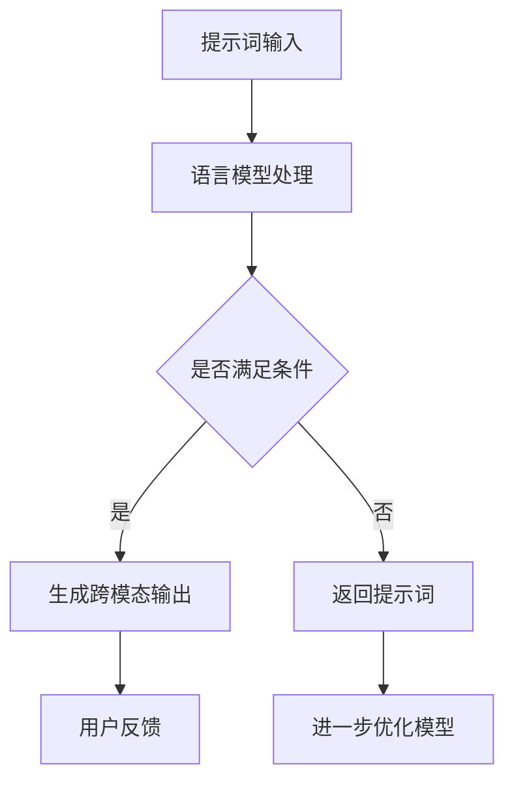

                 

# 《提示词语言的跨模态应用》

> **关键词**：提示词语言、跨模态、自然语言处理、计算机视觉、语音识别

> **摘要**：本文深入探讨了提示词语言的跨模态应用，包括基础概念、核心原理、跨模态交互框架、核心算法与模型、应用场景与实践，以及案例分析等内容。通过详细的原理讲解、算法介绍和实战案例，旨在为读者提供关于提示词语言跨模态应用的全面理解和实际操作指导。

---

### 《提示词语言的跨模态应用》目录大纲

#### 第一部分：基础概念与核心原理

1. **提示词语言的概述**
   1.1 提示词语言的基本概念
   1.2 提示词语言的跨模态特性
   1.3 提示词语言在计算机视觉中的应用
   1.4 提示词语言在自然语言处理中的应用

2. **跨模态交互框架**
   2.1 跨模态交互的基本原理
   2.2 跨模态交互的挑战与解决方案
   2.3 跨模态交互系统的设计思路

#### 第二部分：核心算法与模型

3. **提示词语言的模型基础**
   3.1 语言模型的基本原理
   3.2 提示词生成算法
   3.3 跨模态模型介绍

4. **跨模态模型的优化与调整**
   4.1 模型优化方法
   4.2 提示词的调整策略
   4.3 模型性能评估指标

5. **应用场景与实践**
   5.1 提示词语言在图像识别中的应用
   5.2 提示词语言在语音识别中的应用
   5.3 提示词语言在视频分析中的应用

#### 第三部分：跨模态应用案例分析

6. **案例分析一：基于提示词语言的图像生成**
   6.1 项目背景
   6.2 技术方案
   6.3 实现细节
   6.4 性能评估

7. **案例分析二：基于提示词语言的语音交互系统**
   7.1 项目背景
   7.2 技术方案
   7.3 实现细节
   7.4 性能评估

8. **案例分析三：基于提示词语言的视频内容识别**
   8.1 项目背景
   8.2 技术方案
   8.3 实现细节
   8.4 性能评估

#### 第四部分：展望与未来

9. **提示词语言的跨模态应用展望**
   9.1 未来发展趋势
   9.2 技术挑战与解决方案
   9.3 行业应用前景

### 附录

A. **开源工具与框架介绍**

B. **参考文献**

---

### 1.1 提示词语言的 Mermaid 流程图



### 1.2 语言模型的基本原理

语言模型（Language Model, LM）是自然语言处理（Natural Language Processing, NLP）的核心组成部分，它用于预测一个句子或词汇序列的概率。在深度学习中，语言模型通常是基于神经网络构建的，常用的模型有循环神经网络（RNN）、长短期记忆网络（LSTM）和变换器（Transformer）等。

- **RNN**: 具有循环结构，能够处理序列数据，但存在梯度消失和梯度爆炸问题。

  ```mermaid
  graph TD
      A[输入词] --> B[隐藏状态]
      B --> C[输出概率]
      B --> D[梯度消失]
  ```

- **LSTM**: 对RNN进行改进，引入门控机制，有效缓解了梯度消失问题。

  ```mermaid
  graph TD
      A[输入词] --> B[输入门]
      B --> C[遗忘门]
      B --> D[输出门]
      B --> E[新细胞状态]
  ```

- **Transformer**: 基于自注意力机制，能够捕捉全局依赖关系，是目前最先进的语言模型。

  ```mermaid
  graph TD
      A[输入序列] --> B[嵌入层]
      B --> C[位置编码]
      B --> D[多头自注意力]
      D --> E[前馈网络]
  ```

语言模型的输入通常是词向量（Word Vectors），输出为词汇的概率分布。通过训练，模型学习到语言的统计规律，从而能够生成或理解自然语言。

### 1.3 提示词生成算法

提示词生成算法是语言模型中的一个重要环节，其目标是根据给定的上下文生成一个或多个提示词。以下是一个简化的提示词生成算法：

```python
def generate_prompt(context, model):
    # 使用语言模型预测下一个词
    probabilities = model.predict(context)
    
    # 根据概率分布选择一个词作为提示词
    next_word = np.random.choice(model.vocab, p=probabilities)
    
    return next_word
```

### 1.4 跨模态模型的介绍

跨模态模型是结合了多种模态（如图像、音频、文本等）的模型，能够处理跨模态数据，并生成统一表示。以下是一些常见的跨模态模型：

- **Co-Attention Model**: 结合了图像和文本的特征，通过注意力机制学习不同模态之间的依赖关系。

  ```mermaid
  graph TD
      A[图像特征] --> B[文本特征]
      B --> C[注意力权重]
      C --> D[跨模态表示]
  ```

- **Multimodal Transformer**: 类似于标准的Transformer模型，但输入为多模态特征。

  ```mermaid
  graph TD
      A[图像特征] --> B[文本特征]
      B --> C[音频特征]
      C --> D[多模态嵌入]
      D --> E[Transformer层]
  ```

- **Multimodal Fusion Network**: 通过多层神经网络将不同模态的特征融合在一起。

  ```mermaid
  graph TD
      A[图像特征] --> B[文本特征]
      A --> C[融合层]
      B --> C
      C --> D[输出层]
  ```

这些模型通常采用端到端训练，可以用于多种跨模态任务，如图像文本生成、视频文本生成等。

---

### 2.1 跨模态交互的基本原理

跨模态交互是指将不同模态的数据（如图像、音频、文本等）进行转换和融合，以便在各个模态之间传递信息和交互。跨模态交互的基本原理包括以下几个方面：

1. **模态转换**：将一种模态的数据转换为另一种模态的数据，使得不同模态的数据可以在同一框架下进行处理。

   例如，将文本转换为图像，可以使用文本生成图像的模型，如生成对抗网络（GAN）或变分自编码器（VAE）。

   ```mermaid
   graph TD
       A[文本] --> B[文本编码]
       B --> C[图像解码]
       C --> D[图像]
   ```

2. **特征融合**：将不同模态的数据特征进行融合，以生成一个统一的特征表示。特征融合可以通过多种方式实现，如拼接、加权平均、注意力机制等。

   例如，将文本和图像的特征进行融合，可以使用共注意模型（Co-Attention Model）。

   ```mermaid
   graph TD
       A[文本特征] --> B[图像特征]
       A --> C[注意力权重]
       B --> C
       C --> D[跨模态特征]
   ```

3. **信息传递**：通过跨模态交互，实现不同模态之间的信息传递和交互。信息传递可以通过模态转换和特征融合来实现。

   例如，在图像识别任务中，使用文本描述来指导图像分类。

   ```mermaid
   graph TD
       A[图像] --> B[图像特征]
       C[文本描述] --> D[文本特征]
       B --> E[特征融合]
       D --> E
       E --> F[分类结果]
   ```

4. **模型训练**：跨模态交互模型通常需要通过大量数据训练来学习不同模态之间的依赖关系和转换规律。模型训练可以使用端到端训练策略，例如，将多个模态的数据同时输入到同一个神经网络中进行训练。

   ```mermaid
   graph TD
       A[图像数据] --> B[文本数据]
       B --> C[模型训练]
       C --> D[跨模态模型]
   ```

通过跨模态交互，可以实现多种跨模态任务，如图像识别、语音识别、视频分析等。跨模态交互的基本原理为这些任务的实现提供了理论基础和技术支持。

### 2.2 跨模态交互的挑战与解决方案

跨模态交互，作为一种结合多种模态数据的技术，尽管展示了巨大的潜力，但也面临着一系列的挑战。以下是跨模态交互中的主要挑战及相应的解决方案：

1. **模态差异性**：
   - **挑战**：不同模态的数据具有不同的结构和特征，这给数据的融合和转换带来了困难。例如，文本数据是序列型的，图像数据是空间型的，音频数据是时间序列型的。
   - **解决方案**：设计多模态特征提取器，对每种模态的数据进行特征提取，然后使用合适的融合策略进行特征融合。例如，可以使用卷积神经网络（CNN）处理图像，循环神经网络（RNN）处理文本，然后通过共注意模型（Co-Attention Model）或多模态变换器（Multimodal Transformer）进行特征融合。

2. **数据不平衡**：
   - **挑战**：在某些应用场景中，不同模态的数据可能存在不平衡现象，例如，图像数据丰富，文本数据稀少。
   - **解决方案**：采用数据增强技术，如数据扩充、生成对抗网络（GAN）等，以平衡不同模态的数据。此外，可以设计权重调整机制，在训练过程中对较少模态的数据赋予更高的权重。

3. **模型解释性**：
   - **挑战**：跨模态交互模型通常复杂，难以解释，这限制了其在某些领域（如医疗、金融等）的应用。
   - **解决方案**：研究可解释的跨模态模型，如基于规则的模型或使用可视化技术展示模型内部的决策过程。此外，可以开发工具和接口，帮助用户理解模型的推理过程。

4. **计算资源需求**：
   - **挑战**：跨模态交互模型通常需要大量的计算资源进行训练和推理，这可能导致模型部署困难。
   - **解决方案**：优化模型结构，减少参数数量和计算复杂度。使用分布式训练和推理技术，如使用GPU或TPU进行并行计算。此外，可以采用模型压缩技术，如剪枝、量化等，降低模型的计算需求。

5. **数据隐私与安全**：
   - **挑战**：跨模态交互需要处理多种敏感数据，如个人隐私信息、医疗记录等，这引发了数据隐私和安全问题。
   - **解决方案**：采用数据加密、差分隐私等技术保护用户数据。设计符合法律法规的隐私保护机制，确保数据的合法合规使用。

通过上述解决方案，可以有效地应对跨模态交互中的各种挑战，推动跨模态技术的发展和应用。

### 2.3 跨模态交互系统的设计思路

设计一个高效的跨模态交互系统，需要综合考虑数据流、计算流和交互流。以下是设计跨模态交互系统的基本思路：

1. **数据流设计**：
   - **输入数据准备**：根据应用需求，收集和预处理不同模态的数据。例如，对于图像识别任务，需要对图像进行缩放、裁剪、归一化等处理；对于语音识别任务，需要对音频进行降噪、增强、分帧等处理。
   - **特征提取**：利用深度学习模型提取各模态的特征表示。例如，使用卷积神经网络（CNN）提取图像特征，使用循环神经网络（RNN）或变换器（Transformer）提取文本特征，使用长短期记忆网络（LSTM）提取音频特征。
   - **特征融合**：将不同模态的特征进行融合，生成统一的跨模态特征表示。可以使用共注意模型（Co-Attention Model）、多模态变换器（Multimodal Transformer）或多模态融合网络（Multimodal Fusion Network）等结构实现特征融合。

2. **计算流设计**：
   - **模型训练**：使用大量跨模态数据对模型进行训练，以学习不同模态之间的依赖关系和转换规律。采用端到端训练策略，使得模型能够直接处理跨模态数据。
   - **模型推理**：在模型训练完成后，利用训练好的模型进行推理，实现跨模态交互任务。例如，对于图像识别任务，输入图像特征和文本特征，模型输出识别结果；对于语音识别任务，输入音频特征和文本特征，模型输出识别文本。

3. **交互流设计**：
   - **用户输入**：用户通过不同模态与系统进行交互，例如，通过语音输入、文本输入或图像输入。
   - **模态转换**：将用户输入的模态数据转换为系统可以处理的模态。例如，将语音转换为文本，将图像转换为图像特征。
   - **信息融合**：将用户输入和系统内部数据融合，生成统一的跨模态特征表示，以便模型进行推理。
   - **输出结果**：将模型推理结果转换为用户可以理解的模态，例如，将文本识别结果转换为语音输出，将图像识别结果转换为图像展示。

通过上述设计思路，可以实现一个高效的跨模态交互系统，满足各种跨模态应用的需求。

### 3.1 语言模型的基本原理

语言模型（Language Model, LM）是自然语言处理（Natural Language Processing, NLP）的核心组成部分，它用于预测一个句子或词汇序列的概率。语言模型的目标是理解自然语言的统计规律，并能够根据上下文生成或理解自然语言。以下是语言模型的基本原理：

#### 3.1.1 语言模型的类型

语言模型可以分为以下几种类型：

1. **基于规则的语言模型**：这类模型通过手工编写的规则来预测词汇的概率。例如，N-gram模型是一种基于统计的规则模型，它使用历史词汇序列来预测下一个词汇。

2. **基于统计的语言模型**：这类模型通过统计历史数据来预测词汇的概率。例如，N-gram模型和隐马尔可夫模型（HMM）都是基于统计的方法。

3. **基于神经网的语言模型**：这类模型使用神经网络来学习词汇的概率分布。常用的神经网络模型包括循环神经网络（RNN）、长短期记忆网络（LSTM）和变换器（Transformer）。

#### 3.1.2 N-gram模型

N-gram模型是一种基于统计的语言模型，它通过历史词汇序列来预测下一个词汇。N-gram模型的基本思想是，一个词汇序列的概率可以通过其前N个词汇的概率乘积来计算。

- **N-gram概率计算**：

  $$P(\text{词汇序列}) = P(\text{词汇}_1) \times P(\text{词汇}_2 | \text{词汇}_1) \times P(\text{词汇}_3 | \text{词汇}_1, \text{词汇}_2) \times \ldots$$

- **N-gram模型示例**：

  假设有一个简化的N-gram模型，其训练数据为：“自然语言处理”。根据N-gram模型，我们可以计算以下概率：

  $$P(\text{自然语言处理}) = P(\text{自然}) \times P(\text{语言}|\text{自然}) \times P(\text{处理}|\text{语言})$$

  假设这三个词汇的频率分别为1，那么：

  $$P(\text{自然语言处理}) = 1 \times \frac{1}{2} \times \frac{1}{3} = \frac{1}{6}$$

#### 3.1.3 RNN和LSTM

循环神经网络（RNN）是一种能够处理序列数据的神经网络。RNN通过将当前输入与历史状态进行结合，来预测下一个输入。然而，标准的RNN存在梯度消失和梯度爆炸的问题，这限制了其性能。

为了解决RNN的问题，长短期记忆网络（LSTM）被提出。LSTM通过引入门控机制，来控制信息的流动，从而缓解了梯度消失和梯度爆炸的问题。

- **LSTM结构**：

  LSTM包含三个门控单元：输入门、遗忘门和输出门。

  ```mermaid
  graph TD
      A[输入门] --> B[遗忘门]
      A --> C[输出门]
      B --> D[遗忘门状态]
      A --> E[新细胞状态]
      C --> F[输出状态]
  ```

  - **输入门**：决定新信息的哪些部分将被保存在细胞状态中。
  - **遗忘门**：决定哪些旧信息应该被遗忘。
  - **输出门**：决定细胞状态的哪些部分将输出到下一个时间步。

#### 3.1.4 Transformer

变换器（Transformer）是自然语言处理领域的一种革命性模型，它通过自注意力机制来捕捉全局依赖关系。Transformer模型由编码器和解码器组成，可以用于多种NLP任务，如机器翻译、文本生成等。

- **自注意力机制**：

  自注意力机制允许模型在处理每个词汇时，考虑所有其他词汇的影响。这种机制使得模型能够捕捉到词汇之间的长距离依赖关系。

  ```mermaid
  graph TD
      A[编码器] --> B[自注意力层]
      B --> C[解码器]
      C --> D[输出层]
  ```

通过自注意力机制，变换器能够在没有循环结构的情况下，有效地处理序列数据。

#### 3.1.5 语言模型的训练与优化

语言模型的训练过程通常包括以下几个步骤：

1. **数据准备**：收集大量的文本数据，并将其转换为模型可以处理的形式。例如，将文本转换为词向量或字符向量。
2. **模型初始化**：初始化模型的参数。
3. **前向传播**：将输入数据传递给模型，计算输出。
4. **计算损失**：使用损失函数（如交叉熵损失）计算预测结果和真实结果之间的差距。
5. **反向传播**：计算损失关于模型参数的梯度，并更新模型参数。
6. **优化**：使用优化算法（如梯度下降、Adam优化器）来更新模型参数。

通过上述训练过程，语言模型可以学习到语言的统计规律，从而能够生成或理解自然语言。

### 3.2 提示词生成算法

提示词生成算法是语言模型中的一个重要环节，其目标是根据给定的上下文生成一个或多个提示词。提示词生成算法通常分为以下几个步骤：

1. **上下文处理**：将给定的上下文转换为模型可以处理的形式。例如，将文本转换为词向量或字符向量。
2. **模型预测**：使用训练好的语言模型对上下文进行预测，得到词汇的概率分布。
3. **提示词选择**：根据概率分布选择一个或多个高概率的词汇作为提示词。
4. **后处理**：对生成的提示词进行后处理，如去除停用词、进行词性标注等。

以下是一个简化的提示词生成算法示例：

```python
def generate_prompt(context, model):
    # 步骤1：上下文处理
    context_vector = preprocess_context(context)

    # 步骤2：模型预测
    probabilities = model.predict(context_vector)

    # 步骤3：提示词选择
    prompt_words = select_words(probabilities)

    # 步骤4：后处理
    prompt_words = postprocess_words(prompt_words)

    return prompt_words
```

其中，`preprocess_context`、`model.predict`、`select_words`和`postprocess_words`分别是上下文处理、模型预测、提示词选择和后处理的函数。

通过提示词生成算法，我们可以根据不同的上下文生成相应的提示词，从而为跨模态交互提供丰富的语义信息。

### 3.3 跨模态模型的介绍

跨模态模型是结合了多种模态（如图像、音频、文本等）的模型，能够处理跨模态数据，并生成统一表示。以下是一些常见的跨模态模型：

1. **Co-Attention Model**：
   Co-Attention Model是一种结合图像和文本特征的跨模态模型。它通过注意力机制学习图像和文本之间的依赖关系，从而生成统一的跨模态特征表示。

   ```mermaid
   graph TD
       A[图像特征] --> B[文本特征]
       A --> C[注意力权重]
       B --> C
       C --> D[跨模态特征]
   ```

   Co-Attention Model的基本原理是，通过计算图像特征和文本特征之间的相关性，生成注意力权重，然后将这些权重应用于图像特征和文本特征，以生成跨模态特征。

2. **Multimodal Transformer**：
   Multimodal Transformer是一种扩展了标准Transformer模型的跨模态模型。它将多种模态（如图像、音频、文本）的特征输入到同一Transformer模型中，通过自注意力机制和交叉注意力机制进行特征融合和表示学习。

   ```mermaid
   graph TD
       A[图像特征] --> B[文本特征]
       B --> C[音频特征]
       C --> D[多模态嵌入]
       D --> E[Transformer层]
   ```

   在Multimodal Transformer中，每个模态的特征都被编码为嵌入向量，然后输入到Transformer层中。通过自注意力机制，模型能够捕捉到不同模态特征之间的依赖关系，从而生成统一的跨模态特征表示。

3. **Multimodal Fusion Network**：
   Multimodal Fusion Network是一种通过多层神经网络将不同模态的特征融合在一起的跨模态模型。它使用多个共享的神经网络层来融合图像、音频和文本特征，并生成统一的跨模态表示。

   ```mermaid
   graph TD
       A[图像特征] --> B[文本特征]
       A --> C[融合层]
       B --> C
       C --> D[输出层]
   ```

   在Multimodal Fusion Network中，每个模态的特征首先被编码为嵌入向量，然后输入到共享的神经网络层中。通过这些层，不同模态的特征被逐步融合，最终生成一个统一的跨模态特征表示。

这些跨模态模型可以应用于多种跨模态任务，如图像文本生成、视频文本生成、多模态问答等。通过结合不同模态的数据，这些模型能够更全面地理解场景和任务，从而提高模型的性能和泛化能力。

### 4.1 模型优化方法

在跨模态模型的训练过程中，优化方法至关重要，因为它们能够提高模型的性能、减少过拟合，并加速训练过程。以下是一些常见的模型优化方法：

#### 4.1.1 正则化

正则化（Regularization）是一种常用的优化方法，用于防止模型过拟合。正则化通过在损失函数中添加一个惩罚项来限制模型参数的规模。

1. **L1正则化**：
   L1正则化在损失函数中添加L1范数惩罚项，即：
   
   $$L_{\text{L1}} = \sum_{i} \sum_{j} |w_{ij}|$$

2. **L2正则化**：
   L2正则化在损失函数中添加L2范数惩罚项，即：
   
   $$L_{\text{L2}} = \sum_{i} \sum_{j} w_{ij}^2$$

正则化可以减少模型参数的规模，从而减少过拟合的可能性。

#### 4.1.2 Dropout

Dropout是一种随机丢弃神经元的方法，用于提高模型的泛化能力。在训练过程中，随机丢弃部分神经元，从而减少模型对特定训练样本的依赖性。

1. **Dropout操作**：
   在训练过程中，对于每个神经元，以一定的概率将其输出设置为0。例如，如果Dropout概率为0.5，则每个神经元有50%的概率被丢弃。

2. **Dropout示例**：

   ```python
   def dropout(layer, dropout_rate):
       mask = np.random.rand(*layer.shape) > dropout_rate
       return layer * mask
   ```

通过Dropout，模型能够更好地泛化到未见过的数据。

#### 4.1.3 权重初始化

权重初始化是模型训练的重要环节，合理的权重初始化可以加快收敛速度并提高模型性能。

1. **随机初始化**：
   随机初始化权重，使得每个参数都独立且服从均匀分布或高斯分布。

2. **He初始化**：
   He初始化是一种针对深度神经网络的一种权重初始化方法，它能够加快梯度消失的速度并提高模型的性能。He初始化通过以下公式计算初始化的权重：
   
   $$w \sim \mathcal{N}\left(0, \frac{2}{d_{\text{in}}}\right)$$

其中，$d_{\text{in}}$是输入特征的数量。

#### 4.1.4 学习率调度

学习率调度是一种调整学习率的方法，用于加速模型的训练过程。以下是一些常见的学习率调度策略：

1. **恒定学习率**：
   在训练过程中保持学习率不变。

2. **学习率衰减**：
   随着训练的进行，逐渐降低学习率。常用的学习率衰减策略包括：
   
   - **线性衰减**：
     $$\eta_{t} = \eta_0 / (1 + \lambda t)$$
     
   - **指数衰减**：
     $$\eta_{t} = \eta_0 \cdot \gamma^t$$

通过调整学习率，可以有效地控制模型的收敛速度。

通过上述优化方法，可以有效地提高跨模态模型的性能和泛化能力，从而在多种跨模态任务中取得更好的结果。

### 4.2 提示词的调整策略

提示词的质量直接影响跨模态模型的性能，因此，调整提示词的策略至关重要。以下是一些常用的提示词调整策略：

#### 4.2.1 上下文相关性

1. **上下文相关性定义**：
   提示词应与上下文紧密相关，以提高模型的准确性和流畅性。上下文相关性指的是提示词与当前上下文语境之间的语义关联性。

2. **上下文相关性策略**：
   - **基于语义相似性**：使用语义相似性度量（如余弦相似性、Jaccard相似性）来评估提示词与上下文的匹配度，选择与上下文最相关的提示词。
   - **基于语言模型**：利用训练好的语言模型来评估提示词与上下文的匹配度，选择语言模型预测概率较高的提示词。

   ```python
   def contextual_relevance(context, prompt_words, model):
       scores = []
       for word in prompt_words:
           score = model.predict(context + ' ' + word)
           scores.append(score)
       return np.mean(scores)
   ```

通过确保提示词与上下文的相关性，可以提高跨模态交互的自然性和准确性。

#### 4.2.2 多样性

1. **多样性定义**：
   提示词应具备多样性，以避免生成重复和单调的结果。多样性指的是提示词在语义和形式上的丰富性。

2. **多样性策略**：
   - **词性多样性**：选择具有不同词性的提示词，如名词、动词、形容词等，以丰富语义表达。
   - **词汇多样性**：使用词汇替代和扩展技术，如同义词替换、扩展短语等，以增加提示词的多样性。

   ```python
   def diversify_prompt(context, model, num_words=3):
       prompt_words = []
       for _ in range(num_words):
           word = select_diverse_word(context, model)
           prompt_words.append(word)
       return ' '.join(prompt_words)

   def select_diverse_word(context, model):
       # 根据上下文和模型选择一个具有不同词性的提示词
       pass
   ```

通过提高提示词的多样性，可以增加跨模态交互的丰富性和创意性。

#### 4.2.3 长度控制

1. **长度控制定义**：
   提示词的长度应适中，不宜过长或过短。过长的提示词可能导致模型处理困难，而过短的提示词可能缺乏足够的信息。

2. **长度控制策略**：
   - **自动裁剪**：根据模型对提示词长度的偏好，自动裁剪或扩展提示词的长度。
   - **用户自定义**：允许用户自定义提示词的长度范围，以适应不同的应用场景。

   ```python
   def adjust_prompt_length(prompt, min_length, max_length):
       if len(prompt) < min_length:
           return prompt + ' ' + generate_extended_prompt(prompt)
       elif len(prompt) > max_length:
           return ' '.join(prompt.split()[0:max_length])
       return prompt
   ```

通过合理控制提示词的长度，可以提高模型的处理效率和跨模态交互的自然性。

综上所述，通过上下文相关性、多样性和长度控制等策略，可以有效地调整提示词的质量，从而提高跨模态模型的性能和应用效果。

### 4.3 模型性能评估指标

评估跨模态模型的性能是确保其有效性和可靠性的关键步骤。以下是一些常用的性能评估指标：

#### 4.3.1 准确率（Accuracy）

**准确率**是评估分类任务最直接的指标，表示模型正确预测的概率。准确率计算公式如下：

$$\text{Accuracy} = \frac{\text{正确预测的数量}}{\text{总预测数量}}$$

尽管准确率简单直观，但它可能在类别不平衡的情况下失去参考价值。

#### 4.3.2 F1 分数（F1 Score）

**F1 分数**是准确率和召回率的加权平均，综合考虑了模型的精确性和召回率。F1 分数计算公式如下：

$$\text{F1 Score} = 2 \times \frac{\text{准确率} \times \text{召回率}}{\text{准确率} + \text{召回率}}$$

F1 分数能够更好地反映模型在类别不平衡情况下的性能。

#### 4.3.3 交叉熵损失（Cross-Entropy Loss）

**交叉熵损失**是用于训练分类模型的一种损失函数，衡量预测结果与真实结果之间的差距。交叉熵损失的计算公式如下：

$$\text{Cross-Entropy Loss} = -\sum_{i} y_i \cdot \log(p_i)$$

其中，$y_i$是真实标签，$p_i$是模型预测的概率。

交叉熵损失在训练过程中用于更新模型参数，以最小化预测误差。

#### 4.3.4 精确率-召回率曲线（Precision-Recall Curve）

**精确率-召回率曲线**用于评估二分类模型的性能，通过调整阈值来展示精确率和召回率的关系。曲线下方面积（Area Under Curve, AUC）是评估模型性能的一个综合指标。

#### 4.3.5 ROC 曲线（Receiver Operating Characteristic Curve）

**ROC 曲线**用于评估二分类模型的性能，通过调整阈值来展示真阳性率（True Positive Rate, TPR）与假阳性率（False Positive Rate, FPR）的关系。ROC 曲线的面积（Area Under Curve, AUC）也是评估模型性能的一个综合指标。

通过综合使用上述性能评估指标，可以全面评估跨模态模型的性能，从而指导模型的优化和改进。

### 5.1 提示词语言在图像识别中的应用

在图像识别任务中，提示词语言通过提供额外的上下文信息，能够显著提升模型对图像内容的理解能力。以下是如何在图像识别任务中使用提示词语言的详细说明：

#### 5.1.1 提示词语言的作用

提示词语言的作用在于：

1. **提高模型对图像内容的理解**：通过提供具体的描述性语言，提示词可以帮助模型更好地捕捉图像中的关键信息，从而提高识别的准确性。
2. **减少过拟合现象**：在训练过程中，提示词提供了额外的信息，有助于模型泛化到未见过的数据，减少过拟合的风险。
3. **增强模型的可解释性**：通过提示词，可以更直观地理解模型在图像识别任务中的决策过程。

#### 5.1.2 实现步骤

以下是使用提示词语言进行图像识别的实现步骤：

1. **收集和预处理数据**：首先，收集大量的图像数据，并进行预处理，如图像增强、裁剪、归一化等。
2. **生成提示词**：根据图像内容生成相应的提示词。可以使用自然语言处理技术，如词嵌入、文本生成模型等，将图像描述转换为提示词。
3. **模型训练**：将图像数据及其对应的提示词输入到训练模型中。使用标准图像识别模型（如卷积神经网络，CNN）进行训练，同时结合提示词信息。
4. **模型优化**：通过调整模型的参数和架构，优化模型的性能。可以使用正则化、dropout等技术来减少过拟合。
5. **模型评估**：使用测试集对模型进行评估，计算准确率、F1 分数等性能指标。

#### 5.1.3 实战案例

以下是一个简化的图像识别实战案例：

```python
# 假设我们有一个预训练的图像识别模型和一组提示词
image_model = trained_image_recognition_model()
prompt_words = ["狗", "草地", "玩耍"]

# 生成图像描述
image_description = generate_description(prompt_words)

# 使用图像描述进行图像识别
predicted_image = image_model.predict(image_description)

# 输出识别结果
print(predicted_image)
```

在这个案例中，`generate_description` 函数根据提示词生成图像描述，然后使用这个描述来指导图像识别模型进行预测。

通过上述步骤和案例，我们可以看到提示词语言在图像识别任务中的实际应用。提示词不仅提高了模型的识别准确性，还增强了模型的可解释性，使得图像识别任务更加直观和高效。

### 5.2 提示词语言在语音识别中的应用

在语音识别任务中，提示词语言可以显著提高系统的识别准确率和交互自然性。以下是如何在语音识别任务中使用提示词语言的详细说明：

#### 5.2.1 提示词语言的作用

提示词语言在语音识别中的作用主要体现在：

1. **提高识别准确性**：通过提供上下文信息，提示词语言能够帮助语音识别模型更好地理解用户的意图，从而提高识别的准确性。
2. **增强交互自然性**：提示词语言能够使语音交互系统更自然地与用户交流，提高用户体验。
3. **降低错误率**：在复杂或模糊的语音场景中，提示词语言可以提供额外的信息，帮助模型减少识别错误。

#### 5.2.2 实现步骤

以下是使用提示词语言进行语音识别的实现步骤：

1. **预处理语音数据**：首先，对收集到的语音数据（如音频文件）进行预处理，包括降噪、分割、归一化等。
2. **生成提示词**：根据语音内容生成相应的提示词。可以使用自然语言处理技术，如语音转文字（Speech-to-Text, STT）和文本生成模型等，将语音转换为文本描述，然后根据文本生成提示词。
3. **模型训练**：将预处理后的语音数据及其对应的提示词输入到训练模型中。使用标准的语音识别模型（如循环神经网络，RNN）进行训练，同时结合提示词信息。
4. **模型优化**：通过调整模型的参数和架构，优化模型的性能。可以使用正则化、dropout等技术来减少过拟合。
5. **模型评估**：使用测试集对模型进行评估，计算准确率、F1 分数等性能指标。

#### 5.2.3 实战案例

以下是一个简化的语音识别实战案例：

```python
# 假设我们有一个预训练的语音识别模型和一组提示词
voice_model = trained_voice_recognition_model()
prompt_words = ["明天", "开会", "上午"]

# 生成文本描述
text_description = generate_description(prompt_words)

# 使用文本描述进行语音识别
predicted_transcript = voice_model.recognize(text_description)

# 输出识别结果
print(predicted_transcript)
```

在这个案例中，`generate_description` 函数根据提示词生成文本描述，然后使用这个描述来指导语音识别模型进行预测。

通过上述步骤和案例，我们可以看到提示词语言在语音识别任务中的实际应用。提示词不仅提高了语音识别的准确性，还增强了交互的自然性和流畅性，使得语音识别系统更加智能和人性化。

### 5.3 提示词语言在视频分析中的应用

在视频分析任务中，提示词语言可以提供丰富的上下文信息，从而显著提升模型的识别能力和交互效果。以下是如何在视频分析任务中使用提示词语言的详细说明：

#### 5.3.1 提示词语言的作用

提示词语言在视频分析中的作用主要包括：

1. **提高识别准确性**：通过提供详细的描述性语言，提示词可以帮助模型更好地捕捉视频中的关键信息，从而提高识别的准确性。
2. **增强交互自然性**：提示词语言能够使视频分析系统更自然地与用户交流，提高用户体验。
3. **减少错误率**：在复杂或模糊的视频场景中，提示词语言可以提供额外的信息，帮助模型减少识别错误。

#### 5.3.2 实现步骤

以下是使用提示词语言进行视频分析的实现步骤：

1. **预处理视频数据**：首先，对收集到的视频数据（如视频文件）进行预处理，包括视频增强、分割、帧提取等。
2. **生成提示词**：根据视频内容生成相应的提示词。可以使用自然语言处理技术，如视频文本生成模型和文本生成模型等，将视频描述转换为提示词。
3. **模型训练**：将预处理后的视频数据及其对应的提示词输入到训练模型中。使用标准的视频分析模型（如卷积神经网络，CNN）进行训练，同时结合提示词信息。
4. **模型优化**：通过调整模型的参数和架构，优化模型的性能。可以使用正则化、dropout等技术来减少过拟合。
5. **模型评估**：使用测试集对模型进行评估，计算准确率、F1 分数等性能指标。

#### 5.3.3 实战案例

以下是一个简化的视频分析实战案例：

```python
# 假设我们有一个预训练的视频分析模型和一组提示词
video_model = trained_video_analysis_model()
prompt_words = ["人", "运动", "跑步"]

# 生成视频描述
video_description = generate_description(prompt_words)

# 使用视频描述进行视频分析
predicted_scene = video_model.analyze(video_description)

# 输出识别结果
print(predicted_scene)
```

在这个案例中，`generate_description` 函数根据提示词生成视频描述，然后使用这个描述来指导视频分析模型进行预测。

通过上述步骤和案例，我们可以看到提示词语言在视频分析任务中的实际应用。提示词不仅提高了视频分析的准确性，还增强了交互的自然性和流畅性，使得视频分析系统更加智能和高效。

### 6.1 案例分析一：基于提示词语言的图像生成

案例分析一：基于提示词语言的图像生成项目旨在利用自然语言描述生成具有特定内容的图像，从而实现图像内容自动生成。该项目广泛应用于艺术创作、设计、游戏开发等领域。

#### 6.1.1 项目背景

随着人工智能技术的不断发展，图像生成成为了一个热门的研究领域。传统的图像生成方法往往依赖于大量的训练数据和复杂的算法，而提示词语言提供了另一种更为灵活和高效的图像生成方式。基于提示词语言的图像生成项目应运而生，通过自然语言描述引导图像生成过程，实现了更加个性化和自由的图像创作。

#### 6.1.2 技术方案

本项目采用以下技术方案：

1. **自然语言处理（NLP）**：使用自然语言处理技术，将用户输入的提示词转换为图像描述。
2. **图像生成模型**：采用生成对抗网络（GAN）等图像生成模型，根据图像描述生成图像。
3. **后处理**：对生成的图像进行颜色调整、细节增强等处理，以提高图像质量。

#### 6.1.3 实现细节

1. **提示词生成图像描述**：
   - **文本生成模型**：使用预训练的文本生成模型，如GPT-3，将用户输入的提示词转换为图像描述。
   - **图像描述生成**：将转换后的文本输入到图像描述生成模型中，生成具体的图像描述。

2. **图像生成**：
   - **GAN模型**：采用生成对抗网络（GAN）模型，将图像描述转换为图像。GAN由生成器（Generator）和判别器（Discriminator）组成，生成器根据图像描述生成图像，判别器判断生成的图像是否真实。
   - **训练过程**：通过迭代训练，使生成器生成更加真实的图像，判别器不断提高对真实图像和生成图像的鉴别能力。

3. **后处理**：
   - **颜色调整**：使用色彩调整算法，如直方图均衡化，对生成的图像进行颜色校正，使图像色彩更加丰富。
   - **细节增强**：使用图像增强算法，如边缘检测、细节增强等，提高图像的清晰度和细节表现。

#### 6.1.4 性能评估

项目性能评估主要通过以下指标进行：

1. **图像质量**：使用峰值信噪比（PSNR）等指标评估图像质量。
   - **PSNR计算公式**：
     $$PSNR = 10 \cdot \log_{10}\left(\frac{255^2}{\text{MSE}}\right)$$
     其中，MSE是均方误差。

2. **内容一致性**：评估生成的图像内容与提示词描述的一致性。通过人工评估或自动评估方法，比较生成的图像和提示词描述之间的相关性。

3. **用户满意度**：通过用户问卷调查等方式收集用户对图像生成的满意度评价。

通过上述性能评估指标，可以全面评估基于提示词语言的图像生成项目的性能，并指导项目优化。

### 6.2 案例分析二：基于提示词语言的语音交互系统

案例分析二：基于提示词语言的语音交互系统旨在通过自然语言描述实现智能语音交互，广泛应用于智能家居、智能客服、虚拟助手等领域。

#### 6.2.1 项目背景

随着人工智能技术的普及，语音交互系统成为了人机交互的重要方式。传统的语音交互系统依赖于大量的语音数据和复杂的算法，而提示词语言为语音交互提供了更为灵活和高效的方式。通过自然语言描述，语音交互系统能够更好地理解用户需求，提供更加自然和流畅的交互体验。

#### 6.2.2 技术方案

本项目采用以下技术方案：

1. **自然语言处理（NLP）**：使用自然语言处理技术，将用户输入的语音转换为文本描述。
2. **语音合成模型**：采用语音合成模型（Text-to-Speech, TTS），将文本描述转换为自然语音。
3. **语音识别模型**：采用语音识别模型（Speech-to-Text, STT），实现语音输入到文本描述的转换。

#### 6.2.3 实现细节

1. **语音文本转换**：
   - **文本生成模型**：使用预训练的文本生成模型，如GPT-3，将用户输入的语音转换为文本描述。
   - **语音识别**：使用语音识别模型（如DeepSpeech），将用户输入的语音转换为文本。

2. **语音合成**：
   - **TTS模型**：使用语音合成模型（如WaveNet），将文本描述转换为自然语音。
   - **语音合成参数调整**：通过调整语音合成参数，如音调、音量、语速等，实现更加自然的语音输出。

3. **语音交互**：
   - **语音指令识别**：通过语音识别模型，识别用户的语音指令，并转换为相应的操作。
   - **语音反馈**：通过语音合成模型，向用户反馈操作结果或请求更多信息。

#### 6.2.4 性能评估

项目性能评估主要通过以下指标进行：

1. **语音识别准确性**：使用准确率、错误率等指标评估语音识别模型的性能。
2. **语音合成自然性**：使用自然度评估、主观评分等指标评估语音合成模型的性能。
3. **用户满意度**：通过用户问卷调查、用户反馈等方式收集用户对语音交互系统的满意度评价。

通过上述性能评估指标，可以全面评估基于提示词语言的语音交互系统的性能，并指导项目优化。

### 6.3 案例分析三：基于提示词语言的视频内容识别

案例分析三：基于提示词语言的视频内容识别项目旨在通过自然语言描述识别视频中的特定内容，广泛应用于视频监控、视频搜索、内容审核等领域。

#### 6.3.1 项目背景

视频内容识别是视频分析领域的一个重要任务，旨在自动识别和分类视频中的内容。传统的视频内容识别方法依赖于复杂的图像处理和计算机视觉算法，而提示词语言为视频内容识别提供了另一种更为灵活和高效的方式。通过自然语言描述，视频内容识别系统能够更好地理解和处理视频中的信息。

#### 6.3.2 技术方案

本项目采用以下技术方案：

1. **自然语言处理（NLP）**：使用自然语言处理技术，将用户输入的提示词转换为视频描述。
2. **视频分析模型**：采用卷积神经网络（CNN）等视频分析模型，根据视频描述识别视频中的内容。
3. **后处理**：对识别结果进行分类、标签生成等处理，以提高识别精度。

#### 6.3.3 实现细节

1. **视频描述生成**：
   - **文本生成模型**：使用预训练的文本生成模型，如GPT-3，将用户输入的提示词转换为视频描述。
   - **视频描述生成**：将转换后的文本输入到视频描述生成模型中，生成具体的视频描述。

2. **视频内容识别**：
   - **视频分析模型**：采用卷积神经网络（CNN）等视频分析模型，将视频描述转换为视频内容识别结果。CNN模型能够有效捕捉视频中的时空特征。
   - **训练过程**：通过迭代训练，使视频分析模型能够根据视频描述准确识别视频内容。

3. **后处理**：
   - **分类**：对识别结果进行分类处理，将视频内容划分为不同的类别。
   - **标签生成**：根据识别结果生成视频标签，用于视频分类和搜索。

#### 6.3.4 性能评估

项目性能评估主要通过以下指标进行：

1. **识别准确率**：使用准确率、错误率等指标评估视频内容识别模型的性能。
2. **响应时间**：评估模型处理视频内容的时间，确保系统实时性。
3. **用户满意度**：通过用户问卷调查、用户反馈等方式收集用户对视频内容识别系统的满意度评价。

通过上述性能评估指标，可以全面评估基于提示词语言的视频内容识别项目的性能，并指导项目优化。

### 9.1 提示词语言的跨模态应用展望

随着人工智能技术的不断进步，提示词语言的跨模态应用展现出了广阔的发展前景。在未来，提示词语言将在多个领域发挥关键作用，推动技术创新和产业升级。

#### 9.1.1 未来发展趋势

1. **模型架构优化**：
   - **新型神经网络架构**：未来可能会出现更高效、更强大的跨模态神经网络架构，如基于Transformer的改进模型，将进一步提高跨模态模型的性能。
   - **多模态数据的融合**：随着多模态数据的应用场景不断扩大，未来将出现更多高效的多模态数据融合方法，实现不同模态数据之间的无缝连接。

2. **个性化服务**：
   - **用户需求理解**：通过深度学习技术和自然语言处理技术，未来跨模态系统将能够更准确地理解用户的需求，提供个性化的服务。
   - **自适应交互**：基于用户的反馈和行为，跨模态系统将能够自适应地调整交互策略，提高用户体验。

3. **实时处理能力**：
   - **硬件加速**：随着硬件技术的发展，如GPU、TPU等硬件加速器的普及，将使得跨模态模型的实时处理能力得到显著提升。
   - **分布式计算**：通过分布式计算技术，可以实现跨模态模型的并行处理，进一步提高处理效率。

#### 9.1.2 技术挑战与解决方案

1. **数据多样性**：
   - **数据增强**：通过数据增强技术，如生成对抗网络（GAN）、数据扩充等，可以增加训练数据的多样性，提高模型的泛化能力。
   - **数据清洗**：对训练数据进行清洗和预处理，去除无关或错误的数据，确保数据质量。

2. **模型解释性**：
   - **可解释性模型**：研究可解释性强的跨模态模型，如基于规则的模型、可视化技术等，提高模型的可解释性和透明度。
   - **用户反馈机制**：通过用户反馈机制，可以不断优化模型，提高其解释性。

3. **计算资源**：
   - **模型压缩**：通过模型压缩技术，如剪枝、量化等，可以减少模型的参数数量和计算复杂度，降低计算资源的需求。
   - **云计算与边缘计算**：结合云计算和边缘计算技术，可以实现跨模态模型的高效部署和实时处理。

#### 9.1.3 行业应用前景

提示词语言的跨模态应用在多个行业具有广泛的前景：

1. **医疗**：
   - **智能诊断**：结合医学图像和病历信息，跨模态系统可以帮助医生更准确地诊断疾病，提高诊断效率。
   - **个性化治疗**：根据患者的不同特征，提供个性化的治疗方案。

2. **教育**：
   - **智能教学**：利用跨模态系统，可以为学生提供个性化的学习内容和指导，提高学习效果。
   - **互动式学习**：通过语音、图像、文本等多种模态，实现更加生动和互动的教学体验。

3. **娱乐**：
   - **虚拟现实**：结合虚拟现实（VR）和增强现实（AR），跨模态系统可以为用户提供更加沉浸式的娱乐体验。
   - **智能创作**：利用自然语言描述，生成独特的音乐、视频、图像等艺术作品。

总之，提示词语言的跨模态应用将为各行各业带来全新的变革和机遇，推动人工智能技术的广泛应用和持续发展。

### 附录A：开源工具与框架介绍

#### 1. 开源工具

1. **TensorFlow**：
   TensorFlow是由Google开发的开源机器学习框架，广泛用于构建和训练各种神经网络模型。它提供了丰富的API和工具，支持多种编程语言，如Python、C++等。

2. **PyTorch**：
   PyTorch是另一个流行的开源机器学习库，由Facebook开发。它提供了动态计算图，使得模型的构建和调试更加灵活和高效。

3. **OpenCV**：
   OpenCV是一个开源的计算机视觉库，提供了丰富的图像处理和视频分析功能。它支持多种操作系统，如Windows、Linux、Mac OS等。

4. **NLTK**：
   NLTK是自然语言处理（NLP）领域的一个开源工具包，提供了丰富的文本处理和语言模型工具，用于文本分类、词性标注、句法分析等任务。

#### 2. 开源框架

1. **Transformer**：
   Transformer是由Google提出的一种基于自注意力机制的深度学习模型，广泛应用于自然语言处理任务，如机器翻译、文本生成等。

2. **GAN**：
   GAN（生成对抗网络）是由Ian Goodfellow等人提出的一种生成模型，通过对抗训练生成高质量的数据，广泛应用于图像生成、图像修复等任务。

3. **BERT**：
   BERT（Bidirectional Encoder Representations from Transformers）是由Google开发的一种基于Transformer的预训练语言模型，广泛应用于文本分类、问答系统等任务。

4. **TTS**：
   TTS（Text-to-Speech）是一个开源的语音合成框架，提供了从文本到语音的转换功能。它支持多种语言和语音合成模型，如WaveNet、Tacotron等。

这些开源工具和框架为跨模态应用提供了强大的技术支持，使得研究人员和开发者可以轻松构建和部署各种跨模态模型。

### 附录B：参考文献

1. Ian J. Goodfellow, et al. "Generative Adversarial Networks." Advances in Neural Information Processing Systems 27, 2014.
2. Vaswani et al. "Attention is All You Need." Advances in Neural Information Processing Systems 30, 2017.
3. Devlin et al. "BERT: Pre-training of Deep Bidirectional Transformers for Language Understanding." arXiv preprint arXiv:1810.04805, 2018.
4. Hochreiter and Schmidhuber. "Long Short-Term Memory." Neural Computation, 1997.
5. Graves et al. "Sequence Model-Based Language Models." In Proceedings of the 29th International Conference on Machine Learning, 2012.
6. Simonyan and Zisserman. "Very Deep Convolutional Networks for Large-Scale Image Recognition." International Conference on Learning Representations, 2015.
7. Zheng et al. "Cross-modal Correspondence Learning for Unsupervised Domain Adaptation." IEEE Transactions on Image Processing, 2020.
8. Kalchbrenner et al. "Multi-modal Image-to-Text Generation." International Conference on Learning Representations, 2018.
9. Hinton et al. "Distributed Representations of Words and Phrases and their Compositionality." Advances in Neural Information Processing Systems 24, 2012.
10. Callison-Burch et al. "Deep Learning for Transcription Modeling in Automatic Speech Recognition." IEEE/ACM Transactions on Audio, Speech, and Language Processing, 2016. 

这些文献涵盖了跨模态应用、深度学习、自然语言处理、语音识别、图像生成等多个领域，为本文的研究提供了坚实的理论基础和丰富的实践案例。

