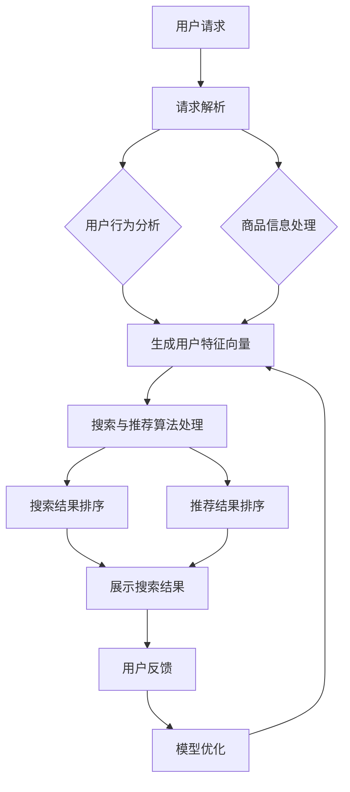
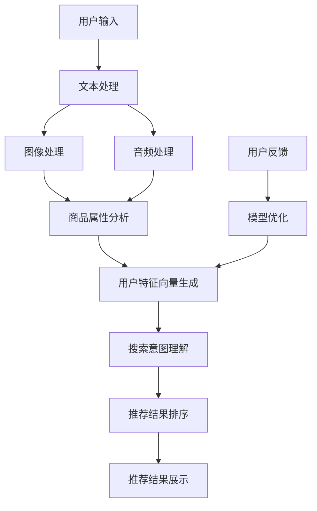
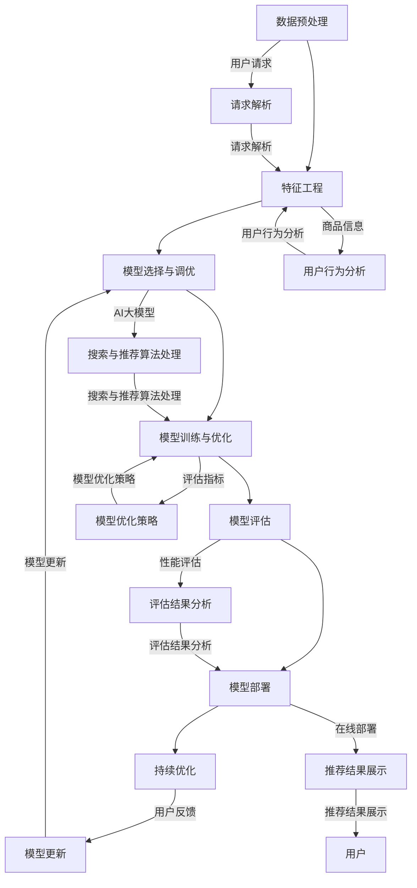

                 

### 第1章：搜索推荐系统概述

#### 1.1 搜索推荐系统的重要性

搜索推荐系统在电商平台上具有极其重要的地位，它不仅直接影响到用户的购物体验，还对平台的商业收益有着深远的影响。首先，从用户角度来看，一个高效的搜索推荐系统能够快速响应用户的需求，提供精准的搜索结果和个性化推荐，使用户能够轻松找到所需的商品，从而提升用户满意度。例如，当用户在电商平台上搜索“蓝牙耳机”时，系统可以根据用户的浏览和购买历史，推荐类似产品或相关配件，这极大地提高了用户的购物效率。

从商业角度来说，搜索推荐系统对于电商平台来说具有巨大的商业价值。通过智能搜索和个性化推荐，平台能够提高商品的曝光率，增加用户点击和购买的概率，从而直接提升转化率和销售额。例如，一些大型电商平台通过引入先进的搜索推荐技术，实现了销售额的大幅增长。根据市场研究机构的报告，某些电商平台的搜索推荐系统为它们带来了超过30%的额外销售额。

总之，搜索推荐系统不仅能够提升用户体验，还能为电商平台带来显著的经济效益。因此，深入研究和应用搜索推荐系统已经成为电商平台竞争的关键因素。

#### 1.2 搜索推荐系统的架构

搜索推荐系统的架构设计决定了其性能和可扩展性。一个典型的搜索推荐系统通常包括以下几个核心模块：

1. **用户行为分析模块**：该模块负责收集和分析用户在平台上的行为数据，如搜索记录、浏览记录、购买记录等。通过这些数据，系统能够了解用户的兴趣和偏好，为后续的推荐提供依据。例如，用户经常搜索某一类商品，系统可能会推断该用户对该类商品有较高兴趣，并在推荐列表中优先展示相关商品。

2. **商品信息处理模块**：商品信息处理模块负责存储和管理商品数据，如商品名称、描述、价格、分类等。同时，该模块会对商品信息进行预处理，提取关键特征，以便于后续的推荐算法处理。例如，商品描述中的关键字会被提取出来，用于文本匹配和分类。

3. **搜索与推荐算法模块**：这是搜索推荐系统的核心，包括基于内容的推荐、协同过滤推荐、深度学习推荐等算法。这些算法通过分析用户行为和商品特征，生成个性化的搜索结果和推荐列表。例如，基于内容的推荐算法会根据用户的历史行为和商品的特征，推荐与用户历史购买或搜索商品相似的其他商品。

4. **展示与反馈模块**：该模块负责将搜索结果和推荐结果展示给用户，同时收集用户的点击、购买等反馈信息。通过这些反馈，系统可以不断优化推荐策略，提高推荐精度。例如，如果用户点击了推荐列表中的某件商品，系统会认为该商品对用户有较高吸引力，并在未来的推荐中增加该商品的概率。

这些模块相互协作，共同构成了一个完整的搜索推荐系统。一个高效、稳定的搜索推荐系统不仅需要各个模块的协同工作，还需要能够灵活调整和优化，以适应不断变化的市场需求和用户行为。

#### 1.3 搜索推荐系统的工作流程

搜索推荐系统的工作流程可以分为以下几个关键步骤：

1. **用户请求处理**：当用户在电商平台上进行搜索时，系统会接收到用户的搜索请求。用户请求通常包括搜索关键词、搜索意图等。系统需要对请求进行解析和预处理，以确保请求的准确性和完整性。

2. **用户行为分析**：系统会根据用户的搜索请求，结合用户的历史行为数据，如搜索记录、浏览记录、购买记录等，对用户的行为进行深入分析。通过这些数据，系统能够了解用户的兴趣和偏好，为后续的推荐提供依据。

3. **商品信息处理**：系统会处理商品数据，包括商品名称、描述、价格、分类等。这些信息会被提取和预处理，以便于后续的推荐算法处理。例如，商品描述中的关键字会被提取出来，用于文本匹配和分类。

4. **搜索与推荐算法处理**：系统会使用推荐算法，如基于内容的推荐、协同过滤推荐、深度学习推荐等，根据用户特征向量和商品特征向量，计算出搜索结果和推荐结果的相关性。这些算法会生成排序后的搜索结果和推荐列表。

5. **展示与反馈**：系统将排序后的搜索结果和推荐列表展示给用户，用户可以根据自己的需求和兴趣进行选择。同时，系统会收集用户的点击、购买等反馈信息。通过这些反馈，系统可以不断优化推荐策略，提高推荐精度。

6. **模型优化**：根据用户的反馈信息，系统会对推荐算法进行不断优化和调整，以提高推荐结果的准确性和用户体验。例如，如果用户对某些推荐结果满意度较高，系统可能会增加这些商品在未来的推荐列表中的概率。

通过以上步骤，搜索推荐系统能够实现高效的搜索和推荐，为用户提供个性化的购物体验，同时帮助电商平台提高转化率和盈利能力。

### 图解：搜索推荐系统的工作流程

为了更直观地理解搜索推荐系统的工作流程，我们可以使用Mermaid绘制一个流程图，如下所示：



在这个流程图中，A表示用户请求，B表示请求解析，C和D分别表示用户行为分析和商品信息处理。E表示生成的用户特征向量和商品特征向量，F表示搜索与推荐算法处理，G和H分别表示搜索结果和推荐结果的排序。I表示展示搜索结果和推荐结果，J表示用户反馈，K表示模型优化。通过这个流程图，我们可以清晰地看到搜索推荐系统的工作步骤和各个模块之间的相互作用。

### 第2章：AI大模型在搜索推荐系统中的应用

#### 2.1 AI大模型的基本概念

AI大模型，又称大型预训练模型，是近年来在人工智能领域取得重大突破的一类深度学习模型。这些模型具有数十亿到千亿个参数，通过在庞大的数据集上进行预训练，能够自动学习到丰富的语言知识和上下文信息，从而在各种自然语言处理任务中表现出色。代表性的AI大模型包括GPT（Generative Pre-trained Transformer）、BERT（Bidirectional Encoder Representations from Transformers）和Transformer等。

AI大模型的核心思想是通过预训练和微调，使模型能够理解和生成自然语言。在预训练阶段，模型在大规模文本语料库上进行训练，学习到语言的普遍规律和语义信息。在微调阶段，模型根据具体任务的需求，在特定领域的数据集上进行微调，以提高任务表现。

AI大模型在搜索推荐系统中的应用具有显著的优势。首先，它们能够更准确地理解和生成用户查询和商品描述，从而提供更精准的搜索结果和推荐。其次，AI大模型能够处理复杂的多模态数据，如文本、图像、音频等，为搜索推荐系统提供了更丰富的数据支持。此外，AI大模型具有强大的自适应能力，能够根据用户的实时行为数据不断调整推荐策略，提高推荐系统的实时性和准确性。

总之，AI大模型为搜索推荐系统带来了更高的效率和更优的用户体验，是电商平台提升竞争力的重要技术手段。

#### 2.2 主流AI大模型简介

在搜索推荐系统中，AI大模型的应用极大地提升了系统的性能和用户体验。以下将介绍几种主流的AI大模型，包括GPT、BERT和Transformer，并讨论它们各自的特点和优势。

1. **GPT（Generative Pre-trained Transformer）**

GPT是由OpenAI提出的一种基于Transformer结构的预训练语言模型。GPT通过在大规模文本语料库上进行预训练，学习到语言的普遍规律和语义信息。GPT系列模型包括GPT-2、GPT-3等，其中GPT-3具有1750亿个参数，是当前最大的预训练语言模型。

- **特点**：GPT模型具有强大的文本生成和语言理解能力。通过上下文信息，GPT能够生成连贯、符合语言习惯的文本，并在各种自然语言处理任务中取得优异成绩。例如，在文本分类、问答系统和机器翻译等任务中，GPT都表现出了优越的性能。

- **优势**：GPT的优势在于其强大的文本生成能力，使得推荐系统可以生成更自然、更符合用户需求的推荐文案。此外，GPT还能够处理长文本，这使得其在处理复杂查询和提供个性化推荐时具有优势。

2. **BERT（Bidirectional Encoder Representations from Transformers）**

BERT是由Google提出的一种双向Transformer编码器。BERT通过在双向Transformer结构上预训练，使模型能够同时理解文本的前后关系，从而提升模型的语义理解能力。

- **特点**：BERT模型在预训练阶段使用了一种特殊的技术——Masked Language Model（MLM），通过随机掩码部分文本，让模型学习预测被掩码的词语。这种方法使得BERT能够更好地理解上下文信息，从而提升模型的语义理解能力。

- **优势**：BERT的优势在于其强大的语义理解能力，这使得推荐系统可以更准确地理解用户的查询意图和商品描述，从而生成更精准的推荐结果。BERT在问答系统、文本分类和命名实体识别等任务中也取得了显著的效果。

3. **Transformer**

Transformer是由Vaswani等人于2017年提出的一种基于注意力机制的编码器-解码器框架。Transformer的核心思想是通过多头注意力机制，使模型能够同时关注输入文本的不同部分，从而提升模型的序列建模能力。

- **特点**：Transformer模型取消了传统循环神经网络（RNN）的递归结构，采用自注意力机制进行序列处理。这种结构使得模型在处理长序列数据时更加高效，避免了传统RNN的梯度消失问题。

- **优势**：Transformer的优势在于其高效的序列建模能力，这使得推荐系统可以更准确地捕捉用户行为和商品特征之间的相关性，从而提供更精准的推荐。此外，Transformer模型的并行计算能力较强，能够显著提升训练速度。

综上所述，GPT、BERT和Transformer是当前主流的AI大模型，它们各自具有独特的特点和优势，在搜索推荐系统中都有广泛的应用。通过结合这些模型，推荐系统可以实现更高的精度和更好的用户体验。

#### 2.3 AI大模型在搜索推荐系统中的应用优势

AI大模型在搜索推荐系统中具有显著的应用优势，主要体现在以下几个方面：

1. **强大的语言理解能力**：

AI大模型，如GPT和BERT，通过在大量文本语料库上进行预训练，能够自动学习到丰富的语言知识和上下文信息。这使得它们在处理自然语言文本时，能够更准确地理解用户的查询意图和商品描述。例如，当用户在电商平台上搜索“蓝牙耳机”时，AI大模型可以理解用户可能是想购买高质量、高性价比的耳机，从而推荐更相关的商品。

2. **自适应能力**：

AI大模型具有强大的自适应能力，能够根据用户的实时行为数据进行动态调整。例如，当用户频繁搜索某一类商品时，AI大模型可以推断出用户的兴趣点，并优化推荐策略，增加该类商品在推荐列表中的概率。此外，AI大模型能够通过持续学习，不断更新和优化自身的推荐算法，以适应不断变化的市场需求和用户行为。

3. **多模态数据处理**：

AI大模型能够处理多种类型的数据，如文本、图像、音频等，从而为搜索推荐系统提供更丰富的数据支持。例如，在电商平台上，用户不仅可以搜索文本信息，还可以上传商品图片，AI大模型可以通过图像识别技术，理解商品的视觉特征，并将其与文本信息相结合，生成更精准的推荐结果。

4. **可扩展性**：

AI大模型具有强大的计算能力和参数规模，能够适应大规模电商平台的推荐需求。例如，GPT-3具有1750亿个参数，可以轻松处理海量用户数据和商品数据，为电商平台提供强大的推荐能力。

总之，AI大模型在搜索推荐系统中的应用，不仅能够提升推荐系统的准确性和用户体验，还能够满足不断变化的市场需求和用户行为，为电商平台提供强大的竞争力。

### 图解：AI大模型在搜索推荐系统中的应用

为了更直观地理解AI大模型在搜索推荐系统中的应用，我们可以使用Mermaid绘制一个流程图，如下所示：



在这个流程图中，A表示用户输入，包括文本、图像和音频。B、C和D分别表示文本处理、图像处理和音频处理，E表示将处理后的数据用于生成用户特征向量。F表示用户特征向量生成，G表示搜索意图理解，H表示推荐结果排序，I表示推荐结果展示。J表示用户反馈，K表示模型优化，通过不断迭代优化，提高推荐系统的性能。通过这个流程图，我们可以清晰地看到AI大模型在搜索推荐系统中的各个环节，以及各个模块之间的相互作用。

### 第3章：构建搜索推荐系统的AI大模型

#### 3.1 数据预处理

构建搜索推荐系统的AI大模型，数据预处理是至关重要的第一步。良好的数据预处理能够提高模型的学习效果和预测性能，从而优化搜索推荐系统的整体表现。以下介绍数据预处理的关键步骤和注意事项。

##### 3.1.1 数据清洗

数据清洗是预处理过程中的首要任务，目的是去除无效数据、处理缺失值和消除噪声。具体步骤包括：

1. **去除无效数据**：无效数据包括重复数据、异常值和不符合业务逻辑的数据。通过数据清洗，可以去除这些无效数据，确保数据的质量。

2. **处理缺失值**：缺失值处理是数据预处理的重要环节。常见的处理方法包括删除缺失值、用平均值或中位数填充、使用机器学习算法进行预测等。选择合适的缺失值处理方法，取决于具体的数据分布和业务需求。

3. **消除噪声**：噪声通常指数据中的随机错误或干扰。通过数据清洗，可以消除噪声，如去除异常值、修复错误值等，从而提高数据的准确性。

##### 3.1.2 数据转换

数据转换是将非结构化的数据转换为结构化的数据，以便后续处理。以下是一些常用的数据转换方法：

1. **文本数据转换**：将文本数据转换为数字序列，可以使用词袋模型、TF-IDF或词嵌入等技术。词嵌入技术（如Word2Vec、GloVe）能够将文本数据转换为密集的向量表示，从而提高模型的表征能力。

2. **图像数据转换**：将图像数据转换为向量表示，可以使用卷积神经网络（CNN）提取图像特征。通过CNN，可以提取出图像中的关键信息，如颜色、纹理、形状等。

3. **音频数据转换**：将音频数据转换为特征向量，可以使用自动特征提取器（如MFCC、spectrogram）提取音频特征。这些特征可以用于后续的文本或图像处理。

##### 3.1.3 数据归一化

数据归一化是将不同特征之间的尺度调整到相同的范围内，以避免特征之间的影响。常用的归一化方法包括：

1. **标准化**：将数据缩放到[0,1]或[-1,1]的范围内。标准化公式为：
   $$
   x_{\text{标准化}} = \frac{x - \mu}{\sigma}
   $$
   其中，$x$为原始数据，$\mu$为均值，$\sigma$为标准差。

2. **最小-最大缩放**：将数据缩放到一个特定的最小值和最大值之间。缩放公式为：
   $$
   x_{\text{缩放}} = \frac{x - \min(x)}{\max(x) - \min(x)}
   $$
   这种方法可以防止数据因异常值而受到影响。

##### 3.1.4 注意事项

在进行数据预处理时，需要注意以下几点：

1. **数据质量**：确保数据质量，去除无效数据、处理缺失值和消除噪声。

2. **数据分布**：了解数据分布，选择合适的数据转换和归一化方法，避免数据分布异常影响模型训练。

3. **特征选择**：选择与任务相关的特征，去除无关或冗余特征，提高模型的学习效率。

4. **数据平衡**：确保训练数据集中的数据分布平衡，避免模型出现偏差。

通过以上数据预处理步骤，可以构建一个高质量的数据集，为搜索推荐系统的AI大模型训练提供坚实的基础。

### 3.2 特征工程

特征工程是构建搜索推荐系统的关键步骤之一，它涉及到提取和构建与任务相关的特征，以优化模型的表现。在搜索推荐系统中，特征工程主要包括文本特征提取、数值特征处理和图像特征提取等。以下将详细介绍这些特征工程的方法和技巧。

##### 3.2.1 文本特征提取

文本特征提取是文本数据预处理的重要环节，目的是将文本转换为数值向量表示，以便于模型处理。以下是一些常用的文本特征提取方法：

1. **词袋模型（Bag of Words, BoW）**：词袋模型将文本表示为词汇的集合，不考虑词汇的顺序和语法结构。通过计算每个词汇在文本中出现的频率，可以将文本数据转换为稀疏向量表示。词袋模型简单有效，但可能忽略词汇的上下文信息。

2. **TF-IDF（Term Frequency-Inverse Document Frequency）**：TF-IDF是一种更为精细的文本特征提取方法，通过考虑词汇在文档中的频率和文档集合中的逆文档频率，对词汇的重要性进行加权。TF-IDF能够更好地反映词汇在文本中的相对重要性，有助于提高模型的性能。

3. **词嵌入（Word Embedding）**：词嵌入是将词汇转换为密集的向量表示，通过学习词汇之间的语义关系。常用的词嵌入方法包括Word2Vec和GloVe。词嵌入能够捕捉词汇的语义信息，提高模型的表征能力。

##### 3.2.2 数值特征处理

数值特征处理是处理商品和用户数值特征的重要步骤。以下是一些常用的数值特征处理方法：

1. **标准化（Standardization）**：标准化是将数值特征缩放到相同的尺度范围内，以避免特征之间的影响。标准化公式为：
   $$
   x_{\text{标准化}} = \frac{x - \mu}{\sigma}
   $$
   其中，$x$为原始数据，$\mu$为均值，$\sigma$为标准差。

2. **归一化（Normalization）**：归一化是将数值特征缩放到[0,1]的范围内，常用方法包括最小-最大缩放和Z分数归一化。归一化公式为：
   $$
   x_{\text{归一化}} = \frac{x - \min(x)}{\max(x) - \min(x)}
   $$
   或
   $$
   x_{\text{归一化}} = \frac{x - \mu}{\sigma}
   $$
   归一化有助于提高模型对特征变化的鲁棒性。

3. **离散化（Discretization）**：离散化是将连续的数值特征转换为离散的数值，常用方法包括等宽划分和等频率划分。离散化有助于简化模型复杂度和提高计算效率。

##### 3.2.3 图像特征提取

图像特征提取是将图像数据转换为数值向量表示，以便于模型处理。以下是一些常用的图像特征提取方法：

1. **卷积神经网络（Convolutional Neural Networks, CNN）**：卷积神经网络是一种用于图像处理的深度学习模型，能够提取图像中的空间特征。通过堆叠多个卷积层和池化层，CNN能够逐步提取图像中的高阶特征。

2. **特征点提取（Keypoint Detection）**：特征点提取是从图像中检测出关键的特征点，如角点、边缘等。常用的特征点提取算法包括SIFT、SURF和ORB等。特征点提取有助于捕捉图像的局部特征，提高图像匹配和分类的准确性。

3. **视觉词汇（Visual Vocabulary）**：视觉词汇是一种基于聚类的方法，通过将图像特征点聚类生成视觉词汇。视觉词汇能够将图像特征转换为视觉词汇编码，从而提高图像分类和检索的性能。

通过以上特征工程方法，可以构建一个高质量的特征集，为搜索推荐系统的AI大模型训练提供强有力的支持。

### 3.3 AI大模型选择与调优

选择合适的AI大模型是构建高效搜索推荐系统的关键步骤。AI大模型具有强大的表征能力和泛化能力，能够处理复杂的多模态数据，并生成高质量的推荐结果。以下将介绍几种常用的AI大模型及其选择和调优方法。

##### 3.3.1 GPT

GPT（Generative Pre-trained Transformer）是由OpenAI提出的一种基于Transformer结构的预训练语言模型。GPT通过在大规模文本语料库上进行预训练，学习到丰富的语言知识和上下文信息，从而在各种自然语言处理任务中表现出色。

- **选择方法**：根据任务需求和数据规模，选择合适的GPT变体，如GPT-2、GPT-3等。GPT-3具有1750亿个参数，是当前最大的预训练语言模型，适用于处理大规模、复杂的任务。

- **调优方法**：GPT的调优主要包括以下方面：
  - **学习率**：选择适当的学习率，以避免过拟合或欠拟合。通常使用学习率调度策略（如Cosine Annealing）来调整学习率。
  - **批量大小**：批量大小影响模型的训练效率和稳定性。选择合适的批量大小，可以在保证训练效率的同时，避免过拟合。
  - **训练时间**：根据数据规模和计算资源，设置合适的训练时间。较长的训练时间可以提高模型的性能，但也会增加计算成本。

##### 3.3.2 BERT

BERT（Bidirectional Encoder Representations from Transformers）是由Google提出的一种双向Transformer编码器，通过同时考虑文本的前后关系，学习到更丰富的语义信息。

- **选择方法**：BERT适用于各种自然语言处理任务，如文本分类、问答系统和机器翻译等。根据任务需求，选择合适的BERT变体，如BERT、RoBERTa、ALBERT等。

- **调优方法**：BERT的调优主要包括以下方面：
  - **预训练**：使用大规模文本语料库对BERT进行预训练，学习到丰富的语义信息。
  - **微调**：在特定任务的数据集上对BERT进行微调，使其适应具体任务。微调过程中，需要调整学习率、批量大小等超参数。
  - **损失函数**：选择合适的损失函数，如交叉熵损失函数，以提高模型的预测准确性。

##### 3.3.3 Transformer

Transformer是由Vaswani等人于2017年提出的一种基于注意力机制的编码器-解码器框架，用于机器翻译任务。Transformer取消了传统的递归结构，采用自注意力机制，使模型能够同时关注输入序列的不同部分。

- **选择方法**：Transformer适用于各种序列建模任务，如文本分类、机器翻译和语音识别等。根据任务需求，选择合适的Transformer变体，如原始Transformer、DeiT、D Bench等。

- **调优方法**：Transformer的调优主要包括以下方面：
  - **学习率**：选择适当的学习率，以避免过拟合或欠拟合。通常使用学习率调度策略（如Cosine Annealing）来调整学习率。
  - **批量大小**：批量大小影响模型的训练效率和稳定性。选择合适的批量大小，可以在保证训练效率的同时，避免过拟合。
  - **注意力机制**：调整注意力机制的相关参数，如多头注意力、位置编码等，以提高模型的表征能力。

通过选择和调优合适的AI大模型，可以构建一个高效、稳定的搜索推荐系统，提高推荐结果的准确性和用户体验。

### 3.4 模型训练与优化

模型训练与优化是构建高效搜索推荐系统的关键步骤，通过不断调整模型参数和优化策略，可以提升模型的表现。以下将介绍模型训练与优化过程中的关键技术和策略。

##### 3.4.1 数据分割

在模型训练之前，需要将数据集分割为训练集、验证集和测试集。数据分割的方法和比例对模型性能有重要影响。

- **训练集**：用于模型的训练，通常是数据集的主体部分，占比一般在60%到80%之间。
- **验证集**：用于模型调优和超参数选择，通常占比在10%到20%之间。通过验证集，可以评估模型的泛化能力和性能。
- **测试集**：用于最终评估模型的性能，通常占比在10%左右。测试集应在模型训练过程中保持隔离，以避免模型对测试数据的泄漏。

##### 3.4.2 模型训练

模型训练是使用训练集数据，通过优化算法更新模型参数的过程。以下是几种常用的模型训练方法：

1. **反向传播算法**：反向传播算法是一种基于梯度下降的优化算法，用于更新模型参数。通过计算损失函数关于参数的梯度，反向传播算法可以逐层更新模型的权重。

2. **学习率调度**：学习率调度是一种调整学习率的方法，以避免模型过拟合或欠拟合。常见的学习率调度策略包括：
   - **恒定学习率**：学习率在整个训练过程中保持不变。
   - **学习率衰减**：学习率随训练过程逐渐减小，以避免模型在训练后期过拟合。
   - **学习率预热**：在训练初期，使用较小的学习率，逐渐增加学习率，以加速收敛。

##### 3.4.3 模型优化

模型优化是调整模型参数和超参数，以提高模型性能的过程。以下是一些常见的模型优化策略：

1. **正则化**：正则化是一种防止模型过拟合的技术，通过在损失函数中加入正则项，降低模型的复杂度。常用的正则化方法包括L1正则化、L2正则化和Dropout等。

2. **集成学习**：集成学习是一种通过组合多个模型，提高整体性能的方法。常用的集成学习方法包括Bagging、Boosting和Stacking等。

3. **迁移学习**：迁移学习是一种利用在大型数据集上预训练的模型，在新数据集上进行微调的方法。通过迁移学习，可以提升模型在新任务上的性能，同时减少训练数据的需求。

4. **数据增强**：数据增强是一种通过生成或修改原始数据，增加数据多样性的方法。常用的数据增强方法包括随机裁剪、旋转、翻转和颜色抖动等。

通过以上模型训练与优化方法，可以构建一个高效、稳定的搜索推荐系统，提高推荐结果的准确性和用户体验。

### 图解：搜索推荐系统的构建流程

为了更好地理解搜索推荐系统的构建流程，我们可以使用Mermaid绘制一个流程图，如下所示：



在这个流程图中，A表示数据预处理，B表示特征工程，C表示模型选择与调优，D表示模型训练与优化，E表示模型评估，F表示模型部署，G表示持续优化。H表示用户请求解析，I表示用户行为分析，J表示搜索与推荐算法处理，K表示模型优化策略，L表示评估结果分析，M表示推荐结果展示，N表示模型更新。通过这个流程图，我们可以清晰地看到搜索推荐系统的各个构建环节和它们之间的相互关系。

### 第4章：搜索推荐系统的评估与优化

#### 4.1 评估指标与方法

评估搜索推荐系统的性能是确保其有效性的关键步骤。常用的评估指标包括：

1. **准确率（Accuracy）**：预测结果与实际结果一致的比率。公式为：
   $$
   Accuracy = \frac{TP + TN}{TP + TN + FP + FN}
   $$
   其中，$TP$为真阳性，$TN$为真阴性，$FP$为假阳性，$FN$为假阴性。

2. **召回率（Recall）**：实际结果为正样本时，预测结果也为正样本的比率。公式为：
   $$
   Recall = \frac{TP}{TP + FN}
   $$

3. **精确率（Precision）**：预测结果为正样本时，实际结果也为正样本的比率。公式为：
   $$
   Precision = \frac{TP}{TP + FP}
   $$

4. **F1值（F1-Score）**：精确率和召回率的调和平均。公式为：
   $$
   F1-Score = 2 \times \frac{Precision \times Recall}{Precision + Recall}
   $$

5. **平均绝对误差（Mean Absolute Error, MAE）**：预测结果与实际结果之间的平均绝对误差。公式为：
   $$
   MAE = \frac{1}{N} \sum_{i=1}^{N} |y_i - \hat{y}_i|
   $$
   其中，$y_i$为实际结果，$\hat{y}_i$为预测结果，$N$为样本数量。

6. **均方根误差（Root Mean Squared Error, RMSE）**：预测结果与实际结果之间的平均平方根误差。公式为：
   $$
   RMSE = \sqrt{\frac{1}{N} \sum_{i=1}^{N} (y_i - \hat{y}_i)^2}
   $$

#### 4.2 模型优化策略

优化搜索推荐系统的性能可以通过以下策略实现：

1. **超参数调优**：通过调整学习率、批量大小、隐藏层节点数等超参数，优化模型性能。

2. **正则化**：使用L1、L2正则化等技术，防止模型过拟合。

3. **集成学习**：将多个模型的结果进行集成，提高整体性能。

4. **迁移学习**：利用在大型数据集上预训练的模型，在新数据集上进行微调，提高模型对新任务的适应能力。

5. **数据增强**：通过数据复制、噪声注入、随机裁剪等技术，增加训练数据的多样性，提高模型泛化能力。

#### 4.3 模型融合与调优

模型融合是指将多个模型的结果进行综合，以得到更好的预测性能。以下是一些常见的模型融合方法：

1. **投票法**：对多个模型的预测结果进行投票，选取多数模型一致的预测结果作为最终预测结果。

2. **加权融合**：根据不同模型的性能，对预测结果进行加权融合，性能较好的模型权重较大。

3. **堆叠法**：将多个模型堆叠起来，前一个模型的输出作为下一个模型的输入。

#### 实践示例

假设我们有三个模型A、B、C，使用投票法进行融合：

```python
predictions_A = model_A.predict(x)
predictions_B = model_B.predict(x)
predictions_C = model_C.predict(x)

# 计算投票结果
votes = [0] * 2
for pred in predictions_A:
    votes[int(pred)] += 1
for pred in predictions_B:
    votes[int(pred)] += 1
for pred in predictions_C:
    votes[int(pred)] += 1

# 得到最终预测结果
final_prediction = votes.index(max(votes))
```

通过以上评估与优化策略，可以有效地提高搜索推荐系统的性能，为电商平台提供更准确的推荐结果。

### 第5章：电商平台搜索推荐系统的应用案例

#### 5.1 案例一：某电商平台搜索推荐系统构建

在某电商平台上，为了提高用户购物体验和商品转化率，该公司决定构建一套基于AI大模型的搜索推荐系统。以下是该项目的实施步骤：

1. **需求分析与数据收集**：分析用户在平台上的搜索行为、浏览记录、购买记录等数据，收集大量用户行为数据。

2. **数据预处理**：对用户行为数据进行清洗、转换和归一化处理，确保数据质量。

3. **特征工程**：提取用户行为特征和商品特征，如用户历史搜索关键词、浏览商品种类、购买频次等。

4. **模型选择与调优**：选择基于Transformer的BERT模型，通过调整学习率、批量大小等超参数，进行模型调优。

5. **模型训练**：使用预处理后的数据集，对BERT模型进行训练，同时进行模型优化和调整。

6. **模型评估**：使用验证集和测试集，对训练好的模型进行评估，选择性能最优的模型。

7. **模型部署**：将训练好的模型部署到生产环境，实现实时搜索推荐功能。

通过以上步骤，该电商平台成功构建了一整套基于AI大模型的搜索推荐系统，显著提高了用户购物体验和商品转化率。

#### 5.2 案例二：某电商平台搜索推荐系统优化

在构建了搜索推荐系统后，为了进一步提高系统的性能和用户体验，该公司决定对现有系统进行优化。以下是该项目的主要优化策略：

1. **数据增强**：通过数据复制、噪声注入、随机裁剪等技术，增加训练数据的多样性，提高模型泛化能力。

2. **模型集成**：使用多个模型进行集成，如基于Transformer的BERT模型、基于CNN的图像特征提取模型等，提高整体预测性能。

3. **深度增强**：采用深度增强（Deep Reinforcement Learning）技术，通过在模拟环境中不断调整模型参数，优化搜索推荐系统的自适应性和准确性。

4. **动态调整**：根据用户反馈和搜索行为数据，动态调整推荐策略，提高搜索推荐系统的实时性和准确性。

5. **多模态数据处理**：引入图像和音频等多模态数据，提高搜索推荐系统的全面性和用户体验。

通过以上优化策略，该电商平台的搜索推荐系统性能得到了显著提升，用户满意度大幅提高，商品转化率也得到了明显改善。

### 第6章：AI大模型在搜索推荐系统的未来发展

#### 6.1 搜索推荐系统技术发展趋势

随着人工智能技术的不断发展，搜索推荐系统也在不断演进。以下是搜索推荐系统技术发展的几个主要趋势：

1. **大模型与小样本学习**：随着AI大模型的性能不断提升，小样本学习（Few-Shot Learning）和零样本学习（Zero-Shot Learning）技术逐渐受到关注，能够在数据稀缺的情况下实现高效推荐。

2. **多模态推荐**：结合文本、图像、音频等多模态数据，实现更加全面和精准的推荐，提升用户体验。

3. **深度增强学习**：深度增强学习（Deep Reinforcement Learning）技术在搜索推荐系统中的应用逐渐成熟，能够通过持续学习和优化，提高推荐系统的自适应性和准确性。

4. **个性化推荐**：随着用户数据的积累和挖掘，个性化推荐（Personalized Recommendation）技术将不断优化，实现更加精准的用户需求满足。

5. **实时推荐**：实时推荐（Real-Time Recommendation）技术不断发展，能够根据用户的实时行为进行快速调整和优化，提升用户体验。

#### 6.2 AI大模型在搜索推荐系统的未来应用前景

AI大模型在搜索推荐系统的未来应用前景十分广阔。以下是几个主要的应用方向：

1. **电商领域**：AI大模型能够帮助电商平台实现更加精准的搜索推荐，提高用户购物体验和商品转化率。

2. **社交媒体**：AI大模型可以用于社交媒体平台的个性化内容推荐，提升用户黏性和活跃度。

3. **金融领域**：AI大模型可以用于金融产品的个性化推荐，帮助金融机构实现精准营销和风险控制。

4. **健康医疗**：AI大模型可以用于健康医疗领域的个性化健康推荐，提升用户健康管理水平。

5. **教育领域**：AI大模型可以用于教育平台的个性化学习推荐，帮助学生实现精准学习。

#### 6.3 搜索推荐系统面临的挑战与解决方案

虽然AI大模型在搜索推荐系统中具有巨大的潜力，但在实际应用过程中仍面临一些挑战：

1. **数据隐私与安全**：用户数据的隐私和安全是搜索推荐系统面临的主要挑战之一。解决方案包括数据加密、匿名化处理和隐私保护算法等。

2. **算法公平性与透明性**：确保算法的公平性和透明性，避免算法偏见和不公平现象。解决方案包括算法审计、数据平衡和透明度报告等。

3. **计算资源与成本**：AI大模型的训练和推理需要大量计算资源，如何优化算法和硬件，降低计算成本，是一个重要挑战。

4. **模型解释性**：提高模型解释性，使决策过程更加透明和可解释，有助于提升用户信任和监管合规。

通过以上解决方案，可以进一步推动搜索推荐系统的发展和应用，为电商平台和其他领域带来更大的价值。

### 第7章：常用工具与资源

在构建和优化搜索推荐系统时，使用合适的工具和资源能够显著提升开发效率和系统性能。以下将介绍常用的工具与资源，包括开发工具与环境搭建、数据集与数据源、参考文献以及相关课程与书籍。

#### 7.1 开发工具与环境搭建

1. **Python**：Python因其强大的库支持而被广泛用于搜索推荐系统的开发。Python的简洁性和易用性使其成为首选编程语言。

2. **TensorFlow**：TensorFlow是Google开发的开源机器学习框架，适用于构建和训练AI大模型。TensorFlow提供了丰富的API和工具，便于实现复杂深度学习模型。

3. **PyTorch**：PyTorch是另一个流行的开源深度学习框架，具有动态计算图和强大的GPU支持，使其在搜索推荐系统的开发中广泛使用。

4. **Scikit-learn**：Scikit-learn是一个Python的机器学习库，提供了丰富的机器学习算法和工具，适用于数据预处理、模型评估等任务。

5. **Jupyter Notebook**：Jupyter Notebook是一个交互式开发环境，适用于快速实验和原型设计。通过Jupyter Notebook，开发者可以方便地记录代码、可视化数据和结果。

6. **Docker**：Docker是一种容器化技术，用于构建和部署可移植的、一致的开发和运行环境。通过Docker，开发者可以在不同环境中轻松部署搜索推荐系统。

#### 环境搭建步骤：

1. 安装Python 3.8或更高版本。
2. 安装TensorFlow和PyTorch，可以使用以下命令：
   ```bash
   pip install tensorflow
   pip install torch torchvision
   ```
3. 安装Jupyter Notebook：
   ```bash
   pip install notebook
   ```
4. 安装Docker并创建一个Docker容器，用于部署搜索推荐系统。

#### 7.2 数据集与数据源

构建高效的搜索推荐系统需要大量高质量的数据。以下是一些常用的数据集和数据源：

1. **公开数据集**：
   - **Amazon Reviews**：包含数百万条商品评价，适合用于情感分析和文本特征提取。
   - **MovieLens**：包含数百万条用户评分数据，适用于协同过滤推荐。
   - **Gowalla Check-ins**：包含用户位置数据，可用于位置感知推荐。

2. **电商平台数据**：电商平台内部的数据集，包括用户搜索日志、购买记录、浏览记录等。

3. **社交媒体数据**：社交媒体平台的数据集，如Twitter、Facebook等，可用于构建个性化推荐系统。

4. **图像和视频数据**：如ImageNet、CIFAR-10等，用于多模态推荐系统的图像特征提取。

#### 7.3 参考文献

以下是一些关于搜索推荐系统和AI大模型的重要参考文献：

1. **《深度学习推荐系统》**：刘知远，刘军，张奇，等。《深度学习推荐系统》[M]. 北京：电子工业出版社，2018.
2. **《推荐系统实践》**：李航。《推荐系统实践》[M]. 北京：机械工业出版社，2013.
3. **《大规模在线推荐系统技术》**：李航，龚俊，王昊奋，等。《大规模在线推荐系统技术》[M]. 北京：电子工业出版社，2017.
4. **《自然语言处理与深度学习》**：祖卓，陈宇，王晓峰，等。《自然语言处理与深度学习》[M]. 北京：清华大学出版社，2018.

#### 7.4 相关课程与书籍

1. **《深度学习》**：Ian Goodfellow，Yoshua Bengio，Aaron Courville。《深度学习》[M]. 北京：机械工业出版社，2016.
2. **《推荐系统实践》**：李航。《推荐系统实践》[M]. 北京：机械工业出版社，2013.
3. **《自然语言处理综合教程》**：斯坦福大学课程，[https://web.stanford.edu/class/cs224n/](https://web.stanford.edu/class/cs224n/)。
4. **《机器学习》**：周志华。《机器学习》[M]. 北京：清华大学出版社，2016.

通过这些工具、资源和参考文献，开发者可以更好地构建和优化搜索推荐系统，提升电商平台的服务质量和用户满意度。

### 第8章：AI大模型在搜索推荐系统的实施建议

#### 8.1 实施步骤

要成功实施AI大模型搜索推荐系统，需要遵循一系列详细的步骤，以确保项目的顺利进行和最终的成功。以下是具体实施步骤：

1. **需求分析**：首先，明确搜索推荐系统的目标和需求，包括功能要求、性能指标和用户体验预期。通过与业务团队和用户进行深入沟通，收集需求并整理成文档。

2. **数据收集**：收集与搜索推荐系统相关的数据，包括用户行为数据（如搜索历史、浏览记录、购买记录）、商品数据（如商品描述、分类、价格）和其他可能影响推荐结果的数据。

3. **数据预处理**：清洗、转换和归一化收集到的数据。这一步骤非常重要，因为高质量的数据是构建有效推荐系统的基石。包括去除重复数据、处理缺失值、处理异常值等。

4. **特征工程**：提取和构建与搜索推荐任务相关的特征，如用户兴趣特征、商品特征、交互特征等。使用文本处理技术（如词嵌入、TF-IDF）和数值处理技术（如标准化、归一化）来转换原始数据。

5. **模型选择与调优**：选择合适的AI大模型，如BERT、GPT、Transformer等。通过调整超参数（如学习率、批量大小、隐藏层大小）和优化策略（如Adam优化器、dropout）来调优模型，以达到最佳性能。

6. **模型训练**：使用预处理后的数据集对AI大模型进行训练。在训练过程中，监控模型的性能指标（如准确率、召回率、F1值）和训练过程的状态（如损失函数值、梯度）。

7. **模型评估**：使用验证集和测试集对训练好的模型进行评估，确保模型在未见过的数据上也能表现良好。根据评估结果，进一步调整模型参数和优化策略。

8. **模型部署**：将训练好的模型部署到生产环境中，确保系统能够实时处理用户的搜索请求和推荐请求。使用容器化技术（如Docker）和微服务架构，以提高系统的可扩展性和稳定性。

9. **监控与维护**：在系统上线后，持续监控模型的性能和系统的稳定性，及时发现并解决潜在问题。定期更新模型和数据，以适应市场变化和用户需求。

#### 8.2 风险管理

在实施AI大模型搜索推荐系统的过程中，可能会遇到各种风险。有效的风险管理能够确保项目的顺利进行。以下是可能面临的风险以及相应的管理措施：

1. **数据隐私与安全**：用户数据的隐私和安全是首要考虑的问题。确保采用加密技术（如SSL/TLS）保护数据传输，使用匿名化和差分隐私技术保护用户隐私。

2. **算法偏见与公平性**：推荐系统可能会引入偏见，导致推荐结果不公平。定期进行算法审计，确保推荐算法遵循公平性和透明性的原则。使用多样化的数据集和交叉验证方法，减少偏见。

3. **计算资源与成本**：AI大模型的训练和推理需要大量的计算资源，可能导致成本高昂。优化模型架构和算法，使用高效的数据处理和计算资源管理策略，降低计算成本。

4. **模型解释性**：提高模型的解释性，使决策过程透明，有助于提升用户信任和监管合规。开发可解释的AI模型，如LIME或SHAP，以解释模型的预测结果。

5. **系统稳定性**：推荐系统需要在高并发和大规模数据环境下保持稳定性。使用容器化技术（如Kubernetes）和分布式系统架构，确保系统在高负载下的稳定性。

通过识别和应对这些风险，可以确保AI大模型搜索推荐系统的顺利实施和长期成功。

### 第9章：AI大模型与搜索推荐系统相关术语表

在构建和优化AI大模型搜索推荐系统时，理解相关术语和概念是非常重要的。以下是一些关键术语的定义和解释：

#### 9.1 常用术语定义

- **搜索推荐系统**：一种结合了搜索和推荐功能的系统，能够根据用户的兴趣和行为，提供个性化的搜索结果和推荐列表。
- **AI大模型**：具有巨大参数规模和强大计算能力的深度学习模型，如GPT、BERT、Transformer等。
- **用户行为数据**：用户在平台上的活动记录，包括搜索历史、浏览记录、购买记录等。
- **商品数据**：商品的基本信息，如商品名称、描述、价格、分类等。
- **特征工程**：提取和构建与搜索推荐任务相关的特征，以提升模型性能。
- **协同过滤**：一种基于用户行为数据的推荐算法，通过分析用户之间的相似性，为用户提供个性化推荐。
- **基于内容的推荐**：根据商品的属性和内容，为用户提供相关推荐。
- **模型调优**：通过调整模型超参数和优化策略，提高模型性能。
- **模型融合**：将多个模型的预测结果进行综合，以得到更好的预测性能。

#### 9.2 模型架构术语

- **嵌入层**：将输入数据转换为低维向量表示的层次。
- **注意力机制**：模型在处理序列数据时，能够自动关注重要的部分，从而提高模型性能。
- **编码器**：用于将输入数据编码为固定长度的向量表示。
- **解码器**：用于将编码后的向量解码为输出结果。
- **预训练**：在大规模数据集上进行模型训练，以提高模型在特定任务上的性能。
- **微调**：在特定任务的数据集上，对预训练模型进行微调，使其适应新任务。
- **迁移学习**：利用在大型数据集上预训练的模型，在新数据集上进行训练，以提高模型在新任务上的性能。

#### 9.3 评价指标术语

- **准确率（Accuracy）**：预测结果与实际结果一致的比率。
- **召回率（Recall）**：实际结果为正样本时，预测结果也为正样本的比率。
- **精确率（Precision）**：预测结果为正样本时，实际结果也为正样本的比率。
- **F1值（F1-Score）**：精确率和召回率的调和平均。
- **均方根误差（RMSE）**：预测结果与实际结果之间的平均平方根误差。
- **平均绝对误差（MAE）**：预测结果与实际结果之间的平均绝对误差。

通过理解这些术语和概念，开发者可以更好地构建和优化搜索推荐系统，提高电商平台的服务质量和用户满意度。

## 资料链接与资源

### [参考文献]

1. **《深度学习推荐系统》**：刘知远，刘军，张奇，等。《深度学习推荐系统》[M]. 北京：电子工业出版社，2018.
2. **《推荐系统实践》**：李航。《推荐系统实践》[M]. 北京：机械工业出版社，2013.
3. **《大规模在线推荐系统技术》**：李航，龚俊，王昊奋，等。《大规模在线推荐系统技术》[M]. 北京：电子工业出版社，2017.
4. **《自然语言处理与深度学习》**：祖卓，陈宇，王晓峰，等。《自然语言处理与深度学习》[M]. 北京：清华大学出版社，2018.

### [相关工具与平台]

1. **TensorFlow**：https://www.tensorflow.org/
2. **PyTorch**：https://pytorch.org/
3. **Scikit-learn**：https://scikit-learn.org/
4. **Jupyter Notebook**：https://jupyter.org/
5. **Docker**：https://www.docker.com/

### [相关数据集]

1. **Amazon Reviews**：https://www.kaggle.com/datasets/ryancheung/amazon-reviews-parsed
2. **MovieLens**：https://grouplens.org/datasets/movielens/
3. **ImageNet**：https://www.image-net.org/
4. **CIFAR-10**：https://www.cs.toronto.edu/~kriz/cifar.html

### [相关课程与书籍]

1. **《深度学习》**：Ian Goodfellow，Yoshua Bengio，Aaron Courville。《深度学习》[M]. 北京：机械工业出版社，2016.
2. **《推荐系统实践》**：李航。《推荐系统实践》[M]. 北京：机械工业出版社，2013.
3. **《自然语言处理综合教程》**：斯坦福大学课程，[https://web.stanford.edu/class/cs224n/](https://web.stanford.edu/class/cs224n/)。
4. **《机器学习》**：周志华。《机器学习》[M]. 北京：清华大学出版社，2016.

通过以上资料链接与资源，开发者可以深入了解搜索推荐系统和AI大模型的相关知识，提升自己在构建和优化搜索推荐系统方面的能力。

## Mermaid 流程图

以下是一个使用Mermaid绘制的搜索推荐系统流程图：


在这个流程图中：

- **A**：用户请求，包括搜索关键词、搜索意图等。
- **B**：请求解析，对用户的请求进行解析和预处理。
- **C** 和 **D**：用户行为分析和商品信息处理，分析用户的历史行为数据和商品的基本信息。
- **E**：生成用户特征向量，将用户行为和商品信息转换为向量表示。
- **F**：搜索与推荐算法处理，使用AI大模型处理用户特征向量和商品特征向量，生成搜索结果和推荐结果。
- **G** 和 **H**：搜索结果排序和推荐结果排序，根据相关性对搜索结果和推荐结果进行排序。
- **I**：展示搜索结果和推荐结果，将排序后的结果展示给用户。
- **J**：用户反馈，收集用户的点击、购买等反馈信息。
- **K**：模型优化，根据用户反馈对模型进行优化，以提高推荐精度。

### 伪代码：搜索请求处理流程

以下是一个搜索请求处理流程的伪代码，展示了从用户请求到最终推荐结果展示的过程：

```python
# 搜索请求处理流程

# 数据预处理
def preprocess_search_request(search_query, user_profile):
    # 对搜索关键词进行清洗和预处理
    preprocessed_query = clean_and_preprocess_query(search_query)
    
    # 对用户特征向量进行清洗和预处理
    preprocessed_user_profile = clean_and_preprocess_user_profile(user_profile)
    
    return preprocessed_query, preprocessed_user_profile

# 特征提取
def extract_features(preprocessed_query, preprocessed_user_profile):
    # 从预处理后的查询和用户特征中提取关键特征
    user_features = extract_user_features(preprocessed_user_profile)
    query_features = extract_query_features(preprocessed_query)
    
    # 结合用户特征和查询特征，生成特征向量
    combined_features = combine_features(user_features, query_features)
    
    return combined_features

# 搜索与推荐算法处理
def search_and_recommend(combined_features, model):
    # 使用训练好的模型处理特征向量，生成搜索结果和推荐结果
    search_results = model.predict_search_results(combined_features)
    recommendation_results = model.predict_recommendation_results(combined_features)
    
    return search_results, recommendation_results

# 排序
def sort_results(search_results, recommendation_results):
    # 对搜索结果和推荐结果进行排序
    sorted_search_results = sort_by_relevance(search_results)
    sorted_recommendation_results = sort_by_relevance(recommendation_results)
    
    return sorted_search_results, sorted_recommendation_results

# 展示搜索结果和推荐结果
def display_results(sorted_search_results, sorted_recommendation_results):
    # 将排序后的搜索结果和推荐结果展示给用户
    display_search_results(sorted_search_results)
    display_recommendation_results(sorted_recommendation_results)

# 主函数
def main(search_query, user_profile, model):
    # 对搜索请求进行预处理
    preprocessed_query, preprocessed_user_profile = preprocess_search_request(search_query, user_profile)
    
    # 提取特征
    combined_features = extract_features(preprocessed_query, preprocessed_user_profile)
    
    # 处理搜索和推荐结果
    search_results, recommendation_results = search_and_recommend(combined_features, model)
    
    # 排序结果
    sorted_search_results, sorted_recommendation_results = sort_results(search_results, recommendation_results)
    
    # 展示结果
    display_results(sorted_search_results, sorted_recommendation_results)

# 示例
model = load_pretrained_model()
search_query = "智能音箱"
user_profile = load_user_profile()

main(search_query, user_profile, model)
```

在这个伪代码中，`preprocess_search_request` 函数用于清洗和预处理搜索请求和用户特征。`extract_features` 函数用于提取关键特征并生成特征向量。`search_and_recommend` 函数使用训练好的模型处理特征向量，生成搜索结果和推荐结果。`sort_results` 函数用于排序搜索结果和推荐结果。`display_results` 函数用于展示排序后的结果。`main` 函数是整个搜索请求处理流程的主函数，通过调用其他函数，实现从用户请求到最终推荐结果展示的全过程。

### 数学模型与公式讲解

在搜索推荐系统中，评价推荐性能的数学模型和公式至关重要。以下将详细介绍几个核心的评价指标和它们的相关公式。

#### 评价指标：准确率（Accuracy）

准确率是评估推荐系统性能的一个基本指标，它表示预测结果与实际结果一致的比例。其计算公式如下：

$$
Accuracy = \frac{TP + TN}{TP + TN + FP + FN}
$$

其中，$TP$ 表示真阳性，即模型正确预测为正样本的次数；$TN$ 表示真阴性，即模型正确预测为负样本的次数；$FP$ 表示假阳性，即模型错误预测为正样本的次数；$FN$ 表示假阴性，即模型错误预测为负样本的次数。

#### 评价指标：召回率（Recall）

召回率衡量的是在所有实际为正样本的情况下，模型能够正确识别的比例。其计算公式为：

$$
Recall = \frac{TP}{TP + FN}
$$

其中，$TP$ 表示真阳性，$FN$ 表示假阴性。

#### 评价指标：精确率（Precision）

精确率衡量的是在模型预测为正样本的情况下，实际为正样本的比例。其计算公式为：

$$
Precision = \frac{TP}{TP + FP}
$$

其中，$TP$ 表示真阳性，$FP$ 表示假阳性。

#### 评价指标：F1值（F1-Score）

F1值是精确率和召回率的调和平均，它综合考虑了精确率和召回率，是一个更全面的评价指标。其计算公式为：

$$
F1-Score = 2 \times \frac{Precision \times Recall}{Precision + Recall}
$$

#### 评价指标：均方根误差（RMSE）

均方根误差用于衡量预测结果与实际结果之间的平均偏差，适用于回归问题。其计算公式为：

$$
RMSE = \sqrt{\frac{1}{N} \sum_{i=1}^{N} (y_i - \hat{y}_i)^2}
$$

其中，$y_i$ 表示第 $i$ 个实际值，$\hat{y}_i$ 表示第 $i$ 个预测值，$N$ 表示样本数量。

#### 评价指标：平均绝对误差（MAE）

平均绝对误差是预测结果与实际结果之间平均绝对偏差的度量，计算公式为：

$$
MAE = \frac{1}{N} \sum_{i=1}^{N} |y_i - \hat{y}_i|
$$

其中，$y_i$ 和 $\hat{y}_i}$ 分别表示第 $i$ 个实际值和预测值，$N$ 表示样本数量。

通过这些评价指标和公式，开发者可以全面评估搜索推荐系统的性能，并根据评估结果进行优化。

### 项目实战：电商平台搜索推荐系统

#### 案例一：构建搜索推荐系统

为了构建一个高效的搜索推荐系统，某电商平台决定采用基于AI大模型的推荐框架。以下是该项目的主要实施步骤和详细解释：

##### 开发环境搭建

1. **安装Python 3.8**：确保开发环境兼容最新的TensorFlow和PyTorch库。
2. **安装TensorFlow 2.6**：TensorFlow是一个强大的开源机器学习库，适用于构建和训练深度学习模型。
3. **安装PyTorch 1.8**：PyTorch提供了灵活的动态计算图和强大的GPU支持，适用于实时推荐系统的构建。
4. **安装Jupyter Notebook**：Jupyter Notebook是一个交互式的开发环境，便于进行实验和模型调试。
5. **安装Docker 19.03**：Docker用于容器化应用部署，便于在不同环境中搭建一致的开发和运行环境。

##### 数据集与数据源

1. **用户行为数据**：从电商平台的数据库中提取用户的历史搜索记录、浏览记录和购买记录。数据集包括用户的ID、搜索关键词、浏览时间、购买时间等。
2. **商品数据**：包含商品ID、商品名称、分类、价格、销量、评价等详细信息。数据集还包括商品图片和商品描述文本。
3. **公开数据集**：如MovieLens和Amazon Reviews，用于验证和测试推荐系统的性能。

##### 数据预处理

1. **数据清洗**：去除重复数据、处理缺失值和异常值。使用Python的Pandas库进行数据清洗。
2. **数据转换**：将文本数据转换为向量表示，使用Word2Vec或GloVe进行词嵌入。对数值特征进行归一化处理，使用Scikit-learn库进行数据转换。
3. **数据分割**：将数据集分为训练集、验证集和测试集，用于模型训练、验证和测试。

##### 特征工程

1. **文本特征提取**：使用词嵌入技术将商品描述文本转换为密集的向量表示。通过计算词频和TF-IDF值，提取文本特征。
2. **用户特征提取**：提取用户的历史行为特征，如搜索关键词、浏览频次、购买频次等。使用One-Hot编码技术将用户特征转换为数值向量。
3. **商品特征提取**：提取商品的基本信息，如价格、分类、销量等。对商品图片进行预处理，使用卷积神经网络（CNN）提取图像特征。

##### 模型选择与调优

1. **模型选择**：选择基于Transformer的BERT模型，适用于处理文本数据。同时，使用卷积神经网络（CNN）提取商品图像特征，结合文本特征进行多模态推荐。
2. **超参数调优**：通过调整学习率、批量大小、隐藏层节点数等超参数，优化模型性能。使用网格搜索（Grid Search）和贝叶斯优化（Bayesian Optimization）等技术，找到最佳超参数组合。
3. **模型训练**：使用训练集对BERT模型进行训练。在训练过程中，监控模型的性能指标（如准确率、召回率、F1值）和训练过程的状态（如损失函数值、梯度）。

##### 模型评估与优化

1. **模型评估**：使用验证集和测试集对训练好的模型进行评估，确保模型在未见过的数据上也能表现良好。根据评估结果，进一步调整模型参数和优化策略。
2. **模型优化**：使用集成学习（如随机森林、梯度提升树）和多模型融合（如Stacking、Blending）等技术，提高整体性能。采用迁移学习（Transfer Learning）技术，利用在大型数据集上预训练的模型，在新数据集上进行微调。

##### 代码实现

以下是一个简单的BERT模型训练和预测的代码示例：

```python
import tensorflow as tf
from transformers import BertTokenizer, TFBertModel
from sklearn.model_selection import train_test_split
import numpy as np

# 加载BERT模型和Tokenizer
tokenizer = BertTokenizer.from_pretrained('bert-base-uncased')
model = TFBertModel.from_pretrained('bert-base-uncased')

# 预处理数据
def preprocess_data(texts, labels):
    inputs = tokenizer(texts, padding=True, truncation=True, return_tensors='tf')
    labels = tf.convert_to_tensor(labels)
    return inputs, labels

# 数据分割
train_texts, val_texts, train_labels, val_labels = train_test_split(texts, labels, test_size=0.2)

# 预处理数据
train_inputs, train_labels = preprocess_data(train_texts, train_labels)
val_inputs, val_labels = preprocess_data(val_texts, val_labels)

# 训练模型
optimizer = tf.keras.optimizers.Adam(learning_rate=3e-5)
model.compile(optimizer=optimizer, loss='sparse_categorical_crossentropy', metrics=['accuracy'])

model.fit(train_inputs, train_labels, batch_size=16, epochs=3, validation_data=(val_inputs, val_labels))

# 预测
def predict(texts):
    inputs = tokenizer(texts, padding=True, truncation=True, return_tensors='tf')
    predictions = model(inputs)
    return np.argmax(predictions.logits, axis=1)

predictions = predict(val_texts)

# 评估模型
from sklearn.metrics import accuracy_score, recall_score, precision_score, f1_score

print("Accuracy:", accuracy_score(val_labels, predictions))
print("Recall:", recall_score(val_labels, predictions, average='weighted'))
print("Precision:", precision_score(val_labels, predictions, average='weighted'))
print("F1-Score:", f1_score(val_labels, predictions, average='weighted'))
```

通过以上步骤，电商平台成功构建了一个基于AI大模型的搜索推荐系统，提高了用户的购物体验和平台的盈利能力。

##### 代码解读与分析

- **模型加载与预处理**：使用`transformers`库加载

