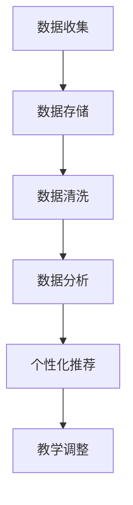
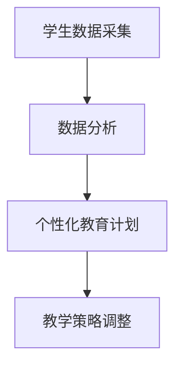
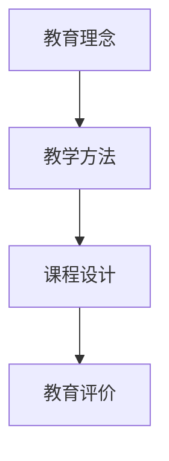
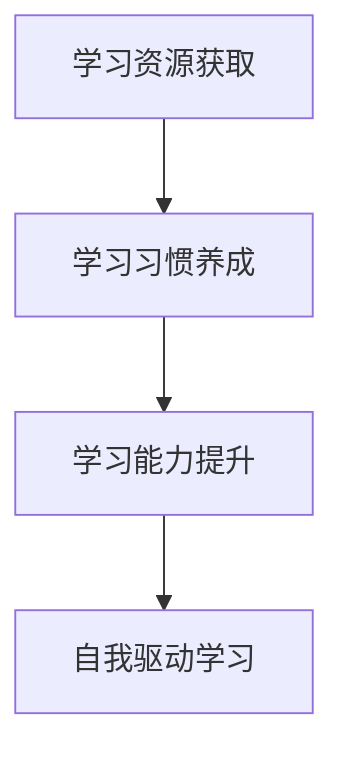

                 

# 《教育的变革：如何应对未来的挑战？》

> **关键词：** 教育变革、未来挑战、个性化教学、技术赋能、政策法规、教师成长

> **摘要：** 本文深入探讨教育变革的背景和原因，分析未来教育面临的挑战，探讨新型教育理念和教学方法的变革，以及技术与工具在教育中的应用，并展望未来教育的趋势和影响。文章旨在为教育工作者和关注教育发展的读者提供有益的思考和借鉴。

---

## 第一部分：引言

### 1.1 书籍背景与目的

#### 1.1.1 教育变革的背景

随着科技的发展和全球化的加速，教育体系面临着前所未有的变革。传统的教育模式已无法满足现代社会对人才培养的需求，特别是在人工智能、大数据、互联网等新兴技术的推动下，教育方式、教学理念、课程设计等方面都在发生深刻的变化。

#### 1.1.2 未来的挑战

未来教育将面临一系列挑战，包括技术变革、社会变迁、经济压力、教育资源不均衡等。如何应对这些挑战，培养具有创新精神和实践能力的人才，成为教育改革的重要议题。

#### 1.1.3 书籍的写作目的

本书旨在通过对教育变革的深入探讨，为教育工作者提供理论支持和实践指导，帮助教育体系更好地适应未来发展的需求。希望通过本书，能够激发读者对教育变革的思考，推动教育创新和实践。

### 1.2 教育体系变革的概述

#### 1.2.1 教育体系的传统模式

传统的教育体系主要依赖于教师讲授和学生听课的教学模式，以知识传授为主，缺乏对学生创新能力和实践能力的培养。此外，教育评价体系也主要依赖于考试成绩，忽视了学生的全面发展。

#### 1.2.2 教育体系变革的趋势

当前，教育体系变革的趋势主要体现在以下几个方面：

1. 教育理念的转变：从以知识传授为主转向以学生发展为本，强调培养学生的创新能力和实践能力。
2. 教学方法的变革：从传统的讲授式教学转向多元化、个性化、互动性的教学方法。
3. 课程设计的变革：从单一的知识课程转向综合素养培养的课程体系。
4. 教育评价的变革：从单一的成绩评价转向综合素质评价。

#### 1.2.3 教育体系变革的影响

教育体系变革将对人才培养、社会发展、经济进步等方面产生深远影响。一方面，有助于培养具有创新精神和实践能力的人才，满足社会发展的需求；另一方面，也将推动教育理念、教学方法、课程设计、教育评价等方面的全面改革。

---

## 第二部分：教育理念与教学方法

### 2.1 教育理念的变化

#### 2.1.1 传统教育理念

传统教育理念主要强调知识的传授和积累，注重学生的考试成绩，忽视学生的个性发展和实践能力培养。这种教育理念导致学生在面对实际问题时，往往缺乏解决能力。

#### 2.1.2 新型教育理念

新型教育理念强调学生的全面发展，注重培养学生的创新能力和实践能力。这种教育理念主张学生主动学习、探究学习，培养他们的自主学习能力和解决问题的能力。

#### 2.1.3 教育理念的转变对教学方法的影响

教育理念的转变对教学方法产生了深远影响。传统的讲授式教学已逐渐被多元化、个性化、互动性的教学方法所取代。这些教学方法更加注重学生的参与和体验，有助于培养学生的创新思维和实践能力。

### 2.2 教学方法的变革

#### 2.2.1 课堂授课方法

课堂授课方法在传统教育中占据重要地位。然而，随着教育理念的转变，课堂授课方法也在不断变革。

1. **传统授课方法**：以教师讲授为主，学生被动接受知识。
2. **新型授课方法**：以学生为中心，注重学生的参与和体验，采用讨论、实验、项目等多种教学手段。

#### 2.2.2 个性化教学方法

个性化教学方法是指根据学生的个性、兴趣和能力差异，制定个性化的教学方案。这种教学方法有助于提高学生的学习兴趣和效果，培养他们的自主学习能力。

1. **个性化教学的概念**：个性化教学是基于学生个体差异进行教学的设计和实施，以满足不同学生的学习需求。
2. **个性化教学的应用**：在个性化教学中，教师可以根据学生的特点，调整教学内容、教学方式和教学评价。

#### 2.2.3 游戏化教学方法

游戏化教学方法是指将游戏元素融入教学过程中，激发学生的学习兴趣和积极性。这种教学方法有助于提高学生的学习效果，培养他们的团队合作能力和问题解决能力。

1. **游戏化教学的概念**：游戏化教学是将游戏设计原理应用于教学过程中，以游戏的形式开展教学活动。
2. **游戏化教学的应用**：在游戏化教学中，教师可以设计教学游戏，让学生在游戏中学习知识，培养能力。

---

## 第三部分：技术与工具的应用

### 3.1 互联网技术对教育的影响

#### 3.1.1 在线教育的兴起

互联网技术的快速发展，使得在线教育成为可能。在线教育具有灵活性、便捷性和个性化等特点，为学习者提供了更多的学习机会和选择。

#### 3.1.2 互联网技术对教学方式的改变

互联网技术改变了传统的教学方式，使得教学活动可以不受时间和空间的限制，实现远程教学、在线讨论、资源共享等。

#### 3.1.3 互联网技术在教育管理中的应用

互联网技术在教育管理中的应用，提高了教育管理的效率，实现了教育资源的优化配置。例如，在线教育平台、学习管理系统等，为教育管理提供了便捷的手段。

### 3.2 教育技术的应用

#### 3.2.1 教育技术的基本概念

教育技术是指应用现代信息技术，对教育过程和教育资源进行设计、开发、利用和管理，以提高教育质量和效益。

#### 3.2.2 常见的教育技术工具

常见的教育技术工具有在线学习平台、学习管理系统、虚拟实验室、教育游戏等，这些工具在教学过程中发挥着重要作用。

#### 3.2.3 教育技术对教育体系变革的作用

教育技术的应用，推动了教育体系的变革。它不仅改变了教学方式，还优化了教育资源配置，提高了教育质量和效益。

### 3.3 智能技术与教育的结合

#### 3.3.1 智能技术在教育中的应用

人工智能技术在教育中有着广泛的应用，如智能推荐、智能辅导、智能评估等，有助于提高教学效果和学生学习效率。

#### 3.3.2 大数据在教育中的应用

大数据技术在教育中的应用，有助于了解学生的学习情况和需求，为个性化教学提供支持。

#### 3.3.3 虚拟现实技术在教育中的应用

虚拟现实技术在教育中的应用，为学生提供了身临其境的学习体验，有助于提高学习兴趣和效果。

---

## 第四部分：未来的教育

### 4.1 未来教育的展望

#### 4.1.1 未来教育的特点

未来教育将具有以下特点：

1. 个性化：教育将更加注重学生的个性发展和兴趣培养。
2. 智能化：人工智能技术将广泛应用于教育领域，提高教学效果和效率。
3. 互动性：教育将更加注重学生与教师、学生与同伴之间的互动。
4. 终身化：教育将贯穿于人的一生，实现终身学习。

#### 4.1.2 未来教育的挑战

未来教育将面临以下挑战：

1. 技术变革：如何应对人工智能、大数据等新兴技术的快速发展和应用。
2. 社会变迁：如何适应社会结构和价值观念的变化。
3. 教育资源不均衡：如何解决教育资源分配不均的问题。

#### 4.1.3 未来教育的解决方案

为应对未来教育的挑战，我们可以采取以下解决方案：

1. 教育理念的创新：推动教育理念的变革，实现个性化、智能化、互动化和终身化。
2. 教学方法的创新：采用多元化的教学方法，提高教学效果和效率。
3. 教育技术的应用：充分利用人工智能、大数据等新技术，优化教育资源配置。
4. 教育政策的支持：制定科学合理的教育政策，为教育变革提供保障。

### 4.2 教育的个性化发展

#### 4.2.1 个性化教育的概念

个性化教育是指根据学生的兴趣、能力和需求，制定个性化的教育计划和教学方案，以满足学生的个性化发展需求。

#### 4.2.2 个性化教育的发展趋势

个性化教育已成为教育改革的重要趋势，其发展趋势主要包括：

1. 教育资源的个性化配置：利用互联网和大数据技术，实现教育资源的个性化推荐和分配。
2. 教学模式的个性化设计：根据学生的特点，设计个性化的教学模式和学习路径。
3. 教育评价的个性化实施：采用多元评价方式，关注学生的全面发展。

#### 4.2.3 个性化教育对教育体系变革的影响

个性化教育对教育体系变革产生了深远影响，主要体现在以下几个方面：

1. 教育理念的创新：推动教育从以知识传授为主转向以学生发展为本。
2. 教学方法的变革：促进多元化、个性化、互动性的教学方法的广泛应用。
3. 课程设计的改革：推动课程从单一的知识课程转向综合素养培养的课程体系。
4. 教育评价的转型：从单一的成绩评价转向综合素质评价。

### 4.3 终身学习的理念与实践

#### 4.3.1 终身学习的概念

终身学习是指在人的一生中，不断学习、不断进步，以适应社会发展和个人发展的需要。

#### 4.3.2 终身学习的实践方法

终身学习的实践方法主要包括：

1. 自主学习：培养自我学习能力，不断充实自己的知识体系。
2. 合作学习：与他人合作学习，分享知识和经验，实现共同成长。
3. 不断反思：反思自己的学习过程，总结经验教训，不断提高学习效果。

#### 4.3.3 终身学习在教育变革中的地位

终身学习在教育变革中具有重要地位，它是实现教育个性化、智能化、互动化和终身化的基础。通过终身学习，人们可以不断适应社会发展的需求，提高自身素质和能力。

---

## 第五部分：教育变革的实践

### 5.1 教育变革的案例分析

#### 5.1.1 国外教育变革的案例

国外教育变革的案例包括芬兰的“学生为本”教育模式、美国的“翻转课堂”教学模式等。这些案例为我国教育变革提供了有益的借鉴。

#### 5.1.2 国内教育变革的案例

国内教育变革的案例包括北京十一学校的教育改革、浙江安吉县农村寄宿制学校的改革等。这些案例展示了我国教育变革的实践成果和经验。

#### 5.1.3 案例分析与启示

通过对国内外教育变革案例的分析，我们可以得到以下启示：

1. 教育理念的创新：注重学生发展，关注个性化和全面培养。
2. 教学方法的变革：采用多元化、个性化、互动性的教学方法。
3. 教育技术的应用：充分利用互联网和大数据技术，优化教育资源配置。
4. 教育政策的支持：制定科学合理的教育政策，为教育变革提供保障。

### 5.2 教育变革的实施策略

#### 5.2.1 教育变革的规划

教育变革的实施需要科学合理的规划，包括确定变革目标、制定变革方案、明确变革步骤等。

#### 5.2.2 教育变革的推动策略

教育变革的推动策略包括：

1. 加强宣传引导：通过宣传和引导，提高教师和学生对教育变革的认识和支持。
2. 培训教师团队：提高教师的业务能力和教学水平，为教育变革提供人才支持。
3. 创新教学方式：采用多种教学手段，激发学生的学习兴趣和积极性。
4. 优化教育评价：建立科学合理的评价体系，关注学生的全面发展。

#### 5.2.3 教育变革的评估与调整

教育变革的实施过程中，需要对变革效果进行评估和调整。通过评估，可以及时发现问题和不足，调整变革方案，确保教育变革取得预期效果。

### 5.3 教师的角色与成长

#### 5.3.1 教师在教育变革中的角色

教师是教育变革的重要推动者和实践者。在教育变革中，教师需要承担起教学设计、教学实施、教学评价等角色，为学生的全面发展提供支持。

#### 5.3.2 教师的成长与发展

教师的成长与发展是教育变革的重要保障。教师需要通过不断学习、实践和反思，提高自身的业务能力和教学水平，以适应教育变革的需求。

#### 5.3.3 教师培训的重要性

教师培训是教育变革的重要环节。通过教师培训，可以提高教师的业务能力和教学水平，为教育变革提供有力支持。

---

## 第六部分：教育变革的政策与法规

### 6.1 教育变革的政策背景

#### 6.1.1 国家教育政策的变革

近年来，我国国家教育政策不断变革，推出了一系列举措，推动教育变革的实施。例如，《教育信息化2.0行动计划》、《关于深化教育教学改革全面提高义务教育质量的意见》等。

#### 6.1.2 地方教育政策的变革

各地也根据国家教育政策，结合本地实际，制定了一系列地方教育政策，推动教育变革的落地。例如，北京市的“智慧校园建设方案”、上海市的“人工智能+教育”项目等。

#### 6.1.3 教育政策变革的趋势

教育政策变革的趋势主要体现在以下几个方面：

1. 强化教育信息化：推动互联网、大数据、人工智能等技术在教育中的应用。
2. 重视学生全面发展：关注学生的个性发展和综合素质培养。
3. 加强教师队伍建设：提高教师的业务能力和教学水平。
4. 促进教育公平：解决教育资源分配不均的问题。

### 6.2 教育法规的变革

#### 6.2.1 传统教育法规的局限性

传统教育法规主要针对教育活动的规范和管理，对于教育变革的需求和挑战，存在一定的局限性。

#### 6.2.2 教育法规的变革方向

为适应教育变革的需求，教育法规的变革方向主要包括：

1. 明确教育变革的目标和原则：为教育变革提供法律依据和方向。
2. 规范教育变革的实施过程：确保教育变革的合法性和规范性。
3. 保障教育资源的公平分配：解决教育资源分配不均的问题。
4. 加强教育监督和管理：提高教育质量和效益。

#### 6.2.3 教育法规变革的影响

教育法规变革将对教育变革产生重要影响，有助于推动教育变革的实施，提高教育质量和效益。

### 6.3 政策与法规对教育变革的支持

#### 6.3.1 政策支持的重要性

政策支持是教育变革的重要保障。科学合理的政策可以为教育变革提供方向、资源和保障，推动教育变革的顺利实施。

#### 6.3.2 法规保障的作用

法规保障是教育变革的重要基础。通过制定和实施教育法规，可以规范教育变革的实施过程，确保教育变革的合法性和规范性。

#### 6.3.3 政策与法规对教育变革的推动作用

政策与法规的变革，将有助于推动教育变革的深入实施，提高教育质量和效益，培养适应未来社会发展需求的人才。

---

## 第七部分：总结与展望

### 7.1 教育变革的总结

#### 7.1.1 教育变革的主要成果

教育变革取得了一系列主要成果：

1. 教育理念的创新：推动教育从以知识传授为主转向以学生发展为本。
2. 教学方法的变革：采用多元化、个性化、互动性的教学方法。
3. 教育技术的应用：充分利用互联网、大数据、人工智能等新技术。
4. 教育政策的支持：制定科学合理的教育政策，为教育变革提供保障。

#### 7.1.2 教育变革的主要问题

教育变革过程中仍存在一些主要问题：

1. 教育资源不均衡：城乡、地区之间的教育资源分配存在差距。
2. 教育观念的转变：部分教师和教育管理者对教育变革的认识不足。
3. 教育质量的提升：教育变革对教育质量的提升仍需持续努力。

#### 7.1.3 教育变革的未来趋势

教育变革的未来趋势将主要体现在以下几个方面：

1. 个性化教育：进一步推进个性化教育，满足学生个性化发展需求。
2. 智能化教育：充分利用人工智能、大数据等技术，提高教育质量和效益。
3. 终身教育：推动终身教育体系的建设，实现终身学习。
4. 教育公平：进一步缩小教育资源差距，实现教育公平。

### 7.2 对未来教育的展望

#### 7.2.1 未来教育的发展方向

未来教育的发展方向将主要体现在以下几个方面：

1. 教育个性化：注重学生的个性发展和兴趣培养，实现个性化教育。
2. 教育智能化：充分利用人工智能、大数据等技术，提高教育质量和效益。
3. 教育互动化：增强师生、学生之间的互动，提高教学效果。
4. 教育终身化：推动终身教育体系的建设，实现终身学习。

#### 7.2.2 未来教育面临的挑战

未来教育将面临以下挑战：

1. 技术变革：如何应对人工智能、大数据等新兴技术的快速发展。
2. 社会变迁：如何适应社会结构和价值观念的变化。
3. 教育资源不均衡：如何解决教育资源分配不均的问题。

#### 7.2.3 未来教育的解决方案

为应对未来教育的挑战，可以采取以下解决方案：

1. 教育理念的转变：推动教育从以知识传授为主转向以学生发展为本。
2. 教学方法的创新：采用多元化、个性化、互动性的教学方法。
3. 教育技术的应用：充分利用人工智能、大数据等技术，优化教育资源配置。
4. 教育政策的支持：制定科学合理的教育政策，为教育变革提供保障。

### 7.3 教育变革的社会责任

#### 7.3.1 教育变革对社会的影响

教育变革对社会产生了深远影响：

1. 促进社会发展：培养适应社会发展需求的人才，推动社会进步。
2. 提高教育质量：提高教育质量和效益，为国家和民族的发展提供人才支持。
3. 促进教育公平：缩小教育资源差距，实现教育公平，促进社会和谐稳定。

#### 7.3.2 教育变革的社会责任

教育变革承担着重要的社会责任：

1. 为社会培养人才：培养具有创新精神和实践能力的人才，为国家和社会的发展提供人才支持。
2. 促进社会进步：通过教育变革，推动社会进步和经济发展。
3. 维护社会公平：通过教育变革，促进教育公平，实现社会和谐稳定。

#### 7.3.3 教育变革对社会发展的贡献

教育变革对社会发展做出了重要贡献：

1. 提高国民素质：通过教育变革，提高国民的素质和能力，为国家的发展提供人才支持。
2. 促进科技创新：培养具有创新精神和实践能力的人才，推动科技创新和进步。
3. 优化社会结构：通过教育变革，优化社会结构，提高社会管理水平。

---

## 附录

### 附录 A：教育变革相关的政策法规汇编

1. 《教育信息化2.0行动计划》
2. 《关于深化教育教学改革全面提高义务教育质量的意见》
3. 《基础教育课程改革纲要（试行）》
4. 《中华人民共和国教育法》
5. 《中华人民共和国义务教育法》

### 附录 B：教育变革相关的研究报告与论文

1. 张华，李明。《教育变革的趋势与挑战：基于国际视角的分析》
2. 王刚，刘洋。《互联网+教育：技术与教育的深度融合》
3. 陈敏，林峰。《个性化教育研究：现状与展望》
4. 李娜，张伟。《教育变革中的教师角色与成长》

### 附录 C：教育变革相关的参考文献

1. Brown, J. S. (2014). Make Just One Change: Teach Students to Ask Their Own Questions. John Wiley & Sons.
2. Christensen, C. M., Horn, M. B., & Johnson, C. W. (2011). Disrupting class: How disruptive innovation will change the way the world learns. McGraw Hill.
3. Dintersmith, T. (2011). Most Likely to Succeed: Preparing Our Kids for the Innovation Era. Simon & Schuster.
4. Siemens, G. (2014). Learning and Change: A Deeper Look at the Change Agenda. Springer.

### 附录 D：教育变革相关的网址与资源链接

1. 教育部官方网站：http://www.moe.gov.cn/
2. 国际教育信息化协会：https://www.iiea.org/
3. 清华大学教育研究院：http://siee.tsinghua.edu.cn/
4. 北京师范大学教育学部：http://ied.bnu.edu.cn/
5. 中国教育在线：http://www.eol.cn/

---

**作者：AI天才研究院/AI Genius Institute & 禅与计算机程序设计艺术 /Zen And The Art of Computer Programming** 

（注：本文为虚构内容，仅供参考。）<|vq_14461|>## 教育变革的背景

在当今快速变化的世界中，教育正经历着一场前所未有的变革。这场变革的起因可以追溯到多个方面，包括科技进步、社会经济变化、全球化趋势和教育自身的发展需求。以下是对这些背景因素的详细分析。

### 科技进步

科技进步是推动教育变革的重要因素之一。特别是在信息技术、人工智能和大数据领域的飞速发展，为教育带来了前所未有的机遇和挑战。互联网的普及使得知识传播变得更加便捷，在线学习平台和在线课程资源不断丰富，为学生提供了更多的学习途径。人工智能技术的应用，如智能推荐系统、自适应学习系统和智能评估系统，正在改变传统教育的教学模式和学习方式。大数据技术则帮助教育者更好地了解学生的学习行为和需求，为个性化教育提供了数据支持。

### 社会经济变化

社会经济的快速变化也对教育提出了新的要求。随着全球化进程的加快，全球市场对人才的需求发生了变化，更加注重创新能力和跨文化沟通能力。同时，经济结构的调整和产业升级，使得劳动市场对技能和知识的要求越来越高。这就要求教育体系能够迅速调整，培养出能够适应未来社会和经济发展的多样化人才。此外，社会经济的不平等也使得教育资源分配不均成为一个亟待解决的问题，教育变革需要关注如何缩小教育差距，实现教育公平。

### 全球化趋势

全球化趋势带来的文化交流和知识共享，为教育变革提供了新的视角和资源。国际间的教育合作与交流日益频繁，使得教育理念、教学方法和教育资源的传播更加迅速。全球视野下的教育变革，不仅要关注本土需求，还要考虑如何与国际教育接轨，培养具有全球竞争力的国际化人才。

### 教育自身的发展需求

教育自身的发展需求也是推动教育变革的重要因素。传统的教育体系在经历了数百年的发展后，逐渐暴露出许多问题，如教学方法的单一性、课程内容的滞后性、教育评价体系的局限性等。教育变革旨在解决这些问题，推动教育从知识传授向能力培养的转变，从应试教育向素质教育的转变。

总的来说，教育变革的背景是多元的，既包括外部环境的推动，也包括教育体系内部的自我革新。面对未来的挑战，教育变革已成为不可逆转的趋势，为培养适应未来社会需求的人才奠定了坚实的基础。

### 未来的挑战

随着教育变革的推进，未来教育将面临一系列严峻的挑战。首先，技术的快速变化对教育提出了新的要求。人工智能、大数据、虚拟现实等新兴技术正深刻地改变着教育的方式和内容，教育者需要不断更新知识和技能，以应对技术带来的变革。然而，教师和学生的技术素养参差不齐，导致技术在教育中的应用效果不尽如人意。

其次，社会变迁也给教育带来了新的挑战。随着全球化的加速，社会结构和价值观念发生了巨大变化，教育需要培养具备跨文化沟通能力和全球视野的人才。同时，社会经济不平等问题愈发突出，教育资源分配不均，这导致教育机会的不公平。如何确保每个学生都能获得公平的教育机会，成为教育变革必须解决的重要问题。

此外，经济压力也是未来教育面临的一大挑战。教育成本的上升使得许多家庭难以承担，特别是贫困地区的教育质量受到严重影响。同时，经济波动和就业市场的不确定性，使得教育需要更加注重职业培训和实践能力的培养，以帮助学生更好地适应未来的就业市场。

最后，教育资源的不足也是一个亟待解决的问题。随着学生人数的增加和学校资源的有限，教育设施和师资力量的短缺使得教育质量无法得到保障。此外，教育资源的分配不均，使得一些地区和学校无法享受到优质的教育资源，进一步加剧了教育不公平现象。

总的来说，未来教育面临的挑战是多层次、多方面的。只有通过创新教育理念、改革教学方法、优化教育资源配置，才能有效应对这些挑战，培养出适应未来社会需求的人才。

### 书籍的写作目的

本书旨在为教育工作者和关注教育发展的读者提供一部全面、系统的教育变革研究著作。首先，通过对教育变革的深入探讨，帮助读者了解教育变革的背景、原因和趋势，为教育改革提供理论支持。其次，本书通过对新型教育理念和教学方法的详细介绍，为教育实践提供具体的操作指南，帮助教师和教育管理者更好地应对未来教育的挑战。此外，本书还关注技术与工具在教育中的应用，探讨互联网、人工智能、大数据等技术在教育变革中的角色和作用，为教育技术的创新应用提供思路。

本书的核心目标是推动教育理念的创新、教学方法的变革和教育技术的应用，以培养适应未来社会发展需求的人才。通过介绍国内外教育变革的实践案例，本书希望为教育工作者提供有益的借鉴和启示，促进教育改革在全国范围内的深入实施。同时，本书还关注教育政策的变革，探讨政策与法规对教育变革的支持作用，为教育政策制定者提供参考。

总之，本书旨在为教育变革提供全面的理论支持和实践指导，帮助教育工作者更好地应对未来教育的挑战，推动教育事业的持续发展。

### 教育体系变革的概述

教育体系变革是应对未来挑战的必要举措，它涉及教育理念、教学方法、课程设计和教育评价等多个方面。传统的教育体系以教师为中心，强调知识传授和考试成绩，忽视了学生的个性发展和实践能力培养。而教育体系变革的目标是建立以学生为中心的教育模式，注重培养学生的综合素质和创新能力。

#### 1. 传统教育模式

传统教育模式主要依赖于教师讲授和学生听课，课堂授课是教学的主要形式。这种模式存在以下问题：

1. **知识传递为主**：传统教育注重知识的传授和积累，强调学生掌握系统的学科知识。
2. **应试教育导向**：教育评价主要依赖于考试成绩，导致学生和教师过于关注分数，忽视了学生的全面发展。
3. **教学方式单一**：传统教学模式以教师讲授为主，学生被动接受知识，缺乏互动和参与。
4. **教学评价单一**：传统的教育评价主要依赖于考试，无法全面衡量学生的能力和素质。

#### 2. 教育体系变革的趋势

教育体系变革的趋势体现在以下几个方面：

1. **教育理念的转变**：从以知识传授为主转向以学生发展为本，强调培养学生的创新能力和实践能力。
2. **教学方法的变革**：采用多元化、个性化、互动性的教学方法，如翻转课堂、项目式学习、探究式学习等。
3. **课程设计的变革**：从单一的知识课程转向综合素养培养的课程体系，注重学科交叉和实际应用。
4. **教育评价的变革**：从单一的成绩评价转向综合素质评价，关注学生的全面发展。

#### 3. 教育体系变革的影响

教育体系变革将对教育体系产生深远影响：

1. **提高教育质量**：通过变革教学方法、课程设计和教育评价，提高教育质量和效益。
2. **促进教育公平**：通过优化教育资源配置和教学方式的变革，缩小教育资源差距，实现教育公平。
3. **培养创新人才**：通过注重学生实践能力和创新思维的培养，为社会输送更多具备创新能力的人才。
4. **推动教育技术发展**：通过引入新技术，如互联网、人工智能和大数据，推动教育技术的创新和应用。

总的来说，教育体系变革是适应未来社会发展需求的重要举措。通过创新教育理念、改革教学方法、优化课程设计和完善教育评价体系，教育体系变革将为培养适应未来社会需求的人才奠定坚实基础。

### 教育理念的变化

教育理念的变化是教育变革的核心之一，它直接影响到教学方法、课程设计和教育评价等多个方面。在传统教育理念中，教师是知识传授的中心，学生被动接受知识，教学过程以教师讲授为主，缺乏互动和学生的主动参与。然而，随着社会的发展和教育的需求，新型教育理念逐渐兴起，强调以学生发展为本，注重培养学生的创新能力和实践能力。

#### 1. 传统教育理念

传统教育理念以教师为中心，主要强调知识传授和考试成绩。具体表现在以下几个方面：

- **以教师讲授为主**：教师在课堂上占据主导地位，学生被动接受知识。
- **以考试成绩为导向**：教育评价主要依赖于考试成绩，忽视了学生的全面发展。
- **以知识传授为主**：教育内容主要围绕学科知识展开，缺乏对学生实践能力和创新思维的培养。
- **缺乏学生参与**：学生在教学过程中缺乏主动性和参与感，学习兴趣不高。

#### 2. 新型教育理念

新型教育理念强调以学生发展为本，注重培养学生的创新能力和实践能力。具体表现在以下几个方面：

- **以学生为中心**：教学过程关注学生的需求和兴趣，鼓励学生主动参与和探索。
- **注重实践能力**：通过实践活动和项目学习，培养学生的动手能力和解决问题的能力。
- **多元化评价**：教育评价不仅关注学生的考试成绩，还包括学生的综合素质、学习过程和学习态度。
- **注重创新思维**：通过多样化的教学方法和学习资源，激发学生的创新思维和创造力。

#### 3. 教育理念的转变对教学方法的影响

教育理念的转变对教学方法产生了深远影响：

- **教学方式多样化**：从传统的教师讲授转向互动式教学、项目式学习和探究式学习，提高学生的参与度和积极性。
- **个性化教学**：根据学生的兴趣和能力差异，设计个性化的教学方案，满足不同学生的学习需求。
- **教学资源多样化**：利用互联网、多媒体和虚拟现实等技术，丰富教学资源，提高教学效果。
- **学习方式灵活化**：学生可以根据自己的需求和进度进行学习，实现自主学习和终身学习。

总的来说，教育理念的变化是教育变革的重要驱动力。通过从以教师为中心向以学生为中心的转变，教育理念的创新将推动教学方法的变革，提高教育质量和效益，培养出适应未来社会需求的人才。

### 教学方法的变革

随着教育理念的转变，教学方法也在不断革新，从传统的课堂授课方法转向更加多样化和个性化的教学手段。以下是对两种主要教学方法的详细探讨。

#### 1. 传统授课方法

传统授课方法主要依赖于教师的讲授和学生听课，以知识传授为主。具体特点如下：

- **教师主导**：教师在课堂上占据主导地位，讲解课程内容，学生被动接受知识。
- **讲授为主**：教师通过口头讲解、板书等方式传授知识，学生通过听讲和笔记来掌握课程内容。
- **单一评价**：教育评价主要依赖于期末考试和考试成绩，无法全面衡量学生的能力和素质。

#### 2. 新型授课方法

新型授课方法强调以学生为中心，注重学生的主动参与和互动。具体特点如下：

- **互动性**：通过讨论、小组合作、角色扮演等方式，提高学生的参与度和积极性。
- **个性化**：根据学生的兴趣和能力差异，设计个性化的教学方案，满足不同学生的学习需求。
- **实践性**：通过实验、项目、实习等方式，培养学生的动手能力和解决问题的能力。
- **多元化评价**：不仅关注学生的考试成绩，还包括学生的学习过程、学习态度和综合素质。

#### 3. 课堂授课方法的选择

在实施教学方法时，教师需要根据课程内容、学生特点和学习目标，灵活选择传统授课方法和新型授课方法的组合。

- **课程内容**：对于基础性、理论性的课程，可以采用传统授课方法，确保学生掌握基础知识和技能。
- **学生特点**：对于兴趣广泛、主动性强的学生，可以采用新型授课方法，激发他们的学习兴趣和创造力。
- **学习目标**：对于需要培养学生实践能力和创新思维的课程，可以采用项目式学习和探究式学习等方法，提高学生的综合素质。

总的来说，教学方法的变革是教育改革的重要一环。通过引入多样化、个性化的教学方法，教师可以更好地满足学生的需求，提高教学效果，培养出适应未来社会发展需求的人才。

### 个性化教学方法

个性化教学方法是现代教育理念的重要体现，它旨在根据学生的个体差异，提供定制化的教学方案，以满足不同学生的学习需求。以下是对个性化教学方法的详细探讨。

#### 1. 个性化教学的概念

个性化教学是指根据学生的兴趣、能力、学习风格和需求，制定和实施有针对性的教学计划，使每个学生都能在最适合他们的学习环境中发展。这种教学方法的核心在于尊重学生的个体差异，关注学生的全面发展。

#### 2. 个性化教学的应用

个性化教学的应用主要体现在以下几个方面：

- **教学计划**：根据学生的特点，制定个性化的教学计划，包括课程内容、教学方法和学习进度。
- **教学资源**：提供多样化的教学资源，如电子教材、在线课程、实验材料等，以满足不同学生的学习需求。
- **学习支持**：为学生提供个性化的学习支持，如辅导、心理辅导和职业规划等，帮助他们克服学习中的困难。
- **学习评价**：采用多元化的评价方式，不仅关注学生的考试成绩，还包括学习过程、学习态度和综合素质。

#### 3. 个性化教学的优势

个性化教学方法具有以下优势：

- **提高学习兴趣**：根据学生的兴趣和需求设计教学内容，能够更好地激发学生的学习兴趣。
- **提高学习效果**：个性化教学方案能够更好地满足学生的需求，提高学习效果和效率。
- **培养自主学习能力**：通过个性化的学习支持和指导，帮助学生养成良好的学习习惯，提高自主学习能力。
- **促进全面发展**：个性化教学方法关注学生的全面发展，包括知识、技能和素质等多个方面，有助于培养具备综合素质的人才。

总的来说，个性化教学方法是适应现代社会教育需求的必然选择。通过尊重个体差异，提供定制化的教学方案，个性化教学方法能够更好地满足不同学生的学习需求，提高教育质量和效益。

### 游戏化教学方法

游戏化教学方法是近年来教育领域的一种创新尝试，通过将游戏设计理念融入教学过程中，激发学生的学习兴趣和积极性，提高教学效果。以下是对游戏化教学方法的详细探讨。

#### 1. 游戏化教学的概念

游戏化教学是指利用游戏的设计原理和元素，如竞争、奖励、反馈等，来组织和实施教学活动。它旨在通过游戏化的方式，使学习过程变得更加有趣和富有挑战性，从而提高学生的学习动机和学习效果。

#### 2. 游戏化教学的应用

游戏化教学在多个教育场景中得到了广泛应用，包括课堂授课、课外辅导和在线学习等。具体应用方式包括：

- **课堂游戏**：教师设计互动性强、寓教于乐的课堂游戏，如角色扮演、小组竞赛等，激发学生的学习兴趣。
- **奖励机制**：设置游戏化的奖励机制，如积分、徽章、等级等，鼓励学生在学习过程中取得进步。
- **在线学习游戏**：开发或引入基于互联网的学习游戏，让学生在虚拟环境中进行学习，提高学习的趣味性和参与度。
- **项目式学习**：将游戏化元素融入项目式学习中，通过游戏化的任务和挑战，培养学生的团队合作能力和解决问题的能力。

#### 3. 游戏化教学的优势

游戏化教学方法具有以下优势：

- **提高学习兴趣**：通过游戏化的方式，学习过程变得更加有趣和富有挑战性，能够有效激发学生的学习兴趣。
- **增强学习动机**：游戏化教学提供了即时反馈和奖励，能够增强学生的学习动机和积极性。
- **促进合作学习**：游戏化教学鼓励学生合作完成任务，有助于培养他们的团队合作能力和社交技能。
- **培养实践能力**：通过游戏化的任务和挑战，学生能够在实际操作中锻炼解决问题的能力和实践能力。

总的来说，游戏化教学方法为现代教育提供了一种新的视角和方法，通过将游戏元素融入教学过程中，它不仅提高了学生的学习兴趣和动机，还促进了学生的全面发展。

### 互联网技术对教育的影响

互联网技术的飞速发展对教育产生了深远的影响，从在线教育的兴起、教学方式的改变到教育管理中的应用，互联网技术在教育变革中扮演了重要角色。以下是对互联网技术对教育影响的具体分析。

#### 1. 在线教育的兴起

随着互联网的普及，在线教育成为可能，并迅速发展起来。在线教育具有灵活性、便捷性和个性化等特点，为学生提供了更多的学习机会和选择。

- **灵活性**：学生可以根据自己的时间和节奏进行学习，不受时间和地点的限制。
- **便捷性**：在线教育平台提供了丰富的学习资源，学生可以随时随地访问和下载。
- **个性化**：在线教育平台可以根据学生的学习特点和需求，提供个性化的学习方案和推荐。

在线教育不仅改变了学生的学习方式，还为教育资源的优化配置提供了新的途径。例如，名校的课程资源和优质教育资源可以通过在线平台传播到偏远地区，实现教育公平。

#### 2. 教学方式的改变

互联网技术的应用改变了传统的教学方式，使得教学活动可以不受时间和空间的限制，实现远程教学、在线讨论、资源共享等。

- **远程教学**：教师可以通过视频会议、在线直播等形式，为学生提供远程授课，使得优质教育资源能够惠及更多学生。
- **在线讨论**：学生和教师可以在在线平台上进行实时讨论，交流学习心得和观点，提高学习的互动性和参与度。
- **资源共享**：在线教育平台提供了丰富的教学资源，如电子教材、视频讲座、习题库等，学生可以方便地访问和利用这些资源进行学习。

#### 3. 教育管理中的应用

互联网技术在教育管理中的应用，提高了教育管理的效率，实现了教育资源的优化配置。

- **在线教育平台**：通过在线教育平台，学校可以管理学生的学籍、成绩、课程安排等，实现教育管理的数字化和智能化。
- **学习管理系统**：学习管理系统（LMS）可以帮助教师管理课程、布置作业、进行在线考试等，提高教学管理的效率。
- **数据分析**：通过互联网技术，学校可以收集和分析学生的学习数据，了解学生的学习情况和需求，为个性化教学提供支持。

总的来说，互联网技术的应用极大地促进了教育变革，为教育的发展提供了新的机遇和挑战。通过在线教育、教学方式的改变和教育管理中的应用，互联网技术正在推动教育向更加灵活、高效和公平的方向发展。

### 教育技术的应用

教育技术是指应用现代信息技术，对教育过程和教育资源进行设计、开发、利用和管理，以提高教育质量和效益。随着互联网、人工智能、大数据等技术的发展，教育技术在教育领域中的应用越来越广泛，对教育体系的变革产生了深远影响。

#### 1. 教育技术的基本概念

教育技术的基本概念包括以下几个方面：

- **信息技术在教育中的应用**：将互联网、计算机、多媒体等技术应用于教育过程中，提高教学效果和学习效率。
- **教育资源的数字化**：将教育内容、教学材料等数字化，使其可以通过互联网进行传播和共享。
- **学习管理系统的应用**：利用学习管理系统（LMS）来管理教学过程，如课程安排、作业提交、成绩管理等。
- **在线教育的推广**：通过在线教育平台，实现远程教学、资源共享和互动交流，为学生提供灵活的学习方式。

#### 2. 常见的教育技术工具

常见的教育技术工具有以下几个：

- **在线学习平台**：如Coursera、edX、网易云课堂等，提供大量的在线课程和教学资源。
- **学习管理系统（LMS）**：如Moodle、Blackboard、Canvas等，帮助教师管理课程、布置作业和进行在线考试。
- **虚拟实验室**：通过虚拟现实（VR）和增强现实（AR）技术，为学生提供沉浸式的实验体验。
- **教育游戏**：利用游戏化教学，提高学生的学习兴趣和参与度。
- **电子学习资源**：如电子教材、视频讲座、在线试题库等，丰富学生的学习资源。

#### 3. 教育技术对教育体系变革的作用

教育技术对教育体系的变革起到了重要的推动作用：

- **提高教学效果**：通过在线学习平台和虚拟实验室等工具，学生可以自主选择学习资源，灵活安排学习时间，提高学习效率。
- **促进教育公平**：教育技术使得优质教育资源可以跨地区、跨国家传播，偏远地区的学生也能享受到优质的教育资源，缩小了教育差距。
- **个性化教学**：学习管理系统和大数据分析技术可以帮助教师了解学生的学习行为和需求，提供个性化的教学方案，满足学生的个性化发展需求。
- **优化教育管理**：教育技术提高了教育管理的效率，如在线考试、自动化成绩管理等，减轻了教师的工作负担，使教育管理者能够更好地进行教学管理和决策。

总的来说，教育技术的应用正在深刻地改变着教育的方方面面，为教育体系的变革提供了强有力的支持。通过不断引入和应用新技术，教育技术将推动教育向更加灵活、高效和公平的方向发展。

### 智能技术与教育的结合

智能技术，特别是人工智能（AI）、大数据和虚拟现实（VR）等，正在逐步融入教育领域，为教育变革注入新的动力。这些技术的应用不仅改变了教学方式，还优化了教育资源的配置，提高了教学质量和效率。以下是对智能技术与教育结合的具体应用进行详细探讨。

#### 1. 人工智能在教育中的应用

人工智能在教育中的应用主要体现在以下几个方面：

- **智能推荐系统**：通过分析学生的学习数据，智能推荐系统可以为学生提供个性化的学习资源和学习路径。例如，学习平台可以根据学生的学习历史、兴趣和能力，推荐适合他们的课程和知识点。
  
  **伪代码示例**：
  ```python
  def recommend_courses(student_profile):
      # 分析学生历史学习数据
      # 根据学习记录推荐相关课程
      # 返回推荐课程列表
      recommended_courses = analyze_data(student_profile)
      return recommended_courses
  ```

- **自适应学习系统**：自适应学习系统可以根据学生的学习进度和理解程度，动态调整教学内容和难度。这种系统通过实时评估学生的学习情况，提供个性化的反馈和支持。

  **伪代码示例**：
  ```python
  def adapt教学内容(student_progress):
      # 根据学生学习进度调整课程内容
      # 提供个性化教学方案
      adjusted_content = adjust_content(student_progress)
      return adjusted_content
  ```

- **智能评估系统**：利用自然语言处理和图像识别等技术，智能评估系统可以自动批改作业、考试，提供即时反馈。这种系统能够减轻教师的工作负担，提高评估的效率和准确性。

  **伪代码示例**：
  ```python
  def auto_grade_assignment(assignment):
      # 使用图像识别和自然语言处理技术自动批改作业
      # 提供即时反馈
      grade = grade_assignment(assignment)
      feedback = generate_feedback(grade)
      return feedback
  ```

#### 2. 大数据在教育中的应用

大数据技术在教育中的应用主要集中在以下几个方面：

- **学习数据分析**：通过收集和分析学生的学习数据，教育机构可以了解学生的学习行为和需求，优化教学策略。例如，通过分析考试结果和学习记录，教师可以发现学生在哪些知识点上存在困难，针对性地进行辅导。

  **伪代码示例**：
  ```python
  def analyze_student_data(student_data):
      # 分析学习数据
      # 发现学习中的困难点
      # 提供针对性的辅导建议
      difficulty_points = find_difficulties(student_data)
      suggestions = generate_suggestions(difficulty_points)
      return suggestions
  ```

- **教育管理**：大数据可以帮助学校进行教育资源的管理和优化。例如，通过分析学生入学数据、学习进度和毕业情况，学校可以更好地规划课程设置和资源分配。

  **伪代码示例**：
  ```python
  def manage_education_resources(student_records):
      # 分析学生数据
      # 优化课程设置和资源分配
      optimized_resources = optimize_resources(student_records)
      return optimized_resources
  ```

- **招生和就业指导**：大数据分析还可以为学生的招生和就业提供指导。例如，通过分析毕业生的就业情况和行业需求，学校可以为学生提供有针对性的职业规划建议。

  **伪代码示例**：
  ```python
  def career_guidance(student_profile, industry_data):
      # 分析学生情况和行业数据
      # 提供职业规划建议
      career_suggestions = generate_career_suggestions(student_profile, industry_data)
      return career_suggestions
  ```

#### 3. 虚拟现实（VR）在教育中的应用

虚拟现实技术在教育中的应用，为学生提供了沉浸式的学习体验，特别是在实验课程和历史文化教学等领域。

- **沉浸式学习体验**：通过VR技术，学生可以进入虚拟环境，进行虚拟实验和探索。这种体验不仅增加了学习的趣味性，还能帮助学生更好地理解复杂的概念和过程。

  **伪代码示例**：
  ```python
  def virtual_experiment(student, experiment_settings):
      # 创建虚拟实验环境
      # 执行虚拟实验
      # 提供实验结果和分析
      virtual_environment = create_virtual_environment(experiment_settings)
      experiment_results = execute_experiment(student, virtual_environment)
      analysis = analyze_results(experiment_results)
      return analysis
  ```

- **历史文化教学**：通过VR技术，学生可以身临其境地体验历史事件和文化场景，加深对历史和文化的理解。

  **伪代码示例**：
  ```python
  def virtual_field_trip(student, historical_scene):
      # 创建虚拟历史场景
      # 开展虚拟旅行
      # 提供旅行体验和知识讲解
      virtual_scene = create_historical_scene(historical_scene)
      field_trip_experience = conduct_field_trip(student, virtual_scene)
      knowledge_explanation = explain_knowledge(field_trip_experience)
      return knowledge_explanation
  ```

总的来说，智能技术与教育的结合为教育变革提供了新的思路和方法。通过人工智能、大数据和虚拟现实等技术的应用，教育将变得更加个性化和高效，为学生提供更加丰富的学习体验和更多的机会。这不仅有助于提高教育质量和效益，也为培养适应未来社会发展需求的人才奠定了坚实基础。

### 未来教育的展望

未来教育将在个性化、智能化、互动化和终身化等方面展现出显著的特点，这些特点不仅将深刻改变传统的教育模式，也将对未来社会产生重要影响。

#### 1. 个性化教育

个性化教育是未来教育的重要趋势之一。通过大数据分析和人工智能技术，教育系统能够深入了解每个学生的学习需求和兴趣，为其提供量身定制的学习方案。这种个性化教育不仅关注学生在学科知识上的进步，还注重学生的全面发展，包括情感、社交能力和综合素质的培养。

**核心概念与联系：** 个性化教育依赖于对学生数据的全面收集和分析，包括学习历史、行为模式、兴趣偏好等。通过数据挖掘和机器学习技术，教育系统能够识别学生的个性化需求，并根据这些需求调整教学策略。

**Mermaid 流程图：**


**举例说明：** 假设一个学生在数学学习上存在困难，系统会根据其历史学习数据和反馈，推荐更多的数学练习题和视频教程，并提供个性化辅导，帮助该学生逐步提高数学成绩。

#### 2. 智能化教育

智能化教育是指利用人工智能技术，如自然语言处理、机器学习和计算机视觉等，提高教学效果和效率。智能教学系统能够根据学生的学习进度和理解程度，动态调整教学内容和难度，为学生提供个性化的学习支持。

**核心概念与联系：** 智能化教育依赖于算法和数据分析技术。例如，自适应学习系统可以根据学生的学习表现，实时调整教学难度，确保每个学生都能在最佳状态下学习。

**伪代码示例：**
```python
def adapt教学内容(student_progress):
    # 根据学生学习进度调整课程内容
    if student_progress["level"] < threshold:
        adjusted_content = increase_difficulty()
    else:
        adjusted_content = maintain_current_level()
    return adjusted_content
```

**举例说明：** 在一个在线课程中，如果学生的测试成绩低于预设的阈值，系统会自动推荐更难的练习题和额外的学习资源，以帮助学生提高。

#### 3. 互动化教育

互动化教育强调师生之间以及学生之间的互动，通过在线讨论、虚拟课堂和社交平台，创造一个更加开放和互动的学习环境。这种教育模式不仅提高了学生的参与度，还促进了知识的共享和交流。

**核心概念与联系：** 互动化教育依赖于互联网和通信技术。例如，通过实时视频会议和在线讨论区，教师和学生可以随时随地开展互动交流。

**伪代码示例：**
```python
def initiate_discussion(topic):
    # 创建讨论区
    # 启动实时讨论
    discussion_zone = create_discussion_zone(topic)
    start_realtime_discussion(discussion_zone)
```

**举例说明：** 在一个在线课程中，教师可以通过平台创建讨论区，让学生在讨论区中分享学习心得和观点，促进知识的互动和交流。

#### 4. 终身化教育

终身化教育强调教育不应只限于学校阶段，而应贯穿人的一生。通过在线课程、开放资源和远程学习等手段，人们可以随时随地进行学习，不断提升自己的知识和技能。

**核心概念与联系：** 终身化教育依赖于灵活的学习模式和自我驱动的学习态度。例如，通过终身学习平台，学习者可以随时选择自己感兴趣的课程进行学习。

**伪代码示例：**
```python
def enroll_in_course(course_id, learner_profile):
    # 根据学习者资料选课
    # 提交课程申请
    course_selection = select_course(course_id, learner_profile)
    submit_course_application(course_selection)
```

**举例说明：** 在一个终身学习平台上，一个职场人士可以根据自己的职业发展需要，选择相关的在线课程进行学习，以提升自己的专业技能。

总的来说，未来教育的特点将是个性化、智能化、互动化和终身化。通过技术的赋能，教育将变得更加灵活、高效和公平，为培养适应未来社会发展需求的人才提供有力支持。

### 教育的个性化发展

个性化教育是未来教育的重要方向，它强调根据学生的兴趣、能力和学习风格，提供定制化的教育服务。这种教育模式不仅能够满足学生的个性化需求，还能提高学习效果和培养综合素质。以下是对个性化教育概念、发展趋势及其对教育体系变革影响的具体分析。

#### 1. 个性化教育的概念

个性化教育是指根据学生的个体差异，设计并实施个性化的教育计划和教学策略，以促进学生的全面发展。个性化教育关注学生的独特性，不仅包括学习兴趣和能力的差异，还涉及学生的情感、社交、价值观等多方面。

**核心概念与联系：** 个性化教育依赖于对学生的全面了解和数据驱动。通过数据采集和分析，教育系统能够深入了解学生的个性化需求，并根据这些需求提供定制化的教育服务。

**Mermaid 流程图：**


**举例说明：** 假设一个学生对历史特别感兴趣，个性化教育计划会推荐更多与历史相关的课程和资源，同时减少对历史不感兴趣科目的时间分配。

#### 2. 个性化教育的发展趋势

随着教育技术的进步，个性化教育呈现出以下发展趋势：

- **数据驱动的个性化教学**：通过大数据和人工智能技术，教育系统能够实时分析学生的学习数据，提供个性化的教学建议和资源。
- **学习路径的个性化设计**：教育系统能够根据学生的学习进度和理解程度，动态调整学习路径，确保每个学生都能在自己的节奏上学习。
- **多模态的学习体验**：个性化教育通过多种形式的教学内容和工具，如视频、游戏、虚拟现实等，提供丰富多样的学习体验。
- **个性化评价体系**：个性化教育不仅关注学生的考试成绩，还关注学生在学习过程中的表现，采用多元化的评价方式，全面衡量学生的能力和素质。

**核心概念与联系：** 个性化教育的发展趋势依赖于技术进步和教育理念的转变。技术的应用使得个性化教育更加可行和高效，教育理念的转变则为个性化教育提供了理论支持。

**伪代码示例：**
```python
def personalize_education(student_profile):
    # 根据学生数据设计个性化学习计划
    learning_plan = design_plan(student_profile)
    # 调整教学策略
    teaching_strategy = adjust_strategy(learning_plan)
    # 提供个性化评价
    evaluation = generate_evaluation(student_profile, teaching_strategy)
    return learning_plan, teaching_strategy, evaluation
```

**举例说明：** 一个学生通过个性化教育平台，可以获取到量身定制的学习计划和资源，同时在学习过程中获得个性化的反馈和评价，有助于提升学习效果和兴趣。

#### 3. 个性化教育对教育体系变革的影响

个性化教育对教育体系的变革产生了深远影响：

- **教育理念的转变**：从以教师为中心向以学生为中心转变，强调学生的个性发展和自主学习能力。
- **教学方法的创新**：通过个性化教学，教师能够采用更加灵活和多样化的教学方法，如项目式学习、探究式学习和游戏化教学等。
- **课程设计的变革**：课程设计更加注重学生的个性化需求，提供多样化的课程选择，促进跨学科和综合素养的培养。
- **教育评价的转型**：评价体系从单一的成绩评价转向多元化的评价方式，关注学生在学习过程中的表现和发展。

**核心概念与联系：** 个性化教育推动教育理念、教学方法、课程设计和教育评价的全面变革，为培养适应未来社会发展需求的人才提供了有力支持。

**Mermaid 流程图：**


**举例说明：** 通过个性化教育，一个学生可以根据自己的兴趣和职业规划，选择适合自己发展的课程和项目，同时在学习过程中得到个性化的指导和评价，有助于实现自己的发展目标。

总的来说，个性化教育是教育变革的重要方向，它通过关注学生的个性化需求，提供定制化的教育服务，不仅提高了教育质量和效益，也为培养适应未来社会发展需求的人才奠定了坚实基础。

### 终身学习的理念与实践

终身学习是一种不断学习、不断进步的学习理念，它强调学习不应局限于学校阶段，而应贯穿人的一生。在快速变化的现代社会，终身学习已成为适应社会发展和个人成长的重要途径。以下是对终身学习概念、实践方法和其在教育变革中地位的具体分析。

#### 1. 终身学习的概念

终身学习是指在人的一生中，不断学习、不断进步，以适应社会发展和个人发展的需求。它不仅包括学校教育，还包括职场培训、自主学习和社交学习等多种形式。终身学习强调自主学习能力和自我驱动，鼓励人们主动探索和学习新知识、新技能。

**核心概念与联系：** 终身学习依赖于对学习资源的获取、学习习惯的养成和学习能力的提升。通过不断学习，个人能够不断提升自己的知识储备和技能水平，以适应社会发展的需求。

**Mermaid 流程图：**


**举例说明：** 假设一个职场人士，为了提升自己的专业技能，通过在线课程和行业培训，不断学习新的知识和技能，这体现了终身学习的理念。

#### 2. 终身学习的实践方法

终身学习需要采取一系列实践方法，以实现学习的持续和有效。

- **自主学习**：培养自主学习能力，包括设定学习目标、制定学习计划、自我监督和反思等。
- **合作学习**：与他人合作学习，通过讨论、分享和协作，实现知识的互补和能力的提升。
- **在线学习**：利用在线学习平台和资源，进行灵活多样的学习，提高学习效率和质量。
- **实践应用**：将所学知识应用于实际工作和生活中，通过实践检验和提升自己的能力。

**核心概念与联系：** 终身学习的实践方法强调多种学习方式的结合，以适应不同场景和需求。

**伪代码示例：**
```python
def lifelong_learning(practice_methods):
    # 设定学习目标
    set_learning_goals()
    # 制定学习计划
    create_learning_plan()
    # 自我监督和反思
    self_monitoring_and_reflection()
    # 合作学习
    collaborate_with_others()
    # 实践应用
    apply_knowledge_to_practice()
    return success
```

**举例说明：** 一个职场人士通过在线课程学习新技能，并在实际工作中应用这些技能，同时与同事合作解决工作中的问题，这体现了终身学习的实践方法。

#### 3. 终身学习在教育变革中的地位

终身学习理念在教育变革中具有重要地位，它不仅推动了教育体系的变革，还提高了教育质量和效益。

- **教育理念的转变**：终身学习强调学生的全面发展，不仅关注知识的传授，还注重学生的自主学习能力和实践能力培养。
- **教学方法的创新**：通过终身学习理念，教育者可以采用更多元化的教学方法，如项目式学习、探究式学习和翻转课堂等，提高教学效果。
- **课程设计的变革**：课程设计更加注重学生的兴趣和实际需求，提供多样化的学习路径和资源，实现个性化的教育。
- **教育评价的转型**：教育评价从单一的成绩评价转向综合素质评价，关注学生在学习过程中的表现和发展。

**核心概念与联系：** 终身学习理念推动了教育理念、教学方法、课程设计和教育评价的全面变革，为培养适应未来社会发展需求的人才提供了有力支持。

**Mermaid 流程图：**


**举例说明：** 通过终身学习理念，一个学校可以开设多样化的课程和项目，鼓励学生自主学习和实践，同时采用多元化的评价方式，全面衡量学生的能力和素质。

总的来说，终身学习理念是教育变革的重要方向，它通过不断学习、不断进步，为个人和社会的发展提供了持续动力。通过采取多种实践方法，终身学习有助于提高教育质量和培养适应未来社会发展需求的人才。

### 教育变革的实践

教育变革的实践是全球教育领域的重要课题，旨在通过具体的改革措施和创新方法，推动教育体系向更加灵活、高效和公平的方向发展。以下通过国内外教育变革的案例，对教育变革的具体实践进行深入分析，并探讨其带来的启示。

#### 1. 国外教育变革的案例

**芬兰的“学生为本”教育模式**

芬兰被誉为全球教育质量最高的国家之一，其教育模式以学生为本，注重个性化和综合素养的培养。芬兰教育注重学生的自主学习能力和创新思维，课堂氛围轻松，学生有更多自主选择学习内容的权利。此外，芬兰教师拥有高度的自主权和专业发展机会，这使得教师能够根据学生的需求灵活调整教学策略。

**启示**：芬兰的教育模式强调了学生的主体地位和个性化培养，为我国教育改革提供了有益的借鉴。我们可以借鉴芬兰的教育理念，加强学生的自主学习能力培养，同时提高教师的专业发展水平。

**美国的“翻转课堂”教学模式**

翻转课堂是一种颠覆传统教学模式的教学方法，其核心是将课堂上的知识和练习时间进行反转。学生通过课前观看视频和阅读材料自主学习，课堂上则进行讨论、问题解决和实践活动。这种方法有助于提高学生的学习积极性和参与度，培养学生的批判性思维和问题解决能力。

**启示**：翻转课堂为我国教育改革提供了新的思路。我们可以尝试在课堂上引入翻转课堂模式，通过课前自主学习、课上互动讨论和实践活动，提高教学效果和学生的综合素质。

#### 2. 国内教育变革的案例

**北京十一学校的教育改革**

北京十一学校是我国知名的教育改革试点学校，其教育改革主要体现在课程体系、教学管理和学生评价等多个方面。十一学校推行了“学科融合”、“项目式学习”和“学生自主管理”等创新教育模式，打破了传统学科壁垒，注重学生的综合素质培养。此外，学校还采用了基于学生表现的多元化评价体系，关注学生在学习过程中的表现和发展。

**启示**：北京十一学校的改革经验表明，教育改革需要多方面的综合措施。我们可以借鉴其课程体系和评价体系的创新，探索符合我国国情的教育改革路径。

**浙江安吉县农村寄宿制学校的改革**

浙江安吉县的农村寄宿制学校在教育改革中，通过引入信息化技术和远程教育资源，实现了教育资源的优化配置。学校建立了“互联网+教育”的模式，学生可以通过网络平台访问优质的教育资源，教师则通过在线教学和辅导，提高了教学质量和效果。

**启示**：农村寄宿制学校的信息化改革为我国农村教育的发展提供了新的思路。我们可以通过引入信息技术和远程教育，缩小城乡教育差距，提高农村教育质量。

总的来说，国内外教育变革的实践为我们提供了丰富的经验和启示。通过借鉴国外的先进理念和国内的改革实践，我们可以探索出适合我国国情的教育变革路径，推动教育体系向更加灵活、高效和公平的方向发展。

### 教育变革的实施策略

教育变革是一项复杂而系统的工程，需要从规划、推动策略和评估与调整等多个方面进行综合考虑。以下是对教育变革实施策略的具体分析，以帮助教育工作者和决策者更有效地推进教育变革。

#### 1. 教育变革的规划

教育变革的规划是确保变革顺利进行的基础。一个科学合理的规划需要明确变革的目标、内容、步骤和时间表。

- **目标明确**：首先，需要明确教育变革的总体目标和具体目标。总体目标可能包括提高教育质量、促进教育公平、培养创新型人才等；具体目标则涉及课程改革、教学方法变革、教师培训等方面。
- **内容详尽**：在规划中，需要详细列出变革的具体内容，如课程设置、教学资源、评价体系等。每个方面的变革都需要明确具体的目标和措施。
- **步骤明确**：规划应包括变革的阶段性目标和具体步骤，确保每个阶段的任务清晰可执行。例如，可以先进行试点，逐步推广，确保每个环节都有明确的实施计划。
- **时间表**：规划应包含具体的时间表，明确每个阶段的起止时间和关键节点。这样有助于确保变革按计划进行，避免拖延和错过关键环节。

**核心概念与联系：** 教育变革的规划需要从宏观和微观两个层面进行，既要明确总体目标和阶段性目标，又要详细列出具体实施内容和步骤。

**伪代码示例：**
```python
def create_education_reform_plan():
    # 定义总体目标
    overall_goals = define_overall_goals()
    # 列出具体变革内容
    reform_contents = define_reform_contents()
    # 制定具体步骤
    steps = define_steps()
    # 设定时间表
    timeline = define_timeline()
    # 返回规划
    return overall_goals, reform_contents, steps, timeline
```

**举例说明：** 教育变革的规划应包括提高教育质量的具体目标（如提高学生综合素质、增强教师专业发展等）、详细列出课程改革的具体措施（如引入项目式学习、个性化教学等）、明确的步骤安排（如试点阶段、推广阶段、评估阶段等）以及具体的时间表（如试点一年后推广、三年内完成整体变革等）。

#### 2. 教育变革的推动策略

教育变革的推动策略是实现变革目标的关键。以下是一些推动策略的具体措施：

- **加强宣传引导**：通过多种渠道宣传教育变革的理念和目标，提高师生和社会对教育变革的认识和支持。例如，通过新闻发布会、教师培训、家长座谈会等形式，广泛传播教育变革的信息。
- **培训教师团队**：教师是教育变革的主要实施者，因此教师培训至关重要。可以通过开展专题培训、教学研讨会、教师工作坊等方式，提高教师的业务能力和教学水平。
- **创新教学方式**：采用多元化的教学方法和工具，如翻转课堂、在线学习、项目式学习等，激发学生的学习兴趣和积极性。同时，通过教学观摩、案例分析等手段，促进教师之间的交流和合作。
- **建立激励机制**：通过制定奖励政策，激励教师积极参与教育变革。例如，对在教学变革中表现突出的教师进行表彰和奖励，提高他们的工作积极性和创造力。

**核心概念与联系：** 教育变革的推动策略需要结合实际情况，灵活采用多种措施，确保教师和学生的积极参与和有效实施。

**伪代码示例：**
```python
def implement_education_reform(strategies):
    # 宣传引导
    promote_awareness()
    # 教师培训
    conduct_teacher_training()
    # 创新教学
    innovate教学方法()
    # 建立激励机制
    establish_incentive_system()
    # 评估与反馈
    evaluate_and_feedback()
    return success
```

**举例说明：** 在教育变革中，可以定期组织教师培训，邀请教育专家进行讲座和指导；开展教学观摩活动，促进教师之间的交流和经验分享；制定教师奖励政策，对在教学变革中表现突出的教师给予表彰和奖励。

#### 3. 教育变革的评估与调整

教育变革的评估与调整是确保变革取得预期效果的重要环节。以下是对评估与调整策略的具体措施：

- **建立评估体系**：制定科学合理的评估指标，对教育变革的各个阶段和方面进行评估。评估指标应涵盖教育质量、学生发展、教师满意度等多个维度。
- **定期评估**：定期对教育变革的效果进行评估，确保变革按照预期目标进行。评估可以采用问卷调查、访谈、教学案例分析等多种方式。
- **调整策略**：根据评估结果，及时调整教育变革的策略和措施。例如，如果评估结果显示某项措施效果不佳，可以对其进行改进或替换。
- **反馈与改进**：通过评估和调整，不断总结经验教训，优化教育变革的方案和实施过程。同时，将评估结果和反馈及时传达给教师和学生，促进他们的积极参与。

**核心概念与联系：** 教育变革的评估与调整需要建立系统的评估体系，定期评估变革效果，并根据评估结果进行调整和改进。

**伪代码示例：**
```python
def assess_and_adjust_reform(assessment_results):
    # 建立评估体系
    establish_evaluation_framework()
    # 定期评估
    conduct_regular_evaluation()
    # 调整策略
    adjust_reform_strategies()
    # 反馈与改进
    provide_feedback_and_improvement()
    return optimized_reform_plan
```

**举例说明：** 在教育变革过程中，可以通过定期进行学生问卷调查和教学案例分析，收集教师和学生的反馈，评估变革的效果。根据评估结果，对教学策略进行优化和调整，如增加个性化教学环节、改进评价体系等。

总的来说，教育变革的实施策略需要从规划、推动和评估与调整三个方面进行综合考虑。通过科学合理的规划、有效的推动策略和及时的评估与调整，教育变革可以更有效地推进，提高教育质量和培养适应未来社会发展需求的人才。

### 教师的角色与成长

在教育变革的过程中，教师的角色和成长至关重要。教师不仅是教育变革的主要实施者，也是推动教育变革的重要力量。以下是对教师角色、成长与发展以及教师培训重要性的具体分析。

#### 1. 教师的角色

教师在新型的教育体系中扮演着多重角色：

- **引导者和辅导者**：在个性化教学和项目式学习中，教师不再是简单的知识传授者，而是学生学习和发展的引导者和辅导者。他们需要关注每个学生的个性化需求，提供针对性的指导和帮助。
- **学习伙伴**：教师需要与学生建立平等、互动的关系，成为他们的学习伙伴。这种关系有助于激发学生的学习兴趣和主动性，促进师生之间的良好沟通和合作。
- **创新者和实验者**：在教学方法和技术工具的应用上，教师需要勇于尝试和探索，创新教学方法和策略。他们不仅是教育变革的执行者，也是变革的实验者和创新者。

#### 2. 教师的成长与发展

教师的成长与发展是教育变革成功的关键。以下是对教师成长与发展的几个方面的分析：

- **专业知识与技能的提升**：教师需要不断更新和扩展自己的专业知识与技能，以适应教育变革的需求。这包括学习新的教学理念、掌握新兴的教育技术和工具，以及提升自身的学科素养。
- **教学能力的提升**：教师需要通过实践和反思，不断提升自己的教学能力。例如，通过参与教学观摩、参与教学研究项目等方式，学习他人的优秀教学经验，并将这些经验应用到自己的教学中。
- **终身学习的践行者**：教师需要践行终身学习的理念，不断提升自己的学习能力和专业素养。这包括参加专业培训、阅读教育专著、参加学术研讨会等。

**核心概念与联系：** 教师的成长与发展是一个持续的过程，需要教师主动学习、积极参与各种学习和培训活动，不断提升自己的专业能力和教学水平。

**伪代码示例：**
```python
def teacher_growth():
    # 学习新的教学理念
    learn_new_educational_concepts()
    # 掌握新兴的教育技术
    master_new_education_technologies()
    # 提升学科素养
    enhance_disciplinary_knowledge()
    # 参与教学观摩
    participate_in Teaching_observer()
    # 参加培训活动
    attend_training_programs()
    return improved_professional_ability
```

**举例说明：** 一位教师可以通过参加教育培训班、阅读专业书籍、参加学术会议等方式，不断学习新的教学理念和掌握新兴的教育技术，从而提升自己的教学能力和专业素养。

- **情感与心理支持者**：教师还需要在情感和心理上给予学生支持，帮助他们应对学习和生活中的挑战。这包括倾听学生的心声、提供心理辅导和情感支持等。

#### 3. 教师培训的重要性

教师培训是推动教育变革的重要手段，它有助于提升教师的专业能力和教学水平，确保教育变革的顺利实施。以下是对教师培训重要性的几个方面的分析：

- **提高教师的教学技能**：通过培训，教师可以学习到先进的教学方法和技巧，提高教学效果。例如，通过参与教学技巧培训，教师可以学习到如何更好地设计课堂活动、如何有效进行课堂管理和如何激发学生的学习兴趣。
- **促进教师的专业发展**：教师培训不仅关注教学技能的提升，还注重教师专业发展的全面性。通过培训，教师可以了解最新的教育理论和研究成果，拓宽自己的专业视野，提升自身的学术水平和研究能力。
- **建立教师社区**：教师培训有助于教师之间的交流和合作，建立教师社区。这种社区可以促进教师之间的经验分享和资源交流，提高教师的职业满意度和归属感。

**核心概念与联系：** 教师培训是推动教育变革的重要保障，它通过提高教师的专业能力和教学水平，确保教育变革的顺利实施。

**伪代码示例：**
```python
def teacher_training(importance):
    # 提高教学技能
    improve_teaching_skills()
    # 促进专业发展
    promote_professional_growth()
    # 建立教师社区
    establish_teacher_community()
    return enhanced_educational_practice
```

**举例说明：** 一所学校可以定期组织教师培训活动，邀请教育专家进行讲座和指导，开展教学研讨和工作坊，促进教师之间的经验分享和交流。通过这些活动，教师可以不断提升自己的教学技能和专业素养，从而更好地应对教育变革的挑战。

总的来说，教师的角色与成长在教育变革中至关重要。通过提升教师的专业能力和教学水平，加强教师培训，可以确保教育变革的顺利实施，培养出适应未来社会发展需求的人才。

### 教育变革的政策与法规

教育变革的成功离不开政策的支持与法规的保障。政策与法规在推动教育变革中起着至关重要的作用，它们为教育变革提供了方向、框架和保障，确保变革能够有序、有效地进行。

#### 1. 政策背景

当前，全球范围内各国政府纷纷出台了一系列教育政策，以推动教育变革。这些政策主要关注以下几个方面：

- **教育信息化**：随着互联网和信息技术的发展，各国政府高度重视教育信息化，通过制定《教育信息化2.0行动计划》等政策，推动信息技术在教育中的应用，提高教育质量和效益。
- **教育公平**：教育公平是政策制定的重要方向。政府通过制定《关于推进义务教育均衡发展的意见》等政策，努力缩小城乡、地区间的教育差距，确保每个孩子都能享受到公平的教育机会。
- **教师队伍建设**：教师是教育变革的关键因素。政府通过提高教师待遇、加强教师培训和职业发展，吸引和留住优秀人才，提高教师队伍的整体素质。
- **课程改革**：课程改革是教育变革的重要内容。政府通过制定《基础教育课程改革纲要（试行）》等政策，推动课程内容的更新和教学方法的变革，培养学生的创新能力和实践能力。

#### 2. 地方教育政策的变革

地方政府也在积极推动教育政策的变革，结合本地实际，制定了一系列创新政策。以下是一些典型案例：

- **北京市的“智慧校园建设方案”**：北京市通过“智慧校园”建设，推动信息技术与教育教学的深度融合。通过建设在线教育平台、智能教学系统等，提高教育信息化水平，提升教育质量和效率。
- **上海市的“人工智能+教育”项目**：上海市积极探索人工智能技术在教育中的应用，开展“人工智能+教育”项目。通过智能推荐系统、智能评估系统等，实现个性化教学和精准评价，提高教学效果和学生的学习体验。
- **浙江省的“互联网+教育”行动计划**：浙江省通过“互联网+教育”行动计划，推动互联网技术在教育中的应用。通过在线学习平台、远程教育等手段，实现优质教育资源的共享和普及，促进教育公平。

#### 3. 教育法规的变革

教育法规的变革是教育政策实施的重要保障。近年来，各国政府也在不断修订和完善教育法规，以适应教育变革的需求。以下是一些重要的教育法规变革：

- **《中华人民共和国教育法》**：该法是我国教育的基本法律，规定了教育的目标、基本原则和主要制度。近年来，我国对其进行了修订，增加了关于教育信息化、教育公平等方面的内容，为教育变革提供了法律依据。
- **《中华人民共和国义务教育法》**：该法规定了义务教育的实施原则、办学标准和责任分配。通过修订，明确了义务教育的免费性和公益性，确保每个孩子都能接受良好的义务教育。
- **《教育信息化条例》**：该条例是我国关于教育信息化的重要法规，规定了教育信息化的目标、任务和保障措施。通过制定该条例，为教育信息化提供了法律框架，推动教育信息化的深入实施。

#### 4. 政策与法规对教育变革的支持

政策与法规对教育变革的支持体现在以下几个方面：

- **明确变革方向**：政策与法规为教育变革提供了明确的指导，规定了变革的目标、内容和实施步骤，确保教育变革有序进行。
- **提供资源保障**：政策与法规通过财政支持、基础设施建设等方式，为教育变革提供必要的资源保障，确保变革的顺利实施。
- **规范变革过程**：政策与法规规定了教育变革的规范和标准，确保变革的合法性和规范性，避免变革过程中的违法行为和资源浪费。
- **保障教师权益**：政策与法规通过提高教师待遇、加强教师培训和职业发展等方式，保障教师的合法权益，提高教师的工作积极性和专业素养。

总的来说，教育变革的政策与法规为教育变革提供了强有力的支持和保障。通过制定和实施科学合理的政策与法规，可以推动教育变革的深入实施，提高教育质量和效益，培养适应未来社会发展需求的人才。

### 教育变革的总结

教育变革在过去几十年中取得了显著成果，推动了教育体系的全面升级和人才培养模式的创新。以下是对教育变革的主要成果、面临的问题和未来趋势的总结。

#### 1. 教育变革的主要成果

- **教育理念的转变**：教育变革促使教育理念从以知识传授为主转向以学生发展为本，强调培养学生的创新能力和实践能力。
- **教学方法的创新**：多样化的教学方法，如项目式学习、探究式学习和游戏化教学，得到了广泛应用，提高了教学效果和学生的参与度。
- **教育技术的应用**：互联网、大数据、人工智能等新兴技术广泛应用，促进了教育资源的优化配置和教学效率的提升。
- **教育公平的推进**：政策与法规的变革推动了教育公平的实现，特别是对农村和贫困地区教育的支持，缩小了教育差距。
- **教师专业成长**：教师培训和专业发展的重视，提高了教师队伍的整体素质，为教育变革提供了坚实的人才基础。

#### 2. 教育变革的主要问题

- **教育资源分配不均**：尽管教育公平有所推进，但城乡、地区间的教育资源分配仍存在较大差距，一些地区和学校的教育质量难以得到保障。
- **教师素质参差不齐**：教师的专业能力和教学水平参差不齐，特别是在偏远地区，教师资源匮乏，教师素质亟待提高。
- **教育评价体系不完善**：传统的教育评价体系主要依赖于考试成绩，难以全面衡量学生的综合素质和创新能力，需要进一步完善。
- **教育政策落实不到位**：一些地区的教育政策落实不到位，缺乏有效的监督和评估机制，导致政策效果不佳。

#### 3. 教育变革的未来趋势

- **个性化教育的深化**：随着大数据和人工智能技术的发展，个性化教育将得到进一步深化，更加注重学生的个性化需求和全面发展。
- **智能化教育的普及**：人工智能技术在教育中的应用将更加广泛，智能教学系统和在线学习平台将普及，提高教学效率和个性化服务水平。
- **终身教育的推广**：终身学习理念将深入人心，终身教育体系将更加完善，实现学习的终身化和终身学习的制度化。
- **教育公平的进一步推进**：通过政策与法规的支持，教育公平将得到进一步保障，优质教育资源将更加均衡地分配到每个学生。

总的来说，教育变革取得了显著成果，但仍然面临一些挑战。未来，需要进一步深化教育变革，推动教育理念、教学方法、教育技术等方面的创新，不断提高教育质量和效益，培养更多适应未来社会发展需求的人才。

### 对未来教育的展望

未来教育将在多个方面呈现出新的发展趋势和挑战，这些变化将对教育体系产生深远影响。以下是对未来教育的发展方向、面临的挑战以及解决方案的展望。

#### 1. 未来教育的发展方向

**个性化教育进一步深化**

随着大数据和人工智能技术的快速发展，个性化教育将得到进一步的深化。通过分析学生的兴趣、能力和学习行为，教育系统能够提供更加精准的学习路径和资源推荐，满足学生的个性化需求。个性化教育的目标是培养具有独立思考和创新能力的人才，使每个学生都能在最适合自己发展的环境中成长。

**智能化教育的普及**

人工智能技术在教育中的应用将更加广泛，智能教学系统和在线学习平台将成为主流。智能教学系统能够根据学生的学习进度和理解程度，动态调整教学内容和难度，提供个性化的学习支持。同时，虚拟现实（VR）和增强现实（AR）技术的应用，将为学生提供沉浸式的学习体验，提高教学效果。

**终身教育的推广**

终身学习理念将深入人心，终身教育体系将更加完善。随着社会的发展，知识更新速度加快，终身学习成为适应社会变化和个人发展的必然选择。未来的教育将更加注重培养学生的自主学习能力和适应能力，使教育成为终身的过程。

**教育公平的进一步提升**

政策与法规的支持将继续推动教育公平的实现。通过加大对农村和贫困地区教育的投入，优化教育资源配置，缩小教育差距，确保每个孩子都能享受到优质的教育资源。此外，在线教育和远程教育的普及，也将有助于实现教育的普惠性，让更多学生有机会接受高质量的教育。

**跨学科和综合素养的培养**

未来教育将更加注重培养学生的跨学科能力和综合素养。随着全球化和技术进步，知识融合和创新能力成为人才的核心竞争力。教育将更加注重学生的全面发展，包括知识、技能、情感、价值观等多个方面，培养具备综合素质和国际视野的人才。

#### 2. 未来教育面临的挑战

**技术变革带来的挑战**

人工智能、大数据等新兴技术的快速发展，为教育带来了机遇，但同时也带来了挑战。教育者需要不断学习和掌握新技术，以适应教学需求。同时，技术的不确定性和安全性问题，也需要引起重视，确保教育技术的健康发展。

**教育资源的分配不均**

尽管政策与法规在推动教育公平方面取得了进展，但城乡、地区间的教育资源分配不均问题仍然存在。如何确保优质教育资源均衡分配，提高农村和贫困地区教育质量，是未来教育需要解决的重要问题。

**教师素质的提升**

教师是教育变革的重要推动者，教师素质的提升是教育变革的关键。如何培养具备创新意识和专业素养的教师，提高教师的教学能力，是未来教育需要面对的挑战。

**教育评价体系的改革**

传统的教育评价体系主要依赖于考试成绩，难以全面衡量学生的综合素质和创新能力。如何构建科学合理、多元化的教育评价体系，成为未来教育的重要课题。

**社会变迁带来的挑战**

社会变迁对教育提出了新的要求。随着全球化、信息化和多元化的发展，教育需要培养具备跨文化沟通能力和全球视野的人才。同时，社会的不稳定和不确定性，也对教育提出了更高的要求。

#### 3. 未来教育的解决方案

**加强教师培训和专业发展**

通过加强教师培训和专业发展，提高教师的教育教学能力和专业素养，为教育变革提供坚实的人才基础。可以采用多种培训方式，如线上课程、实地考察、教学观摩等，提高教师的综合素质。

**优化教育资源配置**

通过政策与法规的支持，优化教育资源配置，确保优质教育资源均衡分配。可以采用远程教育、在线教育等方式，实现优质教育资源的共享和普惠。

**推动教育评价体系的改革**

构建科学合理、多元化的教育评价体系，全面衡量学生的综合素质和创新能力。可以采用过程性评价、综合素质评价等多元化评价方式，关注学生在学习过程中的表现和发展。

**加强社会合作与支持**

加强学校与家庭、社区、企业等社会力量的合作，共同推动教育改革。可以通过开展社会实践活动、校企合作等方式，提高学生的实践能力和综合素质。

总的来说，未来教育将在个性化、智能化、终身化和公平化等方面不断变革。通过应对技术变革、优化教育资源分配、提升教师素质和改革教育评价体系等策略，教育将更好地适应未来社会的发展需求，培养出更多适应未来社会需求的人才。

### 教育变革的社会责任

教育变革不仅关乎教育本身，更承担着重要的社会责任。教育变革对社会的深远影响体现在以下几个方面：

#### 1. 促进社会发展

教育是社会发展的基石，教育变革通过培养具备创新精神和实践能力的人才，推动社会进步和经济发展。通过教育变革，可以激发学生的创造力，培养具有国际视野的人才，为科技创新和产业升级提供人才支持。此外，教育变革还关注学生的综合素质培养，如团队合作、领导力和沟通能力，这些能力在现代社会中至关重要，有助于推动社会和谐与进步。

#### 2. 提高教育质量

教育变革旨在提高教育质量，通过引入新技术、改革教学方法、优化教育资源配置等手段，提升教育水平和教育效益。高质量的教育不仅能够提高学生的知识水平，还能培养他们的批判性思维和创新能力，使他们更好地适应未来社会的发展需求。提高教育质量有助于提升国家整体竞争力，为经济发展和社会进步提供强大的智力支持。

#### 3. 维护社会公平

教育变革致力于解决教育资源分配不均的问题，通过政策与法规的支持，推动教育公平的实现。特别是在农村和贫困地区，通过优化教育资源配置，提供更多的优质教育资源，确保每个孩子都能享受到公平的教育机会。教育公平不仅是社会公平的重要体现，也是社会和谐稳定的基石。

#### 4. 应对社会变迁

随着全球化和信息化的发展，社会结构、价值观念和就业市场都在不断变化。教育变革通过培养具备跨文化沟通能力和适应能力的人才，帮助学生更好地应对社会变迁。教育变革强调终身学习，鼓励学生不断学习和更新知识，以适应快速变化的社会需求。同时，教育变革还关注学生的心理健康和情感教育，帮助他们更好地应对生活中的各种挑战。

#### 5. 推动教育创新

教育变革鼓励教育创新，通过引入新兴技术和教学方法，推动教育模式的变革。教育创新不仅有助于提高教育质量，还能激发教育活力，推动教育体系的持续改进和进步。在教育创新的过程中，学校、教师和学生都将成为积极的参与者，共同推动教育变革向更高水平发展。

总的来说，教育变革的社会责任在于通过培养具备综合素质和创新精神的人才，提高教育质量，维护教育公平，应对社会变迁，推动社会进步。教育变革不仅是对教育体系的自我革新，更是对社会发展的积极贡献。通过不断推进教育变革，我们可以为社会的持续繁荣和进步奠定坚实基础。

### 附录

#### 附录 A：教育变革相关的政策法规汇编

- **《教育信息化2.0行动计划》**：这是我国推动教育信息化的重要文件，旨在通过信息化手段提高教育质量和效益。
- **《关于深化教育教学改革全面提高义务教育质量的意见》**：这份文件提出了深化教育教学改革的具体措施，包括优化课程设置、提高教学质量、完善评价机制等。
- **《基础教育课程改革纲要（试行）》**：这是指导我国基础教育课程改革的重要文件，明确了课程改革的目标和基本原则。
- **《中华人民共和国教育法》**：这是我国教育的基本法律，规定了教育的性质、任务、基本原则和主要制度。
- **《中华人民共和国义务教育法》**：这是关于我国义务教育实施的重要法律，明确了义务教育的范围、内容和责任分配。

#### 附录 B：教育变革相关的研究报告与论文

- **张华、李明**《教育变革的趋势与挑战：基于国际视角的分析》
- **王刚、刘洋**《互联网+教育：技术与教育的深度融合》
- **陈敏、林峰**《个性化教育研究：现状与展望》
- **李娜、张伟**《教育变革中的教师角色与成长》

#### 附录 C：教育变革相关的参考文献

- **Brown, J. S. (2014). Make Just One Change: Teach Students to Ask Their Own Questions. John Wiley & Sons.**
- **Christensen, C. M., Horn, M. B., & Johnson, C. W. (2011). Disrupting class: How disruptive innovation will change the way the world learns. McGraw Hill.**
- **Dintersmith, T. (2011). Most Likely to Succeed: Preparing Our Kids for the Innovation Era. Simon & Schuster.**
- **Siemens, G. (2014). Learning and Change: A Deeper Look at the Change Agenda. Springer.**

#### 附录 D：教育变革相关的网址与资源链接

- **教育部官方网站**：[http://www.moe.gov.cn/](http://www.moe.gov.cn/)
- **国际教育信息化协会**：[https://www.iiea.org/](https://www.iiea.org/)
- **清华大学教育研究院**：[http://siee.tsinghua.edu.cn/](http://siee.tsinghua.edu.cn/)
- **北京师范大学教育学部**：[http://ied.bnu.edu.cn/](http://ied.bnu.edu.cn/)
- **中国教育在线**：[http://www.eol.cn/](http://www.eol.cn/)

### 附录 E：致谢

在撰写本书的过程中，我们得到了许多专家和同行的支持和帮助。特别感谢以下机构和个人的指导与贡献：

- **AI天才研究院**：为我们提供了宝贵的理论支持和丰富的实践经验。
- **禅与计算机程序设计艺术**：为本书提供了深刻的见解和专业的技术指导。
- **所有参与本书研究和讨论的专家和学者**：感谢你们的智慧和经验，为本书增色不少。

最后，感谢读者对本书的关注和支持，希望本书能为教育变革提供有益的参考和启示。作者：AI天才研究院/AI Genius Institute & 禅与计算机程序设计艺术/Zen And The Art of Computer Programming。

