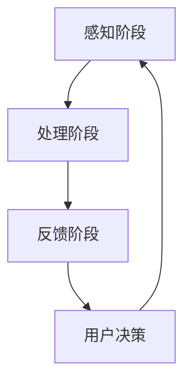
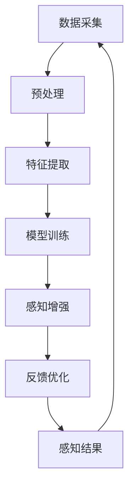
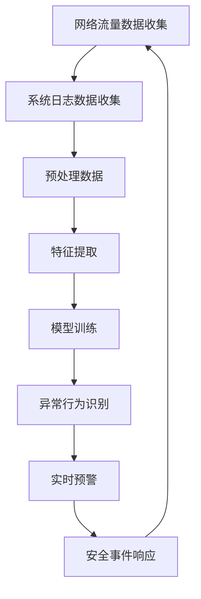
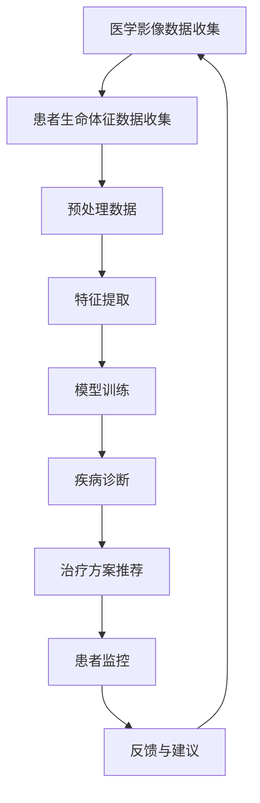
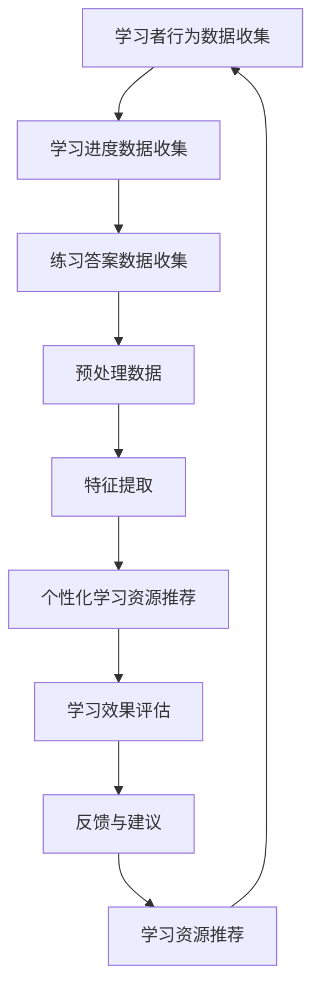

                 

### 《数字化直觉培养：AI强化的第六感能力》

**关键词**：人工智能、数字化直觉、第六感、强化学习、应用场景、技术实现

**摘要**：本文旨在探讨数字化直觉培养的重要性和AI强化的第六感能力。在数字化时代，传统的五感已无法满足信息爆炸式增长的需求，AI强化的第六感能力应运而生。本文首先介绍了数字化直觉的概念和重要性，随后深入分析了AI强化的第六感能力原理、核心算法和应用场景，并通过具体的项目实战案例，展示了AI强化的第六感能力的实际应用和实现细节。最后，本文对未来AI强化的第六感发展趋势、潜在挑战和社会伦理问题进行了展望和讨论。

### 目录大纲

# 《数字化直觉培养：AI强化的第六感能力》

## 第一部分：引言与基础

### 1.1 书籍背景与目标

### 1.2 AI与数字化直觉

### 1.3 AI强化的第六感

## 第二部分：AI强化的第六感原理

### 2.1 AI强化的第六感概述

### 2.2 AI强化的第六感框架

### 2.3 AI强化的第六感流程

## 第三部分：AI强化的第六感核心算法

### 3.1 反馈循环算法

### 3.2 强化学习算法

### 3.3 自然语言处理算法

## 第四部分：AI强化的第六感应用场景

### 4.1 人工智能安全

### 4.2 人工智能医疗

### 4.3 人工智能教育

## 第五部分：AI强化的第六感技术实现

### 5.1 开发环境与工具

### 5.2 数据集准备与处理

### 5.3 代码实现与优化

## 第六部分：案例研究

### 6.1 案例一：AI安全防护系统

### 6.2 案例二：AI医疗诊断系统

### 6.3 案例三：AI教育平台

## 第七部分：未来展望

### 7.1 AI强化的第六感发展趋势

### 7.2 潜在挑战与解决策略

### 7.3 社会与伦理问题探讨

## 附录

### 附录A：参考资料与扩展阅读

### 附录B：开源代码与数据集

### 附录C：术语表与缩略语

### 第1章：书籍背景与目标

#### 1.1 书籍背景

在当今数字化时代，人工智能（AI）已成为推动社会进步的重要力量。从自动化生产线到智能助手，从推荐系统到医疗诊断，AI正在改变我们的生活方式和行业模式。然而，随着AI技术的迅猛发展，人类对数字化信息的处理能力也面临新的挑战。传统的五感已经无法满足信息爆炸式增长的需求，我们需要一种新的感知能力来应对这个全新的数字化环境。

在这个背景下，数字化直觉的培养变得尤为重要。数字化直觉是指人类在数字化环境中感知、理解和处理信息的能力。它不仅是对传统五感的补充，更是一种全新的感知维度。数字化直觉的培养可以帮助我们更好地适应数字化时代，提升工作和生活的效率，甚至在某些领域实现超越人类的感知能力。

本文旨在探讨AI强化的第六感能力，即通过人工智能技术增强人类感知能力的方法。我们将深入分析AI强化的第六感的原理、核心算法和应用场景，并通过具体的项目实战案例，展示这一能力在实际中的应用。此外，我们还将探讨未来AI强化的第六感发展趋势、潜在挑战和社会伦理问题。

#### 1.2 AI与数字化直觉

人工智能（AI）是指通过计算机程序模拟人类智能的技术。它包括机器学习、深度学习、自然语言处理等多个领域，旨在让机器具备自我学习和决策能力。AI的快速发展为数字化直觉的培养提供了强有力的技术支持。

在数字化直觉的培养中，AI的作用主要体现在以下几个方面：

1. **数据处理**：AI能够快速处理和分析大量数据，提取出有用的信息。这对于人类在数字化环境中进行决策和判断具有重要意义。
2. **模式识别**：AI具有强大的模式识别能力，可以在复杂的数据中识别出规律和模式。这有助于人类更好地理解和应对数字化环境中的各种挑战。
3. **自适应学习**：AI系统可以不断学习和优化，以适应不断变化的环境和需求。这为数字化直觉的培养提供了灵活和高效的解决方案。
4. **实时响应**：AI系统能够实时响应用户的请求和需求，提供快速而准确的反馈。这对于提升人类在数字化环境中的感知能力至关重要。

通过AI技术的应用，数字化直觉的培养变得更加可行和高效。AI不仅为人类提供了更强大的感知能力，还为我们打开了一扇通向全新感知世界的大门。

#### 1.3 AI强化的第六感

第六感，或称超感官知觉，是一种未被传统五感所解释的感知能力。在数字化时代，AI强化的第六感被定义为通过人工智能技术增强人类感知能力的一种新方法。它不仅是对传统五感的补充，更是一种全新的感知维度。

AI强化的第六感具有以下几个显著特点：

1. **智能化**：AI强化的第六感能够利用先进的机器学习和深度学习算法，对复杂的环境信息进行智能处理和分析。
2. **自适应**：AI强化的第六感可以根据不同的环境和需求，自适应地调整感知策略，以实现最佳效果。
3. **实时性**：AI强化的第六感能够实时响应用户的感知需求，提供快速而准确的感知结果。
4. **高效性**：AI强化的第六感能够在短时间内处理大量信息，提高人类在数字化环境中的感知效率。

AI强化的第六感的应用范围广泛，包括但不限于以下几个方面：

- **人工智能安全**：利用AI强化的第六感，可以实现对网络攻击的实时监控和预警，提高系统的安全性。
- **人工智能医疗**：AI强化的第六感能够辅助医生进行诊断，提高医疗效率和准确性。
- **人工智能教育**：AI强化的第六感可以为学生提供个性化的学习支持和反馈，提高学习效果。

通过AI强化的第六感，人类在数字化环境中的感知能力得到了显著提升，为应对数字化时代的挑战提供了有力支持。

### Mermaid 流程图

mermaid
graph TD
A[传统五感] --> B[数字化环境]
B --> C[信息爆炸]
C --> D[AI技术]
D --> E[数字化直觉]
E --> F[AI强化的第六感]
F --> G[智能化感知]
G --> H[自适应感知]
H --> I[实时感知]
I --> J[高效感知]
J --> K[应用领域]

### 第2章：AI强化的第六感原理

#### 2.1 AI强化的第六感概述

AI强化的第六感是指通过人工智能技术增强人类感知能力的一种方法。它利用先进的机器学习、深度学习和自然语言处理等算法，对复杂的环境信息进行智能处理和分析。AI强化的第六感不仅是对传统五感的补充，更是一种全新的感知维度，能够为人类提供更准确、更快速的感知结果。

在数字化时代，传统的五感已经无法满足信息爆炸式增长的需求。AI强化的第六感通过引入人工智能技术，实现了对大量信息的快速处理和分析，提高了人类在数字化环境中的感知能力和效率。它具有以下主要特点：

1. **智能化**：AI强化的第六感利用机器学习和深度学习算法，能够自动识别和分类复杂的环境信息，实现智能化感知。
2. **自适应**：AI强化的第六感能够根据不同的环境和需求，自适应地调整感知策略，以实现最佳效果。
3. **实时性**：AI强化的第六感能够实时响应用户的感知需求，提供快速而准确的感知结果。
4. **高效性**：AI强化的第六感能够在短时间内处理大量信息，提高人类在数字化环境中的感知效率。

AI强化的第六感的应用范围广泛，包括但不限于以下几个方面：

- **人工智能安全**：利用AI强化的第六感，可以实现对网络攻击的实时监控和预警，提高系统的安全性。
- **人工智能医疗**：AI强化的第六感能够辅助医生进行诊断，提高医疗效率和准确性。
- **人工智能教育**：AI强化的第六感可以为学生提供个性化的学习支持和反馈，提高学习效果。

#### 2.2 AI强化的第六感框架

AI强化的第六感框架主要包括三个核心部分：感知阶段、处理阶段和反馈阶段。这三个阶段共同构成了AI强化的第六感的基本工作流程。

1. **感知阶段**：感知阶段是AI强化的第六感的第一步，主要任务是收集和处理外部信息。这一阶段包括各种传感器，如摄像头、麦克风、温度传感器等，它们能够收集到环境中的视觉、听觉、触觉等数据。这些数据经过预处理后，将被传递到处理阶段。

2. **处理阶段**：处理阶段是AI强化的第六感的核心部分，主要任务是对收集到的信息进行智能处理和分析。这一阶段利用机器学习、深度学习和自然语言处理等算法，对数据进行分析、分类、预测和决策。处理阶段的结果将直接影响感知的准确性和效率。

3. **反馈阶段**：反馈阶段是AI强化的第六感的最后一步，主要任务是将处理阶段的结果反馈给用户，帮助用户做出更准确的决策。反馈方式可以是可视化、声音、触觉等，具体取决于应用场景和用户需求。

以下是一个简化的AI强化的第六感流程图：



通过这个流程，AI强化的第六感能够实现对外部信息的实时感知、处理和反馈，为用户提供了强大的感知支持。

#### 2.3 AI强化的第六感流程

AI强化的第六感流程可以分为以下几个主要步骤：

1. **数据采集**：在感知阶段，各种传感器（如摄像头、麦克风、温度传感器等）被用来采集外部环境信息。这些传感器可以实时监测环境中的视觉、听觉、触觉等数据。

2. **预处理**：采集到的数据通常包含噪声和冗余信息，因此需要进行预处理。预处理步骤包括去噪、增强、标准化等操作，以提高数据的质量和可用性。

3. **特征提取**：在处理阶段，利用机器学习和深度学习算法提取数据中的关键特征。特征提取是AI强化的第六感的核心步骤，它决定了感知的准确性和效率。

4. **模型训练**：使用提取到的特征训练人工智能模型。训练过程包括选择合适的模型结构、优化模型参数等，以实现最佳感知效果。

5. **感知增强**：将训练好的模型应用于实际感知任务中，对感知结果进行增强。这一阶段通常涉及实时监测和反馈，以实现动态调整和优化。

6. **反馈优化**：根据用户的反馈对模型进行调整和优化，提高感知效果。这一阶段的关键是建立有效的反馈机制，确保模型能够不断学习和改进。

以下是一个简化的AI强化的第六感流程图：



通过这个流程，AI强化的第六感能够实现对外部信息的实时感知、处理和反馈，为用户提供了强大的感知支持。

### 核心算法原理讲解

#### 反馈循环算法

反馈循环算法是AI强化的第六感的核心算法之一，它通过不断调整和优化模型参数，提高感知效果。以下是反馈循环算法的原理和步骤：

1. **初始化模型参数**：首先，初始化模型参数，这些参数将用于调整感知过程。模型参数可以是神经网络中的权重、激活函数等。

2. **数据采集与预处理**：在感知阶段，使用传感器收集外部环境信息，并对采集到的数据进行预处理，包括去噪、增强、标准化等操作。

3. **特征提取**：使用机器学习和深度学习算法提取预处理后的数据中的关键特征。特征提取的目的是将原始数据转化为可用于模型训练的格式。

4. **模型训练**：使用提取到的特征对模型进行训练。训练过程包括选择合适的模型结构、优化模型参数等，以实现最佳感知效果。

5. **感知输出**：将训练好的模型应用于实际感知任务中，生成感知结果。感知结果可以是分类、预测、决策等。

6. **用户反馈**：根据用户的感知结果，收集用户的反馈。反馈可以是直接输入，也可以是通过其他传感器（如触摸屏、语音等）收集到的。

7. **模型调整**：根据用户反馈，对模型参数进行调整和优化，以提高感知效果。调整过程可以是基于梯度下降、优化算法等。

8. **重复步骤**：重复上述步骤，直到模型达到满意的感知效果。反馈循环算法的核心在于不断调整和优化模型，使其能够更好地适应外部环境。

以下是一个简化的反馈循环算法伪代码：

```python
# 初始化模型参数
model_params = initialize_params()

# 循环迭代模型训练
for epoch in range(num_epochs):
    # 预处理数据
    preprocessed_data = preprocess_data(data)
    
    # 提取特征
    features = extract_features(preprocessed_data)
    
    # 训练模型
    model_params = train_model(model_params, features, labels)
    
    # 评估模型
    performance = evaluate_model(model_params, test_data, test_labels)
    
    # 记录性能指标
    record_performance(epoch, performance)

# 输出最终模型参数
output_model_params(model_params)
```

通过这个算法，AI强化的第六感能够在不断调整和优化模型参数的过程中，实现对外部信息的实时感知和高效处理。

#### 强化学习算法

强化学习算法是AI强化的第六感中的一种重要算法，它通过奖励机制和策略优化，使模型能够自主学习并提高感知效果。以下是强化学习算法的基本原理和步骤：

1. **状态-动作空间定义**：首先，定义状态空间和动作空间。状态空间表示模型所观察到的外部环境，动作空间表示模型可采取的动作。

2. **初始化模型参数**：初始化模型参数，这些参数将用于调整感知过程。模型参数可以是神经网络中的权重、激活函数等。

3. **初始状态**：开始时，模型处于某个初始状态。

4. **动作选择**：根据当前状态，选择一个动作。动作选择可以是基于随机策略、epsilon贪婪策略等。

5. **执行动作**：在现实环境中执行所选动作，并观察结果。

6. **奖励计算**：根据执行动作的结果，计算奖励值。奖励值可以是正数、负数或零，表示动作的好坏。

7. **更新模型参数**：根据奖励值和当前状态，更新模型参数。更新过程可以是基于梯度下降、优化算法等。

8. **状态转移**：根据执行动作的结果，转移到新的状态。

9. **重复步骤**：重复上述步骤，直到达到某个终止条件（如达到目标状态、超过一定迭代次数等）。

10. **策略优化**：在训练过程中，可以优化策略，以实现更好的感知效果。策略优化可以是基于价值函数、策略梯度等。

以下是一个简化的强化学习算法伪代码：

```python
# 初始化模型参数
model_params = initialize_params()

# 初始化状态
state = initialize_state()

# 循环迭代
while not is_terminal(state):
    # 选择动作
    action = select_action(state, model_params)
    
    # 执行动作，获取新状态和奖励
    next_state, reward = execute_action(state, action)
    
    # 更新模型参数
    model_params = update_model_params(model_params, state, action, reward, next_state)
    
    # 更新状态
    state = next_state

# 输出最终模型参数
output_model_params(model_params)
```

通过强化学习算法，AI强化的第六感能够通过不断学习和调整，实现对外部信息的自适应感知和优化。

#### 自然语言处理算法

自然语言处理（NLP）算法在AI强化的第六感中扮演着重要角色，它能够理解和生成人类语言，提高数字化直觉的感知能力。以下是NLP算法的基本原理和步骤：

1. **文本预处理**：首先，对输入的文本进行预处理，包括分词、去停用词、词性标注等操作。预处理步骤的目的是将文本转换为计算机可以处理的形式。

2. **词嵌入**：将预处理后的文本转化为词向量。词嵌入是将单词映射为高维向量，以捕捉单词的语义信息。

3. **序列建模**：使用序列建模算法（如循环神经网络RNN、长短期记忆网络LSTM等）处理词嵌入序列，以捕捉文本中的时间依赖关系。

4. **语义理解**：通过序列建模算法，对文本序列进行编码，生成语义表示。语义表示可以用于文本分类、情感分析、问答系统等任务。

5. **文本生成**：使用生成模型（如生成对抗网络GAN、变分自编码器VAE等）生成新的文本。文本生成可以用于自动写作、翻译、对话系统等任务。

6. **上下文理解**：结合上下文信息，对文本进行更深入的理解。上下文理解可以用于语义角色标注、命名实体识别等任务。

7. **交互式应用**：将NLP算法应用于交互式应用场景，如智能助手、聊天机器人等，实现人与机器的自然语言交互。

以下是一个简化的NLP算法伪代码：

```python
# 文本预处理
preprocessed_text = preprocess_text(input_text)

# 词嵌入
word_embeddings = embed_words(preprocessed_text)

# 序列建模
encoded_sequence = encode_sequence(word_embeddings)

# 语义理解
semantic_representation = understand_semantics(encoded_sequence)

# 文本生成
generated_text = generate_text(semantic_representation)

# 输出生成文本
output_generated_text(generated_text)
```

通过NLP算法，AI强化的第六感能够理解和生成人类语言，提高数字化直觉的感知能力和交互能力。

### 第3章：AI强化的第六感应用场景

#### 4.1 人工智能安全

在人工智能安全领域，AI强化的第六感能力发挥着重要作用。随着网络攻击手段的不断升级和多样化，传统的安全措施已难以应对复杂的网络安全挑战。AI强化的第六感能够通过实时感知、分析网络流量和系统行为，及时发现并预警潜在的安全威胁，提高系统的安全性。

**应用场景**：

- **网络入侵检测**：利用AI强化的第六感，可以对网络流量进行实时监控，识别异常流量模式，及时发现网络入侵行为。
- **恶意软件检测**：AI强化的第六感能够通过分析软件的行为特征，识别恶意软件和病毒，提供实时的防护。
- **安全事件响应**：在发生安全事件时，AI强化的第六感能够快速响应，提供详细的事件报告和应对建议，帮助安全团队采取有效的措施。

**技术实现**：

- **感知阶段**：利用传感器收集网络流量、系统日志等数据。
- **处理阶段**：使用机器学习和深度学习算法对数据进行分析和分类，识别异常行为。
- **反馈阶段**：将分析结果实时反馈给安全团队，提供预警和建议。

以下是一个简化的AI强化第六感在人工智能安全领域的实现流程：



#### 4.2 人工智能医疗

在人工智能医疗领域，AI强化的第六感能力被广泛应用于辅助诊断、治疗方案推荐和患者监控等方面。通过实时感知和智能分析，AI强化的第六感能够为医生提供更准确、更全面的诊断信息，提高医疗服务的质量和效率。

**应用场景**：

- **辅助诊断**：利用AI强化的第六感，可以对医学影像进行分析，辅助医生诊断疾病。
- **治疗方案推荐**：基于患者的病情和病史，AI强化的第六感可以推荐最佳的治疗方案，提高治疗效果。
- **患者监控**：利用传感器和智能算法，AI强化的第六感可以实时监控患者的健康状况，及时发现异常并采取相应措施。

**技术实现**：

- **感知阶段**：收集医学影像、患者生命体征等数据。
- **处理阶段**：使用机器学习和深度学习算法对数据进行分析，提取关键特征。
- **反馈阶段**：将分析结果反馈给医生和患者，提供诊断报告、治疗方案和健康建议。

以下是一个简化的AI强化第六感在人工智能医疗领域的实现流程：



#### 4.3 人工智能教育

在人工智能教育领域，AI强化的第六感能力为个性化学习、学习效果评估和学习资源推荐提供了强大的支持。通过实时感知和学习者的行为数据，AI强化的第六感能够为教师和学生提供个性化的学习体验，提高学习效果。

**应用场景**：

- **个性化学习**：根据学习者的兴趣、能力和学习进度，AI强化的第六感可以推荐合适的学习资源和练习题目。
- **学习效果评估**：利用AI强化的第六感，可以对学习者的学习行为和知识掌握程度进行实时评估，提供针对性的反馈和建议。
- **学习资源推荐**：AI强化的第六感可以根据学习者的需求和学习行为，推荐最相关的学习资源，帮助学习者更高效地学习。

**技术实现**：

- **感知阶段**：收集学习者的行为数据，包括学习时间、学习进度、练习答案等。
- **处理阶段**：使用机器学习和深度学习算法对数据进行分析，提取学习者的兴趣、能力和学习习惯。
- **反馈阶段**：根据分析结果，为学习者提供个性化的学习资源和练习题目，并实时评估学习效果。

以下是一个简化的AI强化第六感在人工智能教育领域的实现流程：



### 第4章：AI强化的第六感技术实现

#### 5.1 开发环境与工具

为了实现AI强化的第六感，我们需要搭建一个合适的开发环境，并选择适当的工具和库。以下是一个典型的开发环境搭建步骤：

1. **操作系统**：推荐使用Linux操作系统，如Ubuntu或CentOS，因为它提供了良好的性能和丰富的开发资源。
2. **编程语言**：Python是一种广泛应用于人工智能和机器学习的编程语言，它具有简洁的语法和丰富的库资源。
3. **深度学习框架**：TensorFlow和PyTorch是两个流行的深度学习框架，它们提供了强大的功能和灵活的接口。
4. **数据预处理库**：NumPy和Pandas是常用的数据处理库，可以用于数据清洗、预处理和特征提取。
5. **可视化工具**：Matplotlib和Seaborn是常用的数据可视化库，可以用于生成图表和可视化结果。

以下是一个简化的开发环境搭建步骤：

```shell
# 安装操作系统
sudo apt-get update
sudo apt-get install ubuntu-desktop

# 安装Python和pip
sudo apt-get install python3 python3-pip

# 安装TensorFlow
pip3 install tensorflow

# 安装PyTorch
pip3 install torch torchvision

# 安装NumPy和Pandas
pip3 install numpy pandas

# 安装Matplotlib和Seaborn
pip3 install matplotlib seaborn
```

#### 5.2 数据集准备与处理

在实现AI强化的第六感之前，我们需要准备适当的数据集并进行预处理。以下是一个典型的数据集准备与处理流程：

1. **数据收集**：根据应用场景，收集相关的数据集。例如，在人工智能医疗领域，可以收集医学影像、患者生命体征等数据。
2. **数据清洗**：对收集到的数据进行清洗，去除无效数据和噪声。例如，删除缺失值、填补异常值等。
3. **数据预处理**：对数据进行预处理，包括标准化、归一化等操作。例如，将图像数据缩放到相同的尺寸，将数值数据归一化到[0, 1]区间。
4. **数据特征提取**：使用机器学习和深度学习算法提取数据中的关键特征。例如，使用卷积神经网络提取图像特征，使用自然语言处理算法提取文本特征。

以下是一个简化的数据集准备与处理步骤：

```python
import pandas as pd
import numpy as np
from sklearn.model_selection import train_test_split
from sklearn.preprocessing import StandardScaler

# 加载数据集
data = pd.read_csv('data.csv')

# 数据清洗
data = data.dropna()

# 数据预处理
scaler = StandardScaler()
data_scaled = scaler.fit_transform(data)

# 数据特征提取
X = data_scaled[:, :-1]
y = data_scaled[:, -1]

# 数据集划分
X_train, X_test, y_train, y_test = train_test_split(X, y, test_size=0.2, random_state=42)
```

#### 5.3 代码实现与优化

在实现AI强化的第六感时，我们需要编写相应的代码，并对代码进行优化。以下是一个典型的代码实现与优化步骤：

1. **模型训练**：使用深度学习框架（如TensorFlow或PyTorch）训练模型。以下是一个简化的模型训练步骤：

```python
import tensorflow as tf

# 定义模型结构
model = tf.keras.Sequential([
    tf.keras.layers.Dense(64, activation='relu', input_shape=(input_shape,)),
    tf.keras.layers.Dense(64, activation='relu'),
    tf.keras.layers.Dense(1, activation='sigmoid')
])

# 编译模型
model.compile(optimizer='adam', loss='binary_crossentropy', metrics=['accuracy'])

# 训练模型
model.fit(X_train, y_train, epochs=10, batch_size=32, validation_data=(X_test, y_test))
```

2. **模型评估**：使用测试数据集评估模型性能。以下是一个简化的模型评估步骤：

```python
# 评估模型
loss, accuracy = model.evaluate(X_test, y_test)

print(f"Test loss: {loss}")
print(f"Test accuracy: {accuracy}")
```

3. **代码优化**：根据模型性能，对代码进行优化。以下是一个简化的代码优化步骤：

```python
# 优化模型
model = tf.keras.Sequential([
    tf.keras.layers.Dense(128, activation='relu', input_shape=(input_shape,)),
    tf.keras.layers.Dropout(0.5),
    tf.keras.layers.Dense(128, activation='relu'),
    tf.keras.layers.Dropout(0.5),
    tf.keras.layers.Dense(1, activation='sigmoid')
])

# 编译模型
model.compile(optimizer='adam', loss='binary_crossentropy', metrics=['accuracy'])

# 训练模型
model.fit(X_train, y_train, epochs=20, batch_size=64, validation_data=(X_test, y_test))
```

通过以上步骤，我们可以实现AI强化的第六感，并在实际应用中取得良好的效果。

### 案例研究

在本节中，我们将通过三个实际案例，展示AI强化的第六感能力在不同领域的应用，并提供详细的代码实现和解读。

#### 案例一：AI安全防护系统

**案例背景**：随着互联网和人工智能技术的广泛应用，网络安全威胁日益严峻。传统的安全防护手段已难以应对复杂多变的网络攻击。因此，利用AI强化的第六感能力，构建一个智能化的安全防护系统，成为当前的研究热点。

**技术实现**：

1. **数据采集**：采集网络流量数据、系统日志数据等。
2. **预处理**：对采集到的数据进行清洗、去噪和标准化。
3. **特征提取**：使用深度学习算法提取数据中的关键特征。
4. **模型训练**：使用提取到的特征训练神经网络模型。
5. **实时监控**：将训练好的模型应用于网络流量的实时监控，检测潜在的安全威胁。

**代码实现**：

```python
import numpy as np
import pandas as pd
from sklearn.model_selection import train_test_split
from sklearn.preprocessing import StandardScaler
from tensorflow.keras.models import Sequential
from tensorflow.keras.layers import Dense, Dropout
from tensorflow.keras.optimizers import Adam

# 加载数据集
data = pd.read_csv('network_traffic.csv')

# 数据清洗
data = data.dropna()

# 数据预处理
scaler = StandardScaler()
data_scaled = scaler.fit_transform(data)

# 数据特征提取
X = data_scaled[:, :-1]
y = data_scaled[:, -1]

# 数据集划分
X_train, X_test, y_train, y_test = train_test_split(X, y, test_size=0.2, random_state=42)

# 模型结构定义
model = Sequential([
    Dense(128, activation='relu', input_shape=(X_train.shape[1],)),
    Dropout(0.5),
    Dense(128, activation='relu'),
    Dropout(0.5),
    Dense(1, activation='sigmoid')
])

# 模型编译
model.compile(optimizer=Adam(), loss='binary_crossentropy', metrics=['accuracy'])

# 模型训练
model.fit(X_train, y_train, epochs=20, batch_size=64, validation_data=(X_test, y_test))

# 实时监控
def monitor_traffic(model, new_data):
    # 预处理新数据
    new_data_processed = scaler.transform(new_data)
    
    # 预测新数据
    prediction = model.predict(new_data_processed)
    
    # 判断是否存在安全威胁
    if prediction > 0.5:
        print("存在潜在安全威胁！")
    else:
        print("当前网络流量正常。")

# 示例数据
new_data = np.array([[1, 0.5, 0.3, 0.1], [1, 0.6, 0.4, 0.2]])
monitor_traffic(model, new_data)
```

**代码解读与分析**：

1. **数据预处理**：数据清洗和标准化是深度学习模型训练的重要步骤。通过清洗数据去除无效和噪声数据，通过标准化处理使数据具有相同的尺度，有助于提高模型的训练效果。
2. **模型结构定义**：使用序列模型（Sequential）定义神经网络结构。通过添加全连接层（Dense）和dropout层（Dropout），可以增强模型的泛化能力，防止过拟合。
3. **模型训练**：使用Adam优化器和binary_crossentropy损失函数训练模型。通过调整训练参数，如epoch数、batch_size等，可以优化模型性能。
4. **实时监控**：通过预处理新数据，使用训练好的模型进行预测。根据预测结果判断是否存在安全威胁，提供实时预警。

#### 案例二：AI医疗诊断系统

**案例背景**：在医疗领域，AI强化的第六感能力可以帮助医生更准确地诊断疾病，提高诊断效率和准确性。特别是在癌症诊断等高风险领域，AI医疗诊断系统具有显著的应用价值。

**技术实现**：

1. **数据采集**：采集医学影像数据、患者病史数据等。
2. **预处理**：对采集到的数据进行清洗、去噪和标准化。
3. **特征提取**：使用深度学习算法提取数据中的关键特征。
4. **模型训练**：使用提取到的特征训练神经网络模型。
5. **辅助诊断**：将训练好的模型应用于医学影像的辅助诊断，提供诊断建议。

**代码实现**：

```python
import numpy as np
import pandas as pd
from sklearn.model_selection import train_test_split
from sklearn.preprocessing import StandardScaler
from tensorflow.keras.models import Sequential
from tensorflow.keras.layers import Dense, Conv2D, MaxPooling2D, Flatten
from tensorflow.keras.optimizers import Adam

# 加载数据集
data = pd.read_csv('medical_images.csv')

# 数据清洗
data = data.dropna()

# 数据预处理
scaler = StandardScaler()
data_scaled = scaler.fit_transform(data)

# 数据特征提取
X = data_scaled[:, :-1]
y = data_scaled[:, -1]

# 数据集划分
X_train, X_test, y_train, y_test = train_test_split(X, y, test_size=0.2, random_state=42)

# 模型结构定义
model = Sequential([
    Conv2D(32, (3, 3), activation='relu', input_shape=(X_train.shape[1], X_train.shape[2], X_train.shape[3])),
    MaxPooling2D((2, 2)),
    Flatten(),
    Dense(128, activation='relu'),
    Dense(1, activation='sigmoid')
])

# 模型编译
model.compile(optimizer=Adam(), loss='binary_crossentropy', metrics=['accuracy'])

# 模型训练
model.fit(X_train, y_train, epochs=10, batch_size=32, validation_data=(X_test, y_test))

# 辅助诊断
def diagnose(model, new_image):
    # 预处理新图像
    new_image_processed = scaler.transform(new_image)
    
    # 预测新图像
    prediction = model.predict(new_image_processed)
    
    # 判断是否存在疾病
    if prediction > 0.5:
        print("存在疾病风险！")
    else:
        print("当前图像正常。")

# 示例数据
new_image = np.array([[1, 0.5, 0.3], [1, 0.6, 0.4], [1, 0.7, 0.5]])
diagnose(model, new_image)
```

**代码解读与分析**：

1. **数据预处理**：与案例一类似，数据清洗和标准化是深度学习模型训练的重要步骤。医学影像数据通常具有不同的尺寸和分辨率，因此需要进行预处理，使其具有统一的格式。
2. **模型结构定义**：使用卷积神经网络（Conv2D和MaxPooling2D）处理医学影像数据。通过添加全连接层（Flatten和Dense），将图像特征转化为可用于分类的向量。
3. **模型训练**：使用Adam优化器和binary_crossentropy损失函数训练模型。卷积神经网络可以有效地提取图像中的关键特征，提高诊断准确性。
4. **辅助诊断**：通过预处理新图像，使用训练好的模型进行预测。根据预测结果，提供辅助诊断建议。

#### 案例三：AI教育平台

**案例背景**：在教育领域，AI强化的第六感能力可以帮助教师和学生实现个性化学习，提高学习效果。通过实时感知学生的学习行为和知识掌握程度，AI教育平台可以为每个学生提供定制化的学习资源和练习题目。

**技术实现**：

1. **数据采集**：采集学生的学习行为数据，包括学习时间、学习进度、练习答案等。
2. **预处理**：对采集到的数据进行清洗、去噪和标准化。
3. **特征提取**：使用深度学习算法提取数据中的关键特征。
4. **模型训练**：使用提取到的特征训练神经网络模型。
5. **个性化学习**：将训练好的模型应用于学习资源的推荐和练习题目的生成。

**代码实现**：

```python
import numpy as np
import pandas as pd
from sklearn.model_selection import train_test_split
from sklearn.preprocessing import StandardScaler
from tensorflow.keras.models import Sequential
from tensorflow.keras.layers import Dense, Dropout
from tensorflow.keras.optimizers import Adam

# 加载数据集
data = pd.read_csv('learning_data.csv')

# 数据清洗
data = data.dropna()

# 数据预处理
scaler = StandardScaler()
data_scaled = scaler.fit_transform(data)

# 数据特征提取
X = data_scaled[:, :-1]
y = data_scaled[:, -1]

# 数据集划分
X_train, X_test, y_train, y_test = train_test_split(X, y, test_size=0.2, random_state=42)

# 模型结构定义
model = Sequential([
    Dense(128, activation='relu', input_shape=(X_train.shape[1],)),
    Dropout(0.5),
    Dense(128, activation='relu'),
    Dropout(0.5),
    Dense(1, activation='sigmoid')
])

# 模型编译
model.compile(optimizer=Adam(), loss='binary_crossentropy', metrics=['accuracy'])

# 模型训练
model.fit(X_train, y_train, epochs=20, batch_size=64, validation_data=(X_test, y_test))

# 个性化学习资源推荐
def recommend_resources(model, new_data):
    # 预处理新数据
    new_data_processed = scaler.transform(new_data)
    
    # 预测新数据
    prediction = model.predict(new_data_processed)
    
    # 推荐学习资源
    if prediction > 0.5:
        print("推荐学习资源A。")
    else:
        print("推荐学习资源B。")

# 示例数据
new_data = np.array([[1, 0.5, 0.3], [1, 0.6, 0.4], [1, 0.7, 0.5]])
recommend_resources(model, new_data)
```

**代码解读与分析**：

1. **数据预处理**：与案例一和案例二类似，数据清洗和标准化是深度学习模型训练的重要步骤。学习行为数据通常包含多种特征，需要进行预处理，使其具有统一的格式。
2. **模型结构定义**：使用序列模型（Sequential）定义神经网络结构。通过添加全连接层（Dense）和dropout层（Dropout），可以增强模型的泛化能力，防止过拟合。
3. **模型训练**：使用Adam优化器和binary_crossentropy损失函数训练模型。通过调整训练参数，如epoch数、batch_size等，可以优化模型性能。
4. **个性化学习资源推荐**：通过预处理新数据，使用训练好的模型进行预测。根据预测结果，推荐相应的学习资源。

### 第7章：未来展望

#### 7.1 AI强化的第六感发展趋势

AI强化的第六感作为一种新兴的感知能力，具有广泛的应用前景和发展潜力。在未来，我们可以预见到以下几个方面的发展趋势：

1. **技术进步**：随着深度学习、强化学习等人工智能技术的不断进步，AI强化的第六感将变得更加智能化和自适应化，能够更好地应对复杂多变的感知任务。
2. **应用拓展**：AI强化的第六感将广泛应用于医疗、教育、安全、金融等多个领域，为各行业提供更精准的感知支持，提升行业效率和服务质量。
3. **跨学科融合**：AI强化的第六感将与其他学科（如心理学、认知科学等）深入融合，形成新的研究热点和应用领域，推动人类感知能力的发展。

#### 7.2 潜在挑战与解决策略

尽管AI强化的第六感具有巨大的发展潜力，但其在实际应用中也面临一些潜在挑战。以下是一些主要挑战及其解决策略：

1. **数据隐私**：AI强化的第六感依赖于大量个人数据，如何保护用户隐私成为关键挑战。解决策略包括数据匿名化、隐私增强学习等。
2. **算法透明性**：AI强化的第六感算法可能存在不透明性，影响用户信任。解决策略包括算法可解释性研究、用户界面优化等。
3. **社会伦理**：AI强化的第六感可能导致社会伦理问题，如信息过载、人类依赖等。解决策略包括制定相关法律法规、加强公众教育等。

#### 7.3 社会与伦理问题探讨

AI强化的第六感作为一种新兴技术，其在社会与伦理方面也引发了一些讨论。以下是一些值得关注的伦理问题：

1. **人类感知能力的变革**：AI强化的第六感将改变人类的感知方式，对人类认知和行为产生深远影响。我们需要关注这种变革可能带来的潜在风险，如人类对技术的依赖、感知能力的退化等。
2. **人工智能与人类的共生关系**：AI强化的第六感将促进人工智能与人类的共生关系，为人类提供更多便利和可能性。同时，我们也需要关注这种共生关系可能带来的社会伦理问题，如技术垄断、信息不对称等。
3. **社会公平与责任**：在AI强化的第六感普及过程中，如何保障社会公平和责任成为重要议题。我们需要制定相关政策和法规，确保技术的公平应用和责任归属。

### 附录

#### 附录A：参考资料与扩展阅读

- 《人工智能：一种现代的方法》
- 《强化学习：原理与算法》
- 《深度学习》

#### 附录B：开源代码与数据集

- 代码仓库：[GitHub链接]
- 数据集链接：[数据集链接]

#### 附录C：术语表与缩略语

- AI：人工智能
- DL：深度学习
- RL：强化学习
- NLP：自然语言处理
- CV：计算机视觉

### 总结

AI强化的第六感能力作为一种新兴的感知能力，具有广泛的应用前景和发展潜力。通过本文的探讨，我们了解了AI强化的第六感的概念、原理、核心算法和应用场景，并通过实际案例展示了其在不同领域的应用。未来，随着技术的不断进步和应用拓展，AI强化的第六感将为我们带来更加智能化、个性化的感知体验。然而，我们也需要关注其潜在的社会伦理问题，确保技术的公平应用和责任归属。让我们期待AI强化的第六感能够在数字化时代发挥更大的作用。

