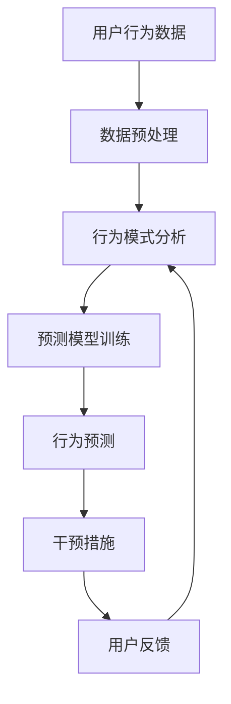

                 

### 第1章: 数字意志力增强技术概述

> 在数字化迅速发展的时代，数字意志力已成为个体在信息泛滥和虚拟诱惑中保持自我控制、追求目标的重要能力。本章节将对数字意志力的概念进行定义，阐述其在现代社会中的重要性，并探讨增强数字意志力的挑战及AI技术的应用。

#### 1.1 数字意志力的概念与重要性

**定义**：数字意志力是指个体在数字环境中保持专注、自律和抵制诱惑的能力。它不仅包括对数字产品的使用时间管理，还涉及到在线学习、工作以及社交活动中的自我控制。

**重要性**：数字意志力对于个体的成功和幸福具有至关重要的意义。在数字化时代，拥有良好的数字意志力可以帮助人们更高效地完成任务，避免沉迷于数字娱乐，减少信息过载带来的负面影响。同时，数字意志力也是抵御网络欺诈、隐私泄露等风险的重要防线。

#### 1.2 数字意志力增强的挑战

**信息过载**：在互联网时代，信息量呈爆炸性增长。用户往往难以筛选出对自己真正有用的信息，容易陷入无意义的浏览和刷屏行为，从而影响数字意志力。

**数字诱惑**：数字产品设计师通过精心设计，使用户在不知不觉中沉迷于网络世界。例如，社交媒体的点赞机制、游戏中的奖励系统等，都在不断刺激用户的欲望，使其难以自律。

#### 1.3 AI在数字意志力增强中的应用

**个性化推荐系统**：通过分析用户的历史行为数据，AI可以为其推荐更适合的内容和任务，从而提高用户在数字环境中的专注度和自律性。

**行为预测与干预**：AI可以通过学习用户的行为模式，预测其可能的偏差行为，并在早期采取干预措施，如发送提醒或调整用户界面，帮助用户维持数字意志力。

### 流程图

以下是一个简化的Mermaid流程图，展示了AI在数字意志力增强中的应用架构：



#### 1.3.1 数据预处理

数据预处理是AI模型训练的基础，它包括数据清洗、去噪、归一化等步骤。通过数据预处理，可以确保输入数据的质量和一致性，从而提高模型的预测准确性。

#### 1.3.2 行为模式分析

行为模式分析是对用户历史行为数据进行深入分析的过程。通过聚类、关联规则挖掘等方法，可以发现用户的行为特征和偏好，为后续的预测和干预提供依据。

#### 1.3.3 预测模型训练

预测模型训练是利用机器学习算法，将行为模式转化为可量化的预测指标。常见的算法包括线性回归、决策树、支持向量机等。通过训练，模型可以学会预测用户在未来一段时间内的行为。

#### 1.3.4 行为预测

行为预测是模型训练的核心目标。通过预测，可以提前发现用户可能出现的偏差行为，如过度使用社交媒体或游戏。基于预测结果，系统可以采取相应的干预措施，如发送提醒或限制使用时间。

#### 1.3.5 干预措施

干预措施是针对预测结果采取的具体行动。干预措施可以是个性化的，如调整用户界面、提供提示或奖励等。通过干预，可以引导用户回到正轨，维持良好的数字意志力。

#### 1.3.6 用户反馈

用户反馈是干预措施效果评估的重要环节。通过收集用户对干预措施的反馈，可以不断优化模型和干预策略，提高数字意志力增强的效果。

### 总结

数字意志力增强技术在数字化时代具有重要意义。通过AI技术的应用，可以个性化地帮助用户增强数字意志力，提高工作效率和生活质量。然而，这也带来了数据隐私和安全等方面的挑战，需要在技术发展的同时，加强法律法规的制定和执行。

```latex
\section{总结}
数字意志力增强技术在数字化时代具有重要意义。通过AI技术的应用，可以个性化地帮助用户增强数字意志力，提高工作效率和生活质量。然而，这也带来了数据隐私和安全等方面的挑战，需要在技术发展的同时，加强法律法规的制定和执行。
```

在下一章中，我们将进一步探讨AI辅助的自制力培养方法，以及如何通过AI技术来实际增强个体的自制力。

---

通过上述内容，第1章的概述部分已经详细介绍了数字意志力的概念、重要性、增强数字意志力的挑战以及AI技术在其中的应用。接下来，我们将深入探讨AI如何辅助自制力的培养，并分析一些具体的应用案例。让我们继续一步步分析推理，深入探索这个领域。

