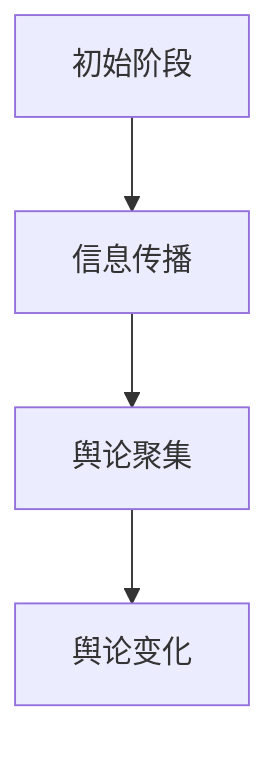

                 

### 文章标题

《数学与舆情分析：公众意见的数学模型》

### 文章关键词

舆情分析、数学模型、公众意见、社会网络分析、时间序列分析、情感分析、舆论演化、算法实现、伦理与法律问题。

### 文章摘要

本文旨在深入探讨舆情分析的数学模型及其在公众意见研究中的应用。首先，我们介绍了舆情分析的定义、重要性及其在现代社会中的应用。接着，本文详细阐述了数学在舆情分析中的基础性作用，包括线性代数、微积分、概率论与数理统计等预备知识，以及数学模型的基本概念和求解方法。然后，本文重点介绍了舆情分析的数学模型，包括社会网络模型、时间序列模型、情感分析模型和舆论演化模型。每个模型都通过数学公式、伪代码和实际案例进行了详细解释。此外，本文还探讨了舆情分析算法与实现、项目实战、伦理与法律问题以及舆情分析的实践与未来趋势。最后，本文总结了舆情分析的核心要点，并对全文进行了总结。希望通过本文，读者能够全面了解舆情分析的数学模型及其应用，为从事相关领域的研究和实践提供指导。


----------------------------------------------------------------

## 文章标题

《数学与舆情分析：公众意见的数学模型》

### 关键词

舆情分析、数学模型、公众意见、社会网络分析、时间序列分析、情感分析、舆论演化、算法实现、伦理与法律问题。

### 摘要

本文旨在深入探讨舆情分析的数学模型及其在公众意见研究中的应用。首先，我们介绍了舆情分析的定义、重要性及其在现代社会中的应用。接着，本文详细阐述了数学在舆情分析中的基础性作用，包括线性代数、微积分、概率论与数理统计等预备知识，以及数学模型的基本概念和求解方法。然后，本文重点介绍了舆情分析的数学模型，包括社会网络模型、时间序列模型、情感分析模型和舆论演化模型。每个模型都通过数学公式、伪代码和实际案例进行了详细解释。此外，本文还探讨了舆情分析算法与实现、项目实战、伦理与法律问题以及舆情分析的实践与未来趋势。最后，本文总结了舆情分析的核心要点，并对全文进行了总结。希望通过本文，读者能够全面了解舆情分析的数学模型及其应用，为从事相关领域的研究和实践提供指导。


## 数学与舆情分析概述

### 舆情分析的定义与重要性

舆情分析，亦称为意见挖掘或公众意见分析，是指通过收集、处理和分析大量文本数据，提取出公众对某一事件、产品、政策或现象的意见、情感和态度。舆情分析的目标是识别出公众意见中的关键信息、趋势和模式，从而为决策者提供有价值的参考。

在现代社会，舆情分析的重要性日益凸显。首先，随着互联网和社交媒体的快速发展，公众表达意见的渠道变得多样且便捷，这使得舆情分析成为了解公众情绪的重要手段。其次，舆情分析可以帮助企业、政府和其他组织及时掌握公众的态度和需求，从而做出更加精准的决策。例如，企业可以利用舆情分析监测消费者的反馈，优化产品和服务；政府可以借助舆情分析评估政策的公众接受度，调整政策方向。

舆情分析的方法和技术不断发展，主要包括文本挖掘、自然语言处理、机器学习、深度学习等。这些方法和技术使得舆情分析能够从海量的文本数据中提取有价值的信息，实现对公众意见的全面理解。

### 舆情分析在现代社会中的作用

舆情分析在现代社会中的应用广泛而深远，主要体现在以下几个方面：

1. **市场营销**：企业通过舆情分析了解消费者对产品或服务的态度和反馈，从而优化产品设计和营销策略。例如，通过分析社交媒体上的评论和讨论，企业可以及时发现产品的问题并迅速采取措施进行改进。

2. **危机管理**：政府和企业利用舆情分析监测潜在的社会危机，及时采取应对措施，减少负面影响。例如，在突发事件或危机发生时，舆情分析可以帮助组织了解公众的关注点和情绪变化，制定有效的危机应对策略。

3. **公共政策**：政府通过舆情分析了解公众对政策的看法和需求，从而制定更加符合民意的政策。例如，在制定重大政策时，政府可以分析社交媒体和新闻报道中的公众意见，评估政策的可行性和接受度。

4. **社会治理**：政府和社会组织利用舆情分析监测社会舆论动态，维护社会稳定。例如，通过分析网络谣言和极端言论，政府可以及时发现和应对社会风险，维护社会和谐。

5. **学术研究**：学者利用舆情分析研究公众意见的变化趋势和社会心理现象，为社会科学研究提供新的视角和证据。

### 舆情分析的方法与技术发展

舆情分析的方法和技术随着数据科学与人工智能技术的发展而不断进步。以下是一些主要的舆情分析方法和技术：

1. **文本挖掘**：文本挖掘是舆情分析的基础技术，通过自然语言处理（NLP）技术对大量文本数据进行分析，提取出关键信息、情感和主题。

2. **情感分析**：情感分析是文本挖掘的重要分支，旨在从文本中识别出情感倾向（如正面、负面、中性）。常用的方法包括基于规则的方法、机器学习方法（如SVM、朴素贝叶斯、LSTM等）和深度学习方法（如变换器、BERT等）。

3. **主题模型**：主题模型（如LDA）用于从大量文本中提取隐藏的主题，帮助理解文本内容的结构。

4. **社会网络分析**：社会网络分析（SNA）用于研究舆情在社交网络中的传播路径和影响力。通过分析社交网络的结构特性，可以识别出舆论领袖和传播节点。

5. **时间序列分析**：时间序列分析用于研究舆情随时间的变化趋势，常用的模型包括ARIMA、指数平滑模型、LSTM等。

6. **机器学习和深度学习**：机器学习和深度学习技术在舆情分析中发挥着重要作用，通过训练模型从海量数据中提取特征，实现高精度的舆情分析。

舆情分析技术的发展趋势主要体现在以下几个方面：

1. **大数据技术**：随着大数据技术的发展，舆情分析可以处理和分析更大规模、更复杂的文本数据。

2. **实时分析**：实时舆情分析技术使得组织能够快速响应社会事件和舆论变化，提高舆情监测的时效性。

3. **跨领域应用**：舆情分析技术逐渐应用于更多领域，如医疗、金融、教育等，为不同领域的决策提供支持。

4. **智能化**：随着人工智能技术的进步，舆情分析将更加智能化，能够自动识别复杂舆情模式，提高分析的准确性和效率。

### 舆情分析的发展现状与挑战

舆情分析作为一门跨学科的技术，近年来取得了显著进展，但也面临一些挑战。

#### 发展现状

1. **技术成熟度**：文本挖掘、情感分析、社会网络分析等核心技术已经相对成熟，能够实现高效、准确的舆情分析。

2. **应用广泛**：舆情分析在政府、企业、媒体等各个领域得到广泛应用，为决策提供了有力支持。

3. **数据资源丰富**：互联网和社交媒体的快速发展，为舆情分析提供了丰富的数据资源，使得舆情分析更加全面和深入。

4. **开源工具和平台**：许多优秀的开源工具和平台（如TextBlob、NLTK、Gephi等）使得舆情分析的实施变得更加便捷。

#### 面临的挑战

1. **数据质量**：舆情分析依赖于大量高质量的文本数据，但数据来源多样，数据质量参差不齐，可能包含噪声和异常值，影响分析结果的准确性。

2. **算法偏见**：舆情分析算法可能存在偏见，导致分析结果不公平。例如，算法可能对某些群体或观点产生偏见，影响舆论引导和决策。

3. **实时性**：虽然实时舆情分析技术有所发展，但在处理大规模、实时数据时，仍然存在一定的延迟和挑战。

4. **伦理和法律问题**：舆情分析涉及到个人隐私和数据安全等问题，需要遵守相关伦理和法律规范。

5. **跨领域应用**：尽管舆情分析在多个领域得到应用，但在某些特定领域的应用仍然面临技术和实践上的挑战。

### 应对策略与展望

针对舆情分析面临的挑战，可以采取以下策略：

1. **提高数据质量**：通过数据清洗、去噪和预处理技术，提高数据质量，确保分析结果的准确性。

2. **算法公平性**：在算法设计和训练过程中，充分考虑公平性，避免偏见。例如，通过使用多样化的训练数据，避免算法偏向某一特定群体。

3. **实时分析优化**：优化实时分析算法和系统架构，提高处理效率和响应速度。

4. **伦理和法律合规**：遵循相关伦理和法律规范，确保舆情分析过程的透明度和合规性。

5. **跨领域合作**：加强不同领域之间的合作，共同解决舆情分析在特定领域的挑战。

6. **持续研究与发展**：持续关注舆情分析领域的前沿技术，推动技术创新和应用。

通过以上策略，有望克服舆情分析面临的挑战，推动舆情分析技术的进一步发展和应用。

## 数学基础

舆情分析作为一门交叉学科，离不开数学的支持。本章节将介绍舆情分析中所需的数学预备知识，包括线性代数、微积分、概率论与数理统计等。这些数学工具将为后续章节中的舆情分析数学模型提供理论基础。

### 预备知识

#### 线性代数

线性代数是研究向量空间和线性映射的数学分支。在舆情分析中，线性代数主要用于处理数据的高维表示和降维。以下是一些核心概念：

- **向量**：向量是具有大小和方向的量，可以用一个有序数组表示。在舆情分析中，向量常用于表示文本数据中的特征。
- **矩阵**：矩阵是一个由数字组成的矩形数组，可以表示复杂的数据结构。在舆情分析中，矩阵常用于存储和操作大规模数据集。
- **行列式**：行列式是一个标量值，用于描述矩阵的性质。在舆情分析中，行列式可以用于判断矩阵的可逆性。
- **矩阵运算**：包括矩阵加法、矩阵乘法、转置、逆矩阵等运算。这些运算在舆情分析中用于处理和操作数据。

#### 微积分

微积分研究函数的极限、导数、积分和级数等概念。在舆情分析中，微积分主要用于优化问题、变化率分析等。以下是一些核心概念：

- **极限**：极限用于描述函数在某一点的行为。在舆情分析中，极限可以帮助我们理解函数的变化趋势。
- **导数**：导数描述函数在某一点的瞬时变化率。在舆情分析中，导数用于优化问题的求解，如最小二乘法。
- **积分**：积分用于计算函数在一个区间内的累积变化量。在舆情分析中，积分可以用于计算数据的特征值。
- **级数**：级数是一个数列的求和过程。在舆情分析中，级数可以用于求解复杂函数的近似值。

#### 概率论与数理统计

概率论与数理统计研究随机事件和数据的统计特性。在舆情分析中，概率论与数理统计用于数据建模、预测和推断。以下是一些核心概念：

- **概率分布**：概率分布描述随机变量的概率分布情况。在舆情分析中，概率分布可以用于描述文本数据中的情感倾向。
- **随机变量**：随机变量是一个具有概率分布的变量。在舆情分析中，随机变量可以用于描述文本数据中的特征。
- **期望值与方差**：期望值和方差描述随机变量的统计特性。在舆情分析中，期望值和方差可以用于评估模型的性能。
- **假设检验**：假设检验用于验证模型或数据的假设。在舆情分析中，假设检验可以用于判断情感分类模型的准确性。
- **置信区间**：置信区间描述一个参数的估计范围。在舆情分析中，置信区间可以用于评估数据的不确定性。

### 数学模型的基本概念

数学模型是现实世界问题的数学抽象，通过数学语言描述现实问题。在舆情分析中，数学模型用于构建舆情分析的基础框架，包括数据的收集、处理、分析和预测。以下是一些核心概念：

- **数据模型**：数据模型用于描述舆情分析中的数据结构。例如，社会网络模型可以用图表示社交网络中的节点和边。
- **预测模型**：预测模型用于预测未来的舆情趋势。例如，时间序列模型可以预测某一话题在未来一段时间内的讨论热度。
- **分类模型**：分类模型用于分类舆情数据。例如，情感分析模型可以分类文本数据为正面、负面或中性。
- **评估模型**：评估模型用于评估舆情分析模型的性能。例如，准确率、召回率和F1值可以用于评估情感分类模型的性能。

### 数学模型求解方法

求解数学模型的方法包括优化方法、方程求解和数值计算。以下是一些核心概念：

- **优化方法**：优化方法用于求解最优化问题，如最小化或最大化目标函数。常见的优化方法包括梯度下降法、牛顿法和拉格朗日乘数法。
- **方程求解**：方程求解用于求解数学方程，如线性方程组和非线性方程。常见的方程求解方法包括高斯消元法和牛顿-拉弗森法。
- **数值计算**：数值计算用于求解复杂的数学问题，如积分、微分和级数。常见的数值计算方法包括蒙特卡罗方法和数值积分。

通过本章节的学习，读者将掌握舆情分析所需的数学预备知识，理解数学模型的基本概念和求解方法，为后续章节的深入学习打下坚实的基础。

### 数学模型的基本概念

数学模型是一种用数学语言描述现实世界问题的抽象表示。在舆情分析中，数学模型用于描述公众意见和情绪的动态变化，帮助我们从复杂的数据中提取有价值的信息。以下将详细探讨数学模型的基本概念，包括模型构建的步骤、常见的数学模型类型以及数学模型的应用场景。

#### 模型构建的步骤

构建数学模型通常包括以下步骤：

1. **问题定义**：明确分析的目标和问题，如舆情趋势预测、情感分类、舆论领袖识别等。
2. **数据收集**：收集与问题相关的数据，如社交媒体评论、新闻报道、用户反馈等。
3. **数据预处理**：对收集到的数据进行分析，如去除噪声、填补缺失值、数据清洗等。
4. **特征提取**：从预处理后的数据中提取关键特征，如关键词、情感倾向、话题等。
5. **模型选择**：根据问题的性质选择合适的数学模型，如线性模型、非线性模型、时间序列模型、社会网络模型等。
6. **模型训练**：使用训练数据集训练模型，通过优化算法调整模型参数。
7. **模型评估**：使用验证集或测试集评估模型性能，如准确率、召回率、F1值等。
8. **模型优化**：根据评估结果调整模型结构或参数，提高模型性能。
9. **模型应用**：将训练好的模型应用于实际问题，进行预测或决策。

#### 常见的数学模型类型

在舆情分析中，常见的数学模型类型包括：

1. **线性模型**：线性模型是一种简单的数学模型，用于描述线性关系。常见的线性模型包括线性回归、逻辑回归等。线性模型在舆情分析中用于情感分类、趋势预测等任务。

2. **非线性模型**：非线性模型用于描述非线性关系，如神经网络、支持向量机等。非线性模型在舆情分析中用于处理复杂的数据结构和非线性关系。

3. **时间序列模型**：时间序列模型用于分析时间序列数据，如ARIMA、LSTM等。时间序列模型在舆情分析中用于预测舆情趋势、讨论热度等。

4. **社会网络模型**：社会网络模型用于分析舆情在社交网络中的传播路径和速度，如SIR模型、小世界模型等。社会网络模型在舆情分析中用于识别舆论领袖、分析舆论传播等。

5. **概率模型**：概率模型用于描述不确定性和随机性，如贝叶斯网络、马尔可夫模型等。概率模型在舆情分析中用于情感分类、舆论预测等。

6. **混合模型**：混合模型结合了多种模型的特点，如混合线性模型、混合神经网络等。混合模型在舆情分析中用于处理复杂的多维数据和高维时间序列。

#### 数学模型的应用场景

数学模型在舆情分析中的应用非常广泛，以下是一些典型的应用场景：

1. **情感分析**：使用情感分析模型分析文本数据中的情感倾向，如正面、负面、中性等。情感分析模型在社交媒体监测、市场调研、客户服务等领域有广泛应用。

2. **趋势预测**：使用时间序列模型预测舆情趋势，如讨论热度、情感波动等。趋势预测模型在公共政策制定、市场营销、风险监测等领域有重要应用。

3. **舆论领袖识别**：使用社会网络模型识别社交网络中的舆论领袖和关键节点。舆论领袖识别模型在危机管理、品牌监控、舆论引导等领域有广泛应用。

4. **舆论监控**：使用舆情监控模型实时监控舆论动态，识别潜在的社会风险。舆情监控模型在公共安全、应急管理、网络治理等领域有重要应用。

5. **舆论引导**：使用舆论引导模型制定舆论引导策略，引导公众正确理解和处理事件。舆论引导模型在政府宣传、媒体运营、危机公关等领域有广泛应用。

通过本章节的学习，读者将了解数学模型的基本概念、构建步骤、常见类型和应用场景，为后续章节中的具体数学模型分析和实现提供理论基础。在下一章节中，我们将深入探讨数学模型求解方法，包括最优化方法、方程求解和数值计算等内容。

### 数学模型求解方法

在舆情分析中，数学模型的求解方法对于分析结果的准确性和效率至关重要。常用的求解方法包括最优化方法、方程求解和数值计算。以下将分别介绍这些方法，并探讨其在舆情分析中的应用。

#### 最优化方法

最优化方法用于求解最优化问题，即找到一个或多个变量的最佳值，使得某个目标函数达到最大或最小。最优化方法在舆情分析中的应用非常广泛，如预测舆情趋势、情感分类等。以下是最优化方法的一些常见类型：

1. **梯度下降法**：梯度下降法是一种迭代求解最优化问题的方法。其基本思想是沿着目标函数的负梯度方向逐步调整参数，直到达到最优解。在舆情分析中，梯度下降法常用于训练机器学习模型，如线性回归、支持向量机等。

   伪代码示例：
   ```python
   while not converged:
       for each parameter θ:
           θ = θ - α * gradient(θ)
   ```

2. **牛顿法**：牛顿法是一种基于二阶导数的信息使用最优化方法。其基本思想是通过计算目标函数的梯度（一阶导数）和二阶导数来更新参数。牛顿法的收敛速度通常比梯度下降法更快。

   伪代码示例：
   ```python
   while not converged:
       Δθ = -H^(-1) * gradient(θ)
       θ = θ + Δθ
   ```

3. **拉格朗日乘数法**：拉格朗日乘数法用于求解约束优化问题。其基本思想是通过引入拉格朗日乘数来平衡目标函数和约束条件。在舆情分析中，拉格朗日乘数法常用于处理带有约束条件的最优化问题，如支持向量机中的硬间隔问题。

   伪代码示例：
   ```python
   L(θ, α) = J(θ) + α * (1 - y[i] * (w * x[i] + b))
   ∇θL(θ, α) = ∇θJ(θ) + α * y[i] * x[i]
   ∇αL(θ, α) = 1 - y[i] * (w * x[i] + b)
   ```

#### 方程求解

方程求解是数学模型求解中的基础方法，用于求解线性方程组和非线性方程。以下是一些常见的方程求解方法：

1. **高斯消元法**：高斯消元法是一种用于求解线性方程组的直接方法。其基本思想是通过消元操作将线性方程组转化为上三角或下三角方程组，从而直接求解。在舆情分析中，高斯消元法常用于求解线性回归问题。

   伪代码示例：
   ```python
   while not converged:
       for each row i:
           for each row j > i:
               multiply row j by a factor such that the element in position (i, j) becomes zero
           solve the resulting triangular system
   ```

2. **牛顿-拉弗森法**：牛顿-拉弗森法是一种用于求解非线性方程的迭代方法。其基本思想是通过计算函数的导数来更新近似解。在舆情分析中，牛顿-拉弗森法常用于求解非线性优化问题，如情感分类中的逻辑回归。

   伪代码示例：
   ```python
   while not converged:
       θ = θ - gradient(f(θ)) / f'(θ)
   ```

3. **迭代法**：迭代法是一种通过迭代过程求解方程的方法。其基本思想是通过不断迭代来逼近方程的解。在舆情分析中，迭代法常用于求解复杂的非线性方程，如社会网络模型中的节点中心性计算。

   伪代码示例：
   ```python
   while not converged:
       x = x - f(x)
   ```

#### 数值计算

数值计算是用于求解复杂数学问题的计算方法。以下是一些常见的数值计算方法：

1. **蒙特卡罗方法**：蒙特卡罗方法是一种基于随机抽样的数值计算方法。其基本思想是通过大量随机抽样来逼近数学问题的解。在舆情分析中，蒙特卡罗方法常用于模拟舆情传播过程，如社会网络模型中的传播概率计算。

   伪代码示例：
   ```python
   for i in range(num_iterations):
       sample = random_sample()
       solution = solution + sample
   solution = solution / num_iterations
   ```

2. **数值积分**：数值积分是一种用于求解定积分的数值计算方法。其基本思想是通过有限个点上的函数值来逼近积分的值。在舆情分析中，数值积分常用于计算时间序列数据的特征，如情绪波动。

   伪代码示例：
   ```python
   for i in range(num_points):
       value = function(i)
       integral = integral + value
   integral = integral / num_points
   ```

通过本章节的学习，读者将了解数学模型求解方法的基本概念和常用方法，包括最优化方法、方程求解和数值计算。这些方法在舆情分析中有着广泛的应用，有助于我们更好地理解和分析舆情数据。在下一章节中，我们将深入探讨舆情分析的数学模型，包括社会网络模型、时间序列模型、情感分析模型和舆论演化模型等内容。

### 舆情分析的数学模型

舆情分析中的数学模型是理解和预测公众意见的关键工具。这些模型通过数学语言和算法来描述舆情传播、情感变化和舆论演化。以下将详细探讨几种主要的舆情分析数学模型，包括社会网络模型、时间序列模型、情感分析模型和舆论演化模型。

#### 社会网络模型

社会网络模型用于分析舆情在社交网络中的传播路径和速度。这些模型描述了节点（如个人、团体）之间的互动关系，以及舆情在这些互动关系中的传播过程。

1. **社会网络的基本概念**

   - **节点**：代表社交网络中的个体，如个人、组织等。
   - **边**：代表节点之间的连接关系，如朋友关系、互动等。
   - **网络结构**：描述节点和边的整体结构，如小世界网络、无标度网络等。

2. **社会网络分析的方法**

   - **网络拓扑分析**：研究网络的结构特性，如密度、连通性、聚类系数等。
   - **节点中心性分析**：评估节点在网络中的重要性，常用的中心性度量包括度数中心性、介数中心性、紧密中心性等。
   - **社区检测**：识别网络中的紧密团体和社区结构。

3. **社会网络模型的数学描述**

   - **图论模型**：使用图论描述社会网络结构，包括节点和边的关系。
   - **传播模型**：如SIR模型（易感者-感染者-移除者模型）、SI模型（易感者-感染者模型）等，用于描述舆情传播的动态过程。

   社会网络模型的Mermaid流程图示例：
   ```mermaid
   graph TD
   A[节点1] --> B[节点2]
   A --> C[节点3]
   B --> D[节点4]
   C --> D
   ```

#### 时间序列模型

时间序列模型用于分析舆情随时间的变化趋势。这些模型描述了舆情在不同时间点的变化规律，如讨论热度、情感波动等。

1. **时间序列的基本概念**

   - **时间序列**：一组按照时间顺序排列的数据点。
   - **趋势**：时间序列数据的总体变化方向，如上升、下降或平稳。
   - **周期性**：时间序列数据中的规律性波动。

2. **常见的时间序列模型**

   - **ARIMA模型**（自回归积分滑动平均模型）：用于描述线性、非平稳时间序列数据。
   - **指数平滑模型**：用于描述平稳时间序列数据，包括简单指数平滑、Holt线性趋势模型、Holt-Winters季节性模型等。

3. **时间序列模型的数学公式**

   - **ARIMA(p, d, q)模型**：
     $$
     ARIMA(p, d, q) = \text{AR}(p) + \text{I}(d) + \text{MA}(q)
     $$
     其中，$\text{AR}(p)$是自回归项，$\text{I}(d)$是差分项，$\text{MA}(q)$是滑动平均项。

   - **指数平滑模型**：
     $$
     S_t = \alpha X_t + (1 - \alpha) S_{t-1}
     $$
     其中，$S_t$是当前时刻的平滑值，$X_t$是当前时刻的观测值，$\alpha$是平滑系数。

   时间序列模型的应用实例：
   ```mermaid
   graph TD
   A[2020-01] --> B[10]
   A --> C[2020-02] --> D[12]
   C --> E[2020-03] --> F[15]
   E --> G[2020-04] --> H[18]
   ```

#### 情感分析模型

情感分析模型用于从文本数据中提取情感信息，如正面情感、负面情感或中性情感。这些模型通过机器学习和深度学习算法来实现。

1. **情感分析的基本概念**

   - **情感倾向**：文本表达的情感倾向，如正面、负面或中性。
   - **情感极性**：情感倾向的程度，如非常喜欢、有点喜欢或不喜欢。

2. **基于机器学习的情感分析模型**

   - **支持向量机（SVM）**：通过找到一个最优的超平面来分隔不同情感类别的数据。
   - **朴素贝叶斯分类器**：基于贝叶斯定理，通过计算特征的概率分布来预测情感。
   - **逻辑回归**：通过拟合一个线性模型来预测情感概率。

3. **基于深度学习的情感分析模型**

   - **卷积神经网络（CNN）**：通过卷积层提取文本的特征。
   - **循环神经网络（RNN）**：通过循环结构处理文本序列。
   - **长短期记忆网络（LSTM）**：是RNN的一种变体，能够更好地处理长文本。
   - **变换器（Transformer）**：是一种基于自注意力机制的模型，适用于处理大规模文本数据。

   情感分析模型的数学公式和伪代码：
   ```python
   # 逻辑回归模型
   P(正面) = 1 / (1 + exp(-θ^T * x))
   # 变换器模型
   attention(Q, K, V) = softmax(QK^T / sqrt(d_k))
   ```

#### 舆论演化模型

舆论演化模型用于模拟舆情在传播过程中的动态变化。这些模型描述了舆情如何随着时间、事件和社交互动而演变。

1. **舆论演化的基本概念**

   - **舆论形成**：初始阶段，公众意见尚未形成统一。
   - **舆论发展**：随着信息的传播和交流，舆论逐渐向某一方向聚集。
   - **舆论变化**：舆论受到外部事件、媒体引导等因素的影响，可能发生转变。

2. **舆论演化模型的构建**

   - **基于社会网络的模型**：使用图结构描述舆情传播网络，节点表示个体，边表示个体之间的互动关系。
   - **基于时间序列的模型**：使用时间序列数据描述舆情随时间的变化规律。
   - **混合模型**：结合社会网络和时间序列模型，同时考虑舆情传播的时空特性。

3. **舆论演化模型的数学描述**

   - **基于图论的模型**：
     $$
     \Delta S_t = -\beta S_t I_t
     $$
     $$
     \Delta I_t = \beta S_t I_t - \mu I_t
     $$
     $$
     \Delta R_t = \mu I_t
     $$
     其中，$S_t$表示第$t$时刻的易感者数量，$I_t$表示第$t$时刻的感染者数量，$R_t$表示第$t$时刻的移除者数量，$\beta$表示感染率，$\mu$表示移除率。

舆论演化模型的案例分析：


通过本章节的学习，读者将了解舆情分析中几种主要的数学模型，包括社会网络模型、时间序列模型、情感分析模型和舆论演化模型。这些模型通过数学公式和算法描述舆情传播、情感变化和舆论演化，为舆情分析提供了坚实的理论基础。在下一章节中，我们将探讨舆情分析算法与实现，包括数据预处理、算法选择和实现步骤等内容。

### 舆情分析算法与实现

舆情分析算法是实现舆情分析的核心，它们帮助我们从大量的文本数据中提取有价值的信息，如情感倾向、话题关键词和舆论趋势。以下将详细介绍舆情分析算法与实现的相关内容，包括数据预处理、算法选择和实现步骤。

#### 数据预处理

数据预处理是舆情分析的关键步骤，它确保数据的质量和一致性，为后续的算法分析打下基础。以下是一些常用的数据预处理步骤：

1. **数据收集**：从各种渠道（如社交媒体、新闻报道、论坛等）收集舆情数据。使用爬虫工具（如Python的BeautifulSoup、Scrapy等）可以高效地实现数据收集。

2. **数据清洗**：去除无效数据和噪声数据，如去除HTML标签、去除特殊字符和符号等。Python的Pandas库和正则表达式是常用的数据清洗工具。

   伪代码示例：
   ```python
   data = remove_html_tags(data)
   data = remove_special_characters(data)
   data = remove_stop_words(data)
   ```

3. **数据归一化**：将文本数据转换为统一格式，如将所有文本转换为小写、去除停用词等。归一化有助于提高算法的性能和泛化能力。

4. **特征提取**：从预处理后的文本数据中提取关键特征，如词频、TF-IDF、词嵌入等。这些特征将用于训练和评估算法模型。

   伪代码示例：
   ```python
   features = extract_word_frequency(data)
   features = extract_tfidf(data)
   features = extract_word_embeddings(data)
   ```

#### 算法选择

选择合适的算法对于舆情分析的结果至关重要。以下是一些常见的舆情分析算法及其适用场景：

1. **情感分析算法**：用于判断文本的情感倾向，如正面、负面或中性。常用的算法包括：

   - **基于规则的算法**：使用预定义的规则进行情感分类。
   - **机器学习算法**：如SVM、朴素贝叶斯、逻辑回归等，通过训练数据学习情感分类模型。
   - **深度学习算法**：如CNN、RNN、LSTM、变换器等，能够提取复杂的文本特征。

2. **话题模型**：用于提取文本数据中的主要话题和关键词。常见的话题模型包括：

   - **LDA（Latent Dirichlet Allocation）**：一种基于概率的词分布模型，用于发现文本数据中的潜在主题。
   - **NMF（Non-Negative Matrix Factorization）**：一种非负矩阵分解方法，用于提取文本数据中的主要话题。

3. **时间序列分析算法**：用于分析舆情随时间的变化趋势。常见的时间序列分析算法包括：

   - **ARIMA（AutoRegressive Integrated Moving Average）**：一种自回归积分滑动平均模型，用于分析线性、非平稳时间序列数据。
   - **LSTM（Long Short-Term Memory）**：一种循环神经网络变体，能够处理时间序列数据的长短期依赖性。

4. **社会网络分析算法**：用于分析舆情在社交网络中的传播路径和速度。常见的社会网络分析算法包括：

   - **中心性度量**：如度数中心性、介数中心性、紧密中心性等，用于评估节点在网络中的重要性。
   - **传播模型**：如SIR、SI等，用于模拟舆情传播的动态过程。

#### 实现步骤

舆情分析算法的实现通常包括以下步骤：

1. **数据收集与预处理**：从各种渠道收集舆情数据，进行数据清洗和特征提取。

2. **算法选择与模型训练**：选择合适的算法，使用训练数据进行模型训练。常用的机器学习和深度学习框架如Scikit-learn、TensorFlow和PyTorch等。

3. **模型评估与优化**：使用验证集或测试集评估模型性能，调整模型参数，优化模型结构。

4. **模型应用与预测**：将训练好的模型应用于实际舆情分析任务，进行预测和分析。

以下是一个简单的舆情分析算法实现示例：

```python
# 数据预处理
data = preprocess_data(raw_data)
features = extract_features(data)

# 模型训练
model = train_model(features, labels)

# 模型评估
evaluate_model(model, test_data, test_labels)

# 模型应用
predictions = model.predict(new_data)
```

通过本章节的学习，读者将了解舆情分析算法与实现的相关内容，包括数据预处理、算法选择和实现步骤。掌握这些知识和技能，有助于在实际应用中高效地进行舆情分析，为政府、企业和媒体等机构提供决策支持。

### 舆情分析项目实战

舆情分析项目实战是巩固和应用所学知识的重要环节。在本章节中，我们将介绍一个具体的舆情分析项目，包括项目背景、目标、设计、实现和结果分析。通过这个项目，读者可以了解舆情分析的全流程，并掌握如何在实际应用中实施舆情分析。

#### 项目背景与目标

**项目背景**：
某地方政府希望了解市民对其公共政策的看法，以便更好地制定和调整政策，提高市民的满意度。为此，他们决定利用舆情分析技术对社交媒体上的相关讨论进行监测和分析。

**项目目标**：
- 收集和分析社交媒体上关于该地方政府公共政策的讨论。
- 识别讨论的主要话题和关键词。
- 分析公众对政策的态度和情感。
- 预测未来公众对政策的看法。

#### 项目设计

**项目设计主要包括以下步骤**：

1. **数据收集**：
   - 使用爬虫工具（如Python的Scrapy）从社交媒体平台（如微博、知乎、Twitter等）收集关于地方政府的讨论数据。
   - 收集的数据包括用户评论、转发量、点赞量等。

2. **数据预处理**：
   - 去除无效数据，如重复评论、含有大量特殊字符的评论等。
   - 对文本数据进行清洗，包括去除HTML标签、去除停用词、分词等。

3. **特征提取**：
   - 提取文本特征，如词频、TF-IDF、词嵌入等。
   - 对文本特征进行向量化处理，以便于后续的模型分析。

4. **算法选择与模型训练**：
   - 选择情感分析模型（如变换器模型）对评论进行情感分类。
   - 选择LDA模型提取讨论的主要话题和关键词。
   - 选择LSTM模型预测未来公众对政策的看法。

5. **模型评估与优化**：
   - 使用验证集评估模型性能，调整模型参数，优化模型结构。
   - 对模型进行交叉验证，确保其泛化能力。

6. **结果分析**：
   - 分析评论的情感分布，识别正面和负面评论的原因。
   - 分析讨论的主要话题和关键词，了解公众的关注点。
   - 预测未来公众对政策的看法，为政策调整提供参考。

#### 实现步骤

**实现步骤如下**：

1. **数据收集与预处理**：

   ```python
   import scrapy
   from scrapy.crawler import CrawlerProcess

   class PolicyCrawler(scrapy.Spider):
       name = "policy_crawler"
       allowed_domains = ["weibo.com", "zhihu.com", "twitter.com"]
       start_urls = ["https://weibo.com/ajax/search/index?keyword=地方政府政策"]

       def parse(self, response):
           # 解析网页，提取评论和相关信息
           pass

   process = CrawlerProcess(settings={
       'USER_AGENT': 'Mozilla/5.0 (Windows NT 10.0; Win64; x64) AppleWebKit/537.36 (KHTML, like Gecko) Chrome/58.0.3029.110 Safari/537.3'})

   process.crawl(PolicyCrawler)
   process.start()
   ```

2. **数据预处理**：

   ```python
   import pandas as pd
   import numpy as np
   from sklearn.feature_extraction.text import TfidfVectorizer
   from nltk.corpus import stopwords
   from nltk.tokenize import word_tokenize

   def preprocess_data(data):
       # 去除无效数据和特殊字符
       data = data.dropna()
       data['comment'] = data['comment'].apply(lambda x: remove_html_tags(x))
       data['comment'] = data['comment'].apply(lambda x: remove_stop_words(x))

       # 分词
       data['tokens'] = data['comment'].apply(lambda x: word_tokenize(x))
       return data

   data = preprocess_data(data)
   ```

3. **特征提取**：

   ```python
   vectorizer = TfidfVectorizer()
   features = vectorizer.fit_transform(data['tokens'])
   ```

4. **算法选择与模型训练**：

   ```python
   from tensorflow.keras.models import Sequential
   from tensorflow.keras.layers import Embedding, LSTM, Dense

   model = Sequential()
   model.add(Embedding(input_dim=10000, output_dim=64))
   model.add(LSTM(128))
   model.add(Dense(1, activation='sigmoid'))


