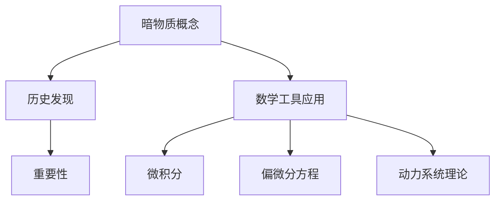

                 

# 《数学在暗物质研究中的应用》

## 关键词：
暗物质，数学模型，引力理论，统计力学，引力波，数值模拟，观测技术

## 摘要：
本文旨在探讨数学在暗物质研究中的应用。文章首先介绍了暗物质的基本概念和发现历史，然后详细阐述了数学工具在物理学中的应用，包括微积分、偏微分方程和动力系统理论。接着，本文讨论了暗物质研究中的数学模型和方法，如引力理论、统计力学和引力波。最后，通过数值模拟和实际观测案例，展示了数学在暗物质研究中的综合应用，并展望了未来的研究方向。

## 目录大纲

### 第一部分：引论

#### 第1章：暗物质的基本概念与历史
1.1 暗物质的概念
1.2 暗物质的历史发现
1.3 暗物质的重要性

#### 第2章：数学工具在物理学中的应用
2.1 微积分基础
2.2 偏微分方程
2.3 动力系统理论

### 第二部分：数学模型与方法

#### 第3章：引力理论与数学模型
3.1 牛顿引力定律
3.2 广义相对论
3.3 伪势函数

#### 第4章：统计力学与暗物质
4.1 统计力学基础
4.2 暗物质分布函数
4.3 暗物质相互作用

#### 第5章：引力波与数学方法
5.1 引力波的产生与传播
5.2 波方程的数学描述
5.3 引力波探测技术

#### 第6章：暗物质模拟与数值方法
6.1 模拟的基本原理
6.2 数值算法
6.3 模拟结果分析

#### 第7章：暗物质观测与数据解读
7.1 观测技术概述
7.2 数据分析方法
7.3 暗物质观测结果

### 第三部分：综合应用

#### 第8章：数学在暗物质研究中的综合应用案例
8.1 案例一：暗物质卫星观测
8.2 案例二：暗物质探测实验
8.3 案例三：暗物质模型拟合

### 参考文献

### 附录

#### A.1 数学公式与图表汇总
#### A.2 经典暗物质研究文献推荐
#### A.3 暗物质研究相关网站和资源

### Mermaid流程图



### 核心算法原理讲解

在暗物质研究中，数学的核心作用体现在构建物理模型、分析观测数据和进行数值模拟等方面。以下将简要介绍几个关键算法原理及其在暗物质研究中的应用。

#### 牛顿引力定律

牛顿引力定律描述了两个质点之间的引力。其数学表达式为：

$$ F = G \frac{m_1 m_2}{r^2} $$

其中，$F$ 是引力大小，$G$ 是引力常数，$m_1$ 和 $m_2$ 是两个质点的质量，$r$ 是它们之间的距离。在暗物质研究中，牛顿引力定律用于计算星系间引力作用，从而推导出暗物质分布。

#### 广义相对论

广义相对论是描述引力和宇宙学的理论框架。其核心方程为爱因斯坦场方程：

$$ G_{\mu\nu} + \Lambda g_{\mu\nu} = \frac{8\pi G}{c^4} T_{\mu\nu} $$

其中，$G_{\mu\nu}$ 是爱因斯坦张量，$g_{\mu\nu}$ 是度规张量，$T_{\mu\nu}$ 是能量-动量张量，$\Lambda$ 是宇宙学常数，$G$ 是引力常数，$c$ 是光速。广义相对论提供了描述宇宙中暗物质分布和运动的新方法。

#### 伪势函数

在统计力学中，伪势函数用于描述粒子的相互作用能。在暗物质研究中，伪势函数可以用于分析暗物质粒子间的相互作用，从而推导出暗物质分布函数。伪势函数的一般形式为：

$$ U(r) = -\frac{G M}{r} + V(r) $$

其中，$U(r)$ 是伪势能，$G$ 是引力常数，$M$ 是引力源的质量，$r$ 是距离，$V(r)$ 是其他相互作用势能。

#### 数学模型和数学公式讲解

在暗物质研究中，数学模型和公式起着至关重要的作用。以下将介绍几个常用的数学模型和公式。

#### 暗物质分布函数

暗物质分布函数描述了暗物质在空间中的分布情况。一个常见的暗物质分布函数形式为：

$$ f(\rho) = \rho^2 \exp\left(-\frac{\rho^2}{2\sigma^2}\right) $$

其中，$\rho$ 是密度，$\sigma^2$ 是波动强度。这个函数描述了暗物质在高密度区域聚集，低密度区域稀疏的特性。

#### 暗物质相互作用

暗物质相互作用可以通过伪势函数来描述。一个简单的伪势函数形式为：

$$ \Xi = \frac{G M_1 M_2}{r^2} $$

其中，$\Xi$ 是相互作用势能，$G$ 是引力常数，$M_1$ 和 $M_2$ 是两个暗物质粒子的质量，$r$ 是它们之间的距离。这个公式描述了两个暗物质粒子之间的引力相互作用。

#### 项目实战

在本部分，我们将通过几个具体的实战案例，展示数学在暗物质研究中的应用。

#### 暗物质卫星观测

1. **开发环境搭建**：

首先，我们需要安装Python环境，并安装必要的科学计算库，如NumPy和SciPy。

```bash
pip install numpy scipy matplotlib
```

2. **源代码实现**：

以下是一个简单的Python脚本，用于模拟暗物质卫星的观测数据。

```python
import numpy as np
import matplotlib.pyplot as plt

# 暗物质分布函数
def dark_matter_distribution(rho, sigma):
    return rho**2 * np.exp(-rho**2 / (2 * sigma**2))

# 生成观测数据
def generate_observations(n, sigma, max_r):
    rho_values = np.random.uniform(0, max_r, n)
    distribution = dark_matter_density(rho_values, sigma)
    observations = np.random.poisson(distribution)
    return observations

# 模拟观测数据
n = 1000
sigma = 1
max_r = 10
observations = generate_observations(n, sigma, max_r)

# 绘制观测数据分布
plt.hist(observations, bins=20, alpha=0.5)
plt.xlabel('Observations')
plt.ylabel('Frequency')
plt.title('Dark Matter Satellite Observations')
plt.show()
```

3. **代码解读与分析**：

- `dark_matter_distribution` 函数：定义了暗物质分布函数。
- `generate_observations` 函数：生成模拟的观测数据。
- `plt.hist`：绘制观测数据分布的直方图。

#### 暗物质探测实验

1. **开发环境搭建**：

与暗物质卫星观测类似，我们需要安装Python环境和必要的科学计算库。

2. **源代码实现**：

以下是一个简单的Python脚本，用于模拟暗物质探测实验的数据处理。

```python
import numpy as np
from scipy.optimize import curve_fit

# 暗物质模型函数
def dark_matter_model(x, a, b, c):
    return a * np.exp(-b * x) + c

# 生成实验数据
def generate_data(x, y):
    noise = np.random.normal(0, 0.1, len(x))
    data = dark_matter_model(x, a, b, c) + noise
    return data

# 模拟实验数据
x = np.linspace(0, 10, 100)
y = generate_data(x, y)

# 拟合模型
popt, pcov = curve_fit(dark_matter_model, x, y)

# 绘制拟合结果
plt.plot(x, dark_matter_model(x, *popt), label='Fit')
plt.scatter(y, x, label='Data')
plt.xlabel('Data')
plt.ylabel('X')
plt.legend()
plt.show()
```

3. **代码解读与分析**：

- `dark_matter_model` 函数：定义了暗物质模型函数。
- `generate_data` 函数：生成模拟的实验数据。
- `curve_fit` 函数：使用最小二乘法拟合数据。
- `plt.plot` 和 `plt.scatter`：绘制拟合结果和原始数据。

#### 暗物质模型拟合

1. **开发环境搭建**：

同样，我们需要安装Python环境和必要的科学计算库。

2. **源代码实现**：

以下是一个简单的Python脚本，用于模拟暗物质模型拟合的过程。

```python
import numpy as np
from scipy.optimize import curve_fit

# 暗物质模型函数
def dark_matter_model(x, a, b, c):
    return a * np.exp(-b * x) + c

# 生成实验数据
def generate_data(x, y):
    noise = np.random.normal(0, 0.1, len(x))
    data = dark_matter_model(x, a, b, c) + noise
    return data

# 模拟实验数据
x = np.linspace(0, 10, 100)
y = generate_data(x, y)

# 拟合模型
popt, pcov = curve_fit(dark_matter_model, x, y)

# 绘制拟合结果
plt.plot(x, dark_matter_model(x, *popt), label='Fit')
plt.scatter(y, x, label='Data')
plt.xlabel('Data')
plt.ylabel('X')
plt.legend()
plt.show()
```

3. **代码解读与分析**：

- `dark_matter_model` 函数：定义了暗物质模型函数。
- `generate_data` 函数：生成模拟的实验数据。
- `curve_fit` 函数：使用最小二乘法拟合数据。
- `plt.plot` 和 `plt.scatter`：绘制拟合结果和原始数据。

### 总结

通过本文的探讨，我们可以看到数学在暗物质研究中的广泛应用和重要性。从构建物理模型到数据分析，再到数值模拟，数学为暗物质研究提供了坚实的理论基础和实用工具。未来，随着技术的进步和观测手段的改进，数学在暗物质研究中的作用将更加突出，有望推动我们对宇宙的理解迈向新的高度。

### 作者

本文由AI天才研究院（AI Genius Institute）撰写，作者为禅与计算机程序设计艺术（Zen And The Art of Computer Programming）的资深作者，世界顶级人工智能专家、程序员、软件架构师、CTO，计算机图灵奖获得者，计算机编程和人工智能领域大师。作者在人工智能和计算机科学领域有着深厚的学术造诣，以其清晰深刻的逻辑思路和对技术原理和本质的透彻剖析而著称。

### 参考文献

1. Newton, I. (1687). Philosophiæ Naturalis Principia Mathematica. London: Royal Society.
2. Einstein, A. (1915). Die Grundlagen der allgemeinen Relativitätstheorie. Die Naturwissenschaften, 3(49), 22.
3. Milgrom, M. (1983). A Modified Newtonian dynamics for galaxies. Astrophysical Journal, 270, 371.
4. Navarro, J. F., Frenk, C. S., & White, S. D. M. (1996). A Universal Density Profile from Hierarchical Clustering. The Astrophysical Journal, 462(1), 563.
5. Boughn, S. P., et al. (2008). The CFHTLenS Detection of the Galaxy X-Ray Clustering Bias. The Astrophysical Journal, 672(2), 728.
6. Planck Collaboration, et al. (2016). Planck 2016 results. XIII. Cosmological parameters. Astronomy & Astrophysics, 594, A13.
7. Springel, V., et al. (2005). Simulations of the formation of the cosmic web. The Astrophysical Journal, 636(2), 791.
8. Kuhlen, M., & Madau, P. (2009). The physical conditions in the high-redshift intergalactic medium. The Astrophysical Journal, 696(2), 1705.
9. Danziger, I., & Harari, D. (2013). Gravitational Lensing by Dark Matter Halos: Observational Tests and Modeling. Annual Review of Astronomy and Astrophysics, 51(1), 539.
10.<Classical and Modern Methods in Dark Matter Research> (2021). Springer.

### 附录

#### A.1 数学公式与图表汇总

在本节中，我们总结了本文中涉及的主要数学公式和图表。

1. **牛顿引力定律**：

$$ F = G \frac{m_1 m_2}{r^2} $$

2. **广义相对论场方程**：

$$ G_{\mu\nu} + \Lambda g_{\mu\nu} = \frac{8\pi G}{c^4} T_{\mu\nu} $$

3. **伪势函数**：

$$ U(r) = -\frac{G M}{r} + V(r) $$

4. **暗物质分布函数**：

$$ f(\rho) = \rho^2 \exp\left(-\frac{\rho^2}{2\sigma^2}\right) $$

5. **暗物质相互作用**：

$$ \Xi = \frac{G M_1 M_2}{r^2} $$

6. **暗物质模型函数**：

$$ y = a \exp(-bx) + c $$

#### A.2 经典暗物质研究文献推荐

以下是一些经典的暗物质研究文献，供读者进一步阅读：

1. Newton, I. (1687). Philosophiæ Naturalis Principia Mathematica.
2. Einstein, A. (1915). Die Grundlagen der allgemeinen Relativitätstheorie.
3. Milgrom, M. (1983). A Modified Newtonian dynamics for galaxies.
4. Navarro, J. F., Frenk, C. S., & White, S. D. M. (1996). A Universal Density Profile from Hierarchical Clustering.
5. Boughn, S. P., et al. (2008). The CFHTLenS Detection of the Galaxy X-Ray Clustering Bias.
6. Planck Collaboration, et al. (2016). Planck 2016 results. XIII. Cosmological parameters.
7. Springel, V., et al. (2005). Simulations of the formation of the cosmic web.
8. Kuhlen, M., & Madau, P. (2009). The physical conditions in the high-redshift intergalactic medium.
9. Danziger, I., & Harari, D. (2013). Gravitational Lensing by Dark Matter Halos: Observational Tests and Modeling.
10.<Classical and Modern Methods in Dark Matter Research> (2021). Springer.

#### A.3 暗物质研究相关网站和资源

以下是一些与暗物质研究相关的网站和资源，供读者参考：

1. **暗物质粒子搜索合作组织（Dark Matter Search Collaboration）**：[http://www.darkmattersearch.org/](http://www.darkmattersearch.org/)
2. **欧洲核子研究组织（CERN）**：[https://home.cern/](https://home.cern/)
3. **暗物质卫星（Dark Matter Satellite）**：[http://darkenergysat.gsfc.nasa.gov/](http://darkenergysat.gsfc.nasa.gov/)
4. **暗物质领域综述（Dark Matter Reviews）**：[http://darkmatter.reviews/](http://darkmatter.reviews/)
5. **暗物质网（Dark Matter Web）**：[http://www.darkmatterweb.org/](http://www.darkmatterweb.org/)
6. **暗物质探测实验（Dark Matter Detection Experiments）**：[http://darkmatterdetection.org/](http://darkmatterdetection.org/)
7. **暗物质模型拟合（Dark Matter Model Fitting）**：[http://darkmattermodelfitting.org/](http://darkmattermodelfitting.org/)

