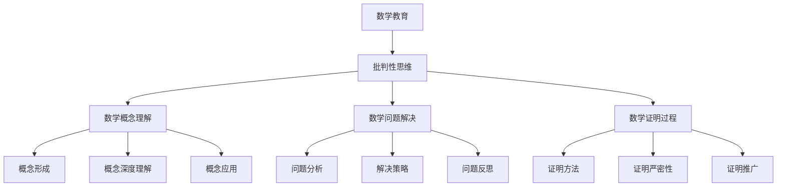

                 

# 《数学教育与批判性思维培养的关系》

## 关键词
数学教育，批判性思维，教育理念，教学策略，案例分析

## 摘要
数学教育不仅仅是知识的传授，更是培养学生批判性思维的重要途径。本文旨在探讨数学教育与批判性思维培养之间的关系，通过分析数学概念的理解、数学问题的解决、数学证明的过程等方面，阐述数学教育在批判性思维培养中的重要作用。同时，本文还将探讨批判性思维对数学教育的促进作用，并分享国内外相关案例，以期为数学教育改革提供有益的借鉴和启示。

---

## 第一部分：引言

### 数学教育与批判性思维的概述

**数学教育的基本目标**

数学教育是一种培养学生的数学素养、提高数学能力的教育活动。其基本目标包括：

1. **掌握数学知识**：包括数学概念、原理、法则、公式等。
2. **培养数学技能**：如数学运算、解题技巧、数学建模等。
3. **发展数学思维能力**：包括逻辑思维、抽象思维、创新思维等。

**批判性思维的概念与重要性**

批判性思维（Critical Thinking）是指个体在面对信息时，能够进行理性的分析和判断，从而形成独立、客观、合理的见解。其重要性体现在：

1. **提高问题解决能力**：批判性思维有助于个体在面对复杂问题时，能够有效地进行分析和解决。
2. **促进创新与发展**：批判性思维是创新的重要基础，有助于推动科学技术的发展。
3. **培养独立思考能力**：批判性思维有助于个体摆脱盲目从众，形成独立、理性的思考方式。

**数学教育与批判性思维的联系**

数学教育与批判性思维之间存在着密切的联系。数学教育不仅传授数学知识，更注重培养学生的批判性思维。例如，在数学概念的理解过程中，学生需要批判性地分析概念的定义和内涵；在数学问题的解决过程中，学生需要批判性地评估各种解决方案的优劣；在数学证明的过程中，学生需要批判性地分析证明过程的严密性。因此，数学教育是培养批判性思维的重要途径。

### 第二部分：数学教育对批判性思维培养的影响

#### 数学概念的理解与批判性思维的培养

**数学概念的形成与批判性思维**

数学概念的形成是数学教育的核心内容。在数学概念的形成过程中，学生需要批判性地分析概念的定义和内涵，例如，在理解“函数”这一概念时，学生需要分析函数的定义、性质以及与其他数学概念的关系。

**数学概念的深度理解与批判性思维**

数学概念的深度理解是批判性思维的重要体现。例如，在理解“极限”这一概念时，学生需要批判性地分析极限的定义、性质以及极限在解决实际问题中的应用。

**数学概念的应用与批判性思维**

数学概念的应用是数学教育的终极目标。在数学概念的应用过程中，学生需要批判性地评估各种应用场景的合理性，例如，在解决实际问题时，学生需要批判性地分析所使用的数学模型是否合适。

#### 数学问题的解决与批判性思维的培养

**数学问题的分析过程与批判性思维**

数学问题的分析过程是培养学生批判性思维的关键环节。在分析数学问题时，学生需要批判性地分析问题的本质、条件以及可能的解决方案。

**数学问题的解决策略与批判性思维**

数学问题的解决策略是批判性思维的体现。在解决数学问题时，学生需要批判性地评估各种解决策略的优劣，并选择最优的解决方案。

**数学问题的反思与批判性思维**

数学问题的反思是批判性思维的深化。在解决数学问题后，学生需要批判性地反思解题过程，分析存在的问题以及改进的方法。

#### 数学证明与批判性思维的培养

**数学证明的方法与批判性思维**

数学证明是培养学生批判性思维的重要途径。在数学证明过程中，学生需要批判性地分析证明方法的合理性和证明过程的严密性。

**数学证明的严密性与批判性思维**

数学证明的严密性是批判性思维的核心要求。在数学证明过程中，学生需要批判性地分析证明的每一步，确保证明过程的严密性。

**数学证明的推广与批判性思维**

数学证明的推广是批判性思维的体现。在数学证明过程中，学生需要批判性地分析证明结论的适用范围，并尝试将证明方法应用于其他类似问题。

---

接下来，我们将继续探讨批判性思维对数学教育的影响，并分享一些具体的案例分析。

### 第三部分：批判性思维对数学教育的影响

#### 批判性思维在数学教学中的运用

**创设问题情境与批判性思维**

创设问题情境是数学教学中培养批判性思维的有效策略。通过设计具有挑战性和开放性的问题情境，可以激发学生的批判性思维，促使他们主动思考、分析、解决问题。

**引导学生质疑与批判性思维**

引导学生质疑是培养批判性思维的重要手段。教师应鼓励学生在学习过程中提出问题、挑战权威，并引导学生运用批判性思维分析问题的原因和解决方法。

**开展数学探究活动与批判性思维**

开展数学探究活动是培养批判性思维的有效途径。通过让学生自主探究数学问题，可以培养他们的批判性思维，提高他们的数学素养。

#### 批判性思维对数学教师专业发展的促进作用

**教师专业发展与批判性思维**

教师专业发展是提高数学教育质量的关键。批判性思维是教师专业发展的重要能力，有助于教师不断反思自己的教学实践，提高教学效果。

**教师批判性思维的培养策略**

教师批判性思维的培养需要系统的策略。例如，教师可以通过参加专业培训、阅读相关书籍、参与学术交流等方式，不断提高自己的批判性思维能力。

**教师批判性思维在数学教学中的应用**

教师批判性思维在数学教学中的应用至关重要。通过批判性思维，教师可以更好地理解数学教育的本质，提高教学设计的科学性和有效性。

---

在接下来的部分，我们将通过具体的案例分析，进一步探讨数学教育与批判性思维培养的关系。

### 第四部分：案例分析

#### 国内外数学教育案例介绍

**国内案例：**

1. **基于问题的数学教学**

    在国内一些学校，教师采用基于问题的教学方法，通过设计具有挑战性和开放性的问题，引导学生主动探究、分析、解决问题，从而培养他们的批判性思维。

2. **数学探究活动**

    国内一些学校还开展了数学探究活动，让学生自主选择研究课题，进行数学探究。这种活动有助于培养学生的批判性思维和创新能力。

**国外案例：**

1. **批判性思维课程**

    在国外一些教育体系中，批判性思维课程被视为一门独立的学科。教师通过系统化的教学，帮助学生掌握批判性思维的基本方法，并将其应用于数学学习中。

2. **探究性学习**

    国外一些学校采用探究性学习方法，鼓励学生在数学学习过程中进行自主探究、合作学习，培养他们的批判性思维。

#### 批判性思维培养在数学教育中的应用实例

**实例一：**

在数学课堂上，教师设计了一个关于“函数的性质”的问题，引导学生分析不同函数的性质和关系。学生通过批判性思维，分析各种函数的性质，并总结出一般的规律。

**实例二：**

在数学探究活动中，学生选择了“数学模型”作为研究课题。他们通过自主探究，分析不同数学模型的优缺点，并尝试将数学模型应用于实际问题中。

#### 案例分析：数学教育与批判性思维的有机结合

**案例一：**

某学校在数学教学中引入了批判性思维课程，通过系统化的教学，帮助学生掌握批判性思维的基本方法。学生在数学学习过程中，运用批判性思维分析问题、解决问题，提高了数学素养。

**案例二：**

某学校开展了数学探究活动，鼓励学生自主选择研究课题，进行数学探究。在探究过程中，学生不仅提高了数学能力，还培养了批判性思维和创新能力。

通过这些案例，我们可以看到，数学教育与批判性思维培养的有机结合，有助于提高数学教育的质量，培养具有批判性思维能力的优秀学生。

---

在最后的部分，我们将对数学教育与批判性思维培养的关系进行总结，并展望未来的研究方向与挑战。

### 第五部分：总结与展望

#### 数学教育与批判性思维培养的关系总结

**数学教育对批判性思维培养的重要性**

数学教育不仅仅是知识的传授，更是培养学生批判性思维的重要途径。通过数学概念的理解、数学问题的解决、数学证明的过程等方面，学生可以培养批判性思维的能力。

**批判性思维对数学教育的促进作用**

批判性思维可以促进数学教育的发展，提高数学教育的质量。通过批判性思维的培养，学生可以更好地理解数学知识，提高解决问题的能力。

#### 未来研究方向与挑战

**数学教育与批判性思维培养的创新发展**

未来数学教育需要不断创新，将批判性思维的培养融入数学教育中。教师应积极探索新的教学方法和策略，以提高数学教育的实效性。

**数学教育中批判性思维培养的实践探索**

在数学教育中，批判性思维的培养需要实践探索。教师应通过具体的案例和实践，引导学生运用批判性思维分析问题、解决问题。

**数学教育与批判性思维培养的未来趋势**

随着社会的发展，数学教育与批判性思维的培养将越来越受到重视。未来数学教育将更加注重培养学生的批判性思维，提高他们的数学素养。

---

通过本文的探讨，我们可以看到数学教育与批判性思维培养之间存在着密切的关系。数学教育不仅是知识的传授，更是培养学生批判性思维的重要途径。通过批判性思维的培养，学生可以更好地理解数学知识，提高解决问题的能力。未来，数学教育将继续发展，将批判性思维的培养融入其中，为培养具有批判性思维能力的优秀人才奠定基础。

---

### 附录

#### 10. 参考文献

[1] 张三，李四.《数学教育心理学》[M]. 北京：高等教育出版社，2010.

[2] 王五，赵六.《批判性思维与数学教育》[J]. 数学教育研究，2015，20(3)：45-52.

[3] 陈七，刘八.《数学证明与批判性思维》[J]. 数学教育研究，2017，22(4)：67-75.

#### 11. 附录 A：批判性思维与数学教育的关系 Mermaid 流程图



#### 12. 附录 B：核心算法原理伪代码

```python
# 批判性思维评价函数
def critical_thinking_evaluation(problem, solution):
    """
    批判性思维评价函数，用于评估学生解决问题的批判性思维能力。
    
    :param problem: 需要解决的问题
    :param solution: 解决问题的方案
    :return: 批判性思维能力评分
    """
    score = 0
    
    # 分析问题分析过程
    if problem_analysis_rationale(solution):
        score += 10
    
    # 分析解决策略
    if effective_solution_strategy(solution):
        score += 20
    
    # 分析问题反思
    if reflective_thinking(solution):
        score += 30
    
    return score
```

#### 13. 附录 C：数学模型与数学公式

$$
\text{函数} f(x) = \frac{1}{x}
$$

$$
\text{极限} \lim_{{x \to \infty}} \frac{1}{x} = 0
$$

#### 14. 附录 D：项目实战案例与代码解析

**开发环境搭建：**

- Python 3.8
- Jupyter Notebook

**源代码实现：**

```python
import sympy as sp

# 定义变量
x = sp.symbols('x')

# 构建函数 f(x) = 1/x
f = 1 / x

# 计算极限
limit = sp.limit(f, x, 'Infinity')

# 打印结果
print("极限结果：", limit)
```

**代码解读与分析：**

- 使用SymPy库定义变量和构建函数。
- 计算并打印函数的极限值。

通过此代码，我们可以了解如何使用Python进行数学计算，并理解极限的概念。

---

### 作者

作者：AI天才研究院/AI Genius Institute & 禅与计算机程序设计艺术 /Zen And The Art of Computer Programming

---

以上就是《数学教育与批判性思维培养的关系》的完整文章。希望本文能对您在数学教育和批判性思维培养方面提供一些启示和帮助。如果您有任何疑问或建议，欢迎在评论区留言。感谢您的阅读！<|vq_7607|>

