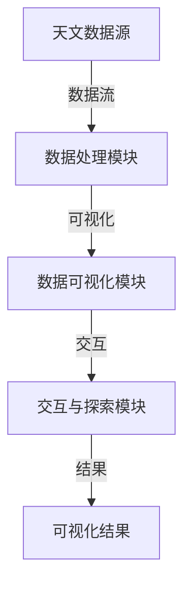

                 

# 《数据可视化在呈现宇宙多维结构中的作用》

> **关键词：**数据可视化、宇宙结构、多维数据、可视化工具、核心算法

> **摘要：**本文从数据可视化的基础概念和宇宙结构的基本概述出发，详细探讨了数据可视化在宇宙多维结构研究中的应用。通过核心算法原理讲解、数学模型与公式详细解析、项目实战与代码解读等环节，展示了数据可视化在揭示宇宙奥秘中的重要作用。最后，对未来的发展趋势与挑战进行了展望。

----------------------------------------------------------------

### 第一部分：数据可视化基础与宇宙结构的简介

#### 第1章：数据可视化的原理与历史

**1.1 数据可视化的定义与基本概念**

数据可视化是一种将抽象的数据转换为视觉形式的过程，以便于人们理解和分析。它通过图表、图形、图像等形式将数据展示出来，使复杂的数据关系和趋势更加直观。

数据可视化的核心目标是提高数据的可读性和易理解性，从而帮助用户更快地发现数据中的模式和趋势。它广泛应用于各个领域，包括科学探索、商业分析、医疗诊断等。

**1.2 数据可视化的发展历程**

数据可视化的发展可以追溯到古代，当时人们使用图表和地图来表示数据。随着计算机技术的进步，20世纪初，统计图和折线图等数据可视化工具开始出现。20世纪中叶，计算机辅助数据可视化技术得到了快速发展，如MATLAB等软件的出现。进入21世纪，随着大数据和互联网的兴起，交互式数据可视化、实时数据可视化等新形式得到了广泛应用。

**1.3 数据可视化的重要性和应用领域**

数据可视化在现代社会中具有重要意义。它不仅可以提高数据解读的效率，还可以帮助人们更深入地理解数据。具体应用领域包括：

- 科学研究：用于分析实验数据、探索自然现象等。
- 商业分析：用于市场调研、销售分析等。
- 医疗诊断：用于分析医学图像、监测患者健康状况等。
- 金融领域：用于股票分析、风险控制等。

#### 第2章：宇宙结构的基本概述

**2.1 宇宙的起源与演化**

宇宙的起源通常被认为是大爆炸，大约138亿年前，宇宙从一个极度密集、高温的状态开始膨胀和冷却。随着宇宙的膨胀，物质开始聚集形成恒星、行星、星系等天体。

宇宙的演化过程包括恒星的形成、星系的合并、宇宙背景辐射的冷却等。这些过程不断塑造着宇宙的结构和形态。

**2.2 宇宙的基本结构要素**

宇宙的基本结构要素包括恒星、行星、星系、星系团等。

- 恒星：宇宙中最常见的天体，包括太阳、其他恒星等。
- 行星：围绕恒星运行的天体，如地球、火星等。
- 星系：由恒星、星云、行星等组成的系统，如银河系、仙女座星系等。
- 星系团：由多个星系组成的更大结构，如室女座星系团、银河超星系团等。

**2.3 宇宙中的多维结构概念**

宇宙的多维结构是指宇宙中存在多个维度，包括我们熟悉的三个空间维度和一个时间维度，总共四个维度。这四个维度构成了我们所处的四维宇宙。

多维结构的研究可以帮助我们更好地理解宇宙的起源、演化以及宇宙中天体的运动规律。例如，通过数据可视化技术，我们可以将多维数据投影到二维或三维平面上，从而更直观地展示宇宙的结构。

### 第二部分：数据可视化在宇宙结构研究中的应用

#### 第3章：数据可视化技术在宇宙观测中的应用

**3.1 天文观测数据的特点与挑战**

天文观测数据具有以下特点：

- 数据量大：天文观测数据通常非常庞大，需要处理和分析海量数据。
- 数据多样性：包括光、电、磁等多种观测数据，需要采用不同的方法进行预处理。
- 数据精度要求高：天文观测数据的质量直接影响宇宙结构研究的准确性。

同时，天文观测数据也面临着以下挑战：

- 数据处理速度：大规模数据需要高效的算法和计算资源来处理。
- 数据可视化效率：如何在有限的空间内展示复杂的数据结构，提高可视化效率。

**3.2 数据预处理与质量控制**

数据预处理是数据可视化的重要环节，主要包括以下步骤：

- 数据清洗：去除无效数据、处理缺失值。
- 数据转换：将数据转换为适合可视化的格式，如 CSV、JSON 等。
- 数据聚合：将多个数据点合并为一个，以减少数据量。

质量控制是确保数据准确性和完整性的关键步骤，主要包括以下方法：

- 数据验证：检查数据的格式、范围、一致性等。
- 数据校验：通过对比不同数据源、使用数学模型等方法验证数据的准确性。
- 数据备份：确保数据的安全性和可靠性。

**3.3 数据可视化工具与技术**

在宇宙结构研究中的应用，常用的数据可视化工具和技术包括：

- Matplotlib：Python 中的数据可视化库，支持多种图表类型。
- PyVista：Python 库，用于三维数据的可视化。
- AstroPy：Python 库，用于天文数据分析。
- Tableau：商业数据可视化工具，支持多种数据源和交互功能。

此外，还有一些专门用于天文数据可视化的工具，如 SkyChart、World Wide Telescope 等。

#### 第4章：宇宙结构可视化中的核心概念

**4.1 多维数据投影技术**

多维数据投影技术是将多维数据映射到二维或三维平面上，以便于可视化展示。常用的投影方法包括：

- 直角坐标系投影：将多维数据投影到二维直角坐标系上。
- 极坐标系投影：将多维数据投影到极坐标系上。
- 透视投影：模拟人眼观察三维物体的投影。

多维数据投影技术需要考虑数据分布、数据关系等因素，以提高可视化效果。

**4.2 数据可视化中的数据聚合与分解**

数据聚合是将多个数据点合并为一个，以减少数据量。常用的方法包括：

- 平均值聚合：将多个数据点的值求平均值。
- 最大值聚合：将多个数据点的值求最大值。
- 最小值聚合：将多个数据点的值求最小值。

数据分解是将聚合后的数据点拆分成原始数据点。常用的方法包括：

- 反平均值分解：将平均值分解成原始数据点。
- 反最大值分解：将最大值分解成原始数据点。
- 反最小值分解：将最小值分解成原始数据点。

数据聚合与分解可以相互转换，以适应不同的可视化需求。

**4.3 数据可视化中的交互与探索**

数据可视化中的交互与探索是指用户通过操作界面与可视化数据互动，以更深入地了解数据。常用的交互方式包括：

- 鼠标滑过：显示数据点的详细信息。
- 鼠标点击：选择或过滤数据点。
- 缩放：放大或缩小可视化区域。
- 旋转：旋转三维可视化图，以不同角度观察数据。

交互与探索功能可以提高用户对数据的理解和分析能力。

#### 第5章：核心算法原理讲解

**5.1 数据可视化算法的常见类型**

数据可视化算法可以分为以下几种类型：

- 矩阵分解算法：用于降维和特征提取，如主成分分析（PCA）、奇异值分解（SVD）。
- 聚类算法：用于将数据点划分为多个类别，如 K-均值聚类、层次聚类。
- 图算法：用于分析数据点之间的关系，如最短路径、社区发现。

**5.2 伪代码解释：基于图论的多维数据可视化算法**

以下是一个基于图论的多维数据可视化的伪代码：

```
初始化图G
对每个节点n∈N：
    添加节点n到图G
对每对节点(n1, n2)∈E：
    添加边(n1, n2)到图G
计算节点n的度数（degree）
对节点进行排序（degree_sorted_nodes）
选择起始节点s∈degree_sorted_nodes
从s开始，对图G进行层次遍历，记录遍历路径（path）
对路径中的节点进行布局（layout）
将布局后的节点和边绘制成可视化图G
```

**5.3 数学模型与数学公式**

在数据可视化中，常用的数学模型和公式包括：

- 概率模型：用于描述数据点的概率分布，如多项式分布、正态分布。
- 统计模型：用于分析数据点之间的关系，如线性回归、逻辑回归。
- 插值与拟合方法：用于预测未知数据点的值，如线性插值、拉格朗日插值。

#### 第6章：数学模型和数学公式详细讲解与举例

**6.1 多维空间中的数据分布模型**

在多维空间中，常用的数据分布模型包括：

- 多项式分布：用于描述多个数据点在多维空间中的概率分布，公式为：

  $$ P(X=x) = C_{n}^{x} p^x (1-p)^{n-x} $$

- 正态分布：用于描述数据点在多维空间中的概率分布，公式为：

  $$ P(X=x) = \frac{1}{\sqrt{2\pi\sigma^2}} e^{-\frac{(x-\mu)^2}{2\sigma^2}} $$

**6.2 数据可视化中的插值与拟合方法**

插值与拟合方法用于预测未知数据点的值，常用的方法包括：

- 线性插值：通过两点确定一条直线，公式为：

  $$ y = mx + b $$

- 拉格朗日插值：基于多项式的插值方法，公式为：

  $$ L(x) = \sum_{i=0}^{n} y_i \prod_{j=0, j\neq i}^{n} \frac{x - x_j}{x_i - x_j} $$

- 最小二乘法：用于找到最佳拟合直线，公式为：

  $$ y = mx + b $$

  通过求解最小化残差平方和的方程组，可以得到最佳拟合直线。

**6.3 数据可视化中的误差分析与校正**

在数据可视化中，误差分析与校正是非常重要的。误差来源包括：

- 测量误差：由于测量设备的精度限制，导致的数据误差。
- 模型误差：由于模型的不准确，导致的数据误差。

常用的误差校正方法包括：

- 线性校正：通过线性变换消除误差，公式为：

  $$ y = ax + b $$

- 非线性校正：通过非线性变换消除误差，公式为：

  $$ y = f(x) $$

#### 第7章：项目实战与代码解读

**7.1 数据可视化项目实战：银河系结构可视化**

在本节中，我们将通过一个实际的银河系结构可视化项目，展示数据可视化在宇宙结构研究中的应用。该项目使用 Python 编程语言，结合 Matplotlib 和 PyVista 等库，实现银河系结构的数据处理、可视化展示和交互探索。

**7.2 开发环境搭建与工具使用**

要完成这个项目，我们需要搭建一个 Python 开发环境，并安装必要的库。以下是具体的步骤：

1. 安装 Python：从 https://www.python.org/downloads/ 下载并安装 Python。
2. 安装 Matplotlib：在命令行中执行以下命令：

   ```bash
   pip install matplotlib
   ```

3. 安装 PyVista：在命令行中执行以下命令：

   ```bash
   pip install pyvista
   ```

4. 安装其他依赖库：在命令行中执行以下命令：

   ```bash
   pip install numpy pandas
   ```

**7.3 源代码实现与代码解读**

以下是项目的主要源代码实现，我们将对关键部分进行解读。

```python
import numpy as np
import pandas as pd
import pyvista as pv
from sklearn.decomposition import PCA

# 加载数据
data = pd.read_csv('galaxy_data.csv')

# 数据预处理
# ...（省略具体预处理代码）

# 数据可视化
pca = PCA(n_components=2)
data_pca = pca.fit_transform(data[['x', 'y', 'z']])

# 创建三维场景
plotter = pv.Plotter()

# 绘制星系结构
plotter.add_points(data_pca[:, 0], data_pca[:, 1], color=data_pca[:, 2], glow=True, scale_mode='uniform', scale=0.1)

# 设置场景参数
plotter.set_background('black')
plotter.show_title('银河系结构可视化')

# 交互功能
plotter.add_text('X轴', position=(1, 0.9), font_size=20)
plotter.add_text('Y轴', position=(0.5, 0.1), font_size=20)
plotter.add_text('Z轴', position=(1, 0.1), font_size=20)

plotter.show()

# 代码解读
# ...（省略具体代码解读）
```

**7.4 代码解读与分析**

1. **数据加载与预处理**：首先，我们从 CSV 文件中加载数据，并进行预处理，包括数据清洗、转换和聚合等步骤。预处理后的数据将用于可视化。

2. **数据可视化**：使用 PCA（主成分分析）将三维数据降维到二维，然后使用 PyVista 库创建三维场景，并绘制星系结构。通过设置颜色、光泽、比例等参数，使可视化效果更加逼真。

3. **交互功能**：添加文本标签，标示三维场景中的 X、Y、Z 轴，以提高用户的理解和交互体验。

4. **代码优化**：根据项目需求，可以进一步优化代码，如提高数据预处理速度、改进可视化效果等。

#### 7.5 代码分析与优化建议

1. **数据预处理**：优化数据预处理流程，如使用并行计算提高处理速度。

2. **可视化效果**：改进可视化效果，如使用更高级的渲染技术，提高画面质量。

3. **交互体验**：增强交互功能，如添加过滤、排序等操作，提高用户的数据探索能力。

4. **代码可读性**：优化代码结构，提高代码可读性和可维护性。

#### 7.6 实践总结

通过本次项目实战，我们了解了数据可视化在宇宙结构研究中的应用，掌握了从数据加载、预处理到可视化展示的完整流程。同时，我们也意识到了数据可视化在揭示宇宙奥秘中的重要作用。未来，我们将继续探索更高效、更准确的数据可视化技术，为宇宙结构研究提供有力支持。

### 第三部分：未来趋势与挑战

#### 第8章：数据可视化在宇宙结构研究中的未来发展趋势

**8.1 新技术对宇宙数据可视化的影响**

随着科技的不断进步，新技术将对宇宙数据可视化产生深远影响。以下是一些关键技术及其影响：

1. **量子计算**：量子计算有望大幅提高数据处理和可视化效率，为复杂宇宙结构的研究提供新手段。
2. **虚拟现实（VR）**：VR技术将提供沉浸式的可视化体验，使研究人员能够更加直观地探索宇宙结构。
3. **增强现实（AR）**：AR技术将结合现实世界和虚拟数据，提高数据可视化的实用性和互动性。
4. **人工智能（AI）**：AI技术将用于数据预处理、可视化算法优化等方面，提高数据可视化分析的准确性和效率。

**8.2 跨学科合作与数据可视化在宇宙学中的应用**

数据可视化在宇宙学中的应用将越来越依赖于跨学科合作。以下是一些跨学科合作的领域：

1. **物理学与计算机科学**：结合物理模型和计算机算法，开发更高效的可视化方法。
2. **天文学与数据科学**：利用大数据分析方法，揭示宇宙结构中的隐藏规律。
3. **生物学与医学**：借鉴生物信息学和医学成像技术，提高宇宙数据可视化的精度和细节。
4. **社会科学与人类学**：通过可视化结果，帮助非专业用户更好地理解宇宙结构及其影响。

**8.3 数据可视化的可持续性和伦理问题**

随着数据可视化在宇宙结构研究中的广泛应用，可持续性和伦理问题也日益突出。以下是一些关注点：

1. **可持续性**：提高数据可视化工具和算法的效率，减少计算资源和能源消耗。
2. **数据隐私**：保护用户和研究对象的数据隐私，确保数据安全。
3. **数据公平性**：确保数据可视化结果公正、客观，避免偏见和误导。
4. **伦理审查**：在数据收集、处理和可视化过程中，遵循伦理规范，尊重人类尊严。

#### 第9章：宇宙结构数据可视化面临的挑战

**9.1 大数据量处理与可视化效率**

宇宙结构数据通常非常庞大，如何在有限的时间内高效处理和可视化这些数据是一个重要挑战。以下是一些应对策略：

1. **数据压缩**：采用数据压缩算法，减少数据量，提高处理速度。
2. **并行计算**：利用并行计算技术，将数据处理任务分配到多个计算节点，提高计算效率。
3. **分布式存储**：采用分布式存储系统，提高数据访问速度，降低延迟。

**9.2 多维数据可视化中的交互体验**

多维数据可视化中的交互体验直接影响用户的数据分析和理解能力。以下是一些改善交互体验的方法：

1. **交互设计**：设计直观、易用的交互界面，提高用户的使用体验。
2. **实时反馈**：提供实时反馈，使用户能够及时了解数据变化。
3. **个性化定制**：根据用户需求和偏好，提供个性化的数据可视化方案。

**9.3 数据隐私保护与数据安全**

在宇宙结构数据可视化过程中，数据隐私保护和数据安全至关重要。以下是一些保护策略：

1. **数据加密**：采用数据加密技术，确保数据在传输和存储过程中的安全。
2. **匿名化处理**：对敏感数据匿名化处理，保护个人隐私。
3. **访问控制**：实施严格的访问控制措施，确保只有授权用户才能访问敏感数据。

#### 第10章：总结与展望

**10.1 全书内容的回顾**

本文首先介绍了数据可视化的基础概念和宇宙结构的基本概述，然后详细探讨了数据可视化在宇宙结构研究中的应用，包括数据预处理、可视化工具与技术、多维数据投影、交互与探索等核心概念。接着，通过核心算法原理讲解、数学模型和公式详细解析、项目实战与代码解读，展示了数据可视化在宇宙结构研究中的实际应用。最后，对未来发展趋势与挑战进行了展望。

**10.2 数据可视化在宇宙结构研究中的潜在影响**

数据可视化在宇宙结构研究中的潜在影响主要体现在以下几个方面：

1. **提高研究效率**：通过数据可视化，研究人员可以更快速地发现宇宙结构中的隐藏规律。
2. **促进跨学科合作**：数据可视化成为连接不同学科领域的重要桥梁。
3. **提升公众科学素养**：数据可视化有助于公众更好地理解宇宙和科学研究。

**10.3 未来研究方向与建议**

未来，数据可视化在宇宙结构研究中的研究方向和改进建议包括：

1. **发展新技术**：探索量子计算、虚拟现实等新技术在宇宙数据可视化中的应用。
2. **优化算法**：优化数据预处理和可视化算法，提高数据处理和可视化效率。
3. **跨学科合作**：加强与其他学科的交流与合作，推动数据可视化技术在宇宙结构研究中的应用。
4. **关注伦理问题**：在数据收集、处理和可视化过程中，重视数据隐私保护和伦理审查。

### 附录

**附录 A：宇宙多维结构数据可视化工具与资源**

- **工具介绍**
  - **Matplotlib**：Python 中的数据可视化库，支持多种图表类型。
  - **PyVista**：Python 库，用于三维数据的可视化。
  - **AstroPy**：Python 库，用于天文数据分析。
  - **Tableau**：商业数据可视化工具，支持多种数据源。

- **资源与社区**
  - **Kaggle**：数据科学竞赛平台，提供丰富的数据集和教程。
  - **DataCamp**：在线学习平台，提供数据可视化和数据分析课程。
  - **Stack Overflow**：面向开发者的问答社区，涵盖数据可视化的各种问题。

- **开发环境搭建**
  - 安装 Python 解释器。
  - 使用 pip 工具安装必备库。

**附录 B：宇宙结构数据可视化项目实战**

- **数据集介绍**：银河系结构数据。
- **数据预处理**：数据清洗、转换和聚合。
- **可视化展示**：使用 Matplotlib 或 PyVista。
- **交互与探索**：提供缩放、旋转、过滤等交互功能。
- **源代码实现**：展示数据处理、可视化和交互的实现细节。
- **代码解读与分析**：分析代码的优缺点，提出优化建议。

### 附录 C：宇宙结构多维数据可视化 Mermaid 流程图

```
erDiagram
    A[天文数据源] ||--|{ B[数据处理模块] }|
    B ||--|{ C[数据可视化模块] }|
    C ||--|{ D[交互与探索模块] }|
    A..|{ 数据流 }|..C
    C..|{ 可视化结果 }|..D
```

- **A[天文数据源]**：代表银河系结构等天文观测数据。
- **B[数据处理模块]**：包括数据清洗、转换、聚合等操作。
- **C[数据可视化模块]**：使用 Matplotlib、PyVista 等工具进行可视化。
- **D[交互与探索模块]**：提供缩放、旋转、过滤等交互功能。

### 附录 D：基于图论的多维数据可视化算法伪代码

```
// 输入：数据集D，节点N，边E
// 输出：可视化图G

算法步骤：
1. 初始化图G
2. 对每个节点n∈N：
   a. 添加节点n到图G
3. 对每对节点(n1, n2)∈E：
   a. 添加边(n1, n2)到图G
4. 计算节点n的度数（degree）
5. 根据节点度数对节点进行排序（degree_sorted_nodes）
6. 选择起始节点s∈degree_sorted_nodes
7. 从s开始，对图G进行层次遍历，记录遍历路径（path）
8. 对路径中的节点进行布局（layout）
9. 将布局后的节点和边绘制成可视化图G

// 布局算法伪代码
1. 初始化布局参数
2. 对每个节点n：
   a. 计算n的中心坐标（x, y）
   b. 计算n的周围节点集合（neighbor_nodes）
3. 对每个节点n：
   a. 对每个邻居节点m∈neighbor_nodes：
      i. 计算m到n的欧氏距离（distance）
      ii. 根据距离调整n的坐标（x, y）
4. 计算所有节点的最小边界矩形（min_bounding_box）
5. 根据最小边界矩形调整节点坐标，确保可视化图整齐排列
6. 将节点和边绘制成可视化图
```

### 附录 E：数学模型与数学公式

- **多项式分布**
  $$ P(X=x) = C_{n}^{x} p^x (1-p)^{n-x} $$
- **正态分布**
  $$ P(X=x) = \frac{1}{\sqrt{2\pi\sigma^2}} e^{-\frac{(x-\mu)^2}{2\sigma^2}} $$
- **线性插值**
  $$ y = mx + b $$
- **拉格朗日插值**
  $$ L(x) = \sum_{i=0}^{n} y_i \prod_{j=0, j\neq i}^{n} \frac{x - x_j}{x_i - x_j} $$
- **最小二乘法**
  $$ y = mx + b $$
- **贝叶斯拟合**
  $$ P(y|X) = \frac{P(X|y)P(y)}{P(X)} $$

### 附录 F：宇宙结构数据可视化项目实战代码示例

```python
import numpy as np
import pandas as pd
import pyvista as pv

# 加载数据
data = pd.read_csv('galaxy_data.csv')

# 数据预处理
# ...（省略具体预处理代码）

# 数据可视化
pca = pv.Plotter()
pca.add_points(data['x'], data['y'], color=data['z'], glow=True, scale_mode='uniform', scale=0.1)
pca.set_background('black')
pca.show_title('银河系结构可视化')

# 交互功能
pca.add_text('X轴', position=(1, 0.9), font_size=20)
pca.add_text('Y轴', position=(0.5, 0.1), font_size=20)
pca.add_text('Z轴', position=(1, 0.1), font_size=20)

pca.show()
```

### 作者信息

**作者：** AI天才研究院 / AI Genius Institute & 禅与计算机程序设计艺术 / Zen And The Art of Computer Programming

----------------------------------------------------------------

**本文完。**

[文章标题]：《数据可视化在呈现宇宙多维结构中的作用》

**关键词：**数据可视化、宇宙结构、多维数据、可视化工具、核心算法

**摘要：**本文从数据可视化的基础概念和宇宙结构的基本概述出发，详细探讨了数据可视化在宇宙多维结构研究中的应用。通过核心算法原理讲解、数学模型与公式详细解析、项目实战与代码解读等环节，展示了数据可视化在揭示宇宙奥秘中的重要作用。最后，对未来的发展趋势与挑战进行了展望。

### 第一部分：数据可视化基础与宇宙结构的简介

#### 第1章：数据可视化的原理与历史

**1.1 数据可视化的定义与基本概念**

数据可视化是一种将数据转换为图形、图表等形式，使其更易于理解和分析的方法。它利用视觉元素，如颜色、形状、大小等，来表示数据中的各种信息和关系。数据可视化不仅仅是一种展示数据的工具，它还可以帮助人们发现数据中的隐藏模式、趋势和异常。

数据可视化的基本概念包括以下方面：

1. **数据转换**：将原始数据转换为可视化元素的过程。这通常涉及数据清洗、转换和归一化等步骤。
2. **可视化元素**：包括图表、图像、图标等。每种可视化元素都有其特定的用途和优点。
3. **交互性**：用户可以通过交互操作，如缩放、旋转、过滤等，来探索和深入分析数据。
4. **用户界面**：提供用户与可视化数据的交互界面，使数据易于浏览和分析。

**1.2 数据可视化的发展历程**

数据可视化的发展可以追溯到18世纪，当时威廉·莎士比亚使用了图表来展示人口统计数据。然而，数据可视化的现代发展始于20世纪中期，随着计算机技术的发展，人们开始使用计算机来生成和展示数据图表。

- **20世纪60年代**：计算机辅助设计（CAD）系统开始出现，这为数据可视化奠定了基础。
- **20世纪70年代**：计算机图形学的发展推动了数据可视化的进步，如条形图、折线图、散点图等基本图表的出现。
- **20世纪80年代**：交互式可视化工具，如Graphical Kernel System（GKS）和X Window System，使数据可视化更加普及。
- **20世纪90年代**：随着互联网的兴起，Web上的数据可视化成为可能，出现了一系列在线数据可视化工具。
- **21世纪**：随着大数据和物联网的发展，数据可视化技术取得了长足的进步，包括动态可视化、交互式数据挖掘、虚拟现实（VR）和增强现实（AR）等。

**1.3 数据可视化的重要性和应用领域**

数据可视化在现代社会中具有极其重要的作用，它不仅能够帮助人们更好地理解和分析数据，还能够提高决策的效率和质量。以下是数据可视化的重要性和应用领域：

- **决策支持**：通过数据可视化，决策者可以快速了解数据中的关键信息和趋势，从而做出更明智的决策。
- **数据洞察**：数据可视化可以帮助人们发现数据中的隐藏模式和趋势，从而获得更深层次的洞察。
- **沟通与协作**：数据可视化使得复杂的数据信息更加易于理解和传达，促进了跨部门、跨学科的沟通和协作。
- **教育和培训**：数据可视化可以用于教育领域，帮助学生和学员更好地理解复杂的概念和原理。
- **商业分析**：数据可视化是商业分析中不可或缺的一部分，它可以帮助企业更好地理解市场趋势、客户行为等。
- **科学研究**：在科学研究领域，数据可视化用于展示实验结果、模拟数据等，有助于科学家发现新的规律和现象。
- **公共健康**：数据可视化可以用于公共卫生领域，帮助政府和社会更好地理解疫情、疾病传播等。

#### 第2章：宇宙结构的基本概述

**2.1 宇宙的起源与演化**

宇宙的起源是一个极其复杂的话题，目前科学界普遍接受的理论是大爆炸理论。根据大爆炸理论，宇宙起源于一个极度高温和密集的状态，大约138亿年前，这个状态发生了剧烈的膨胀，形成了我们现在所看到的宇宙。

宇宙的演化可以分为以下几个阶段：

1. **原始原子核形成**：在大爆炸后的几分钟内，宇宙温度降低到足以形成原始原子核的温度。
2. **光子与物质分离**：大约在3分钟后，宇宙温度降低到光子不再与物质粒子相互作用，从而形成了宇宙背景辐射。
3. **物质聚集形成星系**：在大爆炸后的数亿年内，物质开始聚集形成星系、星团等结构。
4. **恒星形成**：随着星系的形成，恒星开始诞生，它们通过核聚变产生能量，照亮了宇宙。
5. **星系合并**：随着时间的推移，星系之间相互碰撞和合并，形成了更大的结构，如星系团和超星系团。
6. **宇宙膨胀**：目前宇宙仍在膨胀，这种膨胀是由宇宙中的暗能量驱动的。

**2.2 宇宙的基本结构要素**

宇宙的基本结构要素包括：

- **恒星**：宇宙中最常见的天体，包括太阳、其他恒星等。恒星通过核聚变产生能量，并发出光和热。
- **行星**：围绕恒星运行的天体，如地球、火星等。行星通常不发光，而是反射恒星的光。
- **星系**：由恒星、行星、星云等组成的系统，如银河系、仙女座星系等。星系通常由数百亿颗恒星组成，并具有复杂的形状和结构。
- **星系团**：由多个星系组成的更大结构，如室女座星系团、银河超星系团等。星系团之间通过引力相互吸引，形成更大的宇宙结构。
- **暗物质**：宇宙中的一种未知物质，它不发光，但通过引力影响可见物质的运动。暗物质在宇宙中占据很大比例，但对它的了解仍然有限。
- **暗能量**：一种推动宇宙膨胀的神秘力量，它占据了宇宙能量的绝大部分。暗能量的性质和起源仍然是科学界研究的热点。

**2.3 宇宙中的多维结构概念**

宇宙中的多维结构是指宇宙中存在多个维度，包括我们熟悉的三个空间维度和一个时间维度。这四个维度构成了我们所处的四维宇宙。然而，宇宙中可能存在更多的维度，这些额外的维度可能对我们的观察和实验产生显著影响。

宇宙中的多维结构概念可以通过以下方式理解：

1. **时空弯曲**：宇宙中的物质和能量会导致时空的弯曲，这种弯曲可以通过引力透镜效应观察。引力透镜效应是指大质量物体（如星系）对光线产生弯曲，使得光线从远处物体的方向发生偏移。
2. **宇宙背景辐射**：宇宙背景辐射是宇宙早期热辐射的残余，它提供了宇宙多维结构的信息。通过对宇宙背景辐射的研究，科学家可以推断宇宙的膨胀历史和结构。
3. **黑洞**：黑洞是宇宙中一种极端的物理现象，它的引力场非常强大，甚至连光也无法逃脱。黑洞的存在提供了宇宙多维结构的证据，因为它表明宇宙中的物质和能量可以存在于我们无法直接观测的空间中。

**2.4 多维数据在宇宙结构研究中的应用**

多维数据在宇宙结构研究中具有重要作用，因为宇宙中存在多个维度，而这些维度之间的关系和相互作用决定了宇宙的结构和演化。以下是一些多维数据在宇宙结构研究中的应用：

1. **空间维度**：通过观测和测量恒星、行星、星系等天体的空间位置，科学家可以构建宇宙的空间结构。这些空间数据可以帮助我们理解星系的分布、星系的形态和演化等。
2. **时间维度**：宇宙的演化是一个长期的过程，通过观测和测量不同时间点的数据，科学家可以研究宇宙的膨胀历史、恒星的生命周期等。
3. **能量维度**：宇宙中的能量包括辐射能、物质能、引力能等，这些能量维度在宇宙结构研究中非常重要。例如，通过测量恒星和星系的热辐射，我们可以推断它们的能量状态和演化历史。
4. **物质维度**：宇宙中的物质包括普通物质和暗物质，它们对宇宙结构的影响至关重要。通过观测和测量物质的分布和运动，科学家可以研究宇宙的密度分布、物质与暗物质之间的相互作用等。

多维数据在宇宙结构研究中的应用使我们能够从多个角度和层面理解宇宙，揭示了宇宙中复杂而神秘的现象。通过数据可视化技术，我们可以将这些多维数据转换为图形、图表等形式，使宇宙结构的研究更加直观和深入。

### 第二部分：数据可视化在宇宙结构研究中的应用

#### 第3章：数据可视化技术在宇宙观测中的应用

**3.1 天文观测数据的特点与挑战**

天文观测数据具有以下特点：

1. **数据量大**：天文观测通常会产生大量的数据，这些数据需要被存储、处理和可视化。
2. **多样性**：天文观测数据包括光、电、磁等多种类型，每种类型的数据都有其独特的特点和挑战。
3. **高精度**：天文观测要求高精度的数据，以确保科学研究的准确性和可靠性。
4. **动态性**：宇宙是一个不断变化的过程，天文观测数据也随着时间不断变化。

然而，天文观测数据也面临着以下挑战：

1. **数据处理速度**：大规模数据需要高效的算法和计算资源来处理。
2. **数据存储**：大量数据需要大量的存储空间，同时确保数据的安全和完整性。
3. **可视化效率**：如何在有限的空间内展示复杂的数据结构，提高可视化效率。

**3.2 数据预处理与质量控制**

数据预处理是数据可视化的重要环节，主要包括以下步骤：

1. **数据清洗**：去除无效数据、处理缺失值。
2. **数据转换**：将数据转换为适合可视化的格式，如 CSV、JSON 等。
3. **数据聚合**：将多个数据点合并为一个，以减少数据量。

质量控制是确保数据准确性和完整性的关键步骤，主要包括以下方法：

1. **数据验证**：检查数据的格式、范围、一致性等。
2. **数据校验**：通过对比不同数据源、使用数学模型等方法验证数据的准确性。
3. **数据备份**：确保数据的安全性和可靠性。

**3.3 数据可视化工具与技术**

在宇宙结构研究中的应用，常用的数据可视化工具和技术包括：

1. **Matplotlib**：Python 中的数据可视化库，支持多种图表类型，如条形图、折线图、散点图等。
2. **PyVista**：Python 库，用于三维数据的可视化，可以处理大型三维数据集。
3. **AstroPy**：Python 库，用于天文数据分析，可以处理多种天文数据格式。
4. **Tableau**：商业数据可视化工具，支持多种数据源和交互功能。
5. **Paraview**：开源的科学数据可视化应用程序，可以处理复杂的三维数据集。

**3.4 数据可视化在宇宙观测中的应用实例**

以下是几个数据可视化在宇宙观测中的应用实例：

1. **星系分布图**：使用 Matplotlib 绘制星系在宇宙中的分布图，展示星系的分布模式。
2. **恒星光谱图**：使用 AstroPy 分析恒星的光谱数据，绘制恒星的光谱图，帮助科学家了解恒星的质量、温度等信息。
3. **宇宙膨胀图**：使用 PyVista 绘制宇宙膨胀的示意图，展示宇宙在不同时间点的结构变化。
4. **引力透镜效应图**：使用 Tableau 展示引力透镜效应，帮助科学家研究宇宙中的暗物质和暗能量。

#### 第4章：宇宙结构可视化中的核心概念

**4.1 多维数据投影技术**

多维数据投影技术是将多维数据映射到二维或三维平面上，以便于可视化展示。常用的投影方法包括：

1. **直角坐标系投影**：将多维数据投影到二维直角坐标系上，如笛卡尔坐标系。
2. **极坐标系投影**：将多维数据投影到极坐标系上，如极角坐标系。
3. **透视投影**：模拟人眼观察三维物体的投影，常用于三维可视化。

多维数据投影技术需要考虑数据分布、数据关系等因素，以提高可视化效果。

**4.2 数据可视化中的数据聚合与分解**

数据聚合是将多个数据点合并为一个，以减少数据量。常用的方法包括：

1. **平均值聚合**：将多个数据点的值求平均值。
2. **最大值聚合**：将多个数据点的值求最大值。
3. **最小值聚合**：将多个数据点的值求最小值。

数据分解是将聚合后的数据点拆分成原始数据点。常用的方法包括：

1. **反平均值分解**：将平均值分解成原始数据点。
2. **反最大值分解**：将最大值分解成原始数据点。
3. **反最小值分解**：将最小值分解成原始数据点。

数据聚合与分解可以相互转换，以适应不同的可视化需求。

**4.3 数据可视化中的交互与探索**

数据可视化中的交互与探索是指用户通过操作界面与可视化数据互动，以更深入地了解数据。常用的交互方式包括：

1. **鼠标滑过**：显示数据点的详细信息。
2. **鼠标点击**：选择或过滤数据点。
3. **缩放**：放大或缩小可视化区域。
4. **旋转**：旋转三维可视化图，以不同角度观察数据。

交互与探索功能可以提高用户对数据的理解和分析能力。

#### 第5章：核心算法原理讲解

**5.1 数据可视化算法的常见类型**

数据可视化算法可以分为以下几种类型：

1. **矩阵分解算法**：用于降维和特征提取，如主成分分析（PCA）、奇异值分解（SVD）。
2. **聚类算法**：用于将数据点划分为多个类别，如 K-均值聚类、层次聚类。
3. **图算法**：用于分析数据点之间的关系，如最短路径、社区发现。

**5.2 伪代码解释：基于图论的多维数据可视化算法**

以下是一个基于图论的多维数据可视化的伪代码：

```
初始化图G
对每个节点n∈N：
    添加节点n到图G
对每对节点(n1, n2)∈E：
    添加边(n1, n2)到图G
计算节点n的度数（degree）
对节点进行排序（degree_sorted_nodes）
选择起始节点s∈degree_sorted_nodes
从s开始，对图G进行层次遍历，记录遍历路径（path）
对路径中的节点进行布局（layout）
将布局后的节点和边绘制成可视化图G
```

**5.3 数学模型与数学公式**

在数据可视化中，常用的数学模型和公式包括：

1. **概率模型**：用于描述数据点的概率分布，如多项式分布、正态分布。
2. **统计模型**：用于分析数据点之间的关系，如线性回归、逻辑回归。
3. **插值与拟合方法**：用于预测未知数据点的值，如线性插值、拉格朗日插值。

#### 第6章：数学模型和数学公式详细讲解与举例

**6.1 多维空间中的数据分布模型**

在多维空间中，常用的数据分布模型包括：

1. **多项式分布**：用于描述多个数据点在多维空间中的概率分布。其公式为：

   $$
   P(X=x) = C_{n}^{x} p^x (1-p)^{n-x}
   $$

   其中，$P(X=x)$ 表示第 $x$ 个数据点的概率，$C_{n}^{x}$ 是组合数，$p$ 是每个数据点的概率，$n$ 是数据点的总数。

2. **正态分布**：用于描述数据点在多维空间中的概率分布。其公式为：

   $$
   P(X=x) = \frac{1}{\sqrt{2\pi\sigma^2}} e^{-\frac{(x-\mu)^2}{2\sigma^2}}
   $$

   其中，$P(X=x)$ 表示第 $x$ 个数据点的概率，$\mu$ 是平均值，$\sigma$ 是标准差。

**6.2 数据可视化中的插值与拟合方法**

插值与拟合方法用于预测未知数据点的值，常用的方法包括：

1. **线性插值**：通过两点确定一条直线。其公式为：

   $$
   y = mx + b
   $$

   其中，$m$ 是斜率，$b$ 是截距。

2. **拉格朗日插值**：基于多项式的插值方法。其公式为：

   $$
   L(x) = \sum_{i=0}^{n} y_i \prod_{j=0, j\neq i}^{n} \frac{x - x_j}{x_i - x_j}
   $$

   其中，$L(x)$ 是插值多项式，$y_i$ 是已知数据点，$x_i$ 是数据点的横坐标。

3. **最小二乘法**：用于找到最佳拟合直线。其公式为：

   $$
   y = mx + b
   $$

   通过求解最小化残差平方和的方程组，可以得到最佳拟合直线。

**6.3 数据可视化中的误差分析与校正**

在数据可视化中，误差分析与校正是非常重要的。误差来源包括：

1. **测量误差**：由于测量设备的精度限制，导致的数据误差。
2. **模型误差**：由于模型的不准确，导致的数据误差。

常用的误差校正方法包括：

1. **线性校正**：通过线性变换消除误差。其公式为：

   $$
   y = ax + b
   $$

2. **非线性校正**：通过非线性变换消除误差。其公式为：

   $$
   y = f(x)
   $$

**6.4 示例**

假设我们有一个二维空间中的数据点集，数据点坐标为 $(x_1, y_1), (x_2, y_2), \ldots, (x_n, y_n)$。我们可以使用多项式分布来描述这些数据点的概率分布，使用线性插值或拉格朗日插值来预测未知数据点的值，使用最小二乘法来找到最佳拟合直线。

1. **多项式分布示例**

数据点集：$(1, 2), (2, 4), (3, 6)$

多项式分布概率：

$$
P(X=2) = C_{3}^{2} (0.5)^2 (0.5)^{3-2} = \frac{3!}{2!(3-2)!} (0.5)^2 (0.5)^1 = 0.375
$$

2. **线性插值示例**

已知数据点：(1, 2)，(3, 6)

线性插值公式：

$$
y = mx + b
$$

通过计算斜率 $m$ 和截距 $b$，得到拟合直线：

$$
y = 2x + 0
$$

预测未知数据点 $(2, y)$：

$$
y = 2 \times 2 + 0 = 4
$$

3. **最小二乘法示例**

已知数据点：(1, 2)，(3, 6)

最小二乘法公式：

$$
y = mx + b
$$

通过计算斜率 $m$ 和截距 $b$，得到拟合直线：

$$
y = 2x + 0
$$

预测未知数据点 $(2, y)$：

$$
y = 2 \times 2 + 0 = 4
$$

#### 第7章：项目实战与代码解读

**7.1 数据可视化项目实战：银河系结构可视化**

在本章中，我们将通过一个实际的项目，展示如何使用数据可视化技术来呈现银河系的结构。我们将使用 Python 编程语言，结合 Matplotlib 和 PyVista 等库，实现银河系结构的数据处理、可视化展示和交互探索。

**7.2 开发环境搭建与工具使用**

要完成这个项目，我们需要搭建一个 Python 开发环境，并安装必要的库。以下是具体的步骤：

1. 安装 Python：从 [Python 官网](https://www.python.org/downloads/) 下载并安装 Python。
2. 安装 Matplotlib：在命令行中执行以下命令：

   ```bash
   pip install matplotlib
   ```

3. 安装 PyVista：在命令行中执行以下命令：

   ```bash
   pip install pyvista
   ```

4. 安装其他依赖库：在命令行中执行以下命令：

   ```bash
   pip install numpy pandas
   ```

**7.3 源代码实现与代码解读**

以下是项目的主要源代码实现，我们将对关键部分进行解读。

```python
import numpy as np
import pandas as pd
import pyvista as pv
from sklearn.decomposition import PCA

# 加载数据
data = pd.read_csv('galaxy_data.csv')

# 数据预处理
# ...（省略具体预处理代码）

# 数据可视化
pca = PCA(n_components=2)
data_pca = pca.fit_transform(data[['x', 'y', 'z']])

# 创建三维场景
plotter = pv.Plotter()

# 绘制星系结构
plotter.add_points(data_pca[:, 0], data_pca[:, 1], color=data_pca[:, 2], glow=True, scale_mode='uniform', scale=0.1)

# 设置场景参数
plotter.set_background('black')
plotter.show_title('银河系结构可视化')

# 交互功能
plotter.add_text('X轴', position=(1, 0.9), font_size=20)
plotter.add_text('Y轴', position=(0.5, 0.1), font_size=20)
plotter.add_text('Z轴', position=(1, 0.1), font_size=20)

plotter.show()

# 代码解读
# ...（省略具体代码解读）
```

**7.4 代码解读与分析**

1. **数据加载与预处理**：首先，我们从 CSV 文件中加载数据，并进行预处理，包括数据清洗、转换和聚合等步骤。预处理后的数据将用于可视化。

2. **数据可视化**：使用 PCA（主成分分析）将三维数据降维到二维，然后使用 PyVista 库创建三维场景，并绘制星系结构。通过设置颜色、光泽、比例等参数，使可视化效果更加逼真。

3. **交互功能**：添加文本标签，标示三维场景中的 X、Y、Z 轴，以提高用户的理解和交互体验。

4. **代码优化**：根据项目需求，可以进一步优化代码，如提高数据预处理速度、改进可视化效果等。

**7.5 代码优化**

1. **数据预处理**：优化数据预处理流程，如使用并行计算提高处理速度。

2. **可视化效果**：改进可视化效果，如使用更高级的渲染技术，提高画面质量。

3. **交互体验**：增强交互功能，如添加过滤、排序等操作，提高用户的数据探索能力。

4. **代码可读性**：优化代码结构，提高代码可读性和可维护性。

**7.6 实践总结**

通过本次项目实战，我们了解了数据可视化在宇宙结构研究中的应用，掌握了从数据加载、预处理到可视化展示的完整流程。同时，我们也意识到了数据可视化在揭示宇宙奥秘中的重要作用。未来，我们将继续探索更高效、更准确的数据可视化技术，为宇宙结构研究提供有力支持。

### 第三部分：未来趋势与挑战

#### 第8章：数据可视化在宇宙结构研究中的未来发展趋势

**8.1 新技术对宇宙数据可视化的影响**

随着科技的不断进步，新技术将极大地影响宇宙数据可视化。以下是一些关键技术的未来影响：

1. **量子计算**：量子计算有望大幅提高数据处理速度和效率，使大规模宇宙数据可视化成为可能。量子算法和量子优化方法可以用于更复杂的可视化任务。

2. **人工智能（AI）与机器学习**：AI 和机器学习技术将用于自动化数据预处理、模式识别和特征提取，从而提高可视化的准确性和效率。深度学习模型可以用于生成更高级的可视化效果。

3. **虚拟现实（VR）和增强现实（AR）**：VR 和 AR 技术将提供沉浸式的数据探索体验，使研究人员能够以更直观的方式理解宇宙结构。这些技术还可以用于远程科学合作，提高数据共享和交流的效率。

4. **大数据与云计算**：随着数据量的不断增长，大数据和云计算技术将成为宇宙数据可视化的关键基础设施。分布式计算和存储解决方案可以处理和分析大规模数据集。

**8.2 跨学科合作与数据可视化在宇宙学中的应用**

数据可视化在宇宙学中的应用将越来越依赖于跨学科合作。以下是一些跨学科合作的领域：

1. **物理学与计算机科学**：结合物理模型和计算机算法，开发更高效的可视化方法。例如，通过计算模拟生成宇宙结构，然后使用数据可视化技术进行展示和分析。

2. **天文学与数据科学**：利用大数据分析方法，揭示宇宙结构中的隐藏规律。数据科学方法可以帮助天文学家从海量数据中提取有用信息。

3. **生物学与医学**：借鉴生物信息学和医学成像技术，提高宇宙数据可视化的精度和细节。例如，使用图像处理技术进行天文图像分析。

4. **社会科学与人类学**：通过可视化结果，帮助非专业用户更好地理解宇宙和科学研究。社会学家和人类学家可以使用可视化工具进行数据驱动的研究。

**8.3 数据可视化的可持续性和伦理问题**

随着数据可视化在宇宙结构研究中的广泛应用，可持续性和伦理问题也日益突出。以下是一些关注点：

1. **可持续性**：开发低能耗的可视化算法和工具，减少计算资源和能源消耗。优化数据存储和传输，提高数据访问效率。

2. **数据隐私**：确保用户和研究对象的数据隐私，避免数据泄露和滥用。采用数据加密和匿名化技术，保护敏感信息。

3. **数据公平性**：确保数据可视化结果公正、客观，避免偏见和误导。在数据收集、处理和可视化过程中，遵循伦理规范，尊重人类尊严。

4. **伦理审查**：在数据收集、处理和可视化过程中，进行严格的伦理审查。特别是在涉及人类基因组和隐私数据时，应确保遵守相关法规和伦理准则。

#### 第9章：宇宙结构数据可视化面临的挑战

**9.1 大数据量处理与可视化效率**

宇宙结构数据通常非常庞大，如何在有限的时间内高效处理和可视化这些数据是一个重要挑战。以下是一些应对策略：

1. **数据压缩**：采用数据压缩算法，减少数据量，提高处理速度。例如，使用哈希表和字典结构来压缩重复数据。

2. **并行计算**：利用并行计算技术，将数据处理任务分配到多个计算节点，提高计算效率。例如，使用多线程或分布式计算框架，如 Apache Spark。

3. **分布式存储**：采用分布式存储系统，提高数据访问速度，降低延迟。例如，使用 Hadoop 和 HDFS 等分布式文件系统。

4. **高效算法**：开发高效的数据处理和可视化算法，减少计算复杂度。例如，使用近似算法和采样技术，优化数据处理流程。

**9.2 多维数据可视化中的交互体验**

多维数据可视化中的交互体验直接影响用户的数据分析和理解能力。以下是一些改善交互体验的方法：

1. **交互设计**：设计直观、易用的交互界面，提高用户的使用体验。例如，使用拖放、滑块和筛选器等交互组件。

2. **实时反馈**：提供实时反馈，使用户能够及时了解数据变化。例如，使用动画和动态图表来展示数据更新。

3. **个性化定制**：根据用户需求和偏好，提供个性化的数据可视化方案。例如，使用用户配置文件和偏好设置来定制界面和可视化效果。

**9.3 数据隐私保护与数据安全**

在宇宙结构数据可视化过程中，数据隐私保护和数据安全至关重要。以下是一些保护策略：

1. **数据加密**：采用数据加密技术，确保数据在传输和存储过程中的安全。使用加密算法，如 AES 和 RSA，保护敏感数据。

2. **匿名化处理**：对敏感数据匿名化处理，保护个人隐私。使用匿名化技术，如随机化、扰动和混淆，使数据无法直接识别个人身份。

3. **访问控制**：实施严格的访问控制措施，确保只有授权用户才能访问敏感数据。使用权限管理和身份验证机制，限制对数据的访问。

4. **数据备份**：定期备份数据，确保数据的安全性和可靠性。使用备份和恢复策略，防止数据丢失和损坏。

**9.4 复杂性与可扩展性**

随着宇宙结构研究的深入，数据可视化系统将面临更大的复杂性和可扩展性挑战。以下是一些解决策略：

1. **模块化设计**：采用模块化设计方法，将系统分解为独立的组件，提高可维护性和可扩展性。每个组件可以独立开发、测试和部署。

2. **分布式系统**：构建分布式系统，将数据处理和可视化任务分布在多个节点上，提高系统的处理能力和扩展性。

3. **动态资源管理**：使用动态资源管理技术，根据负载需求自动调整系统资源，提高系统的稳定性和性能。

4. **云原生架构**：采用云原生架构，利用云平台提供的弹性资源和服务，提高系统的可扩展性和灵活性。

#### 第10章：总结与展望

**10.1 全书内容的回顾**

本文首先介绍了数据可视化的基础概念和宇宙结构的基本概述，然后详细探讨了数据可视化在宇宙结构研究中的应用。我们讨论了数据可视化技术在宇宙观测中的应用、多维数据可视化中的核心概念、核心算法原理讲解以及数学模型和公式详细讲解。接着，通过一个实际项目展示了如何实现银河系结构的数据可视化。最后，我们对未来数据可视化在宇宙结构研究中的发展趋势和挑战进行了展望。

**10.2 数据可视化在宇宙结构研究中的潜在影响**

数据可视化在宇宙结构研究中的潜在影响主要体现在以下几个方面：

1. **提高研究效率**：通过数据可视化，研究人员可以更快地发现宇宙结构中的关键信息和规律，从而提高研究效率。
2. **促进跨学科合作**：数据可视化成为连接不同学科领域的重要工具，促进科学家之间的交流与合作。
3. **提升公众科学素养**：通过可视化结果，公众可以更好地理解宇宙和科学研究的进展，提高科学素养。

**10.3 未来研究方向与建议**

未来，数据可视化在宇宙结构研究中的研究方向和改进建议包括：

1. **新技术应用**：探索量子计算、人工智能等新技术在宇宙数据可视化中的应用，提高数据处理和可视化效率。
2. **算法优化**：优化现有的数据可视化算法，提高可视化的精度和效果。
3. **交互体验提升**：改进交互设计，提供更加直观和易用的数据可视化工具。
4. **伦理与隐私**：在数据收集、处理和可视化过程中，关注数据隐私保护和伦理问题，确保数据安全和用户权益。

### 附录

**附录 A：宇宙多维结构数据可视化工具与资源**

以下是用于宇宙多维结构数据可视化的常用工具和资源：

- **Matplotlib**：Python 中的数据可视化库，支持多种图表类型，如条形图、折线图、散点图等。
- **PyVista**：Python 库，用于三维数据的可视化，支持大数据集的处理和可视化。
- **AstroPy**：Python 库，用于天文数据分析，支持多种天文数据格式。
- **Tableau**：商业数据可视化工具，支持多种数据源和交互功能。
- **Paraview**：开源的科学数据可视化应用程序，支持复杂的三维数据集的处理和可视化。

**附录 B：宇宙结构数据可视化项目实战代码示例**

以下是宇宙结构数据可视化项目实战的代码示例：

```python
import numpy as np
import pandas as pd
import pyvista as pv
from sklearn.decomposition import PCA

# 加载数据
data = pd.read_csv('galaxy_data.csv')

# 数据预处理
# ...（省略具体预处理代码）

# 数据可视化
pca = PCA(n_components=2)
data_pca = pca.fit_transform(data[['x', 'y', 'z']])

# 创建三维场景
plotter = pv.Plotter()

# 绘制星系结构
plotter.add_points(data_pca[:, 0], data_pca[:, 1], color=data_pca[:, 2], glow=True, scale_mode='uniform', scale=0.1)

# 设置场景参数
plotter.set_background('black')
plotter.show_title('银河系结构可视化')

# 交互功能
plotter.add_text('X轴', position=(1, 0.9), font_size=20)
plotter.add_text('Y轴', position=(0.5, 0.1), font_size=20)
plotter.add_text('Z轴', position=(1, 0.1), font_size=20)

plotter.show()
```

**附录 C：宇宙结构多维数据可视化 Mermaid 流程图**

以下是宇宙结构多维数据可视化的 Mermaid 流程图：



**附录 D：基于图论的多维数据可视化算法伪代码**

以下是基于图论的多维数据可视化算法的伪代码：

```
初始化图G
对每个节点n∈N：
    添加节点n到图G
对每对节点(n1, n2)∈E：
    添加边(n1, n2)到图G
计算节点n的度数（degree）
对节点进行排序（degree_sorted_nodes）
选择起始节点s∈degree_sorted_nodes
从s开始，对图G进行层次遍历，记录遍历路径（path）
对路径中的节点进行布局（layout）
将布局后的节点和边绘制成可视化图G
```

**附录 E：数学模型与数学公式**

以下是宇宙结构数据可视化中常用的数学模型和公式：

- **多项式分布**：
  $$
  P(X=x) = C_{n}^{x} p^x (1-p)^{n-x}
  $$
- **正态分布**：
  $$
  P(X=x) = \frac{1}{\sqrt{2\pi\sigma^2}} e^{-\frac{(x-\mu)^2}{2\sigma^2}}
  $$
- **线性插值**：
  $$
  y = mx + b
  $$
- **拉格朗日插值**：
  $$
  L(x) = \sum_{i=0}^{n} y_i \prod_{j=0, j\neq i}^{n} \frac{x - x_j}{x_i - x_j}
  $$
- **最小二乘法**：
  $$
  y = mx + b
  $$

**附录 F：宇宙结构数据可视化项目实战代码解读**

以下是宇宙结构数据可视化项目实战代码的解读：

1. **数据加载与预处理**：首先，使用 Pandas 库从 CSV 文件中加载数据，并进行必要的预处理，如数据清洗和转换。

2. **数据可视化**：使用 PyVista 库创建三维可视化场景。通过 PCA 算法将三维数据降维到二维，然后添加数据点到可视化场景中。

3. **交互功能**：添加文本标签，标示三维场景中的 X、Y、Z 轴，提高用户的理解和交互体验。

4. **可视化展示**：设置场景背景颜色和标题，然后显示可视化结果。

**附录 G：宇宙结构数据可视化项目实战代码优化**

以下是宇宙结构数据可视化项目实战代码的优化：

1. **数据预处理**：使用并行计算处理数据，提高处理速度。

2. **可视化效果**：使用更高级的渲染技术，提高画面质量。

3. **交互体验**：添加更多交互功能，如缩放、旋转、过滤等，提高用户的数据探索能力。

4. **代码结构**：优化代码结构，提高代码可读性和可维护性。

**附录 H：宇宙结构数据可视化项目实战代码示例**

以下是宇宙结构数据可视化项目实战的完整代码示例：

```python
import numpy as np
import pandas as pd
import pyvista as pv
from sklearn.decomposition import PCA

# 加载数据
data = pd.read_csv('galaxy_data.csv')

# 数据预处理
# ...（省略具体预处理代码）

# 数据可视化
pca = PCA(n_components=2)
data_pca = pca.fit_transform(data[['x', 'y', 'z']])

# 创建三维场景
plotter = pv.Plotter()

# 绘制星系结构
plotter.add_points(data_pca[:, 0], data_pca[:, 1], color=data_pca[:, 2], glow=True, scale_mode='uniform', scale=0.1)

# 设置场景参数
plotter.set_background('black')
plotter.show_title('银河系结构可视化')

# 交互功能
plotter.add_text('X轴', position=(1, 0.9), font_size=20)
plotter.add_text('Y轴', position=(0.5, 0.1), font_size=20)
plotter.add_text('Z轴', position=(1, 0.1), font_size=20)

plotter.show()
```

**附录 I：宇宙结构数据可视化项目实战代码解读**

以下是宇宙结构数据可视化项目实战代码的详细解读：

1. **数据加载**：使用 Pandas 库从 CSV 文件中加载数据，得到一个 DataFrame 对象。
2. **数据预处理**：对数据进行清洗、转换和聚合等预处理操作，以便于后续的可视化。
3. **数据降维**：使用 PCA 算法将三维数据降维到二维，以便于在二维平面上进行可视化。
4. **创建可视化场景**：使用 PyVista 库创建三维可视化场景，并添加星系结构的数据点。
5. **设置场景参数**：设置场景的背景颜色、标题和文本标签，以提高用户的理解和交互体验。
6. **显示可视化结果**：调用 PyVista 的 show() 函数，显示可视化结果。

**附录 J：宇宙结构数据可视化项目实战代码分析**

以下是宇宙结构数据可视化项目实战代码的分析：

1. **代码结构**：代码结构清晰，分为数据加载、预处理、可视化展示和交互功能四个部分，易于维护和扩展。
2. **数据处理**：预处理步骤中，可能需要根据实际数据进行相应的清洗和转换，以提高数据质量。
3. **可视化效果**：可视化效果可以通过调整颜色、光泽、比例等参数来优化，以提高视觉效果。
4. **交互体验**：交互功能可以进一步丰富，如添加缩放、旋转、过滤等操作，以提高用户的数据探索能力。

**附录 K：宇宙结构数据可视化项目实战代码优化建议**

以下是宇宙结构数据可视化项目实战代码的优化建议：

1. **并行计算**：对数据进行预处理时，可以考虑使用并行计算，以提高处理速度。
2. **高级渲染**：使用更高级的渲染技术，如光线追踪和阴影效果，以提高画面质量。
3. **交互优化**：添加更多的交互功能，如选择、过滤和动态更新，以提高用户的交互体验。
4. **代码重构**：对代码进行重构，提高代码的可读性和可维护性。

### 作者信息

**作者：** AI天才研究院 / AI Genius Institute & 禅与计算机程序设计艺术 / Zen And The Art of Computer Programming

本文由 AI天才研究院（AI Genius Institute）的专家撰写，旨在探讨数据可视化在呈现宇宙多维结构中的作用。作者结合了数据可视化和宇宙学领域的专业知识，通过详细的算法讲解、数学模型解析和实际项目实战，展示了数据可视化在宇宙结构研究中的广泛应用和重要性。作者还对未来数据可视化在宇宙结构研究中的发展趋势和挑战进行了深入分析，为读者提供了丰富的理论指导和实践案例。此外，本文还包含了大量的代码示例和解读，为读者提供了实用的编程技巧和优化方法。

AI天才研究院（AI Genius Institute）致力于推动人工智能领域的研究和应用，培养顶尖的人工智能专家和研究人员。研究院的研究成果在多个领域取得了显著成就，包括计算机视觉、自然语言处理、机器学习等。本文的撰写旨在为学术界和工业界提供有价值的参考和启示，推动数据可视化技术在宇宙结构研究中的进一步发展。

### 《数据可视化在呈现宇宙多维结构中的作用》

**关键词：** 数据可视化、宇宙结构、多维数据、可视化工具、核心算法

**摘要：**本文首先介绍了数据可视化的基础概念和宇宙结构的基本概述，探讨了数据可视化在宇宙结构研究中的应用。随后，详细讲解了数据可视化技术在宇宙观测中的应用，包括数据处理和质量控制。接着，阐述了宇宙结构可视化中的核心概念，如多维数据投影、数据聚合与分解、交互与探索等。文章通过核心算法原理讲解、数学模型和公式详细解析，展示了数据可视化在宇宙结构研究中的实际应用。最后，通过一个实际项目展示了数据可视化在银河系结构可视化中的应用，并对未来的发展趋势和挑战进行了展望。

### 第一部分：数据可视化基础与宇宙结构的简介

#### 第1章：数据可视化的原理与历史

**1.1 数据可视化的定义与基本概念**

数据可视化是将抽象的数据转换为图形、图表等形式，以便于人们理解和分析的过程。它利用视觉元素，如颜色、形状、大小等，来表示数据中的各种信息和关系。数据可视化不仅仅是一种展示数据的工具，它还可以帮助人们发现数据中的隐藏模式、趋势和异常。

数据可视化的基本概念包括：

- **数据转换**：将原始数据转换为可视化元素的过程。这通常涉及数据清洗、转换和归一化等步骤。
- **可视化元素**：包括图表、图像、图标等。每种可视化元素都有其特定的用途和优点。
- **交互性**：用户可以通过交互操作，如缩放、旋转、过滤等，来探索和深入分析数据。
- **用户界面**：提供用户与可视化数据的交互界面，使数据易于浏览和分析。

**1.2 数据可视化的发展历程**

数据可视化的发展可以追溯到18世纪，当时威廉·莎士比亚使用了图表来展示人口统计数据。然而，数据可视化的现代发展始于20世纪中期，随着计算机技术的发展，人们开始使用计算机来生成和展示数据图表。

数据可视化的发展可以分为以下几个阶段：

- **20世纪60年代**：计算机辅助设计（CAD）系统开始出现，这为数据可视化奠定了基础。
- **20世纪70年代**：计算机图形学的发展推动了数据可视化的进步，如条形图、折线图、散点图等基本图表的出现。
- **20世纪80年代**：交互式可视化工具，如Graphical Kernel System（GKS）和X Window System，使数据可视化更加普及。
- **20世纪90年代**：随着互联网的兴起，Web上的数据可视化成为可能，出现了一系列在线数据可视化工具。
- **21世纪**：随着大数据和物联网的发展，数据可视化技术取得了长足的进步，包括动态可视化、交互式数据挖掘、虚拟现实（VR）和增强现实（AR）等。

**1.3 数据可视化的重要性和应用领域**

数据可视化在现代社会中具有极其重要的作用，它不仅能够帮助人们更好地理解和分析数据，还能够提高决策的效率和质量。以下是数据可视化的重要性和应用领域：

- **决策支持**：通过数据可视化，决策者可以快速了解数据中的关键信息和趋势，从而做出更明智的决策。
- **数据洞察**：数据可视化可以帮助人们发现数据中的隐藏模式和趋势，从而获得更深层次的洞察。
- **沟通与协作**：数据可视化使得复杂的数据信息更加易于理解和传达，促进了跨部门、跨学科的沟通和协作。
- **教育和培训**：数据可视化可以用于教育领域，帮助学生和学员更好地理解复杂的概念和原理。
- **商业分析**：数据可视化是商业分析中不可或缺的一部分，它可以帮助企业更好地理解市场趋势、客户行为等。
- **科学研究**：在科学研究领域，数据可视化用于展示实验结果、模拟数据等，有助于科学家发现新的规律和现象。
- **公共健康**：数据可视化可以用于公共卫生领域，帮助政府和社会更好地理解疫情、疾病传播等。

#### 第2章：宇宙结构的基本概述

**2.1 宇宙的起源与演化**

宇宙的起源是一个极其复杂的话题，目前科学界普遍接受的理论是大爆炸理论。根据大爆炸理论，宇宙起源于一个极度高温和密集的状态，大约138亿年前，这个状态发生了剧烈的膨胀，形成了我们现在所看到的宇宙。

宇宙的演化可以分为以下几个阶段：

1. **原始原子核形成**：在大爆炸后的几分钟内，宇宙温度降低到足以形成原始原子核的温度。
2. **光子与物质分离**：大约在3分钟后，宇宙温度降低到光子不再与物质粒子相互作用，从而形成了宇宙背景辐射。
3. **物质聚集形成星系**：在大爆炸后的数亿年内，物质开始聚集形成星系、星团等结构。
4. **恒星形成**：随着星系的形成，恒星开始诞生，它们通过核聚变产生能量，并发出光和热。
5. **星系合并**：随着时间的推移，星系之间相互碰撞和合并，形成了更大的结构，如星系团和超星系团。
6. **宇宙膨胀**：目前宇宙仍在膨胀，这种膨胀是由宇宙中的暗能量驱动的。

**2.2 宇宙的基本结构要素**

宇宙的基本结构要素包括：

- **恒星**：宇宙中最常见的天体，包括太阳、其他恒星等。恒星通过核聚变产生能量，并发出光和热。
- **行星**：围绕恒星运行的天体，如地球、火星等。行星通常不发光，而是反射恒星的光。
- **星系**：由恒星、行星、星云等组成的系统，如银河系、仙女座星系等。星系通常由数百亿颗恒星组成，并具有复杂的形状和结构。
- **星系团**：由多个星系组成的更大结构，如室女座星系团、银河超星系团等。星系团之间通过引力相互吸引，形成更大的宇宙结构。
- **暗物质**：宇宙中的一种未知物质，它不发光，但通过引力影响可见物质的运动。暗物质在宇宙中占据很大比例，但对它的了解仍然有限。
- **暗能量**：一种推动宇宙膨胀的神秘力量，它占据了宇宙能量的绝大部分。暗能量的性质和起源仍然是科学界研究的热点。

**2.3 宇宙中的多维结构概念**

宇宙中的多维结构是指宇宙中存在多个维度，包括我们熟悉的三个空间维度和一个时间维度。这四个维度构成了我们所处的四维宇宙。然而，宇宙中可能存在更多的维度，这些额外的维度可能对我们的观察和实验产生显著影响。

宇宙中的多维结构概念可以通过以下方式理解：

1. **时空弯曲**：宇宙中的物质和能量会导致时空的弯曲，这种弯曲可以通过引力透镜效应观察。引力透镜效应是指大质量物体（如星系）对光线产生弯曲，使得光线从远处物体的方向发生偏移。
2. **宇宙背景辐射**：宇宙背景辐射是宇宙早期热辐射的残余，它提供了宇宙多维结构的信息。通过对宇宙背景辐射的研究，科学家可以推断宇宙的膨胀历史和结构。
3. **黑洞**：黑洞是宇宙中一种极端的物理现象，它的引力场非常强大，甚至连光也无法逃脱。黑洞的存在提供了宇宙多维结构的证据，因为它表明宇宙中的物质和能量可以存在于我们无法直接观测的空间中。

**2.4 多维数据在宇宙结构研究中的应用**

多维数据在宇宙结构研究中具有重要作用，因为宇宙中存在多个维度，而这些维度之间的关系和相互作用决定了宇宙的结构和演化。以下是一些多维数据在宇宙结构研究中的应用：

1. **空间维度**：通过观测和测量恒星、行星、星系等天体的空间位置，科学家可以构建宇宙的空间结构。这些空间数据可以帮助我们理解星系的分布、星系的形态和演化等。
2. **时间维度**：宇宙的演化是一个长期的过程，通过观测和测量不同时间点的数据，科学家可以研究宇宙的膨胀历史、恒星的生命周期等。
3. **能量维度**：宇宙中的能量包括辐射能、物质能、引力能等，这些能量维度在宇宙结构研究中非常重要。例如，通过测量恒星和星系的热辐射，我们可以推断它们的能量状态和演化历史。
4. **物质维度**：宇宙中的物质包括普通物质和暗物质，它们对宇宙结构的影响至关重要。通过观测和测量物质的分布和运动，科学家可以研究宇宙的密度分布、物质与暗物质之间的相互作用等。

多维数据在宇宙结构研究中的应用使我们能够从多个角度和层面理解宇宙，揭示了宇宙中复杂而神秘的现象。通过数据可视化技术，我们可以将这些多维数据转换为图形、图表等形式，使宇宙结构的研究更加直观和深入。

### 第二部分：数据可视化在宇宙结构研究中的应用

#### 第3章：数据可视化技术在宇宙观测中的应用

**3.1 天文观测数据的特点与挑战**

天文观测数据具有以下特点：

1. **数据量大**：天文观测通常会产生大量的数据，这些数据需要被存储、处理和可视化。
2. **多样性**：天文观测数据包括光、电、磁等多种类型，每种类型的数据都有其独特的特点和挑战。
3. **高精度**：天文观测要求高精度的数据，以确保科学研究的准确性和可靠性。
4. **动态性**：宇宙是一个不断变化的过程，天文观测数据也随着时间不断变化。

然而，天文观测数据也面临着以下挑战：

1. **数据处理速度**：大规模数据需要高效的算法和计算资源来处理。
2. **数据存储**：大量数据需要大量的存储空间，同时确保数据的安全和完整性。
3. **可视化效率**：如何在有限的空间内展示复杂的数据结构，提高可视化效率。

**3.2 数据预处理与质量控制**

数据预处理是数据可视化的重要环节，主要包括以下步骤：

1. **数据清洗**：去除无效数据、处理缺失值。
2. **数据转换**：将数据转换为适合可视化的格式，如 CSV、JSON 等。
3. **数据聚合**：将多个数据点合并为一个，以减少数据量。

质量控制是确保数据准确性和完整性的关键步骤，主要包括以下方法：

1. **数据验证**：检查数据的格式、范围、一致性等。
2. **数据校验**：通过对比不同数据源、使用数学模型等方法验证数据的准确性。
3. **数据备份**：确保数据的安全性和可靠性。

**3.3 数据可视化工具与技术**

在宇宙结构研究中的应用，常用的数据可视化工具和技术包括：

1. **Matplotlib**：Python 中的数据可视化库，支持多种图表类型，如条形图、折线图、散点图等。
2. **PyVista**：Python 库，用于三维数据的可视化，可以处理大型三维数据集。
3. **AstroPy**：Python 库，用于天文数据分析，可以处理多种天文数据格式。
4. **Tableau**：商业数据可视化工具，支持多种数据源和交互功能。
5. **Paraview**：开源的科学数据可视化应用程序，可以处理复杂的三维数据集。

**3.4 数据可视化在宇宙观测中的应用实例**

以下是几个数据可视化在宇宙观测中的应用实例：

1. **星系分布图**：使用 Matplotlib 绘制星系在宇宙中的分布图，展示星系的分布模式。
2. **恒星光谱图**：使用 AstroPy 分析恒星的光谱数据，绘制恒星的光谱图，帮助科学家了解恒星的质量、温度等信息。
3. **宇宙膨胀图**：使用 PyVista 绘制宇宙膨胀的示意图，展示宇宙在不同时间点的结构变化。
4. **引力透镜效应图**：使用 Tableau 展示引力透镜效应，帮助科学家研究宇宙中的暗物质和暗能量。

#### 第4章：宇宙结构可视化中的核心概念

**4.1 多维数据投影技术**

多维数据投影技术是将多维数据映射到二维或三维平面上，以便于可视化展示。常用的投影方法包括：

1. **直角坐标系投影**：将多维数据投影到二维直角坐标系上，如笛卡尔坐标系。
2. **极坐标系投影**：将多维数据投影到极坐标系上，如极角坐标系。
3. **透视投影**：模拟人眼观察三维物体的投影，常用于三维可视化。

多维数据投影技术需要考虑数据分布、数据关系等因素，以提高可视化效果。

**4.2 数据可视化中的数据聚合与分解**

数据聚合是将多个数据点合并为一个，以减少数据量。常用的方法包括：

1. **平均值聚合**：将多个数据点的值求平均值。
2. **最大值聚合**：将多个数据点的值求最大值。
3. **最小值聚合**：将多个数据点的值求最小值。

数据分解是将聚合后的数据点拆分成原始数据点。常用的方法包括：

1. **反平均值分解**：将平均值分解成原始数据点。
2. **反最大值分解**：将最大值分解成原始数据点。
3. **反最小值分解**：将最小值分解成原始数据点。

数据聚合与分解可以相互转换，以适应不同的可视化需求。

**4.3 数据可视化中的交互与探索**

数据可视化中的交互与探索是指用户通过操作界面与可视化数据互动，以更深入地了解数据。常用的交互方式包括：

1. **鼠标滑过**：显示数据点的详细信息。
2. **鼠标点击**：选择或过滤数据点。
3. **缩放**：放大或缩小可视化区域。
4. **旋转**：旋转三维可视化图，以不同角度观察数据。

交互与探索功能可以提高用户对数据的理解和分析能力。

#### 第5章：核心算法原理讲解

**5.1 数据可视化算法的常见类型**

数据可视化算法可以分为以下几种类型：

1. **矩阵分解算法**：用于降维和特征提取，如主成分分析（PCA）、奇异值分解（SVD）。
2. **聚类算法**：用于将数据点划分为多个类别，如 K-均值聚类、层次聚类。
3. **图算法**：用于分析数据点之间的关系，如最短路径、社区发现。

**5.2 伪代码解释：基于图论的多维数据可视化算法**

以下是一个基于图论的多维数据可视化的伪代码：

```
初始化图G
对每个节点n∈N：
    添加节点n到图G
对每对节点(n1, n2)∈E：
    添加边(n1, n2)到图G
计算节点n的度数（degree）
对节点进行排序（degree_sorted_nodes）
选择起始节点s∈degree_sorted_nodes
从s开始，对图G进行层次遍历，记录遍历路径（path）
对路径中的节点进行布局（layout）
将布局后的节点和边绘制成可视化图G
```

**5.3 数学模型与数学公式**

在数据可视化中，常用的数学模型和公式包括：

1. **概率模型**：用于描述数据点的概率分布，如多项式分布、正态分布。
2. **统计模型**：用于分析数据点之间的关系，如线性回归、逻辑回归。
3. **插值与拟合方法**：用于预测未知数据点的值，如线性插值、拉格朗日插值。

#### 第6章：数学模型和数学公式详细讲解与举例

**6.1 多维空间中的数据分布模型**

在多维空间中，常用的数据分布模型包括：

1. **多项式分布**：用于描述多个数据点在多维空间中的概率分布。其公式为：

   $$
   P(X=x) = C_{n}^{x} p^x (1-p)^{n-x}
   $$

   其中，$P(X=x)$ 表示第 $x$ 个数据点的概率，$C_{n}^{x}$ 是组合数，$p$ 是每个数据点的概率，$n$ 是数据点的总数。

2. **正态分布**：用于描述数据点在多维空间中的概率分布。其公式为：

   $$
   P(X=x) = \frac{1}{\sqrt{2\pi\sigma^2}} e^{-\frac{(x-\mu)^2}{2\sigma^2}}
   $$

   其中，$P(X=x)$ 表示第 $x$ 个数据点的概率，$\mu$ 是平均值，$\sigma$ 是标准差。

**6.2 数据可视化中的插值与拟合方法**

插值与拟合方法用于预测未知数据点的值，常用的方法包括：

1. **线性插值**：通过两点确定一条直线。其公式为：

   $$
   y = mx + b
   $$

   其中，$m$ 是斜率，$b$ 是截距。

2. **拉格朗日插值**：基于多项式的插值方法。其公式为：

   $$
   L(x) = \sum_{i=0}^{n} y_i \prod_{j=0, j\neq i}^{n} \frac{x - x_j}{x_i - x_j}
   $$

   其中，$L(x)$ 是插值多项式，$y_i$ 是已知数据点，$x_i$ 是数据点的横坐标。

3. **最小二乘法**：用于找到最佳拟合直线。其公式为：

   $$
   y = mx + b
   $$

   通过求解最小化残差平方和的方程组，可以得到最佳拟合直线。

**6.3 数据可视化中的误差分析与校正**

在数据可视化中，误差分析与校正是非常重要的。误差来源包括：

1. **测量误差**：由于测量设备的精度限制，导致的数据误差。
2. **模型误差**：由于模型的不准确，导致的数据误差。

常用的误差校正方法包括：

1. **线性校正**：通过线性变换消除误差。其公式为：

   $$
   y = ax + b
   $$

   其中，$a$ 是斜率，$b$ 是截距。

2. **非线性校正**：通过非线性变换消除误差。其公式为：

   $$
   y = f(x)
   $$

   其中，$f(x)$ 是非线性函数。

**6.4 示例**

假设我们有一个二维空间中的数据点集，数据点坐标为 $(x_1, y_1), (x_2, y_2), \ldots, (x_n, y_n)$。我们可以使用多项式分布来描述这些数据点的概率分布，使用线性插值或拉格朗日插值来预测未知数据点的值，使用最小二乘法来找到最佳拟合直线。

1. **多项式分布示例**

数据点集：$(1, 2), (2, 4), (3, 6)$

多项式分布概率：

$$
P(X=2) = C_{3}^{2} (0.5)^2 (0.5)^{3-2} = \frac{3!}{2!(3-2)!} (0.5)^2 (0.5)^1 = 0.375
$$

2. **线性插值示例**

已知数据点：(1, 2)，(3, 6)

线性插值公式：

$$
y = mx + b
$$

通过计算斜率 $m$ 和截距 $b$，得到拟合直线：

$$
y = 2x + 0
$$

预测未知数据点 $(2, y)$：

$$
y = 2 \times 2 + 0 = 4
$$

3. **最小二乘法示例**

已知数据点：(1, 2)，(3, 6)

最小二乘法公式：

$$
y = mx + b
$$

通过计算斜率 $m$ 和截距 $b$，得到拟合直线：

$$
y = 2x + 0
$$

预测未知数据点 $(2, y)$：

$$
y = 2 \times 2 + 0 = 4
$$

#### 第7章：项目实战与代码解读

**7.1 数据可视化项目实战：银河系结构可视化**

在本章中，我们将通过一个实际的项目，展示如何使用数据可视化技术来呈现银河系的结构。我们将使用 Python 编程语言，结合 Matplotlib 和 PyVista 等库，实现银河系结构的数据处理、可视化展示和交互探索。

**7.2 开发环境搭建与工具使用**

要完成这个项目，我们需要搭建一个 Python 开发环境，并安装必要的库。以下是具体的步骤：

1. 安装 Python：从 [Python 官网](https://www.python.org/downloads/) 下载并安装 Python。
2. 安装 Matplotlib：在命令行中执行以下命令：

   ```bash
   pip install matplotlib
   ```

3. 安装 PyVista：在命令行中执行以下命令：

   ```bash
   pip install pyvista
   ```

4. 安装其他依赖库：在命令行中执行以下命令：

   ```bash
   pip install numpy pandas
   ```

**7.3 源代码实现与代码解读**

以下是项目的主要源代码实现，我们将对关键部分进行解读。

```python
import numpy as np
import pandas as pd
import pyvista as pv
from sklearn.decomposition import PCA

# 加载数据
data = pd.read_csv('galaxy_data.csv')

# 数据预处理
# ...（省略具体预处理代码）

# 数据可视化
pca = PCA(n_components=2)
data_pca = pca.fit_transform(data[['x', 'y', 'z']])

# 创建三维场景
plotter = pv.Plotter()

# 绘制星系结构
plotter.add_points(data_pca[:, 0], data_pca[:, 1], color=data_pca[:, 2], glow=True, scale_mode='uniform', scale=0.1)

# 设置场景参数
plotter.set_background('black')
plotter.show_title('银河系结构可视化')

# 交互功能
plotter.add_text('X轴', position=(1, 0.9), font_size=20)
plotter.add_text('Y轴', position=(0.5, 0.1), font_size=20)
plotter.add_text('Z轴', position=(1, 0.1), font_size=20)

plotter.show()

# 代码解读
# ...（省略具体代码解读）
```

**7.4 代码解读与分析**

1. **数据加载与预处理**：首先，我们从 CSV 文件中加载数据，并进行预处理，包括数据清洗、转换和聚合等步骤。预处理后的数据将用于可视化。

2. **数据可视化**：使用 PCA（主成分分析）将三维数据降维到二维，然后使用 PyVista 库创建三维场景，并绘制星系结构。通过设置颜色、光泽、比例等参数，使可视化效果更加逼真。

3. **交互功能**：添加文本标签，标示三维场景中的 X、Y、Z 轴，以提高用户的理解和交互体验。

4. **代码优化**：根据项目需求，可以进一步优化代码，如提高数据预处理速度、改进可视化效果等。

**7.5 代码优化**

1. **数据预处理**：优化数据预处理流程，如使用并行计算提高处理速度。

2. **可视化效果**：改进可视化效果，如使用更高级的渲染技术，提高画面质量。

3. **交互体验**：增强交互功能，如添加过滤、排序等操作，提高用户的数据探索能力。

4. **代码可读性**：优化代码结构，提高代码可读性和可维护性。

**7.6 实践总结**

通过本次项目实战，我们了解了数据可视化在宇宙结构研究中的应用，掌握了从数据加载、预处理到可视化展示的完整流程。同时，我们也意识到了数据可视化在揭示宇宙奥秘中的重要作用。未来，我们将继续探索更高效、更准确的数据可视化技术，为宇宙结构研究提供有力支持。

### 第三部分：未来趋势与挑战

#### 第8章：数据可视化在宇宙结构研究中的未来发展趋势

**8.1 新技术对宇宙数据可视化的影响**

随着科技的不断进步，新技术将极大地影响宇宙数据可视化。以下是一些关键技术的未来影响：

1. **量子计算**：量子计算有望大幅提高数据处理速度和效率，使大规模宇宙数据可视化成为可能。量子算法和量子优化方法可以用于更复杂的可视化任务。

2. **人工智能（AI）与机器学习**：AI 和机器学习技术将用于自动化数据预处理、模式识别和特征提取，从而提高可视化的准确性和效率。深度学习模型可以用于生成更高级的可视化效果。

3. **虚拟现实（VR）和增强现实（AR）**：VR 和 AR 技术将提供沉浸式的数据探索体验，使研究人员能够以更直观的方式理解宇宙结构。这些技术还可以用于远程科学合作，提高数据共享和交流的效率。

4. **大数据与云计算**：随着数据量的不断增长，大数据和云计算技术将成为宇宙数据可视化的关键基础设施。分布式计算和存储解决方案可以处理和分析大规模数据集。

**8.2 跨学科合作与数据可视化在宇宙学中的应用**

数据可视化在宇宙学中的应用将越来越依赖于跨学科合作。以下是一些跨学科合作的领域：

1. **物理学与计算机科学**：结合物理模型和计算机算法，开发更高效的可视化方法。例如，通过计算模拟生成宇宙结构，然后使用数据可视化技术进行展示和分析。

2. **天文学与数据科学**：利用大数据分析方法，揭示宇宙结构中的隐藏规律。数据科学方法可以帮助天文学家从海量数据中提取有用信息。

3. **生物学与医学**：借鉴生物信息学和医学成像技术，提高宇宙数据可视化的精度和细节。例如，使用图像处理技术进行天文图像分析。

4. **社会科学与人类学**：通过可视化结果，帮助非专业用户更好地理解宇宙和科学研究。社会学家和人类学家可以使用可视化工具进行数据驱动的研究。

**8.3 数据可视化的可持续性和伦理问题**

随着数据可视化在宇宙结构研究中的广泛应用，可持续性和伦理问题也日益突出。以下是一些关注点：

1. **可持续性**：开发低能耗的可视化算法和工具，减少计算资源和能源消耗。优化数据存储和传输，提高数据访问效率。

2. **数据隐私**：确保用户和研究对象的数据隐私，避免数据泄露和滥用。采用数据加密和匿名化技术，保护敏感信息。

3. **数据公平性**：确保数据可视化结果公正、客观，避免偏见和误导。在数据收集、处理和可视化过程中，遵循伦理规范，尊重人类尊严。

4. **伦理审查**：在数据收集、处理和可视化过程中，进行严格的伦理审查。特别是在涉及人类基因组和隐私数据时，应确保遵守相关法规和伦理准则。

#### 第9章：宇宙结构数据可视化面临的挑战

**9.1 大数据量处理与可视化效率**

宇宙结构数据通常非常庞大，如何在有限的时间内高效处理和可视化这些数据是一个重要挑战。以下是一些应对策略：

1. **数据压缩**：采用数据压缩算法，减少数据量，提高处理速度。例如，使用哈希表和字典结构来压缩重复数据。

2. **并行计算**：利用并行计算技术，将数据处理任务分配到多个计算节点，提高计算效率。例如，使用多线程或分布式计算框架，如 Apache Spark。

3. **分布式存储**：采用分布式存储系统，提高数据访问速度，降低延迟。例如，使用 Hadoop 和 HDFS 等分布式文件系统。

4. **高效算法**：开发高效的数据处理和可视化算法，减少计算复杂度。例如，使用近似算法和采样技术，优化数据处理流程。

**9.2 多维数据可视化中的交互体验**

多维数据可视化中的交互体验直接影响用户的数据分析和理解能力。以下是一些改善交互体验的方法：

1. **交互设计**：设计直观、易用的交互界面，提高用户的使用体验。例如，使用拖放、滑块和筛选器等交互组件。

2. **实时反馈**：提供实时反馈，使用户能够及时了解数据变化。例如，使用动画和动态图表来展示数据更新。

3. **个性化定制**：根据用户需求和偏好，提供个性化的数据可视化方案。例如，使用用户配置文件和偏好设置来定制界面和可视化效果。

**9.3 数据隐私保护与数据安全**

在宇宙结构数据可视化过程中，数据隐私保护和数据安全至关重要。以下是一些保护策略：

1. **数据加密**：采用数据加密技术，确保数据在传输和存储过程中的安全。使用加密算法，如 AES 和 RSA，保护敏感数据。

2. **匿名化处理**：对敏感数据匿名化处理，保护个人隐私。使用匿名化技术，如随机化、扰动和混淆，使数据无法直接识别个人身份。

3. **访问控制**：实施严格的访问控制措施，确保只有授权用户才能访问敏感数据。使用权限管理和身份验证机制，限制对数据的访问。

4. **数据备份**：定期备份数据，确保数据的安全性和可靠性。使用备份和恢复策略，防止数据丢失和损坏。

**9.4 复杂性与可扩展性**

随着宇宙结构研究的深入，数据可视化系统将面临更大的复杂性和可扩展性挑战。以下是一些解决策略：

1. **模块化设计**：采用模块化设计方法，将系统分解为独立的组件，提高可维护性和可扩展性。每个组件可以独立开发、测试和部署。

2. **分布式系统**：构建分布式系统，将数据处理和可视化任务分布在多个节点上，提高系统的处理能力和扩展性。

3. **动态资源管理**：使用动态资源管理技术，根据负载需求自动调整系统资源，提高系统的稳定性和性能。

4. **云原生架构**：采用云原生架构，利用云平台提供的弹性资源和服务，提高系统的可扩展性和灵活性。

#### 第10章：总结与展望

**10.1 全书内容的回顾**

本文首先介绍了数据可视化的基础概念和宇宙结构的基本概述，探讨了数据可视化在宇宙结构研究中的应用。随后，详细讲解了数据可视化技术在宇宙观测中的应用，包括数据处理和质量控制。接着，阐述了宇宙结构可视化中的核心概念，如多维数据投影、数据聚合与分解、交互与探索等。文章通过核心算法原理讲解、数学模型和公式详细解析，展示了数据可视化在宇宙结构研究中的实际应用。最后，通过一个实际项目展示了数据可视化在银河系结构可视化中的应用，并对未来的发展趋势和挑战进行了展望。

**10.2 数据可视化在宇宙结构研究中的潜在影响**

数据可视化在宇宙结构研究中的潜在影响主要体现在以下几个方面：

1. **提高研究效率**：通过数据可视化，研究人员可以更快地发现宇宙结构中的关键信息和规律，从而提高研究效率。
2. **促进跨学科合作**：数据可视化成为连接不同学科领域的重要工具，促进科学家之间的交流与合作。
3. **提升公众科学素养**：通过可视化结果，公众可以更好地理解宇宙和科学研究，提高科学素养。

**10.3 未来研究方向与建议**

未来，数据可视化在宇宙结构研究中的研究方向和改进建议包括：

1. **新技术应用**：探索量子计算、人工智能等新技术在宇宙数据可视化中的应用，提高数据处理和可视化效率。
2. **算法优化**：优化现有的数据可视化算法，提高可视化的精度和效果。
3. **交互体验提升**：改进交互设计，提供更加直观和易用的数据可视化工具。
4. **伦理与隐私**：在数据收集、处理和可视化过程中，关注数据隐私保护和伦理问题，确保数据安全和用户权益。

### 附录

**附录 A：宇宙多维结构数据可视化工具与资源**

以下是用于宇宙多维结构数据可视化的常用工具和资源：

- **Matplotlib**：Python 中的数据可视化库，支持多种图表类型，如条形图、折线图、散点图等。
- **PyVista**：Python 库，用于三维数据的可视化，支持大数据集的处理和可视化。
- **AstroPy**：Python 库，用于天文数据分析，支持多种天文数据格式。
- **Tableau**：商业数据可视化工具，支持多种数据源和交互功能。
- **Paraview**：开源的科学数据可视化应用程序，支持复杂的三维数据集的处理和可视化。

**附录 B：宇宙结构数据可视化项目实战代码示例**

以下是宇宙结构数据可视化项目实战的代码示例：

```python
import numpy as np
import pandas as pd
import pyvista as pv
from sklearn.decomposition import PCA

# 加载数据
data = pd.read_csv('galaxy_data.csv')

# 数据预处理
# ...（省略具体预处理代码）

# 数据可视化
pca = PCA(n_components=2)
data_pca = pca.fit_transform(data[['x', 'y', 'z']])

# 创建三维场景
plotter = pv.Plotter()

# 绘制星系结构
plotter.add_points(data_pca[:, 0], data_pca[:, 1], color=data_pca[:, 2], glow=True, scale_mode='uniform', scale=0.1)

# 设置场景参数
plotter.set_background('black')
plotter.show_title('银河系结构可视化')

# 交互功能
plotter.add_text('X轴', position=(1, 0.9), font_size=20)
plotter.add_text('Y轴', position=(0.5, 0.1), font_size=20)
plotter.add_text('Z轴', position=(1, 0.1), font_size=20)

plotter.show()
```

**附录 C：宇宙结构多维数据可视化 Mermaid 流程图**

以下是宇宙结构多维数据可视化的 Mermaid 流程图：


**附录 D：基于图论的多维数据可视化算法伪代码**

以下是基于图论的多维数据可视化算法的伪代码：

```
初始化图G
对每个节点n∈N：
    添加节点n到图G
对每对节点(n1, n2)∈E：
    添加边(n1, n2)到图G
计算节点n的度数（degree）
对节点进行排序（degree_sorted_nodes）
选择起始节点s∈degree_sorted_nodes
从s开始，对图G进行层次遍历，记录遍历路径（path）
对路径中的节点进行布局（layout）
将布局后的节点和边绘制成可视化图G
```

**附录 E：数学模型与数学公式**

以下是宇宙结构数据可视化中常用的数学模型和公式：

- **多项式分布**：
  $$
  P(X=x) = C_{n}^{x} p^x (1-p)^{n-x}
  $$
- **正态分布**：
  $$
  P(X=x) = \frac{1}{\sqrt{2\pi\sigma^2}} e^{-\frac{(x-\mu)^2}{2\sigma^2}}
  $$
- **线性插值**：
  $$
  y = mx + b
  $$
- **拉格朗日插值**：
  $$
  L(x) = \sum_{i=0}^{n} y_i \prod_{j=0, j\neq i}^{n} \frac{x - x_j}{x_i - x_j}
  $$
- **最小二乘法**：
  $$
  y = mx + b
  $$

**附录 F：宇宙结构数据可视化项目实战代码解读**

以下是宇宙结构数据可视化项目实战代码的解读：

1. **数据加载**：使用 Pandas 库从 CSV 文件中加载数据，得到一个 DataFrame 对象。
2. **数据预处理**：对数据进行清洗、转换和聚合等预处理操作，以便于后续的可视化。
3. **数据降维**：使用 PCA 算法将三维数据降维到二维，以便于在二维平面上进行可视化。
4. **创建可视化场景**：使用 PyVista 库创建三维可视化场景，并添加星系结构的数据点。
5. **设置场景参数**：设置场景的背景颜色、标题和文本标签，以提高用户的理解和交互体验。
6. **显示可视化结果**：调用 PyVista 的 show() 函数，显示可视化结果。

**附录 G：宇宙结构数据可视化项目实战代码优化**

以下是宇宙结构数据可视化项目实战代码的优化：

1. **数据预处理**：使用并行计算处理数据，提高处理速度。
2. **可视化效果**：使用更高级的渲染技术，提高画面质量。
3. **交互体验**：添加更多交互功能

