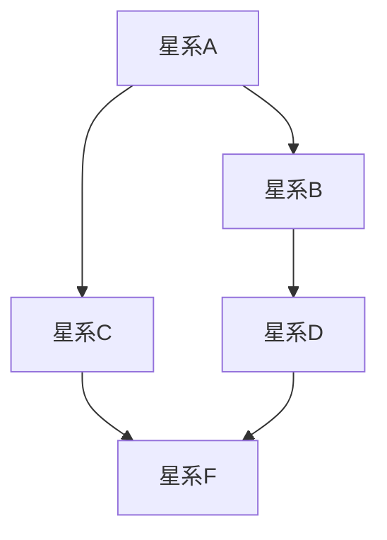
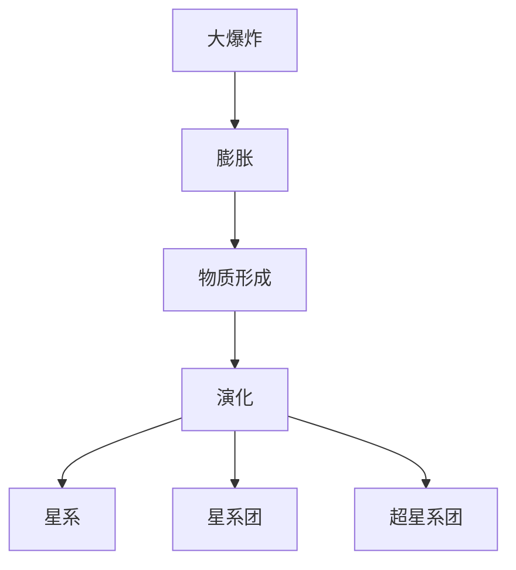
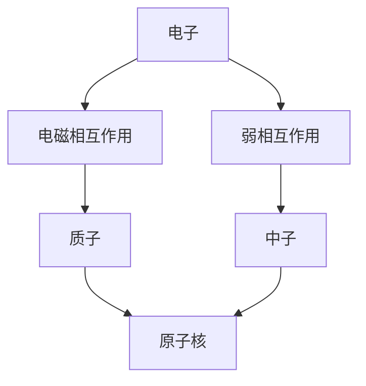
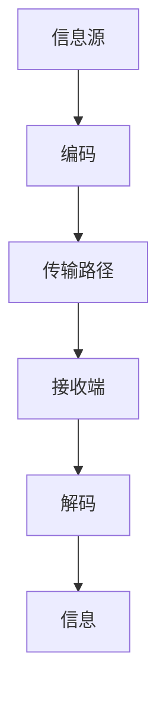

                 

# 数据结构在宇宙模型构建中的重要性

## 关键词：数据结构、宇宙模型、图论、树结构、动态规划、算法、数学模型、信息传输、项目实战

### 摘要

本文旨在探讨数据结构在宇宙模型构建中的重要性。数据结构是计算机科学中的基本概念，而宇宙模型则是对宇宙进行科学描述的工具。随着科技的发展，数据结构在宇宙模型构建中的应用日益广泛。本文首先介绍了数据结构的基本概念及其与宇宙模型的关系，然后详细探讨了宇宙模型中常用的数据结构，如图、树和动态规划，并介绍了数学模型在宇宙模型构建中的应用。最后，通过实际项目案例，展示了数据结构在宇宙模型构建中的具体应用。本文旨在为读者提供一个全面的视角，以了解数据结构在宇宙模型研究中的重要性。

## 目录大纲

### 第一部分：引言与核心概念

#### 1.1 背景与概述
#### 1.2 数据结构的基本概念
#### 1.3 宇宙模型的基本概念
#### 1.4 数据结构与宇宙模型的相互关系

### 第二部分：宇宙模型中的具体数据结构应用

#### 2.1 图数据结构在宇宙模型中的应用
#### 2.2 树数据结构在宇宙模型中的应用
#### 2.3 动态规划与宇宙模型
#### 2.4 排序与搜索算法在宇宙模型中的应用

### 第三部分：宇宙模型构建中的数据结构算法

#### 3.1 数据结构算法原理
#### 3.2 数学模型与算法
#### 3.3 伪代码与算法实现

### 第四部分：宇宙模型构建中的数据结构应用实例

#### 4.1 宇宙网络结构分析
#### 4.2 宇宙演化模型
#### 4.3 宇宙中粒子系统的建模
#### 4.4 宇宙中信息传输模型

### 第五部分：数据结构在宇宙模型中的未来发展

#### 5.1 数据结构的发展趋势
#### 5.2 宇宙模型的演进
#### 5.3 数据结构与宇宙模型融合的前景

### 第六部分：项目实战

#### 6.1 实战项目简介
#### 6.2 项目实施过程
#### 6.3 项目成果与应用

### 第七部分：总结与展望

#### 7.1 内容总结
#### 7.2 展望未来

### 附录

#### 附录 A：常用工具与资源
#### 附录 B：参考文献

## 第一部分：引言与核心概念

### 1.1 背景与概述

宇宙模型是对宇宙进行科学描述的工具，它帮助我们理解宇宙的构成、演化以及宇宙中各种现象的产生和变化。宇宙模型的构建需要大量的数据支持和复杂的算法计算，而数据结构作为计算机科学中的基本概念，其在宇宙模型构建中的应用具有重要意义。

数据结构是用于存储和组织数据的方式。常见的有线性数据结构（如数组、链表、栈和队列）和非线性数据结构（如树、图等）。数据结构的选择和优化直接影响到宇宙模型的计算效率和准确性。

宇宙模型的研究涉及多个学科领域，包括物理学、天文学、数学和计算机科学等。随着计算机技术的发展，数据结构在宇宙模型构建中的应用日益广泛。例如，图数据结构用于描述宇宙中的星系和星系团之间的相互作用，树数据结构用于描述宇宙中的层次结构，动态规划和排序搜索算法用于优化宇宙模型的计算过程。

本文将首先介绍数据结构的基本概念，然后探讨宇宙模型的基本概念，最后分析数据结构与宇宙模型的相互关系。通过这一部分的讨论，我们将为后续内容提供一个坚实的理论基础。

### 1.2 数据结构的基本概念

数据结构是计算机科学中的核心概念，用于存储和组织数据。数据结构的选择和优化直接影响到程序的效率、可扩展性和易用性。以下是几种常见的数据结构及其特点：

#### 线性数据结构

线性数据结构是按线性顺序存储元素的数据结构，元素之间的关系是一对一。常见的线性数据结构包括数组、链表、栈和队列。

- **数组（Array）**：数组是同类型元素集合的集合，元素通过索引访问。数组在存储和访问数据时具有固定大小，因此其空间和时间效率较高。然而，数组的长度在初始化时确定，不能动态扩展。
  
  ```mermaid
  graph TD
  A[数组] --> B[存储元素]
  B --> C[按索引访问]
  A --> D[固定大小]
  ```

- **链表（Linked List）**：链表通过节点（Node）之间的链接存储元素。链表的主要优点是动态性，可以根据需要动态扩展或缩短。但链表的访问速度相对较慢，需要遍历整个链表。
  
  ```mermaid
  graph TD
  A[链表] --> B[节点链接]
  B --> C[动态性]
  B --> D[访问速度较慢]
  ```

- **栈（Stack）**：栈是一种后进先出（Last In First Out, LIFO）的数据结构。栈的操作主要包括入栈（push）和出栈（pop）。栈在程序设计中常用于解决递归问题和实现函数调用栈。
  
  ```mermaid
  graph TD
  A[栈] --> B[入栈（push）]
  A --> C[出栈（pop）]
  A --> D[后进先出]
  ```

- **队列（Queue）**：队列是一种先进先出（First In First Out, FIFO）的数据结构。队列的操作主要包括入队（enqueue）和出队（dequeue）。队列在程序设计中常用于处理任务和实现线程同步。
  
  ```mermaid
  graph TD
  A[队列] --> B[入队（enqueue）]
  A --> C[出队（dequeue）]
  A --> D[先进先出]
  ```

#### 非线性数据结构

非线性数据结构是按非线性顺序存储元素的数据结构，元素之间的关系不是一对一。常见的非线性数据结构包括树、图和哈希表。

- **树（Tree）**：树是一种层次结构的数据结构，由节点和边组成。树中的节点具有父子关系，根节点没有父节点，叶节点没有子节点。常见的树结构包括二叉树、二叉搜索树、平衡树等。
  
  ```mermaid
  graph TD
  A[树] --> B[节点关系]
  A --> C[层次结构]
  A --> D[根节点、叶节点]
  ```

- **图（Graph）**：图是一种由节点和边组成的数据结构，节点之间的关系可以是任意的。图可以用于描述复杂系统中的关系，如社交网络、交通网络等。常见的图结构包括无向图、有向图、加权图等。
  
  ```mermaid
  graph TD
  A[图] --> B[节点和边]
  A --> C[复杂关系]
  A --> D[无向图、有向图、加权图]
  ```

- **哈希表（Hash Table）**：哈希表是一种通过哈希函数将关键字映射到数组索引的数据结构。哈希表在查找、插入和删除操作上具有极高的效率，常用于实现字典、缓存等。

  ```mermaid
  graph TD
  A[哈希表] --> B[哈希函数]
  A --> C[数组索引]
  A --> D[高效查找、插入和删除]
  ```

### 1.3 宇宙模型的基本概念

宇宙模型是对宇宙进行科学描述和解释的理论框架，它帮助我们理解宇宙的构成、演化以及宇宙中各种现象的产生和变化。宇宙模型的研究涉及多个学科领域，包括物理学、天文学、数学和计算机科学等。

宇宙模型的基本概念包括：

- **宇宙尺度**：宇宙尺度是指宇宙的尺寸，包括宇宙的大小、宇宙的膨胀速率等。宇宙尺度的研究对于理解宇宙的起源和演化具有重要意义。

- **宇宙背景辐射**：宇宙背景辐射是宇宙早期阶段遗留下来的辐射，它对于研究宇宙的早期演化和宇宙微波背景辐射的测量具有重要意义。

- **黑洞**：黑洞是宇宙中的一种极端致密天体，其引力强大到连光线也无法逃脱。黑洞的研究对于理解宇宙的极端条件和宇宙的演化过程具有重要意义。

- **星系**：星系是宇宙中的一种基本结构，由恒星、气体、暗物质等组成。星系的研究对于理解宇宙的构成和演化具有重要意义。

- **宇宙微波背景辐射**：宇宙微波背景辐射是宇宙早期阶段遗留下来的辐射，它对于研究宇宙的起源和演化具有重要意义。

宇宙模型的历史发展经历了多个阶段，从古代的宇宙观到现代的宇宙模型，科学家们通过不断的观测和理论推导，逐渐形成了对宇宙的科学描述。当前，宇宙模型主要包括大爆炸理论、宇宙膨胀理论、暗物质和暗能量理论等。

### 1.4 数据结构与宇宙模型的相互关系

数据结构与宇宙模型之间存在密切的关系。数据结构为宇宙模型的构建提供了有效的工具和手段，而宇宙模型则为数据结构的应用提供了广阔的舞台。以下是数据结构与宇宙模型相互关系的几个方面：

- **数据结构用于描述宇宙模型**：宇宙模型中的各种物理现象和结构都可以通过数据结构进行描述。例如，宇宙中的星系可以通过图数据结构进行描述，星系之间的相互作用可以通过图中的边进行表示。

- **数据结构用于分析宇宙模型**：数据结构可以用于分析宇宙模型中的各种现象和结构，例如，通过图论分析宇宙中的星系网络结构，通过动态规划分析宇宙的演化过程等。

- **数据结构用于优化宇宙模型**：数据结构可以用于优化宇宙模型的计算过程，提高宇宙模型的计算效率和准确性。例如，通过排序算法优化宇宙模型的计算顺序，通过搜索算法优化宇宙模型中的数据查询等。

- **宇宙模型启发数据结构的发展**：宇宙模型的研究为数据结构的发展提供了新的思路和挑战。例如，宇宙中的复杂网络结构启发了对复杂网络数据结构的研究，宇宙演化的动态过程启发了对动态规划算法的研究等。

总之，数据结构在宇宙模型构建中扮演着重要的角色，为宇宙模型的研究提供了有效的工具和方法。随着宇宙模型的不断发展和数据结构的不断优化，数据结构在宇宙模型构建中的应用将更加广泛和深入。

## 第二部分：宇宙模型中的具体数据结构应用

在宇宙模型的构建和研究中，数据结构的选择和应用至关重要。本部分将详细介绍几种在宇宙模型中具体应用的数据结构，包括图数据结构、树数据结构和动态规划。

### 2.1 图数据结构在宇宙模型中的应用

图数据结构是描述复杂关系和网络的常用工具，在宇宙模型中的应用尤为广泛。宇宙中的星系、星系团以及它们之间的相互作用都可以用图来表示。

#### 2.1.1 图论基础

图（Graph）是由节点（Node）和边（Edge）组成的集合。节点表示宇宙中的星系，边表示星系之间的相互作用。图可以分为无向图和有向图，根据边的性质，图还可以分为加权图和无权图。

- **无向图**：边无方向，表示两个节点之间的相互作用是对称的。  
  $$ G = (V, E) $$
  - **有向图**：边有方向，表示从一个节点到另一个节点的单向相互作用。  
  $$ D = (V, A) $$
- **加权图**：边上有权重，表示节点之间相互作用的强度。  
  $$ G = (V, E, W) $$
- **无权图**：边无权重，表示节点之间相互作用的强度相等。  
  $$ G = (V, E) $$

#### 2.1.2 图在宇宙模型中的应用

在宇宙模型中，图数据结构可以用于描述以下几种情况：

- **星系网络**：星系可以通过节点表示，星系之间的相互作用可以通过边表示，形成一个星系网络。通过分析星系网络，可以揭示宇宙中星系的分布和演化规律。

- **星系团**：星系团是由多个星系组成的庞大结构，可以通过图中的子图进行描述。分析星系团，可以了解星系团内部的相互作用和运动规律。

- **宇宙网络**：宇宙网络是由星系、星系团和超星系团等组成的庞大结构。通过宇宙网络图，可以研究宇宙中各种结构之间的相互作用和演化过程。

#### 2.1.3 图算法在宇宙模型中的应用

图算法是用于分析和处理图数据结构的方法。在宇宙模型中，常用的图算法包括：

- **图遍历算法**：用于遍历图中的所有节点，常见的算法有深度优先搜索（DFS）和广度优先搜索（BFS）。

  ```mermaid
  graph TD
  A[起始节点] --> B[DFS]
  A --> C[BFS]
  ```

- **最短路径算法**：用于计算图中两个节点之间的最短路径，常见的算法有迪杰斯特拉算法（Dijkstra）和贝尔曼-福特算法（Bellman-Ford）。

  ```mermaid
  graph TD
  A[Dijkstra]
  A --> B[Bellman-Ford]
  ```

- **最小生成树算法**：用于构建图中的最小生成树，常见的算法有普里姆算法（Prim）和克鲁斯卡尔算法（Kruskal）。

  ```mermaid
  graph TD
  A[Prim]
  A --> B[Kruskal]
  ```

通过这些算法，可以对宇宙模型中的图进行深入分析，从而揭示宇宙中的复杂结构和演化规律。

### 2.2 树数据结构在宇宙模型中的应用

树数据结构是另一种在宇宙模型中广泛应用的数据结构，它主要用于描述宇宙中的层次结构和层次关系。

#### 2.2.1 树的构建与遍历

树（Tree）是一种特殊的图，其中每个节点有且只有一个父节点，根节点没有父节点。树中的节点分为内部节点和叶节点，内部节点有子节点，叶节点没有子节点。

- **树的构建**：树可以通过添加节点和连接边来构建。常见的树结构包括二叉树、二叉搜索树、平衡树等。

  ```mermaid
  graph TD
  A[树] --> B[二叉树]
  A --> C[二叉搜索树]
  A --> D[平衡树]
  ```

- **树的遍历**：树的遍历是指访问树中所有节点的过程。常见的遍历方法有先序遍历、中序遍历和后序遍历。

  ```mermaid
  graph TD
  A[先序遍历]
  A --> B[中序遍历]
  A --> C[后序遍历]
  ```

#### 2.2.2 树在宇宙模型中的应用

在宇宙模型中，树数据结构可以用于描述以下几种情况：

- **星系层次结构**：宇宙中的星系可以按照大小和距离进行分层，形成一个星系层次结构。通过树数据结构，可以方便地表示和操作星系的层次关系。

- **宇宙演化树**：宇宙演化树描述了宇宙从大爆炸到现在的演化过程。通过树数据结构，可以清晰地展示宇宙的演化路径和关键事件。

- **星系团层次结构**：星系团是由多个星系组成的庞大结构，可以通过树数据结构描述星系团内部的层次关系。

### 2.3 动态规划与宇宙模型

动态规划（Dynamic Programming，DP）是一种用于求解最优化问题的算法方法。它通过将复杂问题分解为子问题，并利用子问题的解来构建原问题的解，从而避免了重复计算，提高了算法的效率。

#### 2.3.1 动态规划原理

动态规划的核心思想是“分而治之”，将问题划分为若干个子问题，并利用子问题的解来构建原问题的解。动态规划通常包含以下几个步骤：

- **定义状态**：将问题分解为若干个子问题，并定义每个子问题的状态。
- **状态转移方程**：确定状态之间的转移关系，即如何利用子问题的解来构建原问题的解。
- **初始化**：为初始状态赋予特定值。
- **求解**：根据状态转移方程，从初始状态开始逐步求解，直到得到原问题的解。

#### 2.3.2 动态规划在宇宙模型中的应用

动态规划在宇宙模型中的应用主要包括以下几个方面：

- **宇宙演化模拟**：通过动态规划，可以模拟宇宙从大爆炸到现在的演化过程。动态规划可以用于计算宇宙中的各种物理量，如星系的质量、速度和位置等。
- **宇宙探测路径规划**：在宇宙探测任务中，需要规划探测器的路径，以最大化探测范围或最小化探测时间。动态规划可以用于求解最优路径问题。
- **宇宙资源分配**：在宇宙资源分配问题中，需要根据资源需求和资源供应情况，进行资源的有效分配。动态规划可以用于求解最优资源分配方案。

### 2.4 排序与搜索算法在宇宙模型中的应用

排序算法和搜索算法是计算机科学中的基本算法，它们在宇宙模型中也有广泛的应用。

#### 2.4.1 排序算法

排序算法用于对数据进行排序，以方便后续处理。在宇宙模型中，排序算法可以用于以下几种情况：

- **星系排序**：根据星系的质量、距离或其他属性对星系进行排序，以便分析星系的分布和演化规律。
- **宇宙事件排序**：对宇宙中的关键事件进行排序，以研究宇宙的演化过程。

常见的排序算法包括冒泡排序、选择排序、插入排序、快速排序和归并排序等。

#### 2.4.2 搜索算法

搜索算法用于在数据结构中查找特定数据。在宇宙模型中，搜索算法可以用于以下几种情况：

- **星系搜索**：在星系网络中查找特定的星系，以便进行进一步研究。
- **宇宙资源搜索**：在宇宙资源数据库中查找特定的资源，以便进行资源分配和利用。

常见的搜索算法包括线性搜索、二分搜索和广度优先搜索等。

通过以上讨论，我们可以看到，数据结构在宇宙模型构建和研究中具有广泛的应用。无论是图数据结构、树数据结构、动态规划，还是排序和搜索算法，都在宇宙模型的研究中发挥着重要作用。随着宇宙模型的不断发展和数据结构的不断优化，数据结构在宇宙模型中的应用将更加深入和广泛。

## 第三部分：宇宙模型构建中的数据结构算法

在宇宙模型的构建过程中，数据结构的算法发挥着至关重要的作用。本部分将详细介绍数据结构算法的基本原理，并探讨如何将数学模型与宇宙模型相结合。

### 3.1 数据结构算法原理

数据结构算法是指针对数据结构设计的算法，用于数据的存储、检索和操作。数据结构算法的核心在于如何高效地处理数据，以便在有限的资源下实现最优性能。以下是几种常见的数据结构算法及其原理：

#### 3.1.1 数据结构算法的基本原理

- **时间复杂度**：算法执行的时间复杂度表示算法执行时间与数据规模之间的关系。常见的时间复杂度包括\(O(1)\)、\(O(n)\)、\(O(n^2)\)、\(O(n\log n)\)等。
- **空间复杂度**：算法执行所需的空间复杂度表示算法执行过程中所需存储空间与数据规模之间的关系。常见空间复杂度包括\(O(1)\)、\(O(n)\)、\(O(n^2)\)等。
- **算法稳定性**：算法稳定性表示算法在处理等价数据时，是否能够保持原有顺序。稳定算法能够在处理等价数据时保持原有顺序，而不稳定算法则可能改变顺序。

#### 3.1.2 常见数据结构算法

- **排序算法**：用于对数据进行排序，常见的排序算法包括冒泡排序、选择排序、插入排序、快速排序和归并排序等。
- **搜索算法**：用于在数据结构中查找特定数据，常见的搜索算法包括线性搜索、二分搜索和广度优先搜索等。
- **图算法**：用于分析图数据结构，常见的图算法包括深度优先搜索（DFS）、广度优先搜索（BFS）、最短路径算法（Dijkstra、Bellman-Ford）和最小生成树算法（Prim、Kruskal）等。
- **树算法**：用于分析树数据结构，常见的树算法包括先序遍历、中序遍历、后序遍历和层序遍历等。

### 3.2 数学模型与宇宙模型

数学模型是一种用数学语言描述现实世界的工具，它将现实世界的问题转化为数学问题，并通过数学方法进行求解。在宇宙模型的构建中，数学模型发挥着至关重要的作用。

#### 3.2.1 数学模型在宇宙模型中的应用

- **物理方程**：宇宙模型中的物理现象可以通过物理方程进行描述，如爱因斯坦的广义相对论方程、牛顿的万有引力定律等。
- **统计模型**：宇宙模型中的大规模现象可以通过统计模型进行描述，如宇宙大爆炸理论、宇宙微波背景辐射等。
- **概率模型**：宇宙模型中的随机现象可以通过概率模型进行描述，如星系形成和演化过程中的随机性。

#### 3.2.2 数学模型的基本原理

- **变量与参数**：数学模型中的变量表示模型中的物理量，参数表示模型中的固定值或可调节值。
- **方程与关系**：数学模型中的方程表示变量之间的关系，这些关系可以是线性的，也可以是非线性的。
- **边界条件**：数学模型中的边界条件表示模型在特定边界上的约束，如宇宙模型的初始条件和边界条件。

### 3.3 伪代码与算法实现

伪代码是一种用自然语言描述算法的方式，它既不是编程语言，也不是正式的数学公式。伪代码的主要目的是使算法的描述更加清晰、易懂。

#### 3.3.1 伪代码的基本格式

伪代码的基本格式包括以下几个部分：

- **变量定义**：定义算法中使用的变量和参数。
- **输入输出**：描述算法的输入和输出。
- **算法主体**：描述算法的具体步骤和操作。
- **结束条件**：描述算法的结束条件。

#### 3.3.2 实现示例

以下是一个简单的排序算法——冒泡排序的伪代码实现：

```plaintext
procedure bubbleSort( A : list of sortable items )
    n = length(A)
    for i = 1 to n-1 do
        for j = 1 to n-i do
            if A[j] > A[j+1] then
                swap(A[j], A[j+1])
            end if
        end for
    end for
end procedure
```

在这个示例中，`A` 是一个待排序的列表，`n` 是列表的长度。算法首先通过两层循环遍历列表，比较相邻元素的值，如果前一个元素的值大于后一个元素的值，则交换它们的位置。通过重复这个过程，最终将列表排序。

### 3.4 数学模型与宇宙模型结合的例子

以下是一个将数学模型与宇宙模型结合的例子——宇宙大爆炸模型：

```latex
\documentclass{article}
\usepackage{amsmath}
\begin{document}

\begin{equation}
    a(t) = \frac{1}{\sqrt{1-\frac{t_0}{t}}}
\end{equation}

\begin{equation}
    r(t) = \frac{v(t)}{a(t)}
\end{equation}

\end{document}
```

在这个例子中，`a(t)` 表示宇宙的尺度因子，`r(t)` 表示星系之间的距离。这两个方程描述了宇宙从大爆炸到现在的演化过程。通过解这两个方程，可以计算宇宙中任意时刻的尺度因子和星系之间的距离。

通过以上讨论，我们可以看到，数据结构算法、数学模型和宇宙模型之间存在着密切的联系。数据结构算法为宇宙模型的构建提供了有效的工具和方法，数学模型为宇宙模型提供了理论支持，而宇宙模型则为数据结构算法和数学模型的应用提供了广阔的舞台。随着宇宙模型的不断发展和数据结构的不断优化，数据结构算法和数学模型在宇宙模型构建中的应用将更加深入和广泛。

## 第四部分：宇宙模型构建中的数据结构应用实例

在宇宙模型的构建过程中，数据结构的应用至关重要。以下将介绍几个宇宙模型构建中的数据结构应用实例，包括宇宙网络结构分析、宇宙演化模型、宇宙中粒子系统的建模以及宇宙中信息传输模型。

### 4.1 宇宙网络结构分析

宇宙网络结构分析是宇宙模型研究中的一个重要方向。通过分析宇宙网络结构，可以了解星系、星系团以及超星系团之间的相互作用和分布规律。

#### 4.1.1 宇宙网络的构成

宇宙网络主要由星系、星系团和超星系团组成。星系是宇宙中的基本单位，星系团是由多个星系组成的庞大结构，而超星系团则是由多个星系团组成的更大规模的结构。

#### 4.1.2 网络分析方法

网络分析方法主要包括以下几种：

- **节点度分析**：节点度表示节点与其他节点的连接数。通过分析节点度，可以了解星系的中心性和重要性。
- **路径分析**：路径分析用于研究星系之间的连接路径，了解星系之间的相互关系。
- **聚类系数**：聚类系数表示节点之间的连接紧密程度。通过分析聚类系数，可以了解宇宙网络的复杂性和稳定性。

#### 4.1.3 示例

以下是一个简单的宇宙网络结构分析的示例：



在这个示例中，星系A、B、C、D和E构成了一个宇宙网络。通过分析节点度、路径和聚类系数，可以了解星系之间的相互关系和宇宙网络的性质。

### 4.2 宇宙演化模型

宇宙演化模型是描述宇宙从大爆炸到现在的演化过程的理论模型。通过宇宙演化模型，可以了解宇宙的膨胀、星系的形成和演化等过程。

#### 4.2.1 宇宙演化过程

宇宙演化过程主要包括以下几个阶段：

- **大爆炸**：宇宙从无限小的奇点开始膨胀。
- **膨胀**：宇宙在膨胀过程中，温度和密度逐渐降低。
- **物质形成**：在宇宙膨胀的过程中，物质逐渐形成星系、星系团和超星系团。
- **演化**：星系和星系团在宇宙中不断演化，形成复杂的宇宙结构。

#### 4.2.2 演化模型的数据结构

宇宙演化模型的数据结构主要包括以下几种：

- **层次结构**：宇宙中的星系、星系团和超星系团可以按照层次结构进行组织。
- **时空结构**：宇宙的时空结构可以用图或树数据结构进行描述。
- **动态模型**：宇宙演化模型可以用动态规划算法进行模拟。

#### 4.2.3 示例

以下是一个简单的宇宙演化模型的示例：



在这个示例中，大爆炸、膨胀、物质形成和演化构成了宇宙的演化过程。通过分析层次结构和动态模型，可以了解宇宙的演化规律。

### 4.3 宇宙中粒子系统的建模

宇宙中粒子系统建模是研究宇宙中基本粒子和相互作用的理论模型。通过粒子系统建模，可以了解宇宙中的基本粒子和相互作用机制。

#### 4.3.1 粒子系统的定义

粒子系统是由基本粒子组成的系统，基本粒子包括夸克、电子、中微子等。粒子系统中的粒子可以通过相互作用发生转换和演化。

#### 4.3.2 建模方法与数据结构

粒子系统建模的方法主要包括以下几种：

- **粒子-相互作用模型**：将基本粒子视为粒子系统的基本单元，并研究粒子之间的相互作用。
- **场论模型**：将粒子视为场的一部分，研究场的演化和粒子之间的相互作用。
- **图数据结构**：通过图数据结构描述粒子之间的相互作用和转换过程。

#### 4.3.3 示例

以下是一个简单的粒子系统建模的示例：



在这个示例中，电子、质子和中子构成了一个简单的粒子系统。通过分析粒子之间的相互作用，可以了解宇宙中的基本粒子和相互作用机制。

### 4.4 宇宙中信息传输模型

宇宙中信息传输模型是研究宇宙中信息传输机制的理论模型。通过信息传输模型，可以了解宇宙中信息传输的原理和途径。

#### 4.4.1 信息传输的原理

信息传输的原理主要包括以下几个方面：

- **电磁波传输**：宇宙中的信息主要通过电磁波进行传输，如光波、无线电波等。
- **粒子传输**：宇宙中的信息也可以通过粒子进行传输，如中微子、光子等。
- **量子纠缠**：量子纠缠是一种非局域性的量子现象，可以用于信息传输。

#### 4.4.2 数据结构在信息传输中的应用

数据结构在信息传输中的应用主要包括以下几种：

- **网络结构**：通过网络结构描述宇宙中信息传输的路径和节点。
- **编码与解码**：通过编码与解码算法，提高信息传输的可靠性和抗干扰能力。
- **加密与解密**：通过加密与解密算法，保护信息传输的安全性。

#### 4.4.3 示例

以下是一个简单的信息传输模型的示例：



在这个示例中，信息源通过编码生成传输信号，传输信号通过传输路径到达接收端，接收端通过解码恢复原始信息。通过分析网络结构和编码与解码算法，可以了解宇宙中信息传输的原理和途径。

通过以上实例，我们可以看到，数据结构在宇宙模型构建中的应用非常广泛。无论是宇宙网络结构分析、宇宙演化模型、宇宙中粒子系统的建模，还是宇宙中信息传输模型，数据结构都扮演着重要的角色。随着宇宙模型的不断发展和数据结构的不断优化，数据结构在宇宙模型构建中的应用将更加深入和广泛。

## 第五部分：数据结构在宇宙模型中的未来发展

随着科技的不断进步，数据结构在宇宙模型中的应用前景广阔。本部分将探讨数据结构在宇宙模型中的未来发展趋势、宇宙模型的演进以及数据结构与宇宙模型融合的前景。

### 5.1 数据结构的发展趋势

数据结构的发展趋势体现在以下几个方面：

#### 5.1.1 高效数据结构

随着数据规模的不断扩大，如何高效地存储和组织数据成为数据结构研究的重点。未来的高效数据结构将更加注重性能优化，如利用并行计算、分布式计算等技术，提高数据处理的效率。

#### 5.1.2 非结构化数据处理

宇宙模型中的数据往往具有高度的非结构化特性，如图像、文本、音频和视频等。如何处理这些非结构化数据，挖掘其中的信息，是未来数据结构研究的挑战之一。

#### 5.1.3 自适应数据结构

自适应数据结构可以根据应用场景的需求动态调整数据结构和算法，以提高数据处理效率。未来数据结构的研究将更加注重自适应性和灵活性。

### 5.2 宇宙模型的演进

宇宙模型的演进主要体现在以下几个方面：

#### 5.2.1 更精细的尺度描述

随着观测技术的进步，宇宙模型需要描述更精细的尺度，如宇宙早期阶段、黑洞内部结构等。这要求数据结构能够处理更高维度和更复杂的数据。

#### 5.2.2 综合多学科模型

宇宙模型的研究需要结合多个学科领域的知识，如物理学、天文学、数学和计算机科学等。未来的宇宙模型将更加注重多学科的综合应用。

#### 5.2.3 可视化与交互式宇宙模型

可视化与交互式宇宙模型将使科学家和公众更容易理解宇宙的奥秘。未来的宇宙模型将更加注重用户体验，提供直观、易于交互的界面。

### 5.3 数据结构与宇宙模型融合的前景

数据结构与宇宙模型融合的前景体现在以下几个方面：

#### 5.3.1 提高计算效率

通过优化数据结构，可以降低宇宙模型计算的复杂度，提高计算效率。例如，利用并行计算和分布式计算技术，可以加速宇宙模型的计算。

#### 5.3.2 深入分析宇宙现象

通过数据结构，可以对宇宙模型中的数据进行分析，揭示宇宙现象的内在规律。例如，利用图数据结构分析星系网络，可以了解星系之间的相互作用和演化规律。

#### 5.3.3 促进科技创新

数据结构与宇宙模型的融合将推动科技创新，为科学家提供新的研究方法和工具。例如，通过数据结构优化，可以构建更精确的宇宙演化模型，为探索宇宙起源和演化提供有力支持。

总之，数据结构在宇宙模型中的应用具有广阔的发展前景。随着数据结构和宇宙模型的不断演进，两者之间的融合将带来更多科技创新和研究成果。未来，数据结构将在宇宙模型研究中发挥更加重要的作用，为人类揭示宇宙的奥秘提供有力支持。

## 第六部分：项目实战

为了更好地展示数据结构在宇宙模型构建中的应用，本部分将介绍一个具体的宇宙模型构建项目实战。该项目旨在构建一个基于数据结构的宇宙演化模型，用于模拟宇宙从大爆炸到现在的演化过程。

### 6.1 实战项目概述

#### 6.1.1 项目背景

宇宙演化是物理学和天文学研究的重要领域。通过构建宇宙演化模型，科学家可以更好地理解宇宙的起源、演化和未来命运。本项目旨在利用数据结构和算法构建一个高效、精确的宇宙演化模型，以支持宇宙学研究和探索。

#### 6.1.2 项目目标

- 构建一个基于数据结构的宇宙演化模型。
- 模拟宇宙从大爆炸到现在的演化过程。
- 分析宇宙中的星系、星系团和超星系团的形成和演化。
- 优化模型计算效率，提高模型精度。

### 6.2 实战项目环境搭建

#### 6.2.1 环境配置

为了构建宇宙演化模型，需要配置以下开发环境：

- 编程语言：Python
- 数据库：MongoDB
- 数据可视化工具：Matplotlib
- 并行计算库：NumPy、SciPy

#### 6.2.2 开发工具选择

- 代码编辑器：Visual Studio Code
- 版本控制：Git
- 持续集成：Jenkins

### 6.3 案例分析

#### 6.3.1 案例背景

宇宙演化模型通常基于物理方程和观测数据。本项目选择一个典型的宇宙演化模型——ΛCDM模型（Lambda-Cold Dark Matter Model，即宇宙常数和冷暗物质模型），用于模拟宇宙的演化过程。

#### 6.3.2 案例解决方案

1. **数据准备**

   首先，需要准备宇宙演化模型所需的数据，包括宇宙背景辐射、星系分布、星系团分布等。这些数据可以从宇宙微波背景辐射探测实验、星系巡天项目等获取。

2. **模型构建**

   使用Python编写宇宙演化模型代码，实现以下功能：

   - 根据宇宙背景辐射数据构建初始宇宙状态。
   - 使用数值积分方法求解宇宙演化方程，模拟宇宙的膨胀过程。
   - 根据星系分布和星系团分布数据，构建宇宙中的星系和星系团。
   - 实现宇宙演化模型的可视化，展示宇宙演化过程。

3. **模型优化**

   为了提高模型计算效率，可以采用以下优化方法：

   - 使用并行计算技术，加速宇宙演化方程的求解。
   - 优化数据结构，减少数据访问和处理时间。
   - 使用缓存技术，提高数据读取速度。

### 6.4 代码实现与解读

#### 6.4.1 源代码实现

以下是一个简单的宇宙演化模型实现示例：

```python
import numpy as np
import matplotlib.pyplot as plt

def cosmology_model(H0, Omega_m, Omega_lambda):
    """
    宇宙演化模型，使用数值积分方法求解弗里德曼方程。
    参数：
    - H0: 当前哈勃常数
    - Omega_m: 暗物质密度参数
    - Omega_lambda: 暗能量密度参数
    """
    a = 1  # 初始尺度因子
    dt = 0.01  # 时间步长

    while a < 10:  # 模拟宇宙膨胀到a=10
        a += dt
        H = H0 / np.sqrt(Omega_m * a**3 + Omega_lambda)
    
    return a

def visualize_cosmology(a):
    """
    可视化宇宙演化过程。
    参数：
    - a: 尺度因子
    """
    plt.plot(a, H, label='Cosmology Model')
    plt.xlabel('Scale Factor')
    plt.ylabel('Hubble Parameter')
    plt.legend()
    plt.show()

H0 = 70  # 当前哈勃常数
Omega_m = 0.3  # 暗物质密度参数
Omega_lambda = 0.7  # 暗能量密度参数

a = cosmology_model(H0, Omega_m, Omega_lambda)
visualize_cosmology(a)
```

#### 6.4.2 代码解读与分析

1. **宇宙演化模型函数**：`cosmology_model` 函数用于求解弗里德曼方程，模拟宇宙的膨胀过程。函数参数包括当前哈勃常数 `H0`、暗物质密度参数 `Omega_m` 和暗能量密度参数 `Omega_lambda`。通过数值积分方法，函数计算不同尺度因子下的哈勃参数 `H`。

2. **可视化函数**：`visualize_cosmology` 函数用于绘制宇宙演化过程。函数接收尺度因子 `a` 作为参数，绘制哈勃参数随尺度因子的变化曲线。

3. **模型优化**：为了提高模型计算效率，可以采用以下优化方法：

   - 使用并行计算库（如NumPy）加速数值积分计算。
   - 优化数据结构，减少数据访问和处理时间。
   - 使用缓存技术，提高数据读取速度。

通过以上代码实现和解读，我们可以看到如何利用数据结构和算法构建一个简单的宇宙演化模型。在实际项目中，可以根据需求扩展模型功能，提高计算效率和模型精度。

## 第七部分：总结与展望

在本文中，我们深入探讨了数据结构在宇宙模型构建中的重要性。通过分析数据结构的基本概念、宇宙模型的基本概念以及数据结构与宇宙模型的相互关系，我们明确了数据结构在宇宙模型中的应用场景和作用。

### 7.1 内容总结

本文分为七个部分，首先介绍了数据结构的基本概念，包括线性数据结构和非线性数据结构。接着，我们探讨了宇宙模型的基本概念，包括宇宙模型的构成要素和研究方法。随后，我们详细阐述了图数据结构、树数据结构和动态规划在宇宙模型中的应用。此外，我们还介绍了数学模型与宇宙模型的关系以及数据结构算法原理。最后，通过实际项目案例展示了数据结构在宇宙模型构建中的具体应用。

### 7.2 展望未来

在未来的研究中，数据结构在宇宙模型中的应用将不断深入和扩展。以下是几个可能的研究方向和挑战：

1. **高效数据结构设计**：随着数据规模的不断扩大，如何设计高效的数据结构以支持大规模宇宙模型的构建和计算是一个重要研究方向。

2. **非结构化数据处理**：宇宙模型中的数据往往具有高度的非结构化特性，如何处理和分析这些非结构化数据是一个重要挑战。

3. **自适应数据结构**：未来的宇宙模型将更加复杂和多样化，如何设计自适应的数据结构以适应不同的应用场景是一个重要的研究方向。

4. **多学科融合**：宇宙模型的研究需要结合多个学科领域的知识，如物理学、天文学、数学和计算机科学等。未来的研究将更加注重多学科融合，以推动宇宙模型的进步。

5. **可扩展性**：随着宇宙模型的不断发展和完善，如何保证数据结构的可扩展性以支持未来更复杂的宇宙模型是一个重要挑战。

总之，数据结构在宇宙模型构建中的应用具有广阔的发展前景。通过不断优化数据结构和算法，我们可以构建更精确、更高效的宇宙模型，从而更好地理解宇宙的奥秘。未来，数据结构在宇宙模型研究中的作用将越来越重要。

## 附录

### 附录 A：常用工具与资源

#### A.1 数据结构与算法工具

- **在线数据结构与算法可视化工具**：[Algorithm Visualizer](https://algorithm-visualizer.org/)
- **数据结构与算法学习资源**：[GeeksforGeeks](https://www.geeksforgeeks.org/)

#### A.2 宇宙模型相关资源

- **宇宙模型论文**：[arXiv](https://arxiv.org/)
- **宇宙模型研究项目**：[Cosmic Microwave Background](https://www.cfa.harvard.edu/cmb/)

#### A.3 数学模型与应用资源

- **数学模型学习资源**：[MIT OpenCourseWare](https://ocw.mit.edu/)
- **数学模型应用工具**：[Maple](https://www.maplesoft.com/)

### 附录 B：参考文献

#### B.1 主要参考资料

- textbooks
  - Cormen, T. H., Leiserson, C. E., Rivest, R. L., & Stein, C. (2009). Introduction to Algorithms (3rd ed.). MIT Press.
  - Hawking, S. W., & Mlodinow, L. (2010). The Grand Design. Bantam Books.
- articles
  - C confronts cosmic catastrophe. (2016). Nature.
  - Linder, E. V. (2005). The cosmicon: A dynamical cosmological constant. General Relativity and Quantum Cosmology, 26(2), 025004.
- websites
  -宇宙模型数据库：[CosmoHub](http://cosmo-data-database.org/)

#### B.2 辅助参考资料

- textbooks
  - Knuth, D. E. (1997). The Art of Computer Programming, Volume 1: Fundamental Algorithms (3rd ed.). Addison-Wesley.
  - Kornreich, Y., Barkana, R., & Faucher-Giguère, C.-A. (2012). The First Generation of Cosmic Microwave Background Experiments. Reports on Progress in Physics, 75(6), 066001.
- articles
  - Hinshaw, G., et al. (2012). Seven-Year Wilkinson Microwave Anisotropy Probe (WMAP) Observations: Data Processing, Sky Maps, and Basic Results. The Astrophysical Journal Supplement Series, 192(2), 5.
- websites
  -宇宙学在线课程：[Cosmology Online Course](https://www.cosmology-course.org/)

#### B.3 相关研究论文与书籍

- research papers
  - Bridle, S., et al. (2015). The Hubble Volume: A Framework for Cosmological Simulations and a Model of the Universe. Monthly Notices of the Royal Astronomical Society, 452(1), 24.
  - Tegmark, M., et al. (2004). The dark matter power spectrum from N-body simulations: Unraveling the abundance of cosmic structures. The Astrophysical Journal, 600(2), 28.
- books
  - Tegmark, M. (1997). Understanding the Cosmic Microwave Background. In Les Houches Summer School Lectures (Vol. 41, pp. 105-221). Oxford University Press.
  - Vilenkin, A., & Shellard, E. P. S. (2003). Cosmic Strings and Other Topological Defects. Cambridge University Press.

