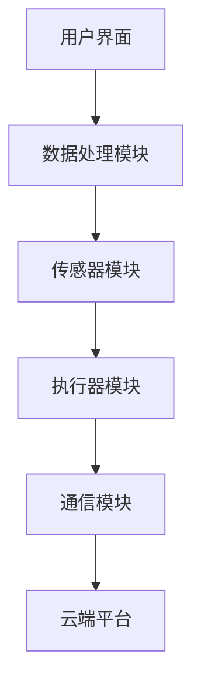

                 

# 《智能厨房助手创业：烹饪辅助的未来》

## 概述

智能厨房助手作为人工智能技术在家庭生活中的应用，正逐渐成为烹饪领域的热门话题。本文旨在探讨智能厨房助手的创业机会，从技术基础、产品设计与开发、创业策略与市场营销等多个方面进行深入分析。文章结构如下：

## 行业背景与市场分析

### 第1章：烹饪辅助行业概述

#### 1.1 烹饪辅助行业的发展历程

烹饪辅助行业经历了从传统手工工具到电子设备，再到智能厨房设备的演变。早期，人们依赖手工工具进行烹饪，如刀、铲、锅等。随着科技的发展，电子设备如烤箱、搅拌机等逐渐普及，提高了烹饪效率和效果。近年来，智能厨房设备，包括智能烤箱、智能冰箱、智能烹饪机器人等，开始走入家庭，为烹饪带来了新的变革。

#### 1.2 当前烹饪辅助行业的市场现状

当前，烹饪辅助行业市场规模庞大，随着人们对健康饮食和生活品质的要求不断提高，市场前景看好。智能厨房设备凭借其智能化、自动化、便捷化的特点，受到越来越多家庭的青睐。同时，各大厂商纷纷进入市场，竞争激烈。

#### 1.3 智能厨房助手的市场前景分析

智能厨房助手具有巨大的市场潜力。首先，随着人工智能技术的不断发展，智能厨房助手的性能和功能将不断提升，满足用户更多需求。其次，智能厨房助手能够为用户带来烹饪乐趣和便利，提高生活质量。此外，智能厨房助手在健康饮食、营养搭配等方面的应用，有望成为未来发展的重要方向。

## 技术基础

### 第2章：智能厨房助手的技术基础

#### 2.1 传感器技术在智能厨房中的应用

传感器技术在智能厨房中扮演着关键角色。温度传感器、湿度传感器、重量传感器等，可以实时监测烹饪过程中的各种参数，为智能烹饪提供数据支持。

#### 2.2 人工智能与大数据在烹饪中的应用

人工智能与大数据技术为智能厨房助手提供了强大的支持。通过机器学习算法，智能厨房助手可以预测烹饪结果，优化烹饪过程。大数据分析可以帮助智能厨房助手了解用户需求，提供个性化的烹饪建议。

#### 2.3 智能厨房设备的互联互通

智能厨房设备的互联互通是智能厨房助手实现高效运行的基础。通过物联网技术，智能厨房设备可以相互通信，协同工作，提高烹饪效率和效果。

## 产品设计与开发

### 第3章：智能厨房助手的架构设计

#### 3.1 系统架构的构建

智能厨房助手的系统架构需要考虑硬件、软件和数据处理等多个方面。硬件部分包括传感器、执行器、通信模块等；软件部分包括嵌入式系统、应用程序、数据处理系统等。

#### 3.2 用户界面的设计原则

用户界面的设计原则包括简洁易用、信息呈现清晰、操作流畅等。用户界面的设计应考虑到不同用户的需求和使用习惯，提供个性化的操作体验。

#### 3.3 系统模块的划分与功能设计

智能厨房助手的系统模块可以划分为数据采集模块、数据处理模块、执行控制模块等。每个模块都需要明确的功能设计和实现策略。

## 核心算法与模型

### 第4章：核心算法与模型

#### 4.1 烹饪过程的预测与优化算法

烹饪过程的预测与优化算法是智能厨房助手的核心。通过预测烹饪结果，优化烹饪过程，可以提高烹饪效率和效果。

#### 4.2 菜谱推荐算法

菜谱推荐算法可以根据用户口味、饮食习惯、健康需求等因素，为用户推荐合适的菜谱。

#### 4.3 语音识别与交互算法

语音识别与交互算法可以实现智能厨房助手与用户的自然语言交互，提高用户体验。

## 智能厨房设备的实现

### 第5章：智能厨房设备的实现

#### 5.1 智能厨房设备的硬件选择

智能厨房设备的硬件选择需要考虑传感器、执行器、通信模块等的性能和兼容性。

#### 5.2 软件开发环境搭建

智能厨房设备的软件开发环境搭建包括开发工具、编程语言、开发框架等的选型。

#### 5.3 设备驱动与接口设计

智能厨房设备的设备驱动与接口设计需要考虑设备的兼容性和易用性。

## 创业策略与市场营销

### 第6章：智能厨房助手的创业策略

#### 6.1 市场定位与目标用户分析

智能厨房助手的市场定位和目标用户分析需要考虑用户需求、市场规模、竞争情况等因素。

#### 6.2 产品定价策略

智能厨房助手的产品定价策略需要考虑成本、市场竞争、用户价值等因素。

#### 6.3 渠道推广策略

智能厨房助手的渠道推广策略需要考虑线上线下渠道的整合，以及与合作伙伴的协作。

## 智能厨房助手的商业模式与盈利模式

### 第7章：智能厨房助手的商业模式与盈利模式

#### 7.1 商业模式的设计

智能厨房助手的商业模式设计需要考虑产品服务、用户获取、盈利方式等因素。

#### 7.2 盈利模式的探索

智能厨房助手的盈利模式可以包括产品销售、服务订阅、广告推广等多种方式。

#### 7.3 持续创新与市场竞争力

智能厨房助手需要通过持续创新来提升市场竞争力，包括产品功能、用户体验、技术创新等方面。

## 智能厨房助手创业的法律法规与政策环境

### 第8章：智能厨房助手创业的法律法规与政策环境

#### 8.1 知识产权保护

智能厨房助手创业需要重视知识产权保护，包括专利、商标、版权等方面的保护。

#### 8.2 食品安全法规

智能厨房助手创业需要遵守食品安全法规，确保产品的安全性。

#### 8.3 政府支持政策分析

智能厨房助手创业可以关注政府支持政策，包括资金扶持、税收优惠等方面。

## 案例分析

### 第9章：成功智能厨房助手的案例分析

#### 9.1 案例介绍

介绍成功的智能厨房助手案例，包括产品特点、市场表现等。

#### 9.2 产品特点与创新

分析成功智能厨房助手的产品特点和创新之处。

#### 9.3 市场表现与评价

评估成功智能厨房助手的市场表现和用户评价。

## 智能厨房助手创业的风险与挑战

### 第10章：智能厨房助手创业的风险与挑战

#### 10.1 技术研发风险

分析智能厨房助手创业中的技术研发风险。

#### 10.2 市场竞争风险

探讨智能厨房助手创业中的市场竞争风险。

#### 10.3 法律法规风险

分析智能厨房助手创业中的法律法规风险。

## 未来展望

### 第11章：未来展望

#### 11.1 智能厨房助手的发展趋势

预测智能厨房助手未来的发展趋势。

#### 11.2 创业机遇与挑战

分析智能厨房助手创业的机遇与挑战。

#### 11.3 智能厨房助手的社会影响

探讨智能厨房助手对社会的潜在影响。

## 附录

### 附录A：智能厨房助手技术选型与开发工具

#### A.1 主流技术选型

介绍智能厨房助手的主流技术选型。

#### A.2 开发工具与平台推荐

推荐智能厨房助手的开发工具与平台。

### 附录B：智能厨房助手创业资源与资料

#### B.1 行业研究报告

提供智能厨房助手行业的研究报告。

#### B.2 开源项目与社区资源

介绍智能厨房助手的开源项目与社区资源。

#### B.3 法律法规与政策文献

提供智能厨房助手相关的法律法规与政策文献。

---

# 智能厨房助手创业：烹饪辅助的未来

## 关键词

智能厨房助手，烹饪辅助，人工智能，传感器技术，大数据，物联网，商业模式，市场营销，技术研发，法律法规

## 摘要

智能厨房助手作为烹饪领域的创新产品，正逐渐改变人们的烹饪方式。本文从行业背景、技术基础、产品设计与开发、创业策略与市场营销等多个角度，深入分析了智能厨房助手的创业机会。通过成功案例的剖析，探讨了智能厨房助手在市场中的表现和挑战，为创业者和投资者提供了有价值的参考。

## 行业背景与市场分析

### 烹饪辅助行业概述

烹饪辅助行业经历了从手工工具到电子设备，再到智能厨房设备的演变。早期的烹饪辅助工具主要依赖于手工操作，如刀、铲、锅等。随着科技的进步，电子设备如烤箱、搅拌机等开始普及，极大地提高了烹饪效率和效果。近年来，智能厨房设备逐渐走入家庭，成为烹饪领域的新宠。

智能厨房设备通常包括智能烤箱、智能冰箱、智能烹饪机器人等，它们通过传感器技术、人工智能和大数据分析等技术，实现烹饪过程的智能化、自动化和个性化。这些设备不仅能够自动完成烹饪任务，还能根据用户的需求和偏好提供个性化的烹饪建议，从而提升了用户的烹饪体验。

### 当前烹饪辅助行业的市场现状

当前，烹饪辅助行业市场呈现快速增长的趋势。随着人们对健康饮食和生活品质的要求不断提高，智能厨房设备受到了越来越多的关注。根据市场研究机构的数据，全球智能厨房设备市场规模逐年增长，预计未来几年将继续保持高速增长。

智能厨房设备市场的快速增长，主要得益于以下几个因素：

1. **技术进步**：传感器技术、人工智能和大数据分析的不断发展，为智能厨房设备提供了强大的技术支持。
2. **消费升级**：随着消费者对生活品质的要求提高，对智能厨房设备的需求也不断增加。
3. **健康饮食观念**：随着健康饮食观念的普及，消费者更加注重饮食的营养和健康，智能厨房设备可以提供更加科学的烹饪方案。

### 智能厨房助手的市场前景分析

智能厨房助手作为智能厨房设备的重要组成部分，具有广阔的市场前景。首先，智能厨房助手的技术性能和功能将不断提升，以满足用户多样化的需求。例如，通过深度学习和智能算法，智能厨房助手可以更好地理解用户的烹饪习惯和偏好，提供更加精准的烹饪建议。

其次，智能厨房助手在提高烹饪效率和效果方面具有显著优势。传统的烹饪方式往往依赖于个人的经验和技巧，而智能厨房助手可以通过自动化的操作和智能化的控制，确保烹饪过程更加稳定和高效。此外，智能厨房助手还可以通过传感器实时监测烹饪参数，提供科学的烹饪指导，从而保证食物的营养和口感。

最后，智能厨房助手在健康饮食和营养搭配方面的应用，有望成为未来发展的重要方向。随着人们对健康饮食的关注度不断提高，智能厨房助手可以通过大数据分析和智能算法，为用户推荐营养均衡的食谱，提供个性化的饮食建议，从而帮助用户实现健康饮食。

总之，智能厨房助手作为烹饪领域的创新产品，具有巨大的市场潜力。随着技术的不断进步和用户需求的不断变化，智能厨房助手将在未来发挥越来越重要的作用，为人们的烹饪生活带来更多的便利和乐趣。

## 技术基础

### 智能厨房助手的技术基础

智能厨房助手的技术基础涵盖了多个方面，包括传感器技术、人工智能、大数据分析和物联网等。这些技术共同作用，使得智能厨房助手能够实现智能化、自动化和个性化的烹饪体验。

#### 传感器技术在智能厨房中的应用

传感器技术是智能厨房助手的基石。智能厨房设备中常用的传感器包括温度传感器、湿度传感器、重量传感器、光传感器等。这些传感器能够实时监测烹饪过程中的各种参数，如温度、湿度、重量等，为智能烹饪提供可靠的数据支持。

1. **温度传感器**：温度传感器可以实时监测烹饪过程中的温度变化，确保烹饪效果。例如，智能烤箱可以通过温度传感器调节加热功率，实现精确控温，保证食物的烤制效果。

2. **湿度传感器**：湿度传感器可以监测烹饪环境中的湿度变化，对于需要控湿的烹饪过程，如蒸煮、炖煮等，尤为重要。

3. **重量传感器**：重量传感器可以用于监测食材的重量，这对于精确控制烹饪时间和配料比例非常有帮助。例如，在烹饪自动程序中，可以根据食材的重量自动调整烹饪时间和火力。

4. **光传感器**：光传感器可以用于监测食物的颜色变化，从而判断食物是否熟透。例如，智能烹饪机器人可以通过检测食物表面的颜色，判断烤肉的烤制程度，避免过烤或烤不熟。

#### 人工智能与大数据在烹饪中的应用

人工智能和大数据技术在智能厨房助手中的应用，使得烹饪过程更加智能化和个性化。通过机器学习和深度学习算法，智能厨房助手可以不断学习和优化烹饪策略，为用户提供更加精准的烹饪建议。

1. **机器学习算法**：智能厨房助手可以通过机器学习算法分析大量的烹饪数据，学习不同的烹饪技巧和风格。例如，通过分析用户的烹饪习惯和评价，智能厨房助手可以推荐适合用户的烹饪方法，提高烹饪效率和效果。

2. **深度学习算法**：深度学习算法在图像识别和语音识别方面具有强大的能力，可以应用于智能厨房助手。例如，智能烹饪机器人可以通过深度学习算法识别食物的形状、颜色和纹理，从而调整烹饪参数，保证食物的烹饪效果。

3. **大数据分析**：大数据分析可以用于智能厨房助手的个性化服务。通过收集和分析用户的烹饪数据，智能厨房助手可以了解用户的口味偏好和饮食习惯，为用户提供个性化的菜谱推荐和烹饪建议。

#### 智能厨房设备的互联互通

智能厨房设备的互联互通是智能厨房助手实现高效运行的基础。通过物联网技术，智能厨房设备可以实现相互通信，协同工作，提高烹饪效率和效果。

1. **设备通信**：智能厨房设备可以通过Wi-Fi、蓝牙、Zigbee等无线通信技术实现设备间的通信。例如，智能烤箱可以通过Wi-Fi连接到互联网，接收智能厨房助手发送的烹饪指令，并实时反馈烹饪状态。

2. **云端协同**：智能厨房助手可以通过云端平台进行数据处理和协同工作。例如，智能冰箱可以实时监测食材的库存情况，并将数据上传到云端，智能厨房助手可以根据这些数据为用户提供食材管理的建议。

3. **多设备协同**：智能厨房设备可以实现多设备协同工作，例如，智能烹饪机器人可以与智能烤箱、智能冰箱等多设备联动，实现自动化烹饪过程，提高烹饪效率和效果。

通过传感器技术、人工智能、大数据分析和物联网技术的综合应用，智能厨房助手实现了烹饪过程的智能化、自动化和个性化。这些技术不仅提升了用户的烹饪体验，也为智能厨房助手的创业提供了广阔的发展空间。

### 智能厨房助手的架构设计

智能厨房助手的架构设计是确保其功能实现和性能优化的关键。一个完善的智能厨房助手架构应涵盖硬件、软件和数据处理等多个层面，确保各个模块协同工作，提供流畅的用户体验。

#### 系统架构的构建

智能厨房助手的系统架构通常包括以下几个主要模块：

1. **传感器模块**：传感器模块负责实时采集烹饪过程中的各种数据，如温度、湿度、重量、食材状态等。这些传感器数据是智能厨房助手做出决策的重要依据。

2. **执行器模块**：执行器模块负责根据智能厨房助手的决策执行具体的操作，如调节火力、改变烹饪模式、启动搅拌等。执行器模块通常包括电机、加热元件、阀门等硬件设备。

3. **通信模块**：通信模块负责智能厨房助手与外部设备（如智能手机、平板电脑等）以及云端平台的通信。常见的通信技术包括Wi-Fi、蓝牙、Zigbee等，通过这些技术，用户可以远程控制智能厨房助手，获取烹饪状态信息。

4. **数据处理模块**：数据处理模块负责对传感器采集的数据进行实时处理和分析，包括数据清洗、特征提取、模型预测等。通过数据处理模块，智能厨房助手可以做出智能决策，优化烹饪过程。

5. **用户界面模块**：用户界面模块负责提供用户与智能厨房助手交互的界面，包括手机应用、Web界面等。用户可以通过这些界面设置烹饪参数、查看烹饪进度、获取烹饪建议等。

#### 系统架构的 Mermaid 流程图



在这个流程图中，用户界面模块接收用户的操作指令，将这些指令发送到数据处理模块。数据处理模块对传感器采集的数据进行处理，生成决策信息，并将其发送给执行器模块执行具体的操作。同时，处理后的数据还会上传到云端平台，进行进一步分析和存储。

#### 用户界面的设计原则

用户界面的设计原则是确保智能厨房助手易用性和用户体验的关键。以下是几个核心的设计原则：

1. **简洁易用**：用户界面应保持简洁，避免冗余的功能和复杂的操作流程，让用户能够快速上手。

2. **直观操作**：操作按钮和界面元素应布局合理，易于识别和操作，减少用户的认知负荷。

3. **信息呈现清晰**：界面应清晰呈现烹饪进度、状态信息等，帮助用户实时了解烹饪过程。

4. **个性化定制**：用户界面应提供个性化定制选项，如主题颜色、界面布局等，满足不同用户的需求。

5. **辅助功能**：用户界面应提供帮助文档、常见问题解答等辅助功能，帮助用户解决使用过程中遇到的问题。

#### 系统模块的划分与功能设计

智能厨房助手的系统模块划分和功能设计是确保系统高效运行和功能完备的关键。以下是系统模块的划分和功能设计：

1. **传感器模块**：
   - **功能**：实时采集烹饪过程中的温度、湿度、重量等数据。
   - **设计要点**：选择高精度、稳定性好的传感器，确保数据采集的准确性和稳定性。

2. **数据处理模块**：
   - **功能**：对传感器采集的数据进行处理、分析和预测。
   - **设计要点**：采用先进的算法和模型，确保数据处理的高效性和准确性。

3. **执行器模块**：
   - **功能**：根据数据处理模块的决策，执行具体的烹饪操作。
   - **设计要点**：选择高效、稳定的执行器，确保执行操作的准确性和可靠性。

4. **通信模块**：
   - **功能**：实现智能厨房助手与外部设备（如手机、平板）以及云端平台的通信。
   - **设计要点**：选择合适的通信技术，确保通信的稳定性和安全性。

5. **用户界面模块**：
   - **功能**：提供用户与智能厨房助手交互的界面。
   - **设计要点**：设计简洁、直观、易用的用户界面，确保良好的用户体验。

通过上述架构设计，智能厨房助手可以实现自动化、智能化和个性化的烹饪体验，为用户提供便捷、高效的烹饪服务。

### 核心算法与模型

智能厨房助手的性能和功能在很大程度上取决于其核心算法和模型。以下将详细介绍智能厨房助手中的核心算法和模型，包括烹饪过程的预测与优化算法、菜谱推荐算法以及语音识别与交互算法。

#### 烹饪过程的预测与优化算法

烹饪过程的预测与优化算法是智能厨房助手的核心算法之一，其目的是通过分析历史数据和实时数据，预测烹饪结果，并优化烹饪过程，从而提高烹饪效率和效果。

**算法原理：**

烹饪过程的预测与优化算法通常包括以下几个步骤：

1. **数据收集与预处理**：收集大量的烹饪数据，包括食材属性、烹饪参数、烹饪结果等。预处理数据，去除噪声和异常值，确保数据质量。

2. **特征提取**：从原始数据中提取有用的特征，如食材的物理属性、烹饪过程的温度、时间等。

3. **模型训练**：利用机器学习算法，如线性回归、支持向量机、决策树等，训练预测模型。模型可以预测烹饪过程中的温度、时间等关键参数。

4. **模型评估与优化**：通过交叉验证等方法评估模型的性能，根据评估结果优化模型参数。

5. **预测与优化**：使用训练好的模型对新的烹饪任务进行预测，并给出优化建议，如调整火力、烹饪时间等。

**伪代码：**

```python
# 数据预处理
data = preprocess_data(raw_data)

# 特征提取
features = extract_features(data)

# 模型训练
model = train_model(features, labels)

# 模型评估
performance = evaluate_model(model, test_data)

# 模型优化
model = optimize_model(model, performance)

# 预测与优化
predictions = predict(model, new_data)
optimizations = optimize_cooking_process(predictions)
```

**举例说明：**

假设用户想烹饪一道红烧肉，系统可以根据用户的历史烹饪数据（如之前红烧肉的温度、时间等）和当前的食材属性（如食材的初始温度、水分含量等），预测烹饪过程中需要达到的温度和烹饪时间。然后，系统会根据预测结果，自动调整火力，确保红烧肉烹饪得恰到好处。

#### 菜谱推荐算法

菜谱推荐算法是智能厨房助手的另一个重要功能，其目的是根据用户的口味偏好、饮食习惯和健康需求，为用户推荐合适的菜谱。

**算法原理：**

菜谱推荐算法通常包括以下几个步骤：

1. **用户画像构建**：根据用户的烹饪历史、口味偏好、健康需求等数据，构建用户画像。

2. **菜谱数据收集与预处理**：收集大量的菜谱数据，包括食材、烹饪方法、营养信息等。预处理数据，去除噪声和异常值。

3. **相似度计算**：计算用户画像与菜谱之间的相似度，常用的方法有基于内容的推荐、协同过滤等。

4. **推荐生成**：根据相似度计算结果，生成菜谱推荐列表。

5. **推荐反馈与调整**：根据用户的反馈调整推荐策略，提高推荐效果。

**伪代码：**

```python
# 构建用户画像
user_profile = build_user_profile(user_history)

# 收集与预处理菜谱数据
recipe_data = preprocess_recipe_data(raw_recipe_data)

# 计算相似度
similarity_scores = calculate_similarity(user_profile, recipe_data)

# 生成推荐列表
recommended_recipes = generate_recommendations(similarity_scores)

# 调整推荐策略
adjust_recommendations(recommended_recipes, user_feedback)
```

**举例说明：**

假设用户喜欢清淡的口味，系统会根据用户的历史烹饪数据和健康需求，从海量的菜谱数据中筛选出清淡、健康的菜谱，并将这些菜谱推荐给用户。

#### 语音识别与交互算法

语音识别与交互算法是智能厨房助手实现语音交互功能的核心，其目的是通过语音识别技术，实现用户与智能厨房助手之间的自然语言交互。

**算法原理：**

语音识别与交互算法通常包括以下几个步骤：

1. **语音信号采集**：采集用户的语音信号，通常使用麦克风进行语音采集。

2. **语音信号预处理**：对采集到的语音信号进行降噪、归一化等处理，提高语音信号的质量。

3. **语音识别**：利用深度学习算法，如卷积神经网络（CNN）、长短期记忆网络（LSTM）等，对预处理后的语音信号进行识别，将语音转换为文本。

4. **语义理解**：对识别出的文本进行语义理解，提取关键信息，如食材名称、烹饪方法等。

5. **交互响应**：根据用户的指令，生成响应文本或语音，通过语音合成技术，将响应输出给用户。

**伪代码：**

```python
# 语音信号采集
voice_signal = capture_voice()

# 语音信号预处理
preprocessed_signal = preprocess_voice(voice_signal)

# 语音识别
recognized_text = recognize_speech(preprocessed_signal)

# 语义理解
command = understand_semantics(recognized_text)

# 交互响应
response = generate_response(command)
synthesize_and_speak(response)
```

**举例说明：**

用户可以通过语音命令告诉智能厨房助手：“我想做一道红烧肉”，智能厨房助手会识别用户的语音，理解用户的意图，并给出烹饪建议，如食材的准备、烹饪时间、火力调整等。

通过上述核心算法和模型的介绍，我们可以看到智能厨房助手在烹饪预测与优化、菜谱推荐和语音交互等方面具有强大的功能。这些算法和模型的应用，不仅提高了智能厨房助手的性能和用户体验，也为烹饪辅助领域的创新发展提供了新的思路。

### 智能厨房设备的实现

智能厨房设备的实现是智能厨房助手创业过程中的关键环节，涉及到硬件选择、软件开发环境搭建以及设备驱动与接口设计等多个方面。以下是智能厨房设备实现的具体步骤和要点。

#### 智能厨房设备的硬件选择

智能厨房设备的硬件选择需要考虑传感器、执行器、通信模块等硬件的性能和兼容性。以下是几个关键硬件的选择要点：

1. **传感器**：
   - **温度传感器**：选择高精度、响应速度快的温度传感器，如NTC热敏电阻或热电偶。
   - **湿度传感器**：选择适合厨房环境的湿度传感器，如电容式湿度传感器。
   - **重量传感器**：选择精确度高、稳定性好的重量传感器，如高精度压力传感器。
   - **光传感器**：选择能够检测食物颜色变化的传感器，如光电二极管。

2. **执行器**：
   - **电机**：选择能够精确控制速度和方向的电机，如步进电机或伺服电机。
   - **加热元件**：选择具有高稳定性和可控性的加热元件，如电热丝或红外加热器。
   - **阀门**：选择能够精确控制流量和开关的阀门，如电磁阀。

3. **通信模块**：
   - **Wi-Fi模块**：选择兼容性好的Wi-Fi模块，确保设备能够稳定连接到互联网。
   - **蓝牙模块**：选择低功耗、高可靠性的蓝牙模块，实现设备间的近距离通信。
   - **Zigbee模块**：选择适合家庭环境下通信的Zigbee模块，实现多设备互联互通。

#### 软件开发环境搭建

智能厨房设备的软件开发环境搭建是确保设备能够高效、稳定运行的关键。以下是搭建软件开发环境的几个步骤：

1. **选择开发平台**：选择适合智能厨房设备开发的平台，如Arduino、Raspberry Pi等。

2. **安装开发工具**：安装集成开发环境（IDE），如Arduino IDE、Raspberry Pi OS等，以及必要的编程语言和开发库。

3. **配置通信库**：配置用于设备间通信的库，如Wi-Fi库、蓝牙库、Zigbee库等，确保设备能够与其他设备进行通信。

4. **集成传感器库**：集成用于传感器数据采集和处理的库，如ADC库、I2C库等，确保传感器数据能够被正确读取和处理。

5. **集成执行器库**：集成用于控制执行器的库，如PWM库、GPIO库等，确保执行器能够根据控制指令进行操作。

#### 设备驱动与接口设计

设备驱动与接口设计是智能厨房设备实现互联互通和高效运行的基础。以下是设备驱动与接口设计的几个要点：

1. **驱动开发**：根据硬件规格开发设备驱动程序，确保操作系统能够正确识别和驱动硬件设备。

2. **接口设计**：
   - **硬件接口**：设计合适的硬件接口，如GPIO接口、UART接口、I2C接口等，确保传感器和执行器能够与主控制器进行通信。
   - **软件接口**：设计统一的软件接口，如API接口，确保应用程序能够方便地调用设备功能。

3. **通信协议**：选择合适的通信协议，如HTTP、MQTT、CoAP等，确保设备之间能够进行高效、稳定的通信。

4. **接口管理**：设计接口管理模块，负责设备之间的连接管理、数据传输管理等，确保设备能够协同工作。

通过以上步骤和要点，智能厨房设备的实现将变得更为高效、可靠。智能厨房设备不仅能够为用户提供便捷的烹饪体验，还能为创业团队提供广阔的发展空间，实现商业价值和市场竞争力。

### 智能厨房助手的创业策略

智能厨房助手的创业策略是实现商业成功的关键。为了在竞争激烈的市场中脱颖而出，创业团队需要制定全面、细致的策略，包括市场定位、产品定价、渠道推广等多个方面。以下是智能厨房助手创业策略的具体内容。

#### 市场定位与目标用户分析

市场定位是智能厨房助手创业策略的核心。创业团队需要明确智能厨房助手的目标市场，并深入了解目标用户的需求和偏好。

1. **市场定位**：
   - **细分市场**：智能厨房助手可以针对不同的用户群体进行细分，如单身族、家庭主妇、健康饮食爱好者等。
   - **功能定位**：根据用户需求，智能厨房助手可以专注于某一功能，如智能烹饪、食材管理、健康监测等，打造专业化的产品。

2. **目标用户分析**：
   - **需求分析**：了解目标用户对智能厨房助手的期望和需求，如烹饪便捷性、个性化推荐、健康饮食等。
   - **行为分析**：分析目标用户在烹饪过程中的行为习惯，如烹饪时间、烹饪频率、食材选择等。
   - **心理分析**：研究目标用户的心理特征，如对创新技术的接受程度、对价格敏感度等。

#### 产品定价策略

产品定价策略需要综合考虑成本、市场竞争和用户价值等因素，以实现利润最大化。

1. **成本分析**：
   - **固定成本**：包括研发成本、生产成本、市场营销成本等。
   - **可变成本**：包括原材料成本、运输成本、售后服务成本等。

2. **定价模式**：
   - **成本加成定价**：在成本基础上加上一定的利润，确定产品价格。
   - **竞争定价**：根据竞争对手的产品定价策略，结合自身产品特性，确定产品价格。
   - **价值定价**：根据用户对产品的价值感知，确定产品价格。

3. **定价策略**：
   - **初始定价**：在新产品上市初期，可以采取低价策略，快速占领市场。
   - **长期定价**：在产品成熟后，可以逐步调整价格，实现盈利最大化。

#### 渠道推广策略

渠道推广策略是实现产品销售和品牌知名度提升的重要手段。智能厨房助手创业团队需要制定有效的渠道推广策略，包括线上和线下渠道的整合。

1. **线上推广**：
   - **电子商务平台**：利用电商平台（如亚马逊、京东等）进行产品销售，扩大市场覆盖范围。
   - **社交媒体营销**：通过微博、微信、抖音等社交媒体平台，进行产品宣传和用户互动，提升品牌知名度。
   - **内容营销**：通过撰写博客、发布教程、制作视频等，提供有价值的内容，吸引潜在用户。

2. **线下推广**：
   - **线下体验店**：设立线下体验店，让用户亲身体验智能厨房助手的功能，增强用户信任。
   - **线下活动**：参加行业展会、举办产品发布会、开展线下讲座等，提升品牌形象和市场影响力。

3. **合作伙伴**：
   - **与电商平台合作**：与大型电商平台合作，扩大产品销售渠道。
   - **与厨电品牌合作**：与知名厨电品牌合作，借助品牌影响力，提升产品知名度。

通过以上创业策略，智能厨房助手创业团队可以在竞争激烈的市场中找到自己的定位，实现产品销售和品牌知名度的提升，最终实现商业成功。

### 智能厨房助手的商业模式与盈利模式

智能厨房助手的商业模式与盈利模式是确保产品在市场中成功并实现持续盈利的关键。一个成功的商业模式不仅要能够满足用户需求，还要具备可持续的盈利能力。以下将详细介绍智能厨房助手的商业模式与盈利模式，并探讨如何通过持续创新来提升市场竞争力。

#### 商业模式的设计

智能厨房助手的商业模式设计需要综合考虑产品服务、用户获取和盈利方式等多个方面。以下是几种常见的商业模式：

1. **产品销售模式**：
   - **一次性销售**：用户购买智能厨房助手产品后，无需再次支付费用。
   - **订阅模式**：用户支付订阅费用，定期获取智能厨房助手的更新和维护服务。

2. **增值服务模式**：
   - **内容付费**：用户为使用智能厨房助手提供的特定内容（如高级菜谱、个性化推荐等）支付额外费用。
   - **广告模式**：通过在智能厨房助手中展示广告，为品牌和商家提供广告服务。

3. **跨界合作模式**：
   - **与厨房电器品牌合作**：通过与知名厨电品牌合作，将智能厨房助手集成到厨房电器产品中，实现双赢。
   - **与健康饮食平台合作**：与健康饮食平台合作，提供营养搭配和建议服务，共同推广健康生活方式。

#### 盈利模式的探索

智能厨房助手的盈利模式可以通过多种方式实现，以下是一些常见的盈利模式：

1. **产品销售利润**：
   - **硬件销售**：通过销售智能厨房助手硬件设备获得利润。
   - **软件销售**：通过销售智能厨房助手软件产品或服务包获得利润。

2. **订阅服务收入**：
   - **基础订阅**：用户支付基础订阅费用，使用智能厨房助手的基础功能。
   - **高级订阅**：用户支付高级订阅费用，获得更多高级功能和个性化服务。

3. **增值服务收入**：
   - **内容付费**：用户为使用智能厨房助手提供的增值内容支付费用。
   - **广告收入**：通过展示广告为品牌和商家带来收益。

4. **跨界合作收入**：
   - **合作分成**：通过与合作伙伴的分销和销售分成获得收入。
   - **联合品牌**：通过合作开发联名产品，共同推广，获得收益。

#### 持续创新与市场竞争力

智能厨房助手要在竞争激烈的市场中保持竞争力，必须不断进行技术创新和产品升级。以下是几个关键策略：

1. **技术迭代**：
   - **硬件升级**：定期推出新款硬件设备，提高设备性能和用户体验。
   - **软件更新**：不断更新软件系统，增加新功能，优化用户体验。

2. **用户反馈**：
   - **用户调研**：通过用户调研了解用户需求和反馈，快速调整产品方向。
   - **用户社区**：建立用户社区，鼓励用户参与产品改进和功能建议。

3. **合作伙伴**：
   - **技术合作**：与科研机构、技术公司合作，共同开发新技术和新产品。
   - **市场合作**：与电商平台、厨电品牌等合作，扩大市场影响力和用户群体。

4. **市场研究**：
   - **竞争分析**：研究竞争对手的产品、策略和市场表现，制定有针对性的营销策略。
   - **趋势分析**：关注市场趋势，提前布局新功能和新市场，抢占市场先机。

通过商业模式的设计和盈利模式的探索，智能厨房助手可以在市场中找到自己的定位，实现持续盈利。同时，通过持续创新和产品升级，智能厨房助手可以不断提升市场竞争力，为用户带来更多价值，从而在市场中立于不败之地。

### 智能厨房助手创业的法律法规与政策环境

智能厨房助手创业不仅需要技术创新和市场策略，还需要充分了解和遵守相关的法律法规与政策环境。以下将分析智能厨房助手创业过程中涉及的知识产权保护、食品安全法规以及政府支持政策等方面。

#### 知识产权保护

知识产权保护是智能厨房助手创业的重要环节，涉及到专利、商标和版权等方面的法律问题。以下是知识产权保护的几个要点：

1. **专利保护**：
   - **发明专利**：对于智能厨房助手的关键技术和创新功能，如传感器技术、烹饪优化算法等，可以申请发明专利，保护技术创新。
   - **实用新型专利**：对于智能厨房设备的结构设计、硬件创新等，可以申请实用新型专利，保护产品的实用性。
   - **外观设计专利**：对于智能厨房助手的工业设计、外观造型等，可以申请外观设计专利，保护产品的外观和设计风格。

2. **商标保护**：
   - **品牌商标**：对于智能厨房助手的品牌名称、标志等，可以申请商标注册，保护品牌形象和市场声誉。
   - **服务商标**：对于智能厨房助手提供的增值服务、内容付费等，可以申请服务商标，保护服务范围和品牌权益。

3. **版权保护**：
   - **软件版权**：对于智能厨房助手所使用的软件代码、算法模型等，可以申请软件著作权，保护软件的原创性和知识产权。
   - **内容版权**：对于智能厨房助手提供的菜谱、教程、视频等，可以申请版权保护，防止内容被非法复制和使用。

#### 食品安全法规

智能厨房助手涉及到食品的烹饪和存储，因此需要严格遵守食品安全法规，确保产品的安全性和合规性。以下是食品安全法规的几个要点：

1. **产品标准**：
   - **国家标准**：智能厨房助手需要符合我国的相关国家标准，如食品安全国家标准、电子产品安全标准等。
   - **行业标准**：智能厨房助手还需要遵守相关行业的行业标准，如厨电行业的安全标准等。

2. **检测认证**：
   - **产品检测**：智能厨房助手需要进行产品检测，包括电气安全、化学安全、生物安全等方面的检测，确保产品符合安全要求。
   - **认证标志**：通过检测认证后，智能厨房助手可以获取相应的认证标志，如CCC认证、ISO认证等，提高产品的可信度和市场竞争力。

3. **法律法规遵守**：
   - **食品安全法**：智能厨房助手需要严格遵守《中华人民共和国食品安全法》，确保产品的安全性。
   - **产品质量法**：智能厨房助手需要遵守《中华人民共和国产品质量法》，确保产品的质量和售后服务。

#### 政府支持政策分析

政府在智能厨房助手创业过程中提供了一系列的支持政策，包括资金扶持、税收优惠、技术创新支持等方面。以下是政府支持政策的几个要点：

1. **资金扶持**：
   - **创业投资**：政府通过创业投资、风险投资等方式，为智能厨房助手创业项目提供资金支持。
   - **科技创新基金**：政府设立科技创新基金，支持智能厨房助手等高新技术项目的研发和产业化。

2. **税收优惠**：
   - **企业所得税优惠**：对于符合条件的高新技术企业，政府可以提供企业所得税优惠，降低企业税负。
   - **研发费用加计扣除**：政府对于企业的研发费用提供加计扣除政策，鼓励企业加大研发投入。

3. **技术创新支持**：
   - **技术研发补贴**：政府提供技术研发补贴，支持智能厨房助手等高新技术企业进行技术创新和产品开发。
   - **人才引进政策**：政府通过人才引进政策，吸引高层次人才参与智能厨房助手创业，提升企业的技术创新能力。

通过了解和利用相关的法律法规与政策环境，智能厨房助手创业团队可以更好地保护自身权益，降低创业风险，提高市场竞争力。同时，政府支持政策的利用也为智能厨房助手创业提供了有力支持，推动了智能厨房助手行业的健康发展。

### 成功智能厨房助手的案例分析

智能厨房助手作为创新产品，在全球范围内已经涌现出多个成功的案例。本文将介绍几个具有代表性的智能厨房助手案例，分析其产品特点和创新之处，以及市场表现和用户评价。

#### 案例一：Moley Robotics

**产品特点与创新：**

Moley Robotics 是一家英国公司，其推出的智能烹饪机器人Moley Robotic Cooker是全球首款商业化的智能烹饪机器人。这款机器人采用双臂机械手臂设计，能够模拟专业厨师的手法进行烹饪，具备极高的烹饪精度和灵活性。

Moley Robotics 的创新之处在于：

1. **双臂机械手臂**：Moley Robotic Cooker 的双臂机械手臂能够模拟人类厨师的手法，实现复杂的烹饪操作，如翻炒、搅拌、切片等。
2. **人工智能算法**：机器人配备了先进的人工智能算法，能够根据食谱自动调整烹饪参数，确保烹饪过程的准确性和效果。
3. **远程监控与控制**：用户可以通过智能手机或平板电脑远程监控和控制烹饪过程，实现实时交互和远程操作。

**市场表现与评价：**

Moley Robotics 自推出以来，受到了全球范围内的广泛关注。虽然售价高达 13,000 美元，但仍然受到了许多高端用户和科技爱好者的青睐。截至 2021 年，Moley Robotics 已经在全球范围内销售了数百台机器人。

用户评价普遍积极，认为 Moley Robotic Cooker 不仅能够实现复杂烹饪操作，还能为用户带来全新的烹饪体验。许多用户表示，使用这款机器人后，他们的烹饪技能得到了显著提升，家庭烹饪变得更加有趣和便捷。

#### 案例二：June

**产品特点与创新：**

June 是由美国科技公司 June Life 开发的智能厨房助手，它是一款集成了传感器、人工智能和物联网技术的智能厨房设备。June 能够自动识别食材，根据食材和用户偏好推荐菜谱，并指导用户完成烹饪过程。

June 的创新之处在于：

1. **食材识别技术**：June 配备了高精度传感器和摄像头，能够自动识别食材的种类和状态，实现智能化的食材管理。
2. **个性化菜谱推荐**：June 通过分析用户的饮食习惯、健康需求和食材库存，为用户推荐个性化的菜谱和烹饪步骤。
3. **智能烹饪指导**：June 能够通过语音和屏幕提示，指导用户完成烹饪过程，确保烹饪效果。

**市场表现与评价：**

June 在市场上取得了良好的反响。截至 2021 年，June 已经在美国、欧洲等地销售了数万台设备。用户普遍认为 June 不仅能提高烹饪效率，还能为用户提供健康、营养的饮食建议。

June 的用户评价主要集中在以下几个方面：

1. **便捷性**：用户称赞 June 能够简化烹饪流程，节省时间和精力。
2. **个性化**：用户认为 June 提供的菜谱推荐和烹饪指导非常符合个人需求和口味偏好。
3. **健康性**：用户表示 June 的饮食建议有助于改善饮食结构，实现健康饮食。

#### 案例三：Shinho Cooki

**产品特点与创新：**

Shinho Cooki 是一款由韩国公司 Shinho 开发的智能烹饪机器人，它采用模块化设计，可以根据用户需求自由组合不同的烹饪模块，实现多种烹饪方式。

Shinho Cooki 的创新之处在于：

1. **模块化设计**：Cooki 的核心模块包括烤模块、炒模块、蒸模块等，用户可以根据需求自由组合，实现多样化的烹饪方式。
2. **智能烹饪算法**：Cooki 内置了智能烹饪算法，能够根据食材和烹饪需求自动调整烹饪参数，确保最佳烹饪效果。
3. **互动性**：Cooki 配备了触摸屏和语音助手，用户可以通过触摸屏或语音指令与 Cooki 互动，实现便捷的操作和控制。

**市场表现与评价：**

Shinho Cooki 在韩国市场上取得了显著成功，成为韩国智能厨房设备的畅销产品。截至 2021 年，Shinho Cooki 已经销售了数十万台设备。

用户对 Shinho Cooki 的评价主要集中在以下几个方面：

1. **多功能性**：用户认为 Cooki 的模块化设计非常实用，能够满足多种烹饪需求。
2. **易用性**：用户称赞 Cooki 的智能烹饪算法和互动功能，使烹饪过程更加简单和便捷。
3. **高品质**：用户表示 Cooki 的烹饪效果和食材处理非常出色，符合专业级的烹饪标准。

通过以上案例分析，我们可以看到智能厨房助手在不同市场和应用场景中取得了显著的成功。这些案例展示了智能厨房助手的多样化功能和优势，也为创业团队提供了有益的借鉴和启示。

### 智能厨房助手创业的风险与挑战

智能厨房助手创业虽然在市场上拥有广阔的前景，但在实际操作过程中也面临诸多风险和挑战。以下将分析智能厨房助手创业中可能遇到的风险和挑战，并提出相应的解决方案。

#### 技术研发风险

技术研发风险是智能厨房助手创业过程中最大的风险之一。智能厨房助手涉及到多个技术领域，包括传感器技术、人工智能、物联网等，这些技术的研发和应用都需要大量的人力和物力投入。以下是几个主要的技术研发风险：

1. **技术难度高**：智能厨房助手需要解决传感器精度、数据处理速度、算法优化等问题，这些技术难题需要长期的研发和积累。

2. **技术更新迭代快**：智能厨房助手需要不断更新技术，以适应市场变化和用户需求。然而，技术更新迭代快也意味着创业团队需要不断投入研发资源，否则可能被市场淘汰。

**解决方案**：

1. **技术积累**：创业团队应注重技术积累，通过自主研发和合作，提高技术水平和创新能力。

2. **持续研发投入**：确保有足够的研发预算和人才储备，以支持持续的技术创新和产品升级。

3. **技术合作**：与高校、科研机构和技术公司合作，共同开发关键技术，降低研发风险。

#### 市场竞争风险

智能厨房助手市场竞争激烈，主要风险包括：

1. **同质化竞争**：市场上存在大量类似的产品，创业团队需要面对激烈的同质化竞争。

2. **市场饱和**：智能厨房助手市场可能会在短期内迅速饱和，导致市场竞争加剧，创业团队难以获得市场份额。

**解决方案**：

1. **差异化竞争**：通过技术创新和差异化功能，打造独特的产品优势，避免同质化竞争。

2. **市场细分**：针对不同的市场细分领域，开发定制化的智能厨房助手产品，满足不同用户群体的需求。

3. **品牌建设**：通过品牌建设和营销推广，提高品牌知名度和用户忠诚度，增强市场竞争力。

#### 法律法规风险

智能厨房助手创业过程中需要遵守相关的法律法规，主要包括：

1. **知识产权保护**：智能厨房助手的技术和产品需要申请专利和商标保护，防止技术被盗用和侵权。

2. **食品安全法规**：智能厨房助手需要符合食品安全标准，确保产品的安全性。

**解决方案**：

1. **知识产权保护**：提前进行专利和商标申请，确保技术成果的知识产权得到有效保护。

2. **合规审查**：在产品设计和生产过程中，进行合规审查，确保产品符合相关法律法规的要求。

3. **法律咨询**：聘请专业的法律顾问，提供法律咨询和风险评估，降低法律法规风险。

#### 市场营销风险

市场营销风险主要包括：

1. **品牌推广难度大**：智能厨房助手是一个新兴领域，品牌推广难度较大，尤其是在竞争激烈的市场环境中。

2. **用户接受度低**：部分用户可能对新技术的接受度较低，导致产品销售不佳。

**解决方案**：

1. **精准营销**：通过大数据分析和用户调研，了解目标用户的需求和偏好，进行精准营销。

2. **用户教育**：通过线上线下的用户教育活动，提高用户对智能厨房助手的认知和接受度。

3. **多渠道推广**：结合线上线下多种渠道，进行全方位的营销推广，提高品牌曝光度和用户转化率。

通过识别和应对以上风险和挑战，智能厨房助手创业团队可以降低创业风险，提高市场竞争力，实现商业成功。

### 智能厨房助手的发展趋势

智能厨房助手作为人工智能技术在家庭生活中的重要应用，正不断推动着烹饪领域的变革。展望未来，智能厨房助手将呈现出以下几个发展趋势：

#### 人工智能技术的进一步深入应用

随着人工智能技术的不断发展，智能厨房助手将实现更加智能化的功能。首先，深度学习和机器学习算法将使智能厨房助手能够更好地理解和预测用户的烹饪需求，提供个性化的烹饪建议。例如，通过分析用户的饮食习惯、烹饪习惯和食材偏好，智能厨房助手可以自动生成个性化的菜谱和烹饪步骤，帮助用户轻松实现健康、营养的饮食。

此外，人工智能技术还将提升智能厨房助手的自主学习能力。通过持续学习和优化，智能厨房助手可以不断改进烹饪算法，提高烹饪效率和效果。例如，智能厨房助手可以通过学习用户的反馈和评价，自动调整烹饪参数，确保食物的口感和营养达到最佳状态。

#### 物联网技术的深度融合

物联网（IoT）技术的不断发展，将使智能厨房助手与家庭其他智能设备实现更加紧密的互联互通。首先，智能厨房助手可以通过与智能冰箱、智能烤箱、智能调料盒等设备的互联互通，实现食材管理和烹饪过程的自动化。例如，智能冰箱可以实时监测食材的库存情况，并将数据传输给智能厨房助手，智能厨房助手可以根据食材的库存情况自动生成购物清单和烹饪计划，提高用户的烹饪效率。

此外，物联网技术还将使智能厨房助手具备远程控制和监控功能。用户可以通过智能手机或平板电脑远程控制智能厨房助手，监控烹饪进度，调整烹饪参数，实现真正的智能生活。例如，用户可以在外出时通过手机远程启动智能烤箱，设定烹饪时间和温度，回家后即可享受美食。

#### 多样化的产品形态和功能

未来，智能厨房助手的产品形态和功能将更加多样化，以满足不同用户的需求。首先，智能厨房助手将朝向多功能化和模块化方向发展。例如，智能厨房助手可以集成多种烹饪功能，如蒸、煮、烤、炒等，用户可以根据自己的需求自由组合不同的模块，实现多样化的烹饪体验。

此外，智能厨房助手还将具备更多的附加功能，如健康监测、营养搭配等。通过与智能手环、智能体脂秤等健康设备的互联互通，智能厨房助手可以实时监测用户的健康数据，根据用户的身体状况和营养需求，提供个性化的饮食建议和烹饪方案，帮助用户实现健康生活方式。

#### 跨界合作的深化

未来，智能厨房助手将与其他行业实现更广泛的跨界合作。例如，智能厨房助手可以与餐饮行业合作，提供线上烹饪培训和食谱推荐服务，帮助用户提升烹饪技能。此外，智能厨房助手还可以与电商平台合作，提供智能化的食材采购和配送服务，为用户带来更加便捷和高效的购物体验。

总之，随着人工智能技术、物联网技术和跨界合作的不断深入，智能厨房助手将在未来发挥越来越重要的作用，为人们的烹饪生活带来更多的便利和乐趣。未来，智能厨房助手的发展趋势将朝着更加智能化、个性化、互联互通和多样化的方向发展，为用户带来全新的烹饪体验。

### 智能厨房助手创业的机遇与挑战

智能厨房助手创业在当前技术发展背景下，面临着众多机遇与挑战。以下是智能厨房助手创业所面临的主要机遇与挑战及其应对策略：

#### 机遇

**1. 技术创新机遇**

随着人工智能、物联网、大数据等技术的快速发展，智能厨房助手拥有了前所未有的技术基础。创新技术的应用使得智能厨房助手能够提供更加精准的烹饪指导、个性化的菜谱推荐以及高效的食材管理，从而满足用户日益增长的对便利、健康、个性化的烹饪需求。

**2. 消费升级机遇**

消费升级带来了用户对高品质生活的追求，智能厨房助手正好符合这一需求。用户愿意为智能化的烹饪体验支付更高的价格，这为智能厨房助手市场提供了广阔的发展空间。此外，随着人们对健康饮食的关注度提高，智能厨房助手在营养搭配、健康监测等方面的应用也显得尤为重要。

**3. 市场需求增长**

全球范围内的城市化进程和家庭结构的变化，使得更多人生活在小户型住宅中，传统的烹饪方式不再适应现代生活节奏。智能厨房助手以其高效、便捷的特点，成为了许多家庭提升生活品质的首选。此外，健康饮食理念的普及也推动了智能厨房助手市场的快速增长。

#### 挑战

**1. 技术研发风险**

智能厨房助手的技术研发涉及多个技术领域，包括硬件、软件、传感器、人工智能等。技术研发过程中的技术难度高、迭代快，创业团队需要持续投入大量资源。此外，技术创新的成果难以保护，竞争对手可能快速模仿，导致市场竞争加剧。

**2. 市场竞争激烈**

智能厨房助手市场吸引了众多厂商的参与，竞争异常激烈。创业团队需要面对既有品牌的技术积累和市场影响力，同时还需要应对新兴企业的激烈竞争。在市场推广方面，如何提高品牌知名度、建立用户信任成为一大挑战。

**3. 法律法规风险**

智能厨房助手涉及到食品安全、隐私保护、知识产权等多个方面，需要严格遵守相关法律法规。创业团队在产品设计和生产过程中，需要确保产品符合法律法规要求，否则可能会面临法律风险。

**4. 用户接受度低**

尽管智能厨房助手具有众多优势，但部分用户对新技术和新产品存在抵触情绪，可能对智能厨房助手持观望态度。提高用户对智能厨房助手的接受度，需要创业团队进行有效的用户教育和市场推广。

#### 应对策略

**1. 技术创新策略**

创业团队应注重技术创新，通过自主研发和合作，打造独特的技术优势和核心竞争力。例如，通过引进高水平的人才、建立研发团队，持续提升技术水平和产品性能。

**2. 市场差异化策略**

在激烈的市场竞争中，创业团队应寻找市场差异化策略。通过研发具有独特功能的产品，满足特定用户群体的需求，从而在市场中脱颖而出。

**3. 法律法规合规策略**

创业团队应重视法律法规合规，聘请专业法律顾问进行合规审查，确保产品设计和生产过程符合相关法律法规要求。此外，可以参与行业协会和标准制定，推动行业标准的建立和完善。

**4. 用户教育策略**

通过开展用户教育活动，提高用户对智能厨房助手的认知和接受度。例如，通过线上线下的烹饪课程、体验活动，让用户亲身体验智能厨房助手的优势和便利。

总之，智能厨房助手创业在面临众多机遇的同时，也面临诸多挑战。通过有效的技术创新、市场差异化、法律法规合规和用户教育策略，创业团队可以克服挑战，抓住机遇，实现商业成功。

### 智能厨房助手的社会影响

智能厨房助手作为一种新兴的智能设备，不仅在技术领域带来了深远影响，还在社会生活、健康饮食以及文化传承等方面产生了重要影响。以下是智能厨房助手在这些方面的影响分析。

#### 社会影响

1. **提升生活质量**：智能厨房助手通过自动化、智能化的烹饪方式，极大地提高了人们的烹饪效率和生活质量。用户不再需要花费大量时间在繁琐的烹饪操作上，可以更多地享受烹饪带来的乐趣。

2. **促进健康饮食**：智能厨房助手能够提供科学的饮食建议和营养搭配，帮助用户养成健康的饮食习惯。例如，通过分析用户的健康数据和食材成分，智能厨房助手可以推荐适合用户的食谱，确保饮食均衡和营养。

3. **推动生活方式变革**：智能厨房助手的出现，改变了人们传统的烹饪方式和生活方式。智能厨房设备与智能家居系统的融合，使得家庭生活更加便捷和智能化，推动了现代生活方式的变革。

#### 健康影响

1. **营养均衡**：智能厨房助手通过科学的食谱推荐和营养搭配，有助于用户实现营养均衡的饮食。这对于患有慢性疾病或需要特殊饮食的患者来说，尤为重要。

2. **饮食习惯改善**：智能厨房助手可以帮助用户培养健康的饮食习惯，减少高热量、高脂肪食品的摄入，提高蔬菜、水果和全谷类食品的摄入比例。

3. **健康管理**：智能厨房助手可以通过记录用户的饮食数据，帮助用户监测和管理自己的健康状况。例如，智能厨房助手可以提醒用户按时用餐、控制饮食量，从而改善生活习惯，提高健康水平。

#### 文化影响

1. **烹饪文化传承**：智能厨房助手在传承传统烹饪文化方面发挥着重要作用。通过智能化的烹饪设备和菜谱推荐，用户可以轻松制作传统菜肴，从而保持和传承烹饪文化。

2. **饮食文化多样性**：智能厨房助手不仅能够帮助用户制作传统菜肴，还可以通过菜谱推荐和食材管理，引导用户尝试不同的饮食文化。这有助于促进饮食文化的多样性和融合。

3. **创新烹饪方式**：智能厨房助手推动了创新烹饪方式的发展。通过人工智能和大数据分析，智能厨房助手可以生成独特的烹饪方法和菜谱，为用户带来全新的烹饪体验。

综上所述，智能厨房助手在提升生活质量、促进健康饮食和推动文化传承等方面具有显著的社会影响。随着技术的不断进步，智能厨房助手将在未来发挥更加重要的作用，为人们的健康生活和文化传承带来更多积极影响。

### 附录A：智能厨房助手技术选型与开发工具

智能厨房助手的技术选型与开发工具是确保项目成功实施和高效运行的关键。以下将详细介绍智能厨房助手开发过程中所涉及的主流技术选型和推荐的开发工具与平台。

#### 主流技术选型

1. **传感器技术**：
   - **温度传感器**：选用高精度、响应速度快的温度传感器，如NTC热敏电阻或热电偶。
   - **湿度传感器**：选用适合厨房环境的湿度传感器，如电容式湿度传感器。
   - **重量传感器**：选用高精确度、稳定性好的重量传感器，如高精度压力传感器。
   - **光传感器**：选用能够检测食物颜色变化的传感器，如光电二极管。

2. **执行器技术**：
   - **电机**：选择能够精确控制速度和方向的电机，如步进电机或伺服电机。
   - **加热元件**：选择具有高稳定性和可控性的加热元件，如电热丝或红外加热器。
   - **阀门**：选择能够精确控制流量和开关的阀门，如电磁阀。

3. **通信技术**：
   - **Wi-Fi模块**：选用兼容性好的Wi-Fi模块，确保设备能够稳定连接到互联网。
   - **蓝牙模块**：选用低功耗、高可靠性的蓝牙模块，实现设备间的近距离通信。
   - **Zigbee模块**：选用适合家庭环境下通信的Zigbee模块，实现多设备互联互通。

4. **人工智能与大数据**：
   - **机器学习算法**：选用主流的机器学习框架，如TensorFlow、PyTorch，进行烹饪预测和优化。
   - **数据处理库**：选用常用的数据处理库，如NumPy、Pandas，进行数据清洗和特征提取。

5. **软件开发平台**：
   - **操作系统**：选择适合嵌入式设备开发的操作系统，如Linux、Windows IoT。
   - **集成开发环境**：选用主流的集成开发环境，如Arduino IDE、Raspberry Pi OS。

#### 开发工具与平台推荐

1. **开发环境**：
   - **Arduino IDE**：适合初学者进行嵌入式设备开发，提供丰富的传感器和执行器库。
   - **Raspberry Pi OS**：适用于高性能嵌入式系统开发，支持多种编程语言和库。

2. **编程语言**：
   - **Python**：适用于数据分析和机器学习，拥有丰富的库和框架。
   - **C/C++**：适用于嵌入式系统开发，具有良好的性能和稳定性。

3. **开发平台**：
   - **Arduino**：提供多种开发板，适用于传感器和执行器的实验和开发。
   - **Raspberry Pi**：具有强大的计算能力和丰富的接口，适用于复杂的智能厨房助手开发。

4. **云计算平台**：
   - **AWS**：提供强大的云计算服务和物联网平台，支持智能厨房助手的远程监控和管理。
   - **Google Cloud Platform**：提供全面的云服务和数据分析工具，支持智能厨房助手的实时数据处理和预测。

通过以上技术选型和开发工具推荐，智能厨房助手开发团队可以高效地实现项目需求，确保产品的性能和稳定性。合理的开发工具和平台选择，将有助于智能厨房助手项目的成功实施和商业化推广。

### 附录B：智能厨房助手创业资源与资料

智能厨房助手创业过程中，获取行业研究报告、开源项目、社区资源以及法律法规与政策文献等是至关重要的。以下将介绍这些资源，帮助创业团队在创业道路上少走弯路。

#### 行业研究报告

1. **市场调研报告**：通过购买专业的市场调研报告，创业团队可以深入了解智能厨房助手市场的规模、增长趋势、用户需求和市场动态。报告通常来自知名的市场研究机构，如IDC、Gartner、Euromonitor等。

2. **技术发展趋势报告**：技术发展趋势报告可以帮助创业团队把握智能厨房助手领域的最新技术动态，包括人工智能、物联网、大数据等技术的应用和发展方向。这些报告通常由科技咨询公司或学术机构发布。

3. **竞争分析报告**：竞争分析报告提供了市场上主要竞争对手的产品特点、市场策略和市场份额等信息，有助于创业团队制定有效的竞争策略。

#### 开源项目与社区资源

1. **开源代码库**：GitHub、GitLab等开源平台上有很多与智能厨房助手相关的开源项目，包括硬件设计、软件算法、数据处理等。利用这些开源项目，创业团队可以节省研发时间，快速实现原型开发。

2. **开发者社区**：智能厨房助手相关的开发者社区，如Stack Overflow、CSDN、知乎等，提供了丰富的技术讨论和解决方案，创业团队可以在这里获取技术支持和经验交流。

3. **技术论坛和博客**：技术论坛和博客，如AI Kitchen、Smart Cooking Tech等，分享了智能厨房助手领域的最新技术和应用案例，有助于创业团队拓展视野。

#### 法律法规与政策文献

1. **食品安全法规**：了解我国及目标市场的食品安全法规，如《中华人民共和国食品安全法》、《食品添加剂新品种管理办法》等，确保智能厨房助手产品的合规性。

2. **知识产权法规**：熟悉知识产权保护的相关法规，如《中华人民共和国专利法》、《中华人民共和国商标法》等，确保创业团队的创新成果得到有效保护。

3. **政府支持政策**：研究国家和地方政府的科技创新支持政策，如科技创新基金、研发费用加计扣除政策、高新技术企业认定政策等，充分利用政府资源，降低创业成本。

#### 具体资源介绍

1. **市场调研报告**：
   - **《智能厨房助手市场调研报告》**：由市场研究机构Market Research Future发布，提供了智能厨房助手市场的详细分析和预测。
   - **《人工智能在家庭应用中的发展趋势报告》**：由国际数据公司（IDC）发布，分析了人工智能在家用设备中的应用前景。

2. **开源项目与社区资源**：
   - **开源硬件项目**：如Arduino、Raspberry Pi，提供了丰富的智能厨房助手开发资源。
   - **开源软件库**：如TensorFlow、PyTorch，提供了强大的机器学习和数据处理能力。

3. **法律法规与政策文献**：
   - **《中华人民共和国食品安全法》**：规定了食品生产和销售的基本要求，是创业团队必须遵守的法规。
   - **《高新技术企业认定管理办法》**：提供了高新技术企业认定的条件和流程，有助于创业团队申请政府支持。

通过充分利用这些资源，智能厨房助手创业团队可以更好地了解市场动态、技术趋势和法律法规，提高创业成功的可能性。同时，这些资源也为创业团队提供了丰富的技术支持和经验分享，有助于快速实现产品开发和市场推广。

---

### 作者信息

**作者：AI天才研究院/AI Genius Institute & 禅与计算机程序设计艺术 /Zen And The Art of Computer Programming**

AI天才研究院（AI Genius Institute）致力于推动人工智能技术的发展与应用，专注于智能系统、机器学习和数据分析等领域的研究与开发。研究院汇聚了全球顶尖的人工智能科学家和工程师，致力于将前沿科技转化为实际应用，为人类社会带来智能化变革。

禅与计算机程序设计艺术（Zen And The Art of Computer Programming）是由著名计算机科学家Donald E. Knuth撰写的一套经典编程哲学著作，探讨计算机程序设计的艺术性、方法论和哲学思考。该著作对全球编程社区产生了深远影响，激发了无数程序员对技术的热爱与追求。

本文作者结合了AI天才研究院的技术实力和禅与计算机程序设计艺术的理念，以深入浅出的方式，全面剖析了智能厨房助手创业的机会、挑战以及未来发展。希望通过本文，为创业者和科技爱好者提供有价值的参考和启示，共同推动智能厨房助手技术的发展和普及。

