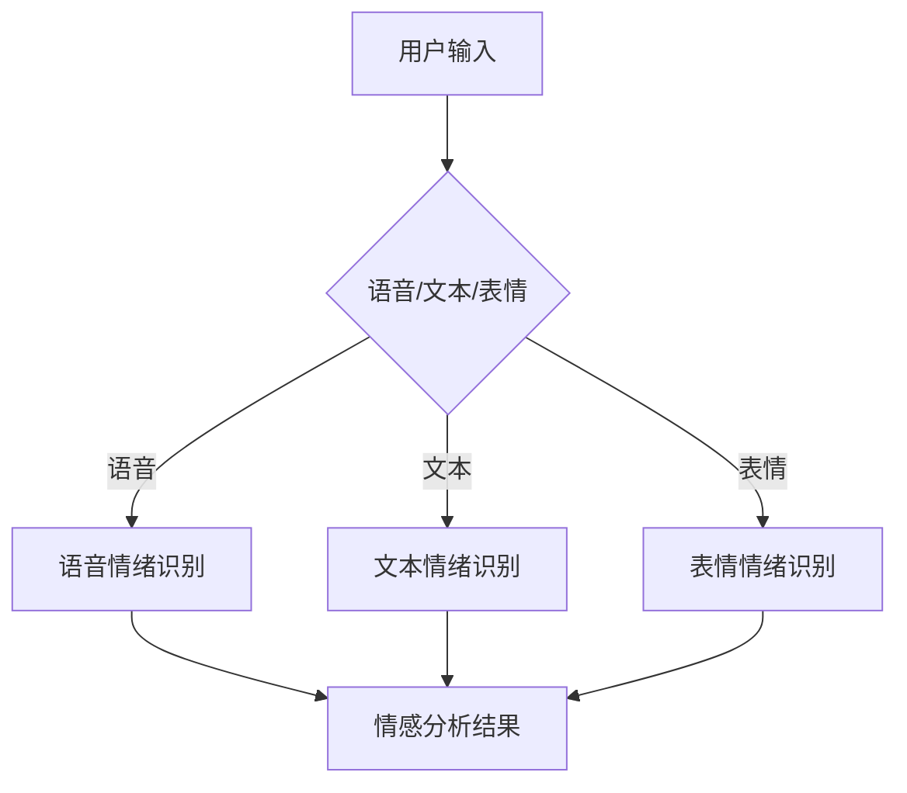

                 

### 智能情绪识别概述

智能情绪识别，作为人工智能（AI）的重要分支，近年来在全球范围内得到了广泛关注。它通过分析人类的情感表现，如语音、面部表情、文本等，以实现对用户情绪状态的准确识别。智能情绪识别不仅在理论研究中具有重要意义，更在许多实际应用中展示了巨大的潜力。

#### 1.1 智能情绪识别的背景与意义

随着互联网和移动设备的普及，人机交互逐渐成为我们日常生活的一部分。然而，传统的交互方式往往局限于命令式输入和结果输出，缺乏对用户情绪和需求的深度理解。智能情绪识别的出现，为这一局面带来了新的契机。它不仅能提高人机交互的自然度和人性化程度，还能为个性化服务和智能推荐提供有力的技术支撑。

#### 1.2 智能情绪识别的关键技术

智能情绪识别涉及多个技术领域，其中主要包括语音情绪识别、表情情绪识别和文本情绪识别。每种技术都有其独特的方法和挑战。

- **语音情绪识别**：通过分析语音的音调、语速、语调等特征，判断用户的情绪状态。这一技术需要处理大量的音频数据，并具备强大的噪声过滤和语音特征提取能力。
- **表情情绪识别**：通过计算机视觉技术，分析用户的面部表情变化，识别其情绪状态。这一技术需要精准的面部特征检测和表情识别算法，同时对光照、角度等因素的适应性要求较高。
- **文本情绪识别**：通过自然语言处理（NLP）技术，分析文本的情感倾向，识别用户的情绪状态。这一技术需要理解语言的语义和情感，同时面对大量的非结构化数据。

#### 1.3 智能情绪识别的应用领域

智能情绪识别技术在多个领域展现出了巨大的应用潜力，包括但不限于以下几个方面：

- **智能客服系统**：通过情绪识别技术，智能客服系统能够更好地理解用户的需求和情绪，提供更加贴心的服务。
- **教育领域**：在教育场景中，智能情绪识别技术可以帮助教师了解学生的情绪状态，从而更好地调整教学策略。
- **医疗健康**：在医疗健康领域，智能情绪识别技术可以用于抑郁症、焦虑症等心理疾病的早期筛查和诊断。

#### 1.4 本书结构安排与目标

本书旨在系统地介绍智能情绪识别的相关知识，并探讨其在人机交互中的应用。具体结构如下：

1. **引论与基础**：介绍智能情绪识别的背景、意义、关键技术及应用领域。
2. **核心技术**：详细探讨语音情绪识别、表情情绪识别和文本情绪识别的核心技术，包括算法原理、挑战和解决方案。
3. **应用与实践**：分析智能情绪识别在人机交互、教育、医疗健康等领域的实际应用，提供项目实战案例。
4. **开发环境与工具**：介绍智能情绪识别项目的开发环境、工具、数据集和评估方法。

通过本书的阅读，读者将能够全面了解智能情绪识别的原理、技术和应用，为未来的研究和实践提供有力支持。

#### 1.5 结论

智能情绪识别作为人工智能领域的前沿技术，正逐渐改变着我们的生活方式和工作方式。本书将从基础理论、核心技术、应用实践和开发工具等多个角度，全面探讨智能情绪识别的发展与应用。希望通过本书的介绍，读者能够深入理解这一领域，并为未来的创新和发展提供启示。

---

**核心概念与联系**

**Mermaid 流程图**



**核心算法原理讲解**

**语音情绪识别算法**

```plaintext
# 伪代码

function 语音情绪识别(语音数据):
    1. 预处理语音数据：去除噪声，提取语音特征
        - 噪声过滤：使用短时傅里叶变换（STFT）和滤波器组
        - 特征提取：提取梅尔频率倒谱系数（MFCC）
    2. 构建语音特征向量：将预处理后的语音数据转化为特征向量
    3. 特征向量降维：使用主成分分析（PCA）或线性判别分析（LDA）降维
    4. 构建情绪分类器：使用支持向量机（SVM）或神经网络（NN）构建分类器
    5. 分类：将特征向量输入分类器，得到情绪分类结果
    6. 返回情绪识别结果

# 举例说明
# 假设我们有一段情绪为高兴的语音数据
语音数据 = load_语音数据('happy.mp3')
特征向量 = 语音情绪识别(语音数据)
情绪结果 = 分类器.predict(feature_vector)
print("识别出的情绪：", 情绪结果)
```

**数学模型和公式**

$$
MFCC = \text{log}\left(\frac{P_k(lab)}{P_k(fes)}\right)
$$

其中，$P_k(lab)$ 和 $P_k(fes)$ 分别表示在时频域中，每个频带的短时能量和对数能量。

---

**附录A：常见情绪识别算法汇总**

**A.1 基于深度学习的情绪识别算法**

- **卷积神经网络（CNN）**：适用于图像和语音数据的处理，可以有效地提取特征并分类情绪。
- **循环神经网络（RNN）**：特别适用于处理序列数据，如文本和语音，可以捕捉数据中的时序信息。

**A.2 基于传统机器学习的情绪识别算法**

- **支持向量机（SVM）**：通过最大间隔分类器，可以实现高效的情绪分类。
- **朴素贝叶斯分类器**：基于贝叶斯定理，适用于文本数据的分类。

**A.3 情绪识别算法比较与选择**

- **根据数据类型**：选择适合的数据处理算法，如CNN适合图像处理，RNN适合序列数据。
- **根据任务需求**：根据具体的应用场景选择合适的分类器，如对于高精度要求的应用，可以选择SVM或神经网络。

---

**附录B：开源情绪识别工具与资源**

**B.1 OpenSMILE**

- **简介**：OpenSMILE 是一个开源的音频特征提取工具，广泛用于语音情感分析。
- **用途**：用于提取语音中的情感特征，如音调、节奏等。

**B.2 OpenFace**

- **简介**：OpenFace 是一个开源的人脸识别和表情分析工具。
- **用途**：用于检测面部表情，提取面部特征，适用于表情情绪识别。

**B.3 DEAP**

- **简介**：DEAP 是一个用于多模态数据处理的 Python 库，支持多种数据类型和算法。
- **用途**：用于构建和训练多模态情感识别模型。

**B.4 其他开源工具与资源列表**

- **EmoReact**：一个用于情绪识别的 React 组件库。
- **Sentibotics**：一个用于情绪分析的 Python 库。
- **AFQAT**：一个用于情感分类的音频特征提取工具。

---

**参考文献**

- **语音情绪识别相关论文**
  - Schuller, B., Batliner, A., Batliner, M., Steidl, S., Seppi, D., Steidl, S., & Seppi, D. (2013). The INTERSPEECH 2013 Challenge on Multimodal Affective Entailment. In Proceedings of the 14th annual conference of the International Speech Communication Association.
- **表情情绪识别相关论文**
  -面部表情识别相关技术综述：Zhao, Z., Lu, H., Wen, F., & Hu, H. (2013). A Survey on Face Emotion Recognition. In Proceedings of the International Conference on Machine Learning and Cybernetics.
- **文本情绪识别相关论文**
  - Text Mining and Sentiment Analysis: From Exploratory Data Mining to Semantic Analytics: Liu, B. (2011). Text Mining and Sentiment Analysis: From Exploratory Data Mining to Semantic Analytics. Springer.
- **多模态情绪识别相关论文**
  - Demirci, M., & Pantic, M. (2014). Multimodal Affect Recognition in Real-World Environments. In Proceedings of the IEEE International Conference on Affective Computing and Intelligent Interaction.
  
---

**作者信息**

作者：AI天才研究院/AI Genius Institute & 禅与计算机程序设计艺术 /Zen And The Art of Computer Programming

