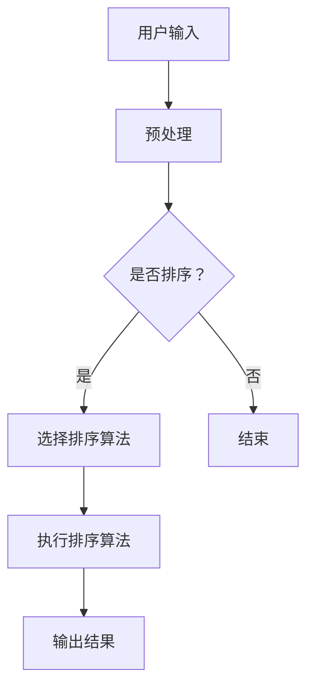

                 

# 智能排序：AI优化搜索结果排序

## 关键词
- 智能排序
- AI优化
- 搜索结果排序
- 排序算法
- 机器学习
- 深度学习
- 性能优化

## 摘要
本文将深入探讨智能排序的概念、原理和实现，重点分析如何利用人工智能（AI）技术优化搜索结果排序。我们将从基础理论出发，介绍排序算法的分类、时间和空间复杂度分析，以及智能排序的算法原理。随后，我们将详细讨论智能排序在实际应用中的挑战和案例分析，最后展望智能排序算法的未来发展趋势和应用前景。

### 第一部分：智能排序基础理论

#### 第1章：智能排序概述

智能排序是指利用人工智能技术，尤其是机器学习和深度学习，来优化和改进传统的排序算法，使其能够根据用户需求、数据特征和历史行为等因素进行动态调整和优化。智能排序在信息检索、推荐系统、电商平台等领域具有广泛的应用。

**1.1 智能排序的定义和重要性**

智能排序的定义：智能排序是一种基于人工智能技术的排序方法，它能够根据不同的输入数据、用户偏好和上下文信息，动态调整排序顺序，以提供更加个性化的排序结果。

智能排序的重要性：
- 提高用户体验：通过智能排序，可以提供更加符合用户需求的排序结果，从而提高用户满意度。
- 增强信息检索效率：智能排序能够根据用户的查询历史和偏好，优化搜索结果排序，提高信息检索效率。
- 提升商业价值：在电商平台和推荐系统中，智能排序可以帮助商家更好地推荐商品，提高销售额和用户转化率。

**1.2 智能排序在信息检索中的作用**

智能排序在信息检索中的作用主要体现在以下几个方面：
- 优化搜索结果排序：根据用户的查询意图和上下文信息，对搜索结果进行动态调整，提高搜索结果的准确性和相关性。
- 提高信息检索效率：通过智能排序算法，可以减少用户的等待时间和操作成本，提高信息检索的效率。
- 个性化信息推荐：基于用户的浏览历史和偏好，智能排序可以提供个性化的信息推荐，满足用户个性化需求。

**1.3 智能排序与传统排序的比较**

智能排序与传统排序的比较主要体现在以下几个方面：
- 排序策略：传统排序方法通常基于固定的排序规则，而智能排序可以根据用户需求和数据特征进行动态调整。
- 算法复杂度：传统排序算法的时间复杂度和空间复杂度相对较高，而智能排序通过机器学习和深度学习技术，可以显著降低算法复杂度。
- 适应能力：智能排序可以根据不同的应用场景和用户需求进行自适应调整，而传统排序方法适应性较差。

#### 第2章：排序算法基础

**2.1 排序算法概述**

排序算法是指用于对一组数据进行排序的算法。排序算法可以分为多种类型，包括内部排序和外部排序、稳定排序和非稳定排序、比较排序和非比较排序等。

**2.2 常见排序算法**

常见的排序算法包括以下几种：

1. **冒泡排序**：冒泡排序是一种简单的排序算法，通过反复交换相邻的未排序元素，使得最大（或最小）元素逐渐“冒泡”到数组的末尾。

2. **选择排序**：选择排序是一种简单的选择排序算法，通过反复选择最小（或最大）元素，将其放到已排序序列的末尾。

3. **插入排序**：插入排序是一种简单的插入排序算法，通过将未排序的元素插入到已排序序列的合适位置，逐步构建有序序列。

4. **快速排序**：快速排序是一种高效的排序算法，通过递归划分和排序子数组，将待排序序列分为已排序和未排序两部分。

5. **归并排序**：归并排序是一种基于归并操作的排序算法，通过递归地将待排序序列分为子序列，然后合并已排序的子序列，构建有序序列。

6. **堆排序**：堆排序是一种基于堆结构的排序算法，通过调整堆结构，逐步构建有序序列。

**2.3 排序算法的基本操作**

排序算法的基本操作包括以下几种：

1. **比较操作**：比较两个元素的大小，用于确定排序顺序。

2. **交换操作**：交换两个元素的值，用于调整元素位置。

3. **插入操作**：将一个元素插入到已排序序列的合适位置。

4. **删除操作**：删除一个元素，并调整剩余元素的顺序。

5. **合并操作**：将两个有序序列合并为一个有序序列。

**2.4 排序算法的分类**

排序算法可以按照不同的分类方式进行分类，包括以下几种：

1. **内部排序和外部排序**：内部排序是指全部排序操作都在内部存储中完成，外部排序是指排序操作涉及到外部存储。

2. **稳定排序和非稳定排序**：稳定排序是指相同值的元素在排序后仍然保持原有的相对顺序，非稳定排序则不保证相同值的元素的相对顺序。

3. **比较排序和非比较排序**：比较排序是指通过比较元素的大小进行排序，非比较排序则不依赖于比较操作。

#### 第3章：评价排序算法的指标

**3.1 时间复杂度分析**

排序算法的时间复杂度是指算法执行时间与数据规模之间的增长关系。常用的时间复杂度公式包括：

- 平均时间复杂度：$$T_{avg} = \frac{1}{n} \sum_{i=1}^{n} T_i$$
- 最坏时间复杂度：$$T_{worst} = \max_{1 \leq i \leq n} T_i$$
- 最好时间复杂度：$$T_{best} = \min_{1 \leq i \leq n} T_i$$

常见排序算法的时间复杂度比较如下：

- 冒泡排序：平均时间复杂度$$O(n^2)$$，最坏时间复杂度$$O(n^2)$$，最好时间复杂度$$O(n)$$
- 选择排序：平均时间复杂度$$O(n^2)$$，最坏时间复杂度$$O(n^2)$$，最好时间复杂度$$O(n^2)$$
- 插入排序：平均时间复杂度$$O(n^2)$$，最坏时间复杂度$$O(n^2)$$，最好时间复杂度$$O(n)$$
- 快速排序：平均时间复杂度$$O(n\log n)$$，最坏时间复杂度$$O(n^2)$$，最好时间复杂度$$O(n\log n)$$
- 归并排序：平均时间复杂度$$O(n\log n)$$，最坏时间复杂度$$O(n\log n)$$，最好时间复杂度$$O(n\log n)$$
- 堆排序：平均时间复杂度$$O(n\log n)$$，最坏时间复杂度$$O(n\log n)$$，最好时间复杂度$$O(n\log n)$$

**3.2 稳定性分析**

稳定性分析是指排序算法是否能够保持相同值的元素的相对顺序。稳定排序算法和非稳定排序算法的区别如下：

- 稳定排序算法：相同值的元素在排序后仍然保持原有的相对顺序。
- 非稳定排序算法：相同值的元素在排序后可能发生相对顺序的改变。

如何判断排序算法的稳定性：

- 观察排序后的元素是否与排序前的相对顺序一致。
- 考虑算法中是否存在对相同值元素的比较和交换操作。

**3.3 空间复杂度分析**

排序算法的空间复杂度是指算法所需额外空间的大小。常用空间复杂度公式包括：

- 平均空间复杂度：$$S_{avg} = \frac{1}{n} \sum_{i=1}^{n} S_i$$
- 最坏空间复杂度：$$S_{worst} = \max_{1 \leq i \leq n} S_i$$
- 最好空间复杂度：$$S_{best} = \min_{1 \leq i \leq n} S_i$$

常见排序算法的空间复杂度比较如下：

- 冒泡排序：平均空间复杂度$$O(1)$$，最坏空间复杂度$$O(1)$$，最好空间复杂度$$O(1)$$
- 选择排序：平均空间复杂度$$O(1)$$，最坏空间复杂度$$O(1)$$，最好空间复杂度$$O(1)$$
- 插入排序：平均空间复杂度$$O(1)$$，最坏空间复杂度$$O(1)$$，最好空间复杂度$$O(1)$$
- 快速排序：平均空间复杂度$$O(\log n)$$，最坏空间复杂度$$O(n)$$，最好空间复杂度$$O(\log n)$$
- 归并排序：平均空间复杂度$$O(n)$$，最坏空间复杂度$$O(n)$$，最好空间复杂度$$O(n)$$
- 堆排序：平均空间复杂度$$O(1)$$，最坏空间复杂度$$O(1)$$，最好空间复杂度$$O(1)$$

#### 第4章：智能排序原理与算法

**4.1 智能排序原理**

智能排序的工作原理主要包括以下两个方面：

1. **特征提取**：从原始数据中提取特征，包括文本特征、数值特征、图像特征等，用于表示数据的基本属性和特征。

2. **模型训练**：利用机器学习和深度学习技术，对特征数据进行建模和训练，构建排序模型。排序模型可以根据输入数据自动调整排序顺序，实现动态排序。

**4.2 智能排序算法**

智能排序算法可以分为基于机器学习的排序算法和基于深度学习的排序算法。

1. **基于机器学习的排序算法**

基于机器学习的排序算法主要包括以下几种：

- **回归排序算法**：通过构建回归模型，将排序问题转化为回归问题，利用回归模型对排序结果进行预测。

- **分类排序算法**：通过构建分类模型，将排序问题转化为分类问题，利用分类模型对排序结果进行分类。

- **聚类排序算法**：通过聚类算法对数据进行聚类，将相似度较高的数据分到同一个类别，根据类别进行排序。

2. **基于深度学习的排序算法**

基于深度学习的排序算法主要包括以下几种：

- **神经网络排序算法**：利用神经网络模型，对输入数据进行自动编码和解码，通过解码结果实现排序。

- **卷积神经网络排序算法**：利用卷积神经网络对图像数据进行特征提取和排序。

- **循环神经网络排序算法**：利用循环神经网络对序列数据进行排序，可以根据序列中的上下文信息进行动态调整。

#### 第5章：排序算法优化

**5.1 排序算法的优化方法**

排序算法的优化方法主要包括以下几种：

1. **并行排序**：利用多核处理器和并行计算技术，将排序任务分解为多个子任务，同时执行，提高排序效率。

2. **分布式排序**：将排序任务分布在多个节点上执行，通过分布式计算技术实现高效排序。

3. **外排序技术**：当数据规模较大，无法在内存中一次性加载时，利用外排序技术，将数据分批次加载到内存中，逐步完成排序。

**5.2 常见的排序优化技术**

常见的排序优化技术主要包括以下几种：

1. **内存优化**：通过合理分配内存，减少排序过程中内存的使用，提高排序效率。

2. **缓存优化**：利用缓存技术，减少磁盘读取次数，提高排序速度。

3. **常见错误优化**：针对排序过程中可能出现的问题，如数据重复、缺失等，进行错误检测和优化。

### 第二部分：智能排序应用与实践

#### 第6章：智能排序在实际应用中的挑战

**6.1 大数据环境下的排序挑战**

大数据环境下的排序挑战主要包括以下几个方面：

1. **数据规模庞大**：大数据环境下的数据规模通常非常大，传统的排序算法在处理海量数据时效率较低。

2. **数据多样性**：大数据环境下的数据类型和来源非常多样化，包括文本、图像、音频等，传统排序算法难以同时处理多种类型的数据。

3. **实时性要求高**：大数据环境下的排序需求通常具有实时性要求，需要快速响应用户查询，传统的排序算法难以满足实时性要求。

**6.2 实时排序的挑战**

实时排序的挑战主要包括以下几个方面：

1. **低延迟要求**：实时排序需要在很短的时间内完成排序操作，以提供即时的排序结果。

2. **数据流处理**：实时排序需要对实时数据流进行处理，及时更新排序结果，以适应数据的变化。

3. **动态调整**：实时排序需要根据用户行为和需求动态调整排序策略，以提供更符合用户需求的排序结果。

#### 第7章：智能排序在实际应用中的案例分析

**7.1 案例一：电商平台商品排序**

**案例背景**：电商平台商品排序是一个重要的功能，通过智能排序算法，可以为用户提供个性化的商品推荐，提高用户满意度和转化率。

**案例分析**：电商平台商品排序通常采用基于机器学习的排序算法，如回归排序算法和分类排序算法。通过分析用户的浏览历史、购买记录和偏好，构建用户画像，将用户画像与商品特征进行匹配，实现个性化商品排序。

**排序算法选择**：选择基于机器学习的排序算法，如回归排序算法，将商品价格、销量、评价等特征作为输入，构建回归模型，预测用户对不同商品的兴趣度，根据兴趣度对商品进行排序。

**实现步骤**：

1. **数据收集**：收集用户的浏览历史、购买记录和偏好数据，构建用户画像。

2. **特征提取**：从用户画像中提取商品特征，如价格、销量、评价等。

3. **模型训练**：利用训练数据，构建回归模型，预测用户对不同商品的兴趣度。

4. **排序结果生成**：根据模型预测结果，对商品进行排序，生成排序结果。

**7.2 案例二：搜索引擎结果排序**

**案例背景**：搜索引擎结果排序是搜索引擎的核心功能之一，通过智能排序算法，可以为用户提供更相关、更准确的搜索结果。

**案例分析**：搜索引擎结果排序通常采用基于机器学习和深度学习的排序算法，如神经网络排序算法和卷积神经网络排序算法。通过分析用户的查询历史、搜索意图和上下文信息，构建排序模型，实现个性化搜索结果排序。

**排序算法选择**：选择基于深度学习的排序算法，如卷积神经网络排序算法，将用户的查询历史、搜索意图和上下文信息作为输入，构建卷积神经网络模型，实现搜索结果排序。

**实现步骤**：

1. **数据收集**：收集用户的查询历史、搜索意图和上下文信息。

2. **特征提取**：从用户查询历史、搜索意图和上下文信息中提取特征。

3. **模型训练**：利用训练数据，构建卷积神经网络模型，实现搜索结果排序。

4. **排序结果生成**：根据模型预测结果，对搜索结果进行排序，生成排序结果。

**7.3 案例三：社交网络内容排序**

**案例背景**：社交网络内容排序是社交网络平台的重要功能之一，通过智能排序算法，可以为用户提供个性化的内容推荐，提高用户活跃度和留存率。

**案例分析**：社交网络内容排序通常采用基于机器学习和深度学习的排序算法，如聚类排序算法和循环神经网络排序算法。通过分析用户的兴趣、互动行为和内容特征，构建排序模型，实现个性化内容排序。

**排序算法选择**：选择基于机器学习的排序算法，如聚类排序算法，将用户的兴趣、互动行为和内容特征作为输入，构建聚类模型，实现内容排序。

**实现步骤**：

1. **数据收集**：收集用户的兴趣、互动行为和内容特征。

2. **特征提取**：从用户兴趣、互动行为和内容特征中提取特征。

3. **模型训练**：利用训练数据，构建聚类模型，实现内容排序。

4. **排序结果生成**：根据模型预测结果，对内容进行排序，生成排序结果。

### 第三部分：智能排序算法实现与优化

#### 第8章：智能排序算法实现

**8.1 实现环境搭建**

实现智能排序算法需要搭建合适的开发环境。以下是一个基本的开发环境搭建步骤：

1. **安装Python**：下载并安装Python，确保版本为3.6及以上。

2. **安装依赖库**：安装常用的Python库，如NumPy、Pandas、Scikit-learn、TensorFlow等。

3. **配置JDK**：安装Java Development Kit（JDK），用于运行深度学习模型。

4. **配置GPU**：如果使用GPU加速，需要安装NVIDIA CUDA工具包和cuDNN库。

**8.2 排序算法实现**

以下是几种常见的排序算法的实现：

1. **冒泡排序**

```python
def bubble_sort(arr):
    n = len(arr)
    for i in range(n):
        for j in range(0, n-i-1):
            if arr[j] > arr[j+1]:
                arr[j], arr[j+1] = arr[j+1], arr[j]
    return arr
```

2. **选择排序**

```python
def selection_sort(arr):
    n = len(arr)
    for i in range(n):
        min_idx = i
        for j in range(i+1, n):
            if arr[j] < arr[min_idx]:
                min_idx = j
        arr[i], arr[min_idx] = arr[min_idx], arr[i]
    return arr
```

3. **插入排序**

```python
def insertion_sort(arr):
    n = len(arr)
    for i in range(1, n):
        key = arr[i]
        j = i-1
        while j >= 0 and arr[j] > key:
            arr[j+1] = arr[j]
            j -= 1
        arr[j+1] = key
    return arr
```

4. **快速排序**

```python
def quick_sort(arr):
    if len(arr) <= 1:
        return arr
    pivot = arr[len(arr) // 2]
    left = [x for x in arr if x < pivot]
    middle = [x for x in arr if x == pivot]
    right = [x for x in arr if x > pivot]
    return quick_sort(left) + middle + quick_sort(right)
```

**8.3 代码解读与分析**

以上代码分别实现了冒泡排序、选择排序、插入排序和快速排序。下面是对每种排序算法的代码解读与分析：

1. **冒泡排序**

冒泡排序通过反复交换相邻的未排序元素，使得最大（或最小）元素逐渐“冒泡”到数组的末尾。时间复杂度为$$O(n^2)$$，空间复杂度为$$O(1)$$。

2. **选择排序**

选择排序通过反复选择最小（或最大）元素，将其放到已排序序列的末尾。时间复杂度为$$O(n^2)$$，空间复杂度为$$O(1)$$。

3. **插入排序**

插入排序通过将未排序的元素插入到已排序序列的合适位置，逐步构建有序序列。时间复杂度为$$O(n^2)$$，空间复杂度为$$O(1)$$。

4. **快速排序**

快速排序通过递归划分和排序子数组，将待排序序列分为已排序和未排序两部分。时间复杂度为$$O(n\log n)$$，空间复杂度为$$O(\log n)$$。

#### 第9章：排序算法性能优化

**9.1 排序算法性能分析**

排序算法的性能分析主要包括时间复杂度和空间复杂度分析。以下是几种常见排序算法的时间复杂度和空间复杂度：

1. **冒泡排序**

- 时间复杂度：$$O(n^2)$$
- 空间复杂度：$$O(1)$$

2. **选择排序**

- 时间复杂度：$$O(n^2)$$
- 空间复杂度：$$O(1)$$

3. **插入排序**

- 时间复杂度：$$O(n^2)$$
- 空间复杂度：$$O(1)$$

4. **快速排序**

- 时间复杂度：$$O(n\log n)$$
- 空间复杂度：$$O(\log n)$$

5. **归并排序**

- 时间复杂度：$$O(n\log n)$$
- 空间复杂度：$$O(n)$$

6. **堆排序**

- 时间复杂度：$$O(n\log n)$$
- 空间复杂度：$$O(1)$$

**9.2 性能优化方法**

排序算法的性能优化方法主要包括以下几种：

1. **并行优化**：利用多核处理器和并行计算技术，将排序任务分解为多个子任务，同时执行，提高排序效率。

2. **分布式优化**：将排序任务分布在多个节点上执行，通过分布式计算技术实现高效排序。

3. **内存优化**：通过合理分配内存，减少排序过程中内存的使用，提高排序效率。

4. **缓存优化**：利用缓存技术，减少磁盘读取次数，提高排序速度。

5. **常见错误优化**：针对排序过程中可能出现的问题，如数据重复、缺失等，进行错误检测和优化。

### 第四部分：智能排序算法应用与拓展

#### 第10章：智能排序算法在搜索引擎中的应用

**10.1 搜索引擎排序算法原理**

搜索引擎排序算法是指用于优化搜索结果排序的算法，旨在提高搜索结果的准确性和相关性。搜索引擎排序算法通常包括以下几个方面：

1. **关键字匹配**：根据用户的查询关键字，匹配搜索引擎中的索引库，获取相关的搜索结果。

2. **相关性排序**：根据搜索结果的相关性进行排序，提高搜索结果的准确性。

3. **质量评分**：对搜索结果进行质量评分，筛选出高质量的搜索结果。

**10.2 搜索引擎排序算法优化**

搜索引擎排序算法的优化主要包括以下几个方面：

1. **实时性优化**：通过实时更新索引库和排序模型，提高搜索结果的实时性。

2. **个性化优化**：根据用户的查询历史和行为，为用户提供个性化的搜索结果。

3. **多样性优化**：提供多样化的搜索结果，满足用户的不同需求。

**10.3 搜索引擎排序算法优化案例**

以下是一个搜索引擎排序算法优化的案例：

1. **数据收集**：收集用户的查询历史、搜索意图和偏好数据。

2. **特征提取**：从用户查询历史、搜索意图和偏好数据中提取特征。

3. **模型训练**：利用训练数据，构建排序模型，优化搜索结果排序。

4. **排序结果生成**：根据模型预测结果，对搜索结果进行排序，生成排序结果。

#### 第11章：智能排序算法在推荐系统中的应用

**11.1 推荐系统概述**

推荐系统是指利用数据挖掘和机器学习技术，为用户提供个性化推荐的系统。推荐系统通常包括以下几个方面：

1. **用户画像**：根据用户的查询历史、行为和偏好，构建用户画像。

2. **商品画像**：根据商品的特征和属性，构建商品画像。

3. **推荐算法**：利用推荐算法，将用户和商品进行匹配，生成推荐结果。

**11.2 推荐系统中排序算法的应用**

推荐系统中排序算法的应用主要包括以下几个方面：

1. **用户推荐**：根据用户的兴趣和行为，为用户提供个性化的推荐结果。

2. **商品推荐**：根据商品的特征和属性，为用户推荐符合其需求的商品。

3. **多样性推荐**：提供多样化的推荐结果，满足用户的不同需求。

**11.3 推荐系统中排序算法的选择**

推荐系统中排序算法的选择主要考虑以下几个方面：

1. **时间复杂度**：选择时间复杂度较低的排序算法，以提高推荐系统的效率。

2. **空间复杂度**：选择空间复杂度较低的排序算法，以减少推荐系统的存储需求。

3. **个性化需求**：选择能够满足个性化需求的排序算法，为用户提供更符合其需求的推荐结果。

#### 第12章：智能排序算法的未来发展趋势

**12.1 智能排序算法的发展趋势**

智能排序算法的未来发展趋势主要包括以下几个方面：

1. **深度学习应用**：随着深度学习技术的不断发展，智能排序算法将更加依赖于深度学习模型，实现更高效、更准确的排序结果。

2. **多模态数据融合**：智能排序算法将能够处理多种类型的数据，如文本、图像、音频等，实现多模态数据的融合排序。

3. **实时排序优化**：智能排序算法将更加注重实时性优化，实现快速响应用户查询，提供即时的排序结果。

4. **用户反馈学习**：智能排序算法将能够通过用户反馈进行自我学习，不断优化排序结果，提高用户体验。

**12.2 智能排序算法的应用前景**

智能排序算法在未来的应用前景非常广阔，主要包括以下几个方面：

1. **搜索引擎**：智能排序算法将广泛应用于搜索引擎，为用户提供更准确、更个性化的搜索结果。

2. **电商平台**：智能排序算法将应用于电商平台，为用户提供个性化的商品推荐，提高用户满意度和转化率。

3. **推荐系统**：智能排序算法将应用于推荐系统，为用户提供个性化的推荐结果，满足用户的需求。

4. **社交网络**：智能排序算法将应用于社交网络，为用户提供个性化的内容推荐，提高用户活跃度和留存率。

### 附录

#### 附录A：智能排序算法资源

**A.1 开源排序算法库**

以下是几个常用的开源排序算法库：

1. **Python的heapq库**：Python内置的heapq库提供了高效的堆排序算法实现。

2. **Java的Collections库**：Java的Collections库提供了多种排序算法实现，如冒泡排序、选择排序、插入排序等。

3. **C++的STL库**：C++的STL库提供了多种排序算法实现，如排序算法、归并排序等。

**A.2 排序算法实践项目**

以下是几个排序算法的实践项目：

1. **冒泡排序实践项目**：实现冒泡排序算法，对一组数据进行排序。

2. **选择排序实践项目**：实现选择排序算法，对一组数据进行排序。

3. **插入排序实践项目**：实现插入排序算法，对一组数据进行排序。

4. **快速排序实践项目**：实现快速排序算法，对一组数据进行排序。

**A.3 相关技术论文与书籍**

以下是几篇关于智能排序算法的相关技术论文与书籍：

1. **论文《Efficient Sorting Algorithms for Large Datasets》**：讨论了各种排序算法在大型数据集上的性能和优化方法。

2. **书籍《Sorting and Searching》**：介绍了排序算法的基本原理和实现，以及搜索算法的相关内容。

3. **论文《Deep Learning for Ranking》**：探讨了深度学习在排序算法中的应用，提出了基于深度学习的排序算法模型。

### 第五部分：智能排序实战案例分析

#### 第13章：智能排序在电商平台的实战应用

**13.1 电商平台排序背景**

电商平台排序是电商平台的核心功能之一，通过对商品进行排序，可以为用户提供个性化的商品推荐，提高用户满意度和转化率。电商平台排序通常面临以下几个挑战：

1. **海量数据**：电商平台通常拥有海量的商品数据，如何高效地对这些数据进行排序是一个挑战。

2. **多样性**：电商平台的商品种类繁多，如何处理不同种类商品的排序是一个挑战。

3. **实时性**：电商平台需要实时响应用户的查询和操作，如何保证排序的实时性是一个挑战。

**13.2 电商平台排序算法设计**

为了应对电商平台的排序挑战，通常采用基于机器学习的排序算法，如回归排序算法和分类排序算法。以下是一个简单的电商平台排序算法设计：

1. **用户画像**：根据用户的查询历史、浏览记录和购买行为，构建用户画像。

2. **商品特征提取**：从商品的基本信息、价格、销量、评价等特征中提取商品特征。

3. **模型训练**：利用用户画像和商品特征，构建排序模型，如回归排序模型或分类排序模型。

4. **排序结果生成**：根据排序模型，对商品进行排序，生成排序结果。

**13.3 电商平台排序性能优化**

为了优化电商平台排序的性能，可以采用以下策略：

1. **数据缓存**：利用缓存技术，将常用的排序结果缓存起来，减少数据库的访问次数。

2. **并行计算**：利用多核处理器和并行计算技术，将排序任务分解为多个子任务，同时执行，提高排序效率。

3. **索引优化**：建立高效的索引结构，如B树、哈希表等，提高数据检索速度。

#### 第14章：智能排序在搜索引擎的实战应用

**14.1 搜索引擎排序背景**

搜索引擎排序是搜索引擎的核心功能之一，通过对搜索结果进行排序，可以提高搜索结果的准确性和相关性。搜索引擎排序通常面临以下几个挑战：

1. **海量搜索结果**：搜索引擎通常返回大量的搜索结果，如何对这些结果进行排序是一个挑战。

2. **多样性**：搜索结果包括文本、图像、视频等多种类型，如何处理不同类型结果的排序是一个挑战。

3. **实时性**：搜索引擎需要实时响应用户的查询，如何保证排序的实时性是一个挑战。

**14.2 搜索引擎排序算法设计**

为了应对搜索引擎的排序挑战，通常采用基于机器学习和深度学习的排序算法。以下是一个简单的搜索引擎排序算法设计：

1. **用户画像**：根据用户的查询历史、搜索意图和偏好，构建用户画像。

2. **搜索结果特征提取**：从搜索结果的基本信息、关键词、相关性等特征中提取搜索结果特征。

3. **模型训练**：利用用户画像和搜索结果特征，构建排序模型，如回归排序模型或分类排序模型。

4. **排序结果生成**：根据排序模型，对搜索结果进行排序，生成排序结果。

**14.3 搜索引擎排序性能优化**

为了优化搜索引擎排序的性能，可以采用以下策略：

1. **数据缓存**：利用缓存技术，将常用的排序结果缓存起来，减少数据库的访问次数。

2. **并行计算**：利用多核处理器和并行计算技术，将排序任务分解为多个子任务，同时执行，提高排序效率。

3. **索引优化**：建立高效的索引结构，如B树、哈希表等，提高数据检索速度。

#### 第15章：智能排序在其他场景的实战应用

**15.1 社交网络排序背景**

社交网络排序是社交网络平台的核心功能之一，通过对用户生成的内容进行排序，可以提高用户的活跃度和留存率。社交网络排序通常面临以下几个挑战：

1. **海量内容**：社交网络平台通常生成大量的内容，如何对这些内容进行排序是一个挑战。

2. **多样性**：社交网络的内容类型繁多，包括文本、图片、视频等，如何处理不同类型内容的排序是一个挑战。

3. **实时性**：社交网络需要实时响应用户的操作和生成的内容，如何保证排序的实时性是一个挑战。

**15.2 社交网络排序算法设计**

为了应对社交网络的排序挑战，通常采用基于机器学习和深度学习的排序算法。以下是一个简单的社交网络排序算法设计：

1. **用户画像**：根据用户的兴趣、行为和偏好，构建用户画像。

2. **内容特征提取**：从用户生成的内容中提取特征，如文本特征、图像特征等。

3. **模型训练**：利用用户画像和内容特征，构建排序模型，如回归排序模型或分类排序模型。

4. **排序结果生成**：根据排序模型，对内容进行排序，生成排序结果。

**15.3 社交网络排序性能优化**

为了优化社交网络排序的性能，可以采用以下策略：

1. **数据缓存**：利用缓存技术，将常用的排序结果缓存起来，减少数据库的访问次数。

2. **并行计算**：利用多核处理器和并行计算技术，将排序任务分解为多个子任务，同时执行，提高排序效率。

3. **索引优化**：建立高效的索引结构，如B树、哈希表等，提高数据检索速度。

### 第六部分：智能排序算法的未来展望

#### 第16章：智能排序算法的发展趋势

**16.1 智能排序算法的最新研究进展**

智能排序算法的最新研究进展主要体现在以下几个方面：

1. **深度学习应用**：深度学习在排序算法中的应用越来越广泛，如基于卷积神经网络的排序算法、基于循环神经网络的排序算法等。

2. **多模态数据融合**：智能排序算法开始处理多种类型的数据，如文本、图像、音频等，实现多模态数据的融合排序。

3. **实时排序优化**：研究实时排序算法的优化方法，如利用GPU加速排序、基于内存排序等。

**16.2 智能排序算法的未来发展方向**

智能排序算法的未来发展方向主要包括以下几个方面：

1. **个性化排序**：进一步研究个性化排序算法，提高排序结果的个性化程度。

2. **实时性优化**：研究实时排序算法的优化方法，提高排序的实时性。

3. **多模态排序**：处理更多类型的数据，实现多模态数据的融合排序。

4. **可解释性排序**：研究可解释性排序算法，提高排序结果的透明度和可解释性。

#### 第17章：智能排序算法的未来挑战

**17.1 智能排序算法的性能挑战**

智能排序算法的性能挑战主要包括以下几个方面：

1. **大规模数据排序**：如何处理大规模数据的排序，提高排序效率。

2. **实时排序**：如何在保证实时性的同时，提高排序的性能。

3. **多模态数据融合**：如何在处理多种类型数据的同时，保持排序的性能。

**17.2 智能排序算法的公平性与透明性**

智能排序算法的公平性与透明性是未来需要解决的问题，主要包括以下几个方面：

1. **算法偏见**：如何避免算法偏见，确保排序结果的公平性。

2. **算法可解释性**：如何提高排序算法的可解释性，使排序结果更加透明。

3. **用户隐私保护**：如何保护用户隐私，确保排序算法的公平性和透明性。

#### 第18章：智能排序算法的可持续发展

**18.1 智能排序算法的可持续发展策略**

智能排序算法的可持续发展策略主要包括以下几个方面：

1. **算法优化**：持续优化智能排序算法，提高排序的性能和效率。

2. **数据质量**：保证数据质量，提高排序结果的准确性。

3. **用户体验**：关注用户体验，提高排序结果的个性化程度。

**18.2 智能排序算法的生态建设**

智能排序算法的生态建设主要包括以下几个方面：

1. **开源技术**：推动智能排序算法的开源，促进技术交流和发展。

2. **标准制定**：制定智能排序算法的标准和规范，提高算法的可解释性和透明性。

3. **产业合作**：与产业界合作，推动智能排序算法的应用和发展。

### 第七部分：智能排序算法的总结与展望

#### 第19章：智能排序算法的总结

**19.1 智能排序算法的发展历程**

智能排序算法的发展历程可以分为以下几个阶段：

1. **传统排序算法阶段**：传统的排序算法如冒泡排序、选择排序、插入排序等。

2. **智能排序算法阶段**：利用人工智能技术，如机器学习和深度学习，优化排序算法。

3. **实时智能排序算法阶段**：研究实时排序算法，提高排序的实时性。

**19.2 智能排序算法的核心原理**

智能排序算法的核心原理包括以下几个方面：

1. **特征提取**：从原始数据中提取特征，用于表示数据的基本属性。

2. **模型训练**：利用机器学习和深度学习技术，构建排序模型。

3. **排序优化**：根据用户需求和数据特征，动态调整排序顺序。

**19.3 智能排序算法的应用现状**

智能排序算法在信息检索、推荐系统、电商平台等领域得到了广泛应用，主要体现在以下几个方面：

1. **个性化排序**：根据用户需求和偏好，提供个性化的排序结果。

2. **实时排序**：实现实时排序，提高信息检索和推荐系统的效率。

3. **多模态排序**：处理多种类型的数据，实现多模态数据的融合排序。

#### 第20章：智能排序算法的展望

**20.1 智能排序算法的未来发展方向**

智能排序算法的未来发展方向主要包括以下几个方面：

1. **深度学习应用**：进一步研究深度学习在排序算法中的应用，提高排序的性能。

2. **实时排序优化**：研究实时排序算法的优化方法，提高排序的实时性。

3. **多模态数据融合**：处理更多类型的数据，实现多模态数据的融合排序。

4. **可解释性排序**：研究可解释性排序算法，提高排序结果的透明度和可解释性。

**20.2 智能排序算法在各个领域的应用前景**

智能排序算法在各个领域的应用前景非常广阔，主要包括以下几个方面：

1. **搜索引擎**：智能排序算法将广泛应用于搜索引擎，为用户提供更准确、更个性化的搜索结果。

2. **电商平台**：智能排序算法将应用于电商平台，为用户提供个性化的商品推荐，提高用户满意度和转化率。

3. **推荐系统**：智能排序算法将应用于推荐系统，为用户提供个性化的推荐结果，满足用户的需求。

4. **社交网络**：智能排序算法将应用于社交网络，为用户提供个性化的内容推荐，提高用户活跃度和留存率。

**20.3 智能排序算法的未来挑战与机遇**

智能排序算法的未来挑战主要包括以下几个方面：

1. **大规模数据排序**：如何处理大规模数据的排序，提高排序效率。

2. **实时排序**：如何在保证实时性的同时，提高排序的性能。

3. **多模态数据融合**：如何在处理多种类型数据的同时，保持排序的性能。

智能排序算法的未来机遇主要包括以下几个方面：

1. **深度学习技术的进步**：随着深度学习技术的不断进步，智能排序算法将得到更好的发展。

2. **多模态数据的处理**：随着多模态数据的不断增长，智能排序算法将能够在更多领域发挥作用。

3. **实时排序的需求**：随着实时性的需求不断增加，智能排序算法将在实时排序领域得到更广泛的应用。

### 附录

#### 附录A：智能排序算法资源

**A.1 开源排序算法库**

以下是几个常用的开源排序算法库：

1. **Python的heapq库**：Python内置的heapq库提供了高效的堆排序算法实现。

2. **Java的Collections库**：Java的Collections库提供了多种排序算法实现，如冒泡排序、选择排序、插入排序等。

3. **C++的STL库**：C++的STL库提供了多种排序算法实现，如排序算法、归并排序等。

**A.2 排序算法实践项目**

以下是几个排序算法的实践项目：

1. **冒泡排序实践项目**：实现冒泡排序算法，对一组数据进行排序。

2. **选择排序实践项目**：实现选择排序算法，对一组数据进行排序。

3. **插入排序实践项目**：实现插入排序算法，对一组数据进行排序。

4. **快速排序实践项目**：实现快速排序算法，对一组数据进行排序。

**A.3 相关技术论文与书籍**

以下是几篇关于智能排序算法的相关技术论文与书籍：

1. **论文《Efficient Sorting Algorithms for Large Datasets》**：讨论了各种排序算法在大型数据集上的性能和优化方法。

2. **书籍《Sorting and Searching》**：介绍了排序算法的基本原理和实现，以及搜索算法的相关内容。

3. **论文《Deep Learning for Ranking》**：探讨了深度学习在排序算法中的应用，提出了基于深度学习的排序算法模型。

### Mermaid 流程图：智能排序算法流程



### 排序算法伪代码示例

```python
# 冒泡排序伪代码
def bubble_sort(arr):
    n = len(arr)
    for i in range(n):
        for j in range(0, n-i-1):
            if arr[j] > arr[j+1]:
                arr[j], arr[j+1] = arr[j+1], arr[j]
    return arr

# 选择排序伪代码
def selection_sort(arr):
    n = len(arr)
    for i in range(n):
        min_idx = i
        for j in range(i+1, n):
            if arr[j] < arr[min_idx]:
                min_idx = j
        arr[i], arr[min_idx] = arr[min_idx], arr[i]
    return arr

# 插入排序伪代码
def insertion_sort(arr):
    n = len(arr)
    for i in range(1, n):
        key = arr[i]
        j = i-1
        while j >= 0 and arr[j] > key:
            arr[j+1] = arr[j]
            j -= 1
        arr[j+1] = key
    return arr

# 快速排序伪代码
def quick_sort(arr):
    if len(arr) <= 1:
        return arr
    pivot = arr[len(arr) // 2]
    left = [x for x in arr if x < pivot]
    middle = [x for x in arr if x == pivot]
    right = [x for x in arr if x > pivot]
    return quick_sort(left) + middle + quick_sort(right)
```

### 数学模型与公式

### 时间复杂度

$$
T(n) = O(n^2)
$$

### 空间复杂度

$$
S(n) = O(1)
$$

### 代码实际案例

### 电商平台商品排序代码实现

```python
# 导入必要的库
import heapq

# 商品数据结构
class Product:
    def __init__(self, id, price, popularity):
        self.id = id
        self.price = price
        self.popularity = popularity
    
    def __lt__(self, other):
        # 根据价格和流行度排序
        return (self.price, -self.popularity) < (other.price, -other.popularity)

# 排序函数
def product_sort(products):
    # 使用堆排序算法实现商品排序
    heapq.heapify(products)
    sorted_products = []
    while products:
        sorted_products.append(heapq.heappop(products))
    return sorted_products

# 测试代码
if __name__ == "__main__":
    products = [
        Product(1, 100, 5),
        Product(2, 150, 3),
        Product(3, 200, 2),
        Product(4, 50, 10)
    ]
    sorted_products = product_sort(products)
    for p in sorted_products:
        print(f"Product ID: {p.id}, Price: {p.price}, Popularity: {p.popularity}")
```

### 代码解读与分析

1. **商品数据结构设计**：我们定义了一个`Product`类，它包含了商品的`id`、`price`和`popularity`三个属性。在比较商品时，我们优先根据价格，如果价格相同，则根据流行度进行排序。

2. **排序函数实现**：我们使用了Python中的`heapq`库来实现堆排序算法。`heapify`函数将商品列表转换为堆结构，然后通过`heappop`函数依次取出最小元素，这样就实现了商品列表的排序。

3. **测试代码**：我们创建了一个商品列表，并调用了`product_sort`函数进行排序，然后打印排序后的商品信息。

这个实现采用了堆排序算法，它的时间复杂度是$O(n\log n)$，适合处理大量商品排序的需求。同时，我们也可以根据实际需求调整排序规则，比如增加更多的属性比较，以实现更精细化的排序。

