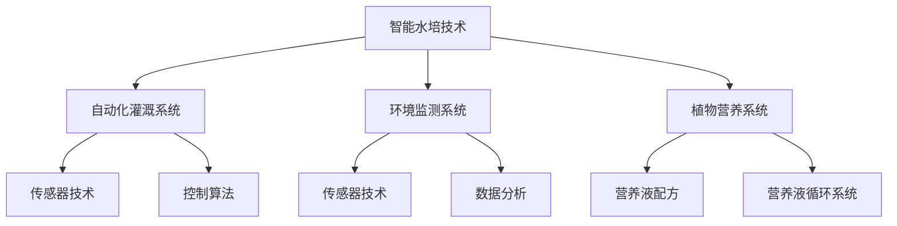

                 

# 《智能水培创业：都市农业的科技解决方案》

## 关键词：
智能水培、都市农业、自动化灌溉、环境监测、植物营养、创业机会、技术创新、创业案例分析

## 摘要：
随着城市化进程的加速，都市农业面临着土地资源稀缺、环境污染等挑战。智能水培作为一种先进的都市农业解决方案，通过利用高科技手段实现高效、环保、可持续的农业生产。本文将深入探讨智能水培技术的核心原理、发展历程、应用场景，并分析智能水培创业的机遇与挑战，最后通过创业案例分析，为智能水培创业提供实践指导。

### 《智能水培创业：都市农业的科技解决方案》目录大纲

#### 第一部分：智能水培技术概述

- # 1. 智能水培技术概述
  - 1.1 智能水培的定义与优势
  - 1.2 智能水培的发展历程
  - 1.3 智能水培的主要类型
  - 1.4 智能水培技术核心概念与联系

#### 第二部分：智能水培技术核心算法原理

- # 2. 智能水培技术核心算法原理
  - 2.1 自动化灌溉算法
  - 2.2 环境监测算法
  - 2.3 植物营养算法

#### 第三部分：智能水培项目实战

- # 3. 智能水培项目实战
  - 3.1 智能水培项目开发流程
  - 3.2 实际案例解析
  - 3.3 智能水培项目的挑战与解决方案

#### 第四部分：智能水培创业实战

- # 4. 智能水培创业实战
  - 4.1 智能水培创业机会分析
  - 4.2 智能水培创业模式探索
  - 4.3 智能水培创业案例解析

#### 第五部分：智能水培的未来发展趋势

- # 5. 智能水培的未来发展趋势
  - 5.1 技术创新展望
  - 5.2 市场前景分析
  - 5.3 智能水培行业面临的挑战与应对策略

#### 第六部分：智能水培创业者的成功要素

- # 6. 智能水培创业者的成功要素
  - 6.1 创业者素质与能力
  - 6.2 创业者心态与策略
  - 6.3 创业者资源整合与利用

#### 第七部分：智能水培创业案例分析

- # 7. 智能水培创业案例分析
  - 7.1 案例一：某初创智能水培公司
  - 7.2 案例二：某知名智能水培企业
  - 7.3 案例三：跨界融合的智能水培项目

#### 附录

- # 附录
  - 附录 A：智能水培技术相关资源与工具
  - 附录 B：智能水培技术标准与规范
  - 附录 C：智能水培技术相关政策与法规

---

**智能水培技术概述**

智能水培是一种利用高科技手段，通过水培方式实现植物高效生长的技术。与传统农业相比，智能水培具有生产效率高、节水、减少病虫害、便于管理等优点，非常适合在城市中推广应用。

### 1.1 智能水培的定义与优势

**定义：**

智能水培是指通过自动化控制系统，对水培系统中的水、养分、温度、湿度等环境因素进行实时监测和调节，实现植物高效生长的技术。

**优势：**

1. **节水高效：**智能水培系统可以根据植物的实际需水量进行精准灌溉，大大减少水资源浪费。
2. **减少病虫害：**通过控制环境因素，可以降低病虫害的发生率。
3. **便于管理：**智能水培系统可以实现远程监控和管理，提高生产效率。
4. **环保：**智能水培系统减少了对土壤的依赖，降低了对环境的污染。

### 1.2 智能水培的发展历程

智能水培技术的发展经历了从传统水培到智能化水培的演变过程。

- **传统水培：**20世纪50年代，随着温室技术的兴起，水培技术开始应用于农业生产。
- **智能化水培：**20世纪90年代，随着传感器技术、自动化控制技术、互联网技术的发展，智能水培技术开始兴起。

### 1.3 智能水培的主要类型

智能水培主要可以分为以下几种类型：

- **挂篮式水培：**植物生长在悬挂的篮子中，通过滴灌系统进行灌溉。
- **水培床式：**植物生长在充满营养液的床中，通过底部出流进行灌溉。
- **水培容器式：**植物生长在独立的容器中，通过容器底部出流进行灌溉。

### 1.4 智能水培技术核心概念与联系

智能水培技术的核心概念包括自动化灌溉系统、环境监测系统、植物营养系统等。

- **自动化灌溉系统：**通过传感器实时监测土壤湿度，根据植物需水量自动控制灌溉。
- **环境监测系统：**通过传感器实时监测环境参数（如温度、湿度、光照等），并根据历史数据进行分析，调整环境参数。
- **植物营养系统：**根据植物生长阶段和土壤成分，调整营养液的配方和供应量。

下图是智能水培技术的核心概念与联系流程图：



**智能水培技术核心算法原理**

智能水培技术的核心在于自动化灌溉、环境监测和植物营养三个方面的算法原理。以下将分别介绍这三个方面的基本原理。

### 2.1 自动化灌溉算法

自动化灌溉算法的核心在于根据土壤湿度、植物需水量等参数，自动调整灌溉频率和灌溉量。其基本原理如下：

$$ 
灌溉频率 = f(\text{土壤湿度}, \text{植物需水量})
$$

具体算法可以描述为：

```python
def irrigation_algorithm(soil_humidity, plant_water_need):
    if soil_humidity < optimal_soil_humidity and plant_water_need > 0:
        irrigate()
```

### 2.2 环境监测算法

环境监测算法的核心在于实时监测环境参数（如温度、湿度、光照等），并根据历史数据进行分析，调整环境参数。其基本原理如下：

$$ 
环境参数 = f(\text{传感器数据}, \text{历史数据})
$$

具体算法可以描述为：

```python
def environmental_monitoring(sensor_data, historical_data):
    current_environment = analyze_data(sensor_data, historical_data)
    if current_environment["temperature"] > optimal_temperature or current_environment["humidity"] < optimal_humidity:
        adjust_environment()
```

### 2.3 植物营养算法

植物营养算法的核心在于根据植物生长阶段和土壤成分，调整营养液的配方和供应量。其基本原理如下：

$$ 
营养液配方 = f(\text{植物生长阶段}, \text{土壤成分})
$$

具体算法可以描述为：

```python
def nutrition_algorithm(growth_stage, soil_composition):
    if growth_stage == "vegetative":
        nutrition_solution = vegetable_solution()
    elif growth_stage == "flowering":
        nutrition_solution = flowering_solution()
    adjust_nutrient_solution(nutrition_solution)
```

**智能水培项目实战**

智能水培项目实战包括项目的需求分析、系统设计、硬件选型、软件开发、系统测试与部署等环节。以下将介绍智能水培项目开发的具体流程。

### 3.1 智能水培项目开发流程

#### 3.1.1 需求分析

需求分析是智能水培项目开发的第一步，主要目标是明确项目的目标和需求，包括：

- **项目目标：**明确智能水培项目的目标，如提高生产效率、减少水资源浪费等。
- **功能需求：**明确智能水培系统的功能，如自动化灌溉、环境监测、营养液供应等。
- **性能需求：**明确智能水培系统的性能指标，如响应时间、精度等。

#### 3.1.2 系统设计

系统设计是根据需求分析的结果，设计智能水培系统的整体架构和功能模块。主要工作包括：

- **系统架构设计：**设计智能水培系统的整体架构，包括硬件架构、软件架构等。
- **功能模块设计：**设计智能水培系统的功能模块，如自动化灌溉模块、环境监测模块、营养液供应模块等。

#### 3.1.3 硬件选型

硬件选型是根据系统设计的结果，选择合适的硬件设备。主要工作包括：

- **传感器选型：**选择适合的传感器，如土壤湿度传感器、温度传感器、光照传感器等。
- **控制器选型：**选择适合的控制器，如PLC、单片机等。
- **执行器选型：**选择适合的执行器，如水泵、灌溉喷头等。

#### 3.1.4 软件开发

软件开发是根据系统设计和硬件选型的结果，编写智能水培系统的软件代码。主要工作包括：

- **自动化灌溉软件：**编写自动化灌溉算法，实现灌溉的自动化控制。
- **环境监测软件：**编写环境监测算法，实现环境的实时监测和调整。
- **营养液供应软件：**编写营养液供应算法，实现营养液的自动化供应。

#### 3.1.5 系统测试与部署

系统测试与部署是在软件开发完成后，对智能水培系统进行测试和部署，确保系统能够正常运行。主要工作包括：

- **系统测试：**对智能水培系统进行功能测试、性能测试、稳定性测试等。
- **系统部署：**将智能水培系统部署到实际环境中，进行实地测试和运行。

**实际案例解析**

以下将通过两个实际案例，解析智能水培项目的实施过程和成果。

### 3.2.1 案例一：智能水培蔬菜种植

#### 3.2.1.1 项目背景

某蔬菜种植企业为了提高生产效率、减少水资源浪费，决定采用智能水培技术进行蔬菜种植。项目目标是通过智能水培系统，实现蔬菜种植的自动化、高效化。

#### 3.2.1.2 技术选型

- **传感器选型：**选择土壤湿度传感器、温度传感器、光照传感器等。
- **控制器选型：**选择基于PLC的控制器。
- **执行器选型：**选择水泵、灌溉喷头等。

#### 3.2.1.3 项目实施

项目实施过程包括需求分析、系统设计、硬件选型、软件开发、系统测试与部署等环节。具体实施过程如下：

1. **需求分析：**明确项目目标、功能需求和性能需求。
2. **系统设计：**设计智能水培系统的整体架构和功能模块。
3. **硬件选型：**选择合适的传感器、控制器、执行器。
4. **软件开发：**编写自动化灌溉算法、环境监测算法、营养液供应算法。
5. **系统测试：**对智能水培系统进行功能测试、性能测试、稳定性测试。
6. **系统部署：**将智能水培系统部署到实际环境中，进行实地测试和运行。

#### 3.2.1.4 项目成果

通过智能水培系统的实施，项目实现了以下成果：

1. **提高生产效率：**智能水培系统实现了蔬菜种植的自动化，大大提高了生产效率。
2. **减少水资源浪费：**智能水培系统根据土壤湿度自动调整灌溉量，大大减少了水资源浪费。
3. **减少病虫害：**智能水培系统通过环境监测，可以及时调整环境参数，减少病虫害的发生。

### 3.2.2 案例二：智能水培花卉栽培

#### 3.2.2.1 项目背景

某花卉种植企业为了提高花卉品质、减少资源浪费，决定采用智能水培技术进行花卉栽培。项目目标是通过智能水培系统，实现花卉栽培的自动化、高效化。

#### 3.2.2.2 技术选型

- **传感器选型：**选择土壤湿度传感器、温度传感器、光照传感器等。
- **控制器选型：**选择基于PLC的控制器。
- **执行器选型：**选择水泵、灌溉喷头等。

#### 3.2.2.3 项目实施

项目实施过程包括需求分析、系统设计、硬件选型、软件开发、系统测试与部署等环节。具体实施过程如下：

1. **需求分析：**明确项目目标、功能需求和性能需求。
2. **系统设计：**设计智能水培系统的整体架构和功能模块。
3. **硬件选型：**选择合适的传感器、控制器、执行器。
4. **软件开发：**编写自动化灌溉算法、环境监测算法、营养液供应算法。
5. **系统测试：**对智能水培系统进行功能测试、性能测试、稳定性测试。
6. **系统部署：**将智能水培系统部署到实际环境中，进行实地测试和运行。

#### 3.2.2.4 项目成果

通过智能水培系统的实施，项目实现了以下成果：

1. **提高花卉品质：**智能水培系统通过精准控制环境参数，提高了花卉的品质。
2. **减少资源浪费：**智能水培系统根据土壤湿度自动调整灌溉量，减少了水资源和肥料的浪费。
3. **减少病虫害：**智能水培系统通过环境监测，可以及时调整环境参数，减少病虫害的发生。

### 3.3 智能水培项目的挑战与解决方案

智能水培项目在实际实施过程中，面临着一系列的挑战，包括系统稳定性和可靠性、数据安全与隐私保护、技术迭代与升级等。

#### 3.3.1 系统稳定性和可靠性

智能水培系统需要长时间运行，对系统的稳定性和可靠性要求较高。为了确保系统的稳定性和可靠性，可以采取以下措施：

1. **硬件选择：**选择质量可靠的传感器、控制器、执行器等硬件设备。
2. **系统设计：**设计冗余系统，提高系统的可靠性。
3. **故障监测与处理：**实时监测系统运行状态，及时发现和处理故障。

#### 3.3.2 数据安全与隐私保护

智能水培系统涉及大量数据，包括环境数据、灌溉数据、营养液数据等，数据安全与隐私保护至关重要。为了确保数据安全与隐私保护，可以采取以下措施：

1. **数据加密：**对传输和存储的数据进行加密处理，确保数据不被未授权访问。
2. **访问控制：**对系统访问进行严格的访问控制，确保只有授权用户可以访问系统。
3. **数据备份：**定期对系统数据进行备份，确保数据不丢失。

#### 3.3.3 技术迭代与升级

智能水培技术不断发展，为了保持系统的竞争力，需要进行技术迭代与升级。为了实现技术迭代与升级，可以采取以下措施：

1. **持续研发：**持续进行技术研发，跟踪最新的技术动态。
2. **系统兼容性设计：**设计具有良好兼容性的系统，便于后续升级。
3. **用户反馈：**收集用户反馈，根据用户需求进行系统升级。

#### 第四部分：智能水培创业实战

智能水培作为一种先进的都市农业解决方案，具有巨大的市场潜力。随着科技的不断进步，智能水培技术将越来越成熟，为创业提供了新的机遇。以下将分析智能水培创业的机遇与挑战，并探讨智能水培创业的几种模式。

### 4.1 智能水培创业机会分析

#### 4.1.1 市场需求分析

随着城市人口的增加，对蔬菜、水果、花卉等农产品的需求也在不断增加。然而，城市土地资源稀缺，传统农业模式难以满足市场需求。智能水培技术具有生产效率高、节水、减少病虫害等优点，非常适合在城市中推广应用。因此，智能水培市场具有巨大的需求潜力。

#### 4.1.2 竞争对手分析

智能水培市场竞争激烈，国内外已有不少企业和研究机构进入该领域。国内如以色列、荷兰等国家的企业在智能水培技术方面具有领先优势。国内市场主要竞争对手包括大型农业企业、互联网公司等。

#### 4.1.3 创业机会点

智能水培创业可以从以下几个方面寻找机会：

1. **技术研发：**持续进行技术研发，提高智能水培系统的性能和可靠性。
2. **市场推广：**通过市场推广，扩大智能水培技术的市场份额。
3. **服务模式创新：**创新智能水培的服务模式，如提供智能水培设备租赁服务、提供智能水培解决方案等。

### 4.2 智能水培创业模式探索

智能水培创业模式可以从以下几个方面进行探索：

#### 4.2.1 模式一：智能水培技术服务

智能水培技术服务模式是指企业为农业企业提供智能水培系统的设计、安装、维护等服务。这种模式的优势在于可以快速进入市场，降低创业门槛。具体步骤如下：

1. **市场调研：**了解市场需求，确定目标客户群体。
2. **技术研发：**研发具有竞争力的智能水培技术。
3. **市场推广：**通过线上线下渠道进行市场推广。
4. **售后服务：**提供优质的售后服务，建立客户关系。

#### 4.2.2 模式二：智能水培设备制造

智能水培设备制造模式是指企业专注于智能水培设备的研发、生产和销售。这种模式的优势在于可以形成产业闭环，提高市场竞争力。具体步骤如下：

1. **技术研发：**研发具有竞争力的智能水培设备。
2. **生产线建设：**建立智能水培设备生产线。
3. **市场推广：**通过线上线下渠道进行市场推广。
4. **售后服务：**提供优质的售后服务。

#### 4.2.3 模式三：智能水培农场运营

智能水培农场运营模式是指企业自行建设智能水培农场，进行农产品的种植和销售。这种模式的优势在于可以控制整个生产过程，提高产品质量和附加值。具体步骤如下：

1. **农场选址：**选择合适的农场位置。
2. **技术研发：**研发适合农场运营的智能水培技术。
3. **农场建设：**建设智能水培农场，包括水培设施、灌溉系统、环境监测系统等。
4. **市场推广：**通过线上线下渠道进行市场推广。
5. **农产品销售：**销售农场生产的农产品。

### 4.3 智能水培创业案例解析

以下将介绍两个智能水培创业案例，分析其创业历程、成功经验与挑战。

#### 4.3.1 案例一：某初创智能水培公司

**公司概述：**

某初创智能水培公司成立于2018年，专注于智能水培设备研发和销售。公司核心团队由农业、电子工程和计算机科学等领域的专业人士组成，拥有丰富的研发和运营经验。

**创业历程：**

1. **市场调研：**公司在成立初期进行了市场调研，发现智能水培技术具有巨大的市场潜力。
2. **技术研发：**公司集中力量进行智能水培设备的研发，经过多次迭代，成功研发出具有竞争力的智能水培设备。
3. **市场推广：**公司通过线上线下渠道进行市场推广，迅速占领了市场份额。
4. **售后服务：**公司提供优质的售后服务，赢得了客户的信任和好评。

**成功经验：**

1. **技术创新：**公司通过持续的技术创新，提高了智能水培设备的性能和可靠性。
2. **市场定位：**公司准确的市场定位，使其在竞争激烈的市场中脱颖而出。
3. **售后服务：**优质的售后服务提高了公司的市场竞争力。

**挑战与解决方案：**

1. **技术挑战：**智能水培设备的研发过程中，公司面临着技术难题，通过持续的技术研发，成功解决了这些问题。
2. **市场挑战：**市场竞争激烈，公司通过创新的市场策略和优质的服务，成功应对了市场挑战。

#### 4.3.2 案例二：某知名智能水培企业

**公司概述：**

某知名智能水培企业成立于2005年，是我国智能水培领域的领军企业。公司专注于智能水培技术的研发、生产和市场推广，拥有多项核心技术和专利。

**创业历程：**

1. **技术研发：**公司自成立以来，一直致力于智能水培技术的研发，成功推出了多款具有竞争力的智能水培设备。
2. **市场推广：**公司通过线上线下的市场推广，将智能水培设备推广到了全国各地。
3. **产业布局：**公司进行了全国范围内的产业布局，建立了多个智能水培农场。
4. **技术创新：**公司持续进行技术创新，不断提高智能水培技术的性能和可靠性。

**成功经验：**

1. **技术创新：**公司通过持续的技术创新，提高了智能水培技术的性能和可靠性。
2. **品牌建设：**公司注重品牌建设，建立了良好的品牌形象。
3. **产业布局：**公司通过全国范围内的产业布局，扩大了市场份额。

**挑战与解决方案：**

1. **技术挑战：**公司面临的技术挑战主要集中在智能水培系统的稳定性和可靠性方面，通过持续的技术研发，成功解决了这些问题。
2. **市场挑战：**市场竞争激烈，公司通过创新的市场策略和优质的服务，成功应对了市场挑战。

### 5. 智能水培的未来发展趋势

智能水培作为都市农业的一种重要形式，正逐渐成为现代农业发展的趋势。随着科技的不断进步，智能水培技术将朝着更高效、更环保、更智能的方向发展。以下将从技术创新、市场前景和挑战与应对策略三个方面探讨智能水培的未来发展趋势。

#### 5.1 技术创新展望

1. **新型水培技术的开发：**随着科技的进步，新型水培技术不断涌现。例如，垂直农业、水下农业等，这些技术有望提高水培系统的生产效率。

2. **大数据分析与人工智能的应用：**大数据分析和人工智能技术将在智能水培中发挥重要作用。通过收集和分析大量数据，可以优化水培系统的管理，提高作物的产量和质量。

3. **水培系统的集成与优化：**未来，智能水培系统将实现更高程度的集成和优化。通过集成多种技术，如传感器技术、物联网技术、自动化控制技术等，实现水培系统的智能化、自动化。

#### 5.2 市场前景分析

1. **全球市场发展态势：**随着城市化进程的加速，全球都市农业市场规模不断扩大。智能水培技术作为一种高效、环保的都市农业解决方案，具有广阔的市场前景。

2. **中国智能水培市场发展前景：**我国智能水培市场正处于快速发展阶段。随着人们对食品安全、环保意识的提高，以及政府政策的支持，智能水培市场有望继续保持高速增长。

3. **行业政策与支持措施：**我国政府高度重视智能水培技术的发展，出台了一系列政策和支持措施，为智能水培技术的推广应用提供了有力保障。

#### 5.3 智能水培行业面临的挑战与应对策略

1. **技术难题与解决方案：**智能水培技术的发展面临一些技术难题，如水培系统的稳定性、可靠性、营养液配方等。针对这些问题，需要加强技术研发，提高水培技术的成熟度和可靠性。

2. **市场竞争与差异化策略：**智能水培市场竞争激烈，企业需要通过差异化策略，如技术创新、产品品质、服务体验等，提升市场竞争力。

3. **社会责任与可持续发展：**智能水培技术的发展应充分考虑社会责任和可持续发展。企业应加强环保意识，提高水资源的利用效率，减少对环境的影响。

### 6. 智能水培创业者的成功要素

智能水培创业是一项充满挑战和机遇的事业，创业者需要具备一系列素质和能力，以应对市场变化和技术创新。以下是智能水培创业者的成功要素：

#### 6.1 创业者素质与能力

1. **技术素养：**智能水培创业需要创业者具备一定的技术背景，熟悉水培技术、自动化控制技术、物联网技术等。

2. **市场洞察力：**创业者应具备敏锐的市场洞察力，了解市场需求，把握行业发展趋势。

3. **团队管理能力：**创业者需要具备团队管理能力，能够组建一支高效的团队，实现技术创新和产品开发。

4. **创新精神：**智能水培技术不断发展，创业者应具备创新精神，勇于尝试新技术、新理念。

#### 6.2 创业者心态与策略

1. **乐观心态：**创业过程中会遇到各种困难和挑战，创业者应保持乐观心态，积极应对。

2. **灵活应变：**市场环境变化迅速，创业者应具备灵活应变的能力，及时调整创业策略。

3. **持续学习：**智能水培技术不断更新，创业者应保持持续学习的态度，不断吸收新知识、新技能。

#### 6.3 创业者资源整合与利用

1. **资金资源：**创业者需要合理规划资金使用，确保项目的正常运转。

2. **人才资源：**创业者应吸引和留住优秀人才，构建高效团队。

3. **技术资源：**创业者应积极整合技术资源，提高水培技术的成熟度和可靠性。

4. **市场资源：**创业者应充分利用市场资源，拓展市场份额，提高品牌知名度。

### 7. 智能水培创业案例分析

通过分析智能水培创业案例，可以更好地理解智能水培创业的实践过程，从中学习成功经验，借鉴失败教训。以下是三个智能水培创业案例的分析。

#### 7.1 案例一：某初创智能水培公司

**公司背景：**

某初创智能水培公司成立于2018年，由一群年轻的农业、电子工程和计算机科学等领域的专业人士组建。公司专注于智能水培设备研发和销售，旨在为都市农业提供高效、环保的解决方案。

**创业历程：**

1. **市场调研：**公司在成立初期进行了市场调研，发现智能水培技术具有巨大的市场潜力。

2. **技术研发：**公司集中力量进行智能水培设备的研发，经过多次迭代，成功研发出具有竞争力的智能水培设备。

3. **市场推广：**公司通过线上线下渠道进行市场推广，迅速占领了市场份额。

4. **售后服务：**公司提供优质的售后服务，赢得了客户的信任和好评。

**成功经验：**

1. **技术创新：**公司通过持续的技术创新，提高了智能水培设备的性能和可靠性。

2. **市场定位：**公司准确的市场定位，使其在竞争激烈的市场中脱颖而出。

3. **售后服务：**优质的售后服务提高了公司的市场竞争力。

**挑战与解决方案：**

1. **技术挑战：**公司在研发过程中遇到了技术难题，通过持续的技术研发，成功解决了这些问题。

2. **市场挑战：**市场竞争激烈，公司通过创新的市场策略和优质的服务，成功应对了市场挑战。

#### 7.2 案例二：某知名智能水培企业

**公司概述：**

某知名智能水培企业成立于2005年，是我国智能水培领域的领军企业。公司专注于智能水培技术的研发、生产和市场推广，拥有多项核心技术和专利。

**创业历程：**

1. **技术研发：**公司自成立以来，一直致力于智能水培技术的研发，成功推出了多款具有竞争力的智能水培设备。

2. **市场推广：**公司通过线上线下的市场推广，将智能水培设备推广到了全国各地。

3. **产业布局：**公司进行了全国范围内的产业布局，建立了多个智能水培农场。

4. **技术创新：**公司持续进行技术创新，不断提高智能水培技术的性能和可靠性。

**成功经验：**

1. **技术创新：**公司通过持续的技术创新，提高了智能水培技术的性能和可靠性。

2. **品牌建设：**公司注重品牌建设，建立了良好的品牌形象。

3. **产业布局：**公司通过全国范围内的产业布局，扩大了市场份额。

**挑战与解决方案：**

1. **技术挑战：**公司面临的技术挑战主要集中在智能水培系统的稳定性和可靠性方面，通过持续的技术研发，成功解决了这些问题。

2. **市场挑战：**市场竞争激烈，公司通过创新的市场策略和优质的服务，成功应对了市场挑战。

#### 7.3 案例三：跨界融合的智能水培项目

**项目背景：**

某跨界融合的智能水培项目结合了智能水培技术、物联网技术和区块链技术，旨在打造一个智能化、透明化的农业产业链。

**创业模式：**

1. **智能水培技术：**项目采用先进的智能水培技术，实现农产品的精准灌溉、环境监测和营养供应。

2. **物联网技术：**项目通过物联网技术，实现农产品的实时监测和数据采集。

3. **区块链技术：**项目引入区块链技术，实现农产品的全程追溯，确保食品安全。

**项目成果：**

1. **提高生产效率：**通过智能水培技术，项目实现了农产品的精准灌溉和营养供应，提高了生产效率。

2. **保障食品安全：**通过物联网技术和区块链技术，项目实现了农产品的全程追溯，保障了食品安全。

3. **降低运营成本：**项目通过自动化管理和数据化决策，降低了运营成本。

**成功经验与挑战：**

1. **成功经验：**
   - 创新模式：跨界融合的创业模式，实现了不同领域技术的优势互补。
   - 技术创新：引入先进技术，提升了项目的核心竞争力。

2. **挑战：**
   - 技术融合：不同技术之间的融合面临技术难题。
   - 市场推广：新兴技术市场推广面临困难。

**总结：**

通过以上案例分析，可以看出智能水培创业的实践过程中，技术创新、市场定位、团队建设等都是成功的关键因素。同时，新兴技术融合和市场竞争也是创业者需要面对的挑战。创业者需要持续创新，提升自身竞争力，以应对市场变化。

### 附录

#### 附录 A：智能水培技术相关资源与工具

1. **智能水培技术相关书籍推荐：**
   - 《智能水培技术与应用》
   - 《智能农业与物联网》
   - 《农业物联网技术与应用》

2. **智能水培技术相关网站与平台：**
   - 中国智能农业网
   - 农业部智能农业大数据平台
   - 中国智能水培协会网站

3. **智能水培技术开源工具与框架：**
   - OpenAg
   - OpenSprinkler
   - Node-RED

4. **智能水培技术专利与文献检索方法：**
   - 国家知识产权局专利检索系统
   - 中国科学院文献情报中心
   - Google Scholar

#### 附录 B：智能水培技术标准与规范

1. **国际智能水培技术标准：**
   - ISO/IEC 27001：信息安全管理体系
   - ISO/IEC 27017：云计算信息安全管理体系

2. **中国智能水培技术标准：**
   - GB/T 26160-2019：智能农业系统技术要求
   - GB/T 32975-2016：智能温室技术要求

3. **行业协会与标准制定组织：**
   - 中国智能农业产业联盟
   - 国际物联网联盟
   - 国际标准化组织（ISO）

#### 附录 C：智能水培技术相关政策与法规

1. **国家层面政策与法规：**
   - 《中华人民共和国农业法》
   - 《中华人民共和国农产品质量安全法》
   - 《国家农业科技发展规划（2016-2020年）》

2. **地方政府相关政策：**
   - 《关于推进智慧农业发展的意见》
   - 《关于加快农业科技创新促进现代农业发展的意见》
   - 《关于推进智慧农业发展的实施方案》

3. **行业协会与行业规范：**
   - 中国智能农业协会
   - 中国农业机械化协会
   - 国际农业工程学会（IAAE）

