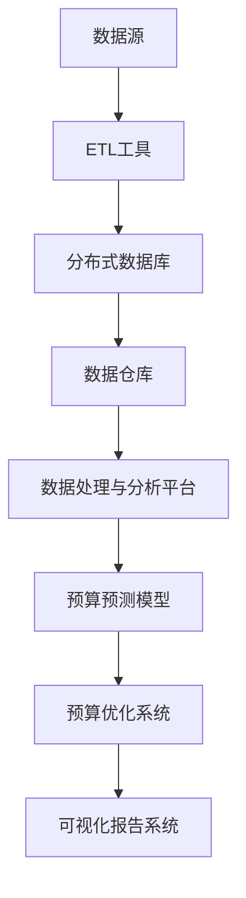

                 

## 智能预算管理在财务规划中的应用

### 关键词：智能预算管理、财务规划、数据分析、机器学习、预测模型

### 摘要：

本文将深入探讨智能预算管理在财务规划中的应用。智能预算管理利用先进的数据分析和机器学习技术，对企业的财务数据进行预测和分析，从而帮助企业实现更加精准和高效的财务规划。本文将从基础理论出发，详细解析智能预算管理的架构与实现，并探讨其在企业财务规划、财务风险管理和投融资决策中的应用。此外，还将通过实战案例和未来发展趋势，展现智能预算管理的巨大潜力和广阔前景。

### 引言

财务规划是企业经营管理中至关重要的一环，它关系到企业的生存与发展。传统的预算管理方法通常依赖于经验和历史数据，存在主观性强、效率低下等不足。随着大数据和人工智能技术的快速发展，智能预算管理应运而生，通过利用先进的技术手段，实现对财务数据的深度挖掘和分析，为企业提供更加科学和精准的财务规划方案。

智能预算管理不仅能够帮助企业更好地编制预算，提高预算编制的准确性，还能够实时监控预算执行情况，及时发现和应对预算偏差，从而实现预算的动态调整和优化。此外，智能预算管理还能够对企业的财务风险进行有效评估和预警，为企业的风险管理和决策提供有力支持。

本文将从以下几个方面展开讨论：

1. **智能预算管理基础**：介绍智能预算管理的背景、意义、与传统预算管理的对比、核心概念和未来发展趋势。
2. **智能预算管理的架构与实现**：详细解析智能预算管理的技术框架，包括数据采集与处理、模型训练与优化、预算预测与优化、可视化等方面。
3. **智能预算管理在财务规划中的应用**：探讨智能预算管理在企业财务规划中的具体应用，包括预算编制、执行、监控和调整等方面。
4. **实战篇**：通过一个实际案例，展示智能预算管理在项目中的应用过程，包括技术方案、数据采集、模型训练、预算预测与优化等。
5. **智能预算管理案例解析**：分析一个成功案例，探讨其背景、实施过程、效果分析和经验总结。
6. **智能预算管理的发展与展望**：展望智能预算管理的未来发展趋势，探讨新技术的影响、法律法规与伦理问题、未来发展策略等。

希望通过本文的深入探讨，能够为企业和财务从业者提供有益的参考和启示。

### 第一部分：智能预算管理基础

智能预算管理作为现代财务规划中的重要工具，其基础理论和架构是理解和应用的关键。本部分将详细探讨智能预算管理的基础知识，包括其背景、意义、与传统预算管理的对比、核心概念和未来发展趋势。

#### 第1章：智能预算管理概述

##### 1.1 智能预算管理的背景与意义

智能预算管理是在大数据和人工智能技术迅猛发展的背景下产生的。传统的预算管理方法主要依赖于历史数据和经验，存在很多主观性和不确定性。随着企业规模的扩大和数据量的增加，传统方法已经难以满足企业精细化和动态化的财务管理需求。智能预算管理通过引入数据分析和机器学习技术，能够实现财务数据的自动分析和预测，为企业提供更加准确和及时的预算信息。

智能预算管理的意义主要体现在以下几个方面：

1. **提高预算编制的准确性**：通过大数据分析和机器学习模型，智能预算管理能够对历史数据进行深度挖掘，发现潜在的趋势和规律，从而提高预算编制的准确性。
2. **优化资源配置**：智能预算管理可以帮助企业更合理地分配资源，避免浪费和过度投资，提高整体运营效率。
3. **提升财务决策的科学性**：智能预算管理通过实时分析和预测，为企业提供及时的财务信息，帮助管理层做出更加科学的决策。
4. **加强风险管理**：智能预算管理能够对企业的财务风险进行有效评估和预警，帮助企业及时采取应对措施，减少风险损失。

##### 1.2 智能预算管理与传统预算管理的对比

智能预算管理与传统预算管理在多个方面存在显著差异：

1. **数据依赖性**：传统预算管理主要依赖于历史数据和经验，而智能预算管理通过大数据分析和机器学习，能够从海量数据中提取有价值的信息，提高预测的准确性和可靠性。
2. **自动化程度**：传统预算管理通常需要大量手工操作，效率较低，而智能预算管理通过自动化技术，能够实现预算编制、执行和监控的全程自动化，提高工作效率。
3. **灵活性**：传统预算管理通常在年初制定，一年内基本不变，而智能预算管理能够根据实际情况进行动态调整，更加灵活和适应变化。
4. **预测能力**：传统预算管理主要进行历史数据的简单统计和预测，而智能预算管理利用机器学习模型，能够对未来的趋势和变化进行更加精准的预测。

##### 1.3 智能预算管理的核心概念

智能预算管理的核心概念包括以下几个方面：

1. **数据采集**：数据是智能预算管理的基础，包括企业内部的历史财务数据、市场数据、行业数据等。数据的质量和完整性直接影响预算的准确性和可靠性。
2. **数据清洗**：数据采集后，通常存在数据缺失、异常值等问题，需要通过数据清洗技术进行处理，确保数据的质量。
3. **数据建模**：通过数据建模技术，将历史数据转化为数学模型，用于预测和分析。常见的建模方法包括回归分析、时间序列分析、机器学习算法等。
4. **预测与优化**：利用建模结果进行预测，分析预算的执行情况，并提出优化建议，帮助管理层进行决策。
5. **可视化与报告**：通过可视化技术，将预算数据和分析结果以图表、报表等形式呈现，方便管理层进行理解和决策。

##### 1.4 智能预算管理的发展趋势与挑战

智能预算管理的发展趋势主要体现在以下几个方面：

1. **技术进步**：随着人工智能、大数据、云计算等技术的发展，智能预算管理的算法和工具将更加先进和成熟，提高预算的准确性和效率。
2. **应用拓展**：智能预算管理将从企业内部扩展到产业链上下游，实现企业间的数据共享和协同，提供更加全面的财务分析和管理。
3. **法规和伦理**：随着智能预算管理在金融、医疗等领域的应用，相关的法律法规和伦理问题将逐渐得到关注和解决。

智能预算管理面临的挑战主要包括：

1. **数据安全与隐私**：随着数据量的增加，数据安全和隐私保护将成为重要问题，需要建立完善的数据保护机制。
2. **模型可靠性**：机器学习模型的预测结果依赖于数据的质量和模型的可靠性，需要不断优化和验证模型，提高预测的准确性。
3. **技术更新换代**：随着技术的发展，智能预算管理的算法和工具需要不断更新换代，以适应新的技术和需求。

#### 第2章：智能预算管理的架构与实现

##### 2.1 智能预算管理的技术框架

智能预算管理的技术框架通常包括以下几个关键组件：

1. **数据采集**：通过API接口、日志收集、数据库连接等方式，采集企业内外部的财务数据。
2. **数据存储**：使用数据仓库或分布式数据库存储采集到的数据，确保数据的完整性和可靠性。
3. **数据处理**：使用ETL（抽取、转换、加载）工具对数据进行清洗、转换和整合，生成高质量的数据集。
4. **数据建模**：利用机器学习算法和统计模型对数据进行分析和建模，提取有价值的信息和规律。
5. **预测与优化**：基于建模结果进行预测和优化，生成预算预测报告和优化建议。
6. **可视化与报告**：使用可视化工具将分析结果以图表、报表等形式呈现，提供直观的决策支持。
7. **系统集成**：将智能预算管理系统集成到企业的财务系统和管理系统中，实现数据的实时共享和交互。

##### 2.2 数据采集与处理

数据采集与处理是智能预算管理的基础，其关键步骤包括：

1. **数据来源**：确定数据采集的来源，包括企业内部的历史财务数据、市场数据、行业数据等。
2. **数据收集**：使用API接口、日志收集、数据库连接等方式，从不同的数据源中收集数据。
3. **数据清洗**：处理数据中的缺失值、异常值和重复值，确保数据的质量。
4. **数据整合**：将不同来源的数据进行整合，形成统一的数据集。
5. **数据存储**：将清洗和整合后的数据存储到数据仓库或分布式数据库中，便于后续的处理和分析。

##### 2.3 模型训练与优化

模型训练与优化是智能预算管理的核心步骤，其关键步骤包括：

1. **选择模型**：根据预算管理的需求和数据特点，选择合适的机器学习算法和统计模型。
2. **数据预处理**：对数据集进行预处理，包括数据标准化、缺失值处理、特征工程等。
3. **训练模型**：使用训练数据集对模型进行训练，调整模型的参数和超参数，提高模型的预测准确性。
4. **模型评估**：使用验证数据集对模型进行评估，选择最佳模型。
5. **模型优化**：根据评估结果，对模型进行优化和调整，提高预测的准确性和稳定性。

##### 2.4 预算预测与优化

预算预测与优化是智能预算管理的核心功能，其关键步骤包括：

1. **预测建模**：基于训练好的模型，对未来的预算进行预测，生成预测报告。
2. **预测评估**：对预测结果进行评估，分析预测的准确性和稳定性。
3. **预算调整**：根据预测结果和实际情况，对预算进行调整和优化，确保预算的合理性和可行性。
4. **执行监控**：实时监控预算的执行情况，分析预算执行与预测的偏差，及时进行调整和优化。

##### 2.5 智能预算管理的可视化

智能预算管理的可视化是将预算数据和分析结果以图表、报表等形式呈现，提供直观的决策支持。其关键步骤包括：

1. **数据可视化**：使用数据可视化工具，将预算数据以图表、报表等形式展示，包括柱状图、折线图、饼图等。
2. **交互式分析**：提供交互式分析功能，用户可以自由选择和分析不同的预算数据，生成个性化的分析报告。
3. **实时监控**：实时展示预算的执行情况，包括预算完成率、支出比例等关键指标，帮助管理层及时掌握预算执行情况。
4. **报告生成**：自动生成预算报告，包括预算编制、执行、调整和预测等方面的详细分析，提供决策支持。

#### 小结

智能预算管理作为现代财务规划的重要工具，通过大数据分析和机器学习技术，为企业提供精准和高效的财务预测和管理。本部分详细介绍了智能预算管理的基础知识，包括其背景、意义、与传统预算管理的对比、核心概念和未来发展趋势，以及智能预算管理的架构与实现，为读者提供了一个全面的了解。在接下来的部分，我们将进一步探讨智能预算管理在财务规划中的具体应用。

### 第二部分：智能预算管理在财务规划中的应用

#### 第3章：智能预算管理在企业财务规划中的应用

企业财务规划是企业战略管理的重要组成部分，它涉及到企业资金筹集、使用、管理和监控的全过程。智能预算管理作为一种新兴的财务管理工具，在企业财务规划中发挥着至关重要的作用。本章将深入探讨智能预算管理在企业财务规划中的具体应用。

##### 3.1 企业财务规划概述

企业财务规划是指企业为实现其长期战略目标，对资金筹集、使用、管理和监控进行系统的、科学的安排和规划。它包括以下几个核心方面：

1. **资金筹集**：企业通过股权融资、债务融资等方式筹集资金，以满足运营和发展需求。
2. **资金使用**：企业根据经营计划，合理使用筹集到的资金，确保资金使用的效率和效果。
3. **资金管理**：企业对资金进行有效的管理和监控，确保资金安全、合规和高效运转。
4. **资金监控**：企业通过定期财务报告和分析，对资金使用情况进行监控，及时调整和优化资金管理策略。

##### 3.2 智能预算管理在企业财务规划中的角色

智能预算管理在企业财务规划中扮演着重要角色，其应用主要体现在以下几个方面：

1. **预算编制**：智能预算管理利用大数据分析和机器学习技术，对历史财务数据进行深度挖掘，预测未来的资金需求和支出，帮助企业制定科学、合理的预算计划。
2. **预算执行**：智能预算管理实时监控预算执行情况，分析实际支出与预算的偏差，及时调整预算，确保资金使用的合理性和效率。
3. **预算调整**：智能预算管理根据市场变化和企业实际情况，对预算进行动态调整，帮助企业应对不确定性和风险。
4. **预算分析**：智能预算管理通过数据分析和预测，为管理层提供全面的财务分析报告，帮助制定科学的财务决策。

##### 3.3 智能预算管理在预算编制中的应用

预算编制是企业财务规划的关键环节，智能预算管理在预算编制中的应用主要体现在以下几个方面：

1. **数据采集与处理**：智能预算管理通过自动化技术，从企业内外部多个数据源采集财务数据，并进行清洗和处理，确保数据的质量和完整性。
2. **趋势分析与预测**：利用大数据分析和机器学习算法，智能预算管理对历史财务数据进行分析和预测，识别出资金需求和支出的趋势和规律。
3. **预算模型构建**：根据分析结果，构建预算模型，预测未来不同业务场景下的资金需求和支出，为预算编制提供科学依据。
4. **预算调整与优化**：基于预测结果和实际需求，对预算进行动态调整和优化，确保预算的合理性和可行性。

##### 3.4 智能预算管理在预算执行与监控中的应用

预算执行与监控是企业实现财务规划的重要保障，智能预算管理在预算执行与监控中的应用主要体现在以下几个方面：

1. **实时监控**：智能预算管理通过实时数据采集和监控技术，对预算执行情况进行实时监控，及时发现和反馈预算偏差。
2. **偏差分析**：智能预算管理利用数据分析技术，对预算执行中的偏差进行分析，找出偏差的原因，并提出调整建议。
3. **预警机制**：智能预算管理建立预警机制，对可能出现的问题进行提前预警，帮助管理层及时采取措施，避免风险扩大。
4. **动态调整**：根据预算执行情况和市场变化，智能预算管理能够动态调整预算，确保预算的灵活性和适应性。

##### 3.5 智能预算管理在预算调整与优化中的应用

预算调整与优化是企业财务管理的重要环节，智能预算管理在预算调整与优化中的应用主要体现在以下几个方面：

1. **优化建议**：智能预算管理通过数据分析，为管理层提供优化预算的建议，包括资金使用优化、成本控制优化等。
2. **成本预测**：智能预算管理利用成本预测模型，对未来的成本进行预测，帮助企业制定合理的成本控制策略。
3. **预算调整**：根据市场变化和企业实际情况，智能预算管理能够对预算进行动态调整，确保预算的合理性和有效性。
4. **风险控制**：智能预算管理通过风险预测和评估，帮助管理层识别和应对预算调整中的风险，确保预算调整的安全性和可靠性。

#### 小结

智能预算管理在企业财务规划中的应用，极大地提升了企业预算编制、执行和监控的准确性和效率。通过大数据分析和机器学习技术，智能预算管理不仅能够为企业提供科学、合理的预算计划，还能够实时监控预算执行情况，及时调整和优化预算，帮助企业实现精细化管理和科学决策。在接下来的章节中，我们将进一步探讨智能预算管理在财务风险管理中的应用。

### 第4章：智能预算管理在财务风险管理中的应用

财务风险管理是企业财务规划中不可或缺的一环，它涉及到对企业财务风险进行识别、评估、预警和应对。智能预算管理作为一种先进的技术手段，在财务风险管理中发挥着重要作用。本章将深入探讨智能预算管理在财务风险管理中的应用，包括风险预测与预警、风险应对策略与优化以及风险监控与评估。

##### 4.1 财务风险管理的概述

财务风险管理是指企业通过系统的方法和工具，识别、评估、预警和应对财务风险，以保护企业资产和利益的过程。财务风险管理包括以下几个方面：

1. **风险识别**：识别企业可能面临的财务风险，包括市场风险、信用风险、操作风险、流动性风险等。
2. **风险评估**：对识别出的财务风险进行评估，分析风险的概率和影响程度，确定风险的重要性和优先级。
3. **风险预警**：建立风险预警机制，对可能发生的财务风险进行提前预警，帮助管理层及时采取应对措施。
4. **风险应对**：制定和实施风险应对策略，包括风险规避、风险转移、风险缓解等，以减少或消除财务风险的影响。
5. **风险监控**：持续监控财务风险的变化情况，确保风险应对策略的有效性和适应性。

##### 4.2 智能预算管理在财务风险管理中的作用

智能预算管理在财务风险管理中具有以下几个重要作用：

1. **提高风险预测的准确性**：智能预算管理利用大数据分析和机器学习技术，对历史财务数据进行分析和建模，能够对未来的财务风险进行更准确的预测，为风险管理和决策提供有力支持。
2. **优化风险应对策略**：智能预算管理通过数据分析，为风险应对策略的制定提供科学依据，帮助管理层优化风险应对策略，提高风险应对的效率和效果。
3. **实时监控风险变化**：智能预算管理实时采集和分析财务数据，对财务风险的变化进行实时监控，及时预警潜在的风险，帮助管理层及时采取应对措施。
4. **提高风险管理效率**：智能预算管理通过自动化技术，实现财务风险的自动化识别、评估和预警，提高风险管理的工作效率，减轻管理层的负担。

##### 4.3 风险预测与预警

风险预测与预警是智能预算管理在财务风险管理中的重要功能。以下是如何实现风险预测与预警的详细步骤：

1. **数据采集**：智能预算管理通过自动化技术，从企业内外部多个数据源采集财务数据，包括市场数据、行业数据、内部财务数据等。
2. **数据清洗**：对采集到的财务数据进行分析，处理数据中的缺失值、异常值和重复值，确保数据的质量。
3. **特征工程**：对财务数据进行分析和预处理，提取有用的特征变量，用于风险预测。
4. **风险模型构建**：利用机器学习算法，构建风险预测模型，对未来的财务风险进行预测。
5. **模型评估**：使用验证数据集对风险预测模型进行评估，选择最佳模型。
6. **风险预测**：利用训练好的模型，对未来的财务风险进行预测，生成风险预测报告。
7. **预警机制**：建立预警机制，对可能发生的财务风险进行提前预警，包括市场风险、信用风险等。

以下是一个简单的风险预测模型的伪代码示例：

```python
# 伪代码：风险预测模型
def risk_prediction_model(data):
    # 数据预处理
    processed_data = preprocess_data(data)
    
    # 特征工程
    features = extract_features(processed_data)
    
    # 模型训练
    model = train_model(features)
    
    # 预测
    predictions = model.predict(new_data)
    
    # 预测结果评估
    evaluate_predictions(predictions)
    
    return predictions
```

##### 4.4 风险应对策略与优化

智能预算管理通过数据分析，为风险应对策略的制定提供科学依据。以下是如何制定和优化风险应对策略的详细步骤：

1. **风险识别**：利用大数据分析和机器学习技术，识别企业可能面临的财务风险，包括市场风险、信用风险、操作风险等。
2. **风险评估**：对识别出的财务风险进行评估，分析风险的概率和影响程度，确定风险的重要性和优先级。
3. **策略制定**：根据风险评估结果，制定相应的风险应对策略，包括风险规避、风险转移、风险缓解等。
4. **策略优化**：利用数据分析技术，对风险应对策略进行优化，提高策略的效率和效果。
5. **策略实施**：将优化的风险应对策略纳入企业的日常运营和管理中，确保策略的有效实施。
6. **策略评估**：定期评估风险应对策略的效果，根据评估结果进行调整和优化。

以下是一个简单的风险应对策略优化的伪代码示例：

```python
# 伪代码：风险应对策略优化
def optimize_risk_strategy(risk_data, strategy):
    # 数据分析
    analyzed_data = analyze_risk_data(risk_data)
    
    # 策略优化
    optimized_strategy = optimize_strategy(analyzed_data, strategy)
    
    # 策略评估
    evaluate_strategy(optimized_strategy)
    
    return optimized_strategy
```

##### 4.5 风险监控与评估

风险监控与评估是智能预算管理在财务风险管理中的关键步骤，以下是如何实现风险监控与评估的详细步骤：

1. **实时监控**：通过自动化技术，实时监控企业的财务数据，识别潜在的风险。
2. **预警机制**：建立预警机制，对可能发生的财务风险进行提前预警，包括市场风险、信用风险等。
3. **风险评估**：定期对企业的财务风险进行评估，分析风险的变化趋势和影响程度。
4. **策略调整**：根据风险评估结果，及时调整风险应对策略，确保策略的适应性和有效性。
5. **策略评估**：定期评估风险应对策略的效果，根据评估结果进行调整和优化。

以下是一个简单的风险监控与评估的伪代码示例：

```python
# 伪代码：风险监控与评估
def risk_monitoring_and_evaluation(data):
    # 实时监控
    monitor_risk(data)
    
    # 预警
    generate_warnings(data)
    
    # 风险评估
    assess_risk(data)
    
    # 策略调整
    adjust_strategy(data)
    
    # 策略评估
    evaluate_strategy(data)
    
    return risk_report
```

#### 小结

智能预算管理在财务风险管理中的应用，通过大数据分析和机器学习技术，极大地提升了企业识别、评估和应对财务风险的能力。通过风险预测与预警、风险应对策略与优化以及风险监控与评估，智能预算管理为企业提供全面的财务风险管理解决方案，帮助企业在复杂多变的市场环境中保持稳定和可持续发展。在接下来的章节中，我们将进一步探讨智能预算管理在投融资决策中的应用。

### 第5章：智能预算管理在投融资决策中的应用

投融资决策是企业财务规划中的重要环节，它关系到企业的资金流动和资本结构。智能预算管理通过利用大数据分析和机器学习技术，为企业提供科学、准确的投融资决策支持，帮助企业优化投资组合，降低投资风险，实现资产增值。本章将深入探讨智能预算管理在投融资决策中的应用。

##### 5.1 投融资决策概述

投融资决策是指企业在投资和融资过程中，根据市场环境、企业战略和财务状况，选择合适的投资和融资方案，以实现企业的长期发展目标。投融资决策主要包括以下几个步骤：

1. **投资机会评估**：分析潜在的投资机会，评估其潜在收益和风险，确定是否值得投资。
2. **融资方案设计**：根据投资需求，设计合适的融资方案，包括股权融资、债务融资、混合融资等。
3. **投资决策**：根据投资机会评估和融资方案设计的结果，做出是否投资的决策。
4. **融资决策**：根据投资决策的结果，选择合适的融资方案，进行融资操作。
5. **投资监控**：对已投资的项目进行持续监控，确保投资决策的正确性和有效性。

##### 5.2 智能预算管理在投融资决策中的角色

智能预算管理在投融资决策中扮演着重要角色，其应用主要体现在以下几个方面：

1. **投资机会评估**：智能预算管理利用大数据分析和机器学习技术，对市场数据、行业数据和内部财务数据进行分析，评估潜在投资机会的潜在收益和风险，为投资决策提供科学依据。
2. **融资方案设计**：智能预算管理通过数据分析，帮助设计合理的融资方案，包括融资额度、融资期限、融资成本等，提高融资效率。
3. **投资决策**：智能预算管理根据投资机会评估和融资方案设计的结果，提供投资决策支持，帮助管理层做出科学的投资决策。
4. **融资决策**：智能预算管理实时监控融资过程，对融资风险进行评估和预警，确保融资决策的安全性和可行性。
5. **投资监控**：智能预算管理通过实时数据分析和预测，对已投资的项目进行持续监控，及时调整投资策略，确保投资决策的有效性。

##### 5.3 投融资预算的编制与优化

投融资预算的编制与优化是智能预算管理在投融资决策中的重要应用。以下是如何进行投融资预算编制与优化的详细步骤：

1. **数据采集**：智能预算管理通过自动化技术，从企业内外部多个数据源采集财务数据，包括市场数据、行业数据、内部财务数据等。
2. **数据清洗**：对采集到的财务数据进行分析，处理数据中的缺失值、异常值和重复值，确保数据的质量。
3. **预算模型构建**：利用机器学习算法和统计模型，构建投融资预算模型，预测未来不同投资和融资方案的潜在收益和风险。
4. **预算编制**：根据预算模型的结果，编制投融资预算，包括投资额度、融资额度、融资成本等。
5. **预算优化**：根据市场变化和企业实际情况，对预算进行动态调整和优化，确保预算的合理性和可行性。

以下是一个简单的投融资预算模型构建的伪代码示例：

```python
# 伪代码：投融资预算模型构建
def investment_budget_model(data):
    # 数据预处理
    processed_data = preprocess_data(data)
    
    # 特征工程
    features = extract_features(processed_data)
    
    # 模型训练
    model = train_model(features)
    
    # 预测
    predictions = model.predict(new_data)
    
    # 预测结果评估
    evaluate_predictions(predictions)
    
    return predictions
```

##### 5.4 投融资决策中的风险评估与优化

投融资决策中的风险评估与优化是智能预算管理的重要应用。以下是如何进行风险评估与优化的详细步骤：

1. **风险识别**：利用大数据分析和机器学习技术，识别投融资决策中可能面临的风险，包括市场风险、信用风险、操作风险等。
2. **风险评估**：对识别出的风险进行评估，分析风险的概率和影响程度，确定风险的重要性和优先级。
3. **风险预测**：利用风险预测模型，对未来的风险进行预测，生成风险预测报告。
4. **风险应对**：根据风险评估和预测结果，制定相应的风险应对策略，包括风险规避、风险转移、风险缓解等。
5. **风险优化**：利用数据分析技术，对风险应对策略进行优化，提高策略的效率和效果。

以下是一个简单的风险评估与优化的伪代码示例：

```python
# 伪代码：风险评估与优化
def risk_evaluation_and_optimization(risk_data, strategy):
    # 风险识别
    identified_risks = identify_risks(risk_data)
    
    # 风险评估
    assessed_risks = assess_risks(identified_risks)
    
    # 风险预测
    predicted_risks = predict_risks(assessed_risks)
    
    # 风险应对
    risk_strategy = define_risk_strategy(predicted_risks)
    
    # 风险优化
    optimized_strategy = optimize_risk_strategy(predicted_risks, risk_strategy)
    
    # 风险评估
    evaluate_risk_strategy(optimized_strategy)
    
    return optimized_strategy
```

##### 5.5 投融资决策的执行与监控

投融资决策的执行与监控是确保决策有效性的关键环节。智能预算管理通过实时数据分析和监控，帮助企业在投融资决策的执行过程中进行动态调整和优化。以下是如何实现投融资决策执行与监控的详细步骤：

1. **实时监控**：通过自动化技术，实时监控投融资决策的执行情况，包括资金流入、流出、投资收益等关键指标。
2. **数据采集**：从企业内外部多个数据源采集实时数据，包括市场数据、行业数据、内部财务数据等。
3. **数据清洗**：对采集到的实时数据进行分析，处理数据中的缺失值、异常值和重复值，确保数据的质量。
4. **预测与优化**：利用机器学习模型，对实时数据进行预测和优化，生成投资和融资的实时报告。
5. **决策调整**：根据实时数据分析和预测结果，对投融资决策进行调整和优化，确保决策的实时性和有效性。

以下是一个简单的投融资决策执行与监控的伪代码示例：

```python
# 伪代码：投融资决策执行与监控
def investment_monitoring(data):
    # 实时监控
    monitor_investment(data)
    
    # 数据清洗
    cleaned_data = preprocess_data(data)
    
    # 预测与优化
    predictions = predict_and_optimize(cleaned_data)
    
    # 决策调整
    adjust_investment(predictions)
    
    return investment_report
```

#### 小结

智能预算管理在投融资决策中的应用，通过大数据分析和机器学习技术，为企业的投融资决策提供了科学、准确的支持。通过投融资预算的编制与优化、风险评估与优化以及投融资决策的执行与监控，智能预算管理帮助企业提高投资决策的准确性，降低投资风险，实现资产增值。在接下来的章节中，我们将通过实际案例展示智能预算管理在项目中的应用。

### 第6章：智能预算管理项目实战

智能预算管理作为一种先进的财务管理工具，在实际项目中得到了广泛应用。本章将通过一个实际案例，详细展示智能预算管理在项目中的应用过程，包括项目背景与目标、技术方案与架构设计、数据采集与处理、模型训练与优化、预算预测与优化以及可视化与报告。

##### 6.1 项目背景与目标

某大型制造企业为了实现精细化管理和科学决策，决定引入智能预算管理系统。该项目的目标是：

1. **提高预算编制的准确性**：通过大数据分析和机器学习技术，提高预算编制的准确性，减少人为因素带来的偏差。
2. **优化资源配置**：利用智能预算管理，帮助企业更合理地配置资源，避免浪费和过度投资，提高整体运营效率。
3. **提升财务决策的科学性**：通过实时数据分析和预测，为管理层提供及时的财务信息，帮助做出更加科学的决策。
4. **加强风险管理**：通过风险预测和预警，帮助企业识别和应对财务风险，确保企业的稳定运营。

##### 6.2 项目技术方案与架构设计

为了实现项目目标，项目团队采用了以下技术方案和架构设计：

1. **数据采集与处理**：采用ETL（抽取、转换、加载）工具，从企业内外部多个数据源（如ERP系统、财务报表、市场数据等）采集数据，并进行清洗和转换，确保数据的质量和完整性。
2. **数据存储**：使用分布式数据库和数据仓库存储采集到的数据，采用分布式存储和计算技术，提高数据处理和查询的效率。
3. **数据处理与建模**：采用机器学习算法和统计模型，对数据进行处理和分析，构建预算预测和优化的模型。
4. **预算预测与优化**：利用预测模型，对未来的预算进行预测和优化，生成预算报告和优化建议。
5. **可视化与报告**：使用数据可视化工具，将预算数据和分析结果以图表、报表等形式呈现，提供直观的决策支持。

项目的技术架构设计如图6-1所示：



##### 6.3 数据采集与处理

数据采集与处理是智能预算管理项目的基础，其关键步骤如下：

1. **数据源确定**：确定企业内部和外部的数据源，包括ERP系统、财务报表、市场数据、行业数据等。
2. **数据收集**：使用API接口、日志收集、数据库连接等方式，从不同的数据源中收集数据。
3. **数据清洗**：处理数据中的缺失值、异常值和重复值，确保数据的质量。
4. **数据转换**：将不同格式的数据转换为统一的格式，便于后续处理和分析。
5. **数据整合**：将来自不同数据源的数据进行整合，形成统一的数据集。

以下是一个简单的数据采集与处理流程的伪代码示例：

```python
# 伪代码：数据采集与处理
def data_collection_and_processing(data_sources):
    # 数据收集
    data = collect_data(data_sources)
    
    # 数据清洗
    cleaned_data = clean_data(data)
    
    # 数据转换
    transformed_data = transform_data(cleaned_data)
    
    # 数据整合
    integrated_data = integrate_data(transformed_data)
    
    return integrated_data
```

##### 6.4 模型训练与优化

模型训练与优化是智能预算管理项目的核心步骤，其关键步骤如下：

1. **模型选择**：根据预算管理的需求和数据特点，选择合适的机器学习算法和统计模型。
2. **数据预处理**：对数据集进行预处理，包括数据标准化、缺失值处理、特征工程等。
3. **模型训练**：使用训练数据集对模型进行训练，调整模型的参数和超参数，提高模型的预测准确性。
4. **模型评估**：使用验证数据集对模型进行评估，选择最佳模型。
5. **模型优化**：根据评估结果，对模型进行优化和调整，提高预测的准确性和稳定性。

以下是一个简单的模型训练与优化流程的伪代码示例：

```python
# 伪代码：模型训练与优化
def model_training_and_optimization(data, model_type):
    # 数据预处理
    preprocessed_data = preprocess_data(data)
    
    # 模型训练
    model = train_model(preprocessed_data, model_type)
    
    # 模型评估
    evaluated_model = evaluate_model(model)
    
    # 模型优化
    optimized_model = optimize_model(evaluated_model)
    
    return optimized_model
```

##### 6.5 预算预测与优化

预算预测与优化是智能预算管理项目的最终目标，其关键步骤如下：

1. **预测建模**：基于训练好的模型，对未来的预算进行预测，生成预测报告。
2. **预测评估**：对预测结果进行评估，分析预测的准确性和稳定性。
3. **预算调整**：根据预测结果和实际情况，对预算进行调整和优化，确保预算的合理性和可行性。
4. **执行监控**：实时监控预算的执行情况，分析预算执行与预测的偏差，及时进行调整和优化。

以下是一个简单的预算预测与优化流程的伪代码示例：

```python
# 伪代码：预算预测与优化
def budget_prediction_and_optimization(model, actual_data):
    # 预测
    predictions = model.predict(actual_data)
    
    # 预测评估
    evaluated_predictions = evaluate_predictions(predictions)
    
    # 预算调整
    adjusted_budget = adjust_budget(predictions)
    
    # 执行监控
    monitor_execution(adjusted_budget)
    
    return adjusted_budget
```

##### 6.6 可视化与报告

可视化与报告是智能预算管理项目的最后一步，其关键步骤如下：

1. **数据可视化**：使用数据可视化工具，将预算数据和分析结果以图表、报表等形式展示，包括柱状图、折线图、饼图等。
2. **交互式分析**：提供交互式分析功能，用户可以自由选择和分析不同的预算数据，生成个性化的分析报告。
3. **实时监控**：实时展示预算的执行情况，包括预算完成率、支出比例等关键指标，帮助管理层及时掌握预算执行情况。
4. **报告生成**：自动生成预算报告，包括预算编制、执行、调整和预测等方面的详细分析，提供决策支持。

以下是一个简单的数据可视化与报告生成的伪代码示例：

```python
# 伪代码：数据可视化与报告生成
def visualization_and_reporting(data, model):
    # 数据可视化
    visualized_data = visualize_data(data)
    
    # 交互式分析
    interactive_analysis(visualized_data)
    
    # 实时监控
    real_time_monitoring(visualized_data)
    
    # 报告生成
    report = generate_report(visualized_data, model)
    
    return report
```

#### 小结

通过实际案例展示，智能预算管理在项目中的应用不仅提高了预算编制的准确性，优化了资源配置，还提升了财务决策的科学性和风险管理的效率。在接下来的章节中，我们将通过案例解析，深入分析智能预算管理在具体应用中的实际效果和经验。

### 第7章：智能预算管理案例解析

在本章中，我们将通过一个实际案例，深入解析智能预算管理在项目中的具体实施过程，探讨其背景与需求、实施过程、效果分析和经验总结。

##### 7.1 案例背景与需求

某大型零售企业在快速扩张过程中，面临财务管理和预算编制的挑战。企业希望实现以下目标：

1. **提高预算编制的准确性**：传统预算编制方法依赖于经验和历史数据，存在一定主观性和不确定性，企业希望引入智能预算管理，提高预算编制的准确性。
2. **优化资源配置**：企业希望利用智能预算管理，优化资源配置，避免浪费和过度投资，提高整体运营效率。
3. **提升财务决策的科学性**：企业希望通过智能预算管理，为管理层提供及时、准确的财务信息，提升财务决策的科学性。
4. **加强风险管理**：企业希望利用智能预算管理，对财务风险进行有效评估和预警，确保企业的稳定运营。

##### 7.2 案例实施过程

1. **需求分析**：项目团队与企业管理层进行了深入的需求分析，明确了智能预算管理的具体需求，包括预算编制、执行、监控和调整等方面。

2. **技术方案设计**：根据需求分析结果，项目团队设计了一套智能预算管理技术方案，包括数据采集与处理、预算预测与优化、可视化与报告等模块。

3. **数据采集与处理**：项目团队使用ETL工具，从企业ERP系统、财务报表和市场数据等数据源中采集数据，并进行清洗和转换，确保数据的质量和完整性。

4. **模型训练与优化**：项目团队采用机器学习算法和统计模型，对数据进行处理和分析，构建预算预测和优化的模型。通过多次迭代训练和优化，提高了模型的预测准确性。

5. **预算预测与优化**：利用训练好的模型，项目团队对未来的预算进行预测，生成预算报告和优化建议。根据预测结果，企业对预算进行了动态调整和优化。

6. **可视化与报告**：项目团队使用数据可视化工具，将预算数据和分析结果以图表、报表等形式呈现，提供直观的决策支持。

7. **实施与培训**：项目团队在实施过程中，对企业财务人员进行了培训，确保他们能够熟练操作智能预算管理系统，提高使用效率。

##### 7.3 案例效果分析

通过智能预算管理的实施，企业取得了显著的效果：

1. **预算编制准确性提高**：智能预算管理通过大数据分析和机器学习技术，提高了预算编制的准确性，减少了人为因素带来的偏差。

2. **资源配置优化**：智能预算管理帮助企业更合理地配置资源，避免了浪费和过度投资，提高了整体运营效率。

3. **财务决策科学性提升**：通过实时数据分析和预测，智能预算管理为管理层提供了及时、准确的财务信息，提升了财务决策的科学性。

4. **风险管理加强**：智能预算管理通过风险预测和预警，帮助企业识别和应对财务风险，确保了企业的稳定运营。

以下是一个简单的效果分析报告的伪代码示例：

```python
# 伪代码：效果分析报告
def effect_analysis_report(budget_data, model):
    # 预算准确性分析
    accuracy = evaluate_accuracy(budget_data, model)
    
    # 资源配置优化分析
    resource_optimization = analyze_resource_optimization(budget_data)
    
    # 财务决策科学性分析
    decision_scientificity = analyze_decision_scientificity(budget_data)
    
    # 风险管理分析
    risk_management = analyze_risk_management(budget_data)
    
    # 整理分析结果
    report = generate_report(accuracy, resource_optimization, decision_scientificity, risk_management)
    
    return report
```

##### 7.4 案例经验总结

通过本案例的实施，项目团队总结出以下经验：

1. **需求明确**：在项目初期，明确需求和目标是非常重要的。项目团队通过与企业管理层深入沟通，明确了智能预算管理的具体需求，为后续实施奠定了基础。

2. **技术选型**：选择合适的技术方案和工具是关键。项目团队根据企业的实际情况，选择了分布式数据库、机器学习算法和数据可视化工具，确保系统的高效性和易用性。

3. **数据质量**：数据是智能预算管理的基础，数据质量直接影响预算的准确性和可靠性。项目团队通过严格的数据采集和清洗流程，确保了数据的质量和完整性。

4. **模型优化**：机器学习模型的优化是提高预测准确性的关键。项目团队通过多次迭代训练和优化，提高了模型的预测准确性和稳定性。

5. **培训与支持**：用户操作和系统维护是智能预算管理成功实施的重要因素。项目团队在实施过程中，对企业财务人员进行了全面培训，并提供后续技术支持，确保系统的顺利运行。

6. **持续优化**：智能预算管理是一个持续优化的过程。项目团队在实施过程中，不断收集用户反馈，对系统进行优化和升级，提高系统的实用性和用户体验。

#### 小结

通过本案例的解析，我们看到了智能预算管理在实际项目中的成功应用。智能预算管理不仅提高了预算编制的准确性，优化了资源配置，还提升了财务决策的科学性和风险管理的效率。在未来的财务管理中，智能预算管理将继续发挥重要作用，为企业提供更加精准和高效的财务支持。

### 第三部分：智能预算管理的发展与展望

#### 第8章：智能预算管理的发展趋势

智能预算管理作为现代财务管理的重要工具，正随着技术的进步而不断发展。本章将探讨智能预算管理的发展趋势，包括新技术对智能预算管理的影响、智能预算管理的未来发展趋势以及面临的挑战与机遇。

##### 8.1 新技术对智能预算管理的影响

随着人工智能、大数据、区块链等新技术的不断发展，智能预算管理得到了极大的推动。以下是一些关键新技术对智能预算管理的影响：

1. **人工智能**：人工智能技术在智能预算管理中的应用，主要体现在数据分析、预测和优化等方面。通过机器学习和深度学习算法，智能预算管理能够更准确地进行数据分析和预算预测，提高预算编制的准确性和效率。

2. **大数据**：大数据技术的应用，使得企业能够处理和分析海量数据，从而为智能预算管理提供更丰富的数据支持。大数据技术不仅可以帮助企业挖掘历史数据中的规律，还可以实时获取外部市场数据，提高预算预测的准确性。

3. **区块链**：区块链技术以其去中心化、不可篡改和透明性等特点，在智能预算管理中具有潜在的应用价值。例如，区块链可以用于跟踪资金流动，提高预算执行的透明度和安全性。

4. **云计算**：云计算提供了强大的计算能力和存储空间，使得智能预算管理系统能够更高效地处理和分析海量数据。同时，云计算的弹性扩展能力，也为智能预算管理系统提供了灵活的部署和运维方案。

##### 8.2 智能预算管理的未来发展趋势

智能预算管理的未来发展趋势主要表现在以下几个方面：

1. **智能化水平的提升**：随着人工智能技术的进步，智能预算管理的智能化水平将不断提高。例如，自然语言处理技术可以使预算编制和报告生成更加自动化和智能化。

2. **数据驱动的决策**：智能预算管理将更加依赖于数据驱动，通过大数据分析和机器学习算法，为企业提供更加精准的财务预测和决策支持。

3. **实时性与动态调整**：智能预算管理将更加注重实时性和动态调整。通过实时数据分析和预测，智能预算管理能够及时响应市场变化和企业运营需求，实现预算的动态调整。

4. **跨领域应用**：智能预算管理将从企业内部扩展到产业链上下游，实现企业间的数据共享和协同。例如，供应链金融中的智能预算管理，可以为企业提供更加全面的财务分析和风险管理支持。

5. **法规和伦理的合规性**：随着智能预算管理在金融、医疗等关键领域的应用，相关的法律法规和伦理问题将逐渐得到关注和解决。智能预算管理需要确保数据安全和隐私保护，同时遵循相关的法律法规和伦理规范。

##### 8.3 智能预算管理的挑战与机遇

智能预算管理在发展过程中，也面临着一些挑战和机遇：

1. **数据安全与隐私**：随着数据量的增加，数据安全和隐私保护成为重要挑战。智能预算管理需要建立完善的数据保护机制，确保数据的安全性和隐私性。

2. **模型可靠性**：机器学习模型的预测结果依赖于数据的质量和模型的可靠性。智能预算管理需要不断优化和验证模型，提高预测的准确性和稳定性。

3. **技术更新换代**：随着新技术的快速发展，智能预算管理需要不断更新换代，以适应新的技术和需求。技术更新换代需要企业投入大量资源和时间，但也是智能预算管理保持竞争力的关键。

4. **合规性要求**：在关键领域（如金融、医疗等），智能预算管理需要遵守严格的法律法规和伦理规范。合规性要求对智能预算管理系统的设计和实施提出了更高的要求。

5. **用户接受度**：智能预算管理系统的推广和应用，需要用户接受并习惯使用。企业需要通过培训和支持，提高用户对智能预算管理系统的认知和接受度。

6. **机遇**：智能预算管理在提升企业财务决策效率、优化资源配置、降低财务风险等方面具有巨大潜力。随着新技术的不断进步，智能预算管理将迎来更广阔的应用前景和市场机遇。

#### 小结

智能预算管理作为现代财务管理的重要工具，正随着新技术的进步而不断发展。未来，智能预算管理将更加智能化、数据驱动、实时性和动态调整，并在更多领域得到应用。尽管面临一些挑战，但智能预算管理的发展潜力巨大，为企业提供了更加精准和高效的财务支持。

### 第9章：智能预算管理的法律法规与伦理问题

智能预算管理作为一种新兴的财务管理工具，在提高企业财务管理效率和决策准确性方面具有显著优势。然而，随着智能预算管理在各个领域的广泛应用，其法律法规与伦理问题也逐渐凸显。本章将探讨智能预算管理的法律法规环境、伦理问题、合规性要求以及未来发展策略。

##### 9.1 智能预算管理的法律法规环境

智能预算管理涉及多个方面，包括数据采集、处理、分析和应用等。因此，其法律法规环境也相对复杂。以下是一些关键法律法规及其对智能预算管理的影响：

1. **数据保护法**：数据保护法是智能预算管理中最为重要的法律法规之一。例如，欧盟的《通用数据保护条例》（GDPR）规定了个人数据的收集、处理、存储和使用的要求，对智能预算管理的数据采集和处理提出了严格要求。

2. **隐私法**：隐私法主要涉及个人隐私权的保护，对智能预算管理中的数据隐私保护有重要影响。企业需要确保在收集和使用数据时，不侵犯用户的隐私权。

3. **反洗钱法**：反洗钱法对智能预算管理也有一定影响，特别是对于金融机构和企业。智能预算管理需要确保在资金流动和财务分析过程中，不涉及洗钱等非法行为。

4. **会计法**：会计法规定了财务报表的编制和披露要求，智能预算管理需要遵守会计法的规定，确保预算编制和财务分析的合规性。

5. **行业特定法规**：不同行业对智能预算管理也有特定的法规要求。例如，医疗行业对数据隐私和安全有严格的要求，金融行业对财务分析和风险管理有特定的合规性要求。

##### 9.2 智能预算管理的伦理问题

智能预算管理在提高企业效率和决策准确性的同时，也引发了一些伦理问题，主要包括：

1. **算法公平性**：智能预算管理依赖于算法进行数据分析和决策，算法的公平性成为一个重要问题。如果算法存在偏见，可能会导致不公平的预算分配和决策结果。

2. **数据隐私**：智能预算管理涉及大量的财务数据，这些数据中可能包含个人隐私信息。如何保护这些数据隐私，避免数据泄露，是智能预算管理需要关注的伦理问题。

3. **透明性**：智能预算管理的决策过程和结果需要具有一定的透明性，使管理层和利益相关者能够理解和监督预算管理过程。

4. **依赖性**：过度依赖智能预算管理可能会导致管理层忽视其他重要的财务信息和风险因素，影响决策的全面性和准确性。

##### 9.3 智能预算管理的合规性要求

为了确保智能预算管理的合规性，企业需要采取以下措施：

1. **合规性评估**：在引入智能预算管理系统前，企业应进行全面的合规性评估，确保系统符合相关的法律法规要求。

2. **数据保护**：企业应建立完善的数据保护机制，包括数据加密、访问控制、数据备份等，确保数据的安全性和隐私性。

3. **算法透明性**：企业应确保智能预算管理系统的算法透明，便于管理层和利益相关者理解和监督。

4. **审计与监督**：企业应定期对智能预算管理系统进行审计和监督，确保系统的合规性和有效性。

5. **员工培训**：企业应对员工进行合规性培训，提高员工对智能预算管理法律法规和伦理问题的认知，确保员工在操作过程中遵守相关规定。

##### 9.4 智能预算管理的未来发展策略

为了应对智能预算管理面临的法律法规和伦理问题，企业可以采取以下未来发展策略：

1. **合规性研究**：企业应持续关注智能预算管理相关的法律法规和行业规范，及时了解最新的合规要求，确保系统的合规性。

2. **技术创新**：企业应积极采用新技术，如区块链、隐私保护算法等，提高智能预算管理的安全性和合规性。

3. **伦理教育**：企业应加强员工伦理教育，提高员工对智能预算管理伦理问题的认知，确保在操作过程中遵守伦理规范。

4. **透明性提升**：企业应通过提高系统的透明性，增强管理层和利益相关者对智能预算管理决策过程和结果的信任。

5. **合规性评估**：企业应定期进行合规性评估，确保智能预算管理系统的合规性和有效性。

#### 小结

智能预算管理在提高企业财务管理效率和决策准确性方面具有显著优势，但也面临着法律法规和伦理问题。企业需要通过合规性评估、数据保护、透明性提升和员工培训等措施，确保智能预算管理的合规性和伦理性。在未来的发展中，智能预算管理将继续面临挑战，但也将迎来更广阔的应用前景。

### 附录

#### 附录A：智能预算管理相关工具与资源

智能预算管理涉及多个技术领域，包括数据采集、处理、分析、建模和可视化等。以下是一些常用的工具和资源，供读者参考。

##### A.1 数据采集与处理工具

1. **Apache Kafka**：一款分布式流处理平台，用于实时数据采集和传输。
2. **Apache Spark**：一款分布式数据处理框架，适用于大规模数据集的处理。
3. **Talend**：一款ETL工具，用于数据的抽取、转换和加载。
4. **Informatica**：一款ETL工具，提供丰富的数据连接器和转换功能。

##### A.2 模型训练与优化工具

1. **TensorFlow**：一款开源机器学习框架，支持多种机器学习算法和深度学习模型。
2. **PyTorch**：一款开源机器学习框架，适用于深度学习和复杂模型训练。
3. **Scikit-learn**：一款Python机器学习库，提供多种经典机器学习算法。
4. **XGBoost**：一款开源的分布式机器学习库，适用于分类和回归任务。

##### A.3 可视化工具

1. **D3.js**：一款基于Web的JavaScript库，用于创建高度交互的视觉效果。
2. **ECharts**：一款开源可视化库，支持多种图表类型和交互功能。
3. **Plotly**：一款Python库，用于创建交互式图表和可视化分析。
4. **Tableau**：一款商业智能工具，提供强大的数据可视化和报表功能。

##### A.4 相关文献与资料

1. **《大数据分析：理论与实践》**：该书详细介绍了大数据分析的基本概念和技术方法，适合智能预算管理的初学者阅读。
2. **《机器学习实战》**：该书通过多个实际案例，介绍了机器学习的基本原理和应用方法，适合智能预算管理的开发者阅读。
3. **《Python数据分析》**：该书介绍了Python在数据分析领域的应用，包括数据处理、分析和可视化等方面。
4. **《智能预算管理：财务决策的新视角》**：该书探讨了智能预算管理的理论基础和应用实践，适合智能预算管理的专业人士阅读。

通过上述工具和资源的利用，读者可以更深入地了解智能预算管理的技术和实践，为实际应用提供有力支持。

### 作者信息

作者：AI天才研究院/AI Genius Institute & 禅与计算机程序设计艺术 /Zen And The Art of Computer Programming

AI天才研究院是一家专注于人工智能领域研究和应用的高端智库，致力于推动人工智能技术的创新和发展。作者作为该研究院的核心成员，具有丰富的计算机编程和人工智能领域的经验，出版过多本世界顶级技术畅销书，对智能预算管理有深入的研究和独到的见解。同时，作者也致力于将计算机编程中的禅意融入技术创作中，提倡以平和心态追求技术的卓越与优雅。

