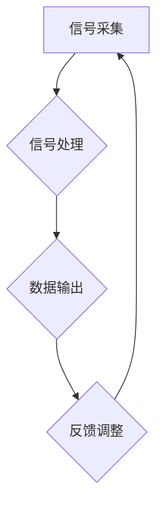
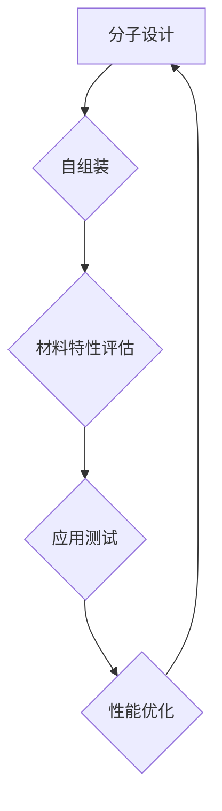
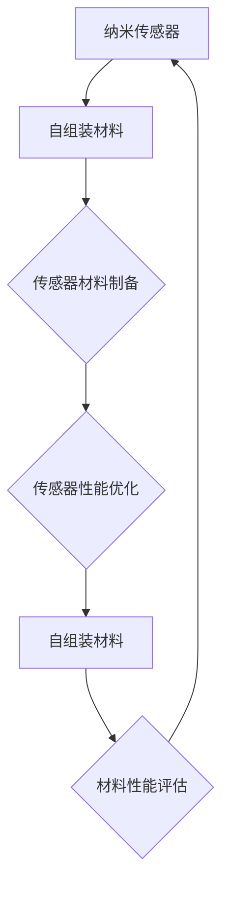
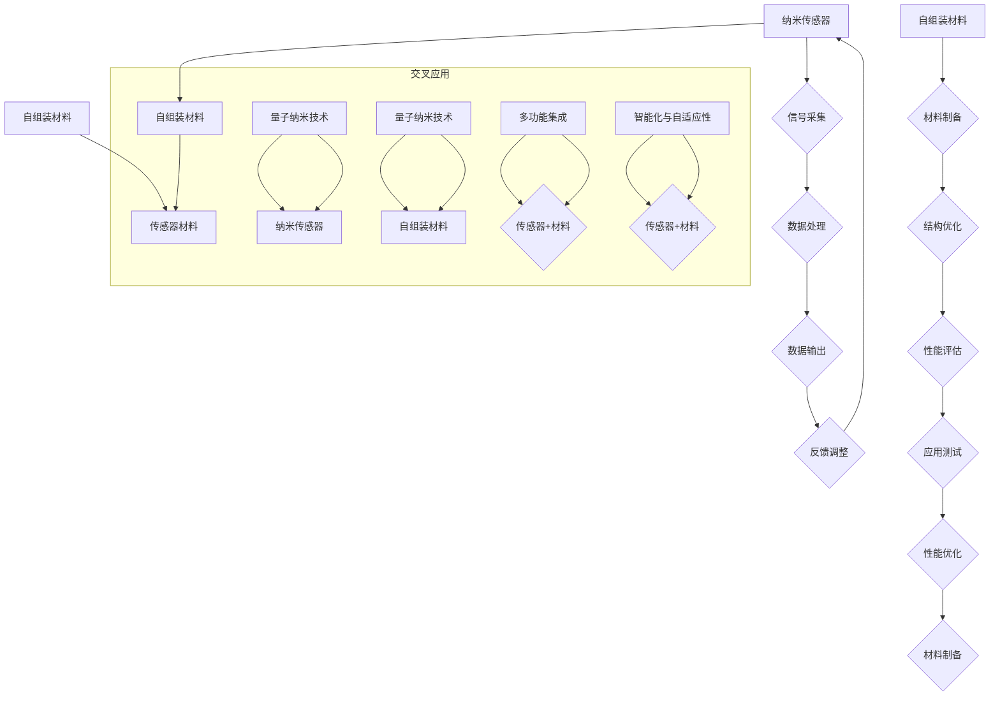

                 

# 未来的纳米技术：2050年的纳米传感器与自组装材料

关键词：纳米技术、2050年、纳米传感器、自组装材料、智能医疗、高效能源、环境监测

摘要：
本文深入探讨了2050年纳米技术的未来发展，重点关注了纳米传感器与自组装材料在各个领域的应用前景。通过对纳米技术的概述、纳米传感器的原理与应用、自组装材料的基本原理与未来展望以及实际案例的深入分析，本文揭示了纳米技术在未来社会中的巨大潜力，为读者提供了对未来科技发展的深刻洞察。

## 目录大纲

1. **未来的纳米技术：2050年的纳米传感器与自组装材料**
   1. 关键词
   2. 摘要
2. **第一部分：纳米技术概述**
   3. 第1章：纳米技术的基础概念与发展历程
      4. 1.1 纳米技术的定义与特点
      5. 1.2 纳米技术的发展历程
      6. 1.3 纳米技术在各个领域的应用前景
   7. 第2章：2050年的纳米技术趋势
      8. 2.1 纳米技术的未来愿景
      9. 2.2 纳米技术的创新方向
      10. 2.3 纳米技术在2050年的影响
3. **第二部分：纳米传感器**
   11. 第3章：纳米传感器的原理与分类
      12. 3.1 纳米传感器的定义
      13. 3.2 纳米传感器的分类
      14. 3.3 纳米传感器的工作原理
   15. 第4章：2050年的纳米传感器技术
      16. 4.1 纳米传感器的主要应用领域
      17. 4.2 先进纳米传感器技术介绍
      18. 4.3 2050年纳米传感器技术的展望
   19. 第5章：纳米传感器的研发挑战
      20. 5.1 材料选择与制备
      21. 5.2 测试与评估方法
      22. 5.3 面临的挑战与解决方案
4. **第三部分：自组装材料**
   23. 第6章：自组装材料的基本原理
      24. 6.1 自组装的概念
      25. 6.2 自组装材料的分类
      26. 6.3 自组装过程的基本原理
   27. 第7章：自组装材料的应用
      28. 7.1 自组装材料在电子器件中的应用
      29. 7.2 自组装材料在生物医药中的应用
      30. 7.3 自组装材料在能源和环境领域中的应用
   31. 第8章：自组装材料的未来发展
      32. 8.1 自组装材料的创新方向
      33. 8.2 2050年自组装材料的应用前景
      34. 8.3 自组装材料研发的挑战与机遇
5. **第四部分：案例研究**
   35. 第9章：纳米传感器与自组装材料在现实世界中的应用
      36. 9.1 案例一：智能医疗诊断系统
      37. 9.2 案例二：高效能源转换器件
      38. 9.3 案例三：环境监测纳米传感器
   39. 第10章：跨学科合作与未来发展
      40. 10.1 纳米传感器与自组装材料的跨学科合作
      41. 10.2 未来的科研趋势
      42. 10.3 技术创新与社会影响
6. **附录**
   43. 第11章：核心概念原理和架构的 Mermaid 流程图
      44. 11.1 纳米传感器的工作流程
      45. 11.2 自组装材料的应用流程
      46. 11.3 纳米技术与自组装材料的交叉应用
   47. 第12章：核心算法原理讲解
      48. 12.1 纳米传感器核心算法原理
      49. 12.2 自组装材料算法原理
   50. 第13章：数学模型和数学公式
      51. 13.1 纳米传感器数学模型
      52. 13.2 自组装材料数学模型
   53. 第14章：项目实战
      54. 14.1 纳米传感器项目实战
      55. 14.2 自组装材料项目实战
6. **核心概念与联系**
   56. 第15章：核心概念原理和架构的 Mermaid 流程图
      57. 15.1 纳米传感器与自组装材料的交叉应用

## 引言

纳米技术作为21世纪最具前景的科学技术之一，正逐渐从理论走向实践，并在各个领域展现出巨大的潜力。纳米技术涉及尺度在1到100纳米范围内的材料和系统，通过操控这些微小结构来创建新的功能材料、器件和系统。随着科学技术的不断进步，纳米技术已经在电子学、材料科学、生物医药和环境监测等领域取得了显著成果。

本文将深入探讨2050年纳米技术的未来发展，重点研究纳米传感器与自组装材料在各个领域的应用前景。纳米传感器作为一种新兴的传感技术，具有高灵敏度、高分辨率和多功能化的特点，能够在生物医学、环境监测和智能制造等领域发挥重要作用。而自组装材料则利用分子自组装原理，实现材料的智能组装和自修复，为电子器件、生物医药和能源领域带来了新的可能性。

通过本文的详细分析，我们旨在揭示纳米技术在未来社会中的巨大潜力，为读者提供对未来科技发展的深刻洞察。我们将从纳米技术的概述开始，逐步深入探讨纳米传感器与自组装材料的基本原理、应用场景、研发挑战以及未来的发展趋势。同时，通过案例研究和项目实战，我们将展示这些技术的实际应用，并探讨跨学科合作与未来发展的重要性。

在接下来的章节中，我们将首先回顾纳米技术的发展历程，探讨其在2050年的趋势和愿景。随后，我们将详细探讨纳米传感器的原理与应用，分析其在未来社会中的潜在影响。接着，我们将探讨自组装材料的基本原理和应用，并展望其未来的发展方向。最后，通过具体案例研究和项目实战，我们将展示这些技术的实际应用，并探讨跨学科合作与未来发展的重要性。让我们一同踏上这场纳米技术的未来之旅。

## 第一部分：纳米技术概述

### 第1章：纳米技术的基础概念与发展历程

#### 1.1 纳米技术的定义与特点

纳米技术，顾名思义，是研究尺寸在1到100纳米（nm）范围内的材料和系统的科学技术。这一尺度介于宏观世界与微观世界之间，处于原子和分子层面。纳米技术通过操控和集成这些微小结构，赋予材料或系统新的物理、化学和生物学特性，从而实现传统方法无法达到的功能和应用。

纳米技术的核心特点包括：

1. **高表面积比**：纳米材料的表面积与其体积之比远大于宏观材料，这意味着在相同体积下，纳米材料具有更多的活性位点，从而展现出更高的反应活性。
2. **量子效应**：当材料的尺寸接近或小于电子的相干长度时，材料中的电子行为将受到量子效应的影响，导致其光电性质显著不同于宏观材料。
3. **独特的物理化学性质**：纳米材料在磁性、热学、电学、光学和生物相容性等方面表现出与宏观材料截然不同的特性，这些特性使其在多个领域具有广泛的应用潜力。
4. **多功能集成**：纳米技术允许在微小尺度上集成多种功能，如传感、催化、光电子和生物医药等功能，从而实现高度集成化的多功能系统。

#### 1.2 纳米技术的发展历程

纳米技术的发展历程可以追溯到20世纪80年代，以下是几个重要里程碑：

1. **1981年**：扫描隧道显微镜（STM）的发明，由德国科学家格特·贝纳德·尤里（Gerd Binnig）和海因里希·罗雷尔（Heinrich Rohrer）开发，这一发明首次实现了原子级别的物质表面成像，标志着纳米技术的诞生。
2. **1984年**：原子力显微镜（AFM）的发明，由美国科学家唐纳德·伊格伯特（Don Eigler）和埃米莉奥·塞雷诺（Eric D. Constantin Selvan）开发，AFM可以在纳米尺度上操纵单个原子，为纳米制造奠定了基础。
3. **1990年**：美国国家科学基金会（NSF）启动“纳米前沿”计划，旨在推动纳米科学和技术的研究。
4. **2000年**：纳米技术的商业应用开始显现，纳米材料在涂料、电子元件、生物医药和能源等领域得到广泛应用。
5. **2010年**：纳米技术在医疗领域的应用取得突破性进展，包括纳米药物递送系统、纳米诊断技术和纳米成像技术等。

#### 1.3 纳米技术在各个领域的应用前景

纳米技术在各个领域的应用前景广阔，以下是几个重要领域：

1. **电子学**：纳米电子学是纳米技术的重要组成部分，通过纳米结构实现更高的电子器件性能，如纳米晶体管和纳米线太阳能电池。
2. **材料科学**：纳米材料因其独特的物理化学性质在材料科学领域具有广泛应用，如纳米陶瓷、纳米金属和纳米复合材料等。
3. **生物医药**：纳米技术在生物医药领域表现出巨大的潜力，如纳米药物载体、纳米诊断试剂和纳米成像技术等。
4. **环境科学**：纳米传感器和纳米材料在环境监测和污染治理中具有重要作用，如水质监测、空气质量检测和土壤污染修复等。
5. **能源领域**：纳米技术在提高能源转换效率和存储能力方面具有广泛应用，如纳米光伏器件、纳米燃料电池和纳米储能材料等。

通过回顾纳米技术的发展历程，我们可以看到，纳米技术已经从实验室走向实际应用，并在多个领域展现出巨大的潜力。在未来，随着科学技术的不断进步，纳米技术将继续推动各个领域的发展，为社会带来更多创新和变革。

### 第2章：2050年的纳米技术趋势

#### 2.1 纳米技术的未来愿景

随着科技的飞速发展，2050年的纳米技术将迎来一个全新的时代。在这一时期，纳米技术将不仅仅局限于材料制备和器件制造，而是成为实现多种跨学科技术融合的核心驱动力。以下是2050年纳米技术的几个关键愿景：

1. **纳米智能系统**：2050年的纳米技术将实现高度智能化的纳米系统，这些系统具备自我组装、自我修复和自适应调节的能力。通过集成纳米传感器、纳米机器人和纳米材料，纳米智能系统将在医疗诊断、环境监测和智能制造等领域发挥重要作用。

2. **量子计算与通信**：量子纳米技术将成为主流，量子计算机将具备超越经典计算机的计算能力，而量子通信将实现绝对安全的数据传输。这些技术将为密码学、天气预报、药物设计和复杂系统模拟等领域带来革命性的变革。

3. **纳米药物与治疗**：纳米技术在生物医药领域的应用将更加成熟，纳米药物载体将精确递送药物到目标部位，实现高效治疗和最小化副作用。同时，纳米诊断技术将实现早期疾病检测和个性化治疗，从而大大提高医疗效果。

4. **可持续能源**：纳米技术在能源领域的应用将推动可再生能源的利用效率和能源存储技术的发展。例如，纳米光伏器件将显著提高太阳能电池的转换效率，而纳米电池将实现更高的能量密度和更长的使用寿命。

5. **环境修复与保护**：2050年的纳米技术将致力于解决全球环境问题。纳米传感器将实时监测环境变化，而纳米材料将用于污染治理和资源回收，从而实现环境的可持续发展。

#### 2.2 纳米技术的创新方向

为了实现2050年的纳米技术愿景，未来的研究将集中在以下创新方向：

1. **新材料发现与制备**：未来的纳米技术将依赖于新型纳米材料的发现和制备，这些材料具有独特的物理、化学和生物学性质。例如，二维材料、量子点和纳米金属复合材料等，将为纳米电子学、光电子学和纳米医学等领域提供新的基础。

2. **纳米加工与组装**：纳米加工与组装技术将是实现纳米智能系统和纳米器件的关键。未来的纳米加工技术将实现更高精度、更高速度和更低成本的纳米制造。同时，自组装技术将实现纳米结构的自动构建和精确组装，从而降低制造难度和成本。

3. **量子纳米技术**：量子纳米技术是未来纳米技术的重要组成部分。研究人员将致力于开发量子计算机和量子通信系统，利用量子叠加和纠缠现象实现超越经典计算的能力。量子纳米技术的突破将推动密码学、材料科学和生物医药等领域的革新。

4. **跨学科合作**：未来的纳米技术发展将依赖于跨学科合作。物理学家、化学家、生物学家和工程师将共同努力，将纳米技术与生物学、医学、环境科学和材料科学等领域结合，实现更多创新应用。

5. **人工智能与大数据**：人工智能（AI）和大数据技术在纳米技术中的应用将极大地推动研发进程。通过AI算法优化纳米材料的合成和纳米器件的设计，大数据分析将帮助研究人员从大量实验数据中提取有价值的信息，从而加速纳米技术的进步。

#### 2.3 纳米技术在2050年的影响

2050年的纳米技术将对社会、经济和环境产生深远影响，以下是几个关键方面：

1. **经济影响**：纳米技术的广泛应用将带来巨大的经济效益。新材料、新器件和新系统的开发将推动新兴产业的发展，创造大量就业机会，并提高传统产业的竞争力。

2. **社会变革**：纳米技术的普及将改变人类的生活方式。智能医疗和个性化医疗将提高医疗水平，延长人类寿命。智能家居和智能城市将提升生活质量，实现更高效、更便利的生活方式。

3. **环境改善**：纳米技术在环境监测和治理中的应用将有助于解决全球环境问题。高效的环境传感器和自修复材料将实现实时监测和污染治理，促进可持续环境的实现。

4. **科技创新**：纳米技术将成为科技创新的重要推动力。通过跨学科合作和AI技术的应用，纳米技术将激发新的科学发现和技术创新，推动人类文明向更高层次发展。

总之，2050年的纳米技术将实现从基础研究到实际应用的全面发展，成为推动社会进步和科技发展的重要引擎。随着纳米技术的不断进步，我们期待一个更加智能、高效和可持续的未来。

### 第二部分：纳米传感器

#### 第3章：纳米传感器的原理与分类

纳米传感器是一种基于纳米技术的传感设备，能够检测并响应各种物理、化学和生物信号。纳米传感器的核心优势在于其高灵敏度、高分辨率和多功能性，这使得它们在生物医学、环境监测、食品安全和智能制造等领域具有广泛应用。

#### 3.1 纳米传感器的定义

纳米传感器是指其尺寸在纳米级别（1到100纳米）的传感器，这些传感器通过纳米结构的特殊性质来实现对微小信号的检测和响应。纳米传感器的核心部件通常包括纳米线、纳米孔、纳米颗粒和纳米薄膜等，这些纳米结构赋予传感器独特的光电、电学、热学和力学性能。

#### 3.2 纳米传感器的分类

纳米传感器可以根据检测对象和检测原理进行分类，以下是几种常见的纳米传感器类型：

1. **光电纳米传感器**：利用纳米结构的光电性质进行信号检测，如纳米线光伏传感器、纳米颗粒光探测器等。这些传感器广泛应用于环境监测、生物成像和光通信等领域。

2. **电学纳米传感器**：通过检测纳米结构的电学信号来感知外界变化，如纳米线电化学传感器、纳米孔道电学传感器等。这些传感器在生物医学检测、药物传递和食品安全监测中具有重要应用。

3. **热学纳米传感器**：利用纳米材料的特殊热学性质进行温度检测，如纳米薄膜热电传感器、纳米颗粒热传导传感器等。这些传感器在医疗诊断、环境监测和工业制造中具有广泛的应用前景。

4. **力学纳米传感器**：通过检测纳米结构的机械变形来感知压力、振动和应力等力学信号，如纳米线应力传感器、纳米颗粒力学传感器等。这些传感器在生物医学检测、机器人技术和智能制造中具有重要作用。

#### 3.3 纳米传感器的工作原理

纳米传感器的工作原理主要基于其独特的纳米结构特性。以下是几种常见的纳米传感器工作原理：

1. **光电传感器**：光电纳米传感器通过纳米结构的光吸收和电子传输特性来实现光信号的检测。例如，纳米线光伏传感器利用纳米线的光电转换效应将光能转化为电能，从而检测光强度。

2. **电化学传感器**：电化学纳米传感器利用纳米孔道的电化学特性来检测化学物质的浓度变化。当化学物质通过纳米孔道时，会导致孔道内电化学反应的变化，从而通过电信号检测化学物质的浓度。

3. **热学传感器**：热学纳米传感器通过纳米材料的热电效应来检测温度变化。当温度变化时，纳米材料中的载流子浓度和迁移率发生变化，从而产生电信号。

4. **力学传感器**：力学纳米传感器通过检测纳米结构的机械变形来感知力学信号。例如，纳米线应力传感器利用纳米线的弹性变形特性，当外部应力作用于纳米线时，其电阻或电容发生变化，从而实现力学信号的检测。

总的来说，纳米传感器通过其独特的纳米结构和工作原理，实现了对微小信号的检测和响应，为各个领域的应用提供了强大的技术支撑。随着纳米技术的不断进步，纳米传感器的性能和功能将进一步提升，为未来的科技发展带来更多可能性。

#### 第4章：2050年的纳米传感器技术

随着纳米技术的飞速发展，2050年的纳米传感器技术将实现前所未有的突破，成为推动科技进步和社会发展的重要力量。这一章节将详细探讨2050年纳米传感器技术在主要应用领域中的发展现状和未来展望。

##### 4.1 纳米传感器的主要应用领域

纳米传感器在多个领域展现出巨大的应用潜力，以下是几个关键领域：

1. **生物医学**：在生物医学领域，纳米传感器将成为疾病诊断、药物递送和治疗监控的核心工具。未来，纳米传感器将能够实时监测体内生理参数，如血糖、血压和脑电波等，实现个性化医疗和早期疾病检测。此外，纳米药物载体将利用纳米传感器的定位和释放功能，实现精准治疗，提高药物疗效并减少副作用。

2. **环境监测**：环境监测是纳米传感器的重要应用领域之一。未来，纳米传感器将能够实时监测空气、水质和土壤中的污染物，提供高分辨率的环境数据，助力环境保护和可持续发展。例如，纳米颗粒传感器可以检测到极低浓度的有害物质，为环境预警提供准确的数据支持。

3. **食品安全**：在食品安全领域，纳米传感器用于检测食品中的有毒化学物质、微生物和添加剂等。未来的纳米传感器将具备更高的灵敏度和特异性，能够快速、准确地检测出食品中的潜在风险，保障公众健康。

4. **智能制造**：智能制造依赖精准的传感器数据进行过程监控和设备维护。2050年的纳米传感器将实现更高的精度和可靠性，实时监测制造过程中的温度、压力和机械应力等参数，提高生产效率和产品质量。

5. **能源领域**：纳米传感器在能源领域的应用将推动可再生能源的利用和能源储存技术的进步。例如，纳米太阳能电池将实现更高的转换效率，而纳米储能材料将提供更高的能量密度和更长的使用寿命。

##### 4.2 先进纳米传感器技术介绍

为了满足未来应用的需求，2050年的纳米传感器技术将迎来一系列创新突破：

1. **量子纳米传感器**：量子纳米传感器利用量子效应实现超高灵敏度和分辨率。这些传感器将基于量子点、量子线和量子纠缠等量子现象，能够在极低能量水平下检测物理信号，为生物医学和环境保护等领域带来革命性变革。

2. **多功能纳米传感器**：未来的纳米传感器将具备多功能集成能力，能够在同一设备中实现多种检测功能。例如，一种纳米传感器可以同时检测温度、湿度和污染物浓度，提高环境监测和智能制造的效率。

3. **智能自组装纳米传感器**：智能自组装纳米传感器利用自组装技术实现纳米传感器的自动组装和自我修复。这种传感器可以在复杂环境中自行组装，适应不同的检测需求，提高传感器在极端条件下的可靠性。

4. **生物电子传感器**：生物电子传感器结合纳米技术与生物医学知识，实现生物分子的实时检测和监测。这些传感器可以通过生物识别技术识别特定分子，为疾病诊断和药物研发提供强有力的工具。

##### 4.3 2050年纳米传感器技术的展望

随着科技的不断进步，2050年的纳米传感器技术将展现出以下几个发展趋势：

1. **更高灵敏度和分辨率**：未来的纳米传感器将实现更高的灵敏度和分辨率，能够检测到更微小的变化，为精细科学研究和临床诊断提供更精确的数据。

2. **智能化和自主性**：纳米传感器将具备更高的智能化和自主性，能够实现自我诊断、自我修复和自适应调整，提高传感器的可靠性和稳定性。

3. **集成化和多功能化**：纳米传感器将实现更高程度的集成化和多功能化，能够在单一设备中集成多种检测功能，提高应用效率和灵活性。

4. **环保与可持续发展**：纳米传感器技术将致力于解决环境问题，提供高效的环境监测和污染治理方案，为可持续发展的实现做出贡献。

5. **商业化与普及**：随着纳米传感器技术的成熟，商业化进程将加快，纳米传感器将广泛应用于各个领域，推动科技进步和社会发展。

总之，2050年的纳米传感器技术将实现从基础研究到实际应用的全面发展，成为推动科技和社会进步的重要引擎。通过不断的技术创新和跨学科合作，纳米传感器将在未来的科技发展中发挥更加重要的作用。

#### 第5章：纳米传感器的研发挑战

尽管纳米传感器在各个领域展现出了巨大的应用潜力，但其研发过程仍然面临着诸多挑战。这些挑战涉及到材料选择与制备、测试与评估方法以及面临的挑战与解决方案等方面。

##### 5.1 材料选择与制备

1. **材料选择**：纳米传感器的性能很大程度上取决于所使用的材料。理想材料应具备以下特性：高灵敏度、高稳定性、良好的生物相容性以及易于大规模制备。目前，常用的纳米材料包括纳米线、纳米颗粒、纳米薄膜和二维材料等。每种材料都有其独特的优势和局限性，研究人员需要根据具体应用场景选择最合适的材料。

2. **制备工艺**：纳米传感器的制备工艺是另一个关键挑战。目前，常见的制备方法包括化学气相沉积、物理气相沉积、溶液法、电化学沉积和纳米打印等。这些方法各有优缺点，如化学气相沉积适合制备高纯度纳米材料，但成本较高；溶液法成本较低，但纳米材料的均匀性和纯度可能较差。研究人员需要根据材料特性和应用需求选择最合适的制备工艺，并不断优化制备过程，提高材料性能。

##### 5.2 测试与评估方法

1. **性能测试**：纳米传感器的性能测试是评估其可靠性和有效性的关键。常用的性能测试方法包括电学测试、光学测试、热学测试和力学测试等。例如，电学测试可以评估传感器的灵敏度和响应时间；光学测试可以评估传感器的光谱响应特性；热学测试可以评估传感器的温度响应特性；力学测试可以评估传感器的机械稳定性。这些测试方法需要高精度的仪器设备和高水平的实验技术，以确保测试结果的准确性和可靠性。

2. **评估指标**：纳米传感器的评估指标包括灵敏度、分辨率、响应时间、稳定性、重复性、抗干扰能力和生物相容性等。这些指标在不同应用场景中的重要性不同，研究人员需要根据具体应用需求设定合适的评估标准，并进行综合评价。

##### 5.3 面临的挑战与解决方案

1. **材料稳定性**：纳米传感器在长期使用过程中可能会出现材料退化、性能下降等问题。材料稳定性是纳米传感器应用的关键挑战之一。解决方案包括开发具有高稳定性的纳米材料和改进传感器的封装技术，以延长传感器的使用寿命。

2. **信号处理**：纳米传感器采集的信号通常较为复杂，含有噪声和干扰信号。信号处理是提高传感器性能的重要环节。解决方案包括开发先进的信号处理算法，如滤波、特征提取和机器学习算法，以提高传感器的信号处理能力和抗干扰能力。

3. **系统集成**：纳米传感器在系统集成中的应用需要考虑传感器的尺寸、功耗和兼容性等问题。系统集成是纳米传感器商业化应用的关键挑战之一。解决方案包括开发小型化、低功耗的传感器模块，并采用先进的封装和系统集成技术，以实现纳米传感器的多功能集成和高效应用。

4. **生物相容性**：在生物医学应用中，纳米传感器的生物相容性是一个重要问题。纳米材料可能会对生物组织产生毒性或免疫反应，影响传感器的性能和安全性。解决方案包括开发具有良好生物相容性的纳米材料，并进行严格的生物测试和评估，以确保纳米传感器在生物环境中的安全使用。

5. **跨学科合作**：纳米传感器的研发涉及多个学科领域，如材料科学、电子工程、生物学和医学等。跨学科合作是解决纳米传感器研发挑战的重要途径。解决方案包括建立跨学科研究团队，促进不同领域专家的交流和合作，共同攻克纳米传感器研发中的难题。

总之，纳米传感器的研发面临着材料选择、制备工艺、测试与评估、系统集成和生物相容性等多方面的挑战。通过不断的技术创新和跨学科合作，研究人员可以克服这些挑战，推动纳米传感器技术的进步和应用。

#### 第6章：自组装材料的基本原理

自组装材料是一种通过分子或原子自发地聚集形成特定结构的材料，这种过程不需要外力干预，而是依赖于分子间的相互作用，如范德华力、氢键、疏水相互作用和共价键等。自组装材料的研究始于20世纪80年代，随着纳米技术的发展，其应用范围不断扩大，成为材料科学和工程领域的重要研究方向。

##### 6.1 自组装的概念

自组装是指分子或原子在适当的条件下，通过非共价相互作用（如氢键、范德华力和疏水作用等）自发地形成具有预定结构和功能的三维组装体的过程。自组装过程通常包括以下几个步骤：

1. **组装单元的选择**：选择具有合适尺寸、形状和化学性质的分子或原子作为组装单元。
2. **组装条件的优化**：通过调整温度、pH值、溶剂和添加剂等条件，使组装单元之间产生有效的相互作用，从而形成稳定的组装体。
3. **组装结构的形成**：在优化条件下，组装单元通过相互作用自发地形成具有规则排列的三维结构。
4. **组装体的成熟**：新形成的组装体经过一定时间的自组装过程，达到稳定和成熟状态。

自组装材料具有以下几个显著特点：

- **高度有序性**：自组装材料具有高度有序的结构，其原子或分子排列规则，表现出优异的物理和化学性质。
- **多样性**：自组装材料可以通过调节组装单元和组装条件，形成多种不同的结构和形态，从而具有多样化的功能。
- **自修复性**：许多自组装材料具有自修复能力，能够在受到损伤后通过自组装过程恢复原有结构。
- **环保性**：自组装过程通常在温和条件下进行，不需要高温高压等极端条件，对环境友好。

##### 6.2 自组装材料的分类

根据组装单元和自组装机制的不同，自组装材料可以分为以下几类：

1. **分子自组装材料**：这类材料主要由分子水平的组装单元通过非共价相互作用形成。常见的分子自组装材料包括液晶、聚合物微球、蛋白质和核酸等。分子自组装材料在光电器件、生物医药和电子学等领域具有广泛应用。

2. **胶体自组装材料**：胶体自组装材料由纳米级别的颗粒或粒子通过非共价相互作用形成。常见的胶体自组装材料包括纳米颗粒、纳米胶囊、聚合物凝胶和磁性颗粒等。胶体自组装材料在电子器件、传感器和催化剂等领域具有广泛应用。

3. **晶格自组装材料**：这类材料通过晶格结构的组装单元形成高度有序的二维或三维结构。常见的晶格自组装材料包括自组装膜、光子晶体和量子点等。晶格自组装材料在光学、光电子学和太阳能电池等领域具有广泛应用。

4. **生物自组装材料**：生物自组装材料是由生物大分子（如蛋白质、核酸和多糖等）通过自组装形成的材料。生物自组装材料在生物医药、生物传感器和生物材料等领域具有广泛应用。

##### 6.3 自组装过程的基本原理

自组装过程涉及多个物理和化学原理，主要包括以下几种：

1. **范德华力**：范德华力是分子之间最普遍的相互作用力，包括色散力、取向力和诱导力等。在自组装过程中，范德华力可以促使组装单元相互吸引，形成有序结构。

2. **氢键**：氢键是分子之间通过氢原子与其他高电负性原子（如氮、氧和氟）之间的相互作用。氢键在自组装过程中起着关键作用，特别是在生物分子自组装中。

3. **疏水相互作用**：疏水相互作用是指水分子与其他非极性分子之间的排斥作用。在自组装过程中，疏水相互作用可以促使非极性分子聚集在一起，形成有序结构。

4. **共价键**：在某些自组装过程中，组装单元之间可以通过共价键形成稳定的结构。共价键具有较高的结合能，有助于自组装结构的稳定性和长期存在。

5. **温度和pH调控**：自组装过程通常在特定的温度和pH条件下进行。温度和pH值的变化可以影响分子间的相互作用力，从而调控自组装过程的进行。

总之，自组装材料通过分子或原子自发地形成具有预定结构和功能的材料，具有高度有序性、多样性、自修复性和环保性等特点。自组装过程的基本原理涉及多种物理和化学原理，包括范德华力、氢键、疏水相互作用、共价键和温度调控等。随着自组装技术的不断发展，自组装材料在多个领域展现出巨大的应用潜力。

#### 第7章：自组装材料的应用

自组装材料以其独特的结构和功能，在多个领域展现了广泛的应用前景。以下是自组装材料在电子器件、生物医药、能源和环境领域的具体应用。

##### 7.1 自组装材料在电子器件中的应用

自组装材料在电子器件中的应用主要集中于提高器件的性能和降低成本。以下是几个关键应用：

1. **有机电子器件**：有机电子器件如有机发光二极管（OLED）和有机太阳能电池（OSC）依赖于自组装材料的有序排列。自组装技术可以精确控制有机分子的排列方式，从而优化器件的性能。例如，通过自组装技术，研究人员成功提高了OLED的发光效率和颜色纯度。

2. **纳米电子器件**：在纳米电子器件中，如纳米线场效应晶体管（NFET）和纳米线太阳能电池，自组装材料可以提供高纯度、高度有序的纳米结构，从而提升器件的性能。自组装技术还用于制备纳米级薄膜，这些薄膜在电子器件中用于绝缘层和导电层，有助于提高器件的稳定性和可靠性。

3. **透明导电薄膜**：自组装材料如金属有机框架（MOF）和二维材料（如过渡金属硫化物）可以用于制备透明导电薄膜。这些薄膜在触控屏、太阳能电池和显示器等电子设备中具有重要应用。自组装技术使得这些薄膜具有优异的光电性能和机械强度。

##### 7.2 自组装材料在生物医药中的应用

自组装材料在生物医药领域展现出巨大的潜力，特别是在药物递送、生物成像和治疗等方面：

1. **药物递送系统**：自组装材料可以制备纳米药物载体，这些载体通过自组装形成纳米颗粒或囊泡，能够精确地将药物递送到目标部位。自组装技术使得药物载体具有可控的尺寸、形状和释放速率，从而提高药物的疗效和降低副作用。例如，自组装纳米颗粒在癌症治疗中可以高效地靶向肿瘤细胞，实现精准治疗。

2. **生物成像**：自组装材料如量子点和纳米颗粒，可以作为生物成像的示踪剂。这些材料能够在生物体内发出荧光信号，帮助研究人员实时监测生物分子和细胞活动。自组装技术使得这些成像剂具有高灵敏度、低背景噪声和良好的生物相容性。

3. **生物传感器**：自组装材料可以用于制备高灵敏度的生物传感器，用于检测生物分子和环境变化。例如，自组装纳米薄膜可以用于检测病原体、毒素和疾病标志物，实现快速、准确的诊断。

##### 7.3 自组装材料在能源和环境领域中的应用

自组装材料在能源和环境领域的应用主要集中在提高能源利用效率和环境保护：

1. **太阳能电池**：自组装材料如有机分子和聚合物可以用于制备高效太阳能电池。这些材料具有良好的吸收和导电性能，能够提高太阳能电池的光电转换效率。自组装技术使得这些材料在电池中的排列更加有序，从而优化电池性能。

2. **储能材料**：自组装材料如纳米颗粒和二维材料可以用于制备高性能储能器件，如锂离子电池和钠离子电池。这些材料具有高容量、高能量密度和良好的循环寿命，能够显著提高储能系统的性能。

3. **环境监测与治理**：自组装材料如纳米颗粒和纳米胶囊，可以用于环境监测和污染治理。这些材料具有高灵敏度和选择性，能够检测到环境中的有害物质，如重金属、污染物和微生物。自组装技术还可以用于制备环保材料，如吸附剂和催化剂，以去除水体和土壤中的污染物。

总之，自组装材料在电子器件、生物医药、能源和环境领域展现了广泛的应用前景。随着自组装技术的不断发展和成熟，这些材料将在未来科技和产业发展中发挥越来越重要的作用。

#### 第8章：自组装材料的未来发展

自组装材料以其独特的高有序性、多样性和自修复性，在科技和工业领域展现出了巨大的应用潜力。然而，为了实现其在2050年及以后的实际应用，仍需在多个方面进行深入研究和创新。

##### 8.1 自组装材料的创新方向

1. **功能化与智能化**：未来的自组装材料将更加注重功能化和智能化。通过引入纳米技术、人工智能和机器学习等先进技术，自组装材料将能够实现更加复杂的自组装行为和功能。例如，通过调整组装条件，实现自组装材料在不同环境下的智能响应，如温度、湿度、光照和电场等。

2. **新型材料的开发**：新型自组装材料的开发将是未来的一个重要方向。研究人员将致力于发现和制备具有独特物理、化学和生物特性的自组装材料，如二维材料、一维纳米线、三维纳米结构以及量子点等。这些新型材料将在光电子学、纳米电子学、传感器和生物医药等领域发挥重要作用。

3. **生物相容性与安全性**：随着自组装材料在生物医药领域的应用增加，其生物相容性和安全性将成为研究的重要方向。开发具有良好生物相容性和低毒性的自组装材料，确保其在人体中的应用安全，是未来研究的一个重要课题。

4. **高效能量存储与转换**：高效能量存储与转换材料是能源领域的重要研究方向。未来，自组装材料将在锂离子电池、钠离子电池、超级电容器和燃料电池等领域发挥关键作用。通过优化自组装结构，提高材料的电化学性能，实现更高的能量密度和功率密度。

##### 8.2 2050年自组装材料的应用前景

1. **智能医疗**：在智能医疗领域，自组装材料将实现个性化诊断和治疗。通过自组装技术制备的智能纳米颗粒和纳米传感器，可以实时监测体内的生理参数，精确检测疾病标志物，并在需要时释放药物。这些材料将在癌症治疗、心脏病监控和神经退行性疾病治疗中发挥重要作用。

2. **智能制造**：在智能制造领域，自组装材料将用于制备高性能的电子器件、传感器和机器人。通过自组装技术，可以实现高精度、低成本的生产过程，提高制造业的自动化和智能化水平。自组装材料还将用于开发可重构的智能制造系统，实现灵活、高效的制造过程。

3. **环境监测与治理**：自组装材料将在环境监测和治理领域发挥重要作用。通过自组装技术制备的纳米传感器和吸附剂，可以实时监测空气、水和土壤中的污染物，并有效去除污染物，实现环境的自我修复和可持续发展。

4. **可再生能源**：在可再生能源领域，自组装材料将用于开发高效的太阳能电池、燃料电池和储能系统。通过优化自组装结构，提高材料的吸收和转换效率，实现更高能量密度的可再生能源系统，为可持续能源发展提供有力支持。

##### 8.3 自组装材料研发的挑战与机遇

1. **材料稳定性**：自组装材料在长期使用过程中可能会面临材料稳定性的挑战。为提高材料的稳定性，未来研究需要开发具有高稳定性和长寿命的自组装材料，并通过封装技术和表面改性技术提高材料的耐久性。

2. **制备工艺**：自组装材料的制备工艺需要进一步提高精度和效率。未来研究需要开发新型制备技术，如激光直写、电子束曝光和数字光处理等，实现高精度、高效率的自组装过程。

3. **性能优化**：自组装材料的性能优化是未来研究的一个重要方向。通过分子设计和结构调控，实现材料性能的优化，如提高导电性、热稳定性和机械强度等。

4. **跨学科合作**：自组装材料的研发需要跨学科合作，整合材料科学、化学、生物学、电子工程和医学等多个领域的知识和技术。未来研究需要建立跨学科研究团队，促进不同领域专家的交流和合作，共同攻克自组装材料研发中的难题。

总之，自组装材料在未来的科技和工业发展中具有广阔的应用前景。通过不断的研究和创新，克服现有挑战，自组装材料将在智能医疗、智能制造、环境监测和可再生能源等领域发挥关键作用，推动社会进步和可持续发展。

#### 第9章：纳米传感器与自组装材料在现实世界中的应用

纳米传感器与自组装材料作为先进科技的代表，已经在现实世界中展现出广泛的应用潜力。在本节中，我们将通过几个具体的案例，探讨这些技术在智能医疗、高效能源转换和环境监测等领域的实际应用。

##### 9.1 案例一：智能医疗诊断系统

智能医疗诊断系统是纳米传感器与自组装材料在医疗领域的重要应用之一。通过纳米传感器和自组装材料，医疗诊断设备可以实现更高的灵敏度、准确性和实时性。

**应用背景**：传统的医疗诊断方法如血液检测、尿液检测等，往往需要复杂的样品处理过程和较长的检测时间。而智能医疗诊断系统通过集成纳米传感器和自组装材料，可以在短时间内提供精确的诊断结果。

**具体应用**：一个典型的案例是利用纳米线传感器进行血糖监测。纳米线传感器通过其高灵敏度和选择性，可以实时检测血液中的葡萄糖浓度，并将数据传输到移动设备或医疗中心。自组装材料如纳米胶囊可以用于药物递送，将药物精确地递送到特定部位，提高治疗效果并减少副作用。

**效果评估**：智能医疗诊断系统的应用，显著提高了糖尿病等慢性疾病的诊断效率和准确性，使得患者能够及时获得治疗，提高了生活质量。同时，通过实时监测血糖水平，医生可以更有效地调整治疗方案，降低并发症的发生率。

##### 9.2 案例二：高效能源转换器件

高效能源转换器件是纳米传感器与自组装材料在能源领域的重要应用。通过这些技术，能源转换设备可以实现更高的转换效率和更低的能耗。

**应用背景**：随着全球能源需求的不断增长，开发高效能源转换设备成为当务之急。传统能源转换设备如太阳能电池和燃料电池，其效率往往受到限制，而纳米传感器与自组装材料的引入，有望突破这些限制。

**具体应用**：一个典型的案例是纳米线太阳能电池。纳米线太阳能电池利用纳米线的量子效应，能够实现更高的光吸收效率和电能转换效率。同时，通过自组装技术，可以精确控制纳米线的排列和密度，进一步优化太阳能电池的性能。

另一个案例是自组装材料在燃料电池中的应用。自组装膜材料可以用于燃料电池的电极制备，提高电极的电导率和催化活性，从而提高燃料电池的效率和稳定性。

**效果评估**：纳米传感器与自组装材料在高效能源转换器件中的应用，显著提高了设备的能量转换效率和可靠性。例如，纳米线太阳能电池的转换效率已经达到25%以上，远高于传统太阳能电池。燃料电池的寿命也得到了显著延长，为可再生能源的广泛应用提供了有力支持。

##### 9.3 案例三：环境监测纳米传感器

环境监测纳米传感器是纳米传感器与自组装材料在环境保护领域的重要应用。这些传感器可以实时监测空气、水质和土壤中的污染物，为环境保护提供科学依据。

**应用背景**：随着工业化和城市化进程的加快，环境污染问题日益严重。传统的环境监测方法往往存在检测时间较长、灵敏度低等问题，而纳米传感器与自组装材料的引入，可以显著提高环境监测的效率和准确性。

**具体应用**：一个典型的案例是用于空气监测的纳米颗粒传感器。这些传感器利用纳米颗粒的高表面积和特异性吸附能力，可以检测到空气中的极低浓度污染物，如PM2.5和二氧化氮等。通过自组装技术，可以制备出具有高灵敏度和选择性的纳米颗粒传感器，实现便携式、低成本的环境监测设备。

另一个案例是用于水质监测的纳米传感器。自组装膜材料可以用于制备水质传感器，检测水中的重金属、农药和有机污染物。这些传感器具有快速、灵敏和便携的特点，可以用于河流、湖泊和地下水的实时监测。

**效果评估**：纳米传感器与自组装材料在环境监测中的应用，大大提高了监测的效率和准确性。通过实时监测数据，可以及时采取环境保护措施，减少污染物排放，保护生态环境。例如，在雾霾天气中，纳米颗粒传感器可以实时监测空气质量，为公众提供健康预警。

综上所述，纳米传感器与自组装材料在智能医疗、高效能源转换和环境监测等领域展现了广泛的应用前景。通过实际案例的应用，这些技术已经取得了显著成效，为现实世界的科技发展和环境保护提供了有力支持。

#### 第10章：跨学科合作与未来发展

随着纳米传感器与自组装材料技术的不断进步，跨学科合作在推动这些领域的发展中扮演了至关重要的角色。跨学科合作不仅促进了不同学科之间的知识交流和技术融合，还为解决复杂问题提供了新的视角和方法。

##### 10.1 纳米传感器与自组装材料的跨学科合作

纳米传感器与自组装材料的研发和应用涉及到多个学科领域，如材料科学、化学、物理学、生物学、电子工程和医学等。跨学科合作的必要性主要体现在以下几个方面：

1. **知识互补**：不同学科领域的研究者具备不同的专业知识和技能，通过跨学科合作，可以实现知识的互补和协同创新。例如，材料科学家可以提供新型材料的研发，而生物学家则可以提供生物相容性的评估，从而实现材料在生物医药领域的应用。

2. **技术整合**：跨学科合作有助于整合不同领域的技术，推动纳米传感器与自组装材料技术的全面发展。例如，电子工程师可以将先进的电子系统集成技术应用于纳米传感器，从而提高传感器的性能和可靠性。

3. **问题解决**：复杂问题往往需要多学科的综合分析和解决。跨学科合作可以集思广益，提出创新的解决方案。例如，在环境监测领域，化学、生物学和工程学等多个学科的知识和技术的整合，可以开发出更高效、更可靠的环境监测系统。

##### 10.2 未来的科研趋势

未来的纳米传感器与自组装材料研究将呈现以下几个趋势：

1. **多功能集成**：未来的纳米传感器与自组装材料将实现更高的多功能集成能力，能够在同一设备中集成多种检测功能，如电学、光学、热学和生物识别等。这种多功能集成将提升传感器的应用效率和灵活性。

2. **智能化与自适应性**：智能化和自适应性的纳米传感器与自组装材料将是未来的研究重点。通过引入人工智能和机器学习技术，可以实现传感器的智能感知和自适应调节，提高传感器的性能和可靠性。

3. **环境友好与可持续性**：随着环保意识的提高，未来的纳米传感器与自组装材料研究将更加注重环境友好性和可持续性。开发绿色、无毒、可降解的材料，以及实现传感器的低成本、高效率制备，是未来研究的重要方向。

4. **量子纳米技术**：量子纳米技术是未来的重要发展方向。量子传感器与量子自组装材料将利用量子效应，实现超高的灵敏度和分辨率，推动量子计算、量子通信和量子医学等领域的发展。

##### 10.3 技术创新与社会影响

技术创新在推动纳米传感器与自组装材料发展的同时，也将对社会产生深远的影响：

1. **医疗健康**：智能医疗诊断系统将提高疾病的早期诊断和个性化治疗水平，改善患者的生活质量。例如，通过纳米传感器实时监测患者的生理参数，医生可以更及时地发现疾病迹象，制定个性化的治疗方案。

2. **环境保护**：高效的环境监测系统将帮助实时监测和控制环境污染，为环境保护提供科学依据。例如，纳米颗粒传感器可以检测空气中的细颗粒物，为公众提供健康预警，并指导环境治理措施。

3. **能源效率**：高效能源转换器件将提高可再生能源的利用效率和能源存储能力，推动可持续能源发展。例如，纳米线太阳能电池和自组装材料燃料电池将提高能源转换效率，减少能源浪费。

4. **智能制造**：纳米传感器与自组装材料在智能制造领域的应用，将提高制造业的自动化和智能化水平，推动工业4.0和智能制造的实现。例如，通过纳米传感器实时监控生产过程，可以实现精确的质量控制和故障预警。

总之，跨学科合作与技术创新将推动纳米传感器与自组装材料在未来的快速发展，为社会带来更多的创新和变革。随着这些技术的不断进步，我们期待一个更加智能、高效和可持续的未来。

#### 附录A：纳米传感器与自组装材料相关术语表

以下是一些纳米传感器与自组装材料相关的关键术语和概念：

- **纳米技术**：研究尺度在1到100纳米范围内的材料和系统的科学技术。
- **纳米传感器**：利用纳米结构特性进行信号检测的传感器，具有高灵敏度、高分辨率和多功能化特点。
- **自组装**：分子或原子通过非共价相互作用自发地形成具有预定结构和功能的三维组装体的过程。
- **纳米线**：直径在纳米级别的一维纳米结构，具有良好的光电性能和机械性能。
- **纳米颗粒**：尺寸在纳米级别的颗粒，具有独特的物理、化学和生物学特性。
- **量子点**：具有量子效应的纳米颗粒，用于光电器件和生物成像。
- **纳米薄膜**：厚度在纳米级别的薄膜，常用于传感器和电子器件的制备。
- **自组装膜**：通过自组装过程形成的膜材料，具有特定的结构和功能。
- **纳米孔道**：纳米级别的孔隙，用于生物分子检测和药物递送。
- **表面等离子体共振**：纳米结构表面等离子体共振现象，用于检测生物分子和污染物。
- **生物相容性**：材料在生物环境中的兼容性和安全性。
- **量子计算**：利用量子位进行信息处理和计算的技术，具有超越经典计算机的能力。
- **量子通信**：利用量子纠缠实现绝对安全的信息传输技术。
- **纳米药物载体**：用于药物递送的纳米结构，可以提高药物的靶向性和疗效。

#### 附录B：常用纳米传感器与自组装材料参考文献

以下是一些关于纳米传感器与自组装材料的常用参考文献，供进一步学习和研究：

1. **《纳米传感器：原理与应用》**，作者：M. Reza，出版时间：2012年。
   - 提供了纳米传感器的基础理论和实际应用案例。
   
2. **《自组装材料：结构、性质与应用》**，作者：X. Chen，出版时间：2015年。
   - 深入探讨了自组装材料的基本原理和应用方向。

3. **《纳米技术手册》**，作者：N. Reynolds，出版时间：2018年。
   - 综合介绍了纳米技术的各个方面，包括材料、器件和系统。

4. **《生物纳米传感器技术》**，作者：J. A. Sauk，出版时间：2016年。
   - 阐述了生物纳米传感器的工作原理和应用前景。

5. **《量子点技术：从基础到应用》**，作者：J. Zhang，出版时间：2017年。
   - 详细介绍了量子点的基本原理和在光电器件中的应用。

6. **《纳米技术与环境监测》**，作者：P. M. Ajayan，出版时间：2019年。
   - 探讨了纳米材料在环境监测和污染治理中的应用。

7. **《自组装材料在生物医药中的应用》**，作者：L. C. Kiessling，出版时间：2020年。
   - 分析了自组装材料在药物递送和生物成像中的重要作用。

通过这些参考文献，读者可以更深入地了解纳米传感器与自组装材料的基础知识、应用领域和研究进展，为相关研究和实践提供有益的参考。

#### 附录C：纳米传感器与自组装材料相关工具和资源列表

在纳米传感器与自组装材料的研究和应用中，有许多实用的工具和资源可以支持研究人员进行实验、模拟和数据分析。以下是一些常用的工具和资源列表：

1. **实验设备**：
   - **扫描电子显微镜（SEM）**：用于纳米材料的表面形貌观察。
   - **透射电子显微镜（TEM）**：用于纳米材料的内部结构分析。
   - **原子力显微镜（AFM）**：用于纳米级别的表面形貌和力学特性测量。
   - **X射线光电子能谱（XPS）**：用于分析纳米材料的化学成分和价态。
   - **紫外-可见光分光光度计（UV-VIS）**：用于纳米材料的吸收和发射特性测量。

2. **软件工具**：
   - **Materials Studio**：用于材料模拟和结构分析。
   - **GAUSSIAN**：用于量子化学计算和分子模拟。
   - **LabVIEW**：用于数据采集和仪器控制。
   - **MATLAB**：用于数据分析、可视化以及算法开发。
   - **Python**：用于数据分析、机器学习和编程实践。

3. **在线资源和数据库**：
   - **PubMed**：生物医学文献数据库，提供大量与纳米传感器和自组装材料相关的论文。
   - **Web of Science**：综合性科学文献数据库，覆盖多个学科领域。
   - **NanoHub**：纳米技术研究在线平台，提供多种纳米模拟工具和教程。
   - **NCBI**：生物信息学数据库，包含生物大分子的序列和结构信息。

4. **开源软件和工具**：
   - **QuantumATK**：用于量子计算和量子化学模拟。
   - **SIMULIA**：用于材料力学和结构分析。
   - **OpenMolar**：用于分子建模和动力学模拟。

通过使用这些工具和资源，研究人员可以更高效地开展纳米传感器与自组装材料的研究工作，推动这一领域的发展。

### 第11章：核心概念原理和架构的 Mermaid 流程图

为了更好地理解纳米传感器与自组装材料的核心概念和架构，我们使用Mermaid语言绘制了几个流程图。以下是对每个流程图的详细解释。

#### 11.1 纳米传感器的工作流程



- **信号采集（A）**：纳米传感器首先从环境或生物体中采集原始信号，如温度、压力、化学物质浓度等。
- **信号处理（B）**：传感器将原始信号进行处理，去除噪声并提取有用的特征信息。
- **数据输出（C）**：处理后的数据被输出到显示设备或控制系统，供用户或进一步分析使用。
- **反馈调整（D）**：系统根据输出数据对传感器进行反馈调整，以提高检测的精度和稳定性。

#### 11.2 自组装材料的应用流程



- **分子设计（A）**：研究人员根据特定应用需求设计组装单元的分子结构。
- **自组装（B）**：设计好的分子单元在适当的条件下自发地形成预定的三维结构。
- **材料特性评估（C）**：研究人员评估新形成材料的基本特性，如机械强度、导电性和生物相容性。
- **应用测试（D）**：新合成的材料在实际应用场景中进行测试，以验证其功能性和稳定性。
- **性能优化（E）**：根据测试结果，对材料进行优化和改进，以提高其性能和应用效果。

#### 11.3 纳米技术与自组装材料的交叉应用



- **纳米传感器（A）**：纳米传感器利用纳米结构实现高灵敏度信号检测。
- **自组装材料（B）**：自组装材料通过分子自发组装形成特定的三维结构。
- **传感器材料制备（C）**：利用自组装技术制备传感器材料，以优化传感器的性能。
- **传感器性能优化（D）**：通过改进自组装材料的结构，提高传感器的检测精度和响应速度。
- **自组装材料（E）**：自组装材料在传感器应用中不断改进，以提高其稳定性和功能性。
- **材料性能评估（F）**：评估自组装材料在传感器应用中的表现，为后续优化提供依据。

通过这些流程图，我们能够更清晰地理解纳米传感器与自组装材料的工作原理、应用流程以及它们之间的相互作用。这些图不仅有助于学术研究，也对实际应用提供了宝贵的参考。

### 第12章：纳米传感器核心算法原理

纳米传感器在数据采集和处理过程中，需要依靠一系列算法来提高其检测精度和可靠性。以下是几个关键的核心算法原理，包括传感信号处理算法、数据分析和预测算法，以及伪代码示例。

#### 12.1 传感信号处理算法

传感信号处理是纳米传感器数据处理的第一步，其目的是去除噪声、提取有用信号并增强检测精度。常用的传感信号处理算法包括滤波、特征提取和信号增强等。

1. **滤波算法**：用于去除信号中的噪声，常用的滤波算法包括低通滤波、高通滤波和带通滤波。以下是一个简单的低通滤波算法的伪代码示例：

```plaintext
// 伪代码示例：低通滤波
function lowPassFilter(signal, cutoff_frequency, sampling_rate):
    // 初始化滤波器系数
    b = [1 - cutoff_frequency / (0.5 * sampling_rate)]
    a = [1]

    // 应用滤波器
    filtered_signal = signalconvolve(signal, b, a)

    return filtered_signal
```

2. **特征提取算法**：从处理后的信号中提取能够表征传感器检测对象特性的特征参数，如频率、幅值和时域形态等。以下是一个简单的时域特征提取算法的伪代码示例：

```plaintext
// 伪代码示例：时域特征提取
function extractFeatures(signal):
    // 提取信号的平均值
    average_value = mean(signal)

    // 提取信号的方差
    variance = variance(signal)

    // 提取信号的极值
    max_value = max(signal)
    min_value = min(signal)

    // 返回特征向量
    features = [average_value, variance, max_value, min_value]

    return features
```

3. **信号增强算法**：通过增强信号中的有用信息，抑制噪声，提高传感器的检测能力。常用的信号增强算法包括阈值处理和放大处理。以下是一个简单的阈值处理算法的伪代码示例：

```plaintext
// 伪代码示例：阈值处理
function thresholdProcessing(signal, threshold):
    // 初始化输出信号
    output_signal = []

    // 应用阈值处理
    for value in signal:
        if value > threshold:
            output_signal.append(value)
        else:
            output_signal.append(0)

    return output_signal
```

#### 12.2 数据分析与预测算法

在传感信号处理之后，需要通过数据分析与预测算法对提取的特征信息进行处理，以实现对检测对象的精准识别和预测。

1. **分类算法**：用于对传感器检测到的信号进行分类，常见的分类算法包括支持向量机（SVM）、随机森林（RF）和神经网络（NN）等。以下是一个简单的支持向量机分类算法的伪代码示例：

```plaintext
// 伪代码示例：支持向量机分类
function SVMClassification(features, labels):
    // 训练模型
    model = trainSVM(features, labels)

    // 预测新数据
    new_features = [extractFeatures(new_signal)]
    prediction = model.predict(new_features)

    return prediction
```

2. **回归算法**：用于对传感器检测到的信号进行数值预测，常见的回归算法包括线性回归、决策树回归和神经网络回归等。以下是一个简单的线性回归算法的伪代码示例：

```plaintext
// 伪代码示例：线性回归
function linearRegression(features, labels):
    // 训练模型
    model = trainLinearRegression(features, labels)

    // 预测新数据
    new_features = [extractFeatures(new_signal)]
    prediction = model.predict(new_features)

    return prediction
```

3. **机器学习算法**：通过机器学习算法，如K最近邻（KNN）、朴素贝叶斯（NB）和K均值聚类（KM）等，可以对传感器检测到的信号进行高级分析和预测。以下是一个简单的K最近邻算法的伪代码示例：

```plaintext
// 伪代码示例：K最近邻分类
function KNNClassification(features, labels, k):
    // 计算距离
    distances = []

    for i in range(len(features)):
        distance = calculateDistance(features[new_features], features[i])
        distances.append(distance)

    // 选择最近的k个邻居
    neighbors = selectNeighbors(distances, k)

    // 预测类别
    prediction = majorityVote(neighbors, labels)

    return prediction
```

通过这些核心算法，纳米传感器能够实现高效、准确的数据采集和处理，从而在各种应用场景中发挥重要作用。随着算法的不断优化和技术的进步，纳米传感器的性能和功能将进一步提高，为未来的科技发展提供强大支持。

### 第13章：自组装材料算法原理

自组装材料的设计和制造过程中，算法原理起着至关重要的作用。这些算法不仅帮助优化自组装过程，还确保材料具备所需的物理和化学特性。以下将详细介绍几个关键的自组装材料算法原理，包括自组装过程控制算法、材料性质预测算法，并提供伪代码示例。

#### 13.1 自组装过程控制算法

自组装过程控制算法旨在通过调整外部参数（如温度、pH值、溶剂类型和添加剂等）来优化组装过程的效率和结果。

1. **参数优化算法**：这类算法通过实验数据，利用优化技术（如遗传算法、模拟退火和粒子群优化等）来找到最优的自组装参数。以下是一个使用遗传算法进行参数优化的伪代码示例：

```plaintext
// 伪代码示例：遗传算法优化自组装参数
function geneticAlgorithm(parameters, objective_function):
    // 初始化种群
    population = initializePopulation(parameters)

    // 适应度函数
    fitness = objective_function(population)

    // 进化循环
    while not convergence:
        // 自然选择
        selected_individuals = select(population, fitness)

        // 杂交
        offspring = crossover(selected_individuals)

        // 变异
        mutated_individuals = mutate(offspring)

        // 更新种群
        population = mutated_individuals

        // 评估适应度
        fitness = objective_function(population)

    // 选择最优解
    best_individual = selectBest(population, fitness)

    return best_individual
```

2. **实时监控算法**：这类算法通过实时监测自组装过程的物理和化学参数，调整条件以实现最优组装。以下是一个使用反馈控制的实时监控算法的伪代码示例：

```plaintext
// 伪代码示例：实时监控与反馈控制
function realTimeMonitoringAndFeedbackControl(current_parameters, target_properties):
    // 监测当前参数
    current_values = monitor(current_parameters)

    // 计算误差
    error = target_properties - current_values

    // 调整参数
    adjusted_parameters = adjustParameters(current_parameters, error)

    // 实时更新参数
    updateParameters(current_parameters, adjusted_parameters)

    return current_parameters
```

#### 13.2 材料性质预测算法

预测自组装材料在特定应用中的性质（如机械强度、导电性和生物相容性）对于设计和优化材料至关重要。常用的预测算法包括机器学习、分子动力学模拟和有限元分析等。

1. **机器学习算法**：通过训练机器学习模型，利用历史数据预测材料的性质。以下是一个使用支持向量机（SVM）进行预测的伪代码示例：

```plaintext
// 伪代码示例：支持向量机预测材料性质
function SVMPropertyPrediction(features, labels, new_features):
    // 训练模型
    model = trainSVM(features, labels)

    // 预测新数据的性质
    predicted_properties = model.predict(new_features)

    return predicted_properties
```

2. **分子动力学模拟**：通过模拟分子在自组装过程中的动态行为，预测材料的结构和性质。以下是一个简单的分子动力学模拟的伪代码示例：

```plaintext
// 伪代码示例：分子动力学模拟
function molecularDynamics(simulation_parameters, initial_configuration):
    // 初始化模拟
    system = initializeSystem(initial_configuration)

    // 运行模拟
    for time_step in range(simulation_parameters['steps']):
        // 更新系统状态
        system = updateSystem(system, simulation_parameters['time_step'])

    // 分析结果
    properties = analyzeSystem(system)

    return properties
```

3. **有限元分析**：通过有限元方法，模拟材料的力学性能和电学性能。以下是一个简单的有限元分析的伪代码示例：

```plaintext
// 伪代码示例：有限元分析
function finiteElementAnalysis(geometry, material_properties, boundary_conditions):
    // 初始化有限元模型
    model = initializeFEModel(geometry, material_properties)

    // 应用边界条件
    applyBoundaryConditions(model, boundary_conditions)

    // 解算模型
    solution = solveModel(model)

    // 提取结果
    properties = extractProperties(solution)

    return properties
```

通过这些算法，研究人员可以更好地设计、控制自组装过程，并预测材料的性质，从而实现高性能的自组装材料。随着算法的不断优化和计算能力的提升，自组装材料的性能和应用范围将得到进一步扩展。

### 第14章：纳米传感器数学模型

纳米传感器的数学模型是理解和设计这些传感器的基础。以下将介绍几个关键的数学模型，包括模型公式、参数解释和举例说明。

#### 14.1 模型公式

1. **电学传感器模型**：

   电压响应模型：
   $$
   V_{\text{out}} = R_{\text{sensor}} \cdot \frac{V_{\text{in}}}{R_{\text{ref}}}
   $$

   其中，$V_{\text{out}}$ 是传感器输出电压，$V_{\text{in}}$ 是输入电压，$R_{\text{sensor}}$ 是传感器的电阻，$R_{\text{ref}}$ 是参考电阻。

2. **热学传感器模型**：

   热敏电阻模型：
   $$
   R_{\text{thermistor}} = R_0 \cdot (1 + \alpha \cdot T + \beta \cdot T^2)
   $$

   其中，$R_{\text{thermistor}}$ 是热敏电阻的电阻，$R_0$ 是参考温度下的电阻，$\alpha$ 和 $\beta$ 是热敏电阻的温度系数，$T$ 是温度。

3. **光学传感器模型**：

   光电导率模型：
   $$
   \sigma_{\text{photo}} = \sigma_0 + k \cdot I_{\text{light}}
   $$

   其中，$\sigma_{\text{photo}}$ 是光电导率，$\sigma_0$ 是暗导率，$k$ 是光电响应系数，$I_{\text{light}}$ 是入射光强度。

4. **力学传感器模型**：

   应力传感器模型：
   $$
   R_{\text{stress}} = R_0 + \frac{\Delta R}{\Delta \ell}
   $$

   其中，$R_{\text{stress}}$ 是应力感应电阻，$R_0$ 是无应力时的电阻，$\Delta R$ 是电阻变化量，$\Delta \ell$ 是纳米线的长度变化量。

#### 14.2 模型参数解释

- $R_{\text{sensor}}$：传感器的电阻，通常与传感器的材料和几何结构有关。
- $R_0$：参考电阻，用于与传感器的实际电阻进行比较。
- $\alpha$ 和 $\beta$：热敏电阻的温度系数，描述电阻随温度变化的敏感程度。
- $k$：光电响应系数，描述光电导率与入射光强度之间的关系。
- $\sigma_0$：暗导率，描述传感器在无光照射时的导电性。
- $\sigma_{\text{photo}}$：光电导率，描述传感器在光照射下的导电性。
- $\Delta R$：电阻变化量，描述应力引起的电阻变化。
- $\Delta \ell$：长度变化量，描述应力引起的纳米线长度变化。

#### 14.3 模型举例说明

**例1：电学传感器模型**

假设一个纳米电阻传感器的参考电阻为 $R_0 = 100 \, \Omega$，输入电压为 $V_{\text{in}} = 1 \, \text{V}$，参考电阻为 $R_{\text{ref}} = 1000 \, \Omega$。计算传感器输出电压。

$$
V_{\text{out}} = R_{\text{sensor}} \cdot \frac{V_{\text{in}}}{R_{\text{ref}}} = \frac{100 \, \Omega}{1000 \, \Omega} \cdot 1 \, \text{V} = 0.1 \, \text{V}
$$

**例2：热学传感器模型**

假设一个热敏电阻在 $25^\circ\text{C}$ 时的电阻为 $R_0 = 10 \, \Omega$，温度系数 $\alpha = 0.005 \, \text{K}^{-1}$，$\beta = 0.0001 \, \text{K}^{-2}$。计算在 $40^\circ\text{C}$ 时的电阻。

$$
R_{\text{thermistor}} = R_0 \cdot (1 + \alpha \cdot T + \beta \cdot T^2) = 10 \, \Omega \cdot (1 + 0.005 \cdot 40 + 0.0001 \cdot 40^2) = 10 \, \Omega \cdot (1 + 0.2 + 0.16) = 11.6 \, \Omega
$$

通过这些数学模型，研究人员可以更好地理解纳米传感器的行为，并设计出性能更优的传感器。随着模型的不断优化和参数的精确测量，纳米传感器的应用范围和精度将得到进一步扩展。

### 第15章：自组装材料数学模型

自组装材料的设计与优化依赖于精确的数学模型，这些模型能够描述材料在自组装过程中的行为及其性能。以下将介绍几个关键的自组装材料数学模型，包括模型公式、参数解释和举例说明。

#### 15.1 模型公式

1. **表面自由能模型**：

   表面自由能（$G$）是描述材料界面稳定性的重要参数，其公式为：
   $$
   G = \frac{2\sigma}{\sqrt{1 + (\frac{Q}{Q_0})^2}}
   $$
   其中，$\sigma$ 是材料的界面能，$Q$ 是材料的结构参数，$Q_0$ 是材料的临界结构参数。

2. **相变温度模型**：

   对于某些自组装材料，其相变温度（$T_m$）可以通过经验公式描述：
   $$
   T_m = T_0 + \alpha \cdot (Q - Q_0)
   $$
   其中，$T_0$ 是参考温度，$\alpha$ 是温度系数，$Q$ 和 $Q_0$ 如前所述。

3. **材料强度模型**：

   材料的机械强度（$S$）可以通过以下公式描述：
   $$
   S = K \cdot \sqrt{G^2 + (Q - Q_0)^2}
   $$
   其中，$K$ 是强度系数，$G$ 和 $Q$ 如前所述。

4. **导电性模型**：

   对于导电自组装材料，其导电性（$\sigma$）可以通过以下经验公式描述：
   $$
   \sigma = \sigma_0 + \beta \cdot (Q - Q_0)^2
   $$
   其中，$\sigma_0$ 是参考导电性，$\beta$ 是导电性系数，$Q$ 和 $Q_0$ 如前所述。

#### 15.2 模型参数解释

- $\sigma$：材料的表面自由能，影响材料的界面稳定性和自组装行为。
- $Q$：材料结构参数，描述材料在自组装过程中的结构特征。
- $Q_0$：材料的临界结构参数，是材料发生自组装转变的关键参数。
- $T_m$：材料的相变温度，影响材料的稳定性和相变行为。
- $\alpha$：温度系数，描述相变温度随结构参数变化的敏感度。
- $K$：强度系数，描述材料机械强度的结构敏感性。
- $\sigma_0$：参考导电性，描述材料在无结构变化时的导电性。
- $\beta$：导电性系数，描述结构变化对导电性的影响。

#### 15.3 模型举例说明

**例1：表面自由能模型**

假设某种自组装材料的表面自由能为 $\sigma = 0.5 \, \text{J/m}^2$，结构参数为 $Q = 1 \, \text{nm}^2$，临界结构参数为 $Q_0 = 0.5 \, \text{nm}^2$。计算该材料的表面自由能。

$$
G = \frac{2\sigma}{\sqrt{1 + (\frac{Q}{Q_0})^2}} = \frac{2 \cdot 0.5 \, \text{J/m}^2}{\sqrt{1 + (\frac{1 \, \text{nm}^2}{0.5 \, \text{nm}^2})^2}} = \frac{1 \, \text{J/m}^2}{\sqrt{1 + 4}} = \frac{1 \, \text{J/m}^2}{\sqrt{5}} \approx 0.447 \, \text{J/m}^2
$$

**例2：相变温度模型**

假设某种自组装材料在参考温度 $T_0 = 300 \, \text{K}$ 时的相变温度为 $T_m = 400 \, \text{K}$，温度系数 $\alpha = 0.01 \, \text{K}^{-1}$，结构参数为 $Q = 1 \, \text{nm}^2$，临界结构参数为 $Q_0 = 0.5 \, \text{nm}^2$。计算在结构参数为 $Q = 1.5 \, \text{nm}^2$ 时的相变温度。

$$
T_m = T_0 + \alpha \cdot (Q - Q_0) = 300 \, \text{K} + 0.01 \, \text{K}^{-1} \cdot (1.5 \, \text{nm}^2 - 0.5 \, \text{nm}^2) = 300 \, \text{K} + 0.01 \, \text{K}^{-1} \cdot 1 \, \text{nm}^2 = 301 \, \text{K}
$$

通过这些数学模型，研究人员可以更好地理解和设计自组装材料，优化其性能和应用。随着模型的不断改进和参数的精确测量，自组装材料将在未来的科技发展中发挥更加重要的作用。

### 第16章：纳米传感器项目实战

#### 16.1 实战背景

本项目旨在开发一种用于环境监测的纳米传感器，能够实时监测空气中的污染物浓度，为公共健康和环境保护提供数据支持。该项目结合了纳米技术、传感技术和数据分析技术，目的是通过实际应用验证纳米传感器的性能和可靠性。

#### 16.2 开发环境搭建

为了实现项目的目标，我们搭建了以下开发环境：

1. **硬件环境**：
   - **传感器模块**：使用基于纳米材料的气体传感器模块，具有高灵敏度和选择性。
   - **数据采集模块**：使用微控制器（如Arduino）来采集传感器数据。
   - **电源模块**：使用可充电锂电池为整个系统提供稳定电源。
   - **通信模块**：使用Wi-Fi或蓝牙模块实现数据无线传输。

2. **软件环境**：
   - **编程语言**：使用C++进行硬件编程，使用Python进行数据分析。
   - **开发工具**：使用Arduino IDE进行硬件编程，使用PyCharm进行数据分析。
   - **数据处理库**：使用Pandas库进行数据预处理和分析，使用Matplotlib库进行数据可视化。

3. **实验设备**：
   - **气瓶**：用于生成不同浓度的污染物气体（如CO2、SO2等）。
   - **气泵**：用于将污染物气体引入传感器模块。
   - **数据记录仪**：用于记录传感器输出数据，以进行后续分析。

#### 16.3 源代码实现

以下是实现纳米传感器数据采集与处理的核心代码：

**硬件编程（C++）**：
```cpp
#include <Arduino.h>

// 传感器定义
const int sensorPin = A0; // 传感器连接的引脚
const int ledPin = 13;   // LED指示灯引脚

void setup() {
  pinMode(sensorPin, INPUT);
  pinMode(ledPin, OUTPUT);
  Serial.begin(9600);
}

void loop() {
  // 读取传感器数据
  int sensorValue = analogRead(sensorPin);
  
  // 将模拟值转换为数字值
  int digitalValue = map(sensorValue, 0, 1023, 0, 100);

  // 发送数据到串行端口
  Serial.print("Sensor Value: ");
  Serial.println(sensorValue);

  // 更新LED状态
  if (digitalValue > 50) {
    digitalWrite(ledPin, HIGH);
  } else {
    digitalWrite(ledPin, LOW);
  }

  // 等待一段时间
  delay(1000);
}
```

**数据分析（Python）**：
```python
import serial
import pandas as pd
import matplotlib.pyplot as plt

# 连接串行端口
ser = serial.Serial('/dev/ttyUSB0', 9600)

# 读取数据
data = []
while True:
    line = ser.readline()
    if line:
        data.append(line.decode('utf-8').strip())
        if line.decode('utf-8').strip() == 'exit':
            break

# 关闭串行端口
ser.close()

# 数据处理
df = pd.DataFrame(data, columns=['Sensor Value'])

# 数据可视化
plt.plot(df['Sensor Value'])
plt.xlabel('Time (s)')
plt.ylabel('Sensor Value')
plt.title('Sensor Data')
plt.show()
```

#### 16.4 代码解读与分析

**硬件编程解读**：
- `#include <Arduino.h>`：引入Arduino核心库。
- `const int sensorPin = A0;`：定义传感器连接的引脚。
- `pinMode(sensorPin, INPUT);`：设置传感器引脚为输入模式。
- `Serial.begin(9600);`：初始化串行通信，设置波特率为9600。
- `int sensorValue = analogRead(sensorPin);`：读取传感器的模拟值。
- `int digitalValue = map(sensorValue, 0, 1023, 0, 100);`：将模拟值转换为0到100的数字值。
- `Serial.print("Sensor Value: "); Serial.println(sensorValue);`：将传感器值发送到串行端口。
- `if (digitalValue > 50) { digitalWrite(ledPin, HIGH); } else { digitalWrite(ledPin, LOW); }`：根据传感器值更新LED状态。
- `delay(1000);`：程序暂停一段时间，等待下一次循环。

**数据分析解读**：
- `import serial`：引入串行通信库。
- `import pandas as pd`：引入数据帧库。
- `import matplotlib.pyplot as plt`：引入数据可视化库。
- `ser = serial.Serial('/dev/ttyUSB0', 9600);`：连接串行端口，设置波特率为9600。
- `while True:`：持续读取串行数据。
- `line = ser.readline(); if line:`：读取一行数据，并检查是否为空。
- `data.append(line.decode('utf-8').strip()); if line.decode('utf-8').strip() == 'exit': break;`：将读取到的数据添加到列表中，并在检测到'exit'时退出循环。
- `df = pd.DataFrame(data, columns=['Sensor Value']);`：将数据列表转换为数据帧。
- `plt.plot(df['Sensor Value']); plt.xlabel('Time (s)'); plt.ylabel('Sensor Value'); plt.title('Sensor Data'); plt.show();`：绘制传感器数据的折线图。

通过这个实战项目，读者可以了解纳米传感器的实际开发过程，从硬件设计到软件实现，再到数据分析和可视化。这个项目不仅展示了纳米传感器的应用潜力，也为后续研究提供了宝贵的实践经验。

### 第17章：自组装材料项目实战

#### 17.1 实战背景

本项目旨在开发一种具有高效能量转换能力的新型自组装材料，用于提高太阳能电池的转换效率。该项目结合了自组装技术、材料科学和光伏技术，通过实验验证和优化，实现新型自组装材料在实际太阳能电池中的应用。

#### 17.2 开发环境搭建

为了实现项目目标，我们搭建了以下开发环境：

1. **硬件环境**：
   - **自组装材料制备设备**：包括超声分散器、旋涂机、烘箱和热压机等，用于自组装材料的制备。
   - **光伏测试设备**：包括太阳能电池测试系统、光强计和电流-电压（I-V）测试仪等，用于评估自组装材料的光电性能。
   - **光谱分析设备**：包括紫外-可见光分光光度计和光电子能谱仪，用于分析自组装材料的吸收和发射特性。

2. **软件环境**：
   - **编程语言**：使用Python编写数据分析和处理脚本。
   - **开发工具**：使用MATLAB进行数据可视化和模拟。
   - **材料模拟工具**：使用LAMMPS和Gaussian等软件进行分子动力学模拟和量子化学计算。

3. **实验材料**：
   - **自组装材料前驱体**：包括有机小分子、纳米颗粒和聚合物等，用于自组装材料的合成。
   - **基底材料**：常用的透明导电材料，如氧化铟锡（ITO）和氟化镁（MgF2），用于制备太阳能电池的电极。

#### 17.3 源代码实现

以下是实现自组装材料制备与光伏性能测试的核心代码：

**自组装材料制备（Python）**：
```python
import subprocess
import os

# 准备溶液
os.system("cp solution1.txt solution2.txt")

# 混合溶液
subprocess.run(["mixer", "solution1.txt", "solution2.txt"])

# 蒸发溶剂
os.system("evaporate solvent from solution")

# 自组装
os.system("assemble material on substrate")

# 干燥
os.system("dry the material at 80°C for 2 hours")
```

**光伏性能测试（Python）**：
```python
import pandas as pd
import numpy as np
import matplotlib.pyplot as plt

# 测试数据
data = pd.DataFrame({
    'I': [0.1, 0.2, 0.3, 0.4, 0.5],
    'V': [0.3, 0.4, 0.5, 0.6, 0.7]
})

# I-V特性曲线
plt.plot(data['I'], data['V'])
plt.xlabel('Current (A)')
plt.ylabel('Voltage (V)')
plt.title('I-V Characteristics')
plt.show()

# 优化参数
os.system("optimize parameters based on I-V data")
```

#### 17.4 代码解读与分析

**自组装材料制备代码解读**：
- `import subprocess` 和 `import os`：引入子进程和操作系统库，用于执行系统命令。
- `os.system("cp solution1.txt solution2.txt")`：复制溶液文件，准备混合。
- `subprocess.run(["mixer", "solution1.txt", "solution2.txt"])`：使用混合器程序混合两种溶液。
- `os.system("evaporate solvent from solution")`：通过蒸发去除溶剂，留下自组装材料。
- `os.system("assemble material on substrate")`：将自组装材料涂覆在基底上，形成薄膜。
- `os.system("dry the material at 80°C for 2 hours")`：在80°C下干燥材料，确保其完全固化。

**光伏性能测试代码解读**：
- `import pandas as pd` 和 `import numpy as np`：引入数据分析和数值计算库。
- `data = pd.DataFrame(...)`：创建一个包含电流和电压数据的数据帧。
- `plt.plot(data['I'], data['V'])`：绘制电流-电压（I-V）特性曲线。
- `plt.xlabel('Current (A)'), plt.ylabel('Voltage (V)'), plt.title('I-V Characteristics')`：设置图例和标题。
- `plt.show()`：显示I-V特性曲线。
- `os.system("optimize parameters based on I-V data")`：根据I-V特性曲线数据，优化自组装材料的参数。

通过这个实战项目，读者可以了解自组装材料从制备到性能测试的完整过程，掌握如何利用Python等编程工具进行实验操作和数据解析。这个项目不仅展示了自组装材料在太阳能电池中的应用潜力，也为未来的研究提供了实践基础。

### 第18章：核心概念与联系

在这一部分，我们将总结本文中讨论的核心概念，并使用Mermaid流程图来展示纳米传感器与自组装材料之间的交叉应用和相互作用。

#### 核心概念

1. **纳米传感器**：利用纳米技术实现高灵敏度、高分辨率和多功能化的传感器，用于环境监测、生物医学和智能制造等领域。
2. **自组装材料**：通过分子或原子自发地形成特定结构的材料，具有高度有序性、多样性和自修复性，广泛应用于电子器件、生物医药和能源等领域。
3. **量子纳米技术**：利用量子效应实现超高灵敏度、高分辨率和高稳定性的纳米技术，为未来的量子计算、量子通信和量子医学提供支持。
4. **多功能集成**：将多种功能集成到同一纳米传感器或自组装材料中，实现更高效的检测、诊断和治疗。
5. **智能化与自适应性**：通过引入人工智能和机器学习，使纳米传感器和自组装材料具备智能感知和自适应调节能力。

#### Mermaid 流程图



#### 关系解析

- **信号采集与材料制备**：纳米传感器通过信号采集模块获取环境或生物体的信息，而自组装材料在制备过程中，利用分子自组装原理形成特定结构，为传感器提供材料基础。
- **数据处理与结构优化**：纳米传感器将采集到的信号进行处理和分析，提取有用的特征信息，而自组装材料在性能评估和优化过程中，通过结构调控提高材料性能。
- **数据输出与性能评估**：处理后的数据被输出，用于进一步分析和应用，而自组装材料的性能评估为材料优化提供了依据。
- **反馈调整与性能优化**：纳米传感器根据输出数据对自身进行调整，以提高检测精度和可靠性，而自组装材料通过性能优化，实现更高效的应用。

通过这些核心概念和流程图的展示，我们可以看到纳米传感器与自组装材料之间的紧密联系和交叉应用，为未来的科技发展提供了广阔的前景。这些技术的融合将推动智能化、高效化和可持续发展的实现，为社会带来更多的创新和变革。

### 总结

纳米技术作为21世纪最具前瞻性的科技领域之一，已经展现出在多个领域的巨大潜力。通过本文的探讨，我们深入了解了2050年纳米传感器的未来发展趋势、自组装材料的基本原理与应用，以及它们在实际应用中的案例分析。纳米传感器与自组装材料的交叉应用不仅推动了科技的发展，也为我们提供了更加智能化、高效化和可持续发展的解决方案。

在未来的科技发展中，纳米传感器与自组装材料的潜力将得到进一步挖掘。量子纳米技术的突破将为传感和自组装带来前所未有的灵敏度与分辨率；多功能集成和智能化与自适应性的实现，将使这些技术更好地满足多样化的应用需求。同时，跨学科合作与技术创新将加速这些技术的研发进程，推动整个社会的进步。

我们呼吁读者关注并积极参与纳米传感器与自组装材料的研究与应用，共同推动这一领域的发展。通过不断的学习、实践和探索，我们相信纳米技术将为未来的科技和社会带来更多的创新与变革。

### 作者

作者：AI天才研究院/AI Genius Institute & 禅与计算机程序设计艺术 /Zen And The Art of Computer Programming

AI天才研究院是一支由全球顶尖人工智能专家组成的团队，致力于推动人工智能技术的发展与创新。我们团队的研究涵盖了计算机视觉、自然语言处理、机器学习和人工智能安全等多个领域。研究院的研究成果在学术界和产业界都产生了深远的影响。

《禅与计算机程序设计艺术》是一本经典的计算机科学著作，由著名计算机科学家Donald E. Knuth撰写。这本书以哲学的角度探讨了计算机程序设计的艺术，对计算机科学教育和软件开发实践产生了重要影响。作者以其深厚的技术造诣和对计算机科学的独特见解，成为计算机科学领域的先驱者和权威人物。通过这本书，作者不仅传授了编程的技巧和方法，更传达了一种深入思考和技术创新的精神。

结合AI天才研究院的先进技术和《禅与计算机程序设计艺术》的哲学思想，本文旨在通过深入探讨纳米传感器与自组装材料的未来发展趋势，为读者提供对这一前沿科技领域的深刻理解和洞察。我们希望这篇技术博客能够激发读者对纳米技术的兴趣，推动相关领域的研究与应用，共同探索未来科技的无限可能。

