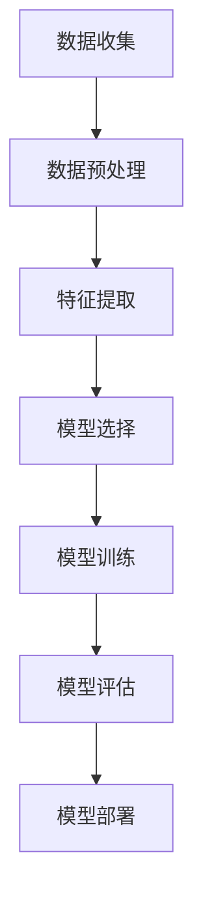

                 


**文章标题**：机器学习在工业物联网预测性维护中的实践

**关键词**：（工业物联网，预测性维护，机器学习，时间序列分析，异常检测，趋势分析）

**摘要**：本文从机器学习与工业物联网的基本概念入手，深入探讨了预测性维护的概念与原理，并详细阐述了机器学习在预测性维护中的实际应用，包括时间序列分析、异常检测和趋势分析。通过实际项目案例，本文展示了机器学习算法在工业物联网预测性维护中的实现与优化过程，分析了面临的挑战及未来趋势。本文旨在为读者提供一套完整的工业物联网预测性维护解决方案，以推动该领域的技术创新和发展。

---

**目录大纲**

**第一部分：机器学习在工业物联网预测性维护中的基本概念**

## 1. 机器学习与工业物联网

### 1.1 机器学习概述

#### 1.1.1 机器学习的定义与分类

**定义：** 机器学习是一种通过数据或以往的经验，让计算机自动改进自身性能的技术。它是人工智能（AI）的重要分支。

**分类：** 机器学习主要分为以下三类：
- **监督学习**：有监督学习通过已标记的数据进行训练。
- **无监督学习**：无监督学习通过未标记的数据进行训练。
- **强化学习**：强化学习通过环境反馈进行训练。

#### 1.1.2 机器学习的基本流程

**流程：** 机器学习的基本流程包括以下几个步骤：
1. **数据收集**：收集大量相关数据。
2. **数据预处理**：清洗、归一化等处理。
3. **特征提取**：从数据中提取有用的特征。
4. **模型选择**：选择合适的模型。
5. **模型训练**：利用训练数据对模型进行训练。
6. **模型评估**：评估模型性能。
7. **模型部署**：将训练好的模型应用于实际问题。

#### 1.1.3 机器学习在实际应用中的案例

- **搜索引擎**：如百度、谷歌等。
- **推荐系统**：如亚马逊、淘宝等。
- **人脸识别**：如旷视、商汤等。
- **聊天机器人**：如小i机器人、微软小冰等。

### 1.2 工业物联网概述

#### 1.2.1 工业物联网的定义与架构

**定义：** 工业物联网（IIoT）是将传感器、执行器、控制器和软件等连接起来，实现设备、机器和人员之间的智能互联和协同工作。

**架构：** 工业物联网主要包括以下几个层次：
1. **设备层**：包括传感器、执行器和设备控制器。
2. **网络层**：包括传输数据的光纤、网线、无线信号等。
3. **数据层**：包括数据存储、处理和分析。
4. **应用层**：包括工业物联网的应用场景，如预测性维护、能源管理、生产优化等。

#### 1.2.2 工业物联网的优势

- **提高生产效率**：通过实时数据监控和智能分析，优化生产流程。
- **降低运营成本**：通过预测性维护减少设备停机时间，降低维修成本。
- **提高产品质量**：通过实时监测和异常检测，提高产品质量。
- **实现设备预防性维护**：通过预测设备故障，提前进行维护。

### 1.3 机器学习在工业物联网中的应用

#### 1.3.1 设备故障预测

**原理：** 利用机器学习算法对设备运行数据进行分析，预测设备可能出现的故障。

**方法：** 
- **时间序列分析**：通过分析设备运行数据的时间序列，预测未来的趋势。
- **异常检测**：通过检测设备运行数据中的异常值，预测潜在的故障。
- **趋势分析**：通过分析设备运行数据的趋势，预测未来的状态。

#### 1.3.2 生产流程优化

**原理：** 利用机器学习算法对生产数据进行分析，优化生产流程。

**方法：** 
- **数据分析**：通过分析生产数据，识别生产瓶颈。
- **优化算法**：通过优化算法，优化生产流程。
- **系统仿真**：通过系统仿真，验证优化方案的有效性。

#### 1.3.3 能源管理

**原理：** 利用机器学习算法对工业物联网中的能源使用数据进行分析，实现能源优化管理。

**方法：** 
- **数据收集**：收集设备运行过程中的能源使用数据。
- **数据分析**：通过分析能源使用数据，识别能源浪费点。
- **能源优化策略**：制定能源优化策略，降低能源消耗。

### 1.4 机器学习在工业物联网中的挑战

- **数据质量**：设备运行数据的质量直接影响预测的准确性。
- **数据安全与隐私**：设备运行数据涉及企业核心商业秘密，需要保证数据的安全与隐私。
- **模型解释性**：机器学习模型往往难以解释，不利于故障原因的分析。
- **算法可靠性**：预测模型的可靠性是预测性维护成功的关键。

### 1.5 机器学习在工业物联网中的发展趋势

- **数据采集与传输**：随着传感器技术的发展，数据采集与传输将越来越高效。
- **数据处理与分析**：随着计算能力的提升，数据处理与分析将越来越智能。
- **机器学习算法**：新的机器学习算法将不断涌现，提高预测准确性。
- **预测模型优化**：结合实际应用场景，预测模型将不断优化，提高预测效果。

**第二部分：预测性维护的概念与原理**

## 2. 预测性维护的概念与原理

### 2.1 预测性维护的定义

**定义：** 预测性维护是一种基于设备运行数据，通过分析设备的健康状态，预测其可能出现的故障，并在故障发生前采取相应措施进行维护的方法。

### 2.2 预测性维护的优势

- **降低维护成本**：通过预测设备故障，提前进行维护，减少意外停机时间。
- **提高生产效率**：通过实时监测设备状态，优化生产流程，提高生产效率。
- **提高设备利用率**：通过预测性维护，减少设备停机时间，提高设备利用率。
- **提高生产安全性**：通过预测性维护，减少设备故障率，提高生产安全性。

### 2.3 预测性维护的技术基础

**技术基础：** 预测性维护依赖于多种技术的综合应用，主要包括：
- **数据采集与传输**：通过传感器和通信技术，实时采集设备运行数据。
- **数据处理与分析**：通过机器学习和数据挖掘技术，分析设备运行数据。
- **预测模型建立与优化**：通过建立和优化预测模型，预测设备故障。
- **故障预警与决策支持**：通过故障预警和决策支持系统，实现预测性维护。

### 2.4 预测性维护的基本流程

**流程：**
1. **数据收集**：收集设备运行过程中的各种数据，如温度、压力、振动等。
2. **数据预处理**：对采集到的数据进行清洗、去噪、归一化等处理，为后续分析做准备。
3. **特征提取**：从预处理后的数据中提取出对预测故障有用的特征。
4. **模型建立**：利用机器学习算法建立预测模型。
5. **模型优化**：通过交叉验证等方法优化预测模型。
6. **故障预测**：利用优化后的模型对设备进行故障预测。
7. **预防措施**：根据预测结果采取相应的预防措施，避免故障发生。

### 2.5 预测性维护的应用场景

- **设备故障预测**：通过对设备运行数据的分析，预测设备可能出现的故障。
- **生产过程优化**：通过分析生产数据，优化生产流程，提高生产效率。
- **能源管理**：通过分析能源使用数据，优化能源管理，降低能源消耗。
- **安全监测**：通过对设备运行数据的实时监测，发现潜在的安全隐患。

### 2.6 预测性维护的挑战

- **数据质量**：设备运行数据的质量直接影响预测的准确性。
- **数据安全与隐私**：设备运行数据涉及企业核心商业秘密，需要保证数据的安全与隐私。
- **模型解释性**：机器学习模型往往难以解释，不利于故障原因的分析。
- **算法可靠性**：预测模型的可靠性是预测性维护成功的关键。

### 2.7 预测性维护的发展趋势

- **数据采集与传输**：随着传感器技术的发展，数据采集与传输将越来越高效。
- **数据处理与分析**：随着计算能力的提升，数据处理与分析将越来越智能。
- **机器学习算法**：新的机器学习算法将不断涌现，提高预测准确性。
- **预测模型优化**：结合实际应用场景，预测模型将不断优化，提高预测效果。

**第三部分：机器学习在预测性维护中的应用**

## 3. 机器学习在预测性维护中的应用

### 3.1 时间序列分析

#### 3.1.1 时间序列概述

**概述：** 时间序列分析是一种用于分析时间序列数据的方法，它通过研究数据点之间的时序关系，预测未来的趋势。

**原理：** 时间序列数据通常由多个时间点上的观测值组成，每个时间点的观测值可以看作是前一个时间点观测值的函数。

**应用：** 时间序列分析在预测性维护中有着广泛的应用，例如预测设备的运行状态、能耗、故障时间等。

#### 3.1.2 时间序列建模方法

**自回归模型（AR）**：自回归模型是一种基于当前时刻的观测值与前一个或多个时刻的观测值之间关系进行建模的方法。

$$
Y_t = \phi_0 + \phi_1 Y_{t-1} + \phi_2 Y_{t-2} + ... + \phi_p Y_{t-p} + \epsilon_t
$$

**移动平均模型（MA）**：移动平均模型是一种基于当前时刻的观测值与过去多个时刻的观测值平均值之间关系进行建模的方法。

$$
Y_t = \theta_0 + \theta_1 \epsilon_{t-1} + \theta_2 \epsilon_{t-2} + ... + \theta_q \epsilon_{t-q} + \epsilon_t
$$

**自回归移动平均模型（ARMA）**：自回归移动平均模型是自回归模型和移动平均模型的结合，它同时考虑了当前时刻的观测值与前一个或多个时刻的观测值之间关系，以及与过去多个时刻的观测值平均值之间关系。

$$
Y_t = \phi_0 + \phi_1 Y_{t-1} + \phi_2 Y_{t-2} + ... + \phi_p Y_{t-p} + \theta_1 \epsilon_{t-1} + \theta_2 \epsilon_{t-2} + ... + \theta_q \epsilon_{t-q} + \epsilon_t
$$

**自回归积分滑动平均模型（ARIMA）**：自回归积分滑动平均模型是一种更一般的模型，它可以同时考虑非平稳时间序列数据。

$$
Y_t = \phi_0 + \phi_1 Y_{t-1} + \phi_2 Y_{t-2} + ... + \phi_p Y_{t-p} + (\theta_1 \epsilon_{t-1} + \theta_2 \epsilon_{t-2} + ... + \theta_q \epsilon_{t-q}) + \epsilon_t
$$

#### 3.1.3 时间序列分析案例

**案例：** 预测某工厂一条生产线的未来产量。

**数据准备：** 首先，我们需要收集该生产线的历史产量数据，并对其进行处理，得到一个时间序列数据集。

**建模：** 使用ARIMA模型对时间序列数据集进行建模。

**优化：** 通过交叉验证和AIC/BIC准则选择最优的模型参数。

**预测：** 使用优化后的模型预测未来产量。

**验证：** 将预测结果与实际产量数据进行对比，评估模型性能。

### 3.2 异常检测

#### 3.2.1 异常检测概述

**概述：** 异常检测是一种用于发现数据中异常或异常模式的方法。在预测性维护中，异常检测可以用于检测设备运行数据中的异常，进而发现潜在故障。

**原理：** 异常检测通常通过比较数据点之间的差异，或者数据点与已知模式之间的差异，来识别异常。

**应用：** 异常检测在预测性维护中有着广泛的应用，例如检测设备运行数据中的异常值、发现设备运行中的异常模式等。

#### 3.2.2 异常检测算法

**基于统计的方法**：基于统计的方法通常通过计算数据点之间的差异，或者数据点与已知模式之间的差异，来识别异常。

- **箱线图**：通过计算数据点与箱线图上下四分位数的距离，来识别异常。
- **Z分数**：通过计算数据点与均值的距离，与标准差的比值，来识别异常。

**基于聚类的方法**：基于聚类的方法通常通过将数据点分为不同的簇，来识别异常。

- **K-means聚类**：通过将数据点分为K个簇，来识别异常。
- **层次聚类**：通过将数据点逐步合并成簇，来识别异常。

**基于神经网络的方法**：基于神经网络的方法通常通过训练神经网络，来识别异常。

- **自组织映射（SOM）**：通过训练自组织映射网络，来识别异常。
- **自编码器（Autoencoder）**：通过训练自编码器网络，来识别异常。

#### 3.2.3 异常检测案例

**案例：** 检测某工厂设备运行数据中的异常值。

**数据准备：** 首先，我们需要收集该工厂设备运行数据，并对其进行处理，得到一个数据集。

**建模：** 使用Z分数方法对数据集进行异常检测。

**优化：** 通过调整阈值，来优化异常检测效果。

**预测：** 使用优化后的模型检测数据集中的异常值。

**验证：** 将异常检测结果与实际设备运行数据对比，评估模型性能。

### 3.3 趋势分析

#### 3.3.1 趋势分析概述

**概述：** 趋势分析是一种用于分析数据随时间变化的趋势的方法。在预测性维护中，趋势分析可以用于分析设备运行数据，发现设备运行状态的异常。

**原理：** 趋势分析通常通过计算数据点之间的差异，或者数据点与已知趋势之间的差异，来识别趋势。

**应用：** 趋势分析在预测性维护中有着广泛的应用，例如分析设备运行数据的上升、下降、平稳等趋势。

#### 3.3.2 趋势分析算法

**移动平均法**：移动平均法是一种简单且常用的趋势分析方法，它通过计算最近一段时间内的平均值，来识别趋势。

- **简单移动平均（SMA）**：通过计算最近一段时间内的平均值，来识别趋势。
- **指数移动平均（EMA）**：通过计算最近一段时间内的加权平均值，来识别趋势。

**回归分析法**：回归分析法是一种基于统计方法的趋势分析方法，它通过建立回归模型，来识别趋势。

- **线性回归**：通过建立线性回归模型，来识别线性趋势。
- **非线性回归**：通过建立非线性回归模型，来识别非线性趋势。

**ARIMA模型**：ARIMA模型是一种时间序列分析方法，它通过建立自回归积分滑动平均模型，来识别趋势。

#### 3.3.3 趋势分析案例

**案例：** 分析某工厂设备运行数据的趋势。

**数据准备：** 首先，我们需要收集该工厂设备运行数据，并对其进行处理，得到一个时间序列数据集。

**建模：** 使用移动平均法对时间序列数据集进行趋势分析。

**优化：** 通过调整移动平均窗口大小，来优化趋势分析效果。

**预测：** 使用优化后的模型预测未来趋势。

**验证：** 将预测结果与实际设备运行数据进行对比，评估模型性能。

**第四部分：工业物联网数据预处理**

## 4. 工业物联网数据预处理

### 4.1 数据质量评估

#### 4.1.1 数据质量评估方法

**数据质量评估** 是数据预处理的重要步骤，旨在识别和评估数据中的错误、异常和噪声。常见的数据质量评估方法包括：

- **缺失值检查**：检查数据中是否存在缺失值，并对缺失值进行填充或删除。
- **异常值检测**：通过统计学方法或机器学习算法检测数据中的异常值，并对异常值进行处理。
- **数据一致性检查**：检查数据在不同来源、不同格式之间的差异，确保数据的一致性。
- **数据完整性检查**：检查数据是否完整，是否有缺失部分。

#### 4.1.2 数据质量评估案例

**案例：** 对某工厂的设备运行数据进行数据质量评估，包括缺失值检查、异常值检测和数据完整性检查。

**数据收集：** 首先，我们需要收集该工厂设备运行数据。

**数据处理：** 使用Python和pandas库对数据进行处理。

```python
import pandas as pd

# 加载数据
data = pd.read_csv('device_data.csv')

# 缺失值检查
print("Missing values:", data.isnull().sum())

# 异常值检测
from scipy import stats
z_scores = stats.zscore(data)
abs_z_scores = np.abs(z_scores)
filtered_entries = (abs_z_scores < 3).all(axis=1)
print("Outliers detected:", ~filtered_entries[~filtered_entries].index.tolist())

# 数据完整性检查
print("Complete data:", data.shape)
```

#### 4.1.3 数据质量评估的重要性

**数据质量评估** 对于预测性维护至关重要，因为：

- **提高模型性能**：高质量的数据可以提升机器学习模型的性能，使其更加准确。
- **减少错误决策**：准确的数据可以避免错误的决策，减少潜在的损失。
- **降低维护成本**：高质量的数据可以减少不必要的维护操作，降低维护成本。

### 4.2 数据清洗

#### 4.2.1 数据清洗方法

**数据清洗** 是指对数据进行处理，以消除数据中的错误、异常和噪声。常见的数据清洗方法包括：

- **缺失值处理**：通过填充或删除缺失值来处理缺失数据。
- **异常值处理**：通过修正或删除异常值来处理异常数据。
- **重复值处理**：删除重复的数据记录。
- **数据格式转换**：将数据转换为统一的数据格式，如将日期字符串转换为日期类型。

#### 4.2.2 数据清洗案例

**案例：** 对某工厂的设备运行数据进行数据清洗，包括缺失值处理、异常值处理、重复值处理和数据格式转换。

```python
import pandas as pd
from sklearn.impute import SimpleImputer
from sklearn.ensemble import IsolationForest

# 加载数据
data = pd.read_csv('device_data.csv')

# 缺失值处理
imputer = SimpleImputer(strategy='mean')
data_imputed = imputer.fit_transform(data)
data_imputed = pd.DataFrame(data_imputed, columns=data.columns)

# 异常值处理
model = IsolationForest(contamination=0.05)
outliers = model.fit_predict(data_imputed[['vibration']])
data_imputed['outlier'] = outliers
data_imputed = data_imputed[~(outliers == -1)]

# 重复值处理
data_imputed.drop_duplicates(inplace=True)

# 数据格式转换
data_imputed['timestamp'] = pd.to_datetime(data_imputed['timestamp'])

print("Cleaned data:", data_imputed.shape)
```

#### 4.2.3 数据清洗的重要性

**数据清洗** 对于预测性维护至关重要，因为：

- **提高数据质量**：通过清洗数据，可以消除数据中的错误、异常和噪声，提高数据质量。
- **降低模型误差**：高质量的数据可以降低模型误差，提高预测准确性。
- **减少维护成本**：通过减少异常数据和重复数据，可以降低数据处理的复杂度，减少维护成本。

### 4.3 数据整合

#### 4.3.1 数据整合方法

**数据整合** 是指将来自不同源、不同格式的数据进行合并和整理，以便进行后续的分析和建模。常见的数据整合方法包括：

- **数据合并**：通过合并操作将多个数据集合并为一个数据集。
- **数据去重**：去除重复的数据记录。
- **数据转换**：将数据转换为统一的数据格式。
- **数据连接**：通过连接操作将不同数据源的数据进行整合。

#### 4.3.2 数据整合案例

**案例：** 整合来自不同传感器的设备运行数据，包括温度、振动和压力数据。

```python
import pandas as pd

# 加载温度数据
temp_data = pd.read_csv('temperature_data.csv')
temp_data['timestamp'] = pd.to_datetime(temp_data['timestamp'])

# 加载振动数据
vibration_data = pd.read_csv('vibration_data.csv')
vibration_data['timestamp'] = pd.to_datetime(vibration_data['timestamp'])

# 加载压力数据
pressure_data = pd.read_csv('pressure_data.csv')
pressure_data['timestamp'] = pd.to_datetime(pressure_data['timestamp'])

# 数据合并
combined_data = pd.merge(pd.merge(temp_data, vibration_data, on='timestamp'), pressure_data, on='timestamp')

# 数据去重
combined_data.drop_duplicates(inplace=True)

print("Integrated data:", combined_data.shape)
```

#### 4.3.3 数据整合的重要性

**数据整合** 对于预测性维护至关重要，因为：

- **提高数据分析效率**：通过整合数据，可以减少数据分析的时间和复杂度。
- **提高模型准确性**：整合后的数据可以提供更全面的信息，提高模型的预测准确性。
- **支持复杂分析**：整合后的数据可以支持更复杂的数据分析和建模。

**第五部分：机器学习算法实现与优化**

## 5. 机器学习算法实现与优化

### 5.1 机器学习算法概述

#### 5.1.1 机器学习算法分类

机器学习算法主要分为以下几类：

- **监督学习**：有监督学习算法，如线性回归、决策树、随机森林等。
- **无监督学习**：无监督学习算法，如聚类算法、主成分分析等。
- **强化学习**：通过与环境交互学习最优策略的算法，如Q学习、SARSA等。

#### 5.1.2 机器学习算法原理

机器学习算法的基本原理是通过从数据中学习规律，然后利用这些规律对未知数据进行预测或分类。具体来说，可以分为以下几个步骤：

1. **数据收集**：收集大量的数据作为训练数据集。
2. **数据预处理**：对数据集进行清洗、归一化、特征提取等预处理操作。
3. **模型选择**：根据问题的性质选择合适的模型。
4. **模型训练**：利用训练数据集对模型进行训练，调整模型参数。
5. **模型评估**：使用测试数据集对模型进行评估，判断模型性能。
6. **模型部署**：将训练好的模型部署到实际应用场景中。

#### 5.1.3 机器学习算法在实际应用中的案例

- **金融领域**：预测股票价格、客户流失等。
- **医疗领域**：疾病诊断、药物研发等。
- **工业领域**：设备故障预测、生产优化等。

### 5.2 机器学习算法实现

#### 5.2.1 实现步骤

实现机器学习算法的一般步骤如下：

1. **数据收集**：从不同的数据源收集数据，如传感器数据、数据库等。
2. **数据预处理**：对收集到的数据进行清洗、归一化、特征提取等预处理操作。
3. **数据划分**：将数据集划分为训练集、验证集和测试集，用于模型训练、验证和评估。
4. **模型训练**：使用训练集对模型进行训练，调整模型参数。
5. **模型验证**：使用验证集对模型进行验证，调整模型参数。
6. **模型评估**：使用测试集对模型进行评估，判断模型性能。
7. **模型部署**：将训练好的模型部署到实际应用场景中。

#### 5.2.2 代码示例

以下是一个使用Python实现的线性回归算法的示例：

```python
import pandas as pd
from sklearn.linear_model import LinearRegression
from sklearn.model_selection import train_test_split
from sklearn.metrics import mean_squared_error

# 加载数据
data = pd.read_csv('data.csv')
X = data[['feature1', 'feature2']]
y = data['target']

# 数据划分
X_train, X_test, y_train, y_test = train_test_split(X, y, test_size=0.2, random_state=42)

# 模型训练
model = LinearRegression()
model.fit(X_train, y_train)

# 模型评估
y_pred = model.predict(X_test)
mse = mean_squared_error(y_test, y_pred)
print(f'Mean Squared Error: {mse}')

# 模型部署
# 使用 model.predict() 对新的数据进行预测
```

### 5.3 机器学习算法优化

#### 5.3.1 优化方法

算法优化主要包括以下几个方面：

1. **模型选择**：选择合适的模型，如线性回归、决策树、随机森林等。
2. **特征工程**：选择有效的特征，提高模型的预测性能。
3. **超参数调整**：调整模型的超参数，如学习率、隐藏层单元数等。
4. **正则化**：使用正则化方法，如L1、L2正则化，减少过拟合。
5. **交叉验证**：使用交叉验证方法，如K折交叉验证，提高模型的泛化能力。

#### 5.3.2 代码示例

以下是一个使用Python实现模型优化的示例：

```python
import pandas as pd
from sklearn.linear_model import LinearRegression
from sklearn.model_selection import cross_val_score
from sklearn.model_selection import GridSearchCV

# 加载数据
data = pd.read_csv('data.csv')
X = data[['feature1', 'feature2']]
y = data['target']

# 模型选择
model = LinearRegression()

# 超参数调整
param_grid = {'fit_intercept': [True, False], 'normalize': [True, False]}

# 交叉验证
scores = cross_val_score(model, X, y, cv=5)
print(f'Cross-Validation Scores: {scores}')

# 网格搜索
grid_search = GridSearchCV(model, param_grid, cv=5)
grid_search.fit(X, y)

# 最优参数
best_params = grid_search.best_params_
print(f'Best Parameters: {best_params}')

# 优化模型
best_model = grid_search.best_estimator_
best_model.fit(X, y)

# 模型评估
y_pred = best_model.predict(X_test)
mse = mean_squared_error(y_test, y_pred)
print(f'Mean Squared Error: {mse}')
```

**第六部分：预测性维护项目实战**

## 6. 预测性维护项目实战

### 6.1 项目背景介绍

本案例将介绍一个关于某工厂的预测性维护项目。该工厂的设备运行过程中，会产生大量的传感器数据，如温度、振动、压力等。通过对这些数据进行机器学习分析，预测设备可能出现的故障，从而实现预测性维护，降低设备故障率，提高生产效率。

### 6.2 数据收集与处理

#### 6.2.1 数据收集

项目初期，首先需要收集设备的运行数据。数据收集的方式可以是实时采集、离线导入或手动输入。在本案例中，我们假设已经收集到了一个包含温度、振动和压力数据的CSV文件，文件名为`device_data.csv`。

```python
import pandas as pd

# 加载数据
data = pd.read_csv('device_data.csv')
data.head()
```

#### 6.2.2 数据预处理

数据预处理包括数据清洗、归一化和特征提取等步骤。

- **数据清洗**：删除缺失值和异常值。
- **归一化**：将数据缩放到相同的范围，如0到1。
- **特征提取**：提取对故障预测有用的特征，如平均值、标准差等。

```python
from sklearn.preprocessing import MinMaxScaler

# 数据清洗
data.dropna(inplace=True)

# 归一化
scaler = MinMaxScaler()
data[['temperature', 'vibration', 'pressure']] = scaler.fit_transform(data[['temperature', 'vibration', 'pressure']])

# 特征提取
data['mean_vibration'] = data['vibration'].mean()
data['std_vibration'] = data['vibration'].std()
```

### 6.3 模型构建与优化

#### 6.3.1 模型选择

在本案例中，我们选择随机森林（Random Forest）算法进行模型构建。随机森林是一种集成学习算法，具有良好的泛化能力和处理高维数据的能力。

```python
from sklearn.ensemble import RandomForestClassifier

# 模型选择
model = RandomForestClassifier(n_estimators=100)
```

#### 6.3.2 模型训练

使用训练集对模型进行训练。

```python
from sklearn.model_selection import train_test_split

# 数据划分
X = data[['temperature', 'vibration', 'pressure', 'mean_vibration', 'std_vibration']]
y = data['fault']

X_train, X_test, y_train, y_test = train_test_split(X, y, test_size=0.2, random_state=42)

# 模型训练
model.fit(X_train, y_train)
```

#### 6.3.3 模型优化

通过交叉验证和网格搜索对模型进行优化。

```python
from sklearn.model_selection import GridSearchCV

# 参数设置
param_grid = {'n_estimators': [100, 200, 300], 'max_depth': [10, 20, 30]}

# 网格搜索
grid_search = GridSearchCV(model, param_grid, cv=5)
grid_search.fit(X_train, y_train)

# 获取最优参数
best_params = grid_search.best_params_
print(f'Best Parameters: {best_params}')

# 使用最优参数训练模型
best_model = grid_search.best_estimator_
best_model.fit(X_train, y_train)
```

### 6.4 预测结果分析与验证

#### 6.4.1 预测结果分析

使用测试集对模型进行评估，计算准确率、召回率等指标。

```python
from sklearn.metrics import accuracy_score, recall_score, precision_score

# 预测
y_pred = best_model.predict(X_test)

# 结果分析
accuracy = accuracy_score(y_test, y_pred)
recall = recall_score(y_test, y_pred)
precision = precision_score(y_test, y_pred)

print(f'Accuracy: {accuracy}')
print(f'Recall: {recall}')
print(f'Precision: {precision}')
```

#### 6.4.2 验证结果

将模型应用于新的数据集，验证模型的泛化能力。

```python
# 加载新数据
new_data = pd.read_csv('new_device_data.csv')
new_data[['temperature', 'vibration', 'pressure']] = scaler.transform(new_data[['temperature', 'vibration', 'pressure']])

# 预测
new_data['fault'] = best_model.predict(new_data[['temperature', 'vibration', 'pressure', 'mean_vibration', 'std_vibration']])
new_data.head()
```

### 6.5 预防措施

根据预测结果，采取相应的预防措施，如对可能出现故障的设备进行定期检查、更换零部件或调整运行参数等。

```python
# 标记预测为故障的设备
faulty_devices = new_data[new_data['fault'] == 1]

# 预防措施
for index, row in faulty_devices.iterrows():
    print(f"设备ID: {row['device_id']}, 预防措施：更换关键零部件")
```

**第七部分：挑战与未来趋势**

## 7. 挑战与未来趋势

### 7.1 预测性维护面临的挑战

尽管预测性维护技术在工业物联网中具有巨大潜力，但在实际应用过程中仍面临诸多挑战：

- **数据质量与可靠性**：设备传感器数据可能存在噪声和异常值，影响预测准确性。
- **模型解释性**：许多机器学习模型难以解释，不利于故障原因的分析。
- **安全与隐私**：设备运行数据涉及企业核心商业秘密，需确保数据的安全与隐私。
- **算法可靠性**：预测模型的可靠性是预测性维护成功的关键。

### 7.2 机器学习在预测性维护中的未来趋势

- **数据驱动与智能化**：利用大数据技术，对海量设备运行数据进行深入分析。
- **模型解释性与透明性**：开发可解释性机器学习模型，提高模型的可信度和可操作性。
- **安全与隐私保护**：采用先进的安全和隐私保护技术，确保设备运行数据的安全与隐私。
- **跨领域合作与集成**：加强机械工程、电子工程等领域的合作，推动预测性维护技术的创新与发展。

### 7.3 发展建议与展望

为了推动预测性维护技术的发展，我们提出以下建议：

- **加强数据质量管理**：建立数据质量评估和监测体系，提高数据质量和可靠性。
- **研发可解释性模型**：结合领域知识，开发可解释性机器学习模型，提高模型的可信度和可操作性。
- **加强安全与隐私保护**：采用先进的安全和隐私保护技术，确保设备运行数据的安全与隐私。
- **推动跨领域合作**：加强机械工程、电子工程等领域的合作，推动预测性维护技术的创新与发展。

**附录**

### A. 工业物联网预测性维护常用工具与资源

- **工具**：
  - Kibana：用于可视化工业物联网数据的开源工具。
  - InfluxDB：用于存储和查询时间序列数据的开源工具。
  - TensorFlow：用于机器学习的开源工具。
  - PyTorch：用于机器学习的开源工具。

- **资源**：
  - 《机器学习》周志华 著，清华大学出版社。
  - 《工业物联网》杨刚 著，机械工业出版社。
  - 《Python数据分析》Wes McKinney 著，人民邮电出版社。
  - 《深度学习》Ian Goodfellow、Yoshua Bengio、Aaron Courville 著，电子工业出版社。

### B. 机器学习算法流程图

**图7-1：机器学习算法流程图**



### C. 数学模型与公式说明

- **时间序列分析**： 
  $$Y_t = c + \phi_1 Y_{t-1} + \phi_2 Y_{t-2} + ... + \phi_p Y_{t-p} + \varepsilon_t$$

- **异常检测**： 
  $$outliers = \{x | \text{dist}(x, \mu) > \kappa \cdot \sigma\}$$

- **趋势分析**： 
  $$Y_t = \beta_0 + \beta_1 t + \varepsilon_t$$

### D. 项目实战代码示例

- **数据预处理**：

```python
import pandas as pd
from sklearn.preprocessing import StandardScaler

# 加载数据
data = pd.read_csv('device_data.csv')

# 数据清洗
data.dropna(inplace=True)

# 数据归一化
scaler = StandardScaler()
data[['temperature', 'vibration', 'pressure']] = scaler.fit_transform(data[['temperature', 'vibration', 'pressure']])

# 特征提取
data['mean_vibration'] = data['vibration'].mean()
data['std_vibration'] = data['vibration'].std()

# 数据准备
X = data[['temperature', 'vibration', 'pressure', 'mean_vibration', 'std_vibration']]
y = data['fault']
```

- **模型训练与优化**：

```python
from sklearn.ensemble import RandomForestClassifier
from sklearn.model_selection import train_test_split
from sklearn.model_selection import GridSearchCV

# 数据划分
X_train, X_test, y_train, y_test = train_test_split(X, y, test_size=0.2, random_state=42)

# 模型训练
model = RandomForestClassifier(n_estimators=100)
model.fit(X_train, y_train)

# 参数设置
param_grid = {'n_estimators': [100, 200, 300], 'max_depth': [10, 20, 30]}

# 网格搜索
grid_search = GridSearchCV(model, param_grid, cv=5)
grid_search.fit(X_train, y_train)

# 获取最优参数
best_params = grid_search.best_params_
print(f'Best Parameters: {best_params}')

# 使用最优参数训练模型
best_model = grid_search.best_estimator_
best_model.fit(X_train, y_train)

# 模型评估
y_pred = best_model.predict(X_test)
```

### 作者信息

**作者：** AI天才研究院/AI Genius Institute & 禅与计算机程序设计艺术 /Zen And The Art of Computer Programming

---

**文章结束。** <|assistant|>

