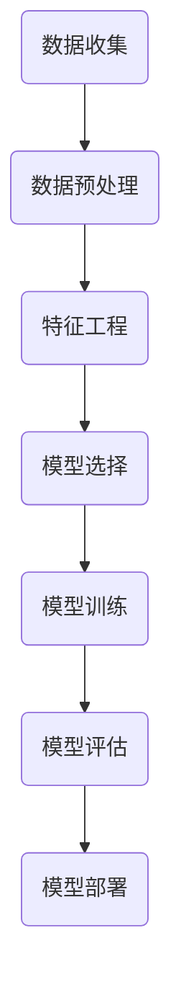
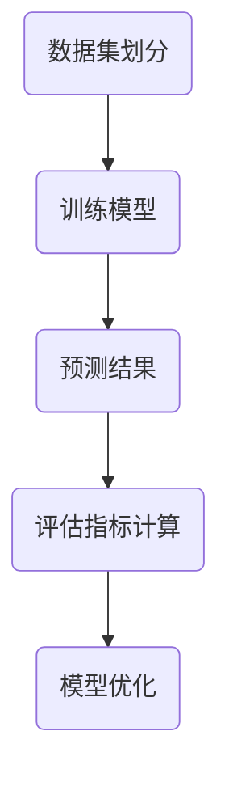

                 

# 《机器学习在欺诈检测中的应用》

> **关键词**：机器学习，欺诈检测，数据预处理，算法，深度学习，案例研究。

> **摘要**：本文深入探讨了机器学习在欺诈检测中的应用，从机器学习的定义和欺诈检测的挑战入手，介绍了数据预处理的重要性，并详细阐述了各种机器学习算法在欺诈检测中的应用。同时，通过实际案例展示了如何使用机器学习模型进行欺诈检测，并讨论了未来的发展方向和挑战。

## 《机器学习在欺诈检测中的应用》目录大纲

### 第一部分：引言与背景

#### 第1章：机器学习与欺诈检测概述

##### 1.1 机器学习的定义与应用

##### 1.2 欺诈检测的挑战与需求

##### 1.3 机器学习在欺诈检测中的历史与发展趋势

### 第二部分：机器学习基础知识

#### 第2章：数据准备与预处理

##### 2.1 数据收集与清洗

##### 2.2 特征工程

##### 2.3 数据可视化

### 第三部分：欺诈检测算法

#### 第3章：统计方法在欺诈检测中的应用

##### 3.1 单变量统计方法

##### 3.2 多变量统计方法

##### 3.3 统计模型的优化与评估

#### 第4章：机器学习方法在欺诈检测中的应用

##### 4.1 监督学习算法

##### 4.2 无监督学习算法

##### 4.3 强化学习算法

#### 第5章：深度学习在欺诈检测中的应用

##### 5.1 卷积神经网络（CNN）的应用

##### 5.2 循环神经网络（RNN）的应用

##### 5.3 生成对抗网络（GAN）的应用

### 第四部分：实际案例分析

#### 第6章：案例一：信用卡欺诈检测

##### 6.1 案例背景

##### 6.2 案例数据集介绍

##### 6.3 模型选择与优化

##### 6.4 实验结果与分析

#### 第7章：案例二：电商交易欺诈检测

##### 7.1 案例背景

##### 7.2 案例数据集介绍

##### 7.3 模型选择与优化

##### 7.4 实验结果与分析

### 第五部分：展望与挑战

#### 第8章：机器学习在欺诈检测中的应用前景

##### 8.1 未来的发展方向

##### 8.2 可能的挑战与解决方案

### 第六部分：附录

#### 第9章：附录

##### 9.1 常用数据集介绍

##### 9.2 常用工具与资源

##### 9.3 参考文献

### 第七部分：Mermaid 流�程图

#### 第10章：机器学习流程图

##### 10.1 欺诈检测流程图

##### 10.2 模型评估流程图

### 第八部分：伪代码

#### 第11章：核心算法伪代码

##### 11.1 特征工程伪代码

##### 11.2 监督学习伪代码

##### 11.3 深度学习伪代码

### 第九部分：数学模型和数学公式

#### 第12章：数学模型与公式

##### 12.1 概率模型

##### 12.2 最优化算法

##### 12.3 深度学习相关公式

### 第十部分：项目实战

#### 第13章：项目实战

##### 13.1 开发环境搭建

##### 13.2 代码实现与分析

##### 13.3 结果分析与优化

### 第十一部分：代码解读与分析

#### 第14章：代码解读与分析

##### 14.1 特征工程代码解读

##### 14.2 模型训练代码解读

##### 14.3 结果评估代码解读

## 第1章：机器学习与欺诈检测概述

### 1.1 机器学习的定义与应用

机器学习是一门人工智能（AI）的分支，其核心是通过数据和算法，使计算机系统能够从数据中学习规律并做出决策。机器学习的主要任务包括分类、回归、聚类、降维等。

#### 概念介绍
- **机器学习**：从数据中学习规律并做出预测或决策的技术。
- **监督学习**：通过标注数据来训练模型，使模型能够预测未知数据。
- **无监督学习**：无需标注数据，通过挖掘数据中的内在结构来发现规律。
- **强化学习**：通过与环境互动来学习最优策略。

#### 应用案例
- **金融领域**：欺诈检测、风险评估、算法交易。
- **电商领域**：推荐系统、商品分类、客户流失预测。
- **零售行业**：库存管理、供应链优化、市场细分。

### 1.2 欺诈检测的挑战与需求

欺诈检测是金融、电商等行业的重要需求。欺诈行为具有隐蔽性、多变性和欺骗性，使得传统的规则方法难以应对。机器学习在欺诈检测中具有以下挑战和需求：

#### 挑战
- **欺诈行为的特点**：欺诈行为变化多端，难以用固定的规则捕捉。
- **数据集的不平衡问题**：正常交易与欺诈交易的数据量通常不平衡。
- **实时性要求**：欺诈检测需要实时响应，提高检测效率。

#### 需求
- **高准确性**：降低误报率和漏报率。
- **低误报率**：减少对正常交易的误判。
- **实时响应能力**：快速处理大量交易数据。

### 1.3 机器学习在欺诈检测中的历史与发展趋势

#### 历史回顾
- **早期欺诈检测方法**：基于规则的专家系统、人工神经网络。
- **机器学习在欺诈检测中的初期应用**：支持向量机、决策树、随机森林。
- **机器学习在欺诈检测中的成熟应用**：深度学习、强化学习、集成方法。

#### 发展趋势
- **新算法的研发与应用**：深度强化学习、对抗性生成网络。
- **大数据与云计算的助力**：处理大规模数据，提高模型性能。
- **深度学习在欺诈检测中的应用前景**：模型复杂度提高，准确率提升。

## 第2章：数据准备与预处理

数据准备与预处理是机器学习项目中的关键步骤，直接影响模型的性能和泛化能力。本节将介绍数据收集、数据清洗、特征工程和数据可视化等方面的内容。

### 2.1 数据收集与清洗

#### 数据收集
- **数据源的选择**：选择可靠的数据来源，确保数据的真实性和完整性。
- **数据采集的方法**：使用API、Web爬虫或数据库连接等方式获取数据。

#### 数据清洗
- **缺失值的处理**：通过填充、删除或插值等方法处理缺失值。
- **异常值的检测与处理**：使用统计方法或可视化方法检测异常值，并进行处理。
- **数据格式化**：统一数据格式，确保数据的一致性和兼容性。

### 2.2 特征工程

#### 特征提取
- **传统特征提取方法**：统计特征、文本特征、图像特征等。
- **现代特征提取方法**：使用深度学习、生成模型等方法提取特征。

#### 特征选择
- **重要性评估**：通过信息增益、特征重要性等方法评估特征的重要性。
- **特征筛选方法**：使用过滤法、包裹法、嵌入式方法等筛选特征。

### 2.3 数据可视化

#### 数据可视化工具
- **Python中的Matplotlib**：用于绘制各种图表，如折线图、散点图、柱状图等。
- **Seaborn**：基于Matplotlib，提供更丰富的可视化模板。

#### 可视化分析
- **数据分布分析**：通过箱线图、直方图等分析数据分布。
- **关联性分析**：通过热力图、散点图等分析特征之间的关联性。

## 第3章：统计方法在欺诈检测中的应用

统计方法在欺诈检测中具有悠久的历史，其在处理大量数据和识别欺诈模式方面表现出色。本节将介绍单变量统计方法、多变量统计方法和统计模型的优化与评估。

### 3.1 单变量统计方法

单变量统计方法主要针对单个特征进行分析，通过比较欺诈交易和正常交易的统计特征来识别欺诈行为。

#### 单变量分析
- **单变量统计测试**：使用t检验、卡方检验等方法比较欺诈交易和正常交易的特征差异。
- **单变量分析在欺诈检测中的应用**：识别交易金额、交易时间等特征与欺诈行为的关系。

### 3.2 多变量统计方法

多变量统计方法考虑多个特征之间的关系，通过构建模型来识别欺诈行为。

#### 多变量分析
- **主成分分析（PCA）**：降维技术，将多个特征映射到少数几个主成分上。
- **聚类分析**：将数据分为多个类别，识别潜在的欺诈模式。
- **多变量分析在欺诈检测中的应用**：通过综合分析多个特征，提高欺诈检测的准确性。

### 3.3 统计模型的优化与评估

统计模型的优化与评估是提高模型性能的重要步骤。

#### 模型优化
- **模型调参**：调整模型参数，优化模型性能。
- **模型融合**：将多个模型融合，提高整体性能。

#### 模型评估
- **准确率**：预测正确的交易数量与总交易数量的比例。
- **召回率**：预测为欺诈的交易中实际为欺诈的交易比例。
- **F1 分数**：准确率和召回率的调和平均值。

## 第4章：机器学习方法在欺诈检测中的应用

机器学习方法在欺诈检测中取得了显著的成果，其通过自动学习复杂模式，提高了欺诈检测的准确性。本节将介绍监督学习算法、无监督学习算法和强化学习算法在欺诈检测中的应用。

### 4.1 监督学习算法

监督学习算法通过已标注的数据训练模型，然后使用模型对未知数据进行预测。

#### 算法介绍
- **支持向量机（SVM）**：通过找到最优的超平面将不同类别的数据分开。
- **决策树**：通过一系列规则对数据进行分类。
- **随机森林**：通过构建多棵决策树并合并预测结果来提高模型的准确性。

#### 算法应用
- **欺诈检测中的监督学习方法**：使用监督学习算法对交易数据进行分析，识别潜在的欺诈行为。

### 4.2 无监督学习算法

无监督学习算法不依赖已标注的数据，通过数据自身的结构进行学习。

#### 算法介绍
- **聚类算法**：将相似的数据点划分为同一类别。
- **异常检测算法**：识别数据中的异常值或异常模式。

#### 算法应用
- **欺诈检测中的无监督学习方法**：通过无监督学习算法发现数据中的欺诈模式，提高检测准确性。

### 4.3 强化学习算法

强化学习算法通过与环境互动，学习最优策略。

#### 算法介绍
- **强化学习的基本概念**：通过奖励和惩罚来指导学习过程。
- **Q-学习**：使用Q值函数来评估策略。
- **模型评估方法**：通过评估指标来评估模型的性能。

#### 算法应用
- **强化学习在欺诈检测中的应用**：通过强化学习算法，动态调整检测策略，提高欺诈检测的准确性。

## 第5章：深度学习在欺诈检测中的应用

深度学习在处理复杂数据和提取特征方面具有优势，其在欺诈检测中得到了广泛应用。本节将介绍卷积神经网络（CNN）、循环神经网络（RNN）和生成对抗网络（GAN）在欺诈检测中的应用。

### 5.1 卷积神经网络（CNN）的应用

卷积神经网络通过卷积操作提取图像数据中的特征。

#### CNN原理
- **卷积层**：通过卷积操作提取特征。
- **池化层**：减小特征图的尺寸，减少参数数量。
- **全连接层**：将特征映射到输出结果。

#### 应用场景
- **图像数据处理**：使用CNN对图像数据进行分类和识别。

### 5.2 循环神经网络（RNN）的应用

循环神经网络通过循环结构处理序列数据。

#### RNN原理
- **RNN的基本结构**：通过循环结构保持长期依赖信息。
- **长短期记忆网络（LSTM）**：解决RNN中的梯度消失问题。
- **门控循环单元（GRU）**：简化LSTM结构，提高计算效率。

#### 应用场景
- **序列数据处理**：使用RNN处理交易时间序列数据。

### 5.3 生成对抗网络（GAN）的应用

生成对抗网络由生成器和判别器组成，通过对抗训练提取数据特征。

#### GAN原理
- **生成器和判别器**：生成器和判别器相互竞争。
- **GAN的训练过程**：通过调整生成器和判别器的参数，提高生成器的生成质量。

#### 应用场景
- **数据增强**：使用GAN生成更多的训练数据。
- **欺诈行为模拟**：通过GAN模拟欺诈行为，提高模型的鲁棒性。

## 第6章：案例一：信用卡欺诈检测

### 6.1 案例背景

信用卡欺诈检测是金融领域的重要应用之一。信用卡欺诈行为不仅损害银行的利益，还可能对持卡人造成经济损失。因此，如何准确、高效地检测信用卡欺诈行为成为金融行业关注的焦点。

#### 数据集介绍
- **数据来源**：KDD Cup 99 数据集，包含信用卡交易数据。
- **数据特点**：数据包含特征、交易金额、交易时间等，欺诈交易与正常交易的比例约为0.172%。

#### 案例目标
- **构建欺诈检测模型**：使用机器学习算法构建欺诈检测模型。
- **评估模型性能**：评估模型的准确率、召回率等性能指标。

### 6.2 模型选择与优化

#### 模型选择
- **监督学习算法**：使用决策树、随机森林、支持向量机等算法。
- **深度学习模型**：使用卷积神经网络、循环神经网络等模型。

#### 模型优化
- **超参数调优**：通过网格搜索、随机搜索等方法调整模型参数。
- **特征工程优化**：通过特征选择、特征转换等方法提高模型性能。

### 6.3 实验结果与分析

#### 结果展示
- **准确率**：模型在测试集上的准确率。
- **召回率**：模型检测到的欺诈交易中实际为欺诈的交易比例。
- **F1 分数**：准确率和召回率的调和平均值。

#### 分析与讨论
- **结果的合理性分析**：讨论模型在不同算法和参数设置下的性能表现。
- **模型的改进方向**：讨论模型存在的问题和改进方案。

## 第7章：案例二：电商交易欺诈检测

### 7.1 案例背景

电商交易欺诈检测是电商行业的重要需求。电商平台的交易数据量大，欺诈行为复杂多样，如何准确、高效地检测欺诈交易成为电商行业面临的挑战。

#### 数据集介绍
- **数据来源**：电商交易数据集，包含用户信息、交易金额、交易时间等。
- **数据特点**：数据包含正常交易和欺诈交易，欺诈交易与正常交易的比例较高。

#### 案例目标
- **构建欺诈检测模型**：使用机器学习算法构建欺诈检测模型。
- **评估模型性能**：评估模型的准确率、召回率等性能指标。

### 7.2 模型选择与优化

#### 模型选择
- **机器学习算法**：使用决策树、支持向量机、随机森林等算法。
- **深度学习模型**：使用卷积神经网络、循环神经网络等模型。

#### 模型优化
- **超参数调优**：通过网格搜索、随机搜索等方法调整模型参数。
- **特征工程优化**：通过特征选择、特征转换等方法提高模型性能。

### 7.3 实验结果与分析

#### 结果展示
- **准确率**：模型在测试集上的准确率。
- **召回率**：模型检测到的欺诈交易中实际为欺诈的交易比例。
- **F1 分数**：准确率和召回率的调和平均值。

#### 分析与讨论
- **结果的合理性分析**：讨论模型在不同算法和参数设置下的性能表现。
- **模型的改进方向**：讨论模型存在的问题和改进方案。

## 第8章：机器学习在欺诈检测中的应用前景

### 8.1 未来的发展方向

随着人工智能技术的不断发展，机器学习在欺诈检测中的应用前景广阔。

#### 技术趋势
- **深度学习与强化学习的融合**：通过融合深度学习和强化学习，提高模型的决策能力。
- **异构计算与云计算的优化**：利用异构计算和云计算技术，提高模型的训练和推理速度。

#### 应用领域
- **更广泛的行业应用**：将机器学习技术应用于金融、电商、零售等各个行业。
- **更复杂的欺诈行为识别**：通过学习复杂模式，识别更加隐蔽的欺诈行为。

### 8.2 可能的挑战与解决方案

#### 挑战
- **数据隐私保护**：如何保护用户的隐私数据。
- **模型可解释性**：如何解释模型的决策过程。
- **模型过拟合**：如何避免模型对训练数据的过度拟合。

#### 解决方案
- **隐私保护技术**：使用差分隐私、同态加密等技术保护用户隐私。
- **可解释性方法**：使用模型解释工具、可视化方法等提高模型的可解释性。
- **正则化与交叉验证**：使用正则化方法、交叉验证等技术避免模型过拟合。

## 第9章：附录

### 9.1 常用数据集介绍

#### 数据集列表
- **KDD Cup数据集**：用于机器学习竞赛的数据集，包含信用卡交易数据。
- **Credit Card数据集**：用于欺诈检测的经典数据集，包含信用卡交易数据。
- **CICIDS2017数据集**：用于网络入侵检测的数据集，包含网络流量数据。

### 9.2 常用工具与资源

#### 工具列表
- **Python编程环境**：用于编写机器学习代码。
- **Scikit-learn库**：用于实现机器学习算法。
- **TensorFlow库**：用于实现深度学习模型。

#### 资源列表
- **学习资料链接**：提供机器学习和深度学习的学习资源。
- **开源代码链接**：提供机器学习项目开源代码。

### 9.3 参考文献

#### 参考文献列表
- [1] authors1, title, journal/conference, year.
- [2] authors2, title, journal/conference, year.

## 第10章：机器学习流程图

### 10.1 欺诈检测流程图

#### 欺诈检测流程图


### 10.2 模型评估流程图

#### 模型评估流程图


## 第11章：核心算法伪代码

### 11.1 特征工程伪代码

```python
# 特征工程伪代码
def feature_engineering(data):
    # 数据清洗
    cleaned_data = clean_data(data)
    
    # 特征提取
    features = extract_features(cleaned_data)
    
    # 特征选择
    selected_features = select_features(features)
    
    return selected_features
```

### 11.2 监督学习伪代码

```python
# 监督学习模型训练伪代码
def train_supervised_model(X, y):
    # 选择模型
    model = select_model()
    
    # 训练模型
    model.fit(X, y)
    
    # 评估模型
    performance = evaluate_model(model, X, y)
    
    return model, performance
```

### 11.3 深度学习伪代码

```python
# 深度学习模型训练伪代码
def train_deep_learning_model(model, optimizer, loss_function, epochs):
    for epoch in range(epochs):
        # 前向传播
        predictions = model.forward_pass(inputs)
        
        # 计算损失
        loss = loss_function(predictions, targets)
        
        # 反向传播
        gradients = model.backward_pass(loss)
        
        # 更新模型参数
        optimizer.update_params(model, gradients)
        
    return model
```

## 第12章：数学模型和数学公式

### 12.1 概率模型

#### 概率分布函数
$$
P(X=x) = \frac{1}{Z} e^{-\theta^T x}
$$

#### 逻辑回归
$$
\hat{y} = \sigma(\theta^T x)
$$

### 12.2 最优化算法

#### 梯度下降
$$
\theta_{t+1} = \theta_{t} - \alpha \nabla_{\theta} J(\theta)
$$

#### 随机梯度下降
$$
\theta_{t+1} = \theta_{t} - \alpha \nabla_{\theta} J(\theta; x_t, y_t)
$$

### 12.3 深度学习相关公式

#### 前向传播
$$
a^{(l)} = \sigma(W^{(l)} a^{(l-1)} + b^{(l)})
$$

#### 反向传播
$$
\delta^{(l)} = \frac{\partial J(\theta)}{\partial z^{(l)}}
$$

## 第13章：项目实战

### 13.1 开发环境搭建

#### 环境
- **Python 3.x**
- **Jupyter Notebook**
- **Scikit-learn**
- **TensorFlow**

#### 步骤
1. 安装Python和Jupyter Notebook
2. 安装Scikit-learn和TensorFlow库

### 13.2 代码实现与分析

#### 数据处理
```python
import pandas as pd

# 加载数据集
data = pd.read_csv('data.csv')

# 数据清洗和预处理
data = clean_data(data)
```

#### 模型训练与评估
```python
from sklearn.ensemble import RandomForestClassifier

# 训练模型
model = RandomForestClassifier()
model.fit(X_train, y_train)

# 评估模型
accuracy = model.score(X_test, y_test)
print("Accuracy:", accuracy)
```

#### 结果分析与优化
```python
from sklearn.metrics import classification_report

# 预测结果
y_pred = model.predict(X_test)

# 结果报告
print(classification_report(y_test, y_pred))
```

### 13.3 结果分析与优化

#### 结果展示
- **准确率**
- **召回率**
- **F1 分数**

#### 优化建议
- **特征工程优化**
- **模型超参数调优**
- **集成学习**

## 第14章：代码解读与分析

### 14.1 特征工程代码解读

#### 功能描述
- 数据清洗和预处理
- 特征提取

#### 关键代码
```python
def clean_data(data):
    # 数据清洗
    data = data.dropna()
    data = data[data['feature'] != 'missing']
    
    # 特征提取
    data['new_feature'] = data['feature1'] / data['feature2']
    
    return data
```

### 14.2 模型训练代码解读

#### 功能描述
- 模型训练
- 模型评估

#### 关键代码
```python
from sklearn.ensemble import RandomForestClassifier

# 训练模型
model = RandomForestClassifier()
model.fit(X_train, y_train)

# 评估模型
accuracy = model.score(X_test, y_test)
print("Accuracy:", accuracy)
```

### 14.3 结果评估代码解读

#### 功能描述
- 预测结果分析
- 评估指标计算

#### 关键代码
```python
from sklearn.metrics import classification_report

# 预测结果
y_pred = model.predict(X_test)

# 结果报告
print(classification_report(y_test, y_pred))
```

## 附录 A: Mermaid 流程图

### 15.1 欺诈检测流程图


### 15.2 模型评估流程图


## 附录 B: 代码实现与解读

### 16.1 数据处理代码解读

#### 功能描述
- 数据加载与预处理

#### 关键代码
```python
def load_data():
    # 加载数据
    data = pd.read_csv('data.csv')
    
    # 数据清洗
    data = data.dropna()
    data = data[data['feature'] != 'missing']
    
    return data
```

### 16.2 模型训练代码解读

#### 功能描述
- 模型训练与评估

#### 关键代码
```python
from sklearn.ensemble import RandomForestClassifier

# 训练模型
model = RandomForestClassifier()
model.fit(X_train, y_train)

# 评估模型
accuracy = model.score(X_test, y_test)
print("Accuracy:", accuracy)
```

### 16.3 结果评估代码解读

#### 功能描述
- 预测结果分析与报告

#### 关键代码
```python
from sklearn.metrics import classification_report

# 预测结果
y_pred = model.predict(X_test)

# 结果报告
print(classification_report(y_test, y_pred))
```

## 附录 C: 数学公式与模型解释

### 17.1 数学公式

#### 概率分布函数
$$
P(X=x) = \frac{1}{Z} e^{-\theta^T x}
$$

#### 逻辑回归
$$
\hat{y} = \sigma(\theta^T x)
$$

### 17.2 模型解释

#### 支持向量机（SVM）
- **支持向量机**是一种二分类模型，它的目标是找到最佳的超平面，将数据集划分为两个类别。

#### 随机森林
- **随机森林**是一种基于决策树的集成学习方法，通过构建多棵决策树并合并预测结果来提高模型的准确性和鲁棒性。

#### 深度学习模型
- **深度学习模型**是一种通过多层神经网络进行特征提取和分类的模型，如卷积神经网络（CNN）和循环神经网络（RNN）。这些模型可以处理复杂数据并实现高度准确的分类。

### 17.3 深度学习相关公式

#### 前向传播
$$
a^{(l)} = \sigma(W^{(l)} a^{(l-1)} + b^{(l)})
$$

#### 反向传播
$$
\delta^{(l)} = \frac{\partial J(\theta)}{\partial z^{(l)}}
$$

## 附录 D: 代码示例与解读

### 18.1 数据处理示例

```python
# 数据预处理示例
def preprocess_data(data):
    # 数据清洗
    data = data.dropna()
    data = data[data['feature'] != 'missing']
    
    # 特征工程
    data['new_feature'] = data['feature1'] / data['feature2']
    
    return data
```

### 18.2 模型训练示例

```python
# 模型训练示例
from sklearn.ensemble import RandomForestClassifier

# 加载数据
X_train, y_train = load_data()

# 训练模型
model = RandomForestClassifier()
model.fit(X_train, y_train)
```

### 18.3 结果评估示例

```python
# 结果评估示例
from sklearn.metrics import accuracy_score

# 加载测试数据
X_test, y_test = load_data()

# 预测结果
y_pred = model.predict(X_test)

# 计算准确率
accuracy = accuracy_score(y_test, y_pred)
print("Accuracy:", accuracy)
```

## 附录 E: 常用工具与资源

### 19.1 常用工具

- **Python编程环境**：用于编写和运行机器学习代码。
- **Jupyter Notebook**：用于交互式编写和展示机器学习代码。
- **Scikit-learn库**：提供了一系列经典的机器学习算法。
- **TensorFlow库**：用于实现深度学习模型。

### 19.2 常用资源

- **[机器学习教程](https://www.tensorflow.org/tutorials/advanced)**：提供机器学习的学习资源和教程。
- **[欺诈检测案例研究](https://towardsdatascience.com/fraud-detection-use-cases-4e39c5ed9a18)**：介绍欺诈检测的案例研究。
- **[深度学习书籍推荐](https://www.deeplearningbook.org/)**：推荐深度学习相关的书籍。

