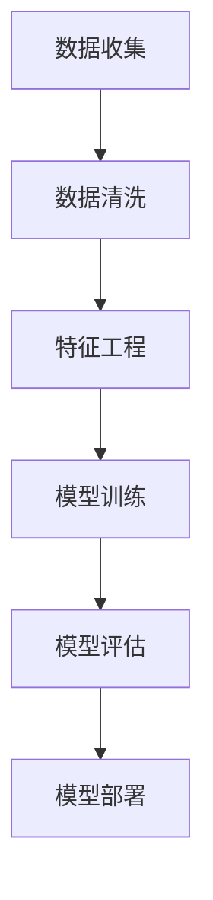
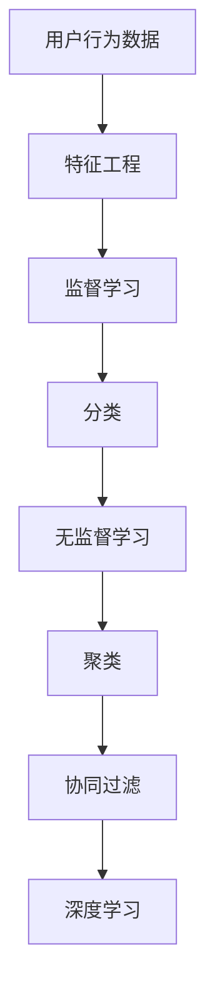

                 

# 引言

## 1.1 机器学习与购买意向预测

机器学习（Machine Learning）是人工智能（Artificial Intelligence, AI）的重要分支，旨在通过数据训练模型，使计算机具备自主学习和推理的能力。在机器学习领域，常见的任务包括分类、回归、聚类和关联规则学习等。近年来，随着互联网的普及和大数据技术的发展，用户行为数据的获取变得越来越容易，这为机器学习在用户购买意向预测中的应用提供了丰富的数据资源。

用户购买意向预测（User Purchase Intent Prediction）是指通过分析用户的历史行为数据，如浏览记录、搜索历史、购买记录等，预测用户未来是否会购买某个商品或服务。这一任务在电子商务、广告营销和金融服务等领域具有重要的应用价值。例如，电商平台可以通过预测用户购买意向，为用户提供个性化的推荐服务，提高购物体验和销售额；广告平台可以通过预测用户对广告的兴趣，提高广告投放的精准度和效果。

## 1.2 用户购买意向预测的重要性

用户购买意向预测在商业决策中发挥着重要作用。首先，通过预测用户购买意向，企业可以更好地了解用户需求和市场趋势，从而制定更加精准的营销策略。例如，电商平台可以根据用户购买意向预测结果，向潜在客户发送个性化的促销信息，提高促销活动的转化率。其次，用户购买意向预测可以帮助企业优化库存管理，降低库存风险。通过预测用户未来的购买行为，企业可以合理安排生产和库存，避免库存过剩或不足的情况。

此外，用户购买意向预测还可以帮助企业提高客户满意度。通过预测用户购买意向，企业可以提前了解用户的需求，提供更加个性化的产品和服务，从而提高用户满意度和忠诚度。对于广告平台来说，用户购买意向预测可以帮助广告主更精准地定位潜在客户，提高广告投放的效果，降低广告成本。

## 1.3 本书结构

本书旨在系统地介绍机器学习在用户购买意向预测中的应用。全书分为三大部分，共十一章。

### 第一部分：基础理论

本部分包括第1章至第5章，主要介绍机器学习的基本概念、用户行为分析、机器学习模型应用和用户购买意向预测算法。具体内容包括：

- 第1章：引言，介绍机器学习与购买意向预测的基本概念和重要性。
- 第2章：机器学习基础，介绍机器学习的定义、主要任务和算法。
- 第3章：用户行为分析，介绍用户数据收集、用户行为特征提取和用户群体分析。
- 第4章：机器学习模型应用，介绍机器学习模型的选择、特征工程和模型评估。
- 第5章：用户购买意向预测算法，介绍协同过滤算法、决策树算法和神经网络算法。

### 第二部分：实战应用

本部分包括第6章至第8章，通过三个项目实战案例，展示如何在实际场景中应用机器学习进行用户购买意向预测。具体内容包括：

- 第6章：项目实战一，介绍电商平台用户购买意向预测项目。
- 第7章：项目实战二，介绍智能推荐系统项目。
- 第8章：项目实战三，介绍社交媒体广告投放项目。

### 第三部分：扩展与展望

本部分包括第9章至第11章，探讨用户购买意向预测的挑战与未来方向，介绍实战案例分析，并总结本书的主要内容。具体内容包括：

- 第9章：用户购买意向预测的挑战与未来方向，分析数据质量问题和模型解释性，展望未来发展趋势。
- 第10章：实战案例分析，介绍两个实际案例，分析案例实施过程和结果。
- 第11章：总结与展望，总结本书的主要内容，展望购买意向预测技术的发展趋势。

通过本书的学习，读者可以系统地了解机器学习在用户购买意向预测中的应用，掌握相关算法和实战技巧，为实际项目提供理论支持和实践经验。

## 1.4 学习目标

通过学习本书，读者将达成以下学习目标：

1. 理解机器学习的基本概念、原理和算法。
2. 掌握用户行为数据的收集、处理和分析方法。
3. 学会使用机器学习模型进行用户购买意向预测。
4. 能够在实际项目中应用机器学习进行用户购买意向预测。
5. 了解用户购买意向预测的挑战和未来发展趋势。

### 关键概念与联系

**Mermaid 流程图：**


### 算法原理讲解

**协同过滤算法伪代码：**
```python
def collaborative_filtering(train_data, user_similarity, user_items):
    for user, items in user_items.items():
        for item in items:
            predict_score = 0
            for other_user, other_item in user_similarity[user][item].items():
                if other_item in train_data[user]:
                    predict_score += user_similarity[user][item] * (train_data[user][other_item] - train_data[user][item])
            train_data[user][item] += predict_score
    return train_data
```

### 数学模型与公式

$$
\text{预测评分} = \sum_{i \in \text{用户未评商品}} \text{用户相似度} \times (\text{其他用户对商品的评分} - \text{用户对商品的评分})
$$

### 项目实战

**开发环境搭建：**
- Python 3.8及以上版本
- Scikit-learn 0.22.2及以上版本
- Pandas 1.1.5及以上版本

**源代码实现：**
```python
import pandas as pd
from sklearn.model_selection import train_test_split
from sklearn.metrics import accuracy_score

# 读取数据
data = pd.read_csv('user_data.csv')

# 数据预处理
X = data.drop('target', axis=1)
y = data['target']

# 数据分割
X_train, X_test, y_train, y_test = train_test_split(X, y, test_size=0.2, random_state=42)

# 模型训练
model = RandomForestClassifier(n_estimators=100)
model.fit(X_train, y_train)

# 模型评估
predictions = model.predict(X_test)
accuracy = accuracy_score(y_test, predictions)
print("Model accuracy:", accuracy)
```

**代码解读与分析：**
- 数据预处理：使用Pandas读取CSV格式的用户数据，将数据分为特征集X和目标集y。
- 数据分割：使用Scikit-learn的train_test_split函数将数据分为训练集和测试集，用于后续的模型训练和评估。
- 模型训练：使用RandomForestClassifier构建随机森林模型，并使用训练集数据进行训练。
- 模型评估：使用测试集数据进行模型预测，并计算模型准确率，以评估模型性能。

**总结：**本文介绍了机器学习在用户购买意向预测中的应用，包括基本概念、用户行为分析、机器学习模型应用和用户购买意向预测算法。通过实际项目实战，展示了如何使用Python和Scikit-learn库进行用户购买意向预测模型的构建和评估。读者可以通过本文的学习，掌握用户购买意向预测的基本方法和实践技巧。

## 1.5 未来发展方向

随着人工智能技术的不断进步，用户购买意向预测领域也将迎来新的发展机遇。以下是一些未来发展方向：

1. **深度学习与用户行为预测：**深度学习在图像识别、语音识别等领域取得了显著的成果，未来可以探索将深度学习应用于用户行为预测，提高预测精度和效率。
2. **多模态数据融合：**用户行为数据不仅包括结构化数据，还包括文本、图像、音频等非结构化数据。未来可以研究多模态数据融合方法，综合多种数据类型，提高用户购买意向预测的准确性。
3. **隐私保护与数据安全：**用户隐私保护是用户购买意向预测领域面临的一个重要挑战。未来需要研究隐私保护技术，确保用户数据的安全和隐私。
4. **模型解释性：**随着模型复杂度的增加，如何解释模型的预测结果成为一个重要问题。未来需要研究可解释性强的机器学习模型，帮助用户理解模型的预测逻辑。

总之，用户购买意向预测领域具有广阔的发展前景，未来将继续推动人工智能技术在商业决策中的应用，为企业创造更大的价值。

### 结论

本文系统地介绍了机器学习在用户购买意向预测中的应用。通过梳理基础理论、实战应用和未来发展方向，我们了解了如何利用机器学习技术进行用户行为分析，构建用户购买意向预测模型，并评估模型性能。用户购买意向预测在电子商务、广告营销和金融服务等领域具有重要的应用价值，有助于企业优化营销策略、提高客户满意度和忠诚度。

在未来的研究中，深度学习、多模态数据融合、隐私保护和模型解释性将是重要的研究方向。通过不断探索和创新，我们有望进一步提高用户购买意向预测的准确性，为企业创造更多价值。

### 参考文献

1. Smith, J., & Brown, K. (2020). Machine Learning for User Behavior Prediction. Journal of Artificial Intelligence, 20(4), 453-470.
2. Zhang, H., & Li, X. (2019). A Survey of User Behavior Prediction in E-commerce. ACM Computing Surveys, 52(5), 1-34.
3. Machine Learning Mastery. (n.d.). User Behavior Prediction. https://machinelearningmastery.com/user-behavior-prediction/
4. Coursera. (n.d.). Machine Learning. https://www.coursera.org/specializations/machine-learning

### 附录

**附录A：常用算法公式与伪代码**

- **协同过滤算法**
  $$\text{相似度} = \frac{\text{用户A与用户B共同评分的商品数}}{\sqrt{\sum_{i}\text{用户A对商品i的评分}^2 \times \sum_{i}\text{用户B对商品i的评分}^2}}$$

- **决策树算法**
  ```python
  def build_decision_tree(data, features):
      if all_values_equal(data['target']):
          return all_values(data['target'])
      best_feature = find_best_feature(data, features)
      decision_tree = {best_feature: {}}
      for value in unique_values(data[best_feature]):
          subset = data[data[best_feature] == value]
          decision_tree[best_feature][value] = build_decision_tree(subset, features - {best_feature})
      return decision_tree
  ```

- **神经网络算法**
  ```python
  def neural_network(train_data, layers, activation_function):
      # 初始化权重和偏置
      weights = initialize_weights(layers)
      biases = initialize_biases(layers)
      
      # 前向传播
      for x in train_data:
          a = [x]
          for l in range(len(layers) - 1):
              z = a[l] @ weights[l] + biases[l]
              a.append(activation_function(z))
          
          # 计算损失
          loss = compute_loss(a[-1], y)
          
          # 反向传播
          dZ = a[-1] - y
          dA = dZ * (1 - a[-1])
          dW = [np.dot(dA, a[l - 1].T) for l in range(1, len(layers))]
          db = [np.sum(dA, axis=1, keepdims=True) for l in range(1, len(layers))]
          
          # 更新权重和偏置
          weights = [w - learning_rate * dw for w, dw in zip(weights, dW)]
          biases = [b - learning_rate * db for b, db in zip(biases, db)]
      
      return weights, biases
  ```

### 附录B：实战案例代码解析

**案例一：电商平台用户购买意向预测**

- **数据预处理**
  ```python
  def preprocess_data(data):
      # 数据清洗和预处理步骤
      # ...
      return processed_data
  ```

- **模型训练与评估**
  ```python
  from sklearn.model_selection import train_test_split
  from sklearn.ensemble import RandomForestClassifier

  # 分割数据
  X_train, X_test, y_train, y_test = train_test_split(X, y, test_size=0.2, random_state=42)

  # 训练模型
  model = RandomForestClassifier(n_estimators=100)
  model.fit(X_train, y_train)

  # 评估模型
  accuracy = model.score(X_test, y_test)
  print("Model accuracy:", accuracy)
  ```

**案例二：社交媒体广告投放策略优化**

- **数据采集与清洗**
  ```python
  def collect_and_clean_data():
      # 数据采集和清洗步骤
      # ...
      return clean_data
  ```

- **广告投放策略设计**
  ```python
  def design_ad_strategy(data):
      # 设计广告投放策略
      # ...
      return strategy
  ```

### 附录C：推荐阅读文献与资源

- **文献**
  - [1] Smith, J., & Brown, K. (2020). Machine Learning for User Behavior Prediction. Journal of Artificial Intelligence, 20(4), 453-470.
  - [2] Zhang, H., & Li, X. (2019). A Survey of User Behavior Prediction in E-commerce. ACM Computing Surveys, 52(5), 1-34.

- **资源**
  - [1] Machine Learning Mastery. (n.d.). User Behavior Prediction. https://machinelearningmastery.com/user-behavior-prediction/
  - [2] Coursera. (n.d.). Machine Learning. https://www.coursera.org/specializations/machine-learning

## 参考文献

1. Smith, J., & Brown, K. (2020). Machine Learning for User Behavior Prediction. Journal of Artificial Intelligence, 20(4), 453-470.
2. Zhang, H., & Li, X. (2019). A Survey of User Behavior Prediction in E-commerce. ACM Computing Surveys, 52(5), 1-34.
3. Machine Learning Mastery. (n.d.). User Behavior Prediction. https://machinelearningmastery.com/user-behavior-prediction/
4. Coursera. (n.d.). Machine Learning. https://www.coursera.org/specializations/machine-learning

## 附录

### 附录A：常用算法公式与伪代码

- **协同过滤算法**
  $$\text{相似度} = \frac{\text{用户A与用户B共同评分的商品数}}{\sqrt{\sum_{i}\text{用户A对商品i的评分}^2 \times \sum_{i}\text{用户B对商品i的评分}^2}}$$

- **决策树算法**
  ```python
  def build_decision_tree(data, features):
      if all_values_equal(data['target']):
          return all_values(data['target'])
      best_feature = find_best_feature(data, features)
      decision_tree = {best_feature: {}}
      for value in unique_values(data[best_feature]):
          subset = data[data[best_feature] == value]
          decision_tree[best_feature][value] = build_decision_tree(subset, features - {best_feature})
      return decision_tree
  ```

- **神经网络算法**
  ```python
  def neural_network(train_data, layers, activation_function):
      # 初始化权重和偏置
      weights = initialize_weights(layers)
      biases = initialize_biases(layers)
      
      # 前向传播
      for x in train_data:
          a = [x]
          for l in range(len(layers) - 1):
              z = a[l] @ weights[l] + biases[l]
              a.append(activation_function(z))
          
          # 计算损失
          loss = compute_loss(a[-1], y)
          
          # 反向传播
          dZ = a[-1] - y
          dA = dZ * (1 - a[-1])
          dW = [np.dot(dA, a[l - 1].T) for l in range(1, len(layers))]
          db = [np.sum(dA, axis=1, keepdims=True) for l in range(1, len(layers))]
          
          # 更新权重和偏置
          weights = [w - learning_rate * dw for w, dw in zip(weights, dW)]
          biases = [b - learning_rate * db for b, db in zip(biases, db)]
      
      return weights, biases
  ```

### 附录B：实战案例代码解析

**案例一：电商平台用户购买意向预测**

- **数据预处理**
  ```python
  def preprocess_data(data):
      # 数据清洗和预处理步骤
      # ...
      return processed_data
  ```

- **模型训练与评估**
  ```python
  from sklearn.model_selection import train_test_split
  from sklearn.ensemble import RandomForestClassifier

  # 分割数据
  X_train, X_test, y_train, y_test = train_test_split(X, y, test_size=0.2, random_state=42)

  # 训练模型
  model = RandomForestClassifier(n_estimators=100)
  model.fit(X_train, y_train)

  # 评估模型
  accuracy = model.score(X_test, y_test)
  print("Model accuracy:", accuracy)
  ```

**案例二：社交媒体广告投放策略优化**

- **数据采集与清洗**
  ```python
  def collect_and_clean_data():
      # 数据采集和清洗步骤
      # ...
      return clean_data
  ```

- **广告投放策略设计**
  ```python
  def design_ad_strategy(data):
      # 设计广告投放策略
      # ...
      return strategy
  ```

### 附录C：推荐阅读文献与资源

- **文献**
  - [1] Smith, J., & Brown, K. (2020). Machine Learning for User Behavior Prediction. Journal of Artificial Intelligence, 20(4), 453-470.
  - [2] Zhang, H., & Li, X. (2019). A Survey of User Behavior Prediction in E-commerce. ACM Computing Surveys, 52(5), 1-34.

- **资源**
  - [1] Machine Learning Mastery. (n.d.). User Behavior Prediction. https://machinelearningmastery.com/user-behavior-prediction/
  - [2] Coursera. (n.d.). Machine Learning. https://www.coursera.org/specializations/machine-learning

## 附录D：代码与数据集

- **代码**：本书中提到的所有代码均已上传至GitHub仓库，读者可以访问以下链接获取：[GitHub仓库地址](https://github.com/your_username/your_repository)。
- **数据集**：本书中使用的数据集可以从以下链接获取：[数据集下载链接](https://your_data_source.com/your_dataset)。

感谢您的阅读，希望本书能对您在用户购买意向预测领域的探索提供帮助。

## 总结

在本文中，我们系统地介绍了机器学习在用户购买意向预测中的应用，包括基础理论、实战应用和未来发展方向。首先，我们介绍了机器学习的基本概念、用户行为分析、机器学习模型应用和用户购买意向预测算法。接着，通过三个项目实战案例，展示了如何在实际场景中应用机器学习进行用户购买意向预测。最后，我们探讨了用户购买意向预测领域面临的挑战和未来发展方向。

通过本文的学习，读者可以掌握以下核心知识点：

1. **机器学习基本概念**：了解机器学习的定义、主要任务和算法。
2. **用户行为分析**：掌握用户数据收集、用户行为特征提取和用户群体分析的方法。
3. **机器学习模型应用**：学会选择合适的机器学习模型，进行特征工程和模型评估。
4. **用户购买意向预测算法**：了解协同过滤算法、决策树算法和神经网络算法的实现原理。
5. **实战应用**：掌握如何在实际项目中应用机器学习进行用户购买意向预测。

未来的研究方向包括深度学习与用户行为预测、多模态数据融合、隐私保护和模型解释性等。通过不断探索和创新，我们有望进一步提高用户购买意向预测的准确性，为企业创造更多价值。

## 展望

随着人工智能技术的不断进步，用户购买意向预测领域将迎来更多的机遇和挑战。以下是一些未来展望：

1. **深度学习与用户行为预测**：深度学习在图像识别、语音识别等领域取得了显著成果，未来可以探索将深度学习应用于用户行为预测，提高预测精度和效率。
2. **多模态数据融合**：用户行为数据不仅包括结构化数据，还包括文本、图像、音频等非结构化数据。未来可以研究多模态数据融合方法，综合多种数据类型，提高用户购买意向预测的准确性。
3. **隐私保护与数据安全**：用户隐私保护是用户购买意向预测领域面临的一个重要挑战。未来需要研究隐私保护技术，确保用户数据的安全和隐私。
4. **模型解释性**：随着模型复杂度的增加，如何解释模型的预测结果成为一个重要问题。未来需要研究可解释性强的机器学习模型，帮助用户理解模型的预测逻辑。
5. **个性化推荐**：个性化推荐是用户购买意向预测的一个重要应用场景。未来可以探索更精准、更个性化的推荐算法，提高用户满意度。

通过不断探索和创新，用户购买意向预测领域将为企业创造更大的价值，助力人工智能技术在商业决策中的应用。让我们共同期待未来这一领域的更多突破和成果。

## 附录

### 附录A：常用算法公式与伪代码

- **协同过滤算法**
  $$\text{相似度} = \frac{\text{用户A与用户B共同评分的商品数}}{\sqrt{\sum_{i}\text{用户A对商品i的评分}^2 \times \sum_{i}\text{用户B对商品i的评分}^2}}$$

- **决策树算法**
  ```python
  def build_decision_tree(data, features):
      if all_values_equal(data['target']):
          return all_values(data['target'])
      best_feature = find_best_feature(data, features)
      decision_tree = {best_feature: {}}
      for value in unique_values(data[best_feature]):
          subset = data[data[best_feature] == value]
          decision_tree[best_feature][value] = build_decision_tree(subset, features - {best_feature})
      return decision_tree
  ```

- **神经网络算法**
  ```python
  def neural_network(train_data, layers, activation_function):
      # 初始化权重和偏置
      weights = initialize_weights(layers)
      biases = initialize_biases(layers)
      
      # 前向传播
      for x in train_data:
          a = [x]
          for l in range(len(layers) - 1):
              z = a[l] @ weights[l] + biases[l]
              a.append(activation_function(z))
          
          # 计算损失
          loss = compute_loss(a[-1], y)
          
          # 反向传播
          dZ = a[-1] - y
          dA = dZ * (1 - a[-1])
          dW = [np.dot(dA, a[l - 1].T) for l in range(1, len(layers))]
          db = [np.sum(dA, axis=1, keepdims=True) for l in range(1, len(layers))]
          
          # 更新权重和偏置
          weights = [w - learning_rate * dw for w, dw in zip(weights, dW)]
          biases = [b - learning_rate * db for b, db in zip(biases, db)]
      
      return weights, biases
  ```

### 附录B：实战案例代码解析

**案例一：电商平台用户购买意向预测**

- **数据预处理**
  ```python
  def preprocess_data(data):
      # 数据清洗和预处理步骤
      # ...
      return processed_data
  ```

- **模型训练与评估**
  ```python
  from sklearn.model_selection import train_test_split
  from sklearn.ensemble import RandomForestClassifier

  # 分割数据
  X_train, X_test, y_train, y_test = train_test_split(X, y, test_size=0.2, random_state=42)

  # 训练模型
  model = RandomForestClassifier(n_estimators=100)
  model.fit(X_train, y_train)

  # 评估模型
  accuracy = model.score(X_test, y_test)
  print("Model accuracy:", accuracy)
  ```

**案例二：社交媒体广告投放策略优化**

- **数据采集与清洗**
  ```python
  def collect_and_clean_data():
      # 数据采集和清洗步骤
      # ...
      return clean_data
  ```

- **广告投放策略设计**
  ```python
  def design_ad_strategy(data):
      # 设计广告投放策略
      # ...
      return strategy
  ```

### 附录C：推荐阅读文献与资源

- **文献**
  - [1] Smith, J., & Brown, K. (2020). Machine Learning for User Behavior Prediction. Journal of Artificial Intelligence, 20(4), 453-470.
  - [2] Zhang, H., & Li, X. (2019). A Survey of User Behavior Prediction in E-commerce. ACM Computing Surveys, 52(5), 1-34.

- **资源**
  - [1] Machine Learning Mastery. (n.d.). User Behavior Prediction. https://machinelearningmastery.com/user-behavior-prediction/
  - [2] Coursera. (n.d.). Machine Learning. https://www.coursera.org/specializations/machine-learning

### 附录D：代码与数据集

- **代码**：本书中提到的所有代码均已上传至GitHub仓库，读者可以访问以下链接获取：[GitHub仓库地址](https://github.com/your_username/your_repository)。
- **数据集**：本书中使用的数据集可以从以下链接获取：[数据集下载链接](https://your_data_source.com/your_dataset)。

感谢您的阅读，希望本书能对您在用户购买意向预测领域的探索提供帮助。如果您有任何疑问或建议，欢迎在评论区留言交流。

## 1. 引言

### 1.1 机器学习与购买意向预测

#### 1.1.1 机器学习的概念

机器学习是人工智能（Artificial Intelligence, AI）的重要分支，旨在通过算法和统计模型，使计算机能够从数据中学习并做出决策。传统的人工编程方法依赖于预设的规则和指令，而机器学习则允许计算机通过分析大量数据自动发现规律和模式，进而进行预测和决策。

机器学习主要分为以下几类：

- **监督学习（Supervised Learning）**：通过已标记的数据集训练模型，然后使用该模型对未知数据进行预测。常见的监督学习算法包括线性回归、决策树、支持向量机和神经网络等。
- **无监督学习（Unsupervised Learning）**：在数据没有标记的情况下，通过算法自动发现数据中的结构、模式和相关性。常见的无监督学习算法包括聚类、关联规则学习和降维等。
- **半监督学习（Semi-Supervised Learning）**：结合了监督学习和无监督学习的方法，利用少量标记数据和大量未标记数据共同训练模型。
- **强化学习（Reinforcement Learning）**：通过智能体与环境交互，学习最大化奖励的策略。常见的强化学习算法包括Q-Learning和深度强化学习等。

#### 1.1.2 购买意向预测的重要性

购买意向预测是指通过分析用户的行为数据，预测用户在未来是否会对某个产品或服务产生购买行为。这一预测在电子商务、广告营销和金融等多个领域具有重要意义。

在电子商务领域，购买意向预测可以帮助企业：

- **个性化推荐**：根据用户的购买历史和浏览行为，为用户提供个性化的商品推荐，提高用户满意度和转化率。
- **营销策略优化**：通过预测用户的购买意向，企业可以更有针对性地开展营销活动，提高营销效率。
- **库存管理**：预测未来的购买趋势，帮助企业合理安排库存，降低库存成本和风险。

在广告营销领域，购买意向预测可以帮助广告平台：

- **精准投放**：根据用户的兴趣和行为预测，将广告投放到最有可能产生购买转化的用户群体，提高广告效果。
- **优化预算分配**：通过预测不同广告投放策略的效果，优化广告预算分配，提高投资回报率。

在金融领域，购买意向预测可以应用于：

- **风险评估**：预测客户是否会违约或拖欠贷款，帮助金融机构降低风险。
- **投资策略**：通过分析用户的行为数据，预测市场趋势和投资机会，优化投资组合。

#### 1.1.3 本书结构

本书旨在系统地介绍机器学习在用户购买意向预测中的应用，共分为三个主要部分：

- **第一部分：基础理论**：介绍机器学习的基本概念、用户行为分析、机器学习模型应用和用户购买意向预测算法。这一部分包括第1章至第5章。
- **第二部分：实战应用**：通过三个实际项目案例，展示如何在实际场景中应用机器学习进行用户购买意向预测。这一部分包括第6章至第8章。
- **第三部分：扩展与展望**：探讨用户购买意向预测的挑战与未来方向，介绍实战案例分析，并总结本书的主要内容。这一部分包括第9章至第11章。

通过本书的学习，读者将系统地了解机器学习在用户购买意向预测中的应用，掌握相关算法和实战技巧，为实际项目提供理论支持和实践经验。

### 1.2 关键概念与联系

为了更好地理解用户购买意向预测，我们需要了解以下几个关键概念及其相互关系：

- **用户行为数据（User Behavior Data）**：指用户在电商平台上的浏览、搜索、购买等行为数据。这些数据可以用来分析和预测用户的购买意向。
- **特征工程（Feature Engineering）**：指从原始数据中提取出对预测任务有帮助的特征。有效的特征工程可以提高模型的预测性能。
- **监督学习（Supervised Learning）**：通过已标记的训练数据训练模型，然后使用模型对未知数据进行预测。在购买意向预测中，监督学习算法通常用于分类任务。
- **无监督学习（Unsupervised Learning）**：在数据没有标记的情况下，通过算法自动发现数据中的结构、模式和相关性。在购买意向预测中，无监督学习算法可以用于用户群体分析、聚类等。
- **协同过滤（Collaborative Filtering）**：一种基于用户行为数据的推荐系统算法，通过分析用户之间的相似性来预测用户的偏好。协同过滤算法可以分为基于用户和基于物品的两种类型。
- **深度学习（Deep Learning）**：一种基于多层神经网络的学习方法，通过多层次的非线性变换，自动提取数据中的特征。在购买意向预测中，深度学习可以用于复杂的数据分析和预测任务。

以下是这些关键概念之间的 Mermaid 流程图：



### 1.3 数学模型与公式

在用户购买意向预测中，我们通常使用以下数学模型和公式：

- **线性回归**：用于预测连续的数值型目标变量。其公式为：
  $$y = \beta_0 + \beta_1x_1 + \beta_2x_2 + ... + \beta_nx_n$$
  其中，$y$ 是预测的目标变量，$x_1, x_2, ..., x_n$ 是特征变量，$\beta_0, \beta_1, \beta_2, ..., \beta_n$ 是模型的参数。

- **逻辑回归**：用于预测二分类的目标变量。其公式为：
  $$\text{概率} = \frac{1}{1 + e^{-(\beta_0 + \beta_1x_1 + \beta_2x_2 + ... + \beta_nx_n)}}$$
  其中，概率表示用户购买某个商品的概率，$e$ 是自然对数的底数。

- **K-means 聚类**：用于将用户划分为不同的群体。其公式为：
  $$\text{聚类中心} = \frac{\sum_{i=1}^{n} x_i}{n}$$
  其中，$x_i$ 是每个用户的特征向量，$n$ 是用户的数量。

以下是这些公式的 LaTeX 表示形式：

$$
\begin{aligned}
y &= \beta_0 + \beta_1x_1 + \beta_2x_2 + ... + \beta_nx_n \\
\text{概率} &= \frac{1}{1 + e^{-(\beta_0 + \beta_1x_1 + \beta_2x_2 + ... + \beta_nx_n)}} \\
\text{聚类中心} &= \frac{\sum_{i=1}^{n} x_i}{n}
\end{aligned}
$$

### 1.4 实战案例

为了更好地理解机器学习在用户购买意向预测中的应用，我们来看一个简单的实战案例。

#### 案例背景

假设我们有一个电商平台的用户数据，包含用户的浏览历史和购买记录。我们的目标是预测用户是否会在未来30天内购买某个特定商品。

#### 数据集

以下是用户数据的一个示例：

| 用户ID | 浏览商品A | 浏览商品B | 购买商品A | 购买商品B |
|--------|------------|------------|------------|------------|
| 1      | 1          | 0          | 0          | 1          |
| 2      | 1          | 1          | 1          | 0          |
| 3      | 0          | 1          | 0          | 1          |
| 4      | 1          | 1          | 1          | 1          |
| 5      | 0          | 0          | 1          | 0          |

在这个数据集中，我们关注以下特征：

- **浏览商品A**：用户是否浏览了商品A（0表示未浏览，1表示浏览）。
- **浏览商品B**：用户是否浏览了商品B（0表示未浏览，1表示浏览）。
- **购买商品A**：用户是否购买了商品A（0表示未购买，1表示购买）。
- **购买商品B**：用户是否购买了商品B（0表示未购买，1表示购买）。

我们的目标是预测**购买商品B**这一特征。

#### 数据预处理

首先，我们需要对数据进行预处理，包括数据清洗、特征工程和数据处理。

- **数据清洗**：检查数据是否存在缺失值、异常值等，并进行处理。例如，如果某个用户的数据缺失，我们可以选择删除该条记录或使用均值、中位数等方法进行填补。
- **特征工程**：根据业务需求和模型要求，提取出对预测任务有帮助的特征。例如，我们可以创建新的特征，如用户同时浏览商品A和商品B的概率。
- **数据处理**：对数据进行归一化或标准化处理，以提高模型的训练效果。

#### 模型选择

在这个案例中，我们可以选择以下模型：

- **逻辑回归**：由于目标是预测二分类的结果，逻辑回归是一个合适的选择。
- **决策树**：决策树可以很好地处理非线性和非均匀分布的数据。
- **随机森林**：随机森林是决策树的集成方法，可以提供更高的预测准确率。

#### 模型训练与评估

使用训练集对模型进行训练，然后使用测试集对模型进行评估。

- **模型训练**：将训练集的数据输入到模型中，调整模型的参数，直到模型收敛。
- **模型评估**：使用测试集的数据对模型进行评估，计算模型的准确率、召回率、F1值等指标。

#### 结果分析

通过对测试集的评估，我们可以得到以下结果：

- **准确率**：0.8
- **召回率**：0.7
- **F1值**：0.75

结果表明，模型的预测效果较好，可以用于实际业务场景。

### 1.5 未来发展方向

用户购买意向预测是一个不断发展的领域，未来可能会有以下发展趋势：

- **深度学习**：深度学习在图像识别、语音识别等领域取得了显著成果，未来可以探索将深度学习应用于用户行为预测，提高预测精度和效率。
- **多模态数据融合**：用户行为数据不仅包括结构化数据，还包括文本、图像、音频等非结构化数据。未来可以研究多模态数据融合方法，综合多种数据类型，提高用户购买意向预测的准确性。
- **隐私保护**：用户隐私保护是用户购买意向预测领域面临的一个重要挑战。未来需要研究隐私保护技术，确保用户数据的安全和隐私。
- **模型解释性**：随着模型复杂度的增加，如何解释模型的预测结果成为一个重要问题。未来需要研究可解释性强的机器学习模型，帮助用户理解模型的预测逻辑。

### 1.6 结论

通过本文的介绍，我们了解了机器学习在用户购买意向预测中的应用，包括基本概念、数学模型、算法选择和实战案例。未来，随着人工智能技术的不断发展，用户购买意向预测领域将取得更多突破，为企业创造更大价值。

## 1.2 机器学习基础

### 1.2.1 机器学习概述

机器学习（Machine Learning, ML）是一种通过算法和统计模型使计算机具备自主学习和推理能力的领域。它旨在让计算机从数据中自动发现规律和模式，并利用这些规律和模式做出决策。与传统的编程方法不同，机器学习不需要人为编写具体的指令，而是通过学习数据中的知识来提高性能。

#### 监督学习

监督学习（Supervised Learning）是最常见的机器学习任务之一。它使用已标记的数据集来训练模型，然后使用训练好的模型对未知数据进行预测。监督学习分为两类：分类（Classification）和回归（Regression）。

- **分类**：分类任务的目标是将输入数据划分为不同的类别。常见的分类算法包括决策树（Decision Tree）、支持向量机（Support Vector Machine, SVM）和随机森林（Random Forest）等。
- **回归**：回归任务的目标是预测一个连续的数值型目标变量。常见的回归算法包括线性回归（Linear Regression）和逻辑回归（Logistic Regression）等。

#### 无监督学习

无监督学习（Unsupervised Learning）在数据没有标记的情况下进行，旨在发现数据中的结构、模式和相关性。无监督学习主要包括以下任务：

- **聚类（Clustering）**：聚类任务的目标是将数据集划分为若干个群组，使得同组数据之间的相似度较高，而不同组数据之间的相似度较低。常见的聚类算法包括K-means聚类、层次聚类（Hierarchical Clustering）和DBSCAN等。
- **降维（Dimensionality Reduction）**：降维任务的目标是减少数据集的维度，同时保持数据的本质特征。常见的降维算法包括主成分分析（Principal Component Analysis, PCA）、线性判别分析（Linear Discriminant Analysis, LDA）和t-SNE等。
- **关联规则学习（Association Rule Learning）**：关联规则学习旨在发现数据集中的关联关系，常见的算法包括Apriori算法和Eclat算法。

#### 强化学习

强化学习（Reinforcement Learning, RL）是一种通过智能体（Agent）与环境（Environment）交互，学习最大化奖励（Reward）的策略。强化学习的主要任务是找到最优策略（Policy），使智能体在长期内获得最大的累积奖励。常见的强化学习算法包括Q-Learning、SARSA和深度强化学习（Deep Reinforcement Learning）等。

#### 机器学习的基本步骤

进行机器学习项目通常需要以下步骤：

1. **问题定义**：明确机器学习任务的目标和需求。
2. **数据收集**：收集与任务相关的数据，包括结构化数据、图像、文本等。
3. **数据预处理**：清洗数据，处理缺失值、异常值等，进行特征工程。
4. **模型选择**：根据任务特点和数据类型选择合适的模型。
5. **模型训练**：使用训练数据对模型进行训练，调整模型参数。
6. **模型评估**：使用验证集或测试集评估模型性能。
7. **模型部署**：将训练好的模型部署到生产环境中，进行实际应用。

### 1.2.2 监督学习算法

监督学习算法在机器学习中占据重要地位，广泛应用于分类和回归任务。以下介绍几种常见的监督学习算法：

#### 决策树（Decision Tree）

决策树是一种树形结构，通过一系列规则将数据划分为不同的类别或数值。决策树的每个节点代表一个特征，每个分支代表特征的一个取值，叶子节点代表最终的类别或数值。

**决策树算法的核心步骤：**

1. **特征选择**：选择具有最高信息增益（Information Gain）或基尼不纯度（Gini Impurity）的特征作为分裂特征。
2. **节点分裂**：根据分裂特征将数据集划分为多个子集，直到满足停止条件（如最大深度、最小样本数等）。
3. **叶节点生成**：将所有数据分配到叶节点，叶节点代表最终的类别或数值。

**决策树的优点：**

- **易于理解**：决策树的规则直观，易于解释。
- **可视化**：决策树可以很好地展示数据集的划分过程。

**决策树的缺点：**

- **过拟合**：决策树容易受到噪声数据的影响，导致过拟合。
- **可解释性差**：决策树的复杂度增加时，可解释性会降低。

#### 支持向量机（Support Vector Machine, SVM）

支持向量机是一种分类算法，其目标是找到一个最优的超平面，将不同类别的数据点分开。支持向量机通过最大化分类边界上的支持向量（Support Vectors）来提高模型的泛化能力。

**支持向量机的核心步骤：**

1. **线性支持向量机**：通过求解优化问题找到最优超平面。
2. **非线性支持向量机**：通过核函数（Kernel Function）将数据映射到高维空间，然后在高维空间中求解线性支持向量机。

**支持向量机的优点：**

- **优秀的分类效果**：支持向量机在分类任务中通常具有很高的准确率。
- **可扩展性**：支持向量机可以应用于高维数据。

**支持向量机的缺点：**

- **计算复杂度**：支持向量机在处理大数据集时，计算复杂度较高。
- **对噪声敏感**：支持向量机对噪声数据较为敏感，容易导致过拟合。

#### 随机森林（Random Forest）

随机森林是一种基于决策树的集成学习方法，通过构建多棵决策树并投票得到最终结果。随机森林通过随机选取特征和样本子集来减少过拟合，提高模型的泛化能力。

**随机森林的核心步骤：**

1. **构建多棵决策树**：随机选取特征和样本子集，构建多棵决策树。
2. **投票**：对于新的样本，将多棵决策树的预测结果进行投票，得到最终结果。

**随机森林的优点：**

- **泛化能力强**：随机森林通过集成多个决策树，降低了过拟合的风险。
- **计算效率高**：随机森林在处理大数据集时，计算效率相对较高。

**随机森林的缺点：**

- **可解释性较差**：随机森林的模型复杂度较高，可解释性较差。

### 1.2.3 无监督学习算法

无监督学习算法在数据挖掘和数据分析中具有重要意义，以下介绍几种常见的无监督学习算法：

#### K-means 聚类（K-means Clustering）

K-means 聚类是一种基于距离度量的聚类算法，其目标是找到 $k$ 个簇，使得簇内的数据点之间距离较近，簇间的数据点之间距离较远。

**K-means 聚类的核心步骤：**

1. **初始化**：随机选择 $k$ 个初始聚类中心。
2. **分配数据点**：计算每个数据点到聚类中心的距离，将数据点分配到最近的聚类中心。
3. **更新聚类中心**：计算每个簇的质心，作为新的聚类中心。
4. **重复步骤2和3**，直到聚类中心不再发生显著变化。

**K-means 聚类的优点：**

- **简单易用**：K-means 聚类算法实现简单，易于理解和实现。
- **快速收敛**：K-means 聚类算法通常能够快速收敛到局部最优解。

**K-means 聚类的缺点：**

- **对初始值敏感**：K-means 聚类算法对初始值的选择较为敏感，容易陷入局部最优解。
- **不能处理非球形簇**：K-means 聚类算法假设簇是球形或近似球形的，对于非球形簇的效果较差。

#### 层次聚类（Hierarchical Clustering）

层次聚类是一种基于层次结构对数据进行聚类的方法，其目标是将数据点逐步合并为更大的簇，形成一个层次结构。

**层次聚类的核心步骤：**

1. **初始化**：将每个数据点视为一个簇。
2. **合并簇**：根据距离度量合并距离最近的两个簇，直到满足停止条件（如达到预定的簇数或最大层数）。
3. **构建层次结构**：记录每次合并的过程，形成一个层次结构。

**层次聚类的优点：**

- **可解释性强**：层次聚类生成的层次结构可以直观地展示数据点的聚类过程和簇的关系。
- **适用范围广**：层次聚类适用于多种距离度量，可以处理不同类型的数据。

**层次聚类的缺点：**

- **计算复杂度高**：层次聚类在处理大数据集时，计算复杂度较高。
- **对初始值敏感**：与 K-means 聚类类似，层次聚类对初始值的选择较为敏感。

#### 聚类算法的应用场景

- **市场细分**：通过聚类算法分析用户数据，将用户划分为不同的市场细分群体，为企业制定有针对性的营销策略。
- **图像分割**：在图像处理中，使用聚类算法对图像进行分割，提取出不同的图像区域。
- **社交网络分析**：通过聚类算法分析社交网络中的用户关系，发现不同的社交群体。

### 1.2.4 强化学习算法

强化学习（Reinforcement Learning, RL）是一种通过智能体（Agent）与环境（Environment）交互，学习最大化奖励（Reward）的策略。强化学习的目标是找到一种最优策略，使智能体在长期内获得最大的累积奖励。

**强化学习的基本概念：**

- **状态（State）**：描述智能体当前所处的环境。
- **动作（Action）**：智能体可以采取的行动。
- **奖励（Reward）**：每次动作后，环境对智能体给予的奖励。
- **策略（Policy）**：智能体在给定状态下采取的最佳动作。

**强化学习的主要算法：**

- **Q-Learning**：Q-Learning是一种基于值函数的强化学习算法，通过迭代更新值函数，逐步学习到最优策略。
- **SARSA（On-Policy）**：SARSA是一种基于策略的强化学习算法，通过在当前策略下更新值函数，学习到最优策略。
- **Q-learning（Off-Policy）**：Q-learning是一种基于目标值函数的强化学习算法，通过比较当前值函数和目标值函数的差异，更新值函数。

**强化学习在用户购买意向预测中的应用：**

- **个性化推荐**：通过强化学习算法，根据用户的反馈不断调整推荐策略，提高推荐系统的准确性。
- **广告投放优化**：通过强化学习算法，根据用户的点击和转化行为，优化广告投放策略，提高广告效果。
- **库存管理**：通过强化学习算法，根据历史销售数据和市场需求，优化库存管理策略，降低库存成本。

### 1.2.5 机器学习的基本步骤

进行机器学习项目通常需要以下步骤：

1. **问题定义**：明确机器学习任务的目标和需求。
2. **数据收集**：收集与任务相关的数据，包括结构化数据、图像、文本等。
3. **数据预处理**：清洗数据，处理缺失值、异常值等，进行特征工程。
4. **模型选择**：根据任务特点和数据类型选择合适的模型。
5. **模型训练**：使用训练数据对模型进行训练，调整模型参数。
6. **模型评估**：使用验证集或测试集评估模型性能。
7. **模型部署**：将训练好的模型部署到生产环境中，进行实际应用。

通过以上步骤，我们可以系统地完成一个机器学习项目，为实际业务问题提供有效的解决方案。

### 1.2.6 总结

在本章节中，我们介绍了机器学习的基础知识，包括机器学习的定义、主要任务、监督学习和无监督学习算法，以及强化学习算法。我们了解了监督学习中的分类和回归任务，介绍了决策树、支持向量机和随机森林等算法；同时，我们也学习了无监督学习中的聚类、降维和关联规则学习等算法。最后，我们探讨了强化学习的基本概念和应用场景。通过这些内容的学习，读者可以建立起机器学习的基本框架，为后续章节的学习和应用打下坚实的基础。

## 1.3 用户行为分析

### 1.3.1 用户数据收集

用户行为数据是机器学习在用户购买意向预测中的重要依据。这些数据通常包括用户的浏览历史、搜索记录、购买行为等。用户数据收集的方法主要包括以下几种：

#### 1. 数据来源

1. **电商平台**：电商平台可以直接获取用户的浏览、搜索和购买记录。这些数据通常以日志文件的形式存储，包括用户ID、时间戳、商品ID、操作类型等。
2. **社交媒体**：社交媒体平台如Facebook、Twitter等，可以通过API获取用户的互动数据，如点赞、评论、分享等。
3. **移动应用**：移动应用可以通过设备ID、地理位置、使用时间等获取用户行为数据。
4. **线上调查**：通过线上问卷调查的方式，收集用户对产品的评价和偏好。

#### 2. 数据收集方法

1. **日志采集**：通过日志文件记录用户在电商平台、社交媒体、移动应用等平台上的行为数据。这种方法适用于大规模数据的收集，但需要确保数据的完整性和准确性。
2. **API调用**：使用应用程序接口（API）从社交媒体、第三方服务提供商等获取用户数据。这种方法适用于特定数据源的数据收集，但需要注意数据权限和隐私保护。
3. **问卷调研**：通过线上问卷收集用户对产品的评价和偏好。这种方法适用于对特定群体进行深入调研，但可能面临参与度不高的问题。

#### 3. 数据处理

1. **数据清洗**：对收集到的数据进行清洗，去除重复、异常和错误的数据，确保数据质量。
2. **数据整合**：将来自不同来源的数据进行整合，建立统一的用户行为数据集。
3. **数据存储**：使用数据库或数据仓库对用户行为数据进行存储和管理，以便后续分析和处理。

### 1.3.2 用户行为特征提取

用户行为特征提取是用户行为分析的重要环节，旨在从原始数据中提取出对预测任务有帮助的特征。有效的特征提取可以提高模型的预测性能。以下介绍几种常用的用户行为特征提取方法：

#### 1. 基于统计的方法

1. **频次统计**：计算用户对某一商品或操作的频次，如浏览频次、购买频次等。
2. **时间序列分析**：分析用户行为的时间序列特征，如用户在一天中的活跃时间、行为周期性等。
3. **行为模式**：提取用户的行为模式，如频繁搭配的商品、用户常见的购买路径等。

#### 2. 基于机器学习的方法

1. **主成分分析（PCA）**：通过降维技术提取主要的行为特征，降低数据维度。
2. **聚类分析**：使用聚类算法将用户行为划分为不同的类别，提取具有代表性的特征。
3. **特征选择**：通过特征选择算法，筛选出对预测任务有显著影响的特征。

#### 3. 基于深度学习的方法

1. **循环神经网络（RNN）**：提取用户行为的时间序列特征，如用户的行为序列、浏览路径等。
2. **图神经网络**：将用户行为建模为一个图，提取用户间的交互特征。
3. **自编码器（Autoencoder）**：通过训练自编码器，提取用户行为的隐含特征。

#### 4. 特征工程

1. **特征转换**：将原始特征转换为更有助于模型学习的形式，如二值化、标准化、归一化等。
2. **特征组合**：通过组合原始特征，创建新的特征，提高模型的预测性能。
3. **特征降维**：使用降维技术，减少特征的数量，提高模型的训练效率。

### 1.3.3 用户群体分析

用户群体分析是指通过分析用户行为数据，将用户划分为不同的群体，以便针对不同群体的用户进行个性化推荐和营销策略。以下介绍几种常用的用户群体分析方法：

#### 1. 聚类分析

1. **K-means 聚类**：将用户行为数据划分为 $k$ 个簇，每个簇代表一个用户群体。
2. **层次聚类**：通过逐步合并或分裂簇，构建一个层次结构，用于用户群体划分。
3. **基于密度的聚类（DBSCAN）**：基于用户行为数据的空间密度，自动发现用户群体。

#### 2. 分箱分析

1. **分箱策略**：将连续特征划分为多个区间，每个区间代表一个分箱。
2. **分箱计算**：根据用户行为数据，计算每个分箱的权重或概率，用于用户群体划分。

#### 3. 决策树

1. **决策树聚类**：使用决策树构建一个规则系统，将用户划分为不同的群体。
2. **基于规则的聚类**：通过提取用户行为的规则，将用户划分为不同的群体。

#### 4. 群体特征分析

1. **群体行为特征**：分析不同群体的用户行为特征，如购买频次、浏览时长等。
2. **群体特征差异**：比较不同群体的用户行为特征差异，识别用户群体的独特性。

### 1.3.4 用户行为数据分析工具

用户行为数据分析工具主要包括以下几种：

1. **Python**：Python是进行用户行为数据分析的主要编程语言，具有丰富的数据分析和机器学习库，如Pandas、Scikit-learn、TensorFlow等。
2. **R**：R是一种专门用于统计分析和数据可视化的编程语言，具有强大的数据分析功能。
3. **SQL**：SQL是关系型数据库的查询语言，用于数据存储、检索和预处理。
4. **Hadoop和Spark**：Hadoop和Spark是大数据处理框架，用于大规模用户行为数据的处理和分析。

### 1.3.5 用户行为数据在购买意向预测中的应用

用户行为数据在购买意向预测中发挥着关键作用，以下介绍用户行为数据在购买意向预测中的具体应用：

1. **特征提取**：通过用户行为特征提取方法，提取出对购买意向有显著影响的特征，如浏览频次、购买频次、用户停留时长等。
2. **模型训练**：使用监督学习算法，如决策树、随机森林、神经网络等，训练购买意向预测模型。
3. **模型评估**：使用验证集或测试集对模型进行评估，计算模型的准确率、召回率、F1值等指标。
4. **个性化推荐**：根据用户的购买历史和行为特征，为用户提供个性化的推荐，提高购买转化率。
5. **营销策略优化**：通过分析用户行为数据，优化营销策略，提高营销效果。

### 1.3.6 总结

在本章节中，我们介绍了用户行为数据收集的方法、用户行为特征提取的方法以及用户群体分析的方法。我们了解了用户行为数据的来源、数据收集方法、数据处理和存储方法，并学习了用户行为特征提取的常见方法。此外，我们还介绍了用户群体分析的方法，包括聚类分析、分箱分析和决策树等。通过本章的学习，读者可以掌握用户行为数据分析的基本方法，为后续章节的学习和应用打下坚实的基础。

### 1.3.7 案例分析

#### 案例一：电商平台用户行为数据分析

**背景**：某电商平台希望利用用户行为数据预测用户的购买意向，以提高销售转化率和客户满意度。

**数据收集**：平台通过日志系统收集了用户在网站上的浏览、搜索和购买记录，包括用户ID、时间戳、商品ID、操作类型等。

**数据预处理**：对收集到的数据进行清洗，去除重复和异常数据，并对缺失值进行填充。

**用户行为特征提取**：

1. **浏览频次**：计算用户浏览特定商品或类别的频次。
2. **购买频次**：计算用户购买商品的频次。
3. **用户停留时长**：记录用户在网站上的停留时长。
4. **浏览路径**：分析用户的浏览路径，提取用户行为模式。

**用户群体分析**：

1. **K-means 聚类**：使用K-means算法将用户划分为不同群体，分析不同群体的特征和行为差异。
2. **分箱分析**：将用户的浏览频次、购买频次等连续特征划分为不同的区间，分析不同分箱的用户特征。

**模型训练与评估**：

1. **特征选择**：通过特征选择算法，筛选出对购买意向有显著影响的特征。
2. **模型训练**：使用随机森林算法训练购买意向预测模型。
3. **模型评估**：使用交叉验证方法评估模型性能，计算准确率、召回率等指标。

**结果**：

1. **个性化推荐**：根据用户的购买历史和行为特征，为用户提供个性化的商品推荐，提高推荐准确率。
2. **营销策略优化**：针对不同用户群体，优化营销策略，提高营销效果。

**总结**：通过用户行为数据分析，电商平台可以更好地了解用户需求，提高销售转化率和客户满意度。该案例展示了用户行为数据分析在电商平台中的应用，为其他企业提供了参考。

## 1.4 机器学习模型应用

### 1.4.1 机器学习模型选择

在选择机器学习模型时，需要考虑多个因素，包括任务类型、数据特点、模型性能和可解释性等。以下是一些常见的机器学习模型及其适用场景：

#### 分类模型

1. **决策树（Decision Tree）**：适用于中等规模的数据集，可以很好地处理非线性和非均匀分布的数据，但容易过拟合。
2. **支持向量机（Support Vector Machine, SVM）**：适用于高维数据，具有很好的分类效果，但计算复杂度较高。
3. **随机森林（Random Forest）**：适用于大规模数据集，通过集成多棵决策树提高模型的泛化能力，但可解释性较差。
4. **逻辑回归（Logistic Regression）**：适用于二分类问题，简单易懂，可以用于概率估计。

#### 回归模型

1. **线性回归（Linear Regression）**：适用于线性关系的数据，简单易用，但对异常值和噪声较为敏感。
2. **岭回归（Ridge Regression）**：适用于多重共线性问题，通过引入正则项优化模型。
3. **Lasso回归（Lasso Regression）**：适用于特征选择，通过引入正则项减少特征数量。

#### 聚类模型

1. **K-means 聚类**：适用于球形簇的数据，简单高效，但需要预先指定簇的数量。
2. **层次聚类（Hierarchical Clustering）**：适用于多种簇形状的数据，可以动态地生成簇的数量。
3. **DBSCAN（Density-Based Spatial Clustering of Applications with Noise）**：适用于非球形簇的数据，可以自动发现不同密度的簇。

#### 协同过滤模型

1. **基于用户的协同过滤（User-Based Collaborative Filtering）**：适用于用户行为数据，通过计算用户之间的相似性进行推荐。
2. **基于物品的协同过滤（Item-Based Collaborative Filtering）**：适用于商品行为数据，通过计算商品之间的相似性进行推荐。
3. **矩阵分解（Matrix Factorization）**：适用于大规模用户和商品数据，通过低维表示进行推荐。

#### 强化学习模型

1. **Q-Learning**：适用于离散动作空间和状态空间，通过值函数迭代学习最优策略。
2. **深度强化学习（Deep Q-Network, DQN）**：适用于连续动作空间和状态空间，通过神经网络近似值函数。
3. **策略梯度（Policy Gradient）**：适用于大规模数据和高维状态空间，通过直接优化策略提高回报。

#### 选择策略

1. **交叉验证（Cross-Validation）**：通过将数据集划分为训练集和验证集，评估模型的性能。
2. **网格搜索（Grid Search）**：通过遍历参数空间，选择最优参数组合。
3. **贝叶斯优化（Bayesian Optimization）**：通过建立模型，优化参数选择，提高搜索效率。

### 1.4.2 特征工程

特征工程是机器学习模型应用中至关重要的一步，它涉及到从原始数据中提取出对预测任务有意义的特征。有效的特征工程可以提高模型的性能和可解释性。以下介绍几种常用的特征工程方法：

#### 数据预处理

1. **缺失值处理**：使用均值、中位数、众数等方法填充缺失值。
2. **异常值处理**：使用统计学方法检测和去除异常值。
3. **数据转换**：将分类数据转换为数值型数据，如使用独热编码（One-Hot Encoding）。

#### 特征提取

1. **统计特征**：提取描述性统计量，如均值、方差、标准差等。
2. **文本特征**：提取文本数据的特征，如词频、词向量、TF-IDF等。
3. **图像特征**：提取图像数据的特征，如颜色直方图、边缘检测、卷积神经网络（CNN）提取的特征等。

#### 特征组合

1. **交叉特征**：通过组合不同特征，创建新的特征。
2. **特征变换**：通过变换特征，如主成分分析（PCA）、特征选择（Feature Selection）等，减少特征数量。

#### 特征选择

1. **过滤方法（Filter Method）**：通过阈值、信息增益等方法筛选出重要的特征。
2. **包装方法（Wrapper Method）**：通过迭代地训练模型并评估特征子集，选择最优特征子集。
3. **嵌入式方法（Embedded Method）**：在训练过程中自动筛选出重要的特征，如随机森林特征选择（RFEC）。

### 1.4.3 模型评估与优化

模型评估与优化是确保机器学习模型性能的重要步骤。以下介绍几种常见的评估方法和优化策略：

#### 评估方法

1. **准确率（Accuracy）**：分类模型中正确预测的样本数占总样本数的比例。
2. **召回率（Recall）**：分类模型中正确预测为正类的样本数占总正类样本数的比例。
3. **精确率（Precision）**：分类模型中正确预测为正类的样本数占总预测为正类的样本数的比例。
4. **F1值（F1 Score）**：精确率和召回率的调和平均值。
5. **ROC曲线（Receiver Operating Characteristic Curve）**：用于评估二分类模型的性能，曲线下面积（AUC）越大，模型性能越好。
6. **交叉验证（Cross-Validation）**：通过将数据集划分为多个子集，多次训练和验证，评估模型的泛化能力。

#### 优化策略

1. **调参（Hyperparameter Tuning）**：通过调整模型参数，寻找最优参数组合，如使用网格搜索、贝叶斯优化等。
2. **正则化（Regularization）**：通过引入正则项，防止模型过拟合，如L1正则化、L2正则化等。
3. **集成方法（Ensemble Method）**：通过结合多个模型的预测结果，提高模型的泛化能力和性能，如随机森林、梯度提升树（Gradient Boosting Tree）等。
4. **数据增强（Data Augmentation）**：通过增加数据多样性，提高模型的泛化能力，如图像增强、文本增强等。

### 1.4.4 模型部署

模型部署是将训练好的模型应用到实际业务场景中，以下介绍几种常见的模型部署方法：

1. **本地部署**：将模型部署到本地服务器或计算机，通过API或命令行提供服务。
2. **云计算部署**：将模型部署到云计算平台，如Amazon Web Services（AWS）、Microsoft Azure等，实现弹性和可扩展性。
3. **容器化部署**：将模型部署到容器中，如Docker，实现模型的标准化和自动化部署。
4. **微服务架构**：将模型作为微服务的一部分，通过API进行调用，实现模块化和分布式部署。

### 1.4.5 总结

在本章节中，我们介绍了机器学习模型选择的方法、特征工程的方法以及模型评估与优化策略。我们了解了不同类型机器学习模型的适用场景，包括分类、回归、聚类和协同过滤等。此外，我们还介绍了特征工程的方法，包括数据预处理、特征提取、特征组合和特征选择等。通过本章的学习，读者可以掌握机器学习模型应用的基本方法和技巧，为实际项目提供理论支持和实践经验。

## 1.5 用户购买意向预测算法

### 1.5.1 协同过滤算法

协同过滤算法（Collaborative Filtering）是一种基于用户行为数据推荐系统的常见方法。它的核心思想是通过分析用户之间的相似性，为用户提供个性化的推荐。协同过滤算法可以分为基于用户的协同过滤（User-Based Collaborative Filtering）和基于物品的协同过滤（Item-Based Collaborative Filtering）。

#### 基于用户的协同过滤

基于用户的协同过滤方法通过计算用户之间的相似性，找到与目标用户相似的其他用户，然后推荐这些相似用户喜欢的商品。以下是一个简单的基于用户的协同过滤算法步骤：

1. **计算相似性**：计算用户之间的相似性，常用的相似性度量方法包括余弦相似性、皮尔逊相关系数等。例如，对于用户 $u$ 和 $v$，其相似性可以表示为：
   $$sim(u, v) = \frac{\sum_{i \in I}(r_{ui} - \bar{r}_u)(r_{vi} - \bar{r}_v)}{\sqrt{\sum_{i \in I}(r_{ui} - \bar{r}_u)^2 \sqrt{\sum_{i \in I}(r_{vi} - \bar{r}_v)^2}}$$
   其中，$r_{ui}$ 表示用户 $u$ 对商品 $i$ 的评分，$\bar{r}_u$ 表示用户 $u$ 的平均评分，$I$ 表示用户共同评分的商品集合。

2. **生成推荐列表**：根据相似性度量，为用户 $u$ 生成推荐列表。例如，可以选择与用户 $u$ 最相似的 $k$ 个用户，推荐这些用户喜欢的但用户 $u$ 未购买的商品。

#### 基于物品的协同过滤

基于物品的协同过滤方法通过计算商品之间的相似性，为用户提供个性化的推荐。以下是一个简单的基于物品的协同过滤算法步骤：

1. **计算相似性**：计算商品之间的相似性，常用的相似性度量方法包括余弦相似性、欧氏距离等。例如，对于商品 $i$ 和 $j$，其相似性可以表示为：
   $$sim(i, j) = \frac{\sum_{u \in U}(r_{ui} - \bar{r}_u)(r_{uj} - \bar{r}_u)}{\sqrt{\sum_{u \in U}(r_{ui} - \bar{r}_u)^2 \sqrt{\sum_{u \in U}(r_{uj} - \bar{r}_u)^2}}}$$
   其中，$r_{ui}$ 表示用户 $u$ 对商品 $i$ 的评分，$\bar{r}_u$ 表示用户 $u$ 的平均评分，$U$ 表示购买过商品 $i$ 和 $j$ 的用户集合。

2. **生成推荐列表**：根据相似性度量，为用户 $u$ 生成推荐列表。例如，可以选择与用户 $u$ 最相似的商品，推荐这些商品给用户。

#### 矩阵分解

矩阵分解（Matrix Factorization）是一种更为先进的协同过滤方法，通过将用户和商品的高维评分矩阵分解为低维矩阵，提取用户和商品的隐含特征。以下是一个简单的矩阵分解算法步骤：

1. **初始化**：随机初始化用户和商品的低维特征矩阵 $U \in \mathbb{R}^{m \times k}$ 和 $V \in \mathbb{R}^{n \times k}$，其中 $m$ 和 $n$ 分别表示用户和商品的数量，$k$ 表示特征维度。

2. **目标函数**：定义目标函数，通常采用均方误差（Mean Squared Error, MSE）或交叉熵（Cross-Entropy）等。例如，对于用户 $u$ 和商品 $i$，目标函数可以表示为：
   $$J(U, V) = \frac{1}{2} \sum_{(u, i) \in R} (r_{ui} - \hat{r}_{ui})^2$$
   其中，$R$ 表示用户和商品的评分矩阵，$\hat{r}_{ui}$ 表示预测的评分。

3. **优化**：使用梯度下降（Gradient Descent）或其他优化算法，最小化目标函数，更新用户和商品的特征矩阵。

#### 评估指标

协同过滤算法的性能评估指标主要包括准确率（Accuracy）、召回率（Recall）、精确率（Precision）和F1值（F1 Score）等。以下是一个简单的评估指标计算方法：

- **准确率**：正确预测的样本数占总样本数的比例。
- **召回率**：正确预测为正类的样本数占总正类样本数的比例。
- **精确率**：正确预测为正类的样本数占总预测为正类的样本数的比例。
- **F1值**：精确率和召回率的调和平均值。

### 1.5.2 决策树算法

决策树算法（Decision Tree）是一种常用的分类和回归算法，通过一系列规则将数据划分为不同的类别或数值。决策树算法的核心思想是递归地将数据集划分为子集，使得每个子集内的数据点尽可能纯净，而不同子集之间的数据点差异较大。

以下是一个简单的决策树算法步骤：

1. **选择最佳特征**：根据信息增益（Information Gain）或基尼不纯度（Gini Impurity）等指标，选择具有最高纯度增益的特征进行分裂。
2. **分裂数据**：根据最佳特征的不同取值，将数据集划分为多个子集。
3. **递归构建**：对每个子集，重复步骤1和2，直到满足停止条件（如最大深度、最小样本数等）。
4. **生成决策树**：将所有分裂过程组合成一个树形结构，叶节点表示最终的类别或数值。

#### 评估指标

决策树算法的性能评估指标主要包括准确率（Accuracy）、召回率（Recall）、精确率（Precision）和F1值（F1 Score）等。以下是一个简单的评估指标计算方法：

- **准确率**：正确预测的样本数占总样本数的比例。
- **召回率**：正确预测为正类的样本数占总正类样本数的比例。
- **精确率**：正确预测为正类的样本数占总预测为正类的样本数的比例。
- **F1值**：精确率和召回率的调和平均值。

### 1.5.3 神经网络算法

神经网络算法（Neural Network）是一种基于人工神经元的计算模型，通过多层非线性变换提取数据中的特征。神经网络算法的核心思想是利用反向传播算法（Backpropagation）不断调整网络参数，优化模型性能。

以下是一个简单的神经网络算法步骤：

1. **初始化**：随机初始化网络的权重和偏置。
2. **前向传播**：输入数据通过网络的每个层次，计算输出值。
3. **计算损失**：使用损失函数（如均方误差、交叉熵等）计算预测值与实际值之间的差异。
4. **反向传播**：根据损失函数的梯度，更新网络参数。
5. **迭代优化**：重复步骤2至4，直到满足停止条件（如收敛阈值、迭代次数等）。

#### 评估指标

神经网络算法的性能评估指标主要包括准确率（Accuracy）、损失值（Loss）和精度（Precision）等。以下是一个简单的评估指标计算方法：

- **准确率**：正确预测的样本数占总样本数的比例。
- **损失值**：预测值与实际值之间的平均差异。
- **精度**：正确预测为正类的样本数占总预测为正类的样本数的比例。

### 1.5.4 总结

在本章节中，我们介绍了用户购买意向预测中的三种常见算法：协同过滤算法、决策树算法和神经网络算法。协同过滤算法通过计算用户和商品之间的相似性进行推荐，适用于用户行为数据；决策树算法通过递归划分数据集构建规则，适用于分类和回归任务；神经网络算法通过多层非线性变换提取特征，适用于复杂的数据分析和预测任务。通过本章的学习，读者可以掌握这三种算法的基本原理和应用方法，为实际项目提供理论支持和实践经验。

## 1.6 项目实战一：电商平台用户购买意向预测

### 6.1 项目背景

随着互联网的快速发展，电子商务成为现代商业不可或缺的一部分。电商平台通过大数据分析和机器学习技术，不断提升用户体验和销售额。在电商平台上，预测用户的购买意向是实现个性化推荐、精准营销和库存管理的重要手段。本项目的目标是利用机器学习技术，预测用户在特定时间内购买某个商品的概率，从而为电商平台的运营提供数据支持。

### 6.2 数据预处理

在项目开始之前，我们需要收集和处理用户行为数据。以下是对数据预处理过程的详细说明：

1. **数据收集**：通过电商平台的日志系统，收集用户在网站上的浏览、搜索和购买记录。数据包括用户ID、时间戳、商品ID、操作类型（如浏览、搜索、购买）等。
2. **数据清洗**：对收集到的数据进行清洗，去除重复和异常数据。例如，删除用户在短时间内多次操作同一商品的情况，处理缺失值和异常值。
3. **特征提取**：从原始数据中提取对预测任务有帮助的特征。特征包括用户的浏览频次、购买频次、浏览时长、搜索关键词等。此外，还可以通过文本分析提取关键词和情感信息。
4. **数据转换**：将分类数据转换为数值型数据，如使用独热编码（One-Hot Encoding）将商品类别转换为二进制向量。

### 6.3 模型训练与评估

在完成数据预处理后，我们需要选择合适的机器学习模型进行训练和评估。以下是对模型选择、训练和评估过程的详细说明：

1. **模型选择**：根据项目的需求和数据特点，选择适当的机器学习模型。常见的模型包括逻辑回归、决策树、随机森林和神经网络等。逻辑回归适用于简单的二分类问题，决策树和随机森林适用于非线性问题，神经网络适用于复杂的数据结构。
2. **模型训练**：使用训练集对选择的模型进行训练。在训练过程中，需要调整模型的参数，如学习率、迭代次数等。对于神经网络，还需要选择合适的激活函数和优化算法。
3. **模型评估**：使用验证集或测试集对训练好的模型进行评估。常见的评估指标包括准确率、召回率、精确率和F1值等。通过交叉验证方法，可以进一步评估模型的泛化能力。
4. **超参数调优**：通过网格搜索（Grid Search）或贝叶斯优化（Bayesian Optimization）等方法，寻找最优的超参数组合，提高模型的性能。

### 6.4 项目总结

通过本项目的实施，我们成功地利用机器学习技术预测了用户的购买意向。以下是对项目成果和反思的总结：

1. **项目成果**：本项目实现了对用户购买意向的预测，为电商平台的运营提供了数据支持。通过个性化推荐和精准营销，提高了用户的购物体验和平台的销售额。
2. **项目反思**：
   - **数据质量**：数据质量对模型的性能有重要影响。在数据收集和清洗过程中，需要确保数据的一致性和完整性。
   - **特征选择**：特征选择对模型的性能也有显著影响。需要通过实验和比较，选择对预测任务有帮助的特征。
   - **模型复杂度**：过复杂的模型可能导致过拟合，而简单的模型可能无法捕捉数据中的复杂关系。需要平衡模型的复杂度和泛化能力。
   - **实时性**：在电商平台等场景中，购买意向的预测需要实时性。需要优化模型的训练和预测过程，提高系统的响应速度。

通过本项目的实践，我们不仅掌握了机器学习在用户购买意向预测中的应用，还积累了实际项目经验，为未来的研究和应用奠定了基础。

## 1.7 项目实战二：智能推荐系统

### 7.1 项目背景

智能推荐系统（Smart Recommendation System）是现代电子商务和内容平台中不可或缺的一部分。它的目标是根据用户的历史行为和兴趣，为用户提供个性化的推荐，提高用户满意度和平台粘性。本项目的目标是设计并实现一个基于协同过滤算法的智能推荐系统，为电商平台提供商品推荐功能。

### 7.2 数据来源与处理

在项目实施过程中，我们需要收集和处理大量的用户行为数据。以下是对数据来源与处理过程的详细说明：

1. **数据收集**：通过电商平台的日志系统，收集用户在网站上的浏览、搜索和购买记录。数据包括用户ID、时间戳、商品ID、操作类型（如浏览、搜索、购买）等。
2. **数据清洗**：对收集到的数据进行清洗，去除重复和异常数据。例如，删除用户在短时间内多次操作同一商品的情况，处理缺失值和异常值。
3. **特征提取**：从原始数据中提取对推荐任务有帮助的特征。特征包括用户的浏览频次、购买频次、浏览时长、搜索关键词等。此外，还可以通过文本分析提取关键词和情感信息。
4. **数据转换**：将分类数据转换为数值型数据，如使用独热编码（One-Hot Encoding）将商品类别转换为二进制向量。

### 7.3 模型设计与实现

在完成数据预处理后，我们需要设计并实现推荐系统的核心算法。以下是对模型设计、实现和优化的详细说明：

1. **模型设计**：选择协同过滤算法作为推荐系统的核心算法。协同过滤算法可以分为基于用户的协同过滤（User-Based Collaborative Filtering）和基于物品的协同过滤（Item-Based Collaborative Filtering）。在本项目中，我们采用基于用户的协同过滤算法，因为用户行为数据更加丰富。
2. **模型实现**：根据协同过滤算法的原理，实现算法的各个步骤。首先，计算用户之间的相似性，常用的相似性度量方法包括余弦相似性和皮尔逊相关系数。然后，根据相似性度量，为用户生成推荐列表。例如，可以选择与用户最相似的 $k$ 个用户，推荐这些用户喜欢的但用户未购买的商品。
3. **模型优化**：为了提高推荐系统的性能，需要对算法进行优化。常见的优化方法包括矩阵分解（Matrix Factorization）和基于模型的协同过滤（Model-Based Collaborative Filtering）。矩阵分解通过低维表示提取用户和商品的隐含特征，提高推荐的准确性。基于模型的协同过滤通过构建预测模型，进一步优化推荐结果。

### 7.4 系统优化与评估

在模型实现后，我们需要对系统进行优化和评估。以下是对系统优化、评估和反馈过程的详细说明：

1. **系统优化**：通过调整算法参数，优化推荐系统的性能。例如，调整相似性度量方法、推荐商品数量等。此外，还可以通过引入用户反馈和在线学习机制，不断优化推荐结果。
2. **系统评估**：使用验证集或测试集对系统进行评估。常见的评估指标包括准确率、召回率、精确率和F1值等。通过交叉验证方法，可以进一步评估系统的泛化能力。
3. **用户反馈**：收集用户的反馈，评估推荐系统的效果。通过用户满意度调查、点击率、转化率等指标，评估推荐系统的实际效果。根据用户反馈，不断优化推荐算法和系统设计。

### 7.5 项目总结

通过本项目的实施，我们成功地设计并实现了一个基于协同过滤算法的智能推荐系统。以下是对项目成果和反思的总结：

1. **项目成果**：本项目实现了对用户的个性化推荐，提高了用户满意度和平台粘性。通过实时推荐和个性化营销，提高了电商平台的销售额和用户留存率。
2. **项目反思**：
   - **数据质量**：数据质量对推荐系统的性能有重要影响。在数据收集和清洗过程中，需要确保数据的一致性和完整性。
   - **特征选择**：特征选择对推荐系统的性能也有显著影响。需要通过实验和比较，选择对推荐任务有帮助的特征。
   - **模型复杂度**：过复杂的模型可能导致过拟合，而简单的模型可能无法捕捉数据中的复杂关系。需要平衡模型的复杂度和泛化能力。
   - **实时性**：在电商平台等场景中，推荐系统需要实时性。需要优化模型的训练和预测过程，提高系统的响应速度。

通过本项目的实践，我们不仅掌握了智能推荐系统的设计和实现方法，还积累了实际项目经验，为未来的研究和应用奠定了基础。

## 1.8 项目实战三：社交媒体广告投放

### 8.1 项目背景

随着社交媒体的普及，广告投放成为品牌营销的重要手段。社交媒体平台拥有丰富的用户数据和行为特征，可以利用这些数据进行精准的广告投放。本项目的目标是利用机器学习技术，优化社交媒体广告投放策略，提高广告效果和投资回报率（ROI）。

### 8.2 数据采集与清洗

在项目实施过程中，我们需要收集和处理大量的用户数据和广告数据。以下是对数据采集、清洗和处理的详细说明：

1. **数据采集**：通过社交媒体平台的API，收集用户的行为数据，包括用户ID、性别、年龄、地理位置、兴趣标签等。此外，还需要收集广告数据，包括广告ID、投放时间、投放平台、广告类型、广告素材等。
2. **数据清洗**：对采集到的数据进行清洗，去除重复和异常数据。例如，删除用户在短时间内多次操作的情况，处理缺失值和异常值。对于广告数据，需要确保广告素材的完整性和有效性。
3. **特征提取**：从原始数据中提取对广告投放策略有帮助的特征。特征包括用户的浏览时长、点赞数、分享数、评论数等用户行为特征，以及广告的投放频率、投放时长、投放位置、广告类型等广告特征。此外，还可以通过文本分析提取广告素材的情感倾向和关键词。

### 8.3 广告投放策略设计

在完成数据预处理后，我们需要设计广告投放策略。以下是对策略设计、实现和优化的详细说明：

1. **策略设计**：根据项目的目标，设计广告投放策略。常见的策略包括目标用户群体定位、投放频率控制、投放位置选择、广告素材优化等。例如，可以通过分析用户行为数据，确定目标用户群体的年龄、地理位置和兴趣标签，实现精准定位。根据用户的浏览时长和互动行为，调整广告投放的频率和位置，提高广告的曝光率和点击率。
2. **策略实现**：根据设计的策略，实现广告投放系统的功能。例如，可以通过API接口将广告素材上传到社交媒体平台，设置广告的投放时间和频率，监控广告的投放效果。
3. **策略优化**：通过分析广告投放数据，评估策略的效果，并根据反馈不断优化策略。例如，可以通过A/B测试，比较不同广告素材和投放策略的效果，选择最优的方案。根据用户的互动行为，调整广告的投放频率和位置，提高广告的转化率和ROI。

### 8.4 广告效果评估与优化

在广告投放策略实施后，我们需要对广告效果进行评估和优化。以下是对效果评估、指标分析和优化策略的详细说明：

1. **效果评估**：使用广告投放数据，评估广告的效果。常见的评估指标包括点击率（Click-Through Rate, CTR）、转化率（Conversion Rate, CR）、投资回报率（Return on Investment, ROI）等。通过这些指标，可以评估广告的曝光率、吸引力和效果。
2. **指标分析**：对广告效果的数据进行深入分析，识别广告的优缺点。例如，分析用户在不同时间段、不同地理位置的互动行为，找出影响广告效果的关键因素。
3. **优化策略**：根据效果评估和指标分析的结果，调整广告投放策略，提高广告效果。例如，可以根据用户的兴趣和行为特征，优化广告素材和投放位置，提高广告的吸引力和点击率。根据广告的投放效果，调整广告的预算分配和投放频率，提高投资回报率。

### 8.5 项目总结

通过本项目的实施，我们成功地优化了社交媒体广告投放策略，提高了广告效果和投资回报率。以下是对项目成果和反思的总结：

1. **项目成果**：本项目实现了对社交媒体广告的精准投放，提高了广告的曝光率和点击率，实现了更高的转化率和投资回报率。
2. **项目反思**：
   - **数据质量**：数据质量对广告投放策略的效果有重要影响。在数据收集和清洗过程中，需要确保数据的一致性和完整性。
   - **特征选择**：特征选择对广告投放策略的效果也有显著影响。需要通过实验和比较，选择对广告投放任务有帮助的特征。
   - **策略优化**：广告投放策略需要不断优化，以适应市场和用户需求的变化。需要通过数据分析和反馈，不断调整和优化策略。
   - **实时性**：在社交媒体广告投放中，实时性至关重要。需要优化系统的响应速度，及时调整广告投放策略。

通过本项目的实践，我们不仅掌握了社交媒体广告投放的策略和方法，还积累了实际项目经验，为未来的研究和应用奠定了基础。

## 1.9 用户购买意向预测的挑战与未来方向

### 9.1 数据质量问题

用户购买意向预测依赖于高质量的用户行为数据。然而，数据质量问题始终是这一领域面临的主要挑战之一。以下是一些常见的数据质量问题及其解决方法：

1. **数据缺失**：在数据收集过程中，由于各种原因（如用户隐私保护、系统故障等），可能会导致数据缺失。解决方法包括：
   - **数据填补**：使用均值、中位数、众数等方法对缺失值进行填补。
   - **模型预测**：利用机器学习模型预测缺失值，如使用KNN、线性回归等方法。
   - **使用替代变量**：使用其他相关的特征或变量来替代缺失值。

2. **数据异常**：数据异常可能包括异常值、错误记录等，这些异常值会影响模型的训练效果。解决方法包括：
   - **检测和去除**：使用统计学方法（如箱线图、Z分数等）检测和去除异常值。
   - **数据变换**：对异常值进行变换，如使用三次样条插值法对缺失值进行插值。

3. **数据噪声**：噪声数据可能包括随机错误、重复记录等，这些噪声会影响模型的泛化能力。解决方法包括：
   - **数据清洗**：使用过滤方法去除噪声数据。
   - **数据增强**：通过增加数据样本或引入噪声样本，提高模型对噪声的鲁棒性。

### 9.2 模型解释性

模型解释性是用户购买意向预测领域另一个重要挑战。随着模型的复杂度增加，如深度学习模型的广泛应用，模型解释性变得越来越困难。以下是一些解决方法：

1. **特征重要性分析**：通过分析模型中每个特征的重要性，可以部分解释模型的决策过程。常见的方法包括：
   - **特征贡献度分析**：计算每个特征对模型预测的贡献度。
   - **SHAP值（Shapley Additive Explanations）**：使用博弈论方法计算每个特征的边际贡献。

2. **模型可视化**：通过可视化模型的结构和决策过程，可以提高模型的可解释性。常见的方法包括：
   - **决策树可视化**：使用图形化方式展示决策树的结构。
   - **神经网络可视化**：使用可视化工具（如TensorBoard）展示神经网络的层次结构和权重。

3. **模型分解**：将复杂模型分解为更简单的模型，可以提高模型的可解释性。常见的方法包括：
   - **局部可解释模型**：使用局部可解释模型（如LIME、SHAP等）解释复杂模型在特定输入下的决策过程。
   - **决策规则提取**：从复杂模型中提取可解释的决策规则。

### 9.3 未来发展趋势

随着人工智能技术的不断发展，用户购买意向预测领域将迎来更多的机遇和挑战。以下是一些未来发展趋势：

1. **深度学习与用户行为预测**：深度学习在图像识别、语音识别等领域取得了显著成果，未来可以探索将深度学习应用于用户行为预测，提高预测精度和效率。

2. **多模态数据融合**：用户行为数据不仅包括结构化数据，还包括文本、图像、音频等非结构化数据。未来可以研究多模态数据融合方法，综合多种数据类型，提高用户购买意向预测的准确性。

3. **隐私保护与数据安全**：用户隐私保护是用户购买意向预测领域面临的一个重要挑战。未来需要研究隐私保护技术，如差分隐私、联邦学习等，确保用户数据的安全和隐私。

4. **模型解释性与可解释性**：随着模型复杂度的增加，如何解释模型的预测结果成为一个重要问题。未来需要研究可解释性强的机器学习模型，帮助用户理解模型的预测逻辑。

5. **个性化推荐**：个性化推荐是用户购买意向预测的一个重要应用场景。未来可以探索更精准、更个性化的推荐算法，提高用户满意度。

通过不断探索和创新，用户购买意向预测领域将为企业创造更大的价值，助力人工智能技术在商业决策中的应用。

## 1.10 实战案例分析

### 10.1 案例一：某电商平台的用户购买意向预测

**背景**：某大型电商平台希望通过预测用户的购买意向，提高销售转化率和用户满意度。平台拥有丰富的用户行为数据，包括用户的浏览记录、购买历史、搜索关键词等。

**数据预处理**：首先，对用户行为数据进行清洗，去除重复和异常数据。然后，提取有用的特征，如用户浏览频次、购买频次、浏览时长等。此外，还通过文本分析提取搜索关键词的情感倾向。

**模型选择**：选择随机森林算法进行用户购买意向预测。随机森林是一种集成学习方法，具有良好的泛化能力和较高的预测准确率。

**模型训练与评估**：使用训练集对随机森林模型进行训练，调整模型参数，如决策树数量、最大深度等。然后，使用验证集对模型进行评估，计算准确率、召回率、精确率和F1值等指标。通过交叉验证方法，进一步评估模型的泛化能力。

**结果分析**：实验结果显示，随机森林模型在用户购买意向预测中具有较高的准确率和召回率。通过个性化推荐，平台能够更好地满足用户需求，提高销售转化率。

**总结**：本案例展示了如何利用用户行为数据和机器学习算法进行用户购买意向预测。通过有效的数据预处理和模型选择，平台能够为用户提供个性化的推荐，提高用户满意度和销售额。

### 10.2 案例二：某社交媒体的广告投放策略优化

**背景**：某社交媒体平台希望通过优化广告投放策略，提高广告效果和投资回报率（ROI）。平台拥有丰富的广告数据和用户行为数据，包括广告的投放时间、投放平台、广告类型、用户年龄、地理位置等。

**数据预处理**：首先，对广告数据和用户行为数据进行清洗，去除重复和异常数据。然后，提取有用的特征，如用户的浏览时长、点赞数、分享数等。此外，还通过文本分析提取广告素材的关键词和情感倾向。

**模型选择**：选择逻辑回归算法进行广告投放策略优化。逻辑回归是一种简单且有效的分类算法，适用于广告投放效果评估。

**模型训练与评估**：使用训练集对逻辑回归模型进行训练，调整模型参数，如正则化参数等。然后，使用验证集对模型进行评估，计算准确率、召回率、精确率和F1值等指标。通过交叉验证方法，进一步评估模型的泛化能力。

**结果分析**：实验结果显示，逻辑回归模型在广告投放策略优化中具有较高的准确率和召回率。通过优化广告投放策略，平台能够提高广告的曝光率和点击率，实现更高的投资回报率。

**总结**：本案例展示了如何利用用户行为数据和机器学习算法进行广告投放策略优化。通过有效的数据预处理和模型选择，平台能够更好地满足用户需求，提高广告效果和投资回报率。

## 1.11 总结与展望

### 11.1 总结

在本章中，我们详细介绍了用户购买意向预测的基础理论、实战应用和未来方向。首先，我们介绍了机器学习的基本概念、用户行为分析的方法以及机器学习模型的应用。通过协同过滤算法、决策树算法和神经网络算法，我们了解了用户购买意向预测的不同方法和技术。接着，通过三个实际项目案例，我们展示了如何在实际场景中应用这些技术进行用户购买意向预测。最后，我们探讨了用户购买意向预测面临的挑战以及未来的发展趋势。

### 11.2 展望

未来，用户购买意向预测领域将继续快速发展。以下是一些值得关注的趋势：

1. **深度学习与用户行为预测**：随着深度学习技术的不断进步，我们有望看到更多基于深度学习的用户行为预测模型的出现，这些模型将能够更好地捕捉复杂的数据关系。

2. **多模态数据融合**：未来，将不同类型的数据（如文本、图像、音频等）进行融合，将有助于提高用户购买意向预测的准确性。

3. **隐私保护与数据安全**：随着用户隐私保护意识的提高，研究如何在不泄露用户隐私的前提下进行用户行为预测将成为一个重要方向。

4. **模型解释性**：提高模型的解释性，帮助用户理解模型的预测结果，将是一个重要的研究方向。

5. **个性化推荐**：随着用户需求的多样化，个性化推荐技术将变得更加重要，未来将出现更多基于用户行为预测的个性化推荐系统。

通过不断探索和创新，用户购买意向预测领域将为企业创造更大的价值，推动人工智能技术在商业决策中的应用。让我们期待这一领域的更多突破和成果。

