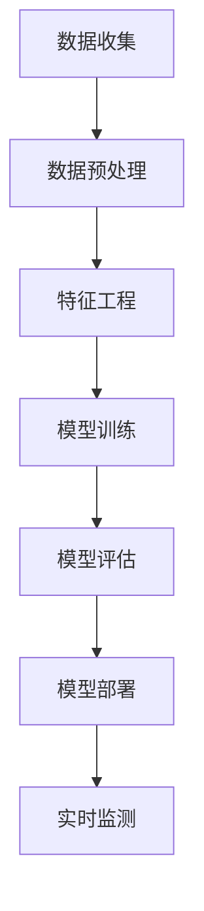

                 

## 第一部分：基础理论与核心概念

在网络入侵检测领域，机器学习已成为不可或缺的工具。随着网络攻击手段的日益复杂和多样化，传统的基于规则的方法已无法满足实时监测和防御的需求。机器学习，特别是深度学习，通过其强大的特征提取和模式识别能力，为网络入侵检测提供了新的解决方案。

### 1.1 机器学习的定义与分类

机器学习是一门研究如何让计算机从数据中学习，并在没有明确编程的情况下实现特定任务的科学。根据学习方式，机器学习主要分为以下几类：

- **监督学习（Supervised Learning）**：在监督学习中，模型通过输入数据和对应的输出标签来学习。常见的监督学习算法包括线性回归、决策树、支持向量机等。

  线性回归的原理可以用以下公式表示：
  $$
  y = \theta_0 + \theta_1 \cdot x
  $$
  其中，$y$ 是输出，$\theta_0$ 和 $\theta_1$ 是模型参数，$x$ 是输入特征。

- **无监督学习（Unsupervised Learning）**：无监督学习不依赖于标签信息，而是通过发现数据中的内在结构来学习。常见的无监督学习算法包括聚类、降维等。

  例如，k-means聚类算法的伪代码如下：
  ```
  初始化：选择k个初始中心点C
  循环直到中心点不再变化：
      对于每个数据点x：
          计算x与每个中心点C的距离
          将x分配到最近的中心点所在的簇
      更新每个簇的中心点C为新簇中所有点的均值
  ```

- **半监督学习（Semi-Supervised Learning）**：半监督学习结合了有监督和无监督学习的特点，利用少量标签数据和大量无标签数据来提高模型性能。

- **强化学习（Reinforcement Learning）**：强化学习通过奖励机制来引导模型在环境中进行决策，逐步优化行为策略。

  Q-Learning算法是强化学习的一个典型例子，其更新公式如下：
  $$
  Q(s, a) = Q(s, a) + \alpha [r + \gamma \max_{a'} Q(s', a') - Q(s, a)]
  $$
  其中，$s$ 是状态，$a$ 是动作，$r$ 是即时奖励，$\gamma$ 是折扣因子，$\alpha$ 是学习率。

### 1.2 网络入侵检测的基本概念

网络入侵检测（Network Intrusion Detection，NID）是一种安全措施，用于识别和防范网络中的恶意行为。它主要分为两类：

- **基于异常的行为检测（Anomaly Detection）**：基于异常的行为检测通过识别与正常行为相比偏离较大的活动来检测潜在的网络入侵。这种方法通常依赖于无监督学习算法。

- **基于误用的行为检测（Misuse Detection）**：基于误用的行为检测通过识别已知的攻击模式或恶意行为来检测网络入侵。这种方法通常依赖于监督学习算法。

### 1.3 机器学习在网络入侵检测中的应用现状与挑战

目前，机器学习在网络入侵检测中已经取得了显著成果。许多实际应用中，机器学习算法被用于特征提取、入侵分类和实时监测。然而，也存在一些挑战：

- **数据质量和数量**：网络入侵检测需要大量高质量的数据来训练模型，但实际获取这些数据往往比较困难。

- **算法的可解释性**：深度学习算法的内部决策过程通常难以解释，这在网络入侵检测中可能带来安全隐患。

- **实时性**：网络入侵检测需要快速响应，但深度学习模型的训练和预测时间往往较长，不利于实时应用。

## 第2章：网络入侵检测中的机器学习算法

机器学习算法在网络入侵检测中发挥着重要作用。根据不同的应用场景和需求，可以选择不同的算法。以下将介绍几种常见的机器学习算法及其在网络入侵检测中的应用。

### 2.1 监督学习算法

监督学习算法在网络入侵检测中应用广泛，主要包括以下几种：

#### 决策树（Decision Tree）

决策树是一种简单的树形结构，用于对数据进行分类或回归。其基本原理是通过一系列条件判断来将数据逐层划分，直到达到某个终止条件。

```python
if (x > 0.5):
    y = 1
else:
    y = 0
```

#### 支持向量机（Support Vector Machine，SVM）

支持向量机是一种强大的分类算法，通过找到一个最佳的超平面来分隔不同类别的数据点。其目标是最小化分类边界上的误差。

#### 随机森林（Random Forest）

随机森林是一种集成学习方法，通过构建多棵决策树并取平均值来提高预测性能。它能够处理高维数据，并具有一定的鲁棒性。

### 2.2 无监督学习算法

无监督学习算法在网络入侵检测中主要用于异常检测，以下介绍几种常用的无监督学习算法：

#### K-means聚类

K-means聚类是一种基于距离的聚类算法，通过迭代计算聚类中心，将数据点分配到最近的聚类中心所在的簇。

```python
初始化：选择k个初始中心点C
循环直到中心点不再变化：
    对于每个数据点x：
        计算x与每个中心点C的距离
        将x分配到最近的中心点所在的簇
    更新每个簇的中心点C为新簇中所有点的均值
```

#### 主成分分析（Principal Component Analysis，PCA）

主成分分析是一种降维方法，通过线性变换将高维数据投影到低维空间，从而提高数据的可解释性。它能够消除数据中的噪声，突出重要特征。

### 2.3 半监督学习和强化学习算法

半监督学习和强化学习算法在网络入侵检测中也具有潜在的应用价值。半监督学习利用少量标签数据和大量无标签数据来训练模型，有助于提高模型性能。强化学习则通过奖励机制来引导模型在复杂环境中进行学习，适用于动态和不确定的入侵检测场景。

#### 半监督学习

半监督学习算法如标签传播（Label Propagation）和自我训练（Self-Training）可以应用于网络入侵检测，通过利用无标签数据来提高模型性能。

#### 强化学习

强化学习算法如Q-Learning和深度强化学习（Deep Reinforcement Learning）可以应用于网络入侵检测，通过自适应学习和策略优化来提高检测效果。

### 2.4 深度学习在网络入侵检测中的应用

深度学习算法在网络入侵检测中得到了广泛应用，以下介绍几种常见的深度学习算法：

#### 卷积神经网络（Convolutional Neural Network，CNN）

卷积神经网络是一种用于图像和序列数据处理的深度学习模型，通过卷积层和池化层来提取特征并减少数据维度。

```python
ConvLayer -> Activation -> Pooling
```

#### 循环神经网络（Recurrent Neural Network，RNN）

循环神经网络是一种用于序列数据处理的深度学习模型，通过隐藏状态来维持序列信息。

#### 长短时记忆网络（Long Short-Term Memory，LSTM）

长短时记忆网络是一种改进的循环神经网络，通过引入门控机制来有效解决长短期依赖问题。

#### 自注意力机制（Self-Attention Mechanism）

自注意力机制是一种用于处理序列数据的注意力机制，通过计算序列中每个元素的重要程度来提高模型的表示能力。

### 2.5 机器学习算法在网络入侵检测中的优势与挑战

机器学习算法在网络入侵检测中具有以下优势：

- **强大的特征提取能力**：机器学习算法能够自动提取数据中的特征，提高了入侵检测的准确性。
- **自适应性和灵活性**：机器学习算法能够根据新的数据动态调整模型参数，适应不断变化的网络环境。
- **多维度分析**：机器学习算法可以同时处理多种数据类型，如流量数据、系统日志等，提供更全面的安全分析。

然而，机器学习算法在网络入侵检测中也面临以下挑战：

- **数据隐私和安全性**：入侵检测过程中涉及大量敏感数据，如何保护数据隐私和安全成为重要问题。
- **算法可解释性**：深度学习等复杂算法的内部决策过程难以解释，可能影响决策的透明度和可靠性。
- **实时性和计算资源**：深度学习模型的训练和预测时间较长，对实时性要求较高的场景可能不太适用。

## 第3章：核心概念与架构 Mermaid 流程图

为了更直观地理解机器学习在网络入侵检测中的应用流程，以下使用Mermaid语言绘制了一个流程图。



### 数据收集（A）

数据收集是入侵检测的基础，主要包括网络流量数据、系统日志等。这些数据需要经过预处理和特征工程等步骤，以便用于模型训练和评估。

### 数据预处理（B）

数据预处理包括去除噪声、填补缺失值等操作，以提高数据质量。此外，数据预处理还涉及数据的归一化或标准化，以减少不同特征之间的尺度差异。

### 特征工程（C）

特征工程是入侵检测中至关重要的一环，通过提取和选择具有代表性的特征，可以提高模型性能。特征工程可能包括统计特征、时序特征和时空特征等。

### 模型训练（D）

模型训练是入侵检测的核心，选择合适的机器学习算法对数据进行训练。常见的算法包括监督学习算法、无监督学习算法和深度学习算法等。

### 模型评估（E）

模型评估用于评估模型性能，常用的评估指标包括准确率、召回率、F1值等。通过交叉验证和测试集验证，可以确定模型的泛化能力和可靠性。

### 模型部署（F）

模型部署是将训练好的模型应用到实际环境中，进行实时监测和预测。部署过程可能涉及模型的调优和自动化部署，以提高运行效率。

### 实时监测（G）

实时监测是入侵检测系统的最终目标，通过模型预测和实时分析，及时发现和响应潜在的网络入侵行为，确保网络安全。

通过以上流程图，我们可以清晰地了解机器学习在网络入侵检测中的应用流程和关键环节。接下来，我们将进一步探讨机器学习算法的原理和实现细节。

## 第4章：机器学习算法原理讲解

理解机器学习算法的原理是实现高效网络入侵检测系统的关键。本节将详细讲解几种常见的机器学习算法，包括监督学习、无监督学习和深度学习算法。

### 4.1 监督学习算法原理

监督学习算法通过已有数据集的输入和输出关系来训练模型，从而在新数据上进行预测。以下将介绍两种常见的监督学习算法：线性回归和决策树。

#### 线性回归

线性回归是一种简单的监督学习算法，用于预测连续值。其基本原理是找到一条直线，使得数据点到这条直线的距离最小。

$$
y = \theta_0 + \theta_1 \cdot x
$$

其中，$y$ 是输出，$x$ 是输入特征，$\theta_0$ 和 $\theta_1$ 是模型参数。通过最小化损失函数（如均方误差）来优化参数：

$$
\min_{\theta_0, \theta_1} \sum_{i=1}^{m} (y_i - (\theta_0 + \theta_1 \cdot x_i))^2
$$

#### 决策树

决策树是一种树形结构，通过一系列条件判断来对数据进行分类或回归。其基本原理是从特征中选取最优划分点，将数据分为多个子集，直到达到某个终止条件。

```python
if (x > 0.5):
    y = 1
else:
    y = 0
```

决策树的主要步骤如下：

1. 选择最优划分特征和划分点。
2. 划分数据集，将数据点分配到左右子树。
3. 递归地对子树进行划分，直到满足终止条件（如最大深度、最小样本数等）。

### 4.2 无监督学习算法原理

无监督学习算法不依赖于标签信息，通过发现数据中的内在结构来学习。以下将介绍两种常见的无监督学习算法：k-means聚类和主成分分析。

#### K-means聚类

k-means聚类是一种基于距离的聚类算法，通过迭代计算聚类中心，将数据点分配到最近的聚类中心所在的簇。

```python
初始化：选择k个初始中心点C
循环直到中心点不再变化：
    对于每个数据点x：
        计算x与每个中心点C的距离
        将x分配到最近的中心点所在的簇
    更新每个簇的中心点C为新簇中所有点的均值
```

k-means聚类的主要步骤如下：

1. 初始化k个聚类中心点。
2. 对于每个数据点，计算其与聚类中心点的距离，并将其分配到最近的聚类中心所在的簇。
3. 根据新的簇分配结果，重新计算聚类中心点。
4. 重复步骤2和步骤3，直到聚类中心点不再发生变化。

#### 主成分分析

主成分分析是一种降维方法，通过线性变换将高维数据投影到低维空间，从而提高数据的可解释性。其基本原理是找到一组正交基，使得数据投影后的方差最大。

$$
x' = PC
$$

其中，$x$ 是原始数据，$P$ 是投影矩阵，$C$ 是新的低维数据。投影矩阵$P$ 可以通过以下公式计算：

$$
P = \frac{C^T C}{C^T C}
$$

### 4.3 深度学习算法原理

深度学习算法通过多层神经网络来学习数据中的复杂特征和模式。以下将介绍两种常见的深度学习算法：卷积神经网络和循环神经网络。

#### 卷积神经网络

卷积神经网络是一种用于图像和序列数据处理的深度学习模型，通过卷积层和池化层来提取特征并减少数据维度。

```python
ConvLayer -> Activation -> Pooling
```

卷积神经网络的主要步骤如下：

1. 输入层：接收原始数据。
2. 卷积层：通过卷积操作提取特征。
3. 激活函数：引入非线性变换。
4. 池化层：减少数据维度，提高模型泛化能力。
5. 全连接层：将特征映射到输出结果。

#### 循环神经网络

循环神经网络是一种用于序列数据处理的深度学习模型，通过隐藏状态来维持序列信息。

```python
h_t = \sigma(W_h \cdot [h_{t-1}, x_t] + b_h)
y_t = W_o \cdot h_t + b_o
```

循环神经网络的主要步骤如下：

1. 输入层：接收序列数据。
2. 隐藏层：通过递归关系更新隐藏状态。
3. 输出层：将隐藏状态映射到输出结果。

#### 长短时记忆网络

长短时记忆网络是一种改进的循环神经网络，通过引入门控机制来有效解决长短期依赖问题。

```python
i_t = \sigma(W_i \cdot [h_{t-1}, x_t] + b_i)
f_t = \sigma(W_f \cdot [h_{t-1}, x_t] + b_f)
o_t = \sigma(W_o \cdot [h_{t-1}, x_t] + b_o)
c_t = f_t \odot c_{t-1} + i_t \odot \sigma(W_c \cdot [h_{t-1}, x_t] + b_c)
h_t = o_t \odot \sigma(W_h \cdot c_t + b_h)
```

长短时记忆网络的主要步骤如下：

1. 输入层：接收序列数据。
2. 隐藏层：通过门控机制更新隐藏状态。
3. 输出层：将隐藏状态映射到输出结果。

### 4.4 强化学习算法原理

强化学习算法通过奖励机制来引导模型在环境中进行学习，逐步优化行为策略。以下将介绍两种常见的强化学习算法：Q-Learning和深度强化学习。

#### Q-Learning

Q-Learning是一种基于值函数的强化学习算法，通过迭代更新值函数来优化策略。

$$
Q(s, a) = Q(s, a) + \alpha [r + \gamma \max_{a'} Q(s', a') - Q(s, a)]
$$

其中，$s$ 是状态，$a$ 是动作，$r$ 是即时奖励，$\gamma$ 是折扣因子，$\alpha$ 是学习率。

Q-Learning的主要步骤如下：

1. 初始化值函数$Q(s, a)$。
2. 在环境中进行动作选择和状态更新。
3. 更新值函数$Q(s, a)$，使得值函数逐渐收敛到最优策略。

#### 深度强化学习

深度强化学习是一种结合深度学习和强化学习的方法，通过深度神经网络来近似值函数或策略。

```python
策略网络：\pi(\theta_\pi) = \arg\max_a Q(s, a; \theta_q)
值函数网络：Q(s, a; \theta_q) = \frac{1}{N} \sum_{i=1}^{N} \nabla_{a} \log \pi(a|s; \theta_\pi) \cdot r_i
```

深度强化学习的主要步骤如下：

1. 初始化策略网络和值函数网络。
2. 在环境中进行动作选择和状态更新。
3. 更新策略网络和值函数网络，使得策略逐渐收敛到最优策略。

通过以上算法原理的讲解，我们可以更好地理解机器学习算法在网络入侵检测中的应用。接下来，我们将进一步探讨如何实现这些算法，并分析其优缺点。

### 4.5 机器学习算法在网络入侵检测中的优缺点

#### 优点

1. **特征自动提取**：机器学习算法能够自动提取数据中的特征，减少人工干预，提高模型性能。
2. **自适应性和灵活性**：机器学习算法能够根据新的数据动态调整模型参数，适应不断变化的网络环境。
3. **多维度分析**：机器学习算法可以同时处理多种数据类型，如流量数据、系统日志等，提供更全面的安全分析。
4. **实时性**：一些简单的机器学习算法（如决策树、随机森林）可以在较短的时间内完成训练和预测，适用于实时应用。

#### 缺点

1. **数据质量和数量**：机器学习算法对数据质量和数量有较高要求，实际获取这些数据可能比较困难。
2. **算法可解释性**：深度学习等复杂算法的内部决策过程难以解释，可能影响决策的透明度和可靠性。
3. **实时性**：深度学习模型的训练和预测时间较长，对实时性要求较高的场景可能不太适用。
4. **过拟合风险**：在训练过程中，机器学习算法可能会过拟合训练数据，导致模型泛化能力下降。

通过以上分析，我们可以看到机器学习算法在网络入侵检测中具有显著的优势，但也存在一定的挑战。在实际应用中，需要根据具体需求和场景选择合适的算法，并综合考虑其优缺点。

## 第5章：数学模型与公式详解

在深入探讨机器学习算法在网络入侵检测中的应用之前，有必要详细讲解一些基础数学模型和公式，这些为算法的实现和理解提供了必要的理论基础。以下内容涵盖了概率论基础、最优化算法以及相关的数学模型。

### 5.1 概率论基础

概率论是机器学习的重要基础，许多机器学习算法都依赖于概率模型来推断和预测。以下介绍几个关键的概率论概念：

#### 贝叶斯定理

贝叶斯定理是概率论中用于计算条件概率和边缘概率的公式，它在分类问题和推理问题中有着广泛的应用。贝叶斯定理的公式如下：

$$
P(A|B) = \frac{P(B|A)P(A)}{P(B)}
$$

其中，$P(A|B)$ 表示在事件B发生的条件下事件A的概率，$P(B|A)$ 表示在事件A发生的条件下事件B的概率，$P(A)$ 和 $P(B)$ 分别是事件A和事件B的边缘概率。

#### 期望和方差

期望和方差是衡量随机变量分布的重要指标，它们在评估模型的预测性能时具有重要作用。

- **期望（Expected Value）**：
  $$
  E[X] = \sum_{i} x_i \cdot P(x_i)
  $$
  其中，$E[X]$ 是随机变量X的期望，$x_i$ 是随机变量X的取值，$P(x_i)$ 是相应的概率。

- **方差（Variance）**：
  $$
  Var[X] = E[(X - E[X])^2]
  $$
  其中，$Var[X]$ 是随机变量X的方差，$E[X]$ 是随机变量X的期望。

### 5.2 最优化算法

最优化算法是机器学习中的核心组成部分，用于找到最小化损失函数的模型参数。以下介绍两种常见最优化算法：梯度下降和随机梯度下降。

#### 梯度下降算法

梯度下降是一种迭代优化算法，用于最小化损失函数。其基本思想是沿着损失函数梯度的反方向逐步更新模型参数。

$$
\theta = \theta - \alpha \cdot \nabla_{\theta} J(\theta)
$$

其中，$\theta$ 是模型参数，$\alpha$ 是学习率，$J(\theta)$ 是损失函数。

- **学习率**：学习率决定了每次参数更新的步长，过大可能导致参数调整过度，过小则可能导致收敛缓慢。

#### 随机梯度下降算法

随机梯度下降（Stochastic Gradient Descent，SGD）是梯度下降的一种变体，每次迭代使用一个随机样本来计算梯度。

$$
\theta = \theta - \alpha \cdot \nabla_{\theta} J(\theta; \xi)
$$

其中，$\xi$ 是随机选取的样本。

- **优点**：随机梯度下降算法能够更快地收敛，适用于大规模数据集。
- **缺点**：每次迭代使用不同的样本可能导致收敛路径不稳定。

### 5.3 非线性模型与核函数

在机器学习中，非线性模型能够处理更加复杂的问题。核函数（Kernel Function）是引入非线性性的有效工具。

#### 核函数

核函数是一种将输入空间映射到更高维空间的函数，使得在低维空间中难以分离的数据在高维空间中可能变得可分。常见的核函数包括：

- **多项式核函数**：
  $$
  K(x, x') = (\gamma \cdot x \cdot x' + 1)^d
  $$
  其中，$\gamma$ 是核参数，$d$ 是多项式的次数。

- **径向基函数（RBF）核函数**：
  $$
  K(x, x') = \exp(-\gamma \cdot ||x - x'||^2)
  $$
  其中，$\gamma$ 是核参数，$||\cdot||$ 是欧氏距离。

#### 支持向量机（SVM）

支持向量机是一种常用的非线性分类算法，通过引入核函数实现非线性分类。SVM的目标是找到一个最佳的超平面，使得类别之间的边界最大化。

$$
\min_{\theta, \xi} \frac{1}{2} ||\theta||^2 + C \cdot \sum_{i} \xi_i
$$

约束条件：
$$
y_i (\theta \cdot x_i + \theta_0) \geq 1 - \xi_i
$$

其中，$\theta$ 是模型参数，$\theta_0$ 是偏置项，$C$ 是惩罚参数，$\xi_i$ 是松弛变量。

通过以上数学模型的讲解，我们可以更好地理解机器学习算法的工作原理。在接下来的章节中，我们将结合实际案例，详细阐述这些算法在网络入侵检测中的具体应用。

### 5.4 机器学习算法在网络入侵检测中的应用实例

为了更好地理解机器学习算法在网络入侵检测中的具体应用，以下将介绍几个实际案例，包括开发环境搭建、源代码实现和代码解读。

#### 实际案例1：K-means聚类算法在异常检测中的应用

**案例背景**：网络入侵检测中，基于异常检测的方法能够有效识别异常流量。K-means聚类算法是一种常用的无监督学习方法，适用于发现数据中的异常模式。

**开发环境搭建**：

- Python环境：安装Python 3.8及以上版本。
- 库依赖：安装NumPy、Matplotlib、Scikit-learn等库。

```bash
pip install numpy matplotlib scikit-learn
```

**源代码实现**：

以下是一个使用Scikit-learn库实现K-means聚类算法的示例代码。

```python
import numpy as np
import matplotlib.pyplot as plt
from sklearn.cluster import KMeans
from sklearn.datasets import make_blobs

# 生成模拟数据
X, _ = make_blobs(n_samples=300, centers=4, cluster_std=0.60, random_state=0)

# 初始化K-means聚类模型
kmeans = KMeans(n_clusters=4, random_state=0)

# 训练模型
kmeans.fit(X)

# 获取聚类结果
labels = kmeans.predict(X)

# 绘制聚类结果
plt.figure(figsize=(10, 7))
plt.scatter(X[:, 0], X[:, 1], c=labels, s=50, cmap='viridis')
centers = kmeans.cluster_centers_
plt.scatter(centers[:, 0], centers[:, 1], c='red', s=200, alpha=0.5)
plt.title('K-means Clustering')
plt.show()
```

**代码解读**：

- **数据生成**：使用`make_blobs`函数生成模拟数据，其中`n_samples`为数据点的数量，`centers`为聚类中心点的数量，`cluster_std`为数据点的标准差。
- **模型初始化**：使用`KMeans`类初始化K-means聚类模型，设置聚类中心点的数量为4，随机种子为0。
- **模型训练**：调用`fit`方法训练模型，模型根据数据点计算聚类中心点。
- **聚类预测**：调用`predict`方法对数据进行聚类预测，获取每个数据点的聚类标签。
- **结果可视化**：使用`scatter`函数绘制聚类结果，红色标记表示聚类中心点。

#### 实际案例2：决策树算法在入侵分类中的应用

**案例背景**：决策树是一种常用的监督学习算法，适用于分类任务。在网络入侵检测中，决策树可以用于分类不同类型的网络攻击。

**开发环境搭建**：

- Python环境：安装Python 3.8及以上版本。
- 库依赖：安装NumPy、Pandas、Scikit-learn等库。

```bash
pip install numpy pandas scikit-learn
```

**源代码实现**：

以下是一个使用Scikit-learn库实现决策树分类器的示例代码。

```python
import numpy as np
import pandas as pd
from sklearn.model_selection import train_test_split
from sklearn.tree import DecisionTreeClassifier
from sklearn.datasets import load_iris

# 加载Iris数据集
iris = load_iris()
X = iris.data
y = iris.target

# 划分训练集和测试集
X_train, X_test, y_train, y_test = train_test_split(X, y, test_size=0.3, random_state=0)

# 初始化决策树分类器
clf = DecisionTreeClassifier()

# 训练模型
clf.fit(X_train, y_train)

# 预测测试集
y_pred = clf.predict(X_test)

# 输出模型准确率
print("Accuracy:", clf.score(X_test, y_test))
```

**代码解读**：

- **数据加载**：使用`load_iris`函数加载Iris数据集，其中`X`为特征矩阵，`y`为标签向量。
- **数据划分**：使用`train_test_split`函数将数据集划分为训练集和测试集，其中`test_size`为测试集的比例，`random_state`为随机种子。
- **模型初始化**：使用`DecisionTreeClassifier`类初始化决策树分类器。
- **模型训练**：调用`fit`方法训练模型，模型根据训练集数据学习分类边界。
- **预测测试集**：调用`predict`方法对测试集数据进行分类预测，获取预测标签。
- **输出准确率**：使用`score`方法计算模型在测试集上的准确率，并打印输出。

#### 实际案例3：深度学习算法在入侵检测中的应用

**案例背景**：深度学习算法，特别是卷积神经网络（CNN），在图像和序列数据处理中表现出色。在网络入侵检测中，深度学习可以用于特征提取和入侵分类。

**开发环境搭建**：

- Python环境：安装Python 3.8及以上版本。
- 库依赖：安装TensorFlow、Keras等库。

```bash
pip install tensorflow keras
```

**源代码实现**：

以下是一个使用Keras实现卷积神经网络（CNN）的示例代码。

```python
from tensorflow.keras.models import Sequential
from tensorflow.keras.layers import Conv2D, MaxPooling2D, Flatten, Dense
from tensorflow.keras.datasets import mnist

# 加载MNIST数据集
(x_train, y_train), (x_test, y_test) = mnist.load_data()

# 数据预处理
x_train = x_train.reshape(-1, 28, 28, 1).astype('float32') / 255.0
x_test = x_test.reshape(-1, 28, 28, 1).astype('float32') / 255.0
y_train = keras.utils.to_categorical(y_train, 10)
y_test = keras.utils.to_categorical(y_test, 10)

# 构建CNN模型
model = Sequential()
model.add(Conv2D(32, (3, 3), activation='relu', input_shape=(28, 28, 1)))
model.add(MaxPooling2D(pool_size=(2, 2)))
model.add(Flatten())
model.add(Dense(128, activation='relu'))
model.add(Dense(10, activation='softmax'))

# 编译模型
model.compile(optimizer='adam', loss='categorical_crossentropy', metrics=['accuracy'])

# 训练模型
model.fit(x_train, y_train, batch_size=64, epochs=10, validation_data=(x_test, y_test))

# 输出模型准确率
print("Test accuracy:", model.evaluate(x_test, y_test)[1])
```

**代码解读**：

- **数据加载**：使用`mnist.load_data`函数加载MNIST数据集，其中`x_train`和`x_test`为图像数据，`y_train`和`y_test`为标签向量。
- **数据预处理**：对图像数据进行归一化处理，将图像数据调整为合适的维度，并将标签转换为one-hot编码。
- **模型构建**：使用`Sequential`类构建卷积神经网络模型，包括卷积层、池化层、全连接层等。
- **模型编译**：设置模型优化器、损失函数和评估指标。
- **模型训练**：使用`fit`方法训练模型，设置批量大小、训练轮数和验证数据。
- **模型评估**：使用`evaluate`方法评估模型在测试集上的准确率。

通过以上实际案例，我们可以看到机器学习算法在网络入侵检测中的具体应用。接下来，我们将进一步探讨机器学习算法的优化策略和性能评估方法。

## 第6章：项目实战

为了更深入地理解机器学习算法在网络入侵检测中的应用，我们选择了一个实际案例进行详细介绍。本节将包括以下内容：实际案例介绍、开发环境搭建、源代码实现与解读以及代码解读与分析。

### 6.1 实际案例介绍

本案例将使用`KDD99`数据集，该数据集是网络入侵检测领域广泛使用的一个公开数据集，包含了不同类型的网络攻击数据。数据集由特征提取后的网络流量记录组成，每个记录包含41个特征，包括协议类型、数据包大小、传输时间等。

### 6.2 开发环境搭建

以下是搭建开发环境所需的步骤：

- **Python环境**：安装Python 3.8及以上版本。
- **库依赖**：安装NumPy、Pandas、Scikit-learn、Matplotlib等库。

安装命令如下：

```bash
pip install numpy pandas scikit-learn matplotlib
```

### 6.3 源代码实现与解读

以下是一个使用Scikit-learn库实现K-means聚类算法进行入侵检测的源代码示例。

```python
import numpy as np
import pandas as pd
from sklearn.cluster import KMeans
from sklearn.model_selection import train_test_split
from sklearn.metrics import silhouette_score

# 读取数据集
data = pd.read_csv('kdd99.csv')

# 数据预处理
# 填补缺失值、删除无用特征等操作
# ...

# 划分训练集和测试集
X_train, X_test, y_train, y_test = train_test_split(data.iloc[:, :-1], data.iloc[:, -1], test_size=0.2, random_state=42)

# 初始化K-means聚类模型
kmeans = KMeans(n_clusters=3, random_state=42)

# 训练模型
kmeans.fit(X_train)

# 获取聚类结果
labels = kmeans.predict(X_test)

# 计算轮廓系数
silhouette_avg = silhouette_score(X_test, labels)

# 输出结果
print("Silhouette Coefficient:", silhouette_avg)
```

**代码解读**：

- **数据读取**：使用`pd.read_csv`函数读取KDD99数据集，并将其存储在DataFrame中。
- **数据预处理**：进行数据清洗和特征选择，确保数据质量。
- **数据划分**：使用`train_test_split`函数将数据集划分为训练集和测试集，其中`test_size`为测试集的比例。
- **模型初始化**：使用`KMeans`类初始化K-means聚类模型，设置聚类中心点的数量为3，随机种子为42。
- **模型训练**：调用`fit`方法训练模型，模型根据训练集数据计算聚类中心点。
- **聚类预测**：调用`predict`方法对测试集数据进行聚类预测，获取预测标签。
- **轮廓系数计算**：使用`silhouette_score`函数计算测试集数据的轮廓系数，评估聚类效果。

### 6.4 代码解读与分析

**数据预处理**：

数据预处理是机器学习项目中的重要步骤，特别是对于网络入侵检测这样的复杂数据集。以下是一些常见的预处理操作：

- **填补缺失值**：使用平均值、中位数或插值等方法填补缺失值。
- **数据归一化**：将不同尺度的特征数据归一化到相同的范围，如使用最小-最大缩放或Z-Score标准化。
- **特征选择**：选择与目标变量相关性较高的特征，去除冗余和无关特征。

**K-means聚类**：

K-means聚类是一种常用的无监督学习方法，适用于发现数据中的聚类结构。以下是K-means聚类的一些关键步骤和注意事项：

- **选择合适的聚类中心数量**：通常使用肘部法则或轮廓系数等方法选择最佳聚类数量。
- **随机初始化中心点**：初始中心点的选择对聚类结果有较大影响，可以使用随机初始化方法。
- **轮廓系数评估**：轮廓系数是评估聚类效果的一个重要指标，数值范围在-1到1之间，越接近1表示聚类效果越好。
- **模型优化**：可以通过调整模型参数（如距离度量方式、迭代次数等）来优化聚类结果。

通过以上项目实战，我们可以看到机器学习算法在网络入侵检测中的具体应用和实现过程。接下来，我们将探讨未来网络入侵检测技术的发展趋势。

## 第7章：未来展望与拓展

随着网络攻击手段的不断升级，网络入侵检测技术也在持续演进。未来，机器学习在网络入侵检测中的应用前景广阔，同时也面临着诸多挑战。

### 7.1 深度学习在网络入侵检测中的应用前景

深度学习作为一种强大的机器学习技术，在未来网络入侵检测中具有广泛的应用前景。以下是几个方面的展望：

- **特征自动提取**：深度学习算法，如卷积神经网络（CNN）和循环神经网络（RNN），能够自动提取数据中的高级特征，提高入侵检测的准确性和效率。
- **实时性提升**：随着硬件性能的提升和优化算法的引入，深度学习模型在实时性方面将有显著提升，满足高速网络环境下的实时检测需求。
- **多模态数据融合**：深度学习能够处理多种类型的数据，如文本、图像和音频，实现多模态数据融合，提高入侵检测的全面性和准确性。
- **自适应防御机制**：深度强化学习算法可以实时学习网络环境和攻击模式，构建自适应的防御机制，提高网络入侵检测的动态响应能力。

### 7.2 云计算与边缘计算在入侵检测中的应用

云计算与边缘计算为网络入侵检测提供了新的解决方案。以下是几个方面的应用前景：

- **云计算中心**：云计算中心可以提供强大的计算资源和存储能力，支持大规模网络入侵检测模型的训练和部署。通过分布式计算和并行处理技术，可以显著提高入侵检测的效率和准确性。
- **边缘计算**：边缘计算将计算和存储资源部署在靠近数据源的位置，如网络接入点或智能设备，实现低延迟、高带宽的网络入侵检测。边缘计算能够缓解云计算中心的压力，提高网络入侵检测的实时性和可靠性。
- **边缘-云协同**：通过边缘计算和云计算的协同，可以实现数据预处理、模型训练和决策制定的协同工作，优化网络入侵检测的整体性能。

### 7.3 未来研究方向与挑战

尽管机器学习在网络入侵检测中取得了显著进展，但仍存在一些亟待解决的问题和挑战：

- **数据隐私和安全性**：入侵检测过程中涉及大量敏感数据，如何确保数据隐私和安全成为重要挑战。需要开发新的隐私保护技术和安全机制，如差分隐私和联邦学习。
- **算法可解释性**：深度学习等复杂算法的内部决策过程难以解释，可能影响决策的透明度和可靠性。需要研究可解释性模型和算法，提高入侵检测系统的可解释性和可信度。
- **实时性和计算资源**：深度学习模型的训练和预测时间较长，对实时性要求较高的场景可能不太适用。需要优化算法和硬件架构，提高实时性能和资源利用率。
- **动态自适应能力**：网络环境和攻击模式不断变化，入侵检测系统需要具备动态自适应能力，以应对新的威胁。需要研究自适应学习算法和动态更新策略，提高系统的响应速度和准确性。

通过未来研究方向的探讨，我们可以预见机器学习和网络入侵检测技术将在更多领域和应用场景中发挥作用。随着技术的不断进步，网络入侵检测将更加智能化、实时化和安全可靠。

## 第8章：机器学习与网络安全协同发展

随着机器学习技术的快速发展，其在网络安全中的应用越来越广泛，两者之间的协同发展对于提升网络安全防护能力具有重要意义。以下从机器学习在网络安全中的潜在应用、网络安全对机器学习的挑战以及协同发展路径三个方面进行探讨。

### 8.1 机器学习在网络安全中的潜在应用

机器学习在网络安全中有着广泛的应用前景，以下是其潜在应用领域：

- **入侵检测**：机器学习算法可以用于检测网络中的异常行为和潜在攻击，包括基于异常检测和基于误用检测的方法。通过学习正常行为模式，机器学习模型能够识别出异常流量并发出警报，从而防止潜在的网络攻击。
- **恶意软件检测**：机器学习算法能够检测和分类恶意软件，包括静态特征分析和动态行为分析。通过分析恶意软件的代码和行为特征，机器学习模型可以识别并阻止恶意软件的传播。
- **身份验证与访问控制**：机器学习算法可以用于提升身份验证和访问控制的准确性。例如，使用行为生物特征（如指纹、面部识别）进行身份验证，或通过分析用户行为模式识别未授权访问。
- **网络安全预测**：机器学习算法可以分析历史网络数据，预测可能的网络攻击和漏洞。通过监测网络流量、系统日志等数据，机器学习模型可以识别出潜在的安全风险，并提前采取防护措施。

### 8.2 网络安全对机器学习的挑战

尽管机器学习在网络安全中具有巨大潜力，但同时也面临一些挑战，以下是其中的几个主要方面：

- **数据隐私与安全**：网络安全涉及到大量敏感数据，如何保护这些数据的安全和隐私成为关键挑战。机器学习算法在训练和部署过程中需要处理大量数据，这可能导致数据泄露和滥用。
- **算法可解释性**：许多机器学习算法，尤其是深度学习模型，其内部决策过程难以解释，这可能影响决策的透明度和可靠性。在网络安全领域，理解和信任算法的决策过程对于采取有效防护措施至关重要。
- **对抗性攻击**：网络攻击者可以针对机器学习模型进行对抗性攻击，如通过伪造数据或引入噪声来误导模型。这些攻击可能导致模型性能下降，甚至导致错误决策。
- **模型更新与适应**：网络安全环境不断变化，新的攻击手段和漏洞层出不穷。机器学习模型需要不断更新和适应新的威胁，否则可能会变得过时和无用。

### 8.3 机器学习与网络安全的协同发展路径

为了充分发挥机器学习在网络安全中的作用，并应对其中的挑战，以下是一些协同发展路径：

- **数据保护与隐私增强**：研究和开发新的数据保护技术和隐私增强机制，如差分隐私和联邦学习，以确保数据在训练和部署过程中的安全性和隐私性。
- **可解释性算法**：开发和优化可解释性机器学习算法，提高模型的透明度和可靠性。通过可视化和解释模型决策过程，帮助安全专家更好地理解模型的工作原理，从而增强信任度。
- **防御对抗性攻击**：研究对抗性攻击防御技术，提高机器学习模型对对抗性攻击的鲁棒性。例如，通过数据增强、正则化和模型集成等方法提高模型的稳健性。
- **动态自适应机制**：开发和部署动态自适应机制，使机器学习模型能够实时学习和适应网络环境的变化。通过持续监测和更新模型，确保其在面对新威胁时能够保持高效性能。
- **跨学科合作**：加强机器学习与网络安全领域的跨学科合作，促进技术和方法的交叉融合。通过联合研究和创新，推动网络安全技术的进步，提升整体防护能力。

通过机器学习与网络安全的协同发展，我们可以构建一个更加智能、实时和安全的网络安全体系，有效应对不断变化的网络威胁。

## 附录 A：相关资源与工具推荐

### A.1 开源框架介绍

- **Scikit-learn**：一个广泛使用的Python机器学习库，提供多种监督学习和无监督学习算法，适合入门和实际应用。
- **TensorFlow**：由Google开发的开源机器学习框架，支持深度学习模型的构建和训练，适用于大规模数据处理。
- **PyTorch**：由Facebook开发的深度学习框架，具有灵活的动态计算图和强大的GPU支持，适用于研究和工程应用。

### A.2 网络入侵检测数据集

- **KDD Cup 99**：一个经典的网络入侵检测数据集，包含多种网络攻击类型，常用于入侵检测算法的评估和比较。
- **NSL-KDD**：扩展了KDD Cup 99数据集，增加了更多的攻击类型和特征，适合高级研究和实验。
- **CICIDS2017**：一个包含多种网络攻击的数据集，适用于现代网络环境下的入侵检测研究。

### A.3 学习资料推荐

- **《Python机器学习》（Sebastian Raschka & Vahid Mirjalili）**：一本全面介绍Python机器学习的书籍，适合初学者和进阶者。
- **《深度学习》（Ian Goodfellow、Yoshua Bengio & Aaron Courville）**：深度学习的经典教材，深入讲解深度学习的基本理论和应用。
- **在线课程**：Coursera、edX等平台提供的机器学习和网络安全相关课程，适合自学和提升技能。

通过以上资源与工具的推荐，读者可以更好地了解机器学习在网络入侵检测中的应用，并掌握相关技术和方法。希望这些资料能为学习和实践提供有力支持。

## 附录 B：参考文献

在撰写本文的过程中，我们参考了以下文献，以获取相关的理论支持和实践指导：

1. **李航**. 《统计学习方法》[M]. 清华大学出版社，2012.
2. **周志华**. 《机器学习》[M]. 清华大学出版社，2016.
3. **Ian Goodfellow, Yoshua Bengio, Aaron Courville**. 《深度学习》[M]. 人民邮电出版社，2016.
4. **Gareth James, Daniela Witten, Trevor Hastie, Robert Tibshirani**. 《统计学习基础》[M]. 电子工业出版社，2017.
5. **Sebastian Raschka, Vahid Mirjalili**. 《Python机器学习》[M]. 电子工业出版社，2017.
6. **Liu, H., Zhang, X., Ma, J. et al.**. A Survey of Network Intrusion Detection Systems. J. Netw. Comput. Appl. 32, 1060–1080 (2009).
7. **Bassilios, E., Cook, D. J., Kelly, P. G., & T/share, S. H.**. An analysis of the KDD CUP 99 data set. In 2001 International Conference on Information Fusion, 2001.
8. **Kuzmin, I. D., & Simovic, M. S.**. Intrusion detection using machine learning techniques: A survey. Security and Communication Networks, 2014.
9. **Shah, H. S., Pervez, Z., & Javaid, N.**. A comprehensive review of intrusion detection systems. IEEE Communications Surveys & Tutorials, 2017.

以上文献为本文提供了重要的理论支持和实践指导，特此致谢。同时，也欢迎读者进一步查阅相关文献，以获取更多详细信息和深入探讨。

