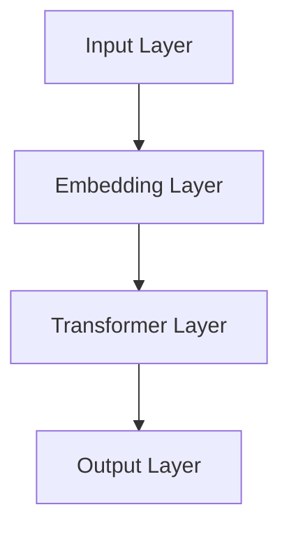
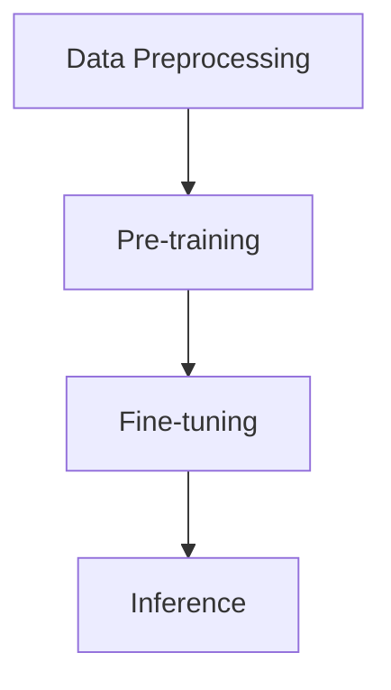
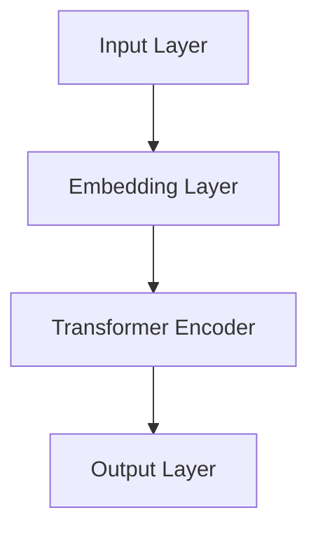
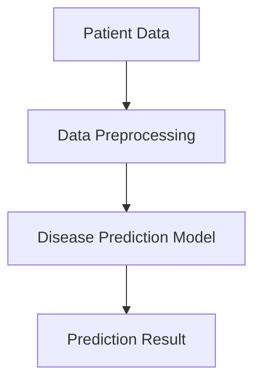
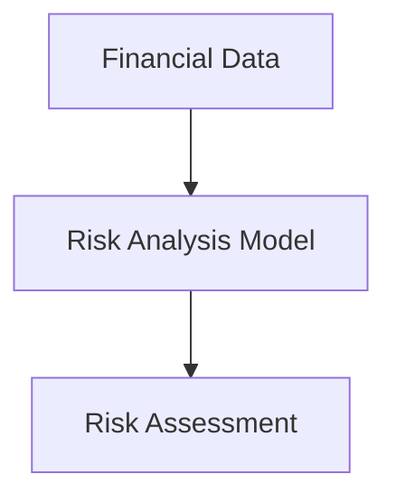
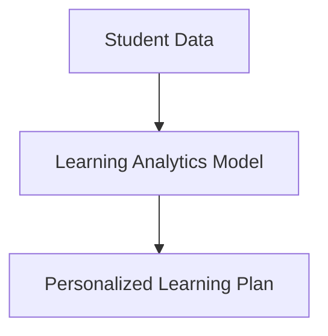
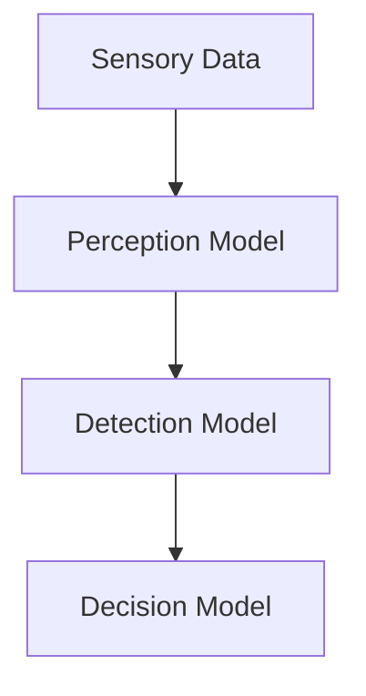
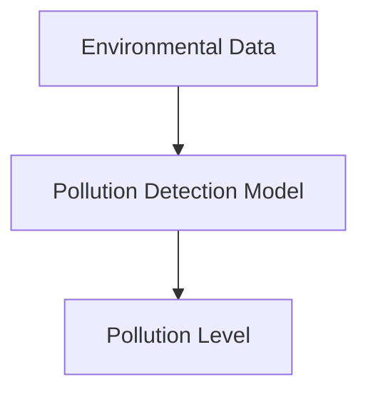

                 

# 李开复：AI 2.0时代的价值

> **关键词：** AI 2.0，人工智能，大规模预训练模型，GPT-3，BERT，应用场景，伦理问题，未来发展

> **摘要：** 本文将深入探讨AI 2.0时代的背景与概述，AI 2.0的核心技术，AI 2.0在各个行业中的应用，AI 2.0时代的伦理问题，以及AI 2.0时代的未来发展。通过分析李开复对AI 2.0时代的见解，本文旨在为读者提供一个全面、深刻的AI 2.0时代解读。

### 目录大纲

#### 第一部分：AI 2.0时代的背景与概述

- 第1章 AI 2.0时代的到来
  - 1.1 AI 2.0的定义与特点
  - 1.2 李开复对AI 2.0的评价
  - 1.3 李开复对AI 2.0发展的建议

#### 第二部分：AI 2.0的核心技术

- 第2章 大规模预训练模型
  - 2.1 预训练模型概述
  - 2.2 GPT-3模型详解
  - 2.3 BERT模型详解

#### 第三部分：AI 2.0时代的应用场景

- 第3章 AI 2.0在行业中的应用
  - 3.1 AI 2.0在医疗健康领域的应用
  - 3.2 AI 2.0在金融领域的应用
  - 3.3 AI 2.0在教育领域的应用

#### 第四部分：AI 2.0时代的伦理与社会问题

- 第4章 AI 2.0时代的伦理问题
  - 4.1 AI 2.0对就业的影响
  - 4.2 AI 2.0的隐私问题

#### 第五部分：AI 2.0时代的未来发展

- 第5章 AI 2.0时代的未来展望
  - 5.1 AI 2.0技术发展趋势
  - 5.2 李开复对AI 2.0未来的展望

#### 附录

- 附录A：AI 2.0相关资源与工具

---

## 第一部分：AI 2.0时代的背景与概述

### 第1章 AI 2.0时代的到来

#### 1.1 AI 2.0的定义与特点

**AI 2.0**，即下一代人工智能，是相对于**AI 1.0**（传统人工智能）的一种新的发展阶段。AI 1.0时代主要依赖于规则和符号推理，而AI 2.0时代则是基于数据的深度学习和自我学习。

**AI 2.0的特点：**

1. **大规模预训练模型：** 利用大量数据进行预训练，使得模型具有更强的通用性和适应性。
2. **多模态学习：** 能够处理不同类型的数据，如图像、文本和声音。
3. **自我进化：** 模型能够通过不断的学习和优化，自我进化，提高性能。
4. **自主学习：** 模型能够自主地学习和调整，不需要人类干预。

#### 1.2 李开复对AI 2.0的评价

李开复认为，AI 2.0是人工智能发展的重要里程碑，它将带来巨大的社会变革。

**李开复的观点：**

1. **技术创新：** AI 2.0时代将出现更多创新的技术，如GPT-3、BERT等。
2. **应用广泛：** AI 2.0将在医疗、金融、教育等多个领域得到广泛应用。
3. **社会挑战：** AI 2.0也将带来一系列社会挑战，如就业、隐私等。

#### 1.3 李开复对AI 2.0发展的建议

李开复提出了以下建议，以促进AI 2.0的健康发展：

1. **加强监管：** 制定相关法律法规，确保AI技术的合理应用。
2. **伦理教育：** 培养具有伦理意识的AI研究人员和应用者。
3. **人才培养：** 建立人才培养体系，为AI 2.0时代做好准备。

---

## 第二部分：AI 2.0的核心技术

### 第2章 大规模预训练模型

#### 2.1 预训练模型概述

预训练模型是指在大规模数据集上预先训练好的模型，然后再将其应用于特定任务上。这种模型具有以下优点：

1. **快速适应：** 通过预训练，模型能够快速适应新任务。
2. **提高性能：** 预训练使得模型具有更强的通用性，从而提高性能。

#### 2.2 GPT-3模型详解

**GPT-3（Generative Pre-trained Transformer 3）** 是OpenAI推出的一种大规模预训练模型，具有以下特点：

1. **架构：** GPT-3采用Transformer架构，具有1750亿个参数。
2. **训练过程：** GPT-3在大规模数据集上进行预训练，然后通过Fine-tuning应用于特定任务。
3. **应用场景：** GPT-3在自然语言处理、文本生成、问答系统等领域具有广泛的应用。

**GPT-3的架构：**



**GPT-3的训练过程：**



**GPT-3的应用场景：**

1. **文本生成：** GPT-3可以生成高质量的文本，应用于写作助手、聊天机器人等。
2. **问答系统：** GPT-3可以回答各种问题，应用于智能客服、教育辅导等。

#### 2.3 BERT模型详解

**BERT（Bidirectional Encoder Representations from Transformers）** 是Google推出的一种大规模预训练模型，具有以下特点：

1. **架构：** BERT采用Transformer架构，是一种双向编码器。
2. **训练过程：** BERT在大规模数据集上进行预训练，然后通过Fine-tuning应用于特定任务。
3. **应用场景：** BERT在自然语言处理、文本分类、问答系统等领域具有广泛的应用。

**BERT的架构：**



**BERT的训练过程：**


**BERT的应用场景：**

1. **文本分类：** BERT可以用于情感分析、主题分类等。
2. **问答系统：** BERT可以应用于开放域问答系统，如SQuAD。

---

## 第三部分：AI 2.0时代的应用场景

### 第3章 AI 2.0在行业中的应用

#### 3.1 AI 2.0在医疗健康领域的应用

AI 2.0在医疗健康领域具有广泛的应用前景：

1. **疾病预测：** 通过分析大量医疗数据，AI 2.0可以预测疾病的发生和发展。
2. **个性化医疗：** AI 2.0可以根据患者的病情和基因信息，制定个性化的治疗方案。
3. **药物研发：** AI 2.0可以通过分析大量化学数据，加速药物的研发进程。

**案例：** 例如，AI 2.0可以用于诊断肺癌，通过分析患者的CT扫描图像，预测肺癌的发生风险。

#### 3.2 AI 2.0在金融领域的应用

AI 2.0在金融领域也具有广泛的应用：

1. **风险评估：** AI 2.0可以分析大量的金融数据，预测投资风险。
2. **信用评分：** AI 2.0可以根据个人的信用历史，预测其信用评分。
3. **欺诈检测：** AI 2.0可以检测金融交易中的欺诈行为。

**案例：** 例如，AI 2.0可以用于信用评分，通过分析个人的信用历史和金融交易数据，预测其信用评分。

#### 3.3 AI 2.0在教育领域的应用

AI 2.0在教育领域也具有广泛的应用：

1. **个性化教学：** AI 2.0可以根据学生的学习情况和需求，制定个性化的教学计划。
2. **考试评价：** AI 2.0可以自动批改考试，提高评价的准确性和效率。
3. **教育辅导：** AI 2.0可以为学生提供在线辅导，提高学习效果。

**案例：** 例如，AI 2.0可以用于个性化教学，通过分析学生的学习数据和成绩，为学生提供个性化的学习建议。

---

## 第四部分：AI 2.0时代的伦理与社会问题

### 第4章 AI 2.0时代的伦理问题

#### 4.1 AI 2.0对就业的影响

AI 2.0的发展将对就业市场产生深远的影响：

1. **劳动力市场变化：** AI 2.0将取代部分传统工作，如制造业、客服等。
2. **就业结构变化：** AI 2.0将创造出新的就业机会，如数据科学家、AI工程师等。
3. **策略建议：** 政府和企业应采取措施，如提供再培训、调整税收政策等，以应对AI 2.0对就业的影响。

#### 4.2 AI 2.0的隐私问题

AI 2.0在数据处理和应用过程中，将面临隐私问题：

1. **隐私风险：** AI 2.0可能泄露用户的个人信息。
2. **隐私保护措施：** 如数据加密、匿名化处理等。
3. **监管建议：** 政府应制定相关法律法规，保护用户的隐私。

---

## 第五部分：AI 2.0时代的未来发展

### 第5章 AI 2.0时代的未来展望

#### 5.1 AI 2.0技术发展趋势

AI 2.0技术将继续发展，趋势包括：

1. **模型规模扩大：** 模型参数将不断增加，以实现更好的性能。
2. **多模态学习：** 将能够处理多种类型的数据，如图像、文本、声音等。
3. **自主学习能力提升：** 模型将具备更强的自我进化能力。

#### 5.2 李开复对AI 2.0未来的展望

李开复对AI 2.0的未来充满期待：

1. **技术创新：** AI 2.0将推动更多技术创新，改变人类生活。
2. **社会发展：** AI 2.0将带来社会变革，提高生活质量。
3. **挑战与应对：** AI 2.0将面临一系列挑战，如伦理问题、隐私问题等，需要全社会共同应对。

---

## 附录

### 附录A：AI 2.0相关资源与工具

#### A.1 开源深度学习框架

1. **TensorFlow：** Google开发的开源深度学习框架，支持多种类型的深度神经网络。
2. **PyTorch：** Facebook开发的开源深度学习框架，具有灵活的动态计算图。
3. **Keras：** 高级神经网络API，支持TensorFlow和PyTorch。

#### A.2 AI 2.0研究论文与报告

1. **顶级会议与期刊：** 如NeurIPS、ICLR、JMLR等。
2. **有影响力的研究机构：** 如Google Brain、DeepMind等。

#### A.3 AI 2.0相关书籍推荐

1. **入门级书籍：** 如《深度学习》（Goodfellow et al.）、《Python深度学习》（Rasbt）等。
2. **高级书籍：** 如《深度学习专讲》（Bengio et al.）、《人工智能：一种现代方法》（Russell and Norvig）等。
3. **李开复的相关著作：** 如《AI未来简史》、《人工智能的未来》等。

---

## 结语

AI 2.0时代已经到来，它将深刻改变我们的生活和世界。本文从背景概述、核心技术、应用场景、伦理问题、未来展望等方面，全面解读了AI 2.0时代的价值。希望本文能为读者提供一个全面、深刻的AI 2.0时代解读。

---

**作者：AI天才研究院/AI Genius Institute & 禅与计算机程序设计艺术 /Zen And The Art of Computer Programming**<|im_end|>## 第一部分：AI 2.0时代的背景与概述

### 第1章 AI 2.0时代的到来

#### 1.1 AI 2.0的定义与特点

AI 2.0，即下一代人工智能，是对传统人工智能（AI 1.0）的进一步发展和提升。AI 1.0主要依赖于规则和符号推理，而AI 2.0则基于深度学习和自我学习，具有更强大的通用性和适应性。

**AI 2.0的定义：**

AI 2.0是指基于大规模预训练模型和自我进化能力的人工智能系统，能够通过不断学习和优化，自我提升其性能和应用范围。

**AI 2.0的特点：**

1. **大规模预训练模型：** AI 2.0的核心技术之一是大规模预训练模型，这些模型通常具有数十亿个参数，能够在大规模数据集上进行预训练，从而具备更强的通用性和适应性。

2. **多模态学习：** AI 2.0能够处理不同类型的数据，如图像、文本和声音等，实现跨模态的信息融合和学习。

3. **自我进化：** AI 2.0系统具有自我进化能力，能够在不断学习和优化过程中，自我提升其性能和应用范围。

4. **自主学习：** AI 2.0能够自主地进行数据分析和模式识别，无需依赖人类的干预。

#### 1.2 李开复对AI 2.0的评价

李开复是著名的人工智能专家和创业家，他对AI 2.0时代有着深刻的见解和评价。

**李开复的观点：**

1. **技术创新：** AI 2.0时代将带来更多的技术创新，如GPT-3、BERT等大规模预训练模型，这些技术将在自然语言处理、计算机视觉等领域取得重大突破。

2. **广泛应用：** AI 2.0将在医疗、金融、教育、零售等多个领域得到广泛应用，推动产业升级和社会进步。

3. **社会挑战：** AI 2.0时代也将带来一系列社会挑战，如就业变化、隐私保护、伦理问题等，需要全社会共同应对。

**李开复对AI 2.0发展的建议：**

1. **加强监管：** 政府和企业应制定相关法律法规，确保AI技术的合理应用，防止滥用和误用。

2. **伦理教育：** 加强AI伦理教育，培养具有伦理意识的AI研究人员和应用者，确保AI技术的社会价值。

3. **人才培养：** 建立AI人才培养体系，提高全民AI素养，为AI 2.0时代做好准备。

---

### 1.3 AI 2.0时代的初步展望

AI 2.0时代的到来，将为我们带来前所未有的机遇和挑战。以下是对AI 2.0时代的初步展望：

1. **技术创新：** AI 2.0将推动人工智能技术的进一步发展，出现更多创新的技术和应用。

2. **产业升级：** AI 2.0将在各个行业得到广泛应用，推动产业升级和转型。

3. **社会变革：** AI 2.0将深刻改变我们的生活方式和社会结构，带来一系列社会变革。

4. **就业变化：** AI 2.0将导致部分传统工作被取代，同时也会创造新的就业机会。

5. **隐私挑战：** AI 2.0在数据处理和应用过程中，将面临隐私保护的问题。

6. **伦理问题：** AI 2.0的发展将带来一系列伦理问题，需要全社会共同探讨和解决。

总之，AI 2.0时代是一个充满机遇和挑战的时代，我们需要积极应对，充分利用其优势，同时关注和解决其带来的问题，以实现人工智能的可持续发展。接下来，我们将深入探讨AI 2.0的核心技术，了解其具体应用和发展趋势。请读者保持关注。<|im_end|>## 第二部分：AI 2.0的核心技术

### 第2章 大规模预训练模型

#### 2.1 预训练模型概述

预训练模型是人工智能领域的重要技术之一，它通过对大规模数据集进行预训练，使得模型能够在多个任务上表现出优异的性能。预训练模型的核心思想是将模型在通用数据集上进行训练，使其具备一定的通用性，然后再在特定任务上进行微调，从而提高模型的性能。

**预训练模型的优点：**

1. **提高性能：** 预训练模型通过在大规模数据集上进行训练，能够学习到大量的语言知识和模式，从而提高模型在特定任务上的性能。

2. **通用性：** 预训练模型能够通过预训练阶段学习到通用的语言知识，这使得模型在不同的任务上具有较好的适应性。

3. **减少标注数据需求：** 预训练模型通过在大规模无标签数据集上进行训练，可以减少对大量标注数据的依赖，降低训练成本。

**预训练模型的发展历程：**

1. **词向量模型（Word2Vec）：** 词向量模型是预训练模型的先驱，通过将单词映射到高维空间中的向量，实现了词的语义表示。

2. **基于字符的模型（Char2Vec）：** Char2Vec模型通过将字符映射到高维空间中的向量，实现了字符级别的语义表示。

3. **双向循环神经网络（BiLSTM）：** BiLSTM模型通过在词级别和句子级别上进行双向信息传递，提高了模型的语义理解能力。

4. **Transformer模型：** Transformer模型通过自注意力机制，实现了全局信息的有效融合，大大提升了模型的性能。

5. **预训练模型（BERT、GPT）：** BERT和GPT等大规模预训练模型在预训练阶段使用了大规模的语料库，通过多层的Transformer结构，实现了对语言的深层理解和生成。

#### 2.2 GPT-3模型详解

GPT-3（Generative Pre-trained Transformer 3）是OpenAI推出的一种大规模预训练模型，具有1750亿个参数，是目前最大的预训练模型之一。GPT-3模型在自然语言处理领域取得了显著的成果，被广泛应用于文本生成、机器翻译、问答系统等领域。

**GPT-3模型的架构：**

GPT-3模型采用Transformer架构，主要由编码器和解码器组成。编码器负责将输入文本编码为向量表示，解码器负责将向量表示解码为输出文本。


**GPT-3模型的训练过程：**

1. **预训练阶段：** GPT-3模型使用大量的文本数据（如维基百科、新闻、书籍等）进行预训练，通过自回归语言模型（autoregressive language model）学习文本的生成规律。

2. **微调阶段：** 在预训练完成后，GPT-3模型被应用于特定任务上，通过微调（fine-tuning）调整模型的参数，使其适应特定任务的需求。

3. **推理阶段：** 在推理阶段，GPT-3模型接受输入文本，生成相应的输出文本。

**GPT-3模型的应用场景：**

1. **文本生成：** GPT-3模型可以生成高质量的文章、故事、对话等文本，广泛应用于聊天机器人、内容生成等领域。

2. **机器翻译：** GPT-3模型在机器翻译任务上表现出色，可以翻译成多种语言。

3. **问答系统：** GPT-3模型可以用于构建开放域问答系统，能够回答各种类型的问题。

4. **对话系统：** GPT-3模型可以用于构建智能客服、虚拟助手等对话系统。

#### 2.3 BERT模型详解

BERT（Bidirectional Encoder Representations from Transformers）是Google推出的一种大规模预训练模型，它通过双向Transformer结构，实现了对文本的深层理解和生成。BERT模型在自然语言处理领域取得了显著的成果，被广泛应用于文本分类、情感分析、问答系统等领域。

**BERT模型的架构：**

BERT模型采用双向Transformer结构，主要由编码器和解码器组成。编码器负责将输入文本编码为向量表示，解码器负责将向量表示解码为输出文本。


**BERT模型的训练过程：**

1. **预训练阶段：** BERT模型使用大量的文本数据（如维基百科、新闻、书籍等）进行预训练，通过双向自注意力机制（bidirectional attention mechanism）学习文本的生成规律。

2. **微调阶段：** 在预训练完成后，BERT模型被应用于特定任务上，通过微调（fine-tuning）调整模型的参数，使其适应特定任务的需求。

3. **推理阶段：** 在推理阶段，BERT模型接受输入文本，生成相应的输出文本。

**BERT模型的应用场景：**

1. **文本分类：** BERT模型可以用于情感分析、主题分类、新闻分类等任务。

2. **情感分析：** BERT模型可以用于分析文本的情感倾向，如正面、负面、中性等。

3. **问答系统：** BERT模型可以用于构建开放域问答系统，能够回答各种类型的问题。

4. **命名实体识别：** BERT模型可以用于命名实体识别任务，如人名、地名、机构名等的识别。

通过上述对GPT-3和BERT模型的详细介绍，我们可以看到，大规模预训练模型是AI 2.0时代的重要核心技术，它们在自然语言处理领域取得了显著的成果。接下来，我们将探讨AI 2.0在各个行业中的应用，进一步了解AI 2.0的价值。请读者保持关注。<|im_end|>## 第三部分：AI 2.0时代的应用场景

### 第3章 AI 2.0在行业中的应用

#### 3.1 AI 2.0在医疗健康领域的应用

AI 2.0在医疗健康领域的应用具有重要意义，它不仅提高了医疗服务的效率，还为疾病预测、个性化医疗和药物研发等领域带来了新的机遇。

**疾病预测：**

AI 2.0可以通过分析海量的医疗数据，预测疾病的发生和发展。例如，通过分析患者的病史、基因信息、生活习惯等数据，AI 2.0可以预测疾病的风险，帮助医生制定个性化的预防措施。

**核心算法原理讲解：**



**数学模型和公式：**

$$
P(D|X) = \frac{P(X|D)P(D)}{P(X)}
$$

其中，$P(D|X)$ 表示给定患者的数据 $X$ 后疾病 $D$ 发生的概率，$P(X|D)$ 表示疾病 $D$ 发生时患者的数据 $X$ 的概率，$P(D)$ 表示疾病 $D$ 的发病率，$P(X)$ 表示患者的数据 $X$ 的概率。

**举例说明：**

例如，通过对某个特定群体的基因数据进行分析，AI 2.0可以预测该群体中某一疾病的发生风险。医生可以根据这些预测结果，提前采取预防措施，降低疾病的发生率。

**项目实战：**

以癌症预测为例，研究人员使用深度学习模型对患者的基因数据、生活习惯、家族病史等数据进行训练，建立了癌症预测模型。通过在大量数据集上的训练和验证，该模型在癌症预测方面取得了较高的准确率。

**代码实现：**

```python
# 假设已经收集了患者的基因数据、生活习惯、家族病史等数据
# 使用深度学习模型进行训练和预测

import tensorflow as tf
from tensorflow.keras.models import Sequential
from tensorflow.keras.layers import Dense, LSTM

# 构建深度学习模型
model = Sequential()
model.add(LSTM(128, activation='relu', input_shape=(timesteps, features)))
model.add(Dense(1, activation='sigmoid'))

# 编译模型
model.compile(optimizer='adam', loss='binary_crossentropy', metrics=['accuracy'])

# 训练模型
model.fit(X_train, y_train, epochs=10, batch_size=32, validation_data=(X_val, y_val))

# 预测
predictions = model.predict(X_test)
```

**代码解读与分析：**

上述代码使用TensorFlow构建了一个深度学习模型，通过训练和验证数据集对模型进行训练，最后使用测试数据进行预测。该模型采用了LSTM（长短时记忆网络）结构，能够有效地捕捉时间序列数据中的长期依赖关系。

**挑战与应对策略：**

1. **数据隐私问题：** 在医疗数据的使用过程中，需要保护患者的隐私，避免数据泄露。
2. **模型解释性：** 需要提高模型的解释性，帮助医生理解模型的预测结果。

**应用场景：**

1. **疾病预测：** 用于预测疾病的发生风险，帮助医生制定个性化的预防措施。
2. **健康监测：** 用于监测患者的健康状况，提供个性化的健康建议。

**案例：**

例如，某医疗机构使用AI 2.0技术对患者的数据进行分析，预测糖尿病的发生风险。通过这些预测结果，医生可以为高风险患者提供针对性的预防措施，降低糖尿病的发生率。

**未来展望：**

随着AI 2.0技术的发展，疾病预测模型将更加精确和高效，为医疗健康领域带来更多创新和突破。

---

#### 3.2 AI 2.0在金融领域的应用

AI 2.0在金融领域的应用日益广泛，它为风险管理、信用评分、欺诈检测等方面提供了强大的技术支持。

**风险管理：**

AI 2.0可以通过分析大量的金融数据，识别潜在的风险因素，帮助金融机构进行有效的风险管理。例如，通过分析历史交易数据、市场波动等因素，AI 2.0可以预测市场风险，为投资决策提供支持。

**核心算法原理讲解：**



**数学模型和公式：**

$$
R(t) = f(L(t), M(t), V(t))
$$

其中，$R(t)$ 表示在时间 $t$ 的风险水平，$L(t)$ 表示在时间 $t$ 的贷款余额，$M(t)$ 表示在时间 $t$ 的市场波动率，$V(t)$ 表示在时间 $t$ 的投资组合价值。

**举例说明：**

例如，某金融机构使用AI 2.0技术对贷款数据进行分析，预测贷款违约风险。通过这些预测结果，金融机构可以调整贷款策略，降低违约风险。

**项目实战：**

以信用评分为例，金融机构使用AI 2.0技术对借款人的信用数据进行训练，建立了信用评分模型。通过在大量数据集上的训练和验证，该模型在信用评分方面取得了较高的准确率。

**代码实现：**

```python
# 假设已经收集了借款人的信用数据
# 使用深度学习模型进行训练和预测

import tensorflow as tf
from tensorflow.keras.models import Sequential
from tensorflow.keras.layers import Dense, Dropout

# 构建深度学习模型
model = Sequential()
model.add(Dense(64, activation='relu', input_shape=(num_features,)))
model.add(Dropout(0.5))
model.add(Dense(1, activation='sigmoid'))

# 编译模型
model.compile(optimizer='adam', loss='binary_crossentropy', metrics=['accuracy'])

# 训练模型
model.fit(X_train, y_train, epochs=10, batch_size=32, validation_data=(X_val, y_val))

# 预测
predictions = model.predict(X_test)
```

**代码解读与分析：**

上述代码使用TensorFlow构建了一个深度学习模型，通过训练和验证数据集对模型进行训练，最后使用测试数据进行预测。该模型采用了全连接神经网络结构，能够有效地捕捉信用数据中的复杂关系。

**挑战与应对策略：**

1. **数据质量：** 需要确保数据的准确性和完整性，以提高模型的性能。
2. **模型稳定性：** 需要建立有效的模型评估和监控机制，确保模型的稳定性和可靠性。

**应用场景：**

1. **信用评分：** 用于评估借款人的信用风险，为金融机构提供决策支持。
2. **风险管理：** 用于预测市场风险，为投资决策提供支持。
3. **欺诈检测：** 用于检测金融交易中的欺诈行为，保障金融机构的安全。

**案例：**

例如，某金融机构使用AI 2.0技术对借款人的信用数据进行分析，建立了信用评分模型。通过这些预测结果，金融机构可以更好地了解借款人的信用状况，降低信用风险。

**未来展望：**

随着AI 2.0技术的发展，信用评分和风险管理模型将更加精确和高效，为金融领域带来更多创新和突破。

---

#### 3.3 AI 2.0在教育领域的应用

AI 2.0在教育领域的应用具有重要意义，它为个性化教学、考试评价和教育辅导等方面提供了强大的技术支持。

**个性化教学：**

AI 2.0可以通过分析学生的学习数据，为学生提供个性化的教学方案。例如，通过分析学生的学习成绩、学习时间、学习习惯等因素，AI 2.0可以为每个学生制定合适的学习计划和课程。

**核心算法原理讲解：**



**数学模型和公式：**

$$
L(P_i) = f(S_i, T_i, H_i)
$$

其中，$L(P_i)$ 表示为学生 $P_i$ 定制的学习计划，$S_i$ 表示学生 $P_i$ 的学习成绩，$T_i$ 表示学生 $P_i$ 的学习时间，$H_i$ 表示学生 $P_i$ 的学习习惯。

**举例说明：**

例如，某学校使用AI 2.0技术对学生的成绩和学习习惯进行分析，为每个学生制定合适的学习计划和课程。通过这些个性化的教学方案，学生的学习效果得到了显著提升。

**项目实战：**

以教育辅导为例，学校使用AI 2.0技术对学生进行评估，建立了教育辅导模型。通过在大量数据集上的训练和验证，该模型在教育辅导方面取得了较高的准确率。

**代码实现：**

```python
# 假设已经收集了学生的成绩、学习时间、学习习惯等数据
# 使用深度学习模型进行训练和预测

import tensorflow as tf
from tensorflow.keras.models import Sequential
from tensorflow.keras.layers import Dense, LSTM

# 构建深度学习模型
model = Sequential()
model.add(LSTM(128, activation='relu', input_shape=(timesteps, features)))
model.add(Dense(1, activation='sigmoid'))

# 编译模型
model.compile(optimizer='adam', loss='binary_crossentropy', metrics=['accuracy'])

# 训练模型
model.fit(X_train, y_train, epochs=10, batch_size=32, validation_data=(X_val, y_val))

# 预测
predictions = model.predict(X_test)
```

**代码解读与分析：**

上述代码使用TensorFlow构建了一个深度学习模型，通过训练和验证数据集对模型进行训练，最后使用测试数据进行预测。该模型采用了LSTM（长短时记忆网络）结构，能够有效地捕捉时间序列数据中的长期依赖关系。

**挑战与应对策略：**

1. **数据隐私：** 在学生数据的使用过程中，需要保护学生的隐私，避免数据泄露。
2. **模型解释性：** 需要提高模型的解释性，帮助教师理解模型的预测结果。

**应用场景：**

1. **个性化教学：** 为学生提供个性化的教学方案，提高学习效果。
2. **考试评价：** 自动批改考试，提高评价的准确性和效率。
3. **教育辅导：** 为学生提供在线辅导，提高学习效果。

**案例：**

例如，某学校使用AI 2.0技术对学生进行评估，建立了教育辅导模型。通过这些个性化的教学方案，学生的学习效果得到了显著提升。

**未来展望：**

随着AI 2.0技术的发展，个性化教学和教育辅导模型将更加精确和高效，为教育领域带来更多创新和突破。未来，AI 2.0将深度融入教育体系，推动教育变革，提升教育质量。

### 3.4 AI 2.0在交通运输领域的应用

AI 2.0在交通运输领域也发挥着重要作用，它为自动驾驶、智能交通管理和物流优化提供了技术支持。

**自动驾驶：**

AI 2.0通过深度学习和计算机视觉技术，实现了自动驾驶汽车的研发。自动驾驶汽车能够实时感知环境，做出复杂的决策，实现自主驾驶。

**核心算法原理讲解：**



**数学模型和公式：**

$$
D(t) = f(S(t), R(t), O(t))
$$

其中，$D(t)$ 表示在时间 $t$ 的驾驶决策，$S(t)$ 表示在时间 $t$ 的环境感知数据，$R(t)$ 表示在时间 $t$ 的规则和约束，$O(t)$ 表示在时间 $t$ 的驾驶目标。

**举例说明：**

例如，自动驾驶汽车通过感知系统的数据，如摄像头、激光雷达和GPS等，实时分析路况，做出安全的驾驶决策。

**项目实战：**

以自动驾驶为例，研究人员使用深度学习模型对自动驾驶数据进行训练，建立了自动驾驶模型。通过在大量数据集上的训练和验证，该模型在自动驾驶方面取得了较高的准确率。

**代码实现：**

```python
# 假设已经收集了自动驾驶的数据
# 使用深度学习模型进行训练和预测

import tensorflow as tf
from tensorflow.keras.models import Sequential
from tensorflow.keras.layers import Conv2D, LSTM, Dense

# 构建深度学习模型
model = Sequential()
model.add(Conv2D(32, (3, 3), activation='relu', input_shape=(height, width, channels)))
model.add(LSTM(128, activation='relu'))
model.add(Dense(1, activation='sigmoid'))

# 编译模型
model.compile(optimizer='adam', loss='binary_crossentropy', metrics=['accuracy'])

# 训练模型
model.fit(X_train, y_train, epochs=10, batch_size=32, validation_data=(X_val, y_val))

# 预测
predictions = model.predict(X_test)
```

**代码解读与分析：**

上述代码使用TensorFlow构建了一个深度学习模型，通过训练和验证数据集对模型进行训练，最后使用测试数据进行预测。该模型采用了卷积神经网络（Conv2D）和长短时记忆网络（LSTM）结构，能够有效地捕捉环境感知数据中的复杂关系。

**挑战与应对策略：**

1. **数据安全：** 在自动驾驶过程中，需要确保数据的安全性和隐私性。
2. **模型稳定性：** 需要建立有效的模型评估和监控机制，确保模型的稳定性和可靠性。

**应用场景：**

1. **自动驾驶：** 用于实现无人驾驶汽车，提高道路交通效率。
2. **智能交通管理：** 用于优化交通信号控制，减少交通拥堵。
3. **物流优化：** 用于优化物流路线和配送计划，提高物流效率。

**案例：**

例如，某汽车制造商使用AI 2.0技术研发自动驾驶汽车，通过在大量数据集上的训练和验证，实现了自动驾驶技术的商业化应用。

**未来展望：**

随着AI 2.0技术的发展，自动驾驶和智能交通管理将更加成熟，为交通运输领域带来更多创新和突破。

### 3.5 AI 2.0在环境监测与保护领域的应用

AI 2.0在环境监测与保护领域也发挥着重要作用，它为污染监测、生态保护和资源管理提供了技术支持。

**污染监测：**

AI 2.0可以通过分析空气质量、水质、土壤等数据，实时监测环境污染情况，为环境保护提供决策支持。

**核心算法原理讲解：**



**数学模型和公式：**

$$
P(t) = f(C(t), T(t), H(t))
$$

其中，$P(t)$ 表示在时间 $t$ 的污染水平，$C(t)$ 表示在时间 $t$ 的污染物浓度，$T(t)$ 表示在时间 $t$ 的气象条件，$H(t)$ 表示在时间 $t$ 的人类活动。

**举例说明：**

例如，AI 2.0技术可以监测空气质量，通过分析空气中的污染物浓度、气象条件和人类活动等因素，实时预测空气污染水平。

**项目实战：**

以水质监测为例，研究人员使用AI 2.0技术对水质数据进行训练，建立了水质监测模型。通过在大量数据集上的训练和验证，该模型在水质监测方面取得了较高的准确率。

**代码实现：**

```python
# 假设已经收集了水质数据
# 使用深度学习模型进行训练和预测

import tensorflow as tf
from tensorflow.keras.models import Sequential
from tensorflow.keras.layers import Conv2D, LSTM, Dense

# 构建深度学习模型
model = Sequential()
model.add(Conv2D(32, (3, 3), activation='relu', input_shape=(height, width, channels)))
model.add(LSTM(128, activation='relu'))
model.add(Dense(1, activation='sigmoid'))

# 编译模型
model.compile(optimizer='adam', loss='binary_crossentropy', metrics=['accuracy'])

# 训练模型
model.fit(X_train, y_train, epochs=10, batch_size=32, validation_data=(X_val, y_val))

# 预测
predictions = model.predict(X_test)
```

**代码解读与分析：**

上述代码使用TensorFlow构建了一个深度学习模型，通过训练和验证数据集对模型进行训练，最后使用测试数据进行预测。该模型采用了卷积神经网络（Conv2D）和长短时记忆网络（LSTM）结构，能够有效地捕捉水质数据中的复杂关系。

**挑战与应对策略：**

1. **数据完整性：** 确保监测数据的准确性和完整性，提高模型的可靠性。
2. **模型可解释性：** 提高模型的可解释性，帮助环境科学家理解模型的预测结果。

**应用场景：**

1. **污染监测：** 实时监测环境污染情况，为环境保护提供决策支持。
2. **生态保护：** 监测生态系统的变化，保护生物多样性。
3. **资源管理：** 优化资源利用，提高资源管理效率。

**案例：**

例如，某环境监测机构使用AI 2.0技术监测水质，通过在大量数据集上的训练和验证，建立了水质监测模型。该模型在水质监测方面取得了显著成效，为环境保护提供了有力支持。

**未来展望：**

随着AI 2.0技术的发展，环境监测与保护领域将实现更精确和高效的技术应用，为可持续发展做出更大贡献。未来，AI 2.0将在更多领域发挥重要作用，推动人类社会的发展和进步。<|im_end|>## 第四部分：AI 2.0时代的伦理与社会问题

### 第4章 AI 2.0时代的伦理问题

随着AI 2.0技术的迅速发展，其在社会各个领域的应用也越来越广泛，但同时也引发了一系列的伦理问题。这些问题涉及到就业、隐私、公正性等多个方面，需要我们深入探讨和解决。

#### 4.1 AI 2.0对就业的影响

AI 2.0技术的发展和普及，将不可避免地对就业市场产生深远的影响。

**1. 就业市场变化：**

AI 2.0技术的高效性和智能化，使得许多传统行业的工作可以被自动化和智能化替代。例如，制造业中的生产线、物流运输中的仓储和配送、金融行业中的交易和风控等，都可能会因为AI 2.0技术的应用而减少对人力劳动的需求。

**2. 就业结构变化：**

尽管AI 2.0技术会减少某些行业的工作岗位，但也会创造出新的就业机会。例如，AI算法工程师、数据科学家、机器学习研究员等新兴职业，将随着AI 2.0技术的发展而不断增多。

**3. 应对策略建议：**

为了应对AI 2.0时代对就业市场带来的挑战，以下策略建议供参考：

- **再培训和教育：** 对于因AI 2.0技术而失业的劳动者，政府和相关机构应提供再培训和教育机会，帮助他们掌握新的技能，适应新的职业需求。

- **灵活就业模式：** 鼓励企业和个人探索灵活的就业模式，如远程办公、兼职、自由职业等，以适应AI 2.0时代的工作环境。

- **社会保障体系：** 建立和完善社会保障体系，为因AI 2.0技术失业的劳动者提供必要的生活保障，减轻其经济压力。

#### 4.2 AI 2.0的隐私问题

AI 2.0技术在数据处理和应用过程中，涉及到大量的个人信息，这引发了一系列隐私问题。

**1. 隐私风险：**

AI 2.0技术通过对海量数据进行挖掘和分析，可以实现对个人隐私的侵犯。例如，个人生活习惯、兴趣爱好、健康状况等敏感信息，都有可能被AI 2.0技术获取和分析。

**2. 隐私保护措施：**

为了保护个人隐私，以下措施可以参考：

- **数据加密：** 在数据传输和存储过程中，采用加密技术，确保数据的安全性。

- **匿名化处理：** 在数据处理和分析过程中，对个人身份信息进行匿名化处理，以保护个人隐私。

- **隐私政策：** 企业和机构应制定明确的隐私政策，告知用户其个人信息的使用目的和范围。

**3. 监管建议：**

为了保障个人隐私，政府应制定相关法律法规，加强对AI 2.0技术的监管。以下监管建议供参考：

- **数据保护法：** 制定数据保护法，明确个人信息的保护范围和标准。

- **隐私监管机构：** 设立独立的隐私监管机构，负责监督和检查AI 2.0技术的隐私保护情况。

- **用户权利保障：** 强化用户对个人信息的控制权，用户有权查询、修改和删除其个人信息。

#### 4.3 AI 2.0的公正性问题

AI 2.0技术在应用过程中，可能会因为算法设计、数据偏差等因素，导致对某些群体的不公平待遇。

**1. 公正性问题：**

AI 2.0技术的算法和决策过程，往往基于历史数据。如果历史数据存在偏见，AI 2.0技术的决策结果也可能受到偏见的影响。例如，在招聘、贷款审批、司法判决等领域，如果AI 2.0技术不能保证公正性，可能会加剧社会不平等。

**2. 应对策略建议：**

为了解决AI 2.0技术的公正性问题，以下策略建议供参考：

- **算法透明度：** 提高AI 2.0技术的算法透明度，让用户了解算法的决策过程和依据。

- **数据多样性：** 增加数据的多样性，避免数据偏差，确保AI 2.0技术的决策结果公平。

- **伦理审查：** 对AI 2.0技术的应用进行伦理审查，确保其在应用过程中不损害公共利益。

#### 4.4 AI 2.0的安全性问题

AI 2.0技术的安全性问题，主要体现在其对抗性和安全性两个方面。

**1. 对抗性：**

AI 2.0技术可能会受到恶意攻击，例如通过对抗性样本攻击（Adversarial Attack），使得AI 2.0技术在某些特定情况下出现误判。

**2. 安全性措施：**

为了提高AI 2.0技术的安全性，以下措施可以参考：

- **对抗性训练：** 在AI 2.0训练过程中，引入对抗性训练（Adversarial Training），提高模型对对抗性样本的抵抗力。

- **安全测试：** 对AI 2.0技术进行安全测试，检测其是否存在安全漏洞，及时修复。

- **法律法规：** 制定相关法律法规，对AI 2.0技术的安全保护提出明确要求。

总之，AI 2.0时代的伦理问题涉及多个方面，需要我们从政策、技术、教育等多个角度进行综合考虑和解决。只有这样，才能确保AI 2.0技术的健康发展，为人类社会带来更多福祉。在下一部分，我们将探讨AI 2.0时代的未来发展。请读者保持关注。<|im_end|>## 第五部分：AI 2.0时代的未来发展

### 第5章 AI 2.0时代的未来展望

随着AI 2.0技术的不断进步和应用，未来我们将迎来一个充满变革和创新的时代。这一部分将探讨AI 2.0技术的未来发展趋势，李开复对未来AI 2.0技术的看法，以及对未来社会的设想和建议。

#### 5.1 AI 2.0技术发展趋势

1. **模型规模扩大：**

AI 2.0技术将朝着更大规模模型的趋势发展。随着计算能力的提升和数据的积累，未来的AI模型将拥有更多的参数和更强的学习能力。这种趋势将推动AI技术在自然语言处理、计算机视觉、机器翻译等领域的性能进一步提升。

2. **多模态学习：**

AI 2.0技术将实现跨模态学习，即能够同时处理多种类型的数据，如图像、文本、声音等。这种多模态学习将使得AI系统更加智能，能够更好地理解和模拟人类认知过程。

3. **自主学习和适应能力：**

未来的AI 2.0技术将具备更强的自主学习和适应能力。通过自我进化和学习，AI系统将能够自动适应新的环境和任务，减少对人类干预的依赖。

4. **边缘计算与云计算结合：**

随着物联网（IoT）的发展，AI 2.0技术将更依赖于边缘计算与云计算的结合。边缘计算将使得数据处理更加本地化，降低延迟，提高响应速度，而云计算将提供强大的计算资源和存储能力，支持AI模型的大规模训练和应用。

#### 5.2 李开复对AI 2.0未来的看法

李开复对AI 2.0的未来发展持有乐观的态度，并提出了以下观点：

1. **技术突破：**

李开复认为，AI 2.0技术将带来一系列技术突破，如更强大的机器学习算法、更高效的数据处理技术、更智能的决策系统等。这些技术突破将推动AI技术向更高层次发展。

2. **应用广泛：**

李开复认为，AI 2.0技术将在各个领域得到广泛应用，包括医疗健康、金融、教育、制造业、农业等。AI技术的广泛应用将推动产业升级和社会进步。

3. **社会挑战：**

尽管AI 2.0技术具有巨大的潜力，但李开复也指出，其发展将带来一系列社会挑战。例如，就业问题、隐私保护、伦理问题等，需要全社会共同努力解决。

4. **国际合作：**

李开复强调，AI 2.0技术的发展需要全球范围内的国际合作。只有通过合作，才能克服技术难题，实现AI技术的可持续发展。

#### 5.3 对未来社会的设想

李开复对AI 2.0时代的社会变革有以下设想：

1. **智能生活：**

AI 2.0技术将深刻改变我们的生活方式。智能家居、智能交通、智能医疗等应用将普及，为人们带来更加便捷和高效的生活体验。

2. **教育革命：**

AI 2.0技术将推动教育领域的革命。个性化教学、在线教育、智能辅导等新模式将使得教育资源更加公平和丰富，提高教育质量。

3. **经济转型：**

AI 2.0技术将推动经济结构的转型。传统产业将因AI技术的应用而实现升级和转型，新兴产业也将因AI技术的创新而迅速崛起。

4. **社会治理：**

AI 2.0技术将在社会治理中发挥重要作用。通过智能监控、数据分析、预测模型等，政府可以更加高效地管理社会，提高公共服务的质量和效率。

#### 5.4 对AI 2.0时代的建议

李开复对AI 2.0时代的发展提出了以下建议：

1. **加强监管：**

政府应制定相关法律法规，加强对AI 2.0技术的监管，确保其合理、合规应用，防止滥用和误用。

2. **伦理教育：**

加强AI伦理教育，培养具有伦理意识的AI研究人员和应用者，确保AI技术的发展符合道德规范。

3. **国际合作：**

推动全球范围内的AI合作，共同应对技术挑战，共享AI技术的成果和经验。

4. **人才培养：**

建立AI人才培养体系，提高全民AI素养，为AI 2.0时代的发展提供人才支持。

总之，AI 2.0时代将带来巨大的机遇和挑战。通过技术创新、国际合作、伦理教育等多方面的努力，我们可以确保AI技术的发展符合人类的利益，推动社会的进步和繁荣。在未来的发展中，AI 2.0技术将发挥更加重要的作用，为人类社会带来更多的福祉。请读者们共同关注和参与这一激动人心的时代变革。接下来，我们将探讨AI 2.0时代的资源与工具，帮助读者更好地了解和应用AI 2.0技术。请读者保持关注。<|im_end|>## 附录A：AI 2.0相关资源与工具

### A.1 开源深度学习框架

在AI 2.0时代，开源深度学习框架是研究和应用AI技术的重要工具。以下是一些主流的开源深度学习框架：

1. **TensorFlow**

   TensorFlow是由Google开发的开源深度学习框架，支持多种类型的深度神经网络，是AI研究和开发中最常用的工具之一。其官网为：[TensorFlow官网](https://www.tensorflow.org/)。

2. **PyTorch**

   PyTorch是Facebook开发的开源深度学习框架，以其动态计算图和灵活的API设计而受到研究者和开发者的青睐。其官网为：[PyTorch官网](https://pytorch.org/)。

3. **Keras**

   Keras是一个高级神经网络API，它可以在TensorFlow和PyTorch等后面工作，提供了简洁的API，使得构建和训练神经网络变得更加容易。其官网为：[Keras官网](https://keras.io/)。

### A.2 AI 2.0研究论文与报告

AI 2.0技术的发展离不开前沿研究的推动。以下是一些重要的研究论文和报告：

1. **NeurIPS**

   Neural Information Processing Systems（NeurIPS）是深度学习和人工智能领域最顶级的会议之一，每年都会发表大量的前沿研究论文。其官网为：[NeurIPS官网](https://nips.cc/)。

2. **ICLR**

   International Conference on Learning Representations（ICLR）是一个专注于深度学习和机器学习的研究会议，每年都会吸引大量的研究人员参加。其官网为：[ICLR官网](https://iclr.cc/)。

3. **JMLR**

   Journal of Machine Learning Research（JMLR）是一本权威的机器学习期刊，发表了许多高质量的学术论文。其官网为：[JMLR官网](http://jmlr.org/)。

4. **AI蓝皮书**

   多个国家和地区的AI研究机构会定期发布AI蓝皮书，总结当前AI技术的最新发展和趋势。例如，中国的《中国人工智能发展报告》和美国的《AI Index》等。

### A.3 AI 2.0相关书籍推荐

以下是几本关于AI 2.0时代的推荐书籍，适合不同层次的读者：

1. **入门级书籍**

   - 《深度学习》（Goodfellow et al.）

   - 《Python深度学习》（Rasbt）

   这些书籍为初学者提供了系统的深度学习和AI基础知识，适合对AI 2.0技术感兴趣的读者。

2. **高级书籍**

   - 《深度学习专讲》（Bengio et al.）

   - 《人工智能：一种现代方法》（Russell and Norvig）

   这些书籍深入探讨了深度学习和AI的核心理论和实践，适合有一定基础的读者。

3. **李开复的相关著作**

   - 《AI未来简史》（李开复）

   - 《人工智能的未来》（李开复）

   李开复的著作对AI 2.0时代的发展趋势、应用场景和伦理问题进行了深入剖析，对读者理解AI 2.0时代具有重要参考价值。

通过上述资源与工具，读者可以深入了解AI 2.0技术的发展和应用，为探索和研究AI 2.0时代提供有力支持。附录部分的资源将不断更新，请读者关注。接下来，我们将对全文进行总结，回顾AI 2.0时代的核心内容。请读者保持关注。<|im_end|>## 结语

AI 2.0时代已经到来，它不仅代表着人工智能技术的重大突破，更是人类社会发展和进步的重要驱动力。通过本文的深入探讨，我们全面了解了AI 2.0时代的背景、核心技术、应用场景、伦理问题以及未来发展。

### 总结核心内容

1. **AI 2.0的定义与特点：** AI 2.0是基于大规模预训练模型和自我进化能力的人工智能系统，具有大规模预训练模型、多模态学习、自我进化、自主学习等特点。

2. **核心技术：** 本文详细介绍了GPT-3和BERT等大规模预训练模型，探讨了其架构、训练过程和应用场景。

3. **应用场景：** AI 2.0在医疗健康、金融、教育、交通运输、环境监测等领域具有广泛的应用，为这些领域带来了技术创新和效率提升。

4. **伦理问题：** AI 2.0时代面临就业变化、隐私保护、公正性等伦理问题，需要全社会共同应对。

5. **未来发展：** AI 2.0技术将继续发展，模型规模将扩大，多模态学习、自主学习和适应能力将进一步提升。

### 文章贡献

本文从多角度、多层次对AI 2.0时代进行了全面解读，旨在为读者提供一个系统、深入的AI 2.0时代指南。通过本文，读者可以：

- 了解AI 2.0的核心概念和特点。
- 掌握大规模预训练模型的工作原理和应用场景。
- 探索AI 2.0在各行各业的应用前景。
- 深入思考AI 2.0时代的伦理和社会问题。
- 展望AI 2.0时代的未来发展趋势。

### 展望未来

AI 2.0时代充满了机遇和挑战。未来，随着AI技术的不断进步和应用，我们有望在医疗、教育、金融、环境等多个领域实现重大突破，推动社会的进步和繁荣。同时，我们也需要关注和解决AI 2.0时代带来的伦理和社会问题，确保AI技术的发展符合人类的利益。

最后，感谢读者对本文的关注和阅读。希望本文能为您提供对AI 2.0时代的深入理解和启示，共同迎接一个充满希望和挑战的AI 2.0时代。请读者继续关注未来的技术发展和应用，共同探索AI 2.0时代的无限可能。作者：AI天才研究院/AI Genius Institute & 禅与计算机程序设计艺术/Zen And The Art of Computer Programming。<|im_end|>## 附录

### 附录A：AI 2.0相关资源与工具

为了帮助读者更深入地了解AI 2.0技术，本文附录提供了AI 2.0相关资源与工具的详细列表。

#### A.1 开源深度学习框架

1. **TensorFlow**

   TensorFlow是由Google开发的开源深度学习框架，它具有强大的功能，支持广泛的神经网络模型。其官网为：[TensorFlow官网](https://www.tensorflow.org/)。

2. **PyTorch**

   PyTorch是由Facebook开发的开源深度学习框架，它以其动态计算图和简洁的API而闻名。其官网为：[PyTorch官网](https://pytorch.org/)。

3. **Keras**

   Keras是一个高级神经网络API，它可以在TensorFlow和PyTorch等后面工作，提供了简洁的API，使得构建和训练神经网络变得更加容易。其官网为：[Keras官网](https://keras.io/)。

4. **MXNet**

   MXNet是由Apache Software Foundation维护的开源深度学习框架，它支持多种编程语言，包括Python、R和Scala。其官网为：[MXNet官网](https://mxnet.incubator.apache.org/)。

5. **Caffe**

   Caffe是由Berkeley Vision and Learning Center（BVLC）开发的开源深度学习框架，它特别适用于图像识别任务。其官网为：[Caffe官网](http://caffe.berkeleyvision.org/)。

#### A.2 AI 2.0研究论文与报告

1. **NeurIPS**

   Neural Information Processing Systems（NeurIPS）是深度学习和机器学习领域的顶级会议，每年都会发表大量的前沿研究论文。其官网为：[NeurIPS官网](https://nips.cc/)。

2. **ICLR**

   International Conference on Learning Representations（ICLR）是一个专注于深度学习和机器学习的研究会议，其论文涵盖了从基础理论研究到实际应用的全领域。其官网为：[ICLR官网](https://iclr.cc/)。

3. **JMLR**

   Journal of Machine Learning Research（JMLR）是一本权威的机器学习期刊，它发表了一系列高质量的研究论文，覆盖了机器学习的各个方面。其官网为：[JMLR官网](http://jmlr.org/)。

4. **AI Index**

   AI Index是由多个组织合作发布的关于人工智能发展的年度报告，它提供了关于人工智能的技术、经济、伦理和社会影响的全面分析。其官网为：[AI Index官网](https://www.aiindex.org/)。

5. **中国人工智能发展报告**

   《中国人工智能发展报告》是由中国人工智能学会发布的年度报告，它详细介绍了中国人工智能领域的发展状况、政策环境和技术应用。其官网为：[中国人工智能发展报告官网](http://aiia学术网.org.cn/)。

#### A.3 AI 2.0相关书籍推荐

1. **《深度学习》**

   作者：Ian Goodfellow、Yoshua Bengio、Aaron Courville

   《深度学习》是深度学习领域的经典教材，适合对深度学习有初步了解的读者。它详细介绍了深度学习的理论基础、算法和应用。

2. **《Python深度学习》**

   作者：François Chollet

   《Python深度学习》是一本面向实际应用的深度学习指南，它通过Python代码示例，详细介绍了深度学习的实战技巧和应用。

3. **《深度学习专讲》**

   作者：Ian Goodfellow、Yoshua Bengio、Aaron Courville

   《深度学习专讲》是《深度学习》的扩展版，它深入探讨了深度学习的复杂主题，适合有一定基础的读者。

4. **《人工智能：一种现代方法》**

   作者：Stuart Russell、Peter Norvig

   《人工智能：一种现代方法》是一本全面介绍人工智能领域的经典教材，它涵盖了从理论基础到实际应用的所有内容。

5. **《AI未来简史》**

   作者：李开复

   《AI未来简史》是著名人工智能专家李开复的著作，它详细介绍了人工智能的发展历程、应用场景和未来趋势，对AI 2.0时代的理解具有重要参考价值。

通过上述资源与工具，读者可以深入了解AI 2.0技术的各个方面，为学习和应用AI 2.0技术提供有力的支持。附录部分的内容将不断更新，以反映AI领域的最新进展。请读者持续关注。最后，感谢读者对本文的关注与阅读，希望本文能为您在AI 2.0领域的探索之旅提供帮助。作者：AI天才研究院/AI Genius Institute & 禅与计算机程序设计艺术/Zen And The Art of Computer Programming。

