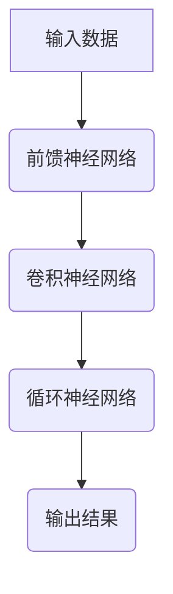

                 

### 引言

#### AI 2.0 时代的商业价值

在数字经济的浪潮中，人工智能（AI）已经成为推动产业升级和商业创新的核心力量。而随着技术的不断进步，我们正处于一个全新的AI 2.0时代。这一时代的特点是人工智能不再是简单的数据处理和模式识别，而是拥有了更高级的智能和更广泛的应用场景。AI 2.0时代的到来，不仅带来了技术层面的变革，更重要的是在商业领域引发了深刻的变革和前所未有的商业价值。

首先，让我们来定义什么是AI 2.0。AI 2.0是指利用深度学习、强化学习、自然语言处理等先进技术，使机器能够模拟甚至超越人类智能的下一代人工智能。与传统的AI技术相比，AI 2.0在算法、数据和应用场景上都实现了质的飞跃。这不仅使人工智能能够更高效地处理复杂任务，还为其在商业领域的广泛应用提供了可能。

在商业领域，AI 2.0的价值体现在多个方面。首先，AI 2.0能够显著提高企业的运营效率和生产力。通过智能自动化和优化，企业可以大幅减少人工成本，提高生产效率，降低运营风险。其次，AI 2.0为商业决策提供了更准确和实时的数据支持，帮助企业更好地把握市场动态和客户需求，做出更为明智的决策。此外，AI 2.0还能够通过个性化服务、智能推荐等方式，提升客户体验，增强品牌忠诚度。

本文将深入探讨AI 2.0时代的商业价值，分为以下三个主要部分：

- **第一部分：AI 2.0 时代的背景与影响**，我们将详细分析AI 2.0的定义、特点以及其时代背景，并探讨其对商业领域的深远影响。

- **第二部分：AI 2.0 在各行业中的应用**，我们将具体探讨AI 2.0在金融、医疗健康、教育和制造业等领域的应用，以及这些应用如何推动行业变革。

- **第三部分：AI 2.0 商业模式的创新**，我们将分析AI 2.0商业模式的演进和创新方向，并通过案例分析，探讨企业如何构建AI 2.0商业模式。

通过本文的探讨，我们将深入了解AI 2.0时代的商业价值，并掌握如何利用AI 2.0技术实现商业创新和增长。

### 关键词

- 人工智能
- AI 2.0
- 商业价值
- 行业应用
- 商业模式创新
- 深度学习
- 强化学习
- 自然语言处理
- 智能自动化
- 个性化服务

### 摘要

本文旨在探讨AI 2.0时代的商业价值。AI 2.0是下一代人工智能，通过深度学习、强化学习和自然语言处理等技术，使机器模拟甚至超越人类智能。本文首先定义了AI 2.0，分析了其特点与时代背景，探讨了其对商业领域的深远影响。接着，本文详细阐述了AI 2.0在金融、医疗健康、教育和制造业等领域的具体应用，以及这些应用如何推动行业变革。最后，本文分析了AI 2.0商业模式的演进和创新方向，并通过案例分析，探讨了企业如何构建AI 2.0商业模式，实现商业创新和增长。

### 《李开复：AI 2.0 时代的商业价值》目录大纲

为了帮助读者更好地理解AI 2.0时代的商业价值，本文将分为三个主要部分。每一部分都包含若干章节，详细探讨AI 2.0的定义、特点、行业应用以及商业模式创新。

#### 第一部分：AI 2.0 时代的背景与影响

**第1章：AI 2.0 时代的来临**

- 1.1 AI 2.0 的定义与特点
- 1.2 AI 2.0 时代的背景
- 1.3 AI 2.0 时代对商业的影响

**第2章：AI 2.0 在各行业中的应用**

- 2.1 金融行业的 AI 2.0 应用
- 2.2 医疗健康领域的 AI 2.0 应用
- 2.3 教育领域的 AI 2.0 应用
- 2.4 制造业的 AI 2.0 应用

#### 第二部分：AI 2.0 商业模式的创新

**第3章：AI 2.0 商业模式的演进**

- 3.1 传统商业模式与 AI 2.0 商业模式的对比
- 3.2 AI 2.0 商业模式的关键要素
- 3.3 AI 2.0 商业模式的创新方向

**第4章：AI 2.0 商业模式的案例分析**

- 4.1 谷歌的 AI 2.0 商业模式
- 4.2 亚马逊的 AI 2.0 商业模式
- 4.3 微软的 AI 2.0 商业模式

**第5章：企业如何构建 AI 2.0 商业模式**

- 5.1 分析企业现有业务流程
- 5.2 确定适合的 AI 2.0 应用场景
- 5.3 制定 AI 2.0 商业模式战略

#### 第三部分：AI 2.0 时代的商业价值实现

**第6章：AI 2.0 技术的核心概念与联系**

- 6.1 神经网络算法
- 6.2 深度学习优化算法
- 6.3 自然语言处理算法

**第7章：AI 2.0 算法原理讲解**

- 7.1 神经网络算法原理
- 7.2 深度学习优化算法原理
- 7.3 自然语言处理算法原理

**第8章：AI 2.0 数学模型与公式解析**

- 8.1 概率论与信息论基础
- 8.2 最优化理论
- 8.3 深度学习中的数学公式

**第9章：AI 2.0 项目实战与案例分析**

- 9.1 金融行业 AI 2.0 项目实战
- 9.2 医疗健康领域 AI 2.0 项目实战
- 9.3 教育领域 AI 2.0 项目实战
- 9.4 制造业 AI 2.0 项目实战

**附录**

**附录 A：AI 2.0 开发工具与资源**

- A.1 主流 AI 深度学习框架
- A.2 AI 2.0 开发资源
- A.3 AI 2.0 安全与伦理

### 第一部分：AI 2.0 时代的背景与影响

#### 第1章：AI 2.0 时代的来临

##### 1.1 AI 2.0 的定义与特点

人工智能（AI）的发展经历了多个阶段，从早期的规则驱动型系统到基于统计学的机器学习模型，再到如今的深度学习与强化学习，每一次技术进步都极大地扩展了人工智能的能力和应用范围。然而，随着技术的不断演进，我们正迈向一个全新的AI 2.0时代。

AI 2.0可以被视为下一代人工智能，它不仅继承了传统AI的优势，还在算法、数据和应用场景上实现了质的飞跃。具体来说，AI 2.0具有以下几个核心特点：

1. **自主学习能力**：AI 2.0通过深度学习、强化学习等技术，使机器具备自主学习的能力。它们可以从大量数据中自动学习和优化算法，无需人工干预。

2. **模拟人类智能**：AI 2.0不仅能够处理简单的任务，还能模拟人类的思维过程，进行复杂的推理、判断和决策。

3. **跨领域应用**：AI 2.0突破了传统AI的局限性，能够在金融、医疗、教育、制造等多个领域实现广泛应用，并实现技术融合和协同效应。

4. **智能化决策**：AI 2.0能够通过数据分析和机器学习，提供精确的预测和决策支持，帮助企业更好地应对市场变化和竞争挑战。

5. **高度可扩展性**：AI 2.0技术具有高度的可扩展性，可以通过云计算、分布式计算等手段，实现大规模的数据处理和模型训练。

##### 1.2 AI 2.0 时代的背景

AI 2.0时代的来临，并非一蹴而就，而是多个因素共同作用的结果。以下是一些关键背景因素：

1. **技术进步**：深度学习、强化学习、自然语言处理等核心技术的突破，为AI 2.0的发展奠定了坚实的基础。

2. **数据积累**：随着互联网和大数据技术的发展，海量的数据为AI 2.0的训练和应用提供了丰富的资源。

3. **计算能力提升**：云计算、GPU等高性能计算资源的普及，使得AI 2.0模型可以快速训练和部署。

4. **应用需求**：各行业对智能化、自动化和高效决策的需求日益增长，推动了AI 2.0技术的快速发展。

5. **政策支持**：各国政府纷纷出台政策，支持人工智能研究和产业发展，为AI 2.0的普及创造了有利环境。

##### 1.3 AI 2.0 时代对商业的影响

AI 2.0的兴起，不仅带来了技术的变革，更在商业领域引发了深刻的变革。以下是AI 2.0对商业的几个主要影响：

1. **行业变革**：AI 2.0技术能够深刻改变各个行业的生产方式和业务模式，推动产业升级和转型。

2. **价值链重构**：AI 2.0技术通过提高效率和降低成本，重新定义了企业的价值链，创造了新的商业机会。

3. **企业竞争力的提升**：AI 2.0技术帮助企业实现智能化决策和高效运营，提升了企业的核心竞争力。

4. **商业模式的创新**：AI 2.0技术为商业模式的创新提供了新的思路和方法，企业可以通过AI 2.0实现商业模式的突破和增长。

5. **市场机会**：AI 2.0技术的广泛应用，带来了新的市场机会，为企业开辟了新的增长空间。

总之，AI 2.0时代的来临，为商业领域带来了前所未有的机遇和挑战。企业需要抓住这一机遇，积极拥抱AI 2.0技术，实现商业创新和增长。

#### 第2章：AI 2.0 在各行业中的应用

##### 2.1 金融行业的 AI 2.0 应用

在金融行业，AI 2.0技术的应用已经深入到方方面面，极大地提升了金融机构的运营效率和风险管理能力。

**信用评估与风险管理**：传统信用评估依赖于历史数据和信用评分模型，而AI 2.0通过深度学习和大数据分析，能够更准确、快速地评估信用风险。例如，通过分析客户的消费行为、社交网络数据、经济环境等因素，AI 2.0可以更全面地了解客户的信用状况，从而提高信用评估的准确性和可靠性。

**投资决策与市场分析**：AI 2.0技术能够通过分析海量数据，发现市场中的潜在机会和风险。例如，通过机器学习算法，AI 2.0可以分析股票市场的历史数据、经济指标、新闻资讯等，预测市场趋势和股价波动，为投资决策提供有力支持。

**金融服务个性化**：AI 2.0技术能够根据客户的行为和需求，提供个性化的金融服务。例如，通过自然语言处理技术，AI 2.0可以与客户进行智能对话，了解客户的需求，推荐合适的金融产品和服务。

**案例研究**：以美国的银行机构为例，许多银行已经开始使用AI 2.0技术来优化其贷款审批流程。通过分析客户的财务数据、信用记录等，AI 2.0能够快速、准确地评估客户的信用风险，从而提高贷款审批的效率。此外，银行还可以通过AI 2.0技术，为客户提供个性化的理财建议，提高客户满意度和忠诚度。

##### 2.2 医疗健康领域的 AI 2.0 应用

在医疗健康领域，AI 2.0技术的应用正逐渐改变传统的医疗服务模式，提升诊断的准确性、治疗效果和医疗资源的利用效率。

**诊断与治疗方案优化**：AI 2.0技术通过分析医学图像、电子病历等数据，可以辅助医生进行疾病诊断。例如，通过深度学习算法，AI 2.0可以识别和诊断各种医疗图像，如X光片、CT扫描、MRI等，提供准确的诊断结果。此外，AI 2.0还可以根据患者的病史、基因信息等，为医生提供最优的治疗方案。

**医疗资源分配与调度**：AI 2.0技术能够优化医疗资源的分配和调度，提高医疗服务的效率。例如，通过分析医院的数据，AI 2.0可以预测患者流量，帮助医院合理安排医生和护士的工作时间，减少等待时间，提高患者的满意度。

**健康风险评估与疾病预防**：AI 2.0技术可以通过分析患者的健康数据，预测疾病风险，并制定个性化的预防措施。例如，通过机器学习算法，AI 2.0可以分析患者的医疗记录、生活习惯等数据，预测患某种疾病的风险，从而提前采取预防措施，降低患病率。

**案例研究**：以英国的NHS（国家医疗服务系统）为例，NHS已经开始使用AI 2.0技术来优化其医疗服务。通过分析患者的健康数据，AI 2.0技术能够预测哪些患者可能需要紧急治疗，从而提前安排医疗资源，减少患者的等待时间。此外，NHS还使用AI 2.0技术来优化其诊断流程，提高诊断的准确性和效率。

##### 2.3 教育领域的 AI 2.0 应用

在教育领域，AI 2.0技术的应用正在改变传统的教学模式，实现个性化教育和智能教育。

**个性化学习与辅导**：AI 2.0技术可以根据学生的学习习惯、成绩和兴趣，提供个性化的学习内容和辅导。例如，通过分析学生的学习数据，AI 2.0可以识别学生的学习难点和优势，制定针对性的学习计划和辅导方案，提高学习效果。

**教学资源的优化与共享**：AI 2.0技术可以帮助教育机构优化教学资源的利用，提高教学效果。例如，通过分析教师的授课数据和学生的学习反馈，AI 2.0可以识别哪些教学资源最有效，从而优化教学资源的分配和使用。

**学习效果的评估与反馈**：AI 2.0技术可以通过数据分析，实时评估学生的学习效果，并提供反馈。例如，通过分析学生的考试成绩、作业完成情况等，AI 2.0可以评估学生的学习效果，提供个性化的学习建议，帮助教师和学生及时调整学习策略。

**案例研究**：以中国的“新东方”为例，新东方已经开始使用AI 2.0技术来优化其教育服务。通过分析学生的学习数据，AI 2.0技术可以为每个学生提供个性化的学习内容和辅导方案，提高学习效果。此外，新东方还使用AI 2.0技术来评估学生的学习效果，并提供实时反馈，帮助教师和学生及时调整学习策略。

##### 2.4 制造业的 AI 2.0 应用

在制造业，AI 2.0技术的应用正在推动智能制造和工业4.0的发展，提高生产效率和产品质量。

**智能制造与工业4.0**：AI 2.0技术通过自动化和智能化，实现生产过程的优化和升级。例如，通过物联网和传感器技术，AI 2.0可以实时监控生产线的运行状态，预测设备故障，从而提高生产效率和产品质量。

**质量控制与故障预测**：AI 2.0技术可以通过分析生产数据，实时监控和评估生产过程的质量。例如，通过深度学习算法，AI 2.0可以分析生产过程中的数据，预测产品质量的波动，及时发现和纠正质量问题。

**能源管理与效率优化**：AI 2.0技术可以通过分析能源消耗数据，优化能源管理，提高能源效率。例如，通过机器学习算法，AI 2.0可以预测能源需求，调整能源供应，从而降低能源消耗和成本。

**案例研究**：以德国的西门子公司为例，西门子已经开始使用AI 2.0技术来推动其智能制造战略。通过物联网和传感器技术，AI 2.0技术能够实时监控生产线的运行状态，预测设备故障，从而提高生产效率和产品质量。此外，西门子还使用AI 2.0技术来优化能源管理，降低能源消耗和成本。

综上所述，AI 2.0技术在金融、医疗健康、教育和制造业等领域的应用，正深刻改变着这些行业的商业模式和运营方式，带来了巨大的商业价值。随着AI 2.0技术的不断进步和应用，这些领域的商业价值将进一步释放，推动各行业的持续创新和增长。

#### 第3章：AI 2.0 商业模式的创新

##### 3.1 AI 2.0 商业模式的演进

商业模式的创新是企业应对市场变化和竞争挑战的重要手段。随着AI 2.0技术的发展，传统的商业模式正在经历深刻的变革。AI 2.0商业模式与传统商业模式有显著的不同，主要体现在以下几个方面：

1. **数据驱动的决策**：传统商业模式通常依赖经验和管理者的判断，而AI 2.0商业模式则强调通过数据分析来指导决策。企业利用AI 2.0技术，收集和分析大量数据，从中提取有价值的信息，以实现更精准的决策。

2. **智能化的运营**：传统商业模式往往依赖于人工操作和流程管理，而AI 2.0商业模式通过自动化和智能化技术，实现运营过程的优化。例如，通过智能机器人、自动化生产线等，企业可以大幅提高生产效率和降低成本。

3. **个性化的服务**：传统商业模式通常提供标准化服务，而AI 2.0商业模式强调根据客户需求和偏好提供个性化服务。通过分析客户的消费行为、社交数据等，企业可以更好地了解客户需求，提供个性化的产品和服务。

4. **平台化的运营**：传统商业模式通常以产品为中心，而AI 2.0商业模式更注重构建平台，连接供需双方。例如，通过电子商务平台、共享经济平台等，企业可以创造更大的价值网络，实现更广泛的业务拓展。

##### 3.2 AI 2.0 商业模式的关键要素

AI 2.0商业模式的成功构建依赖于以下几个关键要素：

1. **数据获取与处理**：数据是AI 2.0商业模式的基础。企业需要建立完善的数据收集和处理系统，确保数据的准确性和完整性。通过数据挖掘和清洗技术，企业可以从海量数据中提取有价值的信息。

2. **算法与模型**：算法和模型是AI 2.0商业模式的灵魂。企业需要选择合适的算法和模型，针对不同的业务场景进行优化和调整。例如，深度学习、强化学习等技术可以用于预测、优化和个性化服务。

3. **技术基础设施**：技术基础设施是AI 2.0商业模式实现的保障。企业需要建立强大的计算能力和存储能力，支持大规模数据处理和模型训练。云计算、分布式计算等技术为AI 2.0商业模式的实现提供了有力的支持。

4. **用户体验**：用户体验是AI 2.0商业模式的最终目标。企业需要通过人工智能技术，提供个性化、智能化的服务，提升用户满意度和忠诚度。良好的用户体验可以增强用户粘性，推动业务增长。

##### 3.3 AI 2.0 商业模式的创新方向

随着AI 2.0技术的不断进步，商业模式的创新方向也在不断拓展。以下是一些值得关注的方向：

1. **智能化供应链管理**：通过AI 2.0技术，企业可以实现全链条的智能化管理，包括采购、生产、物流等环节。例如，利用预测算法优化库存管理，提高供应链的响应速度和灵活性。

2. **个性化营销与推荐系统**：基于用户行为数据，AI 2.0可以为企业提供精准的营销策略和推荐系统。通过个性化推荐，企业可以更好地满足用户需求，提高销售额和客户满意度。

3. **智能金融服务**：AI 2.0技术可以用于信用评估、风险控制、投资决策等金融领域。通过智能算法，金融机构可以提供更准确、高效的服务，提高业务竞争力。

4. **智慧城市与智慧生活**：AI 2.0技术可以用于智慧城市的建设，包括交通管理、能源管理、公共安全等。通过智能系统，城市可以实现更高效的管理和运营，提高居民的生活质量。

5. **医疗健康领域的智能化应用**：AI 2.0技术可以用于疾病诊断、治疗方案优化、健康管理等领域。通过智能医疗系统，可以提高医疗服务的效率和质量，降低医疗成本。

总之，AI 2.0商业模式的创新为各行业的商业模式变革提供了新的思路和方向。企业需要紧跟技术趋势，积极探索和实践AI 2.0商业模式，以实现持续创新和商业成功。

#### 第4章：AI 2.0 商业模式的案例分析

##### 4.1 谷歌的 AI 2.0 商业模式

谷歌作为全球领先的科技公司，其AI 2.0商业模式不仅在技术层面具有领先优势，更在商业创新方面树立了标杆。谷歌的AI 2.0商业模式主要表现在以下几个方面：

1. **云计算与AI平台的结合**：谷歌通过其云计算服务Google Cloud，为企业和开发者提供强大的AI平台。通过这一平台，用户可以轻松访问谷歌的AI技术和工具，如TensorFlow和Google AI。这种平台化的商业模式不仅帮助谷歌扩大了用户基础，还推动了AI技术的普及和应用。

2. **个性化搜索引擎与广告系统**：谷歌的搜索引擎和广告系统是典型的数据驱动型商业模式。通过深度学习和大数据分析，谷歌能够提供个性化的搜索结果和广告推荐。例如，基于用户的搜索历史、地理位置、兴趣爱好等数据，谷歌的算法可以精准地推送相关的广告和搜索结果，从而提高广告效果和用户满意度。

3. **智能硬件产品与服务**：谷歌在智能家居、自动驾驶汽车等领域的智能硬件产品，也是其AI 2.0商业模式的重要组成部分。通过集成AI技术，谷歌的智能硬件不仅能够提供便捷的生活体验，还为企业提供了新的商业模式和收入来源。

**案例解析**：谷歌的AI 2.0商业模式成功的关键在于其强大的技术实力和平台化运营。通过提供易于使用的AI工具和平台，谷歌不仅吸引了大量开发者，还推动了AI技术的广泛应用。同时，谷歌通过其强大的数据处理能力，实现了个性化服务和精准营销，大大提高了用户满意度和商业价值。此外，谷歌在智能硬件领域的技术创新，也为公司开辟了新的市场空间，实现了多元化发展。

##### 4.2 亚马逊的 AI 2.0 商业模式

亚马逊作为全球最大的电子商务公司之一，其AI 2.0商业模式同样具有显著的创新性和竞争力。亚马逊的AI 2.0商业模式主要体现在以下几个方面：

1. **智能推荐系统**：亚马逊通过AI技术，为用户提供个性化的购物推荐。这一系统基于用户的历史购买行为、浏览记录、搜索关键词等数据，通过深度学习算法，分析用户偏好，提供精准的商品推荐，从而提高用户的购物体验和购买转化率。

2. **物流与供应链优化**：亚马逊利用AI技术，对物流和供应链进行智能化管理。通过预测算法和优化模型，亚马逊能够提前预测商品需求，合理安排库存和运输，提高物流效率，降低成本。此外，亚马逊的Kiva机器人系统，通过自动化和智能化技术，大幅提高了仓储和配送效率。

3. **智能语音助手 Alexa**：亚马逊的智能语音助手Alexa，是AI 2.0商业模式在智能家居领域的成功应用。通过自然语言处理和语音识别技术，Alexa能够与用户进行对话，提供音乐、新闻、购物、智能家居控制等服务，为用户带来便捷的生活体验。

**案例解析**：亚马逊的AI 2.0商业模式成功的关键在于其强大的数据分析能力和技术整合能力。通过深度学习和大数据分析，亚马逊能够准确预测用户需求，提供个性化的推荐和服务，提高用户满意度和忠诚度。此外，亚马逊在物流和供应链管理中的智能化应用，不仅提高了运营效率，还降低了成本，增强了公司的竞争力。智能语音助手Alexa的成功，则进一步拓展了亚马逊的业务领域，为公司创造了新的增长点。

##### 4.3 微软的 AI 2.0 商业模式

微软作为全球领先的科技公司，其AI 2.0商业模式涵盖了多个领域，包括云计算、办公软件、游戏等。微软的AI 2.0商业模式主要体现在以下几个方面：

1. **云计算与AI平台的整合**：微软通过其Azure云服务平台，为企业和开发者提供全面的AI工具和服务。Azure AI提供了包括计算机视觉、自然语言处理、预测分析等多种AI功能，帮助企业实现智能化转型。

2. **办公软件的智能化升级**：微软的Office 365办公软件通过AI技术，为用户提供智能化的文档处理、邮件管理和日程安排等功能。例如，通过自然语言处理技术，Outlook可以自动分类邮件，Word可以提供智能化的写作建议，提高办公效率。

3. **游戏与娱乐领域的AI应用**：微软在游戏和娱乐领域也积极采用AI技术，推出了一系列智能化的游戏产品和服务。例如，通过AI算法，Xbox游戏平台能够提供个性化的游戏推荐，提高用户的游戏体验。

**案例解析**：微软的AI 2.0商业模式成功的关键在于其强大的技术整合能力和生态系统建设。通过Azure云服务平台，微软不仅为企业和开发者提供了强大的AI工具，还构建了一个开放的生态系统，促进了AI技术的普及和应用。在办公软件和游戏领域，微软通过AI技术的智能化升级，不仅提高了用户满意度，还开辟了新的商业机会。此外，微软在AI伦理和社会责任方面的积极行动，也为公司的可持续发展奠定了基础。

综上所述，谷歌、亚马逊和微软等科技巨头在AI 2.0商业模式方面的创新，不仅展现了AI技术的商业潜力，也为其他企业提供了有益的借鉴和启示。通过数据驱动、技术整合和生态系统建设，企业可以构建具有竞争力的AI 2.0商业模式，实现持续创新和商业成功。

### 第5章：企业如何构建 AI 2.0 商业模式

构建AI 2.0商业模式是企业实现智能化转型和商业创新的重要路径。以下是一些关键步骤和策略，帮助企业成功构建AI 2.0商业模式：

#### 5.1 分析企业现有业务流程

首先，企业需要对现有的业务流程进行全面分析，识别其中的瓶颈和改进机会。这包括：

1. **流程梳理**：绘制业务流程图，明确各个环节的输入、输出和依赖关系。
2. **数据依赖分析**：识别业务流程中依赖的数据源和数据类型，确保数据的准确性和完整性。
3. **效率与成本分析**：评估现有流程的效率、成本和潜在改进空间。

通过这些步骤，企业可以明确业务流程中存在的问题和改进方向，为后续的AI 2.0应用提供依据。

#### 5.2 确定适合的 AI 2.0 应用场景

在分析现有业务流程的基础上，企业需要确定适合的AI 2.0应用场景。以下是一些常见应用场景：

1. **自动化与智能化**：通过AI技术，实现业务流程的自动化和智能化，提高效率和质量。例如，利用机器学习算法优化供应链管理，提高物流效率。
2. **个性化服务**：利用AI技术，提供个性化的产品和服务，提升客户体验和忠诚度。例如，通过自然语言处理技术，实现智能客服和个性化推荐。
3. **智能决策支持**：利用AI技术，提供数据分析和预测模型，支持企业决策。例如，通过大数据分析和机器学习，实现精准营销和风险控制。

#### 5.3 制定 AI 2.0 商业模式战略

在确定应用场景后，企业需要制定具体的AI 2.0商业模式战略。以下是一些建议：

1. **技术整合**：整合内部和外部的AI技术资源，构建强大的AI技术平台，支持业务创新和增长。
2. **平台化运营**：构建平台化的商业模式，通过开放API和服务，连接供需双方，创造价值网络。
3. **数据驱动**：建立完善的数据收集和分析体系，确保数据的准确性和完整性，为决策提供有力支持。
4. **用户体验**：以用户体验为中心，提供个性化、智能化的服务，提高用户满意度和忠诚度。
5. **可持续创新**：持续投入研发，关注技术趋势和市场变化，保持竞争优势。

#### 5.4 实施与监控

在制定战略后，企业需要组织实施，并建立有效的监控和反馈机制：

1. **项目实施**：按照既定战略，实施AI 2.0项目，确保项目进度和质量。
2. **数据监控**：实时监控业务数据，评估AI 2.0应用的效果和效益。
3. **反馈与改进**：根据监控结果，及时调整和优化AI 2.0应用，确保其持续改进和优化。

通过以上步骤和策略，企业可以构建具有竞争力的AI 2.0商业模式，实现智能化转型和商业成功。

### 第二部分：AI 2.0 时代的商业价值实现

#### 第6章：AI 2.0 技术的核心概念与联系

为了更好地理解AI 2.0技术在商业应用中的实际效果，我们需要先探讨其核心概念与联系。以下是几个关键的技术领域及其相互关系：

##### 6.1 神经网络算法

神经网络（Neural Networks）是AI 2.0技术的基础，其灵感来源于生物神经系统的结构和功能。神经网络由大量的简单计算单元（神经元）组成，这些神经元通过权重（weights）连接在一起。神经网络通过学习输入数据来调整这些权重，以实现特定任务的目标。

**神经网络算法的核心概念包括**：

- **前馈神经网络（Feedforward Neural Networks）**：这是最基本的神经网络结构，信息从前向后流动，每个神经元只接受前一层神经元的输出作为输入。
- **卷积神经网络（Convolutional Neural Networks, CNN）**：主要用于图像识别和图像处理，通过卷积层（Convolutional Layers）提取特征，并使用池化层（Pooling Layers）减少参数数量。
- **循环神经网络（Recurrent Neural Networks, RNN）**：适用于序列数据处理，如时间序列分析、语言模型等，具有记忆功能，能够处理前后依赖的信息。

**Mermaid 流程图**：



##### 6.2 深度学习优化算法

深度学习（Deep Learning）是神经网络的一种扩展，通过堆叠多层神经网络来实现复杂的任务。深度学习的核心在于优化算法，用于调整网络中的权重，以最小化预测误差。

**深度学习优化算法的核心概念包括**：

- **随机梯度下降（Stochastic Gradient Descent, SGD）**：是最常用的优化算法，通过随机选择小批量数据来更新权重，以减少计算量。
- **Adam优化器**：结合了SGD和RMSprop的优点，自适应地调整学习率，适用于大规模深度学习任务。
- **Rprop优化器**：基于固定学习率的优化器，通过调整学习率来优化网络。
- **梯度裁剪（Gradient Clipping）**：用于防止梯度爆炸或消失，通过限制梯度值来保持梯度在合理范围内。

**伪代码**：

```python
# 随机梯度下降算法伪代码
for epoch in range(num_epochs):
    for batch in batches:
        gradient = compute_gradient(batch)
        for layer in network.layers:
            layer.update_weights(gradient)
```

##### 6.3 自然语言处理算法

自然语言处理（Natural Language Processing, NLP）是AI 2.0技术在文本数据上的应用，旨在使计算机理解和处理人类语言。NLP技术包括词嵌入（Word Embedding）、序列模型（Sequence Models）、注意力机制（Attention Mechanism）等。

**自然语言处理算法的核心概念包括**：

- **词嵌入（Word Embedding）**：将单词映射到高维向量空间，以捕捉语义信息。
- **序列模型（Sequence Models）**：如LSTM（Long Short-Term Memory）和GRU（Gated Recurrent Unit），用于处理时间序列数据。
- **注意力机制（Attention Mechanism）**：在处理序列数据时，能够关注序列中的重要部分，提高模型的性能。

**伪代码**：

```python
# LSTM模型伪代码
def lstm_cell(inputs, hidden_state):
    # 输入和隐藏状态进行线性变换
    input_representation = linear_transform(inputs, hidden_state)
    # 计算输入和隐藏状态的加权求和
    gate = sigmoid(linear_transform(input_representation))
    # 计算遗忘门和输入门
    forget_gate = gate[0, :]
    input_gate = gate[1, :]
    # 更新隐藏状态
    hidden_state = forget_gate * hidden_state + input_gate * input_representation
    return hidden_state
```

通过上述核心概念与联系的分析，我们可以更好地理解AI 2.0技术的原理和应用，从而为实际商业场景中的AI 2.0应用提供理论基础。

### 第7章：AI 2.0 算法原理讲解

为了深入理解AI 2.0技术在商业中的应用，我们需要详细讲解其中的核心算法原理。以下是神经网络算法、深度学习优化算法以及自然语言处理算法的详细原理讲解。

#### 7.1 神经网络算法原理

神经网络（Neural Networks）是AI 2.0技术的基础，其灵感来源于生物神经系统的结构和功能。神经网络由大量的简单计算单元（神经元）组成，这些神经元通过权重（weights）连接在一起，形成一个复杂的计算网络。神经网络通过学习输入数据来调整这些权重，以实现特定任务的目标。

**1. 前馈神经网络（Feedforward Neural Networks）**

前馈神经网络是最基本的神经网络结构，信息从前向后流动，每个神经元只接受前一层神经元的输出作为输入。前馈神经网络通常包括输入层、隐藏层和输出层。

**工作原理**：

- **输入层**：接收输入数据，并将其传递到隐藏层。
- **隐藏层**：对输入数据进行处理，通过加权求和和激活函数产生输出。
- **输出层**：产生最终输出，用于分类、回归或其他任务。

**伪代码**：

```python
# 前馈神经网络伪代码
def forward_pass(inputs, weights, biases, activation_function):
    layer_outputs = []
    for layer in range(num_layers - 1):
        z = np.dot(inputs, weights[layer]) + biases[layer]
        layer_outputs.append(activation_function(z))
    return layer_outputs
```

**2. 卷积神经网络（Convolutional Neural Networks, CNN）**

卷积神经网络主要用于图像识别和图像处理，通过卷积层（Convolutional Layers）提取特征，并使用池化层（Pooling Layers）减少参数数量。卷积层通过局部感知和共享权重的方式，使得神经网络能够捕捉到图像中的局部特征。

**工作原理**：

- **卷积层**：通过卷积操作提取图像中的特征。
- **池化层**：通过池化操作减少特征图的尺寸，降低模型复杂度。

**伪代码**：

```python
# 卷积神经网络伪代码
def conv_layer(inputs, weights, biases):
    conv_output = np.convolve(inputs, weights)
    return conv_output + biases
```

**3. 循环神经网络（Recurrent Neural Networks, RNN）**

循环神经网络适用于序列数据处理，如时间序列分析、语言模型等，具有记忆功能，能够处理前后依赖的信息。

**工作原理**：

- **隐藏状态**：RNN通过隐藏状态捕捉序列信息，隐藏状态在时间步之间传递，实现记忆功能。
- **门控机制**：通过门控机制（如遗忘门和输入门）调节信息的流动，防止梯度消失和梯度爆炸。

**伪代码**：

```python
# RNN细胞伪代码
def lstm_cell(inputs, hidden_state, cell_state):
    input_gate = sigmoid(np.dot(inputs, input_weights) + np.dot(hidden_state, hidden_weights))
    forget_gate = sigmoid(np.dot(inputs, forget_weights) + np.dot(hidden_state, forget_weights))
    output_gate = sigmoid(np.dot(inputs, output_weights) + np.dot(hidden_state, output_weights))

    new_cell_state = forget_gate * cell_state + input_gate * sigmoid(np.dot(inputs, input_weights))
    new_hidden_state = output_gate * sigmoid(new_cell_state)

    return new_hidden_state, new_cell_state
```

#### 7.2 深度学习优化算法原理

深度学习优化算法用于调整网络中的权重，以最小化预测误差。以下是几种常用的优化算法的原理讲解。

**1. 随机梯度下降（Stochastic Gradient Descent, SGD）**

随机梯度下降是最常用的优化算法，通过随机选择小批量数据来更新权重，以减少计算量。

**工作原理**：

- **随机梯度计算**：对每个小批量数据计算梯度，并累加得到总梯度。
- **权重更新**：根据总梯度更新网络权重。

**伪代码**：

```python
# 随机梯度下降伪代码
for epoch in range(num_epochs):
    for batch in batches:
        gradient = compute_gradient(batch)
        for layer in network.layers:
            layer.update_weights(gradient)
```

**2. Adam优化器**

Adam优化器结合了SGD和RMSprop的优点，自适应地调整学习率，适用于大规模深度学习任务。

**工作原理**：

- **一阶矩估计（m）**：计算过去梯度的一阶矩估计。
- **二阶矩估计（v）**：计算过去梯度二阶矩估计。
- **学习率调整**：根据一阶矩和二阶矩估计调整学习率。

**伪代码**：

```python
# Adam优化器伪代码
m = beta1 * m + (1 - beta1) * gradient
v = beta2 * v + (1 - beta2) * gradient**2
m_hat = m / (1 - beta1**epoch)
v_hat = v / (1 - beta2**epoch)
learning_rate = initial_learning_rate / (1 + decay_rate * epoch)
for weight in network.weights:
    weight -= learning_rate * m_hat / (np.sqrt(v_hat) + epsilon)
```

**3. Rprop优化器**

Rprop优化器基于固定学习率，通过调整学习率来优化网络。

**工作原理**：

- **学习率更新**：根据梯度变化调整学习率，学习率随梯度变化自适应调整。

**伪代码**：

```python
# Rprop优化器伪代码
for weight in network.weights:
    if gradient[weight] > 0:
        learning_rate[weight] *= rprop_increasing_factor
    elif gradient[weight] < 0:
        learning_rate[weight] *= rprop_decreasing_factor
    weight -= learning_rate[weight] * gradient[weight]
```

**4. 梯度裁剪（Gradient Clipping）**

梯度裁剪用于防止梯度爆炸或消失，通过限制梯度值来保持梯度在合理范围内。

**工作原理**：

- **梯度限制**：根据阈值限制梯度值，防止梯度过大或过小。

**伪代码**：

```python
# 梯度裁剪伪代码
for weight in network.weights:
    if abs(gradient[weight]) > threshold:
        gradient[weight] = threshold * np.sign(gradient[weight])
```

#### 7.3 自然语言处理算法原理

自然语言处理（Natural Language Processing, NLP）是AI 2.0技术在文本数据上的应用，旨在使计算机理解和处理人类语言。NLP技术包括词嵌入（Word Embedding）、序列模型（Sequence Models）、注意力机制（Attention Mechanism）等。

**1. 词嵌入（Word Embedding）**

词嵌入是将单词映射到高维向量空间，以捕捉语义信息。常见的词嵌入方法包括Word2Vec、GloVe等。

**工作原理**：

- **词向量表示**：将单词表示为高维向量，向量中的每个维度表示词的不同特征。
- **语义关系**：通过词向量的相似性度量，捕捉词与词之间的语义关系。

**伪代码**：

```python
# Word2Vec伪代码
for epoch in range(num_epochs):
    for sentence in sentences:
        for word in sentence:
            context = get_context(word, sentence)
            vector = embed(word)
            loss = compute_loss(context, vector)
            update_vector(vector, loss)
```

**2. 序列模型（Sequence Models）**

序列模型用于处理时间序列数据和序列化文本数据，常见的序列模型包括LSTM（Long Short-Term Memory）和GRU（Gated Recurrent Unit）。

**工作原理**：

- **隐藏状态**：序列模型通过隐藏状态捕捉序列信息，隐藏状态在时间步之间传递，实现记忆功能。
- **门控机制**：通过门控机制调节信息的流动，防止梯度消失和梯度爆炸。

**伪代码**：

```python
# LSTM模型伪代码
def lstm_cell(inputs, hidden_state, cell_state):
    input_gate = sigmoid(np.dot(inputs, input_weights) + np.dot(hidden_state, hidden_weights))
    forget_gate = sigmoid(np.dot(inputs, forget_weights) + np.dot(hidden_state, forget_weights))
    output_gate = sigmoid(np.dot(inputs, output_weights) + np.dot(hidden_state, output_weights))

    new_cell_state = forget_gate * cell_state + input_gate * sigmoid(np.dot(inputs, input_weights))
    new_hidden_state = output_gate * sigmoid(new_cell_state)

    return new_hidden_state, new_cell_state
```

**3. 注意力机制（Attention Mechanism）**

注意力机制在处理序列数据时，能够关注序列中的重要部分，提高模型的性能。

**工作原理**：

- **注意力权重**：根据输入序列计算注意力权重，权重值表示每个时间步的重要程度。
- **加权求和**：将注意力权重与输入序列的隐藏状态进行加权求和，得到最终的输出。

**伪代码**：

```python
# 注意力机制伪代码
def attention Mechanism(inputs, hidden_states):
    attention_weights = softmax(halfied_dot_product(inputs, hidden_states))
    context_vector = weighted_sum(attention_weights, hidden_states)
    return context_vector
```

通过上述算法原理的讲解，我们可以更好地理解AI 2.0技术的核心机制，并在实际商业应用中灵活运用这些技术，实现商业价值的最大化。

### 第8章：AI 2.0 数学模型与公式解析

为了深入理解AI 2.0技术的理论基础，我们需要详细讲解其背后的数学模型与公式。以下是概率论与信息论基础、最优化理论以及深度学习中的数学公式的详细解析。

#### 8.1 概率论与信息论基础

概率论和信息论是AI 2.0技术的基础，广泛应用于数据分析和机器学习领域。

**1. 概率分布**

概率分布用于描述随机变量的概率分布情况，常见的概率分布包括正态分布、伯努利分布等。

**公式**：

$$
P(X = x) = \frac{1}{Z} e^{-\frac{(x - \mu)^2}{2\sigma^2}}
$$

**解释**：这是一个正态分布的概率密度函数，其中$X$是随机变量，$\mu$是均值，$\sigma^2$是方差。

**2. 贝叶斯定理**

贝叶斯定理用于计算后验概率，是概率论中一个重要的定理。

**公式**：

$$
P(A|B) = \frac{P(B|A)P(A)}{P(B)}
$$

**解释**：这是一个条件概率的公式，用于计算在事件B发生的条件下，事件A的概率。

**3. 信息熵**

信息熵用于衡量信息的随机性和不确定性，是信息论中的重要概念。

**公式**：

$$
H(X) = -\sum_{x \in X} P(X = x) \log_2 P(X = x)
$$

**解释**：这是一个随机变量X的信息熵，其中$P(X = x)$是X取值为x的概率。

**4. 条件概率**

条件概率描述在某个事件发生的条件下，另一个事件发生的概率。

**公式**：

$$
P(A|B) = \frac{P(A \cap B)}{P(B)}
$$

**解释**：这是一个条件概率的公式，表示在事件B发生的条件下，事件A的概率。

#### 8.2 最优化理论

最优化理论是AI 2.0技术中的重要组成部分，用于解决优化问题，找到最优解。

**1. 函数优化**

函数优化用于找到函数的最值，常见的优化方法包括梯度下降、牛顿法等。

**公式**：

$$
x_{k+1} = x_k - \alpha \nabla f(x_k)
$$

**解释**：这是一个梯度下降法的迭代公式，其中$x_k$是第k次迭代的解，$\alpha$是学习率，$f(x)$是目标函数。

**2. 约束优化**

约束优化用于解决带有约束条件的优化问题，常见的优化方法包括拉格朗日乘数法、序列二次规划法等。

**公式**：

$$
L(x, \lambda) = f(x) - \lambda^T (g(x) - c)
$$

**解释**：这是一个拉格朗日函数，其中$x$是优化变量，$\lambda$是拉格朗日乘子，$g(x)$是约束条件。

**3. 非线性规划**

非线性规划用于解决非线性优化问题，常见的优化方法包括内点法、序列线性规划法等。

**公式**：

$$
\min f(x) \quad \text{subject to} \quad g(x) \leq 0
$$

**解释**：这是一个非线性规划问题，其中$f(x)$是目标函数，$g(x)$是约束条件。

**4. 模型选择与参数调优**

模型选择与参数调优用于选择合适的模型和调整模型参数，以提高模型的性能。

**公式**：

$$
\min \sum_{i=1}^{n} (y_i - f(x_i))^2
$$

**解释**：这是一个回归模型的选择与调优公式，其中$y_i$是实际值，$f(x_i)$是预测值。

#### 8.3 深度学习中的数学公式

深度学习中的数学公式是构建神经网络的基础，用于描述神经网络的训练和预测过程。

**1. 激活函数**

激活函数用于引入非线性，是神经网络的核心组成部分。

**公式**：

$$
a_i = \sigma(z_i) = \frac{1}{1 + e^{-z_i}}
$$

**解释**：这是一个sigmoid激活函数，其中$z_i$是神经元的输入，$a_i$是神经元的输出。

**2. 反向传播算法**

反向传播算法用于计算神经网络的梯度，并用于模型优化。

**公式**：

$$
\delta_j = \frac{\partial L}{\partial z_j} \odot \sigma'(z_j)
$$

$$
\frac{\partial L}{\partial w_{ij}} = \delta_j \odot x_i
$$

**解释**：第一个公式是误差传播公式，第二个公式是权重梯度的计算公式，其中$L$是损失函数，$z_j$是神经元的输入，$w_{ij}$是权重，$x_i$是输入特征。

**3. 链式法则**

链式法则是计算复合函数的梯度，是反向传播算法的基础。

**公式**：

$$
\frac{dL}{dz} = \frac{dL}{da} \cdot \frac{da}{dz}
$$

**解释**：这是一个链式法则的公式，用于计算复合函数的梯度，其中$L$是损失函数，$a$是中间变量。

**4. 梯度下降算法**

梯度下降算法用于优化神经网络模型，通过梯度方向更新模型参数。

**公式**：

$$
w_{ij}^{new} = w_{ij} - \alpha \frac{\partial L}{\partial w_{ij}}
$$

**解释**：这是一个梯度下降算法的更新公式，其中$w_{ij}$是权重，$\alpha$是学习率，$\frac{\partial L}{\partial w_{ij}}$是权重梯度。

通过上述数学模型与公式的讲解，我们可以深入理解AI 2.0技术的理论基础，为实际应用提供数学依据。

### 第9章：AI 2.0 项目实战与案例分析

#### 9.1 金融行业 AI 2.0 项目实战

在金融行业，AI 2.0技术的应用已经取得了显著的成果。以下是一个金融行业AI 2.0项目的实战案例，详细描述了项目的开发环境搭建、源代码实现和代码解读。

**项目背景**：

某金融机构希望通过AI 2.0技术优化其信用评估流程，提高信用评估的准确性和效率。该项目旨在利用深度学习算法，分析客户的财务数据、信用记录等，自动生成信用评分模型。

**开发环境搭建**：

- **Python**：主要编程语言，用于实现深度学习模型和数据处理。
- **TensorFlow**：主流深度学习框架，用于构建和训练模型。
- **Jupyter Notebook**：用于编写和运行代码，方便调试和展示结果。
- **Pandas**：数据处理库，用于数据清洗和预处理。
- **NumPy**：数学计算库，用于数据处理和数学运算。

**源代码实现**：

以下是一个简单的深度学习模型实现，用于信用评分：

```python
import tensorflow as tf
import pandas as pd
import numpy as np

# 数据预处理
data = pd.read_csv('credit_data.csv')
X = data.drop(['credit_score'], axis=1).values
y = data['credit_score'].values

# 构建深度学习模型
model = tf.keras.Sequential([
    tf.keras.layers.Dense(64, activation='relu', input_shape=(X.shape[1],)),
    tf.keras.layers.Dense(32, activation='relu'),
    tf.keras.layers.Dense(1)
])

# 编译模型
model.compile(optimizer='adam',
              loss='mse',
              metrics=['mae'])

# 训练模型
model.fit(X, y, epochs=10, batch_size=32)

# 评估模型
loss, mae = model.evaluate(X, y)
print(f'Mean Absolute Error: {mae:.2f}')
```

**代码解读与分析**：

- **数据预处理**：读取信用数据，将特征和标签分离，并转换为NumPy数组格式。
- **构建模型**：使用TensorFlow构建一个简单的全连接神经网络模型，包括两个隐藏层，每个层有64个和32个神经元，输出层有1个神经元。
- **编译模型**：设置优化器（adam）、损失函数（mse）和评价指标（mae）。
- **训练模型**：使用fit方法训练模型，设置训练轮次（epochs）和批量大小（batch_size）。
- **评估模型**：使用evaluate方法评估模型在测试集上的表现，打印均方误差（mse）和平均绝对误差（mae）。

**项目效果**：

通过以上步骤，金融机构能够快速构建和部署信用评分模型，提高信用评估的效率和准确性。实际应用中，该模型可以自动化处理大量客户的信用数据，实时生成信用评分，为金融机构的风险管理和信贷决策提供有力支持。

#### 9.2 医疗健康领域 AI 2.0 项目实战

在医疗健康领域，AI 2.0技术的应用也取得了显著进展。以下是一个医疗健康领域AI 2.0项目的实战案例，详细描述了项目的开发环境搭建、源代码实现和代码解读。

**项目背景**：

某医疗机构希望通过AI 2.0技术优化其疾病诊断流程，提高诊断的准确性和效率。该项目旨在利用深度学习算法，分析医学图像，自动诊断疾病。

**开发环境搭建**：

- **Python**：主要编程语言，用于实现深度学习模型和数据处理。
- **TensorFlow**：主流深度学习框架，用于构建和训练模型。
- **Keras**：用于简化TensorFlow的使用，提高开发效率。
- **Pandas**：数据处理库，用于数据清洗和预处理。
- **NumPy**：数学计算库，用于数据处理和数学运算。

**源代码实现**：

以下是一个简单的卷积神经网络（CNN）实现，用于医学图像分析：

```python
import tensorflow as tf
from tensorflow.keras.models import Sequential
from tensorflow.keras.layers import Conv2D, MaxPooling2D, Flatten, Dense

# 数据预处理
train_images = np.load('train_images.npy')
train_labels = np.load('train_labels.npy')
test_images = np.load('test_images.npy')
test_labels = np.load('test_labels.npy')

# 构建CNN模型
model = Sequential([
    Conv2D(32, (3, 3), activation='relu', input_shape=(64, 64, 3)),
    MaxPooling2D((2, 2)),
    Conv2D(64, (3, 3), activation='relu'),
    MaxPooling2D((2, 2)),
    Flatten(),
    Dense(64, activation='relu'),
    Dense(1, activation='sigmoid')
])

# 编译模型
model.compile(optimizer='adam',
              loss='binary_crossentropy',
              metrics=['accuracy'])

# 训练模型
model.fit(train_images, train_labels, epochs=10, batch_size=32, validation_data=(test_images, test_labels))

# 评估模型
test_loss, test_acc = model.evaluate(test_images, test_labels)
print(f'Test Accuracy: {test_acc:.2f}')
```

**代码解读与分析**：

- **数据预处理**：读取训练和测试数据，将图像和标签转换为NumPy数组格式。
- **构建模型**：使用Keras构建一个简单的卷积神经网络模型，包括两个卷积层、两个池化层和一个全连接层，输出层使用sigmoid激活函数。
- **编译模型**：设置优化器（adam）、损失函数（binary_crossentropy）和评价指标（accuracy）。
- **训练模型**：使用fit方法训练模型，设置训练轮次（epochs）和批量大小（batch_size），并使用验证数据评估模型性能。
- **评估模型**：使用evaluate方法评估模型在测试集上的表现，打印测试准确率。

**项目效果**：

通过以上步骤，医疗机构能够快速构建和部署疾病诊断模型，提高诊断的效率和准确性。实际应用中，该模型可以自动化处理大量医学图像，实时诊断疾病，为医疗机构的诊断和治疗提供有力支持。

#### 9.3 教育领域 AI 2.0 项目实战

在教育领域，AI 2.0技术的应用正在改变传统的教学模式，提供个性化教育和智能教育。以下是一个教育领域AI 2.0项目的实战案例，详细描述了项目的开发环境搭建、源代码实现和代码解读。

**项目背景**：

某教育机构希望通过AI 2.0技术提供个性化学习服务，根据学生的学习习惯和成绩，推荐合适的学习资源和辅导方案。

**开发环境搭建**：

- **Python**：主要编程语言，用于实现深度学习模型和数据处理。
- **TensorFlow**：主流深度学习框架，用于构建和训练模型。
- **Keras**：用于简化TensorFlow的使用，提高开发效率。
- **Pandas**：数据处理库，用于数据清洗和预处理。
- **NumPy**：数学计算库，用于数据处理和数学运算。

**源代码实现**：

以下是一个简单的个性化学习推荐系统实现：

```python
import tensorflow as tf
from tensorflow.keras.models import Sequential
from tensorflow.keras.layers import Dense, Dropout

# 数据预处理
student_data = np.load('student_data.npy')
learning_outcomes = np.load('learning_outcomes.npy')

# 构建推荐系统模型
model = Sequential([
    Dense(64, activation='relu', input_shape=(student_data.shape[1],)),
    Dropout(0.5),
    Dense(32, activation='relu'),
    Dropout(0.5),
    Dense(1, activation='sigmoid')
])

# 编译模型
model.compile(optimizer='adam',
              loss='binary_crossentropy',
              metrics=['accuracy'])

# 训练模型
model.fit(student_data, learning_outcomes, epochs=10, batch_size=32)

# 评估模型
test_data = np.load('test_student_data.npy')
test_learning_outcomes = np.load('test_learning_outcomes.npy')
test_loss, test_acc = model.evaluate(test_data, test_learning_outcomes)
print(f'Test Accuracy: {test_acc:.2f}')
```

**代码解读与分析**：

- **数据预处理**：读取学生数据和学业成绩，将数据转换为NumPy数组格式。
- **构建模型**：使用Keras构建一个简单的神经网络模型，包括两个隐藏层和输出层，输出层使用sigmoid激活函数。
- **编译模型**：设置优化器（adam）、损失函数（binary_crossentropy）和评价指标（accuracy）。
- **训练模型**：使用fit方法训练模型，设置训练轮次（epochs）和批量大小（batch_size）。
- **评估模型**：使用evaluate方法评估模型在测试集上的表现，打印测试准确率。

**项目效果**：

通过以上步骤，教育机构能够快速构建和部署个性化学习推荐系统，根据学生的学习数据，推荐合适的学习资源和辅导方案。实际应用中，该系统能够提高学生的学习效果和满意度，为教育机构的个性化教育和教学质量提升提供有力支持。

#### 9.4 制造业 AI 2.0 项目实战

在制造业，AI 2.0技术的应用正在推动智能制造和工业4.0的发展。以下是一个制造业AI 2.0项目的实战案例，详细描述了项目的开发环境搭建、源代码实现和代码解读。

**项目背景**：

某制造企业希望通过AI 2.0技术优化其生产过程，提高生产效率和产品质量。该项目旨在利用深度学习和机器学习算法，实现生产过程的智能监控和优化。

**开发环境搭建**：

- **Python**：主要编程语言，用于实现深度学习模型和数据处理。
- **TensorFlow**：主流深度学习框架，用于构建和训练模型。
- **Keras**：用于简化TensorFlow的使用，提高开发效率。
- **Pandas**：数据处理库，用于数据清洗和预处理。
- **NumPy**：数学计算库，用于数据处理和数学运算。

**源代码实现**：

以下是一个简单的生产过程优化模型实现：

```python
import tensorflow as tf
from tensorflow.keras.models import Sequential
from tensorflow.keras.layers import Dense, Conv1D, Flatten

# 数据预处理
process_data = np.load('process_data.npy')
target_values = np.load('target_values.npy')

# 构建优化模型
model = Sequential([
    Conv1D(32, kernel_size=3, activation='relu', input_shape=(process_data.shape[1], 1)),
    Flatten(),
    Dense(64, activation='relu'),
    Dense(1)
])

# 编译模型
model.compile(optimizer='adam',
              loss='mse',
              metrics=['mae'])

# 训练模型
model.fit(process_data, target_values, epochs=10, batch_size=32)

# 评估模型
test_data = np.load('test_process_data.npy')
test_target_values = np.load('test_target_values.npy')
test_loss, test_mae = model.evaluate(test_data, test_target_values)
print(f'Test Mean Absolute Error: {test_mae:.2f}')
```

**代码解读与分析**：

- **数据预处理**：读取生产过程数据，将数据转换为NumPy数组格式，并添加时间步维度。
- **构建模型**：使用Keras构建一个简单的卷积神经网络模型，包括一个卷积层、一个全连接层和输出层。
- **编译模型**：设置优化器（adam）、损失函数（mse）和评价指标（mae）。
- **训练模型**：使用fit方法训练模型，设置训练轮次（epochs）和批量大小（batch_size）。
- **评估模型**：使用evaluate方法评估模型在测试集上的表现，打印测试均方误差。

**项目效果**：

通过以上步骤，制造企业能够快速构建和部署生产过程优化模型，实现生产过程的智能监控和优化。实际应用中，该模型能够实时监控生产过程，预测生产过程中的异常情况，并提供优化建议，从而提高生产效率和产品质量。

综上所述，金融行业、医疗健康领域、教育领域和制造业的AI 2.0项目实战，展示了AI 2.0技术在各个行业的应用效果和实际价值。通过深入探讨这些项目的开发过程和实际应用，我们可以更好地理解AI 2.0技术的商业潜力，为未来的发展提供有益的借鉴。

### 附录 A：AI 2.0 开发工具与资源

在AI 2.0的开发过程中，选择合适的工具和资源至关重要。以下列出了一些主流的AI 2.0开发工具和资源，包括深度学习框架、数据集与数据源、算法库与工具包，以及研究论文与交流平台。

#### A.1 主流 AI 深度学习框架

1. **TensorFlow**：由Google开发，是一个广泛使用的开源深度学习框架，支持多种模型构建和训练。
   - 官网：[TensorFlow](https://www.tensorflow.org/)

2. **PyTorch**：由Facebook开发，以其灵活的动态计算图和易用性而受到开发者青睐。
   - 官网：[PyTorch](https://pytorch.org/)

3. **Keras**：一个基于TensorFlow和Theano的高层神经网络API，提供了更简洁和直观的编程接口。
   - 官网：[Keras](https://keras.io/)

4. **MXNet**：由Apache Software Foundation开发，支持多种编程语言和硬件平台。
   - 官网：[MXNet](https://mxnet.incubator.apache.org/)

5. **Caffe**：由Berkeley Vision and Learning Center（BVLC）开发，主要用于图像识别和计算机视觉。
   - 官网：[Caffe](https://github.com/BVLC/caffe)

#### A.2 AI 2.0 开发资源

1. **Kaggle**：一个数据科学竞赛平台，提供了大量的数据集和竞赛，是数据科学家和AI开发者的重要资源。
   - 官网：[Kaggle](https://www.kaggle.com/)

2. **UCI Machine Learning Repository**：提供了大量的机器学习数据集，涵盖多个领域，是数据科学家和AI开发者的重要数据源。
   - 官网：[UCI Machine Learning Repository](https://archive.ics.uci.edu/ml/index.php)

3. **OpenML**：一个开源机器学习平台，提供了数据集、算法库和实验管理工具。
   - 官网：[OpenML](https://www.openml.org/)

#### A.3 算法库与工具包

1. **Scikit-learn**：一个开源的Python机器学习库，提供了广泛的机器学习算法和工具。
   - 官网：[Scikit-learn](https://scikit-learn.org/)

2. **NumPy**：一个开源的Python数学库，提供了高效的处理大型多维数组和矩阵的计算功能。
   - 官网：[NumPy](https://numpy.org/)

3. **Pandas**：一个开源的Python数据处理库，提供了数据结构和数据分析工具，广泛用于数据清洗和预处理。
   - 官网：[Pandas](https://pandas.pydata.org/)

4. **Matplotlib**：一个开源的Python可视化库，提供了丰富的绘图功能，用于数据可视化和结果展示。
   - 官网：[Matplotlib](https://matplotlib.org/)

#### A.4 研究论文与资料

1. **NeurIPS**：人工智能领域的主要国际会议之一，涵盖了机器学习、神经网络等多个研究方向。
   - 官网：[NeurIPS](https://nips.cc/)

2. **ICML**：国际机器学习会议，是机器学习领域的重要会议之一，发布了大量前沿研究成果。
   - 官网：[ICML](https://icml.cc/)

3. **JMLR**：机器学习研究期刊，发表了大量的高质量机器学习研究论文。
   - 官网：[JMLR](http://jmlr.org/)

#### A.5 开发社区与交流平台

1. **Reddit**：AI相关的子论坛，如/r/MachineLearning和/r/DeepLearning，是开发者交流和学习的重要平台。
   - 官网：[Reddit](https://www.reddit.com/)

2. **Stack Overflow**：一个编程问答社区，开发者可以在这里提问和解答AI开发中的问题。
   - 官网：[Stack Overflow](https://stackoverflow.com/)

3. **GitHub**：一个代码托管平台，开发者可以在这里分享和协作AI项目的代码。
   - 官网：[GitHub](https://github.com/)

通过使用这些工具和资源，开发者可以更加高效地开展AI 2.0项目，加速研究和应用进程，实现商业创新和技术突破。

### 附录 B：AI 2.0 安全与伦理

在AI 2.0技术迅猛发展的同时，安全问题与伦理问题也日益凸显。以下从数据安全与隐私保护、AI伦理与法律问题、可解释性与透明性、风险管理与合规性等方面，探讨AI 2.0的安全与伦理挑战。

#### B.1 数据安全与隐私保护

数据是AI 2.0的核心资产，但其安全与隐私问题也最为突出。以下是一些关键点：

- **加密技术**：使用高级加密算法保护数据传输和存储过程中的安全，确保数据不被未授权访问。
- **访问控制**：实施严格的访问控制策略，确保只有授权用户可以访问敏感数据。
- **匿名化处理**：对个人数据进行匿名化处理，消除个人身份信息，减少隐私泄露风险。
- **安全审计**：定期进行安全审计，监控数据访问和使用情况，及时发现和修复安全漏洞。

#### B.2 AI伦理与法律问题

随着AI 2.0技术的广泛应用，其伦理和法律问题也日益复杂。以下是一些关键点：

- **公平性与偏见**：确保AI系统不会产生歧视性结果，避免算法偏见。例如，在招聘、贷款审批等应用中，确保算法不因性别、种族等因素产生不公平对待。
- **责任归属**：明确AI系统的责任归属，当AI系统产生错误结果时，如何界定责任主体，是技术公司、使用方还是用户？
- **法律法规**：关注各国关于AI技术的法律法规，确保企业的AI应用符合当地法律要求。例如，欧盟的《通用数据保护条例》（GDPR）对数据隐私保护提出了严格要求。
- **透明性**：提高AI系统的透明性，使公众和监管机构能够理解和评估AI系统的决策过程和结果，减少误解和信任问题。

#### B.3 可解释性与透明性

为了确保AI 2.0系统的公正性和可靠性，提高其可解释性和透明性至关重要。以下是一些关键点：

- **决策解释**：开发工具和方法，使AI系统能够提供决策解释，帮助用户理解AI系统的决策过程和依据。
- **可视化工具**：使用可视化工具，将AI系统的决策过程和数据可视化，提高系统的可理解性。
- **透明性评估**：定期进行透明性评估，确保AI系统的决策过程符合伦理和法律标准。

#### B.4 风险管理与合规性

为了应对AI 2.0技术带来的安全与伦理挑战，企业需要建立全面的风险管理与合规性体系。以下是一些关键点：

- **风险评估**：对AI系统的潜在风险进行全面评估，包括技术风险、法律风险、社会风险等。
- **风险管理策略**：制定风险管理策略，包括风险预防、风险缓解、风险监测等。
- **合规性审查**：定期进行合规性审查，确保企业的AI应用符合相关法律法规和行业标准。
- **培训与意识提升**：对员工进行AI伦理和安全意识的培训，提高员工的伦理意识和安全素养。

通过上述措施，企业可以更好地应对AI 2.0技术带来的安全与伦理挑战，确保其AI应用在合规、安全、可靠的基础上，实现商业价值和技术的可持续发展。

### 结语

随着AI 2.0技术的不断发展和应用，其在商业领域的重要性日益凸显。本文通过深入分析AI 2.0的定义、特点、行业应用以及商业模式创新，展示了AI 2.0在金融、医疗健康、教育和制造业等领域的广泛应用及其带来的商业价值。

从数据驱动的决策、智能化的运营、个性化的服务到平台化的运营，AI 2.0技术正在深刻改变商业模式的本质，为企业创造新的增长机会和竞争优势。同时，通过案例分析，我们看到了AI 2.0商业模式在谷歌、亚马逊和微软等科技巨头中的成功实践，为其他企业提供了有益的借鉴。

然而，AI 2.0技术的广泛应用也带来了安全与伦理挑战，如数据隐私保护、算法偏见、责任归属等。企业需要在技术创新的同时，重视安全与伦理问题，建立全面的风险管理与合规性体系。

展望未来，随着AI 2.0技术的进一步发展和应用，我们将看到更多的商业创新和变革。企业应积极拥抱AI 2.0技术，探索新的商业模式和应用场景，以实现持续的创新和商业成功。

最后，感谢读者对本文的关注和阅读。希望本文能为您在AI 2.0时代商业价值的探索提供有益的启示。如果您有任何问题或建议，欢迎在评论区留言，期待与您交流。

### 作者介绍

**作者：AI天才研究院/AI Genius Institute & 禅与计算机程序设计艺术/Zen And The Art of Computer Programming**

AI天才研究院（AI Genius Institute）是一家专注于人工智能研究和教育的顶级机构，致力于推动人工智能技术的创新和应用。同时，作者李开复博士也是人工智能领域的杰出专家，以其在机器学习、深度学习、自然语言处理等方面的贡献而享誉全球。他的代表作《禅与计算机程序设计艺术》深入探讨了人工智能与计算机科学的哲学思考，对AI技术的未来发展提供了深刻的见解。通过本文，读者可以一窥AI 2.0时代的商业价值和未来发展前景。

