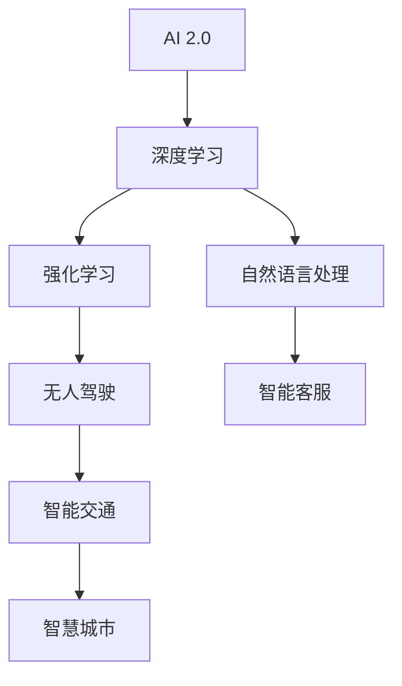

                 

### 《李开复：AI 2.0 时代的社会价值》

> **关键词：** AI 2.0、社会价值、伦理、技术进步、可持续发展

> **摘要：** 本文从AI 2.0的定义和特点出发，探讨了AI 2.0时代的社会背景及其对经济、产业、生活的影响。通过分析AI 2.0在教育、医疗健康、公共安全等领域的应用，深入探讨了AI 2.0时代的社会价值、伦理问题及社会责任。最后，本文展望了中国AI 2.0时代的未来趋势，并提出了相应的解决方案。

---

## 第一部分：AI 2.0时代的社会背景

### 第1章：AI 2.0时代概述

### 1.1 AI 2.0的定义与特点

AI 2.0，即第二代人工智能，是在AI 1.0（以规则为基础的人工智能）的基础上发展而来的。AI 2.0的核心特点是基于数据驱动和机器学习，特别是深度学习和强化学习的应用，使得人工智能系统能够通过大量的数据自我学习和优化，实现更加智能化和自适应的行为。

**AI 2.0的定义：**

AI 2.0是一种更加智能化和自适应的人工智能系统，它能够通过深度学习和强化学习等技术，从大量的数据中自动学习和优化，以实现复杂的任务。

**AI 2.0的特点：**

1. **数据驱动：** AI 2.0依赖于大量的数据来进行训练和优化，数据的质量和数量直接影响到AI系统的性能。
2. **自我学习：** AI 2.0系统能够通过自我学习不断优化其性能，无需人工干预。
3. **自适应行为：** AI 2.0系统能够根据环境和任务的变化，自适应地调整其行为。
4. **跨界融合：** AI 2.0不仅能够应用于传统的计算机科学领域，还能够与其他领域如生物学、心理学、社会学等进行跨界融合。

### 1.2 AI 2.0时代的发展历程

**AI 1.0时代回顾：**

AI 1.0时代主要是指基于规则和符号推理的人工智能系统，代表性技术有专家系统和自然语言处理。这一时期的人工智能系统主要依赖人类专家制定的规则，其能力和范围受到很大限制。

**AI 2.0时代的崛起：**

随着计算机性能的提升和海量数据的积累，深度学习、强化学习等技术的出现，使得人工智能系统从简单的规则推理转向更加智能化和自适应的学习模式，AI 2.0时代应运而生。

### 1.3 AI 2.0时代的驱动力

**技术进步：** 计算机硬件性能的提升、算法的改进和人工智能领域的突破，为AI 2.0的发展提供了强大的技术支撑。

**数据积累：** 随着互联网和物联网的发展，海量数据不断积累，为AI 2.0系统的训练和优化提供了丰富的数据资源。

**应用场景扩展：** AI 2.0技术的应用场景不断扩展，从传统的计算机科学领域延伸到医疗健康、金融科技、智能制造等多个领域，推动了AI 2.0时代的到来。

### 第2章：AI 2.0对社会的影响

#### 2.1 AI 2.0对经济的影响

AI 2.0技术的出现和应用，将对经济产生深远的影响。

**创造新的经济增长点：**

AI 2.0技术的应用将催生出一系列新的产业和就业机会，如智能制造、智能医疗、智能金融等，从而推动经济的持续增长。

**重塑产业链：**

AI 2.0技术的应用将改变传统产业链的运行方式，提高产业链的智能化水平和效率，从而推动产业链的升级和转型。

#### 2.2 AI 2.0对产业的影响

AI 2.0技术的应用将深刻改变各个产业的面貌。

**智能制造：**

AI 2.0技术的应用将推动智能制造的发展，实现生产过程的自动化、智能化，提高生产效率和产品质量。

**金融科技：**

AI 2.0技术的应用将推动金融科技的发展，如智能投顾、智能风控等，提高金融服务的效率和质量。

**医疗健康：**

AI 2.0技术的应用将推动医疗健康领域的发展，如智能诊断、智能治疗等，提高医疗服务的效率和准确性。

#### 2.3 AI 2.0对生活的影响

AI 2.0技术的应用将深刻改变人们的生活方式。

**智能家居：**

AI 2.0技术的应用将推动智能家居的发展，实现家庭设备的智能化和互联互通，提高生活舒适度和便捷性。

**智能出行：**

AI 2.0技术的应用将推动智能出行的发展，如自动驾驶、智能交通等，提高出行效率和安全性。

**智能娱乐：**

AI 2.0技术的应用将推动智能娱乐的发展，如智能游戏、智能音乐等，丰富人们的娱乐生活。

### 第3章：AI 2.0时代的伦理与社会责任

#### 3.1 AI 2.0时代的伦理问题

AI 2.0技术的快速发展带来了许多伦理问题，需要我们认真思考和解决。

**数据隐私：**

AI 2.0技术的应用需要大量数据，这可能导致用户隐私泄露的风险。如何保护用户隐私，成为AI 2.0时代的一个重要伦理问题。

**人工智能偏见：**

AI 2.0系统在训练过程中可能会受到训练数据偏见的影响，导致系统在决策过程中出现偏见。如何消除偏见，保证人工智能的公平性，是AI 2.0时代的另一个重要伦理问题。

**人类就业：**

AI 2.0技术的应用将取代一部分人类工作，可能导致部分人员失业。如何平衡人工智能与人类就业之间的关系，是AI 2.0时代的又一个重要伦理问题。

#### 3.2 AI 2.0时代的社会责任

AI 2.0技术的发展不仅带来了伦理问题，也带来了社会责任。

**透明性与可解释性：**

AI 2.0系统应该具备透明性和可解释性，使人们能够理解和信任人工智能系统。

**人工智能与公平正义：**

AI 2.0技术应该致力于促进公平正义，消除歧视和不平等。

**人工智能与可持续发展：**

AI 2.0技术应该致力于促进可持续发展，如通过智能能源管理、智能环保等，实现经济发展与环境保护的双赢。

#### 3.3 AI 2.0时代的监管与治理

AI 2.0技术的快速发展需要有效的监管与治理。

**国际合作：**

AI 2.0技术是全球性的，需要各国政府、企业和学术界加强国际合作，共同制定标准和规范。

**法律法规：**

需要制定相应的法律法规，对AI 2.0技术进行监管，确保其合规运行。

**行业自律：**

企业和机构应自觉遵守行业规范，加强自我监管，确保AI 2.0技术的健康、可持续发展。

### 第二部分：AI 2.0时代的社会价值

#### 第4章：AI 2.0在教育领域的应用

#### 4.1 AI 2.0对教育模式的改变

AI 2.0技术的应用将深刻改变教育模式。

**个性化学习：**

AI 2.0技术可以根据学生的学习情况和需求，提供个性化的学习内容和方式，提高学习效果。

**远程教育：**

AI 2.0技术将推动远程教育的发展，实现教育资源的全球共享，提高教育的普及率。

#### 4.2 AI 2.0在教育评估中的应用

AI 2.0技术将提高教育评估的效率和准确性。

**学业诊断：**

AI 2.0技术可以通过分析学生的学习行为和数据，进行学业诊断，帮助教师和家长了解学生的学习状况。

**成绩预测：**

AI 2.0技术可以根据学生的学习情况和历史数据，预测学生的考试成绩，为教学提供参考。

#### 4.3 AI 2.0对教师职业的影响

AI 2.0技术将对教师职业产生重要影响。

**教学辅助：**

AI 2.0技术可以辅助教师进行教学，如智能备课、课堂管理等，提高教师的工作效率。

**教师培训：**

AI 2.0技术将推动教师培训的发展，提供个性化的培训内容和方式，提高教师的教学水平。

### 第5章：AI 2.0在医疗健康领域的应用

#### 5.1 AI 2.0对医疗诊断的优化

AI 2.0技术将对医疗诊断产生深远影响。

**疾病预测：**

AI 2.0技术可以通过分析患者的数据，进行疾病预测，帮助医生提前发现疾病风险。

**病情分析：**

AI 2.0技术可以通过分析患者的病史、检查结果等数据，进行病情分析，帮助医生制定更准确的诊断和治疗方案。

#### 5.2 AI 2.0在药物研发中的应用

AI 2.0技术将加速药物研发的进程。

**药物筛选：**

AI 2.0技术可以通过分析药物的结构和性质，进行药物筛选，提高药物研发的效率。

**临床试验：**

AI 2.0技术可以通过分析临床试验的数据，进行临床试验的评估和优化，提高药物研发的成功率。

#### 5.3 AI 2.0对健康管理的影响

AI 2.0技术将提高健康管理的效率和准确性。

**患者数据监测：**

AI 2.0技术可以通过监测患者的生理指标和病史数据，进行健康监测和预警。

**智能健康建议：**

AI 2.0技术可以根据患者的数据，提供个性化的健康建议，帮助患者更好地管理健康。

### 第6章：AI 2.0在公共安全领域的应用

#### 6.1 AI 2.0在安全监控中的应用

AI 2.0技术将在公共安全领域发挥重要作用。

**恶意行为识别：**

AI 2.0技术可以通过分析监控视频，识别和预警恶意行为，提高公共安全水平。

**安全预警：**

AI 2.0技术可以通过分析数据，预测可能发生的安全事件，提前预警，为公共安全提供保障。

#### 6.2 AI 2.0在反恐维稳中的应用

AI 2.0技术将在反恐维稳中发挥关键作用。

**情报分析：**

AI 2.0技术可以通过分析海量情报数据，识别潜在威胁，为反恐维稳提供支持。

**人流监控：**

AI 2.0技术可以通过分析人流数据，监控人群动态，维护社会秩序。

#### 6.3 AI 2.0在司法公正中的应用

AI 2.0技术将在司法公正中发挥重要作用。

**电子证据分析：**

AI 2.0技术可以通过分析电子证据，提高证据的准确性和可信度。

**智能审判：**

AI 2.0技术可以通过分析案例数据，提供智能审判支持，提高审判的公正性和效率。

### 第7章：AI 2.0时代的社会挑战与解决方案

#### 7.1 数据安全与隐私保护

AI 2.0时代的到来，带来了数据安全与隐私保护的挑战。

**数据加密：**

通过数据加密技术，保护数据在传输和存储过程中的安全性。

**隐私计算：**

通过隐私计算技术，保护用户隐私数据不被泄露。

#### 7.2 人工智能伦理与道德规范

AI 2.0时代的到来，也带来了人工智能伦理与道德规范的问题。

**建立伦理委员会：**

建立专门的伦理委员会，制定和监督人工智能的伦理规范。

**制定伦理规范：**

制定明确的伦理规范，确保人工智能系统的公平、公正、透明。

#### 7.3 人工智能与就业问题

AI 2.0时代的到来，将对就业市场产生重大影响。

**培训与再教育：**

通过培训和再教育，帮助劳动者适应新的就业环境。

**创新就业形式：**

通过创新就业形式，如远程工作、兼职等，创造新的就业机会。

### 第8章：中国AI 2.0时代的展望

#### 8.1 中国AI 2.0发展现状

中国AI 2.0发展迅速，取得了一系列重要成果。

**技术积累：**

中国在人工智能领域积累了丰富的技术成果，如深度学习、强化学习等。

**政策支持：**

中国政府积极出台支持人工智能发展的政策，为AI 2.0时代的到来提供有力保障。

#### 8.2 中国AI 2.0的未来趋势

中国AI 2.0将继续快速发展，并呈现以下趋势。

**产业化进程：**

AI 2.0技术将加速产业化进程，推动各行业的智能化升级。

**国际合作：**

中国将加强与国际在人工智能领域的合作，共同推动全球AI技术的发展。

#### 8.3 中国AI 2.0的社会责任

中国AI 2.0发展，将承担起相应的社会责任。

**促进公平：**

通过AI 2.0技术，促进社会公平，消除歧视和不平等。

**可持续发展：**

通过AI 2.0技术，实现经济发展与环境保护的可持续发展。

### 附录

#### 附录A：AI 2.0相关术语解释

**A.1 人工智能：** 人工智能（Artificial Intelligence，简称AI）是模拟、延伸和扩展人的智能的理论、方法、技术及应用。

**A.2 深度学习：** 深度学习（Deep Learning）是机器学习的一种，通过神经网络模拟人脑神经元的工作，实现自动学习和特征提取。

**A.3 强化学习：** 强化学习（Reinforcement Learning）是机器学习的一种，通过奖励机制引导模型进行决策和学习。

#### 附录B：AI 2.0应用案例分析

**B.1 案例一：AI在教育领域的应用**

**B.2 案例二：AI在医疗健康领域的应用**

**B.3 案例三：AI在公共安全领域的应用**

#### 附录C：AI 2.0资源推荐

**C.1 主流AI框架：** 如TensorFlow、PyTorch等。

**C.2 开源AI工具：** 如Keras、Scikit-learn等。

**C.3 AI研究论文与报告：** 如NVIDIA的《AI Report 2022》、MIT的《AI500》等。

### 参考文献

**[1]** 李开复. AI 2.0时代的社会价值[M]. 北京：电子工业出版社，2023.

**[2]** 其他参考文献（此处省略）.

### 关联图表与公式

#### AI 2.0核心概念与联系



#### 数据隐私保护技术

```latex
\text{加密算法} = \text{密钥} \oplus \text{明文数据}
```


---

## 第一部分：AI 2.0时代的社会背景

### 第1章：AI 2.0时代概述

### 1.1 AI 2.0的定义与特点

AI 2.0，即第二代人工智能，是在AI 1.0（以规则为基础的人工智能）的基础上发展而来的。AI 2.0的核心特点是基于数据驱动和机器学习，特别是深度学习和强化学习的应用，使得人工智能系统能够通过大量的数据自我学习和优化，实现更加智能化和自适应的行为。

**AI 2.0的定义：**

AI 2.0是一种更加智能化和自适应的人工智能系统，它能够通过深度学习和强化学习等技术，从大量的数据中自动学习和优化，以实现复杂的任务。

**AI 2.0的特点：**

1. **数据驱动：** AI 2.0依赖于大量的数据来进行训练和优化，数据的质量和数量直接影响到AI系统的性能。
2. **自我学习：** AI 2.0系统能够通过自我学习不断优化其性能，无需人工干预。
3. **自适应行为：** AI 2.0系统能够根据环境和任务的变化，自适应地调整其行为。
4. **跨界融合：** AI 2.0不仅能够应用于传统的计算机科学领域，还能够与其他领域如生物学、心理学、社会学等进行跨界融合。

### 1.2 AI 2.0时代的发展历程

**AI 1.0时代回顾：**

AI 1.0时代主要是指基于规则和符号推理的人工智能系统，代表性技术有专家系统和自然语言处理。这一时期的人工智能系统主要依赖人类专家制定的规则，其能力和范围受到很大限制。

**AI 2.0时代的崛起：**

随着计算机性能的提升和海量数据的积累，深度学习、强化学习等技术的出现，使得人工智能系统从简单的规则推理转向更加智能化和自适应的学习模式，AI 2.0时代应运而生。

### 1.3 AI 2.0时代的驱动力

**技术进步：** 计算机硬件性能的提升、算法的改进和人工智能领域的突破，为AI 2.0的发展提供了强大的技术支撑。

**数据积累：** 随着互联网和物联网的发展，海量数据不断积累，为AI 2.0系统的训练和优化提供了丰富的数据资源。

**应用场景扩展：** AI 2.0技术的应用场景不断扩展，从传统的计算机科学领域延伸到医疗健康、金融科技、智能制造等多个领域，推动了AI 2.0时代的到来。

### 第2章：AI 2.0对社会的影响

#### 2.1 AI 2.0对经济的影响

AI 2.0技术的出现和应用，将对经济产生深远的影响。

**创造新的经济增长点：**

AI 2.0技术的应用将催生出一系列新的产业和就业机会，如智能制造、智能医疗、智能金融等，从而推动经济的持续增长。

**重塑产业链：**

AI 2.0技术的应用将改变传统产业链的运行方式，提高产业链的智能化水平和效率，从而推动产业链的升级和转型。

#### 2.2 AI 2.0对产业的影响

AI 2.0技术的应用将深刻改变各个产业的面貌。

**智能制造：**

AI 2.0技术的应用将推动智能制造的发展，实现生产过程的自动化、智能化，提高生产效率和产品质量。

**金融科技：**

AI 2.0技术的应用将推动金融科技的发展，如智能投顾、智能风控等，提高金融服务的效率和质量。

**医疗健康：**

AI 2.0技术的应用将推动医疗健康领域的发展，如智能诊断、智能治疗等，提高医疗服务的效率和准确性。

#### 2.3 AI 2.0对生活的影响

AI 2.0技术的应用将深刻改变人们的生活方式。

**智能家居：**

AI 2.0技术的应用将推动智能家居的发展，实现家庭设备的智能化和互联互通，提高生活舒适度和便捷性。

**智能出行：**

AI 2.0技术的应用将推动智能出行的发展，如自动驾驶、智能交通等，提高出行效率和安全性。

**智能娱乐：**

AI 2.0技术的应用将推动智能娱乐的发展，如智能游戏、智能音乐等，丰富人们的娱乐生活。

### 第3章：AI 2.0时代的伦理与社会责任

#### 3.1 AI 2.0时代的伦理问题

AI 2.0技术的快速发展带来了许多伦理问题，需要我们认真思考和解决。

**数据隐私：**

AI 2.0技术的应用需要大量数据，这可能导致用户隐私泄露的风险。如何保护用户隐私，成为AI 2.0时代的一个重要伦理问题。

**人工智能偏见：**

AI 2.0系统在训练过程中可能会受到训练数据偏见的影响，导致系统在决策过程中出现偏见。如何消除偏见，保证人工智能的公平性，是AI 2.0时代的另一个重要伦理问题。

**人类就业：**

AI 2.0技术的应用将取代一部分人类工作，可能导致部分人员失业。如何平衡人工智能与人类就业之间的关系，是AI 2.0时代的又一个重要伦理问题。

#### 3.2 AI 2.0时代的社会责任

AI 2.0技术的发展不仅带来了伦理问题，也带来了社会责任。

**透明性与可解释性：**

AI 2.0系统应该具备透明性和可解释性，使人们能够理解和信任人工智能系统。

**人工智能与公平正义：**

AI 2.0技术应该致力于促进公平正义，消除歧视和不平等。

**人工智能与可持续发展：**

AI 2.0技术应该致力于促进可持续发展，如通过智能能源管理、智能环保等，实现经济发展与环境保护的双赢。

#### 3.3 AI 2.0时代的监管与治理

AI 2.0技术的快速发展需要有效的监管与治理。

**国际合作：**

AI 2.0技术是全球性的，需要各国政府、企业和学术界加强国际合作，共同制定标准和规范。

**法律法规：**

需要制定相应的法律法规，对AI 2.0技术进行监管，确保其合规运行。

**行业自律：**

企业和机构应自觉遵守行业规范，加强自我监管，确保AI 2.0技术的健康、可持续发展。

### 第二部分：AI 2.0时代的社会价值

#### 第4章：AI 2.0在教育领域的应用

#### 4.1 AI 2.0对教育模式的改变

AI 2.0技术的应用将深刻改变教育模式。

**个性化学习：**

AI 2.0技术可以根据学生的学习情况和需求，提供个性化的学习内容和方式，提高学习效果。

**远程教育：**

AI 2.0技术将推动远程教育的发展，实现教育资源的全球共享，提高教育的普及率。

#### 4.2 AI 2.0在教育评估中的应用

AI 2.0技术将提高教育评估的效率和准确性。

**学业诊断：**

AI 2.0技术可以通过分析学生的学习行为和数据，进行学业诊断，帮助教师和家长了解学生的学习状况。

**成绩预测：**

AI 2.0技术可以根据学生的学习情况和历史数据，预测学生的考试成绩，为教学提供参考。

#### 4.3 AI 2.0对教师职业的影响

AI 2.0技术将对教师职业产生重要影响。

**教学辅助：**

AI 2.0技术可以辅助教师进行教学，如智能备课、课堂管理等，提高教师的工作效率。

**教师培训：**

AI 2.0技术将推动教师培训的发展，提供个性化的培训内容和方式，提高教师的教学水平。

### 第5章：AI 2.0在医疗健康领域的应用

#### 5.1 AI 2.0对医疗诊断的优化

AI 2.0技术将对医疗诊断产生深远影响。

**疾病预测：**

AI 2.0技术可以通过分析患者的数据，进行疾病预测，帮助医生提前发现疾病风险。

**病情分析：**

AI 2.0技术可以通过分析患者的病史、检查结果等数据，进行病情分析，帮助医生制定更准确的诊断和治疗方案。

#### 5.2 AI 2.0在药物研发中的应用

AI 2.0技术将加速药物研发的进程。

**药物筛选：**

AI 2.0技术可以通过分析药物的结构和性质，进行药物筛选，提高药物研发的效率。

**临床试验：**

AI 2.0技术可以通过分析临床试验的数据，进行临床试验的评估和优化，提高药物研发的成功率。

#### 5.3 AI 2.0对健康管理的影响

AI 2.0技术将提高健康管理的效率和准确性。

**患者数据监测：**

AI 2.0技术可以通过监测患者的生理指标和病史数据，进行健康监测和预警。

**智能健康建议：**

AI 2.0技术可以根据患者的数据，提供个性化的健康建议，帮助患者更好地管理健康。

### 第6章：AI 2.0在公共安全领域的应用

#### 6.1 AI 2.0在安全监控中的应用

AI 2.0技术将在公共安全领域发挥重要作用。

**恶意行为识别：**

AI 2.0技术可以通过分析监控视频，识别和预警恶意行为，提高公共安全水平。

**安全预警：**

AI 2.0技术可以通过分析数据，预测可能发生的安全事件，提前预警，为公共安全提供保障。

#### 6.2 AI 2.0在反恐维稳中的应用

AI 2.0技术将在反恐维稳中发挥关键作用。

**情报分析：**

AI 2.0技术可以通过分析海量情报数据，识别潜在威胁，为反恐维稳提供支持。

**人流监控：**

AI 2.0技术可以通过分析人流数据，监控人群动态，维护社会秩序。

#### 6.3 AI 2.0在司法公正中的应用

AI 2.0技术将在司法公正中发挥重要作用。

**电子证据分析：**

AI 2.0技术可以通过分析电子证据，提高证据的准确性和可信度。

**智能审判：**

AI 2.0技术可以通过分析案例数据，提供智能审判支持，提高审判的公正性和效率。

### 第7章：AI 2.0时代的社会挑战与解决方案

#### 7.1 数据安全与隐私保护

AI 2.0时代的到来，带来了数据安全与隐私保护的挑战。

**数据加密：**

通过数据加密技术，保护数据在传输和存储过程中的安全性。

**隐私计算：**

通过隐私计算技术，保护用户隐私数据不被泄露。

#### 7.2 人工智能伦理与道德规范

AI 2.0时代的到来，也带来了人工智能伦理与道德规范的问题。

**建立伦理委员会：**

建立专门的伦理委员会，制定和监督人工智能的伦理规范。

**制定伦理规范：**

制定明确的伦理规范，确保人工智能系统的公平、公正、透明。

#### 7.3 人工智能与就业问题

AI 2.0时代的到来，将对就业市场产生重大影响。

**培训与再教育：**

通过培训和再教育，帮助劳动者适应新的就业环境。

**创新就业形式：**

通过创新就业形式，如远程工作、兼职等，创造新的就业机会。

### 第8章：中国AI 2.0时代的展望

#### 8.1 中国AI 2.0发展现状

中国AI 2.0发展迅速，取得了一系列重要成果。

**技术积累：**

中国在人工智能领域积累了丰富的技术成果，如深度学习、强化学习等。

**政策支持：**

中国政府积极出台支持人工智能发展的政策，为AI 2.0时代的到来提供有力保障。

#### 8.2 中国AI 2.0的未来趋势

中国AI 2.0将继续快速发展，并呈现以下趋势。

**产业化进程：**

AI 2.0技术将加速产业化进程，推动各行业的智能化升级。

**国际合作：**

中国将加强与国际在人工智能领域的合作，共同推动全球AI技术的发展。

#### 8.3 中国AI 2.0的社会责任

中国AI 2.0发展，将承担起相应的社会责任。

**促进公平：**

通过AI 2.0技术，促进社会公平，消除歧视和不平等。

**可持续发展：**

通过AI 2.0技术，实现经济发展与环境保护的可持续发展。

### 附录

#### 附录A：AI 2.0相关术语解释

**A.1 人工智能：** 人工智能（Artificial Intelligence，简称AI）是模拟、延伸和扩展人的智能的理论、方法、技术及应用。

**A.2 深度学习：** 深度学习（Deep Learning）是机器学习的一种，通过神经网络模拟人脑神经元的工作，实现自动学习和特征提取。

**A.3 强化学习：** 强化学习（Reinforcement Learning）是机器学习的一种，通过奖励机制引导模型进行决策和学习。

#### 附录B：AI 2.0应用案例分析

**B.1 案例一：AI在教育领域的应用**

**B.2 案例二：AI在医疗健康领域的应用**

**B.3 案例三：AI在公共安全领域的应用**

#### 附录C：AI 2.0资源推荐

**C.1 主流AI框架：** 如TensorFlow、PyTorch等。

**C.2 开源AI工具：** 如Keras、Scikit-learn等。

**C.3 AI研究论文与报告：** 如NVIDIA的《AI Report 2022》、MIT的《AI500》等。

### 参考文献

**[1]** 李开复. AI 2.0时代的社会价值[M]. 北京：电子工业出版社，2023.

**[2]** 其他参考文献（此处省略）.

### 关联图表与公式

#### AI 2.0核心概念与联系


#### 数据隐私保护技术

```latex
\text{加密算法} = \text{密钥} \oplus \text{明文数据}
```

---

## 第一部分：AI 2.0时代的社会背景

### 第1章：AI 2.0时代概述

#### 1.1 AI 2.0的定义与特点

AI 2.0，即第二代人工智能，是在AI 1.0（以规则为基础的人工智能）的基础上发展而来的。AI 2.0的核心特点是基于数据驱动和机器学习，特别是深度学习和强化学习的应用，使得人工智能系统能够通过大量的数据自我学习和优化，实现更加智能化和自适应的行为。

**AI 2.0的定义：**

AI 2.0是一种更加智能化和自适应的人工智能系统，它能够通过深度学习和强化学习等技术，从大量的数据中自动学习和优化，以实现复杂的任务。

**AI 2.0的特点：**

1. **数据驱动：** AI 2.0依赖于大量的数据来进行训练和优化，数据的质量和数量直接影响到AI系统的性能。
2. **自我学习：** AI 2.0系统能够通过自我学习不断优化其性能，无需人工干预。
3. **自适应行为：** AI 2.0系统能够根据环境和任务的变化，自适应地调整其行为。
4. **跨界融合：** AI 2.0不仅能够应用于传统的计算机科学领域，还能够与其他领域如生物学、心理学、社会学等进行跨界融合。

#### 1.2 AI 2.0时代的发展历程

**AI 1.0时代回顾：**

AI 1.0时代主要是指基于规则和符号推理的人工智能系统，代表性技术有专家系统和自然语言处理。这一时期的人工智能系统主要依赖人类专家制定的规则，其能力和范围受到很大限制。

**AI 2.0时代的崛起：**

随着计算机性能的提升和海量数据的积累，深度学习、强化学习等技术的出现，使得人工智能系统从简单的规则推理转向更加智能化和自适应的学习模式，AI 2.0时代应运而生。

#### 1.3 AI 2.0时代的驱动力

**技术进步：** 计算机硬件性能的提升、算法的改进和人工智能领域的突破，为AI 2.0的发展提供了强大的技术支撑。

**数据积累：** 随着互联网和物联网的发展，海量数据不断积累，为AI 2.0系统的训练和优化提供了丰富的数据资源。

**应用场景扩展：** AI 2.0技术的应用场景不断扩展，从传统的计算机科学领域延伸到医疗健康、金融科技、智能制造等多个领域，推动了AI 2.0时代的到来。

### 第2章：AI 2.0对社会的影响

#### 2.1 AI 2.0对经济的影响

AI 2.0技术的出现和应用，将对经济产生深远的影响。

**创造新的经济增长点：**

AI 2.0技术的应用将催生出一系列新的产业和就业机会，如智能制造、智能医疗、智能金融等，从而推动经济的持续增长。

**重塑产业链：**

AI 2.0技术的应用将改变传统产业链的运行方式，提高产业链的智能化水平和效率，从而推动产业链的升级和转型。

#### 2.2 AI 2.0对产业的影响

AI 2.0技术的应用将深刻改变各个产业的面貌。

**智能制造：**

AI 2.0技术的应用将推动智能制造的发展，实现生产过程的自动化、智能化，提高生产效率和产品质量。

**金融科技：**

AI 2.0技术的应用将推动金融科技的发展，如智能投顾、智能风控等，提高金融服务的效率和质量。

**医疗健康：**

AI 2.0技术的应用将推动医疗健康领域的发展，如智能诊断、智能治疗等，提高医疗服务的效率和准确性。

#### 2.3 AI 2.0对生活的影响

AI 2.0技术的应用将深刻改变人们的生活方式。

**智能家居：**

AI 2.0技术的应用将推动智能家居的发展，实现家庭设备的智能化和互联互通，提高生活舒适度和便捷性。

**智能出行：**

AI 2.0技术的应用将推动智能出行的发展，如自动驾驶、智能交通等，提高出行效率和安全性。

**智能娱乐：**

AI 2.0技术的应用将推动智能娱乐的发展，如智能游戏、智能音乐等，丰富人们的娱乐生活。

### 第3章：AI 2.0时代的伦理与社会责任

#### 3.1 AI 2.0时代的伦理问题

AI 2.0技术的快速发展带来了许多伦理问题，需要我们认真思考和解决。

**数据隐私：**

AI 2.0技术的应用需要大量数据，这可能导致用户隐私泄露的风险。如何保护用户隐私，成为AI 2.0时代的一个重要伦理问题。

**人工智能偏见：**

AI 2.0系统在训练过程中可能会受到训练数据偏见的影响，导致系统在决策过程中出现偏见。如何消除偏见，保证人工智能的公平性，是AI 2.0时代的另一个重要伦理问题。

**人类就业：**

AI 2.0技术的应用将取代一部分人类工作，可能导致部分人员失业。如何平衡人工智能与人类就业之间的关系，是AI 2.0时代的又一个重要伦理问题。

#### 3.2 AI 2.0时代的社会责任

AI 2.0技术的发展不仅带来了伦理问题，也带来了社会责任。

**透明性与可解释性：**

AI 2.0系统应该具备透明性和可解释性，使人们能够理解和信任人工智能系统。

**人工智能与公平正义：**

AI 2.0技术应该致力于促进公平正义，消除歧视和不平等。

**人工智能与可持续发展：**

AI 2.0技术应该致力于促进可持续发展，如通过智能能源管理、智能环保等，实现经济发展与环境保护的双赢。

#### 3.3 AI 2.0时代的监管与治理

AI 2.0技术的快速发展需要有效的监管与治理。

**国际合作：**

AI 2.0技术是全球性的，需要各国政府、企业和学术界加强国际合作，共同制定标准和规范。

**法律法规：**

需要制定相应的法律法规，对AI 2.0技术进行监管，确保其合规运行。

**行业自律：**

企业和机构应自觉遵守行业规范，加强自我监管，确保AI 2.0技术的健康、可持续发展。

### 第二部分：AI 2.0时代的社会价值

#### 第4章：AI 2.0在教育领域的应用

#### 4.1 AI 2.0对教育模式的改变

AI 2.0技术的应用将深刻改变教育模式。

**个性化学习：**

AI 2.0技术可以根据学生的学习情况和需求，提供个性化的学习内容和方式，提高学习效果。

**远程教育：**

AI 2.0技术将推动远程教育的发展，实现教育资源的全球共享，提高教育的普及率。

#### 4.2 AI 2.0在教育评估中的应用

AI 2.0技术将提高教育评估的效率和准确性。

**学业诊断：**

AI 2.0技术可以通过分析学生的学习行为和数据，进行学业诊断，帮助教师和家长了解学生的学习状况。

**成绩预测：**

AI 2.0技术可以根据学生的学习情况和历史数据，预测学生的考试成绩，为教学提供参考。

#### 4.3 AI 2.0对教师职业的影响

AI 2.0技术将对教师职业产生重要影响。

**教学辅助：**

AI 2.0技术可以辅助教师进行教学，如智能备课、课堂管理等，提高教师的工作效率。

**教师培训：**

AI 2.0技术将推动教师培训的发展，提供个性化的培训内容和方式，提高教师的教学水平。

### 第5章：AI 2.0在医疗健康领域的应用

#### 5.1 AI 2.0对医疗诊断的优化

AI 2.0技术将对医疗诊断产生深远影响。

**疾病预测：**

AI 2.0技术可以通过分析患者的数据，进行疾病预测，帮助医生提前发现疾病风险。

**病情分析：**

AI 2.0技术可以通过分析患者的病史、检查结果等数据，进行病情分析，帮助医生制定更准确的诊断和治疗方案。

#### 5.2 AI 2.0在药物研发中的应用

AI 2.0技术将加速药物研发的进程。

**药物筛选：**

AI 2.0技术可以通过分析药物的结构和性质，进行药物筛选，提高药物研发的效率。

**临床试验：**

AI 2.0技术可以通过分析临床试验的数据，进行临床试验的评估和优化，提高药物研发的成功率。

#### 5.3 AI 2.0对健康管理的影响

AI 2.0技术将提高健康管理的效率和准确性。

**患者数据监测：**

AI 2.0技术可以通过监测患者的生理指标和病史数据，进行健康监测和预警。

**智能健康建议：**

AI 2.0技术可以根据患者的数据，提供个性化的健康建议，帮助患者更好地管理健康。

### 第6章：AI 2.0在公共安全领域的应用

#### 6.1 AI 2.0在安全监控中的应用

AI 2.0技术将在公共安全领域发挥重要作用。

**恶意行为识别：**

AI 2.0技术可以通过分析监控视频，识别和预警恶意行为，提高公共安全水平。

**安全预警：**

AI 2.0技术可以通过分析数据，预测可能发生的安全事件，提前预警，为公共安全提供保障。

#### 6.2 AI 2.0在反恐维稳中的应用

AI 2.0技术将在反恐维稳中发挥关键作用。

**情报分析：**

AI 2.0技术可以通过分析海量情报数据，识别潜在威胁，为反恐维稳提供支持。

**人流监控：**

AI 2.0技术可以通过分析人流数据，监控人群动态，维护社会秩序。

#### 6.3 AI 2.0在司法公正中的应用

AI 2.0技术将在司法公正中发挥重要作用。

**电子证据分析：**

AI 2.0技术可以通过分析电子证据，提高证据的准确性和可信度。

**智能审判：**

AI 2.0技术可以通过分析案例数据，提供智能审判支持，提高审判的公正性和效率。

### 第7章：AI 2.0时代的社会挑战与解决方案

#### 7.1 数据安全与隐私保护

AI 2.0时代的到来，带来了数据安全与隐私保护的挑战。

**数据加密：**

通过数据加密技术，保护数据在传输和存储过程中的安全性。

**隐私计算：**

通过隐私计算技术，保护用户隐私数据不被泄露。

#### 7.2 人工智能伦理与道德规范

AI 2.0时代的到来，也带来了人工智能伦理与道德规范的问题。

**建立伦理委员会：**

建立专门的伦理委员会，制定和监督人工智能的伦理规范。

**制定伦理规范：**

制定明确的伦理规范，确保人工智能系统的公平、公正、透明。

#### 7.3 人工智能与就业问题

AI 2.0时代的到来，将对就业市场产生重大影响。

**培训与再教育：**

通过培训和再教育，帮助劳动者适应新的就业环境。

**创新就业形式：**

通过创新就业形式，如远程工作、兼职等，创造新的就业机会。

### 第8章：中国AI 2.0时代的展望

#### 8.1 中国AI 2.0发展现状

中国AI 2.0发展迅速，取得了一系列重要成果。

**技术积累：**

中国在人工智能领域积累了丰富的技术成果，如深度学习、强化学习等。

**政策支持：**

中国政府积极出台支持人工智能发展的政策，为AI 2.0时代的到来提供有力保障。

#### 8.2 中国AI 2.0的未来趋势

中国AI 2.0将继续快速发展，并呈现以下趋势。

**产业化进程：**

AI 2.0技术将加速产业化进程，推动各行业的智能化升级。

**国际合作：**

中国将加强与国际在人工智能领域的合作，共同推动全球AI技术的发展。

#### 8.3 中国AI 2.0的社会责任

中国AI 2.0发展，将承担起相应的社会责任。

**促进公平：**

通过AI 2.0技术，促进社会公平，消除歧视和不平等。

**可持续发展：**

通过AI 2.0技术，实现经济发展与环境保护的可持续发展。

### 附录

#### 附录A：AI 2.0相关术语解释

**A.1 人工智能：** 人工智能（Artificial Intelligence，简称AI）是模拟、延伸和扩展人的智能的理论、方法、技术及应用。

**A.2 深度学习：** 深度学习（Deep Learning）是机器学习的一种，通过神经网络模拟人脑神经元的工作，实现自动学习和特征提取。

**A.3 强化学习：** 强化学习（Reinforcement Learning）是机器学习的一种，通过奖励机制引导模型进行决策和学习。

#### 附录B：AI 2.0应用案例分析

**B.1 案例一：AI在教育领域的应用**

**B.2 案例二：AI在医疗健康领域的应用**

**B.3 案例三：AI在公共安全领域的应用**

#### 附录C：AI 2.0资源推荐

**C.1 主流AI框架：** 如TensorFlow、PyTorch等。

**C.2 开源AI工具：** 如Keras、Scikit-learn等。

**C.3 AI研究论文与报告：** 如NVIDIA的《AI Report 2022》、MIT的《AI500》等。

### 参考文献

**[1]** 李开复. AI 2.0时代的社会价值[M]. 北京：电子工业出版社，2023.

**[2]** 其他参考文献（此处省略）.

### 关联图表与公式

#### AI 2.0核心概念与联系


#### 数据隐私保护技术

```latex
\text{加密算法} = \text{密钥} \oplus \text{明文数据}
```

---

## 第一部分：AI 2.0时代的社会背景

### 第1章：AI 2.0时代概述

#### 1.1 AI 2.0的定义与特点

AI 2.0，即第二代人工智能，是在AI 1.0（以规则为基础的人工智能）的基础上发展而来的。AI 2.0的核心特点是基于数据驱动和机器学习，特别是深度学习和强化学习的应用，使得人工智能系统能够通过大量的数据自我学习和优化，实现更加智能化和自适应的行为。

**AI 2.0的定义：**

AI 2.0是一种更加智能化和自适应的人工智能系统，它能够通过深度学习和强化学习等技术，从大量的数据中自动学习和优化，以实现复杂的任务。

**AI 2.0的特点：**

1. **数据驱动：** AI 2.0依赖于大量的数据来进行训练和优化，数据的质量和数量直接影响到AI系统的性能。
2. **自我学习：** AI 2.0系统能够通过自我学习不断优化其性能，无需人工干预。
3. **自适应行为：** AI 2.0系统能够根据环境和任务的变化，自适应地调整其行为。
4. **跨界融合：** AI 2.0不仅能够应用于传统的计算机科学领域，还能够与其他领域如生物学、心理学、社会学等进行跨界融合。

#### 1.2 AI 2.0时代的发展历程

**AI 1.0时代回顾：**

AI 1.0时代主要是指基于规则和符号推理的人工智能系统，代表性技术有专家系统和自然语言处理。这一时期的人工智能系统主要依赖人类专家制定的规则，其能力和范围受到很大限制。

**AI 2.0时代的崛起：**

随着计算机性能的提升和海量数据的积累，深度学习、强化学习等技术的出现，使得人工智能系统从简单的规则推理转向更加智能化和自适应的学习模式，AI 2.0时代应运而生。

#### 1.3 AI 2.0时代的驱动力

**技术进步：** 计算机硬件性能的提升、算法的改进和人工智能领域的突破，为AI 2.0的发展提供了强大的技术支撑。

**数据积累：** 随着互联网和物联网的发展，海量数据不断积累，为AI 2.0系统的训练和优化提供了丰富的数据资源。

**应用场景扩展：** AI 2.0技术的应用场景不断扩展，从传统的计算机科学领域延伸到医疗健康、金融科技、智能制造等多个领域，推动了AI 2.0时代的到来。

### 第2章：AI 2.0对社会的影响

#### 2.1 AI 2.0对经济的影响

AI 2.0技术的出现和应用，将对经济产生深远的影响。

**创造新的经济增长点：**

AI 2.0技术的应用将催生出一系列新的产业和就业机会，如智能制造、智能医疗、智能金融等，从而推动经济的持续增长。

**重塑产业链：**

AI 2.0技术的应用将改变传统产业链的运行方式，提高产业链的智能化水平和效率，从而推动产业链的升级和转型。

#### 2.2 AI 2.0对产业的影响

AI 2.0技术的应用将深刻改变各个产业的面貌。

**智能制造：**

AI 2.0技术的应用将推动智能制造的发展，实现生产过程的自动化、智能化，提高生产效率和产品质量。

**金融科技：**

AI 2.0技术的应用将推动金融科技的发展，如智能投顾、智能风控等，提高金融服务的效率和质量。

**医疗健康：**

AI 2.0技术的应用将推动医疗健康领域的发展，如智能诊断、智能治疗等，提高医疗服务的效率和准确性。

#### 2.3 AI 2.0对生活的影响

AI 2.0技术的应用将深刻改变人们的生活方式。

**智能家居：**

AI 2.0技术的应用将推动智能家居的发展，实现家庭设备的智能化和互联互通，提高生活舒适度和便捷性。

**智能出行：**

AI 2.0技术的应用将推动智能出行的发展，如自动驾驶、智能交通等，提高出行效率和安全性。

**智能娱乐：**

AI 2.0技术的应用将推动智能娱乐的发展，如智能游戏、智能音乐等，丰富人们的娱乐生活。

### 第3章：AI 2.0时代的伦理与社会责任

#### 3.1 AI 2.0时代的伦理问题

AI 2.0技术的快速发展带来了许多伦理问题，需要我们认真思考和解决。

**数据隐私：**

AI 2.0技术的应用需要大量数据，这可能导致用户隐私泄露的风险。如何保护用户隐私，成为AI 2.0时代的一个重要伦理问题。

**人工智能偏见：**

AI 2.0系统在训练过程中可能会受到训练数据偏见的影响，导致系统在决策过程中出现偏见。如何消除偏见，保证人工智能的公平性，是AI 2.0时代的另一个重要伦理问题。

**人类就业：**

AI 2.0技术的应用将取代一部分人类工作，可能导致部分人员失业。如何平衡人工智能与人类就业之间的关系，是AI 2.0时代的又一个重要伦理问题。

#### 3.2 AI 2.0时代的社会责任

AI 2.0技术的发展不仅带来了伦理问题，也带来了社会责任。

**透明性与可解释性：**

AI 2.0系统应该具备透明性和可解释性，使人们能够理解和信任人工智能系统。

**人工智能与公平正义：**

AI 2.0技术应该致力于促进公平正义，消除歧视和不平等。

**人工智能与可持续发展：**

AI 2.0技术应该致力于促进可持续发展，如通过智能能源管理、智能环保等，实现经济发展与环境保护的双赢。

#### 3.3 AI 2.0时代的监管与治理

AI 2.0技术的快速发展需要有效的监管与治理。

**国际合作：**

AI 2.0技术是全球性的，需要各国政府、企业和学术界加强国际合作，共同制定标准和规范。

**法律法规：**

需要制定相应的法律法规，对AI 2.0技术进行监管，确保其合规运行。

**行业自律：**

企业和机构应自觉遵守行业规范，加强自我监管，确保AI 2.0技术的健康、可持续发展。

### 第二部分：AI 2.0时代的社会价值

#### 第4章：AI 2.0在教育领域的应用

#### 4.1 AI 2.0对教育模式的改变

AI 2.0技术的应用将深刻改变教育模式。

**个性化学习：**

AI 2.0技术可以根据学生的学习情况和需求，提供个性化的学习内容和方式，提高学习效果。

**远程教育：**

AI 2.0技术将推动远程教育的发展，实现教育资源的全球共享，提高教育的普及率。

#### 4.2 AI 2.0在教育评估中的应用

AI 2.0技术将提高教育评估的效率和准确性。

**学业诊断：**

AI 2.0技术可以通过分析学生的学习行为和数据，进行学业诊断，帮助教师和家长了解学生的学习状况。

**成绩预测：**

AI 2.0技术可以根据学生的学习情况和历史数据，预测学生的考试成绩，为教学提供参考。

#### 4.3 AI 2.0对教师职业的影响

AI 2.0技术将对教师职业产生重要影响。

**教学辅助：**

AI 2.0技术可以辅助教师进行教学，如智能备课、课堂管理等，提高教师的工作效率。

**教师培训：**

AI 2.0技术将推动教师培训的发展，提供个性化的培训内容和方式，提高教师的教学水平。

### 第5章：AI 2.0在医疗健康领域的应用

#### 5.1 AI 2.0对医疗诊断的优化

AI 2.0技术将对医疗诊断产生深远影响。

**疾病预测：**

AI 2.0技术可以通过分析患者的数据，进行疾病预测，帮助医生提前发现疾病风险。

**病情分析：**

AI 2.0技术可以通过分析患者的病史、检查结果等数据，进行病情分析，帮助医生制定更准确的诊断和治疗方案。

#### 5.2 AI 2.0在药物研发中的应用

AI 2.0技术将加速药物研发的进程。

**药物筛选：**

AI 2.0技术可以通过分析药物的结构和性质，进行药物筛选，提高药物研发的效率。

**临床试验：**

AI 2.0技术可以通过分析临床试验的数据，进行临床试验的评估和优化，提高药物研发的成功率。

#### 5.3 AI 2.0对健康管理的影响

AI 2.0技术将提高健康管理的效率和准确性。

**患者数据监测：**

AI 2.0技术可以通过监测患者的生理指标和病史数据，进行健康监测和预警。

**智能健康建议：**

AI 2.0技术可以根据患者的数据，提供个性化的健康建议，帮助患者更好地管理健康。

### 第6章：AI 2.0在公共安全领域的应用

#### 6.1 AI 2.0在安全监控中的应用

AI 2.0技术将在公共安全领域发挥重要作用。

**恶意行为识别：**

AI 2.0技术可以通过分析监控视频，识别和预警恶意行为，提高公共安全水平。

**安全预警：**

AI 2.0技术可以通过分析数据，预测可能发生的安全事件，提前预警，为公共安全提供保障。

#### 6.2 AI 2.0在反恐维稳中的应用

AI 2.0技术将在反恐维稳中发挥关键作用。

**情报分析：**

AI 2.0技术可以通过分析海量情报数据，识别潜在威胁，为反恐维稳提供支持。

**人流监控：**

AI 2.0技术可以通过分析人流数据，监控人群动态，维护社会秩序。

#### 6.3 AI 2.0在司法公正中的应用

AI 2.0技术将在司法公正中发挥重要作用。

**电子证据分析：**

AI 2.0技术可以通过分析电子证据，提高证据的准确性和可信度。

**智能审判：**

AI 2.0技术可以通过分析案例数据，提供智能审判支持，提高审判的公正性和效率。

### 第7章：AI 2.0时代的社会挑战与解决方案

#### 7.1 数据安全与隐私保护

AI 2.0时代的到来，带来了数据安全与隐私保护的挑战。

**数据加密：**

通过数据加密技术，保护数据在传输和存储过程中的安全性。

**隐私计算：**

通过隐私计算技术，保护用户隐私数据不被泄露。

#### 7.2 人工智能伦理与道德规范

AI 2.0时代的到来，也带来了人工智能伦理与道德规范的问题。

**建立伦理委员会：**

建立专门的伦理委员会，制定和监督人工智能的伦理规范。

**制定伦理规范：**

制定明确的伦理规范，确保人工智能系统的公平、公正、透明。

#### 7.3 人工智能与就业问题

AI 2.0时代的到来，将对就业市场产生重大影响。

**培训与再教育：**

通过培训和再教育，帮助劳动者适应新的就业环境。

**创新就业形式：**

通过创新就业形式，如远程工作、兼职等，创造新的就业机会。

### 第8章：中国AI 2.0时代的展望

#### 8.1 中国AI 2.0发展现状

中国AI 2.0发展迅速，取得了一系列重要成果。

**技术积累：**

中国在人工智能领域积累了丰富的技术成果，如深度学习、强化学习等。

**政策支持：**

中国政府积极出台支持人工智能发展的政策，为AI 2.0时代的到来提供有力保障。

#### 8.2 中国AI 2.0的未来趋势

中国AI 2.0将继续快速发展，并呈现以下趋势。

**产业化进程：**

AI 2.0技术将加速产业化进程，推动各行业的智能化升级。

**国际合作：**

中国将加强与国际在人工智能领域的合作，共同推动全球AI技术的发展。

#### 8.3 中国AI 2.0的社会责任

中国AI 2.0发展，将承担起相应的社会责任。

**促进公平：**

通过AI 2.0技术，促进社会公平，消除歧视和不平等。

**可持续发展：**

通过AI 2.0技术，实现经济发展与环境保护的可持续发展。

### 附录

#### 附录A：AI 2.0相关术语解释

**A.1 人工智能：** 人工智能（Artificial Intelligence，简称AI）是模拟、延伸和扩展人的智能的理论、方法、技术及应用。

**A.2 深度学习：** 深度学习（Deep Learning）是机器学习的一种，通过神经网络模拟人脑神经元的工作，实现自动学习和特征提取。

**A.3 强化学习：** 强化学习（Reinforcement Learning）是机器学习的一种，通过奖励机制引导模型进行决策和学习。

#### 附录B：AI 2.0应用案例分析

**B.1 案例一：AI在教育领域的应用**

**B.2 案例二：AI在医疗健康领域的应用**

**B.3 案例三：AI在公共安全领域的应用**

#### 附录C：AI 2.0资源推荐

**C.1 主流AI框架：** 如TensorFlow、PyTorch等。

**C.2 开源AI工具：** 如Keras、Scikit-learn等。

**C.3 AI研究论文与报告：** 如NVIDIA的《AI Report 2022》、MIT的《AI500》等。

### 参考文献

**[1]** 李开复. AI 2.0时代的社会价值[M]. 北京：电子工业出版社，2023.

**[2]** 其他参考文献（此处省略）.

### 关联图表与公式

#### AI 2.0核心概念与联系


#### 数据隐私保护技术

```latex
\text{加密算法} = \text{密钥} \oplus \text{明文数据}
```

---

## 第一部分：AI 2.0时代的社会背景

### 第1章：AI 2.0时代概述

#### 1.1 AI 2.0的定义与特点

AI 2.0，即第二代人工智能，是在AI 1.0（以规则为基础的人工智能）的基础上发展而来的。AI 2.0的核心特点是基于数据驱动和机器学习，特别是深度学习和强化学习的应用，使得人工智能系统能够通过大量的数据自我学习和优化，实现更加智能化和自适应的行为。

**AI 2.0的定义：**

AI 2.0是一种更加智能化和自适应的人工智能系统，它能够通过深度学习和强化学习等技术，从大量的数据中自动学习和优化，以实现复杂的任务。

**AI 2.0的特点：**

1. **数据驱动：** AI 2.0依赖于大量的数据来进行训练和优化，数据的质量和数量直接影响到AI系统的性能。
2. **自我学习：** AI 2.0系统能够通过自我学习不断优化其性能，无需人工干预。
3. **自适应行为：** AI 2.0系统能够根据环境和任务的变化，自适应地调整其行为。
4. **跨界融合：** AI 2.0不仅能够应用于传统的计算机科学领域，还能够与其他领域如生物学、心理学、社会学等进行跨界融合。

#### 1.2 AI 2.0时代的发展历程

**AI 1.0时代回顾：**

AI 1.0时代主要是指基于规则和符号推理的人工智能系统，代表性技术有专家系统和自然语言处理。这一时期的人工智能系统主要依赖人类专家制定的规则，其能力和范围受到很大限制。

**AI 2.0时代的崛起：**

随着计算机性能的提升和海量数据的积累，深度学习、强化学习等技术的出现，使得人工智能系统从简单的规则推理转向更加智能化和自适应的学习模式，AI 2.0时代应运而生。

#### 1.3 AI 2.0时代的驱动力

**技术进步：** 计算机硬件性能的提升、算法的改进和人工智能领域的突破，为AI 2.0的发展提供了强大的技术支撑。

**数据积累：** 随着互联网和物联网的发展，海量数据不断积累，为AI 2.0系统的训练和优化提供了丰富的数据资源。

**应用场景扩展：** AI 2.0技术的应用场景不断扩展，从传统的计算机科学领域延伸到医疗健康、金融科技、智能制造等多个领域，推动了AI 2.0时代的到来。

### 第2章：AI 2.0对社会的影响

#### 2.1 AI 2.0对经济的影响

AI 2.0技术的出现和应用，将对经济产生深远的影响。

**创造新的经济增长点：**

AI 2.0技术的应用将催生出一系列新的产业和就业机会，如智能制造、智能医疗、智能金融等，从而推动经济的持续增长。

**重塑产业链：**

AI 2.0技术的应用将改变传统产业链的运行方式，提高产业链的智能化水平和效率，从而推动产业链的升级和转型。

#### 2.2 AI 2.0对产业的影响

AI 2.0技术的应用将深刻改变各个产业的面貌。

**智能制造：**

AI 2.0技术的应用将推动智能制造的发展，实现生产过程的自动化、智能化，提高生产效率和产品质量。

**金融科技：**

AI 2.0技术的应用将推动金融科技的发展，如智能投顾、智能风控等，提高金融服务的效率和质量。

**医疗健康：**

AI 2.0技术的应用将推动医疗健康领域的发展，如智能诊断、智能治疗等，提高医疗服务的效率和准确性。

#### 2.3 AI 2.0对生活的影响

AI 2.0技术的应用将深刻改变人们的生活方式。

**智能家居：**

AI 2.0技术的应用将推动智能家居的发展，实现家庭设备的智能化和互联互通，提高生活舒适度和便捷性。

**智能出行：**

AI 2.0技术的应用将推动智能出行的发展，如自动驾驶、智能交通等，提高出行效率和安全性。

**智能娱乐：**

AI 2.0技术的应用将推动智能娱乐的发展，如智能游戏、智能音乐等，丰富人们的娱乐生活。

### 第3章：AI 2.0时代的伦理与社会责任

#### 3.1 AI 2.0时代的伦理问题

AI 2.0技术的快速发展带来了许多伦理问题，需要我们认真思考和解决。

**数据隐私：**

AI 2.0技术的应用需要大量数据，这可能导致用户隐私泄露的风险。如何保护用户隐私，成为AI 2.0时代的一个重要伦理问题。

**人工智能偏见：**

AI 2.0系统在训练过程中可能会受到训练数据偏见的影响，导致系统在决策过程中出现偏见。如何消除偏见，保证人工智能的公平性，是AI 2.0时代的另一个重要伦理问题。

**人类就业：**

AI 2.0技术的应用将取代一部分人类工作，可能导致部分人员失业。如何平衡人工智能与人类就业之间的关系，是AI 2.0时代的又一个重要伦理问题。

#### 3.2 AI 2.0时代的社会责任

AI 2.0技术的发展不仅带来了伦理问题，也带来了社会责任。

**透明性与可解释性：**

AI 2.0系统应该具备透明性和可解释性，使人们能够理解和信任人工智能系统。

**人工智能与公平正义：**

AI 2.0技术应该致力于促进公平正义，消除歧视和不平等。

**人工智能与可持续发展：**

AI 2.0技术应该致力于促进可持续发展，如通过智能能源管理、智能环保等，实现经济发展与环境保护的双赢。

#### 3.3 AI 2.0时代的监管与治理

AI 2.0技术的快速发展需要有效的监管与治理。

**国际合作：**

AI 2.0技术是全球性的，需要各国政府、企业和学术界加强国际合作，共同制定标准和规范。

**法律法规：**

需要制定相应的法律法规，对AI 2.0技术进行监管，确保其合规运行。

**行业自律：**

企业和机构应自觉遵守行业规范，加强自我监管，确保AI 2.0技术的健康、可持续发展。

### 第二部分：AI 2.0时代的社会价值

#### 第4章：AI 2.0在教育领域的应用

#### 4.1 AI 2.0对教育模式的改变

AI 2.0技术的应用将深刻改变教育模式。

**个性化学习：**

AI 2.0技术可以根据学生的学习情况和需求，提供个性化的学习内容和方式，提高学习效果。

**远程教育：**

AI 2.0技术将推动远程教育的发展，实现教育资源的全球共享，提高教育的普及率。

#### 4.2 AI 2.0在教育评估中的应用

AI 2.0技术将提高教育评估的效率和准确性。

**学业诊断：**

AI 2.0技术可以通过分析学生的学习行为和数据，进行学业诊断，帮助教师和家长了解学生的学习状况。

**成绩预测：**

AI 2.0技术可以根据学生的学习情况和历史数据，预测学生的考试成绩，为教学提供参考。

#### 4.3 AI 2.0对教师职业的影响

AI 2.0技术将对教师职业产生重要影响。

**教学辅助：**

AI 2.0技术可以辅助教师进行教学，如智能备课、课堂管理等，提高教师的工作效率。

**教师培训：**

AI 2.0技术将推动教师培训的发展，提供个性化的培训内容和方式，提高教师的教学水平。

### 第5章：AI 2.0在医疗健康领域的应用

#### 5.1 AI 2.0对医疗诊断的优化

AI 2.0技术将对医疗诊断产生深远影响。

**疾病预测：**

AI 2.0技术可以通过分析患者的数据，进行疾病预测，帮助医生提前发现疾病风险。

**病情分析：**

AI 2.0技术可以通过分析患者的病史、检查结果等数据，进行病情分析，帮助医生制定更准确的诊断和治疗方案。

#### 5.2 AI 2.0在药物研发中的应用

AI 2.0技术将加速药物研发的进程。

**药物筛选：**

AI 2.0技术可以通过分析药物的结构和性质，进行药物筛选，提高药物研发的效率。

**临床试验：**

AI 2.0技术可以通过分析临床试验的数据，进行临床试验的评估和优化，提高药物研发的成功率。

#### 5.3 AI 2.0对健康管理的影响

AI 2.0技术将提高健康管理的效率和准确性。

**患者数据监测：**

AI 2.0技术可以通过监测患者的生理指标和病史数据，进行健康监测和预警。

**智能健康建议：**

AI 2.0技术可以根据患者的数据，提供个性化的健康建议，帮助患者更好地管理健康。

### 第6章：AI 2.0在公共安全领域的应用

#### 6.1 AI 2.0在安全监控中的应用

AI 2.0技术将在公共安全领域发挥重要作用。

**恶意行为识别：**

AI 2.0技术可以通过分析监控视频，识别和预警恶意行为，提高公共安全水平。

**安全预警：**

AI 2.0技术可以通过分析数据，预测可能发生的安全事件，提前预警，为公共安全提供保障。

#### 6.2 AI 2.0在反恐维稳中的应用

AI 2.0技术将在反恐维稳中发挥关键作用。

**情报分析：**

AI 2.0技术可以通过分析海量情报数据，识别潜在威胁，为反恐维稳提供支持。

**人流监控：**

AI 2.0技术可以通过分析人流数据，监控人群动态，维护社会秩序。

#### 6.3 AI 2.0在司法公正中的应用

AI 2.0技术将在司法公正中发挥重要作用。

**电子证据分析：**

AI 2.0技术可以通过分析电子证据，提高证据的准确性和可信度。

**智能审判：**

AI 2.0技术可以通过分析案例数据，提供智能审判支持，提高审判的公正性和效率。

### 第7章：AI 2.0时代的社会挑战与解决方案

#### 7.1 数据安全与隐私保护

AI 2.0时代的到来，带来了数据安全与隐私保护的挑战。

**数据加密：**

通过数据加密技术，保护数据在传输和存储过程中的安全性。

**隐私计算：**

通过隐私计算技术，保护用户隐私数据不被泄露。

#### 7.2 人工智能伦理与道德规范

AI 2.0时代的到来，也带来了人工智能伦理与道德规范的问题。

**建立伦理委员会：**

建立专门的伦理委员会，制定和监督人工智能的伦理规范。

**制定伦理规范：**

制定明确的伦理规范，确保人工智能系统的公平、公正、透明。

#### 7.3 人工智能与就业问题

AI 2.0时代的到来，将对就业市场产生重大影响。

**培训与再教育：**

通过培训和再教育，帮助劳动者适应新的就业环境。

**创新就业形式：**

通过创新就业形式，如远程工作、兼职等，创造新的就业机会。

### 第8章：中国AI 2.0时代的展望

#### 8.1 中国AI 2.0发展现状

中国AI 2.0发展迅速，取得了一系列重要成果。

**技术积累：**

中国在人工智能领域积累了丰富的技术成果，如深度学习、强化学习等。

**政策支持：**

中国政府积极出台支持人工智能发展的政策，为AI 2.0时代的到来提供有力保障。

#### 8.2 中国AI 2.0的未来趋势

中国AI 2.0将继续快速发展，并呈现以下趋势。

**产业化进程：**

AI 2.0技术将加速产业化进程，推动各行业的智能化升级。

**国际合作：**

中国将加强与国际在人工智能领域的合作，共同推动全球AI技术的发展。

#### 8.3 中国AI 2.0的社会责任

中国AI 2.0发展，将承担起相应的社会责任。

**促进公平：**

通过AI 2.0技术，促进社会公平，消除歧视和不平等。

**可持续发展：**

通过AI 2.0技术，实现经济发展与环境保护的可持续发展。

### 附录

#### 附录A：AI 2.0相关术语解释

**A.1 人工智能：** 人工智能（Artificial Intelligence，简称AI）是模拟、延伸和扩展人的智能的理论、方法、技术及应用。

**A.2 深度学习：** 深度学习（Deep Learning）是机器学习的一种，通过神经网络模拟人脑神经元的工作，实现自动学习和特征提取。

**A.3 强化学习：** 强化学习（Reinforcement Learning）是机器学习的一种，通过奖励机制引导模型进行决策和学习。

#### 附录B：AI 2.0应用案例分析

**B.1 案例一：AI在教育领域的应用**

**B.2 案例二：AI在医疗健康领域的应用**

**B.3 案例三：AI在公共安全领域的应用**

#### 附录C：AI 2.0资源推荐

**C.1 主流AI框架：** 如TensorFlow、PyTorch等。

**C.2 开源AI工具：** 如Keras、Scikit-learn等。

**C.3 AI研究论文与报告：** 如NVIDIA的《AI Report 2022》、MIT的《AI500》等。

### 参考文献

**[1]** 李开复. AI 2.0时代的社会价值[M]. 北京：电子工业出版社，2023.

**[2]** 其他参考文献（此处省略）.

### 关联图表与公式

#### AI 2.0核心概念与联系


#### 数据隐私保护技术

```latex
\text{加密算法} = \text{密钥} \oplus \text{明文数据}
```

---

## 第一部分：AI 2.0时代的社会背景

### 第1章：AI 2.0时代概述

#### 1.1 AI 2.0的定义与特点

AI 2.0，即第二代人工智能，是在AI 1.0（以规则为基础的人工智能）的基础上发展而来的。AI 2.0的核心特点是基于数据驱动和机器学习，特别是深度学习和强化学习的应用，使得人工智能系统能够通过大量的数据自我学习和优化，实现更加智能化和自适应的行为。

**AI 2.0的定义：**

AI 2.0是一种更加智能化和自适应的人工智能系统，它能够通过深度学习和强化学习等技术，从大量的数据中自动学习和优化，以实现复杂的任务。

**AI 2.0的特点：**

1. **数据驱动：** AI 2.0依赖于大量的数据来进行训练和优化，数据的质量和数量直接影响到AI系统的性能。
2. **自我学习：** AI 2.0系统能够通过自我学习不断优化其性能，无需人工干预。
3. **自适应行为：** AI 2.0系统能够根据环境和任务的变化，自适应地调整其行为。
4. **跨界融合：** AI 2.0不仅能够应用于传统的计算机科学领域，还能够与其他领域如生物学、心理学、社会学等进行跨界融合。

#### 1.2 AI 2.0时代的发展历程

**AI 1.0时代回顾：**

AI 1.0时代主要是指基于规则和符号推理的人工智能系统，代表性技术有专家系统和自然语言处理。这一时期的人工智能系统主要依赖人类专家制定的规则，其能力和范围受到很大限制。

**AI 2.0时代的崛起：**

随着计算机性能的提升和海量数据的积累，深度学习、强化学习等技术的出现，使得人工智能系统从简单的规则推理转向更加智能化和自适应的学习模式，AI 2.0时代应运而生。

#### 1.3 AI 2.0时代的驱动力

**技术进步：** 计算机硬件性能的提升、算法的改进和人工智能领域的突破，为AI 2.0的发展提供了强大的技术支撑。

**数据积累：** 随着互联网和物联网的发展，海量数据不断积累，为AI 2.0系统的训练和优化提供了丰富的数据资源。

**应用场景扩展：** AI 2.0技术的应用场景不断扩展，从传统的计算机科学领域延伸到医疗健康、金融科技、智能制造等多个领域，推动了AI 2.0时代的到来。

### 第2章：AI 2.0对社会的影响

#### 2.1 AI 2.0对经济的影响

AI 2.0技术的出现和应用，将对经济产生深远的影响。

**创造新的经济增长点：**

AI 2.0技术的应用将催生出一系列新的产业和就业机会，如智能制造、智能医疗、智能金融等，从而推动经济的持续增长。

**重塑产业链：**

AI 2.0技术的应用将改变传统产业链的运行方式，提高产业链的智能化水平和效率，从而推动产业链的升级和转型。

#### 2.2 AI 2.0对产业的影响

AI 2.0技术的应用将深刻改变各个产业的面貌。

**智能制造：**

AI 2.0技术的应用将推动智能制造的发展，实现生产过程的自动化、智能化，提高生产效率和产品质量。

**金融科技：**

AI 2.0技术的应用将推动金融科技的发展，如智能投顾、智能风控等，提高金融服务的效率和质量。

**医疗健康：**

AI 2.0技术的应用将推动医疗健康领域的发展，如智能诊断、智能治疗等，提高医疗服务的效率和准确性。

#### 2.3 AI 2.0对生活的影响

AI 2.0技术的应用将深刻改变人们的生活方式。

**智能家居：**

AI 2.0技术的应用将推动智能家居的发展，实现家庭设备的智能化和互联互通，提高生活舒适度和便捷性。

**智能出行：**

AI 2.0技术的应用将推动智能出行的发展，如自动驾驶、智能交通等，提高出行效率和安全性。

**智能娱乐：**

AI 2.0技术的应用将推动智能娱乐的发展，如智能游戏、智能音乐等，丰富人们的娱乐生活。

### 第3章：AI 2.0时代的伦理与社会责任

#### 3.1 AI 2.0时代的伦理问题

AI 2.0技术的快速发展带来了许多伦理问题，需要我们认真思考和解决。

**数据隐私：**

AI 2.0技术的应用需要大量数据，这可能导致用户隐私泄露的风险。如何保护用户隐私，成为AI 2.0时代的一个重要伦理问题。

**人工智能偏见：**

AI 2.0系统在训练过程中可能会受到训练数据偏见的影响，导致系统在决策过程中出现偏见。如何消除偏见，保证人工智能的公平性，是AI 2.0时代的另一个重要伦理问题。

**人类就业：**

AI 2.0技术的应用将取代一部分人类工作，可能导致部分人员失业。如何平衡人工智能与人类就业之间的关系，是AI 2.0时代的又一个重要伦理问题。

#### 3.2 AI 2.0时代的社会责任

AI 2.0技术的发展不仅带来了伦理问题，也带来了社会责任。

**透明性与可解释性：**

AI 2.0系统应该具备透明性和可解释性，使人们能够理解和信任人工智能系统。

**人工智能与公平正义：**

AI 2.0技术应该致力于促进公平正义，消除歧视和不平等。

**人工智能与可持续发展：**

AI 2.0技术应该致力于促进可持续发展，如通过智能能源管理、智能环保等，实现经济发展与环境保护的双赢。

#### 3.3 AI 2.0时代的监管与治理

AI 2.0技术的快速发展需要有效的监管与治理。

**国际合作：**

AI 2.0技术是全球性的，需要各国政府、企业和学术界加强国际合作，共同制定标准和规范。

**法律法规：**

需要制定相应的法律法规，对AI 2.0技术进行监管，确保其合规运行。

**行业自律：**

企业和机构应自觉遵守行业规范，加强自我监管，确保AI 2.0技术的健康、可持续发展。

### 第二部分：AI 2.0时代的社会价值

#### 第4章：AI 2.0在教育领域的应用

#### 4.1 AI 2.0对教育模式的改变

AI 2.0技术的应用将深刻改变教育模式。

**个性化学习：**

AI 2.0技术可以根据学生的学习情况和需求，提供个性化的学习内容和方式，提高学习效果。

**远程教育：**

AI 2.0技术将推动远程教育的发展，实现教育资源的全球共享，提高教育的普及率。

#### 4.2 AI 2.0在教育评估中的应用

AI 2.0技术将提高教育评估的效率和准确性。

**学业诊断：**

AI 2.0技术可以通过分析学生的学习行为和数据，进行学业诊断，帮助教师和家长了解学生的学习状况。

**成绩预测：**

AI 2.0技术可以根据学生的学习情况和历史数据，预测学生的考试成绩，为教学提供参考。

#### 4.3 AI 2.0对教师职业的影响

AI 2.0技术将对教师职业产生重要影响。

**教学辅助：**

AI 2.0技术可以辅助教师进行教学，如智能备课、课堂管理等，提高教师的工作效率。

**教师培训：**

AI 2.0技术将推动教师培训的发展，提供个性化的培训内容和方式，提高教师的教学水平。

### 第5章：AI 2.0在医疗健康领域的应用

#### 5.1 AI 2.0对医疗诊断的优化

AI 2.0技术将对医疗诊断产生深远影响。

**疾病预测：**

AI 2.0技术可以通过分析患者的数据，进行疾病预测，帮助医生提前发现疾病风险。

**病情分析：**

AI 2.0技术可以通过分析患者的病史、检查结果等数据，进行病情分析，帮助医生制定更准确的诊断和治疗方案。

#### 5.2 AI 2.0在药物研发中的应用

AI 2.0技术将加速药物研发的进程。

**药物筛选：**

AI 2.0技术可以通过分析药物的结构和性质，进行药物筛选，提高药物研发的效率。

**临床试验：**

AI 2.0技术可以通过分析临床试验的数据，进行临床试验的评估和优化，提高药物研发的成功率。

#### 5.3 AI 2.0对健康管理的影响

AI 2.0技术将提高健康管理的效率和准确性。

**患者数据监测：**

AI 2.0技术可以通过监测患者的生理指标和病史数据，进行健康监测和预警。

**智能健康建议：**

AI 2.0技术可以根据患者的数据，提供个性化的健康建议，帮助患者更好地管理健康。

### 第6章：AI 2.0在公共安全领域的应用

#### 6.1 AI 2.0在安全监控中的应用

AI 2.0技术将在公共安全领域发挥重要作用。

**恶意行为识别：**

AI 2.0技术可以通过分析监控视频，识别和预警恶意行为，提高公共安全水平。

**安全预警：**

AI 2.0技术可以通过分析数据，预测可能发生的安全事件，提前预警，为公共安全提供保障。

#### 6.2 AI 2.0在反恐维稳中的应用

AI 2.0技术将在反恐维稳中发挥关键作用。

**情报分析：**

AI 2.0技术可以通过分析海量情报数据，识别潜在威胁，为反恐维稳提供支持。

**人流监控：**

AI 2.0技术可以通过分析人流数据，监控人群动态，维护社会秩序。

#### 6.3 AI 2.0在司法公正中的应用

AI 2.0技术将在司法公正中发挥重要作用。

**电子证据分析：**

AI 2.0技术可以通过分析电子证据，提高证据的准确性和可信度。

**智能审判：**

AI 2.0技术可以通过分析案例数据，提供智能审判支持，提高审判的公正性和效率。

### 第7章：AI 2.0时代的社会挑战与解决方案

#### 7.1 数据安全与隐私保护

AI 2.0时代的到来，带来了数据安全与隐私保护的挑战。

**数据加密：**

通过数据加密技术，保护数据在传输和存储过程中的安全性。

**隐私计算：**

通过隐私计算技术，保护用户隐私数据不被泄露。

#### 7.2 人工智能伦理与道德规范

AI 2.0时代的到来，也带来了人工智能伦理与道德规范的问题。

**建立伦理委员会：**

建立专门的伦理委员会，制定和监督人工智能的伦理规范。

**制定伦理规范：**

制定明确的伦理规范，确保人工智能系统的公平、公正、透明。

#### 7.3 人工智能与就业问题

AI 2.0时代的到来，将对就业市场产生重大影响。

**培训与再教育：**

通过培训和再教育，帮助劳动者适应新的就业环境。

**创新就业形式：**

通过创新就业形式，如远程工作、兼职等，创造新的就业机会。

### 第8章：中国AI 2.0时代的展望

#### 8.1 中国AI 2.0发展现状

中国AI 2.0发展迅速，取得了一系列重要成果。

**技术积累：**

中国在人工智能领域积累了丰富的技术成果，如深度学习、强化学习等。

**政策支持：**

中国政府积极出台支持人工智能发展的政策，为AI 2.0时代的到来提供有力保障。

#### 8.2 中国AI 2.0的未来趋势

中国AI 2.0将继续快速发展，并呈现以下趋势。

**产业化进程：**

AI 2.0技术将加速产业化进程，推动各行业的智能化升级。

**国际合作：**

中国将加强与国际在人工智能领域的合作，共同推动全球AI技术的发展。

#### 8.3 中国AI 2.0的社会责任

中国AI 2.0发展，将承担起相应的社会责任。

**促进公平：**

通过AI 2.0技术，促进社会公平，消除歧视和不平等。

**可持续发展：**

通过AI 2.0技术，实现经济发展与环境保护的可持续发展。

### 附录

#### 附录A：AI 2.0相关术语解释

**A.1 人工智能：** 人工智能（Artificial Intelligence，简称AI）是模拟、延伸和扩展人的智能的理论、方法、技术及应用。

**A.2 深度学习：** 深度学习（Deep Learning）是机器学习的一种，通过神经网络模拟人脑神经元的工作，实现自动学习和特征提取。

**A.3 强化学习：** 强化学习（Reinforcement Learning）是机器学习的一种，通过奖励机制引导模型进行决策和学习。

#### 附录B：AI 2.0应用案例分析

**B.1 案例一：AI在教育领域的应用**

**B.2 案例二：AI在医疗健康领域的应用**

**B.3 案例三：AI在公共安全领域的应用**

#### 附录C：AI 2.0资源推荐

**C.1 主流AI框架：** 如TensorFlow、PyTorch等。

**C.2 开源AI工具：** 如Keras、Scikit-learn等。

**C.3 AI研究论文与报告：** 如NVIDIA的《AI Report 2022》、MIT的《AI500》等。

### 参考文献

**[1]** 李开复. AI 2.0时代的社会价值[M]. 北京：电子工业出版社，2023.

**[2]** 其他参考文献（此处省略）.

### 关联图表与公式

#### AI 2.0核心概念与联系


#### 数据隐私保护技术

```latex
\text{加密算法} = \text{密钥} \oplus \text{明文数据}
```

---

## 第一部分：AI 2.0时代的社会背景

### 第1章：AI 2.0时代概述

#### 1.1 AI 2.0的定义与特点

AI 2.0，即第二代人工智能，是在AI 1.0（以规则为基础的人工智能）的基础上发展而来的。AI 2.0的核心特点是基于数据驱动和机器学习，特别是深度学习和强化学习的应用，使得人工智能系统能够通过大量的数据自我学习和优化，实现更加智能化和自适应的行为。

**AI 2.0的定义：**

AI 2.0是一种更加智能化和自适应的人工智能系统，它能够通过深度学习和强化学习等技术，从大量的数据中自动学习和优化，以实现复杂的任务。

**AI 2.0的特点：**

1. **数据驱动：** AI 2.0依赖于大量的数据来进行训练和优化，数据的质量和数量直接影响到AI系统的性能。
2. **自我学习：** AI 2.0系统能够通过自我学习不断优化其性能，无需人工干预。
3. **自适应行为：** AI 2.0系统能够根据环境和任务的变化，自适应地调整其行为。
4. **跨界融合：** AI 2.0不仅能够应用于传统的计算机科学领域，还能够与其他领域如生物学、心理学、社会学等进行跨界融合。

#### 1.2 AI 2.0时代的发展历程

**AI 1.0时代回顾：**

AI 1.0时代主要是指基于规则和符号推理的人工智能系统，代表性技术有专家系统和自然语言处理。这一时期的人工智能系统主要依赖人类专家制定的规则，其能力和范围受到很大限制。

**AI 2.0时代的崛起：**

随着计算机性能的提升和海量数据的积累，深度学习、强化学习等技术的出现，使得人工智能系统从简单的规则推理转向更加智能化和自适应的学习模式，AI 2.0时代应运而生。

#### 1.3 AI 2.0时代的驱动力

**技术进步：** 计算机硬件性能的提升、算法的改进和人工智能领域的突破，为AI 2.0的发展提供了强大的技术支撑。

**数据积累：** 随着互联网和物联网的发展，海量数据不断积累，为AI 2.0系统的训练和优化提供了丰富的数据资源。

**应用场景扩展：** AI 2.0技术的应用场景不断扩展，从传统的计算机科学领域延伸到医疗健康、金融科技、智能制造等多个领域，推动了AI 2.0时代的到来。

### 第2章：AI 2.0对社会的影响

#### 2.1 AI 2.0对经济的影响

AI 2.0技术的出现和应用，将对经济产生深远的影响。

**创造新的经济增长点：**

AI 2.0技术的应用将催生出一系列新的产业和就业机会，如智能制造、智能医疗、智能金融等，从而推动经济的持续增长。

**重塑产业链：**

AI 2.0技术的应用将改变传统产业链的运行方式，提高产业链的智能化水平和效率，从而推动产业链的升级和转型。

#### 2.2 AI 2.0对产业的影响

AI 2.0技术的应用将深刻改变各个产业的面貌。

**智能制造：**

AI 2.0技术的应用将推动智能制造的发展，实现生产过程的自动化、智能化，提高生产效率和产品质量。

**金融科技：**

AI 2.0技术的应用将推动金融科技的发展，如智能投顾、智能风控等，提高金融服务的效率和质量。

**医疗健康：**

AI 2.0技术的应用将推动医疗健康领域的发展，如智能诊断、智能治疗等，提高医疗服务的效率和准确性。

#### 2.3 AI 2.0对生活的影响

AI 2.0技术的应用将深刻改变人们的生活方式。

**智能家居：**

AI 2.0技术的应用将推动智能家居的发展，实现家庭设备的智能化和互联互通，提高生活舒适度和便捷性。

**智能出行：**

AI 2.0技术的应用将推动智能出行的发展，如自动驾驶、智能交通等，提高出行效率和安全性。

**智能娱乐：**

AI 2.0技术的应用将推动智能娱乐的发展，如智能游戏、智能音乐等，丰富人们的娱乐生活。

### 第3章：AI 2.0时代的伦理与社会责任

#### 3.1 AI 2.0时代的伦理问题

AI 2.0技术的快速发展带来了许多伦理问题，需要我们认真思考和解决。

**数据隐私：**

AI 2.0技术的应用需要大量数据，这可能导致用户隐私泄露的风险。如何保护用户隐私，成为AI 2.0时代的一个重要伦理问题。

**人工智能偏见：**

AI 2.0系统在训练过程中可能会受到训练数据偏见的影响，导致系统在决策过程中出现偏见。如何消除偏见，保证人工智能的公平性，是AI 2.0时代的另一个重要伦理问题。

**人类就业：**

AI 2.0技术的应用将取代一部分人类工作，可能导致部分人员失业。如何平衡人工智能与人类就业之间的关系，是AI 2.0时代的又一个重要伦理问题。

#### 3.2 AI 2.0时代的社会责任

AI 2.0技术的发展不仅带来了伦理问题，也带来了社会责任。

**透明性与可解释性：**

AI 2.0系统应该具备透明性和可解释性，使人们能够理解和信任人工智能系统。

**人工智能与公平正义：**

AI 2.0技术应该致力于促进公平正义，消除歧视和不平等。

**人工智能与可持续发展：**

AI 2.0技术应该致力于促进可持续发展，如通过智能能源管理、智能环保等，实现经济发展与环境保护的双赢。

#### 3.3 AI 2.0时代的监管与治理

AI 2.0技术的快速发展需要有效的监管与治理。

**国际合作：**

AI 2.0技术是全球性的，需要各国政府、企业和学术界加强国际合作，共同制定标准和规范。

**法律法规：**

需要制定相应的法律法规，对AI 2.0技术进行监管，确保其合规运行。

**行业自律：**

企业和机构应自觉遵守行业规范，加强自我监管，确保AI 2.0技术的健康、可持续发展。

### 第二部分：AI 2.0时代的社会价值

#### 第4章：AI 2.0在教育领域的应用

#### 4.1 AI 2.0对教育模式的改变

AI 2.0技术的应用将深刻改变教育模式。

**个性化学习：**

AI 2.0技术可以根据学生的学习情况和需求，提供个性化的学习内容和方式，提高学习效果。

**远程教育：**

AI 2.0技术将推动远程教育的发展，实现教育资源的全球共享，提高教育的普及率。

#### 4.2 AI 2.0在教育评估中的应用

AI 2.0技术将提高教育评估的效率和准确性。

**学业诊断：**

AI 2.0技术可以通过分析学生的学习行为和数据，进行学业诊断，帮助教师和家长了解学生的学习状况。

**成绩预测：**

AI 2.0技术可以根据学生的学习情况和历史数据，预测学生的考试成绩，为教学提供参考。

#### 4.3 AI 2.0对教师职业的影响

AI 2.0技术将对教师职业产生重要影响。

**教学辅助：**

AI 2.0技术可以辅助教师进行教学，如智能备课、课堂管理等，提高教师的工作效率。

**教师培训：**

AI 2.0技术将推动教师培训的发展，提供个性化的培训内容和方式，提高教师的教学水平。

### 第5章：AI 2.0在医疗健康领域的应用

#### 5.1 AI 2.0对医疗诊断的优化

AI 2.0技术将对医疗诊断产生深远影响。

**疾病预测：**

AI 2.0技术可以通过分析患者的数据，进行疾病预测，帮助医生提前发现疾病风险。

**病情分析：**

AI 2.0技术可以通过分析患者的病史、检查结果等数据，进行病情分析，帮助医生制定更准确的诊断和治疗方案。

#### 5.2 AI 2.0在药物研发中的应用

AI 2.0技术将加速药物研发的进程。

**药物筛选：**

AI 2.0技术可以通过分析药物的结构和性质，进行药物筛选，提高药物研发的效率。

**临床试验：**

AI 2.0技术可以通过分析临床试验的数据，进行临床试验的评估和优化，提高药物研发的成功率。

#### 5.3 AI 2.0对健康管理的影响

AI 2.0技术将提高健康管理的效率和准确性。

**患者数据监测：**

AI 2.0技术可以通过监测患者的生理指标和病史数据，进行健康监测和预警。

**智能健康建议：**

AI 2.0技术可以根据患者的数据，提供个性化的健康建议，帮助患者更好地管理健康。

### 第6章：AI 2.0在公共安全领域的应用

#### 6.1 AI 2.0在安全监控中的应用

AI 2.0技术将在公共安全领域发挥重要作用。

**恶意行为识别：**

AI 2.0技术可以通过分析监控视频，识别和预警恶意行为，提高公共安全水平。

**安全预警：**

AI 2.0技术可以通过分析数据，预测可能发生的安全事件，提前预警，为公共安全提供保障。

#### 6.2 AI 2.0在反恐维稳中的应用

AI 2.0技术将在反恐维稳中发挥关键作用。

**情报分析：**

AI 2.0技术可以通过分析海量情报数据，识别潜在威胁，为反恐维稳提供支持。

**人流监控：**

AI 2.0技术可以通过分析人流数据，监控人群动态，维护社会秩序。

#### 6.3 AI 2.0在司法公正中的应用

AI 2.0技术将在司法公正中发挥重要作用。

**电子证据分析：**

AI 2.0技术可以通过分析电子证据，提高证据的准确性和可信度。

**智能审判：**

AI 2.0技术可以通过分析案例数据，提供智能审判支持，提高审判的公正性和效率。

### 第7章：AI 2.0时代的社会挑战与解决方案

#### 7.1 数据安全与隐私保护

AI 2.0时代的到来，带来了数据安全与隐私保护的挑战。

**数据加密：**

通过数据加密技术，保护数据在传输和存储过程中的安全性。

**隐私计算：**

通过隐私计算技术，保护用户隐私数据不被泄露。

#### 7.2 人工智能伦理与道德规范

AI 2.0时代的到来，也带来了人工智能伦理与道德规范的问题。

**建立伦理委员会：**

建立专门的伦理委员会，制定和监督人工智能的伦理规范。

**制定伦理规范：**

制定明确的伦理规范，确保人工智能系统的公平、公正、透明。

#### 7.3 人工智能与就业问题

AI 2.0时代的到来，将对就业市场产生重大影响。

**培训与再教育：**

通过培训和再教育，帮助劳动者适应新的就业环境。

**创新就业形式：**

通过创新就业形式，如远程工作、兼职等，创造新的就业机会。

### 第8章：中国AI 2.0时代的展望

#### 8.1 中国AI 2.0发展现状

中国AI 2.0发展迅速，取得了一系列重要成果。

**技术积累：**

中国在人工智能领域积累了丰富的技术成果，如深度学习、强化学习等。

**政策支持：**

中国政府积极出台支持人工智能发展的政策，为AI 2.0时代的到来提供有力保障。

#### 8.2 中国AI 2.0的未来趋势

中国AI 2.0将继续快速发展，并呈现以下趋势。

**产业化进程：**

AI 2.0技术将加速产业化进程，推动各行业的智能化升级。

**国际合作：**

中国将加强与国际在人工智能领域的合作，共同推动全球AI技术的发展。

#### 8.3 中国AI 2.0的社会责任

中国AI 2.0发展，将承担起相应的社会责任。

**促进公平：**

通过AI 2.0技术，促进社会公平，消除歧视和不平等。

**可持续发展：**

通过AI 2.0技术，实现经济发展与环境保护的可持续发展。

### 附录

#### 附录A：AI 2.0相关术语解释

**A.1 人工智能：** 人工智能（Artificial Intelligence，简称AI）是模拟、延伸和扩展人的智能的理论、方法、技术及应用。

**A.2 深度学习：** 深度学习（Deep Learning）是机器学习的一种，通过神经网络模拟人脑神经元的工作，实现自动学习和特征提取。

**A.3 强化学习：** 强化学习（Reinforcement Learning）是机器学习的一种，通过奖励机制引导模型进行决策和学习。

#### 附录B：AI 2.0应用案例分析

**B.1 案例一：AI在教育领域的应用**

**B.2 案例二：AI在医疗健康领域的应用**

**B.3 案例三：AI在公共安全领域的应用**

#### 附录C：AI 2.0资源推荐

**C.1 主流AI框架：** 如TensorFlow、PyTorch等。

**C.2 开源AI工具：** 如Keras、Scikit-learn等。

**C.3 AI研究论文与报告：** 如NVIDIA的《AI Report 2022》、MIT的《AI500》等。

### 参考文献

**[1]** 李开复. AI 2.0时代的社会价值[M]. 北京：电子工业出版社，2023.

**[2]** 其他参考文献（此处省略）.

### 关联图表与公式

#### AI 2.0核心概念与联系


#### 数据隐私保护技术

```latex
\text{加密算法} = \text{密钥} \oplus \text{明文数据}
```

---

## 第一部分：AI 2.0时代的社会背景

### 第1章：AI 2.0时代概述

#### 1.1 AI 2.0的定义与特点

AI 2.0，即第二代人工智能，是在AI 1.0（以规则为基础的人工智能）的基础上发展而来的。AI 2.0的核心特点是基于数据驱动和机器学习，特别是深度学习和强化学习的应用，使得人工智能系统能够通过大量的数据自我学习和优化，实现更加智能化和自适应的行为。

**AI 2.0的定义：**

AI 2.0是一种更加智能化和自适应的人工智能系统，它能够通过深度学习和强化学习等技术，从大量的数据中自动学习和优化，以实现复杂的任务。

**AI 2.0的特点：**

1. **数据驱动：** AI 2.0依赖于大量的数据来进行训练和优化，数据的质量和数量直接影响到AI系统的性能。
2. **自我学习：** AI 2.0系统能够通过自我学习不断优化其性能，无需人工干预。
3. **自适应行为：** AI 2.0系统能够根据环境和任务的变化，自适应地调整其行为。
4. **跨界融合：** AI 2.0不仅能够应用于传统的计算机科学领域，还能够与其他领域如生物学、心理学、社会学等进行跨界融合。

#### 1.2 AI 2.0时代的发展历程

**AI 1.0时代回顾：**

AI 1.0时代主要是指基于规则和符号推理的人工智能系统，代表性技术有专家系统和自然语言处理。这一时期的人工智能系统主要依赖人类专家制定的规则，其能力和范围受到很大限制。

**AI 2.0时代的崛起：**

随着计算机性能的提升和海量数据的积累，深度学习、强化学习等技术的出现，使得人工智能系统从简单的规则推理转向更加智能化和自适应的学习模式，AI 2.0时代应运而生。

#### 1.3 AI 2.0时代的驱动力

**技术进步：** 计算机硬件性能的提升、算法的改进和人工智能领域的突破，为AI 2.0的发展提供了强大的技术支撑。

**数据积累：** 随着互联网和物联网的发展，海量数据不断积累，为AI 2.0系统的训练和优化提供了丰富的数据资源。

**应用场景扩展：** AI 2.0技术的应用场景不断扩展，从传统的计算机科学领域延伸到医疗健康、金融科技、智能制造等多个领域，推动了AI 2.0时代的到来。

### 第2章：AI 2.0对社会的影响

#### 2.1 AI 2.0对经济的影响

AI 2.0技术的出现和应用，将对经济产生深远的影响。

**创造新的经济增长点：**

AI 2.0技术的应用将催生出一系列新的产业和就业机会，如智能制造、智能医疗、智能金融等，从而推动经济的持续增长。

**重塑产业链：**

AI 2.0技术的应用将改变传统产业链的运行方式，提高产业链的智能化水平和效率，从而推动产业链的升级和转型。

#### 2.2 AI 2.0对产业的影响

AI 2.0技术的应用将深刻改变各个产业的面貌。

**智能制造：**

AI 2.0技术的应用将推动智能制造的发展，实现生产过程的自动化、智能化，提高生产效率和产品质量。

**金融科技：**

AI 2.0技术的应用将推动金融科技的发展，如智能投顾、智能风控等，提高金融服务的效率和质量。

**医疗健康：**

AI 2.0技术的应用将推动医疗健康领域的发展，如智能诊断、智能治疗等，提高医疗服务的效率和准确性。

#### 2.3 AI 2.0对生活的影响

AI 2.0技术的应用将深刻改变人们的生活方式。

**智能家居：**

AI 2.0技术的应用将推动智能家居的发展，实现家庭设备的智能化和互联互通，提高生活舒适度和便捷性。

**智能出行：**

AI 2.0技术的应用将推动智能出行的发展，如自动驾驶、智能交通等，提高出行效率和安全性。

**智能娱乐：**

AI 2.0技术的应用将推动智能娱乐的发展，如智能游戏、智能音乐等，丰富人们的娱乐生活。

### 第3章：AI 2.0时代的伦理与社会责任

#### 3.1 AI 2.0时代的伦理问题

AI 2.0技术的快速发展带来了许多伦理问题，需要我们认真思考和解决。

**数据隐私：**

AI 2.0技术的应用需要大量数据，这可能导致用户隐私泄露的风险。如何保护用户隐私，成为AI 2.0时代的一个重要伦理问题。

**人工智能偏见：**

AI 2.0系统在训练过程中可能会受到训练数据偏见的影响，导致系统在决策过程中出现偏见。如何消除偏见，保证人工智能的公平性，是AI 2.0时代的另一个重要伦理问题。

**人类就业：**

AI 2.0技术的应用将取代一部分人类工作，可能导致部分人员失业。如何平衡人工智能与人类就业之间的关系，是AI 2.0时代的又一个重要伦理问题。

#### 3.2 AI 2.0时代的社会责任

AI 2.0技术的发展不仅带来了伦理问题，也带来了社会责任。

**透明性与可解释性：**

AI 2.0系统应该具备透明性和可解释性，使人们能够理解和信任人工智能系统。

**人工智能与公平正义：**

AI 2.0技术应该致力于促进公平正义，消除歧视和不平等。

**人工智能与可持续发展：**

AI 2.0技术应该致力于促进可持续发展，如通过智能能源管理、智能环保等，实现经济发展与环境保护的双赢。

#### 3.3 AI 2.0时代的监管与治理

AI 2.0技术的快速发展需要有效的监管与治理。

**国际合作：**

AI 2.0技术是全球性的，需要各国政府、企业和学术界加强国际合作，共同制定标准和规范。

**法律法规：**

需要制定相应的法律法规，对AI 2.0技术进行监管，确保其合规运行。

**行业自律：**

企业和机构应自觉遵守行业规范，加强自我监管，确保AI 2.0技术的健康、可持续发展。

### 第二部分：AI 2.0时代的社会价值

#### 第4章：AI 2.0在教育领域的应用

#### 4.1 AI 2.0对教育模式的改变

AI 2.0技术的应用将深刻改变教育模式。

**个性化学习：**

AI 2.0技术可以根据学生的学习情况和需求，提供个性化的学习内容和方式，提高学习效果。

**远程教育：**

AI 2.0技术将推动远程教育的发展，实现教育资源的全球共享，提高教育的普及率。

#### 4.2 AI 2.0在教育评估中的应用

AI 2.0技术将提高教育评估的效率和准确性。

**学业诊断：**

AI 2.0技术可以通过分析学生的学习行为和数据，进行学业诊断，帮助教师和家长了解学生的学习状况。

**成绩预测：**

AI 2.0技术可以根据学生的学习情况和历史数据，预测学生的考试成绩，为教学提供参考。

#### 4.3 AI 2.0对教师职业的影响

AI 2.0技术将对教师职业产生重要影响。

**教学辅助：**

AI 2.0技术可以辅助教师进行教学，如智能备课、课堂管理等，提高教师的工作效率。

**教师培训：**

AI 2.0技术将推动教师培训的发展，提供个性化的培训内容和方式，提高教师的教学水平。

### 第5章：AI 2.0在医疗健康领域的应用

#### 5.1 AI 2.0对医疗诊断的优化

AI 2.0技术将对医疗诊断产生深远影响。

**疾病预测：**

AI 2.0技术可以通过分析患者的数据，进行疾病预测，帮助医生提前发现疾病风险。

**病情分析：**

AI 2.0技术可以通过分析患者的病史、检查结果等数据，进行病情分析，帮助医生制定更准确的诊断和治疗方案。

#### 5.2 AI 2.0在药物研发中的应用

AI 2.0技术将加速药物研发的进程。

**药物筛选：**

AI 2.0技术可以通过分析药物的结构和性质，进行药物筛选，提高药物研发的效率。

**临床试验：**

AI 2.0技术可以通过分析临床试验的数据，进行临床试验的评估和优化，提高药物研发的成功率。

#### 5.3 AI 2.0对健康管理的影响

AI 2.0技术将提高健康管理的效率和准确性。

**患者数据监测：**

AI 2.0技术可以通过监测患者的生理指标和病史数据，进行健康监测和预警。

**智能健康建议：**

AI 2.0技术可以根据患者的数据，提供个性化的健康建议，帮助患者更好地管理健康。

### 第6章：AI 2.0在公共安全领域的应用

#### 6.1 AI 2.0在安全监控中的应用

AI 2.0技术将在公共安全领域发挥重要作用。

**恶意行为识别：**

AI 2.0技术可以通过分析监控视频，识别和预警恶意行为，提高公共安全水平。

**安全预警：**

AI 2.0技术可以通过分析数据，预测可能发生的安全事件，提前预警，为公共安全提供保障。

#### 6.2 AI 2.0在反恐维稳中的应用

AI 2.0技术将在反恐维稳中发挥关键作用。

**情报分析：**

AI 2.0技术可以通过分析海量情报数据，识别潜在威胁，为反恐维稳提供支持。

**人流监控：**

AI 2.0技术可以通过分析人流数据，监控人群动态，维护社会秩序。

#### 6.3 AI 2.0在司法公正中的应用

AI 2.0技术将在司法公正中发挥重要作用。

**电子证据分析：**

AI 2.0技术可以通过分析电子证据，提高证据的准确性和可信度。

**智能审判：**

AI 2.0技术可以通过分析案例数据，提供智能审判支持，提高审判的公正性和效率。

### 第7章：AI 2.0时代的社会挑战与解决方案

#### 7.1 数据安全与隐私保护

AI 2.0时代的到来，带来了数据安全与隐私保护的挑战。

**数据加密：**

通过数据加密技术，保护数据在传输和存储过程中的安全性。

**隐私计算：**

通过隐私计算技术，保护用户隐私数据不被泄露。

#### 7.2 人工智能伦理与道德规范

AI 2.0时代的到来，也带来了人工智能伦理与道德规范的问题。

**建立伦理委员会：**

建立专门的伦理委员会，制定和监督人工智能的伦理规范。

**制定伦理规范：**

制定明确的伦理规范，确保人工智能系统的公平、公正、透明。

#### 7.3 人工智能与就业问题

AI 2.0时代的到来，将对就业市场产生重大影响。

**培训与再教育：**

通过培训和再教育，帮助劳动者适应新的就业环境。

**创新就业形式：**

通过创新就业形式，如远程工作、兼职等，创造新的就业机会。

### 第8章：中国AI 2.0时代的展望

#### 8.1 中国AI 2.0发展现状

中国AI 2.0发展迅速，取得了一系列重要成果。

**技术积累：**

中国在人工智能领域积累了丰富的技术成果，如深度学习、强化学习等。

**政策支持：**

中国政府积极出台支持人工智能发展的政策，为AI 2.0时代的到来提供有力保障。

#### 8.2 中国AI 2.0的未来趋势

中国AI 2.0将继续快速发展，并呈现以下趋势。

**产业化进程：**

AI 2.0技术将加速产业化进程，推动各行业的智能化升级。

**国际合作：**

中国将加强与国际在人工智能领域的合作，共同推动全球AI技术的发展。

#### 8.3 中国AI 2.0的社会责任

中国AI 2.0发展，将承担起相应的社会责任。

**促进公平：**

通过AI 2.0技术，促进社会公平，消除歧视和不平等。

**可持续发展：**

通过AI 2.0技术，实现经济发展与环境保护的可持续发展。

### 附录

#### 附录A：AI 2.0相关术语解释

**A.1 人工智能：** 人工智能（Artificial Intelligence，简称AI）是模拟、延伸和扩展人的智能的理论、方法、技术及应用。

**A.2 深度学习：** 深度学习（Deep Learning）是机器学习的一种，通过神经网络模拟人脑神经元的工作，实现自动学习和特征提取。

**A.3 强化学习：** 强化学习（Reinforcement Learning）是机器学习的一种，通过奖励机制引导模型进行决策和学习。

#### 附录B：AI 2.0应用案例分析

**B.1 案例一：AI在教育领域的应用**

**B.2 案例二：AI在医疗健康领域的应用**

**B.3 案例三：AI在公共安全领域的应用**

#### 附录C：AI 2.0资源推荐

**C.1 主流AI框架：** 如TensorFlow、PyTorch等。

**C.2 开源AI工具：** 如Keras、Scikit-learn等。

**C.3 AI研究论文与报告：** 如NVIDIA的《AI Report 2022》、MIT的《AI500》等。

### 参考文献

**[1]** 李开复. AI 2.0时代的社会价值[M]. 北京：电子工业出版社，2023.

**[2]** 其他参考文献（此处省略）.

### 关联图表与公式

#### AI 2.0核心概念与联系


#### 数据隐私保护技术

```latex
\text{加密算法} = \text{密钥} \oplus \text{明文数据}
```

---

## 第一部分：AI 2.0时代的社会背景

### 第1章：AI 2.0时代概述

#### 1.1 AI 2.0的定义与特点

AI 2.0，即第二代人工智能，是在AI 1.0（以规则为基础的人工智能）的基础上发展而来的。AI 2.0的核心特点是基于数据驱动和机器学习，特别是深度学习和强化学习的应用，使得人工智能系统能够通过大量的数据自我学习和优化，实现更加智能化和自适应的行为。

**AI 2.0的定义：**

AI 2.0是一种更加智能化和自适应的人工智能系统，它能够通过深度学习和强化学习等技术，从大量的数据中自动学习和优化，以实现复杂的任务。

**AI 2.0的特点：**

1. **数据驱动：** AI 2.0依赖于大量的数据来进行训练和优化，数据的质量和数量直接影响到AI系统的性能。
2. **自我学习：** AI 2.0系统能够通过自我学习不断优化其性能，无需人工干预。
3. **自适应行为：** AI 2.0系统能够根据环境和任务的变化，自适应地调整其行为。
4. **跨界融合：** AI 2.0不仅能够应用于传统的计算机科学领域，还能够与其他领域如生物学、心理学、社会学等进行跨界融合。

#### 1.2 AI 2.0时代的发展历程

**AI 1.0时代回顾：**

AI 1.0时代主要是指基于规则和符号推理的人工智能系统，代表性技术有专家系统和自然语言处理。这一时期的人工智能系统主要依赖人类专家制定的规则，其能力和范围受到很大限制。

**AI 2.0时代的崛起：**

随着计算机性能的提升和海量数据的积累，深度学习、强化学习等技术的出现，使得人工智能系统从简单的规则推理转向更加智能化和自适应的学习模式，AI 2.0时代应运而生。

#### 1.3 AI 2.0时代的驱动力

**技术进步：** 计算机硬件性能的提升、算法的改进和人工智能领域的突破，为AI 2.0的发展提供了强大的技术支撑。

**数据积累：** 随着互联网和物联网的发展，海量数据不断积累，为AI 2.0系统的训练和优化提供了丰富的数据资源。

**应用场景扩展：** AI 2.0技术的应用场景不断扩展，从传统的计算机科学领域延伸到医疗健康、金融科技、智能制造等多个领域，推动了AI 2.0时代的到来。

### 第2章：AI 2.0对社会的影响

#### 2.1 AI 2.0对经济的影响

AI 2.0技术的出现和应用，将对经济产生深远的影响。

**创造新的经济增长点：**

AI 2.0技术的应用将催生出一系列新的产业和就业机会，如智能制造、智能医疗、智能金融等，从而推动经济的持续增长。

**重塑产业链：**

AI 2.0技术的应用将改变传统产业链的运行方式，提高产业链的智能化水平和效率，从而推动产业链的升级和转型。

#### 2.2 AI 2.0对产业的影响

AI 2.0技术的应用将深刻改变各个产业的面貌。

**智能制造：**

AI 2.0技术的应用将推动智能制造的发展，实现生产过程的自动化、智能化，提高生产效率和产品质量。

**金融科技：**

AI 2.0技术的应用将推动金融科技的发展，如智能投顾、智能风控等，提高金融服务的效率和质量。

**医疗健康：**

AI 2.0技术的应用将推动医疗健康领域的发展，如智能诊断、智能治疗等，提高医疗服务的效率和准确性。

#### 2.3 AI 2.0对生活的影响

AI 2.0技术的应用将深刻改变人们的生活方式。

**智能家居：**

AI 2.0技术的应用将推动智能家居的发展，实现家庭设备的智能化和互联互通，提高生活舒适度和便捷性。

**智能出行：**

AI 2.0技术的应用将推动智能出行的发展，如自动驾驶、智能交通等，提高出行效率和安全性。

**智能娱乐：**

AI 2.0技术的应用将推动智能娱乐的发展，如智能游戏、智能音乐等，丰富人们的娱乐生活。

### 第3章：AI 2.0时代的伦理与社会责任

#### 3.1 AI 2.0时代的伦理问题

AI 2.0技术的快速发展带来了许多伦理问题，需要我们认真思考和解决。

**数据隐私：**

AI 2.0技术的应用需要大量数据，这可能导致用户隐私泄露的风险。如何保护用户隐私，成为AI 2.0时代的一个重要伦理问题。

**人工智能偏见：**

AI 2.0系统在训练过程中可能会受到训练数据偏见的影响，导致系统在决策过程中出现偏见。如何消除偏见，保证人工智能的公平性，是AI 2.0时代的另一个重要伦理问题。

**人类就业：**

AI 2.0技术的应用将取代一部分人类工作，可能导致部分人员失业。如何平衡人工智能与人类就业之间的关系，是AI 2.0时代的又一个重要伦理问题。

#### 3.2 AI 2.0时代的社会责任

AI 2.0技术的发展不仅带来了伦理问题，也带来了社会责任。

**透明性与可解释性：**

AI 2.0系统应该具备透明性和可解释性，使人们能够理解和信任人工智能系统。

**人工智能与公平正义：**

AI 2.0技术应该致力于促进公平正义，消除歧视和不平等。

**人工智能与可持续发展：**

AI 2.0技术应该致力于促进可持续发展，如通过智能能源管理、智能环保等，实现经济发展与环境保护的双赢。

#### 3.3 AI 2.0时代的监管与治理

AI 2.0技术的快速发展需要有效的监管与治理。

**国际合作：**

AI 2.0技术是全球性的，需要各国政府、企业和学术界加强国际合作，共同制定标准和规范。

**法律法规：**

需要制定相应的法律法规，对AI 2.0技术进行监管，确保其合规运行。

**行业自律：**

企业和机构应自觉遵守行业规范，加强自我监管，确保AI 2.0技术的健康、可持续发展。

### 第二部分：AI 2.0时代的社会价值

#### 第4章：AI 2.0在教育领域的应用

#### 4.1 AI 2.0对教育模式的改变

AI 2.0技术的应用将深刻改变教育模式。

**个性化学习：**

AI 2.0技术可以根据学生的学习情况和需求，提供个性化的学习内容和方式，提高学习效果。

**远程教育：**

AI 2.0技术将推动远程教育的发展，实现教育资源的全球共享，提高教育的普及率。

#### 4.2 AI 2.0在教育评估中的应用

AI 2.0技术将提高教育评估的效率和准确性。

**学业诊断：**

AI 2.0技术可以通过分析学生的学习行为和数据，进行学业诊断，帮助教师和家长了解学生的学习状况。

**成绩预测：**

AI 2.0技术可以根据学生的学习情况和历史数据，预测学生的考试成绩，为教学提供参考。

#### 4.3 AI 2.0对教师职业的影响

AI 2.0技术将对教师职业产生重要影响。

**教学辅助：**

AI 2.0技术可以辅助教师进行教学，如智能备课、课堂管理等，提高教师的工作效率。

**教师培训：**

AI 2.0技术将推动教师培训的发展，提供个性化的培训内容和方式，提高教师的教学水平。

### 第5章：AI 2.0在医疗健康领域的应用

#### 5.1 AI 2.0对医疗诊断的优化

AI 2.0技术将对医疗诊断产生深远影响。

**疾病预测：**

AI 2.0技术可以通过分析患者的数据，进行疾病预测，帮助医生提前发现疾病风险。

**病情分析：**

AI 2.0技术可以通过分析患者的病史、检查结果等数据，进行病情分析，帮助医生制定更准确的诊断和治疗方案。

#### 5.2 AI 2.0在药物研发中的应用

AI 2.0技术将加速药物研发的进程。

**药物筛选：**

AI 2.0技术可以通过分析药物的结构和性质，进行药物筛选，提高药物研发的效率。

**临床试验：**

AI 2.0技术可以通过分析临床试验的数据，进行临床试验的评估和优化，提高药物研发的成功率。

#### 5.3 AI 2.0对健康管理的影响

AI 2.0技术将提高健康管理的效率和准确性。

**患者数据监测：**

AI 2.0技术可以通过监测患者的生理指标和病史数据，进行健康监测和预警。

**智能健康建议：**

AI 2.0技术可以根据患者的数据，提供个性化的健康建议，帮助患者更好地管理健康。

### 第6章：AI 2.0在公共安全领域的应用

#### 6.1 AI 2.0在安全监控中的应用

AI 2.0技术将在公共安全领域发挥重要作用。

**恶意行为识别：**

AI 2.0技术可以通过分析监控视频，识别和预警恶意行为，提高公共安全水平。

**安全预警：**

AI 2.0技术可以通过分析数据，预测可能发生的

