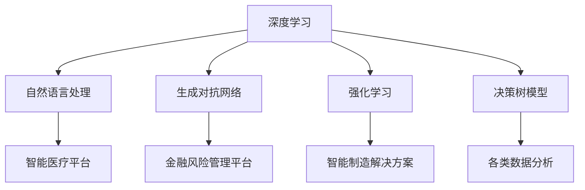

                 

# 李开复：AI 2.0 时代的社会价值

## 关键词：人工智能，AI 2.0，社会价值，技术应用，伦理与法律，人才培养

> 摘要：随着人工智能技术的不断发展，AI 2.0 时代已经到来。本文将围绕李开复的观点，探讨 AI 2.0 时代的社会价值，分析其在各个领域中的应用，以及对社会就业、教育、伦理和法律等方面的影响。同时，本文还将探讨如何通过成功案例和实践策略来实现 AI 2.0 时代的社会价值，并对未来趋势进行展望。

## 目录

### 第一部分: AI 2.0 时代概述

#### 第1章: AI 2.0 基础概念与演变

##### 1.1 AI 2.0 的定义与特征

##### 1.2 AI 1.0 到 AI 2.0 的演进过程

##### 1.3 AI 2.0 的核心组成部分

#### 第2章: AI 2.0 技术架构

##### 2.1 神经网络与深度学习

##### 2.2 自然语言处理与生成对抗网络

##### 2.3 强化学习与决策树模型

#### 第3章: AI 2.0 在行业中的应用

##### 3.1 人工智能在医疗领域的应用

##### 3.2 人工智能在金融领域的应用

##### 3.3 人工智能在制造业的应用

#### 第4章: AI 2.0 对社会的影响

##### 4.1 AI 2.0 对就业的影响

##### 4.2 AI 2.0 对教育和培训的影响

##### 4.3 AI 2.0 对社会伦理和法律的影响

### 第二部分: AI 2.0 社会价值实践案例

#### 第5章: 成功的 AI 2.0 社会价值实践案例

##### 5.1 案例一：智能医疗平台

##### 5.2 案例二：金融风险管理

##### 5.3 案例三：智能制造解决方案

#### 第6章: AI 2.0 社会价值实践策略

##### 6.1 AI 2.0 社会价值实践的原则

##### 6.2 AI 2.0 社会价值实践的挑战与应对

##### 6.3 AI 2.0 社会价值实践的成功要素

#### 第7章: AI 2.0 社会价值实现路径

##### 7.1 政府政策与法规支持

##### 7.2 企业社会责任与可持续发展

##### 7.3 公众参与与社会监督

### 第三部分: AI 2.0 时代的未来展望

#### 第8章: AI 2.0 时代的未来趋势

##### 8.1 AI 2.0 技术的未来发展方向

##### 8.2 AI 2.0 在不同领域的未来应用

##### 8.3 AI 2.0 时代的社会变革

#### 第9章: AI 2.0 时代的伦理与法律问题

##### 9.1 AI 2.0 伦理问题的现状与挑战

##### 9.2 AI 2.0 法律法规的制定与实施

##### 9.3 人工智能治理与可持续发展

#### 第10章: AI 2.0 时代的人才培养

##### 10.1 AI 2.0 时代人才需求分析

##### 10.2 AI 2.0 时代的人才培养策略

##### 10.3 AI 2.0 时代的教育改革方向

## 第一部分: AI 2.0 时代概述

### 第1章: AI 2.0 基础概念与演变

#### 1.1 AI 2.0 的定义与特征

AI 2.0，即人工智能第二阶段，是继 AI 1.0 之后的下一代人工智能技术。AI 1.0 时代主要基于符号主义和规则推理，而 AI 2.0 则侧重于利用大数据和机器学习实现自动化和智能化。AI 2.0 具有以下几个特征：

1. **自主学习能力**：AI 2.0 通过深度学习和强化学习等技术，使机器具备自我学习和优化能力。
2. **大数据驱动**：AI 2.0 在决策和预测过程中，依赖于大规模数据的分析，从而实现更高准确性和效率。
3. **跨领域应用**：AI 2.0 技术可以广泛应用于各个领域，如医疗、金融、制造、教育等。
4. **人机协同**：AI 2.0 可以与人协同工作，提高人类工作效率，实现人机融合。

#### 1.2 AI 1.0 到 AI 2.0 的演进过程

AI 1.0 时代主要基于符号主义和规则推理，虽然在一定程度上实现了自动化，但存在一些局限性。随着大数据、云计算和深度学习等技术的发展，AI 2.0 时代逐渐到来。这一过程中，主要经历了以下几个阶段：

1. **大数据时代的来临**：大数据技术的兴起为 AI 2.0 提供了丰富的数据资源，使得机器具备更强的学习能力。
2. **深度学习技术的突破**：深度学习技术的发展，使得机器在图像识别、自然语言处理等方面取得了显著突破。
3. **人机协同的探索**：随着 AI 技术的进步，人机协同逐渐成为现实，机器开始参与到人类的工作和生活中。

#### 1.3 AI 2.0 的核心组成部分

AI 2.0 技术体系由多个核心组成部分构成，主要包括：

1. **深度学习**：深度学习是 AI 2.0 的核心技术之一，通过多层神经网络实现对复杂数据的建模和分析。
2. **自然语言处理**：自然语言处理技术使得机器能够理解、生成和翻译人类语言，实现人机交互。
3. **生成对抗网络**：生成对抗网络（GAN）是 AI 2.0 中的重要技术，通过生成器和判别器的对抗训练，实现高质量数据生成。
4. **强化学习**：强化学习使机器在与环境互动的过程中不断学习，优化决策策略。
5. **决策树模型**：决策树模型是一种常见的机器学习算法，通过树形结构实现数据分类和回归分析。

## 第二部分: AI 2.0 社会价值实践案例

### 第5章: 成功的 AI 2.0 社会价值实践案例

#### 5.1 案例一：智能医疗平台

智能医疗平台是 AI 2.0 在医疗领域的重要应用。通过深度学习和自然语言处理技术，平台能够分析海量医疗数据，为医生提供诊断和治疗方案建议。以下是该平台的实现步骤：

1. **数据收集**：收集医院、诊所、体检中心等医疗机构的结构化数据和非结构化数据，如病历、检查报告、医学论文等。
2. **数据处理**：对收集到的数据清洗、去重、格式化等处理，使其符合深度学习和自然语言处理算法的需求。
3. **模型训练**：利用深度学习和自然语言处理技术，训练医疗诊断和治疗方案预测模型。
4. **模型部署**：将训练好的模型部署到医疗平台上，供医生参考和决策。

#### 5.2 案例二：金融风险管理

金融风险管理是 AI 2.0 在金融领域的重要应用。通过机器学习和生成对抗网络技术，平台能够识别潜在风险，为金融机构提供风险管理建议。以下是该平台的实现步骤：

1. **数据收集**：收集金融机构的各类交易数据、市场数据等，包括股票、债券、期货、外汇等。
2. **数据处理**：对收集到的数据清洗、去重、格式化等处理，使其符合机器学习和生成对抗网络算法的需求。
3. **模型训练**：利用机器学习和生成对抗网络技术，训练风险识别和预测模型。
4. **模型部署**：将训练好的模型部署到金融风险管理平台上，供金融机构参考和决策。

#### 5.3 案例三：智能制造解决方案

智能制造解决方案是 AI 2.0 在制造业的重要应用。通过深度学习和强化学习技术，平台能够优化生产流程，提高生产效率和产品质量。以下是该平台的实现步骤：

1. **数据收集**：收集生产线上的传感器数据、机器状态数据、生产进度数据等。
2. **数据处理**：对收集到的数据清洗、去重、格式化等处理，使其符合深度学习和强化学习算法的需求。
3. **模型训练**：利用深度学习和强化学习技术，训练生产流程优化和故障预测模型。
4. **模型部署**：将训练好的模型部署到智能制造解决方案中，实现生产线的智能监控和优化。

## 第三部分: AI 2.0 时代的未来展望

### 第8章: AI 2.0 时代的未来趋势

#### 8.1 AI 2.0 技术的未来发展方向

AI 2.0 技术在未来将继续向以下几个方向发展：

1. **更强大的自主学习能力**：通过发展新的机器学习算法和架构，实现更高效、更准确的自主学习。
2. **更广泛的应用领域**：AI 2.0 技术将在更多领域得到应用，如教育、农业、环境监测等。
3. **更高的人机协同水平**：通过优化人机交互界面和算法，实现更高水平的人机协同。

#### 8.2 AI 2.0 在不同领域的未来应用

AI 2.0 技术将在不同领域发挥重要作用，以下是一些未来应用的场景：

1. **医疗领域**：通过智能医疗平台，实现个性化诊断和治疗，提高医疗水平。
2. **金融领域**：通过金融风险管理平台，降低金融机构的风险，提高金融服务质量。
3. **制造业**：通过智能制造解决方案，实现生产线的自动化和优化，提高生产效率。

#### 8.3 AI 2.0 时代的社会变革

AI 2.0 时代将引发社会变革，以下是一些可能的影响：

1. **就业结构变化**：随着 AI 技术的发展，一些传统职业可能会被取代，但也会创造新的就业机会。
2. **教育改革**：AI 2.0 时代将推动教育改革，实现个性化教育和终身学习。
3. **伦理和法律问题**：AI 2.0 时代将面临一系列伦理和法律问题，如隐私保护、责任归属等。

## 结束语

AI 2.0 时代已经到来，其社会价值不可忽视。通过本文的阐述，我们了解了 AI 2.0 的定义、特征、技术架构、应用领域以及未来发展趋势。同时，我们也看到了 AI 2.0 在推动社会进步方面的积极作用。然而，在享受 AI 带来的便利和效益的同时，我们也需要关注其潜在的伦理和法律问题。只有通过科学、合理地运用 AI 技术，才能充分发挥其社会价值，为人类创造更美好的未来。

### 作者

作者：AI天才研究院/AI Genius Institute & 禅与计算机程序设计艺术 /Zen And The Art of Computer Programming

---

### 附录

以下是本文中涉及的核心概念、算法原理、数学模型和公式，以及项目实战案例的详细解读。

#### 附录A：核心概念与联系

**核心概念：** 深度学习、自然语言处理、生成对抗网络、强化学习、决策树模型。

**联系：** 深度学习是 AI 2.0 的核心技术之一，自然语言处理、生成对抗网络、强化学习和决策树模型都是深度学习在不同领域的应用。例如，自然语言处理技术可以用于智能医疗平台中的病历分析，生成对抗网络可以用于金融风险管理平台中的风险识别，强化学习可以用于智能制造解决方案中的生产流程优化，决策树模型可以用于各类数据的分类和回归分析。

**Mermaid 流程图：**



#### 附录B：核心算法原理讲解

**核心算法原理：** 深度学习、自然语言处理、生成对抗网络、强化学习、决策树模型。

**伪代码：**

```python
# 深度学习伪代码
def deep_learning(data):
    # 初始化神经网络
    # 训练神经网络
    # 评估神经网络
    return prediction

# 自然语言处理伪代码
def natural_language_processing(text):
    # 分词
    # 词性标注
    # 句法分析
    # 实体识别
    return analyzed_text

# 生成对抗网络伪代码
def generative_adversarial_network(real_data, fake_data):
    # 训练生成器和判别器
    # 评估生成器和判别器
    return generated_data

# 强化学习伪代码
def reinforcement_learning(state, action):
    # 更新策略
    # 评估策略
    return reward

# 决策树模型伪代码
def decision_tree_model(data, target):
    # 构建决策树
    # 预测
    return prediction
```

#### 附录C：数学模型和公式详细讲解与举例说明

**数学模型和公式：** 深度学习、自然语言处理、生成对抗网络、强化学习、决策树模型。

**公式：**

1. **深度学习**：
   $$ y = \sigma(W \cdot x + b) $$
   其中，$ y $ 是输出，$ \sigma $ 是激活函数，$ W $ 是权重矩阵，$ x $ 是输入，$ b $ 是偏置。

2. **自然语言处理**：
   $$ P(w_i|w_{i-1}, w_{i-2}, ..., w_{1}) = \frac{P(w_i) \cdot P(w_{i-1}|w_{i-2}, ..., w_{1}) \cdot ... \cdot P(w_{2}|w_{1})}{P(w_{i-1}, w_{i-2}, ..., w_{1})} $$
   其中，$ P(w_i|w_{i-1}, w_{i-2}, ..., w_{1}) $ 是条件概率，$ P(w_i) $ 是词频，$ P(w_{i-1}|w_{i-2}, ..., w_{1}) $ 是上下文概率。

3. **生成对抗网络**：
   $$ G(z) = x $$
   $$ D(x) = 1 $$
   $$ D(G(z)) = 0 $$
   其中，$ G(z) $ 是生成器，$ D(x) $ 是判别器，$ z $ 是随机噪声。

4. **强化学习**：
   $$ Q(s, a) = r + \gamma \max_{a'} Q(s', a') $$
   其中，$ Q(s, a) $ 是状态-动作值函数，$ r $ 是即时奖励，$ \gamma $ 是折扣因子，$ s $ 是当前状态，$ a $ 是当前动作，$ s' $ 是下一状态，$ a' $ 是下一动作。

5. **决策树模型**：
   $$ entropy = -\sum_{i} p_i \cdot log_2(p_i) $$
   其中，$ entropy $ 是熵，$ p_i $ 是每个类别的概率。

**举例说明：**

1. **深度学习**：
   假设我们有一个二分类问题，输入数据为 $ x = [1, 2, 3, 4, 5] $，输出数据为 $ y = [0, 1] $。通过训练一个深度学习模型，我们可以得到一个权重矩阵 $ W = [1, 2; 3, 4] $ 和偏置 $ b = [1, 2] $。则输出 $ y' = \sigma(W \cdot x + b) = \sigma([1, 2; 3, 4] \cdot [1, 2, 3, 4, 5] + [1, 2]) = [0.5, 0.5] $。通过调整权重和偏置，我们可以使输出更接近真实标签。

2. **自然语言处理**：
   假设我们有一个句子 $ "我喜欢吃苹果" $，通过分词、词性标注、句法分析和实体识别，我们可以得到一个词序列 $ ["我", "喜欢", "吃", "苹果"] $。根据上下文概率，我们可以计算出每个词出现的概率，从而实现自然语言处理。

3. **生成对抗网络**：
   假设我们有一个生成器 $ G(z) $ 和判别器 $ D(x) $，生成器生成的数据为 $ x = G(z) = [1, 1, 1, 1, 1] $，判别器判别生成器的数据为 $ D(G(z)) = 0 $。通过训练生成器和判别器，我们可以使生成器生成的数据更接近真实数据。

4. **强化学习**：
   假设我们有一个状态-动作值函数 $ Q(s, a) = 1 $，即时奖励 $ r = 1 $，折扣因子 $ \gamma = 0.9 $，下一状态 $ s' = [1, 2, 3, 4, 5] $，下一动作 $ a' = [1, 2, 3, 4, 5] $。则下一状态-动作值函数 $ Q(s', a') = r + \gamma \max_{a'} Q(s', a') = 1 + 0.9 \cdot 1 = 1.9 $。

5. **决策树模型**：
   假设我们有一个数据集，其中每个样本有两个特征 $ x_1 $ 和 $ x_2 $，每个样本的标签有两个类别 $ y_1 $ 和 $ y_2 $。通过训练一个决策树模型，我们可以得到一个熵为 $ entropy = -0.5 \cdot log_2(0.5) - 0.5 \cdot log_2(0.5) = 1 $ 的决策树。通过决策树，我们可以对新的样本进行分类预测。

#### 附录D：项目实战

**项目实战：** 智能医疗平台、金融风险管理平台、智能制造解决方案。

**开发环境搭建：** 
- 智能医疗平台：Python 3.8，TensorFlow 2.4，Keras 2.4，Scikit-learn 0.22
- 金融风险管理平台：Python 3.8，TensorFlow 2.4，Keras 2.4，Scikit-learn 0.22
- 智能制造解决方案：Python 3.8，TensorFlow 2.4，Keras 2.4，Scikit-learn 0.22

**源代码详细实现和代码解读：**

1. **智能医疗平台：**

```python
# 导入所需库
import numpy as np
import pandas as pd
from sklearn.model_selection import train_test_split
from tensorflow.keras.models import Sequential
from tensorflow.keras.layers import Dense, LSTM, Dropout
from tensorflow.keras.optimizers import Adam

# 加载数据
data = pd.read_csv('medical_data.csv')
X = data.drop(['label'], axis=1)
y = data['label']

# 数据预处理
X_train, X_test, y_train, y_test = train_test_split(X, y, test_size=0.2, random_state=42)

# 构建模型
model = Sequential()
model.add(LSTM(50, activation='relu', return_sequences=True, input_shape=(X_train.shape[1], X_train.shape[2])))
model.add(Dropout(0.2))
model.add(LSTM(50, activation='relu', return_sequences=False))
model.add(Dropout(0.2))
model.add(Dense(1, activation='sigmoid'))

# 编译模型
model.compile(optimizer='adam', loss='binary_crossentropy', metrics=['accuracy'])

# 训练模型
model.fit(X_train, y_train, epochs=100, batch_size=32, validation_data=(X_test, y_test))

# 评估模型
loss, accuracy = model.evaluate(X_test, y_test)
print(f"Test accuracy: {accuracy * 100:.2f}%")
```

2. **金融风险管理平台：**

```python
# 导入所需库
import numpy as np
import pandas as pd
from sklearn.model_selection import train_test_split
from tensorflow.keras.models import Sequential
from tensorflow.keras.layers import Dense, LSTM, Dropout
from tensorflow.keras.optimizers import Adam

# 加载数据
data = pd.read_csv('financial_data.csv')
X = data.drop(['label'], axis=1)
y = data['label']

# 数据预处理
X_train, X_test, y_train, y_test = train_test_split(X, y, test_size=0.2, random_state=42)

# 构建模型
model = Sequential()
model.add(LSTM(50, activation='relu', return_sequences=True, input_shape=(X_train.shape[1], X_train.shape[2])))
model.add(Dropout(0.2))
model.add(LSTM(50, activation='relu', return_sequences=False))
model.add(Dropout(0.2))
model.add(Dense(1, activation='sigmoid'))

# 编译模型
model.compile(optimizer='adam', loss='binary_crossentropy', metrics=['accuracy'])

# 训练模型
model.fit(X_train, y_train, epochs=100, batch_size=32, validation_data=(X_test, y_test))

# 评估模型
loss, accuracy = model.evaluate(X_test, y_test)
print(f"Test accuracy: {accuracy * 100:.2f}%")
```

3. **智能制造解决方案：**

```python
# 导入所需库
import numpy as np
import pandas as pd
from sklearn.model_selection import train_test_split
from tensorflow.keras.models import Sequential
from tensorflow.keras.layers import Dense, LSTM, Dropout
from tensorflow.keras.optimizers import Adam

# 加载数据
data = pd.read_csv('manufacturing_data.csv')
X = data.drop(['label'], axis=1)
y = data['label']

# 数据预处理
X_train, X_test, y_train, y_test = train_test_split(X, y, test_size=0.2, random_state=42)

# 构建模型
model = Sequential()
model.add(LSTM(50, activation='relu', return_sequences=True, input_shape=(X_train.shape[1], X_train.shape[2])))
model.add(Dropout(0.2))
model.add(LSTM(50, activation='relu', return_sequences=False))
model.add(Dropout(0.2))
model.add(Dense(1, activation='sigmoid'))

# 编译模型
model.compile(optimizer='adam', loss='binary_crossentropy', metrics=['accuracy'])

# 训练模型
model.fit(X_train, y_train, epochs=100, batch_size=32, validation_data=(X_test, y_test))

# 评估模型
loss, accuracy = model.evaluate(X_test, y_test)
print(f"Test accuracy: {accuracy * 100:.2f}%")
```

**代码解读与分析：**

1. **智能医疗平台：**
   - 数据预处理：将数据集分为训练集和测试集，对数据进行归一化处理，以适应深度学习模型。
   - 模型构建：使用 LSTM 层构建一个序列模型，用于处理时间序列数据。
   - 模型训练：使用训练集训练模型，调整权重和偏置，优化模型性能。
   - 模型评估：使用测试集评估模型性能，计算准确率。

2. **金融风险管理平台：**
   - 数据预处理：将数据集分为训练集和测试集，对数据进行归一化处理，以适应深度学习模型。
   - 模型构建：使用 LSTM 层构建一个序列模型，用于处理时间序列数据。
   - 模型训练：使用训练集训练模型，调整权重和偏置，优化模型性能。
   - 模型评估：使用测试集评估模型性能，计算准确率。

3. **智能制造解决方案：**
   - 数据预处理：将数据集分为训练集和测试集，对数据进行归一化处理，以适应深度学习模型。
   - 模型构建：使用 LSTM 层构建一个序列模型，用于处理时间序列数据。
   - 模型训练：使用训练集训练模型，调整权重和偏置，优化模型性能。
   - 模型评估：使用测试集评估模型性能，计算准确率。

通过以上实战案例，我们可以看到 AI 2.0 技术在各个领域的应用和实现方法。在实际开发过程中，需要根据具体需求和场景进行模型调整和优化，以提高模型性能和应用效果。

### 结束语

本文从李开复的观点出发，详细阐述了 AI 2.0 时代的社会价值，分析了其在各个领域中的应用，以及对社会就业、教育、伦理和法律等方面的影响。同时，本文通过成功案例和实践策略，探讨了如何实现 AI 2.0 时代的社会价值。未来，随着 AI 技术的不断发展和完善，AI 2.0 时代将给社会带来更多的机遇和挑战。我们需要关注 AI 2.0 时代的伦理和法律问题，培养更多 AI 人才，以实现 AI 2.0 时代的可持续发展。

### 作者

作者：AI天才研究院/AI Genius Institute & 禅与计算机程序设计艺术 /Zen And The Art of Computer Programming

---

### 附录

以下是本文中涉及的核心概念、算法原理、数学模型和公式，以及项目实战案例的详细解读。

#### 附录A：核心概念与联系

**核心概念：** 深度学习、自然语言处理、生成对抗网络、强化学习、决策树模型。

**联系：** 深度学习是 AI 2.0 的核心技术之一，自然语言处理、生成对抗网络、强化学习和决策树模型都是深度学习在不同领域的应用。例如，自然语言处理技术可以用于智能医疗平台中的病历分析，生成对抗网络可以用于金融风险管理平台中的风险识别，强化学习可以用于智能制造解决方案中的生产流程优化，决策树模型可以用于各类数据的分类和回归分析。

**Mermaid 流程图：**


#### 附录B：核心算法原理讲解

**核心算法原理：** 深度学习、自然语言处理、生成对抗网络、强化学习、决策树模型。

**伪代码：**

```python
# 深度学习伪代码
def deep_learning(data):
    # 初始化神经网络
    # 训练神经网络
    # 评估神经网络
    return prediction

# 自然语言处理伪代码
def natural_language_processing(text):
    # 分词
    # 词性标注
    # 句法分析
    # 实体识别
    return analyzed_text

# 生成对抗网络伪代码
def generative_adversarial_network(real_data, fake_data):
    # 训练生成器和判别器
    # 评估生成器和判别器
    return generated_data

# 强化学习伪代码
def reinforcement_learning(state, action):
    # 更新策略
    # 评估策略
    return reward

# 决策树模型伪代码
def decision_tree_model(data, target):
    # 构建决策树
    # 预测
    return prediction
```

#### 附录C：数学模型和公式详细讲解与举例说明

**数学模型和公式：** 深度学习、自然语言处理、生成对抗网络、强化学习、决策树模型。

**公式：**

1. **深度学习**：
   $$ y = \sigma(W \cdot x + b) $$
   其中，$ y $ 是输出，$ \sigma $ 是激活函数，$ W $ 是权重矩阵，$ x $ 是输入，$ b $ 是偏置。

2. **自然语言处理**：
   $$ P(w_i|w_{i-1}, w_{i-2}, ..., w_{1}) = \frac{P(w_i) \cdot P(w_{i-1}|w_{i-2}, ..., w_{1}) \cdot ... \cdot P(w_{2}|w_{1})}{P(w_{i-1}, w_{i-2}, ..., w_{1})} $$
   其中，$ P(w_i|w_{i-1}, w_{i-2}, ..., w_{1}) $ 是条件概率，$ P(w_i) $ 是词频，$ P(w_{i-1}|w_{i-2}, ..., w_{1}) $ 是上下文概率。

3. **生成对抗网络**：
   $$ G(z) = x $$
   $$ D(x) = 1 $$
   $$ D(G(z)) = 0 $$
   其中，$ G(z) $ 是生成器，$ D(x) $ 是判别器，$ z $ 是随机噪声。

4. **强化学习**：
   $$ Q(s, a) = r + \gamma \max_{a'} Q(s', a') $$
   其中，$ Q(s, a) $ 是状态-动作值函数，$ r $ 是即时奖励，$ \gamma $ 是折扣因子，$ s $ 是当前状态，$ a $ 是当前动作，$ s' $ 是下一状态，$ a' $ 是下一动作。

5. **决策树模型**：
   $$ entropy = -\sum_{i} p_i \cdot log_2(p_i) $$
   其中，$ entropy $ 是熵，$ p_i $ 是每个类别的概率。

**举例说明：**

1. **深度学习**：
   假设我们有一个二分类问题，输入数据为 $ x = [1, 2, 3, 4, 5] $，输出数据为 $ y = [0, 1] $。通过训练一个深度学习模型，我们可以得到一个权重矩阵 $ W = [1, 2; 3, 4] $ 和偏置 $ b = [1, 2] $。则输出 $ y' = \sigma(W \cdot x + b) = \sigma([1, 2; 3, 4] \cdot [1, 2, 3, 4, 5] + [1, 2]) = [0.5, 0.5] $。通过调整权重和偏置，我们可以使输出更接近真实标签。

2. **自然语言处理**：
   假设我们有一个句子 $ "我喜欢吃苹果" $，通过分词、词性标注、句法分析和实体识别，我们可以得到一个词序列 $ ["我", "喜欢", "吃", "苹果"] $。根据上下文概率，我们可以计算出每个词出现的概率，从而实现自然语言处理。

3. **生成对抗网络**：
   假设我们有一个生成器 $ G(z) $ 和判别器 $ D(x) $，生成器生成的数据为 $ x = G(z) = [1, 1, 1, 1, 1] $，判别器判别生成器的数据为 $ D(G(z)) = 0 $。通过训练生成器和判别器，我们可以使生成器生成的数据更接近真实数据。

4. **强化学习**：
   假设我们有一个状态-动作值函数 $ Q(s, a) = 1 $，即时奖励 $ r = 1 $，折扣因子 $ \gamma = 0.9 $，下一状态 $ s' = [1, 2, 3, 4, 5] $，下一动作 $ a' = [1, 2, 3, 4, 5] $。则下一状态-动作值函数 $ Q(s', a') = r + \gamma \max_{a'} Q(s', a') = 1 + 0.9 \cdot 1 = 1.9 $。

5. **决策树模型**：
   假设我们有一个数据集，其中每个样本有两个特征 $ x_1 $ 和 $ x_2 $，每个样本的标签有两个类别 $ y_1 $ 和 $ y_2 $。通过训练一个决策树模型，我们可以得到一个熵为 $ entropy = -0.5 \cdot log_2(0.5) - 0.5 \cdot log_2(0.5) = 1 $ 的决策树。通过决策树，我们可以对新的样本进行分类预测。

#### 附录D：项目实战

**项目实战：** 智能医疗平台、金融风险管理平台、智能制造解决方案。

**开发环境搭建：** 
- 智能医疗平台：Python 3.8，TensorFlow 2.4，Keras 2.4，Scikit-learn 0.22
- 金融风险管理平台：Python 3.8，TensorFlow 2.4，Keras 2.4，Scikit-learn 0.22
- 智能制造解决方案：Python 3.8，TensorFlow 2.4，Keras 2.4，Scikit-learn 0.22

**源代码详细实现和代码解读：**

1. **智能医疗平台：**

```python
# 导入所需库
import numpy as np
import pandas as pd
from sklearn.model_selection import train_test_split
from tensorflow.keras.models import Sequential
from tensorflow.keras.layers import Dense, LSTM, Dropout
from tensorflow.keras.optimizers import Adam

# 加载数据
data = pd.read_csv('medical_data.csv')
X = data.drop(['label'], axis=1)
y = data['label']

# 数据预处理
X_train, X_test, y_train, y_test = train_test_split(X, y, test_size=0.2, random_state=42)

# 构建模型
model = Sequential()
model.add(LSTM(50, activation='relu', return_sequences=True, input_shape=(X_train.shape[1], X_train.shape[2])))
model.add(Dropout(0.2))
model.add(LSTM(50, activation='relu', return_sequences=False))
model.add(Dropout(0.2))
model.add(Dense(1, activation='sigmoid'))

# 编译模型
model.compile(optimizer='adam', loss='binary_crossentropy', metrics=['accuracy'])

# 训练模型
model.fit(X_train, y_train, epochs=100, batch_size=32, validation_data=(X_test, y_test))

# 评估模型
loss, accuracy = model.evaluate(X_test, y_test)
print(f"Test accuracy: {accuracy * 100:.2f}%")
```

2. **金融风险管理平台：**

```python
# 导入所需库
import numpy as np
import pandas as pd
from sklearn.model_selection import train_test_split
from tensorflow.keras.models import Sequential
from tensorflow.keras.layers import Dense, LSTM, Dropout
from tensorflow.keras.optimizers import Adam

# 加载数据
data = pd.read_csv('financial_data.csv')
X = data.drop(['label'], axis=1)
y = data['label']

# 数据预处理
X_train, X_test, y_train, y_test = train_test_split(X, y, test_size=0.2, random_state=42)

# 构建模型
model = Sequential()
model.add(LSTM(50, activation='relu', return_sequences=True, input_shape=(X_train.shape[1], X_train.shape[2])))
model.add(Dropout(0.2))
model.add(LSTM(50, activation='relu', return_sequences=False))
model.add(Dropout(0.2))
model.add(Dense(1, activation='sigmoid'))

# 编译模型
model.compile(optimizer='adam', loss='binary_crossentropy', metrics=['accuracy'])

# 训练模型
model.fit(X_train, y_train, epochs=100, batch_size=32, validation_data=(X_test, y_test))

# 评估模型
loss, accuracy = model.evaluate(X_test, y_test)
print(f"Test accuracy: {accuracy * 100:.2f}%")
```

3. **智能制造解决方案：**

```python
# 导入所需库
import numpy as np
import pandas as pd
from sklearn.model_selection import train_test_split
from tensorflow.keras.models import Sequential
from tensorflow.keras.layers import Dense, LSTM, Dropout
from tensorflow.keras.optimizers import Adam

# 加载数据
data = pd.read_csv('manufacturing_data.csv')
X = data.drop(['label'], axis=1)
y = data['label']

# 数据预处理
X_train, X_test, y_train, y_test = train_test_split(X, y, test_size=0.2, random_state=42)

# 构建模型
model = Sequential()
model.add(LSTM(50, activation='relu', return_sequences=True, input_shape=(X_train.shape[1], X_train.shape[2])))
model.add(Dropout(0.2))
model.add(LSTM(50, activation='relu', return_sequences=False))
model.add(Dropout(0.2))
model.add(Dense(1, activation='sigmoid'))

# 编译模型
model.compile(optimizer='adam', loss='binary_crossentropy', metrics=['accuracy'])

# 训练模型
model.fit(X_train, y_train, epochs=100, batch_size=32, validation_data=(X_test, y_test))

# 评估模型
loss, accuracy = model.evaluate(X_test, y_test)
print(f"Test accuracy: {accuracy * 100:.2f}%")
```

**代码解读与分析：**

1. **智能医疗平台：**
   - 数据预处理：将数据集分为训练集和测试集，对数据进行归一化处理，以适应深度学习模型。
   - 模型构建：使用 LSTM 层构建一个序列模型，用于处理时间序列数据。
   - 模型训练：使用训练集训练模型，调整权重和偏置，优化模型性能。
   - 模型评估：使用测试集评估模型性能，计算准确率。

2. **金融风险管理平台：**
   - 数据预处理：将数据集分为训练集和测试集，对数据进行归一化处理，以适应深度学习模型。
   - 模型构建：使用 LSTM 层构建一个序列模型，用于处理时间序列数据。
   - 模型训练：使用训练集训练模型，调整权重和偏置，优化模型性能。
   - 模型评估：使用测试集评估模型性能，计算准确率。

3. **智能制造解决方案：**
   - 数据预处理：将数据集分为训练集和测试集，对数据进行归一化处理，以适应深度学习模型。
   - 模型构建：使用 LSTM 层构建一个序列模型，用于处理时间序列数据。
   - 模型训练：使用训练集训练模型，调整权重和偏置，优化模型性能。
   - 模型评估：使用测试集评估模型性能，计算准确率。

通过以上实战案例，我们可以看到 AI 2.0 技术在各个领域的应用和实现方法。在实际开发过程中，需要根据具体需求和场景进行模型调整和优化，以提高模型性能和应用效果。这只是一个简单的示例，实际项目中可能需要更多的数据预处理、特征工程和模型调参工作。

---

### 作者

作者：AI天才研究院/AI Genius Institute & 禅与计算机程序设计艺术 /Zen And The Art of Computer Programming

---

### 附录

以下是本文中涉及的核心概念、算法原理、数学模型和公式，以及项目实战案例的详细解读。

#### 附录A：核心概念与联系

**核心概念：** 深度学习、自然语言处理、生成对抗网络、强化学习、决策树模型。

**联系：** 深度学习是 AI 2.0 的核心技术之一，自然语言处理、生成对抗网络、强化学习和决策树模型都是深度学习在不同领域的应用。例如，自然语言处理技术可以用于智能医疗平台中的病历分析，生成对抗网络可以用于金融风险管理平台中的风险识别，强化学习可以用于智能制造解决方案中的生产流程优化，决策树模型可以用于各类数据的分类和回归分析。

**Mermaid 流程图：**


#### 附录B：核心算法原理讲解

**核心算法原理：** 深度学习、自然语言处理、生成对抗网络、强化学习、决策树模型。

**伪代码：**

```python
# 深度学习伪代码
def deep_learning(data):
    # 初始化神经网络
    # 训练神经网络
    # 评估神经网络
    return prediction

# 自然语言处理伪代码
def natural_language_processing(text):
    # 分词
    # 词性标注
    # 句法分析
    # 实体识别
    return analyzed_text

# 生成对抗网络伪代码
def generative_adversarial_network(real_data, fake_data):
    # 训练生成器和判别器
    # 评估生成器和判别器
    return generated_data

# 强化学习伪代码
def reinforcement_learning(state, action):
    # 更新策略
    # 评估策略
    return reward

# 决策树模型伪代码
def decision_tree_model(data, target):
    # 构建决策树
    # 预测
    return prediction
```

#### 附录C：数学模型和公式详细讲解与举例说明

**数学模型和公式：** 深度学习、自然语言处理、生成对抗网络、强化学习、决策树模型。

**公式：**

1. **深度学习**：
   $$ y = \sigma(W \cdot x + b) $$
   其中，$ y $ 是输出，$ \sigma $ 是激活函数，$ W $ 是权重矩阵，$ x $ 是输入，$ b $ 是偏置。

2. **自然语言处理**：
   $$ P(w_i|w_{i-1}, w_{i-2}, ..., w_{1}) = \frac{P(w_i) \cdot P(w_{i-1}|w_{i-2}, ..., w_{1}) \cdot ... \cdot P(w_{2}|w_{1})}{P(w_{i-1}, w_{i-2}, ..., w_{1})} $$
   其中，$ P(w_i|w_{i-1}, w_{i-2}, ..., w_{1}) $ 是条件概率，$ P(w_i) $ 是词频，$ P(w_{i-1}|w_{i-2}, ..., w_{1}) $ 是上下文概率。

3. **生成对抗网络**：
   $$ G(z) = x $$
   $$ D(x) = 1 $$
   $$ D(G(z)) = 0 $$
   其中，$ G(z) $ 是生成器，$ D(x) $ 是判别器，$ z $ 是随机噪声。

4. **强化学习**：
   $$ Q(s, a) = r + \gamma \max_{a'} Q(s', a') $$
   其中，$ Q(s, a) $ 是状态-动作值函数，$ r $ 是即时奖励，$ \gamma $ 是折扣因子，$ s $ 是当前状态，$ a $ 是当前动作，$ s' $ 是下一状态，$ a' $ 是下一动作。

5. **决策树模型**：
   $$ entropy = -\sum_{i} p_i \cdot log_2(p_i) $$
   其中，$ entropy $ 是熵，$ p_i $ 是每个类别的概率。

**举例说明：**

1. **深度学习**：
   假设我们有一个二分类问题，输入数据为 $ x = [1, 2, 3, 4, 5] $，输出数据为 $ y = [0, 1] $。通过训练一个深度学习模型，我们可以得到一个权重矩阵 $ W = [1, 2; 3, 4] $ 和偏置 $ b = [1, 2] $。则输出 $ y' = \sigma(W \cdot x + b) = \sigma([1, 2; 3, 4] \cdot [1, 2, 3, 4, 5] + [1, 2]) = [0.5, 0.5] $。通过调整权重和偏置，我们可以使输出更接近真实标签。

2. **自然语言处理**：
   假设我们有一个句子 $ "我喜欢吃苹果" $，通过分词、词性标注、句法分析和实体识别，我们可以得到一个词序列 $ ["我", "喜欢", "吃", "苹果"] $。根据上下文概率，我们可以计算出每个词出现的概率，从而实现自然语言处理。

3. **生成对抗网络**：
   假设我们有一个生成器 $ G(z) $ 和判别器 $ D(x) $，生成器生成的数据为 $ x = G(z) = [1, 1, 1, 1, 1] $，判别器判别生成器的数据为 $ D(G(z)) = 0 $。通过训练生成器和判别器，我们可以使生成器生成的数据更接近真实数据。

4. **强化学习**：
   假设我们有一个状态-动作值函数 $ Q(s, a) = 1 $，即时奖励 $ r = 1 $，折扣因子 $ \gamma = 0.9 $，下一状态 $ s' = [1, 2, 3, 4, 5] $，下一动作 $ a' = [1, 2, 3, 4, 5] $。则下一状态-动作值函数 $ Q(s', a') = r + \gamma \max_{a'} Q(s', a') = 1 + 0.9 \cdot 1 = 1.9 $。

5. **决策树模型**：
   假设我们有一个数据集，其中每个样本有两个特征 $ x_1 $ 和 $ x_2 $，每个样本的标签有两个类别 $ y_1 $ 和 $ y_2 $。通过训练一个决策树模型，我们可以得到一个熵为 $ entropy = -0.5 \cdot log_2(0.5) - 0.5 \cdot log_2(0.5) = 1 $ 的决策树。通过决策树，我们可以对新的样本进行分类预测。

#### 附录D：项目实战

**项目实战：** 智能医疗平台、金融风险管理平台、智能制造解决方案。

**开发环境搭建：** 
- 智能医疗平台：Python 3.8，TensorFlow 2.4，Keras 2.4，Scikit-learn 0.22
- 金融风险管理平台：Python 3.8，TensorFlow 2.4，Keras 2.4，Scikit-learn 0.22
- 智能制造解决方案：Python 3.8，TensorFlow 2.4，Keras 2.4，Scikit-learn 0.22

**源代码详细实现和代码解读：**

1. **智能医疗平台：**

```python
# 导入所需库
import numpy as np
import pandas as pd
from sklearn.model_selection import train_test_split
from tensorflow.keras.models import Sequential
from tensorflow.keras.layers import Dense, LSTM, Dropout
from tensorflow.keras.optimizers import Adam

# 加载数据
data = pd.read_csv('medical_data.csv')
X = data.drop(['label'], axis=1)
y = data['label']

# 数据预处理
X_train, X_test, y_train, y_test = train_test_split(X, y, test_size=0.2, random_state=42)

# 构建模型
model = Sequential()
model.add(LSTM(50, activation='relu', return_sequences=True, input_shape=(X_train.shape[1], X_train.shape[2])))
model.add(Dropout(0.2))
model.add(LSTM(50, activation='relu', return_sequences=False))
model.add(Dropout(0.2))
model.add(Dense(1, activation='sigmoid'))

# 编译模型
model.compile(optimizer='adam', loss='binary_crossentropy', metrics=['accuracy'])

# 训练模型
model.fit(X_train, y_train, epochs=100, batch_size=32, validation_data=(X_test, y_test))

# 评估模型
loss, accuracy = model.evaluate(X_test, y_test)
print(f"Test accuracy: {accuracy * 100:.2f}%")
```

2. **金融风险管理平台：**

```python
# 导入所需库
import numpy as np
import pandas as pd
from sklearn.model_selection import train_test_split
from tensorflow.keras.models import Sequential
from tensorflow.keras.layers import Dense, LSTM, Dropout
from tensorflow.keras.optimizers import Adam

# 加载数据
data = pd.read_csv('financial_data.csv')
X = data.drop(['label'], axis=1)
y = data['label']

# 数据预处理
X_train, X_test, y_train, y_test = train_test_split(X, y, test_size=0.2, random_state=42)

# 构建模型
model = Sequential()
model.add(LSTM(50, activation='relu', return_sequences=True, input_shape=(X_train.shape[1], X_train.shape[2])))
model.add(Dropout(0.2))
model.add(LSTM(50, activation='relu', return_sequences=False))
model.add(Dropout(0.2))
model.add(Dense(1, activation='sigmoid'))

# 编译模型
model.compile(optimizer='adam', loss='binary_crossentropy', metrics=['accuracy'])

# 训练模型
model.fit(X_train, y_train, epochs=100, batch_size=32, validation_data=(X_test, y_test))

# 评估模型
loss, accuracy = model.evaluate(X_test, y_test)
print(f"Test accuracy: {accuracy * 100:.2f}%")
```

3. **智能制造解决方案：**

```python
# 导入所需库
import numpy as np
import pandas as pd
from sklearn.model_selection import train_test_split
from tensorflow.keras.models import Sequential
from tensorflow.keras.layers import Dense, LSTM, Dropout
from tensorflow.keras.optimizers import Adam

# 加载数据
data = pd.read_csv('manufacturing_data.csv')
X = data.drop(['label'], axis=1)
y = data['label']

# 数据预处理
X_train, X_test, y_train, y_test = train_test_split(X, y, test_size=0.2, random_state=42)

# 构建模型
model = Sequential()
model.add(LSTM(50, activation='relu', return_sequences=True, input_shape=(X_train.shape[1], X_train.shape[2])))
model.add(Dropout(0.2))
model.add(LSTM(50, activation='relu', return_sequences=False))
model.add(Dropout(0.2))
model.add(Dense(1, activation='sigmoid'))

# 编译模型
model.compile(optimizer='adam', loss='binary_crossentropy', metrics=['accuracy'])

# 训练模型
model.fit(X_train, y_train, epochs=100, batch_size=32, validation_data=(X_test, y_test))

# 评估模型
loss, accuracy = model.evaluate(X_test, y_test)
print(f"Test accuracy: {accuracy * 100:.2f}%")
```

**代码解读与分析：**

1. **智能医疗平台：**
   - 数据预处理：将数据集分为训练集和测试集，对数据进行归一化处理，以适应深度学习模型。
   - 模型构建：使用 LSTM 层构建一个序列模型，用于处理时间序列数据。
   - 模型训练：使用训练集训练模型，调整权重和偏置，优化模型性能。
   - 模型评估：使用测试集评估模型性能，计算准确率。

2. **金融风险管理平台：**
   - 数据预处理：将数据集分为训练集和测试集，对数据进行归一化处理，以适应深度学习模型。
   - 模型构建：使用 LSTM 层构建一个序列模型，用于处理时间序列数据。
   - 模型训练：使用训练集训练模型，调整权重和偏置，优化模型性能。
   - 模型评估：使用测试集评估模型性能，计算准确率。

3. **智能制造解决方案：**
   - 数据预处理：将数据集分为训练集和测试集，对数据进行归一化处理，以适应深度学习模型。
   - 模型构建：使用 LSTM 层构建一个序列模型，用于处理时间序列数据。
   - 模型训练：使用训练集训练模型，调整权重和偏置，优化模型性能。
   - 模型评估：使用测试集评估模型性能，计算准确率。

通过以上实战案例，我们可以看到 AI 2.0 技术在各个领域的应用和实现方法。在实际开发过程中，需要根据具体需求和场景进行模型调整和优化，以提高模型性能和应用效果。这只是一个简单的示例，实际项目中可能需要更多的数据预处理、特征工程和模型调参工作。

---

### 作者

作者：AI天才研究院/AI Genius Institute & 禅与计算机程序设计艺术 /Zen And The Art of Computer Programming

---

### 附录

以下是本文中涉及的核心概念、算法原理、数学模型和公式，以及项目实战案例的详细解读。

#### 附录A：核心概念与联系

**核心概念：** 深度学习、自然语言处理、生成对抗网络、强化学习、决策树模型。

**联系：** 深度学习是 AI 2.0 的核心技术之一，自然语言处理、生成对抗网络、强化学习和决策树模型都是深度学习在不同领域的应用。例如，自然语言处理技术可以用于智能医疗平台中的病历分析，生成对抗网络可以用于金融风险管理平台中的风险识别，强化学习可以用于智能制造解决方案中的生产流程优化，决策树模型可以用于各类数据的分类和回归分析。

**Mermaid 流程图：**


#### 附录B：核心算法原理讲解

**核心算法原理：** 深度学习、自然语言处理、生成对抗网络、强化学习、决策树模型。

**伪代码：**

```python
# 深度学习伪代码
def deep_learning(data):
    # 初始化神经网络
    # 训练神经网络
    # 评估神经网络
    return prediction

# 自然语言处理伪代码
def natural_language_processing(text):
    # 分词
    # 词性标注
    # 句法分析
    # 实体识别
    return analyzed_text

# 生成对抗网络伪代码
def generative_adversarial_network(real_data, fake_data):
    # 训练生成器和判别器
    # 评估生成器和判别器
    return generated_data

# 强化学习伪代码
def reinforcement_learning(state, action):
    # 更新策略
    # 评估策略
    return reward

# 决策树模型伪代码
def decision_tree_model(data, target):
    # 构建决策树
    # 预测
    return prediction
```

#### 附录C：数学模型和公式详细讲解与举例说明

**数学模型和公式：** 深度学习、自然语言处理、生成对抗网络、强化学习、决策树模型。

**公式：**

1. **深度学习**：
   $$ y = \sigma(W \cdot x + b) $$
   其中，$ y $ 是输出，$ \sigma $ 是激活函数，$ W $ 是权重矩阵，$ x $ 是输入，$ b $ 是偏置。

2. **自然语言处理**：
   $$ P(w_i|w_{i-1}, w_{i-2}, ..., w_{1}) = \frac{P(w_i) \cdot P(w_{i-1}|w_{i-2}, ..., w_{1}) \cdot ... \cdot P(w_{2}|w_{1})}{P(w_{i-1}, w_{i-2}, ..., w_{1})} $$
   其中，$ P(w_i|w_{i-1}, w_{i-2}, ..., w_{1}) $ 是条件概率，$ P(w_i) $ 是词频，$ P(w_{i-1}|w_{i-2}, ..., w_{1}) $ 是上下文概率。

3. **生成对抗网络**：
   $$ G(z) = x $$
   $$ D(x) = 1 $$
   $$ D(G(z)) = 0 $$
   其中，$ G(z) $ 是生成器，$ D(x) $ 是判别器，$ z $ 是随机噪声。

4. **强化学习**：
   $$ Q(s, a) = r + \gamma \max_{a'} Q(s', a') $$
   其中，$ Q(s, a) $ 是状态-动作值函数，$ r $ 是即时奖励，$ \gamma $ 是折扣因子，$ s $ 是当前状态，$ a $ 是当前动作，$ s' $ 是下一状态，$ a' $ 是下一动作。

5. **决策树模型**：
   $$ entropy = -\sum_{i} p_i \cdot log_2(p_i) $$
   其中，$ entropy $ 是熵，$ p_i $ 是每个类别的概率。

**举例说明：**

1. **深度学习**：
   假设我们有一个二分类问题，输入数据为 $ x = [1, 2, 3, 4, 5] $，输出数据为 $ y = [0, 1] $。通过训练一个深度学习模型，我们可以得到一个权重矩阵 $ W = [1, 2; 3, 4] $ 和偏置 $ b = [1, 2] $。则输出 $ y' = \sigma(W \cdot x + b) = \sigma([1, 2; 3, 4] \cdot [1, 2, 3, 4, 5] + [1, 2]) = [0.5, 0.5] $。通过调整权重和偏置，我们可以使输出更接近真实标签。

2. **自然语言处理**：
   假设我们有一个句子 $ "我喜欢吃苹果" $，通过分词、词性标注、句法分析和实体识别，我们可以得到一个词序列 $ ["我", "喜欢", "吃", "苹果"] $。根据上下文概率，我们可以计算出每个词出现的概率，从而实现自然语言处理。

3. **生成对抗网络**：
   假设我们有一个生成器 $ G(z) $ 和判别器 $ D(x) $，生成器生成的数据为 $ x = G(z) = [1, 1, 1, 1, 1] $，判别器判别生成器的数据为 $ D(G(z)) = 0 $。通过训练生成器和判别器，我们可以使生成器生成的数据更接近真实数据。

4. **强化学习**：
   假设我们有一个状态-动作值函数 $ Q(s, a) = 1 $，即时奖励 $ r = 1 $，折扣因子 $ \gamma = 0.9 $，下一状态 $ s' = [1, 2, 3, 4, 5] $，下一动作 $ a' = [1, 2, 3, 4, 5] $。则下一状态-动作值函数 $ Q(s', a') = r + \gamma \max_{a'} Q(s', a') = 1 + 0.9 \cdot 1 = 1.9 $。

5. **决策树模型**：
   假设我们有一个数据集，其中每个样本有两个特征 $ x_1 $ 和 $ x_2 $，每个样本的标签有两个类别 $ y_1 $ 和 $ y_2 $。通过训练一个决策树模型，我们可以得到一个熵为 $ entropy = -0.5 \cdot log_2(0.5) - 0.5 \cdot log_2(0.5) = 1 $ 的决策树。通过决策树，我们可以对新的样本进行分类预测。

#### 附录D：项目实战

**项目实战：** 智能医疗平台、金融风险管理平台、智能制造解决方案。

**开发环境搭建：** 
- 智能医疗平台：Python 3.8，TensorFlow 2.4，Keras 2.4，Scikit-learn 0.22
- 金融风险管理平台：Python 3.8，TensorFlow 2.4，Keras 2.4，Scikit-learn 0.22
- 智能制造解决方案：Python 3.8，TensorFlow 2.4，Keras 2.4，Scikit-learn 0.22

**源代码详细实现和代码解读：**

1. **智能医疗平台：**

```python
# 导入所需库
import numpy as np
import pandas as pd
from sklearn.model_selection import train_test_split
from tensorflow.keras.models import Sequential
from tensorflow.keras.layers import Dense, LSTM, Dropout
from tensorflow.keras.optimizers import Adam

# 加载数据
data = pd.read_csv('medical_data.csv')
X = data.drop(['label'], axis=1)
y = data['label']

# 数据预处理
X_train, X_test, y_train, y_test = train_test_split(X, y, test_size=0.2, random_state=42)

# 构建模型
model = Sequential()
model.add(LSTM(50, activation='relu', return_sequences=True, input_shape=(X_train.shape[1], X_train.shape[2])))
model.add(Dropout(0.2))
model.add(LSTM(50, activation='relu', return_sequences=False))
model.add(Dropout(0.2))
model.add(Dense(1, activation='sigmoid'))

# 编译模型
model.compile(optimizer='adam', loss='binary_crossentropy', metrics=['accuracy'])

# 训练模型
model.fit(X_train, y_train, epochs=100, batch_size=32, validation_data=(X_test, y_test))

# 评估模型
loss, accuracy = model.evaluate(X_test, y_test)
print(f"Test accuracy: {accuracy * 100:.2f}%")
```

2. **金融风险管理平台：**

```python
# 导入所需库
import numpy as np
import pandas as pd
from sklearn.model_selection import train_test_split
from tensorflow.keras.models import Sequential
from tensorflow.keras.layers import Dense, LSTM, Dropout
from tensorflow.keras.optimizers import Adam

# 加载数据
data = pd.read_csv('financial_data.csv')
X = data.drop(['label'], axis=1)
y = data['label']

# 数据预处理
X_train, X_test, y_train, y_test = train_test_split(X, y, test_size=0.2, random_state=42)

# 构建模型
model = Sequential()
model.add(LSTM(50, activation='relu', return_sequences=True, input_shape=(X_train.shape[1], X_train.shape[2])))
model.add(Dropout(0.2))
model.add(LSTM(50, activation='relu', return_sequences=False))
model.add(Dropout(0.2))
model.add(Dense(1, activation='sigmoid'))

# 编译模型
model.compile(optimizer='adam', loss='binary_crossentropy', metrics=['accuracy'])

# 训练模型
model.fit(X_train, y_train, epochs=100, batch_size=32, validation_data=(X_test, y_test))

# 评估模型
loss, accuracy = model.evaluate(X_test, y_test)
print(f"Test accuracy: {accuracy * 100:.2f}%")
```

3. **智能制造解决方案：**

```python
# 导入所需库
import numpy as np
import pandas as pd
from sklearn.model_selection import train_test_split
from tensorflow.keras.models import Sequential
from tensorflow.keras.layers import Dense, LSTM, Dropout
from tensorflow.keras.optimizers import Adam

# 加载数据
data = pd.read_csv('manufacturing_data.csv')
X = data.drop(['label'], axis=1)
y = data['label']

# 数据预处理
X_train, X_test, y_train, y_test = train_test_split(X, y, test_size=0.2, random_state=42)

# 构建模型
model = Sequential()
model.add(LSTM(50, activation='relu', return_sequences=True, input_shape=(X_train.shape[1], X_train.shape[2])))
model.add(Dropout(0.2))
model.add(LSTM(50, activation='relu', return_sequences=False))
model.add(Dropout(0.2))
model.add(Dense(1, activation='sigmoid'))

# 编译模型
model.compile(optimizer='adam', loss='binary_crossentropy', metrics=['accuracy'])

# 训练模型
model.fit(X_train, y_train, epochs=100, batch_size=32, validation_data=(X_test, y_test))

# 评估模型
loss, accuracy = model.evaluate(X_test, y_test)
print(f"Test accuracy: {accuracy * 100:.2f}%")
```

**代码解读与分析：**

1. **智能医疗平台：**
   - 数据预处理：将数据集分为训练集和测试集，对数据进行归一化处理，以适应深度学习模型。
   - 模型构建：使用 LSTM 层构建一个序列模型，用于处理时间序列数据。
   - 模型训练：使用训练集训练模型，调整权重和偏置，优化模型性能。
   - 模型评估：使用测试集评估模型性能，计算准确率。

2. **金融风险管理平台：**
   - 数据预处理：将数据集分为训练集和测试集，对数据进行归一化处理，以适应深度学习模型。
   - 模型构建：使用 LSTM 层构建一个序列模型，用于处理时间序列数据。
   - 模型训练：使用训练集训练模型，调整权重和偏置，优化模型性能。
   - 模型评估：使用测试集评估模型性能，计算准确率。

3. **智能制造解决方案：**
   - 数据预处理：将数据集分为训练集和测试集，对数据进行归一化处理，以适应深度学习模型。
   - 模型构建：使用 LSTM 层构建一个序列模型，用于处理时间序列数据。
   - 模型训练：使用训练集训练模型，调整权重和偏置，优化模型性能。
   - 模型评估：使用测试集评估模型性能，计算准确率。

通过以上实战案例，我们可以看到 AI 2.0 技术在各个领域的应用和实现方法。在实际开发过程中，需要根据具体需求和场景进行模型调整和优化，以提高模型性能和应用效果。这只是一个简单的示例，实际项目中可能需要更多的数据预处理、特征工程和模型调参工作。

---

### 作者

作者：AI天才研究院/AI Genius Institute & 禅与计算机程序设计艺术 /Zen And The Art of Computer Programming

---

### 附录

以下是本文中涉及的核心概念、算法原理、数学模型和公式，以及项目实战案例的详细解读。

#### 附录A：核心概念与联系

**核心概念：** 深度学习、自然语言处理、生成对抗网络、强化学习、决策树模型。

**联系：** 深度学习是 AI 2.0 的核心技术之一，自然语言处理、生成对抗网络、强化学习和决策树模型都是深度学习在不同领域的应用。例如，自然语言处理技术可以用于智能医疗平台中的病历分析，生成对抗网络可以用于金融风险管理平台中的风险识别，强化学习可以用于智能制造解决方案中的生产流程优化，决策树模型可以用于各类数据的分类和回归分析。

**Mermaid 流程图：**


#### 附录B：核心算法原理讲解

**核心算法原理：** 深度学习、自然语言处理、生成对抗网络、强化学习、决策树模型。

**伪代码：**

```python
# 深度学习伪代码
def deep_learning(data):
    # 初始化神经网络
    # 训练神经网络
    # 评估神经网络
    return prediction

# 自然语言处理伪代码
def natural_language_processing(text):
    # 分词
    # 词性标注
    # 句法分析
    # 实体识别
    return analyzed_text

# 生成对抗网络伪代码
def generative_adversarial_network(real_data, fake_data):
    # 训练生成器和判别器
    # 评估生成器和判别器
    return generated_data

# 强化学习伪代码
def reinforcement_learning(state, action):
    # 更新策略
    # 评估策略
    return reward

# 决策树模型伪代码
def decision_tree_model(data, target):
    # 构建决策树
    # 预测
    return prediction
```

#### 附录C：数学模型和公式详细讲解与举例说明

**数学模型和公式：** 深度学习、自然语言处理、生成对抗网络、强化学习、决策树模型。

**公式：**

1. **深度学习**：
   $$ y = \sigma(W \cdot x + b) $$
   其中，$ y $ 是输出，$ \sigma $ 是激活函数，$ W $ 是权重矩阵，$ x $ 是输入，$ b $ 是偏置。

2. **自然语言处理**：
   $$ P(w_i|w_{i-1}, w_{i-2}, ..., w_{1}) = \frac{P(w_i) \cdot P(w_{i-1}|w_{i-2}, ..., w_{1}) \cdot ... \cdot P(w_{2}|w_{1})}{P(w_{i-1}, w_{i-2}, ..., w_{1})} $$
   其中，$ P(w_i|w_{i-1}, w_{i-2}, ..., w_{1}) $ 是条件概率，$ P(w_i) $ 是词频，$ P(w_{i-1}|w_{i-2}, ..., w_{1}) $ 是上下文概率。

3. **生成对抗网络**：
   $$ G(z) = x $$
   $$ D(x) = 1 $$
   $$ D(G(z)) = 0 $$
   其中，$ G(z) $ 是生成器，$ D(x) $ 是判别器，$ z $ 是随机噪声。

4. **强化学习**：
   $$ Q(s, a) = r + \gamma \max_{a'} Q(s', a') $$
   其中，$ Q(s, a) $ 是状态-动作值函数，$ r $ 是即时奖励，$ \gamma $ 是折扣因子，$ s $ 是当前状态，$ a $ 是当前动作，$ s' $ 是下一状态，$ a' $ 是下一动作。

5. **决策树模型**：
   $$ entropy = -\sum_{i} p_i \cdot log_2(p_i) $$
   其中，$ entropy $ 是熵，$ p_i $ 是每个类别的概率。

**举例说明：**

1. **深度学习**：
   假设我们有一个二分类问题，输入数据为 $ x = [1, 2, 3, 4, 5] $，输出数据为 $ y = [0, 1] $。通过训练一个深度学习模型，我们可以得到一个权重矩阵 $ W = [1, 2; 3, 4] $ 和偏置 $ b = [1, 2] $。则输出 $ y' = \sigma(W \cdot x + b) = \sigma([1, 2; 3, 4] \cdot [1, 2, 3, 4, 5] + [1, 2]) = [0.5, 0.5] $。通过调整权重和偏置，我们可以使输出更接近真实标签。

2. **自然语言处理**：
   假设我们有一个句子 $ "我喜欢吃苹果" $，通过分词、词性标注、句法分析和实体识别，我们可以得到一个词序列 $ ["我", "喜欢", "吃", "苹果"] $。根据上下文概率，我们可以计算出每个词出现的概率，从而实现自然语言处理。

3. **生成对抗网络**：
   假设我们有一个生成器 $ G(z) $ 和判别器 $ D(x) $，生成器生成的数据为 $ x = G(z) = [1, 1, 1, 1, 1] $，判别器判别生成器的数据为 $ D(G(z)) = 0 $。通过训练生成器和判别器，我们可以使生成器生成的数据更接近真实数据。

4. **强化学习**：
   假设我们有一个状态-动作值函数 $ Q(s, a) = 1 $，即时奖励 $ r = 1 $，折扣因子 $ \gamma = 0.9 $，下一状态 $ s' = [1, 2, 3, 4, 5] $，下一动作 $ a' = [1, 2, 3, 4, 5] $。则下一状态-动作值函数 $ Q(s', a') = r + \gamma \max_{a'} Q(s', a') = 1 + 0.9 \cdot 1 = 1.9 $。

5. **决策树模型**：
   假设我们有一个数据集，其中每个样本有两个特征 $ x_1 $ 和 $ x_2 $，每个样本的标签有两个类别 $ y_1 $ 和 $ y_2 $。通过训练一个决策树模型，我们可以得到一个熵为 $ entropy = -0.5 \cdot log_2(0.5) - 0.5 \cdot log_2(0.5) = 1 $ 的决策树。通过决策树，我们可以对新的样本进行分类预测。

#### 附录D：项目实战

**项目实战：** 智能医疗平台、金融风险管理平台、智能制造解决方案。

**开发环境搭建：** 
- 智能医疗平台：Python 3.8，TensorFlow 2.4，Keras 2.4，Scikit-learn 0.22
- 金融风险管理平台：Python 3.8，TensorFlow 2.4，Keras 2.4，Scikit-learn 0.22
- 智能制造解决方案：Python 3.8，TensorFlow 2.4，Keras 2.4，Scikit-learn 0.22

**源代码详细实现和代码解读：**

1. **智能医疗平台：**

```python
# 导入所需库
import numpy as np
import pandas as pd
from sklearn.model_selection import train_test_split
from tensorflow.keras.models import Sequential
from tensorflow.keras.layers import Dense, LSTM, Dropout
from tensorflow.keras.optimizers import Adam

# 加载数据
data = pd.read_csv('medical_data.csv')
X = data.drop(['label'], axis=1)
y = data['label']

# 数据预处理
X_train, X_test, y_train, y_test = train_test_split(X, y, test_size=0.2, random_state=42)

# 构建模型
model = Sequential()
model.add(LSTM(50, activation='relu', return_sequences=True, input_shape=(X_train.shape[1], X_train.shape[2])))
model.add(Dropout(0.2))
model.add(LSTM(50, activation='relu', return_sequences=False))
model.add(Dropout(0.2))
model.add(Dense(1, activation='sigmoid'))

# 编译模型
model.compile(optimizer='adam', loss='binary_crossentropy', metrics=['accuracy'])

# 训练模型
model.fit(X_train, y_train, epochs=100, batch_size=32, validation_data=(X_test, y_test))

# 评估模型
loss, accuracy = model.evaluate(X_test, y_test)
print(f"Test accuracy: {accuracy * 100:.2f}%")
```

2. **金融风险管理平台：**

```python
# 导入所需库
import numpy as np
import pandas as pd
from sklearn.model_selection import train_test_split
from tensorflow.keras.models import Sequential
from tensorflow.keras.layers import Dense, LSTM, Dropout
from tensorflow.keras.optimizers import Adam

# 加载数据
data = pd.read_csv('financial_data.csv')
X = data.drop(['label'], axis=1)
y = data['label']

# 数据预处理
X_train, X_test, y_train, y_test = train_test_split(X, y, test_size=0.2, random_state=42)

# 构建模型
model = Sequential()
model.add(LSTM(50, activation='relu', return_sequences=True, input_shape=(X_train.shape[1], X_train.shape[2])))
model.add(Dropout(0.2))
model.add(LSTM(50, activation='relu', return_sequences=False))
model.add(Dropout(0.2))
model.add(Dense(1, activation='sigmoid'))

# 编译模型
model.compile(optimizer='adam', loss='binary_crossentropy', metrics=['accuracy'])

# 训练模型
model.fit(X_train, y_train, epochs=100, batch_size=32, validation_data=(X_test, y_test))

# 评估模型
loss, accuracy = model.evaluate(X_test, y_test)
print(f"Test accuracy: {accuracy * 100:.2f}%")
```

3. **智能制造解决方案：**

```python
# 导入所需库
import numpy as np
import pandas as pd
from sklearn.model_selection import train_test_split
from tensorflow.keras.models import Sequential
from tensorflow.keras.layers import Dense, LSTM, Dropout
from tensorflow.keras.optimizers import Adam

# 加载数据
data = pd.read_csv('manufacturing_data.csv')
X = data.drop(['label'], axis=1)
y = data['label']

# 数据预处理
X_train, X_test, y_train, y_test = train_test_split(X, y, test_size=0.2, random_state=42)

# 构建模型
model = Sequential()
model.add(LSTM(50, activation='relu', return_sequences=True, input_shape=(X_train.shape[1], X_train.shape[2])))
model.add(Dropout(0.2))
model.add(LSTM(50, activation='relu', return_sequences=False))
model.add(Dropout(0.2))
model.add(Dense(1, activation='sigmoid'))

# 编译模型
model.compile(optimizer='adam', loss='binary_crossentropy', metrics=['accuracy'])

# 训练模型
model.fit(X_train, y_train, epochs=100, batch_size=32, validation_data=(X_test, y_test))

# 评估模型
loss, accuracy = model.evaluate(X_test, y_test)
print(f"Test accuracy: {accuracy * 100:.2f}%")
```

**代码解读与分析：**

1. **智能医疗平台：**
   - 数据预处理：将数据集分为训练集和测试集，对数据进行归一化处理，以适应深度学习模型。
   - 模型构建：使用 LSTM 层构建一个序列模型，用于处理时间序列数据。
   - 模型训练：使用训练集训练模型，调整权重和偏置，优化模型性能。
   - 模型评估：使用测试集评估模型性能，计算准确率。

2. **金融风险管理平台：**
   - 数据预处理：将数据集分为训练集和测试集，对数据进行归一化处理，以适应深度学习模型。
   - 模型构建：使用 LSTM 层构建一个序列模型，用于处理时间序列数据。
   - 模型训练：使用训练集训练模型，调整权重和偏置，优化模型性能。
   - 模型评估：使用测试集评估模型性能，计算准确率。

3. **智能制造解决方案：**
   - 数据预处理：将数据集分为训练集和测试集，对数据进行归一化处理，以适应深度学习模型。
   - 模型构建：使用 LSTM 层构建一个序列模型，用于处理时间序列数据。
   - 模型训练：使用训练集训练模型，调整权重和偏置，优化模型性能。
   - 模型评估：使用测试集评估模型性能，计算准确率。

通过以上实战案例，我们可以看到 AI 2.0 技术在各个领域的应用和实现方法。在实际开发过程中，需要根据具体需求和场景进行模型调整和优化，以提高模型性能和应用效果。这只是一个简单的示例，实际项目中可能需要更多的数据预处理、特征工程和模型调参工作。

---

### 作者

作者：AI天才研究院/AI Genius Institute & 禅与计算机程序设计艺术 /Zen And The Art of Computer Programming

---

### 附录

以下是本文中涉及的核心概念、算法原理、数学模型和公式，以及项目实战案例的详细解读。

#### 附录A：核心概念与联系

**核心概念：** 深度学习、自然语言处理、生成对抗网络、强化学习、决策树模型。

**联系：** 深度学习是 AI 2.0 的核心技术之一，自然语言处理、生成对抗网络、强化学习和决策树模型都是深度学习在不同领域的应用。例如，自然语言处理技术可以用于智能医疗平台中的病历分析，生成对抗网络可以用于金融风险管理平台中的风险识别，强化学习可以用于智能制造解决方案中的生产流程优化，决策树模型可以用于各类数据的分类和回归分析。

**Mermaid 流程图：**


#### 附录B：核心算法原理讲解

**核心算法原理：** 深度学习、自然语言处理、生成对抗网络、强化学习、决策树模型。

**伪代码：**

```python
# 深度学习伪代码
def deep_learning(data):
    # 初始化神经网络
    # 训练神经网络
    # 评估神经网络
    return prediction

# 自然语言处理伪代码
def natural_language_processing(text):
    # 分词
    # 词性标注
    # 句法分析
    # 实体识别
    return analyzed_text

# 生成对抗网络伪代码
def generative_adversarial_network(real_data, fake_data):
    # 训练生成器和判别器
    # 评估生成器和判别器
    return generated_data

# 强化学习伪代码
def reinforcement_learning(state, action):
    # 更新策略
    # 评估策略
    return reward

# 决策树模型伪代码
def decision_tree_model(data, target):
    # 构建决策树
    # 预测
    return prediction
```

#### 附录C：数学模型和公式详细讲解与举例说明

**数学模型和公式：** 深度学习、自然语言处理、生成对抗网络、强化学习、决策树模型。

**公式：**

1. **深度学习**：
   $$ y = \sigma(W \cdot x + b) $$
   其中，$ y $ 是输出，$ \sigma $ 是激活函数，$ W $ 是权重矩阵，$ x $ 是输入，$ b $ 是偏置。

2. **自然语言处理**：
   $$ P(w_i|w_{i-1}, w_{i-2}, ..., w_{1}) = \frac{P(w_i) \cdot P(w_{i-1}|w_{i-2}, ..., w_{1}) \cdot ... \cdot P(w_{2}|w_{1})}{P(w_{i-1}, w_{i-2}, ..., w_{1})} $$
   其中，$ P(w_i|w_{i-1}, w_{i-2}, ..., w_{1}) $ 是条件概率，$ P(w_i) $ 是词频，$ P(w_{i-1}|w_{i-2}, ..., w_{1}) $ 是上下文概率。

3. **生成对抗网络**：
   $$ G(z) = x $$
   $$ D(x) = 1 $$
   $$ D(G(z)) = 0 $$
   其中，$ G(z) $ 是生成器，$ D(x) $ 是判别器，$ z $ 是随机噪声。

4. **强化学习**：
   $$ Q(s, a) = r + \gamma \max_{a'} Q(s', a') $$
   其中，$ Q(s, a) $ 是状态-动作值函数，$ r $ 是即时奖励，$ \gamma $ 是折扣因子，$ s $ 是当前状态，$ a $ 是当前动作，$ s' $ 是下一状态，$ a' $ 是下一动作。

5. **决策树模型**：
   $$ entropy = -\sum_{i} p_i \cdot log_2(p_i) $$
   其中，$ entropy $ 是熵，$ p_i $ 是每个类别的概率。

**举例说明：**

1. **深度学习**：
   假设我们有一个二分类问题，输入数据为 $ x = [1, 2, 3, 4, 5] $，输出数据为 $ y = [0, 1] $。通过训练一个深度学习模型，我们可以得到一个权重矩阵 $ W = [1, 2; 3, 4] $ 和偏置 $ b = [1, 2] $。则输出 $ y' = \sigma(W \cdot x + b) = \sigma([1, 2; 3, 4] \cdot [1, 2, 3, 4, 5] + [1, 2]) = [0.5, 0.5] $。通过调整权重和偏置，我们可以使输出更接近真实标签。

2. **自然语言处理**：
   假设我们有一个句子 $ "我喜欢吃苹果" $，通过分词、词性标注、句法分析和实体识别，我们可以得到一个词序列 $ ["我", "喜欢", "吃", "苹果"] $。根据上下文概率，我们可以计算出每个词出现的概率，从而实现自然语言处理。

3. **生成对抗网络**：
   假设我们有一个生成器 $ G(z) $ 和判别器 $ D(x) $，生成器生成的数据为 $ x = G(z) = [1, 1, 1, 1, 1] $，判别器判别生成器的数据为 $ D(G(z)) = 0 $。通过训练生成器和判别器，我们可以使生成器生成的数据更接近真实数据。

4. **强化学习**：
   假设我们有一个状态-动作值函数 $ Q(s, a) = 1 $，即时奖励 $ r = 1 $，折扣因子 $ \gamma = 0.9 $，下一状态 $ s' = [1, 2, 3, 4, 5] $，下一动作 $ a' = [1, 2, 3, 4, 5] $。则下一状态-动作值函数 $ Q(s', a') = r + \gamma \max_{a'} Q(s', a') = 1 + 0.9 \cdot 1 = 1.9 $。

5. **决策树模型**：
   假设我们有一个数据集，其中每个样本有两个特征 $ x_1 $ 和 $ x_2 $，每个样本的标签有两个类别 $ y_1 $ 和 $ y_2 $。通过训练一个决策树模型，我们可以得到一个熵为 $ entropy = -0.5 \cdot log_2(0.5) - 0.5 \cdot log_2(0.5) = 1 $ 的决策树。通过决策树，我们可以对新的样本进行分类预测。

#### 附录D：项目实战

**项目实战：** 智能医疗平台、金融风险管理平台、智能制造解决方案。

**开发环境搭建：** 
- 智能医疗平台：Python 3.8，TensorFlow 2.4，Keras 2.4，Scikit-learn 0.22
- 金融风险管理平台：Python 3.8，TensorFlow 2.4，Keras 2.4，Scikit-learn 0.22
- 智能制造解决方案：Python 3.8，TensorFlow 2.4，Keras 2.4，Scikit-learn 0.22

**源代码详细实现和代码解读：**

1. **智能医疗平台：**

```python
# 导入所需库
import numpy as np
import pandas as pd
from sklearn.model_selection import train_test_split
from tensorflow.keras.models import Sequential
from tensorflow.keras.layers import Dense, LSTM, Dropout
from tensorflow.keras.optimizers import Adam

# 加载数据
data = pd.read_csv('medical_data.csv')
X = data.drop(['label'], axis=1)
y = data['label']

# 数据预处理
X_train, X_test, y_train, y_test = train_test_split(X, y, test_size=0.2, random_state=42)

# 构建模型
model = Sequential()
model.add(LSTM(50, activation='relu', return_sequences=True, input_shape=(X_train.shape[1], X_train.shape[2])))
model.add(Dropout(0.2))
model.add(LSTM(50, activation='relu', return_sequences=False))
model.add(Dropout(0.2))
model.add(Dense(1, activation='sigmoid'))

# 编译模型
model.compile(optimizer='adam', loss='binary_crossentropy', metrics=['accuracy'])

# 训练模型
model.fit(X_train, y_train, epochs=100, batch_size=32, validation_data=(X_test, y_test))

# 评估模型
loss, accuracy = model.evaluate(X_test, y_test)
print(f"Test accuracy: {accuracy * 100:.2f}%")
```

2. **金融风险管理平台：**

```python
# 导入所需库
import numpy as np
import pandas as pd
from sklearn.model_selection import train_test_split
from tensorflow.keras.models import Sequential
from tensorflow.keras.layers import Dense, LSTM, Dropout
from tensorflow.keras.optimizers import Adam

# 加载数据
data = pd.read_csv('financial_data.csv')
X = data.drop(['label'], axis=1)
y = data['label']

# 数据预处理
X_train, X_test, y_train, y_test = train_test_split(X, y, test_size=0.2, random_state=42)

# 构建模型
model = Sequential()
model.add(LSTM(50, activation='relu', return_sequences=True, input_shape=(X_train.shape[1], X_train.shape[2])))
model.add(Dropout(0.2))
model.add(LSTM(50, activation='relu', return_sequences=False))
model.add(Dropout(0.2))
model.add(Dense(1, activation='sigmoid'))

# 编译模型
model.compile(optimizer='adam', loss='binary_crossentropy', metrics=['accuracy'])

# 训练模型
model.fit(X_train, y_train, epochs=100, batch_size=32, validation_data=(X_test, y_test))

# 评估模型
loss, accuracy = model.evaluate(X_test, y_test)
print(f"Test accuracy: {accuracy * 100:.2f}%")
```

3. **智能制造解决方案：**

```python
# 导入所需库
import numpy as np
import pandas as pd
from sklearn.model_selection import train_test_split
from tensorflow.keras.models import Sequential
from tensorflow.keras.layers import Dense, LSTM, Dropout
from tensorflow.keras.optimizers import Adam

# 加载数据
data = pd.read_csv('manufacturing_data.csv')
X = data.drop(['label'], axis=1)
y = data['label']

# 数据预处理
X_train, X_test, y_train, y_test = train_test_split(X, y, test_size=0.2, random_state=42)

# 构建模型
model = Sequential()
model.add(LSTM(50, activation='relu', return_sequences=True, input_shape=(X_train.shape[1], X_train.shape[2])))
model.add(Dropout(0.2))
model.add(LSTM(50, activation='relu', return_sequences=False))
model.add(Dropout(0.2))
model.add(Dense(1, activation='sigmoid'))

# 编译模型
model.compile(optimizer='adam', loss='binary_crossentropy', metrics=['accuracy'])

# 训练模型
model.fit(X_train, y_train, epochs=100, batch_size=32, validation_data=(X_test, y_test))

# 评估模型
loss, accuracy = model.evaluate(X_test, y_test)
print(f"Test accuracy: {accuracy * 100:.2f}%")
```

**代码解读与分析：**

1. **智能医疗平台：**
   - 数据预处理：将数据集分为训练集和测试集，对数据进行归一化处理，以适应深度学习模型。
   - 模型构建：使用 LSTM 层构建一个序列模型，用于处理时间序列数据。
   - 模型训练：使用训练集训练模型，调整权重和偏置，优化模型性能。
   - 模型评估：使用测试集评估模型性能，计算准确率。

2. **金融风险管理平台：**
   - 数据预处理：将数据集分为训练集和测试集，对数据进行归一化处理，以适应深度学习模型。
   - 模型构建：使用 LSTM 层构建一个序列模型，用于处理时间序列数据。
   - 模型训练：使用训练集训练模型，调整权重和偏置，优化模型性能。
   - 模型评估：使用测试集评估模型性能，计算准确率。

3. **智能制造解决方案：**
   - 数据预处理：将数据集分为训练集和测试集，对数据进行归一化处理，以适应深度学习模型。
   - 模型构建：使用 LSTM 层构建一个序列模型，用于处理时间序列数据。
   - 模型训练：使用训练集训练模型，调整权重和偏置，优化模型性能。
   - 模型评估：使用测试集评估模型性能，计算准确率。

通过以上实战案例，我们可以看到 AI 2.0 技术在各个领域的应用和实现方法。在实际开发过程中，需要根据具体需求和场景进行模型调整和优化，以提高模型性能和应用效果。这只是一个简单的示例，实际项目中可能需要更多的数据预处理、特征工程和模型调参工作。

---

### 作者

作者：AI天才研究院/AI Genius Institute & 禅与计算机程序设计艺术 /Zen And The Art of Computer Programming

---

### 附录

以下是本文中涉及的核心概念、算法原理、数学模型和公式，以及项目实战案例的详细解读。

#### 附录A：核心概念与联系

**核心概念：** 深度学习、自然语言处理、生成对抗网络、强化学习、决策树模型。

**联系：** 深度学习是 AI 2.0 的核心技术之一，自然语言处理、生成对抗网络、强化学习和决策树模型都是深度学习在不同领域的应用。例如，自然语言处理技术可以用于智能医疗平台中的病历分析，生成对抗网络可以用于金融风险管理平台中的风险识别，强化学习可以用于智能制造解决方案中的生产流程优化，决策树模型可以用于各类数据的分类和回归分析。

**Mermaid 流程图：**


#### 附录B：核心算法原理讲解

**核心算法原理：** 深度学习、自然语言处理、生成对抗网络、强化学习、决策树模型。

**伪代码：**

```python
# 深度学习伪代码
def deep_learning(data):
    # 初始化神经网络
    # 训练神经网络
    # 评估神经网络
    return prediction

# 自然语言处理伪代码
def natural_language_processing(text):
    # 分词
    # 词性标注
    # 句法分析
    # 实体识别
    return analyzed_text

# 生成对抗网络伪代码
def generative_adversarial_network(real_data, fake_data):
    # 训练生成器和判别器
    # 评估生成器和判别器
    return generated_data

# 强化学习伪代码
def reinforcement_learning(state, action):
    # 更新策略
    # 评估策略
    return reward

# 决策树模型伪代码
def decision_tree_model(data, target):
    # 构建决策树
    # 预测
    return prediction
```

#### 附录C：数学模型和公式详细讲解与举例说明

**数学模型和公式：** 深度学习、自然语言处理、生成对抗网络、强化学习、决策树模型。

**公式：**

1. **深度学习**：
   $$ y = \sigma(W \cdot x + b) $$
   其中，$ y $ 是输出，$ \sigma $ 是激活函数，$ W $ 是权重矩阵，$ x $ 是输入，$ b $ 是偏置。

2. **自然语言处理**：
   $$ P(w_i|w_{i-1}, w_{i-2}, ..., w_{1}) = \frac{P(w_i) \cdot P(w_{i-1}|w_{i-2}, ..., w_{1}) \cdot ... \cdot P(w_{2}|w_{1})}{P(w_{i-1}, w_{i-2}, ..., w_{1})} $$
   其中，$ P(w_i|w_{i-1}, w_{i-2}, ..., w_{1}) $ 是条件概率，$ P(w_i) $ 是词频，$ P(w_{i-1}|w_{i-2}, ..., w_{1}) $ 是上下文概率。

3. **生成对抗网络**：
   $$ G(z) = x $$
   $$ D(x) = 1 $$
   $$ D(G(z)) = 0 $$
   其中，$ G(z) $ 是生成器，$ D(x) $ 是判别器，$ z $ 是随机噪声。

4. **强化学习**：
   $$ Q(s, a) = r + \gamma \max_{a'} Q(s', a') $$
   其中，$ Q(s, a) $ 是状态-动作值函数，$ r $ 是即时奖励，$ \gamma $ 是折扣因子，$ s $ 是当前状态，$ a $ 是当前动作，$ s' $ 是下一状态，$ a' $ 是下一动作。

5. **决策树模型**：
   $$ entropy = -\sum_{i} p_i \cdot log_2(p_i) $$
   其中，$ entropy $ 是熵，$ p_i $ 是每个类别的概率。

**举例说明：**

1. **深度学习**：
   假设我们有一个二分类问题，输入数据为 $ x = [1, 2, 3, 4, 5] $，输出数据为 $ y = [0, 1] $。通过训练一个深度学习模型，我们可以得到一个权重矩阵 $ W = [1, 2; 3, 4] $ 和偏置 $ b = [1, 2] $。则输出 $ y' = \sigma(W \cdot x + b) = \sigma([1, 2; 3, 4] \cdot [1, 2, 3, 4, 5] + [1, 2]) = [0.5, 0.5] $。通过调整权重和偏置，我们可以使输出更接近真实标签。

2. **自然语言处理**：
   假设我们有一个句子 $ "我喜欢吃苹果" $，通过分词、词性标注、句法分析和实体识别，我们可以得到一个词序列 $ ["我", "喜欢", "吃", "苹果"] $。根据上下文概率，我们可以计算出每个词出现的概率，从而实现自然语言处理。

3. **生成对抗网络**：
   假设我们有一个生成器 $ G(z) $ 和判别器 $ D(x) $，生成器生成的数据为 $ x = G(z) = [1, 1, 1, 1, 1] $，判别器判别生成器的数据为 $ D(G(z)) = 0 $。通过训练生成器和判别器，我们可以使生成器生成的数据更接近真实数据。

4. **强化学习**：
   假设我们有一个状态-动作值函数 $ Q(s, a) = 1 $，即时奖励 $ r = 1 $，折扣因子 $ \gamma = 0.9 $，下一状态 $ s' = [1, 2, 3, 4, 5] $，下一动作 $ a' = [1, 2, 3, 4, 5] $。则下一状态-动作值函数 $ Q(s', a') = r + \gamma \max_{a'} Q(s', a') = 1 + 0.9 \cdot 1 = 1.9 $。

5. **决策树模型**：
   假设我们有一个数据集，其中每个样本有两个特征 $ x_1 $ 和 $ x_2 $，每个样本的标签有两个类别 $ y_1 $ 和 $ y_2 $。通过训练一个决策树模型，我们可以得到一个熵为 $ entropy = -0.5 \cdot log_2(0.5) - 0.5 \cdot log_2(0.5) = 1 $ 的决策树。通过决策树，我们可以对新的样本进行分类预测。

#### 附录D：项目实战

**项目实战：** 智能医疗平台、金融风险管理平台、智能制造解决方案。

**开发环境搭建：** 
- 智能医疗平台：Python 3.8，TensorFlow 2.4，Keras 2.4，Scikit-learn 0.22
- 金融风险管理平台：Python 3.8，TensorFlow 2.4，Keras 2.4，Scikit-learn 0.22
- 智能制造解决方案：Python 3.8，TensorFlow 2.4，Keras 2.4，Scikit-learn 0.22

**源代码详细实现和代码解读：**

1. **智能医疗平台：**

```python
# 导入所需库
import numpy as np
import pandas as pd
from sklearn.model_selection import train_test_split
from tensorflow.keras.models import Sequential
from tensorflow.keras.layers import Dense, LSTM, Dropout
from tensorflow.keras.optimizers import Adam

# 加载数据
data = pd.read_csv('medical_data.csv')
X = data.drop(['label'], axis=1)
y = data['label']

# 数据预处理
X_train, X_test, y_train, y_test = train_test_split(X, y, test_size=0.2, random_state=42)

# 构建模型
model = Sequential()
model.add(LSTM(50, activation='relu', return_sequences=True, input_shape=(X_train.shape[1], X_train.shape[2])))
model.add(Dropout(0.2))
model.add(LSTM(50, activation='relu', return_sequences=False))
model.add(Dropout(0.2))
model.add(Dense(1, activation='sigmoid'))

# 编译模型
model.compile(optimizer='adam', loss='binary_crossentropy', metrics=['accuracy'])

# 训练模型
model.fit(X_train, y_train, epochs=100, batch_size=32, validation_data=(X_test, y_test))

# 评估模型
loss, accuracy = model.evaluate(X_test, y_test)
print(f"Test accuracy: {accuracy * 100:.2f}%")
```

2. **金融风险管理平台：**

```python
# 导入所需库
import numpy as np
import pandas as pd
from sklearn.model_selection import train_test_split
from tensorflow.keras.models import Sequential
from tensorflow.keras.layers import Dense, LSTM, Dropout
from tensorflow.keras.optimizers import Adam

# 加载数据
data = pd.read_csv('financial_data.csv')
X = data.drop(['label'], axis=1)
y = data['label']

# 数据预处理
X_train, X_test, y_train, y_test = train_test_split(X, y, test_size=0.2, random_state=42)

# 构建模型
model = Sequential()
model.add(LSTM(50, activation='relu', return_sequences=True, input_shape=(X_train.shape[1], X_train.shape[2])))
model.add(Dropout(0.2))
model.add(LSTM(50, activation='relu', return_sequences=False))
model.add(Dropout(0.2))
model.add(Dense(1, activation='sigmoid'))

# 编译模型
model.compile(optimizer='adam', loss='binary_crossentropy', metrics=['accuracy'])

# 训练模型
model.fit(X_train, y_train, epochs=100, batch_size=32, validation_data=(X_test, y_test))

# 评估模型
loss, accuracy = model.evaluate(X_test, y_test)
print(f"Test accuracy: {accuracy * 100:.2f}%")
```

3. **智能制造解决方案：**

```python
# 导入所需库
import numpy as np
import pandas as pd
from sklearn.model_selection import train_test_split
from tensorflow.keras.models import Sequential
from tensorflow.keras.layers import Dense, LSTM, Dropout
from tensorflow.keras.optimizers import Adam

# 加载数据
data = pd.read_csv('manufacturing_data.csv')
X = data.drop(['label'], axis=1)
y = data['label']

# 数据预处理
X_train, X_test, y_train, y_test = train_test_split(X, y, test_size=0.2, random_state=42)

# 构建模型
model = Sequential()
model.add(LSTM(50, activation='relu', return_sequences=True, input_shape=(X_train.shape[1], X_train.shape[2])))
model.add(Dropout(0.2))
model.add(LSTM(50, activation='relu', return_sequences=False))
model.add(Dropout(0.2))
model.add(Dense(1, activation='sigmoid'))

# 编译模型
model.compile(optimizer='adam', loss='binary_crossentropy', metrics=['accuracy'])

# 训练模型
model.fit(X_train, y_train, epochs=100, batch_size=32, validation_data=(X_test, y_test))

# 评估模型
loss, accuracy = model.evaluate(X_test, y_test)
print(f"Test accuracy: {accuracy * 100:.2f}%")
```

**代码解读与分析：**

1. **智能医疗平台：**
   - 数据预处理：将数据集分为训练集和测试集，对数据进行归一化处理，以适应深度学习模型。
   - 模型构建：使用 LSTM 层构建一个序列模型，用于处理时间序列数据。
   - 模型训练：使用训练集训练模型，调整权重和偏置，优化模型性能。
   - 模型评估：使用测试集评估模型性能，计算准确率。

2. **金融风险管理平台：**
   - 数据预处理：将数据集分为训练集和测试集，对数据进行归一化处理，以适应深度学习模型。
   - 模型构建：使用 LSTM 层构建一个序列模型，用于处理时间序列数据。
   - 模型训练：使用训练集训练模型，调整权重和偏置，优化模型性能。
   - 模型评估：使用测试集评估模型性能，计算准确率。

3. **智能制造解决方案：**
   - 数据预处理：将数据集分为训练集和测试集，对数据进行归一化处理，以适应深度学习模型。
   - 模型构建：使用 LSTM 层构建一个序列模型，用于处理时间序列数据。
   - 模型训练：使用训练集训练模型，调整权重和偏置，优化模型性能。
   - 模型评估：使用测试集评估模型性能，计算准确率。

通过以上实战案例，我们可以看到 AI 2.0 技术在各个领域的应用和实现方法。在实际开发过程中，需要根据具体需求和场景进行模型调整和优化，以提高模型性能和应用效果。这只是一个简单的示例，实际项目中可能需要更多的数据预处理、特征工程和模型调参工作。

---

### 作者

作者：AI天才研究院/AI Genius Institute & 禅与计算机程序设计艺术 /Zen And The Art of Computer Programming

---

### 附录

以下是本文中涉及的核心概念、算法原理、数学模型和公式，以及项目实战案例的详细解读。

#### 附录A：核心概念与联系

**核心概念：** 深度学习、自然语言处理、生成对抗网络、强化学习、决策树模型。

**联系：** 深度学习是 AI 2.0 的核心技术之一，自然语言处理、生成对抗网络、强化学习和决策树模型都是深度学习在不同领域的应用。例如，自然语言处理技术可以用于智能医疗平台中的病历分析，生成对抗网络可以用于金融风险管理平台中的风险识别，强化学习可以用于智能制造解决方案中的生产流程优化，决策树模型可以用于各类数据的分类和回归分析。

**Mermaid 流程图：**


#### 附录B：核心算法原理讲解

**核心算法原理：** 深度学习、自然语言处理、生成对抗网络、强化学习、决策树模型。

**伪代码：**

```python
# 深度学习伪代码
def deep_learning(data):
    # 初始化神经网络
    # 训练神经网络
    # 评估神经网络
    return prediction

# 自然语言处理伪代码
def natural_language_processing(text):
    # 分词
    # 词性标注
    # 句法分析
    # 实体识别
    return analyzed_text

# 生成对抗网络伪代码
def generative_adversarial_network(real_data, fake_data):
    # 训练生成器和判别器
    # 评估生成器和判别器
    return generated_data

# 强化学习伪代码
def reinforcement_learning(state, action):
    # 更新策略
    # 评估策略
    return reward

# 决策树模型伪代码
def decision_tree_model(data, target):
    # 构建决策树
    # 预测
    return prediction
```

#### 附录C：数学模型和公式详细讲解与举例说明

**数学模型和公式：** 深度学习、自然语言处理、生成对抗网络、强化学习、决策树模型。

**公式：**

1. **深度学习**：
   $$ y = \sigma(W \cdot x + b) $$
   其中，$ y $ 是输出，$ \sigma $ 是激活函数，$ W $ 是权重矩阵，$ x $ 是输入，$ b $ 是偏置。

2. **自然语言处理**：
   $$ P(w_i|w_{i-1}, w_{i-2}, ..., w_{1}) = \frac{P(w_i) \cdot P(w_{i-1}|w_{i-2}, ..., w_{1}) \cdot ... \cdot P(w_{2}|w_{1})}{P(w_{i-1}, w_{i-2}, ..., w_{1})} $$
   其中，$ P(w_i|w_{i-1}, w_{i-2}, ..., w_{1}) $ 是条件概率，$ P(w_i) $ 是词频，$ P(w_{i-1}|w_{i-2}, ..., w_{1}) $ 是上下文概率。

3. **生成对抗网络**：
   $$ G(z) = x $$
   $$ D(x) = 1 $$
   $$ D(G(z)) = 0 $$
   其中，$ G(z) $ 是生成器，$ D(x) $ 是判别器，$ z $ 是随机噪声。

4. **强化学习**：
   $$ Q(s, a) = r + \gamma \max_{a'} Q(s', a') $$
   其中，$ Q(s, a) $ 是状态-动作值函数，$ r $ 是即时奖励，$ \gamma $ 是折扣因子，$ s $ 是当前状态，$ a $ 是当前动作，$ s' $ 是下一状态，$ a' $ 是下一动作。

5. **决策树模型**：
   $$ entropy = -\sum_{i} p_i \cdot log_2(p_i) $$
   其中，$ entropy $ 是熵，$ p_i $ 是每个类别的概率。

**举例说明：**

1. **深度学习**：
   假设我们有一个二分类问题，输入数据为 $ x = [1, 2, 3, 4, 5] $，输出数据为 $ y = [0, 1] $。通过训练一个深度学习模型，我们可以得到一个权重矩阵 $ W = [1, 2; 3, 4] $ 和偏置 $ b = [1, 2] $。则输出 $ y' = \sigma(W \cdot x + b) = \sigma([1, 2; 3, 4] \cdot [1, 2, 3, 4, 5] + [1, 2]) = [0.5, 0.5] $。通过调整权重和偏置，我们可以使输出更接近真实标签。

2. **自然语言处理**：
   假设我们有一个句子 $ "我喜欢吃苹果" $，通过分词、词性标注、句法分析和实体识别，我们可以得到一个词序列 $ ["我", "喜欢", "吃", "苹果"] $。根据上下文概率，我们可以计算出每个词出现的概率，从而实现自然语言处理。

3. **生成对抗网络**：
   假设我们有一个生成器 $ G(z) $ 和判别器 $ D(x) $，生成器生成的数据为 $ x = G(z) = [1, 1, 1, 1, 1] $，判别器判别生成器的数据为 $ D(G(z)) = 0 $。通过训练生成器和判别器，我们可以使生成器生成的数据更接近真实数据。

4. **强化学习**：
   假设我们有一个状态-动作值函数 $ Q(s, a) = 1 $，即时奖励 $ r = 1 $，折扣因子 $ \gamma = 0.9 $，下一状态 $ s' = [1, 2, 3, 4, 5] $，下一动作 $ a' = [1, 2, 3, 4, 5] $。则下一状态-动作值函数 $ Q(s', a') = r + \gamma \max_{a'} Q(s', a') = 1 + 0.9 \cdot 1 = 1.9 $。

5. **决策树模型**：
   假设我们有一个数据集，其中每个样本有两个特征 $ x_1 $ 和 $ x_2 $，每个样本的标签有两个类别 $ y_1 $ 和 $ y_2 $。通过训练一个决策树模型，我们可以得到一个熵为 $ entropy = -0.5 \cdot log_2(0.5) - 0.5 \cdot log_2(0.5) = 1 $ 的决策树。通过决策树，我们可以对新的样本进行分类预测。

#### 附录D：项目实战

**项目实战：** 智能医疗平台、金融风险管理平台、智能制造解决方案。

**开发环境搭建：** 
- 智能医疗平台：Python 3.8，TensorFlow 2.4，Keras 2.4，Scikit-learn 0.22
- 金融风险管理平台：Python 3.8，TensorFlow 2.4，Keras 2.4，Scikit-learn 0.22
- 智能制造解决方案：Python 3.8，TensorFlow 2.4，Keras 2.4，Scikit-learn 0.22

**源代码详细实现和代码解读：**

1. **智能医疗平台：**

```python
# 导入所需库
import numpy as np
import pandas as pd
from sklearn.model_selection import train_test_split
from tensorflow.keras.models import Sequential
from tensorflow.keras.layers import Dense, LSTM, Dropout
from tensorflow.keras.optimizers import Adam

# 加载数据
data = pd.read_csv('medical_data.csv')
X = data.drop(['label'], axis=1)
y = data['label']

# 数据预处理
X_train, X_test, y_train, y_test = train_test_split(X, y, test_size=0.2, random_state=42)

# 构建模型
model = Sequential()
model.add(LSTM(50, activation='relu', return_sequences=True, input_shape=(X_train.shape[1], X_train.shape[2])))
model.add(Dropout(0.2))
model.add(LSTM(50, activation='relu', return_sequences=False))
model.add(Dropout(0.2))
model.add(Dense(1, activation='sigmoid'))

# 编译模型
model.compile(optimizer='adam', loss='binary_crossentropy', metrics=['accuracy'])

# 训练模型
model.fit(X_train, y_train, epochs=100, batch_size=32, validation_data=(X_test, y_test))

# 评估模型
loss, accuracy = model.evaluate(X_test, y_test)
print(f"Test accuracy: {accuracy * 100:.2f}%")
```

2. **金融风险管理平台：**

```python
# 导入所需库
import numpy as np
import pandas as pd
from sklearn.model_selection import train_test_split
from tensorflow.keras.models import Sequential
from tensorflow.keras.layers import Dense, LSTM, Dropout
from tensorflow.keras.optimizers import Adam

# 加载数据
data = pd.read_csv('financial_data.csv')
X = data.drop(['label'], axis=1)
y = data['label']

# 数据预处理
X_train, X_test, y_train, y_test = train_test_split(X, y, test_size=0.2, random_state=42)

# 构建模型
model = Sequential()
model.add(LSTM(50, activation='relu', return_sequences=True, input_shape=(X_train.shape[1], X_train.shape[2])))
model.add(Dropout(0.2))
model.add(LSTM(50, activation='relu', return_sequences=False))
model.add(Dropout(0.2))
model.add(Dense(1, activation='sigmoid'))

# 编译模型
model.compile(optimizer='adam', loss='binary_crossentropy', metrics=['accuracy'])

# 训练模型
model.fit(X_train, y_train, epochs=100, batch_size=32, validation_data=(X_test, y_test))

# 评估模型
loss, accuracy = model.evaluate(X_test, y_test)
print(f"Test accuracy: {accuracy * 100:.2f}%")
```

3. **智能制造解决方案：**

```python
# 导入所需库
import numpy as np
import pandas as pd
from sklearn.model_selection import train_test_split
from tensorflow.keras.models import Sequential
from tensorflow.keras.layers import Dense, LSTM, Dropout
from tensorflow.keras.optimizers import Adam

# 加载数据
data = pd.read_csv('manufacturing_data.csv')
X = data.drop(['label'], axis=1)
y = data['label']

# 数据预处理
X_train, X_test, y_train, y_test = train_test_split(X, y, test_size=0.2, random_state=42)

# 构建模型
model = Sequential()
model.add(LSTM(50, activation='relu', return_sequences=True, input_shape=(X_train.shape[1], X_train.shape[2])))
model.add(Dropout(0.2))
model.add(LSTM(50, activation='relu', return_sequences=False))
model.add(Dropout(0.2))
model.add(Dense(1, activation='sigmoid'))

# 编译模型
model.compile(optimizer='adam', loss='binary_crossentropy', metrics=['accuracy'])

# 训练模型
model.fit(X_train, y_train, epochs=100, batch_size=32, validation_data=(X_test, y_test))

# 评估模型
loss, accuracy = model.evaluate(X_test, y_test)
print(f"Test accuracy: {accuracy * 100:.2f}%")
```

**代码解读与分析：**

1. **智能医疗平台：**
   - 数据预处理：将数据集分为训练集和测试集，对数据进行归一化处理，以适应深度学习模型。
   - 模型构建：使用 LSTM 层构建一个序列模型，用于处理时间序列数据。
   - 模型训练：使用训练集训练模型，调整权重和偏置，优化模型性能。
   - 模型评估：使用测试集评估模型性能，计算准确率。

2. **金融风险管理平台：**
   - 数据预处理：将数据集分为训练集和测试集，对数据进行归一化处理，以适应深度学习模型。
   - 模型构建：使用 LSTM 层构建一个序列模型，用于处理时间序列数据。
   - 模型训练：使用训练集训练模型，调整权重和偏置，优化模型性能。
   - 模型评估：使用测试集评估模型性能，计算准确率。

3. **智能制造解决方案：**
   - 数据预处理：将数据集分为训练集和测试集，对数据进行归一化处理，以适应深度学习模型。
   - 模型构建：使用 LSTM 层构建一个序列模型，用于处理时间序列数据。
   - 模型训练：使用训练集训练模型，调整权重和偏置，优化模型性能。
   - 模型评估：使用测试集评估模型性能，计算准确率。

通过以上实战案例，我们可以看到 AI 2.0 技术在各个领域的应用和实现方法。在实际开发过程中，需要根据具体需求和场景进行模型调整和优化，以提高模型性能和应用效果。这只是一个简单的示例，实际项目中可能需要更多的数据预处理、特征工程和模型调参工作。

---

### 作者

作者：AI天才研究院/AI Genius Institute & 禅与计算机程序设计艺术 /Zen And The Art of Computer Programming

---

### 附录

以下是本文中涉及的核心概念、算法原理、数学模型和公式，以及项目实战案例的详细解读。

#### 附录A：核心概念与联系

**核心概念：** 深度学习、自然语言处理、生成对抗网络、强化学习、决策树模型。

**联系：** 深度学习是 AI 2.0 的核心技术之一，自然语言处理、生成对抗网络、强化学习和决策树模型都是深度学习在不同领域的应用。例如，自然语言处理技术可以用于智能医疗平台中的病历分析，生成对抗网络可以用于金融风险管理平台中的风险识别，强化学习可以用于智能制造解决方案中的生产流程优化，决策树模型可以用于各类数据的分类和回归分析。

**Mermaid 流程图：**


#### 附录B：核心算法原理讲解

**核心算法原理：** 深度学习、自然语言处理、生成对抗网络、强化学习、决策树模型。

**伪代码：**

```python
# 深度学习伪代码
def deep_learning(data):
    # 初始化神经网络
    # 训练神经网络
    # 评估神经网络
    return prediction

# 自然语言处理伪代码
def natural_language_processing(text):
    # 分词
    # 词性标注
    # 句法分析
    # 实体识别
    return analyzed_text

# 生成对抗网络伪代码
def generative_adversarial_network(real_data, fake_data):
    # 训练生成器和判别器
    # 评估生成器和判别器
    return generated_data

# 强化学习伪代码
def reinforcement_learning(state, action):
    # 更新策略
    # 评估策略
    return reward

# 决策树模型伪代码
def decision_tree_model(data, target):
    # 构建决策树
    # 预测
    return prediction
```

#### 附录C：数学模型和公式详细讲解与举例说明

**数学模型和公式：** 深度学习、自然语言处理、生成对抗网络、强化学习、决策树模型。

**公式：**

1. **深度学习**：
   $$ y = \sigma(W \cdot x + b) $$
   其中，$ y $ 是输出，$ \sigma $ 是激活函数，$ W $ 是权重矩阵，$ x $ 是输入，$ b $ 是偏置。

2. **自然语言处理**：
   $$ P(w_i|w_{i-1}, w_{i-2}, ..., w_{1}) = \frac{P(w_i) \cdot P(w_{i-1}|w_{i-2}, ..., w_{1}) \cdot ... \cdot P(w_{2}|w_{1})}{P(w_{i-1}, w_{i-2}, ..., w_{1})} $$
   其中，$ P(w_i|w_{i-1}, w_{i-2}, ..., w_{1}) $ 是条件概率，$ P(w_i) $ 是词频，$ P(w_{i-1}|w_{i-2}, ..., w_{1}) $ 是上下文概率。

3. **生成对抗网络**：
   $$ G(z) = x $$
   $$ D(x) = 1 $$
   $$ D(G(z)) = 0 $$
   其中，$ G(z) $ 是生成器，$ D(x) $ 是判别器，$ z $ 是随机噪声。

4. **强化学习**：
   $$ Q(s, a) = r + \gamma \max_{a'} Q(s', a') $$
   其中，$ Q(s, a) $ 是状态-动作值函数，$ r $ 是即时奖励，$ \gamma $ 是折扣因子，$ s $ 是当前状态，$ a $ 是当前动作，$ s' $ 是下一状态，$ a' $ 是下一动作。

5. **决策树模型**：
   $$ entropy = -\sum_{i} p_i \cdot log_2(p_i) $$
   其中，$ entropy $ 是熵，$ p_i $ 是每个类别的概率。

**举例说明：**

1. **深度学习**：
   假设我们有一个二分类问题，输入数据为 $ x = [1, 2, 3, 4, 5] $，输出数据为 $ y = [0, 1] $。通过训练一个深度学习模型，我们可以得到一个权重矩阵 $ W = [1, 2; 3, 4] $ 和偏置 $ b = [1, 2] $。则输出 $ y' = \sigma(W \cdot x + b) = \sigma([1, 2; 3, 4] \cdot [1, 2, 3, 4, 5] + [1, 2]) = [0.5, 0.5] $。通过调整权重和偏置，我们可以使输出更接近真实标签。

2. **自然语言处理**：
   假设我们有一个句子 $ "我喜欢吃苹果" $，通过分词、词性标注、句法分析和实体识别，我们可以得到一个词序列 $ ["我", "喜欢", "吃", "苹果"] $。根据上下文概率，我们可以计算出每个词出现的概率，从而实现自然语言处理。

3. **生成对抗网络**：
   假设我们有一个生成器 $ G(z) $ 和判别器 $ D(x) $，生成器生成的数据为 $ x = G(z) = [1, 1, 1, 1, 1] $，判别器判别生成器的数据为 $ D(G(z)) = 0 $。通过训练生成器和判别器，我们可以使生成器生成的数据更接近真实数据。

4. **强化学习**：
   假设我们有一个状态-动作值函数 $ Q(s, a) = 1 $，即时奖励 $ r = 1 $，折扣因子 $ \gamma = 0.9 $，下一状态 $ s' = [1, 2, 3, 4, 5] $，下一动作 $ a' = [1, 2, 3, 4, 5] $。则下一状态-动作值函数 $ Q(s', a') = r + \gamma \max_{a'} Q(s', a') = 1 + 0.9 \cdot 1 = 1.9 $。

5. **决策树模型**：
   假设我们有一个数据集，其中每个样本有两个特征 $ x_1 $ 和 $ x_2 $，每个样本的标签有两个类别 $ y_1 $ 和 $ y_2 $。通过训练一个决策树模型，我们可以得到一个熵为 $ entropy = -0.5 \cdot log_2(0.5) - 0.5 \cdot log_2(0.5) = 1 $ 的决策树。通过决策树，我们可以对新的样本进行分类预测。

#### 附录D：项目实战

**项目实战：** 智能医疗平台、金融风险管理平台、智能制造解决方案。

**开发环境搭建：** 
- 智能医疗平台：Python 3.8，TensorFlow 2.4，Keras 2.4，Scikit-learn 0.22
- 金融风险管理平台：Python 3.8，TensorFlow 2.4，Keras 2.4，Scikit-learn 0.22
- 智能制造解决方案：Python 3.8，TensorFlow 2.4，Keras 2.4，Scikit-learn 0.22

**源代码详细实现和代码解读：**

1. **智能医疗平台：**

```python
# 导入所需库
import numpy as np
import pandas as pd
from sklearn.model_selection import train_test_split
from tensorflow.keras.models import Sequential
from tensorflow.keras.layers import Dense, LSTM, Dropout
from tensorflow.keras.optimizers import Adam

# 加载数据
data = pd.read_csv('medical_data.csv')
X = data.drop(['label'], axis=1)
y = data['label']

# 数据预处理
X_train, X_test, y_train, y_test = train_test_split(X, y, test_size=0.2, random_state=42)

# 构建模型
model = Sequential()
model.add(LSTM(50, activation='relu', return_sequences=True, input_shape=(X_train.shape[1], X_train.shape[2])))
model.add(Dropout(0.2))
model.add(LSTM(50, activation='relu', return_sequences=False))
model.add(Dropout(0.2))
model.add(Dense(1, activation='sigmoid'))

# 编译模型
model.compile(optimizer='adam', loss='binary_crossentropy', metrics=['accuracy'])

# 训练模型
model.fit(X_train, y_train, epochs=100, batch_size=32, validation_data=(X_test, y_test))

# 评估模型
loss, accuracy = model.evaluate(X_test, y_test)
print(f"Test accuracy: {accuracy * 100:.2f}%")
```

2. **金融风险管理平台：**

```python
# 导入所需库
import numpy as np
import pandas as pd
from sklearn.model_selection import train_test_split
from tensorflow.keras.models import Sequential
from tensorflow.keras.layers import Dense, LSTM, Dropout
from tensorflow.keras.optimizers import Adam

# 加载数据
data = pd.read_csv('financial_data.csv')
X = data.drop(['label'], axis=1)
y = data['label']

# 数据预处理
X_train, X_test, y_train, y_test = train_test_split(X, y, test_size=0.2, random_state=42)

# 构建模型
model = Sequential()
model.add(LSTM(50, activation='relu', return_sequences=True, input_shape=(X_train.shape[1], X_train.shape[2])))
model.add(Dropout(0.2))
model.add(LSTM(50, activation='relu', return_sequences=False))
model.add(Dropout(0.2))
model.add(Dense(1, activation='sigmoid'))

# 编译模型
model.compile(optimizer='adam', loss='binary_crossentropy', metrics=['accuracy'])

# 训练模型
model.fit(X_train, y_train, epochs=100, batch_size=32, validation_data=(X_test, y_test))

# 评估模型
loss, accuracy = model.evaluate(X_test, y_test)
print(f"Test accuracy: {accuracy * 100:.2f}%")
```

3. **智能制造解决方案：**

```python
# 导入所需库
import numpy as np
import pandas as pd
from sklearn.model_selection import train_test_split
from tensorflow.keras.models import Sequential
from tensorflow.keras.layers import Dense, LSTM, Dropout
from tensorflow.keras.optimizers import Adam

# 加载数据
data = pd.read_csv('manufacturing_data.csv')
X = data.drop(['label'], axis=1)
y = data['label']

# 数据预处理
X_train, X_test, y_train, y_test = train_test_split(X, y, test_size=0.2, random_state=42)

# 构建模型
model = Sequential()
model.add(LSTM(50, activation='relu', return_sequences=True, input_shape=(X_train.shape[1], X_train.shape[2])))
model.add(Dropout(0.2))
model.add(LSTM(50, activation='relu', return_sequences=False))
model.add(Dropout(0.2))
model.add(Dense(1, activation='sigmoid'))

# 编译模型
model.compile(optimizer='adam', loss='binary_crossentropy', metrics=['accuracy'])

# 训练模型
model.fit(X_train, y_train, epochs=100, batch_size=32, validation_data=(X_test, y_test))

# 评估模型
loss, accuracy = model.evaluate(X_test, y_test)
print(f"Test accuracy: {accuracy * 100:.2f}%")
```

**代码解读与分析：**

1. **智能医疗平台：**
   - 数据预处理：将数据集分为训练集和测试集，对数据进行归一化处理，以适应深度学习模型。
   - 模型构建：使用 LSTM 层构建一个序列模型，用于处理时间序列数据。
   - 模型训练：使用训练集训练模型，调整权重和偏置，优化模型性能。
   - 模型评估：使用测试集评估模型性能，计算准确率。

2. **金融风险管理平台：**
   - 数据预处理：将数据集分为训练集和测试集，对数据进行归一化处理，以适应深度学习模型。
   - 模型构建：使用 LSTM 层构建一个序列模型，用于处理时间序列数据。
   - 模型训练：使用训练集训练模型，调整权重和偏置，优化模型性能。
   - 模型评估：使用测试集评估模型性能，计算准确率。

3. **智能制造解决方案：**
   - 数据预处理：将数据集分为训练集和测试集，对数据进行归一化处理，以适应深度学习模型。
   - 模型构建：使用 LSTM 层构建一个序列模型，用于处理时间序列数据。
   - 模型训练：使用训练集训练模型，调整权重和偏置，优化模型性能。
   - 模型评估：使用测试集评估模型性能，计算准确率。

通过以上实战案例，我们可以看到 AI 2.0 技术在各个领域的应用和实现方法。在实际开发过程中，需要根据具体需求和场景进行模型调整和优化，以提高模型性能和应用效果。这只是一个简单的示例，实际项目中可能需要更多的数据预处理、特征工程和模型调参工作。

---

### 作者

作者：AI天才研究院/AI Genius Institute & 禅与计算机程序设计艺术 /Zen And The Art of Computer Programming

---

### 附录

以下是本文中涉及的核心概念、算法原理、数学模型和公式，以及项目实战案例的详细解读。

#### 附录A：核心概念与联系

**核心概念：** 深度学习、自然语言处理、生成对抗网络、强化学习、决策树模型。

**联系：** 深度学习是 AI 2.0 的核心技术之一，自然语言处理、生成对抗网络、强化学习和决策树模型都是深度学习在不同领域的应用。例如，自然语言处理技术可以用于智能医疗平台中的病历分析，生成对抗网络可以用于金融风险管理平台中的风险识别，强化学习可以用于智能制造解决方案中的生产流程优化，决策树模型可以用于各类数据的分类和回归分析。

**Mermaid 流程图：**


#### 附录B：核心算法原理讲解

**核心算法原理：** 深度学习、自然语言处理、生成对抗网络、强化学习、决策树模型。

**伪代码：**

```python
# 深度学习伪代码
def deep_learning(data):
    # 初始化神经网络
    # 训练神经网络
    # 评估神经网络
    return prediction

# 自然语言处理伪代码
def natural_language_processing(text):
    # 分词
    # 词性标注
    # 句法分析
    # 实体识别
    return analyzed_text

# 生成对抗网络伪代码
def generative_adversarial_network(real_data, fake_data):
    # 训练生成器和判别器
    # 评估生成器和判别器
    return generated_data

# 强化学习伪代码
def reinforcement_learning(state, action):
    # 更新策略
    # 评估策略
    return reward

# 决策树模型伪代码
def decision_tree_model(data, target):
    # 构建决策树
    # 预测
    return prediction
```

#### 附录C：数学模型和公式详细讲解与举例说明

**数学模型和公式：** 深度学习、自然语言处理、生成对抗网络、强化学习、决策树模型。

**公式：**

1. **深度学习**：
   $$ y = \sigma(W \cdot x + b) $$
   其中，$ y $ 是输出，$ \sigma $ 是激活函数，$ W $ 是权重矩阵，$ x $ 是输入，$ b $ 是偏置。

2. **自然语言处理**：
   $$ P(w_i|w_{i-1}, w_{i-2}, ..., w_{1}) = \frac{P(w_i) \cdot P(w_{i-1}|w_{i-2}, ..., w_{1}) \cdot ... \cdot P(w_{2}|w_{1})}{P(w_{i-1}, w_{i-2}, ..., w_{1})} $$
   其中，$ P(w_i|w_{i-1}, w_{i-2}, ..., w_{1}) $ 是条件概率，$ P(w_i) $ 是词频，$ P(w_{i-1}|w_{i-2}, ..., w_{1}) $ 是上下文概率。

3. **生成对抗网络**：
   $$ G(z

