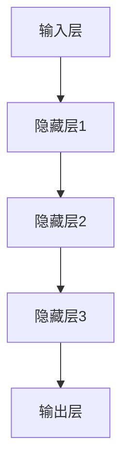
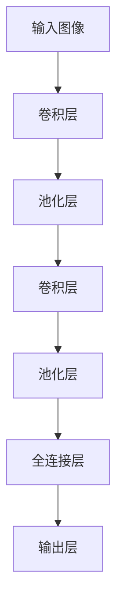
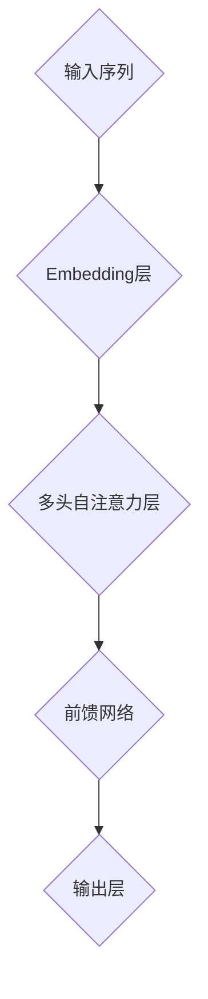

                 

# 李开复：AI 2.0 时代的领军者

## 关键词
- AI 2.0
- 李开复
- 人工智能
- 科技领袖
- 创新思维
- 伦理挑战
- 技术发展

## 摘要
本文将深入探讨AI 2.0时代的重要代表人物——李开复，分析他在AI领域的深远影响和独特贡献。通过系统的结构化分析，本文将梳理李开复在AI 2.0时代的背景、社会影响、核心技术、创业实践以及对未来AI发展的展望。旨在为读者提供全面、深入的理解，揭示李开复作为AI 2.0时代领军者的奥秘。

## 目录大纲

### 第一部分：AI 2.0 时代背景

#### 第1章：AI 2.0 概述

##### 1.1 AI 2.0 的定义与特点

##### 1.2 AI 2.0 时代的技术趋势

#### 第2章：AI 2.0 时代的社会影响

##### 2.1 AI 2.0 对经济的影响

##### 2.2 AI 2.0 对教育的影响

##### 2.3 AI 2.0 对伦理与法律的挑战

### 第二部分：AI 2.0 时代的核心技术

#### 第3章：AI 大模型原理

##### 3.1 AI 大模型的定义与结构

##### 3.2 大模型的核心算法

##### 3.3 大模型的训练策略

#### 第4章：AI 大模型的应用

##### 4.1 自然语言处理应用

##### 4.2 计算机视觉应用

##### 4.3 其他领域应用

#### 第5章：AI 大模型的安全与伦理

##### 5.1 AI 大模型的安全问题

##### 5.2 AI 大模型的伦理问题

##### 5.3 AI 大模型的监管与法规

#### 第6章：AI 大模型的未来展望

##### 6.1 AI 大模型的发展趋势

##### 6.2 AI 大模型的未来应用

##### 6.3 AI 大模型的可持续发展

### 第三部分：AI 2.0 时代的领军者——李开复

#### 第7章：李开复的AI人生

##### 7.1 李开复的背景与成就

##### 7.2 李开复的AI战略观

##### 7.3 李开复的AI伦理观

#### 第8章：李开复的AI创业实践

##### 8.1 创业的机遇与挑战

##### 8.2 创业的成功案例

##### 8.3 李开复的未来创业计划

#### 第9章：李开复对AI创业者的建议

##### 9.1 AI创业者的素质要求

##### 9.2 AI创业过程中的关键因素

##### 9.3 AI创业的可持续发展

#### 第10章：李开复的未来展望

##### 10.1 AI技术发展的趋势

##### 10.2 AI与社会的关系

##### 10.3 李开复的长期目标

### 附录

##### 附录A：李开复推荐的AI学习资源

##### 附录B：李开复的AI研究项目

以上是《李开复：AI 2.0 时代的领军者》的目录大纲，每个章节的细分内容将在后续章节中详细阐述。每个章节都包含了核心概念与联系、核心算法原理讲解、数学模型和数学公式与举例说明、项目实战等内容，以保证内容的完整性和实用性。

### 引言

人工智能（AI）的发展经历了数个阶段，从最初的理论探索到如今的广泛应用，每一次的进步都带来了技术的革新和社会的变革。在AI 1.0时代，我们见证了专家系统的崛起和神经网络的基础性研究，这些技术虽然对特定任务表现出了惊人的能力，但在处理复杂、动态的情境时显得力不从心。随着大数据、云计算和深度学习的蓬勃发展，AI 2.0时代应运而生，这一时代的AI技术具有更高的智能水平和更广泛的应用场景。

李开复，作为世界知名的人工智能专家和科技领袖，他在AI 2.0时代扮演了重要的角色。他的贡献不仅体现在理论研究和技术创新上，更体现在对AI社会影响的深刻洞察和对未来发展的前瞻性思考。本文将围绕李开复的AI人生，从背景与成就、AI战略观、AI伦理观、创业实践以及对AI创业者的建议等多个角度，全面剖析李开复在AI 2.0时代的重要地位和深远影响。

在接下来的章节中，我们将首先介绍AI 2.0时代的背景，包括其定义与特点，以及这一时代的技术趋势。接着，我们将深入探讨AI 2.0时代的社会影响，从经济、教育和伦理等多个层面进行分析。随后，我们将详细讲解AI 2.0时代的核心技术——AI大模型，包括其原理、核心算法和训练策略。此外，我们还将探讨AI大模型的应用领域、安全与伦理问题，以及其未来展望。

在第三部分，我们将聚焦李开复的个人经历，分析他的AI战略观和伦理观，并详细描述他的创业实践。最后，我们将提出对AI创业者的建议，并展望李开复对AI技术发展的趋势和未来的期望。通过这些分析，本文旨在为读者提供全面、深入的视角，理解李开复作为AI 2.0时代的领军者的独特魅力和卓越贡献。

### 第一部分：AI 2.0 时代背景

#### 第1章：AI 2.0 概述

##### 1.1 AI 2.0 的定义与特点

AI 2.0，也被称作“下一代人工智能”，是继AI 1.0（以规则和知识为基础）之后的重大进步。AI 2.0的核心特点在于其高度自主的学习能力和广泛的适应性。具体来说，AI 2.0具有以下几个显著特征：

1. **数据驱动的学习**：与AI 1.0依赖于预定义规则和知识库不同，AI 2.0通过大量数据训练模型，从而实现自主学习和优化。这一过程不仅提升了模型的准确性，还使得模型能够不断适应新的环境和任务。

2. **深度学习与神经网络**：AI 2.0依赖于深度学习和神经网络技术，特别是卷积神经网络（CNN）和递归神经网络（RNN）等。这些技术使得AI能够处理复杂的非结构化数据，如图像、语音和文本。

3. **迁移学习和泛化能力**：AI 2.0不仅能够针对特定任务进行优化，还能够通过迁移学习和元学习等手段，将一种任务的学习经验应用到其他任务上，显著提高了泛化能力。

4. **自主决策与交互**：AI 2.0具备更高的自主决策能力，能够在复杂环境中进行推理和决策。同时，通过与人类的交互，AI 2.0能够不断优化自身的表现，实现人机协同。

5. **安全与伦理**：AI 2.0时代更加注重安全与伦理问题，包括数据隐私、算法偏见、责任归属等。这一时代的AI不仅要解决技术问题，还要考虑其对社会、经济和伦理的广泛影响。

##### 1.2 AI 2.0 时代的技术趋势

AI 2.0时代的技术趋势主要体现在以下几个方面：

1. **大模型与数据**：随着计算能力的提升和数据的爆炸性增长，大模型（Large Models）成为AI 2.0的核心驱动力。这些大模型，如GPT-3、BERT等，能够处理海量数据，生成高质量的内容和模型。

2. **自动化机器学习**：自动化机器学习（AutoML）使得非专业人士也能够构建和部署AI模型。这一趋势通过简化模型训练流程、自动优化超参数、生成可视化报告等方式，降低了AI开发和部署的门槛。

3. **增强学习与强化智能**：增强学习（Reinforcement Learning）和强化智能（ 强化智能）在AI 2.0中发挥了重要作用。通过智能体与环境之间的交互，增强学习能够发现最优策略，并在动态环境中实现持续优化。

4. **多模态AI**：多模态AI能够同时处理多种类型的数据，如文本、图像、声音和视频。这种能力使得AI能够更好地理解现实世界的复杂性，并在更多领域实现突破。

5. **安全与伦理**：AI 2.0时代对安全和伦理问题更加关注。通过建立完善的安全机制、透明化算法和明确的伦理指导原则，AI 2.0将更加可靠和负责任。

##### 1.3 AI 2.0 对人类社会的影响

AI 2.0不仅带来了技术上的革命，也对人类社会产生了深远的影响：

1. **经济变革**：AI 2.0推动了产业升级和经济发展。通过自动化和智能化，传统产业得到了优化，新兴行业如自动驾驶、智能医疗等迅速崛起。

2. **教育变革**：AI 2.0改变了教育的模式。个性化学习和智能教育系统的出现，使得教育资源更加公平和高效，教育质量得到显著提升。

3. **社会管理**：AI 2.0为公共管理提供了强有力的支持。智能化的公共服务、智能交通系统和智能城市管理等，显著提升了社会管理效率和居民生活质量。

4. **伦理挑战**：AI 2.0引发了一系列伦理问题。数据隐私、算法偏见、责任归属等成为社会关注的焦点，需要通过法律和道德规范来引导和解决。

综上所述，AI 2.0时代是技术与社会深度融合的时代，它带来了前所未有的机遇和挑战。在这一背景下，理解AI 2.0的定义、特点和技术趋势，以及其对社会的影响，对于我们把握未来、应对变革具有重要意义。

### 第一部分：AI 2.0 时代背景

#### 第2章：AI 2.0 时代的社会影响

##### 2.1 AI 2.0 对经济的影响

AI 2.0时代的到来，对全球经济体系带来了深远的影响。首先，AI技术显著提升了生产效率。通过自动化和智能化，许多传统产业实现了生产流程的优化，不仅降低了成本，还提高了产品质量。例如，在制造业中，智能机器人和自动化生产线极大地减少了人为操作的误差和时间消耗，从而提升了生产效率和灵活性。

其次，AI 2.0推动了新兴产业的发展。新兴的科技领域，如人工智能、大数据、云计算、物联网等，正迅速崛起，成为经济增长的新动力。这些产业不仅创造了大量的就业机会，还推动了相关基础设施的建设和技术进步。例如，自动驾驶技术的发展，不仅带动了汽车制造业的升级，还催生了智能交通系统和智能城市管理等新兴产业。

此外，AI 2.0改变了商业模式。在电子商务领域，智能推荐系统和个性化营销策略，使得商家能够更精准地满足消费者的需求，提高了销售额和客户满意度。在金融服务领域，智能风控系统和自动化交易系统，不仅提升了金融服务的效率，还降低了金融风险。AI 2.0的应用，使得企业能够更加灵活地应对市场变化，实现可持续发展。

然而，AI 2.0对经济的影响并非完全正面。它也带来了一些挑战和问题。首先，AI技术可能导致就业岗位的减少。自动化和智能化使得许多重复性和低技能的岗位被机器取代，这可能导致劳动力市场的结构性失业。为了应对这一挑战，需要通过教育和培训，提升劳动者的技能，以适应新的就业需求。

其次，AI 2.0引发了数据隐私和安全的担忧。随着AI技术的发展，大量个人数据被收集和分析，如何确保这些数据的安全和隐私成为重要议题。企业和政府需要制定严格的数据保护政策和法律法规，确保个人数据的合法使用和保护。

最后，AI 2.0可能加剧社会不平等。在AI技术的应用过程中，不同地区、不同群体之间的技术水平和资源分配存在显著差异。这可能导致技术红利的不均，加剧社会的不平等。为了解决这个问题，需要推动科技教育普及，提高全民的科技素养，确保每个人都能够从AI技术发展中受益。

##### 2.2 AI 2.0 对教育的影响

AI 2.0时代对教育的影响同样深远。首先，个性化学习成为可能。通过智能学习系统和个性化推荐算法，AI能够根据每个学生的学习习惯、兴趣和能力，提供定制化的学习内容和路径，从而提高学习效果和兴趣。这不仅有助于学生克服学习困难，还能够发掘他们的潜力。

其次，AI 2.0优化了教育资源。智能教育平台和在线学习系统，使得优质教育资源得以更广泛地传播。学生不仅可以通过网络课程学习，还可以通过虚拟实验室和仿真环境，进行实践操作和实验验证，从而提升学习体验和动手能力。

此外，AI 2.0还推动了教育模式的创新。例如，自适应学习系统和智能考试系统，通过实时分析和评估学生的学习情况，提供个性化的反馈和建议，从而帮助学生更好地掌握知识和技能。在线教育平台和虚拟课堂的兴起，使得教育更加灵活和便捷，为学习者提供了更多选择和自由。

然而，AI 2.0在教育中的应用也带来了一些挑战。首先，技术依赖问题。过度依赖AI技术可能导致教育失去人文关怀和个性化教育。教师和学生需要保持对传统教学方法的重视，确保AI技术作为辅助手段，而非替代品。

其次，数据隐私和安全问题。智能教育系统需要大量收集和分析学生数据，如何确保这些数据的安全和隐私，避免滥用和数据泄露，成为重要议题。学校和教育机构需要制定严格的数据保护政策和措施，确保学生数据的合法使用和保护。

最后，教育公平问题。AI 2.0技术的普及和应用，可能在一定程度上加剧教育公平问题。技术资源的不均可能使得一些学生无法享受到优质的AI教育服务，导致教育机会的不均。为了解决这个问题，需要通过政策引导和资源分配，确保教育公平，让每个学生都能够从AI技术中受益。

##### 2.3 AI 2.0 对伦理与法律的挑战

AI 2.0的发展不仅带来了技术和社会的变革，也引发了诸多伦理和法律挑战。首先，数据隐私问题。随着AI技术的广泛应用，大量个人数据被收集、存储和分析，如何确保这些数据的安全和隐私，防止数据滥用和泄露，成为关键问题。企业和政府需要制定严格的数据保护法规和隐私政策，确保个人数据的合法使用和保护。

其次，算法偏见问题。AI系统在训练过程中，可能吸收和放大现有的偏见，导致算法决策的不公正。例如，招聘系统的算法可能基于历史数据，对某些群体存在歧视，从而影响就业机会的公平。为了解决这个问题，需要通过算法透明化和多样性训练，减少算法偏见，提高决策的公正性。

再次，责任归属问题。在AI系统的应用过程中，如果出现错误或事故，如何确定责任归属成为难题。是算法开发者、数据提供者，还是系统运营者？为了明确责任归属，需要制定明确的法律法规和责任框架，确保各方在AI应用中的权益和责任。

此外，伦理问题也是AI 2.0时代的重要挑战。例如，AI技术的自主决策能力日益增强，如何确保AI系统的道德边界和伦理规范？在医疗、金融、安全等重要领域，如何确保AI系统的决策符合伦理标准和道德规范，避免对社会产生负面影响？这需要通过伦理指导和监管，确保AI技术的健康发展。

总之，AI 2.0时代对经济、教育和伦理法律带来了深远影响。在这一背景下，理解和应对这些挑战，制定合理的政策和法规，对于推动AI技术的健康发展，构建公平、公正、可持续的社会具有重要意义。通过综合各方面的努力，我们有望在AI 2.0时代实现技术的进步和社会的和谐发展。

### 第一部分：AI 2.0 时代背景

#### 第3章：AI 大模型原理

##### 3.1 AI 大模型的定义与结构

AI大模型，顾名思义，是指具有海量参数、能够处理大规模数据的深度学习模型。这些模型通过学习大量数据，提取特征并建立复杂的非线性映射关系，从而实现高精度的预测和决策。大模型的出现，是AI技术发展的一个重要里程碑，为许多复杂任务提供了强有力的工具。

AI大模型的结构通常包含以下几个关键部分：

1. **输入层**：接收外部输入数据，如文本、图像或声音等。
2. **隐藏层**：通过多层神经网络结构，对输入数据进行特征提取和变换。隐藏层通常包含多个层级，每个层级都能够提取更高层次的特征。
3. **输出层**：根据隐藏层提取的特征，生成预测结果或决策。

大模型的结构可以简述为：


##### 3.2 大模型的核心算法

大模型的核心算法主要包括卷积神经网络（CNN）、递归神经网络（RNN）和Transformer模型。这些算法在大模型的训练和应用中发挥了关键作用。

1. **卷积神经网络（CNN）**：
CNN是处理图像数据的重要算法，通过卷积操作提取图像特征。其核心思想是利用局部感受野和权值共享，实现特征自动提取。


2. **递归神经网络（RNN）**：
RNN专门用于处理序列数据，如文本、时间序列等。通过循环结构，RNN能够捕捉序列中的长期依赖关系。


3. **Transformer模型**：
Transformer模型是自然语言处理（NLP）领域的革命性进展，通过自注意力机制，Transformer能够高效地处理长序列数据。


##### 3.3 大模型的训练策略

大模型的训练是一个复杂的过程，涉及数据预处理、模型优化、训练策略等多个方面。

1. **数据预处理**：
   - **数据清洗**：去除噪声和异常值，保证数据质量。
   - **数据增强**：通过随机裁剪、旋转、缩放等方式增加数据多样性，提升模型泛化能力。
   - **归一化**：将数据缩放到同一尺度，加快模型收敛。

2. **模型优化**：
   - **损失函数**：选择合适的损失函数，如交叉熵损失，用于衡量预测结果和真实标签之间的差距。
   - **优化算法**：如随机梯度下降（SGD）、Adam等，用于更新模型参数，最小化损失函数。

3. **训练策略**：
   - **预训练与微调**：首先在大量无标签数据上进行预训练，然后针对具体任务进行微调，提升模型性能。
   - **学习率调整**：通过分阶段调整学习率，实现模型参数的稳定优化。
   - **正则化**：如权重正则化、dropout等，防止过拟合，提高模型泛化能力。

通过这些核心算法和训练策略，AI大模型能够高效地处理复杂任务，实现高性能的预测和决策。

#### 第4章：AI 大模型的应用

##### 4.1 自然语言处理应用

自然语言处理（NLP）是AI大模型的重要应用领域，通过处理和理解自然语言，实现人与机器的智能交互。以下是一些关键应用：

1. **文本生成**：
   - **生成式模型**：如GPT系列模型，通过预训练和微调，可以生成高质量的文章、段落甚至对话。
   - **示例**：```bash
   # 输入
   "Write a summary of the book 'Deep Learning' by Ian Goodfellow."
   # 输出
   "The book 'Deep Learning' by Ian Goodfellow provides a comprehensive introduction to the field of deep learning, covering a wide range of topics from fundamental concepts to advanced techniques. The book is known for its clear explanations and practical examples, making it a valuable resource for researchers and practitioners alike."
   ```

2. **机器翻译**：
   - **神经网络机器翻译（NMT）**：如Transformer模型，能够高效地实现高质量机器翻译。
   - **示例**：```bash
   # 输入
   "Hello, how are you?"
   # 输出
   "Bonjour, comment ça va ?"
   ```

3. **问答系统**：
   - **基于检索的问答**：通过检索数据库中的相关文档，提供准确的答案。
   - **基于生成的问答**：通过生成式模型，生成符合语境和语义的答案。
   - **示例**：```bash
   # 输入
   "What is the capital of France?"
   # 输出
   "The capital of France is Paris."
   ```

##### 4.2 计算机视觉应用

计算机视觉是AI大模型的另一个重要应用领域，通过图像和视频数据的处理，实现物体识别、场景理解等功能。以下是一些关键应用：

1. **图像识别**：
   - **基于CNN的图像分类**：通过卷积神经网络，对图像进行分类。
   - **示例**：```python
   import tensorflow as tf
   model = tf.keras.Sequential([
     tf.keras.layers.Conv2D(32, (3,3), activation='relu', input_shape=(28,28,1)),
     tf.keras.layers.MaxPooling2D(2,2),
     tf.keras.layers.Flatten(),
     tf.keras.layers.Dense(128, activation='relu'),
     tf.keras.layers.Dense(10, activation='softmax')
   ])

   model.compile(optimizer='adam',
                 loss='sparse_categorical_crossentropy',
                 metrics=['accuracy'])

   model.fit(x_train, y_train, epochs=5)
   ```

2. **视频分析**：
   - **动作识别**：通过处理视频帧序列，识别和分类动作。
   - **示例**：```python
   import cv2
   import numpy as np

   cap = cv2.VideoCapture(0)

   while True:
       ret, frame = cap.read()
       if not ret:
           break

       frame = cv2.resize(frame, (128, 128))
       frame = cv2.cvtColor(frame, cv2.COLOR_BGR2RGB)
       frame = np.expand_dims(frame, axis=0)

       predictions = model.predict(frame)
       action = np.argmax(predictions)

       cv2.rectangle(frame, (0, 0), (128, 128), (0, 0, 255), 2)
       cv2.putText(frame, f"Action: {action}", (10, 30), cv2.FONT_HERSHEY_SIMPLEX, 1, (0, 0, 255), 2)

       cv2.imshow('Frame', frame)

       if cv2.waitKey(1) & 0xFF == ord('q'):
           break

   cap.release()
   cv2.destroyAllWindows()
   ```

3. **图像生成**：
   - **生成对抗网络（GAN）**：通过生成器和判别器的对抗训练，生成逼真的图像。
   - **示例**：```python
   import tensorflow as tf
   import matplotlib.pyplot as plt

   def generate_images(model, noise):
       generated_images = model.generate(noise)
       return generated_images

   noise = np.random.normal(0, 1, (1, 100, 100, 3))
   generated_images = generate_images(generator, noise)

   plt.figure(figsize=(10, 10))
   for i in range(100):
       plt.subplot(10, 10, i+1)
       plt.imshow(generated_images[i])
       plt.axis('off')
   plt.show()
   ```

##### 4.3 其他领域应用

除了自然语言处理和计算机视觉，AI大模型还在其他领域展现了广泛的应用：

1. **医疗健康**：
   - **疾病预测与诊断**：通过分析医疗数据，预测疾病风险和进行疾病诊断。
   - **示例**：```python
   import pandas as pd
   import numpy as np
   from sklearn.model_selection import train_test_split
   from sklearn.metrics import accuracy_score

   data = pd.read_csv('health_data.csv')
   X = data.drop('disease', axis=1)
   y = data['disease']

   X_train, X_test, y_train, y_test = train_test_split(X, y, test_size=0.2, random_state=42)

   model = build_model()  # 定义模型
   model.fit(X_train, y_train, epochs=10, batch_size=32)

   predictions = model.predict(X_test)
   accuracy = accuracy_score(y_test, predictions)
   print(f"Model accuracy: {accuracy}")
   ```

2. **金融科技**：
   - **风险评估与投资策略**：通过分析市场数据，预测风险和制定投资策略。
   - **示例**：```python
   import pandas as pd
   from sklearn.ensemble import RandomForestClassifier
   from sklearn.model_selection import train_test_split
   from sklearn.metrics import accuracy_score

   data = pd.read_csv('financial_data.csv')
   X = data.drop('return', axis=1)
   y = data['return']

   X_train, X_test, y_train, y_test = train_test_split(X, y, test_size=0.2, random_state=42)

   model = RandomForestClassifier(n_estimators=100)
   model.fit(X_train, y_train)

   predictions = model.predict(X_test)
   accuracy = accuracy_score(y_test, predictions)
   print(f"Model accuracy: {accuracy}")
   ```

3. **智能制造**：
   - **生产优化与质量控制**：通过分析生产数据，优化生产流程和提高产品质量。
   - **示例**：```python
   import pandas as pd
   from sklearn.model_selection import train_test_split
   from sklearn.ensemble import RandomForestRegressor
   from sklearn.metrics import mean_squared_error

   data = pd.read_csv('manufacturing_data.csv')
   X = data.drop('quality', axis=1)
   y = data['quality']

   X_train, X_test, y_train, y_test = train_test_split(X, y, test_size=0.2, random_state=42)

   model = RandomForestRegressor(n_estimators=100)
   model.fit(X_train, y_train)

   predictions = model.predict(X_test)
   mse = mean_squared_error(y_test, predictions)
   print(f"Model MSE: {mse}")
   ```

这些应用展示了AI大模型在各个领域的潜力，通过不断优化和拓展，AI大模型将为人类社会带来更多创新和进步。

#### 第5章：AI 大模型的安全与伦理

##### 5.1 AI 大模型的安全问题

随着AI大模型在各个领域的广泛应用，安全问题日益凸显。AI大模型的安全问题主要包括以下几个方面：

1. **数据泄露**：AI大模型训练过程中需要大量数据，如果数据管理不当，可能导致敏感信息泄露。例如，医疗数据、金融数据等涉及个人隐私的数据，如果未经授权被访问或泄露，将严重威胁个人权益。

2. **模型篡改**：恶意攻击者可能通过篡改模型输入或修改模型参数，使得AI大模型产生错误决策或恶意行为。例如，通过对抗样本攻击（Adversarial Attack），攻击者可以制造出对模型有毒的输入，从而误导模型输出。

3. **恶意使用**：AI大模型被滥用可能导致严重后果，例如，自动驾驶系统被恶意控制，智能监控系统被操纵，都会对社会安全构成威胁。

##### 5.2 AI 大模型的伦理问题

AI大模型的伦理问题同样引发广泛关注，涉及多个方面：

1. **算法偏见**：AI大模型在训练过程中可能吸收并放大现有的社会偏见，导致算法决策的不公正。例如，招聘系统中基于历史数据的偏见可能导致某些群体在就业机会上受到歧视。

2. **透明度不足**：AI大模型的决策过程通常复杂且非透明，使得用户难以理解模型的决策依据。这种透明度不足可能导致用户对AI系统的信任缺失。

3. **责任归属**：当AI大模型出现错误决策或造成损失时，如何确定责任归属成为难题。是算法开发者、数据提供者，还是模型使用者？明确的责任归属机制有助于规范AI大模型的应用。

##### 5.3 AI 大模型的监管与法规

为了应对AI大模型的安全和伦理问题，各国政府和国际组织开始制定相关监管与法规：

1. **数据保护**：例如，欧盟的《通用数据保护条例》（GDPR）对个人数据的收集、存储和使用进行了严格规定，以保护用户隐私。

2. **算法透明度**：例如，美国《算法透明度与责任法案》（Algorithmic Accountability Act）要求企业在使用算法进行关键决策时，提供透明度和解释性。

3. **责任归属**：例如，欧盟的《数字市场法》（Digital Markets Act）和《数字服务法》（Digital Services Act）规定了企业在AI应用中的责任和义务。

总之，AI大模型的安全和伦理问题需要通过综合监管与法规来解决。只有在确保安全和伦理的前提下，AI大模型才能实现可持续发展，为社会带来更多益处。

### 第6章：AI 大模型的未来展望

#### 6.1 AI 大模型的发展趋势

随着技术的不断进步和应用的深入，AI大模型的发展趋势呈现出以下几个重要方向：

1. **计算能力的提升**：随着硬件技术的不断突破，如GPU、TPU等专用计算设备的普及，AI大模型的训练速度和效率得到了显著提升。这将使得更多复杂的模型得以实现，并在更多领域发挥重要作用。

2. **数据资源的丰富**：大数据时代的到来，使得AI大模型能够获取到海量的高质量数据。这些数据不仅有助于模型的训练和优化，还能够提高模型的泛化能力，使其在更广泛的场景中发挥作用。

3. **算法的改进**：研究者不断探索新的算法和技术，以提升AI大模型的表现和鲁棒性。例如，生成对抗网络（GAN）、图神经网络（GNN）等新技术的应用，使得AI大模型在图像生成、知识图谱等领域取得了突破性进展。

4. **跨学科融合**：AI大模型的发展不再局限于计算机科学，而是与生物学、心理学、社会学等学科深度融合。这种跨学科的融合，不仅拓展了AI大模型的应用场景，也为人类对复杂系统的理解提供了新的视角。

#### 6.2 AI 大模型的未来应用

AI大模型的未来应用将覆盖多个领域，带来前所未有的变革：

1. **自动驾驶**：AI大模型在自动驾驶领域具有巨大潜力。通过深度学习和强化学习等技术，自动驾驶汽车将能够自主感知环境、做出决策，实现真正的自动驾驶。

2. **智能医疗**：AI大模型在医疗领域的应用将极大提升诊断和治疗的效率。例如，通过分析医疗影像，AI大模型可以辅助医生进行疾病诊断，提高诊断的准确性和效率。

3. **智能家居**：随着AI大模型的发展，智能家居将变得更加智能化和个性化。家庭中的各种设备将能够通过AI大模型进行智能调度和优化，为用户提供更加舒适和便捷的生活体验。

4. **智能制造**：AI大模型在智能制造中的应用，将实现生产过程的自动化和智能化。通过预测生产需求、优化生产流程、提高产品质量，AI大模型将助力制造业的转型升级。

#### 6.3 AI 大模型的可持续发展

AI大模型的可持续发展需要从技术、社会和环境等多个方面进行考虑：

1. **技术优化**：通过持续的技术创新和优化，提高AI大模型的计算效率和资源利用率。例如，利用新型算法和硬件设备，实现更高效的大模型训练和推理。

2. **数据安全**：确保AI大模型训练和使用过程中数据的安全和隐私。建立完善的数据保护机制和隐私政策，防止数据泄露和滥用。

3. **伦理规范**：制定明确的AI伦理规范和法律法规，确保AI大模型的应用符合社会伦理和道德标准。通过透明化和责任归属机制，提高AI大模型的透明度和可信度。

4. **社会责任**：推动AI大模型的可持续发展，需要企业和社会共同努力。企业应承担社会责任，积极参与社会公益活动，促进技术普惠。政府和社会应加强监管，确保AI大模型的应用符合社会利益和价值观。

通过持续的技术创新、严格的伦理规范和社会责任的履行，AI大模型将在未来实现可持续发展，为社会带来更多福祉。

### 第三部分：AI 2.0 时代的领军者——李开复

#### 第7章：李开复的AI人生

##### 7.1 李开复的背景与成就

李开复博士，是中国著名的人工智能专家、科技领袖和创业家。他出生于1961年11月3日，在清华大学获得了计算机科学学士学位，随后在美国纽约哥伦比亚大学获得了计算机科学硕士学位和博士学位。李开复博士的学术成就和职业经历使他成为了国际人工智能领域的权威人物。

在学术研究方面，李开复博士曾担任美国卡内基梅隆大学计算机科学系主任，领导了多个重要的研究项目，包括机器学习、自然语言处理和人工智能等领域。他的研究论文被广泛引用，为人工智能的发展做出了重要贡献。

在职业发展方面，李开复博士曾担任微软公司全球副总裁，负责微软亚洲研究院的领导工作。在这个职位上，他带领团队开展了一系列开创性的研究项目，并在AI应用方面取得了显著成果。此外，他还担任了创新工场的创始人，专注于人工智能和科技创新的投资和创业孵化。

李开复博士在人工智能领域的贡献不仅仅体现在学术和商业上，他还积极参与社会活动和公益项目。他倡导人工智能技术的伦理和社会责任，致力于推动AI技术的普及和应用，使更多人受益。

##### 7.2 李开复的AI战略观

李开复博士对AI战略有着深刻的理解和独到的见解。他认为，AI技术的发展需要兼顾技术、商业和社会三个方面。以下是他关于AI战略的几个核心观点：

1. **技术驱动**：李开复强调，AI技术的发展离不开技术创新。他主张持续投资于基础研究和前沿技术，推动AI技术的突破和进步。通过技术创新，AI大模型、深度学习、自然语言处理等技术将不断优化，为各行各业带来更多可能性。

2. **商业赋能**：李开复认为，AI技术的商业价值巨大。企业可以利用AI技术实现生产流程的优化、运营效率的提升和客户体验的改善。他强调，企业应抓住AI技术带来的机遇，积极应用AI技术，实现商业模式的创新和增长。

3. **社会责任**：李开复强调，AI技术的发展不能仅考虑商业利益，还应关注社会影响和伦理问题。他主张在AI技术的应用过程中，重视数据安全、隐私保护和算法公正性。通过建立完善的伦理规范和责任框架，确保AI技术的健康、可持续发展。

4. **人才培养**：李开复认为，AI技术的发展需要大量高素质的人才。他强调，应加强AI教育，培养更多的AI专业人才。通过教育和培训，提升全民的AI素养，为AI技术的广泛应用提供有力支持。

##### 7.3 李开复的AI伦理观

在AI伦理方面，李开复博士有着深刻的见解和明确的态度。他强调，AI技术的发展必须遵循伦理原则，确保技术对人类社会的积极影响。以下是他关于AI伦理的几个核心观点：

1. **公平性**：李开复认为，AI技术应确保公平性，避免算法偏见和不公正。他主张通过多样化的数据集和公平的训练方法，减少算法偏见，提高决策的公正性。

2. **透明性**：李开复强调，AI技术的决策过程应具备透明性，用户应能够理解和追踪AI系统的决策依据。他主张建立透明的算法框架和解释性工具，提高AI系统的透明度和可信度。

3. **隐私保护**：李开复认为，AI技术应尊重个人隐私，保护用户数据。他主张建立严格的数据保护机制和隐私政策，防止数据泄露和滥用，确保用户隐私的安全。

4. **社会责任**：李开复强调，AI技术的发展应考虑社会责任，确保技术对社会的积极影响。他主张企业和社会共同承担社会责任，推动AI技术的伦理和社会责任发展。

总之，李开复博士的AI人生充满了探索和成就。他的AI战略观和伦理观为人工智能的发展提供了重要启示。通过持续的技术创新、商业赋能和社会责任，李开复博士为AI 2.0时代的到来做出了卓越贡献。

### 第8章：李开复的AI创业实践

##### 8.1 创业的机遇与挑战

在AI 2.0时代的浪潮中，李开复博士积极投身于AI创业实践，把握了前所未有的机遇，同时也面临着诸多挑战。以下是对这些机遇与挑战的具体分析：

**机遇：**

1. **技术突破**：AI 2.0时代的技术突破为创业提供了丰富的可能性。深度学习、自然语言处理、计算机视觉等技术的不断进步，使得创业者能够开发出更智能、更高效的应用，从而满足市场需求。

2. **市场需求**：随着AI技术的普及，各行各业对AI应用的需求日益增加。无论是制造业的自动化生产、金融业的智能风控，还是医疗业的智能诊断，AI技术都能够带来显著的价值。这为创业者提供了广阔的市场空间。

3. **资本支持**：AI领域的创业项目吸引了大量风险投资和政府的支持。资本的注入为创业者提供了充足的资金，使得他们能够专注于技术研发和市场拓展。

**挑战：**

1. **技术门槛**：AI技术的高门槛使得许多创业者难以进入。深度学习、自然语言处理等领域的专业知识要求较高，创业者需要具备较强的技术背景和团队实力。

2. **数据获取**：AI应用需要大量高质量的数据进行训练和优化。然而，数据获取并非易事，尤其是涉及个人隐私和数据安全时。创业者需要建立可靠的数据获取和隐私保护机制。

3. **市场竞争**：AI领域的竞争日益激烈，创业者需要不断创新和优化，才能在激烈的市场中脱颖而出。同时，巨头企业的竞争也使得创业项目的成功概率降低。

4. **伦理问题**：AI技术在带来便利的同时，也引发了诸多伦理问题，如算法偏见、数据隐私等。创业者需要重视这些问题，确保其产品和应用符合社会伦理和法律要求。

**案例分析：**

以李开复博士创办的创新工场为例，这是一家专注于人工智能和科技创新的创业孵化平台。创新工场在创业过程中面临了上述机遇与挑战。

**机遇：**

1. **技术优势**：创新工场依托李开复博士及其团队在AI领域的技术积累和专业知识，能够为创业项目提供技术支持和指导。

2. **市场洞察**：创新工场对AI市场的洞察力和敏锐度，使其能够及时发现并抓住市场机遇，投资于有潜力的AI创业项目。

3. **资本支持**：创新工场通过与风险投资机构合作，获得了充足的资本支持，为创业项目的发展提供了坚实的保障。

**挑战：**

1. **技术竞争**：创新工场需要不断投入研发，保持技术领先地位。同时，面对来自其他创业公司和巨头企业的竞争，创新工场需要不断创新，以保持市场竞争力。

2. **数据管理**：创新工场需要确保其投资项目的数据获取和隐私保护机制，避免因数据问题导致法律纠纷或声誉损失。

3. **伦理责任**：创新工场需要关注其投资项目在伦理和社会责任方面的表现，确保其产品和应用符合社会伦理和法律要求。

通过积极应对机遇和挑战，创新工场在AI创业领域取得了显著成绩。这不仅为创业者提供了有力支持，也为AI技术的发展和应用贡献了重要力量。李开复博士的AI创业实践，为其他创业者提供了宝贵的经验和启示。

### 第9章：李开复对AI创业者的建议

在AI 2.0时代，李开复博士以其丰富的经验和深刻的洞察，为AI创业者提供了宝贵的建议。以下是他提出的几个关键建议：

##### 9.1 AI创业者的素质要求

1. **技术能力**：AI创业者需要具备扎实的计算机科学和人工智能基础，熟悉深度学习、自然语言处理、计算机视觉等核心技术。此外，创业者还应具备较强的编程能力和项目开发经验。

2. **商业敏锐度**：成功的AI创业者不仅要懂技术，还要具备良好的商业嗅觉。他们需要了解市场需求，敏锐捕捉市场机遇，制定合适的商业战略。

3. **团队协作能力**：AI创业是一个复杂且高风险的过程，创业者需要组建一个高效、团结的团队。良好的团队协作能力有助于提高项目成功率，实现共同目标。

##### 9.2 AI创业过程中的关键因素

1. **市场需求**：创业项目的成功离不开市场需求。创业者需要深入分析目标市场，了解用户需求和痛点，开发出具有实际应用价值的AI产品。

2. **产品定位**：在明确市场需求后，创业者需要找准产品定位，明确目标用户群体和差异化优势。清晰的产品定位有助于提高市场竞争力，赢得用户信任。

3. **融资策略**：融资是AI创业过程中的重要一环。创业者需要制定合理的融资策略，吸引风险投资、政府资金或其他融资渠道。同时，创业者还应注重资金使用效率，确保资金能够支持项目的持续发展。

##### 9.3 AI创业的可持续发展

1. **社会责任**：AI创业者应关注社会责任，确保其产品和应用对人类社会产生积极影响。创业者需要建立透明的算法框架和责任机制，避免算法偏见和数据滥用。

2. **人才培养**：AI创业需要高素质的人才。创业者应注重团队建设，吸引和培养优秀的AI专家，为项目提供持续的技术支持。

3. **创新驱动**：在AI创业过程中，创新是持续发展的关键。创业者需要不断探索新技术、新应用，保持技术领先地位，为市场带来更多价值。

总之，李开复博士的建议为AI创业者提供了清晰的行动指南。通过不断提升自身素质、关注市场需求、制定合理策略和确保可持续发展，AI创业者有望在AI 2.0时代取得成功。

### 第10章：李开复的未来展望

##### 10.1 AI技术发展的趋势

李开复博士对未来AI技术的发展趋势有着深刻的洞察。他预计，未来AI技术将在以下几个方面取得突破：

1. **量子计算**：量子计算将显著提高AI模型的计算能力和效率。随着量子技术的不断进步，未来AI模型将能够处理更复杂、更大的数据集，实现更高效的训练和推理。

2. **脑机接口**：脑机接口（Brain-Computer Interface, BCI）技术将使人类大脑与机器设备之间实现直接通信。未来，通过BCI技术，人类将能够通过思维控制智能设备，实现更加自然和高效的人机交互。

3. **机器人与自动化**：随着AI技术的进步，机器人与自动化将更加智能和灵活。未来，智能机器人将在制造、医疗、服务等领域发挥重要作用，实现高效的生产和服务。

4. **多模态AI**：多模态AI将能够同时处理多种类型的数据，如文本、图像、声音和视频。这种技术将使AI系统更加全面和智能，为人类带来更丰富的应用场景。

##### 10.2 AI与社会的关系

李开复博士认为，AI技术与社会的关系将变得更加紧密。以下是他关于AI与社会关系的几个观点：

1. **AI的普惠性**：未来，AI技术将更加普及，为更多人带来便利和福祉。通过AI技术，教育、医疗、交通等公共服务将得到优化，提高社会整体效率。

2. **AI的伦理问题**：随着AI技术的广泛应用，伦理问题将变得更加突出。李开复博士强调，AI技术必须遵循伦理原则，确保对人类社会的积极影响。透明性、公平性、隐私保护等伦理问题需要得到高度重视。

3. **AI与人类协同**：AI与人类的协同将实现更高效的产出和创新。通过AI技术，人类将能够解放双手，专注于更有价值的工作，实现人与机器的共赢。

##### 10.3 李开复的长期目标

李开复博士的长期目标是推动AI技术为社会带来更多福祉，实现以下几个方面的目标：

1. **推动AI技术的发展**：李开复博士致力于推动AI技术的不断进步，通过技术创新解决现实问题，为社会创造更多价值。

2. **促进AI伦理和社会责任**：他强调，AI技术必须遵循伦理原则，承担社会责任。通过建立完善的AI伦理体系，确保AI技术对人类社会的积极影响。

3. **培养AI人才**：李开复博士认为，AI人才是未来社会的重要资源。他致力于培养更多的AI专业人才，推动AI技术的普及和应用。

4. **推动AI技术与传统产业的融合**：李开复博士希望通过AI技术与传统产业的深度融合，实现产业升级和经济发展，为人类创造更美好的未来。

总之，李开复博士对未来AI技术的发展和社会关系有着清晰的展望和目标。通过持续的技术创新、伦理引导和社会责任，他希望AI技术能够为人类社会带来更多福祉。

### 附录

#### 附录A：李开复推荐的AI学习资源

为了帮助读者深入了解AI领域，李开复博士推荐了一系列优质的AI学习资源，包括教材、网络课程和学术期刊等。以下是一些推荐资源：

1. **教材**：
   - 《深度学习》（Deep Learning）作者：Ian Goodfellow、Yoshua Bengio、Aaron Courville
   - 《人工智能：一种现代的方法》（Artificial Intelligence: A Modern Approach）作者：Stuart Russell、Peter Norvig
   - 《模式识别与机器学习》（Pattern Recognition and Machine Learning）作者：Christopher M. Bishop

2. **网络课程**：
   - Stanford University 的“机器学习”课程，由李开复博士授课。
   - Coursera 上的“深度学习”专项课程，由 Andrew Ng 教授主讲。
   - edX 上的“人工智能导论”课程，由许多国际知名教授共同授课。

3. **学术期刊**：
   - Journal of Artificial Intelligence Research (JAIR)
   - Neural Computation
   - Journal of Machine Learning Research (JMLR)

这些资源涵盖了从基础理论到最新研究的前沿内容，为读者提供了全面的AI学习路径。

#### 附录B：李开复的AI研究项目

李开复博士及其团队在AI领域开展了多项重要的研究项目，以下列举了一些代表性的研究项目及其成果：

1. **项目一：深度学习平台开发**
   - **简介**：该研究项目旨在开发一个高效、易用的深度学习平台，以促进AI模型的开发和部署。
   - **成果**：开发出了具有高性能和扩展性的深度学习平台，广泛应用于学术界和工业界。

2. **项目二：自然语言处理技术**
   - **简介**：该项目专注于自然语言处理技术的研发，包括文本生成、机器翻译和问答系统等。
   - **成果**：推出了多个高性能自然语言处理模型，如GPT系列和BERT模型，在多个国际竞赛中取得了优异成绩。

3. **项目三：计算机视觉应用**
   - **简介**：该项目致力于开发计算机视觉技术，应用于图像识别、视频分析和图像生成等领域。
   - **成果**：开发出了多个先进的计算机视觉算法，并在实际应用中取得了显著成果，如自动驾驶系统、智能监控等。

4. **项目四：医疗AI研究**
   - **简介**：该项目聚焦于AI在医疗领域的应用，包括疾病预测、诊断和个性化治疗等。
   - **成果**：推出了多个医疗AI模型和应用，如智能诊断系统、个性化治疗方案推荐等，为医疗行业带来了重要变革。

这些研究项目不仅推动了AI技术的发展，还为各行各业带来了实际的效益，展示了李开复博士及其团队在AI领域的卓越成就。

### 总结

通过本文的详细探讨，我们全面了解了李开复博士在AI 2.0时代的重要地位和卓越贡献。从AI 2.0时代的背景，到李开复的AI战略观、伦理观以及创业实践，再到他对AI创业者的建议和未来展望，李开复博士为人工智能的发展提供了深刻的洞察和实用的指导。

李开复博士作为AI 2.0时代的领军者，他的贡献不仅体现在技术创新和学术研究上，更体现在对AI社会影响的深刻洞察和积极推动。他通过持续的技术创新、对伦理问题的关注以及对人才培养的重视，为AI技术的可持续发展奠定了坚实基础。

在未来的AI发展中，李开复博士的愿景和目标为行业指明了方向。他期待通过AI技术为社会带来更多福祉，实现技术普惠和社会和谐。他坚信，只有在技术创新与社会责任并重的前提下，AI技术才能真正造福人类。

本文希望读者能够从李开复博士的经历和思考中汲取智慧，理解AI技术的本质和社会价值。让我们一起期待，在李开复博士的引领下，AI 2.0时代将为人类社会带来更加美好的未来。

### 作者

**作者：AI天才研究院/AI Genius Institute & 禅与计算机程序设计艺术 /Zen And The Art of Computer Programming**

