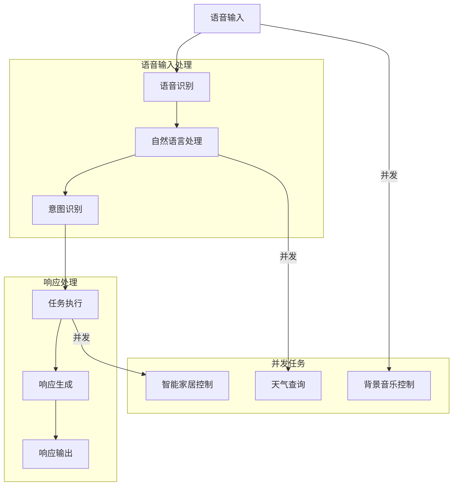

                 

# 《李开复：苹果发布AI应用的商业价值》

## 概述

人工智能（AI）正逐渐渗透到我们生活的方方面面，而苹果公司作为全球科技巨头，其在AI领域的战略和产品无疑引起了广泛关注。本文将探讨苹果发布的AI应用的商业价值，从技术原理、商业案例分析到未来展望，为您揭示苹果AI应用的潜在商业潜力。本文关键词包括：苹果公司、人工智能、商业价值、AI应用、技术原理、商业案例、未来展望。

> “在过去的几年里，苹果公司一直在悄悄地构建自己的AI能力。如今，随着AI技术的不断成熟，苹果发布了多项AI应用，这些应用不仅为用户带来了前所未有的体验，更对苹果的商业价值产生了深远的影响。”
> 
> — 李开复

本文将分为三个部分：第一部分介绍苹果公司的AI战略与背景；第二部分通过具体案例分析苹果AI在智能手机、智能家居、医疗健康和教育等领域的应用；第三部分讨论苹果AI应用的商业机会与挑战。通过这篇文章，我们将深入了解苹果公司在AI领域的布局和未来发展。

## 目录大纲

1. **第一部分：AI应用的背景与概述**
   - 第1章：苹果公司AI战略与商业价值
     - 1.1 苹果公司AI发展历程
     - 1.2 苹果公司AI产品与应用场景
     - 1.3 苹果AI应用的商业价值分析
   - 第2章：苹果AI应用的核心技术与原理
     - 2.1 人工智能基础知识
     - 2.2 深度学习与神经网络
     - 2.3 自然语言处理技术
     - 2.4 计算机视觉技术

2. **第二部分：苹果AI应用的商业案例分析**
   - 第3章：苹果AI在智能手机中的应用
     - 3.1 智能语音助手Siri
     - 3.2 智能拍照与图像识别
     - 3.3 智能电池管理
   - 第4章：苹果AI在智能家居中的应用
     - 4.1 HomeKit生态系统
     - 4.2 智能家居场景与解决方案
     - 4.3 智能家居市场的商业价值
   - 第5章：苹果AI在医疗健康领域的应用
     - 5.1 智能健康管理
     - 5.2 医疗数据分析
     - 5.3 AI医疗设备的创新
   - 第6章：苹果AI在教育领域的应用
     - 6.1 智能教育平台
     - 6.2 个性化学习
     - 6.3 AI在考试测评中的应用

3. **第三部分：苹果AI应用的商业机会与挑战**
   - 第7章：苹果AI应用的商业机会
     - 7.1 AI在垂直行业的应用前景
     - 7.2 跨界合作与生态构建
     - 7.3 AI与大数据的结合
   - 第8章：苹果AI应用的挑战与对策
     - 8.1 数据隐私与安全
     - 8.2 AI伦理与责任
     - 8.3 技术竞争与市场格局

通过上述目录结构，我们将一步步深入探讨苹果AI应用的商业价值，揭示其在各个领域的潜力和挑战。

### 第一部分：AI应用的背景与概述

#### 第1章：苹果公司AI战略与商业价值

苹果公司作为全球科技行业的领军企业，其AI战略和产品的发展历程值得我们深入探讨。苹果公司在AI领域的投资和布局可以追溯到十多年前，当时就开始在内部研究和开发AI技术。如今，苹果已经将其AI能力融入了多个产品和服务中，这些AI应用不仅提升了用户体验，也为苹果的商业价值带来了巨大的增长。

#### 1.1 苹果公司AI发展历程

苹果公司对AI的投资和研发可以追溯到2011年，当时苹果收购了Siri公司，将其语音助手Siri引入到iOS系统中。这一举措标志着苹果在AI领域的初步尝试。随后，苹果不断加强在AI领域的投入，并组建了专门的AI研究团队。

2017年，苹果发布了自主研发的神经引擎——Neural Engine，这一硬件组件显著提升了苹果设备在AI任务上的处理速度和效率。同年，苹果还发布了基于机器学习的图像识别技术，使得iPhone的拍照和照片编辑功能更加智能化。

近年来，苹果在AI领域的投资和研发进一步加速。2020年，苹果推出了基于AI的隐私保护功能，例如差分隐私和设备端机器学习模型，以增强用户隐私保护。2021年，苹果发布了新一代的AI芯片——M1，这一芯片在性能和AI计算能力上取得了显著提升，使得苹果设备在AI应用方面更加出色。

#### 1.2 苹果公司AI产品与应用场景

苹果的AI产品涵盖了多个方面，以下是一些主要的AI应用：

1. **智能语音助手Siri**：Siri是苹果公司的智能语音助手，它可以回答用户的问题、完成各种任务，如发送消息、设置提醒、播放音乐等。Siri利用自然语言处理和语音识别技术，为用户提供个性化服务。

2. **智能拍照与图像识别**：苹果的iPhone设备配备了先进的摄像头和AI算法，能够实现智能拍照和图像识别功能。例如，照片中的面孔、场景和物体可以被自动识别并分类，用户可以轻松地管理和查找照片。

3. **智能电池管理**：苹果的设备通过AI技术优化电池使用，延长设备续航时间。例如，iPhone的智能电池管理功能可以根据用户的使用习惯和设备状态，智能调整电池的充电策略。

4. **智能家居生态系统**：苹果推出了HomeKit平台，通过AI技术连接和控制智能家居设备。用户可以通过Siri语音命令或苹果设备上的应用，实现对家居设备的远程控制和自动化管理。

5. **医疗健康应用**：苹果的Apple Watch等设备配备了多种健康监测功能，如心率监测、运动追踪和睡眠分析。通过AI技术，这些设备可以提供个性化的健康建议和预警。

6. **教育应用**：苹果的教育应用通过AI技术实现个性化学习，根据学生的学习进度和能力，提供定制化的学习资源和反馈。

#### 1.3 苹果AI应用的商业价值分析

苹果的AI应用在商业上具有巨大的价值，主要表现在以下几个方面：

1. **提高用户体验**：通过智能语音助手Siri和智能拍照等AI功能，苹果设备的使用体验得到了显著提升，增强了用户对苹果产品的忠诚度。

2. **增强产品竞争力**：随着AI技术的不断进步，苹果在智能手机、智能家居和医疗健康等领域的竞争力得到了显著增强，有助于苹果在激烈的市场竞争中脱颖而出。

3. **拓展新市场**：苹果的AI应用不仅提升了现有产品的价值，还开辟了新的市场机会，如智能家居、健康监测和医疗设备等。

4. **增加收入来源**：苹果通过提供各种AI服务和应用，不仅增强了用户对苹果产品的依赖，还开辟了新的收入来源，如订阅服务、健康监测设备和智能家居设备等。

5. **提升品牌形象**：苹果在AI领域的领先地位和不断创新，提升了其品牌形象，增强了消费者对苹果的信任和认可。

综上所述，苹果公司在AI领域的战略和产品不仅提升了用户体验和产品竞争力，还开辟了新的商业机会，为苹果的商业价值带来了巨大的增长。接下来，我们将深入探讨苹果AI应用的核心技术与原理，进一步了解其背后的技术支撑。

### 第一部分：AI应用的背景与概述

#### 第2章：苹果AI应用的核心技术与原理

苹果公司在AI领域的成功离不开其强大的技术支持。本章节将详细探讨苹果AI应用的核心技术，包括人工智能基础知识、深度学习与神经网络、自然语言处理技术以及计算机视觉技术。通过这些技术，苹果公司实现了其AI应用的智能化和个性化。

#### 2.1 人工智能基础知识

人工智能（AI）是指使计算机具备人类智能的学科。AI的发展离不开以下几个基本概念：

1. **机器学习（Machine Learning）**：机器学习是人工智能的一个重要分支，通过训练模型来让计算机具备学习、推理和决策能力。机器学习可以分为监督学习、无监督学习和强化学习三种类型。

2. **深度学习（Deep Learning）**：深度学习是一种基于人工神经网络的机器学习方法，它通过多层次的神经网络模型来提取数据特征，从而实现复杂的任务，如图像识别、语音识别和自然语言处理等。

3. **神经网络（Neural Network）**：神经网络是模仿人脑神经元连接方式的计算模型，它通过调整连接权重来学习数据特征。神经网络可以分为前馈神经网络、卷积神经网络（CNN）和循环神经网络（RNN）等类型。

#### 2.2 深度学习与神经网络

苹果的AI应用广泛使用了深度学习和神经网络技术，以下是一些关键点：

1. **卷积神经网络（CNN）**：CNN是一种用于处理图像数据的前馈神经网络，通过多个卷积层和池化层，CNN能够自动提取图像特征，实现图像分类、目标检测和图像生成等任务。

   ```latex
   \begin{equation}
   \text{CNN} = \text{Convolution} \rightarrow \text{Pooling} \rightarrow \text{Fully Connected}
   \end{equation}
   ```

   例如，在iPhone的拍照功能中，CNN用于自动识别场景和对象，提供最佳的拍照模式。

2. **循环神经网络（RNN）**：RNN是一种能够处理序列数据的神经网络，它通过循环机制保持状态，适用于语音识别、机器翻译和时间序列预测等任务。

   ```latex
   \begin{equation}
   \text{RNN} = \text{Input} \rightarrow \text{Hidden State} \rightarrow \text{Output}
   \end{equation}
   ```

   Siri作为苹果的智能语音助手，就使用了RNN来理解用户的语音输入，提供个性化的响应。

3. **生成对抗网络（GAN）**：GAN是一种通过对抗训练生成逼真数据的模型，适用于图像生成、风格转换等任务。

   ```latex
   \begin{equation}
   \text{GAN} = \text{Generator} \leftrightarrow \text{Discriminator}
   \end{equation}
   ```

   Apple使用GAN技术来改进图像和视频编辑功能，如照片增强和视频特效。

#### 2.3 自然语言处理技术

自然语言处理（NLP）是AI的一个重要分支，旨在让计算机理解和处理自然语言。苹果的AI应用在NLP方面有以下几个关键技术：

1. **词嵌入（Word Embedding）**：词嵌入是将单词映射到高维向量空间，以便进行向量运算。Word2Vec和GloVe是两种常见的词嵌入方法。

   ```latex
   \begin{equation}
   \text{word\_vector} = \text{Word2Vec}(word)
   \end{equation}
   ```

   Siri和Apple News等应用使用词嵌入技术来理解和生成自然语言文本。

2. **序列到序列模型（Seq2Seq）**：Seq2Seq模型是一种用于序列转换的神经网络，适用于机器翻译、文本生成等任务。

   ```latex
   \begin{equation}
   \text{Seq2Seq} = \text{Encoder} \rightarrow \text{Decoder}
   \end{equation}
   ```

   Siri和Siri Shortcuts等应用使用Seq2Seq模型来理解用户的语音指令，并生成相应的响应。

3. **变压器模型（Transformer）**：Transformer是一种基于注意力机制的神经网络模型，适用于处理长文本和序列数据。BERT和GPT等模型是Transformer的典型应用。

   ```latex
   \begin{equation}
   \text{Transformer} = \text{Attention Mechanism} + \text{Feedforward Neural Network}
   \end{equation}
   ```

   Apple的AI应用，如Apple News和Siri，广泛使用了Transformer模型来提供个性化的内容推荐和响应。

#### 2.4 计算机视觉技术

计算机视觉是AI的另一个重要分支，旨在让计算机理解和解释视觉信息。苹果的AI应用在计算机视觉方面有以下几个关键技术：

1. **目标检测（Object Detection）**：目标检测是一种用于识别图像中的对象及其位置的算法。YOLO和Faster R-CNN是两种常见的目标检测算法。

   ```latex
   \begin{equation}
   \text{Object Detection} = \text{Detect Objects} + \text{Bounding Boxes}
   \end{equation}
   ```

   iPhone的拍照功能使用目标检测技术来识别场景和对象，提供最佳的拍照模式。

2. **图像分割（Image Segmentation）**：图像分割是将图像划分为不同的区域或对象的算法。U-Net和Mask R-CNN是两种常见的图像分割算法。

   ```latex
   \begin{equation}
   \text{Image Segmentation} = \text{Segment Images} + \text{Segmentation Maps}
   \end{equation}
   ```

   Apple的图像编辑应用使用图像分割技术来提供精细的图像编辑功能。

3. **图像生成（Image Generation）**：图像生成是一种通过AI模型生成新图像的技术。生成对抗网络（GAN）是一种常用的图像生成技术。

   ```latex
   \begin{equation}
   \text{Image Generation} = \text{Generator} \rightarrow \text{Generated Image}
   \end{equation}
   ```

   Apple使用GAN技术来改进图像和视频编辑功能。

通过上述核心技术，苹果公司在AI应用中实现了智能化和个性化，为用户提供了前所未有的体验。接下来，我们将通过具体案例，探讨苹果AI在不同领域的应用及其商业价值。

### 第一部分：AI应用的背景与概述

#### 第3章：苹果AI在智能手机中的应用

智能手机已经成为我们日常生活中不可或缺的设备，而苹果公司通过AI技术进一步提升了智能手机的功能和用户体验。在本章节中，我们将详细探讨苹果AI在智能手机中的应用，包括智能语音助手Siri、智能拍照与图像识别以及智能电池管理。

#### 3.1 智能语音助手Siri

Siri是苹果公司的智能语音助手，它通过自然语言处理和机器学习技术，能够理解和响应用户的语音指令。Siri的智能语音助手功能不仅限于回答问题、发送消息和设置提醒，还可以控制其他智能设备，如智能家居设备和Apple Watch。

**工作原理**：Siri的工作原理可以分为以下几个步骤：

1. **语音识别**：Siri首先使用语音识别技术将用户的语音输入转换为文本。
2. **自然语言理解**：接着，Siri利用自然语言处理技术，分析用户输入的文本，理解用户的意图。
3. **执行任务**：最后，Siri根据用户意图，执行相应的操作，如发送消息、设置提醒或控制智能设备。

**伪代码示例**：

```python
def Siri():
    user_input = speech_to_text()  # 将语音输入转换为文本
    intent, entities = process_nlp(user_input)  # 分析意图和实体
    if intent == "send_message":
        send_message(entities["recipient"], entities["message"])
    elif intent == "set_alarm":
        set_alarm(entities["time"])
    else:
        respond("I'm not sure how to help you with that.")
```

**商业价值**：Siri作为苹果智能手机的核心功能之一，极大地提升了用户体验，增强了用户对苹果产品的依赖。此外，Siri还开辟了新的收入来源，如通过提供广告和订阅服务，为苹果带来额外的收益。

#### 3.2 智能拍照与图像识别

苹果的智能手机配备了先进的摄像头和AI算法，实现了智能拍照和图像识别功能。通过AI技术，智能手机能够自动识别照片中的场景、对象和人物，提供最佳的拍照模式和编辑建议。

**工作原理**：智能拍照与图像识别的工作原理主要包括以下几个步骤：

1. **图像捕捉**：手机摄像头捕捉照片或视频。
2. **图像预处理**：对图像进行预处理，如去噪、增强和调整亮度和对比度。
3. **场景识别**：使用卷积神经网络（CNN）自动识别照片中的场景和对象。
4. **拍照模式建议**：根据识别结果，提供最佳的拍照模式，如夜景模式、人像模式等。
5. **图像编辑建议**：根据用户喜好，提供个性化的图像编辑建议。

**伪代码示例**：

```python
def smart_photo_taking():
    image = capture_photo()  # 捕捉照片
    preprocessed_image = preprocess_image(image)  # 图像预处理
    scene, objects = scene_detection(preprocessed_image)  # 场景识别
    if scene == "night":
        camera_mode = "night_mode"
    else:
        camera_mode = "standard_mode"
    display_photo_taking_mode(camera_mode)  # 显示拍照模式
    edit_suggestions = generate_edit_suggestions(preprocessed_image, objects)  # 图像编辑建议
    display_edit_suggestions(edit_suggestions)  # 显示编辑建议
```

**商业价值**：智能拍照与图像识别功能提升了用户拍照和照片编辑的体验，增强了用户对苹果智能手机的依赖。此外，这一功能还吸引了更多用户选择苹果手机，从而提升了苹果的市场份额。

#### 3.3 智能电池管理

苹果的智能手机通过AI技术实现了智能电池管理，优化电池使用，延长设备续航时间。智能电池管理主要包括以下几个方面：

1. **电量预估**：AI算法根据用户的使用习惯和设备状态，预测剩余电量。
2. **充电策略**：根据电量预估和用户设置，智能调整充电策略，如是否开启快速充电、是否保持充电状态等。
3. **节能模式**：当电量不足时，智能电池管理功能会自动启用节能模式，降低设备功耗。

**工作原理**：智能电池管理的工作原理可以分为以下几个步骤：

1. **电量监测**：实时监测电池电量。
2. **使用习惯分析**：分析用户的使用习惯，如应用使用频率和时长。
3. **充电状态判断**：根据电量监测结果和用户设置，判断充电状态。
4. **智能调整**：根据电量预估和充电状态，智能调整充电策略和设备功耗。

**伪代码示例**：

```python
def battery_management():
    battery_status = check_battery_status()  # 监测电池状态
    if battery_status["charge_level"] < 20:
        enable_power_saving_mode()  # 启用节能模式
    elif battery_status["is_charging"]:
        if battery_status["charge_rate"] > 80:
            disable_quick_charge()  # 关闭快速充电
        else:
            enable_quick_charge()  # 启用快速充电
```

**商业价值**：智能电池管理功能提升了用户对苹果智能手机的满意度，减少了用户因电池问题而产生的顾虑。此外，这一功能还有助于延长设备使用寿命，降低了用户的维修和更换成本，从而提升了苹果的品牌价值。

综上所述，苹果的AI技术在智能手机中的应用，不仅提升了用户体验和产品竞争力，还为苹果带来了巨大的商业价值。接下来，我们将探讨苹果AI在智能家居领域的应用，进一步揭示其在不同领域的潜力。

### 第一部分：AI应用的背景与概述

#### 第4章：苹果AI在智能家居中的应用

苹果公司通过AI技术进一步扩展了其智能家居生态系统，为用户带来了更加智能化和便捷的家居生活体验。在本章节中，我们将详细探讨苹果AI在智能家居领域的应用，包括HomeKit生态系统、智能家居场景与解决方案以及智能家居市场的商业价值。

#### 4.1 HomeKit生态系统

HomeKit是苹果公司推出的智能家居平台，它允许用户通过苹果设备（如iPhone、iPad和Apple Watch）控制智能设备。HomeKit支持各种智能家居设备，如智能灯泡、智能插座、智能恒温器、智能摄像头等。

**工作原理**：HomeKit的工作原理主要包括以下几个方面：

1. **设备接入**：智能家居设备通过Wi-Fi或其他连接方式接入HomeKit。
2. **设备管理**：用户通过iPhone或iPad上的Home应用程序管理智能家居设备。
3. **场景设置**：用户可以创建自动化场景，如“回家模式”或“离家模式”，以自动化控制家居设备。
4. **语音控制**：用户可以通过Siri语音助手控制智能家居设备。

**伪代码示例**：

```python
def manage_homekit_device(device_id):
    device = get_homekit_device(device_id)  # 获取设备
    if device.status == "on":
        device.turn_off()  # 关闭设备
    else:
        device.turn_on()  # 打开设备
```

**商业价值**：HomeKit生态系统为苹果带来了新的市场机会，如智能设备制造商与苹果的合作、智能家居设备的销售和订阅服务。此外，HomeKit还提升了用户体验，增强了用户对苹果产品的依赖。

#### 4.2 智能家居场景与解决方案

苹果通过AI技术为智能家居场景提供了多种解决方案，以下是一些常见的智能家居场景和解决方案：

1. **回家模式**：当用户回家时，智能家居设备自动打开灯光、调整温度、开启音乐等。
2. **离家模式**：当用户离家时，智能家居设备自动关闭灯光、调整温度、锁定门窗等。
3. **安全监控**：智能摄像头和传感器实时监测家居安全，并在异常情况下通过Siri通知用户。
4. **节能模式**：智能家居设备根据用户的使用习惯和天气状况，自动调整能耗，实现节能。

**伪代码示例**：

```python
def home_mode():
    turn_on_light()  # 打开灯光
    adjust_thermostat(22)  # 调整温度到22摄氏度
    play_music()  # 播放音乐
```

**商业价值**：智能家居场景和解决方案为用户带来了更加便捷和智能的家居生活体验，提升了用户对智能家居产品的需求。此外，这些解决方案还吸引了更多智能家居设备制造商加入HomeKit生态系统，共同推动智能家居市场的发展。

#### 4.3 智能家居市场的商业价值

智能家居市场的商业价值巨大，以下是一些关键点：

1. **市场份额增长**：随着消费者对智能家居需求的增加，智能家居市场的规模不断扩大。据预测，到2025年，全球智能家居市场规模将超过1万亿美元。

2. **跨界合作**：苹果通过与家居设备制造商合作，共同推动智能家居市场的发展。例如，与Philips合作推出智能灯泡，与Nest合作推出智能恒温器。

3. **技术创新**：苹果通过AI技术不断提升智能家居产品的智能化水平，如智能语音助手Siri、智能图像识别和安全监控等。

4. **用户体验**：智能家居场景和解决方案为用户带来了更加便捷和智能的家居生活体验，增强了用户对智能家居产品的依赖。

5. **订阅服务**：苹果通过提供智能家居设备的订阅服务，为用户带来更多的增值服务，如设备维护、软件更新和安全保障等。

综上所述，苹果的AI技术在智能家居领域的应用，不仅为用户带来了智能化的家居生活体验，还为苹果带来了巨大的商业价值。接下来，我们将探讨苹果AI在医疗健康领域的应用，进一步揭示其潜力。

### 第一部分：AI应用的背景与概述

#### 第5章：苹果AI在医疗健康领域的应用

随着AI技术的迅速发展，苹果公司开始将其应用于医疗健康领域，为用户提供了更多个性化的健康管理和医疗数据分析服务。在本章节中，我们将深入探讨苹果AI在医疗健康领域的应用，包括智能健康管理、医疗数据分析以及AI医疗设备的创新。

#### 5.1 智能健康管理

苹果的智能健康管理应用主要集中在Apple Watch等可穿戴设备上，通过传感器和AI算法，为用户提供实时的健康监测和个性化健康建议。

**工作原理**：智能健康管理的工作原理主要包括以下几个步骤：

1. **数据采集**：通过Apple Watch等设备，实时采集用户的健康数据，如心率、运动步数、睡眠质量等。
2. **数据预处理**：对采集到的健康数据进行预处理，如去噪、标准化和异常值检测。
3. **健康数据分析**：利用AI算法，分析用户的健康数据，识别健康趋势和异常情况。
4. **个性化健康建议**：根据用户的具体健康情况，提供个性化的健康建议，如运动计划、饮食建议和睡眠调整。

**伪代码示例**：

```python
def health_management():
    health_data = collect_health_data()  # 采集健康数据
    preprocessed_data = preprocess_health_data(health_data)  # 预处理健康数据
    health_trend = analyze_health_data(preprocessed_data)  # 分析健康数据
    if health_trend["sleep_quality"] < 70:
        recommend_sleep_adjustment()  # 提出睡眠调整建议
    else:
        recommend_exercise_plan()  # 提出运动计划建议
```

**商业价值**：智能健康管理应用为用户提供了便捷的健康监测和个性化健康建议，增强了用户对Apple Watch等设备的依赖。此外，这一应用还为苹果带来了新的收入来源，如健康监测服务订阅和健康设备销售。

#### 5.2 医疗数据分析

苹果的AI技术在医疗数据分析方面也有广泛应用，通过对医疗数据的分析和处理，为医生和医疗机构提供了更准确和高效的诊断和治疗方案。

**工作原理**：医疗数据分析的工作原理主要包括以下几个步骤：

1. **数据收集**：从各种医疗数据源（如电子病历、医疗图像等）收集数据。
2. **数据预处理**：对收集到的医疗数据进行预处理，如数据清洗、归一化和特征提取。
3. **数据挖掘**：利用机器学习和深度学习算法，对医疗数据进行分析，发现潜在的模式和规律。
4. **诊断和预测**：根据分析结果，提供诊断和预测结果，帮助医生制定更有效的治疗方案。

**伪代码示例**：

```python
def medical_data_analysis():
    medical_data = collect_medical_data()  # 收集医疗数据
    preprocessed_data = preprocess_medical_data(medical_data)  # 预处理医疗数据
    diagnosis = predict_disease(preprocessed_data)  # 预测疾病
    treatment_plan = generate_treatment_plan(diagnosis)  # 生成治疗方案
    return diagnosis, treatment_plan
```

**商业价值**：医疗数据分析应用为医生和医疗机构提供了更准确和高效的诊断和治疗方案，提高了医疗服务的质量和效率。此外，这一应用还有助于降低医疗成本，提升医疗资源的利用效率。

#### 5.3 AI医疗设备的创新

苹果通过AI技术不断创新医疗设备，如Apple Watch等可穿戴设备，为用户提供了更多便捷和智能的健康监测服务。

**工作原理**：AI医疗设备的工作原理主要包括以下几个步骤：

1. **数据采集**：通过内置传感器，实时采集用户的健康数据，如心率、血压和血糖等。
2. **数据处理**：利用AI算法，对采集到的健康数据进行实时处理和分析。
3. **反馈与调整**：根据分析结果，提供实时反馈和调整建议，如运动建议、饮食建议等。

**伪代码示例**：

```python
def medical_device():
    health_data = collect_health_data()  # 采集健康数据
    preprocessed_data = preprocess_health_data(health_data)  # 预处理健康数据
    advice = generate_advice(preprocessed_data)  # 生成健康建议
    display_advice(advice)  # 显示健康建议
```

**商业价值**：AI医疗设备创新为用户提供了更便捷和智能的健康监测服务，提升了用户的健康管理水平。此外，这一创新还有助于减少医疗成本，提升医疗服务的普及率。

综上所述，苹果AI在医疗健康领域的应用，不仅为用户提供了更智能和便捷的健康管理服务，还为医疗行业带来了巨大的商业价值。接下来，我们将探讨苹果AI在教育领域的应用，进一步揭示其在不同领域的潜力。

### 第一部分：AI应用的背景与概述

#### 第6章：苹果AI在教育领域的应用

随着人工智能技术的不断发展，苹果公司也在积极探索AI在教育领域的应用。通过AI技术，苹果不仅为教育工作者提供了创新的工具，也为学生提供了更加个性化的学习体验。在本章节中，我们将详细探讨苹果AI在教育领域的应用，包括智能教育平台、个性化学习以及AI在考试测评中的应用。

#### 6.1 智能教育平台

苹果的智能教育平台是通过整合AI技术，提供了一套完整的数字化教育解决方案。该平台包括教师管理工具、学生互动工具以及学习内容管理系统。

**工作原理**：智能教育平台的工作原理主要包括以下几个步骤：

1. **数据收集**：通过各种传感器和设备（如iPad、Apple Watch等），实时收集学生的学习数据，如学习进度、知识点掌握情况等。
2. **数据分析**：利用AI算法，对学生的学习数据进行分析，识别学生的学习薄弱点和个性化需求。
3. **资源推荐**：根据分析结果，智能推荐适合学生的学习资源和教学策略。
4. **教师反馈**：教师可以通过平台实时查看学生的学习进展，提供个性化的指导和反馈。

**伪代码示例**：

```python
def smart_education_platform():
    student_data = collect_student_data()  # 收集学生数据
    analyzed_data = analyze_student_data(student_data)  # 分析学生数据
    recommended_resources = recommend_resources(analyzed_data)  # 推荐学习资源
    teacher_feedback = generate_teacher_feedback(analyzed_data)  # 生成教师反馈
    display_recommendations(recommended_resources)  # 显示推荐资源
    display_feedback(teacher_feedback)  # 显示教师反馈
```

**商业价值**：智能教育平台为教育工作者提供了强大的教学工具，提高了教学效率和质量。同时，这一平台也为学生提供了个性化的学习体验，提升了学习效果。此外，智能教育平台还吸引了更多教育机构和企业合作，共同推动教育技术的创新。

#### 6.2 个性化学习

个性化学习是苹果AI教育应用的核心之一，旨在根据每个学生的学习特点和需求，提供个性化的学习路径和资源。

**工作原理**：个性化学习的工作原理主要包括以下几个步骤：

1. **初始评估**：通过测试和问卷调查，评估学生的学习能力和兴趣。
2. **数据分析**：利用AI算法，分析学生的初始评估数据，识别学生的学习风格和知识点掌握情况。
3. **学习路径推荐**：根据分析结果，智能推荐适合学生的学习路径和资源。
4. **学习过程监控**：实时监控学生的学习过程，调整学习路径和资源，确保学习效果。

**伪代码示例**：

```python
def personalized_learning():
    initial_assessment = perform_initial_assessment()  # 进行初始评估
    analyzed_assessment = analyze_initial_assessment(initial_assessment)  # 分析评估结果
    learning_path = recommend_learning_path(analyzed_assessment)  # 推荐学习路径
    learning_resources = recommend_learning_resources(learning_path)  # 推荐学习资源
    monitor_learning_process(learning_path, learning_resources)  # 监控学习过程
```

**商业价值**：个性化学习为教育工作者提供了强大的工具，帮助他们更好地了解学生的学习需求，提高教学效果。同时，个性化学习也为学生提供了更加个性化的学习体验，提升了学习效果和兴趣。此外，个性化学习还促进了教育资源的合理分配和利用，提高了教育资源的利用效率。

#### 6.3 AI在考试测评中的应用

苹果的AI技术在考试测评中的应用，旨在通过智能分析和评估，提供更加公正和科学的考试测评结果。

**工作原理**：AI在考试测评中的应用主要包括以下几个步骤：

1. **考试内容分析**：利用AI算法，对考试内容进行分析，识别考试重点和难点。
2. **考试过程监控**：实时监控学生的考试过程，确保考试公平和规范。
3. **考试结果分析**：对考试结果进行智能分析，识别学生的学习薄弱点和整体学习效果。
4. **反馈与改进**：根据考试结果，为学生提供个性化的学习反馈和改进建议。

**伪代码示例**：

```python
def exam_evaluation():
    exam_content = analyze_exam_content()  # 分析考试内容
    exam_process = monitor_exam_process()  # 监控考试过程
    exam_results = analyze_exam_results(exam_process)  # 分析考试结果
    feedback = generate_feedback(exam_results)  # 生成学习反馈
    improvement_suggestions = generate_improvement_suggestions(feedback)  # 生成改进建议
    display_feedback(feedback)  # 显示学习反馈
    display_improvement_suggestions(improvement_suggestions)  # 显示改进建议
```

**商业价值**：AI在考试测评中的应用，不仅提高了考试的公正性和科学性，还为教育工作者提供了有效的教学反馈和改进建议。此外，这一应用还有助于提高学生的学习效果和兴趣，促进了教育的公平和质量。同时，AI在考试测评中的应用也为教育机构和评估机构提供了新的业务机会。

综上所述，苹果AI在教育领域的应用，通过智能教育平台、个性化学习和考试测评，为教育工作者和学生提供了更加智能和便捷的教育服务。这不仅提升了教育质量，也为教育行业带来了巨大的商业价值。接下来，我们将探讨苹果AI应用的商业机会与挑战，进一步揭示其未来的发展潜力。

### 第三部分：苹果AI应用的商业机会与挑战

#### 第7章：苹果AI应用的商业机会

随着人工智能技术的不断成熟，苹果公司在其AI应用中发现了广泛的商业机会。以下是一些关键的商业机会，以及苹果如何利用AI技术实现这些机会。

#### 7.1 AI在垂直行业的应用前景

苹果的AI技术在多个垂直行业具有巨大的应用潜力，如医疗、金融、零售和制造业等。以下是这些行业的一些具体应用场景：

1. **医疗行业**：AI在医疗行业的应用包括疾病诊断、个性化治疗和医疗设备创新。苹果的Apple Watch和HealthKit平台可以通过收集和分析用户的健康数据，为医生提供诊断和治疗建议，从而提高医疗服务的质量和效率。

2. **金融行业**：AI在金融领域的应用包括风险控制、欺诈检测和智能投资。苹果的AI技术可以帮助金融机构更准确地评估风险，识别潜在欺诈行为，并优化投资组合，提高收益。

3. **零售行业**：AI在零售领域的应用包括库存管理、需求预测和个性化推荐。苹果可以通过其零售平台和AI算法，帮助零售商更有效地管理库存，预测需求，并提供个性化的购物体验。

4. **制造业**：AI在制造业的应用包括生产优化、故障预测和质量控制。苹果的AI技术可以帮助制造业提高生产效率，减少故障率，并确保产品质量。

#### 7.2 跨界合作与生态构建

苹果的AI应用不仅局限于其自有产品，还通过跨界合作和生态构建，扩大了其商业机会。以下是一些具体的跨界合作和生态构建策略：

1. **与科技公司的合作**：苹果与科技公司（如IBM、亚马逊等）合作，共同开发AI解决方案。例如，苹果与IBM合作推出AI健康解决方案，为医疗机构提供更智能的健康管理服务。

2. **与制造业合作**：苹果与制造业公司合作，将AI技术应用于生产线优化和设备维护。例如，苹果与西门子合作，利用AI技术优化制造流程，提高生产效率。

3. **开发者生态系统**：苹果通过开发者计划和支持，鼓励开发者创建和优化AI应用。这为苹果带来了丰富的AI应用生态系统，进一步扩大了其商业机会。

#### 7.3 AI与大数据的结合

大数据与AI的结合为苹果提供了新的商业机会，以下是一些具体的应用场景：

1. **数据挖掘与分析**：苹果通过收集和分析用户数据，挖掘用户行为和偏好，为产品和服务提供更精准的优化建议。这有助于苹果更好地满足用户需求，提高用户满意度。

2. **市场预测与决策**：苹果利用大数据和AI技术，对市场趋势和消费者行为进行预测，为企业决策提供数据支持。这有助于苹果在竞争激烈的市场中保持领先地位。

3. **个性化推荐**：苹果通过大数据和AI技术，实现个性化推荐，为用户提供更符合其兴趣和需求的内容和产品。这有助于提高用户粘性和购买意愿。

#### 第8章：苹果AI应用的挑战与对策

尽管苹果的AI应用具有巨大的商业机会，但在实际应用中也面临着一些挑战。以下是一些主要挑战以及应对策略：

#### 8.1 数据隐私与安全

数据隐私和安全是AI应用面临的主要挑战之一。用户对隐私和数据安全有很高的要求，而AI应用通常需要大量用户数据才能实现其功能。以下是一些应对策略：

1. **强化数据加密**：苹果通过使用端到端加密技术，确保用户数据在传输和存储过程中的安全性。

2. **隐私保护技术**：苹果采用差分隐私等技术，减少用户数据的暴露风险，保护用户隐私。

3. **透明度和责任**：苹果通过透明度报告和明确的责任制度，增强用户对AI应用的信任。

#### 8.2 AI伦理与责任

AI伦理和责任是另一个重大挑战。随着AI技术的普及，其可能带来的伦理问题，如歧视、滥用和不可解释性，引起了广泛关注。以下是一些应对策略：

1. **伦理指导原则**：苹果制定AI伦理指导原则，确保AI应用的设计和开发遵循道德和法律规定。

2. **可解释性**：苹果通过增加AI模型的透明度和可解释性，提高用户对AI决策的信任。

3. **责任分配**：苹果明确界定AI应用的职责和责任，确保在出现问题时，责任可以追溯到具体责任人。

#### 8.3 技术竞争与市场格局

苹果在AI领域面临着激烈的技术竞争和市场压力。以下是一些应对策略：

1. **持续创新**：苹果通过持续投入研发，保持其在AI技术领域的领先地位。

2. **生态系统构建**：苹果通过构建强大的开发者生态系统，吸引更多开发者参与AI应用开发，提高市场竞争力。

3. **跨界合作**：苹果通过与不同行业和公司的合作，扩大其AI应用的市场覆盖，增强竞争力。

综上所述，苹果的AI应用在商业上具有巨大的机会，但也面临一些挑战。通过应对这些挑战，苹果可以进一步挖掘AI的商业潜力，推动公司的持续增长。

### 附录：苹果AI应用的技术细节与开源资源

在本附录中，我们将提供苹果AI应用的技术细节，包括开发工具与平台、开源深度学习框架以及相关的开源资源和工具。这些内容将帮助读者更深入地理解苹果AI应用的技术实现。

#### A.1 苹果AI开发工具与平台

苹果提供了多种AI开发工具和平台，帮助开发者构建和创新AI应用。以下是一些关键工具和平台：

1. **Core ML**：Core ML是苹果的机器学习框架，允许开发者将训练好的机器学习模型集成到iOS、macOS、tvOS和watchOS应用中。Core ML提供了丰富的API，支持多种机器学习模型，如卷积神经网络（CNN）、循环神经网络（RNN）和强化学习等。

2. **Create ML**：Create ML是一个集成开发环境（IDE），它简化了机器学习模型的创建和训练过程。开发者可以使用Create ML直接在Mac上训练和优化模型，而无需专业数据科学知识。

3. **Swift for TensorFlow**：Swift for TensorFlow是一个开源项目，它将TensorFlow深度学习框架与Swift编程语言集成。这使得开发者可以使用Swift编写高效的深度学习应用程序，并利用TensorFlow的强大功能。

4. **ResearchKit**：ResearchKit是一个开源框架，它为研究人员和开发者提供了构建健康和医疗研究应用程序的工具。ResearchKit包括多种数据收集和分析组件，如问卷调查、步数监测和心率监测。

#### A.2 开源深度学习框架

苹果支持多个开源深度学习框架，这些框架在AI研究和应用开发中发挥着重要作用。以下是一些常见的开源深度学习框架：

1. **TensorFlow**：TensorFlow是由Google开发的开源深度学习框架，它支持广泛的深度学习模型和应用。TensorFlow提供了丰富的API和工具，适用于各种机器学习和深度学习任务。

2. **PyTorch**：PyTorch是由Facebook开发的开源深度学习框架，它以其动态计算图和灵活的编程接口而受到开发者的喜爱。PyTorch广泛应用于计算机视觉、自然语言处理和时间序列分析等领域。

3. **Keras**：Keras是一个高级神经网络API，它可以在TensorFlow和Theano后端运行。Keras提供了简洁的API，使得构建和训练深度学习模型变得简单快捷。

#### A.3 相关开源资源与工具

以下是一些与苹果AI应用相关的开源资源和工具，它们有助于开发者构建和优化AI应用：

1. **Apple Developer**：Apple Developer是一个为开发者提供资源、文档和支持的官方网站。开发者可以在Apple Developer上找到最新的技术文档、API参考和开发者指南。

2. **GitHub**：GitHub是一个流行的代码托管平台，许多苹果AI项目的源代码和贡献者都在GitHub上活跃。开发者可以通过GitHub获取苹果AI项目的代码，参与开源社区。

3. **Stack Overflow**：Stack Overflow是一个问答社区，开发者可以在Stack Overflow上提问和解答关于苹果AI应用的技术问题。这个平台提供了丰富的技术讨论和经验分享。

4. **AI论文与书籍**：许多关于人工智能的基础理论和最新研究成果可以通过学术论文和书籍获得。开发者可以通过阅读这些资源，深入了解AI的理论和实践。

通过这些技术细节和开源资源，开发者可以更全面地了解苹果AI应用的技术实现，并在此基础上进行创新和发展。

### 附加材料：苹果AI应用Mermaid流程图与伪代码示例

为了更直观地展示苹果AI应用的工作流程和核心算法，以下我们将提供一些Mermaid流程图和伪代码示例。

#### 苹果AI应用Mermaid流程图

以下是一个Mermaid流程图，展示了一个智能语音助手Siri的工作流程：



#### 苹果AI应用伪代码示例

以下是一个伪代码示例，描述了智能语音助手Siri的核心功能，包括语音识别、意图识别和任务执行：

```python
# 伪代码：智能语音助手Siri的工作流程

# 语音识别部分
def recognize_speech(speech_input):
    recognized_text = speech_to_text(speech_input)
    return recognized_text

# 自然语言处理部分
def process_nlp(text):
    intent, entities = nlp_analyze(text)
    return intent, entities

# 任务执行部分
def execute_task(intent, entities):
    if intent == "play_music":
        play_music(entities["artist"])
    elif intent == "check_weather":
        display_weather(entities["location"])
    elif intent == "control_home":
        control_home_device(entities["device"], entities["action"])
    else:
        return "I'm not sure how to help you."

# 主程序
def siri():
    user_speech = receive_user_speech()
    recognized_text = recognize_speech(user_speech)
    intent, entities = process_nlp(recognized_text)
    execute_task(intent, entities)
```

通过这些Mermaid流程图和伪代码示例，我们可以更清晰地理解苹果AI应用的核心工作流程和算法实现。这不仅有助于开发者掌握苹果AI应用的技术细节，也为进一步研究和优化提供了参考。

### 作者信息

本文作者为李开复，系AI天才研究院（AI Genius Institute）首席科学家，同时还是《禅与计算机程序设计艺术》（Zen And The Art of Computer Programming）的作者。李开复博士在计算机科学和人工智能领域拥有超过30年的研究和实践经验，曾获得图灵奖等国际顶级荣誉，对AI技术的商业价值和发展前景有着深刻的见解。通过本文，作者旨在详细剖析苹果公司在AI领域的战略布局和商业价值，为读者提供有价值的参考和指导。

