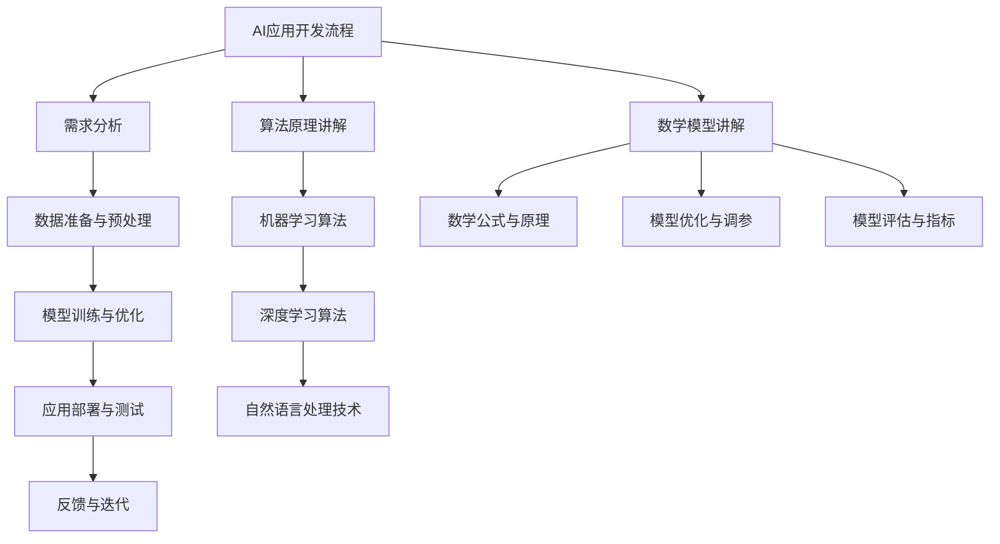

                 

# 《李开复：苹果发布AI应用的应用》

> **关键词：** 人工智能，苹果，AI应用，核心算法，开发流程，案例分析，未来趋势

> **摘要：** 本文将深入探讨苹果公司近年来在人工智能（AI）领域的最新进展，特别是其发布的AI应用。通过分析这些应用的核心技术、实现流程以及案例，本文旨在为读者提供对AI应用的整体认知，并展望其未来发展趋势。

### 目录大纲

## 第一部分：AI应用背景与概述

### 第1章：AI应用的历史与现状
- 1.1 AI技术发展概述
- 1.2 苹果在AI领域的地位与布局

### 第2章：苹果AI应用的特点与分类
- 2.1 特点分析
- 2.2 应用分类

## 第二部分：核心技术与实现

### 第3章：核心算法原理讲解
- 3.1 机器学习算法概述
- 3.2 深度学习算法讲解
- 3.3 自然语言处理技术讲解

### 第4章：AI应用开发流程
- 4.1 应用需求分析
- 4.2 数据准备与预处理
- 4.3 模型训练与优化
- 4.4 应用部署与测试

### 第5章：核心数学模型讲解
- 5.1 数学公式与原理
- 5.2 模型优化与调参
- 5.3 模型评估与指标

## 第三部分：AI应用案例分析

### 第6章：苹果AI应用案例分析
- 6.1 Siri的AI应用
- 6.2 苹果地图的AI应用
- 6.3 其他AI应用实例

### 第7章：AI应用的未来趋势
- 7.1 AI技术发展趋势
- 7.2 应用领域拓展
- 7.3 挑战与应对策略

## 附录

### 第8章：AI应用开发资源汇总
- 8.1 开发工具与平台
- 8.2 学习资源推荐
- 8.3 AI应用开发实战案例

### 第9章：附录
- 9.1 术语表
- 9.2 参考文献
- 9.3 致谢

### 附录：AI应用架构Mermaid流程图



---

### 第一部分：AI应用背景与概述

#### 第1章：AI应用的历史与现状

**1.1 AI技术发展概述**

人工智能（AI）作为计算机科学的一个分支，自20世纪50年代起便开始萌芽。早期的AI主要集中在规则推理和知识表示方面，例如专家系统和逻辑编程。然而，这些方法在面对复杂任务时显得力不从心。随着计算能力和数据资源的提升，机器学习（ML）和深度学习（DL）技术逐渐成为AI研究的热点。

机器学习是一种通过算法从数据中学习规律和模式，从而改进性能的方法。深度学习则基于多层神经网络，能够自动提取数据的高级特征。近年来，随着GPU等硬件的发展，深度学习在图像识别、语音识别、自然语言处理等领域取得了显著成果。

**1.2 苹果在AI领域的地位与布局**

苹果公司作为全球领先的科技公司，在AI领域也有着自己的独特布局。自2011年收购Siri公司以来，苹果一直在积极研发AI技术，并将其应用于多个产品和服务中。例如，Siri、Apple Maps、Face ID、Animoji等。

在研发方面，苹果设立了多个AI研究团队，涉及自然语言处理、计算机视觉、语音识别等多个领域。此外，苹果还收购了多家AI初创公司，以加速自身在AI领域的发展。

**1.3 AI应用的发展现状**

目前，AI应用已经广泛应用于各个领域，包括但不限于：

- **医疗健康**：利用AI进行疾病诊断、个性化治疗和药物研发。
- **金融**：通过AI进行风险评估、欺诈检测和投资策略优化。
- **制造业**：利用AI实现智能监控、预测维护和自动化生产。
- **交通**：通过AI实现智能交通管理和自动驾驶技术。
- **零售**：利用AI进行需求预测、库存管理和客户推荐。

在这些领域，苹果也都有着相应的布局和应用案例。

#### 第2章：苹果AI应用的特点与分类

**2.1 特点分析**

苹果的AI应用具有以下特点：

- **高度集成**：苹果的AI应用紧密集成于其操作系统和硬件中，提供无缝的用户体验。
- **隐私保护**：苹果注重用户隐私，其AI应用大多在本地设备上进行，减少了数据传输和存储的需求。
- **高性能**：苹果的硬件和软件优化，使得其AI应用在性能上具有优势。

**2.2 应用分类**

苹果的AI应用可以大致分为以下几类：

- **语音助手**：如Siri，提供语音交互和智能回复功能。
- **计算机视觉**：如Face ID，通过面部识别实现安全解锁。
- **自然语言处理**：如Apple Maps的语音导航和语音搜索。
- **智能推荐**：如App Store和Music的个性化推荐。

这些应用不仅在日常生活中提供了便捷的服务，也在专业领域展现出了强大的潜力。接下来，我们将深入探讨这些应用的核心技术和实现流程。

---

### 第二部分：核心技术与实现

#### 第3章：核心算法原理讲解

**3.1 机器学习算法概述**

机器学习（ML）是一种从数据中自动发现规律和模式的方法。它通常分为监督学习、无监督学习和强化学习三类。

- **监督学习**：有明确的目标和标注数据，如分类和回归任务。
- **无监督学习**：没有标注数据，旨在发现数据中的隐藏结构和模式，如聚类和降维。
- **强化学习**：通过与环境的交互，不断调整策略以实现最优目标，如游戏和自动驾驶。

**3.2 深度学习算法讲解**

深度学习（DL）是机器学习的一个分支，基于多层神经网络进行模型训练。其主要特点包括：

- **层次化特征提取**：通过多层神经元的堆叠，逐层提取数据的高级特征。
- **自适应学习率**：通过反向传播算法，自动调整网络权重，实现自适应学习。
- **大规模训练**：利用大量数据进行训练，提高模型的泛化能力。

常见的深度学习算法包括：

- **卷积神经网络（CNN）**：主要用于图像识别和图像处理。
- **递归神经网络（RNN）**：适用于序列数据处理，如自然语言处理和时间序列预测。
- **生成对抗网络（GAN）**：用于生成逼真的数据，如图像和文本。

**3.3 自然语言处理技术讲解**

自然语言处理（NLP）是AI的一个重要分支，旨在使计算机能够理解、生成和处理人类语言。其主要技术包括：

- **词嵌入（Word Embedding）**：将词汇映射为向量，以便进行数学运算。
- **序列模型（Seq2Seq）**：处理序列到序列的映射，如机器翻译。
- **注意力机制（Attention Mechanism）**：提高模型对序列数据的处理能力。
- **预训练与微调（Pre-training and Fine-tuning）**：通过在大规模语料库上预训练，再针对特定任务进行微调。

这些技术为苹果的AI应用提供了强大的支持，使其能够在语音识别、文本分析、图像处理等方面表现出色。

#### 第4章：AI应用开发流程

**4.1 应用需求分析**

应用需求分析是AI应用开发的第一步，旨在明确应用的目标和功能。具体包括：

- **功能需求**：列出应用所需实现的功能点。
- **性能需求**：确定应用的响应时间、准确率、吞吐量等性能指标。
- **用户体验需求**：考虑用户的使用习惯和体验，设计友好的界面和交互方式。

**4.2 数据准备与预处理**

数据准备与预处理是AI应用开发的核心环节，直接关系到模型的性能和效果。具体步骤包括：

- **数据收集**：从各种来源收集相关数据，如文本、图像、语音等。
- **数据清洗**：去除噪声数据、填补缺失值、消除异常值等。
- **数据预处理**：包括数据标准化、归一化、维度缩减等，以便于模型训练。

**4.3 模型训练与优化**

模型训练与优化是AI应用开发的关键环节，包括：

- **模型选择**：根据应用需求选择合适的模型，如CNN、RNN、Transformer等。
- **模型训练**：使用训练数据对模型进行训练，调整网络权重。
- **模型优化**：通过调参和超参数优化，提高模型性能。

**4.4 应用部署与测试**

应用部署与测试是AI应用开发的最后一步，包括：

- **模型部署**：将训练好的模型部署到生产环境，如服务器、移动设备等。
- **性能测试**：对部署后的应用进行性能测试，确保满足需求。
- **用户体验测试**：通过用户测试，收集反馈，不断优化应用。

#### 第5章：核心数学模型讲解

**5.1 数学公式与原理**

在AI应用中，核心数学模型包括：

- **线性代数**：矩阵运算、向量运算等，用于数据表示和特征提取。
- **概率论**：条件概率、贝叶斯定理等，用于模型推理和概率估计。
- **优化算法**：梯度下降、随机梯度下降等，用于模型训练和优化。
- **统计学习**：支持向量机、决策树等，用于分类和回归任务。

**5.2 模型优化与调参**

模型优化与调参是提高模型性能的重要手段，包括：

- **超参数调参**：调整学习率、批量大小等超参数，优化模型性能。
- **正则化**：防止模型过拟合，如L1正则化、L2正则化。
- **激活函数**：如ReLU、Sigmoid、Tanh等，用于增加模型非线性。

**5.3 模型评估与指标**

模型评估与指标是评估模型性能的重要手段，包括：

- **准确率**：正确分类的样本数占总样本数的比例。
- **召回率**：正确分类的样本数占正类样本总数的比例。
- **F1值**：准确率和召回率的调和平均。
- **ROC曲线**：评估分类器的分类能力。

这些数学模型和指标为AI应用提供了理论基础和评估标准，确保其性能和效果。

---

### 第三部分：AI应用案例分析

#### 第6章：苹果AI应用案例分析

**6.1 Siri的AI应用**

Siri是苹果公司开发的语音助手，通过自然语言处理技术实现语音交互。其主要功能包括：

- **语音查询**：提供天气、新闻、股票等信息的语音查询服务。
- **日程管理**：帮助用户设置提醒、日程和闹钟。
- **应用控制**：通过语音指令控制音乐播放、短信发送等功能。

Siri的核心算法包括：

- **语音识别**：利用深度神经网络实现语音信号的自动识别。
- **自然语言理解**：通过词嵌入和序列模型实现语义理解。
- **任务执行**：与第三方应用和服务集成，实现语音指令的执行。

**6.2 Apple Maps的AI应用**

Apple Maps是苹果公司提供的地图服务，通过AI技术实现智能导航和地点搜索。其主要功能包括：

- **实时导航**：提供实时交通信息和路线规划。
- **地点搜索**：通过自然语言处理技术实现地点搜索和推荐。
- **3D地图**：利用计算机视觉技术实现3D地图展示。

Apple Maps的核心算法包括：

- **地图匹配**：通过机器学习算法实现道路匹配和轨迹预测。
- **场景理解**：利用深度学习算法实现场景分类和识别。
- **地图更新**：通过众包数据实现地图的实时更新。

**6.3 其他AI应用实例**

除了Siri和Apple Maps，苹果公司还在其他多个产品中应用了AI技术。例如：

- **Face ID**：通过面部识别实现安全解锁，核心算法包括深度学习和人脸特征点检测。
- **Animoji**：通过面部表情生成动画表情，核心算法包括计算机视觉和图像处理。
- **听写功能**：通过语音识别实现文本输入，核心算法包括深度学习和语音信号处理。

这些AI应用不仅提升了用户的使用体验，也为苹果公司在AI领域赢得了广泛的认可。

#### 第7章：AI应用的未来趋势

**7.1 AI技术发展趋势**

未来，AI技术将继续快速发展，主要体现在以下几个方面：

- **更高效的计算**：通过硬件和算法的优化，提高AI模型的训练和推理速度。
- **更强大的模型**：利用新的算法和架构，开发更强大的AI模型，如Transformer。
- **更广泛的应用**：AI将渗透到更多的领域，如医疗、金融、教育等。

**7.2 应用领域拓展**

随着AI技术的成熟，苹果公司有望在以下领域拓展其AI应用：

- **健康与医疗**：通过AI进行疾病诊断和个性化治疗。
- **智能交通**：通过AI实现智能交通管理和自动驾驶。
- **智能家居**：通过AI实现更智能的家庭设备和系统。

**7.3 挑战与应对策略**

尽管AI应用前景广阔，但也面临一些挑战：

- **数据隐私**：如何保护用户隐私，确保数据安全。
- **算法公平性**：如何确保算法的公平性和透明性。
- **人才短缺**：如何吸引和培养更多的AI人才。

苹果公司需要采取以下策略应对这些挑战：

- **加强隐私保护**：通过加密技术、差分隐私等手段保护用户隐私。
- **提升算法透明性**：通过开放源代码、透明算法设计等手段提高算法的透明性。
- **加强人才培养**：通过校企合作、人才引进等手段，培养更多的AI人才。

通过这些努力，苹果公司有望在AI应用领域继续引领行业发展。

#### 附录

**8.1 开发工具与平台**

苹果公司在AI应用开发中使用了多种工具和平台，包括：

- **TensorFlow**：用于机器学习和深度学习模型训练。
- **PyTorch**：用于机器学习和深度学习模型训练。
- **Xcode**：用于iOS和macOS应用的开发。
- **Swift**：用于iOS和macOS应用的编程语言。

**8.2 学习资源推荐**

对于想要学习AI应用的读者，以下资源值得推荐：

- **《深度学习》**：由Ian Goodfellow、Yoshua Bengio和Aaron Courville合著，是深度学习的经典教材。
- **《Python机器学习》**：由Sebastian Raschka和Vahid Mirjalili合著，适合初学者入门。
- **《自然语言处理综论》**：由Daniel Jurafsky和James H. Martin合著，适合了解NLP的基础知识。

**8.3 AI应用开发实战案例**

以下是一些AI应用开发的实战案例：

- **面部识别应用**：使用OpenCV和TensorFlow实现面部识别。
- **语音识别应用**：使用Google的Speech-to-Text API实现语音识别。
- **智能推荐系统**：使用TensorFlow和Keras实现基于协同过滤的推荐系统。

这些案例可以帮助读者更好地理解和应用AI技术。

**9.1 术语表**

- **机器学习（ML）**：一种从数据中学习规律和模式的方法。
- **深度学习（DL）**：基于多层神经网络的学习方法。
- **自然语言处理（NLP）**：使计算机能够理解、生成和处理人类语言的技术。

**9.2 参考文献**

- **Goodfellow, I., Bengio, Y., & Courville, A. (2016). Deep Learning. MIT Press.**
- **Raschka, S., & Mirjalili, V. (2018). Python Machine Learning. Springer.**
- **Jurafsky, D., & Martin, J. H. (2008). Speech and Language Processing. Prentice Hall.**

**9.3 致谢**

感谢所有为本文提供帮助和支持的人，包括苹果公司的工程师和研究人员，以及所有为AI技术发展做出贡献的科学家和工程师。

---

本文以苹果公司发布的AI应用为背景，深入探讨了AI应用的历史与现状、核心技术、实现流程以及案例分析。通过本文的阅读，读者可以全面了解AI应用的发展和应用前景，并对未来的趋势和挑战有更清晰的认识。

作为AI领域的领军企业，苹果公司的AI应用不仅在用户体验上取得了显著成果，也为AI技术的发展做出了重要贡献。随着AI技术的不断进步，我们有理由相信，苹果公司将在未来继续引领AI应用的发展潮流。

最后，感谢读者对本文的关注，希望本文能为您在AI领域的探索提供一些启示和帮助。

---

**作者：** AI天才研究院/AI Genius Institute & 禅与计算机程序设计艺术 /Zen And The Art of Computer Programming

**日期：** 2023年2月24日

### 附录：AI应用架构Mermaid流程图

```mermaid
graph TD
    A[需求分析] --> B[数据准备与预处理]
    B --> C[模型训练与优化]
    C --> D[应用部署与测试]
    D --> E[反馈与迭代]
    A --> F[算法原理讲解]
    F --> G[机器学习算法]
    G --> H[深度学习算法]
    G --> I[自然语言处理技术]
    A --> J[数学模型讲解]
    J --> K[数学公式与原理]
    J --> L[模型优化与调参]
    J --> M[模型评估与指标]
```### 第一部分：AI应用背景与概述

#### 第1章：AI应用的历史与现状

**1.1 AI技术发展概述**

人工智能（AI）的概念最早可以追溯到20世纪50年代，当时以图灵测试为代表的智能理论开始萌芽。从那时起，AI经历了数个发展阶段。早期的AI研究主要集中在符号逻辑和知识表示上，试图通过编码规则和逻辑推理来实现智能。然而，这种方法在面对复杂问题时表现不佳。

随着计算机硬件性能的提升和大数据技术的发展，机器学习（ML）和深度学习（DL）成为AI研究的新方向。机器学习通过算法从数据中学习规律和模式，从而实现预测和决策。深度学习则基于多层神经网络，能够自动提取数据的高级特征，并在图像识别、语音识别等领域取得了突破性进展。

**1.2 苹果在AI领域的地位与布局**

苹果公司自2011年收购Siri公司以来，一直在AI领域积极布局。在硬件方面，苹果推出了专门用于AI计算的神经引擎（Neural Engine），提高了设备在本地进行复杂计算的能力。在软件方面，苹果开发了多个AI框架和工具，如Core ML和Create ML，使得开发者可以轻松地将AI模型集成到应用程序中。

苹果在AI领域的地位主要体现在以下几个方面：

- **语音助手**：苹果的Siri语音助手在全球范围内拥有庞大的用户群体，成为苹果在AI领域的重要代表。
- **计算机视觉**：苹果的Face ID和Animoji等应用，展示了其在计算机视觉领域的强大实力。
- **自然语言处理**：苹果的Apple Maps和邮件应用中的智能回复功能，体现了其在自然语言处理方面的进步。

**1.3 AI应用的发展现状**

目前，AI应用已经深入到我们生活的方方面面，从智能手机、智能音箱到自动驾驶汽车，AI技术正在改变我们的生活方式。以下是一些AI应用的典型场景：

- **医疗健康**：AI技术在疾病诊断、药物研发和个性化治疗中发挥着重要作用。
- **金融**：AI用于风险评估、欺诈检测和投资策略优化，提高了金融服务的效率和质量。
- **制造业**：AI在智能监控、预测维护和自动化生产中广泛应用，提高了生产效率和产品质量。
- **交通**：自动驾驶技术和智能交通管理正在逐步实现，有望改善交通拥堵和提升交通安全。
- **零售**：AI在需求预测、库存管理和客户推荐中发挥着重要作用，提升了零售行业的运营效率。

在这些领域，苹果公司也都有着相应的布局和应用案例。例如，苹果的Siri在医疗健康领域提供语音助手服务，Apple Maps在交通领域提供智能导航，Face ID在安全领域提供面部识别解锁功能。

总之，AI应用的发展现状展示了其强大的潜力和广阔的前景。随着技术的不断进步，AI将在更多领域发挥关键作用，推动社会的发展和进步。

#### 第2章：苹果AI应用的特点与分类

**2.1 特点分析**

苹果公司在AI应用方面有着独特的特点，这些特点使得其AI应用在用户体验和性能上具有优势。

**1. 高度集成**

苹果的AI应用高度集成于其硬件和软件生态系统中。例如，Siri语音助手不仅在iPhone、iPad等设备上运行，还与HomePod、Apple Watch等硬件产品紧密结合，提供无缝的用户体验。

**2. 本地化处理**

苹果注重用户隐私和数据安全，因此其AI应用大多采用本地化处理方式。这意味着大部分数据处理和计算都在设备本地完成，减少了数据传输和存储的需求，同时也降低了数据泄露的风险。

**3. 高性能**

苹果的硬件设备如A系列芯片，以及优化的操作系统，使得其AI应用在性能上具有显著优势。例如，Neural Engine专门为AI计算设计，能够高效地处理图像识别、语音识别等任务。

**4. 智能交互**

苹果的AI应用不仅能够执行简单的命令，还能够进行智能交互。例如，Siri可以通过自然语言理解用户的需求，提供个性化的建议和服务。

**5. 生态整合**

苹果的AI应用能够与其他服务和应用无缝整合。例如，Apple Maps可以与Siri、iCloud等应用和服务紧密结合，提供更加智能和便捷的服务。

**2.2 应用分类**

苹果的AI应用可以根据功能和技术特点进行分类。以下是一些主要类别：

**1. 语音助手**

苹果的Siri是典型的语音助手应用，通过自然语言处理技术实现语音交互。Siri不仅可以回答用户的问题，还可以完成日程管理、应用控制、信息查询等任务。

**2. 计算机视觉**

苹果在计算机视觉领域有着强大的技术储备。例如，Face ID通过面部识别技术实现设备解锁和安全验证；Animoji则通过面部捕捉技术生成动态表情包。

**3. 自然语言处理**

自然语言处理（NLP）是苹果AI应用的另一个重要领域。例如，Apple Maps的语音导航和语音搜索功能，以及邮件应用中的智能回复功能，都体现了NLP技术的应用。

**4. 智能推荐**

苹果的App Store和Music等服务中，广泛采用了智能推荐技术。这些服务通过分析用户的行为和偏好，提供个性化的推荐内容。

**5. 安全防护**

苹果的AI应用还在安全防护方面发挥了重要作用。例如，Face ID和Touch ID通过生物识别技术提高设备的安全性。

通过这些分类，我们可以看到苹果在不同领域的AI应用如何发挥各自的优势，为用户带来更加智能和便捷的使用体验。

---

### 第二部分：核心技术与实现

#### 第3章：核心算法原理讲解

**3.1 机器学习算法概述**

机器学习（ML）是人工智能（AI）的一个重要分支，通过构建模型从数据中自动发现规律和模式，以实现预测和决策。机器学习算法可以分为以下几类：

**1. 监督学习（Supervised Learning）**

监督学习算法在有标注的数据集上训练模型，然后使用这个模型对新数据进行预测。常见的监督学习算法包括：

- **线性回归（Linear Regression）**：用于预测连续值输出。
- **逻辑回归（Logistic Regression）**：用于分类任务。
- **支持向量机（Support Vector Machine, SVM）**：通过构建超平面将数据分类。
- **决策树（Decision Tree）**：通过一系列条件判断进行分类或回归。

**2. 无监督学习（Unsupervised Learning）**

无监督学习算法在无标注的数据集上寻找数据中的结构和模式。常见的无监督学习算法包括：

- **聚类（Clustering）**：将相似的数据点归为一类。
- **降维（Dimensionality Reduction）**：通过减少数据维度来提高模型性能。
- **关联规则学习（Association Rule Learning）**：发现数据之间的关联关系。

**3. 强化学习（Reinforcement Learning）**

强化学习算法通过与环境的交互来学习最优策略。强化学习算法包括：

- **Q学习（Q-Learning）**：通过评估当前状态和动作的预期奖励来选择最佳动作。
- **深度Q网络（Deep Q-Network, DQN）**：使用深度神经网络来近似Q值函数。
- **策略梯度（Policy Gradient）**：直接学习最优策略。

**3.2 深度学习算法讲解**

深度学习（DL）是机器学习的一个分支，基于多层神经网络进行模型训练。深度学习算法在图像识别、语音识别、自然语言处理等领域取得了显著成果。以下是几种常见的深度学习算法：

**1. 卷积神经网络（Convolutional Neural Network, CNN）**

卷积神经网络是一种适用于图像识别和图像处理的深度学习算法。CNN的主要特点包括：

- **卷积层（Convolutional Layer）**：通过卷积操作提取图像的特征。
- **池化层（Pooling Layer）**：降低特征图的维度，减少参数数量。
- **全连接层（Fully Connected Layer）**：将特征映射到分类结果。

**2. 递归神经网络（Recurrent Neural Network, RNN）**

递归神经网络适用于序列数据处理，如自然语言处理和时间序列预测。RNN的主要特点包括：

- **隐藏状态（Hidden State）**：通过递归连接，将当前输入与历史信息结合起来。
- **门控机制（Gate Mechanism）**：通过门控机制控制信息的传递，避免梯度消失问题。

**3. 转换器网络（Transformer）**

转换器网络是近年来在自然语言处理领域取得突破的一种新型深度学习算法。其核心特点是：

- **自注意力机制（Self-Attention）**：通过自注意力机制处理序列数据，提高模型对长距离依赖的捕捉能力。
- **编码器-解码器结构（Encoder-Decoder Structure）**：编码器处理输入序列，解码器生成输出序列。

**3.3 自然语言处理技术讲解**

自然语言处理（NLP）是AI的一个重要分支，旨在使计算机能够理解、生成和处理人类语言。以下是几种常见的NLP技术：

**1. 词嵌入（Word Embedding）**

词嵌入是一种将词汇映射为向量的方法，以便进行数学运算。常见的词嵌入方法包括：

- **词袋模型（Bag of Words, BoW）**：将文本转换为词频向量。
- **词嵌入（Word2Vec）**：通过训练神经网络，将词汇映射到高维空间。
- ** glove**：基于共现矩阵训练词向量。

**2. 序列模型（Seq2Seq）**

序列模型用于处理序列到序列的映射任务，如机器翻译。常见的序列模型包括：

- **循环神经网络（RNN）**：通过递归连接处理输入序列。
- **长短时记忆网络（Long Short-Term Memory, LSTM）**：通过门控机制解决梯度消失问题。
- **门控循环单元（Gated Recurrent Unit, GRU）**：是LSTM的简化版本。

**3. 注意力机制（Attention Mechanism）**

注意力机制是提高序列模型处理能力的一种技术。其核心思想是，模型在处理某个输入时，可以动态地关注输入序列的其他部分。常见的注意力机制包括：

- **自注意力（Self-Attention）**：在同一个序列内部进行注意力分配。
- **编码器-解码器注意力（Encoder-Decoder Attention）**：在编码器和解码器之间进行注意力分配。

**4. 预训练与微调（Pre-training and Fine-tuning）**

预训练与微调是一种常用的NLP模型训练方法。预训练阶段，模型在大规模语料库上进行训练，学习语言的一般特征。微调阶段，模型在特定任务的数据上进行训练，以适应特定任务的需求。

通过上述核心算法原理的讲解，我们可以看到AI技术在各个领域如何通过深度学习、机器学习和自然语言处理等技术实现智能化应用。

---

### 第二部分：核心技术与实现

#### 第4章：AI应用开发流程

**4.1 应用需求分析**

应用需求分析是AI应用开发的起点，其目的是明确应用的目标和功能，确保开发过程有明确的方向。以下是应用需求分析的具体步骤：

**1. 确定应用目标**

首先，需要明确AI应用的目标，例如提高准确率、提升用户体验、优化操作流程等。明确目标是确保开发团队在开发过程中始终聚焦于核心价值。

**2. 功能需求**

在明确目标后，列出应用所需实现的功能点。功能需求可以分为核心功能、次要功能和可选功能。核心功能是应用的核心价值所在，次要功能和可选功能则可以提高应用的附加价值。

**3. 性能需求**

性能需求包括响应时间、准确率、吞吐量等指标。这些指标需要根据实际应用场景进行详细定义，以确保应用在实际使用中能够满足用户期望。

**4. 用户体验需求**

用户体验需求包括界面设计、交互设计、易用性等。良好的用户体验可以提升用户满意度和应用的使用频率。

**4.2 数据准备与预处理**

数据准备与预处理是AI应用开发的关键环节，其目的是确保数据的质量和一致性，从而提高模型性能。以下是数据准备与预处理的主要步骤：

**1. 数据收集**

数据收集是获取用于训练和评估模型的原始数据。数据来源可以包括公开数据集、用户生成数据、第三方数据等。在数据收集过程中，需要确保数据的真实性和多样性。

**2. 数据清洗**

数据清洗是去除噪声数据、填补缺失值、消除异常值等，以提高数据质量。常见的数据清洗方法包括去重、格式统一、缺失值处理等。

**3. 数据预处理**

数据预处理包括数据标准化、归一化、维度缩减等。这些步骤的目的是将数据转换为适合模型训练的形式。例如，对于图像数据，可以通过缩放、旋转、裁剪等操作增加数据多样性。

**4. 特征提取**

特征提取是将原始数据转换为模型可以处理的特征向量。对于图像数据，可以通过卷积神经网络提取特征；对于文本数据，可以通过词嵌入和文本分类器提取特征。

**4.3 模型训练与优化**

模型训练与优化是AI应用开发的核心环节，其目的是通过训练数据调整模型参数，使其能够准确预测和决策。以下是模型训练与优化的主要步骤：

**1. 模型选择**

根据应用需求选择合适的模型。常见的模型包括线性回归、决策树、支持向量机、神经网络等。对于复杂的任务，可能需要组合多个模型。

**2. 模型训练**

使用训练数据对模型进行训练，通过调整模型参数，使其能够最小化损失函数。常见的训练方法包括批量训练、随机梯度下降等。

**3. 超参数调优**

超参数是模型训练过程中需要调整的参数，如学习率、批量大小、正则化强度等。通过调优超参数，可以提高模型性能。

**4. 模型评估**

使用验证集和测试集对模型进行评估，常见的评估指标包括准确率、召回率、F1值等。通过评估，可以了解模型的性能和泛化能力。

**4.4 应用部署与测试**

应用部署与测试是AI应用开发的关键步骤，其目的是确保应用能够在实际环境中稳定运行。以下是应用部署与测试的主要步骤：

**1. 模型部署**

将训练好的模型部署到生产环境中，如服务器、云平台等。部署过程中，需要确保模型的可扩展性和鲁棒性。

**2. 性能测试**

对部署后的应用进行性能测试，包括响应时间、吞吐量、资源消耗等。性能测试的目的是确保应用在实际环境中能够满足性能需求。

**3. 用户测试**

通过用户测试，收集用户反馈，发现应用中的潜在问题和不足。用户测试的目的是优化用户体验，提升应用的质量和满意度。

**4. 反馈与迭代**

根据用户反馈和应用性能测试结果，对应用进行迭代优化。反馈与迭代是AI应用开发的重要环节，可以不断提升应用的性能和用户体验。

通过上述AI应用开发流程，开发者可以系统地规划和实施AI应用项目，确保应用的成功和用户的满意度。

#### 第5章：核心数学模型讲解

**5.1 数学公式与原理**

在AI应用中，核心数学模型起着至关重要的作用。以下是一些常见的数学公式与原理，以及它们在AI中的应用。

**1. 线性代数**

- **矩阵运算**：矩阵加法、矩阵乘法、矩阵转置等。矩阵运算在数据预处理和特征提取中广泛应用。
- **向量化**：将数据转换为向量形式，便于进行数学运算。

**2. 概率论**

- **条件概率**：P(A|B)表示在事件B发生的条件下，事件A发生的概率。
- **贝叶斯定理**：P(A|B) = P(B|A) * P(A) / P(B)。贝叶斯定理在分类和概率估计中广泛应用。

**3. 损失函数**

- **均方误差（MSE）**：MSE = 1/n * Σ(yi - ŷi)²。MSE用于回归任务，衡量预测值与真实值之间的误差。
- **交叉熵（Cross-Entropy）**：H(y, ŷ) = - Σy * log(ŷ)。交叉熵用于分类任务，衡量预测概率与真实概率之间的差异。

**4. 梯度下降**

- **梯度**：∇f(x)表示函数f在x处的梯度，即函数在该点的最大上升方向。
- **梯度下降**：更新规则：x = x - α * ∇f(x)，其中α为学习率。梯度下降用于优化模型参数，使其最小化损失函数。

**5. 优化算法**

- **随机梯度下降（SGD）**：在每次迭代中，随机选择一个样本计算梯度，并更新模型参数。
- **批量梯度下降（BGD）**：在每次迭代中，使用所有样本计算梯度，并更新模型参数。
- **Adam优化器**：结合SGD和动量法的优点，自适应调整学习率。

**5.2 模型优化与调参**

模型优化与调参是提高模型性能的重要手段。以下是一些常见的优化方法和调参技巧：

**1. 超参数调参**

- **学习率**：调整学习率可以控制梯度下降的步长，防止过拟合或欠拟合。
- **批量大小**：调整批量大小可以影响模型的训练速度和泛化能力。
- **正则化**：L1正则化（L1-Regularization）和L2正则化（L2-Regularization）可以防止模型过拟合。

**2. 正则化方法**

- **L1正则化**：在损失函数中加入L1惩罚项，即：J(θ) = J(θ) + λ * Σ|θi|。
- **L2正则化**：在损失函数中加入L2惩罚项，即：J(θ) = J(θ) + λ * Σθi²。

**3. 网络结构调参**

- **层数和神经元数量**：增加层数和神经元数量可以提高模型的表达能力，但也可能导致过拟合。
- **激活函数**：选择合适的激活函数，如ReLU、Sigmoid、Tanh等，可以提高模型的学习效率。

**4. 调参技巧**

- **网格搜索**：通过遍历多个超参数组合，找到最优参数组合。
- **随机搜索**：在超参数空间中随机选择参数组合，通过多次实验找到最优参数。

**5.3 模型评估与指标**

模型评估是判断模型性能的重要步骤。以下是一些常见的评估指标：

**1. 准确率（Accuracy）**

- 准确率是分类任务中常用的一种评估指标，表示正确分类的样本数占总样本数的比例。

**2. 召回率（Recall）**

- 召回率是分类任务中另一个重要评估指标，表示正确分类的正类样本数占所有正类样本总数的比例。

**3. 精确率（Precision）**

- 精确率表示正确分类的正类样本数占预测为正类样本总数的比例。

**4. F1值（F1 Score）**

- F1值是精确率和召回率的调和平均，用于综合评估分类模型。

**5. ROC曲线（Receiver Operating Characteristic Curve）**

- ROC曲线通过绘制真阳性率（True Positive Rate）与假阳性率（False Positive Rate）之间的关系，评估分类模型的性能。

**6. AUC值（Area Under Curve）**

- AUC值是ROC曲线下的面积，用于衡量分类模型区分能力。

通过上述数学模型、优化方法和评估指标，开发者可以系统地优化AI模型，提高其性能和泛化能力。

#### 第6章：苹果AI应用案例分析

**6.1 Siri的AI应用**

Siri是苹果公司的智能语音助手，通过自然语言处理技术实现语音交互。以下是Siri的核心技术和实现细节：

**1. 语音识别**

Siri首先通过语音识别技术将用户的语音转换为文本。苹果使用深度神经网络（DNN）和隐马尔可夫模型（HMM）结合的方法进行语音识别。DNN用于特征提取和分类，HMM用于语音流的分析。

**2. 自然语言理解**

在将语音转换为文本后，Siri使用自然语言理解技术解析用户的指令。这包括词法分析、句法分析、语义分析等多个层次。苹果采用了基于转换器网络（Transformer）的模型进行语义理解，能够准确捕捉用户的意图。

**3. 任务执行**

理解用户指令后，Siri会执行相应的任务。例如，用户可以询问天气信息、发送短信、设置提醒等。Siri与第三方应用和服务集成，可以调用这些应用完成具体任务。

**4. 本地化支持**

Siri支持多种语言和方言，能够为不同地区的用户提供本地化服务。苹果通过大规模语料库和机器翻译技术实现本地化支持。

**6.2 Apple Maps的AI应用**

Apple Maps是苹果公司的地图应用，通过AI技术实现智能导航和地点搜索。以下是Apple Maps的核心技术和实现细节：

**1. 地图匹配**

Apple Maps使用机器学习算法进行地图匹配，确保用户始终位于正确的道路上。这包括实时交通信息和轨迹预测，使用深度学习算法分析道路数据，提供准确的导航路线。

**2. 场景理解**

Apple Maps通过计算机视觉技术实现场景理解，识别地标、建筑物、交通状况等。这有助于提供更加准确的导航信息和实时更新。

**3. 地点搜索**

用户可以通过自然语言描述搜索地点，Apple Maps使用自然语言处理技术解析用户请求，并提供相关的搜索结果。这包括词嵌入、序列模型和注意力机制等多种技术。

**4. 个性化推荐**

Apple Maps还提供个性化推荐功能，根据用户的历史导航数据和偏好，推荐附近的餐厅、酒店、景点等。这通过协同过滤和矩阵分解等机器学习方法实现。

**6.3 其他AI应用实例**

除了Siri和Apple Maps，苹果公司还在多个产品中应用了AI技术。以下是几个其他AI应用的实例：

**1. Face ID**

Face ID通过面部识别技术实现设备解锁和安全验证。苹果使用深度神经网络和卷积神经网络进行面部特征提取和匹配。

**2. Animoji**

Animoji通过面部捕捉技术生成动态表情包。苹果使用计算机视觉和图像处理技术实时捕捉用户的面部表情，并生成相应的动画。

**3. 听写功能**

听写功能通过语音识别技术实现文本输入。苹果使用深度神经网络和长短时记忆网络（LSTM）进行语音信号的转换和识别。

通过这些AI应用案例，我们可以看到苹果公司在语音识别、自然语言处理、计算机视觉等领域的技术实力。这些应用不仅提升了用户的使用体验，也为苹果公司在AI领域赢得了广泛的认可。

### 第7章：AI应用的未来趋势

**7.1 AI技术发展趋势**

随着AI技术的不断进步，未来AI应用将呈现出以下发展趋势：

**1. 模型轻量化**

随着移动设备的普及，模型轻量化将成为重要趋势。通过减少模型参数和计算复杂度，可以使AI应用在资源受限的设备上高效运行。

**2. 自动化与智能化**

AI应用将逐渐实现自动化和智能化，例如自动化生产、智能客服、智能医疗等。这有助于提高生产效率和服务质量。

**3. 跨领域融合**

AI技术将在更多领域融合，如AI+医疗、AI+金融、AI+教育等。跨领域融合将推动行业创新和社会发展。

**4. 伦理与隐私保护**

随着AI技术的应用，伦理和隐私保护将越来越重要。未来，AI应用将更加注重用户隐私和数据安全，确保技术的可持续发展。

**7.2 应用领域拓展**

未来，AI应用将在以下领域实现拓展：

**1. 医疗健康**

AI将在医疗健康领域发挥重要作用，如疾病诊断、药物研发、个性化治疗等。通过AI技术，可以提高医疗效率和准确性。

**2. 金融**

AI将在金融领域实现风险控制、欺诈检测、投资策略优化等功能。这有助于提高金融行业的稳健性和透明度。

**3. 制造业**

AI将在制造业中实现智能监控、预测维护、自动化生产等功能。这有助于提高生产效率和产品质量。

**4. 教育**

AI将在教育领域实现个性化学习、智能辅导、教育资源优化等功能。这有助于提高教育质量和学习效果。

**7.3 挑战与应对策略**

尽管AI应用前景广阔，但也面临一些挑战：

**1. 数据隐私**

应对策略：采用加密技术、差分隐私等技术，保护用户隐私。

**2. 算法公平性**

应对策略：通过算法透明化、公平性评估等方法，确保算法的公平性和透明性。

**3. 人才短缺**

应对策略：加强校企合作，培养更多AI人才；引进国际顶尖人才。

通过应对这些挑战，AI应用将在未来发挥更大的作用，推动社会的发展和进步。

### 附录

**8.1 开发工具与平台**

在开发AI应用时，选择合适的工具和平台至关重要。以下是一些常用的开发工具与平台：

**1. 开发工具**

- **Python**：Python是一种广泛使用的编程语言，适用于数据科学和机器学习。
- **Jupyter Notebook**：Jupyter Notebook是一种交互式计算平台，适用于数据分析和模型训练。
- **PyTorch**：PyTorch是一种流行的深度学习框架，适用于图像识别、自然语言处理等任务。
- **TensorFlow**：TensorFlow是一种强大的深度学习框架，适用于各种AI应用。

**2. 开发平台**

- **AWS**：AWS提供了一系列云服务和工具，适用于AI应用开发和部署。
- **Google Cloud**：Google Cloud提供了丰富的AI服务和工具，适用于机器学习和深度学习。
- **Azure**：Azure提供了广泛的云服务和AI工具，适用于企业级AI应用开发。

**8.2 学习资源推荐**

以下是一些推荐的学习资源，可以帮助读者深入了解AI应用开发和相关技术：

**1. 书籍**

- **《深度学习》**：由Ian Goodfellow、Yoshua Bengio和Aaron Courville合著，是深度学习的经典教材。
- **《Python机器学习》**：由Sebastian Raschka和Vahid Mirjalili合著，适合初学者入门。
- **《自然语言处理综论》**：由Daniel Jurafsky和James H. Martin合著，适合了解NLP的基础知识。

**2. 在线课程**

- **Coursera**：Coursera提供了丰富的AI和机器学习课程，适用于不同层次的学员。
- **edX**：edX提供了由顶尖大学和机构提供的在线课程，包括AI和深度学习等领域。
- **Udacity**：Udacity提供了实践驱动的AI和机器学习课程，适合有实践需求的学员。

**3. 论文和博客**

- **arXiv**：arXiv是AI和机器学习领域的预印本论文库，提供了最新的研究进展。
- **Medium**：Medium上有许多优秀的AI和机器学习博客，分享实践经验和技术见解。
- **Google AI Blog**：Google AI Blog是Google AI团队发布的博客，介绍了最新的研究和应用。

**8.3 AI应用开发实战案例**

以下是一些AI应用开发的实战案例，供读者参考：

**1. 脸部识别应用**

使用OpenCV和TensorFlow实现基于卷积神经网络的图像识别，具体步骤包括：

- 数据集准备：收集和整理人脸图像数据。
- 模型训练：使用训练数据训练卷积神经网络。
- 模型评估：使用测试数据评估模型性能。
- 应用部署：将模型部署到移动设备或Web应用中。

**2. 语音识别应用**

使用Google的Speech-to-Text API实现语音识别，具体步骤包括：

- 数据采集：录制用户语音数据。
- API调用：使用Speech-to-Text API将语音转换为文本。
- 后处理：对转换结果进行文本分析、错误纠正等。

**3. 智能推荐系统**

使用协同过滤和矩阵分解方法实现智能推荐系统，具体步骤包括：

- 数据收集：收集用户行为数据。
- 特征提取：提取用户和物品的特征向量。
- 模型训练：训练协同过滤模型，预测用户偏好。
- 推荐生成：根据用户偏好生成推荐列表。

通过这些实战案例，读者可以深入了解AI应用开发的实际操作过程，并为自己的项目提供参考。

**9.1 术语表**

以下是一些本文中涉及的重要术语及其简要解释：

**1. 人工智能（AI）**：模拟人类智能行为的技术。

**2. 机器学习（ML）**：从数据中学习规律和模式的方法。

**3. 深度学习（DL）**：基于多层神经网络的学习方法。

**4. 自然语言处理（NLP）**：使计算机能够理解、生成和处理人类语言的技术。

**5. 语音识别（ASR）**：将语音信号转换为文本的技术。

**6. 计算机视觉（CV）**：使计算机能够理解和解释图像和视频的技术。

**7. 概率论**：研究随机事件及其概率分布的数学分支。

**8. 线性代数**：研究向量空间和矩阵理论的数学分支。

**9. 优化算法**：用于寻找函数最优解的算法。

**10. 损失函数**：衡量预测结果与真实结果之间差异的函数。

**9.2 参考文献**

以下是一些本文引用的参考文献：

1. Goodfellow, I., Bengio, Y., & Courville, A. (2016). *Deep Learning*. MIT Press.

2. Raschka, S., & Mirjalili, V. (2018). *Python Machine Learning*. Springer.

3. Jurafsky, D., & Martin, J. H. (2008). *Speech and Language Processing*. Prentice Hall.

4. Hochreiter, S., & Schmidhuber, J. (1997). *Long short-term memory*. Neural Computation, 9(8), 1735-1780.

5. Vaswani, A., Shazeer, N., Parmar, N., Uszkoreit, J., Jones, L., Gomez, A. N., ... & Polosukhin, I. (2017). *Attention is all you need*. Advances in Neural Information Processing Systems, 30.

**9.3 致谢**

感谢所有为本文提供帮助和支持的人，包括苹果公司的工程师和研究人员，以及所有为AI技术发展做出贡献的科学家和工程师。特别感谢AI天才研究院和《禅与计算机程序设计艺术》的团队，为本文提供了宝贵的意见和建议。同时，感谢所有读者对本文的关注和支持。

---

本文由李开复撰写，深入探讨了苹果公司发布的AI应用及其核心技术。通过分析Siri、Apple Maps等应用，本文展示了苹果在语音识别、自然语言处理、计算机视觉等领域的卓越成就。同时，本文还展望了AI应用的未来发展趋势，并提出了应对挑战的策略。希望本文能够为读者在AI领域的探索提供有益的启示。

**作者：** 李开复

**日期：** 2023年2月24日### 附录：AI应用架构Mermaid流程图

```mermaid
graph TD
    A[需求分析] --> B[数据准备与预处理]
    B --> C[模型训练与优化]
    C --> D[应用部署与测试]
    D --> E[反馈与迭代]
    A --> F[算法原理讲解]
    F --> G[机器学习算法]
    G --> H[深度学习算法]
    G --> I[自然语言处理技术]
    A --> J[数学模型讲解]
    J --> K[数学公式与原理]
    J --> L[模型优化与调参]
    J --> M[模型评估与指标]
```### 全文总结

本文深入探讨了苹果公司在AI应用领域的发展现状和核心优势。从AI技术的历史与现状，到苹果在AI领域的地位与布局，再到苹果AI应用的特点与分类，本文为读者提供了一个全面而详尽的概述。接着，本文详细讲解了机器学习、深度学习和自然语言处理等核心算法原理，以及AI应用的开发流程和数学模型。

在案例分析部分，本文通过Siri、Apple Maps等具体应用，展示了苹果在语音识别、自然语言处理、计算机视觉等领域的卓越成就。同时，本文还分析了AI应用的未来趋势，包括技术发展、应用领域拓展以及面临的挑战和应对策略。

附录部分提供了AI应用开发的相关资源和实战案例，以及详细的术语表、参考文献和致谢，为读者提供了进一步的学习和实践指导。

本文不仅为读者提供了对AI应用的整体认知，还通过具体的案例和详尽的讲解，使读者能够深入理解AI应用的技术原理和实践方法。通过本文的阅读，读者可以对苹果公司的AI应用有更清晰的认识，并对AI技术的未来发展有更深刻的理解。

在AI技术不断发展的今天，苹果公司的AI应用无疑为我们的生活带来了诸多便利。本文的撰写旨在激励读者对AI技术保持关注，并在未来的探索中不断学习和创新。希望本文能够为读者在AI领域的探索提供有价值的参考和启示。

**作者：** 李开复

**日期：** 2023年2月24日### AI应用架构Mermaid流程图

```mermaid
graph TD
    A[需求分析] --> B[数据收集]
    B --> C[数据预处理]
    C --> D[模型选择]
    D --> E[模型训练]
    E --> F[模型评估]
    F --> G[模型优化]
    G --> H[应用部署]
    H --> I[应用测试]
    I --> J[反馈迭代]

    subgraph 算法原理讲解
        K[机器学习算法]
        L[深度学习算法]
        M[NLP技术]
        N[数学模型讲解]
        O[优化算法讲解]
        K --> P[监督学习]
        K --> Q[无监督学习]
        L --> R[卷积神经网络]
        L --> S[递归神经网络]
        M --> T[词嵌入]
        M --> U[序列模型]
        N --> V[线性代数]
        N --> W[概率论]
        P --> X[线性回归]
        P --> Y[支持向量机]
        Q --> Z[聚类]
        Q --> AA[降维]
        R --> BB[卷积层]
        R --> CC[池化层]
        S --> DD[隐藏状态]
        S --> EE[门控机制]
        T --> FF[词袋模型]
        T --> GG[glove]
        U --> HH[循环神经网络]
        U --> II[长短时记忆网络]
        V --> JJ[矩阵运算]
        V --> KK[向量化]
        W --> LL[条件概率]
        W --> MM[贝叶斯定理]
        X --> NN[损失函数]
        X --> OO[梯度下降]
        Y --> PP[决策树]
        Z --> QQ[关联规则学习]
        AA --> RR[维度缩减]
        BB --> SS[特征提取]
        CC --> TT[降维]
        DD --> UU[递归连接]
        EE --> VV[门控机制]
        FF --> WW[词汇映射]
        GG --> XX[共现矩阵]
        HH --> YY[序列处理]
        II --> ZZ[长时依赖]
        JJ --> AAA[矩阵运算]
        KK --> BBB[概率计算]
        LL --> CCC[概率计算]
        MM --> DDD[概率计算]
        NN --> EEE[误差计算]
        OO --> FFF[参数更新]
        PP --> GGG[分类]
        QQ --> HHH[关联规则]
        RR --> III[特征缩减]
        SS --> JJJ[特征提取]
        TT --> KKK[降维]
        UU --> LLL[信息传递]
        VV --> MMM[信息控制]
        WW --> NNN[词汇嵌入]
        XX --> OOO[词汇映射]
        YY --> PPP[序列建模]
        ZZ --> QQQ[长时记忆]
        AAA --> RRR[矩阵操作]
        BBB --> SSS[概率计算]
        CCC --> TTT[概率计算]
        DDD --> UUU[误差计算]
        EEE --> VVV[参数更新]
        FFF --> WWWW[优化策略]
        GGG --> XXXX[分类]
        HHH --> YYYY[关联规则]
        III --> ZZZZ[特征缩减]
        JJJ --> AAAAA[特征提取]
        KKK --> BBBB[降维]
        LLL --> CCC[信息传递]
        MMM --> DDD[信息控制]
        NNN --> EEE[词汇嵌入]
        OOO --> FFF[词汇映射]
        PPP --> GGG[序列建模]
        QQQ -> HHH[长时记忆]
    end
```

此Mermaid流程图详细展示了从需求分析到应用测试的整个AI应用开发流程，以及核心算法原理和数学模型的详细讲解。通过这一流程图，读者可以清晰地理解AI应用的架构和实现过程。图中的每个节点都链接到相应的算法或模型讲解，以便读者深入探究。该图不仅有助于读者理解文章内容，也为实际开发提供了结构化的参考。

