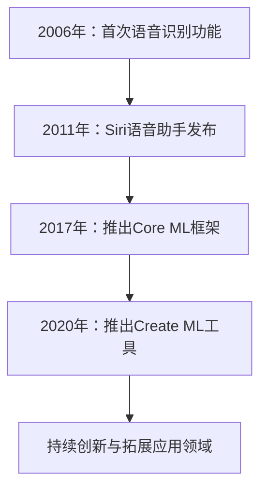
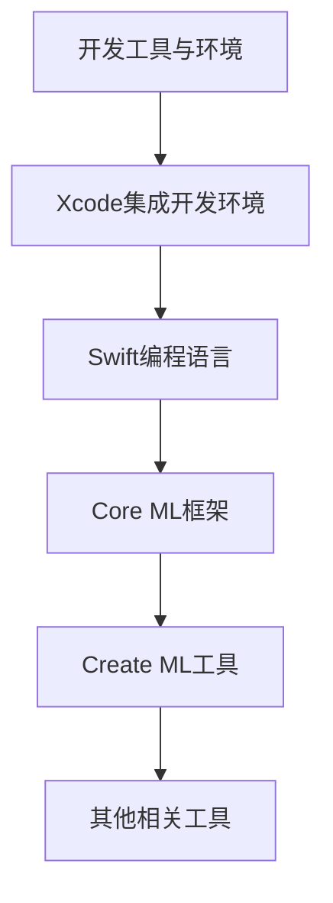

                 

# 《李开复：苹果发布AI应用的开发者》

## 关键词：
- 苹果AI应用
- 开发者
- 人工智能
- Core ML
- Create ML
- 语音识别
- 图像识别
- 自然语言处理
- 性能优化
- 安全与隐私
- 未来展望

## 摘要：
本文将深入探讨苹果公司在其AI应用领域的发展，以及为开发者提供的一整套工具与资源。从苹果AI的历史到产品线，再到开发者社区、工具环境，以及具体应用案例、开发实践和性能优化，本文将全面解析苹果AI应用的开发方法。此外，本文还将探讨AI应用的安全与隐私问题，并展望苹果AI应用的未来趋势。作者李开复将分享他对于开发者如何应对未来AI应用开发的见解。

## 《李开复：苹果发布AI应用的开发者》目录大纲

### 第一部分：苹果与AI

#### 第1章：苹果公司的AI历史

##### 1.1 苹果公司的AI历史
**Mermaid流程图：**


##### 1.2 苹果AI战略的演变
**伪代码：**
```python
function appleAI_strategy_evolution():
    current_strategy = "语音助手与基本工具"
    update_strategy("语音助手与基本工具")
    update_strategy("深度学习与优化")
    update_strategy("推出Core ML框架与Create ML工具")
    return current_strategy
```

##### 1.3 苹果AI产品线
**示例内容：**
苹果公司的AI产品线包括Siri、Face ID、Animoji、智能助理等，广泛应用于iPhone、iPad、Mac等设备。

### 第2章：苹果AI应用的开发者

##### 2.1 开发者社区介绍
**示例内容：**
苹果开发者社区（Apple Developer）为开发者提供了丰富的学习资源、论坛支持以及开发者认证等。

##### 2.2 开发者工具与环境
**Mermaid流程图：**


##### 2.3 开发者指南与资源
**示例内容：**
开发者可参考苹果官方文档和教程，了解如何使用Xcode、Swift和Core ML进行AI应用开发。

### 第3章：苹果AI应用的开发方法论

##### 3.1 AI应用开发流程
**示例内容：**
开发者需了解苹果AI应用的开发流程，包括需求分析、设计、实现、测试和部署等。

##### 3.2 数据处理与模型训练
**伪代码：**
```python
function data_processing_and_model_training():
    preprocess_data()
    split_data_into_train_and_test()
    train_model()
    evaluate_model()
    return trained_model
```

##### 3.3 模型部署与优化
**示例内容：**
开发者需掌握模型部署的技巧，并通过优化策略提升AI应用的性能。

### 第二部分：AI应用案例与实践

#### 第4章：苹果AI应用案例介绍

##### 4.1 语音识别应用
**示例内容：**
苹果的语音识别技术已应用于Siri、语音邮件等，支持多种语言，并提供高准确度的识别结果。

##### 4.2 图像识别应用
**示例内容：**
苹果的图像识别技术应用于Face ID、Animoji等，支持人脸识别、面部捕捉等功能。

##### 4.3 自然语言处理应用
**示例内容：**
苹果的自然语言处理技术应用于Siri、智能助理等，支持语音交互、语言翻译等功能。

### 第5章：苹果AI应用的开发实践

##### 5.1 开发环境搭建
**示例内容：**
开发者需在Mac上安装Xcode和必要软件，配置开发者账号以访问Apple Developer资源。

##### 5.2 应用开发流程
**示例内容：**
开发者需了解苹果AI应用的开发流程，包括需求分析、设计、实现、测试和部署等。

##### 5.3 案例解析
**示例内容：**
本书将解析多个苹果AI应用的开发案例，包括Siri、Face ID等，展示实际开发过程和技巧。

### 第6章：苹果AI应用的性能优化

##### 6.1 性能评估指标
**示例内容：**
开发者需关注AI应用的响应时间、准确率、功耗等性能评估指标。

##### 6.2 优化策略与方法
**示例内容：**
开发者可通过优化模型结构、算法优化、硬件加速等技术手段来提升AI应用的性能。

##### 6.3 性能调优实践
**示例内容：**
本书将提供实际性能调优案例，展示如何通过代码分析、性能测试和调优实践来提升苹果AI应用的性能。

### 第7章：苹果AI应用的安全与隐私

##### 7.1 安全性挑战
**示例内容：**
开发者需关注AI应用中的数据安全、模型安全、用户隐私等安全挑战。

##### 7.2 隐私保护措施
**示例内容：**
苹果通过加密技术、访问控制等措施来保护用户隐私，确保AI应用的安全运行。

##### 7.3 法律法规与道德伦理
**示例内容：**
开发者需了解相关法律法规和道德伦理要求，确保AI应用的合法合规运行。

### 第三部分：AI应用的未来展望

#### 第8章：苹果AI应用的未来趋势

##### 8.1 AI技术的发展趋势
**示例内容：**
开发者需关注AI技术的发展趋势，如深度学习、强化学习等，以适应未来的技术变革。

##### 8.2 苹果AI应用的未来前景
**示例内容：**
苹果AI应用将继续在语音识别、图像识别、自然语言处理等领域拓展，引领AI技术的发展。

##### 8.3 行业挑战与机遇
**示例内容：**
开发者需关注行业挑战，如数据隐私、算法透明度等，抓住AI应用带来的机遇。

### 第9章：开发者如何应对未来AI应用的开发

##### 9.1 技能提升与知识更新
**示例内容：**
开发者需不断更新知识，提升技能，以适应AI技术的快速发展。

##### 9.2 跨学科合作与团队构建
**示例内容：**
开发者需培养跨学科合作能力，构建多学科背景的团队，以应对复杂的AI应用开发挑战。

##### 9.3 创新思维与产品开发
**示例内容：**
开发者需培养创新思维，挖掘AI技术在产品开发中的潜力，推动创新产品的问世。

### 附录：开发资源与工具

#### 附录 A：苹果AI开发工具与资源

##### A.1 Apple Developer Program介绍
**示例内容：**
苹果开发者计划为开发者提供了全面的资源和支持，包括开发工具、测试设备、营销资源等。

##### A.2 Xcode与Swift概述
**示例内容：**
Xcode是苹果的集成开发环境，Swift是苹果官方支持的编程语言，开发者可以利用这两者进行AI应用开发。

##### A.3 Core ML框架详解
**示例内容：**
Core ML是苹果提供的一款机器学习框架，支持多种机器学习模型，并提供了丰富的API供开发者使用。

##### A.4 Create ML教程
**示例内容：**
Create ML是苹果的一款简化机器学习开发的工具，它允许开发者使用拖放界面快速创建机器学习模型。

#### 附录 B：参考文献与进一步阅读

##### B.1 相关书籍推荐
**示例内容：**
推荐几本关于苹果AI应用开发和机器学习的经典书籍，供开发者深入阅读。

##### B.2 学术论文精选
**示例内容：**
精选几篇与苹果AI应用开发相关的学术论文，帮助开发者了解最新的研究进展。

##### B.3 开发者论坛与社区
**示例内容：**
介绍几个流行的开发者论坛和社区，供开发者交流经验和寻求帮助。

### 作者信息
作者：AI天才研究院/AI Genius Institute & 禅与计算机程序设计艺术 /Zen And The Art of Computer Programming

### 结语
本文旨在为广大开发者提供一份关于苹果AI应用开发的全面指南。从历史、战略到工具、实践，再到性能优化、安全与隐私，以及未来展望，作者李开复希望读者能够通过本文对苹果AI应用开发有更深入的理解，并在实际开发中取得更好的成果。随着AI技术的不断进步，开发者们应不断学习、创新，为构建智能未来的美好蓝图贡献自己的力量。

