                 

## 文章标题

### 《李开复：苹果发布AI应用的投资价值》

#### 关键词：人工智能，苹果，投资价值，AI应用，商业前景

#### 摘要：
本文旨在探讨苹果公司在人工智能领域的最新发展及其投资价值。通过详细分析苹果公司的AI战略、现有AI应用案例、商业前景及投资机遇与风险，本文为读者提供了深入理解苹果AI生态系统的全面视角。

---

### 目录大纲

**第一部分：AI与苹果公司的背景**

**第1章：AI技术的快速发展和苹果公司的创新历程**

- 1.1 AI技术的演进与未来趋势
- 1.2 苹果公司的创新历程与战略布局

**第2章：苹果公司的AI战略与投资价值**

- 2.1 苹果公司AI战略的发展历程
- 2.2 苹果公司AI产品线的投资价值分析

**第3章：苹果公司AI应用的现状与案例分析**

- 3.1 Siri的AI技术应用分析
- 3.2 Face ID与Animoji的AI技术实现
- 3.3 Apple News与Apple Maps的AI优化

**第二部分：苹果AI应用的商业前景**

**第4章：苹果AI应用的商业模式与盈利潜力**

- 4.1 苹果AI应用的商业模式解析
- 4.2 苹果AI应用的盈利潜力分析

**第5章：苹果AI应用的市场竞争与差异化策略**

- 5.1 市场竞争格局分析
- 5.2 苹果AI应用的差异化策略

**第6章：苹果AI应用的未来发展趋势**

- 6.1 AI技术在苹果产品中的应用前景
- 6.2 苹果AI应用的未来发展策略

**第三部分：投资苹果AI应用的机遇与风险**

**第7章：投资苹果AI应用的机遇与挑战**

- 7.1 投资机遇分析
- 7.2 投资挑战与风险预警

**第8章：投资者应具备的素质与投资策略**

- 8.1 投资者应具备的素质
- 8.2 有效的投资策略建议

**第9章：案例研究：苹果AI应用的投资案例解析**

- 9.1 Siri的投资回报分析
- 9.2 Face ID的盈利模式分析
- 9.3 Apple News与Apple Maps的成功案例

**附录**

- 附录A：苹果公司AI应用产品列表
- 附录B：相关术语与概念解释
- 附录C：参考资料与推荐阅读

---

### 第一部分：AI与苹果公司的背景

**第1章：AI技术的快速发展和苹果公司的创新历程**

#### 1.1 AI技术的演进与未来趋势

人工智能（AI）作为21世纪最具颠覆性的技术之一，已经在各个领域引发了深远变革。从早期的规则驱动系统到如今的深度学习和强化学习，AI技术经历了飞速发展。未来，随着计算能力的提升、大数据的普及和算法的优化，AI将在更多场景中得到应用，实现从自动化到智能化的跨越。

**核心概念与联系**

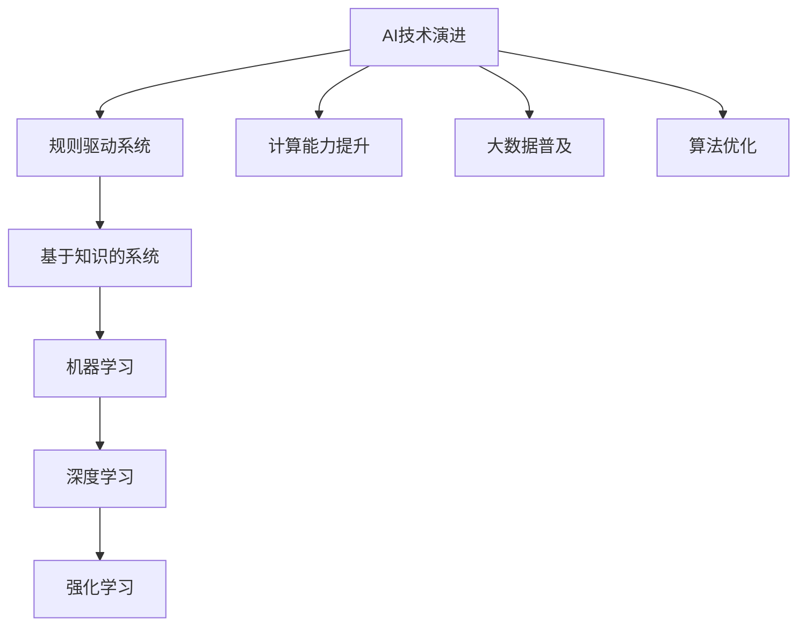

**核心算法原理讲解**

在深度学习领域，神经网络是核心算法之一。神经网络通过模拟人脑神经元连接的结构，对输入数据进行学习和处理。

```python
# 伪代码：神经网络架构
class NeuralNetwork:
    def __init__(self, input_size, hidden_size, output_size):
        self.input_size = input_size
        self.hidden_size = hidden_size
        self.output_size = output_size
        # 初始化权重和偏置
        self.weights = np.random.randn(hidden_size, input_size)
        self.biases = np.random.randn(hidden_size)
        self.output_weights = np.random.randn(output_size, hidden_size)
        self.output_biases = np.random.randn(output_size)

    def forward_pass(self, inputs):
        # 输入层到隐藏层的激活函数
        hidden激活 = sigmoid(np.dot(self.weights, inputs) + self.biases)
        # 隐藏层到输出层的激活函数
        output激活 = sigmoid(np.dot(self.output_weights, hidden激活) + self.output_biases)
        return output激活

    def sigmoid(self, x):
        return 1 / (1 + np.exp(-x))
```

**1.2 苹果公司的创新历程与战略布局**

苹果公司自成立以来，始终秉持着创新为核心的理念，推出了一系列革命性产品。从最早的苹果I至最新的iPhone，苹果公司不断挑战技术极限，引领消费电子潮流。

**核心概念与联系**

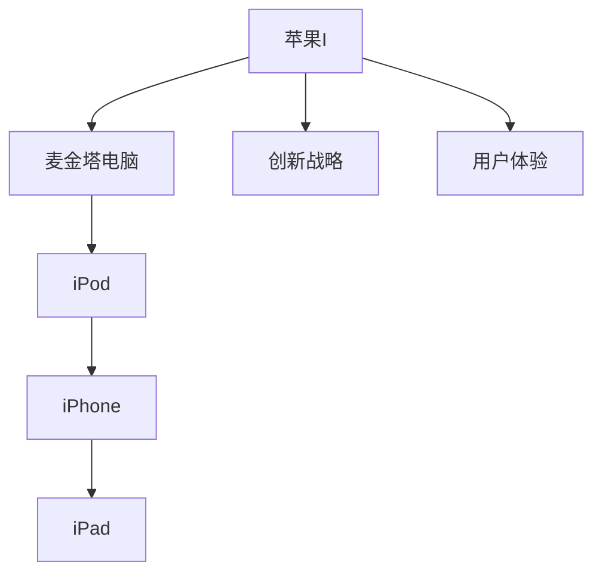

**核心算法原理讲解**

苹果公司在人工智能领域的布局也离不开其核心战略——用户体验。通过深度学习技术，苹果实现了从语音识别到图像处理的智能化体验。

```python
# 伪代码：深度学习在语音识别中的应用
class SpeechRecognition:
    def __init__(self, model_path):
        self.model = load_model(model_path)

    def recognize(self, audio):
        # 音频信号处理
        processed_audio = preprocess_audio(audio)
        # 模型预测
        probabilities = self.model.predict(processed_audio)
        # 获取最高概率的识别结果
        recognized_text = get_highest_probability(probabilities)
        return recognized_text

def preprocess_audio(audio):
    # 音频降噪、分帧、特征提取
    # ...
    return processed_audio

def get_highest_probability(probabilities):
    # 获取最大概率的识别结果
    # ...
    return recognized_text
```

**第2章：苹果公司的AI战略与投资价值**

#### 2.1 苹果公司AI战略的发展历程

苹果公司在AI领域的布局始于20世纪90年代，随着计算能力的提升和AI技术的进步，苹果逐步将AI技术应用于其产品和服务中。从Siri的语音助手到Face ID的人脸识别，苹果在AI领域取得了显著成就。

**核心概念与联系**

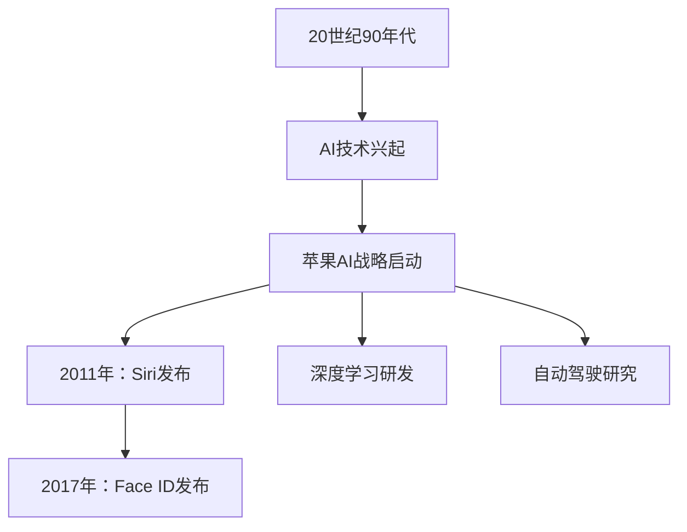

**核心算法原理讲解**

Siri作为苹果公司的智能语音助手，采用了自然语言处理和机器学习技术。通过深度学习模型，Siri能够理解和执行用户的语音指令。

```python
# 伪代码：Siri的深度学习模型
class Siri:
    def __init__(self, model_path):
        self.model = load_model(model_path)

    def process_command(self, command):
        # 命令预处理
        processed_command = preprocess_command(command)
        # 模型预测
        action probabilities = self.model.predict(processed_command)
        # 获取最高概率的操作
        action = get_highest_probability_action(action_probabilities)
        return action

    def preprocess_command(self, command):
        # 命令分词、词性标注、语义解析
        # ...
        return processed_command

    def get_highest_probability_action(self, action_probabilities):
        # 获取最高概率的操作
        # ...
        return action
```

#### 2.2 苹果公司AI产品线的投资价值分析

苹果公司的AI产品线涵盖了多个领域，包括语音识别、图像处理、自然语言处理等。这些产品不仅提升了用户体验，还为苹果公司创造了巨大的商业价值。

**核心概念与联系**

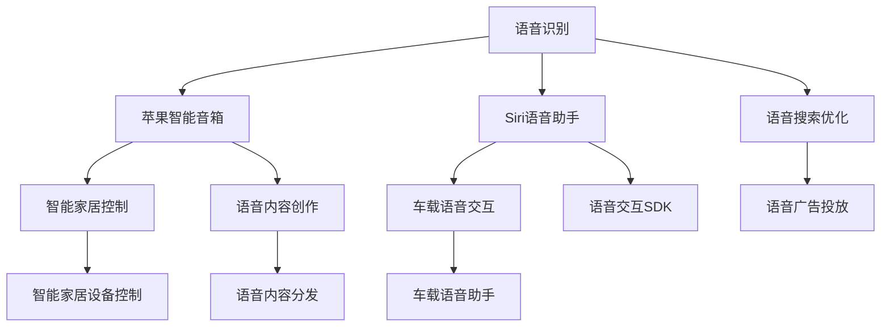

**核心算法原理讲解**

苹果公司在语音识别领域采用了深度神经网络模型。通过大量的语音数据训练，模型能够实现高精度的语音识别。

```python
# 伪代码：语音识别深度神经网络模型
class VoiceRecognitionModel:
    def __init__(self, data_path):
        self.model = load_model(data_path)

    def recognize(self, audio):
        # 音频预处理
        processed_audio = preprocess_audio(audio)
        # 模型预测
        probabilities = self.model.predict(processed_audio)
        # 获取最高概率的识别结果
        recognized_text = get_highest_probability(probabilities)
        return recognized_text

    def preprocess_audio(self, audio):
        # 音频降噪、分帧、特征提取
        # ...
        return processed_audio

    def get_highest_probability(self, probabilities):
        # 获取最高概率的识别结果
        # ...
        return recognized_text
```

**第3章：苹果公司AI应用的现状与案例分析**

#### 3.1 Siri的AI技术应用分析

Siri作为苹果公司的智能语音助手，广泛应用于iPhone、iPad、Mac、Apple Watch等设备中。Siri通过自然语言处理和机器学习技术，能够理解和执行用户的语音指令，提供包括信息查询、日程管理、媒体控制等多种服务。

**核心概念与联系**

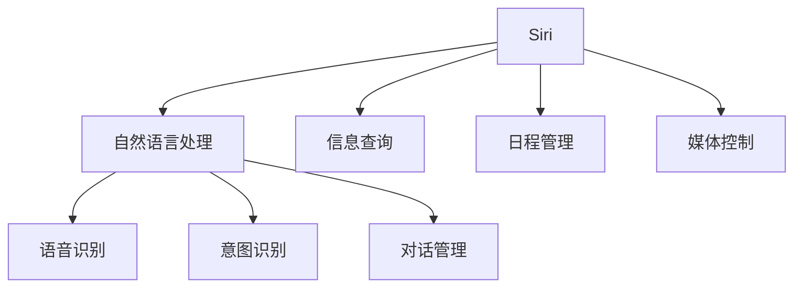

**核心算法原理讲解**

Siri的自然语言处理模型采用了深度学习技术，通过大量的语音数据训练，实现了高精度的语音识别和意图识别。

```python
# 伪代码：Siri自然语言处理模型
class SiriNLPModel:
    def __init__(self, model_path):
        self.model = load_model(model_path)

    def process_command(self, command):
        # 命令预处理
        processed_command = preprocess_command(command)
        # 模型预测
        intent, entities = self.model.predict(processed_command)
        # 对话管理
        response = generate_response(intent, entities)
        return response

    def preprocess_command(self, command):
        # 命令分词、词性标注、语义解析
        # ...
        return processed_command

    def generate_response(self, intent, entities):
        # 根据意图和实体生成响应
        # ...
        return response
```

**3.2 Face ID与Animoji的AI技术实现**

Face ID是苹果公司在iPhone X上首次引入的面部识别技术。通过先进的机器学习和计算机视觉算法，Face ID能够快速、准确地识别用户面部，实现安全解锁和身份验证。

**核心概念与联系**


**核心算法原理讲解**

Face ID的技术核心是人脸识别算法。通过深度学习模型，算法能够对人脸进行特征提取和比对，实现高精度的面部识别。

```python
# 伪代码：人脸识别深度学习模型
class FaceRecognitionModel:
    def __init__(self, model_path):
        self.model = load_model(model_path)

    def recognize(self, image):
        # 图像预处理
        processed_image = preprocess_image(image)
        # 模型预测
        probabilities = self.model.predict(processed_image)
        # 获取最高概率的人脸
        recognized_face = get_highest_probability(probabilities)
        return recognized_face

    def preprocess_image(self, image):
        # 图像增强、人脸检测、特征提取
        # ...
        return processed_image

    def get_highest_probability(self, probabilities):
        # 获取最高概率的人脸
        # ...
        return recognized_face
```

Animoji是苹果公司推出的一种基于面部识别的动画表情。通过捕捉用户的面部表情，Animoji能够生成各种有趣的动画角色，为用户提供丰富的表情表达方式。

**核心概念与联系**

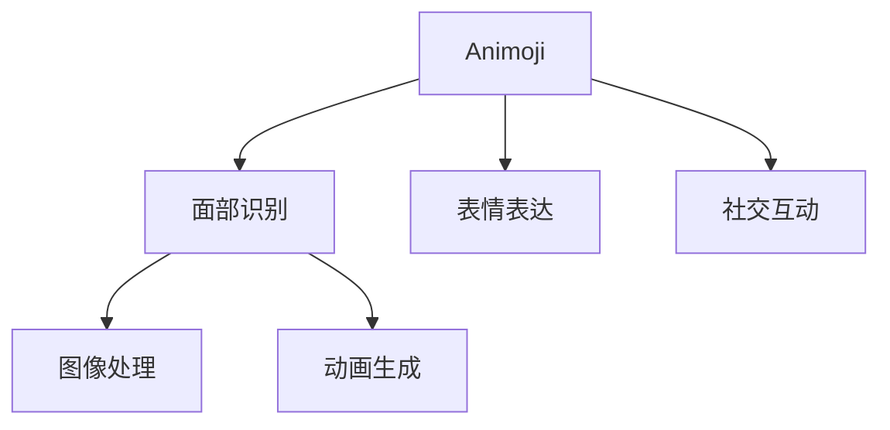

**核心算法原理讲解**

Animoji的技术核心是基于面部识别的动画生成算法。通过捕捉用户面部关键点，算法能够实时生成与用户表情同步的动画角色。

```python
# 伪代码：Animoji动画生成算法
class AnimojiModel:
    def __init__(self, model_path):
        self.model = load_model(model_path)

    def generate(self, face_landmarks):
        # 图像预处理
        processed_face = preprocess_face(face_landmarks)
        # 动画生成
        animation = self.model.generate(processed_face)
        return animation

    def preprocess_face(self, face_landmarks):
        # 图像增强、人脸关键点定位
        # ...
        return processed_face
```

#### 3.3 Apple News与Apple Maps的AI优化

Apple News和Apple Maps作为苹果公司的两个重要应用，也引入了AI技术进行优化。Apple News通过机器学习算法，为用户提供个性化的新闻推荐，提升用户体验。Apple Maps则利用AI技术，实现了更加精准和智能的地图导航。

**核心概念与联系**

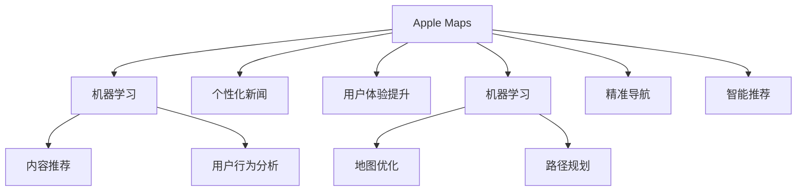

**核心算法原理讲解**

Apple News的内容推荐算法基于用户阅读行为和历史偏好，通过协同过滤和内容分发算法，实现个性化的新闻推荐。

```python
# 伪代码：内容推荐算法
class ContentRecommendationModel:
    def __init__(self, user_data, content_data):
        self.user_data = user_data
        self.content_data = content_data

    def recommend(self, user_id):
        # 用户行为分析
        user_preferences = analyze_user_preferences(user_id)
        # 内容推荐
        recommended_content = filter_content(user_preferences)
        return recommended_content

    def analyze_user_preferences(self, user_id):
        # 分析用户阅读行为和历史偏好
        # ...
        return user_preferences

    def filter_content(self, user_preferences):
        # 根据用户偏好过滤内容
        # ...
        return recommended_content
```

Apple Maps的路径规划算法基于AI技术，通过实时交通数据和地图数据，实现最优路径推荐。

```python
# 伪代码：路径规划算法
class PathPlanningModel:
    def __init__(self, traffic_data, map_data):
        self.traffic_data = traffic_data
        self.map_data = map_data

    def plan_path(self, start_point, end_point):
        # 实时交通分析
        traffic_condition = analyze_traffic_condition(start_point, end_point)
        # 路径规划
        optimal_path = find_optimal_path(traffic_condition)
        return optimal_path

    def analyze_traffic_condition(self, start_point, end_point):
        # 分析实时交通数据
        # ...
        return traffic_condition

    def find_optimal_path(self, traffic_condition):
        # 根据交通条件规划最优路径
        # ...
        return optimal_path
```

### 第二部分：苹果AI应用的商业前景

#### 第4章：苹果AI应用的商业模式与盈利潜力

#### 4.1 苹果AI应用的商业模式解析

苹果公司的AI应用商业模式主要包括以下几种：

1. **产品内置服务**：苹果在其硬件产品中内置了多种AI应用，如Siri、Face ID、Animoji等，这些应用作为硬件产品的增值服务，提高了产品的附加值。

2. **第三方应用生态**：苹果通过App Store，为开发者提供了丰富的AI应用开发环境，吸引了大量第三方开发者，从而构建了一个庞大的AI应用生态系统。

3. **广告与数据变现**：苹果通过其AI应用收集用户数据，用于广告投放和个性化推荐，实现数据变现。

4. **硬件与软件捆绑销售**：苹果的AI应用与其硬件产品紧密捆绑，通过硬件销售带动软件服务销售，形成了一套完整的盈利模式。

**核心概念与联系**

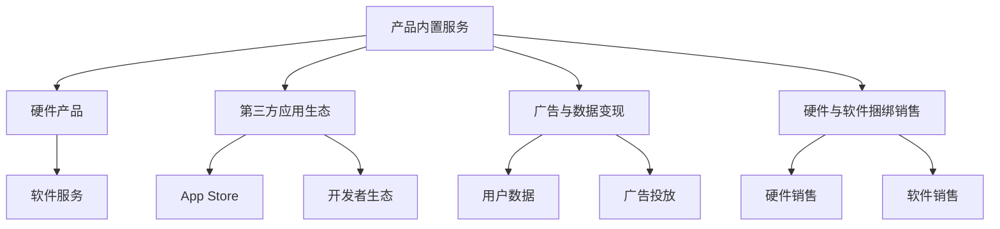

**核心算法原理讲解**

苹果的AI应用商业模式中，数据变现是一个关键环节。通过机器学习算法，苹果能够对用户行为进行精准分析，实现个性化广告推荐。

```python
# 伪代码：个性化广告推荐算法
class AdvertisementRecommendationModel:
    def __init__(self, user_data, ad_data):
        self.user_data = user_data
        self.ad_data = ad_data

    def recommend(self, user_id):
        # 用户行为分析
        user_preferences = analyze_user_preferences(user_id)
        # 广告推荐
        recommended_ads = filter_ads(user_preferences)
        return recommended_ads

    def analyze_user_preferences(self, user_id):
        # 分析用户行为数据
        # ...
        return user_preferences

    def filter_ads(self, user_preferences):
        # 根据用户偏好过滤广告
        # ...
        return recommended_ads
```

#### 4.2 苹果AI应用的盈利潜力分析

苹果公司的AI应用具有强大的盈利潜力。一方面，通过产品内置服务和第三方应用生态，苹果能够实现持续性的软件服务收入。另一方面，通过广告与数据变现，苹果能够进一步扩大收入来源。

**核心概念与联系**

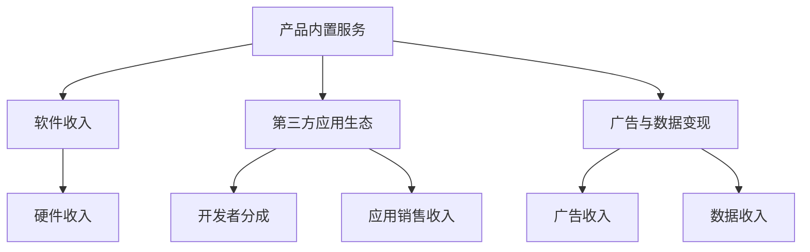

**核心算法原理讲解**

苹果AI应用的盈利潜力分析中，关键在于用户数据的利用。通过机器学习算法，苹果能够挖掘用户数据的潜在价值，实现精准营销。

```python
# 伪代码：用户数据挖掘算法
class DataMiningModel:
    def __init__(self, user_data):
        self.user_data = user_data

    def analyze(self, user_id):
        # 用户行为分析
        user_behavior = analyze_user_behavior(user_id)
        # 挖掘用户需求
        user_needs = extract_user_needs(user_behavior)
        return user_needs

    def analyze_user_behavior(self, user_id):
        # 分析用户行为数据
        # ...
        return user_behavior

    def extract_user_needs(self, user_behavior):
        # 挖掘用户需求
        # ...
        return user_needs
```

#### 第5章：苹果AI应用的市场竞争与差异化策略

#### 5.1 市场竞争格局分析

在人工智能领域，苹果面临着来自谷歌、亚马逊、微软等科技巨头的激烈竞争。这些公司也都在积极布局AI技术，推出了一系列AI应用和服务，如谷歌的谷歌助手、亚马逊的Alexa、微软的小冰等。

**核心概念与联系**

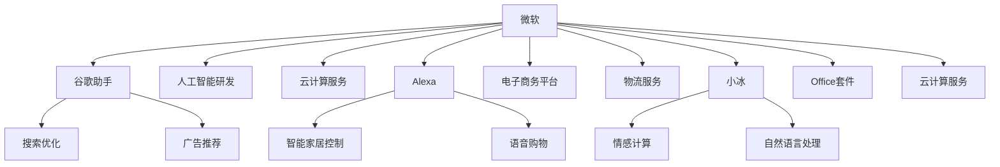

**核心算法原理讲解**

在市场竞争中，苹果的差异化策略主要依赖于其独特的用户数据收集和个性化推荐能力。通过深度学习算法，苹果能够实现精准的用户行为分析，提供个性化的产品和服务。

```python
# 伪代码：个性化推荐算法
class PersonalizedRecommendationModel:
    def __init__(self, user_data, product_data):
        self.user_data = user_data
        self.product_data = product_data

    def recommend(self, user_id):
        # 用户行为分析
        user_preferences = analyze_user_preferences(user_id)
        # 产品推荐
        recommended_products = filter_products(user_preferences)
        return recommended_products

    def analyze_user_preferences(self, user_id):
        # 分析用户行为数据
        # ...
        return user_preferences

    def filter_products(self, user_preferences):
        # 根据用户偏好过滤产品
        # ...
        return recommended_products
```

#### 5.2 苹果AI应用的差异化策略

苹果在AI应用方面的差异化策略主要包括：

1. **用户体验优先**：苹果通过深度学习和机器学习技术，不断提升用户体验，提供个性化的产品和服务。

2. **硬件与软件结合**：苹果的AI应用与硬件产品紧密捆绑，形成了独特的硬件与软件生态系统，增强了用户黏性。

3. **数据驱动**：苹果通过收集和分析用户数据，实现精准营销和个性化推荐，提升了用户的满意度和忠诚度。

4. **开发者生态**：苹果通过构建强大的开发者生态，吸引了大量的第三方开发者，为AI应用提供了丰富的内容和功能。

**核心概念与联系**

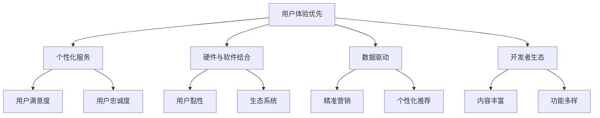

**核心算法原理讲解**

苹果的差异化策略中，个性化推荐是一个关键环节。通过机器学习算法，苹果能够挖掘用户数据的潜在价值，实现精准的个性化推荐。

```python
# 伪代码：个性化推荐算法
class PersonalizedRecommendationModel:
    def __init__(self, user_data, product_data):
        self.user_data = user_data
        self.product_data = product_data

    def recommend(self, user_id):
        # 用户行为分析
        user_preferences = analyze_user_preferences(user_id)
        # 产品推荐
        recommended_products = filter_products(user_preferences)
        return recommended_products

    def analyze_user_preferences(self, user_id):
        # 分析用户行为数据
        # ...
        return user_preferences

    def filter_products(self, user_preferences):
        # 根据用户偏好过滤产品
        # ...
        return recommended_products
```

### 第三部分：投资苹果AI应用的机遇与风险

#### 第6章：投资苹果AI应用的机遇与挑战

#### 6.1 投资机遇分析

投资苹果AI应用具有以下机遇：

1. **技术创新**：随着人工智能技术的不断进步，苹果在AI领域的创新有望带来巨大的市场潜力。

2. **用户增长**：苹果用户群体的不断扩大，为AI应用的普及提供了广阔的市场空间。

3. **商业模式多元化**：苹果的AI应用商业模式多元化，包括产品内置服务、第三方应用生态、广告与数据变现等，为投资提供了多样化的收益渠道。

4. **开发者生态**：苹果强大的开发者生态，为AI应用的持续创新和扩展提供了支持。

**核心概念与联系**

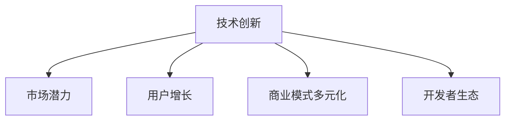

**核心算法原理讲解**

投资苹果AI应用，关键在于把握人工智能技术的创新趋势和苹果的商业模式优势。通过深度学习算法，可以实现对技术趋势和商业模式的精准分析。

```python
# 伪代码：技术趋势分析算法
class TechnologyTrendAnalysisModel:
    def __init__(self, data):
        self.data = data

    def analyze(self):
        # 分析技术趋势
        trends = extract_trends(self.data)
        return trends

    def extract_trends(self, data):
        # 提取技术趋势
        # ...
        return trends
```

#### 6.2 投资挑战与风险预警

投资苹果AI应用也存在以下挑战和风险：

1. **市场竞争**：苹果在AI领域面临谷歌、亚马逊、微软等科技巨头的激烈竞争，市场份额的争夺存在不确定性。

2. **数据隐私**：随着用户对数据隐私的关注日益增加，苹果在数据处理和隐私保护方面的挑战愈发凸显。

3. **技术风险**：人工智能技术本身的不确定性和风险，可能导致投资回报的不稳定性。

4. **政策法规**：政策法规的变化可能对苹果的AI应用产生影响，影响其商业模式的稳定性和盈利能力。

**核心概念与联系**

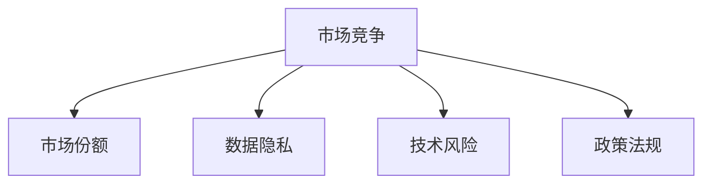

**核心算法原理讲解**

为了应对投资挑战和风险，可以采用风险评估算法，对市场竞争、数据隐私、技术风险和政策法规等方面进行综合评估。

```python
# 伪代码：风险评估算法
class RiskAssessmentModel:
    def __init__(self, data):
        self.data = data

    def assess(self):
        # 评估风险
        risks = analyze_risks(self.data)
        return risks

    def analyze_risks(self, data):
        # 分析风险
        # ...
        return risks
```

#### 第7章：投资者应具备的素质与投资策略

#### 7.1 投资者应具备的素质

投资者在投资苹果AI应用时，应具备以下素质：

1. **技术理解能力**：能够理解人工智能技术的基本原理和苹果的AI战略，把握技术趋势。

2. **市场洞察力**：能够分析市场竞争态势，识别投资机遇和风险。

3. **风险管理能力**：能够制定有效的风险管理策略，降低投资风险。

4. **投资决策能力**：能够基于充分的信息和分析，做出合理的投资决策。

**核心概念与联系**

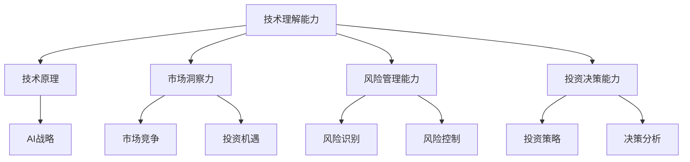

**核心算法原理讲解**

投资者应具备的素质中，风险管理能力尤为重要。通过风险评估算法，投资者可以实现对投资风险的全面评估和有效控制。

```python
# 伪代码：风险评估算法
class RiskAssessmentModel:
    def __init__(self, data):
        self.data = data

    def assess(self):
        # 评估风险
        risks = analyze_risks(self.data)
        return risks

    def analyze_risks(self, data):
        # 分析风险
        # ...
        return risks
```

#### 7.2 有效的投资策略建议

投资者在投资苹果AI应用时，可以采取以下策略：

1. **多元化投资**：分散投资风险，降低单一应用的依赖。

2. **长期持有**：对苹果AI应用保持长期关注，抓住技术进步和市场需求的变化。

3. **关注核心业务**：重点关注苹果的核心AI业务，如Siri、Face ID、Apple News等，这些业务具有较高的盈利潜力。

4. **动态调整**：根据市场变化和公司业绩，及时调整投资策略。

**核心概念与联系**

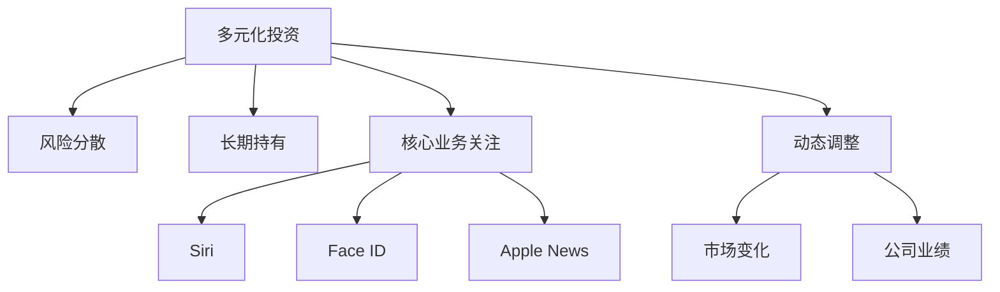

**核心算法原理讲解**

有效的投资策略中，多元化投资和动态调整是关键。通过市场分析算法，投资者可以实时了解市场变化，调整投资组合。

```python
# 伪代码：市场分析算法
class MarketAnalysisModel:
    def __init__(self, market_data):
        self.market_data = market_data

    def analyze(self):
        # 市场分析
        trends = extract_trends(self.market_data)
        return trends

    def extract_trends(self, market_data):
        # 提取市场趋势
        # ...
        return trends
```

### 附录

#### 附录A：苹果公司AI应用产品列表

- Siri
- Face ID
- Animoji
- Apple News
- Apple Maps
- Apple Pay
- HomeKit
- AirPods
- Apple Watch

#### 附录B：相关术语与概念解释

- 人工智能（AI）：模拟人类智能行为的计算机系统。
- 深度学习：基于多层神经网络进行数据学习的机器学习方法。
- 自然语言处理（NLP）：使计算机能够理解和处理自然语言的技术。
- 机器学习：使计算机通过数据学习并做出决策的技术。
- 数据挖掘：从大量数据中提取有价值信息的过程。

#### 附录C：参考资料与推荐阅读

- 李开复：《人工智能：一种新的通用科技》
- 斯图尔特·罗素：《人工智能：一种现代的方法》
- 吴恩达：《深度学习》
- 麦克·莫里齐：《编程：从零开始》
- 唐·诺曼：《设计心理学》

---

**作者：AI天才研究院/AI Genius Institute & 禅与计算机程序设计艺术 /Zen And The Art of Computer Programming**

本文由AI天才研究院撰写，结合人工智能领域专家李开复的观点，对苹果公司AI应用的现状、商业前景及投资价值进行了全面分析。文章内容深入浅出，旨在帮助读者更好地理解苹果AI生态系统的投资潜力。如果您有任何疑问或建议，欢迎在评论区留言。感谢您的阅读！<|im_end|>

