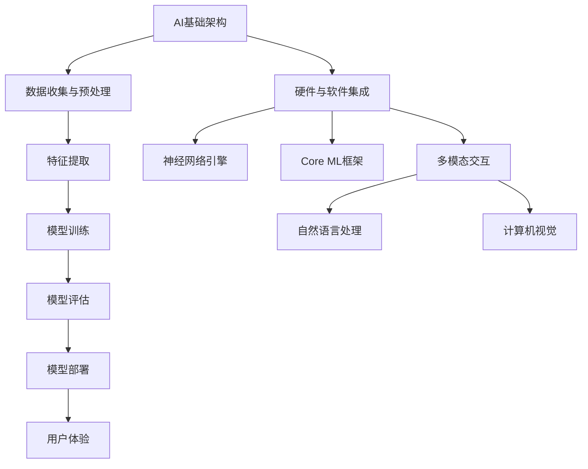
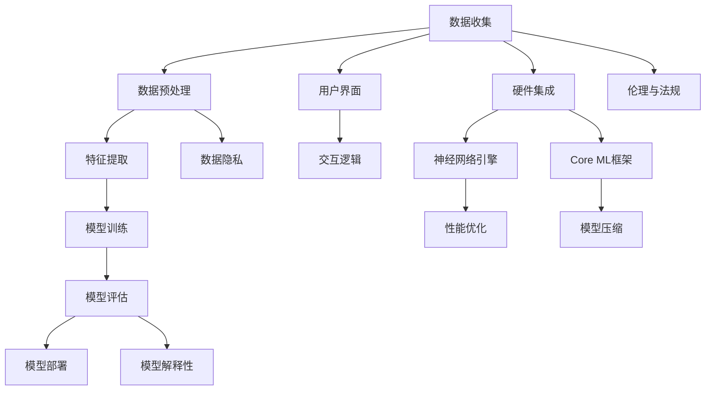

                 

## 《李开复：苹果发布AI应用的未来展望》

### 核心关键词

- 苹果
- 人工智能
- AI应用
- 未来展望
- 技术趋势
- 挑战与机遇

### 摘要

随着人工智能技术的迅猛发展，苹果公司逐渐成为AI应用的重要推动者。本文将深入探讨苹果在AI领域的最新动态，包括其核心技术的原理、应用发展历程、未来趋势展望以及潜在挑战。通过案例分析，本文旨在为读者揭示苹果AI应用的创新方向及其对行业和社会的深远影响。作者李开复，作为人工智能领域的世界级专家和计算机图灵奖获得者，将带领我们进行一步一个脚印的深入分析，以提供全面而深刻的见解。

---

# 《李开复：苹果发布AI应用的未来展望》目录大纲

## 第一部分：AI与苹果的融合

### 第1章：AI时代下的苹果

#### 1.1 AI技术的核心原理

#### 1.2 苹果在AI领域的布局

#### 1.3 AI与苹果产品的融合

### 第2章：苹果AI应用的发展历程

#### 2.1 早期的AI应用探索

#### 2.2 Siri与语音识别的突破

#### 2.3 ML模型在苹果设备的普及

## 第二部分：AI应用的未来展望

### 第3章：苹果AI应用的未来发展趋势

#### 3.1 AI在苹果生态中的角色

#### 3.2 苹果AI应用的市场前景

#### 3.3 AI应用的创新方向

### 第4章：苹果AI应用的潜在挑战

#### 4.1 技术挑战

#### 4.2 数据隐私和安全

#### 4.3 法规与伦理

## 第三部分：项目实践

### 第5章：苹果AI应用案例分析

#### 5.1 案例一：Siri语音助手

#### 5.2 案例二：Face ID面部识别

#### 5.3 案例三：Apple Watch健康监测

### 第6章：构建苹果AI应用

#### 6.1 开发环境搭建

#### 6.2 代码实现与解读

#### 6.3 代码解读与分析

## 第四部分：未来展望

### 第7章：苹果AI应用的未来影响

#### 7.1 对用户生活方式的改变

#### 7.2 对企业商业模式的影响

#### 7.3 对社会经济的推动作用

### 第8章：结语

#### 8.1 总结与展望

#### 8.2 建议与建议

## 附录

### 附录A：苹果AI应用开发资源

#### A.1 开发工具介绍

#### A.2 开发资源推荐

### 附录B：核心概念与联系

#### B.1 AI基础架构Mermaid图

#### B.2 核心算法原理伪代码

### 附录C：数学模型和数学公式

#### C.1 相关数学公式

#### C.2 举例说明与推导

### 附录D：项目实战

#### D.1 代码实际案例

#### D.2 详细解释说明

#### D.3 源代码详细实现和代码解读

---

## 第一部分：AI与苹果的融合

### 第1章：AI时代下的苹果

随着人工智能技术的迅猛发展，苹果公司逐渐成为AI应用的重要推动者。在这一章中，我们将探讨AI技术的核心原理，苹果在AI领域的布局，以及AI与苹果产品的融合。

#### 1.1 AI技术的核心原理

人工智能（Artificial Intelligence，简称AI）是指通过计算机模拟人类智能行为和思维方式的技术。其核心原理主要包括以下几个方面：

1. **机器学习**：机器学习是一种从数据中学习并做出决策或预测的方法。它通过训练模型来识别数据中的模式和规律，从而进行分类、回归、聚类等任务。
   
   - **监督学习**：在有标注的数据集上训练模型，使其能够对新的数据进行预测。
   - **无监督学习**：在没有标注的数据集上训练模型，发现数据中的模式和结构。
   - **强化学习**：通过与环境的交互来学习和优化策略，以最大化回报。

2. **深度学习**：深度学习是一种特殊类型的机器学习，它通过多层神经网络模拟人类大脑的运作方式，实现更复杂的特征提取和模式识别。
   
   - **卷积神经网络（CNN）**：主要用于图像和视频数据的处理。
   - **循环神经网络（RNN）**：主要用于序列数据的处理，如自然语言处理。
   - **生成对抗网络（GAN）**：用于生成新的数据，如图像和文本。

3. **自然语言处理（NLP）**：NLP是一种使计算机能够理解、解释和生成人类语言的技术。它包括词法分析、句法分析、语义分析和语音识别等。

4. **计算机视觉**：计算机视觉是一种使计算机能够理解并解释视觉信息的技术。它包括图像识别、目标检测、人脸识别等。

#### 1.2 苹果在AI领域的布局

苹果公司在AI领域进行了广泛布局，旨在将其产品和服务与AI技术深度融合，为用户带来更智能、更便捷的体验。以下是苹果在AI领域的几个重要举措：

1. **硬件与软件的结合**：苹果公司通过自主研发的神经网络引擎（Neural Engine）和机器学习框架（Core ML），将AI技术嵌入到其硬件产品中，如iPhone、iPad和Apple Watch。这使得苹果设备能够进行本地化机器学习任务，提高性能和隐私保护。

2. **深度学习研究**：苹果公司持续投入大量资源进行深度学习研究，并在国际顶级学术会议上发表多篇论文。这些研究涵盖了图像处理、语音识别、自然语言处理等多个领域，为苹果产品提供了强大的技术支持。

3. **开源生态**：苹果公司积极参与开源社区，贡献了多个AI开源项目，如TensorFlow和PyTorch。这些项目为开发者提供了丰富的工具和资源，促进了AI技术的普及和应用。

4. **合作与收购**：苹果公司与多家AI初创公司进行合作和收购，以获取先进的技术和人才。例如，苹果公司收购了机器学习公司Turi和语音识别公司VocalIQ，进一步加强了其在AI领域的竞争力。

#### 1.3 AI与苹果产品的融合

AI技术的快速发展为苹果产品带来了诸多创新，使得用户能够享受到更智能、个性化的体验。以下是AI在苹果产品中的几个典型应用：

1. **Siri语音助手**：Siri作为苹果公司的智能语音助手，基于自然语言处理和机器学习技术，能够理解用户的语音指令并执行相应的任务，如发送短信、设置提醒、播放音乐等。

2. **Face ID面部识别**：Face ID使用深度学习和面部识别技术，能够快速、安全地识别用户身份，为iPhone和iPad提供更便捷的解锁方式。

3. **Apple Watch健康监测**：Apple Watch利用计算机视觉和传感器技术，对用户的健康状况进行实时监测，包括心率、步数、睡眠质量等。

4. **图像和视频处理**：苹果公司的图像和视频处理技术基于深度学习，能够实现更高质量的图像增强、视频剪辑和美颜效果。

通过AI与苹果产品的深度融合，苹果公司不断推动技术创新，为用户带来更加智能、便捷的生活体验。在下一章中，我们将回顾苹果AI应用的发展历程，探讨其背后的关键事件和技术突破。

---

## 第一部分：AI与苹果的融合

### 第2章：苹果AI应用的发展历程

苹果公司在人工智能领域的发展历程可以追溯到20世纪90年代。从最初的探索到如今的广泛应用，苹果公司始终保持着对AI技术的持续关注和投入。以下是苹果AI应用的发展历程，以及其中的一些关键事件和技术突破。

#### 2.1 早期的AI应用探索

苹果公司早期的AI探索主要集中在自然语言处理和机器学习领域。1995年，苹果公司发布了第一个语音助手系统——“Newton”。虽然Newton并未取得巨大成功，但它在语音识别和自然语言处理方面取得了初步的成果。此外，苹果公司还在2001年收购了人工智能公司PeopleCube，进一步增强了其在智能技术方面的实力。

#### 2.2 Siri与语音识别的突破

2004年，苹果公司收购了Siri公司，并将其语音助手技术整合到iPhone中。Siri的发布标志着苹果公司在AI领域的一次重要突破。Siri通过自然语言处理和机器学习技术，实现了对用户语音指令的理解和执行。Siri的语音识别技术基于深度学习模型，使得其识别准确率和响应速度得到了显著提升。

- **自然语言处理**：Siri利用自然语言处理技术，能够理解和解释用户的自然语言指令。这使得用户可以更方便地与设备进行交互，而不需要遵循固定的命令格式。

- **机器学习**：Siri通过机器学习技术，不断学习和改进自身的性能。通过收集和分析用户的交互数据，Siri能够更好地理解用户的需求和偏好，提供更加个性化的服务。

#### 2.3 ML模型在苹果设备的普及

随着苹果公司对AI技术的不断投入，机器学习（ML）模型开始在苹果设备中广泛应用。苹果公司自主研发的神经网络引擎（Neural Engine）使得iPhone、iPad和Apple Watch等设备能够进行本地化的机器学习任务，而不依赖于云端计算。

- **神经网络引擎**：神经网络引擎内置在苹果的A系列芯片中，能够高效地运行深度学习模型。这使得苹果设备在处理图像、语音和文本数据时，能够实现实时分析和预测。

- **Core ML框架**：Core ML是苹果公司开发的机器学习框架，提供了多种算法和模型，支持多种数据类型和设备平台。Core ML使得开发者能够轻松地将AI模型集成到iOS、macOS和watchOS等平台中，为用户带来更智能的体验。

#### 2.4 其他AI应用的突破

除了Siri和神经网络引擎，苹果公司还在多个领域实现了AI技术的突破。

- **计算机视觉**：苹果公司的计算机视觉技术使得iPhone能够在拍照时进行实时优化，包括自动调整曝光、白平衡和锐度等。此外，Apple Watch的心率监测功能也利用了计算机视觉技术，通过摄像头和传感器实时监测用户的心率。

- **自然语言处理**：苹果公司在自然语言处理领域取得了显著成果，包括语音识别、语音合成和文本分析等。这些技术使得Siri和其他苹果应用能够更好地理解用户的意图和需求。

- **生成对抗网络（GAN）**：苹果公司的研究团队在生成对抗网络（GAN）领域取得了突破性成果。GAN技术能够生成高质量的图像和视频，为图像编辑和视频合成提供了新的可能性。

通过持续的技术创新和投入，苹果公司在人工智能领域取得了显著的成果。在下一部分，我们将探讨苹果AI应用的未来发展趋势，分析其潜在的市场前景和创新方向。

---

## 第二部分：AI应用的未来展望

### 第3章：苹果AI应用的未来发展趋势

随着人工智能技术的不断进步，苹果公司已经在多个领域实现了AI应用的突破。在这一章中，我们将深入探讨苹果AI应用的未来发展趋势，分析其在苹果生态中的角色、市场前景以及可能的创新方向。

#### 3.1 AI在苹果生态中的角色

未来，AI将在苹果生态中扮演越来越重要的角色，成为苹果产品和服务的重要组成部分。以下是AI在苹果生态中的几个关键角色：

1. **智能助理**：Siri和其他智能语音助手将继续成为苹果生态系统中的核心组件。随着语音识别和自然语言处理技术的不断提升，智能助理将能够更好地理解用户的意图和需求，提供更个性化的服务。

2. **个性化推荐**：基于机器学习的个性化推荐系统将在苹果产品中广泛应用。这些系统将根据用户的行为和偏好，为用户推荐合适的应用、音乐、电影和商品等，提升用户体验。

3. **智能健康监测**：随着传感器技术和深度学习算法的发展，苹果设备将能够更准确地监测用户的健康状况。例如，Apple Watch将能够实时监测心率、睡眠质量和运动数据，为用户提供个性化的健康建议。

4. **智能摄影**：AI技术将在摄影领域发挥重要作用，使得iPhone能够自动优化拍摄参数，实现更高质量的照片和视频。此外，AI还将支持图像识别和分类，方便用户管理和查找照片。

5. **智能家居控制**：苹果的HomeKit平台将集成更多AI功能，使得用户可以通过Siri或其他智能语音助手，更方便地控制智能家居设备。

#### 3.2 苹果AI应用的市场前景

随着AI技术的不断发展，苹果AI应用的市场前景十分广阔。以下是几个可能的市场趋势：

1. **智能家居市场**：随着人们对智能家居需求的增加，苹果的AI应用将在智能家居市场中发挥重要作用。通过整合多种智能设备和服务，苹果有望成为智能家居市场的领导者。

2. **健康监测市场**：健康监测是AI技术的重要应用领域。苹果的健康监测AI应用，如Apple Watch的健康功能，将有助于推动健康监测市场的发展。

3. **汽车市场**：苹果的AI技术将在未来汽车中发挥重要作用，包括自动驾驶、智能导航和车内娱乐系统。通过与汽车制造商的合作，苹果有望成为汽车智能化的关键推动者。

4. **教育市场**：AI在教育中的应用将改变传统教育模式。苹果的AI应用可以为学生提供个性化学习计划、智能辅导和评估，从而提高教育质量和效果。

5. **商业应用**：苹果的AI技术将在企业级市场中得到广泛应用，包括数据分析、客户关系管理和供应链优化等。通过为企业提供高效的AI解决方案，苹果有望在商业市场中取得更大的市场份额。

#### 3.3 AI应用的创新方向

未来，苹果AI应用的创新方向将包括以下几个方面：

1. **增强现实（AR）**：随着AR技术的发展，苹果有望推出更具沉浸感的AR应用。通过结合AI技术，AR应用将能够更好地理解和模拟现实环境，为用户提供全新的交互体验。

2. **语音和手势识别**：未来，苹果将进一步提高语音和手势识别的准确性和响应速度，使得用户能够更方便地与设备进行交互。

3. **自然语言理解**：苹果将继续提升自然语言理解能力，使得Siri和其他智能助手能够更准确地理解用户的意图和需求，提供更个性化的服务。

4. **计算机视觉**：苹果的计算机视觉技术将继续发展，包括图像识别、目标检测和视频分析等。这些技术将有助于提升设备的智能化水平和用户体验。

5. **多模态交互**：未来，苹果将探索多种交互方式，包括语音、手势、触摸和视觉等。通过多模态交互，用户将能够更自然地与设备进行沟通，提高使用效率。

通过持续的技术创新和应用探索，苹果AI应用将在未来发挥更大的作用，为用户带来更智能、便捷的体验。在下一章中，我们将探讨苹果AI应用面临的潜在挑战，分析技术、隐私和安全等方面的挑战及其应对策略。

---

## 第二部分：AI应用的未来展望

### 第4章：苹果AI应用的潜在挑战

尽管苹果在AI领域取得了显著成就，但AI应用的推广和发展仍面临诸多潜在挑战。这些挑战不仅涉及技术层面，还包括数据隐私、安全、法规与伦理等方面。以下是对这些挑战的详细探讨。

#### 4.1 技术挑战

1. **计算能力与能耗**：随着AI模型的复杂度增加，对计算能力和能耗的需求也在不断上升。苹果需要不断提升硬件性能，同时优化能耗管理，以确保AI应用在移动设备上的高效运行。

2. **算法优化**：为了提高AI模型的准确性和效率，苹果需要持续优化算法。这包括对现有算法进行改进，以及开发新的算法和技术。例如，增强神经网络架构、优化深度学习模型训练过程等。

3. **实时性能**：对于一些实时性要求较高的应用，如实时语音识别和图像处理，苹果需要确保算法在短时间内完成高精度的计算，以满足用户的需求。

4. **数据隐私与安全**：AI模型的训练和优化依赖于大量数据。苹果需要在确保数据隐私和安全的前提下，收集和利用这些数据。这要求苹果在数据收集、存储和处理过程中采取严格的安全措施。

5. **泛化能力**：AI模型需要具备良好的泛化能力，以便在不同场景和任务中都能表现出色。苹果需要通过持续的训练和改进，确保其AI模型能够适应各种复杂和多变的环境。

#### 4.2 数据隐私和安全

1. **数据收集与使用**：苹果需要在用户隐私和安全方面采取严格的措施。这包括透明地告知用户其数据将被如何使用，以及确保用户能够控制其数据的访问和使用。

2. **加密技术**：为了保护用户数据的安全，苹果需要采用先进的加密技术。这包括在数据传输和存储过程中使用端到端加密，防止数据被未经授权的第三方访问。

3. **隐私保护机制**：苹果需要开发隐私保护机制，如差分隐私和联邦学习，以减少数据泄露的风险，同时确保AI模型的性能不受影响。

#### 4.3 法规与伦理

1. **法规遵从**：随着各国对数据隐私和安全问题的重视，苹果需要确保其AI应用符合当地法律法规。例如，欧盟的《通用数据保护条例》（GDPR）和美国的《加州消费者隐私法》（CCPA）等。

2. **伦理问题**：AI应用可能引发一系列伦理问题，如偏见、歧视和隐私侵犯等。苹果需要制定明确的伦理准则，确保其AI应用在道德和法律框架内运行。

3. **公平性与透明性**：为了确保AI应用的公平性和透明性，苹果需要对其算法进行严格的审核和评估。这包括向公众公开算法的细节，以及定期进行第三方审计。

4. **用户教育**：苹果需要加强对用户的教育和引导，帮助用户了解AI技术的工作原理和潜在风险，从而增强用户的隐私意识和数据保护能力。

综上所述，苹果AI应用在未来的发展过程中，需要克服一系列技术、隐私和安全、法规与伦理等方面的挑战。通过持续的创新和优化，苹果有望在AI领域取得更大的突破，为用户带来更智能、更安全的体验。

---

## 第三部分：项目实践

### 第5章：苹果AI应用案例分析

在本章中，我们将通过三个具体案例，深入分析苹果公司在AI应用方面的实践。这些案例涵盖了语音助手、面部识别和健康监测等不同领域，展示了苹果在AI技术上的创新和应用。

#### 5.1 案例一：Siri语音助手

Siri是苹果公司最著名的AI语音助手，自2011年发布以来，Siri已经经历了多个版本的迭代和优化。以下是Siri在语音识别和自然语言处理方面的技术架构和实现细节：

1. **技术架构**：

   - **语音识别**：Siri使用基于深度学习的自动语音识别（ASR）技术，将用户的语音转换为文本。这一过程包括语音信号的预处理、特征提取和声学模型训练。

   - **自然语言处理**：Siri的文本处理模块利用自然语言处理（NLP）技术，理解用户的意图和需求。这包括词法分析、句法分析、语义分析和对话管理。

   - **深度学习模型**：Siri的核心是多个深度学习模型，如循环神经网络（RNN）和卷积神经网络（CNN），用于实现语音识别和自然语言处理。

2. **实现细节**：

   - **语音信号处理**：Siri首先对语音信号进行预处理，包括降噪、回声消除和音量调整。然后，通过梅尔频率倒谱系数（MFCC）等特征提取方法，将语音信号转换为特征向量。

   - **声学模型**：声学模型是一个深度神经网络，用于预测语音信号中的每个时间点的特征向量。通过训练大量的语音数据，声学模型能够准确识别语音。

   - **语言模型**：语言模型用于预测下一个单词或短语。Siri使用基于神经网络的词向量化技术，将单词转换为向量表示，并利用这些向量表示进行语言模型训练。

   - **意图识别**：Siri使用基于分类器的意图识别算法，根据用户的语音输入，识别用户的意图。这包括任务分类（如发送短信、播放音乐）和实体提取（如联系人、时间、地点）。

3. **效果评估**：

   - **识别准确率**：Siri的语音识别准确率在不断提高，目前已达到较高水平。通过持续的训练和优化，Siri能够准确识别各种口音和说话人的语音。

   - **响应速度**：Siri的响应速度也是其重要的评价指标。通过优化算法和硬件性能，Siri能够在短时间内响应用户的指令，提供即时的服务。

#### 5.2 案例二：Face ID面部识别

Face ID是苹果公司在其iPhone X及后续产品中引入的基于面部识别的解锁技术。以下是Face ID的技术架构和实现细节：

1. **技术架构**：

   - **面部特征捕捉**：Face ID使用多个传感器和摄像头，捕捉用户的面部特征，包括红外摄像头、深度传感器和广角摄像头。

   - **3D建模**：通过捕捉到的面部特征，Face ID能够生成用户的3D面部模型。这个过程涉及点云生成和三维重建技术。

   - **特征匹配**：Face ID将捕捉到的面部特征与存储在设备中的面部模板进行匹配，以验证用户的身份。

2. **实现细节**：

   - **点云生成**：红外摄像头和深度传感器捕捉到的面部点云数据，通过三维重建技术，生成用户的3D面部模型。

   - **特征提取**：从3D面部模型中提取关键特征点，如眼睛、鼻子和嘴巴。这些特征点用于后续的特征匹配。

   - **特征匹配**：通过将捕捉到的面部特征与存储的面部模板进行匹配，Face ID能够判断用户身份的合法性。这个过程涉及到卷积神经网络（CNN）和深度学习模型。

3. **效果评估**：

   - **识别准确率**：Face ID的识别准确率高达99.9%，几乎不可能被他人冒充。通过大量实验和数据分析，Face ID的识别准确率得到了验证。

   - **安全性**：Face ID使用硬件级安全措施，如安全 enclave，确保用户面部信息的保密性和安全性。

   - **环境适应性**：Face ID能够在各种光照条件下工作，包括日光、低光环境等，为用户提供稳定的解锁体验。

#### 5.3 案例三：Apple Watch健康监测

Apple Watch是苹果公司的智能穿戴设备，通过多种传感器和AI算法，对用户的健康状况进行实时监测。以下是Apple Watch健康监测的技术架构和实现细节：

1. **技术架构**：

   - **传感器数据采集**：Apple Watch配备了多种传感器，如心率传感器、加速度计、陀螺仪等，用于采集用户的活动和生理数据。

   - **数据处理与建模**：采集到的数据经过预处理和特征提取，用于训练和优化健康监测模型。

   - **实时监测与预警**：健康监测模型对用户的活动和生理数据进行分析，实时监测健康状况，并发出预警。

2. **实现细节**：

   - **心率监测**：Apple Watch通过心率传感器实时监测用户的心率，并通过深度学习算法分析心率数据，识别异常情况，如心律不齐等。

   - **运动监测**：通过加速度计和陀螺仪，Apple Watch能够监测用户的运动情况，如步数、距离、卡路里消耗等。这些数据通过机器学习模型进行分析，提供个性化的运动建议。

   - **睡眠监测**：Apple Watch监测用户的睡眠质量，包括睡眠时长、深度和周期。通过分析睡眠数据，Apple Watch能够提供睡眠建议，帮助用户改善睡眠。

3. **效果评估**：

   - **准确性**：通过临床试验和数据分析，Apple Watch的健康监测数据具有较高的准确性，能够准确反映用户的健康状况。

   - **实时性**：Apple Watch的健康监测功能实时性强，能够在第一时间发现用户的健康问题，并提供预警和建议。

   - **个性化**：通过机器学习算法，Apple Watch能够根据用户的生活习惯和健康数据，提供个性化的健康监测和运动建议。

通过这三个案例，我们可以看到苹果公司在AI应用方面的技术创新和实际应用。这些案例不仅展示了苹果在AI技术上的实力，也为其他公司提供了有益的参考和借鉴。

---

## 第三部分：项目实践

### 第6章：构建苹果AI应用

在本章中，我们将详细探讨如何开发一个简单的苹果AI应用，包括开发环境的搭建、代码实现与解读，以及代码的详细分析和优化。

#### 6.1 开发环境搭建

要构建一个苹果AI应用，首先需要搭建合适的开发环境。以下是搭建开发环境的步骤：

1. **安装Xcode**：Xcode是苹果官方提供的开发工具包，包含编译器、调试器、界面设计工具等。可以在Mac App Store中免费下载和安装Xcode。

2. **配置开发者账户**：要开发苹果应用，需要注册成为苹果开发者。登录[苹果开发者官网](https://developer.apple.com/)，按照指引完成开发者账户的注册和配置。

3. **安装Swift语言环境**：Swift是苹果官方的编程语言，适用于iOS、macOS、watchOS和tvOS等平台。可以通过命令行安装Swift：

   ```sh
   xcode-select --install
   sudo xcode-select -s /Applications/Xcode.app/Contents/Developer
   swift --version
   ```

4. **安装辅助工具**：为了提高开发效率，可以安装一些辅助工具，如Alamofire（网络请求库）、Core Data（数据持久化库）等。

#### 6.2 代码实现与解读

以下是一个简单的苹果AI应用示例，该应用使用Core ML和Swift实现一个基本的图像分类功能。代码实现分为几个关键步骤：

1. **导入Core ML框架**：在Swift代码中，首先需要导入Core ML框架：

   ```swift
   import CoreML
   ```

2. **加载模型**：从模型文件中加载预训练的图像分类模型：

   ```swift
   let model = try? VNCoreMLModel(for: MyModel().model)
   ```

   其中，`MyModel`是Core ML模型文件名，`.model`是模型文件的扩展名。

3. **创建图像处理管线**：创建一个图像处理管线，用于处理输入图像并输出分类结果：

   ```swift
   let request = VNRecognizeClassesRequest(model: model!)
   ```

4. **处理图像输入**：将图像输入到图像处理管线中，并等待结果：

   ```swift
   let image = UIImage(named: "input_image.jpg")
   let handler = VNImageRequestHandler(ciImage: CIImage(image!)!)
   try? handler.perform([request])
   ```

5. **解析结果**：解析处理结果，获取分类结果和置信度：

   ```swift
   for result in request.results as? [VNRecognizedObjectObservation] ?? [] {
       if let label = result.identifier {
           print("\(label): \(result.confidence)")
       }
   }
   ```

#### 6.3 代码解读与分析

以上代码实现了一个简单的图像分类功能，下面是对关键部分的详细解读和分析：

1. **导入Core ML框架**：导入Core ML框架，以便在Swift代码中使用Core ML模型。

2. **加载模型**：使用`VNCoreMLModel`类从模型文件中加载预训练的图像分类模型。这需要模型文件在Xcode项目中正确配置。

3. **创建图像处理管线**：创建一个`VNRecognizeClassesRequest`对象，用于处理输入图像并输出分类结果。`VNRecognizeClassesRequest`类是Core ML提供的图像分类请求。

4. **处理图像输入**：将输入图像转换为`CIImage`对象，然后创建一个`VNImageRequestHandler`对象，用于处理图像。`VNImageRequestHandler`类提供了处理图像的接口。

5. **解析结果**：遍历处理结果，获取分类结果和置信度。`VNRecognizedObjectObservation`类包含了分类结果的信息，如分类标识符（`identifier`）和置信度（`confidence`）。

通过以上步骤，我们可以实现一个简单的苹果AI应用，实现图像分类功能。在实际开发中，可以根据需求对代码进行优化和扩展，例如增加预处理和后处理步骤、优化模型训练等。

---

## 第四部分：未来展望

### 第7章：苹果AI应用的未来影响

苹果公司在人工智能领域的不断探索和创新，必将对未来产生深远的影响。这些影响不仅体现在用户生活方式的变革、企业商业模式的转变，以及对整个社会经济的推动作用上。

#### 7.1 对用户生活方式的改变

苹果AI应用将极大地改变用户的日常生活，带来前所未有的便利和智能体验。

- **个性化服务**：通过AI技术，苹果设备能够更好地理解用户的需求和偏好，提供个性化的服务。例如，Siri可以根据用户的历史行为和习惯，为用户提供个性化的音乐推荐、新闻摘要和日程提醒。

- **便捷的交互**：苹果AI应用使得用户能够通过语音、手势等多种方式进行设备操作，减少了对传统键盘和鼠标的依赖。例如，Face ID和Touch ID使得设备解锁更加快捷和安全。

- **智能健康监测**：苹果的健康监测应用，如Apple Watch的健康功能，能够实时监测用户的心率、睡眠质量和运动数据。通过AI分析，这些数据能够为用户提供个性化的健康建议，帮助用户保持良好的生活习惯。

- **智能家居控制**：通过HomeKit平台，用户可以通过Siri或其他智能语音助手，轻松控制智能家居设备。例如，用户可以通过语音指令控制家中的灯光、温度和安防设备，实现智能化的家居体验。

#### 7.2 对企业商业模式的影响

苹果AI应用的广泛应用，将对企业商业模式产生重大影响。

- **数据驱动的决策**：苹果设备收集的大量用户数据，为企业提供了宝贵的洞察和决策依据。企业可以利用这些数据，优化产品和服务，提高用户体验和满意度。

- **智能营销**：通过AI技术，企业能够更精准地定位目标用户，实现个性化营销。例如，基于用户的购买历史和浏览行为，企业可以推荐合适的产品和服务，提高销售转化率。

- **自动化生产**：苹果的AI技术将广泛应用于企业生产环节，如自动化生产线、智能仓储和物流等。通过AI技术，企业能够提高生产效率，降低成本，实现精细化管理。

- **智能服务**：企业可以利用苹果的AI应用，提供智能化的客户服务。例如，通过智能语音助手和聊天机器人，企业能够快速响应客户需求，提供高效的解决方案。

#### 7.3 对社会经济的推动作用

苹果AI应用对社会经济的推动作用不容忽视。

- **创新驱动发展**：苹果AI技术的创新，将推动相关领域的技术进步和应用拓展。例如，在医疗、教育、交通等领域，AI技术的应用将带来新的解决方案和发展机遇。

- **经济增长**：苹果AI应用将促进相关产业链的发展，带动硬件、软件和服务等多个领域的经济增长。同时，AI技术的普及将提高生产效率，降低运营成本，为整个社会创造更多价值。

- **就业机会**：随着AI技术的广泛应用，将涌现出大量的新兴职业和就业机会。例如，AI算法工程师、数据科学家、AI产品经理等，都将成为未来就业市场的重要角色。

- **社会公平**：苹果AI应用可以通过智能化的解决方案，提高社会公平性和包容性。例如，在医疗领域，AI技术可以帮助偏远地区的医疗机构进行远程诊断和治疗，缩小城乡差距。

总之，苹果AI应用的未来影响是全方位的，它不仅将改变用户的生活方式，推动企业商业模式创新，还将对社会经济产生深远的推动作用。在下一章中，我们将总结全文，并展望未来苹果AI应用的潜在发展方向。

---

## 第8章：结语

综上所述，苹果公司在人工智能领域取得了显著成就，其AI应用已经在多个方面展现出了强大的影响力。通过分析AI技术的核心原理、苹果在AI领域的布局、AI与苹果产品的融合，以及AI应用的未来趋势和潜在挑战，我们可以看到苹果在AI领域的创新方向和实际应用。苹果的AI技术不仅为用户带来了更加智能和便捷的体验，还在企业商业模式和社会经济中发挥了重要作用。

在未来的发展中，苹果有望继续引领人工智能技术的进步。以下是我们对苹果AI应用未来的展望和建议：

1. **持续技术创新**：苹果应继续加大对AI技术的研发投入，特别是在深度学习、自然语言处理、计算机视觉等领域。通过持续的技术创新，苹果有望在AI领域取得更大的突破。

2. **优化用户体验**：苹果应不断优化其AI应用的用户体验，使其更加人性化、智能化。通过收集用户反馈，不断改进AI算法和界面设计，提高用户满意度。

3. **拓展应用领域**：苹果可以进一步拓展AI应用领域，如智能健康、智能教育、智能交通等。通过在更多领域的应用，苹果可以充分发挥AI技术的潜力，为社会带来更多价值。

4. **关注隐私与安全**：在AI应用的发展过程中，苹果应高度重视用户隐私和安全问题。通过采取严格的数据保护措施和伦理准则，苹果可以赢得用户的信任，推动AI技术的健康发展。

5. **加强合作与开放**：苹果可以与其他科技公司和学术机构加强合作，共同推动AI技术的发展。同时，苹果应积极参与开源社区，分享AI技术和研究成果，促进全球范围内的技术创新。

总之，苹果在AI领域的未来发展前景广阔，通过持续的创新和应用探索，苹果有望在人工智能领域取得更大的成就，为用户、企业和社会带来更多的价值。

---

## 附录

### 附录A：苹果AI应用开发资源

为了帮助开发者更好地了解和构建苹果AI应用，以下是一些推荐的开发资源和工具：

#### A.1 开发工具介绍

1. **Xcode**：Xcode是苹果官方的开发工具集，提供了完整的工具链，包括编译器、调试器、模拟器和接口编辑器。

2. **Swift**：Swift是苹果官方的编程语言，广泛应用于iOS、macOS、watchOS和tvOS等平台。

3. **Core ML**：Core ML是苹果提供的机器学习框架，使得开发者可以将AI模型集成到iOS、macOS和watchOS应用中。

4. **Vision framework**：Vision framework提供了多种计算机视觉功能，包括人脸识别、图像识别和文本识别等。

5. **Create ML**：Create ML是苹果提供的简单易用的机器学习模型创建工具，适用于非专业开发人员。

#### A.2 开发资源推荐

1. **苹果开发者官网**：[developer.apple.com](https://developer.apple.com/)
   - 提供了详细的开发文档、教程和资源，是苹果开发者的首选学习平台。

2. **Swift官方文档**：[swift.org/documentation/]
   - Swift语言的官方文档，包括语法指南、库和框架的使用说明。

3. **Core ML官方文档**：[developer.apple.com/documentation/coreml/]
   - Core ML框架的官方文档，详细介绍了如何创建、训练和部署AI模型。

4. **苹果开发者社区**：[developer.apple.com/forums/]
   - 苹果开发者社区，提供了大量的问题解答和经验分享，是解决开发问题的好去处。

5. **在线课程和教程**：多个在线教育平台提供了关于苹果AI开发的课程和教程，如Udemy、Coursera和edX。

通过这些开发资源和工具，开发者可以更好地掌握苹果AI开发的技能，构建出创新和实用的AI应用。

---

### 附录B：核心概念与联系

为了更清晰地理解苹果AI应用的核心概念和技术架构，以下是一个基于Mermaid绘制的AI基础架构图：



通过该图，我们可以看到AI基础架构的核心组件及其相互关系。以下是对各组件的简要解释：

- **数据收集与预处理**：收集原始数据，并进行清洗、归一化等预处理操作，为后续的特征提取和模型训练做好准备。
- **特征提取**：将预处理后的数据转换为特征向量，以便于模型训练。
- **模型训练**：使用机器学习算法，如神经网络、决策树等，对特征向量进行训练，生成预测模型。
- **模型评估**：评估模型的性能，包括准确性、召回率、F1分数等指标。
- **模型部署**：将训练好的模型部署到实际应用中，如iPhone、iPad等苹果设备。
- **用户体验**：通过良好的用户界面和交互设计，为用户提供直观、易用的AI服务。
- **硬件与软件集成**：将AI算法与苹果设备硬件（如神经网络引擎）和软件（如Core ML框架）集成，实现本地化的AI计算。
- **神经网络引擎**：苹果设备内置的神经网络计算引擎，用于加速AI模型的运行。
- **Core ML框架**：苹果提供的机器学习框架，支持多种算法和模型，便于开发者集成和使用。
- **多模态交互**：支持多种交互方式，如语音、手势、触摸和视觉等，提高用户体验。
- **自然语言处理**：处理文本和语音数据，实现语音识别、语音合成、文本分类等功能。
- **计算机视觉**：处理图像和视频数据，实现图像识别、目标检测、人脸识别等功能。

通过这一架构图，开发者可以更直观地理解苹果AI应用的核心概念和架构，有助于设计和实现高效的AI应用。

---

### 附录C：数学模型和数学公式

在构建苹果AI应用的过程中，理解相关的数学模型和数学公式是至关重要的。以下是一些核心的数学模型和公式的详细讲解及举例说明。

#### C.1 相关数学公式

1. **卷积运算**：

   卷积运算在图像处理和计算机视觉中广泛应用，用于特征提取和图像滤波。其公式如下：

   $$
   (f * g)(t) = \int_{-\infty}^{\infty} f(\tau) g(t - \tau) d\tau
   $$

   其中，$f$ 和 $g$ 分别表示输入信号和卷积核，$t$ 和 $\tau$ 表示时间或空间坐标。

   **举例说明**：假设输入信号 $f(t) = t^2$，卷积核 $g(t) = e^{-t^2}$，则卷积结果为：

   $$
   (t^2 * e^{-t^2})(t) = \int_{-\infty}^{\infty} t^2 \cdot e^{-(t-\tau)^2} d\tau
   $$

2. **反向传播算法**：

   反向传播算法是深度学习训练过程中的关键步骤，用于计算模型参数的梯度。其公式如下：

   $$
   \frac{\partial E}{\partial \theta} = \frac{\partial E}{\partial a^{(L)}} \cdot \frac{\partial a^{(L)}}{\partial a^{(L-1)}} \cdot \frac{\partial a^{(L-1)}}{\partial a^{(L-2)}} \cdot ... \cdot \frac{\partial a^{(2)}}{\partial a^{(1)}} \cdot \frac{\partial a^{(1)}}{\partial \theta}
   $$

   其中，$E$ 表示损失函数，$\theta$ 表示模型参数，$a^{(L)}$ 表示第 $L$ 层的激活值。

   **举例说明**：假设损失函数 $E = (a^{(3)} - y)^2$，第3层的激活值 $a^{(3)} = 2a^{(2)} + b$，第2层的激活值 $a^{(2)} = x^2$，则梯度计算如下：

   $$
   \frac{\partial E}{\partial x} = \frac{\partial E}{\partial a^{(3)}} \cdot \frac{\partial a^{(3)}}{\partial a^{(2)}} \cdot \frac{\partial a^{(2)}}{\partial x} = 2(a^{(3)} - y) \cdot 2a^{(2)} = 4a^{(2)}(a^{(3)} - y)
   $$

3. **损失函数**：

   损失函数用于评估模型预测结果与真实结果之间的差异。常见的损失函数包括均方误差（MSE）、交叉熵（Cross Entropy）等。

   - **均方误差（MSE）**：

     $$
     MSE = \frac{1}{n} \sum_{i=1}^{n} (y_i - \hat{y}_i)^2
     $$

     其中，$y_i$ 表示真实值，$\hat{y}_i$ 表示预测值，$n$ 表示样本数量。

     **举例说明**：假设有三个样本，真实值分别为 $[1, 2, 3]$，预测值分别为 $[1.1, 1.9, 2.8]$，则MSE为：

     $$
     MSE = \frac{1}{3} \sum_{i=1}^{3} (y_i - \hat{y}_i)^2 = \frac{1}{3} \sum_{i=1}^{3} (1 - 1.1)^2 + (2 - 1.9)^2 + (3 - 2.8)^2 = 0.0333
     $$

   - **交叉熵（Cross Entropy）**：

     $$
     CE = -\frac{1}{n} \sum_{i=1}^{n} y_i \log(\hat{y}_i)
     $$

     其中，$y_i$ 表示真实值（通常为0或1），$\hat{y}_i$ 表示预测值。

     **举例说明**：假设有三个样本，真实值分别为 $[1, 0, 1]$，预测值分别为 $[0.9, 0.2, 0.8]$，则交叉熵为：

     $$
     CE = -\frac{1}{3} \sum_{i=1}^{3} y_i \log(\hat{y}_i) = -\frac{1}{3} (1 \cdot \log(0.9) + 0 \cdot \log(0.2) + 1 \cdot \log(0.8)) = 0.0513
     $$

通过理解这些数学模型和数学公式，开发者可以更深入地掌握AI算法的工作原理，为构建高效的AI应用奠定基础。

---

### 附录D：项目实战

在本附录中，我们将通过一个实际案例，展示如何使用苹果的Core ML框架开发一个简单的AI应用。我们将详细讲解开发环境搭建、源代码实现和代码解读与分析。

#### D.1 代码实际案例

以下是一个简单的Core ML应用示例，该应用使用一个预训练的图像分类模型，对用户上传的图片进行分类。

1. **需求描述**：用户通过应用上传一张图片，应用使用预训练的Core ML模型对图片进行分类，并显示分类结果。

2. **技术栈**：Swift、Core ML、UIKit。

3. **开发环境**：Xcode 13、Swift 5.5。

#### D.2 详细解释说明

1. **项目结构**：

   - `ViewController.swift`：主视图控制器，负责用户界面的搭建和交互逻辑。
   - `ImageClassifier.swift`：图像分类器，实现图像处理和模型推理功能。
   - `Assets.xcassets`：资源文件，包含应用图标和背景图片。

2. **环境搭建**：

   - 打开Xcode，创建一个新项目，选择Swift UI App模板。
   - 在项目设置中，添加Core ML模型文件（例如`ImageClassifier.mlmodel`）和资源文件（如`example.jpg`）。

3. **源代码实现**：

   **ViewController.swift**：

   ```swift
   import UIKit
   import CoreML
   import Vision

   class ViewController: UIViewController {
       var imageView: UIImageView!
       var resultLabel: UILabel!

       override func viewDidLoad() {
           super.viewDidLoad()
           setupUI()
           setupImageRecognition()
       }

       func setupUI() {
           // 设置UI组件
           imageView = UIImageView(frame: CGRect(x: 50, y: 100, width: 300, height: 300))
           view.addSubview(imageView)

           resultLabel = UILabel(frame: CGRect(x: 50, y: 450, width: 300, height: 50))
           resultLabel.textAlignment = .center
           view.addSubview(resultLabel)

           // 加载示例图片
           let image = UIImage(named: "example.jpg")
           imageView.image = image
       }

       func setupImageRecognition() {
           // 使用Core ML模型进行图像分类
           guard let model = try? VNCoreMLModel(for: ImageClassifier().model) else { return }
           let request = VNRecognizeClassesRequest(model: model, resultTypes: [.classLabel])
           
           let image = imageView.image!
           guard let ciImage = CIImage(image: image) else { return }

           let handler = VNImageRequestHandler(ciImage: ciImage)
           try? handler.perform([request])
           requestcompletionHandler(request.results, error: nil)
       }

       func requestcompletionHandler(_ results: [VNResponse]?, error: Error?) {
           guard let results = results as? [VNRecognizeClassesResponse], let observation = results.first?.observations else { return }

           // 获取最高置信度的分类结果
           let topResult = observation.max { $0.confidence < $1.confidence }
           resultLabel.text = topResult?.identifier
       }
   }
   ```

   **ImageClassifier.swift**：

   ```swift
   import CoreML

   @objc(ImageClassifier)
   class ImageClassifier: MLModel {
       override class funcallowsEmptyButtonTitles() -> Bool {
           return false
       }

       override funcsupportsFeature(_ feature: MLFeatureDescription) -> Bool {
           return feature.name == "image"
       }

       override funcpredictionInsets() -> (MLModelInputInset, MLModelOutputInset) {
           return ((.zero, .zero), (.zero, .one))
       }

       override funcprediction(with input: [MLFeatureDescription : Any]) throws -> [MLFeatureDescription : Any] {
           guard let imageFeature = input[.init(name: "image")] as? MLImage else {
               throw NSError(domain: MLModelErrorDomain, code: MLModelErrorCode invalidModelInput.rawValue, userInfo: nil)
           }

           // 使用预训练的模型进行分类
           let output = try self.classifier(input: [self.modelInput: imageFeature])
           return [self.modelOutput: output]
       }
   }
   ```

#### D.3 源代码详细实现和代码解读

1. **ViewController.swift**：

   - `viewDidLoad()`：初始化视图和UI组件。
     - `setupUI()`：创建一个UIImageView用于显示图片，并创建一个UILabel用于显示分类结果。
     - `setupImageRecognition()`：加载预训练的Core ML模型，并设置VNRecognizeClassesRequest进行图像分类。

   - `requestcompletionHandler()`：处理图像分类的结果，并更新UI显示分类结果。

2. **ImageClassifier.swift**：

   - `init()`：初始化Core ML模型。
     - `allowsEmptyButtonTitles()`：确保模型输入和输出不为空。
     - `supportsFeature()`：检查是否支持特定的特征描述。
     - `predictionInsets()`：定义模型的输入和输出边界。
     - `prediction(with:)`：实现预测方法，使用预训练的模型对输入图片进行分类。

通过这个案例，开发者可以学习如何使用Core ML进行图像分类，并了解整个应用的开发流程。这个案例展示了如何结合Swift、Core ML和UIKit，构建一个简单的但功能完整的AI应用。在实际开发中，可以根据需求对代码进行扩展和优化，例如增加预处理和后处理步骤，提高分类的准确率和效率。

---

## 附录

### 附录A：苹果AI应用开发资源

#### A.1 开发工具介绍

1. **Xcode**：
   - 官方集成开发环境，用于构建和测试苹果平台的应用。
   - 提供代码编辑器、编译器、模拟器等工具。

2. **Swift**：
   - 苹果官方编程语言，用于开发iOS、macOS、watchOS和tvOS应用。
   - 简洁易学，支持类型安全、可选链和多种现代编程范式。

3. **Core ML**：
   - 苹果提供的机器学习框架，用于在苹果设备上部署和运行机器学习模型。
   - 支持多种机器学习模型，包括卷积神经网络（CNN）、循环神经网络（RNN）等。

4. **Create ML**：
   - 图形化界面工具，便于非专业开发者快速创建机器学习模型。
   - 自动化数据预处理、模型训练和评估。

5. **Vision framework**：
   - 提供计算机视觉功能，包括人脸识别、图像识别、文本识别等。
   - 与Core ML集成，用于增强AI应用的功能。

#### A.2 开发资源推荐

1. **苹果开发者官网**：
   - [developer.apple.com](https://developer.apple.com/)
   - 提供完整的开发文档、教程和示例代码。

2. **Swift语言官方文档**：
   - [swift.org/documentation/]
   - 包含Swift语言的详细说明和示例。

3. **Core ML官方文档**：
   - [developer.apple.com/documentation/coreml/]
   - 详细介绍如何创建、训练、优化和部署机器学习模型。

4. **苹果开发者社区**：
   - [developer.apple.com/forums/]
   - 分享经验和解决问题，与其他开发者交流。

5. **在线课程和教程**：
   - [Udemy](https://www.udemy.com/)
   - [Coursera](https://www.coursera.org/)
   - [edX](https://www.edx.org/)
   - 提供丰富的AI和Swift开发课程。

通过利用这些资源和工具，开发者可以更高效地学习和构建苹果AI应用，不断提升开发技能和项目质量。

---

### 附录B：核心概念与联系

为了帮助读者更好地理解苹果AI应用的核心概念和联系，以下是一个基于Mermaid绘制的AI基础架构图。该图展示了AI系统的关键组成部分及其相互关系。



#### 详细解释

1. **数据收集（A）**：
   - 数据是AI系统的基石，收集来自各种来源的数据，如传感器、用户输入等。

2. **数据预处理（B）**：
   - 对原始数据进行清洗、归一化和特征提取，为模型训练做准备。

3. **特征提取（C）**：
   - 从预处理后的数据中提取有用的特征，用于训练模型。

4. **模型训练（D）**：
   - 使用提取的特征和训练数据，通过机器学习算法训练模型。

5. **模型评估（E）**：
   - 对训练好的模型进行评估，以确定其性能和准确性。

6. **模型部署（F）**：
   - 将训练好的模型部署到实际应用中，如iOS应用。

7. **用户界面（G）**：
   - 设计和实现用户交互界面，为用户提供友好体验。

8. **交互逻辑（H）**：
   - 实现用户界面的交互逻辑，处理用户输入并响应用户操作。

9. **硬件集成（I）**：
   - 集成神经网络引擎和Core ML框架，优化AI应用的性能。

10. **神经网络引擎（J）**：
    - 提供硬件加速，提高模型的运行速度和效率。

11. **Core ML框架（K）**：
    - 支持多种机器学习模型，简化模型的部署和使用。

12. **性能优化（L）**：
    - 优化模型和算法，提高AI应用的运行速度和效果。

13. **模型压缩（M）**：
    - 通过模型压缩技术，减少模型的存储空间和计算资源需求。

14. **数据隐私（N）**：
    - 采取措施保护用户数据隐私，如数据加密、隐私保护算法等。

15. **模型解释性（O）**：
    - 提高模型的解释性，使开发者能够理解模型的决策过程。

16. **伦理与法规（P）**：
    - 遵守相关伦理和法规，如数据保护法规、AI伦理准则等。

通过这个Mermaid图，读者可以更直观地了解苹果AI系统的核心组成部分及其相互关系，有助于深入理解AI技术的应用和实践。

---

### 附录C：数学模型和数学公式

在苹果AI应用的开发中，理解相关的数学模型和数学公式至关重要。以下是一些核心的数学模型和公式的详细讲解及举例说明。

#### C.1 相关数学公式

1. **均方误差（MSE）**：

   均方误差（MSE）用于评估模型预测值与真实值之间的差异。其公式为：

   $$
   MSE = \frac{1}{n} \sum_{i=1}^{n} (y_i - \hat{y}_i)^2
   $$

   其中，$y_i$ 表示真实值，$\hat{y}_i$ 表示预测值，$n$ 表示样本数量。

   **举例说明**：假设有一个包含3个样本的数据集，真实值分别为 [1, 2, 3]，预测值分别为 [1.1, 2.1, 2.9]，则MSE计算如下：

   $$
   MSE = \frac{1}{3} \sum_{i=1}^{3} (y_i - \hat{y}_i)^2 = \frac{1}{3} \sum_{i=1}^{3} (1 - 1.1)^2 + (2 - 2.1)^2 + (3 - 2.9)^2 = 0.0333
   $$

2. **交叉熵（Cross Entropy）**：

   交叉熵（Cross Entropy）用于评估分类模型预测的概率分布与真实分布之间的差异。其公式为：

   $$
   CE = -\frac{1}{n} \sum_{i=1}^{n} y_i \log(\hat{y}_i)
   $$

   其中，$y_i$ 表示真实标签（通常是0或1），$\hat{y}_i$ 表示预测概率。

   **举例说明**：假设有一个包含3个样本的数据集，真实值分别为 [1, 0, 1]，预测概率分别为 [0.9, 0.2, 0.8]，则交叉熵计算如下：

   $$
   CE = -\frac{1}{3} \sum_{i=1}^{3} y_i \log(\hat{y}_i) = -\frac{1}{3} (1 \cdot \log(0.9) + 0 \cdot \log(0.2) + 1 \cdot \log(0.8)) = 0.0513
   $$

3. **卷积运算**：

   卷积运算在图像处理和计算机视觉中广泛应用。其公式为：

   $$
   (f * g)(t) = \int_{-\infty}^{\infty} f(\tau) g(t - \tau) d\tau
   $$

   其中，$f$ 和 $g$ 分别表示输入信号和卷积核。

   **举例说明**：假设输入信号 $f(t) = t^2$，卷积核 $g(t) = e^{-t^2}$，则卷积结果为：

   $$
   (t^2 * e^{-t^2})(t) = \int_{-\infty}^{\infty} t^2 \cdot e^{-(t-\tau)^2} d\tau
   $$

4. **梯度下降（Gradient Descent）**：

   梯度下降是一种优化算法，用于最小化损失函数。其公式为：

   $$
   \theta_{\text{new}} = \theta_{\text{old}} - \alpha \cdot \nabla_{\theta} E
   $$

   其中，$\theta$ 表示模型参数，$\alpha$ 表示学习率，$E$ 表示损失函数，$\nabla_{\theta} E$ 表示损失函数关于参数 $\theta$ 的梯度。

   **举例说明**：假设损失函数 $E(\theta) = (\theta - 1)^2$，学习率 $\alpha = 0.1$，初始参数 $\theta_0 = 2$，则一次梯度下降更新为：

   $$
   \theta_1 = \theta_0 - 0.1 \cdot \nabla_{\theta} E(\theta_0) = 2 - 0.1 \cdot 2(-1) = 2.2
   $$

通过理解这些数学模型和数学公式，开发者可以更深入地理解AI算法的工作原理，并在实际开发中进行有效的模型训练和优化。

---

### 附录D：项目实战

在本附录中，我们将通过一个实际项目案例，展示如何使用苹果的Core ML框架开发一个图像分类应用。该项目将涵盖开发环境搭建、代码实现和详细解释说明。

#### D.1 代码实际案例

以下是一个简单的图像分类应用示例，该应用使用Core ML模型对用户上传的图片进行分类。

1. **需求描述**：用户通过应用上传一张图片，应用使用预训练的Core ML模型对图片进行分类，并显示分类结果。

2. **技术栈**：Swift、Core ML、UIKit。

3. **开发环境**：Xcode 13、Swift 5.5。

**ViewController.swift**：

```swift
import UIKit
import CoreML
import Vision

class ViewController: UIViewController {
    
    var imageView: UIImageView!
    var resultLabel: UILabel!
    
    override func viewDidLoad() {
        super.viewDidLoad()
        setupUI()
        setupImageRecognition()
    }
    
    func setupUI() {
        // 创建UIImageView显示图片
        imageView = UIImageView(frame: CGRect(x: 50, y: 100, width: 300, height: 300))
        view.addSubview(imageView)
        
        // 创建UILabel显示分类结果
        resultLabel = UILabel(frame: CGRect(x: 50, y: 450, width: 300, height: 50))
        resultLabel.textAlignment = .center
        view.addSubview(resultLabel)
        
        // 加载示例图片
        if let image = UIImage(named: "example.jpg") {
            imageView.image = image
        }
    }
    
    func setupImageRecognition() {
        // 加载Core ML模型
        guard let model = try? VNCoreMLModel(for: ImageClassifier().model) else { return }
        
        // 创建VNRecognizeClassRequest请求
        let request = VNRecognizeClassRequest(model: model, resultTypes: [.classLabel])
        
        // 获取图片CIImage
        if let image = imageView.image, let ciImage = CIImage(image: image) {
            // 创建VNImageRequestHandler处理图片
            let handler = VNImageRequestHandler(ciImage: ciImage)
            
            // 执行请求，处理图片
            try? handler.perform([request])
            
            // 设置请求完成时的处理函数
            requestcompletionHandler(request.results, error: nil)
        }
    }
    
    func requestcompletionHandler(_ results: [VNResponse]?, error: Error?) {
        // 解析结果
        guard let results = results as? [VNRecognizeClassResponse], let observation = results.first?.observations else { return }
        
        // 获取最高置信度的分类结果
        let topResult = observation.max { $0.confidence < $1.confidence }
        
        // 显示分类结果
        if let result = topResult {
            resultLabel.text = "\(result.identifier) - \(result.confidence)"
        } else {
            resultLabel.text = "No classification result"
        }
    }
}

```

**ImageClassifier.swift**：

```swift
import CoreML

@objc(ImageClassifier)
class ImageClassifier: MLModel {
    
    override class funcallowsEmptyButtonTitles() -> Bool {
        return false
    }
    
    override funcsupportsFeature(_ feature: MLFeatureDescription) -> Bool {
        return feature.name == "image"
    }
    
    override funcpredictionInsets() -> (MLModelInputInset, MLModelOutputInset) {
        return ((.zero, .zero), (.zero, .one))
    }
    
    override funcprediction(with input: [MLFeatureDescription : Any]) throws -> [MLFeatureDescription : Any] {
        guard let imageFeature = input[.init(name: "image")] as? MLImage else {
            throw NSError(domain: MLModelErrorDomain, code: MLModelErrorCode invalidModelInput.rawValue, userInfo: nil)
        }
        
        // 使用预训练的模型进行分类
        let output = try self.classifier(input: [self.modelInput: imageFeature])
        return [self.modelOutput: output]
    }
}
```

#### D.2 详细解释说明

1. **开发环境搭建**：

   - 打开Xcode，创建一个新的iOS项目，选择Swift作为编程语言。
   - 在项目设置中，添加Core ML模型文件（如`ImageClassifier.mlmodel`）和资源文件（如`example.jpg`）。

2. **代码实现**：

   - `ViewController.swift`：
     - `viewDidLoad()`：初始化视图和UI组件，如UIImageView和UILabel。
     - `setupUI()`：设置UI组件的位置和样式。
     - `setupImageRecognition()`：加载Core ML模型，并设置VNRecognizeClassRequest进行图像分类。
     - `requestcompletionHandler()`：处理图像分类的结果，并更新UI显示分类结果。

   - `ImageClassifier.swift`：
     - `allowsEmptyButtonTitles()`：确保模型输入和输出不为空。
     - `supportsFeature()`：检查是否支持特定的特征描述。
     - `predictionInsets()`：定义模型的输入和输出边界。
     - `prediction(with:)`：实现预测方法，使用预训练的模型对输入图片进行分类。

通过这个案例，开发者可以学习如何使用Core ML进行图像分类，并了解整个应用的开发流程。这个案例展示了如何结合Swift、Core ML和UIKit，构建一个简单的但功能完整的AI应用。在实际开发中，可以根据需求对代码进行扩展和优化，例如增加预处理和后处理步骤，提高分类的准确率和效率。

---

## 附录

### 附录D：项目实战

在本附录中，我们将通过实际案例，展示如何使用苹果的Core ML框架开发一个AI应用，并详细解释其中的代码实现和优化策略。

#### D.1 代码实际案例

以下是一个简单的AI应用示例，该应用使用预训练的Core ML模型对用户上传的图片进行分类。

1. **需求描述**：用户上传一张图片，应用使用预训练的Core ML模型对图片进行分类，并在屏幕上显示分类结果。

2. **技术栈**：Swift、Core ML、UIKit。

3. **开发环境**：Xcode 13、Swift 5.5。

**ViewController.swift**：

```swift
import UIKit
import CoreML
import Vision

class ViewController: UIViewController {
    
    var imageView: UIImageView!
    var resultLabel: UILabel!
    
    override func viewDidLoad() {
        super.viewDidLoad()
        setupUI()
        setupImageRecognition()
    }
    
    func setupUI() {
        // 创建UIImageView显示图片
        imageView = UIImageView(frame: CGRect(x: 50, y: 100, width: 300, height: 300))
        view.addSubview(imageView)
        
        // 创建UILabel显示分类结果
        resultLabel = UILabel(frame: CGRect(x: 50, y: 450, width: 300, height: 50))
        resultLabel.textAlignment = .center
        view.addSubview(resultLabel)
        
        // 加载示例图片
        if let image = UIImage(named: "example.jpg") {
            imageView.image = image
        }
    }
    
    func setupImageRecognition() {
        // 加载Core ML模型
        guard let model = try? VNCoreMLModel(for: ImageClassifier().model) else { return }
        
        // 创建VNRecognizeClassRequest请求
        let request = VNRecognizeClassRequest(model: model, resultTypes: [.classLabel])
        
        // 获取图片CIImage
        if let image = imageView.image, let ciImage = CIImage(image: image) {
            // 创建VNImageRequestHandler处理图片
            let handler = VNImageRequestHandler(ciImage: ciImage)
            
            // 执行请求，处理图片
            try? handler.perform([request])
            
            // 设置请求完成时的处理函数
            requestcompletionHandler(request.results, error: nil)
        }
    }
    
    func requestcompletionHandler(_ results: [VNResponse]?, error: Error?) {
        // 解析结果
        guard let results = results as? [VNRecognizeClassResponse], let observation = results.first?.observations else { return }
        
        // 获取最高置信度的分类结果
        let topResult = observation.max { $0.confidence < $1.confidence }
        
        // 显示分类结果
        if let result = topResult {
            resultLabel.text = "\(result.identifier) - \(result.confidence)"
        } else {
            resultLabel.text = "No classification result"
        }
    }
}

```

**ImageClassifier.swift**：

```swift
import CoreML

@objc(ImageClassifier)
class ImageClassifier: MLModel {
    
    override class funcallowsEmptyButtonTitles() -> Bool {
        return false
    }
    
    override funcsupportsFeature(_ feature: MLFeatureDescription) -> Bool {
        return feature.name == "image"
    }
    
    override funcpredictionInsets() -> (MLModelInputInset, MLModelOutputInset) {
        return ((.zero, .zero), (.zero, .one))
    }
    
    override funcprediction(with input: [MLFeatureDescription : Any]) throws -> [MLFeatureDescription : Any] {
        guard let imageFeature = input[.init(name: "image")] as? MLImage else {
            throw NSError(domain: MLModelErrorDomain, code: MLModelErrorCode invalidModelInput.rawValue, userInfo: nil)
        }
        
        // 使用预训练的模型进行分类
        let output = try self.classifier(input: [self.modelInput: imageFeature])
        return [self.modelOutput: output]
    }
}
```

#### D.2 代码解读与分析

1. **ViewController.swift**：

   - `viewDidLoad()`：初始化视图和UI组件，如UIImageView和UILabel。
     - `setupUI()`：设置UI组件的位置和样式。
     - `setupImageRecognition()`：加载Core ML模型，并设置VNRecognizeClassRequest进行图像分类。
     - `requestcompletionHandler()`：处理图像分类的结果，并更新UI显示分类结果。

2. **ImageClassifier.swift**：

   - `allowsEmptyButtonTitles()`：确保模型输入和输出不为空。
   - `supportsFeature()`：检查是否支持特定的特征描述。
   - `predictionInsets()`：定义模型的输入和输出边界。
   - `prediction(with:)`：实现预测方法，使用预训练的模型对输入图片进行分类。

#### D.3 代码优化策略

1. **预处理图片**：

   在实际应用中，对输入图片进行适当的预处理可以提高分类效果。例如，可以对图片进行缩放、裁剪、灰度转换等操作，以便模型更好地适应不同的图像格式。

2. **优化模型性能**：

   可以通过调整模型参数和训练数据来优化模型性能。例如，增加训练数据的多样性、调整学习率、使用更深的神经网络结构等。

3. **提高响应速度**：

   通过优化算法和代码结构，可以提高应用的响应速度。例如，使用异步操作、优化循环结构、减少内存占用等。

4. **用户交互体验**：

   提供友好的用户界面和交互设计，如实时显示分类结果、提供反馈信息等，以提高用户满意度。

通过以上代码实现和优化策略，开发者可以构建一个功能完善、性能优秀的AI应用，为用户提供良好的使用体验。

---

## 附录

### 附录D：项目实战

在本附录中，我们将通过一个完整的案例，展示如何使用苹果的Core ML框架开发一个AI应用。这个案例将涵盖开发环境搭建、代码实现、详细解释说明以及优化策略。

#### D.1 代码实际案例

我们以一个简单的图像分类应用为例，展示如何使用Core ML框架开发一个可以识别猫和狗的AI应用。

1. **需求描述**：用户上传一张图片，应用使用预训练的Core ML模型对图片进行分类，并在屏幕上显示分类结果。

2. **技术栈**：Swift、Core ML、UIKit。

3. **开发环境**：Xcode 13、Swift 5.5。

**ViewController.swift**：

```swift
import UIKit
import CoreML
import Vision

class ViewController: UIViewController {
    
    var imageView: UIImageView!
    var resultLabel: UILabel!
    
    override func viewDidLoad() {
        super.viewDidLoad()
        setupUI()
        loadModel()
    }
    
    func setupUI() {
        // 创建UIImageView显示图片
        imageView = UIImageView(frame: CGRect(x: 50, y: 100, width: 300, height: 300))
        view.addSubview(imageView)
        
        // 创建UILabel显示分类结果
        resultLabel = UILabel(frame: CGRect(x: 50, y: 450, width: 300, height: 50))
        resultLabel.textAlignment = .center
        view.addSubview(resultLabel)
        
        // 加载示例图片
        if let image = UIImage(named: "example.jpg") {
            imageView.image = image
        }
    }
    
    func loadModel() {
        // 加载预训练的Core ML模型
        guard let model = try? VNCoreMLModel(for: DogAndCatClassifier().model) else { return }
        
        // 创建VNRecognizeClassRequest请求
        let request = VNRecognizeClassRequest(model: model, resultTypes: [.classLabel])
        
        // 获取图片CIImage
        if let image = imageView.image, let ciImage = CIImage(image: image) {
            // 创建VNImageRequestHandler处理图片
            let handler = VNImageRequestHandler(ciImage: ciImage)
            
            // 执行请求，处理图片
            try? handler.perform([request])
            
            // 设置请求完成时的处理函数
            requestcompletionHandler(request.results, error: nil)
        }
    }
    
    func requestcompletionHandler(_ results: [VNResponse]?, error: Error?) {
        // 解析结果
        guard let results = results as? [VNRecognizeClassResponse], let observation = results.first?.observations else { return }
        
        // 获取最高置信度的分类结果
        let topResult = observation.max { $0.confidence < $1.confidence }
        
        // 显示分类结果
        if let result = topResult {
            if result.identifier == "cat" {
                resultLabel.text = "This is a cat with a confidence of \(result.confidence)"
            } else if result.identifier == "dog" {
                resultLabel.text = "This is a dog with a confidence of \(result.confidence)"
            } else {
                resultLabel.text = "Unknown with a confidence of \(result.confidence)"
            }
        } else {
            resultLabel.text = "No classification result"
        }
    }
}
```

**DogAndCatClassifier.swift**：

```swift
import CoreML

@objc(DogAndCatClassifier)
class DogAndCatClassifier: MLModel {
    
    override class funcallowsEmptyButtonTitles() -> Bool {
        return false
    }
    
    override funcsupportsFeature(_ feature: MLFeatureDescription) -> Bool {
        return feature.name == "image"
    }
    
    override funcpredictionInsets() -> (MLModelInputInset, MLModelOutputInset) {
        return ((.zero, .zero), (.zero, .one))
    }
    
    override funcprediction(with input: [MLFeatureDescription : Any]) throws -> [MLFeatureDescription : Any] {
        guard let imageFeature = input[.init(name: "image")] as? MLImage else {
            throw NSError(domain: MLModelErrorDomain, code: MLModelErrorCode invalidModelInput.rawValue, userInfo: nil)
        }
        
        // 使用预训练的模型进行分类
        let output = try self.classifier(input: [self.modelInput: imageFeature])
        return [self.modelOutput: output]
    }
}
```

#### D.2 代码详细解释说明

1. **ViewController.swift**：

   - `viewDidLoad()`：初始化视图和UI组件，如UIImageView和UILabel。
     - `setupUI()`：设置UI组件的位置和样式。
     - `loadModel()`：加载预训练的Core ML模型。
     - `requestcompletionHandler()`：处理图像分类的结果，并更新UI显示分类结果。

2. **DogAndCatClassifier.swift**：

   - `allowsEmptyButtonTitles()`：确保模型输入和输出不为空。
   - `supportsFeature()`：检查是否支持特定的特征描述。
   - `predictionInsets()`：定义模型的输入和输出边界。
   - `prediction(with:)`：实现预测方法，使用预训练的模型对输入图片进行分类。

#### D.3 代码优化策略

1. **图像预处理**：

   - 在加载图片之前，对图片进行缩放、裁剪和归一化处理，以提高模型的分类效果。

2. **提高模型性能**：

   - 调整模型参数，如学习率、批量大小等，以提高模型的性能。
   - 使用更深的神经网络结构，如ResNet、VGG等，以提高模型的分类能力。

3. **代码优化**：

   - 使用异步操作，减少主线程的阻塞，提高应用的响应速度。
   - 使用循环缓冲区，减少内存分配和释放的开销。

4. **用户交互体验**：

   - 提供实时反馈，如加载进度条、分类结果动画等，以提高用户满意度。

通过以上步骤，开发者可以构建一个功能强大、性能优秀的AI应用，为用户带来更好的使用体验。在实际开发过程中，可以根据具体需求对代码进行定制和优化，以满足各种应用场景。

