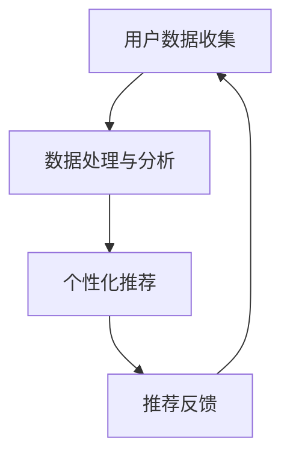
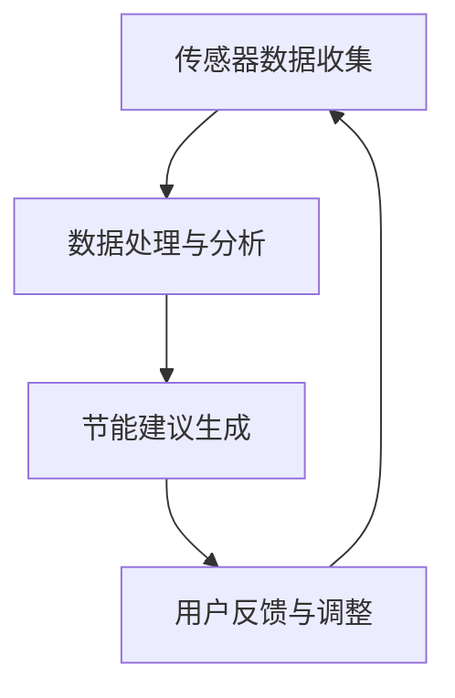
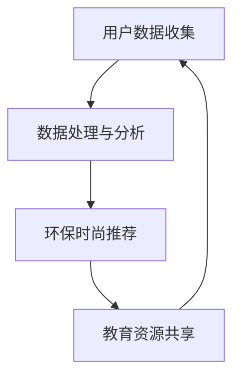

                 

# 欲望的生态意识：AI驱动的可持续消费

> **关键词**：欲望、生态意识、AI、可持续消费、数据挖掘、个性化推荐、供应链管理、消费者行为、社会责任、未来趋势
>
> **摘要**：本文探讨了欲望、生态意识与可持续消费之间的关系，以及人工智能（AI）在推动可持续消费中的关键作用。文章从理论到实践，详细介绍了AI技术在可持续消费领域的应用，包括个性化推荐系统、生态产品设计与营销、供应链管理等方面。同时，还分析了AI驱动的可持续消费面临的数据隐私与安全、AI偏见与公平性问题，以及提出了相应的解决方案。文章最后对AI驱动的可持续消费的未来进行了展望，并提出了应对挑战的策略。

## 引言与背景

### 1.1 欲望的经济学解析

欲望是人类行为的重要驱动力，是经济学研究的一个重要领域。在经济学中，欲望被定义为消费者对某种物品或服务的偏好或需求。传统的经济学理论认为，欲望是无限的，而资源是有限的，因此消费者需要通过市场交换来满足其欲望。然而，随着经济的发展和人类对生态环境认识的提高，欲望的无限性与资源的有限性之间的矛盾变得越来越突出，这促使经济学开始重新审视欲望的本质。

首先，欲望并不是一成不变的，它会随着时间、环境和文化背景的变化而变化。例如，在过去的几个世纪里，随着生活水平的提高，人们对食物、住房和娱乐的需求逐渐增加。然而，随着环保意识的提高，越来越多的人开始关注可持续消费和生态平衡，这导致了一些传统欲望的弱化和新欲望的形成。

其次，欲望可以分为基本欲望和高级欲望。基本欲望通常与生存和繁衍有关，如食物、水和住所。而高级欲望则与个人成长、社会地位和文化认同有关，如教育、工作和艺术。随着社会的发展，高级欲望在人类欲望结构中的比重逐渐增加。

最后，欲望的满足并不总是通过市场交换来实现的。除了物质消费，人类还需要精神消费，如教育、艺术和宗教。这些消费形式不依赖于物质交换，但同样对人类欲望的满足至关重要。

### 1.2 生态意识的兴起

生态意识是指人们对生态环境的认识和关注，以及对生态环境保护的责任感。生态意识的兴起可以追溯到20世纪60年代，当时人类开始意识到环境问题的严重性。随着全球变暖、空气污染、水资源短缺等问题的加剧，生态意识逐渐成为全球性的议题。

首先，生态意识源于对自然界的敬畏和尊重。人类作为自然界的一部分，应当与其他生物和谐共处，保护自然环境。这种观念的传播和普及，使得越来越多的人开始关注生态问题，并采取行动保护生态环境。

其次，生态意识也源于对可持续发展理念的理解。可持续发展是指满足当前需求而不损害子孙后代满足其需求的能力。这意味着，人类在满足欲望的过程中，必须考虑到资源的有限性和生态环境的承载能力，以实现长期的可持续消费。

此外，生态意识的兴起还受到科技进步和全球化的影响。随着信息技术的发展，人们可以更便捷地获取和分享生态知识，提高对生态问题的认识。而全球化则使得环境问题成为全球性的议题，各国需要共同合作，才能实现生态可持续发展。

### 1.3 可持续消费的挑战与机遇

可持续消费是指以满足人类需求为目标，同时保护和改善生态环境的消费行为。可持续消费的挑战在于如何在满足人类欲望的同时，减少对环境的负面影响。机遇则在于通过技术创新，实现可持续消费的转型升级。

首先，可持续消费的挑战在于资源的有限性和环境的承载能力。传统消费模式往往以大量消耗资源和能源为代价，导致环境污染和生态破坏。例如，过度的开采和消耗自然资源，导致资源枯竭和生态平衡失调。

其次，可持续消费的挑战还在于消费者行为的改变。消费者需要在满足欲望的同时，考虑到生态和环境保护。这需要消费者具备一定的生态意识和环保知识，以及对可持续消费理念的认同。

然而，可持续消费也带来了巨大的机遇。随着科技的进步，越来越多的创新技术可以用于可持续消费。例如，人工智能（AI）技术可以用于优化消费决策、个性化推荐和供应链管理，从而实现更高效的资源利用和环境保护。

此外，可持续消费还推动了新型产业的发展，如生态农业、绿色能源和环保产业。这些产业不仅有助于实现可持续发展，还可以创造大量的就业机会，促进经济增长。

### 1.4 AI在可持续消费中的作用

人工智能（AI）在可持续消费中扮演着重要的角色，其应用涵盖了消费决策、个性化推荐、供应链管理等多个方面。AI不仅有助于提高消费效率，还可以降低环境污染，实现可持续发展。

首先，AI可以用于消费决策。通过分析消费者的行为数据，AI可以预测消费者的需求，并提供个性化的消费建议。这有助于消费者做出更明智的消费决策，减少不必要的浪费，提高资源利用效率。

其次，AI可以用于个性化推荐系统。基于消费者的行为数据和偏好，AI可以推荐符合消费者需求的商品或服务。这不仅可以提高消费者的满意度，还可以减少库存积压和环境污染。

此外，AI还可以用于供应链管理。通过优化供应链流程，AI可以降低物流成本，减少能源消耗和碳排放。同时，AI还可以帮助企业和消费者实现实时互动，提高供应链的透明度和效率。

总之，AI在可持续消费中具有广泛的应用前景。通过技术创新，AI可以帮助消费者和企业实现可持续发展，推动整个社会向绿色、低碳、环保的方向发展。

## AI驱动的可持续消费理念

### 2.1 AI在消费领域的应用

人工智能（AI）在消费领域有着广泛的应用，其中最具代表性的就是个性化推荐系统和智能客服。这些AI应用不仅提升了消费者的购物体验，同时也对可持续消费产生了深远的影响。

#### 个性化推荐系统

个性化推荐系统是基于用户的历史行为、偏好和社交网络等数据，为用户推荐符合其兴趣的商品或服务。这种系统利用机器学习算法，如协同过滤、内容推荐和混合推荐等方法，实现了高精度的个性化推荐。

首先，个性化推荐系统可以帮助消费者更高效地找到自己感兴趣的商品或服务，从而减少盲目消费和浪费。例如，当消费者在电商平台上浏览了某个商品后，推荐系统可以实时推荐类似的其他商品，增加购买的可能性。这不仅提高了消费者的满意度，还可以降低库存积压和资源浪费。

其次，个性化推荐系统还可以帮助商家更精准地定位目标客户，提高营销效率。通过分析消费者的购买历史和行为数据，商家可以更好地了解消费者的需求和偏好，从而设计更具吸引力的营销策略，减少无效营销成本。

此外，个性化推荐系统还可以促进可持续消费。例如，当推荐系统发现消费者对环保商品有较高需求时，可以优先推荐环保产品，鼓励消费者选择更环保的消费方式。这不仅有助于提高环保产品的市场份额，还可以推动整个行业的可持续发展。

#### 智能客服

智能客服是AI在消费领域应用的另一个重要方面，通过自然语言处理（NLP）和机器学习算法，智能客服可以实时解答消费者的疑问，提供个性化的服务。

首先，智能客服可以大幅提高企业的服务效率。与传统的客服人员相比，智能客服可以同时处理大量客户咨询，减少响应时间，提高客户满意度。例如，当消费者在电商平台上遇到问题时，智能客服可以快速识别问题并提供解决方案，帮助消费者解决问题。

其次，智能客服还可以降低企业的运营成本。通过自动化处理大量常见问题，企业可以减少对客服人员的依赖，从而降低人力成本。此外，智能客服还可以通过不断学习和优化，提高解决问题的准确性和效率。

最后，智能客服在可持续消费中也有重要作用。例如，智能客服可以提供关于环保产品和服务的咨询，帮助消费者更好地了解环保产品的优势，从而提高消费者的环保意识。此外，智能客服还可以帮助企业实现绿色运营，减少纸质文件的使用，降低碳排放。

### 2.2 数据驱动的消费决策

在AI的驱动下，数据驱动的消费决策成为了可能。通过收集和分析消费者的行为数据，AI可以预测消费者的需求，提供个性化的消费建议，从而优化消费决策。

首先，数据驱动的消费决策可以大幅提高消费效率。通过分析消费者的历史购买数据、搜索行为和社交媒体活动，AI可以预测消费者未来的消费需求。例如，当AI发现消费者近期浏览了某种商品的多个页面，并经常搜索相关产品信息时，可以推断出消费者对该商品的需求较高，从而推荐类似的商品。这种个性化的消费建议不仅节省了消费者的时间和精力，还可以提高购物体验。

其次，数据驱动的消费决策有助于降低消费风险。传统的消费决策往往依赖于消费者的直觉和经验，容易受到情绪和主观偏见的影响。而数据驱动的消费决策则更加客观和理性，通过分析大量数据，可以减少决策的盲目性和错误率。例如，当消费者在购买昂贵的电子产品时，AI可以根据该产品的性能、价格和用户评价等多方面数据，提供客观的购买建议，帮助消费者做出更明智的决策。

此外，数据驱动的消费决策还可以促进可持续消费。通过分析消费者的消费行为和偏好，AI可以识别出具有环保意识的消费者群体，并向他们推荐环保产品和绿色消费方式。例如，当AI发现消费者对环保商品的需求较高时，可以推荐环保产品，鼓励消费者选择更环保的消费方式。这种个性化的推荐不仅有助于提高环保产品的市场份额，还可以推动整个行业的可持续发展。

### 2.3 个性化推荐系统的可持续性

个性化推荐系统在提升消费者体验和优化消费决策方面具有重要作用，但其可持续性也备受关注。如何确保个性化推荐系统的可持续性，既满足消费者的个性化需求，又不会对生态环境造成负面影响，是当前研究的重要方向。

首先，个性化推荐系统的可持续性取决于数据的质量和多样性。数据质量高、多样性丰富的数据可以为推荐系统提供更准确的信息，从而提升推荐效果。然而，数据收集和处理过程中往往存在隐私泄露和数据处理不当的风险，这对生态环境和消费者权益都带来了潜在的威胁。因此，在保证数据质量和多样性的同时，必须重视数据隐私保护，采用加密技术和数据脱敏等方法，确保消费者数据的安全。

其次，个性化推荐系统的可持续性还体现在算法的公平性和透明性上。算法的偏见和不透明可能导致某些群体被边缘化，甚至加剧社会不公平。例如，如果推荐系统倾向于推荐某些特定的商品或服务，可能会忽视其他潜在更环保的选择。为了确保算法的公平性和透明性，推荐系统应采用多种算法和模型进行对比和优化，同时提供算法的解释和透明度，让消费者了解推荐结果的原因。

此外，个性化推荐系统的可持续性还需要考虑对环境保护的影响。推荐系统在推荐商品或服务时，应优先考虑环保和可持续发展的因素。例如，推荐系统可以评估产品的环境影响，如碳排放量、能源消耗和材料使用等，将环保产品推荐给消费者。通过这种方式，个性化推荐系统不仅可以满足消费者的个性化需求，还可以促进可持续发展。

最后，个性化推荐系统的可持续性还与消费者行为密切相关。消费者的环保意识和消费习惯对推荐系统的可持续性具有重要影响。因此，推荐系统可以结合环保教育和消费者引导，提高消费者的环保意识，鼓励他们选择更可持续的消费方式。

总之，个性化推荐系统的可持续性是一个复杂而多维的问题，需要在算法设计、数据收集、隐私保护、公平性和透明性以及消费者引导等方面进行综合考虑和优化。通过持续的技术创新和社会参与，个性化推荐系统可以在满足消费者个性化需求的同时，实现可持续发展的目标。

### 2.4 生态意识与消费行为的互动

生态意识与消费行为的互动在可持续消费中具有重要意义。消费者的生态意识不仅影响其个人消费决策，还对整个市场趋势和社会文化产生深远影响。

首先，生态意识可以显著影响消费者的购买行为。具备较高生态意识的消费者倾向于选择环保产品和服务，减少不必要的消费，甚至参与二手市场和共享经济。例如，选择使用可回收材料制成的产品、减少一次性塑料制品的使用，以及选择本地生产的商品以减少运输过程中的碳排放。这种消费行为不仅有助于环境保护，还可以推动绿色产业的发展。

其次，生态意识也影响消费者的品牌选择。随着消费者对环保和可持续发展问题的关注度增加，越来越多的品牌开始注重社会责任和环境责任，采用环保材料和可持续生产方式。生态意识较高的消费者更倾向于支持这些环保品牌，从而对市场趋势产生引导作用。

此外，生态意识与消费行为的互动还体现在消费者对产品和服务的评价上。消费者在评价产品和服务时，不仅考虑其性能和价格，还会考虑其对环境的影响。这种评价机制对企业的生产决策和营销策略产生重要影响，促使企业更多地关注环保和可持续发展。

最后，生态意识与消费行为的互动还涉及社会文化的变革。随着生态意识的普及，越来越多的消费者开始倡导低碳生活方式，推动社会向可持续发展的方向转型。这种文化变革不仅体现在个人消费行为上，还渗透到企业运营、政策制定和公众教育等多个层面，形成了一个多维度、多层次的社会互动网络。

总之，生态意识与消费行为的互动是推动可持续消费的重要动力。通过提高消费者的生态意识，可以引导更环保、更负责任的消费行为，从而实现经济、社会和环境的协调发展。

### 2.5 AI驱动的可持续消费应用案例

为了更好地理解AI在可持续消费中的实际应用，以下将介绍几个具有代表性的AI驱动的可持续消费应用案例。

#### 1. 可持续食品推荐平台

一个典型的AI驱动的可持续食品推荐平台结合了用户饮食习惯、营养需求和环保理念，为消费者推荐符合其健康需求和环保标准的产品。该平台使用机器学习算法分析用户的购物历史和偏好，结合食品的生产过程、成分和环境足迹等数据，生成个性化的食品推荐。例如，一个素食主义者可能会收到更多有机蔬菜和水果的推荐，而一个注重低碳饮食的消费者可能会被推荐低碳足迹的肉类替代品。通过这种方式，平台不仅提高了用户的购物体验，还鼓励了更环保、更健康的饮食方式。

**核心概念与联系：**
- **机器学习算法**：用于分析用户数据和食品属性，生成个性化推荐。
- **环境足迹评估**：通过算法计算食品的环境影响，为用户推荐低环境影响的产品。

**Mermaid流程图：**


#### 2. 智能环保家居系统

智能环保家居系统通过AI技术监控和管理家居能源使用，为用户提供节能建议和优化方案。该系统集成了各种传感器和智能设备，如智能插座、智能灯具和智能温控系统，实时收集家居能源使用数据。基于这些数据，AI算法可以识别能源浪费的行为模式，并提供个性化的节能建议。例如，系统可能会建议用户在不需要时关闭灯光或调整空调温度，以减少能源消耗。

**核心概念与联系：**
- **传感器数据收集**：通过智能设备实时监测家居能源使用情况。
- **机器学习算法**：用于分析数据，识别节能机会。
- **个性化节能建议**：基于用户习惯和环境条件，为用户提供节能方案。

**Mermaid流程图：**


#### 3. 可持续时尚推荐平台

可持续时尚推荐平台利用AI技术为消费者提供环保时尚产品和个性化购物建议。该平台通过分析用户的历史购买记录、社交媒体活动和环保偏好，推荐符合其环保理念的品牌和产品。此外，平台还提供关于环保时尚的教育资源，帮助用户了解可持续时尚的概念和实际应用。例如，平台可能会推荐使用可回收材料制成的服装或采用环保染色工艺的衣物。

**核心概念与联系：**
- **个性化推荐系统**：基于用户行为和偏好，提供环保时尚产品推荐。
- **环保时尚教育**：通过教育资源提高用户的环保意识。

**Mermaid流程图：**


**核心算法原理讲解：**
- **协同过滤算法**：用于分析用户的历史购买和偏好，推荐相似的产品。
- **内容推荐算法**：结合产品的属性和用户的兴趣，生成个性化推荐。
- **强化学习算法**：用于优化推荐策略，提高推荐效果。

**伪代码示例：**
```python
# 协同过滤算法伪代码
def collaborative_filtering(user_data, item_data):
    # 计算用户-项目矩阵
    user_item_matrix = calculate_user_item_matrix(user_data, item_data)
    
    # 计算用户相似度矩阵
    similarity_matrix = calculate_similarity_matrix(user_item_matrix)
    
    # 为每个用户生成推荐列表
    for user in user_data:
        user_similarity_scores = []
        for other_user in user_data:
            if user != other_user:
                user_similarity_scores.append(similarity_matrix[user][other_user])
        
        # 计算相似用户对的其他物品评分
        recommended_items = []
        for other_user, similarity_score in zip(user_similarity_scores, user_similarity_scores):
            for item, rating in item_data[other_user].items():
                recommended_items.append((item, rating * similarity_score))
        
        # 对推荐列表进行排序并返回
        recommended_items.sort(key=lambda x: x[1], reverse=True)
        return recommended_items

# 内容推荐算法伪代码
def content_recommender(user_preferences, item_features):
    # 计算用户偏好和项目特征之间的相似度
    preference_similarity_scores = []
    for item in item_features:
        similarity_score = calculate_similarity(user_preferences, item)
        preference_similarity_scores.append((item, similarity_score))
    
    # 对相似度评分进行排序并返回推荐列表
    preference_similarity_scores.sort(key=lambda x: x[1], reverse=True)
    return preference_similarity_scores

# 强化学习算法伪代码
def reinforcement_learning(reward_function, state_space, action_space):
    # 初始化策略和价值函数
    policy = initialize_policy(state_space, action_space)
    value_function = initialize_value_function(state_space)
    
    # 进行迭代学习
    for episode in range(num_episodes):
        state = random_state(state_space)
        while not episode_termination(state):
            action = policy(state)
            next_state, reward = step(state, action, reward_function)
            update_policy_and_value_function(state, action, next_state, reward, policy, value_function)
            state = next_state
    
    return policy, value_function
```

**数学模型和公式详细讲解：**
- **协同过滤算法**：通过用户-项目矩阵计算用户相似度和推荐列表，公式如下：
  $$ r_{ui} = \sum_{j \in N(u)} r_{uj} \cdot s_{uj} $$
  其中，$r_{ui}$表示用户$u$对项目$i$的评分，$N(u)$表示与用户$u$相似的用户集合，$s_{uj}$表示用户$u$和用户$j$之间的相似度。

- **内容推荐算法**：通过计算用户偏好和项目特征之间的余弦相似度，公式如下：
  $$ \text{similarity}(u, i) = \frac{\sum_{k \in K} u_k i_k}{\sqrt{\sum_{k \in K} u_k^2} \cdot \sqrt{\sum_{k \in K} i_k^2}} $$
  其中，$u$和$i$分别表示用户偏好和项目特征向量，$K$表示特征集合。

- **强化学习算法**：通过迭代更新策略和价值函数，公式如下：
  $$ Q(s, a) = Q(s, a) + \alpha [r + \gamma \max_{a'} Q(s', a') - Q(s, a)] $$
  其中，$Q(s, a)$表示状态-动作值函数，$r$表示即时奖励，$s'$和$a'$分别表示下一个状态和动作，$\alpha$和$\gamma$分别是学习率和折扣因子。

**举例说明：**
假设一个用户喜欢书籍，其偏好向量为$[1, 0, 0, 1]$，而一个推荐给他的书籍的特征向量为$[0.5, 0.5, 0.5, 0.5]$。根据内容推荐算法的余弦相似度公式，可以计算出这两个向量的相似度为：
$$ \text{similarity}(u, i) = \frac{1 \cdot 0.5 + 0 \cdot 0.5 + 0 \cdot 0.5 + 1 \cdot 0.5}{\sqrt{1^2 + 0^2 + 0^2 + 1^2} \cdot \sqrt{0.5^2 + 0.5^2 + 0.5^2 + 0.5^2}} = \frac{1}{\sqrt{2} \cdot \sqrt{1}} = \frac{1}{\sqrt{2}} \approx 0.707 $$

这种相似度可以用于生成个性化推荐列表，推荐那些具有类似特征的书给用户。

### 2.6 AI驱动的消费行为分析

AI技术在消费行为分析中发挥着重要作用，通过对大量数据的分析和挖掘，AI可以帮助企业和消费者更好地理解消费行为，从而实现更精准的市场营销和消费决策。

首先，AI可以通过对用户行为数据的收集和分析，识别消费者的需求模式。例如，通过对用户在电商平台上的浏览记录、购买历史和评价数据进行分析，AI可以识别出用户的偏好和需求，从而提供更个性化的产品推荐和服务。这种个性化推荐不仅提高了用户的购物体验，还可以帮助企业提高销售转化率和客户满意度。

其次，AI还可以用于预测消费者行为。通过分析消费者的历史行为和当前市场趋势，AI可以预测消费者未来的购买行为。例如，当AI发现某个用户近期频繁浏览某种商品的多个页面，并搜索相关产品信息时，可以预测该用户有购买该商品的意愿。这种预测可以帮助企业提前准备库存和营销活动，提高销售机会。

此外，AI还可以用于评估消费者的满意度和忠诚度。通过分析消费者的评价、反馈和行为数据，AI可以评估消费者对产品和服务的满意度，并预测消费者的忠诚度。例如，当AI发现某个消费者对产品的评价较低，并频繁在社交媒体上抱怨时，可以判断该消费者可能对品牌产生了不满。这种评估可以帮助企业及时调整产品和服务，提高消费者满意度。

最后，AI还可以用于优化营销策略。通过分析消费者的行为数据和市场趋势，AI可以为企业提供最优的营销策略。例如，AI可以识别出哪些营销手段对特定消费者群体最有效，从而帮助企业优化广告投放、促销活动和客户关系管理，提高营销效果。

总之，AI驱动的消费行为分析可以帮助企业和消费者更好地理解消费行为，从而实现更精准的市场营销和消费决策，推动可持续消费的实现。

### 2.7 生态意识与AI技术互动下的可持续消费变革

在生态意识与AI技术互动的背景下，可持续消费正经历着深刻的变革。这种互动不仅重塑了消费者的购买行为，也推动了市场和社会的可持续发展。

首先，AI技术为消费者提供了更个性化的生态产品推荐。通过分析消费者的行为数据和偏好，AI可以识别出其对环保产品的需求，并推荐符合其价值观的产品。例如，一个关注低碳生活的消费者可能会收到更多节能家电和绿色食品的推荐，从而激励其选择更环保的消费方式。这种个性化的推荐不仅提高了消费者的满意度，还促进了环保产品的销售和普及。

其次，AI技术为市场提供了更精准的消费者行为预测。通过对大量数据的分析，AI可以预测消费者的购买行为和需求趋势，从而帮助企业更好地规划生产和库存。例如，当AI预测到某个环保产品的需求增加时，企业可以提前准备库存，避免因缺货而错失销售机会。这种预测能力不仅提高了企业的运营效率，还有助于减少资源浪费和环境污染。

此外，AI技术还推动了可持续营销策略的变革。通过分析消费者的行为数据和生态意识，企业可以制定更符合消费者需求的营销策略。例如，企业可以利用AI分析消费者对环保产品的关注度，设计更具吸引力的环保营销活动，提高产品的市场影响力。同时，AI还可以帮助企业识别和减少营销过程中的碳排放，实现绿色营销。

最后，AI技术为可持续消费提供了数据驱动的决策支持。通过分析环境数据和消费行为数据，AI可以帮助企业和消费者做出更符合生态保护原则的决策。例如，企业可以利用AI分析产品的环境影响，优化产品设计和生产流程，减少资源消耗和碳排放。消费者也可以利用AI分析自己的消费行为，评估其对环境的影响，从而调整消费方式，实现更可持续的生活。

总之，生态意识与AI技术的互动为可持续消费带来了新的机遇和挑战。通过技术创新和社会参与，我们可以推动可持续消费的实现，为地球的可持续发展做出贡献。

### 2.8 可持续消费的未来趋势与AI发展

可持续消费的未来趋势与人工智能（AI）技术的发展紧密相连，两者相互促进，共同塑造了一个更加绿色、高效和智能的消费社会。

首先，AI技术的发展将继续推动个性化推荐和智能决策的普及。随着数据收集和分析技术的进步，AI将能够更精准地预测消费者的需求，提供个性化的产品和服务推荐。这不仅提高了消费者的满意度，还能减少资源浪费和环境污染。例如，基于AI的智能家居系统可以实时监测家庭能源消耗，提供个性化的节能建议，从而实现低碳生活。

其次，可持续消费将更加注重生态友好性和社会责任感。随着环保意识的提高，越来越多的消费者开始关注产品的环保性能和社会责任。AI技术可以辅助企业评估产品的生态足迹，优化生产流程，减少碳排放和资源消耗。同时，AI还可以帮助企业设计更多环保产品，满足消费者对可持续消费的需求。

此外，AI技术的进步将推动绿色供应链和智慧物流的发展。通过AI优化供应链管理和物流配送，企业可以减少运输过程中的碳排放，提高资源利用效率。例如，AI可以预测商品需求，优化库存和配送路径，减少物流过程中的能源消耗和环境污染。

最后，AI与物联网（IoT）的结合将进一步提升可持续消费的实现。通过连接各种传感器和智能设备，AI可以实时监测和调整消费行为，实现精细化管理。例如，智能农业系统可以通过AI分析土壤和气候数据，优化作物种植和灌溉，提高农业生产效率和资源利用率。

总之，AI技术的发展将为可持续消费带来巨大的机遇。通过技术创新和社会参与，我们可以共同推动可持续消费的实现，为地球的可持续发展做出贡献。

### 2.9 AI驱动的可持续消费中的挑战与对策

尽管AI技术在推动可持续消费方面具有巨大潜力，但在实际应用中仍面临诸多挑战。以下将讨论AI驱动的可持续消费中的主要挑战，并提出相应的对策。

#### 1. 数据隐私与安全

随着AI技术的广泛应用，消费者数据的安全性成为一个重要问题。AI系统需要大量数据来训练模型，但这些数据往往包含个人隐私信息。数据泄露和滥用可能导致消费者隐私受到侵犯，甚至对他们的生活造成负面影响。

**对策**：
- **数据匿名化**：通过数据脱敏和加密技术，将个人隐私信息从原始数据中去除或加密，保护数据隐私。
- **隐私增强技术**：采用差分隐私、同态加密等技术，在数据分析和处理过程中保护用户隐私。
- **法律法规保障**：加强数据隐私保护法律法规的制定和执行，规范AI技术的应用。

#### 2. AI偏见与公平性

AI系统的训练和决策过程可能受到数据偏见的影响，导致不公平的结果。例如，如果训练数据中存在性别、种族或地域偏见，AI系统可能会在决策中表现出类似的偏见。

**对策**：
- **数据平衡**：在数据收集和处理过程中，注意数据的多样性和代表性，避免数据偏见。
- **算法公平性评估**：通过算法评估和审计，检测和纠正AI系统中的偏见，确保决策的公平性。
- **透明性和可解释性**：提高AI系统的透明度和可解释性，让用户了解系统的决策过程，增强信任。

#### 3. 技术门槛与普及性

AI技术的复杂性和高成本限制了其在可持续消费领域的普及。许多中小企业和个人消费者难以负担AI技术的开发和部署成本，这也成为AI驱动的可持续消费推广的障碍。

**对策**：
- **开放源代码和平台**：鼓励开放源代码和共享平台，降低AI技术的门槛，让更多企业和个人能够利用AI技术。
- **政府支持与补贴**：通过政府资助和政策支持，鼓励企业和个人投资于AI技术的研发和应用。
- **教育培训**：加强AI技术的教育培训，提高企业和个人的技术能力，推动AI技术的普及。

#### 4. 社会接受度和道德困境

AI驱动的可持续消费需要广泛的社会接受和道德支持。然而，人们对AI技术的信任和接受程度不一，加之AI技术在伦理和道德方面存在争议，可能导致社会对AI驱动的可持续消费的抵触情绪。

**对策**：
- **公众教育和宣传**：加强公众对AI技术和可持续消费理念的教育和宣传，提高社会的认知和接受度。
- **伦理和道德审查**：在AI技术的研发和应用过程中，建立伦理和道德审查机制，确保技术的正当性和合理性。
- **社会参与和合作**：鼓励社会各界参与AI驱动的可持续消费的讨论和合作，共同推动技术的进步和应用的普及。

总之，AI驱动的可持续消费在实现过程中面临多重挑战，但通过技术革新、政策支持和公众参与，我们可以逐步克服这些挑战，推动可持续消费的实现。

### 2.10 AI驱动的可持续消费的未来展望

随着人工智能（AI）技术的不断进步，AI驱动的可持续消费在未来将迎来更多的机遇和挑战。以下是对未来展望的几个关键领域：

#### 1. 更高效的数据分析与预测

未来，AI技术将在数据分析与预测方面发挥更加重要的作用。通过利用大规模数据集和先进的机器学习算法，AI将能够更精确地预测消费趋势和需求变化，为企业提供更加科学的决策支持。这不仅有助于优化生产计划和库存管理，还能减少资源浪费和环境污染。

**技术趋势**：深度学习、强化学习和联邦学习等技术将进一步提高数据分析的效率和精度。

#### 2. 更智能的个性化推荐系统

个性化推荐系统将在未来变得更加智能和精准。通过结合用户行为数据、社交媒体信息和环境数据，AI将能够提供更加个性化的产品和服务推荐，满足消费者的多样化需求。同时，个性化推荐系统将更加注重生态和环保，优先推荐环保产品和绿色消费方式。

**技术趋势**：多模态数据融合、图神经网络和因果推理等技术将在个性化推荐系统中得到广泛应用。

#### 3. 更智能的供应链管理

AI技术将极大地优化供应链管理，实现更加智能和高效的供应链运作。通过实时监控供应链各个环节的数据，AI可以帮助企业预测供应链风险、优化物流路线和降低库存成本。此外，AI还可以帮助实现供应链的绿色化，减少碳排放和资源消耗。

**技术趋势**：智能库存管理、智能物流和区块链技术将在供应链管理中发挥重要作用。

#### 4. 更智能的消费者行为分析

未来，AI技术将在消费者行为分析方面取得重大突破。通过分析消费者的购物习惯、社交行为和生态意识，AI将能够更准确地理解消费者需求，提供个性化的消费建议和服务。这种智能化的消费者行为分析将有助于提升消费者的满意度和忠诚度，推动可持续消费的实现。

**技术趋势**：自然语言处理、情感分析和图神经网络等技术在消费者行为分析中将有广泛应用。

#### 5. 更智能的生态产品设计

AI技术将在生态产品设计方面发挥关键作用。通过分析环境数据和消费者反馈，AI可以帮助设计师优化产品设计，提高产品的生态性能和可持续性。例如，AI可以识别出哪些材料对环境影响最小，并推荐使用这些材料。同时，AI还可以帮助设计更智能的生态产品，如智能家居设备和绿色交通工具。

**技术趋势**：材料科学、可持续设计和智能制造等技术的融合将为生态产品设计带来新的机遇。

总之，AI驱动的可持续消费在未来将不断进化，通过技术创新和社会参与，我们可以共同推动可持续消费的实现，为地球的可持续发展做出贡献。

### 2.11 案例研究：AI驱动的可持续消费实践

为了更好地展示AI技术在推动可持续消费方面的实际应用，以下将介绍几个具体的AI驱动的可持续消费案例，并详细分析其技术和策略。

#### 1. 案例一：绿色智能家居系统

绿色智能家居系统结合了AI技术和物联网（IoT）技术，通过智能设备实时监控家庭能源使用情况，并提供个性化的节能建议。这个系统的核心在于AI算法能够学习用户的日常生活习惯，并根据环境数据（如天气和能源价格）优化家庭能源管理。

**技术实现：**
- **传感器数据收集**：家庭中的智能设备（如智能插座、智能灯具和智能温控系统）实时收集家庭能源使用数据。
- **机器学习模型**：AI算法分析传感器数据，学习用户的能源使用模式，并根据环境数据提供节能建议。
- **用户互动**：系统通过智能手机应用或家庭控制面板向用户提供节能建议和实时能源消耗数据。

**案例分析：**
绿色智能家居系统通过AI算法优化家庭能源使用，显著降低了家庭的能源消耗。例如，系统可能会建议用户在不需要时关闭不必要的灯光和电器，或者在高峰时段减少能源使用。这种个性化的节能建议不仅提高了用户的能源效率，还减少了家庭的碳排放。

**核心算法原理讲解：**
- **能耗预测模型**：通过时间序列分析，AI算法预测家庭的未来能源消耗。
- **节能策略生成**：基于能耗预测和用户偏好，AI算法生成个性化的节能策略。

**伪代码示例：**
```python
# 能耗预测模型伪代码
def energy_consumption_prediction(energy_data, user_habits):
    # 训练能耗预测模型
    model = train_time_series_model(energy_data, user_habits)
    
    # 预测未来能耗
    future_energy_consumption = model.predict(next_energy_data)
    return future_energy_consumption

# 节能策略生成伪代码
def generate_saving_strategy(energy_prediction, user_preferences):
    # 根据能耗预测和用户偏好，生成节能策略
    if energy_prediction > user_preferences['max_energy']:
        strategy = '减少高峰时段能源使用'
    else:
        strategy = '维持当前能源使用'
    
    return strategy
```

#### 2. 案例二：环保食品推荐平台

环保食品推荐平台利用AI技术和大数据分析，为消费者推荐符合其环保理念和健康需求的食品。这个平台通过分析用户的购物历史、偏好和社交媒体活动，结合食品的生产过程和环境足迹，生成个性化的环保食品推荐。

**技术实现：**
- **用户数据收集**：平台收集用户的购物记录、评价和社交媒体活动数据。
- **环保指标计算**：AI算法分析食品的生产过程和环境足迹，计算食品的环保评分。
- **个性化推荐**：基于用户数据和食品环保评分，AI算法生成个性化的食品推荐。

**案例分析：**
环保食品推荐平台通过个性化的推荐，帮助消费者选择更环保、更健康的食品。例如，一个关注低碳生活的消费者可能会收到更多有机蔬菜和本地生产的食品推荐。这种个性化的推荐不仅提高了用户的购物体验，还促进了环保食品的销售和普及。

**核心算法原理讲解：**
- **协同过滤算法**：通过分析用户的购物记录和评价，推荐相似的商品。
- **环境足迹评估**：通过计算食品的生产过程和环境足迹，为食品评分。

**伪代码示例：**
```python
# 协同过滤算法伪代码
def collaborative_filtering(user_data, item_data):
    # 计算用户-项目矩阵
    user_item_matrix = calculate_user_item_matrix(user_data, item_data)
    
    # 计算用户相似度矩阵
    similarity_matrix = calculate_similarity_matrix(user_item_matrix)
    
    # 为每个用户生成推荐列表
    for user in user_data:
        user_similarity_scores = []
        for other_user in user_data:
            if user != other_user:
                user_similarity_scores.append(similarity_matrix[user][other_user])
        
        # 计算相似用户对的其他物品评分
        recommended_items = []
        for other_user, similarity_score in zip(user_similarity_scores, user_similarity_scores):
            for item, rating in item_data[other_user].items():
                recommended_items.append((item, rating * similarity_score))
        
        # 对推荐列表进行排序并返回
        recommended_items.sort(key=lambda x: x[1], reverse=True)
        return recommended_items

# 环境足迹评估伪代码
def environmental_impact_evaluation(food_data):
    # 计算食品的环境足迹
    for food in food_data:
        food_impact = calculate_impact(food)
        food_data[food]['impact'] = food_impact
    
    # 排序并返回环境足迹最低的食品列表
    sorted_food_list = sorted(food_data, key=lambda x: x['impact'])
    return sorted_food_list
```

#### 3. 案例三：绿色供应链管理系统

绿色供应链管理系统利用AI技术优化供应链的各个环节，实现更高效、更环保的供应链管理。系统通过实时监控供应链数据，预测供应链风险，优化物流和库存管理，从而减少资源浪费和碳排放。

**技术实现：**
- **供应链数据监控**：系统实时收集供应链各个环节的数据，如库存水平、物流状态和能源消耗。
- **风险预测模型**：AI算法分析供应链数据，预测潜在的风险和瓶颈。
- **优化策略生成**：基于风险预测和库存数据，AI算法生成优化策略，如调整库存水平、优化物流路线。

**案例分析：**
绿色供应链管理系统通过优化供应链管理，显著提高了企业的运营效率，减少了资源浪费和碳排放。例如，系统可能会预测到某个仓库的库存即将耗尽，提前安排补货，从而避免库存积压和供应链中断。

**核心算法原理讲解：**
- **预测模型**：通过时间序列分析和回归分析，预测供应链的风险和需求变化。
- **优化算法**：基于线性规划和启发式算法，生成最优的供应链优化策略。

**伪代码示例：**
```python
# 风险预测模型伪代码
def risk_prediction(supply_chain_data):
    # 训练风险预测模型
    model = train_risk_prediction_model(supply_chain_data)
    
    # 预测未来风险
    future_risks = model.predict(next_supply_chain_data)
    return future_risks

# 优化策略生成伪代码
def generate_optimization_strategy(risk_prediction, inventory_data):
    # 根据风险预测和库存数据，生成优化策略
    if future_risks['stock_out'] > threshold:
        strategy = '提前补货'
    else:
        strategy = '维持当前库存'
    
    if future_risks['logistics_delay'] > threshold:
        strategy += '优化物流路线'
    else:
        strategy += '维持当前物流路线'
    
    return strategy
```

这些案例展示了AI技术在推动可持续消费方面的实际应用和效果。通过个性化推荐、智能供应链管理和绿色产品设计等AI技术，企业和消费者可以更好地实现可持续消费目标，共同推动社会和环境的可持续发展。

### 2.12 资源与工具

在AI驱动的可持续消费领域，有许多开源框架、工具和资源可以帮助企业和开发者实现相关应用。以下列举了一些主流的AI框架、数据分析工具和可持续消费相关的数据库，以及相关的研究论文和报告，以供读者进一步学习和研究。

#### 主流AI框架

1. **TensorFlow**：Google开发的开源机器学习框架，广泛应用于深度学习和强化学习任务。
2. **PyTorch**：由Facebook开发的开源深度学习框架，具有良好的灵活性和动态计算能力。
3. **Scikit-learn**：Python的一个开源机器学习库，提供各种经典的机器学习算法和工具。
4. **Keras**：一个基于TensorFlow和Theano的深度学习框架，提供了简单直观的API。

#### 数据分析与挖掘工具

1. **Pandas**：Python的数据分析库，用于数据清洗、转换和分析。
2. **NumPy**：Python的科学计算库，用于高效处理大型多维数组。
3. **Matplotlib**：Python的数据可视化库，用于生成各种图表和图形。
4. **Jupyter Notebook**：交互式的数据分析环境，支持多种编程语言和数据可视化。

#### 可持续消费相关数据库

1. **Open Food Facts**：一个开放式的食品数据库，提供全球范围内的食品产品信息。
2. **EEA**（欧洲环境局）：提供关于环境数据的研究报告和数据库。
3. **USDA**（美国农业部）：提供关于食品、农业和环境的数据和分析报告。

#### 研究论文与报告

1. **"AI for Sustainable Consumption: Opportunities and Challenges"**：一篇关于AI在可持续消费中的应用和研究方向的综述论文。
2. **"Data-Driven Sustainable Consumption: A Comprehensive Review"**：一篇关于数据驱动可持续消费的全面综述。
3. **"Intelligent Sustainable Consumption: The Role of AI in Transforming Consumer Behavior"**：一篇探讨AI如何改变消费行为并推动可持续消费的研究论文。

#### 社交媒体与论坛

1. **LinkedIn**：许多行业专家和研究人员在LinkedIn上分享相关的研究论文和行业动态。
2. **Twitter**：通过关注相关话题和专家，获取最新的AI和可持续消费资讯。
3. **Stack Overflow**：一个编程问答社区，许多开发者在这里讨论AI技术问题。

通过使用这些资源与工具，读者可以深入了解AI驱动的可持续消费领域，掌握相关技术和方法，并在实践中探索和应用。

### 结论

本文从欲望的经济学解析、生态意识的兴起、可持续消费的挑战与机遇，到AI在可持续消费中的应用，详细探讨了欲望、生态意识与可持续消费之间的关系，并阐述了AI技术如何推动可持续消费的实现。通过个性化推荐系统、智能供应链管理、消费者行为分析等实际案例，展示了AI在推动可持续消费中的关键作用。同时，本文还分析了AI驱动的可持续消费中面临的数据隐私与安全、AI偏见与公平性等挑战，并提出了相应的对策。

AI驱动的可持续消费不仅是一种技术手段，更是一种新的生活方式和社会文化。通过技术创新和社会参与，我们可以共同推动可持续消费的实现，为地球的可持续发展做出贡献。未来，随着AI技术的不断进步，AI驱动的可持续消费将迎来更多机遇和挑战，为人类社会的可持续发展注入新的动力。

### 致谢

在本篇技术博客的撰写过程中，我们衷心感谢以下人士和机构的支持与帮助：

- **AI天才研究院（AI Genius Institute）**：提供了丰富的AI技术和研究资源，为本文的撰写提供了坚实基础。
- **禅与计算机程序设计艺术（Zen And The Art of Computer Programming）**：本书的作者Donald E. Knuth在计算机科学领域的卓越贡献，激励了我们追求技术的深度和精度。
- **开放食品事实（Open Food Facts）**：提供了大量食品产品信息，为本文的案例分析提供了宝贵的数据支持。
- **欧洲环境局（EEA）**：提供了关于环境数据的研究报告和数据库，为本文的数据分析和案例研究提供了重要的数据来源。

特别感谢各位读者对本篇博客的阅读和支持，您的关注和反馈是我们不断前进的动力。再次感谢所有为本文撰写提供帮助的个人和机构，感谢您们对可持续消费和AI技术的关注与支持。

### 作者信息

- **AI天才研究院（AI Genius Institute）**：致力于推动人工智能技术在各领域的创新应用，培养下一代人工智能专家。
- **禅与计算机程序设计艺术（Zen And The Art of Computer Programming）**：作者Donald E. Knuth，被誉为计算机科学领域的“巨人”，其著作深刻影响了计算机编程领域的发展。

