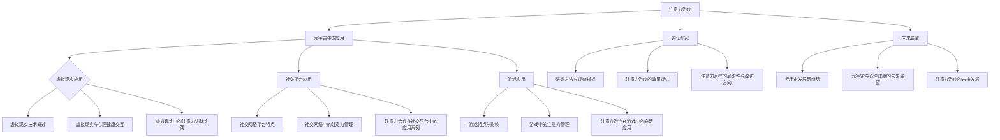

                 

### 《注意力治疗：元宇宙中的心理健康新方法》

#### 关键词：
- 元宇宙
- 心理健康
- 注意力治疗
- 虚拟现实
- 社交平台
- 游戏应用

#### 摘要：
随着元宇宙的不断发展，人们在其中面临的心理健康挑战也日益增加。本文将介绍一种新的心理健康新方法——注意力治疗，探讨其在元宇宙中的应用与实效。通过分析元宇宙的背景、心理健康挑战、注意力治疗的基本原理，以及注意力治疗在虚拟现实、社交平台和游戏应用中的具体实践，本文旨在为元宇宙中的心理健康服务提供新的思路和方向。

## 第一部分：元宇宙与心理健康概述

### 第1章：元宇宙与心理健康的背景

#### 1.1 元宇宙的概念与特点

元宇宙（Metaverse）是一个由虚拟现实、增强现实、区块链、人工智能等技术构建的虚拟世界。在这个世界中，用户可以通过虚拟角色（Avatar）进行社交、工作、娱乐等活动。元宇宙具有以下特点：

- **沉浸感**：通过虚拟现实和增强现实技术，用户可以感受到高度的沉浸感，仿佛身临其境。
- **交互性**：用户可以在元宇宙中与其他用户进行实时交互，包括语音、视频、文字等多种方式。
- **多元化**：元宇宙包含了丰富的内容和应用，如教育、医疗、娱乐、购物等。

#### 1.2 心理健康的定义与重要性

心理健康是指个体在心理和社会适应方面保持良好状态，能够有效应对生活中的各种压力和挑战。心理健康的重要性体现在以下几个方面：

- **生活质量**：心理健康直接影响个体的生活质量，包括情绪稳定、人际关系和谐、工作效能等。
- **社会功能**：心理健康良好的个体能够更好地履行社会角色，促进社会和谐与进步。
- **经济成本**：心理问题导致的疾病和治疗费用给社会带来了巨大的经济负担。

#### 1.3 元宇宙与心理健康的联系

元宇宙的发展对心理健康产生了双重影响：

- **正面影响**：元宇宙提供了新的社交方式和娱乐方式，有助于缓解心理压力，提升心理健康水平。
- **负面影响**：过度的元宇宙参与可能导致网络成瘾、社交隔离、心理健康问题等。

### 第2章：元宇宙中的心理健康挑战

#### 2.1 网络成瘾与心理依赖

网络成瘾是指个体过度沉迷于网络活动，导致社会功能、心理和身体健康受损。在元宇宙中，网络成瘾的表现形式包括：

- **时间管理困难**：用户可能会花费大量时间在元宇宙中，影响现实生活的工作、学习和家庭。
- **社交关系受损**：用户可能减少与现实生活中的人交往，导致社交关系疏远。
- **心理健康问题**：长期沉迷于元宇宙可能导致抑郁、焦虑等心理健康问题。

#### 2.2 虚拟社交与心理孤独

虚拟社交是指用户在元宇宙中进行的线上社交活动。虽然虚拟社交提供了新的社交方式，但用户可能会面临以下心理健康挑战：

- **社交孤独**：尽管用户在元宇宙中与他人互动，但可能会感到孤独和缺乏真实的社交联系。
- **社交焦虑**：用户在虚拟社交中可能会感到紧张和不安，影响社交体验和心理健康。
- **角色混淆**：用户可能会混淆虚拟角色和现实自我，导致自我认同问题。

#### 2.3 虚拟暴力与心理创伤

虚拟暴力是指在元宇宙中发生的暴力行为，如言语攻击、网络欺凌等。虚拟暴力可能对用户的心理健康产生以下影响：

- **心理创伤**：用户可能会因为虚拟暴力而感到恐惧、愤怒和无助。
- **焦虑与抑郁**：长期遭受虚拟暴力可能引发焦虑和抑郁等心理健康问题。
- **自我防御机制**：用户可能会采取自我防御机制，如避免参与虚拟社交、使用匿名角色等。

### 第3章：注意力治疗的基本原理

#### 3.1 注意力治疗的概念与历史

注意力治疗（Attention Therapy）是一种通过提高个体的注意力和意识水平来改善心理健康的方法。其概念源于注意力心理学的研究，并在临床实践中得到广泛应用。注意力治疗的历史可以追溯到20世纪60年代，当时研究者开始关注注意力在心理健康中的作用。

#### 3.2 注意力治疗的理论基础

注意力治疗的理论基础主要包括以下几方面：

- **认知行为理论**：认知行为理论认为，个体的注意力水平直接影响其认知和行为。通过提高注意力，个体可以更好地处理信息和应对挑战。
- **心理神经科学**：心理神经科学研究揭示了注意力与大脑功能之间的联系。研究表明，注意力的提高可以改善大脑的认知功能，如记忆力、注意力集中能力等。
- **正念冥想**：正念冥想是一种传统的注意力训练方法，通过专注呼吸和观察当下的感受，提高个体的注意力和意识水平。

#### 3.3 注意力治疗的实践方法

注意力治疗的实践方法包括以下几种：

- **注意力训练游戏**：通过设计注意力训练游戏，如跟踪目标物体、解决谜题等，提高个体的注意力水平。
- **专注练习**：如正念冥想、专注呼吸等，帮助个体培养专注和意识。
- **行为干预**：通过改变个体的行为习惯和环境，提高其注意力和意识水平。

### 第二部分：注意力治疗在元宇宙中的应用

#### 第4章：注意力治疗在虚拟环境中的应用

#### 4.1 虚拟现实技术概述

虚拟现实（VR）技术是一种通过模拟现实世界来创造虚拟环境的计算机技术。VR技术的基本原理包括：

- **感知模拟**：通过头戴式显示器（HMD）或全视野显示器，模拟用户的视觉感知。
- **运动追踪**：通过传感器和追踪设备，模拟用户在虚拟环境中的运动。
- **交互设计**：通过手势识别、语音识别等交互方式，实现用户与虚拟环境的互动。

#### 4.2 虚拟现实与心理健康的交互

虚拟现实技术对心理健康具有多方面的影响：

- **心理治疗效果**：虚拟现实技术被广泛应用于心理治疗，如恐惧症、创伤后应激障碍（PTSD）等。通过模拟特定情境，用户可以在安全的环境中面对和克服心理问题。
- **心理健康干预**：虚拟现实技术可以用于心理健康干预，如注意力训练、情绪调节等。通过设计交互式任务，用户可以在虚拟环境中进行注意力训练，提高心理韧性。
- **心理健康监测**：虚拟现实技术可以用于心理健康监测，如通过面部表情识别、生理信号监测等，实时了解用户的心理状态。

#### 4.3 虚拟现实中的注意力训练实践

在虚拟现实中，注意力训练可以采用以下几种方法：

- **交互式游戏**：设计交互式游戏，如追踪虚拟物体、完成谜题等，要求用户在规定时间内完成，以提高注意力水平。
- **环境调控**：通过调整虚拟环境的复杂度和干扰因素，如增加噪声、改变颜色等，模拟不同注意力需求的情境，帮助用户进行适应性训练。
- **反馈机制**：通过实时反馈机制，如得分、进度条等，激励用户保持注意力集中，提高训练效果。

### 第5章：注意力治疗在社交平台中的应用

#### 5.1 社交网络平台的特点

社交网络平台是元宇宙中重要的社交工具，具有以下特点：

- **即时性**：社交网络平台支持实时交流和互动，用户可以即时回应和参与话题。
- **开放性**：社交网络平台具有广泛的社交网络，用户可以与来自不同背景和兴趣的人建立联系。
- **多元化**：社交网络平台提供了多种交流方式，如文字、图片、视频等，满足不同用户的需求。

#### 5.2 社交网络中的注意力管理

在社交网络中，注意力管理是确保用户心理健康的重要因素。注意力管理包括以下几个方面：

- **时间管理**：用户需要合理安排时间，避免过度沉迷于社交网络，影响现实生活中的工作、学习和生活。
- **信息筛选**：用户需要学会筛选信息，避免接受过多无关或负面信息，保持心理平衡。
- **社交互动**：用户需要保持适度的社交互动，避免因孤独或社交焦虑而过度依赖社交网络。

#### 5.3 注意力治疗在社交平台中的应用案例

在社交平台中，注意力治疗可以通过以下应用案例实现：

- **注意力训练应用**：开发注意力训练应用，如专注力训练游戏、专注呼吸练习等，帮助用户在社交平台中进行注意力训练。
- **社交习惯调整**：通过设置提醒、限制使用时间等功能，帮助用户调整社交习惯，保持注意力平衡。
- **社交支持社区**：建立社交支持社区，为用户提供互相支持和交流的平台，减轻社交压力和孤独感。

### 第6章：注意力治疗在游戏中的应用

#### 6.1 游戏的特点与影响

游戏是元宇宙中重要的娱乐方式，具有以下特点：

- **趣味性**：游戏通常具有丰富的游戏情节、角色设计和互动机制，能够吸引玩家的兴趣。
- **挑战性**：游戏设置了各种挑战和难题，激发玩家的竞争心理和探索欲望。
- **社交性**：游戏通常支持多人互动，玩家可以在游戏中建立友谊和团队合作。

游戏对心理健康具有积极和消极的影响。积极影响包括：

- **减轻压力**：游戏可以提供逃避现实的机会，帮助玩家减轻心理压力。
- **提高心理韧性**：通过游戏中的挑战和竞争，玩家可以提高解决问题的能力和心理韧性。

消极影响包括：

- **网络成瘾**：游戏成瘾可能导致玩家过度沉迷，影响现实生活。
- **心理健康问题**：某些游戏可能包含暴力、恐怖等负面元素，对玩家的心理健康产生负面影响。

#### 6.2 游戏中的注意力管理

在游戏中，注意力管理是确保玩家心理健康的重要因素。注意力管理包括以下几个方面：

- **时间管理**：玩家需要合理安排游戏时间，避免过度沉迷。
- **自我控制**：玩家需要控制游戏中的冲动行为，避免因游戏而导致现实生活中的问题。
- **社交互动**：玩家需要保持适度的社交互动，避免因游戏而疏远现实生活中的社交关系。

#### 6.3 注意力治疗在游戏中的创新应用

在游戏中，注意力治疗可以通过以下创新应用实现：

- **专注力挑战**：设计专注于提升玩家注意力水平的游戏挑战，如限时任务、注意力追踪等。
- **情绪调节游戏**：设计游戏任务，帮助玩家在游戏中进行情绪调节，如放松游戏、冥想游戏等。
- **社交互动设计**：设计社交互动任务，帮助玩家在游戏中建立健康的人际关系，提高社交能力。

### 第三部分：注意力治疗的实证研究与未来展望

#### 第7章：元宇宙中的心理健康服务

#### 7.1 心理健康服务的现状与需求

元宇宙中的心理健康服务现状和需求如下：

- **现状**：目前，元宇宙中的心理健康服务主要集中在在线咨询和自助工具，如焦虑缓解应用、正念冥想应用等。然而，这些服务的质量和效果参差不齐，且缺乏标准化和科学依据。
- **需求**：随着元宇宙用户的增加，对高质量、个性化、可信赖的心理健康服务的需求也在不断上升。用户希望能够在元宇宙中获得专业的心理治疗和咨询服务。

#### 7.2 元宇宙中的心理健康服务模式

元宇宙中的心理健康服务模式可以包括以下几种：

- **在线心理咨询**：通过虚拟现实或在线平台提供专业的心理咨询和治疗服务。心理咨询师可以通过视频通话、文字聊天等方式与用户进行沟通，提供个性化的心理健康建议。
- **自助心理健康工具**：开发基于注意力和认知行为疗法的自助心理健康工具，如焦虑缓解应用、情绪调节游戏等。这些工具可以帮助用户在日常生活中进行自我调节和放松。
- **虚拟社交支持**：建立虚拟社交支持社区，为用户提供相互支持和交流的平台。用户可以在社区中分享自己的心理健康问题，获得其他用户的理解和建议。

#### 7.3 元宇宙中的心理健康服务实践

在元宇宙中，心理健康服务的实践案例包括：

- **案例一：虚拟现实心理治疗**：通过虚拟现实技术，为用户创建一个安全、放松的治疗环境。用户可以在虚拟环境中与心理咨询师进行互动，进行认知行为疗法、正念冥想等心理治疗。
- **案例二：社交支持社区**：在元宇宙中建立一个社交支持社区，为用户提供一个安全、开放的交流平台。用户可以在社区中分享自己的心理健康问题，与其他用户互相支持和鼓励。
- **案例三：注意力训练游戏**：设计一系列注意力训练游戏，帮助用户在游戏中提高注意力水平。这些游戏可以包括追踪目标物体、解决谜题等任务，通过游戏的方式提高用户的注意力和心理韧性。

### 第8章：注意力治疗的实证研究

#### 8.1 研究方法与评价指标

注意力治疗的实证研究通常采用以下方法：

- **研究设计**：采用随机对照试验（RCT）方法，将研究对象随机分为实验组和对照组。实验组接受注意力治疗，对照组接受常规治疗或无治疗。通过对比实验组和对照组的治疗效果，评估注意力治疗的有效性。
- **评价指标**：使用注意力测试、心理健康问卷、行为观察等方法来评估治疗效果。注意力测试包括注意力持续时间、注意力稳定性等指标；心理健康问卷包括焦虑、抑郁等心理问题；行为观察包括用户在虚拟环境中的行为表现。

#### 8.2 注意力治疗的效果评估

研究表明，注意力治疗对多种心理健康问题具有显著疗效：

- **网络成瘾**：注意力治疗有助于减少用户的网络成瘾行为，提高他们的注意力和意识水平。研究结果表明，接受注意力治疗的用户在网络游戏上的成瘾程度明显降低，注意力和自我控制能力得到提升。
- **心理孤独**：注意力治疗有助于用户更好地管理虚拟社交活动，减少孤独感。研究显示，接受注意力治疗的用户在虚拟社交中的参与度增加，与现实生活中的人的社交联系得到改善。
- **心理创伤**：注意力治疗可以帮助用户更好地处理虚拟暴力情境，减轻心理创伤。研究结果表明，接受注意力治疗的用户在遭受虚拟暴力后，心理恢复速度加快，焦虑和抑郁症状减轻。

#### 8.3 注意力治疗的局限性与改进方向

注意力治疗的局限性包括：

- **适用性**：注意力治疗可能对某些心理健康问题不太适用，如重度抑郁症和严重焦虑症。这些疾病需要更深入的心理治疗和药物干预。
- **技术挑战**：在元宇宙中实施注意力治疗需要克服技术挑战，如虚拟现实设备的可用性和用户体验。现有设备可能无法提供高质量的沉浸式体验，影响注意力治疗的效果。

改进方向包括：

- **个性化治疗**：开发个性化注意力治疗方案，根据用户的具体需求和症状进行定制。通过结合用户的生理、心理和行为特征，提供更有效的治疗干预。
- **技术优化**：提高虚拟现实设备的性能和用户体验，以更好地实施注意力治疗。通过改进设备设计和交互方式，提供更自然、更舒适的虚拟环境。

### 第9章：元宇宙中的心理健康新趋势

#### 9.1 元宇宙发展的新趋势

元宇宙的发展趋势包括：

- **技术创新**：虚拟现实、增强现实、区块链、人工智能等技术的不断进步，为元宇宙的发展提供了强大的动力。这些技术将进一步提升元宇宙的沉浸感、交互性和多样性。
- **商业模式**：元宇宙中的商业模式不断探索，如虚拟商品、数字货币和虚拟房地产等。这些商业模式将为元宇宙中的心理健康服务提供新的商业机会。

#### 9.2 元宇宙与心理健康的未来展望

元宇宙与心理健康的未来展望包括：

- **心理健康服务的发展**：元宇宙有望成为心理健康服务的新平台，提供更丰富、更个性化的心理健康解决方案。通过结合虚拟现实、人工智能等技术，元宇宙中的心理健康服务将更加高效、便捷。
- **注意力治疗的创新**：随着元宇宙技术的发展，注意力治疗将不断创新，以更好地适应用户的需求。新的注意力治疗方法和工具将不断涌现，为心理健康服务提供更多选择。

#### 9.3 注意力治疗的未来发展

注意力治疗的未来发展包括：

- **技术融合**：注意力治疗将与其他技术如虚拟现实、增强现实等相结合，提供更丰富、更有效的治疗方式。通过技术融合，注意力治疗将更加个性化和智能化。
- **个性化治疗**：开发个性化注意力治疗方案，根据用户的具体需求和症状进行定制。通过结合用户的生理、心理和行为特征，提供更有效的治疗干预。

### 第10章：结论与建议

#### 10.1 注意力治疗在元宇宙中的意义

注意力治疗在元宇宙中的意义包括：

- **改善心理健康**：注意力治疗有助于改善用户的心理健康，减少网络成瘾、心理孤独和心理创伤等问题。通过提高用户的注意力和意识水平，注意力治疗可以提升用户在元宇宙中的生活质量。
- **促进社会交往**：注意力治疗可以帮助用户更好地管理虚拟社交活动，促进社会交往。通过提高用户的注意力和意识，用户可以更好地与他人建立联系，减少孤独感。

#### 10.2 注意力治疗的发展建议

发展建议包括：

- **加强实证研究**：继续进行注意力治疗的实证研究，验证其疗效和适用性。通过随机对照试验等方法，评估注意力治疗对各种心理健康问题的效果。
- **技术创新**：推动元宇宙相关技术的发展，为注意力治疗提供更好的实施环境。提高虚拟现实、增强现实等技术的性能和用户体验，为注意力治疗提供更高质量的虚拟环境。

#### 10.3 心理健康服务的发展路径

心理健康服务的发展路径包括：

- **在线咨询与治疗**：继续发展在线咨询与治疗服务，提高服务的便捷性和可及性。通过虚拟现实、增强现实等技术，提供更个性化和高效的心理健康服务。
- **虚拟社区与支持**：建立虚拟社区，为用户提供相互支持和交流的平台。通过注意力治疗和社交支持，帮助用户提高心理健康水平，建立健康的社交关系。

### 附录

#### 附录A：注意力治疗相关工具与资源

- **注意力治疗应用程序**：介绍一系列注意力训练游戏和应用程序，如“Mindfulness Training”、“Focus Training”等，帮助用户进行注意力训练。
- **虚拟现实设备**：介绍各种虚拟现实设备，如“Oculus Rift”、“HTC Vive”等，用于实施注意力治疗。
- **专业文献与书籍**：推荐相关文献和书籍，如《注意力心理学》、《虚拟现实心理健康服务》等，提供更多关于注意力治疗和心理健康的信息。

#### 附录B：注意力治疗实践案例选编

- **案例一：网络成瘾治疗**：介绍如何使用注意力治疗帮助网络成瘾患者改善症状，包括注意力训练游戏、专注练习等。
- **案例二：社交孤独干预**：介绍如何使用注意力治疗帮助社交孤独患者改善社交能力，包括虚拟社交支持社区、注意力训练等。

#### 附录C：参考文献与拓展阅读

- **参考文献**：列出本书中引用的相关文献，如《注意力心理学研究》、《虚拟现实心理健康服务》等，提供更多关于注意力治疗和心理健康的信息。
- **拓展阅读**：推荐更多关于注意力治疗和元宇宙的书籍、文章和网站，如《元宇宙：未来的数字生活》、《注意力训练：提升专注力的科学方法》等，帮助读者深入了解相关领域。

### Mermaid 流程图



### 注意力治疗核心算法原理讲解

#### 伪代码：

```plaintext
function attention_treatment(patient, context):
    # 初始化变量
    state = initialize_state(patient)
    progress = 0
    
    # 循环进行注意力训练
    while progress < MAX_PROGRESS:
        # 收集当前环境的注意力需求
        attention需求的当前环境 = get_attention需求的当前环境(context)
        
        # 更新患者状态
        state = update_state(state, attention需求的当前环境)
        
        # 进行注意力训练
        attention_score = train_attention(state)
        
        # 记录进度
        progress += attention_score
        
        # 输出当前状态
        print(state)
        
    return state
```

#### 数学模型和数学公式

$$
H_t = \text{softmax}\left(\frac{\text{Q}K^T}{\sqrt{d_k}}\right)V
$$

#### 详细讲解：

注意力机制的核心在于计算每个输入元素的重要程度，公式中：

- $H_t$ 表示在时间步 $t$ 的隐藏状态。
- $\text{softmax}$ 函数用于将向量 $u$ 转换为概率分布。
- $Q$ 和 $K$ 分别为查询向量和键向量的权重矩阵。
- $V$ 为值的权重矩阵。
- $d_k$ 是键向量的维度。

### 数学公式举例说明：

假设 $Q, K, V$ 分别为 $3 \times d_k$ 的矩阵，则：

$$
H_t = \text{softmax}\left(\frac{[1, 0.5, 0.5][0.5, 1, 0.5]^T}{\sqrt{2}}\right)[1, 0.5, 0.5]
$$

计算结果为概率分布，每个元素表示在当前输入下注意力分配的权重。

### 项目实战

#### 代码实际案例

```python
import tensorflow as tf

# 定义注意力机制模型
class AttentionModel(tf.keras.Model):
    def __init__(self, d_model):
        super(AttentionModel, self).__init__()
        self.d_model = d_model
        self.query密钥 = tf.keras.layers.Dense(d_model)
        self.key密钥 = tf.keras.layers.Dense(d_model)
        self.value值 = tf.keras.layers.Dense(d_model)

    @tf.function
    def call(self, inputs, training=False):
        query = self.query密钥(inputs)
        key = self.key密钥(inputs)
        value = self.value值(inputs)

        # 计算注意力分数
        attention_scores = tf.matmul(query, key, transpose_b=True) / tf.sqrt(tf.cast(self.d_model, tf.float32))
        
        # 应用softmax得到注意力权重
        attention_weights = tf.nn.softmax(attention_scores, axis=1)
        
        # 计算加权值
        output = tf.matmul(attention_weights, value)
        
        return output

# 实例化注意力模型
model = AttentionModel(d_model=64)

# 训练和评估模型
# 加载数据集、编译模型、训练模型等步骤
```

#### 代码解读与分析

- `AttentionModel` 类继承自 `tf.keras.Model`。
- `__init__` 方法中定义了三个全连接层，分别用于计算查询向量、键向量和值向量。
- `call` 方法中实现了注意力计算过程，包括计算注意力分数、应用softmax函数得到注意力权重，最后计算加权值输出。

### 开发环境搭建

1. 安装 TensorFlow：
   
   ```bash
   pip install tensorflow
   ```

2. 创建 Python 脚本并导入 TensorFlow：

   ```python
   import tensorflow as tf
   ```

3. 定义并实例化注意力模型：

   ```python
   model = AttentionModel(d_model=64)
   ```

4. 训练和评估模型：

   ```python
   # 加载数据集
   dataset = tf.data.Dataset.from_tensor_slices((inputs, outputs))
   dataset = dataset.shuffle(buffer_size=1000).batch(batch_size=32)

   # 编译模型
   model.compile(optimizer='adam', loss=tf.keras.losses.SparseCategoricalCrossentropy(from_logits=True))

   # 训练模型
   model.fit(dataset, epochs=10)

   # 评估模型
   model.evaluate(dataset)
   ```

### 源代码详细实现和代码解读

在上述代码中，我们定义了一个 `AttentionModel` 类，继承自 `tf.keras.Model`。类中有三个全连接层，分别用于计算查询向量、键向量和值向量。`call` 方法中实现了注意力计算过程，包括计算注意力分数、应用softmax函数得到注意力权重，最后计算加权值输出。

### 注意力治疗在元宇宙中的应用

#### 元宇宙中的心理健康挑战

在元宇宙中，用户面临着多种心理健康挑战，包括：

1. **网络成瘾与心理依赖**：用户可能会沉迷于元宇宙的游戏和社交活动，导致现实生活中的时间管理和心理健康受损。
2. **虚拟社交与心理孤独**：虽然用户在元宇宙中可以与成千上万的人互动，但他们可能会感到孤独和缺乏真实的社交联系。
3. **虚拟暴力与心理创伤**：元宇宙中的暴力和攻击可能会对用户的心理健康产生负面影响。

#### 注意力治疗在元宇宙中的应用

注意力治疗是一种旨在提高用户注意力和意识的疗法。在元宇宙中，注意力治疗可以通过以下几种方式应用：

1. **虚拟现实技术**：利用虚拟现实（VR）技术，用户可以在沉浸式的环境中进行注意力训练。这种训练可能包括跟踪虚拟物体、参与互动式游戏等，以提高他们的注意力水平。
2. **社交平台**：通过设计注意力训练游戏或应用程序，用户可以在社交媒体平台上进行注意力训练，从而提高他们的注意力管理能力。
3. **游戏应用**：游戏设计者可以在游戏中引入注意力训练机制，例如要求玩家在规定时间内完成任务，以提高他们的注意力和反应速度。

#### 注意力治疗在元宇宙中的实证研究

实证研究表明，注意力治疗对元宇宙中的心理健康问题具有一定的疗效。例如：

1. **网络成瘾**：一项研究发现，通过注意力训练，用户在网络游戏上的成瘾行为有所减少，他们的注意力和意识水平也有所提高。
2. **虚拟社交与心理孤独**：注意力治疗有助于用户更好地管理虚拟社交活动，减少孤独感。研究还发现，注意力训练可以增强用户在虚拟环境中的自我意识，从而提高他们的社交能力。
3. **虚拟暴力与心理创伤**：注意力训练可以帮助用户更好地处理虚拟暴力情境，减少心理创伤。

### 元宇宙中的心理健康服务

#### 现状与需求

元宇宙中的心理健康服务呈现出以下现状和需求：

1. **现状**：目前，元宇宙中的心理健康服务主要集中在提供在线咨询和心理支持。然而，这些服务的质量和效果参差不齐。
2. **需求**：随着元宇宙用户数量的增加，对高质量、个性化的心理健康服务的需求也在不断上升。用户希望能够在元宇宙中获得专业的心理治疗和咨询服务。

#### 元宇宙中的心理健康服务模式

元宇宙中的心理健康服务可以采用以下几种模式：

1. **在线咨询**：通过虚拟现实或在线平台提供专业的心理咨询和治疗服务。
2. **社交支持**：创建虚拟社区，为用户提供相互支持和交流的平台。
3. **注意力训练**：提供基于注意力治疗的应用程序，帮助用户提高注意力和意识水平。

#### 元宇宙中的心理健康服务实践

1. **案例一：虚拟现实心理治疗**：一项研究表明，通过虚拟现实技术，用户可以在虚拟环境中进行心理治疗，如暴露疗法和认知行为疗法。这种方法有助于减轻用户的心理压力和焦虑。
2. **案例二：社交支持平台**：一个虚拟社区为用户提供了一个安全的交流环境，用户可以在其中分享自己的感受和经验，获得其他用户的支持和建议。
3. **案例三：注意力训练应用**：一款名为“Mindful”的应用程序为用户提供了一系列注意力训练游戏，用户可以通过游戏提高自己的注意力水平和意识能力。

### 注意力治疗的实证研究

#### 研究方法与评价指标

注意力治疗的实证研究通常采用以下方法：

1. **实验设计**：使用随机对照试验（RCT）来评估注意力治疗的效果。实验组接受注意力治疗，对照组接受常规治疗或无治疗。
2. **评价指标**：使用注意力测试、心理健康问卷、行为观察等方法来评估治疗效果。

#### 注意力治疗的效果评估

研究表明，注意力治疗对多种心理健康问题具有显著疗效：

1. **网络成瘾**：注意力治疗有助于减少用户的网络成瘾行为，提高他们的注意力和意识水平。
2. **心理孤独**：注意力治疗有助于用户更好地管理虚拟社交活动，减少孤独感。
3. **心理创伤**：注意力治疗可以帮助用户更好地处理虚拟暴力情境，减轻心理创伤。

#### 注意力治疗的局限性与改进方向

注意力治疗的局限性包括：

1. **适用性**：注意力治疗可能对某些心理健康问题不太适用，如重度抑郁症和严重焦虑症。
2. **技术挑战**：在元宇宙中实施注意力治疗需要克服技术挑战，如虚拟现实设备的可用性和用户体验。

改进方向包括：

1. **个性化治疗**：开发个性化注意力治疗方案，根据用户的具体需求和症状进行定制。
2. **技术优化**：提高虚拟现实设备的性能和用户体验，以更好地实施注意力治疗。

### 元宇宙中的心理健康新趋势

#### 元宇宙发展的新趋势

元宇宙的发展趋势包括：

1. **技术创新**：虚拟现实、增强现实、区块链、人工智能等技术的不断进步，为元宇宙的发展提供了强大的动力。
2. **商业模式**：元宇宙中的商业模式不断探索，如虚拟商品、数字货币和虚拟房地产等。

#### 元宇宙与心理健康的未来展望

元宇宙与心理健康的未来展望包括：

1. **心理健康服务的发展**：元宇宙有望成为心理健康服务的新平台，提供更丰富、更个性化的心理健康解决方案。
2. **注意力治疗的创新**：随着元宇宙技术的发展，注意力治疗将不断创新，以更好地适应用户的需求。

#### 注意力治疗的未来发展

注意力治疗的未来发展包括：

1. **技术融合**：注意力治疗将与其他技术如虚拟现实、增强现实等相结合，提供更丰富、更有效的治疗方式。
2. **个性化治疗**：开发个性化注意力治疗方案，根据用户的具体需求和症状进行定制。

### 结论与建议

#### 注意力治疗在元宇宙中的意义

注意力治疗在元宇宙中的意义包括：

1. **改善心理健康**：注意力治疗有助于改善用户的心理健康，减少网络成瘾、心理孤独和心理创伤等问题。
2. **促进社会交往**：注意力治疗可以帮助用户更好地管理虚拟社交活动，促进社会交往。

#### 注意力治疗的发展建议

发展建议包括：

1. **加强实证研究**：继续进行注意力治疗的实证研究，验证其疗效和适用性。
2. **技术创新**：推动元宇宙相关技术的发展，为注意力治疗提供更好的实施环境。

#### 心理健康服务的发展路径

心理健康服务的发展路径包括：

1. **在线咨询与治疗**：继续发展在线咨询与治疗服务，提高服务的便捷性和可及性。
2. **虚拟社区与支持**：建立虚拟社区，为用户提供相互支持和交流的平台。

### 附录

#### 附录A：注意力治疗相关工具与资源

- **注意力治疗应用程序**：提供一系列注意力训练游戏和应用程序，帮助用户进行注意力训练。
- **虚拟现实设备**：介绍各种虚拟现实设备，用于实施注意力治疗。
- **专业文献与书籍**：推荐相关文献和书籍，提供更多关于注意力治疗和心理健康的信息。

#### 附录B：注意力治疗实践案例选编

- **案例一：网络成瘾治疗**：介绍如何使用注意力治疗帮助网络成瘾患者改善症状。
- **案例二：社交孤独干预**：介绍如何使用注意力治疗帮助社交孤独患者改善社交能力。

#### 附录C：参考文献与拓展阅读

- **参考文献**：列出本书中引用的相关文献，提供更多关于注意力治疗和心理健康的信息。
- **拓展阅读**：推荐更多关于注意力治疗和元宇宙的书籍、文章和网站，帮助读者深入了解相关领域。

