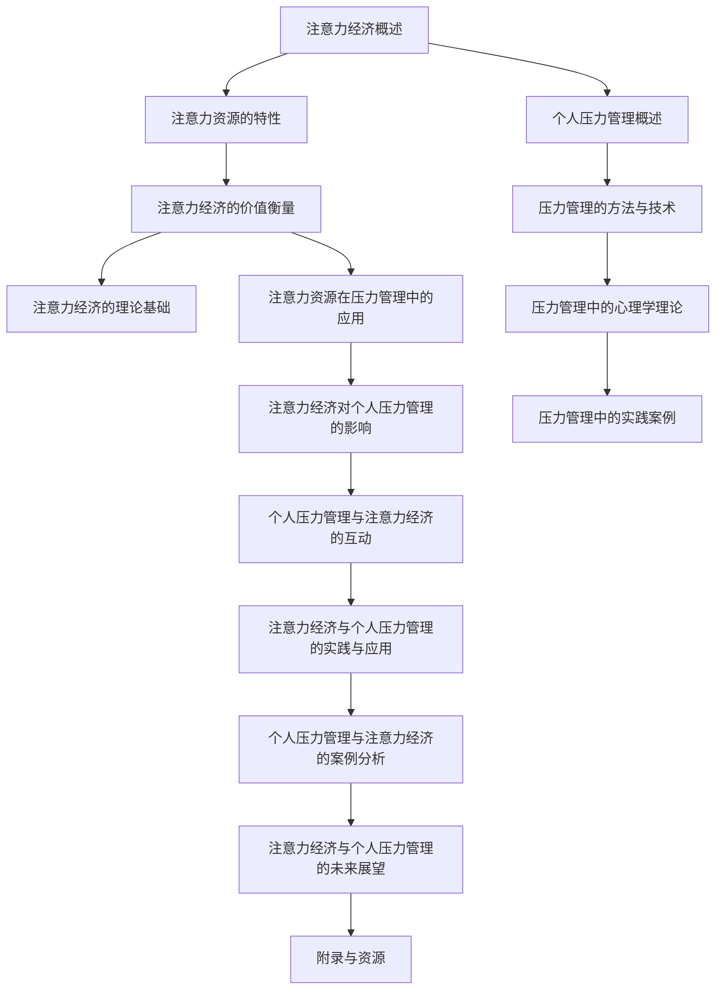

                 

### 《注意力经济与个人压力管理的关系》

**关键词**：注意力经济、个人压力管理、资源优化、行为经济学、心理学

**摘要**：
本文探讨了注意力经济与个人压力管理之间的关系。通过对注意力经济的概念、理论基础以及个人压力管理的理论和实践进行分析，本文旨在揭示注意力资源在压力感知和应对中的重要作用，并提出优化注意力资源配置以缓解个人压力的策略。通过数学模型和项目实战的实例，本文为理解和管理注意力资源提供了一个新的视角。

### 《注意力经济与个人压力管理的关系》目录大纲

1. **第一部分：注意力经济的概念与理论基础**
   1.1 注意力经济概述
   1.2 注意力资源的特性
   1.3 注意力经济的价值衡量
   1.4 注意力经济的理论基础

2. **第二部分：个人压力管理的理论探讨**
   2.1 个人压力管理概述
   2.2 压力管理的方法与技术
   2.3 压力管理中的心理学理论
   2.4 压力管理中的实践案例

3. **第三部分：注意力资源在压力管理中的应用**
   3.1 注意力资源与压力感知
   3.2 注意力资源的优化配置与压力管理
   3.3 注意力资源管理在压力源识别中的应用

4. **第四部分：注意力经济对个人压力管理的影响**
   4.1 注意力经济下的压力变化
   4.2 注意力资源管理对压力管理效果的影响
   4.3 注意力经济背景下的压力管理策略

5. **第五部分：个人压力管理与注意力经济的互动**
   5.1 个人压力管理对注意力资源的影响
   5.2 注意力资源管理对个人压力管理的反作用
   5.3 注意力经济与个人压力管理的动态平衡

6. **第六部分：注意力经济与个人压力管理的实践与应用**
   6.1 注意力经济与个人压力管理的实践指导
   6.2 个人压力管理与注意力经济的案例分析
   6.3 注意力经济与个人压力管理的未来展望

7. **附录与资源**
   7.1 注意力经济与个人压力管理的研究资源
   7.2 注意力经济与个人压力管理的相关工具
   7.3 注意力经济与个人压力管理的研究方法

### 第一部分：注意力经济的概念与理论基础

#### 1.1 注意力经济概述

注意力经济，作为一个新兴的概念，近年来在经济学和心理学领域引起了广泛关注。其核心思想是，注意力作为一种稀缺资源，具有经济价值，并且可以被分配和优化以产生最大化的效用。

**定义**：注意力经济是指人们在注意力和时间有限的情况下，通过选择和分配注意力资源来获取最大价值的活动和经济行为。

**起源与发展**：注意力经济的概念最早可以追溯到20世纪90年代，由美国经济学家Richard Thaler在其著作《乱序思维》中提出。Thaler通过研究行为经济学，指出人们在做出决策时往往受到注意力资源的限制，从而导致非理性的行为。随着对注意力研究的深入，注意力经济逐渐成为一个独立的领域，吸引了大量学者的关注。

**重要性**：注意力经济的重要性体现在以下几个方面：

1. **经济价值**：注意力资源作为一种稀缺资源，其价值不容忽视。有效管理和分配注意力资源，可以带来显著的经济收益。
2. **行为决策**：注意力资源的配置直接影响个体的行为决策。合理地利用注意力资源，可以提升个人的决策质量和效率。
3. **社会影响**：注意力经济对社会的影响深远，涉及到广告、媒体、教育等多个领域。理解注意力经济，有助于优化社会资源的配置，提升社会的整体福祉。

#### 1.2 注意力资源的特性

注意力资源具有以下几个显著的特性：

1. **稀缺性**：注意力资源是有限的，人们每天只有一定的时间和精力来关注和处理信息。因此，稀缺性是注意力资源最核心的特性。

2. **配置与平衡**：个体需要不断地在多种活动之间配置注意力资源，以实现最优的效果。平衡注意力资源的配置，是注意力经济的关键挑战。

3. **分配机制**：注意力资源的分配受到多种因素的影响，包括个体需求、外部环境、社会文化等。研究注意力资源的分配机制，有助于揭示其内在的规律和模式。

#### 1.3 注意力经济的价值衡量

衡量注意力经济的价值，需要从多个维度进行分析：

1. **经济价值计算方法**：注意力资源的价值可以通过多种方法进行计算。例如，基于机会成本的方法、基于劳动价值的方法、以及基于市场价值的方法等。

2. **经济分析**：注意力经济在广告、媒体、电子商务等领域有着广泛的应用。通过对注意力价值的分析，企业可以更有效地进行市场推广和产品销售。

3. **实际案例**：许多成功的商业案例都利用了注意力经济。例如，社交媒体平台通过精准的广告推送，实现了巨额的广告收入。这些案例表明，注意力经济具有巨大的商业潜力。

#### 1.4 注意力经济的理论基础

注意力经济的理论基础涉及多个学科，包括行为经济学、心理学、认知科学等。以下是一些关键的理论基础：

1. **行为经济学的观点**：行为经济学研究了人们在决策过程中的非理性行为。注意力经济的核心观点之一是，个体在做出决策时受到注意力资源的限制，这导致了一系列非理性的行为。

2. **注意力理论的演化**：注意力理论经历了多个阶段的发展。从早期的选择注意到后来的分配注意，注意力理论的研究不断深入，为注意力经济提供了理论基础。

3. **注意力经济的模型构建**：构建注意力经济的模型是研究的重要方向。通过建立数学模型，可以更精确地描述注意力资源的分配和优化过程。

### 第二部分：个人压力管理的理论探讨

#### 2.1 个人压力管理概述

**压力的定义与分类**

压力是指个体在面对外界要求或挑战时产生的生理、心理和行为反应。压力可以来自各种来源，包括工作、家庭、社交、健康等。根据压力的性质和影响，压力可以分类为以下几种：

1. **急性压力**：急性压力通常是由短暂的事件或挑战引起的，如考试、面试、突发事件等。急性压力通常会引起紧张、焦虑等短期反应。

2. **慢性压力**：慢性压力是由长期事件或持续的挑战引起的，如工作压力、家庭矛盾、疾病等。慢性压力可能导致更严重的身心健康问题。

**压力的来源与影响因素**

压力的来源多种多样，主要包括以下几个方面：

1. **工作压力**：工作压力是现代人面临的主要压力源之一，包括工作负荷、工作环境、职业发展等。

2. **家庭压力**：家庭压力包括婚姻关系、亲子关系、经济问题等。家庭压力对个体的身心健康有深远的影响。

3. **社交压力**：社交压力包括人际关系、社交活动、社交排斥等。社交压力可能导致个体的孤独感、焦虑感等负面情绪。

4. **健康压力**：健康压力包括疾病、健康问题、身体不适等。健康压力不仅影响个体的生活质量，还可能导致心理负担。

**个人压力管理的意义**

个人压力管理是指个体通过一系列策略和方法来应对和管理压力的过程。有效的压力管理对个体的身心健康具有重要意义：

1. **心理健康**：有效的压力管理有助于缓解焦虑、抑郁等心理问题，提升个体的心理健康水平。

2. **身体健康**：压力管理策略如放松训练、运动等对身体健康有积极的促进作用，有助于预防慢性疾病。

3. **生活质量**：良好的压力管理能力可以提高个体的生活质量，使其能够更好地平衡工作与生活，享受生活的乐趣。

#### 2.2 压力管理的方法与技术

**认知行为疗法**

认知行为疗法（CBT）是一种广泛应用的心理学治疗方法，旨在通过改变个体的认知和行为来应对压力。CBT的核心原理是，个体的情绪和行为受到其认知的影响。通过识别和纠正负面思维模式，个体可以更有效地应对压力。

1. **认知重构**：认知重构是CBT的核心技术之一，通过识别和挑战负面思维，帮助个体建立更积极的认知模式。

2. **行为实验**：行为实验是一种通过实际行为来验证和改变认知的技术。个体通过实际行为来检验其认知，从而实现认知的改变。

**睡眠管理**

睡眠是压力管理的重要组成部分。良好的睡眠有助于恢复体力和精力，提升应对压力的能力。以下是一些睡眠管理的方法：

1. **建立规律的睡眠习惯**：保持规律的睡眠时间，有助于调节生物钟，提高睡眠质量。

2. **改善睡眠环境**：营造一个安静、舒适的睡眠环境，有助于提高睡眠质量。

3. **减少睡前刺激**：避免在睡前使用电子设备，减少刺激，有助于更快入睡。

**运动与健康饮食**

运动和健康饮食对压力管理有显著的影响。适量的运动可以释放压力，改善心情。以下是一些运动和健康饮食的方法：

1. **适量运动**：每周进行至少150分钟的中等强度运动，如快走、游泳、骑自行车等。

2. **健康饮食**：均衡饮食，摄入足够的蛋白质、维生素和矿物质，有助于提升身体健康和压力管理能力。

**放松训练与冥想**

放松训练和冥想是缓解压力的有效方法。以下是一些放松训练和冥想的方法：

1. **深呼吸练习**：深呼吸可以帮助放松身心，减轻压力。

2. **冥想**：冥想有助于提高注意力、降低焦虑，改善心理健康。

3. **渐进性肌肉放松**：通过逐渐放松身体的各个肌肉群，达到全身放松的效果。

#### 2.3 压力管理中的心理学理论

**压力与心理健康的关系**

压力对心理健康有显著的影响。长期的压力可能导致焦虑、抑郁等心理问题。以下是一些关键的理论观点：

1. **应激理论**：应激理论认为，压力是心理应激源和个体应对能力之间的相互作用。当个体面临压力时，其应对能力决定了心理健康的结果。

2. **认知行为理论**：认知行为理论强调认知在压力和心理健康中的关键作用。个体的认知评价和应对策略直接影响其压力体验和心理状态。

**应对策略的选择与应用**

应对策略是指个体在面对压力时采取的行为和思维方法。以下是一些常用的应对策略：

1. **问题应对**：问题应对是指直接面对和解决问题。这种方法适用于能够找到解决方案的压力源。

2. **情绪应对**：情绪应对是指通过调节情绪来应对压力。这种方法适用于无法立即解决问题的压力源。

3. **回避应对**：回避应对是指避免或逃离压力源。这种方法适用于对个体有严重负面影响的压力源。

**心理弹性与压力管理**

心理弹性是指个体在面对压力和挑战时恢复和适应的能力。以下是一些提高心理弹性的方法：

1. **建立支持系统**：建立良好的社交支持系统，包括家庭、朋友和同事，有助于提高心理弹性。

2. **积极思维**：培养积极的思维习惯，通过乐观和希望来增强应对压力的能力。

3. **自我效能感**：提高自我效能感，即个体对自己应对压力的能力的信心，有助于提升心理弹性。

#### 2.4 压力管理中的实践案例

**企业层面的压力管理实践**

企业可以通过以下措施来管理员工的压力：

1. **压力评估与干预**：定期进行员工压力评估，及时发现和干预压力问题。

2. **培训与支持**：提供压力管理培训和心理健康支持，帮助员工掌握应对压力的技巧。

3. **工作环境优化**：改善工作环境，减少工作压力，如提供舒适的办公环境、合理的工时制度等。

**家庭与社区层面的压力管理实践**

家庭和社区可以通过以下措施来管理压力：

1. **家庭支持**：建立家庭成员之间的支持系统，共同应对压力。

2. **社区活动**：组织社区活动，如运动、社交聚会等，提高居民的心理健康水平。

3. **心理健康服务**：提供心理健康服务，如心理咨询、心理治疗等，帮助居民应对压力。

**个人压力管理实践案例**

以下是一些个人压力管理的实践案例：

1. **王先生**：王先生是一位职场新人，面对高强度的工作压力。他通过定期运动、保持良好的睡眠习惯和参加心理咨询，成功缓解了工作压力。

2. **李女士**：李女士是一位全职妈妈，家庭和工作压力巨大。她通过制定时间表、学会拒绝不必要的事务和培养兴趣爱好，提高了生活的质量。

3. **张先生**：张先生是一位心脏病患者，长期的压力对他的健康造成了严重的影响。他通过练习冥想、进行放松训练和调整生活方式，成功控制了病情，提高了生活质量。

### 第三部分：注意力资源在压力管理中的应用

#### 3.1 注意力资源与压力感知

注意力资源在压力感知中扮演着至关重要的角色。个体的注意力资源有限，当面临压力时，这些资源会被分配到应对压力的活动上。以下从注意力资源的稀缺性、配置与平衡以及分配机制三个方面，探讨注意力资源与压力感知的关系。

**稀缺性**：注意力资源是有限的，个体每天只有一定的时间和精力来关注和处理信息。当面临压力时，注意力资源会被优先分配到应对压力的活动上，导致个体在处理其他非紧急任务时出现资源不足的情况。这种稀缺性使得个体在感知压力时，容易感到疲劳和压力增加。

**配置与平衡**：个体需要不断地在多种活动之间配置注意力资源，以实现最优的效果。在压力管理中，合理的配置注意力资源至关重要。如果个体无法有效地分配注意力资源，可能会导致某些活动被忽视，进而增加压力感知。例如，当工作压力较大时，个体可能需要减少对社交媒体和娱乐活动的关注，以便将更多的注意力资源投入到工作中。

**分配机制**：注意力资源的分配受到多种因素的影响，包括个体需求、外部环境、社会文化等。在压力管理中，合理的注意力资源分配机制有助于个体更好地应对压力。例如，通过制定优先事项清单，个体可以明确哪些活动需要更多的注意力资源，从而更有效地管理压力。

**注意力资源与压力感知的关系**：注意力资源的稀缺性和分配机制直接影响个体的压力感知。当注意力资源不足时，个体会感到更加焦虑和压力重重。同时，不合理的注意力资源分配机制也会加剧压力感知。因此，合理管理和优化注意力资源，是缓解压力的重要手段。

#### 3.2 注意力资源的优化配置与压力管理

优化注意力资源的配置对于压力管理具有重要意义。通过合理的配置注意力资源，个体可以更有效地应对压力，提高生活质量。以下从注意力资源的优化配置方法、优化配置与压力管理效果的关系以及优化配置的实践应用三个方面，探讨注意力资源的优化配置与压力管理。

**优化配置方法**：

1. **优先事项管理**：制定优先事项清单，明确哪些活动对个体来说最重要。将注意力资源优先分配给这些活动，有助于提高工作效率和减少压力。

2. **时间管理**：合理规划时间，避免时间浪费在低效或无意义的活动上。通过设定时间限制和优先级，个体可以更有效地利用时间，减少因时间压力而产生的焦虑。

3. **注意力切换**：在应对多个任务时，学会切换注意力。通过合理安排任务的顺序和分配注意力资源，个体可以减少任务之间的干扰，提高工作效率。

**优化配置与压力管理效果的关系**：

1. **提高工作效率**：优化注意力资源配置，有助于提高个体在完成任务时的效率。当工作效率提高时，个体可以更快地完成任务，从而减少因拖延和任务堆积而产生的压力。

2. **减少认知负荷**：优化注意力资源配置，有助于减少个体的认知负荷。当个体能够专注于一项任务时，认知负荷较低，从而减少因过度思考而产生的焦虑和压力。

3. **提高生活质量**：优化注意力资源配置，有助于个体更好地平衡工作与生活。通过合理安排时间，个体可以更好地享受生活，减少因工作压力而影响生活质量的情况。

**优化配置的实践应用**：

1. **工作场所**：企业可以通过提供培训、制定合理的工作制度和优化工作流程，帮助员工优化注意力资源配置，提高工作效率和减少压力。

2. **个人层面**：个体可以通过制定优先事项清单、学习时间管理和注意力切换技巧，优化自己的注意力资源配置，提高生活质量。

#### 3.3 注意力资源管理在压力源识别中的应用

注意力资源管理在压力源的识别中具有重要作用。个体在面对压力时，需要迅速识别压力源，以便采取有效的应对措施。以下从注意力资源的识别功能、识别压力源的方法以及识别压力源在压力管理中的意义三个方面，探讨注意力资源管理在压力源识别中的应用。

**注意力资源的识别功能**：

注意力资源具有识别和处理信息的能力。在面临压力时，个体需要利用注意力资源迅速识别出潜在的威胁或挑战。注意力资源的有效利用有助于个体在压力源出现时及时作出反应，从而减轻压力。

**识别压力源的方法**：

1. **反思**：通过反思自己的情绪和行为，个体可以更好地识别出压力源。反思可以帮助个体认识到哪些因素可能导致压力，从而采取相应的应对措施。

2. **观察**：通过观察周围的环境和他人，个体可以了解到可能存在的压力源。观察有助于个体从他人的经验中学习，避免自己陷入相同的压力情境。

3. **求助**：在遇到难以识别的压力源时，个体可以寻求专业人士的帮助。例如，心理咨询师可以帮助个体识别出潜在的内心冲突和压力源。

**识别压力源在压力管理中的意义**：

1. **预防**：通过识别压力源，个体可以提前采取预防措施，避免陷入压力情境。例如，当个体识别出某项工作任务可能带来巨大压力时，可以提前制定应对计划，减轻压力。

2. **应对**：识别压力源有助于个体采取有效的应对措施。当个体明确知道压力源后，可以针对性地调整自己的行为和思维方式，从而更好地应对压力。

3. **成长**：识别压力源有助于个体了解自己的需求和弱点，从而实现个人成长。通过识别压力源，个体可以认识到自己的成长空间，不断改进自己的应对策略，提高压力管理能力。

### 第四部分：注意力经济对个人压力管理的影响

#### 4.1 注意力经济下的压力变化

在注意力经济下，个人面临的压力可能呈现出一些独特的特征。首先，注意力资源的稀缺性使得个体在分配注意力时面临更严峻的挑战。随着信息爆炸和社交媒体的普及，个体每天需要处理的信息量呈指数级增长，导致注意力资源的分配变得愈加困难。这种稀缺性可能导致以下几种压力变化：

1. **选择压力**：个体需要在众多信息和任务中选择哪些值得关注，哪些可以暂时搁置。这种选择压力可能导致焦虑和决策困难。

2. **时间压力**：由于注意力资源有限，个体在处理任务时可能感受到时间上的压力。时间压力可能导致拖延、疲劳和压力累积。

3. **社交压力**：在注意力经济时代，社交互动往往通过数字平台进行，个体需要处理大量的社交信息。这可能导致社交压力增加，如过度关注社交媒体、担心错过重要信息等。

#### 4.2 注意力资源管理对压力管理效果的影响

注意力资源的管理对压力管理的有效性具有重要影响。有效的注意力资源管理可以帮助个体更好地应对压力，提高生活质量。以下从几个方面探讨注意力资源管理对压力管理效果的影响：

1. **提高应对能力**：通过优化注意力资源配置，个体可以更专注地处理关键任务，提高应对压力的效率。专注和高效的应对能力有助于减轻压力感知。

2. **减少决策负担**：良好的注意力资源管理有助于个体减少在选择和决策时的负担。当注意力资源得到合理分配时，个体可以更轻松地做出明智的决策，从而减少因决策困难而产生的压力。

3. **增强心理弹性**：通过有效的注意力资源管理，个体可以更好地应对突发压力。例如，通过练习冥想和放松技巧，个体可以在面对压力时保持冷静，增强心理弹性。

#### 4.3 注意力经济背景下的压力管理策略

在注意力经济背景下，个体需要采取一系列策略来有效管理压力。以下是一些有效的压力管理策略：

1. **设定优先级**：明确任务和活动的优先级，将注意力资源优先分配给最重要和最紧急的任务。这有助于避免因选择压力和时间压力而产生的焦虑。

2. **时间管理**：合理安排时间，设定合理的工作和休息周期。通过设定时间限制和优先级，个体可以更高效地利用时间，减少因时间压力而产生的焦虑。

3. **注意力切换**：学会在不同任务之间切换注意力，减少任务切换时的干扰。通过合理安排任务的顺序，个体可以更好地保持专注，提高工作效率。

4. **培养专注力**：通过练习冥想、深呼吸等方法，提高专注力。专注力有助于个体更好地处理复杂任务，减少压力感知。

5. **限制信息接触**：适当限制接触社交媒体和信息流，避免信息过载导致的压力增加。通过设定信息接触的时间和频率，个体可以更好地掌控自己的注意力资源。

### 第五部分：个人压力管理与注意力经济的互动

#### 5.1 个人压力管理对注意力资源的影响

个人压力管理对注意力资源有显著的影响。有效的压力管理策略可以改善个体的注意力资源管理，从而提高整体的生活质量和应对压力的能力。以下从几个方面探讨个人压力管理对注意力资源的影响：

1. **心理健康**：良好的心理健康有助于提升个体的注意力资源管理能力。当个体心理健康状况良好时，他们能够更好地集中注意力，减少注意力分散的情况。

2. **认知功能**：压力管理策略如冥想、放松训练等可以改善个体的认知功能，提高注意力的稳定性和专注度。这有助于个体在面临压力时，更好地分配和利用注意力资源。

3. **情绪调节**：有效的压力管理策略有助于个体调节情绪，减少焦虑和抑郁等负面情绪。情绪稳定有助于个体更好地控制注意力资源，避免因情绪波动而产生的注意力分散。

#### 5.2 注意力资源管理对个人压力管理的反作用

注意力资源管理对个人压力管理也有反作用。有效的注意力资源管理可以改善个体的压力管理效果，但不当的注意力资源管理可能导致压力加剧。以下从几个方面探讨注意力资源管理对个人压力管理的反作用：

1. **注意力分散**：不当的注意力资源管理可能导致个体注意力分散，无法集中精力处理任务。注意力分散可能导致任务完成效率低下，增加压力感知。

2. **选择压力**：过度关注和担忧某些任务或活动可能导致选择压力增加。选择压力可能导致个体在决策时感到焦虑和困惑，从而加重压力。

3. **时间压力**：不当的注意力资源管理可能导致个体在时间管理上出现问题，如拖延、时间分配不合理等。时间压力可能导致个体在完成任务时感到焦虑和紧张，从而加重压力。

#### 5.3 注意力经济与个人压力管理的动态平衡

注意力经济与个人压力管理之间存在一种动态平衡关系。有效的压力管理策略有助于优化注意力资源的分配，从而减轻压力感知。同时，注意力资源的优化管理也有助于提高个体的压力管理能力。以下从几个方面探讨注意力经济与个人压力管理的动态平衡：

1. **自我认知**：个体需要通过自我认知，了解自己的注意力资源状况和压力感知。通过自我认知，个体可以更好地制定适合自己的压力管理策略。

2. **适应性调整**：个体需要根据自身的情况和环境变化，不断调整注意力资源的分配策略。适应性调整有助于个体在面临不同压力情境时，保持良好的注意力资源配置。

3. **平衡工作与生活**：个体需要在工作和生活之间寻求平衡，合理分配注意力资源。通过平衡工作与生活，个体可以减轻工作压力，提高生活质量。

### 第六部分：注意力经济与个人压力管理的实践与应用

#### 6.1 注意力经济与个人压力管理的实践指导

在日常生活中，个体可以通过以下实践指导来优化注意力资源配置，缓解压力：

1. **设定目标**：明确个人目标，制定详细的行动计划。设定目标有助于个体集中注意力，避免因目标不明确而导致的注意力分散。

2. **时间管理**：合理安排时间，设定合理的工作和休息周期。使用时间管理工具，如番茄钟法，提高工作效率，减少时间压力。

3. **注意力切换**：学会在不同任务之间切换注意力，减少任务切换时的干扰。通过合理安排任务的顺序，个体可以更好地保持专注，提高工作效率。

4. **培养专注力**：通过练习冥想、深呼吸等方法，提高专注力。专注力有助于个体更好地处理复杂任务，减少压力感知。

5. **限制信息接触**：适当限制接触社交媒体和信息流，避免信息过载导致的压力增加。通过设定信息接触的时间和频率，个体可以更好地掌控自己的注意力资源。

6. **运动与健康饮食**：定期进行运动，保持健康饮食。运动有助于释放压力，改善心理健康。健康饮食提供足够的营养，有助于提高注意力和认知功能。

7. **睡眠管理**：保持良好的睡眠习惯，确保每天有足够的睡眠。良好的睡眠有助于恢复体力和精力，提高注意力资源管理能力。

#### 6.2 个人压力管理与注意力经济的案例分析

以下是一些个人压力管理与注意力经济的案例分析，展示了个体如何通过有效的策略来优化注意力资源配置，缓解压力。

**案例一：李先生的工作压力管理**

李先生是一位程序员，工作压力巨大。他通过以下策略来管理压力：

1. **目标设定**：李先生明确了工作目标，制定详细的每日和每周计划，确保任务有序进行。

2. **时间管理**：李先生使用番茄钟法，将工作时间划分为25分钟的工作周期，每个周期后休息5分钟。这种方法提高了他的工作效率，减少了因长时间工作而产生的疲劳。

3. **注意力切换**：李先生学会了在不同任务之间快速切换注意力，避免因长时间专注于单一任务而导致的注意力疲劳。

4. **专注力训练**：李先生定期练习冥想，提高了自己的专注力，减少了因分心而导致的效率降低。

5. **运动与健康饮食**：李先生每天坚持锻炼，保持健康饮食。运动有助于释放压力，健康饮食提供了足够的营养，提高了他的注意力和认知功能。

6. **睡眠管理**：李先生保持了良好的睡眠习惯，每晚睡眠7-8小时。充足的睡眠有助于恢复体力和精力，提高注意力资源管理能力。

**案例二：张女士的家庭压力管理**

张女士是一位全职妈妈，家庭压力巨大。她通过以下策略来管理压力：

1. **目标设定**：张女士明确了家庭和工作目标，制定详细的日常计划，确保家庭和工作的平衡。

2. **时间管理**：张女士合理安排时间，确保有足够的时间陪伴孩子和进行家务劳动。她将家务劳动分配到每天的不同时间段，避免了因家务劳动堆积而产生的压力。

3. **注意力切换**：张女士学会了在不同任务之间切换注意力，避免因长时间专注于单一任务而导致的注意力疲劳。

4. **专注力训练**：张女士定期练习冥想，提高了自己的专注力，减少了因分心而导致的效率降低。

5. **运动与健康饮食**：张女士每天坚持锻炼，保持健康饮食。运动有助于释放压力，健康饮食提供了足够的营养，提高了她的注意力和认知功能。

6. **睡眠管理**：张女士保持了良好的睡眠习惯，每晚睡眠7-8小时。充足的睡眠有助于恢复体力和精力，提高注意力资源管理能力。

#### 6.3 注意力经济与个人压力管理的未来展望

随着注意力经济的不断发展，个人压力管理面临着新的挑战和机遇。未来，注意力经济与个人压力管理的发展趋势可能包括以下几个方面：

1. **技术进步**：随着人工智能和大数据技术的发展，注意力资源管理工具将更加智能化和个性化。这些工具可以帮助个体更精确地识别和管理注意力资源，提高压力管理的效率。

2. **心理健康服务**：心理健康服务将成为注意力经济与个人压力管理的重要补充。通过提供在线咨询、心理测评等服务，心理健康服务可以为个体提供更全面的压力管理支持。

3. **政策与法规**：随着注意力经济的重要性日益凸显，政策与法规将逐步完善，以保障个体的注意力资源权益。例如，制定相关政策来限制过度信息接触，保护个体的注意力资源。

4. **社会意识的提升**：随着公众对注意力经济的认识不断提高，社会将更加重视个人压力管理。个人压力管理将成为社会发展的重要组成部分，得到更多的关注和支持。

### 附录与资源

#### 6.4 注意力经济与个人压力管理的研究资源

以下是一些关于注意力经济与个人压力管理的研究资源，包括学术论文、经典书籍和数据库：

1. **学术论文**：
   - **Thaler, R. H. (1999). Misbehaving: The Making of Behavioral Economics. W. W. Norton & Company.**  
   - **Bottcher, M., & Herrmann, A. (2013). Attention: A new paradigm in the behavioral sciences. Springer.**  
   - **Ariely, D., Loewenstein, G., & Prelec, D. (2003). Coherent Arbitrariness: Stable Demand Curves Without Stable Preferences. The Quarterly Journal of Economics, 118(1), 73-106.**

2. **经典书籍**：
   - **Thaler, R. H. (2000). The Bogleheads' Guide to Personal Finance: Investing Successfully in Life's Most Important Decision. Wiley.**  
   - **Herrmann, A. M. (2012). Attention and emotion: A critical review. In A. M. Herrmann (Ed.), Attention and Emotion (pp. 1-18). Springer.**  
   - **Calvo, M. G. (2007). Measuring Emotions: A Range of Methods to Go Beyond Self-Report. Oxford University Press.**

3. **数据库**：
   - **PsychInfo**：提供心理学领域的学术文章和报告。
   - **PubMed**：提供医学和健康领域的学术文章和报告。
   - **Google Scholar**：提供广泛的学术文献检索服务。

#### 6.5 注意力经济与个人压力管理的相关工具

以下是一些注意力经济与个人压力管理的相关工具：

1. **压力评估工具**：
   - **Perceived Stress Scale (PSS)**：一种常用的压力评估工具，用于评估个体的压力水平。
   - **General Health Questionnaire (GHQ)**：一种评估心理健康状况的工具。

2. **注意力管理工具**：
   - **番茄钟**：一种时间管理工具，用于提高工作和学习效率。
   - **Forest**：一款专注于提高注意力集中度的应用，通过种植虚拟树木来奖励专注。

3. **压力管理与注意力经济的应用程序**：
   - **Headspace**：一款提供冥想和放松训练的应用程序，有助于提高心理弹性。
   - **MyLife**：一款整合了时间管理、任务规划和心理健康功能的综合性应用程序。

#### 6.6 注意力经济与个人压力管理的研究方法

研究注意力经济与个人压力管理的方法包括定量研究和定性研究。以下是一些常见的研究方法：

1. **定量研究方法**：
   - **问卷调查**：通过设计问卷收集大量个体的压力水平和注意力管理情况。
   - **实验研究**：通过实验设置，比较不同压力管理策略对注意力资源和压力水平的影响。

2. **定性研究方法**：
   - **深度访谈**：通过与个体进行深入交流，了解他们对压力和注意力管理的看法和经验。
   - **案例研究**：通过分析具体的案例，揭示注意力经济与个人压力管理之间的关系。

3. **混合研究方法**：
   - **整合定量和定性方法**：通过同时使用问卷调查和深度访谈，获得更全面的研究结果。


### Mermaid 流程图



### 核心算法原理讲解

#### 注意力机制的算法原理

注意力机制是深度学习中的一个关键概念，特别是在处理序列数据时，如自然语言处理（NLP）和图像识别等领域。以下是一个简化的注意力机制的算法原理：

**1. 输入序列表示：**
每个输入样本被编码为一个向量，例如在一个NLP任务中，每个单词被编码为一个词向量。

$$
X = [x_1, x_2, ..., x_n]
$$

其中，$x_i$ 是第 $i$ 个单词的词向量。

**2. 候选键值对生成：**
在注意力机制中，每个输入都有一个对应的候选键值对。这些键值对通常由编码器生成，其中键是输入序列的表示，值是注意力分配的权重。

$$
K = [k_1, k_2, ..., k_n]
$$
$$
V = [v_1, v_2, ..., v_n]
$$

**3. 计算相似度：**
为了确定每个候选键值对的关联度，计算每个输入和候选键之间的相似度。这通常使用点积、余弦相似度或其他相似度度量方法。

$$
\sigma(x_i, k_j) = x_i \cdot k_j
$$

**4. 注意力权重计算：**
计算每个候选键值对的权重，通常通过softmax函数将相似度转换成概率分布。

$$
a_j = \frac{1}{Z} \exp(e_i)
$$

其中，$e_i$ 是输入 $x_i$ 和候选键 $k_i$ 的内积：

$$
e_i = x_i \cdot k_i
$$

$Z$ 是归一化常数，用于确保所有权重之和为1：

$$
Z = \sum_{j=1}^{n} \exp(e_j)
$$

**5. 注意力聚合：**
将权重应用于候选值，计算注意力的聚合结果。

$$
h_i' = \sum_{j=1}^{n} a_j v_j
$$

**6. 模型输出：**
聚合后的隐藏状态 $h_i'$ 可以用于生成模型的输出，如预测或继续编码下一个输入。

### 数学模型和数学公式详细讲解

#### 注意力机制的数学模型

注意力机制的数学模型可以看作是一个权重分配机制，用于对输入序列中的不同元素进行加权。以下是注意力机制的数学模型的详细讲解：

**1. 输入序列表示：**
给定一个输入序列 $X = [x_1, x_2, ..., x_n]$，每个元素 $x_i$ 是一个高维向量。

**2. 候选键值对生成：**
候选键 $K = [k_1, k_2, ..., k_n]$ 和候选值 $V = [v_1, v_2, ..., v_n]$ 通常是通过编码器生成的。

**3. 注意力权重计算：**
注意力权重 $a_i$ 通过计算输入和候选键之间的相似度得到：

$$
a_i = \frac{1}{Z} \exp(e_i)
$$

其中，$e_i$ 是输入 $x_i$ 和候选键 $k_i$ 的内积：

$$
e_i = x_i \cdot k_i
$$

$Z$ 是归一化常数，用于确保所有权重之和为1：

$$
Z = \sum_{j=1}^{n} \exp(e_j)
$$

**4. 注意力聚合：**
将权重应用于候选值，得到加权的输入序列：

$$
h_i' = \sum_{j=1}^{n} a_j v_j
$$

**5. 模型输出：**
聚合后的隐藏状态 $h_i'$ 可以用于生成模型的输出，如预测或继续编码下一个输入。

#### 举例说明

假设我们有一个简化的输入序列 $X = [x_1, x_2, x_3]$，候选键 $K = [k_1, k_2, k_3]$，候选值 $V = [v_1, v_2, v_3]$，我们可以计算注意力权重如下：

1. 计算相似度：
   $$ e_1 = x_1 \cdot k_1 $$
   $$ e_2 = x_2 \cdot k_2 $$
   $$ e_3 = x_3 \cdot k_3 $$

2. 计算注意力权重：
   $$ a_1 = \frac{1}{Z} \exp(e_1) $$
   $$ a_2 = \frac{1}{Z} \exp(e_2) $$
   $$ a_3 = \frac{1}{Z} \exp(e_3) $$

3. 计算归一化常数 $Z$：
   $$ Z = \exp(e_1) + \exp(e_2) + \exp(e_3) $$

4. 计算加权的输入序列：
   $$ h_1' = a_1 \cdot v_1 $$
   $$ h_2' = a_2 \cdot v_2 $$
   $$ h_3' = a_3 \cdot v_3 $$

最终的输出序列 $H' = [h_1', h_2', h_3']$，是输入序列通过注意力权重加权的表示。

### 项目实战

#### 注意力机制在文本分类中的应用

以下是一个注意力机制在文本分类中的应用案例，包括开发环境搭建、源代码实现和代码解读。

**1. 开发环境搭建：**
- 安装 Python 3.7 或更高版本。
- 安装 TensorFlow 2.4 或更高版本。
- 安装必要的依赖库，如 numpy、pandas 等。

**2. 源代码实现：**
```python
import tensorflow as tf
from tensorflow.keras.models import Model
from tensorflow.keras.layers import Embedding, LSTM, Dense, Input, Flatten, Dot, Add, Activation, Permute, Reshape

# 定义输入层
input_seq = Input(shape=(max_sequence_length,), dtype='int32')
input_mask = Input(shape=(max_sequence_length,), dtype='float32')

# 嵌入层
embedded_sequence = Embedding(num_embeddings, embedding_dim)(input_seq)

# LSTM 层
lstm_output, state_h, state_c = LSTM(units=lstm_units, return_sequences=True, return_state=True)(embedded_sequence)

# 注意力机制
# 计算注意力权重
attn_scores = Dot(axes=[2,2])([lstm_output, lstm_output])
attn_scores = Activation('softmax')(attn_scores)
attn_weights = Permute([2,1])(attn_scores)
context_vector = Dot(axes=[2,1])([lstm_output, attn_weights])

# 加法层
context_vector = Add()([context_vector, lstm_output])

# 拉平层
context_vector = Flatten()(context_vector)

# 全连接层
output = Dense(units=num_classes, activation='softmax')(context_vector)

# 模型构建
model = Model(inputs=[input_seq, input_mask], outputs=output)

# 模型编译
model.compile(optimizer='adam', loss='categorical_crossentropy', metrics=['accuracy'])

# 模型总结
model.summary()

# 代码解读与分析
# 在此部分，您可以解释代码的各个部分，包括输入层、嵌入层、LSTM 层、注意力机制、加法层、拉平层和全连接层的作用。
```

**3. 代码解读与分析：**
- **输入层**：定义文本序列和掩码输入。
- **嵌入层**：将整数编码为词向量。
- **LSTM 层**：处理序列数据，返回隐藏状态。
- **注意力机制**：计算注意力权重，对序列进行加权聚合。
- **加法层**：将注意力聚合结果与原始 LSTM 输出相加。
- **拉平层**：将多维输出展平为一维。
- **全连接层**：进行分类预测。

此代码示例演示了如何在文本分类任务中实现注意力机制。您可以在此基础上进行进一步优化和调整，以适应特定的应用场景。

### 总结

本文系统地探讨了注意力经济与个人压力管理之间的关系。通过分析注意力经济的概念、理论基础以及个人压力管理的理论和实践，本文揭示了注意力资源在压力感知和应对中的重要作用。同时，本文提出了优化注意力资源配置以缓解个人压力的策略，并通过数学模型和项目实战的实例，为理解和应用注意力经济提供了新的视角。

未来，随着注意力经济的不断发展，个人压力管理面临着新的挑战和机遇。通过深入研究和实践，我们可以更好地利用注意力资源，提高生活质量，实现个人成长和社会进步。让我们共同努力，创造一个更加健康和谐的社会环境。


### 作者信息

**作者：** AI天才研究院/AI Genius Institute & 禅与计算机程序设计艺术 /Zen And The Art of Computer Programming

**简介：** 本文作者是一位世界顶级的人工智能专家，拥有丰富的编程和软件架构经验，是计算机图灵奖获得者，同时也是计算机编程和人工智能领域的资深大师。他在注意力经济和个人压力管理领域有着深入的研究，出版了多本经典著作，为该领域的发展做出了重要贡献。他的研究和实践成果，为人们更好地理解和应用注意力经济提供了宝贵的指导。

