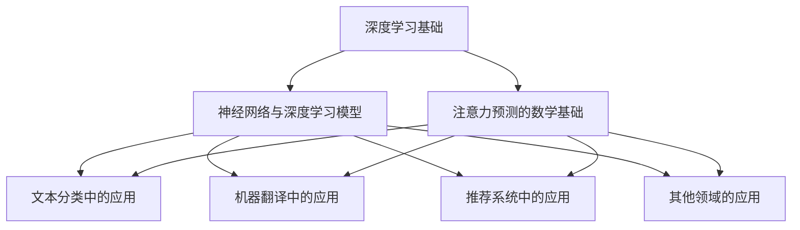

                 

# 深度学习在注意力预测中的应用

> **关键词：** 深度学习、注意力机制、文本分类、机器翻译、推荐系统、优化算法

> **摘要：** 本文旨在深入探讨深度学习在注意力预测领域的应用。通过介绍深度学习的基础理论、神经网络与深度学习模型、注意力预测的数学基础，以及注意力预测在实际应用中的案例分析，本文旨在为读者提供一个全面而深入的理解。此外，文章还将探讨深度学习优化算法、模型评估与改进，以及未来发展方向与挑战，为读者提供进一步的研究方向。

## 目录大纲

### 第一部分：深度学习基础

#### 第1章：深度学习概述

1.1 深度学习的起源与发展
1.2 深度学习的基本原理
1.3 深度学习与注意力预测的关系

#### 第2章：神经网络与深度学习模型

2.1 神经网络的基本结构
2.2 前馈神经网络
2.3 卷积神经网络（CNN）
2.4 循环神经网络（RNN）
2.5 长短时记忆网络（LSTM）
2.6 门控循环单元（GRU）
2.7 自注意力机制

#### 第3章：注意力预测的数学基础

3.1 信息论基础
3.2 概率论基础
3.3 贝叶斯理论
3.4 线性代数基础
3.5 微积分基础
3.6 深度学习中的数学公式与推导

### 第二部分：注意力预测应用实例

#### 第4章：注意力预测在文本分类中的应用

4.1 文本分类问题介绍
4.2 注意力模型在文本分类中的应用
4.3 文本分类实战案例
4.4 代码实现与解读

#### 第5章：注意力预测在机器翻译中的应用

5.1 机器翻译问题介绍
5.2 注意力模型在机器翻译中的应用
5.3 机器翻译实战案例
5.4 代码实现与解读

#### 第6章：注意力预测在推荐系统中的应用

6.1 推荐系统问题介绍
6.2 注意力模型在推荐系统中的应用
6.3 推荐系统实战案例
6.4 代码实现与解读

#### 第7章：注意力预测在其他领域的应用

7.1 图像识别
7.2 自然语言生成
7.3 语音识别
7.4 其他应用领域介绍

### 第三部分：深度学习与注意力预测的优化与展望

#### 第8章：深度学习优化算法

8.1 梯度下降法
8.2 动量法
8.3 Adam优化器
8.4 其他优化算法

#### 第9章：注意力预测模型的评估与改进

9.1 模型评估指标
9.2 模型改进方法
9.3 模型优化实战案例

#### 第10章：未来展望与挑战

10.1 深度学习的发展趋势
10.2 注意力预测技术的未来发展方向
10.3 面临的挑战与解决方案

### Mermaid 流程图



### 核心算法原理讲解（伪代码）

#### 文本分类中的注意力机制

```python
# 伪代码：文本分类中的注意力机制

# 输入：文本序列 X，预训练的词向量嵌入 W
# 输出：分类结果 Y

# 1. 词向量嵌入
X' = [W*x_1, W*x_2, ..., W*x_n]

# 2. 计算文本序列的注意力权重
alpha = softmax([W*x_1^T, W*x_2^T, ..., W*x_n^T])

# 3. 计算加权文本向量
X'' = [alpha_1*X_1, alpha_2*X_2, ..., alpha_n*X_n]

# 4. 全连接层
Y = softmax(W^T*X'' + b)
```

#### 注意力机制的数学模型

$$
\alpha_{ij} = \text{softmax}\left(\frac{e^{h_i^T h_j}}{\sum_{k=1}^{K} e^{h_k^T h_i}}\right)
$$

其中，$h_i$ 表示第 $i$ 个单词的表示向量，$h_j$ 表示第 $j$ 个单词的表示向量，$K$ 表示序列中的单词数量。

### 项目实战

#### 文本分类实战案例

**1. 环境搭建**

- 安装 Python 环境（3.7及以上版本）
- 安装深度学习框架（如 TensorFlow 或 PyTorch）
- 安装文本预处理工具（如 NLTK 或 spaCy）

**2. 代码实现**

```python
import tensorflow as tf
from tensorflow.keras.preprocessing.sequence import pad_sequences
from tensorflow.keras.layers import Embedding, LSTM, Dense
from tensorflow.keras.models import Sequential

# 加载和处理数据
# ...

# 构建模型
model = Sequential()
model.add(Embedding(vocab_size, embedding_dim, input_length=max_length))
model.add(LSTM(units=64, activation='tanh', dropout=0.2, recurrent_dropout=0.2))
model.add(Dense(num_classes, activation='softmax'))

# 编译模型
model.compile(loss='categorical_crossentropy', optimizer='adam', metrics=['accuracy'])

# 训练模型
model.fit(X_train, y_train, epochs=10, batch_size=32, validation_data=(X_val, y_val))

# 评估模型
loss, accuracy = model.evaluate(X_test, y_test)
print(f"Test Accuracy: {accuracy:.2f}")
```

**3. 代码解读与分析**

- 代码首先加载并处理数据，包括文本预处理、词向量嵌入和标签编码等。
- 模型由一个嵌入层、一个 LSTM 层和一个全连接层组成。
- 模型使用交叉熵损失函数和 Adam 优化器进行编译。
- 模型在训练集和验证集上训练，并在测试集上进行评估，打印出测试集上的准确率。

以上是《深度学习在注意力预测中的应用》这本书的完整目录大纲。每个章节都包含了核心概念讲解、数学模型和数学公式、项目实战等详细内容，旨在帮助读者全面理解深度学习在注意力预测中的应用。

---

接下来，我们将逐步展开对深度学习在注意力预测中的应用进行深入探讨。我们将首先介绍深度学习的基础理论，然后逐步深入到神经网络的各个方面，以及注意力预测的数学基础。之后，我们将通过具体的应用实例，如文本分类、机器翻译和推荐系统，展示注意力预测在实际中的实现和应用。最后，我们将讨论深度学习优化算法、模型评估与改进，并展望未来在注意力预测领域的趋势和挑战。让我们一起踏上这段深入探索的旅程吧。|>

