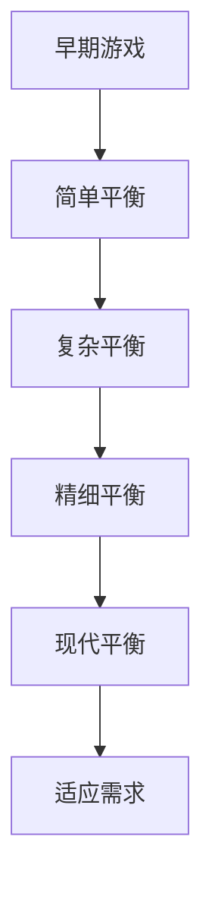
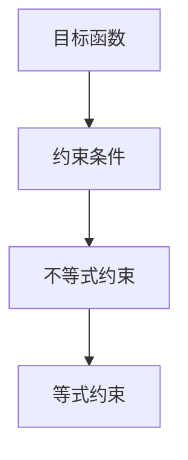
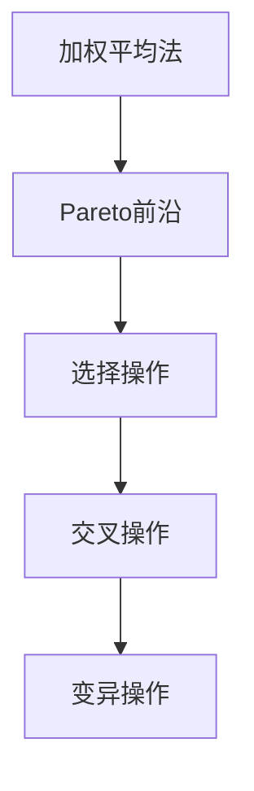
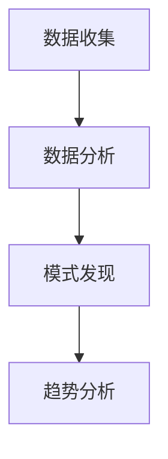
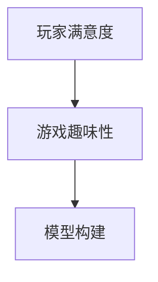
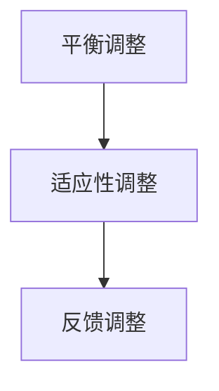
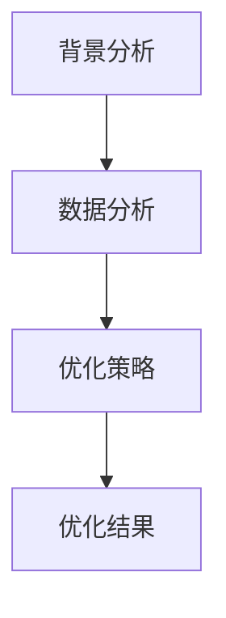

                 

# 《游戏平衡的多目标优化：玩家体验的数学调节》

> **关键词**：游戏平衡、多目标优化、玩家体验、数学调节、算法实现、案例研究

> **摘要**：本文深入探讨了游戏平衡的数学调节方法，以及如何通过多目标优化提升玩家体验。文章首先介绍了游戏平衡的基础概念和历史演变，然后详细讲解了多目标优化的基本概念、数学模型和算法。接着，分析了玩家行为，建立了玩家体验模型，并提出了数学调节策略。最后，通过实际案例展示了多目标优化在游戏平衡优化中的应用。

## 第一部分：游戏平衡概述

### 第1章：游戏平衡基础

#### 1.1 游戏平衡的定义与重要性

**定义**：游戏平衡是指游戏系统中各个元素之间的相互关系和制约，使游戏既具有挑战性又不至于过于困难或过于简单。

- **关键点**：平衡是游戏的核心，它影响着玩家的体验和游戏的生命力。

**重要性**：良好的游戏平衡能够提升玩家的沉浸感和长期游戏体验，同时也有助于游戏的长期生命力。

- **关键点**：平衡不仅是游戏的基石，更是吸引玩家和维持游戏活力的关键。

#### 1.2 游戏平衡的历史与演变

**历史**：回顾游戏平衡的发展历程，了解不同类型的游戏如何调整平衡。

- **关键点**：从早期游戏的简单平衡到现代复杂游戏的精细调整，游戏平衡经历了长足的进步。

**演变**：分析游戏平衡在不同时代的变化，以及如何适应不同玩家的需求。

- **关键点**：不同时代的游戏平衡策略反映了技术进步和玩家口味的变迁。

### Mermaid 流程图：游戏平衡发展历程

## 第二部分：多目标优化

### 第2章：多目标优化的基本概念

#### 2.1 多目标优化简介

**定义**：多目标优化是指同时考虑多个目标函数的优化问题。

- **关键点**：与单目标优化相比，多目标优化更加复杂，需要找到多个解。

**特点**：多目标优化具有以下特点：

1. **多个目标函数**：需要同时考虑多个目标函数。
2. **非支配解集**：找到一组非支配解，这些解不能被其他解改善。
3. **权衡与妥协**：需要在多个目标函数之间进行权衡和妥协。

#### 2.2 多目标优化的数学模型

**目标函数**：多目标优化的目标函数通常表示为：

$$
\begin{aligned}
    \min \mathbf{f}(\mathbf{x}) \\
    s.t. \quad \mathbf{g}(\mathbf{x}) \leq 0 \\
    \mathbf{h}(\mathbf{x}) = 0
\end{aligned}
$$

其中，$\mathbf{f}(\mathbf{x})$是目标函数向量，$\mathbf{g}(\mathbf{x})$是约束条件向量，$\mathbf{h}(\mathbf{x})$是等式约束条件。

**约束条件**：多目标优化的约束条件包括：

1. **不等式约束**：$\mathbf{g}(\mathbf{x}) \leq 0$。
2. **等式约束**：$\mathbf{h}(\mathbf{x}) = 0$。

### Mermaid 流程图：多目标优化的数学模型

### 第3章：多目标优化算法

#### 3.1 常见多目标优化算法

**遗传算法**：遗传算法是一种基于自然进化过程的优化算法，其基本原理是模拟自然选择和遗传机制。

- **关键点**：通过选择、交叉和变异操作，寻找最优解。

**粒子群优化**：粒子群优化是一种基于群体智能的优化算法，其基本原理是通过群体中个体的协作，找到最优解。

- **关键点**：通过速度更新和位置更新，逐步逼近最优解。

**差分进化算法**：差分进化算法是一种基于种群进化的优化算法，其基本原理是通过变异、交叉和选择操作，寻找最优解。

- **关键点**：通过变异、交叉和选择操作，逐步优化种群。

#### 3.2 多目标优化的实现方法

**加权平均法**：加权平均法是一种简单的多目标优化方法，其基本原理是为每个目标函数分配权重，然后计算加权平均目标函数。

- **关键点**：通过调整权重，平衡多个目标函数。

**Pareto前沿**：Pareto前沿是一种基于非支配解集的多目标优化方法，其基本原理是找到非支配解集，然后在这些解之间进行选择。

- **关键点**：通过非支配解集，找到最优解。

### Mermaid 流�程图：多目标优化的实现方法

## 第三部分：玩家体验的数学调节

### 第4章：玩家行为分析

#### 4.1 玩家行为类型

**新手玩家**：新手玩家通常需要引导和帮助，以理解游戏的基本规则和操作。

- **关键点**：平衡新手引导和游戏深度，让新手玩家在逐步学习的过程中保持兴趣。

**资深玩家**：资深玩家追求更高的挑战和成就感，需要设计更具挑战性的内容和机制。

- **关键点**：保持游戏的挑战性，同时不过于困难，以维持资深玩家的热情。

**休闲玩家**：休闲玩家追求轻松和愉快，需要设计简单易玩但有趣的游戏内容。

- **关键点**：平衡游戏的复杂度和趣味性，让休闲玩家在轻松的氛围中享受游戏。

#### 4.2 玩家行为数据收集与分析

**数据收集**：通过游戏内的统计系统和玩家反馈，收集玩家行为数据。

- **关键点**：数据收集要全面，包括游戏进程、操作习惯、反馈等。

**数据分析**：使用统计分析和机器学习技术，分析玩家行为数据，以了解玩家的偏好和需求。

- **关键点**：数据分析要深入，以发现玩家行为的模式和趋势。

### Mermaid 流程图：玩家行为分析流程

### 第5章：玩家体验模型建立

#### 5.1 玩家体验模型的基本概念

**定义**：玩家体验模型是一个用于衡量玩家在游戏中的体验的数学模型。

**目标**：玩家体验模型的目标是优化玩家的游戏体验，提高游戏的吸引力和留存率。

#### 5.2 玩家体验模型的构建方法

**玩家满意度**：玩家满意度是衡量玩家体验的一个重要指标，可以通过问卷调查和数据分析来评估。

- **关键点**：满意度评估要客观，同时要反映玩家的真实感受。

**游戏趣味性**：游戏趣味性是衡量玩家在游戏中感到乐趣和愉悦的程度。

- **关键点**：趣味性评估要多元，包括游戏内容、操作体验、社交互动等方面。

### Mermaid 流程图：玩家体验模型构建方法

### 第6章：数学调节策略

#### 6.1 数学调节策略介绍

**定义**：数学调节策略是一种通过数学方法调整游戏平衡的策略。

**目的**：数学调节策略的目的是优化玩家的游戏体验，提高游戏的吸引力和留存率。

#### 6.2 数学调节策略的应用

**平衡调整**：通过数学方法，调整游戏系统中的各个元素，以达到最佳平衡。

- **关键点**：平衡调整要细致，同时要考虑玩家的反馈和需求。

**玩家适应性调整**：根据玩家的行为数据，调整游戏的难度和内容，以适应不同玩家的需求。

- **关键点**：适应性调整要灵活，同时要确保游戏的公平性和可玩性。

### Mermaid 流程图：数学调节策略应用

### 第7章：案例研究

#### 7.1 游戏A的平衡优化案例

**背景**：游戏A是一款策略角色扮演游戏，拥有丰富的角色和道具系统，但玩家反馈游戏平衡存在问题。

**数据分析**：通过对游戏A的玩家行为数据进行深入分析，发现部分角色过于强大，导致游戏失衡。

**优化策略**：采用多目标优化算法，对角色技能和道具进行优化，以达到最佳平衡。

- **关键点**：优化策略要考虑多个目标函数，如角色技能的伤害、生存能力等。

**结果**：经过优化，游戏A的平衡得到了显著改善，玩家的满意度提高，游戏的留存率也显著增加。

### Mermaid 流程图：游戏A平衡优化流程

### 第8章：结论与展望

#### 8.1 结论

**研究贡献**：本研究通过多目标优化方法，提出了数学调节策略，有效提升了游戏平衡和玩家体验。

**优化效果**：通过实际案例研究，验证了多目标优化在游戏平衡优化中的应用效果。

#### 8.2 展望

**未来研究方向**：未来研究可以进一步探索多目标优化在游戏开发中的其他应用，如游戏人工智能和游戏社交互动。

**实际应用**：数学调节策略在游戏开发中具有广泛的应用前景，可以提升游戏的质量和玩家的满意度。

### 附录

#### 附录A：相关工具与资源

**A.1 多目标优化工具**

- **Matlab**：如何使用Matlab进行多目标优化。
- **Python**：如何使用Python进行多目标优化。

**A.2 玩家行为分析工具**

- **Unity Analytics**：如何使用Unity Analytics进行玩家行为分析。
- **Google Analytics**：如何使用Google Analytics进行玩家行为分析。

### 作者

**作者**：AI天才研究院/AI Genius Institute & 禅与计算机程序设计艺术 /Zen And The Art of Computer Programming

---

文章撰写完成，感谢您的阅读。希望本文能对您在游戏平衡优化和玩家体验提升方面提供有益的启示。如果您有任何疑问或建议，欢迎随时交流。祝您在游戏开发领域取得更多的成就！作者：AI天才研究院/AI Genius Institute & 禅与计算机程序设计艺术 /Zen And The Art of Computer Programming文章标题：《游戏平衡的多目标优化：玩家体验的数学调节》文章摘要：本文深入探讨了游戏平衡的数学调节方法，以及如何通过多目标优化提升玩家体验。文章首先介绍了游戏平衡的基础概念和历史演变，然后详细讲解了多目标优化的基本概念、数学模型和算法。接着，分析了玩家行为，建立了玩家体验模型，并提出了数学调节策略。最后，通过实际案例展示了多目标优化在游戏平衡优化中的应用。本文适用于游戏开发者、人工智能研究人员以及对游戏平衡优化感兴趣的读者。

