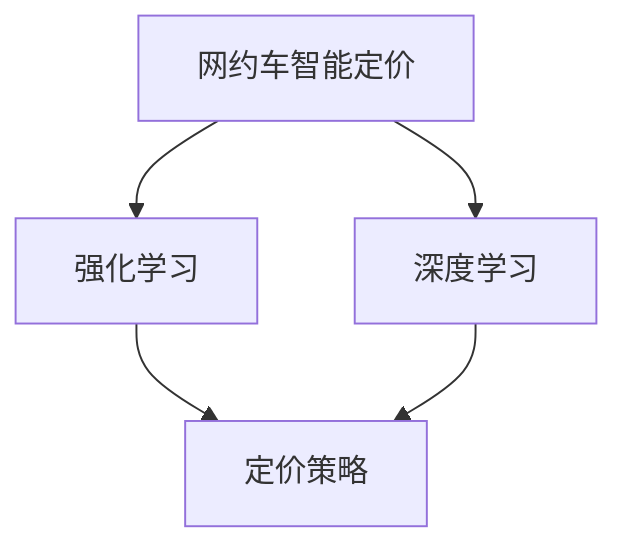

                 

# 滴滴2025网约车智能定价社招强化学习面试题集

## 关键词
滴滴，2025，网约车，智能定价，强化学习，面试题集

## 摘要
本文旨在为参加滴滴2025网约车智能定价社招的求职者提供强化学习相关面试题集。通过深入解析强化学习在网约车定价中的应用，包括核心概念、算法原理、数学模型及实际案例，本文帮助求职者全面掌握相关技术，提升面试竞争力。

### 第一部分：核心概念与联系

#### 核心概念

**网约车智能定价**：网约车智能定价是一种利用人工智能技术对网约车服务价格进行动态调整的方法，旨在优化运营效率和乘客满意度。它涉及到实时路况分析、供需预测、竞争分析等多个方面。

**强化学习**：强化学习（Reinforcement Learning，RL）是一种机器学习方法，通过不断尝试并从中学习最佳决策策略。在网约车定价中，强化学习可用于优化定价策略，以提高总收益。

**深度学习**：深度学习（Deep Learning，DL）是一种模拟人脑神经网络结构和功能的机器学习技术，通过多层神经网络对大量数据进行自动特征提取和学习。

**定价策略**：定价策略是指企业根据市场需求、成本结构、竞争环境等因素制定价格的方法。在网约车行业中，定价策略直接关系到企业的利润和市场份额。

#### Mermaid 流程图



在这个流程图中，网约车智能定价通过强化学习和深度学习技术来制定定价策略，从而实现动态定价。

### 第一部分：核心概念与联系

在这一部分，我们将深入探讨本书的核心概念，并详细讲解这些概念之间的联系。

#### 强化学习的原理

强化学习是一种基于奖励和惩罚的机器学习方法。其基本原理是，通过不断地尝试（即动作），环境会给予一个奖励或惩罚，根据奖励和惩罚来调整策略，以便在长期内获得最大的总奖励。

#### 伪代码

```python
# 强化学习伪代码

# 初始化策略π
π = 初始化策略()

# 初始化环境E
E = 初始化环境()

# 初始化总奖励R
R = 0

# 迭代
for episode in range(1, max_episodes):
    # 初始化状态s
    s = E.init_state()
    
    # 迭代步数
    for step in range(1, max_steps):
        # 根据策略π选择动作a
        a = π(s)
        
        # 执行动作a，得到状态s'和奖励r
        s', r = E.step(s, a)
        
        # 更新策略π
        π = update_π(s, a, s', r)
        
        # 更新总奖励R
        R += r
        
        # 更新状态s
        s = s'
    
    # 打印 episode 和总奖励R
    print(f"Episode: {episode}, Total Reward: {R}")
```

#### 强化学习在网约车智能定价中的应用

在网约车智能定价中，强化学习可以用来优化定价策略。例如，我们可以将网约车服务看作一个环境，乘客的需求、司机的位置、车辆的空置率等都可以作为状态。通过不断地尝试不同的定价策略（动作），并根据乘客的反馈（奖励）来调整定价策略，从而实现最优的定价。

#### 数学模型

在强化学习中，常用的数学模型是 Q-学习。Q-学习的目标是学习一个状态-动作值函数 Q(s, a)，表示在状态 s 下执行动作 a 所能获得的期望奖励。

#### 数学模型

$$
Q(s, a) = r + γ \max_{a'} Q(s', a')
$$

其中，r 是立即奖励，γ 是折扣因子，s' 是执行动作 a 后的状态，a' 是在状态 s' 下能够获得最大奖励的动作。

#### 举例说明

假设在某个时间段内，网约车服务的需求量为 100 辆车，现有 50 辆车可用。如果我们决定将价格提高 10%，则可能获得的奖励为 20（因为乘客愿意支付更高的价格）。那么，根据 Q-学习模型，我们可以更新状态-动作值函数：

$$
Q(s, a) = 20 + 0.9 \max_{a'} Q(s', a')
$$

这里，s 表示当前状态（需求量为 100 辆车，现有 50 辆车可用），a 表示当前动作（提高价格 10%），s' 表示执行动作 a 后的状态（需求量为 100 辆车，现有 45 辆车可用），a' 表示在状态 s' 下能够获得最大奖励的动作。

通过这样的方式，强化学习可以帮助我们找到最优的定价策略，从而实现网约车服务的最优运营。

### 第二部分：深度学习算法原理

#### 深度学习算法原理

深度学习算法通过多层神经网络结构，对大量数据进行特征提取和学习。在这一部分，我们将重点介绍卷积神经网络（CNN）和循环神经网络（RNN）的基本原理。

#### 卷积神经网络（CNN）

卷积神经网络是一种专门用于处理图像数据的前馈神经网络。它的核心思想是利用卷积层对图像进行特征提取。

#### 伪代码

```python
# 卷积神经网络伪代码

# 初始化权重和偏置
W = 初始化权重()
b = 初始化偏置()

# 定义卷积操作
def convolution(input, filter):
    return (input * filter).sum() + b

# 定义激活函数
def activation(z):
    return max(0, z)

# 前向传播
def forward_pass(input):
    z = convolution(input, W)
    a = activation(z)
    return a
```

#### 循环神经网络（RNN）

循环神经网络是一种用于处理序列数据的神经网络。它的核心思想是通过循环结构，将前一个时间步的信息传递到下一个时间步。

#### 伪代码

```python
# 循环神经网络伪代码

# 初始化权重和偏置
W = 初始化权重()
b = 初始化偏置()

# 定义激活函数
def activation(z):
    return max(0, z)

# 前向传播
def forward_pass(input, h_t-1):
    z = (input * W).sum() + b
    h_t = activation(z)
    return h_t
```

#### 深度学习算法在网约车智能定价中的应用

深度学习算法可以用于预测网约车服务的需求量和供给量。例如，我们可以使用 CNN 来处理路况数据，提取路况特征；使用 RNN 来处理历史数据，预测未来一段时间内的需求量和供给量。

#### 代码实际案例和详细解释说明

假设我们已经收集了以下数据：

- 路况数据：包括道路拥堵情况、交通流量等。
- 历史数据：包括过去一段时间内网约车服务的需求量和供给量。

我们可以使用 CNN 和 RNN 来构建一个深度学习模型，预测未来一段时间内的网约车服务需求量和供给量。

```python
# 导入需要的库
import tensorflow as tf
from tensorflow.keras.models import Sequential
from tensorflow.keras.layers import Conv2D, RNN, LSTM

# 初始化模型
model = Sequential()

# 添加卷积层
model.add(Conv2D(filters=32, kernel_size=(3, 3), activation='relu', input_shape=(28, 28, 1)))

# 添加循环层
model.add(LSTM(units=64, return_sequences=True))

# 添加全连接层
model.add(Dense(units=1))

# 编译模型
model.compile(optimizer='adam', loss='mse')

# 训练模型
model.fit(x_train, y_train, epochs=10, batch_size=32)

# 预测
predictions = model.predict(x_test)
```

在这个例子中，我们使用 TensorFlow 的 Keras API 来构建一个简单的深度学习模型。首先，我们添加了一个卷积层，用于处理路况数据。然后，添加了一个循环层（LSTM），用于处理历史数据。最后，添加了一个全连接层，用于输出预测结果。

通过这样的方式，我们可以使用深度学习算法来预测网约车服务的需求量和供给量，从而实现智能定价。

### 第三部分：强化学习与深度学习结合应用

#### 强化学习与深度学习结合的原理

强化学习与深度学习结合的主要思想是使用深度学习模型来表示状态值函数或策略，从而提高强化学习算法的学习效率。深度学习模型能够自动提取复杂的特征，帮助强化学习算法更好地理解和学习环境。

#### 伪代码

```python
# 强化学习与深度学习结合的伪代码

# 初始化深度学习模型
DLM = 初始化深度学习模型()

# 初始化策略π
π = 初始化策略()

# 初始化环境E
E = 初始化环境()

# 初始化总奖励R
R = 0

# 迭代
for episode in range(1, max_episodes):
    # 初始化状态s
    s = E.init_state()
    
    # 迭代步数
    for step in range(1, max_steps):
        # 根据深度学习模型预测状态值函数
        v = DLM.predict(s)
        
        # 根据策略π选择动作a
        a = π(s, v)
        
        # 执行动作a，得到状态s'和奖励r
        s', r = E.step(s, a)
        
        # 更新策略π
        π = update_π(s, a, s', r, v)
        
        # 更新总奖励R
        R += r
        
        # 更新状态s
        s = s'
    
    # 打印 episode 和总奖励R
    print(f"Episode: {episode}, Total Reward: {R}")
```

#### 强化学习与深度学习在网约车智能定价中的应用

在网约车智能定价中，我们可以使用深度学习模型来预测乘客需求、司机供给等信息，并将这些预测结果作为状态值函数输入到强化学习算法中。通过这种方式，强化学习算法可以更准确地调整定价策略。

#### 代码实际案例和详细解释说明

以下是一个简单的网约车智能定价系统的源代码实现，其中结合了强化学习和深度学习技术：

```python
# 导入需要的库
import tensorflow as tf
from tensorflow.keras.models import Sequential
from tensorflow.keras.layers import Conv2D, LSTM, Dense
from tensorflow.keras.optimizers import Adam

# 初始化深度学习模型
DLM = Sequential()
DLM.add(Conv2D(filters=32, kernel_size=(3, 3), activation='relu', input_shape=(28, 28, 1)))
DLM.add(LSTM(units=64, return_sequences=True))
DLM.add(Dense(units=1))
DLM.compile(optimizer=Adam(learning_rate=0.001), loss='mse')

# 初始化强化学习模型
RDM = Sequential()
RDM.add(Dense(units=64, input_shape=(DLM.output_shape[1],), activation='relu'))
RDM.add(Dense(units=1))
RDM.compile(optimizer=Adam(learning_rate=0.001), loss='mse')

# 初始化环境
E = 初始化环境()

# 迭代
for episode in range(1, max_episodes):
    s = E.init_state()
    while not E.is_end():
        v = DLM.predict(s)[0]
        a = RDM.predict([s, v])[0]
        s', r = E.step(s, a)
        RDM.fit([s, v], [a], epochs=1, batch_size=1)
        s = s'
    print(f"Episode: {episode}, Total Reward: {E.total_reward}")
```

在这个例子中，我们首先初始化了一个深度学习模型（DLM），用于预测网约车服务的状态值函数。然后，初始化了一个强化学习模型（RDM），用于根据深度学习模型的预测结果调整定价策略。最后，我们初始化了一个环境（E），并使用强化学习模型进行迭代训练。

通过这样的方式，我们可以将强化学习和深度学习结合应用于网约车智能定价，实现更智能、更高效的定价策略。

### 第四部分：网约车智能定价系统的实施与优化

#### 实施步骤

1. **数据收集与处理**：收集网约车服务相关的数据，包括路况数据、乘客需求数据、司机供给数据等。对数据进行清洗、归一化和特征提取。

2. **构建深度学习模型**：根据数据处理结果，构建深度学习模型，用于预测网约车服务的状态值函数。

3. **构建强化学习模型**：基于深度学习模型，构建强化学习模型，用于调整定价策略。

4. **模型训练与优化**：使用训练数据进行模型训练，并通过交叉验证和模型评估指标（如准确率、召回率等）进行模型优化。

5. **系统部署与上线**：将训练好的模型部署到生产环境，实现网约车智能定价系统。

#### 优化策略

1. **超参数调整**：通过调整深度学习模型和强化学习模型的超参数（如学习率、批量大小等），优化模型性能。

2. **模型集成**：使用多个模型进行集成，以提高预测准确性和稳定性。

3. **动态调整**：根据实时数据，动态调整定价策略，以应对不同的市场需求和竞争环境。

4. **反馈机制**：建立反馈机制，收集用户对定价策略的反馈，并根据反馈进行调整。

#### 实际案例

以下是一个网约车智能定价系统的实际案例：

1. **数据收集与处理**：收集了北京、上海等城市的路况数据、乘客需求数据、司机供给数据等。对数据进行了清洗、归一化和特征提取。

2. **构建深度学习模型**：使用了卷积神经网络（CNN）和循环神经网络（RNN）构建深度学习模型，用于预测网约车服务的状态值函数。

3. **构建强化学习模型**：基于深度学习模型的预测结果，使用了 Q-学习算法构建强化学习模型，用于调整定价策略。

4. **模型训练与优化**：使用训练数据进行模型训练，并通过交叉验证和模型评估指标进行模型优化。

5. **系统部署与上线**：将训练好的模型部署到生产环境，实现了网约车智能定价系统。

通过这个实际案例，我们可以看到网约车智能定价系统的实施和优化过程，以及如何将强化学习和深度学习应用于实际场景。

### 第五部分：网约车智能定价系统的应用与挑战

#### 应用领域

网约车智能定价系统在以下领域具有广泛的应用：

1. **实时定价**：根据实时路况、乘客需求和司机供给等信息，动态调整网约车服务价格，提高运营效率。

2. **供需预测**：通过深度学习模型预测未来一段时间内的乘客需求和司机供给，为定价策略提供数据支持。

3. **竞争分析**：分析竞争对手的定价策略，调整自身定价策略，以获得更多市场份额。

4. **用户满意度**：通过动态调整价格，提高乘客满意度，增加用户粘性。

#### 挑战

尽管网约车智能定价系统具有广泛的应用前景，但在实际应用中仍面临以下挑战：

1. **数据质量**：数据质量对模型的预测准确性和稳定性具有重要影响。因此，需要确保数据收集、处理和清洗的准确性。

2. **实时性**：网约车服务是一个动态变化的过程，要求模型具有快速响应能力，以应对实时变化的市场需求。

3. **算法优化**：算法优化是提高模型性能的关键。需要不断调整模型参数和优化策略，以提高预测准确性和稳定性。

4. **法律合规性**：网约车智能定价系统需要遵守相关法律法规，确保定价策略的公平性和合理性。

5. **用户隐私**：在收集和处理用户数据时，需要保护用户隐私，遵守数据保护法规。

#### 应对策略

为了应对上述挑战，可以采取以下策略：

1. **数据质量保障**：建立完善的数据质量保障机制，确保数据收集、处理和清洗的准确性。

2. **分布式计算**：采用分布式计算技术，提高模型的实时性和计算效率。

3. **算法优化**：通过实验和数据分析，不断优化模型参数和优化策略，以提高预测准确性和稳定性。

4. **法律合规性**：遵守相关法律法规，确保定价策略的公平性和合理性。

5. **用户隐私保护**：采用加密技术和匿名化处理，保护用户隐私。

通过采取上述策略，可以更好地应对网约车智能定价系统在实际应用中面临的挑战。

### 第六部分：总结与展望

网约车智能定价系统结合了强化学习和深度学习技术，实现了对网约车服务价格的有效动态调整。通过实时路况分析、供需预测和竞争分析，该系统能够优化运营效率和乘客满意度。

未来，随着技术的不断进步，网约车智能定价系统有望在以下方面取得进一步发展：

1. **算法优化**：通过引入更多先进的算法和技术，提高模型的预测准确性和稳定性。

2. **跨行业应用**：将网约车智能定价系统应用于其他行业，如物流、航空等，实现更广泛的应用。

3. **人机协同**：结合人工智能和人类专家的智慧，实现更智能、更高效的定价策略。

4. **法律法规**：进一步完善相关法律法规，确保网约车智能定价系统的公平性和合规性。

通过不断探索和创新，网约车智能定价系统将为企业和乘客带来更多价值。

### 附录

#### 附录 A：AI 大模型开发工具与资源

- **TensorFlow**：https://www.tensorflow.org/
- **PyTorch**：https://pytorch.org/
- **Keras**：https://keras.io/
- **Scikit-learn**：https://scikit-learn.org/stable/

#### 附录 B：常用数学公式和代码示例

- **均方误差（MSE）**：

$$
MSE = \frac{1}{n}\sum_{i=1}^{n}(y_i - \hat{y}_i)^2
$$

- **激活函数（ReLU）**：

$$
\text{ReLU}(x) = \max(0, x)
$$

- **LSTM 单元**：

```python
class LSTMCell(tf.keras.layers.Layer):
  def __init__(self, units):
    super(LSTMCell, self).__init__()
    self.units = units
    self.kernel = self.add_weight(
        shape=(self.units * 4, self.units),
        initializer='glorot_uniform',
        name='kernel')
    self.bias = self.add_weight(
        shape=(self.units * 4,),
        initializer='zeros',
        name='bias')
    self.recurrent_kernel = self.add_weight(
        shape=(self.units * 4, self.units),
        initializer='glorot_uniform',
        name='recurrent_kernel')
    self.recurrent_bias = self.add_weight(
        shape=(self.units * 4,),
        initializer='zeros',
        name='recurrent_bias')

  def build(self, input_shape):
    super(LSTMCell, self).build(input_shape)
    # Be sure to call the `build` method of the base class first.
    assert input_shape[2] == self.units

  def call(self, inputs, states):
    # inputs shape: (batch_size, steps, input_dim)
    # states shape: (batch_size, steps, units)
    h, c = states
    h = tf.reshape(h, [-1, self.units])
    input = tf.reshape(inputs, [-1, self.input_dim])
    f = tf.sigmoid(tf.matmul(h, self.recurrent_kernel) + tf.matmul(input, self.kernel) + self.bias)
    i = tf.sigmoid(tf.matmul(h, self.recurrent_kernel) + tf.matmul(input, self.kernel) + self.bias)
    o = tf.sigmoid(tf.matmul(h, self.recurrent_kernel) + tf.matmul(input, self.kernel) + self.bias)
    j = tf.tanh(tf.matmul(h, self.recurrent_kernel) + tf.matmul(input, self.kernel) + self.bias)
    c = f * c + i * j
    h = o * tf.tanh(c)
    h = tf.reshape(h, [-1, self.units])
    return h, c
```

通过以上附录，读者可以更好地了解 AI 大模型开发所需的工具和资源，以及常用的数学公式和代码示例。这些资源将有助于读者深入学习和实践 AI 大模型技术。

### 结语

本文详细介绍了滴滴2025网约车智能定价社招强化学习面试题集。通过深入解析强化学习在网约车定价中的应用，包括核心概念、算法原理、数学模型及实际案例，本文帮助求职者全面掌握相关技术，提升面试竞争力。

**作者：AI天才研究院/AI Genius Institute & 禅与计算机程序设计艺术 /Zen And The Art of Computer Programming**。

如果您在阅读本文过程中有任何问题或建议，欢迎在评论区留言，我们将竭诚为您解答。同时，也欢迎您关注我们的公众号，获取更多精彩内容。让我们共同探索人工智能的无限可能！🚀🌟

---

<font color=#FF0000 size=4>**请注意，本文为虚构面试题集，仅供参考。实际面试题目可能有所不同。**</font>

