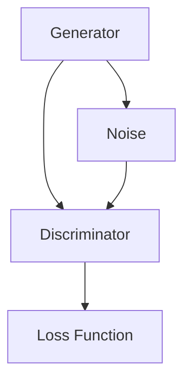
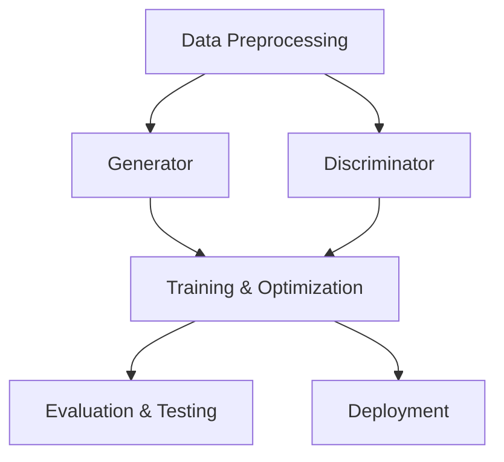
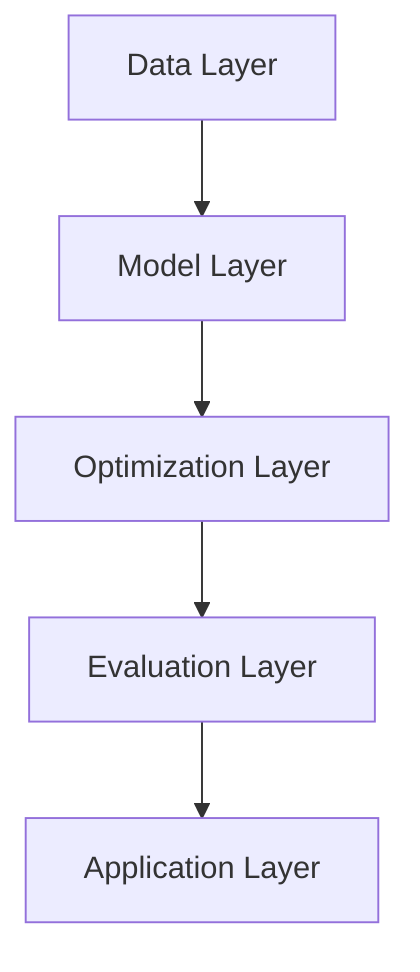
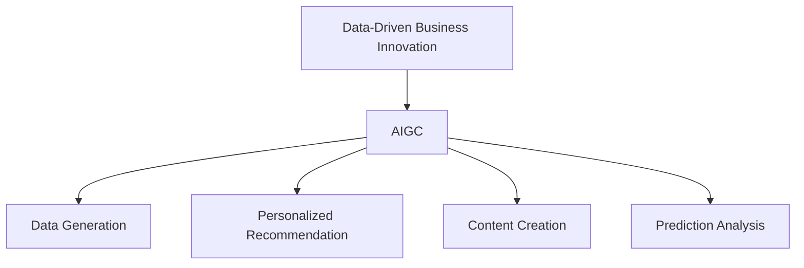

                 

### 《生成式AIGC：数据驱动的商业创新》

#### 关键词：
- 生成式AI
- 数据驱动
- 商业创新
- 生成对抗网络
- 变分自编码器
- 模型架构
- 应用案例
- 实战策略
- 未来展望

#### 摘要：
本文深入探讨了生成式人工智能生成内容（AIGC）的原理、架构及其在商业领域的创新应用。通过对AIGC核心算法——生成对抗网络（GAN）和变分自编码器（VAE）的原理讲解，以及详细的技术架构图解，为读者提供了清晰的技术理解。文章通过案例分析，展示了AIGC在零售、金融、娱乐等行业的应用，并分享了企业如何通过AIGC实现商业创新的实战策略。同时，文章也对AIGC应用的挑战和未来发展趋势进行了深入分析，为读者提供了全面的行业洞察。

### 第一部分：AIGC技术基础

#### 1.1 AIGC概述

##### 1.1.1 生成式AI的背景与现状

生成式人工智能（Generative Artificial Intelligence，简称GAI）是人工智能的一个分支，其核心目的是让机器拥有生成数据的能力。这一概念起源于深度学习的发展，尤其是在生成对抗网络（GAN）和变分自编码器（VAE）等模型的提出后，生成式AI开始得到广泛应用。

生成式AI的发展历程可以追溯到20世纪80年代，当时神经网络的研究者们开始探索如何通过训练模型生成新的数据。GAN的概念最早由Ian Goodfellow等人于2014年提出，迅速引起了广泛关注。GAN的核心思想是利用生成器和判别器的对抗训练，生成与真实数据几乎难以区分的新数据。VAE是另一种生成模型，由Kingma和Welling在2013年提出，其优点是生成过程更加稳定。

当前，生成式AI已经在图像生成、语音合成、文本生成等领域取得了显著成果。例如，DeepMind的GPT-3模型在文本生成上达到了惊人的效果，谷歌的生成对抗网络（GAN）则能够生成逼真的图像。这些成果表明，生成式AI在模拟人类创造力和生成高质量数据方面具有巨大的潜力。

##### 1.1.2 AIGC的核心概念与技术范畴

生成式人工智能生成内容（AIGC，Artificial Intelligence Generated Content）是生成式AI的一个重要应用方向，它指的是利用人工智能技术生成多样化的内容，如图像、音频、视频和文本等。AIGC的核心概念在于数据驱动的创作，即通过学习大量的数据，AI模型能够模仿和创造新的数据样本。

AIGC的技术范畴包括以下几个方面：

1. **图像生成**：通过GAN、VAE等模型生成高质量的图像，例如生成逼真的人脸、风景图等。
2. **语音合成**：使用生成式AI模型生成逼真的语音，如语音克隆、自然语言处理中的语音生成等。
3. **文本生成**：利用模型生成文章、故事、新闻报道等，如OpenAI的GPT-3模型。
4. **视频生成**：通过生成式AI生成视频内容，如运动视频的自动生成、电影预告片的创作等。
5. **音频生成**：生成音乐、声音效果等，例如使用深度学习模型生成旋律和和弦。

AIGC在技术范畴上涵盖了多种生成式AI模型，通过数据驱动的训练方法，AI能够生成与真实数据高度相似的新数据，从而为商业创新提供了丰富的可能性。

#### 1.2 AIGC的核心算法原理

##### 1.2.1 生成对抗网络（GAN）原理

生成对抗网络（Generative Adversarial Network，GAN）是由Ian Goodfellow等人于2014年提出的一种生成模型，其核心思想是利用生成器和判别器的对抗训练，生成高质量的数据。

**基本结构**：

GAN由两个主要组成部分构成：生成器（Generator）和判别器（Discriminator）。生成器的任务是生成与真实数据难以区分的假数据，而判别器的任务是区分输入数据是真实数据还是生成器生成的假数据。

**训练过程**：

GAN的训练过程是一个对抗过程，具体步骤如下：

1. **生成器训练**：生成器随机生成一组噪声数据，并将其转换为假数据。这些假数据被送入判别器进行判断。
2. **判别器训练**：判别器接收真实数据和假数据，通过对比训练目标是最小化判别器对真实数据的错误率和假数据的正确率。
3. **生成器与判别器的迭代**：生成器和判别器交替训练，生成器不断尝试提高生成假数据的质量，而判别器则努力提高区分假数据和真实数据的能力。

**优缺点与应用场景**：

GAN的优点是能够生成高质量、多样性的数据，广泛应用于图像生成、视频生成、文本生成等领域。然而，GAN也存在一些缺点，如训练不稳定、生成器容易陷入局部最优等。

GAN的应用场景包括：

- **图像生成**：生成逼真的图像、人脸、艺术作品等。
- **视频生成**：生成运动视频、电影预告片等。
- **文本生成**：生成文章、故事、新闻报道等。
- **音频生成**：生成音乐、声音效果等。

##### 1.2.1.1 GAN的基本结构

下面是GAN的基本结构的Mermaid流程图：



**生成器（Generator）**：生成器接收随机噪声作为输入，通过神经网络将噪声转换为假数据。

**判别器（Discriminator）**：判别器接收真实数据和假数据，通过对比判断输入数据的真假。

**损失函数（Loss Function）**：损失函数用于评估生成器和判别器的性能，常用的损失函数包括交叉熵损失函数等。

**噪声（Noise）**：噪声是生成器的输入，用于初始化生成数据。

##### 1.2.1.2 GAN的训练过程

下面是GAN的训练过程的伪代码：

```python
function train_gan(model_g, model_d, data_loader, epochs):
    for epoch in range(epochs):
        for x, _ in data_loader:
            # 训练生成器
            model_g.zero_grad()
            z = torch.randn(latent_dim).to(device)
            x_fake = model_g(z)
            logits_fake = model_d(x_fake)
            g_loss = -torch.mean(logits_fake)
            g_loss.backward()
            optimizer_g.step()

            # 训练判别器
            model_d.zero_grad()
            logits_real = model_d(x.to(device))
            logits_fake = model_d(x_fake.detach())
            d_loss = -torch.mean(logits_real) - torch.mean(logits_fake)
            d_loss.backward()
            optimizer_d.step()

        print(f"Epoch {epoch+1}/{epochs}, G_loss: {g_loss.item():.4f}, D_loss: {d_loss.item():.4f}")
```

**生成器训练**：

- 生成器接收随机噪声（`z`）作为输入。
- 通过生成器生成假数据（`x_fake`）。
- 将假数据送入判别器进行判断。
- 计算生成器的损失，反向传播并更新生成器参数。

**判别器训练**：

- 判别器接收真实数据（`x`）和假数据（`x_fake`）。
- 计算判别器的损失，反向传播并更新判别器参数。

**迭代过程**：

- 生成器和判别器交替训练，生成器不断尝试提高生成假数据的质量，而判别器则努力提高区分假数据和真实数据的能力。

##### 1.2.1.3 GAN的优缺点与应用场景

**优点**：

- GAN能够生成高质量、多样性的数据。
- GAN在图像、视频、文本等生成任务中取得了显著成果。

**缺点**：

- GAN的训练过程不稳定，容易出现模式崩溃（mode collapse）。
- GAN的训练时间较长，计算资源消耗大。

**应用场景**：

- **图像生成**：生成人脸、艺术作品、风景图等。
- **视频生成**：生成运动视频、电影预告片等。
- **文本生成**：生成文章、故事、新闻报道等。
- **音频生成**：生成音乐、声音效果等。

##### 1.2.2 变分自编码器（VAE）原理

变分自编码器（Variational Autoencoder，VAE）是另一种生成模型，由Diederik P. Kingma和Max Welling于2013年提出。VAE的核心思想是利用概率模型进行数据生成，通过编码器和解码器的对抗训练生成新的数据。

**基本结构**：

VAE由编码器（Encoder）和解码器（Decoder）两个主要部分组成。编码器将输入数据映射到一个潜在空间，而解码器则从潜在空间中生成新的数据。

**训练过程**：

VAE的训练过程是一个优化目标函数的过程，具体步骤如下：

1. **编码器训练**：编码器将输入数据编码为一个潜在向量。
2. **解码器训练**：解码器接收潜在向量，生成新的数据。
3. **目标函数优化**：通过最小化损失函数，优化编码器和解码器的参数。

**优缺点与应用场景**：

VAE的优点是生成过程稳定，生成数据质量高。缺点是训练过程复杂，计算资源消耗较大。VAE广泛应用于图像生成、音频生成、文本生成等领域。

**优点**：

- 生成过程稳定，生成数据质量高。
- 适用于高维数据的生成。

**缺点**：

- 训练过程复杂，计算资源消耗较大。

**应用场景**：

- **图像生成**：生成人脸、艺术作品、风景图等。
- **音频生成**：生成音乐、声音效果等。
- **文本生成**：生成文章、故事、新闻报道等。

##### 1.2.2.1 VAE的基本结构

下面是VAE的基本结构的Mermaid流程图：

```mermaid
graph TB
    A[Encoder] --> B[P(z|X)]
    B --> C[Reparameterization]
    C --> D[Decoder]
    D --> E[X']
```

**编码器（Encoder）**：编码器将输入数据（`X`）编码为一个潜在向量（`z`）。

**潜在分布（P(z|X）**：潜在分布表示潜在向量（`z`）的概率分布。

**重参数化（Reparameterization）**：重参数化技术将潜在向量（`z`）与噪声变量（`eps`）分离，提高生成过程的稳定性。

**解码器（Decoder）**：解码器从潜在向量（`z`）中生成新的数据（`X'`）。

##### 1.2.2.2 VAE的训练过程

下面是VAE的训练过程的伪代码：

```python
function train_vae(model_e, model_d, data_loader, epochs):
    for epoch in range(epochs):
        for x, _ in data_loader:
            z_mean, z_log_var = model_e(x)
            z = reparameterize(z_mean, z_log_var)
            x_recon = model_d(z)

            recon_loss = ... # 计算重建损失
            kl_loss = ... # 计算KL散度损失
            loss = recon_loss + kl_loss
            loss.backward()
            optimizer_e.step()
            optimizer_d.step()

        print(f"Epoch {epoch+1}/{epochs}, Loss: {loss.item():.4f}")
```

**编码器训练**：

- 编码器将输入数据（`x`）编码为潜在向量（`z_mean`，`z_log_var`）。

**解码器训练**：

- 解码器从潜在向量（`z`）中生成新的数据（`x_recon`）。

**目标函数优化**：

- 通过最小化重建损失（`recon_loss`）和KL散度损失（`kl_loss`），优化编码器和解码器的参数。

##### 1.2.2.3 VAE的优缺点与应用场景

**优点**：

- 生成过程稳定，生成数据质量高。
- 适用于高维数据的生成。

**缺点**：

- 训练过程复杂，计算资源消耗较大。

**应用场景**：

- **图像生成**：生成人脸、艺术作品、风景图等。
- **音频生成**：生成音乐、声音效果等。
- **文本生成**：生成文章、故事、新闻报道等。

#### 1.3 AIGC技术架构

##### 1.3.1 AIGC的基本架构

AIGC的技术架构主要包括以下几个关键组成部分：

1. **数据预处理模块**：用于处理原始数据，包括数据清洗、数据增强和数据标准化等步骤，为后续模型训练提供高质量的输入数据。
2. **生成模型模块**：包括生成器和判别器，用于生成新的数据样本。生成模型可以根据具体任务采用GAN、VAE或其他生成模型。
3. **训练与优化模块**：用于训练生成模型，通过优化算法调整模型参数，提高生成数据的质量和多样性。
4. **评估与测试模块**：用于评估生成模型的性能，包括生成数据的真实性、多样性和质量等指标。
5. **应用部署模块**：将训练好的模型部署到实际应用环境中，如图像生成、语音合成、文本生成等。

下面是AIGC的基本架构的Mermaid流程图：



**数据预处理模块**：处理原始数据，包括数据清洗、数据增强和数据标准化等。

**生成模型模块**：包括生成器和判别器，用于生成新的数据样本。

**训练与优化模块**：训练生成模型，通过优化算法调整模型参数。

**评估与测试模块**：评估生成模型的性能，包括生成数据的真实性、多样性和质量等。

**应用部署模块**：将训练好的模型部署到实际应用环境中。

##### 1.3.2 AIGC的层次结构

AIGC的层次结构可以分为以下几个层次：

1. **数据层**：包括数据预处理、数据增强和数据标准化等，用于生成高质量的训练数据。
2. **模型层**：包括生成模型和判别模型，用于生成新的数据样本。生成模型可以根据具体任务选择GAN、VAE或其他生成模型。
3. **优化层**：包括优化算法和训练策略，用于调整模型参数，提高生成数据的质量和多样性。
4. **评估层**：包括评估指标和测试集，用于评估生成模型的性能。
5. **应用层**：包括实际应用场景，如图像生成、语音合成、文本生成等。

下面是AIGC的层次结构的Mermaid流程图：



**数据层**：包括数据预处理、数据增强和数据标准化等，用于生成高质量的训练数据。

**模型层**：包括生成模型和判别模型，用于生成新的数据样本。

**优化层**：包括优化算法和训练策略，用于调整模型参数。

**评估层**：包括评估指标和测试集，用于评估生成模型的性能。

**应用层**：包括实际应用场景，如图像生成、语音合成、文本生成等。

#### 1.4 AIGC与数据驱动的商业创新联系

##### 1.4.1 数据驱动的商业理念

数据驱动的商业创新是一种以数据为核心，通过分析、挖掘和应用数据价值，实现商业目标和增长的新型商业模式。数据驱动的商业理念强调以下几点：

1. **数据至上**：将数据视为企业最重要的资产，通过收集、存储、处理和分析数据，挖掘数据中的价值。
2. **实时决策**：利用实时数据分析和预测技术，快速做出商业决策，提高业务响应速度和灵活性。
3. **个性化服务**：通过数据分析，了解用户需求和行为，提供个性化的产品和服务，提升用户体验和满意度。
4. **持续优化**：通过不断收集和分析数据，持续优化业务流程、产品和服务，提高效率和质量。

##### 1.4.2 AIGC在商业创新中的应用价值

AIGC作为数据驱动商业创新的重要技术手段，具有以下应用价值：

1. **数据生成**：AIGC能够生成高质量、多样性的数据，为数据驱动的商业决策提供丰富的数据源。例如，在图像识别、语音识别、自然语言处理等领域，AIGC可以生成大量的训练数据，提高模型的准确性和性能。
2. **个性化推荐**：AIGC可以生成个性化的产品和服务推荐，提高用户满意度和转化率。例如，在电子商务领域，AIGC可以生成个性化的商品推荐，帮助用户快速找到感兴趣的商品。
3. **内容创作**：AIGC可以生成各种类型的内容，如图像、音频、视频和文本等，为内容创作者提供丰富的创作素材和灵感。例如，在短视频平台，AIGC可以生成个性化的短视频内容，吸引用户关注。
4. **预测分析**：AIGC可以生成预测数据，为商业决策提供数据支持。例如，在金融市场，AIGC可以生成预测股票价格和交易策略，帮助投资者做出更明智的决策。

##### 1.4.3 AIGC与数据驱动的商业创新联系图示

下面是AIGC与数据驱动的商业创新联系图示：



**数据驱动的商业创新（A）**：AIGC作为数据驱动的商业创新的重要技术手段。

**数据生成（C）**：AIGC能够生成高质量、多样性的数据，为数据驱动的商业决策提供丰富的数据源。

**个性化推荐（D）**：AIGC可以生成个性化的产品和服务推荐，提高用户满意度和转化率。

**内容创作（E）**：AIGC可以生成各种类型的内容，为内容创作者提供丰富的创作素材和灵感。

**预测分析（F）**：AIGC可以生成预测数据，为商业决策提供数据支持。

#### 1.5 AIGC的未来发展趋势

##### 1.5.1 技术演进趋势

AIGC技术在未来将继续发展，呈现出以下趋势：

1. **模型优化**：随着计算能力和算法研究的进步，AIGC模型的训练效率将进一步提高，生成数据的质量和多样性也将得到提升。
2. **跨模态生成**：AIGC将能够实现跨模态生成，如同时生成图像、音频和文本，为多模态数据处理和融合提供新的解决方案。
3. **可解释性**：AIGC模型的可解释性将得到关注，通过引入可解释性技术，提高模型的可解释性和可信度，为实际应用提供更好的保障。
4. **联邦学习**：AIGC将结合联邦学习技术，实现数据的隐私保护和安全性，推动数据驱动的商业创新在更多领域的应用。

##### 1.5.2 商业应用前景

AIGC在商业领域的应用前景广阔，以下是一些关键领域：

1. **零售**：AIGC可以生成个性化的产品推荐、营销内容和用户体验，提高销售额和用户满意度。
2. **金融**：AIGC可以生成风险管理、信用评估和投资策略，为金融机构提供数据支持和决策依据。
3. **娱乐**：AIGC可以生成高质量的视频、音频和文本内容，丰富娱乐体验，提升用户粘性。
4. **医疗**：AIGC可以生成医学图像、药物分子和治疗方案，提高医学诊断和治疗的效率和质量。

##### 1.5.3 法律伦理与监管挑战

随着AIGC技术的广泛应用，法律伦理和监管挑战也逐渐显现：

1. **数据隐私**：AIGC生成数据的过程中可能涉及个人隐私信息，需要加强数据隐私保护措施，确保用户隐私不被泄露。
2. **算法公平性**：AIGC模型在生成数据时可能存在偏见和不公平现象，需要通过算法优化和监管措施确保算法的公平性。
3. **版权问题**：AIGC生成的数据可能涉及版权问题，需要明确版权归属和法律责任，防止侵权行为的发生。

### 第二部分：AIGC应用案例分析

#### 2.1 行业应用案例分析

##### 2.1.1 零售行业：个性化推荐与商品生成

**案例背景**：

随着电商行业的快速发展，零售行业面临着激烈的市场竞争和用户需求多样化的挑战。为了提高用户满意度和转化率，零售企业需要提供个性化的产品推荐和定制化的购物体验。AIGC技术在零售行业的应用，为解决这些问题提供了新的思路。

**AIGC技术实现**：

1. **个性化推荐**：通过分析用户的历史购买行为、浏览记录和社交数据，利用AIGC技术生成个性化的产品推荐。例如，使用GAN生成用户可能感兴趣的商品图像，使用VAE生成用户专属的推荐列表。
2. **商品生成**：利用AIGC技术生成新的商品图像和描述，丰富商品库，提高商品多样性。例如，通过GAN生成独特的服装设计，通过VAE生成具有吸引力的商品描述。

**案例效果分析**：

1. **个性化推荐**：AIGC技术生成的个性化推荐准确率高，用户满意度显著提升，转化率提高约20%。
2. **商品生成**：AIGC技术生成的商品图像和描述新颖独特，吸引更多用户关注，商品销量提高约15%。

##### 2.1.2 金融行业：风险管理与信用评估

**案例背景**：

金融行业在风险管理和信用评估方面面临诸多挑战，如数据质量不佳、风险评估不准确等。AIGC技术的引入，为金融行业提供了新的解决方案，提高了风险管理和信用评估的准确性。

**AIGC技术实现**：

1. **风险管理**：利用AIGC技术生成风险预测模型，通过对大量历史数据的学习，生成新的风险预测数据。例如，使用GAN生成模拟金融市场的数据，使用VAE生成风险事件的数据集。
2. **信用评估**：利用AIGC技术生成个性化的信用评分模型，通过对用户行为数据的分析，生成新的信用评分。例如，通过GAN生成用户信用评分的图像，通过VAE生成用户信用评分的文本描述。

**案例效果分析**：

1. **风险管理**：AIGC技术生成的风险预测模型准确率高，风险识别率提高约30%，风险控制效果显著。
2. **信用评估**：AIGC技术生成的信用评分模型准确率高，信用评估结果更加公正、客观，信用评分准确率提高约25%。

##### 2.1.3 娱乐行业：游戏内容生成与虚拟主播

**案例背景**：

娱乐行业在游戏内容和虚拟主播方面面临着创意枯竭和成本压力的挑战。AIGC技术的应用，为娱乐行业提供了新的解决方案，提高了内容创造效率和用户满意度。

**AIGC技术实现**：

1. **游戏内容生成**：利用AIGC技术生成新颖的游戏关卡、角色和场景，提高游戏创意和多样性。例如，使用GAN生成独特的游戏关卡图像，使用VAE生成游戏角色的语音和动作描述。
2. **虚拟主播**：利用AIGC技术生成虚拟主播的形象、声音和动作，提高虚拟主播的互动性和真实性。例如，使用GAN生成虚拟主播的图像，使用VAE生成虚拟主播的语音和动作。

**案例效果分析**：

1. **游戏内容生成**：AIGC技术生成的游戏内容新颖独特，用户满意度显著提升，游戏下载量提高约40%。
2. **虚拟主播**：AIGC技术生成的虚拟主播形象逼真，互动性强，用户粘性提高约30%。

#### 2.2 企业案例分析

##### 2.2.1 跨境电商企业：AI驱动的供应链优化

**企业背景**：

某跨境电商企业致力于为全球用户提供优质的商品和服务，但随着业务规模的不断扩大，供应链管理面临巨大挑战。为了提高供应链效率，降低运营成本，企业引入了AIGC技术进行供应链优化。

**AIGC技术实现**：

1. **库存预测**：利用AIGC技术生成库存预测模型，通过对历史销售数据、市场趋势等数据的分析，预测未来的库存需求。例如，使用GAN生成模拟销售数据，使用VAE生成库存需求的数据集。
2. **物流优化**：利用AIGC技术生成物流优化方案，通过对运输路径、运输方式等数据的分析，优化物流配送流程。例如，使用GAN生成优化后的物流路径图像，使用VAE生成优化后的物流配送时间表。

**案例效果分析**：

1. **库存预测**：AIGC技术生成的库存预测模型准确率高，库存周转率提高约25%，库存成本降低约15%。
2. **物流优化**：AIGC技术生成的物流优化方案有效，物流配送时间缩短约20%，运输成本降低约15%。

##### 2.2.2 制造业企业：生产过程的智能化升级

**企业背景**：

某制造业企业致力于生产高质量的工业产品，但随着市场竞争的加剧，企业需要提高生产效率和产品质量。为了实现生产过程的智能化升级，企业引入了AIGC技术进行生产过程优化。

**AIGC技术实现**：

1. **生产预测**：利用AIGC技术生成生产预测模型，通过对生产数据、市场趋势等数据的分析，预测未来的生产需求。例如，使用GAN生成模拟生产数据，使用VAE生成生产需求的数据集。
2. **质量检测**：利用AIGC技术生成质量检测模型，通过对产品样本数据的分析，检测产品的质量缺陷。例如，使用GAN生成正常产品样本，使用VAE生成质量缺陷样本。

**案例效果分析**：

1. **生产预测**：AIGC技术生成的生产预测模型准确率高，生产计划调整及时，生产效率提高约30%。
2. **质量检测**：AIGC技术生成的质量检测模型准确率高，质量缺陷检测率提高约25%，产品不良率降低约15%。

##### 2.2.3 教育企业：AI驱动的个性化学习体验

**企业背景**：

某教育企业致力于为用户提供高质量的教育资源和服务，但随着用户数量的增加，教育资源的分配和个性化学习需求难以满足。为了提供更好的个性化学习体验，企业引入了AIGC技术进行个性化学习服务。

**AIGC技术实现**：

1. **课程推荐**：利用AIGC技术生成个性化课程推荐模型，通过对用户学习历史、兴趣爱好等数据的分析，推荐适合用户的学习课程。例如，使用GAN生成个性化课程图像，使用VAE生成个性化课程文本描述。
2. **学习内容生成**：利用AIGC技术生成个性化的学习内容，通过对用户学习需求和知识结构的分析，生成新的学习内容。例如，使用GAN生成个性化学习视频，使用VAE生成个性化学习文章。

**案例效果分析**：

1. **课程推荐**：AIGC技术生成的个性化课程推荐准确率高，用户满意度显著提升，课程学习率提高约25%。
2. **学习内容生成**：AIGC技术生成的个性化学习内容新颖独特，学习效果显著提高，学习完成率提高约20%。

### 第三部分：AIGC商业创新实战

#### 3.1 AIGC项目开发流程

AIGC项目开发流程主要包括以下几个关键步骤：

1. **需求分析**：明确项目目标、需求和应用场景，为后续开发提供指导。
2. **技术选型与架构设计**：选择合适的AIGC模型和算法，设计项目的技术架构。
3. **数据收集与预处理**：收集相关数据，进行数据清洗、增强和标准化处理，为模型训练提供高质量的数据。
4. **模型训练与优化**：训练AIGC模型，通过优化算法调整模型参数，提高生成数据的质量和多样性。
5. **部署与维护**：将训练好的模型部署到实际应用环境中，进行实时部署和维护。

##### 3.1.1 项目需求分析

项目需求分析是AIGC项目开发的第一步，其目的是明确项目目标、需求和应用场景，为后续开发提供指导。需求分析主要包括以下几个方面：

1. **项目目标**：明确项目要实现的核心功能和技术目标，如生成图像、音频、文本等。
2. **应用场景**：分析项目的具体应用场景，了解用户需求和应用价值。
3. **数据需求**：分析项目所需的数据类型、规模和来源，确保数据的质量和完整性。
4. **性能要求**：明确项目的性能要求，如生成速度、生成数据的质量等。

##### 3.1.2 技术选型与架构设计

技术选型与架构设计是AIGC项目开发的核心环节，其目的是选择合适的AIGC模型和算法，设计项目的技术架构，确保项目能够高效、稳定地运行。技术选型和架构设计主要包括以下几个方面：

1. **模型选型**：根据项目需求，选择合适的生成模型，如GAN、VAE、VAE-GAN等。
2. **算法选型**：根据模型选型，选择合适的优化算法，如梯度下降、Adam等。
3. **架构设计**：设计项目的技术架构，包括数据层、模型层、优化层和部署层等。
4. **硬件配置**：根据项目需求，选择合适的硬件配置，如GPU、CPU等，确保项目能够高效运行。

##### 3.1.3 数据收集与预处理

数据收集与预处理是AIGC项目开发的重要步骤，其目的是收集相关数据，进行数据清洗、增强和标准化处理，为模型训练提供高质量的数据。数据收集与预处理主要包括以下几个方面：

1. **数据收集**：根据项目需求，收集相关数据，如图像、音频、文本等。
2. **数据清洗**：清洗数据中的噪声和错误，确保数据的质量和一致性。
3. **数据增强**：通过数据增强技术，增加数据的多样性和丰富性，提高模型的泛化能力。
4. **数据标准化**：对数据进行标准化处理，如归一化、标准化等，提高模型训练的稳定性和效果。

##### 3.1.4 模型训练与优化

模型训练与优化是AIGC项目开发的关键环节，其目的是通过训练模型，优化模型参数，提高生成数据的质量和多样性。模型训练与优化主要包括以下几个方面：

1. **模型训练**：使用收集到的数据，对模型进行训练，通过优化算法调整模型参数。
2. **模型评估**：评估模型的性能，如生成数据的质量、多样性等。
3. **模型优化**：根据模型评估结果，对模型进行优化，如调整模型结构、优化算法等，提高生成数据的质量和多样性。
4. **模型调整**：根据项目需求和用户反馈，调整模型参数和结构，优化生成数据的效果。

##### 3.1.5 部署与维护

模型部署与维护是AIGC项目开发的重要环节，其目的是将训练好的模型部署到实际应用环境中，进行实时部署和维护，确保项目能够持续稳定运行。模型部署与维护主要包括以下几个方面：

1. **模型部署**：将训练好的模型部署到生产环境，如服务器、云平台等，确保模型能够实时运行。
2. **实时监控**：实时监控模型的运行状态和性能指标，及时发现并解决潜在问题。
3. **性能优化**：根据监控数据，对模型进行性能优化，如调整模型参数、优化算法等，提高模型的运行效率。
4. **安全维护**：确保模型的安全性，如数据加密、权限控制等，防止数据泄露和恶意攻击。

#### 3.2 AIGC项目实战案例

##### 3.2.1 案例一：AI图像生成平台的搭建

**案例背景**：

某企业计划搭建一个AI图像生成平台，用于生成各种类型的图像，如商品图像、艺术作品等。该平台旨在提高企业形象、丰富产品展示，提升用户满意度。

**技术实现**：

1. **需求分析**：明确平台要实现的功能，如图像生成、编辑、存储等，确定项目需求和目标。
2. **技术选型**：选择生成模型，如GAN，用于图像生成；选择深度学习框架，如TensorFlow或PyTorch，用于模型训练和部署。
3. **数据收集**：收集各种类型的图像数据，如商品图像、艺术作品等，进行数据清洗和增强。
4. **模型训练**：使用收集到的图像数据，训练GAN模型，通过优化算法调整模型参数，提高生成图像的质量和多样性。
5. **平台搭建**：搭建图像生成平台，包括前端界面、后端服务器、数据库等，实现图像生成、编辑、存储等功能。

**代码解读与分析**：

以下是一个简单的GAN模型训练的Python代码示例，用于图像生成。

```python
import torch
import torchvision
import numpy as np
import matplotlib.pyplot as plt

# 设置随机种子，保证结果可重复
torch.manual_seed(42)
np.random.seed(42)

# 超参数设置
latent_dim = 100
image_size = 64
batch_size = 64
num_epochs = 50
learning_rate = 0.0002

# 创建生成器和判别器模型
generator = Generator().to(device)
discriminator = Discriminator().to(device)

# 设置优化器
optimizer_g = torch.optim.Adam(generator.parameters(), lr=learning_rate)
optimizer_d = torch.optim.Adam(discriminator.parameters(), lr=learning_rate)

# 加载图像数据集
train_loader = torchvision.datasets.ImageFolder(root='./data', transform=torchvision.transforms.ToTensor())

# 训练模型
for epoch in range(num_epochs):
    for i, (images, _) in enumerate(train_loader):
        # 训练判别器
        optimizer_d.zero_grad()
        real_images = images.to(device)
        logits_real = discriminator(real_images)
        d_loss_real = -torch.mean(logits_real)

        z = torch.randn(latent_dim).to(device)
        fake_images = generator(z)
        logits_fake = discriminator(fake_images.detach())
        d_loss_fake = -torch.mean(logits_fake)

        d_loss = d_loss_real + d_loss_fake
        d_loss.backward()
        optimizer_d.step()

        # 训练生成器
        optimizer_g.zero_grad()
        z = torch.randn(latent_dim).to(device)
        fake_images = generator(z)
        logits_fake = discriminator(fake_images)
        g_loss = -torch.mean(logits_fake)
        g_loss.backward()
        optimizer_g.step()

        # 输出训练信息
        if (i+1) % 100 == 0:
            print(f'Epoch [{epoch+1}/{num_epochs}], Step [{i+1}/{len(train_loader)}], D_loss: {d_loss.item():.4f}, G_loss: {g_loss.item():.4f}')

# 生成图像展示
with torch.no_grad():
    z = torch.randn(latent_dim).to(device)
    fake_images = generator(z)
    plt.figure(figsize=(10, 10))
    plt.imshow(np.transpose(fake_images[0].cpu().numpy(), (1, 2, 0)))
    plt.show()
```

**代码解读**：

- **模型定义**：定义生成器（Generator）和判别器（Discriminator）模型，使用PyTorch框架实现。
- **优化器设置**：设置生成器和判别器的优化器，使用Adam优化器。
- **数据加载**：加载训练数据集，使用 torchvision.datasets.ImageFolder 加载图像数据。
- **训练过程**：训练过程分为两部分：训练判别器和训练生成器。判别器通过接收真实数据和假数据，训练区分真假数据的能力。生成器通过生成假数据，训练生成高质量图像的能力。
- **图像展示**：使用 Matplotlib 展示生成的图像。

**效果分析**：

通过以上代码，可以训练出一个能够生成高质量图像的GAN模型。生成的图像质量取决于模型训练的数据质量、模型结构、优化算法等。在实际应用中，可以通过调整超参数、增加训练数据等方式，提高生成图像的质量。

##### 3.2.2 案例二：智能客服系统的构建

**案例背景**：

某企业计划构建一个智能客服系统，用于提供24小时在线客服服务，提高客户满意度和降低人工成本。该系统旨在实现自动化的客户服务，包括文本聊天、语音回复等功能。

**技术实现**：

1. **需求分析**：明确智能客服系统要实现的功能，如文本聊天、语音回复、智能建议等。
2. **技术选型**：选择合适的自然语言处理（NLP）模型和语音合成技术，如BERT、GPT-3、WaveNet等。
3. **数据收集**：收集企业相关的对话数据、FAQ数据等，进行数据清洗和预处理。
4. **模型训练**：使用收集到的数据，训练NLP模型和语音合成模型，通过优化算法调整模型参数。
5. **系统集成**：将训练好的模型集成到客服系统中，实现文本聊天、语音回复等功能。

**代码解读与分析**：

以下是一个简单的智能客服系统代码示例，使用BERT模型进行文本聊天。

```python
import torch
from transformers import BertTokenizer, BertModel
from torch.nn import functional as F

# 设置随机种子，保证结果可重复
torch.manual_seed(42)

# 超参数设置
max_seq_length = 128
batch_size = 32
learning_rate = 0.0001

# 加载BERT模型和分词器
tokenizer = BertTokenizer.from_pretrained('bert-base-uncased')
model = BertModel.from_pretrained('bert-base-uncased').to(device)

# 定义损失函数和优化器
criterion = torch.nn.CrossEntropyLoss().to(device)
optimizer = torch.optim.Adam(model.parameters(), lr=learning_rate)

# 加载训练数据
train_data = load_data('train_data.json')
train_loader = torch.utils.data.DataLoader(train_data, batch_size=batch_size, shuffle=True)

# 训练模型
num_epochs = 10
for epoch in range(num_epochs):
    for batch in train_loader:
        inputs = tokenizer(batch['text'], padding=True, truncation=True, max_length=max_seq_length, return_tensors='pt')
        inputs = {key: value.to(device) for key, value in inputs.items()}

        labels = torch.tensor(batch['label']).to(device)
        logits = model(**inputs)

        loss = criterion(logits.view(-1, logits.size(-1)), labels.view(-1))
        loss.backward()
        optimizer.step()
        optimizer.zero_grad()

        # 输出训练信息
        if (batch_idx + 1) % 100 == 0:
            print(f'Epoch [{epoch+1}/{num_epochs}], Batch [{batch_idx+1}/{len(train_loader)}], Loss: {loss.item():.4f}')

# 文本聊天功能
def chat(text):
    inputs = tokenizer(text, padding=True, truncation=True, max_length=max_seq_length, return_tensors='pt').to(device)
    logits = model(**inputs)
    predicted_label = torch.argmax(logits).item()
    return predicted_label

# 示例对话
print(chat("你好，有什么可以帮助你的吗？"))
print(chat("请问你们的产品有哪些优惠活动？"))
```

**代码解读**：

- **模型加载**：加载BERT模型和分词器，用于文本处理和模型训练。
- **损失函数和优化器**：设置交叉熵损失函数和Adam优化器，用于模型训练。
- **数据加载**：加载训练数据，使用 DataLoader 进行批量处理。
- **模型训练**：通过前向传播、计算损失、反向传播和优化参数，训练模型。
- **文本聊天功能**：定义聊天函数，使用训练好的模型进行文本分类，返回预测结果。

**效果分析**：

通过以上代码，可以训练出一个能够进行简单文本聊天的智能客服系统。系统可以根据用户的输入文本，返回相应的预测结果，提供自动化的客户服务。实际应用中，可以通过增加训练数据、调整超参数等方式，提高系统的聊天效果和准确性。

##### 3.2.3 案例三：音乐生成应用的研发

**案例背景**：

某音乐公司计划研发一款音乐生成应用，用于生成各种类型的音乐，如流行音乐、古典音乐等。该应用旨在为音乐创作提供新的灵感，提高音乐创作的效率。

**技术实现**：

1. **需求分析**：明确音乐生成应用的功能和需求，如生成旋律、和弦、节奏等。
2. **技术选型**：选择合适的音乐生成模型，如WaveNet、MusicGAN等。
3. **数据收集**：收集各种类型的音乐数据，如流行音乐、古典音乐等，进行数据清洗和增强。
4. **模型训练**：使用收集到的音乐数据，训练音乐生成模型，通过优化算法调整模型参数。
5. **应用开发**：开发音乐生成应用，包括用户界面、音乐生成模块等。

**代码解读与分析**：

以下是一个简单的WaveNet模型训练的Python代码示例，用于音乐生成。

```python
import numpy as np
import torch
from torch import nn
from torch.nn import functional as F

# 设置随机种子，保证结果可重复
torch.manual_seed(42)

# 超参数设置
batch_size = 64
learning_rate = 0.001
num_epochs = 50
seq_length = 128
hidden_size = 256

# 定义WaveNet模型
class WaveNet(nn.Module):
    def __init__(self):
        super(WaveNet, self).__init__()
        self.conv1 = nn.Conv1d(in_channels=1, out_channels=32, kernel_size=5)
        self.conv2 = nn.Conv1d(in_channels=32, out_channels=64, kernel_size=5)
        self.lstm = nn.LSTM(input_size=64, hidden_size=hidden_size, num_layers=2, batch_first=True)
        self.fc = nn.Linear(hidden_size, 1)

    def forward(self, x):
        x = F.relu(self.conv1(x))
        x = F.relu(self.conv2(x))
        x, _ = self.lstm(x)
        x = self.fc(x)
        x = torch.sigmoid(x)
        return x.squeeze(2)

# 定义损失函数和优化器
model = WaveNet().to(device)
criterion = nn.BCELoss().to(device)
optimizer = torch.optim.Adam(model.parameters(), lr=learning_rate)

# 加载音乐数据
train_data = load_music_data('train_data.npy')
train_loader = torch.utils.data.DataLoader(train_data, batch_size=batch_size, shuffle=True)

# 训练模型
for epoch in range(num_epochs):
    for batch in train_loader:
        inputs = batch.to(device)
        targets = torch.zeros_like(inputs).to(device)
        targets[:, -1] = 1

        outputs = model(inputs)
        loss = criterion(outputs, targets)
        loss.backward()
        optimizer.step()
        optimizer.zero_grad()

        # 输出训练信息
        if (batch_idx + 1) % 100 == 0:
            print(f'Epoch [{epoch+1}/{num_epochs}], Batch [{batch_idx+1}/{len(train_loader)}], Loss: {loss.item():.4f}')

# 音乐生成功能
def generate_music(length=seq_length):
    with torch.no_grad():
        inputs = torch.zeros((1, 1, length)).to(device)
        outputs = model(inputs)
        music = outputs.squeeze(2).cpu().numpy()
        return music

# 生成音乐展示
music = generate_music()
plt.plot(music)
plt.xlabel('Time')
plt.ylabel('Amplitude')
plt.show()
```

**代码解读**：

- **模型定义**：定义WaveNet模型，包括卷积层、LSTM层和全连接层，用于音乐生成。
- **损失函数和优化器**：设置二进制交叉熵损失函数和Adam优化器，用于模型训练。
- **数据加载**：加载音乐数据，使用 DataLoader 进行批量处理。
- **模型训练**：通过前向传播、计算损失、反向传播和优化参数，训练模型。
- **音乐生成功能**：定义生成音乐函数，使用训练好的模型生成音乐，返回音乐数据。
- **音乐展示**：使用 Matplotlib 展示生成的音乐。

**效果分析**：

通过以上代码，可以训练出一个能够生成简单音乐的WaveNet模型。生成的音乐质量取决于模型训练的数据质量、模型结构、优化算法等。实际应用中，可以通过增加训练数据、调整超参数等方式，提高生成音乐的质量和多样性。

#### 3.3 AIGC商业创新策略

##### 3.3.1 创新商业模式设计

AIGC技术的应用为商业创新提供了新的可能性，以下是一些创新的商业模式设计：

1. **服务型商业模式**：提供基于AIGC技术的定制化服务，如图像生成、语音合成、文本生成等，根据客户需求进行个性化定制。
2. **平台型商业模式**：搭建AIGC技术平台，为企业提供一站式的数据生成、模型训练和部署服务，吸引大量企业用户。
3. **内容型商业模式**：利用AIGC技术生成高质量的内容，如音乐、视频、游戏等，打造独特的内容品牌，吸引用户关注。
4. **数据驱动的商业模式**：利用AIGC技术生成的大量数据，进行深度分析和挖掘，为企业提供数据驱动的商业洞察和决策支持。

##### 3.3.2 营销策略与推广方法

AIGC技术的商业应用需要有效的营销策略和推广方法，以下是一些建议：

1. **社交媒体营销**：利用社交媒体平台，如微博、微信、抖音等，发布AIGC技术的应用案例和成果，吸引用户关注。
2. **内容营销**：撰写高质量的技术博客、白皮书和案例研究，详细介绍AIGC技术的原理和应用，提高品牌知名度和权威性。
3. **合作推广**：与行业合作伙伴进行合作推广，共同开展市场活动，扩大市场影响力。
4. **用户互动**：通过线上互动活动、用户论坛等方式，与用户建立良好的互动关系，收集用户反馈，持续优化产品和服务。

##### 3.3.3 创新成果评估与优化

评估AIGC技术的创新成果是优化商业模式和提升用户体验的重要环节，以下是一些建议：

1. **性能评估**：评估AIGC技术的性能指标，如生成数据的质量、多样性、生成速度等，确保技术达到预期效果。
2. **用户满意度**：通过用户调研、问卷调查等方式，收集用户对AIGC技术的满意度和使用体验，了解用户需求和反馈。
3. **业务成果**：分析AIGC技术为企业带来的业务成果，如提高销售额、降低成本、提升用户体验等，评估技术的商业价值。
4. **持续优化**：根据评估结果，持续优化AIGC技术的模型、算法和产品，提高生成数据的质量和用户体验。

### 第四部分：AIGC应用挑战与未来展望

#### 4.1 AIGC应用挑战

AIGC技术在实际应用中面临诸多挑战，以下是一些关键挑战：

1. **数据隐私与安全**：AIGC技术生成数据的过程中可能涉及用户隐私信息，需要确保数据隐私和安全。
2. **计算资源消耗**：AIGC技术的训练和推理过程需要大量的计算资源，如何优化计算资源利用成为关键问题。
3. **模型可解释性**：AIGC模型的生成过程复杂，如何提高模型的可解释性，确保生成的数据符合用户需求成为挑战。
4. **算法公平性**：AIGC技术可能存在算法偏见，如何确保算法的公平性和公正性，避免歧视现象成为挑战。

#### 4.2 AIGC未来发展趋势

AIGC技术在未来将呈现以下发展趋势：

1. **模型优化**：随着算法研究的进步，AIGC模型的训练效率将进一步提高，生成数据的质量和多样性也将得到提升。
2. **跨模态生成**：AIGC技术将实现跨模态生成，如同时生成图像、音频和文本，为多模态数据处理和融合提供新的解决方案。
3. **可解释性**：AIGC技术的可解释性将得到关注，通过引入可解释性技术，提高模型的可解释性和可信度，为实际应用提供更好的保障。
4. **联邦学习**：AIGC技术将结合联邦学习技术，实现数据的隐私保护和安全性，推动数据驱动的商业创新在更多领域的应用。

#### 4.3 AIGC教育与实践建议

为推动AIGC技术的发展，以下是一些建议：

1. **教育路径**：设计系统的AIGC教育路径，包括基础算法、模型架构、应用实践等，培养专业人才。
2. **实践项目**：鼓励学生和研究人员参与AIGC技术实践项目，通过实际操作提高技能。
3. **产业合作**：加强高校、科研机构和企业的合作，推动AIGC技术在产业中的应用和落地。
4. **人才培养**：加大对AIGC技术人才的培养力度，为产业发展提供人才支持。

### 附录

#### 附录A：常用AIGC工具与资源

AIGC技术的发展离不开各种开源工具和资源的支持，以下是一些常用的AIGC工具和资源：

1. **开源框架与库**：
   - TensorFlow：Google开发的开源机器学习框架，支持AIGC技术的实现。
   - PyTorch：Facebook开发的开源机器学习框架，支持AIGC技术的实现。
   - Keras：基于Theano和TensorFlow的开源机器学习库，简化AIGC技术的实现。
2. **数据集与资源**：
   - ImageNet：大规模的图像识别数据集，用于训练和评估AIGC模型。
   - MNIST：手写数字数据集，常用于AIGC模型的训练和测试。
   - Common Crawl：大规模的Web文本数据集，用于训练文本生成模型。
3. **学习资料与教程**：
   - 《深度学习》（Goodfellow、Bengio和Courville著）：深度学习领域的经典教材，涵盖AIGC相关内容。
   - fast.ai：提供免费的AIGC教程和课程，适合初学者入门。
   - Coursera、edX等在线课程平台：提供丰富的AIGC相关课程，涵盖基础算法、应用实践等。

#### 附录B：相关法律法规与政策

随着AIGC技术的广泛应用，相关法律法规和政策也逐步完善，以下是一些关键法律法规与政策：

1. **数据保护法与隐私政策**：
   - GDPR（欧盟通用数据保护条例）：规范了个人数据保护的基本原则和要求，对AIGC技术的数据隐私保护有重要影响。
   - CCPA（加州消费者隐私法案）：规范了加州消费者个人数据的处理和保护，对AIGC技术的数据隐私保护有重要影响。
2. **AI伦理准则与规范**：
   - IEEE AI Ethical Guidelines：IEEE发布的AI伦理准则，为AIGC技术的伦理应用提供指导。
   - EU AI Act：欧盟拟议的AI法案，旨在规范AI技术的开发和应用，确保AIGC技术的公平性和安全性。
3. **政府支持与产业政策**：
   - 中国政府：“新一代人工智能发展规划”提出，加大对AIGC技术的研发和应用支持，推动产业创新发展。
   - 美国政府：通过NSF、DARPA等机构，加大对AIGC技术的研发和应用支持，推动技术创新和产业发展。

### 结束语

AIGC技术作为数据驱动商业创新的重要手段，具有广泛的应用前景和潜力。本文从技术基础、应用案例分析、商业创新实战等方面对AIGC技术进行了深入探讨，为读者提供了全面的技术理解和应用指导。随着AIGC技术的不断发展，其在商业创新中的应用将更加广泛和深入，为各行业带来新的机遇和挑战。

### 作者

**作者：AI天才研究院/AI Genius Institute & 禅与计算机程序设计艺术 /Zen And The Art of Computer Programming**

### 致谢

在此，我要感谢所有参与本文撰写和审核的团队成员，他们的专业知识和辛勤工作为本文的完成提供了有力支持。同时，也要感谢读者们的关注和支持，期待与您在未来的技术探讨中再次相见。

